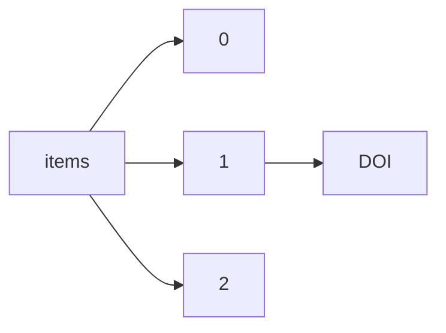

!!! warning "This document is not official Crossref documentation"
# DOI
PATH = items/array/DOI(1)  
Occurs 143 500 239 times  
Unique values: > 999  
{ .annotate }

1. A route to an element, for example:  
   The route "items/array/DOI" corresponds to navigating through the JSON indices as  
   ["items"][0]["DOI"]  

!!! note "Due to current limitations, only the first 1,000 unique values are counted."

| **Row** | **Value** `String`                              | **Count** `Int64` |
|--------:|---------------------------------------------------:|---------------------:|
| **1**   | 10.7748/cnp.1.9.4.s2                               | 1                    |
| **2**   | 10.1016/0022-328x(89)85025-9                       | 1                    |
| **3**   | 10.1155/2018/7652359                               | 1                    |
| **4**   | 10.22323/1.007.0075                                | 1                    |
| **5**   | 10.14738/assrj.410.3172                            | 1                    |
| **6**   | 10.1007/978-94-6300-717-7\_12                      | 1                    |
| **7**   | 10.4271/2018-01-1017                               | 1                    |
| **8**   | 10.1093/benz/9780199773787.article.b00129133       | 1                    |
| **9**   | 10.1016/j.electacta.2018.03.030                    | 1                    |
| **10**  | 10.1016/j.annepidem.2018.03.014                    | 1                    |
| **11**  | 10.37307/b.978-3-503-13056-6                       | 1                    |
| **12**  | 10.2210/pdb5o5w/pdb                                | 1                    |
| **13**  | 10.1117/12.2284333                                 | 1                    |
| **14**  | 10.47939/mh.v3i6(09).04                            | 1                    |
| **15**  | 10.1016/j.jsr.2016.12.007                          | 1                    |
| **16**  | 10.17104/9783406718823-88                          | 1                    |
| **17**  | 10.1002/hec.3580                                   | 1                    |
| **18**  | 10.1201/9781482286496                              | 1                    |
| **19**  | 10.1163/9789004350908\_002                         | 1                    |
| **20**  | 10.4271/2017-01-1612                               | 1                    |
| **21**  | 10.1016/0168-1656(95)00057-w                       | 1                    |
| **22**  | 10.2307/j.ctt1xp3v27.25                            | 1                    |
| **23**  | 10.47402/ed.ep.c202215937495                       | 1                    |
| **24**  | 10.5030/jcigsjournal.30.23                         | 1                    |
| **25**  | 10.3030/691911                                     | 1                    |
| **26**  | 10.1353/swh.2017.0054                              | 1                    |
| **27**  | 10.1097/hjh.0000000000001364                       | 1                    |
| **28**  | 10.1016/s0021-9673(00)96228-9                      | 1                    |
| **29**  | 10.3892/ol.2018.8615                               | 1                    |
| **30**  | 10.1299/jsmedmc.2006.\_306-1\_                     | 1                    |
| **31**  | 10.1093/ptj/71.9.650                               | 1                    |
| **32**  | 10.1007/s10957-017-1092-5                          | 1                    |
| **33**  | 10.4064/sm8782-4-2017                              | 1                    |
| **34**  | 10.1016/0921-4534(96)00406-6                       | 1                    |
| **35**  | 10.1163/2214-8264\_dutchpamphlets-kb2-kb26619      | 1                    |
| **36**  | 10.17364/iib.2017.2.0003                           | 1                    |
| **37**  | 10.1515/9783035612387-010                          | 1                    |
| **38**  | 10.2307/j.ctt1fq9wc5.13                            | 1                    |
| **39**  | 10.1002/mgr.30493                                  | 1                    |
| **40**  | 10.7554/elife.17063.003                            | 1                    |
| **41**  | 10.25148/etd.fi15032182                            | 1                    |
| **42**  | 10.1603/ice.2016.90052                             | 1                    |
| **43**  | 10.7554/elife.21166.010                            | 1                    |
| **44**  | 10.1101/253278                                     | 1                    |
| **45**  | 10.1002/9781118783764.wbieme0043                   | 1                    |
| **46**  | 10.1016/s0002-9378(16)34700-7                      | 1                    |
| **47**  | 10.2991/msetasse-16.2016.125                       | 1                    |
| **48**  | 10.3726/978-3-0353-0119-9/1                        | 1                    |
| **49**  | 10.1007/s11062-018-9699-1                          | 1                    |
| **50**  | 10.2307/j.ctt9qh55v.4                              | 1                    |
| **51**  | 10.1016/s0303-8467(97)82389-x                      | 1                    |
| **52**  | 10.1136/vr.k523                                    | 1                    |
| **53**  | 10.1088/1748-0221/13/02/p02027                     | 1                    |
| **54**  | 10.1080/09751122.2014.11890130                     | 1                    |
| **55**  | 10.1016/s0168-1656(99)00118-2                      | 1                    |
| **56**  | 10.1163/2214-8264\_dutchpamphlets-kb0-kb06450      | 1                    |
| **57**  | 10.3726/978-3-653-04558-1/11                       | 1                    |
| **58**  | 10.5432/jjpehss.kj00003401454                      | 1                    |
| **59**  | 10.1002/jlb.60.4.509                               | 1                    |
| **60**  | 10.1177/875687058700800107                         | 1                    |
| **61**  | 10.1017/s1049023x00033094                          | 1                    |
| **62**  | 10.1038/s41598-022-25563-x                         | 1                    |
| **63**  | 10.1093/ww/9780199540884.013.14935                 | 1                    |
| **64**  | 10.1371/journal.pone.0181032.t003                  | 1                    |
| **65**  | 10.1167/16.12.73                                   | 1                    |
| **66**  | 10.2307/j.ctt32b0c5.48                             | 1                    |
| **67**  | 10.1016/s0967-0661(17)30166-1                      | 1                    |
| **68**  | 10.1177/0075424216655846                           | 1                    |
| **69**  | 10.1145/3140241.3140242                            | 1                    |
| **70**  | 10.1017/s0307472200001516                          | 1                    |
| **71**  | 10.1088/1361-6587/aa5f70                           | 1                    |
| **72**  | 10.1016/b978-0-12-802041-8.05001-x                 | 1                    |
| **73**  | 10.9717/kmms.2016.19.12.1970                       | 1                    |
| **74**  | 10.1016/s0022-328x(00)87277-0                      | 1                    |
| **75**  | 10.1002/9781119422044.ch5                          | 1                    |
| **76**  | 10.1021/acsnano.7b06296                            | 1                    |
| **77**  | 10.1017/s0020782900030382                          | 1                    |
| **78**  | 10.47939/mh.v3i6(07).26                            | 1                    |
| **79**  | 10.1016/j.cirp.2018.04.101                         | 1                    |
| **80**  | 10.1515/physiko.15.316                             | 1                    |
| **81**  | 10.1016/j.ssc.2016.10.001                          | 1                    |
| **82**  | 10.5432/jjpehss.kj00003395595                      | 1                    |
| **83**  | 10.1039/c7ob00991g                                 | 1                    |
| **84**  | 10.1215/9780822372141-007                          | 1                    |
| **85**  | 10.17512/ios.2017.3.7                              | 1                    |
| **86**  | 10.1016/j.jval.2017.08.988                         | 1                    |
| **87**  | 10.1093/biolreprod/78.s1.155a                      | 1                    |
| **88**  | 10.1158/0008-5472.22381508                         | 1                    |
| **89**  | 10.1111/dome.12128                                 | 1                    |
| **90**  | 10.1007/978-3-319-34045-6\_5                       | 1                    |
| **91**  | 10.4064/ap-13-1-105-112                            | 1                    |
| **92**  | 10.2307/j.ctt6wrdsf.7                              | 1                    |
| **93**  | 10.2351/1.5012507                                  | 1                    |
| **94**  | 10.1002/9781119337256.ch2                          | 1                    |
| **95**  | 10.2208/journalip.26.93                            | 1                    |
| **96**  | 10.1093/ww/9780199540884.013.u19763                | 1                    |
| **97**  | 10.1177/0734282917735151                           | 1                    |
| **98**  | 10.1021/acs.analchem.7b02321                       | 1                    |
| **99**  | 10.1177/0032258x8605900211                         | 1                    |
| **100** | 10.1163/2468-1733\_shafr\_sim130080014             | 1                    |
| **101** | 10.1080/14772019.2017.1393469                      | 1                    |
| **102** | 10.1093/ww/9780199540884.013.u162424               | 1                    |
| **103** | 10.1299/jsmemagazine.34.167\_601\_2                | 1                    |
| **104** | 10.1016/j.vetmic.2018.06.015                       | 1                    |
| **105** | 10.5104/jiep.20.i31                                | 1                    |
| **106** | 10.5980/jpnjurol.102.132                           | 1                    |
| **107** | 10.1080/01932691.2016.1237366                      | 1                    |
| **108** | 10.1136/jnnp-2016-315106.169                       | 1                    |
| **109** | 10.1080/09672567.2017.1415947                      | 1                    |
| **110** | 10.1093/jn/133.8.2622                              | 1                    |
| **111** | 10.1299/jsmemag.106.1017\_586\_1                   | 1                    |
| **112** | 10.1371/journal.pone.0158863.s002                  | 1                    |
| **113** | 10.1051/epjconf/201817509005                       | 1                    |
| **114** | 10.1080/13549839.2017.1317726                      | 1                    |
| **115** | 10.3897/zookeys.636.10103                          | 1                    |
| **116** | 10.1016/j.jinsphys.2018.03.003                     | 1                    |
| **117** | 10.1093/odnb/9780192683120.013.17928               | 1                    |
| **118** | 10.9734/jpri/2017/23253                            | 1                    |
| **119** | 10.2305/iucn.uk.2016-3.rlts.t22710783a94260363.en  | 1                    |
| **120** | 10.1080/17400201.2017.1291417                      | 1                    |
| **121** | 10.1007/s10620-018-4958-y                          | 1                    |
| **122** | 10.1093/nq/s2-viii.185.57b                         | 1                    |
| **123** | 10.1177/112067219800800314                         | 1                    |
| **124** | 10.1371/journal.pone.0278445.g002                  | 1                    |
| **125** | 10.1111/jir.12474                                  | 1                    |
| **126** | 10.1371/journal.pgen.1007033.s007                  | 1                    |
| **127** | 10.2139/ssrn.2866852                               | 1                    |
| **128** | 10.1038/s41598-017-07216-6                         | 1                    |
| **129** | 10.1139/cjpp-2016-0597                             | 1                    |
| **130** | 10.1038/s41598-018-24550-5                         | 1                    |
| **131** | 10.1134/s0374064117030104                          | 1                    |
| **132** | 10.1007/978-3-319-51759-9\_11                      | 1                    |
| **133** | 10.26693/jmbs03.04.174                             | 1                    |
| **134** | 10.1371/journal.pone.0171763.s008                  | 1                    |
| **135** | 10.1016/s0090-4295(99)80139-3                      | 1                    |
| **136** | 10.5551/jat1973.9.2\_233                           | 1                    |
| **137** | 10.1016/s0143-974x(98)00087-x                      | 1                    |
| **138** | 10.1093/oxfordjournals.aob.a087705                 | 1                    |
| **139** | 10.1515/9781400853526-003                          | 1                    |
| **140** | 10.1007/bf03397140                                 | 1                    |
| **141** | 10.17104/1863-8937-2017-1-4                        | 1                    |
| **142** | 10.1016/0022-1694(95)02939-7                       | 1                    |
| **143** | 10.1080/08956308.2005.11657326                     | 1                    |
| **144** | 10.1016/s0031-9422(98)00433-6                      | 1                    |
| **145** | 10.1116/6.0002203                                  | 1                    |
| **146** | 10.25276/0235-4160-2017-2-73-77                    | 1                    |
| **147** | 10.1007/s11356-016-7044-z                          | 1                    |
| **148** | 10.1016/s0168-8278(16)00912-0                      | 1                    |
| **149** | 10.1108/hff-12-2015-0516                           | 1                    |
| **150** | 10.29340/37.295                                    | 1                    |
| **151** | 10.1159/000469591                                  | 1                    |
| **152** | 10.3233/bmr-1999-13105                             | 1                    |
| **153** | 10.5742/mewfm.2017.93155                           | 1                    |
| **154** | 10.1093/nq/s13-i.24.467a                           | 1                    |
| **155** | 10.1002/chin.201630269                             | 1                    |
| **156** | 10.5628/rpcd.16.s1.42                              | 1                    |
| **157** | 10.2307/j.ctt1bj4rjc.2                             | 1                    |
| **158** | 10.1055/s-0037-1608123                             | 1                    |
| **159** | 10.1016/s0022-5347(17)69236-x                      | 1                    |
| **160** | 10.6009/jjrt.kj00003576125                         | 1                    |
| **161** | 10.1007/978-3-658-03683-6\_3                       | 1                    |
| **162** | 10.1039/c7cy00430c                                 | 1                    |
| **163** | 10.4213/mzm11732                                   | 1                    |
| **164** | 10.1177/001258060312142202                         | 1                    |
| **165** | 10.4172/2161-1165.1000250                          | 1                    |
| **166** | 10.18066/revistaunivap.v22i40.1236                 | 1                    |
| **167** | 10.1016/s0385-8146(01)00081-5                      | 1                    |
| **168** | 10.15537/smj.2018.3.21566                          | 1                    |
| **169** | 10.1002/9781119076506.wbeps293                     | 1                    |
| **170** | 10.1299/jsmehs.2003.40.173                         | 1                    |
| **171** | 10.1002/14651858.cd012492.pub2                     | 1                    |
| **172** | 10.1016/0016-5085(89)91565-5                       | 1                    |
| **173** | 10.48153/jrrs/2016/qxdu7647                        | 1                    |
| **174** | 10.7868/s0869565216350176                          | 1                    |
| **175** | 10.1055/s-002-16989                                | 1                    |
| **176** | 10.1093/nq/s7-vi.146.291f                          | 1                    |
| **177** | 10.1093/nq/s12-xii.255.180f                        | 1                    |
| **178** | 10.3389/fgene.2018.00032.s003                      | 1                    |
| **179** | 10.7202/1043819ar                                  | 1                    |
| **180** | 10.1093/odnb/9780192683120.013.29701               | 1                    |
| **181** | 10.1016/s0044-8486(00)00306-9                      | 1                    |
| **182** | 10.1007/s11277-017-5226-8                          | 1                    |
| **183** | 10.1515/9783110853209-023                          | 1                    |
| **184** | 10.9774/gleaf.9781351270045\_6                     | 1                    |
| **185** | 10.1007/978-3-319-76720-8\_9                       | 1                    |
| **186** | 10.1093/oxfordjournals.aob.a087672                 | 1                    |
| **187** | 10.1080/15569543.2016.1201513                      | 1                    |
| **188** | 10.1016/j.techfore.2017.01.023                     | 1                    |
| **189** | 10.1002/aelm.201700636                             | 1                    |
| **190** | 10.1016/j.admp.2018.03.388                         | 1                    |
| **191** | 10.1007/978-981-10-8788-2\_30                      | 1                    |
| **192** | 10.23861/ejbm20072366                              | 1                    |
| **193** | 10.1163/9789042029545\_004                         | 1                    |
| **194** | 10.5334/baw.10                                     | 1                    |
| **195** | 10.14738/assrj.311.2347                            | 1                    |
| **196** | 10.2307/43626670                                   | 1                    |
| **197** | 10.1016/b978-1-78548-091-1.50011-7                 | 1                    |
| **198** | 10.1016/j.matlet.2016.06.046                       | 1                    |
| **199** | 10.3726/978-3-0353-0446-6/12                       | 1                    |
| **200** | 10.1177/0739456x18773424                           | 1                    |
| **201** | 10.11606/d.6.2017.tde-08092017-092841              | 1                    |
| **202** | 10.29043/liminar.v14i1.430                         | 1                    |
| **203** | 10.25118/2236-918x-5-6-4                           | 1                    |
| **204** | 10.1093/nq/158.20.356b                             | 1                    |
| **205** | 10.1016/s1350-4789(01)80047-7                      | 1                    |
| **206** | 10.1371/journal.pone.0283291.t004                  | 1                    |
| **207** | 10.12968/vetn.2018.9.1.42                          | 1                    |
| **208** | 10.9734/jalsi/2017/37258                           | 1                    |
| **209** | 10.1136/neurintsurg-2017-snis.98                   | 1                    |
| **210** | 10.1007/s10858-016-0057-6                          | 1                    |
| **211** | 10.1177/0022034592071s101                          | 1                    |
| **212** | 10.2305/iucn.uk.2017-3.rlts.t152897a121493632.en   | 1                    |
| **213** | 10.7554/elife.21543.001                            | 1                    |
| **214** | 10.1007/978-3-658-14307-7\_47                      | 1                    |
| **215** | 10.1002/da.v25:5                                   | 1                    |
| **216** | 10.25273/gulawentah.v2i1.1355                      | 1                    |
| **217** | 10.2166/wp.2003.0018                               | 1                    |
| **218** | 10.4028/www.scientific.net/msf.871                 | 1                    |
| **219** | 10.1515/9783110526653-015                          | 1                    |
| **220** | 10.1097/iae.0000000000001950                       | 1                    |
| **221** | 10.1016/s0029-7844(01)01773-2                      | 1                    |
| **222** | 10.1016/j.protis.2018.02.004                       | 1                    |
| **223** | 10.1186/s13705-017-0132-1                          | 1                    |
| **224** | 10.1111/apv.12161                                  | 1                    |
| **225** | 10.21203/rs.3.rs-2366743/v1                        | 1                    |
| **226** | 10.1007/s10993-017-9446-2                          | 1                    |
| **227** | 10.7788/9783412506698-009                          | 1                    |
| **228** | 10.9785/mdtr-2017-0324                             | 1                    |
| **229** | 10.1603/ice.2016.115019                            | 1                    |
| **230** | 10.1787/qna-v2016-3-table133-fr                    | 1                    |
| **231** | 10.1007/978-3-531-18950-5\_1                       | 1                    |
| **232** | 10.15405/epsbs.2016.09.7                           | 1                    |
| **233** | 10.1016/j.devcel.2018.01.005                       | 1                    |
| **234** | 10.1107/s2414314616019465/is4013isup4.cml          | 1                    |
| **235** | 10.1152/jappl.1986.61.1.389-s                      | 1                    |
| **236** | 10.1105/tpc.9.2.199                                | 1                    |
| **237** | 10.13005/ojc/330560                                | 1                    |
| **238** | 10.1016/0031-9422(73)80421-2                       | 1                    |
| **239** | 10.3410/f.725418065.793532285                      | 1                    |
| **240** | 10.3390/f9040166                                   | 1                    |
| **241** | 10.3847/1538-4357/aa7da2                           | 1                    |
| **242** | 10.1299/jsmemag.83.739\_737\_1                     | 1                    |
| **243** | 10.12737/article\_59240612b1a000.16568704          | 1                    |
| **244** | 10.1007/978-981-10-4154-9\_47                      | 1                    |
| **245** | 10.3390/cli6020044                                 | 1                    |
| **246** | 10.1093/benz/9780199773787.article.b00143165       | 1                    |
| **247** | 10.1016/s1251-8050(00)88507-9                      | 1                    |
| **248** | 10.1088/1742-6596/727/1/012010                     | 1                    |
| **249** | 10.1093/jiel/jgx015                                | 1                    |
| **250** | 10.1055/s-2005-868097                              | 1                    |
| **251** | 10.1063/1.5028925                                  | 1                    |
| **252** | 10.1016/s1569-9056(17)30968-5                      | 1                    |
| **253** | 10.1080/01630563.2017.1293091                      | 1                    |
| **254** | 10.17719/jisr.20185537233                          | 1                    |
| **255** | 10.7287/peerj.preprints.3057v1/supp-2              | 1                    |
| **256** | 10.1002/tect.20487                                 | 1                    |
| **257** | 10.1093/nq/s8-iii.77.468h                          | 1                    |
| **258** | 10.3390/g14020032                                  | 1                    |
| **259** | 10.1177/030089168607200112                         | 1                    |
| **260** | 10.26858/jpkk.v2i2.2159                            | 1                    |
| **261** | 10.1007/978-3-319-71117-1\_1                       | 1                    |
| **262** | 10.1016/s0167-6377(96)00031-4                      | 1                    |
| **263** | 10.1177/08830738060210050201                       | 1                    |
| **264** | 10.4103/ijdvl.ijdvl\_805\_16                       | 1                    |
| **265** | 10.1093/nq/s8-v.108.56a                            | 1                    |
| **266** | 10.1094/php-08-17-0048-rs                          | 1                    |
| **267** | 10.1093/ntr/ntx254                                 | 1                    |
| **268** | 10.15353/acmla.n158.219                            | 1                    |
| **269** | 10.1002/aorn.12006                                 | 1                    |
| **270** | 10.1109/tasc.2018.2805918                          | 1                    |
| **271** | 10.4067/s0718-58392017000200134                    | 1                    |
| **272** | 10.2305/iucn.uk.2016-3.rlts.t62293391a95196807.en  | 1                    |
| **273** | 10.1520/f2861-17                                   | 1                    |
| **274** | 10.1088/1757-899x/254/16/162005                    | 1                    |
| **275** | 10.3403/bseniec60730                               | 1                    |
| **276** | 10.1007/s12453-017-0153-8                          | 1                    |
| **277** | 10.1163/2214-8264\_dutchpamphlets-kb1-kb19994      | 1                    |
| **278** | 10.1093/cs/17.2.73                                 | 1                    |
| **279** | 10.1093/ptj/66.12.1855                             | 1                    |
| **280** | 10.1088/0957-4484/27/45/455302                     | 1                    |
| **281** | 10.4018/978-1-5225-2509-7.ch008                    | 1                    |
| **282** | 10.2307/j.ctv33wwtn7.1                             | 1                    |
| **283** | 10.18662/lumenss.2017.0601.06                      | 1                    |
| **284** | 10.1007/s12665-018-7266-0                          | 1                    |
| **285** | 10.2307/j.ctt1xp3s49.6                             | 1                    |
| **286** | 10.7202/1043390ar                                  | 1                    |
| **287** | 10.4103/2348-8832.191609                           | 1                    |
| **288** | 10.1371/journal.pcbi.1005127.g001                  | 1                    |
| **289** | 10.21125/edulearn.2016.1378                        | 1                    |
| **290** | 10.9790/0853-160313                                | 1                    |
| **291** | 10.1080/14479338.2014.11081980                     | 1                    |
| **292** | 10.1515/9783110804423-029                          | 1                    |
| **293** | 10.1007/978-0-230-29700-5\_7                       | 1                    |
| **294** | 10.21564/2414-990x.139.115345                      | 1                    |
| **295** | 10.1117/12.2233083                                 | 1                    |
| **296** | 10.1080/2222582x.2012.11877270                     | 1                    |
| **297** | 10.1111/jne.2018.30.issue-2                        | 1                    |
| **298** | 10.1590/2236-8906-55/2016                          | 1                    |
| **299** | 10.2139/ssrn.2812001                               | 1                    |
| **300** | 10.1177/0971945816687690                           | 1                    |
| **301** | 10.1177/1357633x17700032                           | 1                    |
| **302** | 10.1002/9781405198073.wbierp0425                   | 1                    |
| **303** | 10.1093/ww/9780199540884.013.u256545               | 1                    |
| **304** | 10.1371/journal.pone.0166446.s005                  | 1                    |
| **305** | 10.22448/amj.2017.3.143-146                        | 1                    |
| **306** | 10.2991/sschd-17.2017.92                           | 1                    |
| **307** | 10.1093/acrefore/9780190846626.013.429             | 1                    |
| **308** | 10.1371/journal.pone.0174891.s001                  | 1                    |
| **309** | 10.1515/physiko.44.64                              | 1                    |
| **310** | 10.1007/978-981-10-8189-7\_7                       | 1                    |
| **311** | 10.3917/nras.054.0005                              | 1                    |
| **312** | 10.1017/cem.2017.371                               | 1                    |
| **313** | 10.21906/rbl.2385                                  | 1                    |
| **314** | 10.1016/s1569-9056(17)30195-1                      | 1                    |
| **315** | 10.4293/jsls.2014.00022                            | 1                    |
| **316** | 10.1016/s0294-3506(00)88873-0                      | 1                    |
| **317** | 10.1080/00357529.1973.11763267                     | 1                    |
| **318** | 10.1142/s021945541850027x                          | 1                    |
| **319** | 10.1016/s0022-5347(17)44451-x                      | 1                    |
| **320** | 10.1007/s15006-017-9378-y                          | 1                    |
| **321** | 10.1364/optica.5.000271                            | 1                    |
| **322** | 10.1007/s13146-018-0442-1                          | 1                    |
| **323** | 10.1093/oxfordjournals.aje.a119354                 | 1                    |
| **324** | 10.4159/9780674978812-006                          | 1                    |
| **325** | 10.1177/003335490512000513                         | 1                    |
| **326** | 10.1080/10253866.2017.1367676                      | 1                    |
| **327** | 10.1093/sleepj/zsx050.065                          | 1                    |
| **328** | 10.1109/icaccct.2016.7831744                       | 1                    |
| **329** | 10.13109/9783666567193.826                         | 1                    |
| **330** | 10.4103/jpbs.jpbs\_210\_17                         | 1                    |
| **331** | 10.1093/ww/9780199540884.013.u204867               | 1                    |
| **332** | 10.1007/s40278-017-30282-0                         | 1                    |
| **333** | 10.1177/000306517702500103                         | 1                    |
| **334** | 10.1093/ofid/ofac492.1894                          | 1                    |
| **335** | 10.14361/9783839436554-007                         | 1                    |
| **336** | 10.1093/benz/9780199773787.article.b00065334       | 1                    |
| **337** | 10.1093/jaarel/lfy003                              | 1                    |
| **338** | 10.1371/journal.pone.0186757.g001                  | 1                    |
| **339** | 10.1371/journal.pone.0168914.g002                  | 1                    |
| **340** | 10.1016/j.prostr.2017.11.042                       | 1                    |
| **341** | 10.1016/s0927-796x(16)30141-3                      | 1                    |
| **342** | 10.1525/elementa.124.s1                            | 1                    |
| **343** | 10.1371/journal.pone.0194943.g002                  | 1                    |
| **344** | 10.1371/journal.pone.0183639.t001                  | 1                    |
| **345** | 10.2210/pdb5tdj/pdb                                | 1                    |
| **346** | 10.4213/tmf9319                                    | 1                    |
| **347** | 10.1524/hgjb.2011.13.jg.207                        | 1                    |
| **348** | 10.5539/jpl.v9n5p174                               | 1                    |
| **349** | 10.1109/ipemc.2016.7512568                         | 1                    |
| **350** | 10.18174/442349                                    | 1                    |
| **351** | 10.1016/s0262-8856(99)00058-x                      | 1                    |
| **352** | 10.5040/9781472927026.0213                         | 1                    |
| **353** | 10.1038/bjc.2017.491                               | 1                    |
| **354** | 10.21236/ada801531                                 | 1                    |
| **355** | 10.1016/s1387-7003(01)00237-4                      | 1                    |
| **356** | 10.2139/ssrn.2763761                               | 1                    |
| **357** | 10.1007/s12471-018-1119-z                          | 1                    |
| **358** | 10.24201/nrfh.v17i3/4.1496                         | 1                    |
| **359** | 10.1007/s10457-017-0102-9                          | 1                    |
| **360** | 10.1016/0301-2115(95)02206-m                       | 1                    |
| **361** | 10.7717/peerj.4595/fig-5                           | 1                    |
| **362** | 10.1016/s0142-1123(97)87115-0                      | 1                    |
| **363** | 10.1016/j.egypro.2017.10.193                       | 1                    |
| **364** | 10.1152/jappl.1988.64.5.1908                       | 1                    |
| **365** | 10.29019/eyn.v0i4.194                              | 1                    |
| **366** | 10.11606/d.58.2022.tde-05122022-132501             | 1                    |
| **367** | 10.1016/j.scitotenv.2017.02.027                    | 1                    |
| **368** | 10.4135/9781483381503.n310                         | 1                    |
| **369** | 10.2307/j.ctt1z27hnx.1                             | 1                    |
| **370** | 10.29327/sustentare\_wipis\_2022.506770            | 1                    |
| **371** | 10.4315/0362-028x-72.12.2623                       | 1                    |
| **372** | 10.26634/jcs.3.3.3178                              | 1                    |
| **373** | 10.7554/elife.25727.013                            | 1                    |
| **374** | 10.5005/jp-journals-10002-1215                     | 1                    |
| **375** | 10.1007/s00586-017-5079-6                          | 1                    |
| **376** | 10.1089/bfm.2017.0130                              | 1                    |
| **377** | 10.2307/j.ctt2005x2x.16                            | 1                    |
| **378** | 10.1080/01446193.2017.1343483                      | 1                    |
| **379** | 10.1177/230949900601400210                         | 1                    |
| **380** | 10.22159/ijap.2023v15i2.46593                      | 1                    |
| **381** | 10.1038/s41598-017-04308-1                         | 1                    |
| **382** | 10.1016/j.saa.2016.11.009                          | 1                    |
| **383** | 10.1016/s0168-9002(99)00288-0                      | 1                    |
| **384** | 10.1016/s0169-5002(97)83916-5                      | 1                    |
| **385** | 10.4324/9781315611921                              | 1                    |
| **386** | 10.1080/15428052.2016.1242445                      | 1                    |
| **387** | 10.1007/s00271-017-0566-4                          | 1                    |
| **388** | 10.1016/s0005-2760(98)00069-1                      | 1                    |
| **389** | 10.5771/9783845266466-494-1                        | 1                    |
| **390** | 10.1007/s12098-017-2509-8                          | 1                    |
| **391** | 10.18578/bnfc.318784861                            | 1                    |
| **392** | 10.1371/journal.pntd.0006096.g004                  | 1                    |
| **393** | 10.1089/neu.2017.5551                              | 1                    |
| **394** | 10.4324/9781315745459                              | 1                    |
| **395** | 10.1016/j.jocn.2018.02.003                         | 1                    |
| **396** | 10.3403/30266970u                                  | 1                    |
| **397** | 10.1093/ww/9780199540884.013.u185525               | 1                    |
| **398** | 10.1007/978-1-4939-7828-1\_12                      | 1                    |
| **399** | 10.4324/9780429476839-6                            | 1                    |
| **400** | 10.18768/ijaedu.336725                             | 1                    |
| **401** | 10.1111/mec.14343                                  | 1                    |
| **402** | 10.1111/jssr.12371                                 | 1                    |
| **403** | 10.1163/2468-1733\_shafr\_sim300080014             | 1                    |
| **404** | 10.25258/ijddt.v1i1.8832                           | 1                    |
| **405** | 10.18632/oncotarget.12529                          | 1                    |
| **406** | 10.1371/journal.pone.0168433.s001                  | 1                    |
| **407** | 10.5935/abc.20180103                               | 1                    |
| **408** | 10.1109/iemdc.2017.8002227                         | 1                    |
| **409** | 10.3726/b10457/12                                  | 1                    |
| **410** | 10.1002/cite.201650091                             | 1                    |
| **411** | 10.1016/j.jpain.2017.12.213                        | 1                    |
| **412** | 10.1002/smll.201701630                             | 1                    |
| **413** | 10.1155/2018/7403639                               | 1                    |
| **414** | 10.1145/3130218.3130221                            | 1                    |
| **415** | 10.1108/wjstsd-06-2016-0040                        | 1                    |
| **416** | 10.1093/nq/s3-xi.283.448d                          | 1                    |
| **417** | 10.1093/nq/s11-v.116.218d                          | 1                    |
| **418** | 10.2307/j.ctt1bmzp7b.7                             | 1                    |
| **419** | 10.1016/0039-9140(62)80150-7                       | 1                    |
| **420** | 10.1002/9783433607831.index                        | 1                    |
| **421** | 10.1177/104438944402500104                         | 1                    |
| **422** | 10.1201/b13356                                     | 1                    |
| **423** | 10.14712/23365730.2018.5                           | 1                    |
| **424** | 10.2331/suisan.wa2446-10                           | 1                    |
| **425** | 10.13182/nse63-a26504                              | 1                    |
| **426** | 10.13182/nse07-a2719                               | 1                    |
| **427** | 10.1016/j.jlumin.2017.08.024                       | 1                    |
| **428** | 10.1016/b978-0-08-101109-6.00004-6                 | 1                    |
| **429** | 10.1299/jsmemecj.2013.\_s171022-1                  | 1                    |
| **430** | 10.1109/icip.2017.8296815                          | 1                    |
| **431** | 10.21236/ada153210                                 | 1                    |
| **432** | 10.1080/16070658.2015.11734557                     | 1                    |
| **433** | 10.18356/2f84982a-en                               | 1                    |
| **434** | 10.1086/689141                                     | 1                    |
| **435** | 10.1484/j.rb.4.04187                               | 1                    |
| **436** | 10.1016/0014-5793(88)80208-4                       | 1                    |
| **437** | 10.1093/oxfordhb/9780199580187.013.5               | 1                    |
| **438** | 10.7146/nys.v2i2.10321                             | 1                    |
| **439** | 10.1016/j.orhc.2017.09.007                         | 1                    |
| **440** | 10.24894/hwph.714                                  | 1                    |
| **441** | 10.7868/s0869565218050110                          | 1                    |
| **442** | 10.1007/978-3-319-76412-2\_9                       | 1                    |
| **443** | 10.1016/0012-365x(94)00025-e                       | 1                    |
| **444** | 10.19090/gff.2017.2.59-70                          | 1                    |
| **445** | 10.1093/odnb/9780192683120.013.32212               | 1                    |
| **446** | 10.1007/s00467-017-3764-7                          | 1                    |
| **447** | 10.17104/9783406637094-85                          | 1                    |
| **448** | 10.1016/s0022-5347(17)62788-5                      | 1                    |
| **449** | 10.1093/oso/9780198801900.003.0013                 | 1                    |
| **450** | 10.11606/issn.1980-4016.esse.2017.138414           | 1                    |
| **451** | 10.1130/abs/2016am-283140                          | 1                    |
| **452** | 10.1210/endo-meetings.2011.part3.p23.p3-130        | 1                    |
| **453** | 10.1093/gmo/9781561592630.article.o901081          | 1                    |
| **454** | 10.1002/asia.201701258                             | 1                    |
| **455** | 10.1109/cict.2016.136                              | 1                    |
| **456** | 10.1016/j.mre.2016.10.004                          | 1                    |
| **457** | 10.3139/105.110293                                 | 1                    |
| **458** | 10.1055/s-2005-864406                              | 1                    |
| **459** | 10.11565/arsmed.v42i22.982                         | 1                    |
| **460** | 10.1163/2214-8264\_dutchpamphlets-kb0-kb00500      | 1                    |
| **461** | 10.1090/proc/13607                                 | 1                    |
| **462** | 10.1002/9781119419242.ch1                          | 1                    |
| **463** | 10.2307/j.ctt21kk1mf.5                             | 1                    |
| **464** | 10.17221/6939-cjas                                 | 1                    |
| **465** | 10.1080/00913847.1992.11947455                     | 1                    |
| **466** | 10.21236/ada209547                                 | 1                    |
| **467** | 10.1093/oxfordjournals.bmb.a072829                 | 1                    |
| **468** | 10.1093/oxfordhb/9780199935338.013.59              | 1                    |
| **469** | 10.3410/f.732881095.793544920                      | 1                    |
| **470** | 10.20546/ijcmas.2017.610.394                       | 1                    |
| **471** | 10.1177/000134559503000305                         | 1                    |
| **472** | 10.1049/cje.2016.08.038                            | 1                    |
| **473** | 10.1177/0968344518760407a                          | 1                    |
| **474** | 10.1016/s1470-2045(18)30003-2                      | 1                    |
| **475** | 10.1299/jsmeapbio.2004.1.app8                      | 1                    |
| **476** | 10.5753/sbgames\_estendido.2022.225972             | 1                    |
| **477** | 10.3847/1538-4357/aa8872                           | 1                    |
| **478** | 10.1016/j.soin.2017.08.018                         | 1                    |
| **479** | 10.1016/j.ijsu.2016.12.022                         | 1                    |
| **480** | 10.7228/manchester/9780719097850.003.0010          | 1                    |
| **481** | 10.51359/978-65-5962-004-3.4                       | 1                    |
| **482** | 10.7748/ns.22.17.14.s19                            | 1                    |
| **483** | 10.1152/ajpregu.1986.251.5.r923                    | 1                    |
| **484** | 10.1016/j.promfg.2017.07.036                       | 1                    |
| **485** | 10.1016/s0140-6701(97)86103-6                      | 1                    |
| **486** | 10.1002/hipo.22670                                 | 1                    |
| **487** | 10.5040/9781782259398.ch-008                       | 1                    |
| **488** | 10.23919/acc.2017.7962928                          | 1                    |
| **489** | 10.1186/s12888-016-0951-1                          | 1                    |
| **490** | 10.1136/oemed-2018-icohabstracts.586               | 1                    |
| **491** | 10.1007/978-3-662-56438-7\_24                      | 1                    |
| **492** | 10.1515/9783110584998-059                          | 1                    |
| **493** | 10.3726/978-3-0351-0076-1/62                       | 1                    |
| **494** | 10.1016/s0367-1615(17)32922-1                      | 1                    |
| **495** | 10.1093/ia/41.3.524                                | 1                    |
| **496** | 10.9790/0853-1508010103                            | 1                    |
| **497** | 10.5530/jppcm.2016.3.4                             | 1                    |
| **498** | 10.1038/s41598-018-24273-7                         | 1                    |
| **499** | 10.1080/04353684.1970.11879342                     | 1                    |
| **500** | 10.1093/ia/65.1.204                                | 1                    |
| **501** | 10.2355/tetsutohagane1955.58.1\_60                 | 1                    |
| **502** | 10.1787/9789264189744-2-fr                         | 1                    |
| **503** | 10.4315/0362-028x-56.11.998                        | 1                    |
| **504** | 10.1541/ieejeiss1987.120.7\_916                    | 1                    |
| **505** | 10.1016/s0306-3623(96)00522-8                      | 1                    |
| **506** | 10.1016/s0168-8510(97)00094-8                      | 1                    |
| **507** | 10.1080/09584935.2023.2170532                      | 1                    |
| **508** | 10.5980/jpnjurol.88.163\_2                         | 1                    |
| **509** | 10.1016/j.jcrs.2017.02.026                         | 1                    |
| **510** | 10.3389/fpubh.2023.1074417.s005                    | 1                    |
| **511** | 10.1787/anberd-2016-9-en                           | 1                    |
| **512** | 10.1093/nq/s5-v.112.148n                           | 1                    |
| **513** | 10.1002/admi.201770020                             | 1                    |
| **514** | 10.1016/j.iref.2016.12.011                         | 1                    |
| **515** | 10.3138/cjh.7.2.198                                | 1                    |
| **516** | 10.11609/jott.2016.8.7.8953-9052                   | 1                    |
| **517** | 10.1007/bf03363994                                 | 1                    |
| **518** | 10.1093/oxfordjournals.aob.a086529                 | 1                    |
| **519** | 10.4000/books.editionscnrs.2740                    | 1                    |
| **520** | 10.21699/jns.v6i2.595                              | 1                    |
| **521** | 10.1093/jicru/os12.1.1                             | 1                    |
| **522** | 10.21822/2073-6185-2016-41-2-112-117               | 1                    |
| **523** | 10.1093/nq/17-2-49a                                | 1                    |
| **524** | 10.1161/01.cir.0000018039.93248.f4                 | 1                    |
| **525** | 10.1093/ofid/ofac492.1867                          | 1                    |
| **526** | 10.1007/s40278-018-47316-1                         | 1                    |
| **527** | 10.1080/00681288.1890.11887653                     | 1                    |
| **528** | 10.1142/s1793604716500715                          | 1                    |
| **529** | 10.1093/ww/9780199540884.013.u203544               | 1                    |
| **530** | 10.1093/jssam/smx011                               | 1                    |
| **531** | 10.5603/pp.2015.0007                               | 1                    |
| **532** | 10.1007/s15006-017-0369-9                          | 1                    |
| **533** | 10.1163/9789004348332\_s009                        | 1                    |
| **534** | 10.4193/rhin15.213                                 | 1                    |
| **535** | 10.1177/0032258x6303601118                         | 1                    |
| **536** | 10.14711/thesis-991012565062503412                 | 1                    |
| **537** | 10.1175/1520-0477-67.11.1427                       | 1                    |
| **538** | 10.1158/0008-5472.c.6512509.v1                     | 1                    |
| **539** | 10.1109/tcsi.2016.2603442                          | 1                    |
| **540** | 10.1016/s0039-6109(16)43186-5                      | 1                    |
| **541** | 10.7748/ns.17.29.22.s39                            | 1                    |
| **542** | 10.1177/073953298901000302                         | 1                    |
| **543** | 10.1115/detc2016-59654                             | 1                    |
| **544** | 10.1016/s0272-6963(00)00036-x                      | 1                    |
| **545** | 10.1515/9783110481471-206                          | 1                    |
| **546** | 10.7202/1041667ar                                  | 1                    |
| **547** | 10.1590/s0101-74382012000100001                    | 1                    |
| **548** | 10.5040/9781501397004.ch-005                       | 1                    |
| **549** | 10.18356/b4a9c42a-en                               | 1                    |
| **550** | 10.1007/978-1-137-09957-0\_6                       | 1                    |
| **551** | 10.1002/eet.1732                                   | 1                    |
| **552** | 10.1371/journal.pone.0166850.g001                  | 1                    |
| **553** | 10.1093/mnras/5.20.155                             | 1                    |
| **554** | 10.1117/3.2230581.ch89                             | 1                    |
| **555** | 10.1021/acsphotonics.6b00485                       | 1                    |
| **556** | 10.4269/ajtmh.1962.11.423                          | 1                    |
| **557** | 10.1007/s00291-017-0480-4                          | 1                    |
| **558** | 10.1186/s12903-018-0566-7                          | 1                    |
| **559** | 10.1016/j.rser.2017.05.081                         | 1                    |
| **560** | 10.5026/jgeography.25.5\_384a                      | 1                    |
| **561** | 10.1016/0924-4247(93)80042-f                       | 1                    |
| **562** | 10.1080/21541264.2017.1311829                      | 1                    |
| **563** | 10.1108/09544780010351760                          | 1                    |
| **564** | 10.1051/metal/195350010049                         | 1                    |
| **565** | 10.1016/j.humimm.2018.05.005                       | 1                    |
| **566** | 10.1364/ao.55.008951.d005                          | 1                    |
| **567** | 10.4271/ma2095a                                    | 1                    |
| **568** | 10.7863/jum.1991.10.8.439                          | 1                    |
| **569** | 10.1007/s00105-003-0523-4                          | 1                    |
| **570** | 10.15674/0030-59872016361-65                       | 1                    |
| **571** | 10.1163/9789004354401\_002                         | 1                    |
| **572** | 10.1093/milmed/129.3.224                           | 1                    |
| **573** | 10.1016/s0022-5347(17)50779-x                      | 1                    |
| **574** | 10.3382/ps/pew227                                  | 1                    |
| **575** | 10.5194/gmd-2016-91-ac1                            | 1                    |
| **576** | 10.1016/s0041-1345(01)02731-2                      | 1                    |
| **577** | 10.21071/ced.v3i.5364                              | 1                    |
| **578** | 10.14419/ijet.v7i2.21.12458                        | 1                    |
| **579** | 10.1186/s13071-018-2917-2                          | 1                    |
| **580** | 10.1093/nq/s5-vii.182.496h                         | 1                    |
| **581** | 10.1109/intercon.2017.8079652                      | 1                    |
| **582** | 10.1021/acs.jpcc.7b02573                           | 1                    |
| **583** | 10.1163/2210-7886\_asc-45482                       | 1                    |
| **584** | 10.1111/jocn.13920                                 | 1                    |
| **585** | 10.1111/jebm.12247                                 | 1                    |
| **586** | 10.2979/globalsouth.10.1.01                        | 1                    |
| **587** | 10.1158/0008-5472.22426386.v1                      | 1                    |
| **588** | 10.1155/2016/1869304                               | 1                    |
| **589** | 10.4000/confins.11635                              | 1                    |
| **590** | 10.1177/003335490612100111                         | 1                    |
| **591** | 10.1007/978-3-319-44275-4\_9                       | 1                    |
| **592** | 10.1632/adfl.44.1.19                               | 1                    |
| **593** | 10.21906/rbl.1119                                  | 1                    |
| **594** | 10.1016/j.palaeo.2016.09.016                       | 1                    |
| **595** | 10.5465/255747                                     | 1                    |
| **596** | 10.1016/j.tsc.2017.11.002                          | 1                    |
| **597** | 10.1093/oso/9780190670931.003.0003                 | 1                    |
| **598** | 10.1142/s021812661850007x                          | 1                    |
| **599** | 10.1016/s0379-0738(96)01960-3                      | 1                    |
| **600** | 10.1515/9783111662879-008                          | 1                    |
| **601** | 10.1017/s0035869x00073378                          | 1                    |
| **602** | 10.1016/0014-5793(70)80038-2                       | 1                    |
| **603** | 10.1016/s1474-6670(17)36194-3                      | 1                    |
| **604** | 10.5408/0022-1368-43.1.98                          | 1                    |
| **605** | 10.26537/iirh.v0i3.1852                            | 1                    |
| **606** | 10.1021/acs.jpclett.6b02897                        | 1                    |
| **607** | 10.1080/00086495.2013.11672502                     | 1                    |
| **608** | 10.1371/journal.pone.0198702.g001                  | 1                    |
| **609** | 10.1016/s0378-3812(96)03211-6                      | 1                    |
| **610** | 10.4000/traduire.797                               | 1                    |
| **611** | 10.1016/j.tate.2016.11.006                         | 1                    |
| **612** | 10.1007/978-3-476-03112-9\_6                       | 1                    |
| **613** | 10.7717/peerj.2698/table-1                         | 1                    |
| **614** | 10.1080/0025570x.1994.11996249                     | 1                    |
| **615** | 10.1117/12.2317066.5789401703001                   | 1                    |
| **616** | 10.9790/0990-0503016066                            | 1                    |
| **617** | 10.21906/rbl.2208                                  | 1                    |
| **618** | 10.12962/j23378530.v2i3.a3077                      | 1                    |
| **619** | 10.3390/md14110204                                 | 1                    |
| **620** | 10.1051/jcp/1991882211                             | 1                    |
| **621** | 10.1093/nq/s4-ix.217.160a                          | 1                    |
| **622** | 10.18356/2e172776-en                               | 1                    |
| **623** | 10.1186/s13256-017-1309-0                          | 1                    |
| **624** | 10.1515/physiko.20.47                              | 1                    |
| **625** | 10.1186/s12913-018-3279-3                          | 1                    |
| **626** | 10.2991/msetasse-16.2016.268                       | 1                    |
| **627** | 10.1541/ieejeiss1987.119.10\_1119                  | 1                    |
| **628** | 10.1093/nq/s12-ix.176.168a                         | 1                    |
| **629** | 10.1371/journal.pone.0196033.g006                  | 1                    |
| **630** | 10.12968/eyed.2018.20.2.18                         | 1                    |
| **631** | 10.7134/phlebol.24.201                             | 1                    |
| **632** | 10.1142/9789813232808\_0012                        | 1                    |
| **633** | 10.1016/s0263-2241(98)00004-9                      | 1                    |
| **634** | 10.1021/jacs.6b11243                               | 1                    |
| **635** | 10.1002/cphc.201701292                             | 1                    |
| **636** | 10.12669/pjms.333.12251                            | 1                    |
| **637** | 10.1007/978-3-319-70606-1\_7                       | 1                    |
| **638** | 10.1016/s0944-5013(17)30109-x                      | 1                    |
| **639** | 10.9783/9781512808810-027                          | 1                    |
| **640** | 10.15517/cat.v26i1                                 | 1                    |
| **641** | 10.1007/s10846-017-0512-y                          | 1                    |
| **642** | 10.1093/nq/s3-iv.91.250e                           | 1                    |
| **643** | 10.1093/odnb/9780192683120.013.30311               | 1                    |
| **644** | 10.1504/ijesb.2017.10002071                        | 1                    |
| **645** | 10.1007/978-3-642-41613-2\_1559                    | 1                    |
| **646** | 10.1016/j.gie.2017.03.162                          | 1                    |
| **647** | 10.1016/j.drugalcdep.2017.05.031                   | 1                    |
| **648** | 10.1515/lfpr-2016-0006                             | 1                    |
| **649** | 10.1177/1359105317707257                           | 1                    |
| **650** | 10.5465/255882                                     | 1                    |
| **651** | 10.11606/t.16.2016.tde-08032016-153519             | 1                    |
| **652** | 10.3390/en10050686                                 | 1                    |
| **653** | 10.1299/jsmemag.76.649\_128                        | 1                    |
| **654** | 10.1787/9789264261198-graph3-en                    | 1                    |
| **655** | 10.12944/cwe.13.1.02                               | 1                    |
| **656** | 10.15372/aut20160609                               | 1                    |
| **657** | 10.4414/pc-f.2001.05125                            | 1                    |
| **658** | 10.4000/books.pur.34655                            | 1                    |
| **659** | 10.1371/journal.pone.0175841.t003                  | 1                    |
| **660** | 10.1016/s0022-5347(17)72231-8                      | 1                    |
| **661** | 10.1515/zpch-1988-269125                           | 1                    |
| **662** | 10.1016/s0020-0255(01)00110-4                      | 1                    |
| **663** | 10.1002/aic.15611                                  | 1                    |
| **664** | 10.1093/nq/s9-iv.87.168h                           | 1                    |
| **665** | 10.1007/s00592-017-1014-x                          | 1                    |
| **666** | 10.3138/9781442674851-016                          | 1                    |
| **667** | 10.4324/9781315743929                              | 1                    |
| **668** | 10.1007/s10457-016-0017-x                          | 1                    |
| **669** | 10.1248/yakushi1947.114.5\_316                     | 1                    |
| **670** | 10.1093/ehr/cew196                                 | 1                    |
| **671** | 10.21913/uslrunisaslr.v1i0.1244                    | 1                    |
| **672** | 10.1016/s1525-0016(16)44378-9                      | 1                    |
| **673** | 10.2307/j.ctt7ztksm.2                              | 1                    |
| **674** | 10.2305/iucn.uk.2016-3.rlts.t22684276a93022692.en  | 1                    |
| **675** | 10.1016/j.smallrumres.2018.04.008                  | 1                    |
| **676** | 10.1093/nq/s1-vi.159.456a                          | 1                    |
| **677** | 10.1093/tropej/fmx095                              | 1                    |
| **678** | 10.1016/s0168-1605(00)00332-9                      | 1                    |
| **679** | 10.11606/issn.2448-1750.revmae.2011.89978          | 1                    |
| **680** | 10.1016/j.copbio.2016.11.008                       | 1                    |
| **681** | 10.1002/smll.201670193                             | 1                    |
| **682** | 10.1080/02699050110119862                          | 1                    |
| **683** | 10.1016/j.clml.2017.06.021                         | 1                    |
| **684** | 10.22507/rli.v11n1a7                               | 1                    |
| **685** | 10.15407/rpra20.02.133                             | 1                    |
| **686** | 10.1016/j.cgh.2016.09.027                          | 1                    |
| **687** | 10.1103/physrevb.95.180302                         | 1                    |
| **688** | 10.1001/jamaoncol.2017.4368                        | 1                    |
| **689** | 10.1299/jsmemag.67.546\_1132\_3                    | 1                    |
| **690** | 10.1016/s0022-5347(17)53057-8                      | 1                    |
| **691** | 10.2139/ssrn.2797685                               | 1                    |
| **692** | 10.7887/jcns.14.663\_2                             | 1                    |
| **693** | 10.1002/9781119312994.apr0003                      | 1                    |
| **694** | 10.1002/9781118297353.wbeerle003                   | 1                    |
| **695** | 10.4414/pc-d.2007.07649                            | 1                    |
| **696** | 10.5771/9783845287218-55                           | 1                    |
| **697** | 10.1021/acs.joc.6b02160                            | 1                    |
| **698** | 10.1016/s0022-5347(17)53951-8                      | 1                    |
| **699** | 10.1093/nq/s5-iii.77.484b                          | 1                    |
| **700** | 10.15199/33.2017.11.30                             | 1                    |
| **701** | 10.1021/acs.jpcc.6b10833                           | 1                    |
| **702** | 10.2991/iceeecs-16.2016.100                        | 1                    |
| **703** | 10.17823/gusb.394                                  | 1                    |
| **704** | 10.1109/icris.2016.30                              | 1                    |
| **705** | 10.21817/ijet/2016/v8i5/160805431                  | 1                    |
| **706** | 10.2307/43631554                                   | 1                    |
| **707** | 10.1093/notesj/gjw170                              | 1                    |
| **708** | 10.5935/0034-7140.20170006                         | 1                    |
| **709** | 10.1016/j.actamat.2017.05.048                      | 1                    |
| **710** | 10.1080/13537121.2018.1478786                      | 1                    |
| **711** | 10.1093/ww/9780199540884.013.41911                 | 1                    |
| **712** | 10.1109/ccta.2017.8062432                          | 1                    |
| **713** | 10.3917/secug.172.0007                             | 1                    |
| **714** | 10.4213/tmf9425                                    | 1                    |
| **715** | 10.31850/economos.v4i1.777                         | 1                    |
| **716** | 10.7868/s0132344x1707009x                          | 1                    |
| **717** | 10.1055/s-0043-124936                              | 1                    |
| **718** | 10.22456/1982-2650.54690                           | 1                    |
| **719** | 10.1016/0009-2614(93)85134-a                       | 1                    |
| **720** | 10.1016/j.matpr.2017.09.061                        | 1                    |
| **721** | 10.1080/10686967.2015.11918422                     | 1                    |
| **722** | 10.1016/0378-4347(92)80308-d                       | 1                    |
| **723** | 10.37138/almieyar.v5i2.3490                        | 1                    |
| **724** | 10.1007/s40278-017-29452-2                         | 1                    |
| **725** | 10.1093/nq/184.7.206c                              | 1                    |
| **726** | 10.1089/lap.2018.0219                              | 1                    |
| **727** | 10.1016/j.ogrm.2017.10.002                         | 1                    |
| **728** | 10.1128/jb.179.9.3073-3075.1997                    | 1                    |
| **729** | 10.3938/jkps.69.1310                               | 1                    |
| **730** | 10.1049/iet-rpg.2016.0968                          | 1                    |
| **731** | 10.1016/j.optcom.2017.05.034                       | 1                    |
| **732** | 10.1515/9783990433713-011                          | 1                    |
| **733** | 10.1055/s-2005-872156                              | 1                    |
| **734** | 10.1007/s11298-017-6212-x                          | 1                    |
| **735** | 10.1371/journal.pone.0164805.t001                  | 1                    |
| **736** | 10.1051/e3sconf/20171700058                        | 1                    |
| **737** | 10.4135/9781483381503.n220                         | 1                    |
| **738** | 10.4324/9780203747117-93                           | 1                    |
| **739** | 10.1093/benz/9780199773787.article.b00095150       | 1                    |
| **740** | 10.1016/0371-1951(63)80101-0                       | 1                    |
| **741** | 10.1787/qna-v2016-4-table137-fr                    | 1                    |
| **742** | 10.1016/s0020-1693(00)81936-2                      | 1                    |
| **743** | 10.24866/vvsu/2073-3984/2018-1/57-67               | 1                    |
| **744** | 10.15593/2224-9389/2016.3.14                       | 1                    |
| **745** | 10.1371/journal.pone.0168232.g003                  | 1                    |
| **746** | 10.1109/iccce.2016.103                             | 1                    |
| **747** | 10.1371/journal.pone.0180293.t001                  | 1                    |
| **748** | 10.1016/s0031-9422(00)89827-1                      | 1                    |
| **749** | 10.3390/w14244062                                  | 1                    |
| **750** | 10.3138/9781442697744-008                          | 1                    |
| **751** | 10.1038/s41550-017-0153                            | 1                    |
| **752** | 10.1016/s0022-5347(17)54040-9                      | 1                    |
| **753** | 10.21313/hawaii/9780824839789.003.0003             | 1                    |
| **754** | 10.1016/0304-3932(90)90013-t                       | 1                    |
| **755** | 10.1016/0022-0728(86)80023-7                       | 1                    |
| **756** | 10.1515/hzhz-2016-0474                             | 1                    |
| **757** | 10.14711/spcol/b947472                             | 1                    |
| **758** | 10.1038/srep39901                                  | 1                    |
| **759** | 10.5179/benthos1990.1994.47\_13                    | 1                    |
| **760** | 10.1080/09737189.2010.11885316                     | 1                    |
| **761** | 10.1002/9781119448662.ch2                          | 1                    |
| **762** | 10.4081/ejh.2016.2713                              | 1                    |
| **763** | 10.1210/jcem.74.4.1548347                          | 1                    |
| **764** | 10.1007/978-3-319-39522-7\_8                       | 1                    |
| **765** | 10.2139/ssrn.4291522                               | 1                    |
| **766** | 10.7312/cron18274-024                              | 1                    |
| **767** | 10.3389/fmed.2017.00214                            | 1                    |
| **768** | 10.11606/d.2.2017.tde-02082017-140733              | 1                    |
| **769** | 10.9783/9781512801262-001                          | 1                    |
| **770** | 10.1002/pra2.2017.14505401081                      | 1                    |
| **771** | 10.1515/ms-2016-0277                               | 1                    |
| **772** | 10.14483/udistrital.jour.c14.2016.1.a03            | 1                    |
| **773** | 10.56829/2158-396x.17.2.3                          | 1                    |
| **774** | 10.1142/9789813148260\_0016                        | 1                    |
| **775** | 10.1016/s0022-5347(17)53389-3                      | 1                    |
| **776** | 10.1061/(asce)0733-9437(2002)128:4(266)            | 1                    |
| **777** | 10.5642/hmnj.200001.23.04                          | 1                    |
| **778** | 10.1299/jsmemecj.2012.\_s112022-1                  | 1                    |
| **779** | 10.18632/oncotarget.14064                          | 1                    |
| **780** | 10.17116/labs20165455-61                           | 1                    |
| **781** | 10.1007/s15015-017-3297-8                          | 1                    |
| **782** | 10.21608/ejabf.1999.3462                           | 1                    |
| **783** | 10.1016/s1875-5364(17)30110-3                      | 1                    |
| **784** | 10.26456/pcascnn/2022.14.227                       | 1                    |
| **785** | 10.1016/b978-0-12-409547-2.11523-9                 | 1                    |
| **786** | 10.4000/qds.736                                    | 1                    |
| **787** | 10.1002/9781119023647.ch5                          | 1                    |
| **788** | 10.1299/jsmekyushu.2005.58.97                      | 1                    |
| **789** | 10.1093/benz/9780199773787.article.b00137537       | 1                    |
| **790** | 10.18537/est.v005.n008.08                          | 1                    |
| **791** | 10.1093/nq/184.8.228                               | 1                    |
| **792** | 10.15332/s1909-0528.2016.0002.05                   | 1                    |
| **793** | 10.1109/smartgridcomm.2016.7778752                 | 1                    |
| **794** | 10.1016/j.jand.2017.04.014                         | 1                    |
| **795** | 10.1152/jappl.1999.86.2.611                        | 1                    |
| **796** | 10.1016/s1474-6670(17)44763-x                      | 1                    |
| **797** | 10.7748/ns.6.46.7.s13                              | 1                    |
| **798** | 10.1109/educon.2017.7942998                        | 1                    |
| **799** | 10.1002/9781119179313.wbprim0080                   | 1                    |
| **800** | 10.7554/elife.23971.023                            | 1                    |
| **801** | 10.1109/ecce.2015.7309907                          | 1                    |
| **802** | 10.1111/resp.13206\_102                            | 1                    |
| **803** | 10.1080/17532523.2016.1275279                      | 1                    |
| **804** | 10.1371/journal.pntd.0005208.g002                  | 1                    |
| **805** | 10.1021/ic025553k                                  | 1                    |
| **806** | 10.3382/ps/pev187                                  | 1                    |
| **807** | 10.1016/j.jcyt.2018.02.260                         | 1                    |
| **808** | 10.4044/joma1889.51.2\_487                         | 1                    |
| **809** | 10.2172/460271                                     | 1                    |
| **810** | 10.1016/j.matlet.2018.04.077                       | 1                    |
| **811** | 10.1016/0031-9422(92)83616-7                       | 1                    |
| **812** | 10.1164/rccm.201609-1820pp                         | 1                    |
| **813** | 10.2307/j.ctv11wjvz.12                             | 1                    |
| **814** | 10.1111/vaa.2008.35.issue-5                        | 1                    |
| **815** | 10.5151/sigradi2017-031                            | 1                    |
| **816** | 10.1088/1748-0221/12/12/p12012                     | 1                    |
| **817** | 10.1080/00220388.2017.1380798                      | 1                    |
| **818** | 10.1016/j.plrev.2015.04.023                        | 1                    |
| **819** | 10.1017/cbo9781316152447.019                       | 1                    |
| **820** | 10.1021/acsami.6b09165                             | 1                    |
| **821** | 10.18698/0236-3933-2016-6                          | 1                    |
| **822** | 10.1353/imp.2001.0024                              | 1                    |
| **823** | 10.1093/benz/9780199773787.article.b00074767       | 1                    |
| **824** | 10.22478/ufpb.1982-3878.2017v11n2.31978            | 1                    |
| **825** | 10.1016/j.euroneuro.2016.09.003                    | 1                    |
| **826** | 10.3791/56416                                      | 1                    |
| **827** | 10.1111/tog.12393                                  | 1                    |
| **828** | 10.1371/journal.pone.0166040.s005                  | 1                    |
| **829** | 10.1484/m.celama-eb.4.00009                        | 1                    |
| **830** | 10.17788/dbhc.2016..176.004                        | 1                    |
| **831** | 10.1016/j.revmed.2016.10.009                       | 1                    |
| **832** | 10.4025/actascihealthsci.v38i2.28351               | 1                    |
| **833** | 10.1055/s-0036-1588359                             | 1                    |
| **834** | 10.1055/s-2006-937298                              | 1                    |
| **835** | 10.5182/jaie.4.3\_216a                             | 1                    |
| **836** | 10.1177/1062860617708393                           | 1                    |
| **837** | 10.1107/s1600536802011108                          | 1                    |
| **838** | 10.1353/cdr.1986.0024                              | 1                    |
| **839** | 10.1007/978-3-658-04827-3                          | 1                    |
| **840** | 10.1088/0031-8949/90/5/055206                      | 1                    |
| **841** | 10.1787/9789264290198-6-en                         | 1                    |
| **842** | 10.3917/esp.1995.n3.0221                           | 1                    |
| **843** | 10.1016/s0014-2999(99)00156-9                      | 1                    |
| **844** | 10.9771/cmbio.v9i2.4948                            | 1                    |
| **845** | 10.1007/978-3-319-46179-3\_10                      | 1                    |
| **846** | 10.1007/s10916-022-01880-6                         | 1                    |
| **847** | 10.1016/j.jmaa.2015.05.080                         | 1                    |
| **848** | 10.21203/rs.3.rs-2155224/v1                        | 1                    |
| **849** | 10.3897/zookeys.395.7224.figures5-9                | 1                    |
| **850** | 10.2118/166126-ms                                  | 1                    |
| **851** | 10.1249/01.mss.0000519737.59512.ec                 | 1                    |
| **852** | 10.1016/b978-0-323-52725-5.00005-8                 | 1                    |
| **853** | 10.22260/isarc2011/0123                            | 1                    |
| **854** | 10.9790/0661-16260105                              | 1                    |
| **855** | 10.17141/urvio.19.2016.2414                        | 1                    |
| **856** | 10.1007/s10689-015-9818-8                          | 1                    |
| **857** | 10.1111/ibi.12188                                  | 1                    |
| **858** | 10.1787/9789264222052-graph80-es                   | 1                    |
| **859** | 10.1093/anb/9780198606697.article.0300066          | 1                    |
| **860** | 10.4269/ajtmh.1924.s1-4.469                        | 1                    |
| **861** | 10.1039/c7ra10303d                                 | 1                    |
| **862** | 10.1357/002224014815469886                         | 1                    |
| **863** | 10.2118/191188-ms                                  | 1                    |
| **864** | 10.1038/86630                                      | 1                    |
| **865** | 10.1299/jsmecs.2004.i.3                            | 1                    |
| **866** | 10.1111/epi.13584                                  | 1                    |
| **867** | 10.1017/s0020743814000993                          | 1                    |
| **868** | 10.24891/re.15.6.1055                              | 1                    |
| **869** | 10.1080/00325481.1947.11692619                     | 1                    |
| **870** | 10.11606/d.25.2014.tde-02062015-110023             | 1                    |
| **871** | 10.1109/eem.2015.7216715                           | 1                    |
| **872** | 10.1007/978-1-4939-3474-4\_33                      | 1                    |
| **873** | 10.1163/1874-6772\_seg\_a50\_1322                  | 1                    |
| **874** | 10.1016/0011-2275(95)98221-l                       | 1                    |
| **875** | 10.1016/s0027-9684(15)31492-9                      | 1                    |
| **876** | 10.1109/tpami.2022.3223407                         | 1                    |
| **877** | 10.1371/journal.pone.0155479.s001                  | 1                    |
| **878** | 10.17826/cutf.201781                               | 1                    |
| **879** | 10.1021/acs.jpcb.7b03011                           | 1                    |
| **880** | 10.18356/500e23a8-en-fr                            | 1                    |
| **881** | 10.1249/01.mss.0000517548.12101.27                 | 1                    |
| **882** | 10.1055/b-0037-144518                              | 1                    |
| **883** | 10.1130/abs/2016am-286319                          | 1                    |
| **884** | 10.1002/mrd.v69:4                                  | 1                    |
| **885** | 10.1080/19420862.2015.1109757                      | 1                    |
| **886** | 10.17851/2359-0076.17.21.229-240                   | 1                    |
| **887** | 10.1111/ajt.14971                                  | 1                    |
| **888** | 10.1142/s0192415x16500919                          | 1                    |
| **889** | 10.1371/journal.pone.0010015.g004                  | 1                    |
| **890** | 10.1007/978-1-349-18606-8\_7                       | 1                    |
| **891** | 10.1163/9789004340381\_003                         | 1                    |
| **892** | 10.1055/s-2004-836993                              | 1                    |
| **893** | 10.1057/978-1-137-60765-2\_7                       | 1                    |
| **894** | 10.3030/101076844                                  | 1                    |
| **895** | 10.1021/acs.est.6b05330                            | 1                    |
| **896** | 10.1136/bjsports-2015-095841                       | 1                    |
| **897** | 10.3920/978-90-8686-822-3\_16                      | 1                    |
| **898** | 10.18203/issn.2455-4529.intjresdermatol20181814    | 1                    |
| **899** | 10.1515/9783110845501.bm                           | 1                    |
| **900** | 10.2139/ssrn.2550324                               | 1                    |
| **901** | 10.2142/biophys.39.s155\_2                         | 1                    |
| **902** | 10.1007/s41964-018-0069-x                          | 1                    |
| **903** | 10.2151/jmsj1923.11.10\_473a                       | 1                    |
| **904** | 10.3390/en9060455                                  | 1                    |
| **905** | 10.1299/jsmetokai.2002.51.299                      | 1                    |
| **906** | 10.1177/104438943001100513                         | 1                    |
| **907** | 10.1111/1556-4029.13215                            | 1                    |
| **908** | 10.1371/journal.pone.0143813.t005                  | 1                    |
| **909** | 10.1364/ao.55.001913                               | 1                    |
| **910** | 10.1380/vss.61.273                                 | 1                    |
| **911** | 10.1177/0142331217737834                           | 1                    |
| **912** | 10.11606/issn.2594-5963.lilit.1999.104917          | 1                    |
| **913** | 10.1093/benz/9780199773787.article.b00170187       | 1                    |
| **914** | 10.25291/vr/1917-vlr                               | 1                    |
| **915** | 10.3233/thc-174256                                 | 1                    |
| **916** | 10.1016/0009-2614(83)85022-2                       | 1                    |
| **917** | 10.1093/benz/9780199773787.article.b00161422       | 1                    |
| **918** | 10.1016/0925-8388(95)01518-3                       | 1                    |
| **919** | 10.1016/s0300-9572(16)30569-x                      | 1                    |
| **920** | 10.1016/0003-2670(92)85042-5                       | 1                    |
| **921** | 10.1016/j.jms.2017.04.011                          | 1                    |
| **922** | 10.1159/000158190                                  | 1                    |
| **923** | 10.1007/978-981-10-3002-4\_10                      | 1                    |
| **924** | 10.1007/bf03226789                                 | 1                    |
| **925** | 10.1177/070674377602100703                         | 1                    |
| **926** | 10.1057/978-1-349-95121-5\_1006-2                  | 1                    |
| **927** | 10.1093/brain/aww292                               | 1                    |
| **928** | 10.1590/1413-812320222711.12902022en               | 1                    |
| **929** | 10.7312/lync15884                                  | 1                    |
| **930** | 10.1067/msy.1999.99494                             | 1                    |
| **931** | 10.18682/jcs.v0i8.671                              | 1                    |
| **932** | 10.1016/s0020-1693(00)82419-6                      | 1                    |
| **933** | 10.2139/ssrn.2959731                               | 1                    |
| **934** | 10.3762/bjnano.9.114                               | 1                    |
| **935** | 10.1093/benz/9780199773787.article.b00112740       | 1                    |
| **936** | 10.1016/j.compstruc.2016.10.010                    | 1                    |
| **937** | 10.1068/ic934                                      | 1                    |
| **938** | 10.1001/jamaoto.2017.0075                          | 1                    |
| **939** | 10.1484/m.jp-eb.5.129993                           | 1                    |
| **940** | 10.58218/kasta.v1i1.41                             | 1                    |
| **941** | 10.3897/jor.27.19945.suppl1                        | 1                    |
| **942** | 10.1177/092405190001800103                         | 1                    |
| **943** | 10.1093/nq/s11-x.244.167b                          | 1                    |
| **944** | 10.1016/s0145-2134(99)00150-7                      | 1                    |
| **945** | 10.7717/peerj.4732/supp-4                          | 1                    |
| **946** | 10.2109/jcersj1892.31.366\_e3g                     | 1                    |
| **947** | 10.20961/ekuilibrium.v12i1.2176                    | 1                    |
| **948** | 10.1515/stuf-1989-0620                             | 1                    |
| **949** | 10.1159/000485164                                  | 1                    |
| **950** | 10.1364/acpc.2014.ath3a.181                        | 1                    |
| **951** | 10.1002/jex2.61                                    | 1                    |
| **952** | 10.1515/cjal-2015-frontmatter2                     | 1                    |
| **953** | 10.1299/jsmemag.83.734\_118                        | 1                    |
| **954** | 10.1093/nq/s12-iv.79.116c                          | 1                    |
| **955** | 10.3390/e19100538                                  | 1                    |
| **956** | 10.4028/www.scientific.net/amm.584-586.687         | 1                    |
| **957** | 10.17269/cjph.104.4096                             | 1                    |
| **958** | 10.1055/s-0036-1582313                             | 1                    |
| **959** | 10.1111/ctr.12485                                  | 1                    |
| **960** | 10.4028/www.scientific.net/amr.1051.221            | 1                    |
| **961** | 10.1017/s0079497x0002082x                          | 1                    |
| **962** | 10.1190/ice2015-2210791                            | 1                    |
| **963** | 10.15332/s1794-9998.2010.0002.09                   | 1                    |
| **964** | 10.1163/2588-8838\_guat-060\_009                   | 1                    |
| **965** | 10.4159/dlcl.plutarch-moralia\_bravery\_women.1931 | 1                    |
| **966** | 10.4028/www.scientific.net/amr.1035.321            | 1                    |
| **967** | 10.1017/s0362152900018134                          | 1                    |
| **968** | 10.1152/ajprenal.1986.251.2.f313                   | 1                    |
| **969** | 10.1093/ww/9780199540884.013.256262                | 1                    |
| **970** | 10.1016/s0160-3450(15)31715-3                      | 1                    |
| **971** | 10.1211/pj.2015.20068581                           | 1                    |
| **972** | 10.1080/00021369.1986.10867798                     | 1                    |
| **973** | 10.1016/s0003-0465(16)30163-x                      | 1                    |
| **974** | 10.1057/9780230307032\_6                           | 1                    |
| **975** | 10.1080/00940771.1990.11495120                     | 1                    |
| **976** | 10.1007/978-3-662-44138-1                          | 1                    |
| **977** | 10.1002/ange.201684161                             | 1                    |
| **978** | 10.1201/9781315616995-98                           | 1                    |
| **979** | 10.3917/rhmc.482.0356                              | 1                    |
| **980** | 10.2307/j.ctt1z27j97.2                             | 1                    |
| **981** | 10.5220/0006886403730377                           | 1                    |
| **982** | 10.1057/s41274-016-0102-6                          | 1                    |
| **983** | 10.1145/3184558.3192293                            | 1                    |
| **984** | 10.1093/ww/9780199540884.013.u11955                | 1                    |
| **985** | 10.1016/s0022-5347(17)35811-1                      | 1                    |
| **986** | 10.1093/geroni/igx004.4139                         | 1                    |
| **987** | 10.5040/9781472558916.ch-014                       | 1                    |
| **988** | 10.1016/b978-0-08-041438-6.50004-7                 | 1                    |
| **989** | 10.20896/saci.v5i2.268                             | 1                    |
| **990** | 10.1109/tec.2014.2323791                           | 1                    |
| **991** | 10.1002/mawe.201700255                             | 1                    |
| **992** | 10.13051/ee:doc/younedou0010232b1c                 | 1                    |
| **993** | 10.1109/jstars.2018.2817121                        | 1                    |
| **994** | 10.1016/s1001-6279(14)60023-8                      | 1                    |
| **995** | 10.2139/ssrn.4243448                               | 1                    |
| **996** | 10.1016/0166-1280(93)85011-m                       | 1                    |
| **997** | 10.1103/physrevb.60.8147                           | 1                    |
| **998** | 10.1002/pola.28898                                 | 1                    |
| **999** | 10.1016/0169-7439(93)80040-o                       | 1                    |
| ... | ... | ... |

