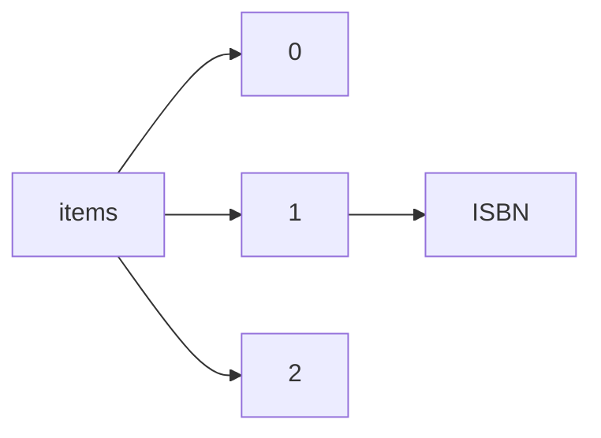

!!! warning "This document is not official Crossref documentation"
# ISBN
PATH = items/array/ISBN(1)  
Occurs 9 977 175 times  
{ .annotate }

1. A route to an element, for example:  
   The route "items/array/ISBN" corresponds to navigating through the JSON indices as  
   ["items"][0]["ISBN"]  

## Properties of Array
See information about elements: [items/array/ISBN/array](array/index.md)  
Distribution of lengths:  

| **Row** | **Length** `Any` | **Count** `Int64` |
|--------:|--------------------:|---------------------:|
| **1**   | 1                   | 2 980 293            |
| **2**   | 2                   | 6 720 312            |
| **3**   | 3                   | 190 468              |
| **4**   | 4                   | 62 774               |
| **5**   | 5                   | 13 733               |
| **6**   | 6                   | 9 595                |

