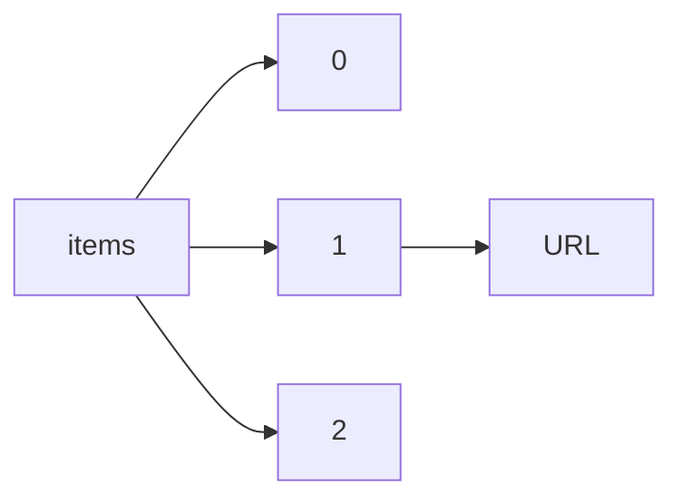

!!! warning "This document is not official Crossref documentation"
# URL
PATH = items/array/URL(1)  
Occurs 143 500 239 times  
Unique values: > 999  
{ .annotate }

1. A route to an element, for example:  
   The route "items/array/URL" corresponds to navigating through the JSON indices as  
   ["items"][0]["URL"]  

!!! note "Due to current limitations, only the first 1,000 unique values are counted."

| **Row** | **Value** `String`                                                             | **Count** `Int64` |
|--------:|----------------------------------------------------------------------------------:|---------------------:|
| **1**   | http://dx.doi.org/10.1371/journal.pone.0198930.g012                               | 1                    |
| **2**   | http://dx.doi.org/10.1097/01.hj.0000530648.17182.22                               | 1                    |
| **3**   | http://dx.doi.org/10.1177/0034637330027001102                                     | 1                    |
| **4**   | http://dx.doi.org/10.1002/wmh3.131                                                | 1                    |
| **5**   | http://dx.doi.org/10.1109/acc.2016.7526768                                        | 1                    |
| **6**   | http://dx.doi.org/10.1080/00207144.2016.1131589                                   | 1                    |
| **7**   | http://dx.doi.org/10.1093/jmammal/gyx044                                          | 1                    |
| **8**   | http://dx.doi.org/10.1163/2468-1733\_shafr\_sim120040012                          | 1                    |
| **9**   | http://dx.doi.org/10.5489/cuaj.4324                                               | 1                    |
| **10**  | http://dx.doi.org/10.25291/vr/7-vlr-l-301                                         | 1                    |
| **11**  | http://dx.doi.org/10.1016/s0022-2860(00)00818-8                                   | 1                    |
| **12**  | http://dx.doi.org/10.1073/pnas.1721250115                                         | 1                    |
| **13**  | http://dx.doi.org/10.7287/peerj.preprints.2191v1                                  | 1                    |
| **14**  | http://dx.doi.org/10.1093/nq/s10-viii.197.274b                                    | 1                    |
| **15**  | http://dx.doi.org/10.1080/17508061.2016.1269483                                   | 1                    |
| **16**  | http://dx.doi.org/10.3390/ijms17081299                                            | 1                    |
| **17**  | http://dx.doi.org/10.1007/978-3-319-42246-6\_5                                    | 1                    |
| **18**  | http://dx.doi.org/10.4236/apm.2016.68042                                          | 1                    |
| **19**  | http://dx.doi.org/10.1163/1873-5363\_boj\_a371                                    | 1                    |
| **20**  | http://dx.doi.org/10.11606/d.12.2009.tde-07102009-143816                          | 1                    |
| **21**  | http://dx.doi.org/10.1080/17532523.2017.1403118                                   | 1                    |
| **22**  | http://dx.doi.org/10.24286/kjcls.2017.12.33.5                                     | 1                    |
| **23**  | http://dx.doi.org/10.24263/2304-974x-2017-6-3-15                                  | 1                    |
| **24**  | http://dx.doi.org/10.1016/s0031-9422(00)86483-3                                   | 1                    |
| **25**  | http://dx.doi.org/10.1016/j.labeco.2016.08.005                                    | 1                    |
| **26**  | http://dx.doi.org/10.3897/zookeys.608.9427.figure33                               | 1                    |
| **27**  | http://dx.doi.org/10.15761/docr.1000202                                           | 1                    |
| **28**  | http://dx.doi.org/10.4414/saez.2005.11484                                         | 1                    |
| **29**  | http://dx.doi.org/10.1177/0734371x8400400309                                      | 1                    |
| **30**  | http://dx.doi.org/10.1039/c7tc00390k                                              | 1                    |
| **31**  | http://dx.doi.org/10.4005/jjfs1919.10.7\_65a                                      | 1                    |
| **32**  | http://dx.doi.org/10.4103/ajim.ajim\_85\_22                                       | 1                    |
| **33**  | http://dx.doi.org/10.1093/nq/183.12.352a                                          | 1                    |
| **34**  | http://dx.doi.org/10.1152/ajpregu.1987.252.1.r181                                 | 1                    |
| **35**  | http://dx.doi.org/10.1016/s0038-1101(00)00104-0                                   | 1                    |
| **36**  | http://dx.doi.org/10.1093/ww/9780199540884.013.u243974                            | 1                    |
| **37**  | http://dx.doi.org/10.1007/978-3-319-63046-5\_25                                   | 1                    |
| **38**  | http://dx.doi.org/10.5014/ajot.2017.71s1-po2128                                   | 1                    |
| **39**  | http://dx.doi.org/10.5115/acb.2017.50.3.207                                       | 1                    |
| **40**  | http://dx.doi.org/10.1038/srep40806                                               | 1                    |
| **41**  | http://dx.doi.org/10.1080/09518398.2016.1201613                                   | 1                    |
| **42**  | http://dx.doi.org/10.1484/m.dda-eb.4.2017097                                      | 1                    |
| **43**  | http://dx.doi.org/10.1093/oxfordjournals.cje.a035455                              | 1                    |
| **44**  | http://dx.doi.org/10.1007/978-3-319-74621-0\_1                                    | 1                    |
| **45**  | http://dx.doi.org/10.1109/transducers.2017.7994395                                | 1                    |
| **46**  | http://dx.doi.org/10.1016/0014-5793(84)81007-8                                    | 1                    |
| **47**  | http://dx.doi.org/10.1002/j.1551-8833.2005.tb10823.x                              | 1                    |
| **48**  | http://dx.doi.org/10.1371/journal.pone.0196231.g008                               | 1                    |
| **49**  | http://dx.doi.org/10.22161/ijaers.5.5.14                                          | 1                    |
| **50**  | http://dx.doi.org/10.15866/ireme.v12i1.13272                                      | 1                    |
| **51**  | http://dx.doi.org/10.1590/s1677-5538.ibju.2016.0599                               | 1                    |
| **52**  | http://dx.doi.org/10.2166/nh.1986.0001                                            | 1                    |
| **53**  | http://dx.doi.org/10.17771/pucrio.acad.33521                                      | 1                    |
| **54**  | http://dx.doi.org/10.1007/978-981-10-8893-3\_3                                    | 1                    |
| **55**  | http://dx.doi.org/10.17227/ludica.num10-7647                                      | 1                    |
| **56**  | http://dx.doi.org/10.1002/j.1551-8833.2004.tb10785.x                              | 1                    |
| **57**  | http://dx.doi.org/10.4414/smf.2001.04173                                          | 1                    |
| **58**  | http://dx.doi.org/10.1109/tcad.2017.2774277                                       | 1                    |
| **59**  | http://dx.doi.org/10.29238/sanitasi.v8i2.3                                        | 1                    |
| **60**  | http://dx.doi.org/10.1016/s0022-510x(00)00295-1                                   | 1                    |
| **61**  | http://dx.doi.org/10.1016/j.isatra.2017.11.005                                    | 1                    |
| **62**  | http://dx.doi.org/10.21236/ada209583                                              | 1                    |
| **63**  | http://dx.doi.org/10.1093/nq/s6-xii.310.453g                                      | 1                    |
| **64**  | http://dx.doi.org/10.3389/fpsyg.2017.02013                                        | 1                    |
| **65**  | http://dx.doi.org/10.1080/00015385.2017.1401286                                   | 1                    |
| **66**  | http://dx.doi.org/10.2991/icemc-17.2017.252                                       | 1                    |
| **67**  | http://dx.doi.org/10.1016/s0040-4039(00)81713-x                                   | 1                    |
| **68**  | http://dx.doi.org/10.21291/jkals.2017.22.2.                                       | 1                    |
| **69**  | http://dx.doi.org/10.7554/elife.30649.010                                         | 1                    |
| **70**  | http://dx.doi.org/10.1371/journal.pone.0191081.g001                               | 1                    |
| **71**  | http://dx.doi.org/10.5432/jjpehss.kj00003392544                                   | 1                    |
| **72**  | http://dx.doi.org/10.5007/2175-8069.2016v13n28p99                                 | 1                    |
| **73**  | http://dx.doi.org/10.1130/abs/2017am-306554                                       | 1                    |
| **74**  | http://dx.doi.org/10.1007/978-3-319-73888-8\_29                                   | 1                    |
| **75**  | http://dx.doi.org/10.1016/0305-750x(73)90079-x                                    | 1                    |
| **76**  | http://dx.doi.org/10.1177/0957650917731181                                        | 1                    |
| **77**  | http://dx.doi.org/10.1104/pp.105.4.1365                                           | 1                    |
| **78**  | http://dx.doi.org/10.1484/m.acsha-eb.4.2018028                                    | 1                    |
| **79**  | http://dx.doi.org/10.37811/cl\_rcm.v6i6.3877                                      | 1                    |
| **80**  | http://dx.doi.org/10.18653/v1/s16-1168                                            | 1                    |
| **81**  | http://dx.doi.org/10.1016/s0895-4356(16)30216-5                                   | 1                    |
| **82**  | http://dx.doi.org/10.1093/benz/9780199773787.article.b00006435                    | 1                    |
| **83**  | http://dx.doi.org/10.1007/978-1-4842-3147-0\_2                                    | 1                    |
| **84**  | http://dx.doi.org/10.1093/toxsci/kfy101                                           | 1                    |
| **85**  | http://dx.doi.org/10.1093/ww/9780199540884.013.u182832                            | 1                    |
| **86**  | http://dx.doi.org/10.14711/spcol/b495277                                          | 1                    |
| **87**  | http://dx.doi.org/10.1016/j.jorganchem.2018.03.013                                | 1                    |
| **88**  | http://dx.doi.org/10.1093/benz/9780199773787.article.b00091653                    | 1                    |
| **89**  | http://dx.doi.org/10.1007/s10517-018-4060-7                                       | 1                    |
| **90**  | http://dx.doi.org/10.1007/978-981-10-7191-1\_6                                    | 1                    |
| **91**  | http://dx.doi.org/10.7717/peerj.3834/supp-3                                       | 1                    |
| **92**  | http://dx.doi.org/10.1158/1538-7445.am2017-4726                                   | 1                    |
| **93**  | http://dx.doi.org/10.2307/j.ctt21pxhpz.21                                         | 1                    |
| **94**  | http://dx.doi.org/10.18356/063a537c-en                                            | 1                    |
| **95**  | http://dx.doi.org/10.1109/inmmic.2017.7927320                                     | 1                    |
| **96**  | http://dx.doi.org/10.1249/fit.0000000000000336                                    | 1                    |
| **97**  | http://dx.doi.org/10.1371/journal.pone.0194141                                    | 1                    |
| **98**  | http://dx.doi.org/10.14483/21450706.11908                                         | 1                    |
| **99**  | http://dx.doi.org/10.15761/ccrr.1000345                                           | 1                    |
| **100** | http://dx.doi.org/10.1093/nq/s9-ii.31.97f                                         | 1                    |
| **101** | http://dx.doi.org/10.1787/888933699666                                            | 1                    |
| **102** | http://dx.doi.org/10.3917/nras.052.0003                                           | 1                    |
| **103** | http://dx.doi.org/10.25253/99.2018203.11                                          | 1                    |
| **104** | http://dx.doi.org/10.1093/ofid/ofac492.286                                        | 1                    |
| **105** | http://dx.doi.org/10.5380/rf.v48i2.51179                                          | 1                    |
| **106** | http://dx.doi.org/10.1080/09718923.2017.1305575                                   | 1                    |
| **107** | http://dx.doi.org/10.1016/s0304-3932(99)00021-5                                   | 1                    |
| **108** | http://dx.doi.org/10.1371/journal.pone.0190332.g002                               | 1                    |
| **109** | http://dx.doi.org/10.1109/pn.2017.8090596                                         | 1                    |
| **110** | http://dx.doi.org/10.1299/jsmemagazine.29.116\_490                                | 1                    |
| **111** | http://dx.doi.org/10.1080/14606925.2017.1349367                                   | 1                    |
| **112** | http://dx.doi.org/10.1016/s0377-2217(99)00235-0                                   | 1                    |
| **113** | http://dx.doi.org/10.21236/ad0665391                                              | 1                    |
| **114** | http://dx.doi.org/10.1016/j.ymthe.2017.08.007                                     | 1                    |
| **115** | http://dx.doi.org/10.21868/pgng.2016.2.                                           | 1                    |
| **116** | http://dx.doi.org/10.1086/ahr/91.2.479                                            | 1                    |
| **117** | http://dx.doi.org/10.1515/witt-2016-0113                                          | 1                    |
| **118** | http://dx.doi.org/10.14746/pt.2005.5.16                                           | 1                    |
| **119** | http://dx.doi.org/10.1002/j.1537-2197.1923.tb05742.x                              | 1                    |
| **120** | http://dx.doi.org/10.20417/nzjecol.42.3                                           | 1                    |
| **121** | http://dx.doi.org/10.1177/039139880002301109                                      | 1                    |
| **122** | http://dx.doi.org/10.1163/2468-1733\_shafr\_sim120040189                          | 1                    |
| **123** | http://dx.doi.org/10.1371/journal.pone.0175196.g003                               | 1                    |
| **124** | http://dx.doi.org/10.1007/978-3-319-55442-6\_17                                   | 1                    |
| **125** | http://dx.doi.org/10.1371/journal.pone.0179687.t001                               | 1                    |
| **126** | http://dx.doi.org/10.13182/nse68-a18832                                           | 1                    |
| **127** | http://dx.doi.org/10.1016/b978-0-12-809400-6.00009-3                              | 1                    |
| **128** | http://dx.doi.org/10.1016/b978-0-12-812871-8.00007-6                              | 1                    |
| **129** | http://dx.doi.org/10.1109/i2c2.2017.8321966                                       | 1                    |
| **130** | http://dx.doi.org/10.1515/9783110925111.479                                       | 1                    |
| **131** | http://dx.doi.org/10.1093/benz/9780199773787.article.b00149783                    | 1                    |
| **132** | http://dx.doi.org/10.3390/math6040063                                             | 1                    |
| **133** | http://dx.doi.org/10.2307/j.ctt22h6r2x.16                                         | 1                    |
| **134** | http://dx.doi.org/10.26490/uncp.horizonteciencia.2017.12.309                      | 1                    |
| **135** | http://dx.doi.org/10.1067/mva.2000.110351                                         | 1                    |
| **136** | http://dx.doi.org/10.1371/journal.pone.0195183.g002                               | 1                    |
| **137** | http://dx.doi.org/10.4135/9781526445520                                           | 1                    |
| **138** | http://dx.doi.org/10.1016/j.otorri.2017.04.007                                    | 1                    |
| **139** | http://dx.doi.org/10.1136/bmjopen-2015-010530corr1                                | 1                    |
| **140** | http://dx.doi.org/10.1016/s0141-0229(00)00298-2                                   | 1                    |
| **141** | http://dx.doi.org/10.21883/ftp.2017.11.45090.04                                   | 1                    |
| **142** | http://dx.doi.org/10.21236/ada610996                                              | 1                    |
| **143** | http://dx.doi.org/10.3389/fphar.2017.00721                                        | 1                    |
| **144** | http://dx.doi.org/10.1557/s1092578300002593                                       | 1                    |
| **145** | http://dx.doi.org/10.2307/j.ctt1tqx932.7                                          | 1                    |
| **146** | http://dx.doi.org/10.18411/spc-12-02-2018-21                                      | 1                    |
| **147** | http://dx.doi.org/10.2307/j.ctt13x00br.15                                         | 1                    |
| **148** | http://dx.doi.org/10.5795/jjscc.32.6\_e1                                          | 1                    |
| **149** | http://dx.doi.org/10.1371/journal.pone.0182348.s008                               | 1                    |
| **150** | http://dx.doi.org/10.1109/irmmw-thz.2016.7758966                                  | 1                    |
| **151** | http://dx.doi.org/10.1111/vox.2018.113.issue-3                                    | 1                    |
| **152** | http://dx.doi.org/10.1016/s0002-9270(99)00618-8                                   | 1                    |
| **153** | http://dx.doi.org/10.14419/ijet.v7i1.8.11538                                      | 1                    |
| **154** | http://dx.doi.org/10.1007/978-1-349-92395-3                                       | 1                    |
| **155** | http://dx.doi.org/10.4315/0362-028x-55.8.583                                      | 1                    |
| **156** | http://dx.doi.org/10.47280/revfacagron(luz).v40.n2                                | 1                    |
| **157** | http://dx.doi.org/10.1080/09723757.2013.11886203                                  | 1                    |
| **158** | http://dx.doi.org/10.1145/3184066.3184081                                         | 1                    |
| **159** | http://dx.doi.org/10.7312/mess17874-005                                           | 1                    |
| **160** | http://dx.doi.org/10.1016/j.fct.2016.11.035                                       | 1                    |
| **161** | http://dx.doi.org/10.1074/jbc.m202743200                                          | 1                    |
| **162** | http://dx.doi.org/10.1097/01.asw.0000527966.72494.61                              | 1                    |
| **163** | http://dx.doi.org/10.1093/oseo/instance.00221046                                  | 1                    |
| **164** | http://dx.doi.org/10.18020/kesit.1331                                             | 1                    |
| **165** | http://dx.doi.org/10.4103/2303-9027.218433                                        | 1                    |
| **166** | http://dx.doi.org/10.1177/216507998503300811                                      | 1                    |
| **167** | http://dx.doi.org/10.1016/s0140-6736(01)06411-x                                   | 1                    |
| **168** | http://dx.doi.org/10.1016/j.psychres.2017.12.004                                  | 1                    |
| **169** | http://dx.doi.org/10.1057/978-1-137-59013-8\_7                                    | 1                    |
| **170** | http://dx.doi.org/10.1111/jpcu.12603                                              | 1                    |
| **171** | http://dx.doi.org/10.21236/ada215297                                              | 1                    |
| **172** | http://dx.doi.org/10.4067/s0719-38902017005000402                                 | 1                    |
| **173** | http://dx.doi.org/10.1088/1742-6596/2386/1/012048                                 | 1                    |
| **174** | http://dx.doi.org/10.3746/pnf.2016.21.3.227                                       | 1                    |
| **175** | http://dx.doi.org/10.5902/fragmentum.v0i47.21552                                  | 1                    |
| **176** | http://dx.doi.org/10.1071/wr15187                                                 | 1                    |
| **177** | http://dx.doi.org/10.1016/0300-2977(96)88568-8                                    | 1                    |
| **178** | http://dx.doi.org/10.1016/j.radcr.2023.02.030                                     | 1                    |
| **179** | http://dx.doi.org/10.3390/su10061875                                              | 1                    |
| **180** | http://dx.doi.org/10.1515/fhort-2017-0001                                         | 1                    |
| **181** | http://dx.doi.org/10.1515/afe-2017-0158                                           | 1                    |
| **182** | http://dx.doi.org/10.11137/2018\_1\_318\_327                                      | 1                    |
| **183** | http://dx.doi.org/10.1016/j.landusepol.2018.04.015                                | 1                    |
| **184** | http://dx.doi.org/10.18318/td.2016.6.25                                           | 1                    |
| **185** | http://dx.doi.org/10.1299/jsmemagazine.39.232\_490\_4                             | 1                    |
| **186** | http://dx.doi.org/10.1007/978-981-10-2051-3\_8                                    | 1                    |
| **187** | http://dx.doi.org/10.15290/bsp.2010.08.25                                         | 1                    |
| **188** | http://dx.doi.org/10.3862/jcoloproctology.70.411                                  | 1                    |
| **189** | http://dx.doi.org/10.1093/nq/156.17.304b                                          | 1                    |
| **190** | http://dx.doi.org/10.1080/17445302.2016.1275473                                   | 1                    |
| **191** | http://dx.doi.org/10.1109/ultsym.2017.8091878                                     | 1                    |
| **192** | http://dx.doi.org/10.21236/ada042158                                              | 1                    |
| **193** | http://dx.doi.org/10.14419/ijdr.v5i1.7273                                         | 1                    |
| **194** | http://dx.doi.org/10.15807/jorsj.50.219                                           | 1                    |
| **195** | http://dx.doi.org/10.1055/s-0037-1601407                                          | 1                    |
| **196** | http://dx.doi.org/10.1186/s40795-017-0175-x                                       | 1                    |
| **197** | http://dx.doi.org/10.11646/zootaxa.4232.4.7                                       | 1                    |
| **198** | http://dx.doi.org/10.1186/s12884-018-1866-2                                       | 1                    |
| **199** | http://dx.doi.org/10.1063/1.5041151                                               | 1                    |
| **200** | http://dx.doi.org/10.23919/acc.1993.4793032                                       | 1                    |
| **201** | http://dx.doi.org/10.15753/aje.2016.12.17.4.285                                   | 1                    |
| **202** | http://dx.doi.org/10.1093/oseo/instance.00203953                                  | 1                    |
| **203** | http://dx.doi.org/10.1371/journal.pone.0190994.t001                               | 1                    |
| **204** | http://dx.doi.org/10.1093/nq/16-3-93b                                             | 1                    |
| **205** | http://dx.doi.org/10.1152/ajprenal.1984.246.5.f575                                | 1                    |
| **206** | http://dx.doi.org/10.3390/ijerph20065183                                          | 1                    |
| **207** | http://dx.doi.org/10.1134/s1063773717090031                                       | 1                    |
| **208** | http://dx.doi.org/10.1093/med/9780199934522.003.0103                              | 1                    |
| **209** | http://dx.doi.org/10.1115/omae2017-ns7a                                           | 1                    |
| **210** | http://dx.doi.org/10.5771/0506-7286-1969-4                                        | 1                    |
| **211** | http://dx.doi.org/10.1787/itcs-v2016-2-table582-fr                                | 1                    |
| **212** | http://dx.doi.org/10.1007/s11757-017-0423-6                                       | 1                    |
| **213** | http://dx.doi.org/10.22395/csye.v6n12a8                                           | 1                    |
| **214** | http://dx.doi.org/10.1557/adv.2018.111                                            | 1                    |
| **215** | http://dx.doi.org/10.12681/eh.11537                                               | 1                    |
| **216** | http://dx.doi.org/10.1007/978-3-658-20610-9\_2                                    | 1                    |
| **217** | http://dx.doi.org/10.1080/00221546.2003.11780870                                  | 1                    |
| **218** | http://dx.doi.org/10.1017/9781108685245.005                                       | 1                    |
| **219** | http://dx.doi.org/10.1109/hpcc-smartcity-dss.2017.60                              | 1                    |
| **220** | http://dx.doi.org/10.1002/9781119444497.ch2                                       | 1                    |
| **221** | http://dx.doi.org/10.1074/jbc.aac117.000526                                       | 1                    |
| **222** | http://dx.doi.org/10.1101/319848                                                  | 1                    |
| **223** | http://dx.doi.org/10.1111/jcpt.12571                                              | 1                    |
| **224** | http://dx.doi.org/10.1017/s1326011100600716                                       | 1                    |
| **225** | http://dx.doi.org/10.1080/02650487.2004.11072895                                  | 1                    |
| **226** | http://dx.doi.org/10.1016/s0022-5347(17)55123-x                                   | 1                    |
| **227** | http://dx.doi.org/10.3998/panc.2016.10                                            | 1                    |
| **228** | http://dx.doi.org/10.1515/9783111486550-034                                       | 1                    |
| **229** | http://dx.doi.org/10.1201/b14973                                                  | 1                    |
| **230** | http://dx.doi.org/10.1093/oso/9780190459925.003.0003                              | 1                    |
| **231** | http://dx.doi.org/10.1080/00222216.1988.11969768                                  | 1                    |
| **232** | http://dx.doi.org/10.1109/iaecst57965.2022.10062129                               | 1                    |
| **233** | http://dx.doi.org/10.1038/s41409-017-0062-8                                       | 1                    |
| **234** | http://dx.doi.org/10.1016/0304-5102(85)87009-7                                    | 1                    |
| **235** | http://dx.doi.org/10.1007/s10508-017-1036-z                                       | 1                    |
| **236** | http://dx.doi.org/10.4314/jfas.v9i6s.28                                           | 1                    |
| **237** | http://dx.doi.org/10.29333/ejmste/91093                                           | 1                    |
| **238** | http://dx.doi.org/10.29171/acku\_risalah\_tn870\_alif52\_1355\_n348\_dari\_title1 | 1                    |
| **239** | http://dx.doi.org/10.1016/s0015-0282(01)02640-1                                   | 1                    |
| **240** | http://dx.doi.org/10.1109/ei2.2017.8245260                                        | 1                    |
| **241** | http://dx.doi.org/10.4095/131663                                                  | 1                    |
| **242** | http://dx.doi.org/10.2307/j.ctt22nm9jx.20                                         | 1                    |
| **243** | http://dx.doi.org/10.1371/journal.pone.0166126.g001                               | 1                    |
| **244** | http://dx.doi.org/10.1016/j.jaapos.2016.07.042                                    | 1                    |
| **245** | http://dx.doi.org/10.1177/1476127011398467                                        | 1                    |
| **246** | http://dx.doi.org/10.5943/mycosphere/8/5/6                                        | 1                    |
| **247** | http://dx.doi.org/10.1016/s0920-3796(00)00442-7                                   | 1                    |
| **248** | http://dx.doi.org/10.1163/2213-2996\_flg\_com\_323665                             | 1                    |
| **249** | http://dx.doi.org/10.7717/peerj.4755/supp-2                                       | 1                    |
| **250** | http://dx.doi.org/10.1097/won.0000000000000373                                    | 1                    |
| **251** | http://dx.doi.org/10.1541/ieejfms1990.115.7\_553                                  | 1                    |
| **252** | http://dx.doi.org/10.2307/j.ctv33wwt92.6                                          | 1                    |
| **253** | http://dx.doi.org/10.1016/j.applthermaleng.2016.09.078                            | 1                    |
| **254** | http://dx.doi.org/10.12724/ajss.18.6                                              | 1                    |
| **255** | http://dx.doi.org/10.1017/9781316597712.001                                       | 1                    |
| **256** | http://dx.doi.org/10.1049/iet-nbt.2017.0188                                       | 1                    |
| **257** | http://dx.doi.org/10.5633/amm.2017.0310                                           | 1                    |
| **258** | http://dx.doi.org/10.1080/0023656x.2017.1346902                                   | 1                    |
| **259** | http://dx.doi.org/10.21313/hawaii/9780824835149.003.0001                          | 1                    |
| **260** | http://dx.doi.org/10.1017/s0368393100106157                                       | 1                    |
| **261** | http://dx.doi.org/10.1093/benz/9780199773787.article.b00062489                    | 1                    |
| **262** | http://dx.doi.org/10.1017/s0272504500101794                                       | 1                    |
| **263** | http://dx.doi.org/10.1111/gend.2016.28.issue-2                                    | 1                    |
| **264** | http://dx.doi.org/10.1177/106002809703100519                                      | 1                    |
| **265** | http://dx.doi.org/10.1093/nq/172.6.106a                                           | 1                    |
| **266** | http://dx.doi.org/10.1787/888933733087                                            | 1                    |
| **267** | http://dx.doi.org/10.15406/hpmij.2022.05.00205                                    | 1                    |
| **268** | http://dx.doi.org/10.1177/096914139500200311                                      | 1                    |
| **269** | http://dx.doi.org/10.1016/s0031-9422(98)00110-1                                   | 1                    |
| **270** | http://dx.doi.org/10.1016/j.injury.2018.03.012                                    | 1                    |
| **271** | http://dx.doi.org/10.15403/jgld-4837                                              | 1                    |
| **272** | http://dx.doi.org/10.1007/978-981-19-9228-5\_18                                   | 1                    |
| **273** | http://dx.doi.org/10.1016/j.avsg.2017.09.029                                      | 1                    |
| **274** | http://dx.doi.org/10.12660/rda.v215.1999.47349                                    | 1                    |
| **275** | http://dx.doi.org/10.3390/nano7100334                                             | 1                    |
| **276** | http://dx.doi.org/10.1109/ultsym.2017.8091571                                     | 1                    |
| **277** | http://dx.doi.org/10.22207/jpam.11.2.22                                           | 1                    |
| **278** | http://dx.doi.org/10.1017/s0003598x00027411                                       | 1                    |
| **279** | http://dx.doi.org/10.1016/j.ceca.2018.03.002                                      | 1                    |
| **280** | http://dx.doi.org/10.1016/s1061-3315(17)30068-9                                   | 1                    |
| **281** | http://dx.doi.org/10.5152/npa.2017.17023                                          | 1                    |
| **282** | http://dx.doi.org/10.17077/0021-065x.7207                                         | 1                    |
| **283** | http://dx.doi.org/10.1016/j.jlumin.2018.02.058                                    | 1                    |
| **284** | http://dx.doi.org/10.5962/bhl.title.143925                                        | 1                    |
| **285** | http://dx.doi.org/10.1063/pt.6.2.20170526a                                        | 1                    |
| **286** | http://dx.doi.org/10.1371/journal.pone.0193565.s003                               | 1                    |
| **287** | http://dx.doi.org/10.3389/fpls.2017.02213.s002                                    | 1                    |
| **288** | http://dx.doi.org/10.1016/s0022-5347(17)59433-1                                   | 1                    |
| **289** | http://dx.doi.org/10.5194/isprsarchives-xli-b8-175-2016                           | 1                    |
| **290** | http://dx.doi.org/10.1163/1570-6664\_iyb\_sim\_person\_53927                      | 1                    |
| **291** | http://dx.doi.org/10.1093/benz/9780199773787.article.b00006732                    | 1                    |
| **292** | http://dx.doi.org/10.1049/el.2017.2623                                            | 1                    |
| **293** | http://dx.doi.org/10.21099/tkbjm/1496161835                                       | 1                    |
| **294** | http://dx.doi.org/10.2504/kds.48.434                                              | 1                    |
| **295** | http://dx.doi.org/10.14350/rig.59005                                              | 1                    |
| **296** | http://dx.doi.org/10.1007/s00395-017-0651-0                                       | 1                    |
| **297** | http://dx.doi.org/10.1016/0304-405x(95)00841-2                                    | 1                    |
| **298** | http://dx.doi.org/10.25291/vr/1961-vr-36                                          | 1                    |
| **299** | http://dx.doi.org/10.1103/physrevb.96.064417                                      | 1                    |
| **300** | http://dx.doi.org/10.29247/2358-260x.2017v4i2.p51-57                              | 1                    |
| **301** | http://dx.doi.org/10.1299/jsmemag.44.289\_321\_2                                  | 1                    |
| **302** | http://dx.doi.org/10.3403/30361749                                                | 1                    |
| **303** | http://dx.doi.org/10.1007/978-3-658-14528-6                                       | 1                    |
| **304** | http://dx.doi.org/10.1590/0104-070720180003970016                                 | 1                    |
| **305** | http://dx.doi.org/10.3410/f.727567340.793538968                                   | 1                    |
| **306** | http://dx.doi.org/10.1128/aac.00636-16                                            | 1                    |
| **307** | http://dx.doi.org/10.1007/s40278-017-28209-1                                      | 1                    |
| **308** | http://dx.doi.org/10.1016/s0168-8278(16)00526-2                                   | 1                    |
| **309** | http://dx.doi.org/10.1016/b978-0-444-63591-4.00015-x                              | 1                    |
| **310** | http://dx.doi.org/10.22323/1.294.0048                                             | 1                    |
| **311** | http://dx.doi.org/10.1007/s12445-016-0306-7                                       | 1                    |
| **312** | http://dx.doi.org/10.1155/2018/3768741                                            | 1                    |
| **313** | http://dx.doi.org/10.1093/oxfordjournals.jhered.a104864                           | 1                    |
| **314** | http://dx.doi.org/10.34010/jupiter.v2i1.7318                                      | 1                    |
| **315** | http://dx.doi.org/10.1093/gao/9781884446054.013.9002293765                        | 1                    |
| **316** | http://dx.doi.org/10.1017/s0310582200015479                                       | 1                    |
| **317** | http://dx.doi.org/10.1016/s0002-8177(17)30369-0                                   | 1                    |
| **318** | http://dx.doi.org/10.1080/15289168.2017.1369741                                   | 1                    |
| **319** | http://dx.doi.org/10.1016/j.proeng.2017.10.018                                    | 1                    |
| **320** | http://dx.doi.org/10.1002/ange.201709657                                          | 1                    |
| **321** | http://dx.doi.org/10.1109/iraniancee.2017.7985420                                 | 1                    |
| **322** | http://dx.doi.org/10.1016/j.mpaic.2018.02.004                                     | 1                    |
| **323** | http://dx.doi.org/10.1007/978-94-6300-827-3\_1                                    | 1                    |
| **324** | http://dx.doi.org/10.1016/j.brs.2017.11.012                                       | 1                    |
| **325** | http://dx.doi.org/10.7887/jcns.20.904                                             | 1                    |
| **326** | http://dx.doi.org/10.1299/jsmezairiki.2006.0\_195                                 | 1                    |
| **327** | http://dx.doi.org/10.21933/j.edsc.2015.07.144                                     | 1                    |
| **328** | http://dx.doi.org/10.1097/shk.0000000000000679                                    | 1                    |
| **329** | http://dx.doi.org/10.1109/edpe.2017.8123250                                       | 1                    |
| **330** | http://dx.doi.org/10.6028/nbs.rpt.6908                                            | 1                    |
| **331** | http://dx.doi.org/10.11606/d.9.2016.tde-28052015-084712                           | 1                    |
| **332** | http://dx.doi.org/10.2208/journalip.26.93                                         | 1                    |
| **333** | http://dx.doi.org/10.17922/2071-5323-2017-16-6                                    | 1                    |
| **334** | http://dx.doi.org/10.1177/002581726102900319                                      | 1                    |
| **335** | http://dx.doi.org/10.1016/j.cities.2016.08.013                                    | 1                    |
| **336** | http://dx.doi.org/10.1007/978-90-368-1394-5\_35                                   | 1                    |
| **337** | http://dx.doi.org/10.1021/acs.cgd.7b01281                                         | 1                    |
| **338** | http://dx.doi.org/10.24843/mite.2016.v15i01p11                                    | 1                    |
| **339** | http://dx.doi.org/10.1093/gao/9781884446054.article.t060174                       | 1                    |
| **340** | http://dx.doi.org/10.2307/j.ctt1ffjfx0.29                                         | 1                    |
| **341** | http://dx.doi.org/10.2307/j.ctt1z27hth.5                                          | 1                    |
| **342** | http://dx.doi.org/10.25115/ecp.v10i20.1009                                        | 1                    |
| **343** | http://dx.doi.org/10.4315/0362-028x-71.2.440                                      | 1                    |
| **344** | http://dx.doi.org/10.1016/j.aeolia.2016.12.004                                    | 1                    |
| **345** | http://dx.doi.org/10.1093/ndt/gfv185.17                                           | 1                    |
| **346** | http://dx.doi.org/10.1007/978-3-031-21135-5\_6                                    | 1                    |
| **347** | http://dx.doi.org/10.1109/siu.2016.7495889                                        | 1                    |
| **348** | http://dx.doi.org/10.1016/s0040-4039(01)81091-1                                   | 1                    |
| **349** | http://dx.doi.org/10.1093/nq/186.3.73h                                            | 1                    |
| **350** | http://dx.doi.org/10.1007/978-981-10-5765-6\_7                                    | 1                    |
| **351** | http://dx.doi.org/10.15856/jakpah.2016..39.61                                     | 1                    |
| **352** | http://dx.doi.org/10.1016/j.nima.2018.03.023                                      | 1                    |
| **353** | http://dx.doi.org/10.1016/0956-716x(95)00107-7                                    | 1                    |
| **354** | http://dx.doi.org/10.1016/j.jval.2017.08.1205                                     | 1                    |
| **355** | http://dx.doi.org/10.1016/j.atmosenv.2018.02.044                                  | 1                    |
| **356** | http://dx.doi.org/10.1109/isgt.2017.8086039                                       | 1                    |
| **357** | http://dx.doi.org/10.1093/annonc/mdx385.007                                       | 1                    |
| **358** | http://dx.doi.org/10.1109/icdew.2016.7495652                                      | 1                    |
| **359** | http://dx.doi.org/10.1515/9783110584998-030                                       | 1                    |
| **360** | http://dx.doi.org/10.5771/0531-2485-2004-1-1                                      | 1                    |
| **361** | http://dx.doi.org/10.15226/jdodt.2016.00157                                       | 1                    |
| **362** | http://dx.doi.org/10.1051/mattech/192508070297                                    | 1                    |
| **363** | http://dx.doi.org/10.3897/zookeys.573.7016.figures331-337                         | 1                    |
| **364** | http://dx.doi.org/10.1515/zireb-2017-0010                                         | 1                    |
| **365** | http://dx.doi.org/10.25115/ecp.v3i5.900                                           | 1                    |
| **366** | http://dx.doi.org/10.1016/s0261-5614(17)30909-3                                   | 1                    |
| **367** | http://dx.doi.org/10.3030/101082596                                               | 1                    |
| **368** | http://dx.doi.org/10.1152/ajplegacy.1963.204.5.821                                | 1                    |
| **369** | http://dx.doi.org/10.1055/b-0036-140495                                           | 1                    |
| **370** | http://dx.doi.org/10.1364/cleo\_qels.2018.fth4g.3                                 | 1                    |
| **371** | http://dx.doi.org/10.1515/9783110491616-003                                       | 1                    |
| **372** | http://dx.doi.org/10.1093/aje/kwy095                                              | 1                    |
| **373** | http://dx.doi.org/10.1093/oseo/instance.00180733                                  | 1                    |
| **374** | http://dx.doi.org/10.2307/j.ctt22nm8kz.10                                         | 1                    |
| **375** | http://dx.doi.org/10.4324/9780080498508                                           | 1                    |
| **376** | http://dx.doi.org/10.1016/s0165-6147(18)30038-5                                   | 1                    |
| **377** | http://dx.doi.org/10.1016/0732-118x(96)00004-9                                    | 1                    |
| **378** | http://dx.doi.org/10.1093/ww/9780199540884.013.u32790                             | 1                    |
| **379** | http://dx.doi.org/10.26756/th.2005.35                                             | 1                    |
| **380** | http://dx.doi.org/10.1016/j.cca.2018.01.002                                       | 1                    |
| **381** | http://dx.doi.org/10.2307/j.ctt7zw885.23                                          | 1                    |
| **382** | http://dx.doi.org/10.17104/9783406703492                                          | 1                    |
| **383** | http://dx.doi.org/10.1016/0584-8547(90)80051-j                                    | 1                    |
| **384** | http://dx.doi.org/10.1016/j.compositesa.2017.03.026                               | 1                    |
| **385** | http://dx.doi.org/10.1007/978-1-349-58635-6\_198                                  | 1                    |
| **386** | http://dx.doi.org/10.1075/thr.7.01cho                                             | 1                    |
| **387** | http://dx.doi.org/10.1016/j.jcat.2016.11.010                                      | 1                    |
| **388** | http://dx.doi.org/10.1109/icepe-st.2017.8188847                                   | 1                    |
| **389** | http://dx.doi.org/10.1016/s0252-9602(18)30641-6                                   | 1                    |
| **390** | http://dx.doi.org/10.1007/s00604-017-2579-3                                       | 1                    |
| **391** | http://dx.doi.org/10.14361/9783839439647-015                                      | 1                    |
| **392** | http://dx.doi.org/10.1109/nfv-sdn.2017.8169822                                    | 1                    |
| **393** | http://dx.doi.org/10.1038/22413-c1                                                | 1                    |
| **394** | http://dx.doi.org/10.17721/2306-5680.2022.4.6                                     | 1                    |
| **395** | http://dx.doi.org/10.1093/nq/s7-v.119.267b                                        | 1                    |
| **396** | http://dx.doi.org/10.1093/milmed/95.6.497                                         | 1                    |
| **397** | http://dx.doi.org/10.7287/peerj.preprints.2995v1/supp-1                           | 1                    |
| **398** | http://dx.doi.org/10.1067/mob.2000.106590                                         | 1                    |
| **399** | http://dx.doi.org/10.5194/esd-2017-92-rc1                                         | 1                    |
| **400** | http://dx.doi.org/10.1093/acprof:oso/9780199376995.003.0001                       | 1                    |
| **401** | http://dx.doi.org/10.1515/9781400876525-054                                       | 1                    |
| **402** | http://dx.doi.org/10.1016/j.jeurceramsoc.2016.08.039                              | 1                    |
| **403** | http://dx.doi.org/10.1016/j.tcs.2016.07.002                                       | 1                    |
| **404** | http://dx.doi.org/10.2166/wst.1991.0328                                           | 1                    |
| **405** | http://dx.doi.org/10.2307/j.ctt18fs571.7                                          | 1                    |
| **406** | http://dx.doi.org/10.5585/eccos.n45.7783                                          | 1                    |
| **407** | http://dx.doi.org/10.1093/benz/9780199773787.article.b00158074                    | 1                    |
| **408** | http://dx.doi.org/10.1364/np.2016.nth1a.4                                         | 1                    |
| **409** | http://dx.doi.org/10.1016/0014-5793(80)80555-2                                    | 1                    |
| **410** | http://dx.doi.org/10.1093/acrefore/9780190846626.013.319                          | 1                    |
| **411** | http://dx.doi.org/10.1002/bit.26595                                               | 1                    |
| **412** | http://dx.doi.org/10.1016/s0140-6736(17)32670-3                                   | 1                    |
| **413** | http://dx.doi.org/10.1093/benz/9780199773787.article.b00158257                    | 1                    |
| **414** | http://dx.doi.org/10.2134/jeq2017.07.0289                                         | 1                    |
| **415** | http://dx.doi.org/10.21236/ada376918                                              | 1                    |
| **416** | http://dx.doi.org/10.1017/9781108178389                                           | 1                    |
| **417** | http://dx.doi.org/10.5962/bhl.title.133136                                        | 1                    |
| **418** | http://dx.doi.org/10.1088/1755-1315/157/1/012037                                  | 1                    |
| **419** | http://dx.doi.org/10.1111/cdoe.12383                                              | 1                    |
| **420** | http://dx.doi.org/10.4324/9781482274424                                           | 1                    |
| **421** | http://dx.doi.org/10.7717/peerj.3387/table-2                                      | 1                    |
| **422** | http://dx.doi.org/10.1007/978-3-319-71697-8\_2                                    | 1                    |
| **423** | http://dx.doi.org/10.1097/mrm.0000000000000129                                    | 1                    |
| **424** | http://dx.doi.org/10.4172/pharmaceutical-sciences.1000362                         | 1                    |
| **425** | http://dx.doi.org/10.1007/s40278-018-45804-y                                      | 1                    |
| **426** | http://dx.doi.org/10.1093/nq/s6-x.253.353c                                        | 1                    |
| **427** | http://dx.doi.org/10.1002/j.1537-2197.1985.tb05357.x                              | 1                    |
| **428** | http://dx.doi.org/10.1093/benz/9780199773787.article.b00101809                    | 1                    |
| **429** | http://dx.doi.org/10.24251/hicss.2018.244                                         | 1                    |
| **430** | http://dx.doi.org/10.1152/ajpheart.1997.272.1.h67                                 | 1                    |
| **431** | http://dx.doi.org/10.15184/aqy.2017.191                                           | 1                    |
| **432** | http://dx.doi.org/10.1093/ww/9780199540884.013.16990                              | 1                    |
| **433** | http://dx.doi.org/10.1037/cap0000107                                              | 1                    |
| **434** | http://dx.doi.org/10.1371/journal.pone.0194656.s009                               | 1                    |
| **435** | http://dx.doi.org/10.1016/s0301-0511(01)00113-2                                   | 1                    |
| **436** | http://dx.doi.org/10.1101/083170                                                  | 1                    |
| **437** | http://dx.doi.org/10.33965/itsamaste2021\_202111l014                              | 1                    |
| **438** | http://dx.doi.org/10.1177/0263774x16665845                                        | 1                    |
| **439** | http://dx.doi.org/10.1163/2210-7886\_asc-20541                                    | 1                    |
| **440** | http://dx.doi.org/10.22323/1.007.0259                                             | 1                    |
| **441** | http://dx.doi.org/10.7863/jum.1995.14.4.267                                       | 1                    |
| **442** | http://dx.doi.org/10.1016/j.ins.2016.10.008                                       | 1                    |
| **443** | http://dx.doi.org/10.2991/cnct-16.2017.34                                         | 1                    |
| **444** | http://dx.doi.org/10.1007/978-3-319-33742-5\_2                                    | 1                    |
| **445** | http://dx.doi.org/10.1007/978-3-319-66526-9\_12                                   | 1                    |
| **446** | http://dx.doi.org/10.1186/s12889-016-3385-2                                       | 1                    |
| **447** | http://dx.doi.org/10.1002/alz.067415                                              | 1                    |
| **448** | http://dx.doi.org/10.1016/j.jemermed.2016.12.033                                  | 1                    |
| **449** | http://dx.doi.org/10.2307/j.ctt22nm8ph.2                                          | 1                    |
| **450** | http://dx.doi.org/10.1158/1078-0432.ccr-16-1863                                   | 1                    |
| **451** | http://dx.doi.org/10.1103/physrevb.94.174102                                      | 1                    |
| **452** | http://dx.doi.org/10.1017/cbo9781107707009.001                                    | 1                    |
| **453** | http://dx.doi.org/10.1371/journal.pone.0197906.t005                               | 1                    |
| **454** | http://dx.doi.org/10.1016/s0022-5347(17)55722-5                                   | 1                    |
| **455** | http://dx.doi.org/10.1371/journal.pntd.0006120.s014                               | 1                    |
| **456** | http://dx.doi.org/10.1117/12.2244917                                              | 1                    |
| **457** | http://dx.doi.org/10.1163/2214-8264\_dutchpamphlets-kb1-kb15404                   | 1                    |
| **458** | http://dx.doi.org/10.1021/acs.langmuir.6b04481                                    | 1                    |
| **459** | http://dx.doi.org/10.1016/j.molimm.2017.01.028                                    | 1                    |
| **460** | http://dx.doi.org/10.1016/j.indmarman.2017.05.006                                 | 1                    |
| **461** | http://dx.doi.org/10.1103/physrevlett.46.1292                                     | 1                    |
| **462** | http://dx.doi.org/10.1016/s0022-5347(17)56587-8                                   | 1                    |
| **463** | http://dx.doi.org/10.1117/12.2261796                                              | 1                    |
| **464** | http://dx.doi.org/10.3726/978-3-653-02164-6/11                                    | 1                    |
| **465** | http://dx.doi.org/10.1017/s0027763000012022                                       | 1                    |
| **466** | http://dx.doi.org/10.47655/widyadewata.v4i2.46                                    | 1                    |
| **467** | http://dx.doi.org/10.1177/0194599816655336h                                       | 1                    |
| **468** | http://dx.doi.org/10.1093/nq/s9-iii.57.77d                                        | 1                    |
| **469** | http://dx.doi.org/10.18565/aig.2018.3.58-62                                       | 1                    |
| **470** | http://dx.doi.org/10.1111/resp.13206\_160                                         | 1                    |
| **471** | http://dx.doi.org/10.1093/nq/s2-iv.93.283                                         | 1                    |
| **472** | http://dx.doi.org/10.5040/9781350051195                                           | 1                    |
| **473** | http://dx.doi.org/10.3726/978-3-0351-0248-2/3                                     | 1                    |
| **474** | http://dx.doi.org/10.1177/1463949117731023                                        | 1                    |
| **475** | http://dx.doi.org/10.1017/s0003055400132691                                       | 1                    |
| **476** | http://dx.doi.org/10.1299/mej.17-00052                                            | 1                    |
| **477** | http://dx.doi.org/10.1016/j.japh.2018.03.003                                      | 1                    |
| **478** | http://dx.doi.org/10.7887/jcns.21.app1                                            | 1                    |
| **479** | http://dx.doi.org/10.3233/jad-2009-1154                                           | 1                    |
| **480** | http://dx.doi.org/10.1016/s0379-6779(98)00815-7                                   | 1                    |
| **481** | http://dx.doi.org/10.1093/obo/9780199874002-0155                                  | 1                    |
| **482** | http://dx.doi.org/10.15760/etd.6037                                               | 1                    |
| **483** | http://dx.doi.org/10.1016/j.cub.2016.07.072                                       | 1                    |
| **484** | http://dx.doi.org/10.1117/12.2232081                                              | 1                    |
| **485** | http://dx.doi.org/10.1515/9781400877638-fm                                        | 1                    |
| **486** | http://dx.doi.org/10.1007/s11259-017-9700-2                                       | 1                    |
| **487** | http://dx.doi.org/10.1177/106002808902300314                                      | 1                    |
| **488** | http://dx.doi.org/10.1524/9783486596014-012                                       | 1                    |
| **489** | http://dx.doi.org/10.21019/9781582122250.ch19                                     | 1                    |
| **490** | http://dx.doi.org/10.1111/ajag.12366                                              | 1                    |
| **491** | http://dx.doi.org/10.1093/gao/9781884446054.article.t047895                       | 1                    |
| **492** | http://dx.doi.org/10.1024/1662-9647/a000177                                       | 1                    |
| **493** | http://dx.doi.org/10.30902/jrea.2017.3.2.93                                       | 1                    |
| **494** | http://dx.doi.org/10.1111/bjd.15130                                               | 1                    |
| **495** | http://dx.doi.org/10.15749/jts.2016.17.4.007                                      | 1                    |
| **496** | http://dx.doi.org/10.1007/978-3-476-00222-8\_12                                   | 1                    |
| **497** | http://dx.doi.org/10.1093/nq/s8-ix.233.474f                                       | 1                    |
| **498** | http://dx.doi.org/10.1016/j.surfcoat.2017.11.030                                  | 1                    |
| **499** | http://dx.doi.org/10.1121/1.4969988                                               | 1                    |
| **500** | http://dx.doi.org/10.4324/9781315252018-3                                         | 1                    |
| **501** | http://dx.doi.org/10.4236/ae.2016.44023                                           | 1                    |
| **502** | http://dx.doi.org/10.1021/acs.cgd.7b00677                                         | 1                    |
| **503** | http://dx.doi.org/10.1007/978-1-137-27231-7\_4                                    | 1                    |
| **504** | http://dx.doi.org/10.1016/j.eja.2016.09.014                                       | 1                    |
| **505** | http://dx.doi.org/10.15673/fst.v10i3.182                                          | 1                    |
| **506** | http://dx.doi.org/10.1080/16070658.2015.11734557                                  | 1                    |
| **507** | http://dx.doi.org/10.1007/978-3-86226-301-1\_5                                    | 1                    |
| **508** | http://dx.doi.org/10.1371/journal.pone.0178609.t004                               | 1                    |
| **509** | http://dx.doi.org/10.1016/j.matdes.2017.06.021                                    | 1                    |
| **510** | http://dx.doi.org/10.7256/2306-9899.2017.1.21824                                  | 1                    |
| **511** | http://dx.doi.org/10.2307/j.ctt1gk095j.6                                          | 1                    |
| **512** | http://dx.doi.org/10.1016/0031-9422(81)84048-4                                    | 1                    |
| **513** | http://dx.doi.org/10.1152/jappl.1968.24.4.577                                     | 1                    |
| **514** | http://dx.doi.org/10.1007/978-3-319-60289-9\_21                                   | 1                    |
| **515** | http://dx.doi.org/10.2210/pdb8bze/pdb                                             | 1                    |
| **516** | http://dx.doi.org/10.1201/9781315641645-266                                       | 1                    |
| **517** | http://dx.doi.org/10.1002/ijc.31611                                               | 1                    |
| **518** | http://dx.doi.org/10.22280/revintervol11ed1.309                                   | 1                    |
| **519** | http://dx.doi.org/10.18540/jcecvl3iss7pp0986-0994                                 | 1                    |
| **520** | http://dx.doi.org/10.1016/s0165-5728(01)00322-8                                   | 1                    |
| **521** | http://dx.doi.org/10.1016/j.ijmecsci.2016.07.022                                  | 1                    |
| **522** | http://dx.doi.org/10.1080/03680770.1977.11896824                                  | 1                    |
| **523** | http://dx.doi.org/10.1016/s1010-6030(99)00244-0                                   | 1                    |
| **524** | http://dx.doi.org/10.1002/9781119341185.ch1                                       | 1                    |
| **525** | http://dx.doi.org/10.1016/s0166-5316(00)00068-7                                   | 1                    |
| **526** | http://dx.doi.org/10.1016/s0012-821x(00)00016-9                                   | 1                    |
| **527** | http://dx.doi.org/10.24022/0236-2791-2017-59-1-20-27                              | 1                    |
| **528** | http://dx.doi.org/10.1016/b978-0-12-811401-8.00029-5                              | 1                    |
| **529** | http://dx.doi.org/10.1787/888933624692                                            | 1                    |
| **530** | http://dx.doi.org/10.1111/jace.15708                                              | 1                    |
| **531** | http://dx.doi.org/10.1111/ijun.12139                                              | 1                    |
| **532** | http://dx.doi.org/10.1007/978-3-476-03720-6\_19                                   | 1                    |
| **533** | http://dx.doi.org/10.3390/challe9010024                                           | 1                    |
| **534** | http://dx.doi.org/10.1163/9789004337862\_lgbo\_com\_192124                        | 1                    |
| **535** | http://dx.doi.org/10.7554/elife.21778.047                                         | 1                    |
| **536** | http://dx.doi.org/10.1201/b18175-419                                              | 1                    |
| **537** | http://dx.doi.org/10.3130/aijax.368.0\_119                                        | 1                    |
| **538** | http://dx.doi.org/10.1016/j.cmpb.2022.107301                                      | 1                    |
| **539** | http://dx.doi.org/10.3726/978-3-0353-0732-0/6                                     | 1                    |
| **540** | http://dx.doi.org/10.1080/00243639.1992.11878179                                  | 1                    |
| **541** | http://dx.doi.org/10.1017/s0317167100027530                                       | 1                    |
| **542** | http://dx.doi.org/10.2527/jas1968.273636x                                         | 1                    |
| **543** | http://dx.doi.org/10.17323/1998-0663.2017.1.61.67                                 | 1                    |
| **544** | http://dx.doi.org/10.1007/978-1-4842-1964-5\_16                                   | 1                    |
| **545** | http://dx.doi.org/10.1175/mwr-d-16-0014.1                                         | 1                    |
| **546** | http://dx.doi.org/10.5958/0974-360x.2018.00053.7                                  | 1                    |
| **547** | http://dx.doi.org/10.3726/978-3-653-05636-5/8                                     | 1                    |
| **548** | http://dx.doi.org/10.3138/tjt-2022-0023                                           | 1                    |
| **549** | http://dx.doi.org/10.1109/pact.2017.8                                             | 1                    |
| **550** | http://dx.doi.org/10.1210/endo-meetings.2011.part3.p6.p2-510                      | 1                    |
| **551** | http://dx.doi.org/10.1109/lcomm.2017.2653120                                      | 1                    |
| **552** | http://dx.doi.org/10.1007/978-1-349-59643-0\_24                                   | 1                    |
| **553** | http://dx.doi.org/10.1016/s0022-5347(17)47741-x                                   | 1                    |
| **554** | http://dx.doi.org/10.1007/978-3-476-03298-0\_4                                    | 1                    |
| **555** | http://dx.doi.org/10.1093/nq/clxiv.feb25.134                                      | 1                    |
| **556** | http://dx.doi.org/10.1016/s0264-410x(01)00350-4                                   | 1                    |
| **557** | http://dx.doi.org/10.4000/books.ifpo.109                                          | 1                    |
| **558** | http://dx.doi.org/10.1163/9789004252448.cua-1\_250\_428                           | 1                    |
| **559** | http://dx.doi.org/10.2307/j.ctv1nthcr.12                                          | 1                    |
| **560** | http://dx.doi.org/10.14746/strop.2003.30.020                                      | 1                    |
| **561** | http://dx.doi.org/10.1109/smarttechcon.2017.8358566                               | 1                    |
| **562** | http://dx.doi.org/10.1016/s0168-8278(16)01015-1                                   | 1                    |
| **563** | http://dx.doi.org/10.1515/9783110861501-043                                       | 1                    |
| **564** | http://dx.doi.org/10.1017/s1373971900104573                                       | 1                    |
| **565** | http://dx.doi.org/10.1080/0312407x.2017.1278672                                   | 1                    |
| **566** | http://dx.doi.org/10.17104/9783406721540-8                                        | 1                    |
| **567** | http://dx.doi.org/10.1007/978-3-319-17900-1\_12                                   | 1                    |
| **568** | http://dx.doi.org/10.1016/j.jval.2017.08.1884                                     | 1                    |
| **569** | http://dx.doi.org/10.1016/s0021-9673(00)80606-8                                   | 1                    |
| **570** | http://dx.doi.org/10.1016/s0022-5347(17)52249-1                                   | 1                    |
| **571** | http://dx.doi.org/10.1016/j.trd.2016.12.006                                       | 1                    |
| **572** | http://dx.doi.org/10.1007/978-1-137-41525-7\_5                                    | 1                    |
| **573** | http://dx.doi.org/10.21285/1814-3520-2016-9-156-161                               | 1                    |
| **574** | http://dx.doi.org/10.17577/ijertv6is050251                                        | 1                    |
| **575** | http://dx.doi.org/10.1093/nq/s2-xii.288.13                                        | 1                    |
| **576** | http://dx.doi.org/10.1088/1742-6596/759/1/012099                                  | 1                    |
| **577** | http://dx.doi.org/10.1055/s-0029-1235431                                          | 1                    |
| **578** | http://dx.doi.org/10.4414/saez.2005.11535                                         | 1                    |
| **579** | http://dx.doi.org/10.1002/mrm.26449                                               | 1                    |
| **580** | http://dx.doi.org/10.3177/jnsv.20.1\_e1b                                          | 1                    |
| **581** | http://dx.doi.org/10.1088/1755-1315/49/6/062004                                   | 1                    |
| **582** | http://dx.doi.org/10.1057/978-1-137-40033-8\_2                                    | 1                    |
| **583** | http://dx.doi.org/10.6027/9789289345149-7-da                                      | 1                    |
| **584** | http://dx.doi.org/10.1088/1742-6596/748/1/012018                                  | 1                    |
| **585** | http://dx.doi.org/10.1016/s1525-0016(16)35630-1                                   | 1                    |
| **586** | http://dx.doi.org/10.3726/978-3-653-03594-0/10                                    | 1                    |
| **587** | http://dx.doi.org/10.1016/1011-1344(94)80011-1                                    | 1                    |
| **588** | http://dx.doi.org/10.1136/archdischild-2016-311535.53                             | 1                    |
| **589** | http://dx.doi.org/10.1371/journal.pone.0158843.s003                               | 1                    |
| **590** | http://dx.doi.org/10.1093/anb/9780198606697.article.1701439                       | 1                    |
| **591** | http://dx.doi.org/10.1007/978-3-319-67199-4\_100656                               | 1                    |
| **592** | http://dx.doi.org/10.1093/nq/s2-vii.169.255a                                      | 1                    |
| **593** | http://dx.doi.org/10.1093/nq/17-4-130                                             | 1                    |
| **594** | http://dx.doi.org/10.1080/03949370.2018.1459866                                   | 1                    |
| **595** | http://dx.doi.org/10.1007/978-1-349-58635-6\_71                                   | 1                    |
| **596** | http://dx.doi.org/10.1371/journal.pone.0194977.g004                               | 1                    |
| **597** | http://dx.doi.org/10.1515/9781503635777                                           | 1                    |
| **598** | http://dx.doi.org/10.1002/ajmg.a.38640                                            | 1                    |
| **599** | http://dx.doi.org/10.1093/benz/9780199773787.article.b00060593                    | 1                    |
| **600** | http://dx.doi.org/10.2210/pdb5ony/pdb                                             | 1                    |
| **601** | http://dx.doi.org/10.13109/muum.2016.37.2.209                                     | 1                    |
| **602** | http://dx.doi.org/10.22376/ijpbs.2017.8.1.p202-210                                | 1                    |
| **603** | http://dx.doi.org/10.11606/d.84.2016.tde-26082016-124934                          | 1                    |
| **604** | http://dx.doi.org/10.4315/0362-028x-65.8.1297                                     | 1                    |
| **605** | http://dx.doi.org/10.1055/s-0042-111948                                           | 1                    |
| **606** | http://dx.doi.org/10.1016/s1474-6670(17)42329-9                                   | 1                    |
| **607** | http://dx.doi.org/10.7748/ns.18.22.4.s2                                           | 1                    |
| **608** | http://dx.doi.org/10.1097/mbp.0000000000000297                                    | 1                    |
| **609** | http://dx.doi.org/10.1371/journal.ppat.1006716.g001                               | 1                    |
| **610** | http://dx.doi.org/10.1007/bf00415586                                              | 1                    |
| **611** | http://dx.doi.org/10.7748/ns.9.27.39.s39                                          | 1                    |
| **612** | http://dx.doi.org/10.1039/c7ob00991g                                              | 1                    |
| **613** | http://dx.doi.org/10.1007/s00009-016-0795-4                                       | 1                    |
| **614** | http://dx.doi.org/10.7554/elife.17523.023                                         | 1                    |
| **615** | http://dx.doi.org/10.1016/s0165-7836(97)00094-5                                   | 1                    |
| **616** | http://dx.doi.org/10.14260/jemds/2016/412                                         | 1                    |
| **617** | http://dx.doi.org/10.19094/contextus.v2i1.26                                      | 1                    |
| **618** | http://dx.doi.org/10.1121/1.5036159                                               | 1                    |
| **619** | http://dx.doi.org/10.1016/j.jocn.2017.02.043                                      | 1                    |
| **620** | http://dx.doi.org/10.1051/metal/193128100529                                      | 1                    |
| **621** | http://dx.doi.org/10.22296/2317-1529.2003v5n1p31                                  | 1                    |
| **622** | http://dx.doi.org/10.1016/j.compstruct.2016.10.086                                | 1                    |
| **623** | http://dx.doi.org/10.1093/ww/9780199540884.013.u201880                            | 1                    |
| **624** | http://dx.doi.org/10.1093/nq/s4-iv.96.371a                                        | 1                    |
| **625** | http://dx.doi.org/10.1016/s0028-3908(98)00206-8                                   | 1                    |
| **626** | http://dx.doi.org/10.1109/radar.2016.8059194                                      | 1                    |
| **627** | http://dx.doi.org/10.1175/1520-0469(1991)048<1405:popwbi>2.0.co;2                 | 1                    |
| **628** | http://dx.doi.org/10.1037/t87282-000                                              | 1                    |
| **629** | http://dx.doi.org/10.1016/j.camwa.2016.07.034                                     | 1                    |
| **630** | http://dx.doi.org/10.4269/ajtmh.1983.32.1172                                      | 1                    |
| **631** | http://dx.doi.org/10.4995/inred2016.2016.4308                                     | 1                    |
| **632** | http://dx.doi.org/10.12962/j24775401.v2i3.2093                                    | 1                    |
| **633** | http://dx.doi.org/10.15447/sfews.2017v15iss1art8                                  | 1                    |
| **634** | http://dx.doi.org/10.4324/9781315724379-1                                         | 1                    |
| **635** | http://dx.doi.org/10.1177/074880680302000406                                      | 1                    |
| **636** | http://dx.doi.org/10.1117/12.2301438                                              | 1                    |
| **637** | http://dx.doi.org/10.4000/books.pufr.831                                          | 1                    |
| **638** | http://dx.doi.org/10.1111/stan.v70.4                                              | 1                    |
| **639** | http://dx.doi.org/10.1093/comjnl/bxw100                                           | 1                    |
| **640** | http://dx.doi.org/10.14808/sci.plena.2017.094501                                  | 1                    |
| **641** | http://dx.doi.org/10.1007/978-3-319-53829-7\_3                                    | 1                    |
| **642** | http://dx.doi.org/10.1016/b978-0-12-809486-0.05001-9                              | 1                    |
| **643** | http://dx.doi.org/10.1007/978-981-10-6571-2\_17                                   | 1                    |
| **644** | http://dx.doi.org/10.2807/1560-7917.es.2017.22.41.171019-1                        | 1                    |
| **645** | http://dx.doi.org/10.1353/cat.1998.0182                                           | 1                    |
| **646** | http://dx.doi.org/10.1016/c2013-0-02332-8                                         | 1                    |
| **647** | http://dx.doi.org/10.3726/978-3-653-06654-8/5                                     | 1                    |
| **648** | http://dx.doi.org/10.1007/978-3-319-77383-4\_47                                   | 1                    |
| **649** | http://dx.doi.org/10.1093/benz/9780199773787.article.b00145663                    | 1                    |
| **650** | http://dx.doi.org/10.1055/b-0037-144677                                           | 1                    |
| **651** | http://dx.doi.org/10.1016/j.jid.2017.02.565                                       | 1                    |
| **652** | http://dx.doi.org/10.23919/eucap.2017.7928613                                     | 1                    |
| **653** | http://dx.doi.org/10.1159/000327101                                               | 1                    |
| **654** | http://dx.doi.org/10.1016/j.pan.2017.05.124                                       | 1                    |
| **655** | http://dx.doi.org/10.21474/ijar01/5418                                            | 1                    |
| **656** | http://dx.doi.org/10.1787/9789264252714-graph35-en                                | 1                    |
| **657** | http://dx.doi.org/10.1007/978-3-319-56777-8\_1                                    | 1                    |
| **658** | http://dx.doi.org/10.1016/j.catena.2017.10.025                                    | 1                    |
| **659** | http://dx.doi.org/10.1016/0301-4215(95)00091-v                                    | 1                    |
| **660** | http://dx.doi.org/10.1016/0731-7085(91)80107-k                                    | 1                    |
| **661** | http://dx.doi.org/10.1016/j.therap.2022.10.018                                    | 1                    |
| **662** | http://dx.doi.org/10.1117/12.2238451                                              | 1                    |
| **663** | http://dx.doi.org/10.1590/abd1806-4841.20165138                                   | 1                    |
| **664** | http://dx.doi.org/10.1590/s0104-59702022000300017                                 | 1                    |
| **665** | http://dx.doi.org/10.4095/307349                                                  | 1                    |
| **666** | http://dx.doi.org/10.1002/9781118396957.wbemlb312                                 | 1                    |
| **667** | http://dx.doi.org/10.1007/978-3-476-99502-5\_52                                   | 1                    |
| **668** | http://dx.doi.org/10.1039/c6dt03436e                                              | 1                    |
| **669** | http://dx.doi.org/10.1371/journal.pone.0163671.g003                               | 1                    |
| **670** | http://dx.doi.org/10.3406/galim.2004.1629                                         | 1                    |
| **671** | http://dx.doi.org/10.15761/ccrr.1000300                                           | 1                    |
| **672** | http://dx.doi.org/10.1186/s11671-017-1993-0                                       | 1                    |
| **673** | http://dx.doi.org/10.1109/smartgridcomm.2016.7778774                              | 1                    |
| **674** | http://dx.doi.org/10.1021/acs.joc.7b03117                                         | 1                    |
| **675** | http://dx.doi.org/10.4038/pjsl.v5i0.6                                             | 1                    |
| **676** | http://dx.doi.org/10.1590/s0100-736x2011000500010                                 | 1                    |
| **677** | http://dx.doi.org/10.7202/1038657ar                                               | 1                    |
| **678** | http://dx.doi.org/10.4000/books.pufr.2202                                         | 1                    |
| **679** | http://dx.doi.org/10.1111/jgs.14365                                               | 1                    |
| **680** | http://dx.doi.org/10.1093/icvts/ivw260.49                                         | 1                    |
| **681** | http://dx.doi.org/10.2991/idsm-17.2018.40                                         | 1                    |
| **682** | http://dx.doi.org/10.1371/journal.pone.0167670.g001                               | 1                    |
| **683** | http://dx.doi.org/10.24824/978856248079.9                                         | 1                    |
| **684** | http://dx.doi.org/10.1016/j.minpro.2016.09.002                                    | 1                    |
| **685** | http://dx.doi.org/10.1093/nq/s7-iii.60.146d                                       | 1                    |
| **686** | http://dx.doi.org/10.3726/978-3-653-00266-9/126                                   | 1                    |
| **687** | http://dx.doi.org/10.7773/cm.v6i1.350                                             | 1                    |
| **688** | http://dx.doi.org/10.1210/endo-meetings.2011.part3.p16.p3-12                      | 1                    |
| **689** | http://dx.doi.org/10.1145/2976796.2976858                                         | 1                    |
| **690** | http://dx.doi.org/10.7591/9780801470691-014                                       | 1                    |
| **691** | http://dx.doi.org/10.1088/2057-1976/2/5/055003                                    | 1                    |
| **692** | http://dx.doi.org/10.1051/mattech/192002100435                                    | 1                    |
| **693** | http://dx.doi.org/10.4045/tidsskr.17.0942                                         | 1                    |
| **694** | http://dx.doi.org/10.1002/chin.201640247                                          | 1                    |
| **695** | http://dx.doi.org/10.1016/0022-0981(95)00119-0                                    | 1                    |
| **696** | http://dx.doi.org/10.54386/jam.v24i4.1633                                         | 1                    |
| **697** | http://dx.doi.org/10.2210/pdb5vmb/pdb                                             | 1                    |
| **698** | http://dx.doi.org/10.1017/s1323358000026783                                       | 1                    |
| **699** | http://dx.doi.org/10.1093/gmo/9781561592630.article.23622                         | 1                    |
| **700** | http://dx.doi.org/10.1200/jco.2017.35.4\_suppl.608                                | 1                    |
| **701** | http://dx.doi.org/10.1002/pen.24775                                               | 1                    |
| **702** | http://dx.doi.org/10.2514/6.2017-3722                                             | 1                    |
| **703** | http://dx.doi.org/10.1007/978-981-287-104-6\_100259                               | 1                    |
| **704** | http://dx.doi.org/10.20894/ijwt.104.002.002.001                                   | 1                    |
| **705** | http://dx.doi.org/10.24143/2073-5537-2017-1-7-15                                  | 1                    |
| **706** | http://dx.doi.org/10.1055/s-0037-1603707                                          | 1                    |
| **707** | http://dx.doi.org/10.1063/pt.5.025537                                             | 1                    |
| **708** | http://dx.doi.org/10.26774/wrhm.18                                                | 1                    |
| **709** | http://dx.doi.org/10.5380/rinc.v2i1.43100                                         | 1                    |
| **710** | http://dx.doi.org/10.14529/met160315                                              | 1                    |
| **711** | http://dx.doi.org/10.1057/978-1-137-56036-0\_5                                    | 1                    |
| **712** | http://dx.doi.org/10.1557/s0883769400060589                                       | 1                    |
| **713** | http://dx.doi.org/10.22456/1982-1654.72579                                        | 1                    |
| **714** | http://dx.doi.org/10.2307/j.ctt22726b7.54                                         | 1                    |
| **715** | http://dx.doi.org/10.1007/s11663-016-0752-4                                       | 1                    |
| **716** | http://dx.doi.org/10.4324/9781315194004                                           | 1                    |
| **717** | http://dx.doi.org/10.1016/j.poamed.2016.11.006                                    | 1                    |
| **718** | http://dx.doi.org/10.4135/9781483381503.n138                                      | 1                    |
| **719** | http://dx.doi.org/10.12783/dtetr/iceta2016/6981                                   | 1                    |
| **720** | http://dx.doi.org/10.1177/0032258x9306600117                                      | 1                    |
| **721** | http://dx.doi.org/10.1007/s00894-016-3064-3                                       | 1                    |
| **722** | http://dx.doi.org/10.7554/elife.20172.010                                         | 1                    |
| **723** | http://dx.doi.org/10.5771/9783845278209-139                                       | 1                    |
| **724** | http://dx.doi.org/10.1016/s0022-5223(17)30456-7                                   | 1                    |
| **725** | http://dx.doi.org/10.2307/j.ctv174g5.7                                            | 1                    |
| **726** | http://dx.doi.org/10.20955/r.79.15-26                                             | 1                    |
| **727** | http://dx.doi.org/10.1007/s10641-018-0760-0                                       | 1                    |
| **728** | http://dx.doi.org/10.1016/s0040-4039(01)96163-5                                   | 1                    |
| **729** | http://dx.doi.org/10.1007/978-3-319-66730-0\_3                                    | 1                    |
| **730** | http://dx.doi.org/10.3790/rup.52.1.52                                             | 1                    |
| **731** | http://dx.doi.org/10.1093/nq/s6-xi.281.388h                                       | 1                    |
| **732** | http://dx.doi.org/10.1177/0032258x8405700415                                      | 1                    |
| **733** | http://dx.doi.org/10.1093/nq/s9-vii.170.255d                                      | 1                    |
| **734** | http://dx.doi.org/10.1080/08989575.2018.1445589                                   | 1                    |
| **735** | http://dx.doi.org/10.1007/s12070-018-1346-z                                       | 1                    |
| **736** | http://dx.doi.org/10.1163/2214-8264\_dutchpamphlets-kb0-kb09319                   | 1                    |
| **737** | http://dx.doi.org/10.1007/s12035-022-03147-0                                      | 1                    |
| **738** | http://dx.doi.org/10.26634/jic.3.4.3722                                           | 1                    |
| **739** | http://dx.doi.org/10.1080/03007766.2015.1085755                                   | 1                    |
| **740** | http://dx.doi.org/10.1017/s0360966900028905                                       | 1                    |
| **741** | http://dx.doi.org/10.1021/cen-09412-buscon011                                     | 1                    |
| **742** | http://dx.doi.org/10.5103/kjsb.2016.26.3.285                                      | 1                    |
| **743** | http://dx.doi.org/10.1016/s0022-5347(17)53092-x                                   | 1                    |
| **744** | http://dx.doi.org/10.1093/oxfordjournals.aje.a120901                              | 1                    |
| **745** | http://dx.doi.org/10.1016/j.jval.2016.09.1305                                     | 1                    |
| **746** | http://dx.doi.org/10.11591/ijece.v7i6.8658                                        | 1                    |
| **747** | http://dx.doi.org/10.21313/hawaii/9780824851637.003.0001                          | 1                    |
| **748** | http://dx.doi.org/10.21747/21828954/ely7a23                                       | 1                    |
| **749** | http://dx.doi.org/10.3406/roma.1895.5903                                          | 1                    |
| **750** | http://dx.doi.org/10.1002/chin.201634093                                          | 1                    |
| **751** | http://dx.doi.org/10.1177/1077801216654574                                        | 1                    |
| **752** | http://dx.doi.org/10.1016/j.bbadis.2017.01.010                                    | 1                    |
| **753** | http://dx.doi.org/10.1016/s1525-0016(16)35005-5                                   | 1                    |
| **754** | http://dx.doi.org/10.1007/978-3-642-41613-2\_92                                   | 1                    |
| **755** | http://dx.doi.org/10.18546/ret.33.2.08                                            | 1                    |
| **756** | http://dx.doi.org/10.1038/s41598-022-25384-y                                      | 1                    |
| **757** | http://dx.doi.org/10.1186/s12931-017-0533-x                                       | 1                    |
| **758** | http://dx.doi.org/10.1111/1440-1681.12677                                         | 1                    |
| **759** | http://dx.doi.org/10.1007/s00112-018-0488-0                                       | 1                    |
| **760** | http://dx.doi.org/10.1038/srep39425                                               | 1                    |
| **761** | http://dx.doi.org/10.1080/00357529.1969.11764012                                  | 1                    |
| **762** | http://dx.doi.org/10.20544/ersict.02.16.p04                                       | 1                    |
| **763** | http://dx.doi.org/10.2307/j.ctt6wq5nz.4                                           | 1                    |
| **764** | http://dx.doi.org/10.1201/9781315366524-9                                         | 1                    |
| **765** | http://dx.doi.org/10.11604/pamj.2018.30.83.15384                                  | 1                    |
| **766** | http://dx.doi.org/10.1093/ptj/2.1.15                                              | 1                    |
| **767** | http://dx.doi.org/10.1097/01.eem.0000533737.24845.f9                              | 1                    |
| **768** | http://dx.doi.org/10.1007/978-3-319-32437-1\_8                                    | 1                    |
| **769** | http://dx.doi.org/10.1093/nq/s3-iv.101.453f                                       | 1                    |
| **770** | http://dx.doi.org/10.1364/oe.25.028258                                            | 1                    |
| **771** | http://dx.doi.org/10.1016/j.culher.2016.09.003                                    | 1                    |
| **772** | http://dx.doi.org/10.1080/03717453.2016.1258101                                   | 1                    |
| **773** | http://dx.doi.org/10.22159/ajpcr.2017.v10i6.18261                                 | 1                    |
| **774** | http://dx.doi.org/10.18356/f16b7425-en                                            | 1                    |
| **775** | http://dx.doi.org/10.1016/j.bbrep.2018.05.008                                     | 1                    |
| **776** | http://dx.doi.org/10.1371/journal.pone.0195672                                    | 1                    |
| **777** | http://dx.doi.org/10.31031/smoaj.2017.01.000501                                   | 1                    |
| **778** | http://dx.doi.org/10.7312/bire476405-006                                          | 1                    |
| **779** | http://dx.doi.org/10.1353/cdr.1987.0022                                           | 1                    |
| **780** | http://dx.doi.org/10.3406/galim.2005.1684                                         | 1                    |
| **781** | http://dx.doi.org/10.1055/b-0035-105248                                           | 1                    |
| **782** | http://dx.doi.org/10.1016/j.oraloncology.2018.05.026                              | 1                    |
| **783** | http://dx.doi.org/10.4099/math1924.2.355                                          | 1                    |
| **784** | http://dx.doi.org/10.1007/978-3-658-16652-6\_4                                    | 1                    |
| **785** | http://dx.doi.org/10.1016/bs.irn.2017.03.003                                      | 1                    |
| **786** | http://dx.doi.org/10.1093/oso/9780198802242.003.0008                              | 1                    |
| **787** | http://dx.doi.org/10.1007/bf03400424                                              | 1                    |
| **788** | http://dx.doi.org/10.17485/ijst/2016/v9i38/102584                                 | 1                    |
| **789** | http://dx.doi.org/10.1093/acprof:oso/9780190600181.003.0010                       | 1                    |
| **790** | http://dx.doi.org/10.1016/b978-0-08-100958-1.00004-9                              | 1                    |
| **791** | http://dx.doi.org/10.1787/888933626516                                            | 1                    |
| **792** | http://dx.doi.org/10.5414/dbx00307                                                | 1                    |
| **793** | http://dx.doi.org/10.1166/jnn.2017.12401                                          | 1                    |
| **794** | http://dx.doi.org/10.1248/yakushi1947.89.4\_501                                   | 1                    |
| **795** | http://dx.doi.org/10.3917/sim.162.0115                                            | 1                    |
| **796** | http://dx.doi.org/10.1089/pop.2017.0130                                           | 1                    |
| **797** | http://dx.doi.org/10.12940/jfb.2017.21.1.12                                       | 1                    |
| **798** | http://dx.doi.org/10.4315/0362-028x-62.2.118                                      | 1                    |
| **799** | http://dx.doi.org/10.4000/books.iheid.3621                                        | 1                    |
| **800** | http://dx.doi.org/10.1137/16m1096566                                              | 1                    |
| **801** | http://dx.doi.org/10.1007/978-3-319-02848-4\_1155-1                               | 1                    |
| **802** | http://dx.doi.org/10.4025/actascieduc.v39i0.29186                                 | 1                    |
| **803** | http://dx.doi.org/10.1016/j.jjie.2017.10.001                                      | 1                    |
| **804** | http://dx.doi.org/10.1021/acs.chemrev.7b00685                                     | 1                    |
| **805** | http://dx.doi.org/10.1016/0022-328x(87)85182-3                                    | 1                    |
| **806** | http://dx.doi.org/10.3917/edk.huss.2012.01.0157                                   | 1                    |
| **807** | http://dx.doi.org/10.1088/1755-1315/61/1/012013                                   | 1                    |
| **808** | http://dx.doi.org/10.1007/978-3-642-41613-2\_2277                                 | 1                    |
| **809** | http://dx.doi.org/10.1109/sds.2018.8370428                                        | 1                    |
| **810** | http://dx.doi.org/10.13109/9783666552748.149                                      | 1                    |
| **811** | http://dx.doi.org/10.5173/ceju.2016.874                                           | 1                    |
| **812** | http://dx.doi.org/10.1037/t18128-000                                              | 1                    |
| **813** | http://dx.doi.org/10.15421/nvlvet8610                                             | 1                    |
| **814** | http://dx.doi.org/10.2210/pdb5tni/pdb                                             | 1                    |
| **815** | http://dx.doi.org/10.3138/9781442677807-toc                                       | 1                    |
| **816** | http://dx.doi.org/10.1016/s0040-6090(01)01089-6                                   | 1                    |
| **817** | http://dx.doi.org/10.1016/s0168-9525(00)02151-x                                   | 1                    |
| **818** | http://dx.doi.org/10.25011/cim.v32i6s.11143                                       | 1                    |
| **819** | http://dx.doi.org/10.1299/jsmemag.109.1054\_app1                                  | 1                    |
| **820** | http://dx.doi.org/10.1299/jsmekyushu.2016.69.277                                  | 1                    |
| **821** | http://dx.doi.org/10.2139/ssrn.4388185                                            | 1                    |
| **822** | http://dx.doi.org/10.1002/yea.3285                                                | 1                    |
| **823** | http://dx.doi.org/10.1007/s10915-016-0321-7                                       | 1                    |
| **824** | http://dx.doi.org/10.5771/9783845280578-197                                       | 1                    |
| **825** | http://dx.doi.org/10.1163/2468-0303-cohu\_45-235                                  | 1                    |
| **826** | http://dx.doi.org/10.1186/s13071-016-1918-2                                       | 1                    |
| **827** | http://dx.doi.org/10.1063/1.4964066                                               | 1                    |
| **828** | http://dx.doi.org/10.1371/journal.pone.0176442.t002                               | 1                    |
| **829** | http://dx.doi.org/10.1080/09589236.2018.1475936                                   | 1                    |
| **830** | http://dx.doi.org/10.2139/ssrn.4302141                                            | 1                    |
| **831** | http://dx.doi.org/10.20886/jsek.2015.12.3                                         | 1                    |
| **832** | http://dx.doi.org/10.1299/jsmekyushu.2013.3                                       | 1                    |
| **833** | http://dx.doi.org/10.1093/nq/s8-i.10.192e                                         | 1                    |
| **834** | http://dx.doi.org/10.1007/978-3-319-53487-9\_46                                   | 1                    |
| **835** | http://dx.doi.org/10.1037/t53845-000                                              | 1                    |
| **836** | http://dx.doi.org/10.1093/benz/9780199773787.article.b00174553                    | 1                    |
| **837** | http://dx.doi.org/10.3410/f.732099196.793539906                                   | 1                    |
| **838** | http://dx.doi.org/10.5194/amt-10-1957-2017                                        | 1                    |
| **839** | http://dx.doi.org/10.1109/ispa/iucc.2017.00193                                    | 1                    |
| **840** | http://dx.doi.org/10.1017/s0067237816000540                                       | 1                    |
| **841** | http://dx.doi.org/10.2208/kaigan.72.i\_259                                        | 1                    |
| **842** | http://dx.doi.org/10.1515/physiko.35.87                                           | 1                    |
| **843** | http://dx.doi.org/10.1515/9783110522280-059                                       | 1                    |
| **844** | http://dx.doi.org/10.21702/rpj.2016.1.12                                          | 1                    |
| **845** | http://dx.doi.org/10.1016/s2210-9706(17)30101-4                                   | 1                    |
| **846** | http://dx.doi.org/10.2355/tetsutohagane1915.25.6\_459                             | 1                    |
| **847** | http://dx.doi.org/10.33184/mnkuomsh1t-2022-09-28.39                               | 1                    |
| **848** | http://dx.doi.org/10.1002/bio.3229                                                | 1                    |
| **849** | http://dx.doi.org/10.1024/85661-000                                               | 1                    |
| **850** | http://dx.doi.org/10.4044/joma1889.40.9\_1941                                     | 1                    |
| **851** | http://dx.doi.org/10.1016/s0145-2126(17)30224-2                                   | 1                    |
| **852** | http://dx.doi.org/10.1021/acs.jpcb.7b09645                                        | 1                    |
| **853** | http://dx.doi.org/10.1371/journal.pone.0169082.g003                               | 1                    |
| **854** | http://dx.doi.org/10.1177/2168479017710062                                        | 1                    |
| **855** | http://dx.doi.org/10.1057/978-1-137-34826-5                                       | 1                    |
| **856** | http://dx.doi.org/10.1158/0008-5472.22376618                                      | 1                    |
| **857** | http://dx.doi.org/10.1177/0032258x6904200402                                      | 1                    |
| **858** | http://dx.doi.org/10.1299/jsmekanto.2012.18.227                                   | 1                    |
| **859** | http://dx.doi.org/10.1080/14772000.2023.2187894                                   | 1                    |
| **860** | http://dx.doi.org/10.1093/nq/s5-xii.302.298h                                      | 1                    |
| **861** | http://dx.doi.org/10.1016/s0022-1910(99)00129-8                                   | 1                    |
| **862** | http://dx.doi.org/10.1002/adts.201800016                                          | 1                    |
| **863** | http://dx.doi.org/10.1109/icct.2017.8359808                                       | 1                    |
| **864** | http://dx.doi.org/10.1787/mei-v2017-5-table62-fr                                  | 1                    |
| **865** | http://dx.doi.org/10.1016/j.emc.2017.08.006                                       | 1                    |
| **866** | http://dx.doi.org/10.4337/9781786431806.00004                                     | 1                    |
| **867** | http://dx.doi.org/10.1016/s0927-6513(96)00064-8                                   | 1                    |
| **868** | http://dx.doi.org/10.1128/jb.175.4.926-932.1993                                   | 1                    |
| **869** | http://dx.doi.org/10.2307/43629904                                                | 1                    |
| **870** | http://dx.doi.org/10.1163/18177565-00121p27                                       | 1                    |
| **871** | http://dx.doi.org/10.1093/nq/s13-i.23.454c                                        | 1                    |
| **872** | http://dx.doi.org/10.2307/j.ctt1xhr7m8.6                                          | 1                    |
| **873** | http://dx.doi.org/10.1055/s-2005-871590                                           | 1                    |
| **874** | http://dx.doi.org/10.1007/s00421-017-3728-4                                       | 1                    |
| **875** | http://dx.doi.org/10.1051/0004-6361/201731399                                     | 1                    |
| **876** | http://dx.doi.org/10.1016/j.ophtha.2017.04.016                                    | 1                    |
| **877** | http://dx.doi.org/10.3917/lcdlo.098.0085                                          | 1                    |
| **878** | http://dx.doi.org/10.17816/edgcc128-                                              | 1                    |
| **879** | http://dx.doi.org/10.1007/s11240-017-1328-y                                       | 1                    |
| **880** | http://dx.doi.org/10.21557/dsp.46261853                                           | 1                    |
| **881** | http://dx.doi.org/10.1016/s0040-4020(01)92434-2                                   | 1                    |
| **882** | http://dx.doi.org/10.1016/0304-3940(96)12607-0                                    | 1                    |
| **883** | http://dx.doi.org/10.1007/978-1-4899-7993-3\_80657-2                              | 1                    |
| **884** | http://dx.doi.org/10.1021/jacs.7b10591                                            | 1                    |
| **885** | http://dx.doi.org/10.4000/books.pufr.2058                                         | 1                    |
| **886** | http://dx.doi.org/10.2969/msjmemoirs/00301c070                                    | 1                    |
| **887** | http://dx.doi.org/10.1007/978-3-319-30056-6\_4                                    | 1                    |
| **888** | http://dx.doi.org/10.1002/mgg3.368                                                | 1                    |
| **889** | http://dx.doi.org/10.2172/1439435                                                 | 1                    |
| **890** | http://dx.doi.org/10.1017/cbo9781107279759.002                                    | 1                    |
| **891** | http://dx.doi.org/10.1093/ptj/54.1.95                                             | 1                    |
| **892** | http://dx.doi.org/10.1299/jsmemag.61.473\_651                                     | 1                    |
| **893** | http://dx.doi.org/10.1016/j.jmmm.2016.11.131                                      | 1                    |
| **894** | http://dx.doi.org/10.1371/journal.pone.0164444.t003                               | 1                    |
| **895** | http://dx.doi.org/10.1130/abs/2016am-282952                                       | 1                    |
| **896** | http://dx.doi.org/10.1016/j.mib.2017.08.001                                       | 1                    |
| **897** | http://dx.doi.org/10.1039/c7nj00261k                                              | 1                    |
| **898** | http://dx.doi.org/10.1002/j.1879-3479.1965.tb00101.x                              | 1                    |
| **899** | http://dx.doi.org/10.1093/acprof:oso/9780199468249.001.0001                       | 1                    |
| **900** | http://dx.doi.org/10.1177/039493621202400108                                      | 1                    |
| **901** | http://dx.doi.org/10.7312/wrig17026-053                                           | 1                    |
| **902** | http://dx.doi.org/10.1016/j.nurpra.2016.08.031                                    | 1                    |
| **903** | http://dx.doi.org/10.2210/pdb5fb2/pdb                                             | 1                    |
| **904** | http://dx.doi.org/10.1016/s0021-9673(97)00087-3                                   | 1                    |
| **905** | http://dx.doi.org/10.1007/s00424-016-1885-7                                       | 1                    |
| **906** | http://dx.doi.org/10.24169/djm/2015/1-2/1                                         | 1                    |
| **907** | http://dx.doi.org/10.1103/physrevlett.120.213603                                  | 1                    |
| **908** | http://dx.doi.org/10.1016/0014-5793(83)81125-9                                    | 1                    |
| **909** | http://dx.doi.org/10.1016/j.burnso.2017.05.005                                    | 1                    |
| **910** | http://dx.doi.org/10.3389/fpls.2018.00519                                         | 1                    |
| **911** | http://dx.doi.org/10.1055/s-2005-916045                                           | 1                    |
| **912** | http://dx.doi.org/10.1016/j.apm.2022.12.013                                       | 1                    |
| **913** | http://dx.doi.org/10.12681/mms.1993                                               | 1                    |
| **914** | http://dx.doi.org/10.1016/s0921-4534(01)00820-6                                   | 1                    |
| **915** | http://dx.doi.org/10.7183/1045-6635.27.4.549                                      | 1                    |
| **916** | http://dx.doi.org/10.2139/ssrn.3159169                                            | 1                    |
| **917** | http://dx.doi.org/10.3138/cjh.7.2.196                                             | 1                    |
| **918** | http://dx.doi.org/10.7887/jcns.6.361                                              | 1                    |
| **919** | http://dx.doi.org/10.1088/2053-1591/3/12/125013                                   | 1                    |
| **920** | http://dx.doi.org/10.18415/ijmmu.v9i12.4154                                       | 1                    |
| **921** | http://dx.doi.org/10.1111/resp.14281                                              | 1                    |
| **922** | http://dx.doi.org/10.1093/nq/174.21.373d                                          | 1                    |
| **923** | http://dx.doi.org/10.15282/ijame.15.1.2018.8.0387                                 | 1                    |
| **924** | http://dx.doi.org/10.9785/mdtr-2017-0826                                          | 1                    |
| **925** | http://dx.doi.org/10.1016/s0301-0082(00)00066-6                                   | 1                    |
| **926** | http://dx.doi.org/10.5771/9783845281117-31                                        | 1                    |
| **927** | http://dx.doi.org/10.1299/jsmemag.46.316\_515                                     | 1                    |
| **928** | http://dx.doi.org/10.1016/s0022-5347(17)70868-3                                   | 1                    |
| **929** | http://dx.doi.org/10.20396/rfe.v9i1.8648422                                       | 1                    |
| **930** | http://dx.doi.org/10.1109/iaeac.2017.8054153                                      | 1                    |
| **931** | http://dx.doi.org/10.1515/hgjb-2016-0106                                          | 1                    |
| **932** | http://dx.doi.org/10.1299/jsmecmd.2003.16.301                                     | 1                    |
| **933** | http://dx.doi.org/10.2460/javma.252.11.1368                                       | 1                    |
| **934** | http://dx.doi.org/10.1016/s0764-4469(00)01230-0                                   | 1                    |
| **935** | http://dx.doi.org/10.1007/978-3-662-52709-2\_7                                    | 1                    |
| **936** | http://dx.doi.org/10.1016/s0022-4049(01)00038-x                                   | 1                    |
| **937** | http://dx.doi.org/10.1016/j.matdes.2018.06.025                                    | 1                    |
| **938** | http://dx.doi.org/10.4295/audiology.59.325                                        | 1                    |
| **939** | http://dx.doi.org/10.1515/iupac.73.0173                                           | 1                    |
| **940** | http://dx.doi.org/10.1136/bmj.i6165                                               | 1                    |
| **941** | http://dx.doi.org/10.1016/0014-2999(95)00046-n                                    | 1                    |
| **942** | http://dx.doi.org/10.1109/itoec.2017.8122396                                      | 1                    |
| **943** | http://dx.doi.org/10.2991/icodag-17.2017.2                                        | 1                    |
| **944** | http://dx.doi.org/10.1093/oso/9780198811732.003.0008                              | 1                    |
| **945** | http://dx.doi.org/10.1016/s0003-2670(00)83469-8                                   | 1                    |
| **946** | http://dx.doi.org/10.2307/j.ctt46nr3r.18                                          | 1                    |
| **947** | http://dx.doi.org/10.1109/demped.2017.8062415                                     | 1                    |
| **948** | http://dx.doi.org/10.21037/acr.2017.09.05                                         | 1                    |
| **949** | http://dx.doi.org/10.1080/00797308.1989.11822645                                  | 1                    |
| **950** | http://dx.doi.org/10.1016/j.pec.2017.10.006                                       | 1                    |
| **951** | http://dx.doi.org/10.1093/ageing/afw159.78                                        | 1                    |
| **952** | http://dx.doi.org/10.1057/978-1-137-60572-6\_1                                    | 1                    |
| **953** | http://dx.doi.org/10.1007/s002320010057                                           | 1                    |
| **954** | http://dx.doi.org/10.1299/jsmekansai.2016.91.367                                  | 1                    |
| **955** | http://dx.doi.org/10.36106/ijsr/7613441                                           | 1                    |
| **956** | http://dx.doi.org/10.14512/oew.v11i1.794                                          | 1                    |
| **957** | http://dx.doi.org/10.1128/jb.176.4.1184-1187.1994                                 | 1                    |
| **958** | http://dx.doi.org/10.3897/zookeys.662.11267.figure8                               | 1                    |
| **959** | http://dx.doi.org/10.15689/ap.2017.1602.04                                        | 1                    |
| **960** | http://dx.doi.org/10.4414/pc-f.2006.07176                                         | 1                    |
| **961** | http://dx.doi.org/10.1134/s0012496617010082                                       | 1                    |
| **962** | http://dx.doi.org/10.1057/978-1-137-49585-3\_1                                    | 1                    |
| **963** | http://dx.doi.org/10.2504/kds.42.35\_2                                            | 1                    |
| **964** | http://dx.doi.org/10.1152/ajprenal.1992.262.5.f697                                | 1                    |
| **965** | http://dx.doi.org/10.3917/cnx.106.0037                                            | 1                    |
| **966** | http://dx.doi.org/10.1152/ajpregu.1993.264.1.r143                                 | 1                    |
| **967** | http://dx.doi.org/10.1002/srin.197201789                                          | 1                    |
| **968** | http://dx.doi.org/10.3406/tigr.2006.1509                                          | 1                    |
| **969** | http://dx.doi.org/10.22616/foodbalt.2017.024                                      | 1                    |
| **970** | http://dx.doi.org/10.1128/jb.174.22.7316-7320.1992                                | 1                    |
| **971** | http://dx.doi.org/10.1002/joc.5177                                                | 1                    |
| **972** | http://dx.doi.org/10.1016/s0014-2999(98)00498-1                                   | 1                    |
| **973** | http://dx.doi.org/10.4000/books.pufr.3907                                         | 1                    |
| **974** | http://dx.doi.org/10.1111/jace.18936                                              | 1                    |
| **975** | http://dx.doi.org/10.17795/semj42200                                              | 1                    |
| **976** | http://dx.doi.org/10.1002/acr.23022                                               | 1                    |
| **977** | http://dx.doi.org/10.2355/tetsutohagane1955.91.3\_327                             | 1                    |
| **978** | http://dx.doi.org/10.1016/1359-835x(96)83375-6                                    | 1                    |
| **979** | http://dx.doi.org/10.1007/978-3-319-56721-1\_14                                   | 1                    |
| **980** | http://dx.doi.org/10.1016/s0038-0717(00)00156-5                                   | 1                    |
| **981** | http://dx.doi.org/10.1152/ajplegacy.1972.222.4.959                                | 1                    |
| **982** | http://dx.doi.org/10.1086/692436                                                  | 1                    |
| **983** | http://dx.doi.org/10.1007/978-3-662-49868-2\_20                                   | 1                    |
| **984** | http://dx.doi.org/10.1016/s1525-0016(16)41666-7                                   | 1                    |
| **985** | http://dx.doi.org/10.22363/2313-2302-2017-21-2-158-165                            | 1                    |
| **986** | http://dx.doi.org/10.1061/(asce)ey.1943-7897.0000413                              | 1                    |
| **987** | http://dx.doi.org/10.3897/zookeys.405.7458.figures58-63                           | 1                    |
| **988** | http://dx.doi.org/10.1016/b978-0-12-809324-5.05925-3                              | 1                    |
| **989** | http://dx.doi.org/10.1248/yakushi1947.117.8\_486                                  | 1                    |
| **990** | http://dx.doi.org/10.1016/s0006-8993(99)02396-3                                   | 1                    |
| **991** | http://dx.doi.org/10.1007/978-3-476-99391-5\_1                                    | 1                    |
| **992** | http://dx.doi.org/10.12702/978-85-67818-68-1.5                                    | 1                    |
| **993** | http://dx.doi.org/10.18130/v3jm27                                                 | 1                    |
| **994** | http://dx.doi.org/10.4236/health.2016.814151                                      | 1                    |
| **995** | http://dx.doi.org/10.1299/jsmekanto.2016.22.\_gs0523-1\_                          | 1                    |
| **996** | http://dx.doi.org/10.1093/nq/s5-iv.83.94c                                         | 1                    |
| **997** | http://dx.doi.org/10.1088/1757-899x/269/1/012046                                  | 1                    |
| **998** | http://dx.doi.org/10.23919/ropaces.2018.8364271                                   | 1                    |
| **999** | http://dx.doi.org/10.1093/nq/s8-vi.139.155b                                       | 1                    |
| ... | ... | ... |

