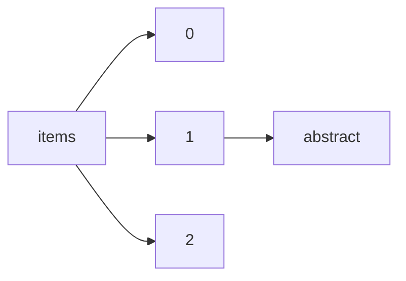

!!! warning "This document is not official Crossref documentation"
# Abstract
PATH = items/array/abstract(1)  
Occurs 19 351 793 times  
Unique values: > 999  
{ .annotate }

1. A route to an element, for example:  
   The route "items/array/abstract" corresponds to navigating through the JSON indices as  
   ["items"][0]["abstract"]  

!!! note "Due to current limitations, strings longer than 1,000 characters are truncated, which may lead to inaccurate calculations."

!!! note "Due to current limitations, only the first 1,000 unique values are counted."

| **Row** | **Value** `String`                                                                                       | **Count** `Int64` |
|--------:|------------------------------------------------------------------------------------------------------------:|---------------------:|
| **1**   | <jats:p />                                                                                                  | 46 499               |
| **2**   | <jats:p>Abstract not Available.</jats:p>                                                                    | 39 469               |
| **3**   | <jats:p>.</jats:p>                                                                                          | 25 405               |
| **4**   | <jats:p>-</jats:p>                                                                                          | 17 101               |
| **5**   | <jats:title>Abstract</jats:title>                                                                           | 5 579                |
| **6**   | <jats:p> not available </jats:p>                                                                            | 4 057                |
| **7**   | <jats:p>No abstract available.</jats:p>                                                                     | 3 384                |
| **8**   | <jats:p>N/A</jats:p>                                                                                        | 3 275                |
| **9**   | <jats:p>—</jats:p>                                                                                          | 3 055                |
| **10**  | <jats:p> &#x0D;\n </jats:p>                                                                                 | 2 582                |
| **11**  | <jats:p>\n                    </jats:p>                                                                     | 2 438                |
| **12**  | <jats:p>An amendment to this paper has been published and can be accessed via a link at the top of t        | 2 400                |
| **13**  | <jats:p>  </jats:p>                                                                                         | 2 255                |
| **14**  | <jats:sec><jats:title>Abstract</jats:title><jats:p>No Abstract</jats:p>\n         </jats:sec>               | 2 168                |
| **15**  | <jats:p>No abstract</jats:p>                                                                                | 1 777                |
| **16**  | <jats:p> </jats:p>                                                                                          | 1 422                |
| **17**  | <jats:p>No abstract.</jats:p>                                                                               | 1 418                |
| **18**  | 
 
                                                                                                    | 1 281                |
| **19**  | <jats:p>Resumen no disponible</jats:p>                                                                      | 1 245                |
| **20**  | <jats:p>Editorial</jats:p>                                                                                  | 1 156                |
| **21**  | <jats:p>\n                        \n                    </jats:p>                                           | 1 074                |
| **22**  | <jats:sec>\n<jats:title />\n<jats:p />\n</jats:sec>                                                         | 1 073                |
| **23**  | <jats:p>See abstract in article.</jats:p>                                                                   | 1 060                |
| **24**  | <jats:p> </jats:p>                                                                                          | 1 029                |
| **25**  | <jats:p>No abstract available</jats:p>                                                                      | 1 024                |
| **26**  | <jats:p>NA</jats:p>                                                                                         | 1 012                |
| **27**  | <jats:p>Extended abstract of a paper presented at Microscopy and Microanalysis 2012 in Phoenix, Ariz        | 987                  |
| **28**  | <jats:p>Extended abstract of a paper presented at Microscopy and Microanalysis 2010 in Portland, Ore        | 982                  |
| **29**  | <jats:p>None</jats:p>                                                                                       | 981                  |
| **30**  | <jats:p>Extended abstract of a paper presented at Microscopy and Microanalysis 2011 in  Nashville, T        | 973                  |
| **31**  | <jats:p>Extended abstract of a paper presented at Microscopy and Microanalysis 2013 in Indianapolis,        | 963                  |
| **32**  | <jats:p>n/a</jats:p>                                                                                        | 917                  |
| **33**  | <jats:p>An amendment to this paper has been published and can be accessed via the original article.<        | 875                  |
| **34**  | <jats:p>No description supplied</jats:p>                                                                    | 864                  |
| **35**  | <jats:p>Extended abstract of a paper presented at Microscopy and Microanalysis 2004 in Savannah, Geo        | 784                  |
| **36**  | <jats:p>No disponible</jats:p>                                                                              | 774                  |
| **37**  | <jats:p>Extended abstract of a paper presented at Microscopy and Microanalysis 2009 in Richmond, Vir        | 769                  |
| **38**  | 
                                                                                                       | 769                  |
| **39**  | <jats:p>(sem entrada)</jats:p>                                                                              | 767                  |
| **40**  | <jats:p>Abstract non disponibile</jats:p>                                                                   | 684                  |
| **41**  | <jats:p>---</jats:p>                                                                                        | 679                  |
| **42**  | <jats:p xml:lang="tr" />                                                                                    | 662                  |
| **43**  | <jats:p>Extended abstract of a paper presented at Microscopy and Microanalysis 2008 in Albuquerque,         | 661                  |
| **44**  | <jats:p>...</jats:p>                                                                                        | 635                  |
| **45**  | <jats:p>\n\t\t\t  </jats:p>                                                                                 | 589                  |
| **46**  | <jats:p>Abstract</jats:p>                                                                                   | 578                  |
| **47**  | <jats:p>no abstract</jats:p>                                                                                | 574                  |
| **48**  | <jats:p> </jats:p>                                                                                          | 541                  |
| **49**  | <jats:title>Abstract</jats:title>\n               <jats:p>No abstract available.</jats:p>                   | 538                  |
| **50**  | <jats:p>&lt;p&gt;No abstract&lt;/p&gt;</jats:p>                                                             | 519                  |
| **51**  | <jats:p>No contiene resumen</jats:p>                                                                        | 514                  |
| **52**  | <jats:p>No presenta resumen</jats:p>                                                                        | 492                  |
| **53**  | <jats:p>El artículo no presenta resumen.</jats:p>                                                           | 473                  |
| **54**  | <jats:p>nema</jats:p>                                                                                       | 471                  |
| **55**  | <jats:p>No disponible.</jats:p>                                                                             | 471                  |
| **56**  | <jats:p>Extended abstract of a paper presented at Microscopy and Microanalysis 2006 in Chicago, Illi        | 462                  |
| **57**  | <jats:p>Sin resumen</jats:p>                                                                                | 455                  |
| **58**  | <jats:p>Dieser Artikel ist nur als PDF-Dokument verfügbar.</jats:p>                                         | 441                  |
| **59**  | <jats:p> &#x0D;\n &#x0D;\n </jats:p>                                                                        | 433                  |
| **60**  | <jats:p>Extended abstract of a paper presented at Microscopy and Microanalysis 2006 in Chicago, Illi        | 424                  |
| **61**  | <jats:p>\nN/A </jats:p>                                                                                     | 410                  |
| **62**  | <jats:p>Binary file ES\_Abstracts\_Final\_ECDC.txt matches\n</jats:p>                                       | 395                  |
| **63**  | <jats:p>\*</jats:p>                                                                                         | 394                  |
| **64**  | <jats:p>SEM RESUMO</jats:p>                                                                                 | 394                  |
| **65**  | <jats:p>Resumen</jats:p>                                                                                    | 392                  |
| **66**  | <jats:p>Not available</jats:p>                                                                              | 390                  |
| **67**  | <jats:p>–</jats:p>                                                                                          | 383                  |
| **68**  | <jats:p>--</jats:p>                                                                                         | 377                  |
| **69**  | <jats:p>A correction to this article has been published and is linked from the HTML and PDF versions        | 375                  |
| **70**  | <jats:p>Se kort indholdsbeskrivelse i nummerets forord.</jats:p>                                            | 372                  |
| **71**  | <jats:title>Abstract</jats:title>\n        <jats:p>The authors have requested that this preprint be r       | 369                  |
| **72**  | <jats:p>Este artículo no cuenta con un resumen.</jats:p>                                                    | 363                  |
| **73**  | <jats:p>En esta época de la publicación de Diánoia no se incluían resúmenes.</jats:p>                       | 356                  |
| **74**  | <jats:p>NO ABSTRACT AVAILABLE</jats:p>                                                                      | 345                  |
| **75**  | <jats:p>0</jats:p>                                                                                          | 338                  |
| **76**  | <jats:p>Verbandsnachrichten der FKT - Fachvereinigung Krankenhaustechnik (e. V.). Diese Seiten sind         | 336                  |
| **77**  | <jats:p>This article (and all articles in the proceedings volume relating to the same conference) ha        | 335                  |
| **78**  | <jats:p>Intet resumé</jats:p>                                                                               | 329                  |
| **79**  | <jats:p>A correction to this article has been published and is linked from the HTML and PDF versions        | 329                  |
| **80**  | <jats:title>Abstract</jats:title>\n               <jats:p>This Chart is available in the print versio       | 327                  |
| **81**  | <jats:p>cf. fichier PDF de l'article.</jats:p>                                                              | 319                  |
| **82**  | <jats:p>Reseña</jats:p>                                                                                     | 311                  |
| **83**  | <jats:p>Por razões técnicas o resumo deste artigo não está disponível. Para maiores informações baix        | 310                  |
| **84**  | <jats:p>High-quality academic publishing is built on rigorous peer review [...]</jats:p>                    | 298                  |
| **85**  | <jats:p>SIN RESUMEN</jats:p>                                                                                | 296                  |
| **86**  | <jats:p>لا يوجد</jats:p>                                                                                    | 281                  |
| **87**  | <jats:p>Sin resumen.</jats:p>                                                                               | 280                  |
| **88**  | <jats:p>No abstract is available.</jats:p>                                                                  | 280                  |
| **89**  | <jats:p>[Ce texte n'a pas de résumé].</jats:p>                                                              | 279                  |
| **90**  | <jats:p>[Der findes ikke abstract til denne artikel]</jats:p>                                               | 278                  |
| **91**  | <jats:p>No disponible/Not available</jats:p>                                                                | 275                  |
| **92**  | <jats:p>\_</jats:p>                                                                                         | 270                  |
| **93**  | <jats:p>Reseña.</jats:p>                                                                                    | 262                  |
| **94**  | <jats:p>none</jats:p>                                                                                       | 261                  |
| **95**  | <jats:p>Δεν παρατίθεται περίληψη.</jats:p>                                                                  | 256                  |
| **96**  | <jats:p>Sammanfattning saknas</jats:p>                                                                      | 255                  |
| **97**  | <jats:p>N/a.</jats:p>                                                                                       | 249                  |
| **98**  | <jats:p>En este número no se incluyeron resúmenes ni palabras clave. </jats:p>                              | 249                  |
| **99**  | <jats:p>Book Review</jats:p>                                                                                | 244                  |
| **100** | <jats:p>”[Der findes ikke abstract til denne artikel]”</jats:p>                                             | 234                  |
| **101** | <jats:p>Not available.</jats:p>                                                                             | 232                  |
| **102** | <jats:p>This article has been retracted by IOP Publishing following an allegation that raises concer        | 226                  |
| **103** | <jats:p>[no abstract]</jats:p>                                                                              | 225                  |
| **104** | <jats:p>Abstract not available.</jats:p>                                                                    | 223                  |
| **105** | <jats:p>Rigorous peer-reviews are the basis of high-quality academic publishing [...]</jats:p>              | 218                  |
| **106** | <jats:p>ei saatavilla</jats:p>                                                                              | 215                  |
| **107** | <jats:p>En este número no se incluyeron resúmenes ni palabras clave.</jats:p>                               | 208                  |
| **108** | <jats:p>x</jats:p>                                                                                          | 205                  |
| **109** | <jats:title>Abstract</jats:title><jats:p />                                                                 | 204                  |
| **110** | <jats:p>لا يوجد </jats:p>                                                                                   | 202                  |
| **111** | <jats:p>Texto resumen.</jats:p>                                                                             | 197                  |
| **112** | <jats:p>Specialist Periodical Reports provide systematic and detailed review coverage of progress in        | 190                  |
| **113** | <jats:p>Extended abstract of a paper presented at MC 2007, 33rd DGE Conference\n                            | 189                  |
| **114** | <jats:p>Aucun résumé disponible.</jats:p>                                                                   | 184                  |
| **115** | <jats:p>recenzja</jats:p>                                                                                   | 182                  |
| **116** | <jats:title>Abstract</jats:title>\n        <jats:p>The authors have requested that this preprint be w       | 181                  |
| **117** | <jats:p>Intet abstract</jats:p>                                                                             | 176                  |
| **118** | <jats:p>ver PDF</jats:p>                                                                                    | 173                  |
| **119** | <jats:title>Abstract</jats:title>\n               <jats:sec>\n                  <jats:title>Focal poin      | 168                  |
| **120** | <jats:p>Sem resumo.</jats:p>                                                                                | 165                  |
| **121** | <jats:title>Abstract</jats:title>\n               <jats:p>No Abstract Available.</jats:p>                   | 164                  |
| **122** | <jats:p>No Abstract</jats:p>                                                                                | 161                  |
| **123** | <jats:p>Overview - No abstract available.</jats:p>                                                          | 160                  |
| **124** | <jats:p>&#x0D;\n&#x0D;\n&#x0D;\n&#x0D;\n&#x0D;\n&#x0D;\n&#x0D;\nThe article's abstract is not available.&#x | 157                  |
| **125** | <jats:p>No Abstract.</jats:p>                                                                               | 156                  |
| **126** | <jats:p>Resumen en inglés.</jats:p>                                                                         | 151                  |
| **127** | <jats:p>Rigorous peer-review is the corner-stone of high-quality academic publishing [...]</jats:p>         | 151                  |
| **128** | <jats:p>Ni</jats:p>                                                                                         | 150                  |
| **129** | <jats:p>Δεν διατίθεται περίληψη.</jats:p>                                                                   | 147                  |
| **130** | <jats:p>Book reviews</jats:p>                                                                               | 144                  |
| **131** | <jats:p>..</jats:p>                                                                                         | 142                  |
| **132** | <jats:p>nie dotyczy</jats:p>                                                                                | 142                  |
| **133** | <jats:p>Review</jats:p>                                                                                     | 140                  |
| **134** | <jats:p>Verbandsnachrichten der ÖVKT - Österreichischer Verband der Krankenhaustechniker. Diese Seit        | 137                  |
| **135** | <jats:p>NO TIENE</jats:p>                                                                                   | 136                  |
| **136** | <jats:p>This article has been retracted by IOP Publishing following an allegation that raises concer        | 136                  |
| **137** | <jats:p>- none -</jats:p>                                                                                   | 135                  |
| **138** | <jats:p>Não possui.</jats:p>                                                                                | 134                  |
| **139** | <jats:p>Summary not available.</jats:p>                                                                     | 133                  |
| **140** | <jats:p>The article's abstract is no available.</jats:p>                                                    | 131                  |
| **141** | <jats:p>Apresentação</jats:p>                                                                               | 130                  |
| **142** | <jats:p>Recension</jats:p>                                                                                  | 130                  |
| **143** | <jats:p>[χωρίς περίληψη]</jats:p>                                                                           | 129                  |
| **144** | <jats:title>Abstract</jats:title>\n               <jats:p>This abstract was withdrawn by the authors.       | 128                  |
| **145** | <jats:p>&lt;p&gt;No Abstract&lt;/p&gt;</jats:p>                                                             | 127                  |
| **146** | <jats:p>Extended abstract of a paper presented at Microscopy and Microanalysis 2008 in Albuquerque,         | 124                  |
| **147** | <jats:p> Null </jats:p>                                                                                     | 123                  |
| **148** | <jats:p>\n          </jats:p>                                                                               | 123                  |
| **149** | <jats:p>Resumo</jats:p>                                                                                     | 122                  |
| **150** | <jats:title>Abstract</jats:title>\n               <jats:p>This abstract was not presented at the symp       | 119                  |
| **151** | <jats:p>No presenta resumen.</jats:p>                                                                       | 117                  |
| **152** | <jats:p>Материалы V съезда фармакологов России «Научные основы поиска и создания новых лекарств» (14        | 116                  |
| **153** | <jats:p>Não há resumo.</jats:p>                                                                             | 114                  |
| **154** | <jats:p>\n</jats:p>                                                                                         | 113                  |
| **155** | <jats:title>Abstract</jats:title>\n               <jats:p>The front matter for this proceedings is av       | 112                  |
| **156** | <jats:p>New litterature</jats:p>                                                                            | 111                  |
| **157** | <jats:p> [Box: see text] </jats:p>                                                                          | 111                  |
| **158** | <jats:p>Sin información.</jats:p>                                                                           | 110                  |
| **159** | <jats:p>Resenha</jats:p>                                                                                    | 109                  |
| **160** | <jats:p>Rezension</jats:p>                                                                                  | 107                  |
| **161** | <jats:p>This file includes the entire issue in PDF format. The HTML versions of the peer-reviewed ar        | 107                  |
| **162** | <jats:p> The Calendar chronologically lists professional events of interest to SEG members and means        | 106                  |
| **163** | <jats:p>X</jats:p>                                                                                          | 106                  |
| **164** | <jats:p>See article</jats:p>                                                                                | 105                  |
| **165** | <jats:p>The abstract is available in the PDF</jats:p>                                                       | 104                  |
| **166** | <jats:p>This article has been retracted by IOP Publishing following an allegation that raises concer        | 104                  |
| **167** | <jats:p>Non disponibile / Not available</jats:p>                                                            | 102                  |
| **168** | <jats:p>\_\_\_</jats:p>                                                                                     | 102                  |
| **169** | <jats:p xml:lang="en">\n            <jats:italic>This meeting abstract was removed due to the OA lice       | 102                  |
| **170** | <jats:p>Aucun résumé disponible en français.</jats:p>                                                       | 101                  |
| **171** | <jats:p>Abstract of the panel presented at the SBBq annual meeting (see attachament).</jats:p>              | 100                  |
| **172** | <jats:p>The editorial team greatly appreciates the reviewers who have dedicated their considerable t        | 98                   |
| **173** | <jats:p>O artigo não apresenta resumo.</jats:p>                                                             | 98                   |
| **174** | <jats:p>compte rendu</jats:p>                                                                               | 97                   |
| **175** | <jats:p>&lt;!--[if gte mso 9]&gt;&lt;xml&gt; &lt;w:WordDocument&gt; &lt;w:View&gt;Normal&lt;/w:View&        | 96                   |
| **176** | <jats:p>na</jats:p>                                                                                         | 96                   |
| **177** | <jats:p>res</jats:p>                                                                                        | 93                   |
| **178** | <jats:title>Abstract</jats:title>\n        <jats:p>The authors have withdrawn this preprint due to au       | 93                   |
| **179** | <jats:p>Diese Seiten sind nur als PDF-Dokument verfügbar.</jats:p>                                          | 91                   |
| **180** | <jats:p>En este número no se incluyeron resúmenes ni palabras clave.  </jats:p>                             | 90                   |
| **181** | <jats:p>En este número no se incluyeron resúmenes ni palabras clave.     </jats:p>                          | 89                   |
| **182** | <jats:p>Presentación</jats:p>                                                                               | 89                   |
| **183** | <jats:p>No precisa de un resumen.</jats:p>                                                                  | 88                   |
| **184** | <jats:p>All papers published in this volume of <jats:italic>IOP Conference Series: Materials Science        | 88                   |
| **185** | 
Kuliah kerja lapang plus (KKLP) merupakan suatu kegiatan perkuliahan yang bersifat intrakurikuler        | 88                   |
| **186** | <jats:p>Editor's column - No abstract available.</jats:p>                                                   | 88                   |
| **187** | <jats:p>[Se référer au PDF pour le résumé].</jats:p>                                                        | 87                   |
| **188** | <jats:p>  </jats:p>                                                                                       | 86                   |
| **189** | <jats:p>Resumen en español</jats:p>                                                                         | 85                   |
| **190** | <jats:p>Guest editorial - No abstract available.</jats:p>                                                   | 85                   |
| **191** | <jats:p>Non disponibile.</jats:p>                                                                           | 85                   |
| **192** | <jats:p> Level of Evidence: V, Expert Opinion </jats:p>                                                     | 84                   |
| **193** | <jats:title>Abstract</jats:title>\n               <jats:p>This textbook on palliative social work is        | 83                   |
| **194** | <jats:p>Table of Contents</jats:p>                                                                          | 83                   |
| **195** | <jats:p>All papers published in this volume of <jats:italic>Journal of Physics: Conference Series</j        | 82                   |
| **196** | <jats:p>En este número no se incluyeron resúmenes ni palabras clave.</jats:p>                               | 80                   |
| **197** | <jats:p>President's column - No abstract available.</jats:p>                                                | 80                   |
| **198** | <jats:p>&lt;p&gt;No abstract &lt;/p&gt;</jats:p>                                                            | 80                   |
| **199** | <jats:title>Abstract</jats:title>\n               <jats:p>This section includes eighty-six short orig       | 80                   |
| **200** | <jats:p>Download the PDF file</jats:p>                                                                      | 79                   |
| **201** | <jats:p>Abstrak bisa dilihat di Lampiran</jats:p>                                                           | 79                   |
| **202** | <jats:p>Santrauka ruošiama</jats:p>                                                                         | 78                   |
| **203** | <jats:p>A correction to this article has been published and is linked from the HTML version of this         | 77                   |
| **204** | <jats:p>/</jats:p>                                                                                          | 77                   |
| **205** | <jats:p>Las reseñas no incluyen resumen.</jats:p>                                                           | 77                   |
| **206** | <jats:title />\n               <jats:p>No abstract available</jats:p>                                       | 76                   |
| **207** | <jats:p>1</jats:p>                                                                                          | 76                   |
| **208** | <jats:p>   </jats:p>                                                                                        | 75                   |
| **209** | <jats:p>N/A.</jats:p>                                                                                       | 75                   |
| **210** | <jats:p>Not available </jats:p>                                                                             | 75                   |
| **211** | <jats:p>&lt;p&gt;Supplementary Materials and Methods&lt;/p&gt;</jats:p>                                     | 75                   |
| **212** | <jats:p>- zu erstellen -</jats:p>                                                                           | 75                   |
| **213** | <jats:p>No Aplica</jats:p>                                                                                  | 75                   |
| **214** | <jats:p>Please see fulltext</jats:p>                                                                        | 74                   |
| **215** | <jats:p>Abstract Not Available</jats:p>                                                                     | 74                   |
| **216** | 
Kuliah Kerja Lapang Plus (KKLP) merupakan suatu kegiatan perkuliahan yang bersifat intrakurikuler        | 73                   |
| **217** | <jats:p>Forord</jats:p>                                                                                     | 70                   |
| **218** | <jats:p>Book review</jats:p>                                                                                | 70                   |
| **219** | <jats:title>Abstract</jats:title>\n        <jats:p>The authors have withdrawn this preprint from Rese       | 69                   |
| **220** | <jats:p>Please click the PDF button to access the review.</jats:p>                                          | 69                   |
| **221** | <jats:p>Δεν διατίθεται περίληψη / no abstract available</jats:p>                                            | 68                   |
| **222** | <jats:p>ㅤ</jats:p>                                                                                         | 68                   |
| **223** | <jats:p>La reseña no presenta resumen.</jats:p>                                                             | 67                   |
| **224** | 
Abstracts and keywords to be supplied.
                                                               | 67                   |
| **225** | <jats:p>Texto apresentado no III Encontro de História da Arte.</jats:p>                                     | 67                   |
| **226** | <jats:p>Under this heading are published regularly abstracts of all Reports and Memoranda of the Aer        | 66                   |
| **227** | <jats:p>Ver texto completo.</jats:p>                                                                        | 66                   |
| **228** | <jats:p>En este anuario meteorológico  se publica información registrada en la red climática de la F        | 65                   |
| **229** | <jats:p>abstract</jats:p>                                                                                   | 65                   |
| **230** | <jats:p>Resumen en español.</jats:p>                                                                        | 63                   |
| **231** | <jats:title>Abstract</jats:title>\n               <jats:p>Abstract not included.</jats:p>                   | 62                   |
| **232** | <jats:p>Noticias del BID, publicación mensual que tiene por objetivo informar acerca de las activida        | 62                   |
| **233** | <jats:p>ABSTRACT</jats:p>                                                                                   | 62                   |
| **234** | <jats:p>Complete digitized issue.</jats:p>                                                                  | 62                   |
| **235** | <jats:p>Available with full text.</jats:p>                                                                  | 61                   |
| **236** | <jats:p>#</jats:p>                                                                                          | 61                   |
| **237** | <jats:p>No abstract (available).</jats:p>                                                                   | 60                   |
| **238** | <jats:p>Анотація </jats:p>                                                                                  | 60                   |
| **239** | <jats:p>&lt;p&gt;Δεν παρατίθεται περίληψη στα ελληνικά.&lt;/p&gt;</jats:p>                                  | 60                   |
| **240** | <jats:p>Ver resumen en artículo</jats:p>                                                                    | 59                   |
| **241** | <jats:p> This section of the Journal attempts to keep readers informed of current resources of an in        | 58                   |
| **242** | <jats:p>Under this heading are published regularly abstracts of all Reports and Memoranda of the Aer        | 58                   |
| **243** | <jats:p>Texto apresentado no I Encontro de História da Arte.</jats:p>                                       | 58                   |
| **244** | <jats:p>Este artigo não contém resumo.</jats:p>                                                             | 58                   |
| **245** | <ns2:p>No abstract available.</ns2:p>                                                                       | 57                   |
| **246** | <jats:p>xxx</jats:p>                                                                                        | 57                   |
| **247** | <jats:p>Einführung in das Schwerpunktthema</jats:p>                                                         | 57                   |
| **248** | <jats:p>(...)</jats:p>                                                                                      | 57                   |
| **249** | <jats:title>Abstract</jats:title>\n<jats:p>In collaboration with the American College of Veterinary P       | 57                   |
| **250** | <jats:p xml:lang="en">None</jats:p>                                                                         | 57                   |
| **251** | <jats:p>  </jats:p>                                                                                         | 57                   |
| **252** | <jats:p>Δεν διατίθεται περίληψη</jats:p>                                                                    | 57                   |
| **253** | 
Kuliah kerja lapang plus (KKLP) merupakan sesuatu kegiatan perkuliahan yang bersifat intrakurikul        | 55                   |
| **254** | <jats:p>Az 1953-ban útjára indult, immáron hetvenéves Belügyi Szemle tudományos folyóirat jubileumi         | 55                   |
| **255** | <jats:p>This item is available only in the original language.</jats:p>                                      | 55                   |
| **256** | <jats:p>DE</jats:p>                                                                                         | 55                   |
| **257** | <jats:p>Expediente</jats:p>                                                                                 | 54                   |
| **258** | 
Abstract and Keywords to be supplied.
                                                                | 53                   |
| **259** | <jats:p>Não consta em edição publicada.</jats:p>                                                            | 53                   |
| **260** | <jats:p> This article lists contributors to this issue and provides brief biographies of them. </jat        | 52                   |
| **261** | <jats:p>No se posee.</jats:p>                                                                               | 51                   |
| **262** | <jats:p>Works published by the Grundtvig Society</jats:p>                                                   | 51                   |
| **263** | <jats:p>Resumen en inglés</jats:p>                                                                          | 50                   |
| **264** | <jats:p>Proceedings of the Twenty-Ninth Annual Meeting of the Berkeley Linguistics Society: General         | 50                   |
| **265** | <jats:p>NO ABSTRACT AVAILIBLE</jats:p>                                                                      | 50                   |
| **266** | <jats:title>Abstract</jats:title>\n        <jats:p>Research Square has withdrawn this preprint due to       | 50                   |
| **267** | <jats:p>Techbits - No abstract available.</jats:p>                                                          | 50                   |
| **268** | <jats:p>— </jats:p>                                                                                         | 50                   |
| **269** | <jats:p>[Full Paper] to pdf&#x0D;\nCopyright (c) 2020 Meraja journal&#x0D;\n</jats:p>                       | 49                   |
| **270** | 
One of the greatest gifts people can enjoy and share with others is a sense of one’s own inner pe        | 49                   |
| **271** | <jats:p>Recenze.</jats:p>                                                                                   | 49                   |
| **272** | <jats:p> The following books have been received from publishers and are under consideration for revi        | 49                   |
| **273** | <jats:p>Não disponível</jats:p>                                                                             | 49                   |
| **274** | <jats:p>    </jats:p>                                                                                       | 49                   |
| **275** | 
This is a case from the Abdomen section of <italic>Ultrasound</italic>. The specific content of e        | 49                   |
| **276** | <jats:p>Reseña de la obra mencionada.</jats:p>                                                              | 48                   |
| **277** | <jats:p>Map</jats:p>                                                                                        | 48                   |
| **278** | <jats:p>Proceedings of the Eighth Annual Meeting of the Berkeley Linguistics Society (1982)</jats:p>        | 48                   |
| **279** | <jats:p>[...]</jats:p>                                                                                      | 48                   |
| **280** | <jats:p>&lt;html /&gt;</jats:p>                                                                             | 48                   |
| **281** | 
Penghargaan terhadap kinerja dosen sangat diperlukan, sehingga mereka dapat meningkatkan pelayana        | 47                   |
| **282** | <jats:p>-\n\n</jats:p>                                                                                      | 47                   |
| **283** | <jats:p>Prices on software, books, and materials are subject to change. Consult the suppliers for th        | 47                   |
| **284** | 
Dalam rangka meningkatkan mutu pelayanan dosen khususnya Tridarma perguruan tinggi diperlukan pen        | 47                   |
| **285** | <jats:p>Absztrakt nélkül</jats:p>                                                                           | 47                   |
| **286** | <jats:p>Editor for this issue: Jeff Cox.</jats:p>                                                           | 47                   |
| **287** | <jats:p>Indhold</jats:p>                                                                                    | 47                   |
| **288** | <jats:p>The article's abstract is not available.</jats:p>                                                   | 47                   |
| **289** | <jats:p>&lt;p&gt;Supplementary Figure Legends&lt;/p&gt;</jats:p>                                            | 47                   |
| **290** | <jats:p>&lt;!--[if gte mso 9]&gt;&lt;xml&gt; &lt;w:WordDocument&gt; &lt;w:View&gt;Normal&lt;/w:View&        | 46                   |
| **291** | <jats:p>Review   </jats:p>                                                                                  | 46                   |
| **292** | <jats:p>En este número no se incluyeron resúmenes ni palabras clave.   </jats:p>                            | 46                   |
| **293** | <jats:p>Résumé non reçu.</jats:p>                                                                           | 46                   |
| **294** | <jats:p>Proceedings of the Twentieth Annual Meeting of the Berkeley Linguistics Society: General Ses        | 46                   |
| **295** | <jats:p>(none)</jats:p>                                                                                     | 45                   |
| **296** | <jats:p>This paper was prepared for the 48th Annual Fall Meeting of the Society of Petroleum Enginee        | 45                   |
| **297** | <jats:title>Abstract</jats:title><jats:p /><jats:p /><jats:p /><jats:p />                                   | 44                   |
| **298** | <jats:p>Full text available</jats:p>                                                                        | 44                   |
| **299** | <jats:p>Δεν παρατίθεται περίληψη στα ελληνικά.</jats:p>                                                     | 44                   |
| **300** | <jats:title />                                                                                              | 44                   |
| **301** | <jats:p>Subject Index</jats:p>                                                                              | 44                   |
| **302** | <jats:p>Editorial comment</jats:p>                                                                          | 44                   |
| **303** | <jats:p>Author Index</jats:p>                                                                               | 44                   |
| **304** | <jats:title />\n               <jats:p />                                                                   | 43                   |
| **305** | 
Kuliah Kerja Lapang Plus (KKLP) merupakan suatu kegiatan perkuliahan yang bersifat intrakurikuler        | 43                   |
| **306** | <jats:p>Book Reviews</jats:p>                                                                               | 43                   |
| **307** | <jats:p>Technology Update - No abstract available.</jats:p>                                                 | 42                   |
| **308** | <jats:title>Abstract</jats:title>\n        <jats:p>The authors have requested that this preprint be w       | 42                   |
| **309** | <jats:p>Resumé</jats:p>                                                                                     | 42                   |
| **310** | <jats:p>Annex to "Facts about adolescents from the Demographic and Health Survey—Statistical tables         | 42                   |
| **311** | <jats:p>Non disponibile</jats:p>                                                                            | 42                   |
| **312** | 
This is a case from the Kidney section of <italic>Genitourinary Imaging Cases</italic>. The speci        | 42                   |
| **313** | <jats:p>brak</jats:p>                                                                                       | 42                   |
| **314** | <jats:p>Δεν διατίθεται περίληψη στα ελληνικά</jats:p>                                                       | 41                   |
| **315** | <jats:p>This handbook is designed to provide a summary of the principal federal and state (Florida)         | 41                   |
| **316** | <jats:p>En este número no se incluyeron resúmenes ni palabras clave.      </jats:p>                         | 41                   |
| **317** | <jats:p>[Se engelsk abstract]</jats:p>                                                                      | 41                   |
| **318** | <jats:p>This paper was prepared for presentation at the 47th Annual Fall Meeting of the Society of P        | 41                   |
| **319** | 
This is a case from the Vascular section of <italic>Ultrasound</italic>. The specific content of         | 40                   |
| **320** | <jats:p>Proceedings of the Twenty-First Annual Meeting of the Berkeley Linguistics Society: General         | 40                   |
| **321** | <jats:title>Abstract</jats:title>\n               <jats:p>The following critiques express the opinion       | 40                   |
| **322** | <jats:p>Quiz for AAPC Continuing Education Units</jats:p>                                                   | 40                   |
| **323** | <jats:p>[no abstract available]</jats:p>                                                                    | 40                   |
| **324** | <jats:p>Proceedings of the Twenty-Second Annual Meeting of the Berkeley Linguistics Society: General        | 40                   |
| **325** | <jats:p>Proceedings of the Nineteenth Annual Meeting of the Berkeley Linguistics Society: General Se        | 39                   |
| **326** | <jats:p>Proceedings of the Twenty-Third Annual Meeting of the Berkeley Linguistics Society: General         | 39                   |
| **327** | <jats:p>Las reseñas no incluyen resumen.</jats:p>                                                           | 39                   |
| **328** | <jats:p>En este número no se incluyeron resúmenes ni palabras clave.    </jats:p>                           | 39                   |
| **329** | <jats:p>The Population Council initiated its work on adolescents in the mid-1990s. At that time, tho        | 39                   |
| **330** | <jats:title>Abstract</jats:title>\n               <jats:p>No Abstract available</jats:p>                    | 39                   |
| **331** | <jats:p>Abstract on PDF</jats:p>                                                                            | 38                   |
| **332** | 
Drawing on the experiences of hundreds of public health and primary care clinicians from across t        | 38                   |
| **333** | <jats:p>No Abstract Available</jats:p>                                                                      | 38                   |
| **334** | <jats:p>Der findes ikke resumé til denne artikel.</jats:p>                                                  | 38                   |
| **335** | <jats:p>nulo</jats:p>                                                                                       | 37                   |
| **336** | <jats:p>En este número no se incluyeron resúmenes ni palabras clave.    </jats:p>                           | 37                   |
| **337** | <jats:p>Research report.</jats:p>                                                                           | 37                   |
| **338** | <jats:p>Documento</jats:p>                                                                                  | 37                   |
| **339** | <jats:p>  Review   </jats:p>                                                                                | 37                   |
| **340** | <jats:p>recensie</jats:p>                                                                                   | 37                   |
| **341** | <jats:p>Please open the PDF to view the article</jats:p>                                                    | 36                   |
| **342** | <jats:p>Information</jats:p>                                                                                | 36                   |
| **343** | <jats:p>Proceedings of the Twenty-Sixth Annual Meeting of the Berkeley Linguistics Society: General         | 36                   |
| **344** | <jats:p>Abstract. Kein Abstract verfügbar.\n                    </jats:p>                                   | 36                   |
| **345** | <jats:p>The abstract not available.</jats:p>                                                                | 36                   |
| **346** | 
Kuliah kerja lapang plus (KKLP) merupakan suatu kegiatan perkeluliahan yang bersifat intrakulikul        | 36                   |
| **347** | <jats:p>Editorial da Revista HISTEDBR On-line</jats:p>                                                      | 36                   |
| **348** | <jats:p>Carbohydrate Chemistry provides review coverage of all publications relevant to the chemistr        | 36                   |
| **349** | <jats:p>Policy and practice perspective</jats:p>                                                            | 36                   |
| **350** | <jats:p>Please click the PDF button to access the full review.</jats:p>                                     | 36                   |
| **351** | <jats:p> This monthly feature will help readers keep current on new drugs, new indications and dosag        | 36                   |
| **352** | <jats:p>Guinea Ecuatorial como pregunta abierta: hacia el diálogo entre nuestras otredades</jats:p>         | 36                   |
| **353** | <jats:p>All papers published in this volume of <jats:italic>IOP Conference Series: Earth and Environ        | 35                   |
| **354** | <jats:p>Sem resumo</jats:p>                                                                                 | 35                   |
| **355** | <jats:p xml:lang="en" />                                                                                    | 35                   |
| **356** | <jats:p>Crítica literaria</jats:p>                                                                          | 35                   |
| **357** | <jats:p>signalement</jats:p>                                                                                | 34                   |
| **358** | <jats:p>Notas sobre literatura, escritura y arte contemporáneos</jats:p>                                    | 34                   |
| **359** | <jats:p>Organophosphorus Chemistry provides a comprehensive annual review of the literature. Coverag        | 34                   |
| **360** | <jats:p>[No disponible]</jats:p>                                                                            | 34                   |
| **361** | <jats:p>Otros caribes: de las Antillas al continente (sudamérica, centroamérica y norteamérica)</jat        | 34                   |
| **362** | <jats:p>La ciencia ficción en América Latina. Aproximaciones teóricas al imaginario de la experiment        | 34                   |
| **363** | <jats:p>S.R</jats:p>                                                                                        | 34                   |
| **364** | <jats:p>Editor for this issue: Dave Leshtz.</jats:p>                                                        | 34                   |
| **365** | <jats:p>Refer to the galley</jats:p>                                                                        | 34                   |
| **366** | <jats:p> This series outlines, briefly, the clinical presentation, diagnosis and management of the 3        | 34                   |
| **367** | <jats:p>Under this heading are published regularly abstracts of all Reports and Memoranda of the Aer        | 33                   |
| **368** | <jats:p>to be added</jats:p>                                                                                | 33                   |
| **369** | <jats:p>[Δε διατίθεται περίληψη]</jats:p>                                                                   | 33                   |
| **370** | <jats:p>nie dostarczono</jats:p>                                                                            | 33                   |
| **371** | <jats:p>Reseña de libro</jats:p>                                                                            | 33                   |
| **372** | <jats:p>Recenze</jats:p>                                                                                    | 33                   |
| **373** | <jats:p>\_\_</jats:p>                                                                                       | 33                   |
| **374** | <jats:p>All items listed may be borrowed from the Aslib Library, except those marked, which may be c        | 33                   |
| **375** | <jats:p> This department is devoted to shorter articles and notes on research in the communications         | 33                   |
| **376** | 
These case studies illustrate infections encountered in hospitals among patients with compromised        | 33                   |
| **377** | <jats:title>Abstract</jats:title>\n<jats:p>In collaboration with the American College of Veterinary R       | 33                   |
| **378** | <jats:p>not available</jats:p>                                                                              | 33                   |
| **379** | <jats:p>      </jats:p>                                                                                     | 32                   |
| **380** | <jats:p>None provided </jats:p>                                                                             | 32                   |
| **381** | <jats:p>Compte rendu</jats:p>                                                                               | 32                   |
| **382** | <jats:p>Under this heading are published regularly abstracts of all Reports and Memoranda of the Aer        | 32                   |
| **383** | <jats:p>As a spectroscopic method, Nuclear Magnetic Resonance (NMR) has seen spectacular growth over        | 32                   |
| **384** | <jats:p>Extended abstract of a paper presented at the Pre-Meeting Congress: Materials Research in an        | 32                   |
| **385** | <jats:p>No tiene</jats:p>                                                                                   | 32                   |
| **386** | <jats:p>Spectroscopic Properties of Inorganic and Organometallic Compounds provides a unique source         | 32                   |
| **387** | <jats:p>\*\*\*</jats:p>                                                                                     | 31                   |
| **388** | <jats:p>Éditorial / Editorial</jats:p>                                                                      | 31                   |
| **389** | <jats:p>Commentaire</jats:p>                                                                                | 31                   |
| **390** | <jats:p>None.</jats:p>                                                                                      | 31                   |
| **391** | <jats:p>DERROTA, MELANCOLÍA Y DESARME EN LA LITERATURA LATINOAMERICANA DE LAS ÚLTIMAS DÉCADAS</jats:        | 31                   |
| **392** | <jats:p>Management - No abstract available.</jats:p>                                                        | 31                   |
| **393** | <jats:p>A regular feature giving news and comments on events and productions in the field of visual         | 31                   |
| **394** | <jats:p>John Dover Wilson's New Shakespeare, published between 1921 and 1966, became the classic Cam        | 31                   |
| **395** | <jats:p>The authors wish to make the following corrections to this paper [...]</jats:p>                     | 31                   |
| **396** | <jats:p>This entry contains the front cover, front matter and back cover.</jats:p>                          | 31                   |
| **397** | 
This is a case from the Small Parts section of <italic>Ultrasound</italic>. The specific content         | 31                   |
| **398** | <jats:title />\n<jats:p />                                                                                  | 30                   |
| **399** | <jats:p>Trata-se de uma pesquisa realizada por amostra de domicílios urbanos, selecionados mediante         | 30                   |
| **400** | <jats:p>aaa</jats:p>                                                                                        | 30                   |
| **401** | <jats:p>NONE</jats:p>                                                                                       | 30                   |
| **402** | <jats:p>s. r.</jats:p>                                                                                      | 30                   |
| **403** | <jats:p>- -</jats:p>                                                                                        | 30                   |
| **404** | <jats:p>Kein Abstract vorhanden.</jats:p>                                                                   | 30                   |
| **405** | <jats:p>The breadth of scientific and technological interests in the general topic of photochemistry        | 30                   |
| **406** | <jats:p>   </jats:p>                                                                                        | 30                   |
| **407** | <jats:p>[Der findes ikke resumé til denne artikel]</jats:p>                                                 | 29                   |
| **408** | <jats:p>Revista Direito, Estado e Sociedade</jats:p>                                                        | 29                   |
| **409** | <jats:p>Índices de PreçosÍndices de ConfiançaÍndice do Volume de Vendas Reais no VarejoContas Nacion        | 29                   |
| **410** | <jats:p>None available.</jats:p>                                                                            | 29                   |
| **411** | <jats:p>Presentación.</jats:p>                                                                              | 29                   |
| **412** | <jats:p>None Available</jats:p>                                                                             | 29                   |
| **413** | <jats:p>Proceedings of the Twenty-Fourth Annual Meeting of the Berkeley Linguistics Society: General        | 29                   |
| **414** | <jats:p>Abstract on the PDF</jats:p>                                                                        | 28                   |
| **415** | 
This is a case from the Second Trimester section of <italic>Ultrasound</italic>. The specific con        | 28                   |
| **416** | <jats:p>THE BRAZILIAN SOCIETY FOR BLOOD AND MARROW TRANSPLANTATION (SBTMO) PRESENTS THE BRAZILIAN GU        | 28                   |
| **417** | <jats:p>Q&amp;A - No abstract available.</jats:p>                                                           | 28                   |
| **418** | <jats:p>Artikel dalam bentuk PDF</jats:p>                                                                   | 28                   |
| **419** | <jats:p>IQ Editor's Notes</jats:p>                                                                          | 28                   |
| **420** | 
This section consist of question and answers for the section
                                         | 28                   |
| **421** | <jats:p>A light fare to whet your mathematical appetite.</jats:p>                                           | 28                   |
| **422** | <jats:p>[Δεν διατίθεται περίληψη / no abstract available]</jats:p>                                          | 28                   |
| **423** | <jats:p>No hay resumenes disponibles.</jats:p>                                                              | 28                   |
| **424** | <jats:p>Abstrak dalam bentuk hard copy</jats:p>                                                             | 28                   |
| **425** | <jats:p>nicht vorhanden</jats:p>                                                                            | 28                   |
| **426** | <jats:title>Abstract</jats:title>\n        <jats:p>The authors have withdrawn this preprint due to er       | 27                   |
| **427** | <jats:p>Póster presentado en la IX Jornada de Jóvenes Investigadores del I3A</jats:p>                       | 27                   |
| **428** | <jats:p>Organometallic chemistry is an interdisciplinary science which continues to grow at a rapid         | 27                   |
| **429** | <jats:p>Veranstaltungen und Termine (nur als PDF-Dokument verfügbar)</jats:p>                               | 27                   |
| **430** | <jats:p>In recent years, the IMF has released a growing number of reports and other documents coveri        | 27                   |
| **431** | <jats:p> The purpose of this feature is to heighten awareness of specific adverse drug reactions (AD        | 27                   |
| **432** | <jats:p>The Web Library of Seventeenth-Century Music is a service offered by the Society for Sevente        | 27                   |
| **433** | <jats:p>Encuentra el número completo de la Revista Panorama en los siguientes formatos:</jats:p>            | 27                   |
| **434** | <jats:p>This is part of a handbook by Fritz Roka, Michael Olexa, Katherine Smallwood, Leo Polopolus,        | 27                   |
| **435** | <jats:p>No contiene resumen.</jats:p>                                                                       | 27                   |
| **436** | <jats:p>       </jats:p>                                                                                    | 27                   |
| **437** | <jats:p>tłumaczenie</jats:p>                                                                                | 27                   |
| **438** | 
Im Impressum des JMS‐Reports wird ausdrücklich darauf hingewiesen, dass der JMS‐Report nicht an J        | 27                   |
| **439** | <jats:p>&lt;!--[if gte mso 9]&gt;&lt;xml&gt; &lt;w:WordDocument&gt; &lt;w:View&gt;Normal&lt;/w:View&        | 27                   |
| **440** | <jats:p>Este livro e seus respectivos capítulos exprimem as inúmeras abordagens do complexo teórico         | 27                   |
| **441** | <jats:p>1. Unión Europea, Comunidades Autónomas, Derecho autonómico, Distribución de competencias.2.        | 27                   |
| **442** | <jats:p>&lt;!--[if gte mso 9]&gt;&lt;xml&gt; &lt;w:WordDocument&gt; &lt;w:View&gt;Normal&lt;/w:View&        | 26                   |
| **443** | <jats:p>Abstract dalam bentuk hard copy</jats:p>                                                            | 26                   |
| **444** | <jats:p>Supplements the (A) case.</jats:p>                                                                  | 26                   |
| **445** | <jats:p>[Nota do Editor]</jats:p>                                                                           | 26                   |
| **446** | <jats:p>&#x0D;\n&#x0D;\n&#x0D;\n&#x0D;\n&#x0D;\n&#x0D;\n&#x0D;\nThe Article Abstract is not available.&#x0D | 26                   |
| **447** | 
Kuliah kerja lapang plus ( KKLP ) merupakan suatu kegiatan perkuliahan yang bersifat intrakurikul        | 26                   |
| **448** | <jats:title>Abstract</jats:title><jats:p>C</jats:p>                                                         | 26                   |
| **449** | <jats:p>Absztrakt nélkül.</jats:p>                                                                          | 25                   |
| **450** | <jats:p>EXPLANATION OF THE MASTER LISTSThere are 28 master lists, grouped as convenient taxon groups        | 25                   |
| **451** | <jats:p>Ver en artículo</jats:p>                                                                            | 25                   |
| **452** | <jats:p>El artículo no presenta resumen</jats:p>                                                            | 25                   |
| **453** | <jats:p>In the original publication [...]</jats:p>                                                          | 25                   |
| **454** | <jats:p>Proceedings of the 25th Annual Meeting of the Berkeley Linguistics Society (2000)</jats:p>          | 25                   |
| **455** | <jats:p>        </jats:p>                                                                                   | 25                   |
| **456** | <jats:p>El Banco de la República (BR) genera información para la toma de decisiones, la rendición de        | 25                   |
| **457** | <jats:p> No abstract available. </jats:p><jats:p> Operations Research, ISSN 0030-364X, was published        | 25                   |
| **458** | <jats:p>لا يوجد\n \n </jats:p>                                                                              | 25                   |
| **459** | <jats:p>(Erratum)</jats:p>                                                                                  | 25                   |
| **460** | <jats:p>&lt;!--[if gte mso 9]&gt;&lt;xml&gt; &lt;o:OfficeDocumentSettings&gt; &lt;o:TargetScreenSize        | 25                   |
| **461** | <jats:p>&lt;!--[if gte mso 9]&gt;&lt;xml&gt; &lt;w:WordDocument&gt; &lt;w:View&gt;Normal&lt;/w:View&        | 24                   |
| **462** | <jats:p>American Institute of Mining, Metallurgical, and Petroleum Engineers, Inc.</jats:p>\n               | 24                   |
| **463** | <jats:p>[tekstas lietuvių kalba]</jats:p>                                                                   | 24                   |
| **464** | <jats:p> The increasing complexity of cancer chemotherapy makes it mandatory that pharmacists be fam        | 24                   |
| **465** | <jats:p>This paper was prepared for the SPE-European Spring Meeting 1974 of the Society of Petroleum        | 24                   |
| **466** | <jats:p>Abstract not available</jats:p>                                                                     | 24                   |
| **467** | <jats:p>Abstract is missing (Short communication)</jats:p>                                                  | 24                   |
| **468** | <jats:p>&lt;p&gt;Description of additional methods and procedures used in the study. Also includes S        | 24                   |
| **469** | <jats:p>&lt;p&gt;Description of additional methods and procedures used in the study.&lt;/p&gt;</jats        | 24                   |
| **470** | <jats:p>Não há.</jats:p>                                                                                    | 24                   |
| **471** | <jats:p>&lt;p&gt;N/A&lt;/p&gt;</jats:p>                                                                     | 24                   |
| **472** | <jats:p> This section features abstracts of articles covering empirical studies, experiences, ideas,        | 24                   |
| **473** | <jats:p>Resenha.</jats:p>                                                                                   | 24                   |
| **474** | <jats:p>&lt;span&gt;No abstract&lt;/span&gt;</jats:p>                                                       | 24                   |
| **475** | <jats:p>Nenhum resumo disponível</jats:p>                                                                   | 24                   |
| **476** | <jats:p>This article has been retracted, and the online PDF has been watermarked “RETRACTION”. The r        | 23                   |
| **477** | <jats:p>Abstract from the Proceedings of the 1st International Conference on Medical Humanities in t        | 23                   |
| **478** | <jats:p>Under this heading are published regularly abstracts of all Reports and Memoranda of the Aer        | 23                   |
| **479** | <jats:p>Introduktion</jats:p>                                                                               | 23                   |
| **480** | 
Kuliah Kerja Lapang Plus (KKLP) merupakan suatu kegiatan perkuliahan yang bersifat intrakurikuler        | 23                   |
| **481** | <jats:p>Full text available.</jats:p>                                                                       | 23                   |
| **482** | <jats:title>Abstract</jats:title>\n               <jats:p />                                                | 23                   |
| **483** | <jats:p>Número misceláneo</jats:p>                                                                          | 23                   |
| **484** | <jats:p> “Applications Reviews” is a guide to accomplished or partial MS/OR applications, cited in a        | 23                   |
| **485** | <jats:p>Full issue</jats:p>                                                                                 | 23                   |
| **486** | <jats:p>không có</jats:p>                                                                                   | 23                   |
| **487** | <jats:p> This department is devoted to shorter reports on research in the communications field. Read        | 23                   |
| **488** | <jats:p>Recenzja</jats:p>                                                                                   | 22                   |
| **489** | 
Openness and transparency constitute a foundational principle for research integrity, as set out         | 22                   |
| **490** | <jats:p> ‘Internet Review’ provides critical commentary on entrepreneurship, small business and inno        | 22                   |
| **491** | <jats:p>Δε διατίθεται περίληψη</jats:p>                                                                     | 22                   |
| **492** | <jats:p>[Δε διατίθεται περίληψη / no abstract available]</jats:p>                                           | 22                   |
| **493** | <jats:p>\n      </jats:p>                                                                                   | 22                   |
| **494** | <jats:p>Интервью.</jats:p>                                                                                  | 22                   |
| **495** | <jats:p> KEYWORDS: </jats:p>                                                                                | 22                   |
| **496** | <jats:p>American Institute of Mining, Metallurgical, and Petroleum Engineers, Inc.</jats:p>\n               | 22                   |
| **497** | <jats:p>Редакционная статья.</jats:p>                                                                       | 22                   |
| **498** | <jats:p>Extended abstract of a paper presented at Microscopy and Microanalysis 2008 in Albuquerque,         | 22                   |
| **499** | <jats:p> The Intellectual Property department in each issue of Geophysics provides U.S. patent abstr        | 22                   |
| **500** | <jats:p>sem resumo</jats:p>                                                                                 | 22                   |
| **501** | <jats:p>A weekly roundup of information on newly offered instrumentation, apparatus, and laboratory         | 22                   |
| **502** | 
This is a case from the Gynecology section of <italic>Ultrasound</italic>. The specific content o        | 22                   |
| **503** | <jats:p>See full-text version</jats:p>                                                                      | 22                   |
| **504** | <jats:p>Contribution to the International Chain Elongation Conference 2020 \| ICEC 2020. An abstract        | 22                   |
| **505** | <jats:p>Artículo</jats:p>                                                                                   | 22                   |
| **506** | <jats:p> The articles listed below were first published online ahead of print with incorrect DOIs. T        | 22                   |
| **507** | <jats:p>Não consta resumo na edição impressa.</jats:p>                                                      | 21                   |
| **508** | <jats:p>see full text attached</jats:p>                                                                     | 21                   |
| **509** | <jats:p>Selected Issues</jats:p>                                                                            | 21                   |
| **510** | <jats:p>Specialist Periodical Reports provide systematic and detailed review coverage of progress in        | 21                   |
| **511** | <jats:p>no abstract available</jats:p>                                                                      | 21                   |
| **512** | <jats:p>Sin Resumen</jats:p>                                                                                | 21                   |
| **513** | <jats:p>Misceláneo 258</jats:p>                                                                             | 21                   |
| **514** | <jats:p>ф</jats:p>                                                                                          | 21                   |
| **515** | <jats:p>JPT Forum - No abstract available.</jats:p>                                                         | 21                   |
| **516** | <jats:p>Vargas Vila, más allá de la hipérbole</jats:p>                                                      | 21                   |
| **517** | <jats:p> Managed health care has changed the way health services are provided and paid for. It is st        | 21                   |
| **518** | <jats:p>A Festschrift for Philippe Lejeune</jats:p>                                                         | 21                   |
| **519** | <jats:p>Crítica genética y literatura latinoamericana</jats:p>                                              | 21                   |
| **520** | <jats:p>A column of unofficial comment</jats:p>                                                             | 21                   |
| **521** | <jats:p>Reseñas</jats:p>                                                                                    | 20                   |
| **522** | <jats:p> A snapshot of noteworthy recent developments in the patent literature of relevance to pharm        | 20                   |
| **523** | <jats:p>In memoriam, Nekrolog</jats:p>                                                                      | 20                   |
| **524** | <jats:p>Polyglot mosaic</jats:p>                                                                            | 20                   |
| **525** | <jats:p> The Editorial Calendar details upcoming (approximately one year in advance) publication pla        | 20                   |
| **526** | <jats:p>Commentaire / Commentary</jats:p>                                                                   | 20                   |
| **527** | 
Tugas Akhir Adm Muthia Febio 18006041
                                                                | 20                   |
| **528** | <jats:p>Included within the sample</jats:p>                                                                 | 20                   |
| **529** | <jats:p>This article is a Letter to the Editor and does not include an Abstract.</jats:p>                   | 20                   |
| **530** | <jats:p>Presenta información general de la revista y su contenido.</jats:p>                                 | 20                   |
| **531** | <jats:p>The material in this section is arranged according to the system employed in the annual <jat        | 20                   |
| **532** | <jats:p>Configuraciones de lo sagrado en la literatura contemporánea del Cono Sur</jats:p>                  | 20                   |
| **533** | <jats:p> These questions relate to articles throughout the journal. Read the articles carefully, and        | 20                   |
| **534** | <jats:p>En este número no se incluyeron resúmenes ni palabras clave.  </jats:p>                             | 20                   |
| **535** | <jats:p>Abstract not available. </jats:p>                                                                   | 20                   |
| **536** | 
   
                                                                                                  | 19                   |
| **537** | <jats:title>Abstract</jats:title>\n          <jats:p>Background: Mining activities, including prospec       | 19                   |
| **538** | <jats:p> This section presents a synopsis of a selection of recently published articles of interest         | 19                   |
| **539** | <jats:p>Introduction pages</jats:p>                                                                         | 19                   |
| **540** | <jats:p> The purpose of this feature is to heighten awareness of specific adverse drug reactions (AD        | 19                   |
| **541** | <jats:p>A Universidade Federal de Pernambuco (UFPE), pautada pelos princípios da democracia, da tran        | 19                   |
| **542** | <jats:title /><jats:p />                                                                                    | 19                   |
| **543** | <jats:p>Intet abstract.</jats:p>                                                                            | 19                   |
| **544** | <jats:p>This page includes forthcoming AAAI sponsored conferences, conferences presented by AAAI Aff        | 19                   |
| **545** | <jats:p>resumo</jats:p>                                                                                     | 19                   |
| **546** | <jats:p>Reseña bibliográfica</jats:p>                                                                       | 19                   |
| **547** | <jats:title>Graphical Abstract</jats:title><jats:p />                                                       | 19                   |
| **548** | <jats:p>Om bidragyderne</jats:p>                                                                            | 19                   |
| **549** | <jats:p>Boa Leitura!</jats:p>                                                                               | 19                   |
| **550** | <jats:p>This item has no abstract. Follow the links below to access the full text.</jats:p>                 | 19                   |
| **551** | <jats:p>"NO ABSTRACT"</jats:p>                                                                              | 19                   |
| **552** | <jats:title>Abstract</jats:title>\n               <jats:p>No Abstract available.</jats:p>                   | 19                   |
| **553** | <jats:p xml:lang="en">-</jats:p>                                                                            | 18                   |
| **554** | <jats:p> Applications for Active membership have been received from the listed candidates. This publ        | 18                   |
| **555** | <jats:p>Δεν αναφέρεται περίληψη</jats:p>                                                                    | 18                   |
| **556** | <jats:p>Registrado en ASFA, Biological Abstracts, BIOSIS PREVIEWS, Geobase, Periodica, Zoological Re        | 18                   |
| **557** | <jats:p>    </jats:p>                                                                                       | 18                   |
| **558** | <jats:p>This book, comprising 24 chapters, proposes in an interdisciplinary way to present updated t        | 18                   |
| **559** | <jats:p> This section presents a synopsis of a selection of recently published research articles of         | 18                   |
| **560** | <jats:title>Abstract</jats:title>\n               <jats:p>This is a case from the Embolization sectio       | 18                   |
| **561** | <jats:p>List of authors' adresses</jats:p>                                                                  | 18                   |
| **562** | <jats:p>The Article Abstract is not available.</jats:p>                                                     | 18                   |
| **563** | <jats:p>Política de los afectos y emociones en producciones culturales de América Latina</jats:p>           | 18                   |
| **564** | <jats:p>American Institute of Mining, Metallurgical, and Petroleum Engineers, Inc.</jats:p>\n               | 18                   |
| **565** | <jats:p>Streszczenie nie jest dostępne.</jats:p>                                                            | 18                   |
| **566** | <jats:p>CONTINUAÇÃO</jats:p>                                                                                | 18                   |
| **567** | <jats:p> ORIENTACIONES TRANSANDINAS PARA LOS ESTUDIOS ANDINOS</jats:p>                                      | 18                   |
| **568** | <jats:p>American Institute of Mining, Metallurgical and Petroleum Engineers, Inc.</jats:p>\n                | 18                   |
| **569** | <jats:p>The International Health Regulations (2005) are legally binding on 196 States Parties, Inclu        | 18                   |
| **570** | <jats:p>Cover</jats:p>                                                                                      | 18                   |
| **571** | <jats:p>Letters</jats:p>                                                                                    | 18                   |
| **572** | <jats:p>  &#x0D;\n </jats:p>                                                                                | 18                   |
| **573** | 
These case studies illustrate infections encountered in hospitals among patients with compromised        | 18                   |
| **574** | <jats:p>Article without abstract</jats:p>                                                                   | 18                   |
| **575** | <jats:p>Title page</jats:p>                                                                                 | 18                   |
| **576** | <jats:p>A</jats:p>                                                                                          | 18                   |
| **577** | <jats:p>The presented statement is part of the volume it covers a variety of responses from people w        | 18                   |
| **578** | <jats:p>check</jats:p>                                                                                      | 18                   |
| **579** | <jats:p> This continuing feature will inform readers about the process of implementing, maintaining,        | 18                   |
| **580** | 
Academic achievement is one of the major subjects in the educational researches.Academic achievem        | 18                   |
| **581** | <jats:p>Языковая политика во Франции и в России: проблемы и перспективы (выступления участников семи        | 17                   |
| **582** | <jats:p>Book review.</jats:p>                                                                               | 17                   |
| **583** | <jats:p>[Sin resumen]</jats:p>                                                                              | 17                   |
| **584** | 
These case studies illustrate infections encountered in hospitals among patients with compromised        | 17                   |
| **585** | <jats:p>No abstract availableThis article was originally published by Parallel Press, an imprint of         | 17                   |
| **586** | <jats:p>[No abstract]</jats:p>                                                                              | 17                   |
| **587** | <jats:p>Verbandsnachrichten der DGIV - Deutsche Gesellschaft für Integrierte Versorgung im Gesundhei        | 17                   |
| **588** | <jats:p>&lt;p&gt;no abstract&lt;/p&gt;</jats:p>                                                             | 17                   |
| **589** | <jats:p><jats:italic>Got a career or related problem that needs answering? Can't find the right pers        | 17                   |
| **590** | <jats:p> These medication errors have occurred in health care facilities at least once. They will ha        | 17                   |
| **591** | <jats:p>         </jats:p>                                                                                  | 17                   |
| **592** | <jats:p> In this article, the Editor of Geophysics provides an overview of all technical articles in        | 17                   |
| **593** | <jats:p>None provided.</jats:p>                                                                             | 17                   |
| **594** | <jats:p>Its a Book review. Check out full PDF instead</jats:p>                                              | 17                   |
| **595** | <jats:p>En la lente: memoria, referencialidad histórica y documentalismo en el cine latinoamericano         | 17                   |
| **596** | <jats:p>poemas</jats:p>                                                                                     | 17                   |
| **597** | <jats:p>Número misceláneo 262</jats:p>                                                                      | 17                   |
| **598** | <jats:p xml:lang="en">null</jats:p>                                                                         | 17                   |
| **599** | <jats:title>Abstract</jats:title><jats:p>Let</jats:p>                                                       | 17                   |
| **600** | <jats:p>This paper was prepared for the Second Annual European Meeting of the Society of Petroleum E        | 17                   |
| **601** | 
This is a case from the Uterus and Fallopian Tube section of <italic>Genitourinary Imaging Cases<        | 16                   |
| **602** | <jats:p>,</jats:p>                                                                                          | 16                   |
| **603** | <jats:p>Editorial.</jats:p>                                                                                 | 16                   |
| **604** | <jats:p> This Hospital Pharmacy feature is extracted from Off-Label Drug Facts, a quarterly publicat        | 16                   |
| **605** | <jats:p> Recent books of interest in biblical, pastoral, historical, and theological scholarship. </        | 16                   |
| **606** | <jats:p>Abstract available with the full text.</jats:p>                                                     | 16                   |
| **607** | 
This chapter’s unique A to Z compendium covers the range of conditions presenting to the specialt        | 16                   |
| **608** | <jats:p>\n\t\t\t    ASDFASDFSADFAs ASDFdsa ASDF\n\t\t\t  </jats:p>                                          | 16                   |
| **609** | <jats:p>FORFATTERLISTE&#x0D;\n </jats:p>                                                                    | 16                   |
| **610** | <jats:p>Conselho Editorial</jats:p>                                                                         | 16                   |
| **611** | 
Die in der Printausgabe des JMS-Reports abgedruckte Liste jugendgefährdender Trägermedien sowie d        | 16                   |
| **612** | <jats:p>BRAK</jats:p>                                                                                       | 16                   |
| **613** | <jats:p>Available with fulltext.</jats:p>                                                                   | 16                   |
| **614** | <jats:p>Review    </jats:p>                                                                                 | 16                   |
| **615** | <jats:p>- </jats:p>                                                                                         | 16                   |
| **616** | <jats:p>abstrak</jats:p>                                                                                    | 16                   |
| **617** | <jats:title />\n               <jats:p>No Abstract available</jats:p>                                       | 16                   |
| **618** | <jats:p>bibliografia</jats:p>                                                                               | 16                   |
| **619** | <jats:title />\n               <jats:p>No abstract available.</jats:p>                                      | 16                   |
| **620** | <jats:p>  &#x0D;\n  </jats:p>                                                                               | 16                   |
| **621** | <jats:p>Papers in the Appendix were published in electronic format as Volume 1534</jats:p>                  | 16                   |
| **622** | <jats:p>Este documento deriva de los resultados del proyecto "Silvicultura de especies no tradiciona        | 16                   |
| **623** | <jats:p>Ensaio</jats:p>                                                                                     | 16                   |
| **624** | <jats:p>"El artículo no presenta resumen"</jats:p>                                                          | 15                   |
| **625** | <jats:sec><jats:title>Off-Label Drug Uses</jats:title><jats:p> This Hospital Pharmacy feature is ext        | 15                   |
| **626** | <jats:p>This paper was prepared for the 47th Annual Fall Meeting of the Society of Petroleum Enginee        | 15                   |
| **627** | <jats:p>Boa leitura!</jats:p>                                                                               | 15                   |
| **628** | <jats:p>The American Diabetes Association (ADA) “Standards of Medical Care in Diabetes” includes ADA        | 15                   |
| **629** | <jats:p>RESUMO - PÔSTER</jats:p>                                                                            | 15                   |
| **630** | <jats:p>Galen (Claudius Galenus, 129–c. 199 CE) is the most famous physician of the Greco-Roman worl        | 15                   |
| **631** | <jats:p>Fra redaktionen</jats:p>                                                                            | 15                   |
| **632** | 
Kuliah kerja lapangan plus (KKLP) merupakan suatu kegiatan perkuliahan yang bersifat intrakurikul        | 15                   |
| **633** | <jats:p>Buchbesprechung</jats:p>                                                                            | 15                   |
| **634** | <jats:p>\n            This column consists of selected traffic from the\n            <jats:italic>comp      | 15                   |
| **635** | <jats:p> This article provides news about individual members of the Society. </jats:p>                      | 15                   |
| **636** | <jats:title>Abstract</jats:title>\n               <jats:p>No Abstract Available. Please see the Print       | 15                   |
| **637** | <jats:p>Editorial Serviço Social &amp; Saúde</jats:p>                                                       | 14                   |
| **638** | <jats:p> A digest and review of wound care issues in other journals </jats:p>                               | 14                   |
| **639** | 
This is a case from the First Trimester section of <italic>Ultrasound</italic>. The specific cont        | 14                   |
| **640** | 
Kuliah kerja lapang plus (KKLP) merupakan suatu kegiatan perkuliahan yang bersifat intrakurikuler        | 14                   |
| **641** | <jats:p>Frontmatter.</jats:p>                                                                               | 14                   |
| **642** | <jats:p>Null</jats:p>                                                                                       | 14                   |
| **643** | <jats:p>There is an increasing challenge for chemical industry and research institutions to find cos        | 14                   |
| **644** | <jats:p>Review/Recension</jats:p>                                                                           | 14                   |
| **645** | <jats:p>Bidraget er ikke tilgængeligt elektronisk.</jats:p>                                                 | 14                   |
| **646** | <jats:p>The North Atlantic right whale (Eubalaena glacialis) remains one of the most endangered larg        | 14                   |
| **647** | <jats:p>En este número no se incluyeron resúmenes ni palabras clave. </jats:p>                              | 14                   |
| **648** | <jats:p> A special forum for individuals to respond in detail to material published in the Journal o        | 14                   |
| **649** | <jats:p>     </jats:p>                                                                                      | 14                   |
| **650** | <jats:p>This book is about the experiences of contemporary chief information officers (CIO). CIOs in        | 14                   |
| **651** | <jats:p>Número completo</jats:p>                                                                            | 14                   |
| **652** | <jats:p>Homenagem a Pedro Paulo Abreu Funari</jats:p>                                                       | 14                   |
| **653** | <jats:p>The editorial panel is presenting the following problem to stimulate submissions to “The Thi        | 14                   |
| **654** | <jats:p> Each month, subscribers to The Formulary® Monograph Service receive five to six researched         | 14                   |
| **655** | <jats:title>Abstract</jats:title>\n               <jats:p>This handbook is currently in development,        | 14                   |
| **656** | 
Kuliah kerja lapang plus (KKLP) merupakan salah satu kegiatan perkuliahan yang bersifat intra kur        | 14                   |
| **657** | <jats:p> Review   </jats:p>                                                                                 | 14                   |
| **658** | <jats:p>Ver contenido en artículo</jats:p>                                                                  | 13                   |
| **659** | <jats:p>República Dominicana y Cuba</jats:p>                                                                | 13                   |
| **660** | <jats:p>An output of the EdTech Hub, https://edtechhub.org</jats:p>                                         | 13                   |
| **661** | <jats:p>&#x0D;\n</jats:p>                                                                                   | 13                   |
| **662** | <jats:title>Abstract</jats:title>\n               <jats:p>This is a case from the Arterial Interventi       | 13                   |
| **663** | <jats:p>To slow down the spread of the Coronavirus, the population has been instructed to stay at ho        | 13                   |
| **664** | 
[RETRACTED]

Health 
                                                                            | 13                   |
| **665** | <jats:p>This paper was prepared for the 41st Annual Fall Meeting of the Society of Petroleum Enginee        | 13                   |
| **666** | 
kuliah kerja lapang plus (KKLP) merupakan suatu kegiatan perkuliahan yang bersifat intrakurikuler        | 13                   |
| **667** | <jats:p>This article does not have an abstract.</jats:p>                                                    | 13                   |
| **668** | <jats:p>American Institute of Mining, Metallurgical, and Petroleum Engineers, Inc.</jats:p>\n               | 13                   |
| **669** | <jats:p>                          </jats:p>                                                                 | 13                   |
| **670** | <jats:p>In memoriam.</jats:p>                                                                               | 13                   |
| **671** | <jats:p>resumen</jats:p>                                                                                    | 13                   |
| **672** | <jats:p>Please see Fulltext</jats:p>                                                                        | 13                   |
| **673** | <jats:p>To follow</jats:p>                                                                                  | 13                   |
| **674** | <jats:p>Resumo do artigo</jats:p>                                                                           | 13                   |
| **675** | <jats:p>Reading practices and oral and written production in elementary school" is the result of exp        | 13                   |
| **676** | <jats:p>None provided</jats:p>                                                                              | 13                   |
| **677** | <jats:title>Abstract</jats:title>\n        <jats:p>The full text of this preprint has been withdrawn        | 13                   |
| **678** | <jats:p> In-depth analysis of the latest research. </jats:p>                                                | 13                   |
| **679** | <jats:p> Each month, subscribers to The Formulary Monograph Service receive five to six well-documen        | 13                   |
| **680** | <jats:p>&#x0D;\n&#x0D;\n&#x0D;\n&#x0D;\n&#x0D;\n&#x0D;\n&#x0D;\nThe article's abstract is no available.&#x0 | 13                   |
| **681** | <jats:p>Essay</jats:p>                                                                                      | 13                   |
| **682** | <jats:p>table of contents</jats:p>                                                                          | 13                   |
| **683** | <jats:p> No Abstract Available. </jats:p>                                                                   | 13                   |
| **684** | <jats:p>see pdf</jats:p>                                                                                    | 13                   |
| **685** | <jats:p>Book Review&#x0D;\n </jats:p>                                                                       | 13                   |
| **686** | <jats:p>The American Diabetes Association (ADA) “Standards of Medical Care in Diabetes” includes the        | 12                   |
| **687** | <jats:p> Editor's Note </jats:p><jats:p> Our policy is to annotate all English-language books on eco        | 12                   |
| **688** | <jats:p>A roundup of weekly science policy and related news.</jats:p>                                       | 12                   |
| **689** | <jats:p>No contiene resúmen</jats:p>                                                                        | 12                   |
| **690** | <jats:p>This paper was prepared for the 48th Annual Fall Meeting of the Society of Petroleum Enginee        | 12                   |
| **691** | <jats:p>Changements dans les legislations du travail au Canada</jats:p>                                     | 12                   |
| **692** | 
Diese Studie bietet eine umfassende Übersicht über die klassische griechische Musik. Dass hier ei        | 12                   |
| **693** | <jats:p>On Going</jats:p>                                                                                   | 12                   |
| **694** | <jats:p>Type: Commentary</jats:p>                                                                           | 12                   |
| **695** | <jats:p>These details and drawings of patents granted in the United States are taken, by permission         | 12                   |
| **696** | <jats:p>Este livro destina-se aos leitores que buscam aprimorar constantemente seus conhecimentos na        | 12                   |
| **697** | <jats:p>Mensaje del editor de la revista Lux Médica.</jats:p>                                               | 12                   |
| **698** | <jats:p>Vollständiger Rezensionsteil</jats:p>                                                               | 12                   |
| **699** | <jats:p>O Projeto Oriente está associado às Disciplinas de Teoria e Método de Pesquisa I e II dos Cu        | 12                   |
| **700** | <jats:p>não há</jats:p>                                                                                     | 12                   |
| **701** | <jats:p>Absztrakt!</jats:p>                                                                                 | 12                   |
| **702** | <jats:p>This abstract has been withdrawn. Please see: https://doi.org/10.1093/cvr/cvac183</jats:p>          | 12                   |
| **703** | <jats:p>An array of Egyptian lifeworlds in 2016.</jats:p>                                                   | 12                   |
| **704** | <jats:p> This monthly feature will help readers keep current on new drugs, new indications and dosag        | 12                   |
| **705** | <jats:p> This column addresses questions from readers about any issue, process, standard, or future         | 12                   |
| **706** | <jats:p>Review  </jats:p>                                                                                   | 12                   |
| **707** | <jats:p>A series of articles dealing, in as simple a way as possible, with the basic facts of lubric        | 12                   |
| **708** | <jats:p>RESEÑA</jats:p>                                                                                     | 12                   |
| **709** | <jats:p>Proceedings of the Twenty-Eighth Annual Meeting of the Berkeley Linguistics Society: Special        | 12                   |
| **710** | <jats:p>Bio.</jats:p>                                                                                       | 12                   |
| **711** | <jats:p>Journal of Chemical Engineering Vol.ChE 23 1995-2005</jats:p>                                       | 12                   |
| **712** | <jats:title />\n\t\t\t\t<jats:p />                                                                          | 12                   |
| **713** | 
Surface focusing, holographic geometry and surface holographic integral
                              | 11                   |
| **714** | <jats:p>Kunst und Wissenschaft. Das klingt für viele so gegensätzlich wie Feuer und Wasser. Dabei si        | 11                   |
| **715** | <jats:p>Editorial Policy, Table of Contents and a word from the Editor.</jats:p>                            | 11                   |
| **716** | <jats:p>Este trabalho não apresenta resumo.</jats:p>                                                        | 11                   |
| **717** | <jats:p>Artykuł nie zawiera abstraktu w języku polskim.</jats:p>                                            | 11                   |
| **718** | <jats:p>Abstract </jats:p>                                                                                  | 11                   |
| **719** | <jats:p>Artwork</jats:p>                                                                                    | 11                   |
| **720** | <jats:p>Recensão</jats:p>                                                                                   | 11                   |
| **721** | <jats:p> Case Teaching Note: Interested Instructors please see the Instructor Materials page for acc        | 11                   |
| **722** | <jats:p>&lt;!--[if gte mso 9]&gt;&lt;xml&gt; &lt;o:OfficeDocumentSettings&gt; &lt;o:AllowPNG /&gt; &        | 11                   |
| **723** | <jats:p>&lt;span style="font-size: 10.0pt; font-family: Verdana; mso-fareast-font-family: &amp;quot;        | 11                   |
| **724** | <jats:p>The American Diabetes Association (ADA) “Standards of Care in Diabetes” includes the ADA’s c        | 11                   |
| **725** | <jats:p> The Formulary Information Exchange (The F.I.X.) is an online drug information service avail        | 11                   |
| **726** | <jats:p>This paper was prepared for the 43rd Annual California Regional Meeting of the Society of Pe        | 11                   |
| **727** | <jats:title>Abstract</jats:title>\n               <jats:p>This is a case from the Venous Intervention       | 11                   |
| **728** | <jats:p> The increasing complexity of cancer chemotherapy makes it mandatory that pharmacists be fam        | 11                   |
| **729** | <jats:p xml:lang="en">Manuscript contains photographic slides not appended to this PDF.</jats:p>            | 11                   |
| **730** | <jats:p>Mercado forestal es una publicación trimestral que incluye en sus primeras páginas los eleme        | 11                   |
| **731** | <jats:p>Interview</jats:p>                                                                                  | 11                   |
| **732** | <jats:p>Contribution to the dialogue on Canada’s federal penitentiary system and the need for penal         | 11                   |
| **733** | <jats:p>Comentário</jats:p>                                                                                 | 11                   |
| **734** | <jats:p>&lt;p&gt;Supplementary Methods&lt;/p&gt;</jats:p>                                                   | 11                   |
| **735** | <jats:p>Este número corresponde a la primera época de la Revista de El Colegio de San Luis, denomina        | 11                   |
| **736** | <jats:p>Tabla de contenido</jats:p>                                                                         | 11                   |
| **737** | 
Kuliah Kerja Lapang Plus (KKLP) merupakan suatu kegiatan perkuliahan yang bersifat intrakurikuler        | 11                   |
| **738** | <jats:p>The Geological Curators’ Group, established in 1974, undertook a survey in 1981 investigatin        | 11                   |
| **739** | <jats:p>Este artigo não possui resumo.</jats:p>                                                             | 11                   |
| **740** | 
Pakai abstrak di paper
                                                                               | 11                   |
| **741** | <jats:p>Abstract non disponibile (Epidemiology\_statistics)</jats:p>                                        | 11                   |
| **742** | <jats:p>           </jats:p>                                                                                | 11                   |
| **743** | <jats:p>Abstract non disponibile (Cardionephrology)</jats:p>                                                | 11                   |
| **744** | <jats:p>Abstract is coming soon</jats:p>                                                                    | 10                   |
| **745** | <jats:p>Daftar Isi</jats:p>                                                                                 | 10                   |
| **746** | 
Stilbenes are a group of chemicals characterized with the presence of 1,2-diphenylethylene. Previ        | 10                   |
| **747** | <jats:p> Send your letters to: The Editor, Child Care, St Jude's Church, Dulwich Road, Herne Hill, L        | 10                   |
| **748** | <jats:p>no presenta resumen</jats:p>                                                                        | 10                   |
| **749** | <jats:p>         </jats:p>                                                                                  | 10                   |
| **750** | <jats:p>A translation of the abstracts of all the articles for this issue into English, French, Russ        | 10                   |
| **751** | <jats:p>Dieser Artikel ist nur als PDFDokument verfügbar.</jats:p>                                          | 10                   |
| **752** | <jats:p> Articles on the state of the art of developments in building services engineering Welcome t        | 10                   |
| **753** | <jats:p>A correction to this article has been published and is linked from the HTML and PDF versions        | 10                   |
| **754** | <jats:p>[Note: This is a re-posting of a series of related blogs related to conducting meta-analysis        | 10                   |
| **755** | <jats:p>Poem</jats:p>                                                                                       | 10                   |
| **756** | <jats:p> This section presents a synopsis of a selection of recently published research articles of         | 10                   |
| **757** | <jats:title>News</jats:title>\n               <jats:p>News</jats:p>\n               <jats:p>The sectio      | 10                   |
| **758** | <jats:p>Abstrakt</jats:p>                                                                                   | 10                   |
| **759** | <jats:p>Conference review - No abstract available.</jats:p>                                                 | 10                   |
| **760** | <jats:p> These medication errors have occurred in health care facilities at least once. They will ha        | 10                   |
| **761** | <jats:p>Reseñas.</jats:p>                                                                                   | 10                   |
| **762** | 
    
                                                                                                 | 10                   |
| **763** | <jats:p>Augustin-Louis, Baron Cauchy (1789–1857) was the pre-eminent French mathematician of the nin        | 10                   |
| **764** | <jats:p> Summaries in english </jats:p>                                                                     | 10                   |
| **765** | <jats:p>Noticias</jats:p>                                                                                   | 10                   |
| **766** | <jats:title>Abstract</jats:title>\n               <jats:p>This section consist of question and answer       | 10                   |
| **767** | <jats:title />\n            <jats:p>No abstract available</jats:p>                                          | 10                   |
| **768** | <jats:p>A collection of technology highlights pulled from recent papers published in ECS journals.</        | 10                   |
| **769** | <jats:p>Under this heading are published regularly abstracts of Reports and Memoranda of the Aeronau        | 10                   |
| **770** | <jats:p>Índice Analítico de la reseña legislativa.</jats:p>                                                 | 10                   |
| **771** | <jats:p>Die Schleswig-Holsteinische Bibliographie ist eine Literaturdokumentation. Sie verzeichnet B        | 10                   |
| **772** | <jats:p>Proceedings of the Nineteenth Annual Meeting of the Berkeley Linguistics Society: Special Se        | 10                   |
| **773** | <jats:p>Abstract not available. Disclosures: None. Copyright 2018 SKIN</jats:p>                             | 10                   |
| **774** | 
This is a case from the Testis, Epididymis, and Scrotum section of <italic>Genitourinary Imaging         | 10                   |
| **775** | <jats:p>Available with full text</jats:p>                                                                   | 10                   |
| **776** | <jats:p>Abstraktit julkaistaan numerosta 60 alkaen.</jats:p>                                                | 10                   |
| **777** | <jats:p> Molly Courtenay helps resolve everyday issues for nurse prescribers </jats:p>                      | 10                   |
| **778** | <jats:p>Arrangement of music from Le Temple de la Paix LWV 69 (1685)</jats:p>                               | 10                   |
| **779** | <jats:p>Proceedings of the Twenty-Third Annual Meeting of the Berkeley Linguistics Society: Special         | 10                   |
| **780** | <jats:p>This Commentary is a response to a Commentary published in the May/June 2020 issue:&#x0D;\nNa       | 10                   |
| **781** | <jats:p>A correction to this article has been published and is linked from the HTML version of this         | 10                   |
| **782** | <jats:p>Reviews</jats:p>                                                                                    | 10                   |
| **783** | <jats:p>a\n\n</jats:p>                                                                                      | 10                   |
| **784** | <jats:p>Proceedings of the Eighteenth Annual Meeting of the Berkeley Linguistics Society: Special Se        | 10                   |
| **785** | <jats:p> This Chart is available in the print version. </jats:p>                                            | 10                   |
| **786** | 
Ekonomi Islam mulai diterapkan sejak era Nabi Muhammad SAW. Hingga kemudian dikembangkan oleh ula        | 10                   |
| **787** | <jats:p>There is no abstract available from the publish and or printed article</jats:p>                     | 10                   |
| **788** | <jats:p>&lt;p&gt;PDF file - 61K&lt;/p&gt;</jats:p>                                                          | 9                    |
| **789** | <jats:p> Each month, subscribers to The Formulary<jats:sup>®</jats:sup> Monograph Service receive fi        | 9                    |
| **790** | <jats:p>Artigo apresentado no II Ciclo de Debates o Rural e o Urbano, no GT 3 - Resistências no urba        | 9                    |
| **791** | <jats:title>Editorial</jats:title>\n               <jats:p>Editorial</jats:p>\n               <jats:p>      | 9                    |
| **792** | <jats:p> This monthly feature will help readers keep current on new drugs, indications, dosage forms        | 9                    |
| **793** | <jats:p>This paper was prepared for the 40th Annual California Regional Meeting of the Society of Pe        | 9                    |
| **794** | <jats:p>The American Diabetes Association (ADA) “Standards of Medical Care in Diabetes” includes ADA        | 9                    |
| **795** | <jats:p>\n\t  </jats:p>                                                                                     | 9                    |
| **796** | 
This is a case from the Adrenal section of <italic>Genitourinary Imaging Cases</italic>. The spec        | 9                    |
| **797** | <jats:p>Schriftenschau</jats:p>                                                                             | 9                    |
| **798** | <jats:p>The “Math by the Month” activities are designed to engage students to think like mathematici        | 9                    |
| **799** | <jats:p> This monthly feature will help readers keep current on new drugs, indications, dosage forms        | 9                    |
| **800** | <jats:p>no abstract&lt;br /&gt;</jats:p>                                                                    | 9                    |
| **801** | <jats:p>Beste lezer,</jats:p>                                                                               | 9                    |
| **802** | <jats:p>American Institute of Mining, Metallurgical, and Petroleum Engineers, Inc.</jats:p>\n               | 9                    |
| **803** | <jats:p>The title of each session is linked to its abstract in the Table of Contents included at the        | 9                    |
| **804** | <jats:p>&#x0D;\n&#x0D;\n(forthcoming)&#x0D;\n&#x0D;\n</jats:p>                                              | 9                    |
| **805** | <jats:p>Front matter</jats:p>                                                                               | 9                    |
| **806** | <jats:p>&lt;p&gt;Supplemental Figure Legends&lt;/p&gt;</jats:p>                                             | 9                    |
| **807** | <jats:p>All items listed may be borrowed from the Aslib Library, except those marked \*, which may be       | 9                    |
| **808** | <jats:p> This continuing feature will inform readers about the process of implementing, maintaining,        | 9                    |
| **809** | <jats:p xml:lang="fr" />                                                                                    | 9                    |
| **810** | 
JUAL OBAT CYTOTEC ASLI - JUAL OBAT GASTRUL AMPUH - JUAL OBAT GYNAECOSID MANJUR - HARGA OBAT ABORS        | 9                    |
| **811** | <jats:p>a</jats:p>                                                                                          | 9                    |
| **812** | <jats:p>Founder: Jeff Cox. Editor: Dave Leshtz.</jats:p>                                                    | 9                    |
| **813** | <jats:p>O que nasceu como uma tentativa de aproximar pesquisadores de diversas áreas, de mobilizar o        | 9                    |
| **814** | <jats:p>A translation of the abstracts of all the articles for this issue into French, Russian and S        | 9                    |
| **815** | 
Indonesia sehat adalah suatu gambaran kondisi Indonesia di masa depan,  yakni  masyarakat,  bangs        | 9                    |
| **816** | <jats:p>Abstract of the panel presented at the SBBq annual meeting (see Attachment).</jats:p>               | 9                    |
| **817** | <jats:p> The Practice Notes section is intended to keep readers informed about health education prac        | 9                    |
| **818** | <jats:p>The following posters are a result of research done by the students in Dr. Cynthia Levine-Ra        | 9                    |
| **819** | <jats:p> This monthly feature will help readers keep current on new drugs, new indications and dosag        | 9                    |
| **820** | <jats:p>Olá professor(a)! Seja bem-vindo(a) ao CURSO FORMAÇÃO DE MEDIADORES EM EDUCAÇÃO PARA REDUÇÃO        | 9                    |
| **821** | <jats:p>Ficha Catalográfica</jats:p>                                                                        | 9                    |
| **822** | <jats:p>Preface</jats:p>                                                                                    | 9                    |
| **823** | <jats:p>&lt;p&gt;PDF file - 88K&lt;/p&gt;</jats:p>                                                          | 9                    |
| **824** | <jats:p>Recenzija</jats:p>                                                                                  | 9                    |
| **825** | <jats:p>Nachruf</jats:p>                                                                                    | 9                    |
| **826** | <jats:p> Each month, subscribers to The Formulary Monograph Service receive five to six well-documen        | 9                    |
| **827** | 
This paper has been presenting at The 11th International Workshop And Conference Of Asean Studies        | 8                    |
| **828** | <jats:p>.-</jats:p>                                                                                         | 8                    |
| **829** | <jats:p>This is part of a series of 2-5 page fact sheets by Elizabeth B. Bolton and Anna Guest-Jelle        | 8                    |
| **830** | <jats:p> Brief overview of papers published in the issue. </jats:p><jats:p> INFORMS Journal on Compu        | 8                    |
| **831** | <jats:p>Artículo sección Escritorio</jats:p>                                                                | 8                    |
| **832** | <jats:p>[For the English full text of the article please see the attached PDF-File (English version         | 8                    |
| **833** | <jats:p>&lt;p&gt;PDF file - 105K&lt;/p&gt;</jats:p>                                                         | 8                    |
| **834** | <jats:p>Letter to the Editor</jats:p>                                                                       | 8                    |
| **835** | <jats:p>&lt;p&gt;No abstract.&lt;/p&gt;</jats:p>                                                            | 8                    |
| **836** | <jats:p>A regular feature giving news and comment on events and productions in the field of visual a        | 8                    |
| **837** | <jats:p>in memoriam</jats:p>                                                                                | 8                    |
| **838** | <jats:p>          </jats:p>                                                                                 | 8                    |
| **839** | <jats:p>Comunicación</jats:p>                                                                               | 8                    |
| **840** | <jats:p>Supplementary Table from Global DNA Methylation Analysis of Cancer-Associated Fibroblasts Re        | 8                    |
| **841** | 
A buffer solution has the function of resisting changes in pH even when adding powerful acids or         | 8                    |
| **842** | <jats:title>Abstract</jats:title>\n               <jats:p>This is a case from the Drainage section of       | 8                    |
| **843** | <jats:p>Dansk, finsk, norsk og svensk kronik</jats:p>                                                       | 8                    |
| **844** | <jats:p>Please see fulltext.</jats:p>                                                                       | 8                    |
| **845** | <jats:p>Cover depan belakang, pengantar redaksi dan daftar isi</jats:p>                                     | 8                    |
| **846** | <jats:p>Proceedings of the Twentieth Annual Meeting of the Berkeley Linguistics Society: Special Ses        | 8                    |
| **847** | <jats:p>Streszczenie jest niedostępne.</jats:p>                                                             | 8                    |
| **848** | <jats:p>XXX\n\n</jats:p>                                                                                    | 8                    |
| **849** | <jats:p>The American Diabetes Association (ADA) “Standards of Medical Care in Diabetes” includes the        | 8                    |
| **850** | <jats:p>Pornography is a fictional media genre that depicts sexual fantasies and explicitly presents        | 8                    |
| **851** | <jats:p>Proceedings of the Twenty-First Annual Meeting of the Berkeley Linguistics Society: Special         | 8                    |
| **852** | <jats:p>&lt;p&gt;Supplementary Figure legends&lt;/p&gt;</jats:p>                                            | 8                    |
| **853** | <jats:p>No Abstract available</jats:p>                                                                      | 8                    |
| **854** | <jats:p>[Abstract not available]</jats:p>                                                                   | 8                    |
| **855** | <jats:title>Abstract</jats:title>\n\t\t\t\t<jats:p />                                                       | 8                    |
| **856** | <jats:p>Presentación del dossier</jats:p>                                                                   | 8                    |
| **857** | <jats:p>poesia</jats:p>                                                                                     | 8                    |
| **858** | <jats:p> These medication errors have occurred in health care facilities at least once. They will ha        | 8                    |
| **859** | <jats:p>Las reseñas se consignan a continuación del libro (o artículo reseñado). Cuando éste se ha d        | 8                    |
| **860** | <jats:p>                           </jats:p>                                                                | 8                    |
| **861** | 
[RETRACTED]

CLICK HERE TO CHECK DISCOUNTED PRICE (24HRS LIMITED OFFER) 
                        | 8                    |
| **862** | <jats:p>The increasing complexity of cancer chemotherapy makes it mandatory that pharmacists be fami        | 8                    |
| **863** | <jats:p> Molly Courtenay helps resolve everyday issues for nurse prescribers. </jats:p>                     | 8                    |
| **864** | <jats:p> This page provides contact information for the TLE Editorial Board and SEG's executive lead        | 8                    |
| **865** | <jats:p>\nThere is not an abstract available for this presentation. To view the video, click the link       | 8                    |
| **866** | <jats:p>Poster presented at the International Leucaena Conference, 1‒3 November 2018, Brisbane, Quee        | 8                    |
| **867** | <jats:p>En este número no se incluyeron resúmenes ni palabras clave.   </jats:p>                            | 8                    |
| **868** | <jats:p>Sumário</jats:p>                                                                                    | 8                    |
| **869** | 
Kuliah kerja lapang plus (KKLP) merupakan salah satu kegiatan perkuliahan yang bersifat intrakuri        | 7                    |
| **870** | <jats:p>On 8 July 1991, Qatar filed an application instituting proceedings against Bahrain in respec        | 7                    |
| **871** | 
These case studies illustrate infections encountered in hospitals among patients with compromised        | 7                    |
| **872** | <jats:p>BID América cubre las tendencias del desarrollo económico y social de América Latina y el Ca        | 7                    |
| **873** | <jats:p>No Abstract available.</jats:p>                                                                     | 7                    |
| **874** | <jats:p> Nigel Stone, Senior Lecturer in the School of Social Work, University of East Anglia, revie        | 7                    |
| **875** | 
This is a case from the Ureter and Bladder section of <italic>Genitourinary Imaging Cases</italic        | 7                    |
| **876** | <jats:title>Abstract</jats:title>\n               <jats:p>This is a case from the Biopsy section of I       | 7                    |
| **877** | 
Resume ini diupload untuk memenuhi tugas individu pada mata kuliah Ekonomi Moneter Islam.
            | 7                    |
| **878** | <jats:p>Twenty years of <jats:italic>Cambridge Opera Journal</jats:italic>: in view of the journal's        | 7                    |
| **879** | <jats:p>Article</jats:p>                                                                                    | 7                    |
| **880** | <jats:p>No abstract availableThis article was originally published by Parallel Press, an imprint of         | 7                    |
| **881** | <jats:title>Abstract</jats:title>\n        <jats:p>Research Square has withdrawn this preprint. Pleas       | 7                    |
| **882** | <jats:p>&lt;p&gt;Supplementary Tables&lt;/p&gt;</jats:p>                                                    | 7                    |
| **883** | <jats:p> This section presents a synopsis of a selection of recently published articles of interest         | 7                    |
| **884** | <jats:p>Anais do “I Seminário de Ensino, Pesquisa e Extensão da Pós-Graduação em Filosofia da UNESAR        | 7                    |
| **885** | <jats:p>A PDAD 2013/2014 abordou aspectos relativos às Características da Unidade Domiciliar, Infrae        | 7                    |
| **886** | <jats:p>Dissertation Abstract</jats:p>                                                                      | 7                    |
| **887** | <jats:p>'Chronicles' is a journal column of "MELINTAS" which contains information about the various         | 7                    |
| **888** | <jats:p>Proceedings of the 25th Annual Meeting of the Berkeley Linguistics Society: Special Session         | 7                    |
| **889** | <jats:p>Cet article est un compte-rendu du livre : </jats:p>                                                | 7                    |
| **890** | <jats:p>Dhaka Univ. J. Pharm. Sci. Vol.5(1-2) 2006&#x0D;\n&#x0D;\nThe full text is of this article is       | 7                    |
| **891** | <jats:p>Abstract non disponibile.</jats:p>                                                                  | 7                    |
| **892** | <jats:p>O trabalho não apresenta resumo.</jats:p>                                                           | 7                    |
| **893** | <jats:p>In the Commonwealth.</jats:p>                                                                       | 7                    |
| **894** | 
The pursuit of medical careers, as well as advocating for epilepsy research, ketogenic therapies,        | 7                    |
| **895** | <jats:p> [Contributors and querists of this department are requested to send their correct names and        | 7                    |
| **896** | <jats:p>American Institute of Mining, Metallurgical, and Petroleum Engineers, Inc.</jats:p>\n               | 7                    |
| **897** | <jats:p>Reseña&lt;br /&gt;</jats:p>                                                                         | 7                    |
| **898** | <jats:p>Proceedings of the Twenty-Second Annual Meeting of the Berkeley Linguistics Society: Special        | 7                    |
| **899** | <jats:p>SUMÁRIO</jats:p>                                                                                    | 7                    |
| **900** | <jats:p>Curated by Triya Anushka Chakravorty</jats:p>                                                       | 7                    |
| **901** | <jats:p>This article was not peer-reviewed.No abstract available.</jats:p>                                  | 7                    |
| **902** | <jats:p>Authors : Dr. SHATAKSHI SRIVASTAVA; Prof. RAJA ROY</jats:p>                                         | 7                    |
| **903** | <jats:p>Resenha da obra.</jats:p>                                                                           | 7                    |
| **904** | <jats:p>&lt;p class="MsoNormal" style="text-align: justify; margin: 0cm 0cm 6pt;"&gt;&lt;span style=        | 7                    |
| **905** | <jats:p>oooooo</jats:p>                                                                                     | 7                    |
| **906** | 
Kuliah kerja lapang plus (KKLP) merupakan salah satu kegiatan perkuliahan yang bersifat intra kur        | 7                    |
| **907** | <jats:p>This section contains the general information about the current volume of the journal viz. m        | 7                    |
| **908** | <jats:p> Each month, subscribers to The Formulary® Monograph Service receive five to six well-docume        | 7                    |
| **909** | <jats:p> Liz Bayram, chief executive of the National Childminding Association, comments on what is n        | 7                    |
| **910** | <jats:p>Dit onderdeel bevat de Engelstalige samenvattingen van de artikelen in dit nummer.</jats:p>         | 7                    |
| **911** | <jats:p>The book starts with an introduction to theoretical foundations of knowledge management conc        | 7                    |
| **912** | <jats:p>Worksheets That Teach are completely different than normal classroom worksheets because they        | 6                    |
| **913** | <jats:p> These medication errors have occurred in health care facilities at least once. They will ha        | 6                    |
| **914** | <jats:p>Thesis</jats:p>                                                                                     | 6                    |
| **915** | <jats:p> Comments about Churchman, C. W., A. H. Schainblatt. 1965. The researcher and the manager: A        | 6                    |
| **916** | 
catatan tugas resume ekonomi mikro
                                                                   | 6                    |
| **917** | <jats:p>Aquest text, de caràcter testimonial i biogràfic, vol ser un homenatge compartit a la memòri        | 6                    |
| **918** | 
Profiling of RNA binding protein targets in vivo provides critical insights into the mechanistic         | 6                    |
| **919** | <jats:p>CLIQUE EM PDF PARA ACESSAR O ARQUIVO</jats:p>                                                       | 6                    |
| **920** | <jats:p>Intet</jats:p>                                                                                      | 6                    |
| **921** | <jats:p> Nine experts on Cold War history offer commentaries about John Lewis Gaddis's Pulitzer Priz        | 6                    |
| **922** | <jats:p> These items are selected and annotated by the staff of The American Behavioral Scientist in        | 6                    |
| **923** | <jats:p>Notas del monográfico.</jats:p>                                                                     | 6                    |
| **924** | <jats:p>The Article’s Abstract is not available.</jats:p>                                                   | 6                    |
| **925** | <jats:p>(no abstract)</jats:p>                                                                              | 6                    |
| **926** | <jats:title>Abstract</jats:title>\n          <jats:p>Systematic review about topical agents for the r       | 6                    |
| **927** | <jats:p>text</jats:p>                                                                                       | 6                    |
| **928** | <jats:p> In this section, Graham Cope presents a brief synopsis of a range of recently published art        | 6                    |
| **929** | <jats:p> To help readers monitor the most important developments in specialized areas of pharmacy pr        | 6                    |
| **930** | <jats:p>La presente publicación recoge los temas desarrollados, los problemasplanteados, y las soluc        | 6                    |
| **931** | <jats:p>Beitrag zum Symposium zu Katja Crone: Identität von Personen. Eine Strukturanalyse des biogr        | 6                    |
| **932** | <jats:p>É impressionante como cada novo livro publicado pela série Território Científico tem a capac        | 6                    |
| **933** | <jats:p> The Formulary Information Exchange (The F.I.X.) is an online drug information service avail        | 6                    |
| **934** | <jats:p>No abstract availableThis article was originally published by Parallel Press, an imprint of         | 6                    |
| **935** | <jats:p>Abstract Not Available Disclosures: Study supported by AbbVie.</jats:p>                             | 6                    |
| **936** | <jats:p>Krantenknipsels voor u verzameld uit 31 600 edities van de “Gazette van Gent”.</jats:p>             | 6                    |
| **937** | <jats:p>The monography presents the fundamentals of the theory of construction new-generation modems        | 6                    |
| **938** | <jats:p>Abstract Not AvailableStudy supported by Allergan.</jats:p>                                         | 6                    |
| **939** | <jats:p>see text</jats:p>                                                                                   | 6                    |
| **940** | <jats:p>TABUS LINGÜÍSTICOS</jats:p>                                                                         | 6                    |
| **941** | <jats:p>Bibliografija</jats:p>                                                                              | 6                    |
| **942** | <jats:p>La Revista Peruana de Ginecología y Obstetricia es la publicación oficial de la Sociedad Per        | 6                    |
| **943** | <jats:p>Correo del BID, publicación mensual que tiene por objetivo informar acerca de las actividade        | 6                    |
| **944** | <jats:p>RESUMO INDISPONÍVEL</jats:p>                                                                        | 6                    |
| **945** | <jats:title>Abstract</jats:title><jats:p>TiO</jats:p>                                                       | 5                    |
| **946** | <jats:p>Introduction Pages and Table of Contents</jats:p>                                                   | 5                    |
| **947** | 
Die im Auftrag des Theodor W. Adorno Archivs von Rolf Tiedemann herausgegebene Reihe 'Frankfurter        | 5                    |
| **948** | <jats:p>The Secretary of State—</jats:p>                                                                    | 5                    |
| **949** | <jats:p>O que nasceu como uma tentativa de aproximar pesquisadores de diversas áreas, de mobilizar o        | 5                    |
| **950** | <jats:p>TOC</jats:p>                                                                                        | 5                    |
| **951** | 
Introduction: To evaluate efficacy of antithrombotic agents in critically ill patients with eleva        | 5                    |
| **952** | <jats:p>&lt;p&gt;Supplementary Methods and References. Description of additional methods and procedu        | 5                    |
| **953** | <jats:p> The Editor welcomes information on resources, organisations and new products. This issue fe        | 5                    |
| **954** | <jats:p>resenhas</jats:p>                                                                                   | 5                    |
| **955** | <jats:p>For the English full text of the article please see the attached PDF-File (English version f        | 5                    |
| **956** | <jats:p>&#x0D;\n&#x0D;\n&#x0D;\nVerdenshavet og Frederiksholms Kanal&#x0D;\n&#x0D;\n&#x0D;\n</jats:p>       | 5                    |
| **957** | <jats:p>Entrevista</jats:p>                                                                                 | 5                    |
| **958** | <jats:p>Com o apoio do Conselho Regional de Medicina de Minas Gerais, Sociedade Brasileira de Urolog        | 5                    |
| **959** | <jats:p>A selection of books reviewed by Richard and Sally Price.</jats:p>                                  | 5                    |
| **960** | <jats:p> In-depth analysis of the latest research, compiled by Mark Greener </jats:p>                       | 5                    |
| **961** | 
Kuliah Kerja Lapang Plus (KKLP) merupakan suatu kegiatan perkuliahan yang bersifat intrakurikuler        | 5                    |
| **962** | <jats:p> Applied Spectroscopy News is a monthly feature in the journal. It includes information from        | 5                    |
| **963** | <jats:p>Taxonomic Results of the BRYOTROP Expedition</jats:p>                                               | 5                    |
| **964** | <jats:p>Supplementary Figure from Efficacy of CD40 Agonists Is Mediated by Distinct cDC Subsets and         | 5                    |
| **965** | <jats:p>&lt;p&gt;PDF file - 80K&lt;/p&gt;</jats:p>                                                          | 5                    |
| **966** | <jats:p> Activities and tasks to help get your children outside this month. By Julie Mountain </jats        | 5                    |
| **967** | <jats:p>This department contains reviews of books, products, and software.</jats:p>                         | 5                    |
| **968** | <jats:p>Poema</jats:p>                                                                                      | 5                    |
| **969** | <jats:p>En la lente: memoria, referencialidad histórica y documentalismo en el cine latinoamericano         | 5                    |
| **970** | <jats:p>About the Authors</jats:p>                                                                          | 5                    |
| **971** | <jats:p>President's Column</jats:p>                                                                         | 5                    |
| **972** | 
Kegiatan seminar ini dihadiri oleh dosen pembimbing dan masyarakat desa Bontocini serta mahasiswa        | 5                    |
| **973** | <jats:p>List of contributors</jats:p>                                                                       | 5                    |
| **974** | 
The Concentrate Questions and Answers series offer the best preparation for tackling exam questio        | 5                    |
| **975** | 
Dalam paper ini penulis menjelaskan tentang semangat orang muda katolik dalam keterlibatan gotong        | 5                    |
| **976** | <jats:title>A New Dawn</jats:title>\n          <jats:p>\n            Since 17 July 2011, NASA's spacec      | 5                    |
| **977** | 
Anemia yaitu keadaan saat tubuh kurang sel darah yang mengandung hemoglobin agar dapat memberikan        | 5                    |
| **978** | <jats:p>&lt;p&gt;PDF file - 68K&lt;/p&gt;</jats:p>                                                          | 5                    |
| **979** | <jats:title>What's Happening in the Heliosphere</jats:title>\n          <jats:p>\n            The infl      | 5                    |
| **980** | 
Untuk memenuhi tugas mata kuliah ekonomi moneter
                                                     | 5                    |
| **981** | <jats:p>Revista completa.</jats:p>                                                                          | 5                    |
| **982** | <jats:p>Under Publication Process</jats:p>                                                                  | 5                    |
| **983** | <jats:p>Este escrito forma parte de una serie de documentos elaborados por investigadoras e investig        | 5                    |
| **984** | 
[RETRACTED]

Read This: "More Information From Knowledgeable Expertise of Americare CBD Gumm        | 5                    |
| **985** | <jats:title>Abstract</jats:title>\n               <jats:p>Abstracts and keywords to be supplied.</jat       | 5                    |
| **986** | <jats:p>1. Comunidades Autónomas, Derecho autonómico, Distribución de competencias. 2.  Administraci        | 5                    |
| **987** | <jats:p>Abstract saknas</jats:p>                                                                            | 5                    |
| **988** | <jats:p>reseña</jats:p>                                                                                     | 5                    |
| **989** | <jats:p>Prices on software, books, and materials are subject to change. Consult the suppliers for th        | 5                    |
| **990** | <jats:p>                             </jats:p>                                                              | 5                    |
| **991** | <jats:p>The collection of detailed sampling protocols is crucial tool for the success of the Nansen         | 5                    |
| **992** | <jats:p> This letter is in response to the Point:Counterpoint series “Flow-mediated dilation does/do        | 5                    |
| **993** | 
Perangkat lunak merupakan program berisi instruksi/perintah melakukan pengolahan data elektronik         | 5                    |
| **994** | <jats:p>Las reseñas se consignan a continuación del libro (o artículo reseñado). Cuando éste se ha d        | 5                    |
| **995** | <jats:p>Revised! Circular 1139, a multi-part handbook by Michael T. Olexa and Ian Goldfarb, helps Fl        | 5                    |
| **996** | <jats:p>W opracowaniu</jats:p>                                                                              | 5                    |
| **997** | 
this article discusses the administration and supervision This article discusses the administrati        | 5                    |
| **998** | 
This protocol provides a procedure to generate taxonomic data from assembled contigs using centri        | 5                    |
| **999** | <jats:p>No hay resumenes disponibles</jats:p>                                                               | 5                    |
| ... | ... | ... |

