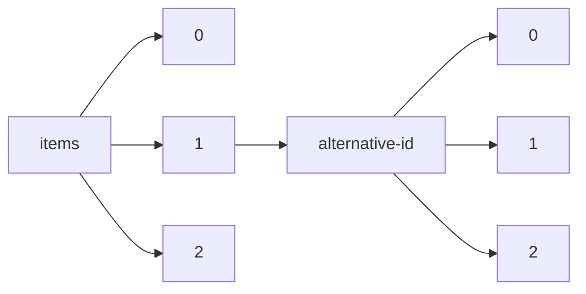

!!! warning "This document is not official Crossref documentation"
# Elements
PATH = items/array/alternative-id/array(1)  
Occurs 66 447 517 times  
Unique values: > 999  
{ .annotate }

1. A route to an element, for example:  
   The route "items/array/alternative-id/array" corresponds to navigating through the JSON indices as  
   ["items"][0]["alternative-id"][0]  

!!! note "Due to current limitations, only the first 1,000 unique values are counted."

| **Row** | **Value** `String`             | **Count** `Int64` |
|--------:|----------------------------------:|---------------------:|
| **1**   | LiveAll1                          | 131 912              |
| **2**   | 10.1021/symposium                 | 33 205               |
| **3**   | 10.1002/9783527809080             | 17 657               |
| **4**   | 1                                 | 9 162                |
| **5**   | 002A001                           | 7 403                |
| **6**   | 10.1002/047001590X                | 7 097                |
| **7**   | 001A001                           | 6 748                |
| **8**   | 10.1002/9781118445112             | 6 422                |
| **9**   | 10.1596/prwp                      | 6 327                |
| **10**  | 10.1002/9781444338386             | 6 171                |
| **11**  | 10.1021/advances                  | 6 143                |
| **12**  | 10.4135/9781446247501             | 3 490                |
| **13**  | 10.4135/9781452229669             | 2 930                |
| **14**  | 10.2514/MSCITECH23                | 2 727                |
| **15**  | 10.2514/MSCITECH22                | 2 686                |
| **16**  | 10.2514/MSCITECH19                | 2 552                |
| **17**  | 14                                | 2 465                |
| **18**  | 10.1210/endo-meetings.2011        | 2 465                |
| **19**  | 10.1002/9781118960608             | 2 400                |
| **20**  | SBFder                            | 2 374                |
| **21**  | Vetfak                            | 2 341                |
| **22**  | 10.2514/MSCITECH20                | 2 331                |
| **23**  |                                   | 2 315                |
| **24**  | 17                                | 2 293                |
| **25**  | S09765506193                      | 2 251                |
| **26**  | 10.4135/9781412972024             | 2 240                |
| **27**  | 10.1210/endo-meetings.2010        | 2 239                |
| **28**  | 21                                | 2 202                |
| **29**  | 8                                 | 2 194                |
| **30**  | 10.4135/9781412983907             | 2 103                |
| **31**  | 3                                 | 2 065                |
| **32**  | 9                                 | 1 936                |
| **33**  | 10.1201/CRCELEENGHBK              | 1 929                |
| **34**  | 5                                 | 1 908                |
| **35**  | 6                                 | 1 904                |
| **36**  | 10.2514/MSCITECH21                | 1 884                |
| **37**  | 39                                | 1 816                |
| **38**  | 2                                 | 1 760                |
| **39**  | Hukfak                            | 1 744                |
| **40**  | 29                                | 1 726                |
| **41**  | 10.4135/9781452229300             | 1 647                |
| **42**  | 10.1484/tema-eb                   | 1 617                |
| **43**  | 4                                 | 1 613                |
| **44**  | 7                                 | 1 563                |
| **45**  | 10.1484/ipm-eb                    | 1 563                |
| **46**  | 10.1142/WSSCP                     | 1 556                |
| **47**  | 10                                | 1 523                |
| **48**  | 19                                | 1 494                |
| **49**  | 12                                | 1 490                |
| **50**  | 10.1002/9780470670606             | 1 412                |
| **51**  | 10.1002/047120918X                | 1 407                |
| **52**  | 10.4135/9781608712434             | 1 376                |
| **53**  | 11                                | 1 358                |
| **54**  | DOI                               | 1 332                |
| **55**  | 49                                | 1 330                |
| **56**  | 10.1484/behe-eb                   | 1 319                |
| **57**  | 61                                | 1 317                |
| **58**  | Ilhfak                            | 1 313                |
| **59**  | 0143-6295(20211201)01:01L.001;03- | 1 301                |
| **60**  | 112                               | 1 295                |
| **61**  | 10.1002/0471650129                | 1 288                |
| **62**  | 15                                | 1 258                |
| **63**  | 10.2514/MASM10                    | 1 233                |
| **64**  | 20                                | 1 213                |
| **65**  | 10.4135/9781412963855             | 1 207                |
| **66**  | 13                                | 1 204                |
| **67**  | 10.1002/0470011815                | 1 204                |
| **68**  | 23                                | 1 201                |
| **69**  | 34                                | 1 196                |
| **70**  | 10.1190/segeab.36                 | 1 189                |
| **71**  | 10.2514/MASM08                    | 1 184                |
| **72**  | 10.2514/MIAF06                    | 1 180                |
| **73**  | 10.2514/MASM07                    | 1 177                |
| **74**  | 10.2514/MASM16                    | 1 169                |
| **75**  | 10.2514/MASM18                    | 1 169                |
| **76**  | 22                                | 1 168                |
| **77**  | 16                                | 1 165                |
| **78**  | 10.2514/MASM05                    | 1 163                |
| **79**  | 24                                | 1 153                |
| **80**  | 10.2514/MASM06                    | 1 152                |
| **81**  | 10.2514/MASM11                    | 1 151                |
| **82**  | 83                                | 1 144                |
| **83**  | 10.2514/MASM04                    | 1 125                |
| **84**  | 10.2514/MASM12                    | 1 125                |
| **85**  | Tarimbil                          | 1 122                |
| **86**  | 10.1201/AUEPUBADMPUP              | 1 120                |
| **87**  | 10.1201/BMSM                      | 1 106                |
| **88**  | 10.1891/9780826150356             | 1 101                |
| **89**  | 10.2514/MASM17                    | 1 099                |
| **90**  | 10.2514/MASM09                    | 1 091                |
| **91**  | 10.1190/segeab.37                 | 1 081                |
| **92**  | 10.1190/segeab.38                 | 1 077                |
| **93**  | 10.1190/segeab.34                 | 1 075                |
| **94**  | 10.2514/MASM03                    | 1 066                |
| **95**  | 10.1201/CRCOPTSCIENG              | 1 065                |
| **96**  | 10.1201/IHCDRUPHASCI              | 1 059                |
| **97**  | 10.1002/cphy                      | 1 054                |
| **98**  | 10.2514/MASM15                    | 1 041                |
| **99**  | 10.1142/SMPAI                     | 1 041                |
| **100** | 18                                | 1 035                |
| **101** | 10.4135/9781483326573             | 1 031                |
| **102** | 10.2514/MASM13                    | 1 031                |
| **103** | 117                               | 1 024                |
| **104** | 33                                | 1 019                |
| **105** | 10.1190/segeab.32                 | 1 018                |
| **106** | 10.1002/047147844X                | 1 008                |
| **107** | 10.4135/9781412939591             | 1 003                |
| **108** | 10.2514/MAVIAT21                  | 996                  |
| **109** | 10.4135/9781483381503             | 995                  |
| **110** | 10.1201/CRCFOOSCITEC              | 972                  |
| **111** | 10.1190/segeab.35                 | 961                  |
| **112** | 10.1190/segeab.33                 | 958                  |
| **113** | 10.4135/9781412950589             | 955                  |
| **114** | 55                                | 940                  |
| **115** | 32                                | 940                  |
| **116** | 10.4135/9781412995962             | 940                  |
| **117** | 43                                | 935                  |
| **118** | 10.2514/MASM02                    | 935                  |
| **119** | 10.2514/MAVIAT19                  | 935                  |
| **120** | 10.2514/MASM01                    | 934                  |
| **121** | 10.2514/MASM99                    | 933                  |
| **122** | 10.1021/acsreagents               | 931                  |
| **123** | 10.1002/9780470057339             | 921                  |
| **124** | 10.4135/9781452234243             | 916                  |
| **125** | 10.1201/CRCDEKMECENG              | 911                  |
| **126** | 10.2514/masm14                    | 903                  |
| **127** | 10.4135/9781483345727             | 900                  |
| **128** | 10.1002/9781118924396             | 898                  |
| **129** | 10.1201/CRCSURFACSCI              | 889                  |
| **130** | 10.2514/MASM97                    | 889                  |
| **131** | 10.2514/MASM00                    | 886                  |
| **132** | 27                                | 881                  |
| **133** | 10.1484/dda-eb                    | 874                  |
| **134** | 10.1002/9780470479216             | 874                  |
| **135** | 10.1190/SEGEAB.29                 | 873                  |
| **136** | 10.1190/segeab.31                 | 859                  |
| **137** | 10.2514/MIAF03                    | 848                  |
| **138** | 10.2514/MAVIAT22                  | 848                  |
| **139** | 10.2514/MASM98                    | 845                  |
| **140** | Tipfak                            | 842                  |
| **141** | 79                                | 841                  |
| **142** | 10.1190/SEGEAB.30                 | 837                  |
| **143** | 10.4135/9781506307633             | 836                  |
| **144** | 28                                | 836                  |
| **145** | 44                                | 832                  |
| **146** | 10.2514/MIAF04                    | 831                  |
| **147** | 10.1201/b16387                    | 825                  |
| **148** | 10.1190/SEGEAB.28                 | 823                  |
| **149** | 10.1142/WSSIE                     | 811                  |
| **150** | 10.4135/9781446279137             | 810                  |
| **151** | 10.4135/9781412964289             | 808                  |
| **152** | 10.2514/MIAF05                    | 801                  |
| **153** | 10.1002/SERIES1345                | 799                  |
| **154** | 10.4135/9781412952453             | 795                  |
| **155** | 25                                | 795                  |
| **156** | 10.2514/MASM96                    | 794                  |
| **157** | 10.4135/9781412956260             | 793                  |
| **158** | 10.4135/9781446215159             | 789                  |
| **159** | 10.2514/MAVIAT20                  | 784                  |
| **160** | 10.1201/CRCCHEMINDUS              | 782                  |
| **161** | 26                                | 781                  |
| **162** | 10.1190/segeab.39                 | 776                  |
| **163** | 10.4135/9781483365817             | 776                  |
| **164** | 36                                | 768                  |
| **165** | 10.1142/SKAE                      | 763                  |
| **166** | 10.13109/vegb                     | 761                  |
| **167** | 10.1142/WSSCC                     | 761                  |
| **168** | 10.2514/MJPC2005                  | 759                  |
| **169** | 10.1201/CHDISMTHAPP               | 759                  |
| **170** | 10.1190/segeab.41                 | 757                  |
| **171** | 10.2514/MJPC06                    | 754                  |
| **172** | 97                                | 745                  |
| **173** | 10.2514/MASM94                    | 743                  |
| **174** | 10.2514/MJPC92                    | 741                  |
| **175** | 31                                | 740                  |
| **176** | 10.1142/WSSNSA                    | 739                  |
| **177** | 35                                | 736                  |
| **178** | 10.1061/9780784410394             | 735                  |
| **179** | 57                                | 733                  |
| **180** | 10.1190/SEGEAB.27                 | 733                  |
| **181** | 10.2514/MASM92                    | 732                  |
| **182** | 10.1142/WSLNP                     | 732                  |
| **183** | S09765506188                      | 730                  |
| **184** | 10.4135/9781483375519             | 720                  |
| **185** | 10.1145/3503161                   | 719                  |
| **186** | 10.1201/AUEBESTPRACTS             | 718                  |
| **187** | S0256-307X(05)-7                  | 718                  |
| **188** | 42                                | 717                  |
| **189** | 10.4135/9781412939607             | 716                  |
| **190** | 10.4135/9781412956215             | 712                  |
| **191** | 10.1145/3313831                   | 709                  |
| **192** | 10.4135/9781506326139             | 708                  |
| **193** | 30                                | 708                  |
| **194** | 10.4135/9781452286143             | 707                  |
| **195** | 40                                | 707                  |
| **196** | 10.2514/MPEF19                    | 704                  |
| **197** | 37                                | 704                  |
| **198** | 10.1190/SEGEAB.25                 | 703                  |
| **199** | 10.2514/MJPC93                    | 700                  |
| **200** | 10.4135/9781412963893             | 699                  |
| **201** | 10.2514/MASM93                    | 697                  |
| **202** | 10.2514/MJPC98                    | 696                  |
| **203** | 10.1142/SAMAS                     | 692                  |
| **204** | 10.1061/9780784409329             | 690                  |
| **205** | 10.4135/9781452218533             | 689                  |
| **206** | 10.4135/9781412994156             | 683                  |
| **207** | 10.4135/9781452218427             | 678                  |
| **208** | 10.2514/MASM95                    | 677                  |
| **209** | 10.1145/3411764                   | 676                  |
| **210** | 10.2514/MJPC2004                  | 675                  |
| **211** | 10.4135/9781452218458             | 674                  |
| **212** | 10.3920/978-90-8686-940-4         | 672                  |
| **213** | 10.2514/MJPC03                    | 670                  |
| **214** | 10.2514/MASM89                    | 669                  |
| **215** | 46                                | 669                  |
| **216** | 10.4135/9781604265774             | 663                  |
| **217** | 45                                | 663                  |
| **218** | 10.1061/9780784410363             | 662                  |
| **219** | 10.1145/3173574                   | 661                  |
| **220** | 10.2514/MASM91                    | 661                  |
| **221** | 10.2514/MJPC07                    | 660                  |
| **222** | 10.1201/CRCFRONEUSCI              | 657                  |
| **223** | 10.2514/MJPC95                    | 656                  |
| **224** | 10.1061/9780784409961             | 656                  |
| **225** | 10.1145/3290605                   | 654                  |
| **226** | 10.4135/9781412952484             | 648                  |
| **227** | 10.4135/9781529714395             | 646                  |
| **228** | 10.1190/SEGEAB.22                 | 640                  |
| **229** | 10.1190/segeab.40                 | 639                  |
| **230** | 10.1190/SEGEAB.23                 | 637                  |
| **231** | 10.2514/MJPC00                    | 634                  |
| **232** | 10.4135/9781412997898             | 633                  |
| **233** | 10.1190/SEGEAB.19                 | 631                  |
| **234** | 10.1145/3491102                   | 631                  |
| **235** | 10.4135/9781071812082             | 625                  |
| **236** | 10.4135/9781412963947             | 624                  |
| **237** | 10.1190/SEGEAB.21                 | 623                  |
| **238** | 10.4135/9781483345758             | 623                  |
| **239** | 10.1142/4977                      | 618                  |
| **240** | 10.4135/9781529714388             | 618                  |
| **241** | 10.4135/9781483386874             | 615                  |
| **242** | 10.1201/CRCADVINHUM               | 613                  |
| **243** | 10.1190/SEGEAB.24                 | 611                  |
| **244** | 10.2514/MJPC01                    | 610                  |
| **245** | 10.4135/9781483346526             | 609                  |
| **246** | 10.4135/9781412979276             | 608                  |
| **247** | 228                               | 606                  |
| **248** | 10.1201/CHCOMINFSCI               | 603                  |
| **249** | 10.1061/9780784409763             | 603                  |
| **250** | 10.4135/9781412963961             | 602                  |
| **251** | 10.2514/MJPC97                    | 602                  |
| **252** | 10.1201/ASENP                     | 600                  |
| **253** | 10.1201/CRCBKSPE                  | 598                  |
| **254** | 10.2514/MJPC08                    | 598                  |
| **255** | 10.2514/MSDM07                    | 598                  |
| **256** | 10.1002/9781118339893             | 597                  |
| **257** | 51                                | 597                  |
| **258** | 41                                | 597                  |
| **259** | 10.4135/9781483359878             | 597                  |
| **260** | 10.1142/10614                     | 595                  |
| **261** | 10.2514/MSDM12                    | 593                  |
| **262** | 10.1145/3495018                   | 593                  |
| **263** | 10.4135/9781412939584             | 592                  |
| **264** | 10.2514/MJPC02                    | 588                  |
| **265** | 10.4135/9781412952637             | 587                  |
| **266** | 176                               | 585                  |
| **267** | 10.4135/9781483346427             | 585                  |
| **268** | 10.4135/9781412952507             | 585                  |
| **269** | 10.2514/MJPC99                    | 582                  |
| **270** | 48                                | 579                  |
| **271** | 10.1145/3025453                   | 578                  |
| **272** | 10.1145/3474085                   | 577                  |
| **273** | 10.4135/9781412953979             | 577                  |
| **274** | S0974360X193                      | 577                  |
| **275** | 10.1201/b12352                    | 573                  |
| **276** | 50                                | 573                  |
| **277** | 10.1145/3290607                   | 570                  |
| **278** | 10.2514/MASM88                    | 570                  |
| **279** | 10.4135/9781483317731             | 568                  |
| **280** | 10.1145/3511808                   | 567                  |
| **281** | Tarar                             | 566                  |
| **282** | 10.1142/9789812839374             | 561                  |
| **283** | 10.1061/9780784409275             | 560                  |
| **284** | 10.4135/9781412963879             | 559                  |
| **285** | 10.1891/9780826159311             | 559                  |
| **286** | 10.2514/MJPC90                    | 559                  |
| **287** | 10.2514/MSDM06                    | 557                  |
| **288** | 10.1201/CRCPACFINVE               | 556                  |
| **289** | 10.1201/b19126                    | 555                  |
| **290** | 38                                | 554                  |
| **291** | 10.2514/MSDM10                    | 553                  |
| **292** | 10.2514/MJPC96                    | 553                  |
| **293** | 10.4135/9781412956253             | 553                  |
| **294** | 10.1190/SEGEAB.15                 | 551                  |
| **295** | 10.1515/9783110806939             | 550                  |
| **296** | 125                               | 550                  |
| **297** | 10.1201/CRCVETSELASS              | 548                  |
| **298** | 10.2514/MJPC09                    | 548                  |
| **299** | 10.2514/MGNC08                    | 547                  |
| **300** | 10.1145/3394171                   | 547                  |
| **301** | 10.2514/MASM90                    | 545                  |
| **302** | 10.1190/SEGEAB.17                 | 545                  |
| **303** | 10.1061/9780784482292             | 544                  |
| **304** | 10.4135/9781526421036             | 544                  |
| **305** | 10.1190/SEGEAB.20                 | 544                  |
| **306** | 10.4135/9781412972048             | 543                  |
| **307** | 10.4135/9781412952446             | 543                  |
| **308** | 10.1145/2702123                   | 543                  |
| **309** | 10.4135/9781412952613             | 542                  |
| **310** | 10.1145/3334480                   | 539                  |
| **311** | 10.1190/SEGEAB.16                 | 537                  |
| **312** | 54                                | 537                  |
| **313** | 10.2514/MJPC94                    | 535                  |
| **314** | 10.1145/3170427                   | 535                  |
| **315** | 10.1190/SEGEAB.18                 | 535                  |
| **316** | 56                                | 533                  |
| **317** | 10.1145/3482632                   | 533                  |
| **318** | 10.4135/9781483368924             | 531                  |
| **319** | 10.1145/2858036                   | 531                  |
| **320** | 10.4135/9781483369532             | 530                  |
| **321** | 10.1061/9780784480915             | 529                  |
| **322** | 10.4135/9781412963930             | 526                  |
| **323** | S0256-307X(04)-1                  | 526                  |
| **324** | 10.2514/MJPC91                    | 523                  |
| **325** | 10.4135/9781452276274             | 523                  |
| **326** | 10.4135/9781452218557             | 522                  |
| **327** | 10.1145/2556288                   | 522                  |
| **328** | 10.1145/3459637                   | 520                  |
| **329** | 10.2514/MSDM09                    | 520                  |
| **330** | 10.2514/MAAC01                    | 516                  |
| **331** | 10.1190/SEGEAB.9                  | 516                  |
| **332** | 10.2514/MJPC10                    | 514                  |
| **333** | 10.4135/9781483392240             | 514                  |
| **334** | 10.1145/3534678                   | 513                  |
| **335** | 10.2514/MSDM08                    | 513                  |
| **336** | 10.4135/9781483392271             | 512                  |
| **337** | 10.4135/9781412950510             | 511                  |
| **338** | 47                                | 510                  |
| **339** | 10.2514/MSDM03                    | 509                  |
| **340** | 10.1145/3328778                   | 507                  |
| **341** | 10.1201/b19094                    | 507                  |
| **342** | 10.4324/SE0432                    | 507                  |
| **343** | 10.1201/AUERESOURMGT              | 506                  |
| **344** | 10.2514/MSDM05                    | 506                  |
| **345** | 10.2514/MASM87                    | 505                  |
| **346** | 10.4135/9781483347660             | 504                  |
| **347** | 10.2514/MSDM02                    | 502                  |
| **348** | 10.1061/9780784405697             | 502                  |
| **349** | 10.1201/b15938                    | 502                  |
| **350** | 10.4135/9781483346663             | 501                  |
| **351** | 10.4135/9781412963978             | 500                  |
| **352** | 10.1145/2559206                   | 498                  |
| **353** | 10.2514/MSDM13                    | 498                  |
| **354** | 10.2514/MGNC10                    | 497                  |
| **355** | 64                                | 497                  |
| **356** | 10.2514/MJPC14                    | 497                  |
| **357** | 10.4135/9781412952583             | 494                  |
| **358** | 10.2514/MSDM04                    | 494                  |
| **359** | 10.4135/9781483384269             | 494                  |
| **360** | 10.4135/9781412994163             | 494                  |
| **361** | 10.1484/csm-eb                    | 493                  |
| **362** | 71                                | 493                  |
| **363** | 10.2514/MJPC89                    | 492                  |
| **364** | 10.1142/9194                      | 491                  |
| **365** | 10.1081/E-EBPP                    | 491                  |
| **366** | 10.4135/9781452229805             | 490                  |
| **367** | 10.1061/9780784411391             | 489                  |
| **368** | 10.1142/8316                      | 489                  |
| **369** | 10.1061/9780784411735             | 489                  |
| **370** | 10.1484/sem-eb                    | 488                  |
| **371** | 10.1484/usml-eb                   | 486                  |
| **372** | 10.1061/9780784411148             | 484                  |
| **373** | 10.1061/9780784407370             | 484                  |
| **374** | 10.1201/NOE1420084597             | 483                  |
| **375** | 10.4135/9781412953924             | 483                  |
| **376** | 10.4135/9781412950602             | 483                  |
| **377** | 10.1190/SEGEAB.26                 | 483                  |
| **378** | 81                                | 481                  |
| **379** | 10.1484/hama-eb                   | 481                  |
| **380** | 52                                | 480                  |
| **381** | 10.4135/9781452276175             | 479                  |
| **382** | 10.1002/9781444351071             | 476                  |
| **383** | 10.4135/9781412952644             | 475                  |
| **384** | 10.1145/1363686                   | 474                  |
| **385** | 10.4135/9781483380810             | 473                  |
| **386** | 10.2514/MPEF21                    | 473                  |
| **387** | 10.4135/9781608717613             | 471                  |
| **388** | 10.2514/MASM83                    | 471                  |
| **389** | 10.4135/9781483359922             | 467                  |
| **390** | 10.1190/SBGf2011                  | 466                  |
| **391** | 10.4135/9781412952415             | 465                  |
| **392** | 10.1145/2468356                   | 464                  |
| **393** | 10.1190/SBGf2005                  | 464                  |
| **394** | 10.12716                          | 463                  |
| **395** | 10.1061/9780784412121             | 462                  |
| **396** | 10.4135/9781412964623             | 462                  |
| **397** | 10.1201/CHLENOPUAMT               | 460                  |
| **398** | 10.1145/3027063                   | 459                  |
| **399** | 10.4135/9781412952606             | 459                  |
| **400** | 10.7566/appc12                    | 459                  |
| **401** | 10.1145/3411763                   | 457                  |
| **402** | 10.4135/9781483381411             | 457                  |
| **403** | 10.1190/SEGEAB.13                 | 456                  |
| **404** | 10.4135/9781412961165             | 456                  |
| **405** | 53                                | 455                  |
| **406** | 10.4135/9781412952620             | 454                  |
| **407** | 10.1891/9780826179357             | 454                  |
| **408** | 10.1201/CHPURAPPMTH               | 454                  |
| **409** | 197                               | 453                  |
| **410** | 10.1145/2702613                   | 453                  |
| **411** | 10.4135/9781483331096             | 452                  |
| **412** | 10.1145/2851581                   | 452                  |
| **413** | 10.1145/1774088                   | 451                  |
| **414** | 10.4135/9781412963923             | 450                  |
| **415** | 10.1484/seuh-eb                   | 449                  |
| **416** | 10.2514/MASM84                    | 449                  |
| **417** | 10.2514/MJPC16                    | 448                  |
| **418** | 10.4135/9781412950558             | 447                  |
| **419** | 10.1061/9780784411278             | 444                  |
| **420** | 10.4135/9781529714401             | 443                  |
| **421** | 10.1145/1978942                   | 443                  |
| **422** | 10.1190/IGC2018                   | 442                  |
| **423** | 10.1145/2207676                   | 441                  |
| **424** | 10.2514/MGNC09                    | 441                  |
| **425** | 10.4135/9781452276335             | 440                  |
| **426** | 10.1061/9780784483053             | 440                  |
| **427** | 10.4135/9781412963862             | 440                  |
| **428** | 10.1891/9780826153425             | 438                  |
| **429** | S0256-307X(06)-2                  | 432                  |
| **430** | 10.1201/NOE0849338304             | 432                  |
| **431** | 10.1190/SEGEAB.14                 | 432                  |
| **432** | 10.4135/9781452281889             | 432                  |
| **433** | 10.2514/MSDM11                    | 431                  |
| **434** | 10.1201/NOE0824706326             | 431                  |
| **435** | 63                                | 430                  |
| **436** | 10.1145/2396761                   | 430                  |
| **437** | 10.2514/MPEF20                    | 430                  |
| **438** | 10.1108/ihetl                     | 429                  |
| **439** | 10.2514/MJPC11                    | 429                  |
| **440** | 10.4135/9781412950565             | 429                  |
| **441** | 10.1002/9780471264194             | 428                  |
| **442** | 10.1061/9780784408568             | 428                  |
| **443** | 10.4135/9781544391199             | 425                  |
| **444** | 10.1190/SEGEAB.10                 | 425                  |
| **445** | 10.1145/3477495                   | 423                  |
| **446** | 10.4135/9781412961288             | 423                  |
| **447** | 10.2514/MGNC05                    | 422                  |
| **448** | 10.4135/9781452283012             | 421                  |
| **449** | 10.4135/9781412953948             | 420                  |
| **450** | 10.1190/SBGf2009                  | 419                  |
| **451** | 10.1002/9781118568446             | 418                  |
| **452** | 10.1061/9780784410646             | 418                  |
| **453** | 10.2514/MGNC13                    | 417                  |
| **454** | 10.1145/3287324                   | 416                  |
| **455** | 10.4135/9781412950534             | 415                  |
| **456** | 10.4135/9781452218564             | 415                  |
| **457** | 10.2514/MASM86                    | 415                  |
| **458** | 10.1201/b10430                    | 415                  |
| **459** | 10.1891/9780826194985             | 415                  |
| **460** | 10.1061/9780784479384             | 414                  |
| **461** | 10.1142/6439                      | 414                  |
| **462** | 65                                | 412                  |
| **463** | 10.1145/1529282                   | 412                  |
| **464** | 10.2514/MASM85                    | 411                  |
| **465** | 10.1201/CHMONSTAAPP               | 411                  |
| **466** | 10.1002/9781119678816             | 409                  |
| **467** | 10.1145/3447548                   | 408                  |
| **468** | 10.1201/b17063                    | 408                  |
| **469** | 10.1081/E-EAFE2                   | 407                  |
| **470** | 10.2514/MSPOPS18                  | 407                  |
| **471** | 10.2514/MJPC15                    | 405                  |
| **472** | 10.1145/1979742                   | 404                  |
| **473** | 10.2514/MJPC12                    | 402                  |
| **474** | 10.1061/9780784482933             | 402                  |
| **475** | 10.2514/MJPC18                    | 401                  |
| **476** | 10.4135/9781412963909             | 401                  |
| **477** | 10.1201/b11646                    | 400                  |
| **478** | 10.4135/9781452276052             | 399                  |
| **479** | 10.1201/9781439828434             | 399                  |
| **480** | 10.4135/9781412958660             | 397                  |
| **481** | 10.4135/9781412994248             | 396                  |
| **482** | 10.1145/3159450                   | 396                  |
| **483** | 10.1142/7342                      | 395                  |
| **484** | 10.1201/b11433                    | 392                  |
| **485** | 10.1061/9780784412312             | 392                  |
| **486** | 10.1002/SERIES5064                | 391                  |
| **487** | 10.1190/SEGEAB.7                  | 391                  |
| **488** | 10.1145/1141277                   | 389                  |
| **489** | 10.1061/9780784413159             | 388                  |
| **490** | 10.1145/3408877                   | 388                  |
| **491** | 10.1108/rso                       | 388                  |
| **492** | 10.1515/9783110467888             | 388                  |
| **493** | 10.1081/E-EPCS                    | 386                  |
| **494** | 10.1002/9781118970843             | 386                  |
| **495** | 10.1201/NOE1420052756             | 386                  |
| **496** | 10.1145/1520340                   | 386                  |
| **497** | 60                                | 386                  |
| **498** | 10.1201/CRCOXISTRDIS              | 386                  |
| **499** | 10.4135/9781412971935             | 386                  |
| **500** | 10.1142/13149                     | 384                  |
| **501** | 10.4135/9781412963886             | 384                  |
| **502** | 10.2514/MJPC17                    | 381                  |
| **503** | 10.1061/9780784407929             | 381                  |
| **504** | 10.1145/3394486                   | 379                  |
| **505** | 10.1190/SEGEAB.12                 | 378                  |
| **506** | 10.1190/SEGEAB.3                  | 376                  |
| **507** | 10.1190/ICEMelbourne2015          | 375                  |
| **508** | 10.1145/1873951                   | 375                  |
| **509** | 10.1145/3308558                   | 374                  |
| **510** | 10.2514/MSDM18                    | 374                  |
| **511** | 10.1061/9780784413272             | 373                  |
| **512** | 10.1145/3469213                   | 372                  |
| **513** | 10.4135/9781483391144             | 372                  |
| **514** | 10.4135/9781412952545             | 372                  |
| **515** | 10.1061/9780784405178             | 371                  |
| **516** | 10.4135/9781412971959             | 370                  |
| **517** | 10.1142/6803                      | 368                  |
| **518** | 10.1002/9781119009924             | 366                  |
| **519** | 10.4135/9781452270388             | 366                  |
| **520** | 10.4135/9781412914260             | 366                  |
| **521** | 10.4135/9781412972000             | 365                  |
| **522** | 10.1061/9780784411650             | 365                  |
| **523** | 10.1190/SEGEAB.8                  | 365                  |
| **524** | 10.1002/9781119171492             | 364                  |
| **525** | 72                                | 363                  |
| **526** | 10.1145/3297280                   | 363                  |
| **527** | 10.4135/9781452276236             | 362                  |
| **528** | 10.2514/MJPC88                    | 361                  |
| **529** | 10.4135/9781412972093             | 361                  |
| **530** | 10.1201/LEAHUMFACERG              | 360                  |
| **531** | 10.4135/9781483306902             | 360                  |
| **532** | 59                                | 360                  |
| **533** | 10.1061/9780784413623             | 359                  |
| **534** | 66                                | 359                  |
| **535** | 10.1061/9780784411841             | 357                  |
| **536** | 10.1201/9781315196107             | 356                  |
| **537** | 10.1190/SEGEAB.11                 | 356                  |
| **538** | 10.2514/MAERO19                   | 355                  |
| **539** | 10.21019/druginformation          | 354                  |
| **540** | 10.1145/3442381                   | 353                  |
| **541** | 10.1190/ICEBarcelona2016          | 352                  |
| **542** | 10.2514/MSDM15                    | 352                  |
| **543** | 10.1515/9783110883237             | 351                  |
| **544** | 10.4135/9781412958806             | 351                  |
| **545** | 10.4324/SE0403                    | 351                  |
| **546** | 69                                | 350                  |
| **547** | 10.4135/9781452276076             | 350                  |
| **548** | 10.1145/2212776                   | 349                  |
| **549** | 10.1190/SBGf2007                  | 349                  |
| **550** | 10.4135/9781483346502             | 348                  |
| **551** | 10.2514/MGNC12                    | 347                  |
| **552** | 10.4135/9781412964500             | 347                  |
| **553** | 10.1002/9783527620999             | 346                  |
| **554** | S0974360X188                      | 346                  |
| **555** | 10.4135/9781412994170             | 345                  |
| **556** | 10.1201/NOE0824727857             | 344                  |
| **557** | 10.1201/b17435                    | 343                  |
| **558** | 10.4135/9781446294406             | 343                  |
| **559** | 10.1145/1753846                   | 343                  |
| **560** | 10.1145/2968219                   | 342                  |
| **561** | 10.1201/b11332                    | 339                  |
| **562** | 10.1061/9780784406854             | 339                  |
| **563** | 10.1201/9781315644479             | 339                  |
| **564** | 10.1061/9780784411773             | 338                  |
| **565** | 10.2514/MGNC07                    | 338                  |
| **566** | 10.4324/SE0266                    | 337                  |
| **567** | 10.4135/9781412950664             | 337                  |
| **568** | 10.1061/9780784412442             | 336                  |
| **569** | 10.1145/3485447                   | 336                  |
| **570** | 10.1201/9781315641645             | 334                  |
| **571** | 10.1002/0471203076                | 334                  |
| **572** | 10.1145/3357384                   | 334                  |
| **573** | 10.4135/9781483346175             | 332                  |
| **574** | 10.1061/9780784411308             | 330                  |
| **575** | 10.1145/3319619                   | 330                  |
| **576** | 10.4135/9781483346304             | 329                  |
| **577** | 10.4135/9781452244723             | 329                  |
| **578** | 10.2514/MIECEC94                  | 329                  |
| **579** | 10.4135/9781412952552             | 329                  |
| **580** | 10.4135/9781412971942             | 329                  |
| **581** | 10.1002/9781119288190             | 328                  |
| **582** | 10.4135/9781412952514             | 327                  |
| **583** | 10.4135/9781483346243             | 326                  |
| **584** | 10.4135/9781412994071             | 326                  |
| **585** | 10.1145/2470654                   | 326                  |
| **586** | 10.2514/MJPC87                    | 325                  |
| **587** | 10.1081/E-EIA                     | 324                  |
| **588** | 10.1061/9780784479292             | 323                  |
| **589** | 10.2514/MSDM95                    | 323                  |
| **590** | 10.4135/9781412994064             | 323                  |
| **591** | 10.2514/MASM79                    | 322                  |
| **592** | 10.1484/CCT-EB                    | 322                  |
| **593** | 10.1061/9780784406441             | 321                  |
| **594** | 10.1145/1403375                   | 321                  |
| **595** | 10.1002/9780470674871             | 320                  |
| **596** | 10.2514/MGNC03                    | 320                  |
| **597** | 10.1145/3267305                   | 320                  |
| **598** | 10.2514/MJPC13                    | 319                  |
| **599** | 10.4135/9781483349985             | 319                  |
| **600** | 10.1201/b17133                    | 318                  |
| **601** | 10.2514/MSPOPS06                  | 316                  |
| **602** | 10.1061/9780784410967             | 316                  |
| **603** | 10.1145/2567948                   | 316                  |
| **604** | 10.2514/MSPOP10                   | 315                  |
| **605** | 10.4135/9781412971928             | 315                  |
| **606** | 10.2514/MASM80                    | 314                  |
| **607** | 10.1061/9780784402429             | 314                  |
| **608** | 10.1145/2072298                   | 313                  |
| **609** | 10.4135/9781483346397             | 313                  |
| **610** | 10.1201/b16767                    | 312                  |
| **611** | 10.1142/STES                      | 312                  |
| **612** | 10.1190/SBGf2015                  | 312                  |
| **613** | 10.2514/MAERO16                   | 311                  |
| **614** | 10.4135/9781452276311             | 310                  |
| **615** | 10.1002/9780470061572             | 309                  |
| **616** | 10.4135/9781483376493             | 309                  |
| **617** | 10.1201/CRCEEASPROCE              | 308                  |
| **618** | 10.1201/CRCAUTCONENG              | 308                  |
| **619** | 10.1484/tcc-eb                    | 307                  |
| **620** | 10.4135/9781452234311             | 307                  |
| **621** | 10.4135/9781452274102             | 305                  |
| **622** | 10.4135/9781483332222             | 305                  |
| **623** | 10.1201/9781439828441             | 305                  |
| **624** | 10.1145/1244002                   | 304                  |
| **625** | 10.1145/1582379                   | 304                  |
| **626** | 10.1145/967900                    | 304                  |
| **627** | 10.1201/b18990                    | 303                  |
| **628** | 10.1081/E-EAS2                    | 303                  |
| **629** | 10.7566/sces2013                  | 303                  |
| **630** | 10.1190/SEGEAB.2                  | 303                  |
| **631** | 10.1142/5165                      | 303                  |
| **632** | 10.2514/MSPOPS14                  | 302                  |
| **633** | 10.1201/b16698                    | 302                  |
| **634** | 10.2514/MSPACE16                  | 302                  |
| **635** | 10.1145/1753326                   | 301                  |
| **636** | 10.1145/3397271                   | 301                  |
| **637** | 10.2514/MSPOPS16                  | 301                  |
| **638** | 10.1201/b18592                    | 300                  |
| **639** | 10.1145/1143997                   | 300                  |
| **640** | 10.4135/9781412979993             | 300                  |
| **641** | 10.4135/9781452276199             | 299                  |
| **642** | 10.2514/MSDM16                    | 299                  |
| **643** | 10.1061/9780784405499             | 298                  |
| **644** | 10.4135/9781483371283             | 297                  |
| **645** | 10.1190/IGCBeijing2014            | 297                  |
| **646** | 10.4135/9781452276151             | 297                  |
| **647** | 10.1484/rpm-eb                    | 297                  |
| **648** | 10.4135/9781483340333             | 296                  |
| **649** | 10.1201/b15118                    | 296                  |
| **650** | 10.1201/IHCLUBIHEDIS              | 295                  |
| **651** | 10.1145/1082473                   | 294                  |
| **652** | 10.1190/SBGf2017                  | 294                  |
| **653** | 10.1145/3501409                   | 294                  |
| **654** | 10.4135/9781452240121             | 294                  |
| **655** | 10.4135/9781446212172             | 293                  |
| **656** | 10.1145/2695664                   | 291                  |
| **657** | 10.15375/9783814558790            | 291                  |
| **658** | 10.1201/9780849375477             | 290                  |
| **659** | 78                                | 289                  |
| **660** | 10.2514/MSDM17                    | 289                  |
| **661** | 10.1145/3067695                   | 288                  |
| **662** | 10.4135/9781412952651             | 288                  |
| **663** | 10.1201/CRCMODNUTRI               | 287                  |
| **664** | 73                                | 287                  |
| **665** | 10.1190/SEGEAB.1                  | 287                  |
| **666** | 10.1061/9780784410165             | 287                  |
| **667** | 10.1201/NOE0415451369             | 285                  |
| **668** | 10.4135/9781412952408             | 284                  |
| **669** | 10.4324/SE0347                    | 284                  |
| **670** | 10.4135/9781412952392             | 283                  |
| **671** | 10.2514/MGNC11                    | 282                  |
| **672** | 10.1061/9780784484265             | 281                  |
| **673** | 10.1145/1389095                   | 281                  |
| **674** | 10.2514/MICES11                   | 281                  |
| **675** | 10.2514/MSPACE09                  | 280                  |
| **676** | 10.4135/9781412971980             | 279                  |
| **677** | 10.1145/1329125                   | 279                  |
| **678** | 10.1145/1518701                   | 278                  |
| **679** | 10.1145/2851613                   | 277                  |
| **680** | 10.1190/SAGEEP.27                 | 277                  |
| **681** | 10.1061/9780784412992             | 277                  |
| **682** | 10.1142/4469                      | 276                  |
| **683** | 10.4135/9781452218595             | 276                  |
| **684** | 10.4135/9781412952422             | 275                  |
| **685** | 10.4135/9781483300658             | 275                  |
| **686** | 10.1201/b20466                    | 274                  |
| **687** | 10.2514/MAM64                     | 274                  |
| **688** | 10.1190/SEGEAB.5                  | 273                  |
| **689** | 10.4135/9781412963954             | 273                  |
| **690** | 10.1484/disput-eb                 | 272                  |
| **691** | 10.1145/2480362                   | 272                  |
| **692** | 10.1201/CHMSPAMATH                | 271                  |
| **693** | 10.1145/1741906                   | 271                  |
| **694** | 10.1145/3292500                   | 270                  |
| **695** | 10.1145/985921                    | 270                  |
| **696** | 10.1002/9781405165518             | 270                  |
| **697** | 10.4135/9781483302799             | 269                  |
| **698** | 10.21019/ALE.1000                 | 269                  |
| **699** | 10.4135/9781483346373             | 268                  |
| **700** | 10.1145/1655925                   | 266                  |
| **701** | 10.4135/9781452287508             | 266                  |
| **702** | 10.2514/MJPC86                    | 266                  |
| **703** | 10.4135/9781483300634             | 266                  |
| **704** | 10.4135/9781452234373             | 266                  |
| **705** | 10.1183/9781849840781-hbmcq02     | 265                  |
| **706** | 10.4135/9781412953993             | 265                  |
| **707** | 10.1201/b14769                    | 264                  |
| **708** | 10.1145/312379                    | 264                  |
| **709** | 10.4135/9781483346229             | 263                  |
| **710** | 10.1142/5716                      | 263                  |
| **711** | 10.1145/280953                    | 262                  |
| **712** | 10.1190/SAGEEP.24                 | 262                  |
| **713** | 10.2514/MJPC85                    | 262                  |
| **714** | 10.1145/2001576                   | 262                  |
| **715** | 10.1145/1125451                   | 262                  |
| **716** | 10.1002/9781118900772             | 261                  |
| **717** | 10.1201/CRCCONFOOENG              | 260                  |
| **718** | 10.4135/9781412976961             | 259                  |
| **719** | 10.1145/3452446                   | 259                  |
| **720** | 10.9785/9783504384142             | 259                  |
| **721** | 10.4135/9781412952590             | 258                  |
| **722** | 10.1515/9783110846713             | 258                  |
| **723** | 10.1201/9781439834398             | 258                  |
| **724** | 10.1201/b21520                    | 258                  |
| **725** | 10.2514/MAERO10                   | 257                  |
| **726** | 10.1061/9780784410950             | 257                  |
| **727** | 10.1201/b16955                    | 256                  |
| **728** | 10.4135/9781483340470             | 256                  |
| **729** | 10.1145/2393347                   | 256                  |
| **730** | 10.1061/9780784413609             | 256                  |
| **731** | 10.4324/SE0358                    | 256                  |
| **732** | 10.2514/MGNC04                    | 255                  |
| **733** | 10.4135/9781412979313             | 253                  |
| **734** | 10.1145/1871437                   | 252                  |
| **735** | 10.1142/6997                      | 252                  |
| **736** | 10.1190/SEGEAB.6                  | 252                  |
| **737** | 10.1484/tcne-eb                   | 251                  |
| **738** | 10.4135/9781483302782             | 251                  |
| **739** | 10.1061/9780784407530             | 251                  |
| **740** | 10.1002/9783527620784             | 250                  |
| **741** | 10.4135/9781483318332             | 250                  |
| **742** | 10.2514/MAERO06                   | 249                  |
| **743** | 10.1145/3123266                   | 248                  |
| **744** | 10.1002/9781119011071             | 247                  |
| **745** | 10.1145/3548606                   | 247                  |
| **746** | 10.4135/9781412972017             | 247                  |
| **747** | 10.15375/9783814558684            | 247                  |
| **748** | 10.1002/9781118901731             | 247                  |
| **749** | 10.1145/3449726                   | 246                  |
| **750** | 10.1145/3019612                   | 245                  |
| **751** | 10.4135/9781604265767             | 244                  |
| **752** | 10.1061/9780784480779             | 244                  |
| **753** | 10.1190/978-1-56080-284-6.10      | 244                  |
| **754** | 10.1484/er-eb                     | 243                  |
| **755** | 10.1002/9781118635193             | 243                  |
| **756** | 10.4135/9781412959384             | 243                  |
| **757** | 10.1201/CRCELECOMENG              | 243                  |
| **758** | 10.2514/MSPACE15                  | 243                  |
| **759** | 10.1145/1772690                   | 242                  |
| **760** | 10.1108/ipes                      | 242                  |
| **761** | 10.1145/1830483                   | 242                  |
| **762** | 10.2514/MSPOPS08                  | 242                  |
| **763** | 10.1061/9780784479117             | 242                  |
| **764** | 10.1145/3377929                   | 240                  |
| **765** | 10.1002/9781118786093             | 240                  |
| **766** | 10.1145/2733373                   | 239                  |
| **767** | 10.2514/MGNC16                    | 239                  |
| **768** | 10.1002/9781119431732             | 239                  |
| **769** | 10.2514/MAERO07                   | 238                  |
| **770** | 10.4135/9781412963985             | 238                  |
| **771** | 10.2514/MASM66                    | 237                  |
| **772** | 10.1145/1143549                   | 237                  |
| **773** | 10.1061/9780784411711             | 236                  |
| **774** | 10.1142/2116                      | 236                  |
| **775** | 10.4135/9781412971973             | 236                  |
| **776** | 10.1061/9780784479162             | 236                  |
| **777** | 10.1081/E-ESCS3                   | 235                  |
| **778** | 10.1145/1276958                   | 234                  |
| **779** | 10.1145/3465631                   | 234                  |
| **780** | 10.1201/CRCMECHAENG               | 234                  |
| **781** | 10.1142/9646                      | 233                  |
| **782** | 10.1145/2001858                   | 233                  |
| **783** | 10.4135/9781473960367             | 232                  |
| **784** | 10.1201/9781420039870             | 232                  |
| **785** | 10.1515/9783112672822             | 232                  |
| **786** | 10.1145/2806416                   | 232                  |
| **787** | 10.1201/b21811                    | 231                  |
| **788** | 10.2514/MAERO09                   | 231                  |
| **789** | 10.1515/9783110804898             | 231                  |
| **790** | 10.1061/9780872629332             | 231                  |
| **791** | 10.2514/MAERO05                   | 230                  |
| **792** | 10.1108/aead                      | 230                  |
| **793** | 10.4135/9781412959537             | 229                  |
| **794** | 10.1145/2839509                   | 228                  |
| **795** | 10.2514/EOF03                     | 228                  |
| **796** | 10.1061/9780784400890             | 228                  |
| **797** | 10.1145/3341105                   | 228                  |
| **798** | 10.1190/IGCBeijing2016            | 228                  |
| **799** | 10.1145/1459359                   | 227                  |
| **800** | 10.1201/b13787                    | 227                  |
| **801** | 10.1145/3448016                   | 227                  |
| **802** | 10.1201/b16185                    | 225                  |
| **803** | 10.4324/SE0085                    | 225                  |
| **804** | 10.1145/3132847                   | 224                  |
| **805** | 10.1484/sa-eb                     | 224                  |
| **806** | 10.2514/MASM78                    | 223                  |
| **807** | 10.1145/3477314                   | 222                  |
| **808** | 10.1201/9780203859759             | 221                  |
| **809** | 10.2514/MICSSC94                  | 221                  |
| **810** | 10.1145/3167132                   | 221                  |
| **811** | 10.1142/5966                      | 220                  |
| **812** | 10.1061/9780872627765             | 219                  |
| **813** | 10.1201/9781420049510             | 219                  |
| **814** | 10.1515/9783111502489             | 219                  |
| **815** | 10.2514/MAERO11                   | 219                  |
| **816** | 10.1515/9783110889000             | 218                  |
| **817** | 10.1142/ASOE                      | 218                  |
| **818** | 10.1061/9780784404119             | 218                  |
| **819** | 10.1201/TFPLASMAPHY               | 217                  |
| **820** | 10.1145/2905055                   | 217                  |
| **821** | 10.1145/3017680                   | 217                  |
| **822** | 10.1201/b10428                    | 217                  |
| **823** | 10.1145/2661829                   | 217                  |
| **824** | 10.2514/MICSSC92                  | 216                  |
| **825** | 10.1201/9780203885284             | 216                  |
| **826** | 10.1061/9780784413517             | 216                  |
| **827** | 10.4159/9780674273702             | 215                  |
| **828** | 10.1190/URTEC2013                 | 215                  |
| **829** | 10.1145/1367497                   | 214                  |
| **830** | 10.1145/1815396                   | 214                  |
| **831** | 10.1201/b17017                    | 213                  |
| **832** | 10.4135/9781452206905             | 213                  |
| **833** | 10.2514/MAERO08                   | 213                  |
| **834** | 10.1145/1027527                   | 212                  |
| **835** | 10.1145/2157136                   | 212                  |
| **836** | 10.1002/9781118398500             | 212                  |
| **837** | 10.1145/3460120                   | 211                  |
| **838** | 10.1145/3514221                   | 211                  |
| **839** | 10.4135/9781412994088             | 210                  |
| **840** | 10.1145/2492517                   | 210                  |
| **841** | 10.1515/sgg                       | 209                  |
| **842** | 10.1061/9780784413692             | 209                  |
| **843** | 10.1201/b16606                    | 208                  |
| **844** | 10.4135/9781412956369             | 208                  |
| **845** | 10.1142/AFSAT                     | 207                  |
| **846** | 10.1145/2502081                   | 206                  |
| **847** | 10.1515/9783110583533             | 206                  |
| **848** | 10.1145/1358628                   | 206                  |
| **849** | 10.1145/3371382                   | 205                  |
| **850** | 10.1061/9780784413753             | 205                  |
| **851** | 10.1515/9783110674248             | 205                  |
| **852** | 10.1515/9783112349168             | 205                  |
| **853** | 10.2514/MASM75                    | 205                  |
| **854** | 10.2514/MASM74                    | 204                  |
| **855** | 10.1081/E-ESMC                    | 204                  |
| **856** | 10.9785/9783504386399             | 203                  |
| **857** | 10.4324/SE0133                    | 203                  |
| **858** | 10.4135/9781452234168             | 203                  |
| **859** | 10.1145/2783258                   | 203                  |
| **860** | 10.1145/1569901                   | 202                  |
| **861** | 10.1201/NOE0415374521             | 200                  |
| **862** | 10.1145/2464576                   | 200                  |
| **863** | 10.2514/MASM77                    | 199                  |
| **864** | 10.1515/9783110906301             | 199                  |
| **865** | 10.1145/2598394                   | 199                  |
| **866** | 10.1145/1458082                   | 198                  |
| **867** | 10.1145/2487575                   | 198                  |
| **868** | 10.1145/1242073                   | 198                  |
| **869** | 10.4135/9781483346342             | 197                  |
| **870** | 10.1145/1526709                   | 196                  |
| **871** | 10.2514/MJPC84                    | 195                  |
| **872** | 10.4135/9781412956246             | 194                  |
| **873** | 10.1145/1066677                   | 193                  |
| **874** | 10.1002/9781119556015             | 193                  |
| **875** | 10.1061/9780784409886             | 193                  |
| **876** | 10.2514/MGNC02                    | 192                  |
| **877** | 10.1145/996566                    | 192                  |
| **878** | 10.1061/9780784408032             | 191                  |
| **879** | 10.1201/b15935                    | 191                  |
| **880** | 10.1061/9780872624382             | 190                  |
| **881** | 10.1142/6312                      | 189                  |
| **882** | 10.1145/1240866                   | 186                  |
| **883** | 10.1061/9780784401774             | 186                  |
| **884** | 77                                | 185                  |
| **885** | 10.2514/MASM67                    | 185                  |
| **886** | 10.1145/3508352                   | 184                  |
| **887** | 10.1051/978-2-7598-2182-2         | 183                  |
| **888** | 10.1142/6033                      | 183                  |
| **889** | 10.2514/MAERO04                   | 183                  |
| **890** | 10.1190/SAGEEP.19                 | 183                  |
| **891** | 10.1108/cea                       | 182                  |
| **892** | 10.1061/9780784409268             | 181                  |
| **893** | 10.1145/2766462                   | 181                  |
| **894** | 10.1201/b13718                    | 181                  |
| **895** | 10.1002/SERIES6148                | 180                  |
| **896** | 10.1145/2739480                   | 180                  |
| **897** | 10.2514/MAST16                    | 180                  |
| **898** | 10.1002/9780470145166             | 180                  |
| **899** | 10.1061/9780784407943             | 179                  |
| **900** | 10.1002/0471238961                | 179                  |
| **901** | 10.1145/2976749                   | 178                  |
| **902** | 10.1515/9783112638460             | 176                  |
| **903** | 10.1061/9780784408308             | 176                  |
| **904** | 10.1145/3012430                   | 176                  |
| **905** | 10.1145/1277741                   | 175                  |
| **906** | 10.2514/MJPC83                    | 174                  |
| **907** | 10.1002/9780470755921             | 173                  |
| **908** | 10.1145/2740908                   | 173                  |
| **909** | 10.2514/MASM72                    | 173                  |
| **910** | 10.4135/9781452275956             | 172                  |
| **911** | 10.2514/MJPC81                    | 171                  |
| **912** | 10.1201/b18442                    | 171                  |
| **913** | 10.1145/1390334                   | 171                  |
| **914** | 10.1145/1391469                   | 170                  |
| **915** | 10.1145/1180639                   | 169                  |
| **916** | 10.1201/b10526                    | 169                  |
| **917** | 10.1145/1240624                   | 168                  |
| **918** | 10.1145/1645953                   | 168                  |
| **919** | 10.1145/1242572                   | 167                  |
| **920** | 10.1145/3341161                   | 166                  |
| **921** | 10.1201/TFMATSCIENG               | 166                  |
| **922** | 10.1142/4748                      | 165                  |
| **923** | 10.1190/SAGEEP.17                 | 165                  |
| **924** | 10.1142/7410                      | 164                  |
| **925** | 10.4135/9781483346489             | 164                  |
| **926** | 10.1190/SAGEEP.20                 | 164                  |
| **927** | 10.1061/9780784409756             | 163                  |
| **928** | 10.1515/9780691184159             | 163                  |
| **929** | 10.4135/9781446215821             | 162                  |
| **930** | 10.1891/9780826160799             | 162                  |
| **931** | 10.1145/2445196                   | 162                  |
| **932** | 10.1201/NOE9058096043             | 162                  |
| **933** | 10.4324/SE0496                    | 162                  |
| **934** | 10.2514/MAERO03                   | 161                  |
| **935** | 10.1061/9780784408025             | 160                  |
| **936** | 10.1145/3316781                   | 160                  |
| **937** | 10.1201/TFOPTICSOPT               | 160                  |
| **938** | 10.1002/9781118978238             | 160                  |
| **939** | 10.1145/3386415                   | 159                  |
| **940** | 10.4135/9781608712380             | 159                  |
| **941** | 10.1145/1291233                   | 159                  |
| **942** | 10.1145/1629911                   | 159                  |
| **943** | 10.1515/rga-e                     | 158                  |
| **944** | 10.2514/MATIO17                   | 158                  |
| **945** | 84                                | 157                  |
| **946** | 10.9783/9781512814477             | 156                  |
| **947** | 10.4135/9781412964517             | 156                  |
| **948** | 10.3109/indt                      | 156                  |
| **949** | 10.2514/MJPC82                    | 156                  |
| **950** | 10.1142/9784                      | 156                  |
| **951** | 10.2514/MAERO02                   | 155                  |
| **952** | 10.1145/281388                    | 155                  |
| **953** | 10.2514/MASCEND22                 | 154                  |
| **954** | 10.4135/9781412986281             | 153                  |
| **955** | 10.1145/1068009                   | 152                  |
| **956** | 10.2514/MFD18                     | 152                  |
| **957** | 10.1145/1810295                   | 152                  |
| **958** | 10.1061/9780784479360             | 151                  |
| **959** | 10.1142/6099                      | 150                  |
| **960** | 10.1145/1101149                   | 149                  |
| **961** | 10.1145/1830761                   | 149                  |
| **962** | 10.2514/MASM69                    | 148                  |
| **963** | 10.1515/9783111663272             | 147                  |
| **964** | 10.2514/MGNC15                    | 146                  |
| **965** | 10.1515/9783110231922             | 146                  |
| **966** | 10.4135/9781483300535             | 146                  |
| **967** | 10.2514/MFDC01                    | 146                  |
| **968** | 10.1515/9783110819724             | 145                  |
| **969** | 10.2514/MATIO18                   | 145                  |
| **970** | 10.1515/9783112666425             | 145                  |
| **971** | 10.1142/p279                      | 144                  |
| **972** | 10.2514/MAA18                     | 144                  |
| **973** | 10.1190/SAGEEP.18                 | 144                  |
| **974** | 10.1145/2638728                   | 144                  |
| **975** | 10.1142/5899                      | 143                  |
| **976** | 10.1145/2345396                   | 142                  |
| **977** | 10.1142/6906                      | 142                  |
| **978** | 10.4324/SE0104                    | 142                  |
| **979** | 10.1145/2576768                   | 141                  |
| **980** | 10.1145/2983323                   | 140                  |
| **981** | 10.1145/1553374                   | 139                  |
| **982** | 10.1145/3410530                   | 139                  |
| **983** | 10.1145/3531146                   | 139                  |
| **984** | 10.3109/mps                       | 139                  |
| **985** | 10.1190/SAGEEP.16                 | 139                  |
| **986** | 10.1145/634067                    | 138                  |
| **987** | 10.4135/9781412963916             | 138                  |
| **988** | 10.1145/2744769                   | 137                  |
| **989** | 10.1145/2020408                   | 137                  |
| **990** | ON: DE96000985                    | 137                  |
| **991** | 10.1201/9781439828410             | 137                  |
| **992** | 10.1190/SAGEEP.9                  | 135                  |
| **993** | 10.1190/SAGEEP.15                 | 135                  |
| **994** | 10.1515/9783110376531             | 135                  |
| **995** | 10.2514/MASM73                    | 134                  |
| **996** | 10.1061/9780784409718             | 134                  |
| **997** | 10.4324/SE0462                    | 133                  |
| **998** | 10.1145/2024724                   | 133                  |
| **999** | 10.1201/b17488                    | 133                  |
| ... | ... | ... |

