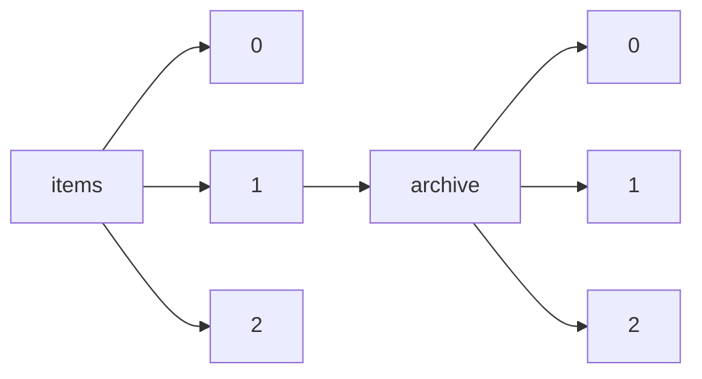

!!! warning "This document is not official Crossref documentation"
# Elements
PATH = items/array/archive/array(1)  
Occurs 5 462 799 times  
Unique values: 6  
{ .annotate }

1. A route to an element, for example:  
   The route "items/array/archive/array" corresponds to navigating through the JSON indices as  
   ["items"][0]["archive"][0]  

| **Row** | **Value** `String` | **Count** `Int64` |
|--------:|----------------------:|---------------------:|
| **1**   | Portico               | 4 891 479            |
| **2**   | Internet Archive      | 297 179              |
| **3**   | CLOCKSS               | 188 178              |
| **4**   | LOCKSS                | 63 783               |
| **5**   | DWT                   | 12 766               |
| **6**   | KB                    | 9 414                |

