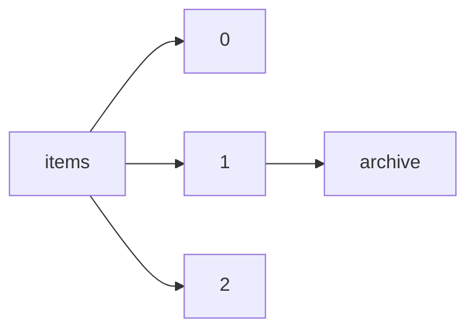

!!! warning "This document is not official Crossref documentation"
# Archive
PATH = items/array/archive(1)  
Occurs 5 134 956 times  
{ .annotate }

1. A route to an element, for example:  
   The route "items/array/archive" corresponds to navigating through the JSON indices as  
   ["items"][0]["archive"]  

## Properties of Array
See information about elements: [items/array/archive/array](array/index.md)  
Distribution of lengths:  

| **Row** | **Length** `Any` | **Count** `Int64` |
|--------:|--------------------:|---------------------:|
| **1**   | 1                   | 4 885 397            |
| **2**   | 2                   | 199 199              |
| **3**   | 3                   | 41 044               |
| **4**   | 4                   | 22                   |
| **5**   | 6                   | 9 288                |
| **6**   | 8                   | 4                    |
| **7**   | 12                  | 2                    |

