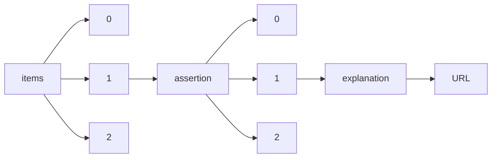

!!! warning "This document is not official Crossref documentation"
# URL
PATH = items/array/assertion/array/explanation/URL(1)  
Occurs 805 034 times  
Unique values: > 999  
{ .annotate }

1. A route to an element, for example:  
   The route "items/array/assertion/array/explanation/URL" corresponds to navigating through the JSON indices as  
   ["items"][0]["assertion"][0]["explanation"]["URL"]  

!!! note "Due to current limitations, only the first 1,000 unique values are counted."

| **Row** | **Value** `String`                                                                                | **Count** `Int64` |
|--------:|-----------------------------------------------------------------------------------------------------:|---------------------:|
| **1**   | https://www.crossref.org/services/similarity-check/                                                  | 240 611              |
| **2**   | http://journals.iucr.org/services/copyrightpolicy.html                                               | 108 982              |
| **3**   | http://journals.iucr.org/e                                                                           | 43 814               |
| **4**   | http://www.crossref.org/crosscheck/index.html                                                        | 37 616               |
| **5**   | http://journals.iucr.org/e/issues/2011/01/00/me0439/index.html                                       | 36 873               |
| **6**   | http://creativecommons.org/licenses/by/2.0/uk/legalcode                                              | 28 794               |
| **7**   | http://journals.iucr.org/a                                                                           | 24 366               |
| **8**   | http://creativecommons.org/licenses/by-nc/3.0/                                                       | 21 836               |
| **9**   | http://creativecommons.org/licenses/by-nc/4.0                                                        | 15 126               |
| **10**  | http://journals.iucr.org/a/issues/2011/01/00/me0432/index.html                                       | 13 593               |
| **11**  | http://creativecommons.org/licenses/by-nc/4.0/                                                       | 13 044               |
| **12**  | https://creativecommons.org/licenses/by/4.0/                                                         | 12 630               |
| **13**  | http://journals.iucr.org/b                                                                           | 11 090               |
| **14**  | http://creativecommons.org/licenses/by-nc/3.0                                                        | 10 519               |
| **15**  | https://creativecommons.org/licenses/by-nc/4.0/                                                      | 8 407                |
| **16**  | https://journals.iucr.org/a/services/notesforauthors.html                                            | 8 150                |
| **17**  | http://journals.iucr.org/c                                                                           | 7 801                |
| **18**  | http://journals.iucr.org/b/services/notesforauthors.html                                             | 6 676                |
| **19**  | http://journals.iucr.org/c/issues/2011/01/00/me0438/index.html                                       | 6 146                |
| **20**  | http://journals.iucr.org/d                                                                           | 5 726                |
| **21**  | http://journals.iucr.org/j                                                                           | 5 344                |
| **22**  | http://journals.iucr.org/f                                                                           | 4 271                |
| **23**  | https://journals.iucr.org/b/services/notesforauthors.html                                            | 4 166                |
| **24**  | http://journals.iucr.org/s                                                                           | 4 059                |
| **25**  | http://journals.iucr.org/j/services/notesforauthors.html                                             | 3 956                |
| **26**  | http://journals.iucr.org/d/issues/2011/01/00/me0434/index.html                                       | 3 845                |
| **27**  | http://journals.iucr.org/e/services/notesforauthors.html                                             | 3 839                |
| **28**  | https://creativecommons.org/licenses/by/4.0/legalcode                                                | 3 836                |
| **29**  | http://journals.iucr.org/a/services/notesforauthors.html                                             | 3 671                |
| **30**  | https://journals.iucr.org/e/services/notesforauthors.html                                            | 3 224                |
| **31**  | http://journals.iucr.org/f/issues/2011/01/00/me0435/index.html                                       | 3 220                |
| **32**  | https://creativecommons.org/licenses/by-nc/4.0                                                       | 2 869                |
| **33**  | https://journals.iucr.org/services/copyrightpolicy.html                                              | 2 204                |
| **34**  | https://journals.iucr.org/s/services/notesforauthors.html                                            | 1 893                |
| **35**  | http://journals.iucr.org/s/issues/2011/01/00/me0437/index.html                                       | 1 845                |
| **36**  | https://journals.iucr.org/j/services/notesforauthors.html                                            | 1 754                |
| **37**  | https://creativecommons.org/licenses/by/4.0                                                          | 1 711                |
| **38**  | http://journals.iucr.org/x                                                                           | 1 598                |
| **39**  | https://journals.iucr.org/d/services/notesforauthors.html                                            | 1 084                |
| **40**  | https://journals.iucr.org/a                                                                          | 1 046                |
| **41**  | https://journals.iucr.org/c/services/notesforauthors.html                                            | 1 044                |
| **42**  | https://journals.iucr.org/x/services/notesforauthors.html                                            | 946                  |
| **43**  | http://journals.iucr.org/d/services/notesforauthors.html                                             | 845                  |
| **44**  | http://www.iucrj.org/                                                                                | 807                  |
| **45**  | https://journals.iucr.org/copyright/licencetopublish.html                                            | 732                  |
| **46**  | http://creativecommons.org/licenses/by/4.0                                                           | 718                  |
| **47**  | http://journals.iucr.org/x/services/notesforauthors.html                                             | 717                  |
| **48**  | http://journals.iucr.org/c/services/notesforauthors.html                                             | 716                  |
| **49**  | http://creativecommons.org/licenses/by-nd/4.0/                                                       | 687                  |
| **50**  | http://www.eurjchem.com/index.php/eurjchem/pages/view/terms                                          | 674                  |
| **51**  | https://journals.iucr.org/m/services/notesforauthors.html                                            | 639                  |
| **52**  | http://journals.iucr.org/s/services/notesforauthors.html                                             | 611                  |
| **53**  | https://journals.iucr.org/f/services/notesforauthors.html                                            | 552                  |
| **54**  | http://journals.iucr.org/f/services/notesforauthors.html                                             | 517                  |
| **55**  | http://journals.iucr.org/q/services/notesforauthors.html                                             | 418                  |
| **56**  | http://journals.iucr.org/q                                                                           | 416                  |
| **57**  | https://journals.iucr.org/j                                                                          | 383                  |
| **58**  | http://www.eurjchem.com                                                                              | 354                  |
| **59**  | http://www.eurjchem.com/index.php/eurjchem/about/editorialPolicies#sectionPolicies                   | 335                  |
| **60**  | http://www.eurjchem.com/index.php/eurjchem/pages/view/rights                                         | 334                  |
| **61**  | http://journals.iucr.org/b/issues/2011/01/00/me0433/index.html                                       | 307                  |
| **62**  | http://www.eurjchem.com/index.php/eurjchem/pages/view/publishing\_ethics                             | 297                  |
| **63**  | http://creativecommons.org/licenses/by-nc-nd/4.0/                                                    | 287                  |
| **64**  | https://journals.iucr.org/s                                                                          | 285                  |
| **65**  | http://creativecommons.org/licenses/by-nc-sa/3.0/.                                                   | 243                  |
| **66**  | http://journals.iucr.org/m/services/notesforauthors.html                                             | 229                  |
| **67**  | https://creativecommons.org/licenses/by-nc-nd/4.0/                                                   | 222                  |
| **68**  | http://creativecommons.org/licenses/by/2.0/                                                          | 210                  |
| **69**  | CC BY 4.0                                                                                            | 206                  |
| **70**  | Copyright                                                                                            | 206                  |
| **71**  | Open, Transparent                                                                                    | 205                  |
| **72**  | http://creativecommons.org/license/by-nc/4.0.                                                        | 183                  |
| **73**  | http://creativecommons.org/licenses/bync/4.0/                                                        | 179                  |
| **74**  | http://naerjournal.ua.es/about/editorialPolicies#focusAndScope                                       | 173                  |
| **75**  | http://naerjournal.ua.es/about/submissions#copyrightNotice                                           | 173                  |
| **76**  | Double blind review                                                                                  | 170                  |
| **77**  | Double blind peer review                                                                             | 165                  |
| **78**  | http://creativecommons.org/licenses/                                                                 | 139                  |
| **79**  | Authors Contributions                                                                                | 137                  |
| **80**  | Funding                                                                                              | 137                  |
| **81**  | Availability of Data and Material                                                                    | 135                  |
| **82**  | Conflicts of Interest                                                                                | 134                  |
| **83**  | Http://creativecommons.org/license/by-nc/4.0.                                                        | 125                  |
| **84**  | https://journals.iucr.org/e                                                                          | 122                  |
| **85**  | Ethical Approval and Consent to Participate                                                          | 120                  |
| **86**  | https://journals.iucr.org/c                                                                          | 111                  |
| **87**  | Double Blind Review                                                                                  | 109                  |
| **88**  | http://creativecommons.org/licenses/by-nc-nd/3.0/es/deed.en                                          | 105                  |
| **89**  | https://www.ijcrsee.com/index.php/ijcrsee/Peer\_review\_process                                      | 101                  |
| **90**  | https://www.ijcrsee.com/index.php/ijcrsee/Peer\_Review\_Statement                                    | 100                  |
| **91**  | CC BY-NC-ND 4.0                                                                                      | 99                   |
| **92**  | double blind                                                                                         | 97                   |
| **93**  | Double Blind Peer Reviewed                                                                           | 95                   |
| **94**  | Double-blind                                                                                         | 90                   |
| **95**  | http://creativecommons.org/licenses/bync/4.0                                                         | 85                   |
| **96**  | http://creativecommons.org/licenses/by/3.0/                                                          | 79                   |
| **97**  | https://creativecommons.org/licenses/by/2.0/uk/legalcode                                             | 69                   |
| **98**  | https://www.iucrj.org/                                                                               | 68                   |
| **99**  | https://www.ijcrsee.com/index.php/ijcrsee/Copyright                                                  | 64                   |
| **100** | Double blind                                                                                         | 60                   |
| **101** | http://creativecommons.org/                                                                          | 55                   |
| **102** | https://journals.iucr.org/b                                                                          | 54                   |
| **103** | https://journals.iucr.org/d                                                                          | 47                   |
| **104** | http://creativecommons.org/licenses/by-nc/1.0/                                                       | 46                   |
| **105** | http://creativecommons.org/licenses/by-nd/4.0                                                        | 46                   |
| **106** | https://journals.iucr.org/x                                                                          | 44                   |
| **107** | Copyright ⓒ 2019 Journal of mycology and infection                                                   | 43                   |
| **108** | Creative Commons Attribution 4.0 International License.                                              | 41                   |
| **109** | http://creativecommons.org/licenses/by-nc-nd/4.0                                                     | 41                   |
| **110** | http://creativecommons.org/licenses/by-nc/2.0/                                                       | 40                   |
| **111** | http://eurjchem.com/index.php/eurjchem/pages/view/terms                                              | 40                   |
| **112** | Author Owns Copyright                                                                                | 38                   |
| **113** | Digital Backup                                                                                       | 37                   |
| **114** | Double-Blind Peer-Review                                                                             | 34                   |
| **115** | Article is Peer-Reviewed                                                                             | 33                   |
| **116** | Política de Acesso Livre                                                                             | 32                   |
| **117** | Declaração de Direito Autoral                                                                        | 30                   |
| **118** | This work is licensed under a Creative Commons Attribution-Noncommercial-ShareAlike 4.0 internationa | 30                   |
| **119** | SHERM Owns Publishing License                                                                        | 28                   |
| **120** | We use Double Blind Peer Reviewed                                                                    | 28                   |
| **121** | Double-blind Review                                                                                  | 25                   |
| **122** | we use a serial step to qualify the content of our scientific production                             | 25                   |
| **123** | Double-blind review                                                                                  | 25                   |
| **124** | The economic rights belong to the Gaceta Medica Boliviana and the moral rights belong to the author  | 25                   |
| **125** | Peer-reviewed                                                                                        | 23                   |
| **126** | http://creativecom                                                                                   | 21                   |
| **127** | http://creative                                                                                      | 20                   |
| **128** | http://creativecommons.org/licenses/by/2.0                                                           | 19                   |
| **129** | Attribution-NonCommercial-ShareAlike 4.0 International (CC BY-NC-SA 4.0)                             | 19                   |
| **130** | http://eurjchem.com/index.php/eurjchem/about/editorialPolicies#sectionPolicies                       | 18                   |
| **131** | http://eurjchem.com/index.php/eurjchem/pages/view/rights                                             | 18                   |
| **132** | Accepted Manuscript                                                                                  | 15                   |
| **133** | Download Article                                                                                     | 15                   |
| **134** | This work is licensed under a Creative Commons Attribution-ShareAlike 4.0 International License.     | 15                   |
| **135** | FORMULÁRIO PARA AVALIAÇÃO DE MANUSCRITO                                                              | 15                   |
| **136** | The published article has been peer-reviewed.                                                        | 14                   |
| **137** | Copyright © 2018 Journal of mycology and infection                                                   | 14                   |
| **138** | double blind peer reviews                                                                            | 14                   |
| **139** | http://creativecommons.org/licenses/by/4.0/.                                                         | 13                   |
| **140** | to be defined                                                                                        | 13                   |
| **141** | https://journals.iucr.org/f                                                                          | 12                   |
| **142** | Ethics Approval                                                                                      | 12                   |
| **143** | Consent to Participate                                                                               | 12                   |
| **144** | http://creativecommons.                                                                              | 12                   |
| **145** | http://creativecommons.org/licenses/bync-nd/4.0/                                                     | 11                   |
| **146** | Single Blind                                                                                         | 11                   |
| **147** | http://eurjchem.com/index.php/eurjchem/pages/view/publishing\_ethics                                 | 10                   |
| **148** | Double-blind peer review                                                                             | 10                   |
| **149** | Consent for Publication                                                                              | 10                   |
| **150** | Crossmark Policy                                                                                     | 9                    |
| **151** | Journal of Intercultural Communication                                                               | 9                    |
| **152** | double blind peer review                                                                             | 9                    |
| **153** | Processo de Avaliação do Manuscrito                                                                  | 9                    |
| **154** | The published article has been peer-reviewed                                                         | 8                    |
| **155** | Acceptd Manuscript                                                                                   | 8                    |
| **156** | Salud, Ciencia y Tecnología                                                                          | 8                    |
| **157** | SHERM Owns Licensing                                                                                 | 8                    |
| **158** | This article is an open accessarticle distributed under the terms and conditions of the Creative Com | 8                    |
| **159** | CC BY SA                                                                                             | 8                    |
| **160** | Free to Read                                                                                         | 8                    |
| **161** | Code Availability                                                                                    | 8                    |
| **162** | double-blind peer review                                                                             | 7                    |
| **163** | double blind peer reviewing process                                                                  | 7                    |
| **164** | From vol. 1 to vol. 2                                                                                | 7                    |
| **165** | http://creativecommons.org/licenses/by-sa/4.0/                                                       | 7                    |
| **166** | three peer reviewers                                                                                 | 6                    |
| **167** | http://creativecommons.org/licens                                                                    | 6                    |
| **168** | © 2022 by author and REPA - Research and Education Promotion Association                             | 6                    |
| **169** | Authors retain copyright                                                                             | 6                    |
| **170** | Peer reviewed process                                                                                | 6                    |
| **171** | Yes                                                                                                  | 6                    |
| **172** | https://creativecommons.org/licenses/by-nc/3.0/                                                      | 6                    |
| **173** | CC-BY-NC                                                                                             | 6                    |
| **174** | Processo de Avaliação pelos Pares                                                                    | 5                    |
| **175** | Proceso de evaluación                                                                                | 5                    |
| **176** | Attribution-NonCommercial-NoDerivatives 4.0 International                                            | 5                    |
| **177** | This work is licensed under a Creative Commons Attribution-NonCommercial 4.0 International License.  | 5                    |
| **178** | Publication year corrected from 2020 to 2021                                                         | 5                    |
| **179** | Double-Blind                                                                                         | 4                    |
| **180** | CC BY-SA                                                                                             | 4                    |
| **181** | Copyright ⓒ 2021 Journal of mycology and infection                                                   | 4                    |
| **182** | This article is an open access article distributed under the terms and conditions of the Creative Co | 4                    |
| **183** | double blinded peer reviewed                                                                         | 3                    |
| **184** | Three peer reviewers                                                                                 | 3                    |
| **185** | http://jkms.org/index.php-main=terms                                                                 | 3                    |
| **186** | Copyright © 2019 Journal of mycology and infection                                                   | 3                    |
| **187** | https://periodicos.uninove.br/exacta/about/editorialPolicies#peerReviewProcess                       | 3                    |
| **188** | Creative Commons Attribution, Non-Commercial License                                                 | 2                    |
| **189** | http://scripts.iucr.org/cgi-bin/sendsup?eb5021                                                       | 2                    |
| **190** | Review                                                                                               | 2                    |
| **191** | http://scripts.iucr.org/cgi-bin/sendsup?eb5019                                                       | 2                    |
| **192** | This article is licensed under a Creative Commons Attribution 4.0 International License.             | 2                    |
| **193** | http://scripts.iucr.org/cgi-bin/sendsup?so5067                                                       | 2                    |
| **194** | Creative Commons Attribution, Non-Commerical, No-Derivatives International License 4.0               | 2                    |
| **195** | http://scripts.iucr.org/cgi-bin/sendsup?ps5022                                                       | 2                    |
| **196** | Open and post-publication peer review                                                                | 2                    |
| **197** | © 2022by authors. Licensee ERUDITUS®. This article is an open accessarticle distributed under the te | 2                    |
| **198** | Fasi Ahamad Shaik                                                                                    | 2                    |
| **199** | Creative Commons Attribution (CC BY)                                                                 | 2                    |
| **200** | CC BY                                                                                                | 2                    |
| **201** | Material suplementario 1. Proceso de revisión del artículo                                           | 2                    |
| **202** | Original                                                                                             | 2                    |
| **203** | Creative Commons Attribution 4.0 License                                                             | 2                    |
| **204** | double-blind                                                                                         | 2                    |
| **205** | http://scripts.iucr.org/cgi-bin/sendsup?bp5048                                                       | 2                    |
| **206** | http://scripts.iucr.org/cgi-bin/sendsup?gp5057                                                       | 2                    |
| **207** | This work is licensed under a Creative Commons Attribution 4.0 International License.                | 2                    |
| **208** | https://scripts.iucr.org/cgi-bin/sendsup?ib5112                                                      | 1                    |
| **209** | https://scripts.iucr.org/cgi-bin/sendsup?bh4056                                                      | 1                    |
| **210** | http://scripts.iucr.org/cgi-bin/sendsup?zl2455                                                       | 1                    |
| **211** | http://scripts.iucr.org/cgi-bin/sendsup?vm2021                                                       | 1                    |
| **212** | http://scripts.iucr.org/cgi-bin/sendsup?kp2453                                                       | 1                    |
| **213** | http://scripts.iucr.org/cgi-bin/sendsup?lh5488                                                       | 1                    |
| **214** | http://scripts.iucr.org/cgi-bin/sendsup?cv2662                                                       | 1                    |
| **215** | http://scripts.iucr.org/cgi-bin/sendsup?hg2318                                                       | 1                    |
| **216** | http://scripts.iucr.org/cgi-bin/sendsup?bi2053                                                       | 1                    |
| **217** | http://scripts.iucr.org/cgi-bin/sendsup?wm4089                                                       | 1                    |
| **218** | http://scripts.iucr.org/cgi-bin/sendsup?lg3157                                                       | 1                    |
| **219** | http://scripts.iucr.org/cgi-bin/sendsup?hk2455                                                       | 1                    |
| **220** | http://scripts.iucr.org/cgi-bin/sendsup?dn2604                                                       | 1                    |
| **221** | http://scripts.iucr.org/cgi-bin/sendsup?en5227                                                       | 1                    |
| **222** | http://scripts.iucr.org/cgi-bin/sendsup?na6174                                                       | 1                    |
| **223** | http://scripts.iucr.org/cgi-bin/sendsup?sj2578                                                       | 1                    |
| **224** | http://scripts.iucr.org/cgi-bin/sendsup?fk2025                                                       | 1                    |
| **225** | http://scripts.iucr.org/cgi-bin/sendsup?hg5172                                                       | 1                    |
| **226** | http://scripts.iucr.org/cgi-bin/sendsup?sj2384                                                       | 1                    |
| **227** | http://scripts.iucr.org/cgi-bin/sendsup?dz0013                                                       | 1                    |
| **228** | http://scripts.iucr.org/cgi-bin/sendsup?lh2245                                                       | 1                    |
| **229** | http://scripts.iucr.org/cgi-bin/sendsup?hb2952                                                       | 1                    |
| **230** | http://scripts.iucr.org/cgi-bin/sendsup?ln1132                                                       | 1                    |
| **231** | http://scripts.iucr.org/cgi-bin/sendsup?os1102                                                       | 1                    |
| **232** | http://scripts.iucr.org/cgi-bin/sendsup?ez2292                                                       | 1                    |
| **233** | https://scripts.iucr.org/cgi-bin/sendsup?dw5217                                                      | 1                    |
| **234** | http://scripts.iucr.org/cgi-bin/sendsup?sj5219                                                       | 1                    |
| **235** | http://scripts.iucr.org/cgi-bin/sendsup?gd1304                                                       | 1                    |
| **236** | http://scripts.iucr.org/cgi-bin/sendsup?cv2370                                                       | 1                    |
| **237** | http://scripts.iucr.org/cgi-bin/sendsup?kp2269                                                       | 1                    |
| **238** | http://scripts.iucr.org/cgi-bin/sendsup?hg2068                                                       | 1                    |
| **239** | http://scripts.iucr.org/cgi-bin/sendsup?wa5109                                                       | 1                    |
| **240** | http://scripts.iucr.org/cgi-bin/sendsup?rz5182                                                       | 1                    |
| **241** | http://scripts.iucr.org/cgi-bin/sendsup?cf6482                                                       | 1                    |
| **242** | http://scripts.iucr.org/cgi-bin/sendsup?ww6193                                                       | 1                    |
| **243** | http://scripts.iucr.org/cgi-bin/sendsup?sk3445                                                       | 1                    |
| **244** | http://scripts.iucr.org/cgi-bin/sendsup?wm4116                                                       | 1                    |
| **245** | http://scripts.iucr.org/cgi-bin/sendsup?hb2777                                                       | 1                    |
| **246** | http://scripts.iucr.org/cgi-bin/sendsup?jn0083                                                       | 1                    |
| **247** | http://scripts.iucr.org/cgi-bin/sendsup?cv6539                                                       | 1                    |
| **248** | http://scripts.iucr.org/cgi-bin/sendsup?bm0061                                                       | 1                    |
| **249** | http://scripts.iucr.org/cgi-bin/sendsup?sk1806                                                       | 1                    |
| **250** | http://scripts.iucr.org/cgi-bin/sendsup?nj5188                                                       | 1                    |
| **251** | http://scripts.iucr.org/cgi-bin/sendsup?cv2213                                                       | 1                    |
| **252** | http://scripts.iucr.org/cgi-bin/sendsup?tk5319                                                       | 1                    |
| **253** | http://scripts.iucr.org/cgi-bin/sendsup?si2018                                                       | 1                    |
| **254** | http://scripts.iucr.org/cgi-bin/sendsup?wn2215                                                       | 1                    |
| **255** | http://scripts.iucr.org/cgi-bin/sendsup?dn2632                                                       | 1                    |
| **256** | http://scripts.iucr.org/cgi-bin/sendsup?lh6397                                                       | 1                    |
| **257** | http://scripts.iucr.org/cgi-bin/sendsup?wm5541                                                       | 1                    |
| **258** | https://scripts.iucr.org/cgi-bin/sendsup?dk5084                                                      | 1                    |
| **259** | http://scripts.iucr.org/cgi-bin/sendsup?wm2748                                                       | 1                    |
| **260** | http://scripts.iucr.org/cgi-bin/sendsup?lh2557                                                       | 1                    |
| **261** | http://scripts.iucr.org/cgi-bin/sendsup?im2363                                                       | 1                    |
| **262** | http://scripts.iucr.org/cgi-bin/sendsup?at6015                                                       | 1                    |
| **263** | http://scripts.iucr.org/cgi-bin/sendsup?cr0447                                                       | 1                    |
| **264** | http://scripts.iucr.org/cgi-bin/sendsup?nc2151                                                       | 1                    |
| **265** | http://scripts.iucr.org/cgi-bin/sendsup?bt6547                                                       | 1                    |
| **266** | http://scripts.iucr.org/cgi-bin/sendsup?dn1097                                                       | 1                    |
| **267** | http://scripts.iucr.org/cgi-bin/sendsup?wm6003                                                       | 1                    |
| **268** | http://scripts.iucr.org/cgi-bin/sendsup?hb7224                                                       | 1                    |
| **269** | http://scripts.iucr.org/cgi-bin/sendsup?is2756                                                       | 1                    |
| **270** | http://scripts.iucr.org/cgi-bin/sendsup?hg2304                                                       | 1                    |
| **271** | http://scripts.iucr.org/cgi-bin/sendsup?kx5048                                                       | 1                    |
| **272** | http://scripts.iucr.org/cgi-bin/sendsup?ld2104                                                       | 1                    |
| **273** | http://scripts.iucr.org/cgi-bin/sendsup?tk5289                                                       | 1                    |
| **274** | http://scripts.iucr.org/cgi-bin/sendsup?bh2308                                                       | 1                    |
| **275** | https://scripts.iucr.org/cgi-bin/sendsup?tz5076                                                      | 1                    |
| **276** | http://scripts.iucr.org/cgi-bin/sendsup?bt6628                                                       | 1                    |
| **277** | http://scripts.iucr.org/cgi-bin/sendsup?ln3060                                                       | 1                    |
| **278** | http://scripts.iucr.org/cgi-bin/sendsup?xu5070                                                       | 1                    |
| **279** | http://scripts.iucr.org/cgi-bin/sendsup?ac6107                                                       | 1                    |
| **280** | http://scripts.iucr.org/cgi-bin/sendsup?bh2437                                                       | 1                    |
| **281** | http://scripts.iucr.org/cgi-bin/sendsup?su2207                                                       | 1                    |
| **282** | http://scripts.iucr.org/cgi-bin/sendsup?wm4080                                                       | 1                    |
| **283** | http://scripts.iucr.org/cgi-bin/sendsup?lh6313                                                       | 1                    |
| **284** | http://scripts.iucr.org/cgi-bin/sendsup?bi2295                                                       | 1                    |
| **285** | http://scripts.iucr.org/cgi-bin/sendsup?aj5201                                                       | 1                    |
| **286** | http://scripts.iucr.org/cgi-bin/sendsup?mw2028                                                       | 1                    |
| **287** | SVP4U PUBLIC BENEFIT CORPORATION                                                                     | 1                    |
| **288** | http://scripts.iucr.org/cgi-bin/sendsup?ez2077                                                       | 1                    |
| **289** | http://scripts.iucr.org/cgi-bin/sendsup?hb7760                                                       | 1                    |
| **290** | http://scripts.iucr.org/cgi-bin/sendsup?lh2168                                                       | 1                    |
| **291** | http://scripts.iucr.org/cgi-bin/sendsup?hg2359                                                       | 1                    |
| **292** | http://scripts.iucr.org/cgi-bin/sendsup?mn5076                                                       | 1                    |
| **293** | http://scripts.iucr.org/cgi-bin/sendsup?be5171                                                       | 1                    |
| **294** | http://scripts.iucr.org/cgi-bin/sendsup?su4129                                                       | 1                    |
| **295** | http://scripts.iucr.org/cgi-bin/sendsup?hb4242                                                       | 1                    |
| **296** | http://scripts.iucr.org/cgi-bin/sendsup?mn5051                                                       | 1                    |
| **297** | http://scripts.iucr.org/cgi-bin/sendsup?rz2220                                                       | 1                    |
| **298** | http://scripts.iucr.org/cgi-bin/sendsup?gd1279                                                       | 1                    |
| **299** | http://scripts.iucr.org/cgi-bin/sendsup?is6070                                                       | 1                    |
| **300** | http://scripts.iucr.org/cgi-bin/sendsup?gk2058                                                       | 1                    |
| **301** | http://scripts.iucr.org/cgi-bin/sendsup?be5074                                                       | 1                    |
| **302** | http://scripts.iucr.org/cgi-bin/sendsup?fl6149                                                       | 1                    |
| **303** | http://scripts.iucr.org/cgi-bin/sendsup?cv6440                                                       | 1                    |
| **304** | http://scripts.iucr.org/cgi-bin/sendsup?wm2013                                                       | 1                    |
| **305** | http://scripts.iucr.org/cgi-bin/sendsup?bt6311                                                       | 1                    |
| **306** | http://scripts.iucr.org/cgi-bin/sendsup?pa0283                                                       | 1                    |
| **307** | http://scripts.iucr.org/cgi-bin/sendsup?ci2679                                                       | 1                    |
| **308** | http://scripts.iucr.org/cgi-bin/sendsup?gk2534                                                       | 1                    |
| **309** | http://scripts.iucr.org/cgi-bin/sendsup?na6032                                                       | 1                    |
| **310** | http://scripts.iucr.org/cgi-bin/sendsup?lh5106                                                       | 1                    |
| **311** | http://scripts.iucr.org/cgi-bin/sendsup?kf5004                                                       | 1                    |
| **312** | http://scripts.iucr.org/cgi-bin/sendsup?bt6432                                                       | 1                    |
| **313** | http://scripts.iucr.org/cgi-bin/sendsup?hb2673                                                       | 1                    |
| **314** | http://scripts.iucr.org/cgi-bin/sendsup?kj2226                                                       | 1                    |
| **315** | http://scripts.iucr.org/cgi-bin/sendsup?pv2221                                                       | 1                    |
| **316** | http://scripts.iucr.org/cgi-bin/sendsup?rr5005                                                       | 1                    |
| **317** | http://scripts.iucr.org/cgi-bin/sendsup?wn6190                                                       | 1                    |
| **318** | http://scripts.iucr.org/cgi-bin/sendsup?eb5049                                                       | 1                    |
| **319** | http://scripts.iucr.org/cgi-bin/sendsup?ck5021                                                       | 1                    |
| **320** | http://scripts.iucr.org/cgi-bin/sendsup?hb5645                                                       | 1                    |
| **321** | http://scripts.iucr.org/cgi-bin/sendsup?nr2019                                                       | 1                    |
| **322** | http://scripts.iucr.org/cgi-bin/sendsup?hb5738                                                       | 1                    |
| **323** | http://scripts.iucr.org/cgi-bin/sendsup?av1055                                                       | 1                    |
| **324** | https://scripts.iucr.org/cgi-bin/sendsup?gq5009                                                      | 1                    |
| **325** | http://scripts.iucr.org/cgi-bin/sendsup?nc2017                                                       | 1                    |
| **326** | http://scripts.iucr.org/cgi-bin/sendsup?zl2790                                                       | 1                    |
| **327** | http://scripts.iucr.org/cgi-bin/sendsup?ob6129                                                       | 1                    |
| **328** | http://scripts.iucr.org/cgi-bin/sendsup?cv6376                                                       | 1                    |
| **329** | http://scripts.iucr.org/cgi-bin/sendsup?cv2198                                                       | 1                    |
| **330** | https://scripts.iucr.org/cgi-bin/sendsup?dx2037                                                      | 1                    |
| **331** | https://scripts.iucr.org/cgi-bin/sendsup?jq2020                                                      | 1                    |
| **332** | http://scripts.iucr.org/cgi-bin/sendsup?qa0366                                                       | 1                    |
| **333** | http://scripts.iucr.org/cgi-bin/sendsup?jt5036                                                       | 1                    |
| **334** | http://scripts.iucr.org/cgi-bin/sendsup?zl2435                                                       | 1                    |
| **335** | http://scripts.iucr.org/cgi-bin/sendsup?hy2594                                                       | 1                    |
| **336** | http://scripts.iucr.org/cgi-bin/sendsup?na1500                                                       | 1                    |
| **337** | http://scripts.iucr.org/cgi-bin/sendsup?wn2118                                                       | 1                    |
| **338** | http://scripts.iucr.org/cgi-bin/sendsup?sk1820                                                       | 1                    |
| **339** | http://scripts.iucr.org/cgi-bin/sendsup?tk2277                                                       | 1                    |
| **340** | http://scripts.iucr.org/cgi-bin/sendsup?gw2129                                                       | 1                    |
| **341** | http://scripts.iucr.org/cgi-bin/sendsup?dn2505                                                       | 1                    |
| **342** | http://scripts.iucr.org/cgi-bin/sendsup?fl2257                                                       | 1                    |
| **343** | http://scripts.iucr.org/cgi-bin/sendsup?dn3016                                                       | 1                    |
| **344** | http://scripts.iucr.org/cgi-bin/sendsup?na6278                                                       | 1                    |
| **345** | http://scripts.iucr.org/cgi-bin/sendsup?nc6030                                                       | 1                    |
| **346** | http://scripts.iucr.org/cgi-bin/sendsup?gd3342                                                       | 1                    |
| **347** | http://scripts.iucr.org/cgi-bin/sendsup?av5032                                                       | 1                    |
| **348** | http://scripts.iucr.org/cgi-bin/sendsup?ci2799                                                       | 1                    |
| **349** | http://scripts.iucr.org/cgi-bin/sendsup?xu2005                                                       | 1                    |
| **350** | http://scripts.iucr.org/cgi-bin/sendsup?go2064                                                       | 1                    |
| **351** | https://scripts.iucr.org/cgi-bin/sendsup?yc5030                                                      | 1                    |
| **352** | http://scripts.iucr.org/cgi-bin/sendsup?hg5115                                                       | 1                    |
| **353** | http://scripts.iucr.org/cgi-bin/sendsup?om6248                                                       | 1                    |
| **354** | http://scripts.iucr.org/cgi-bin/sendsup?xu2132                                                       | 1                    |
| **355** | http://scripts.iucr.org/cgi-bin/sendsup?hg2323                                                       | 1                    |
| **356** | http://scripts.iucr.org/cgi-bin/sendsup?ng2174                                                       | 1                    |
| **357** | http://scripts.iucr.org/cgi-bin/sendsup?hb2506                                                       | 1                    |
| **358** | http://scripts.iucr.org/cgi-bin/sendsup?av5037                                                       | 1                    |
| **359** | http://scripts.iucr.org/cgi-bin/sendsup?cv5150                                                       | 1                    |
| **360** | https://scripts.iucr.org/cgi-bin/sendsup?ww2126                                                      | 1                    |
| **361** | http://scripts.iucr.org/cgi-bin/sendsup?av5009                                                       | 1                    |
| **362** | http://scripts.iucr.org/cgi-bin/sendsup?hb5052                                                       | 1                    |
| **363** | http://scripts.iucr.org/cgi-bin/sendsup?lg3029                                                       | 1                    |
| **364** | http://scripts.iucr.org/cgi-bin/sendsup?sc5045                                                       | 1                    |
| **365** | http://scripts.iucr.org/cgi-bin/sendsup?lh6194                                                       | 1                    |
| **366** | http://scripts.iucr.org/cgi-bin/sendsup?lx2079                                                       | 1                    |
| **367** | http://scripts.iucr.org/cgi-bin/sendsup?a22129                                                       | 1                    |
| **368** | http://scripts.iucr.org/cgi-bin/sendsup?pk2118                                                       | 1                    |
| **369** | http://scripts.iucr.org/cgi-bin/sendsup?sw5059                                                       | 1                    |
| **370** | https://scripts.iucr.org/cgi-bin/sendsup?ks5636                                                      | 1                    |
| **371** | http://scripts.iucr.org/cgi-bin/sendsup?wm2528                                                       | 1                    |
| **372** | http://scripts.iucr.org/cgi-bin/sendsup?wm5403                                                       | 1                    |
| **373** | http://scripts.iucr.org/cgi-bin/sendsup?kj2068                                                       | 1                    |
| **374** | http://scripts.iucr.org/cgi-bin/sendsup?rk2368                                                       | 1                    |
| **375** | http://scripts.iucr.org/cgi-bin/sendsup?bk1648                                                       | 1                    |
| **376** | http://scripts.iucr.org/cgi-bin/sendsup?mv5066                                                       | 1                    |
| **377** | http://scripts.iucr.org/cgi-bin/sendsup?rk2063                                                       | 1                    |
| **378** | http://scripts.iucr.org/cgi-bin/sendsup?wq3036                                                       | 1                    |
| **379** | http://scripts.iucr.org/cgi-bin/sendsup?dn2070                                                       | 1                    |
| **380** | http://scripts.iucr.org/cgi-bin/sendsup?bt6960                                                       | 1                    |
| **381** | http://scripts.iucr.org/cgi-bin/sendsup?tk2561                                                       | 1                    |
| **382** | http://scripts.iucr.org/cgi-bin/sendsup?at2270                                                       | 1                    |
| **383** | http://scripts.iucr.org/cgi-bin/sendsup?ci2409                                                       | 1                    |
| **384** | http://scripts.iucr.org/cgi-bin/sendsup?tk2796                                                       | 1                    |
| **385** | http://scripts.iucr.org/cgi-bin/sendsup?is5197                                                       | 1                    |
| **386** | http://scripts.iucr.org/cgi-bin/sendsup?bp5082                                                       | 1                    |
| **387** | http://scripts.iucr.org/cgi-bin/sendsup?hg6012                                                       | 1                    |
| **388** | http://scripts.iucr.org/cgi-bin/sendsup?sk1853                                                       | 1                    |
| **389** | http://scripts.iucr.org/cgi-bin/sendsup?bh2138                                                       | 1                    |
| **390** | http://scripts.iucr.org/cgi-bin/sendsup?ov3134                                                       | 1                    |
| **391** | http://scripts.iucr.org/cgi-bin/sendsup?lh2699                                                       | 1                    |
| **392** | http://scripts.iucr.org/cgi-bin/sendsup?ww6051                                                       | 1                    |
| **393** | http://scripts.iucr.org/cgi-bin/sendsup?hg6066                                                       | 1                    |
| **394** | http://scripts.iucr.org/cgi-bin/sendsup?hb5756                                                       | 1                    |
| **395** | http://scripts.iucr.org/cgi-bin/sendsup?av1233                                                       | 1                    |
| **396** | http://scripts.iucr.org/cgi-bin/sendsup?gz3172                                                       | 1                    |
| **397** | http://scripts.iucr.org/cgi-bin/sendsup?fl2008                                                       | 1                    |
| **398** | http://scripts.iucr.org/cgi-bin/sendsup?zs2204                                                       | 1                    |
| **399** | http://scripts.iucr.org/cgi-bin/sendsup?lh6137                                                       | 1                    |
| **400** | http://scripts.iucr.org/cgi-bin/sendsup?sk3690                                                       | 1                    |
| **401** | http://scripts.iucr.org/cgi-bin/sendsup?ww6095                                                       | 1                    |
| **402** | http://scripts.iucr.org/cgi-bin/sendsup?gb5105                                                       | 1                    |
| **403** | http://scripts.iucr.org/cgi-bin/sendsup?su6079                                                       | 1                    |
| **404** | http://scripts.iucr.org/cgi-bin/sendsup?bt6926                                                       | 1                    |
| **405** | http://scripts.iucr.org/cgi-bin/sendsup?hb5790                                                       | 1                    |
| **406** | https://scripts.iucr.org/cgi-bin/sendsup?uk3160                                                      | 1                    |
| **407** | https://scripts.iucr.org/cgi-bin/sendsup?pd5111                                                      | 1                    |
| **408** | http://scripts.iucr.org/cgi-bin/sendsup?hb2971                                                       | 1                    |
| **409** | http://scripts.iucr.org/cgi-bin/sendsup?hk2044                                                       | 1                    |
| **410** | http://scripts.iucr.org/cgi-bin/sendsup?tr1062                                                       | 1                    |
| **411** | http://scripts.iucr.org/cgi-bin/sendsup?fj2060                                                       | 1                    |
| **412** | http://scripts.iucr.org/cgi-bin/sendsup?bt2322                                                       | 1                    |
| **413** | http://scripts.iucr.org/cgi-bin/sendsup?ku3211                                                       | 1                    |
| **414** | http://scripts.iucr.org/cgi-bin/sendsup?pk2063                                                       | 1                    |
| **415** | http://scripts.iucr.org/cgi-bin/sendsup?ba5241                                                       | 1                    |
| **416** | http://scripts.iucr.org/cgi-bin/sendsup?tk5333                                                       | 1                    |
| **417** | http://scripts.iucr.org/cgi-bin/sendsup?cv6020                                                       | 1                    |
| **418** | http://scripts.iucr.org/cgi-bin/sendsup?rt2011                                                       | 1                    |
| **419** | http://scripts.iucr.org/cgi-bin/sendsup?cv6231                                                       | 1                    |
| **420** | http://scripts.iucr.org/cgi-bin/sendsup?sk3440                                                       | 1                    |
| **421** | http://dx.doi.org/10.5155/eurjchem.10.2.113-117.1832                                                 | 1                    |
| **422** | http://scripts.iucr.org/cgi-bin/sendsup?bh2269                                                       | 1                    |
| **423** | http://scripts.iucr.org/cgi-bin/sendsup?cf6158                                                       | 1                    |
| **424** | http://scripts.iucr.org/cgi-bin/sendsup?lh6312                                                       | 1                    |
| **425** | https://scripts.iucr.org/cgi-bin/sendsup?vm4059                                                      | 1                    |
| **426** | http://scripts.iucr.org/cgi-bin/sendsup?hv5065                                                       | 1                    |
| **427** | http://scripts.iucr.org/cgi-bin/sendsup?tj5030                                                       | 1                    |
| **428** | http://scripts.iucr.org/cgi-bin/sendsup?is5238                                                       | 1                    |
| **429** | http://scripts.iucr.org/cgi-bin/sendsup?hb6620                                                       | 1                    |
| **430** | http://scripts.iucr.org/cgi-bin/sendsup?sk1617                                                       | 1                    |
| **431** | http://scripts.iucr.org/cgi-bin/sendsup?jh2203                                                       | 1                    |
| **432** | http://dx.doi.org/10.5155/eurjchem.9.1.xiii-xiii.1697                                                | 1                    |
| **433** | http://scripts.iucr.org/cgi-bin/sendsup?rz2054                                                       | 1                    |
| **434** | http://scripts.iucr.org/cgi-bin/sendsup?tk2276                                                       | 1                    |
| **435** | https://scripts.iucr.org/cgi-bin/sendsup?hb4342                                                      | 1                    |
| **436** | http://scripts.iucr.org/cgi-bin/sendsup?vm2062                                                       | 1                    |
| **437** | http://scripts.iucr.org/cgi-bin/sendsup?br0034                                                       | 1                    |
| **438** | http://scripts.iucr.org/cgi-bin/sendsup?dn6295                                                       | 1                    |
| **439** | http://scripts.iucr.org/cgi-bin/sendsup?dw5030                                                       | 1                    |
| **440** | http://scripts.iucr.org/cgi-bin/sendsup?hb4344                                                       | 1                    |
| **441** | http://scripts.iucr.org/cgi-bin/sendsup?lh2579                                                       | 1                    |
| **442** | http://scripts.iucr.org/cgi-bin/sendsup?fg1732                                                       | 1                    |
| **443** | http://scripts.iucr.org/cgi-bin/sendsup?ft5092                                                       | 1                    |
| **444** | http://scripts.iucr.org/cgi-bin/sendsup?mn5093                                                       | 1                    |
| **445** | https://scripts.iucr.org/cgi-bin/sendsup?yj5002                                                      | 1                    |
| **446** | http://scripts.iucr.org/cgi-bin/sendsup?bt6285                                                       | 1                    |
| **447** | http://scripts.iucr.org/cgi-bin/sendsup?yk2128                                                       | 1                    |
| **448** | http://scripts.iucr.org/cgi-bin/sendsup?dw5145                                                       | 1                    |
| **449** | http://scripts.iucr.org/cgi-bin/sendsup?ng6263                                                       | 1                    |
| **450** | http://scripts.iucr.org/cgi-bin/sendsup?lh5082                                                       | 1                    |
| **451** | http://scripts.iucr.org/cgi-bin/sendsup?eb5001                                                       | 1                    |
| **452** | http://scripts.iucr.org/cgi-bin/sendsup?ff2030                                                       | 1                    |
| **453** | http://scripts.iucr.org/cgi-bin/sendsup?wm5304                                                       | 1                    |
| **454** | http://scripts.iucr.org/cgi-bin/sendsup?hk2685                                                       | 1                    |
| **455** | http://scripts.iucr.org/cgi-bin/sendsup?is5007                                                       | 1                    |
| **456** | http://scripts.iucr.org/cgi-bin/sendsup?cv6337                                                       | 1                    |
| **457** | http://scripts.iucr.org/cgi-bin/sendsup?su2787                                                       | 1                    |
| **458** | http://scripts.iucr.org/cgi-bin/sendsup?na6211                                                       | 1                    |
| **459** | http://scripts.iucr.org/cgi-bin/sendsup?fr1512                                                       | 1                    |
| **460** | http://scripts.iucr.org/cgi-bin/sendsup?fi2041                                                       | 1                    |
| **461** | http://scripts.iucr.org/cgi-bin/sendsup?hg2134                                                       | 1                    |
| **462** | http://scripts.iucr.org/cgi-bin/sendsup?mg2064                                                       | 1                    |
| **463** | http://scripts.iucr.org/cgi-bin/sendsup?is2575                                                       | 1                    |
| **464** | http://scripts.iucr.org/cgi-bin/sendsup?at6078                                                       | 1                    |
| **465** | http://scripts.iucr.org/cgi-bin/sendsup?fn3116                                                       | 1                    |
| **466** | http://scripts.iucr.org/cgi-bin/sendsup?hb6279                                                       | 1                    |
| **467** | http://scripts.iucr.org/cgi-bin/sendsup?bv4022                                                       | 1                    |
| **468** | https://scripts.iucr.org/cgi-bin/sendsup?iu5027                                                      | 1                    |
| **469** | http://scripts.iucr.org/cgi-bin/sendsup?lh4004                                                       | 1                    |
| **470** | http://scripts.iucr.org/cgi-bin/sendsup?sa2045                                                       | 1                    |
| **471** | http://scripts.iucr.org/cgi-bin/sendsup?lh6379                                                       | 1                    |
| **472** | http://scripts.iucr.org/cgi-bin/sendsup?rz2527                                                       | 1                    |
| **473** | http://scripts.iucr.org/cgi-bin/sendsup?si2299                                                       | 1                    |
| **474** | http://scripts.iucr.org/cgi-bin/sendsup?cv5251                                                       | 1                    |
| **475** | http://scripts.iucr.org/cgi-bin/sendsup?ld2047                                                       | 1                    |
| **476** | http://scripts.iucr.org/cgi-bin/sendsup?su2272                                                       | 1                    |
| **477** | https://scripts.iucr.org/cgi-bin/sendsup?at2608                                                      | 1                    |
| **478** | https://scripts.iucr.org/cgi-bin/sendsup?wv3005                                                      | 1                    |
| **479** | https://scripts.iucr.org/cgi-bin/sendsup?ku3268                                                      | 1                    |
| **480** | http://scripts.iucr.org/cgi-bin/sendsup?ng2383                                                       | 1                    |
| **481** | http://scripts.iucr.org/cgi-bin/sendsup?im2474                                                       | 1                    |
| **482** | http://scripts.iucr.org/cgi-bin/sendsup?fg3016                                                       | 1                    |
| **483** | http://scripts.iucr.org/cgi-bin/sendsup?cv6423                                                       | 1                    |
| **484** | http://scripts.iucr.org/cgi-bin/sendsup?jh2217                                                       | 1                    |
| **485** | http://scripts.iucr.org/cgi-bin/sendsup?bt5589                                                       | 1                    |
| **486** | http://scripts.iucr.org/cgi-bin/sendsup?su5037                                                       | 1                    |
| **487** | http://scripts.iucr.org/cgi-bin/sendsup?jj2135                                                       | 1                    |
| **488** | http://scripts.iucr.org/cgi-bin/sendsup?hp2018                                                       | 1                    |
| **489** | http://scripts.iucr.org/cgi-bin/sendsup?na6082                                                       | 1                    |
| **490** | http://scripts.iucr.org/cgi-bin/sendsup?is5156                                                       | 1                    |
| **491** | http://scripts.iucr.org/cgi-bin/sendsup?lh2646                                                       | 1                    |
| **492** | http://scripts.iucr.org/cgi-bin/sendsup?lz5017                                                       | 1                    |
| **493** | http://scripts.iucr.org/cgi-bin/sendsup?hv5227                                                       | 1                    |
| **494** | http://scripts.iucr.org/cgi-bin/sendsup?gk2222                                                       | 1                    |
| **495** | http://scripts.iucr.org/cgi-bin/sendsup?kp2119                                                       | 1                    |
| **496** | http://scripts.iucr.org/cgi-bin/sendsup?hg5449                                                       | 1                    |
| **497** | http://scripts.iucr.org/cgi-bin/sendsup?dn3097                                                       | 1                    |
| **498** | http://scripts.iucr.org/cgi-bin/sendsup?bs0017                                                       | 1                    |
| **499** | https://scripts.iucr.org/cgi-bin/sendsup?hb4371                                                      | 1                    |
| **500** | http://scripts.iucr.org/cgi-bin/sendsup?gx5216                                                       | 1                    |
| **501** | http://scripts.iucr.org/cgi-bin/sendsup?gs1085                                                       | 1                    |
| **502** | http://scripts.iucr.org/cgi-bin/sendsup?dz5262                                                       | 1                    |
| **503** | http://scripts.iucr.org/cgi-bin/sendsup?ci6644                                                       | 1                    |
| **504** | http://scripts.iucr.org/cgi-bin/sendsup?lw2021                                                       | 1                    |
| **505** | http://scripts.iucr.org/cgi-bin/sendsup?vn2070                                                       | 1                    |
| **506** | http://scripts.iucr.org/cgi-bin/sendsup?vj1143                                                       | 1                    |
| **507** | https://scripts.iucr.org/cgi-bin/sendsup?ey2007                                                      | 1                    |
| **508** | http://scripts.iucr.org/cgi-bin/sendsup?bx2278                                                       | 1                    |
| **509** | http://scripts.iucr.org/cgi-bin/sendsup?wm5125                                                       | 1                    |
| **510** | http://scripts.iucr.org/cgi-bin/sendsup?tk2786                                                       | 1                    |
| **511** | http://scripts.iucr.org/cgi-bin/sendsup?zq2037                                                       | 1                    |
| **512** | http://scripts.iucr.org/cgi-bin/sendsup?wq3071                                                       | 1                    |
| **513** | http://scripts.iucr.org/cgi-bin/sendsup?hb7541                                                       | 1                    |
| **514** | http://scripts.iucr.org/cgi-bin/sendsup?lh5244                                                       | 1                    |
| **515** | http://scripts.iucr.org/cgi-bin/sendsup?cv2744                                                       | 1                    |
| **516** | http://scripts.iucr.org/cgi-bin/sendsup?dn2698                                                       | 1                    |
| **517** | http://scripts.iucr.org/cgi-bin/sendsup?xu2224                                                       | 1                    |
| **518** | http://scripts.iucr.org/cgi-bin/sendsup?ky3155                                                       | 1                    |
| **519** | http://scripts.iucr.org/cgi-bin/sendsup?at2329                                                       | 1                    |
| **520** | http://scripts.iucr.org/cgi-bin/sendsup?wm6077                                                       | 1                    |
| **521** | http://scripts.iucr.org/cgi-bin/sendsup?fn3120                                                       | 1                    |
| **522** | http://scripts.iucr.org/cgi-bin/sendsup?ab0365                                                       | 1                    |
| **523** | http://scripts.iucr.org/cgi-bin/sendsup?ci6213                                                       | 1                    |
| **524** | http://scripts.iucr.org/cgi-bin/sendsup?kp2072                                                       | 1                    |
| **525** | http://scripts.iucr.org/cgi-bin/sendsup?wm4009                                                       | 1                    |
| **526** | http://scripts.iucr.org/cgi-bin/sendsup?fm3019                                                       | 1                    |
| **527** | http://scripts.iucr.org/cgi-bin/sendsup?su4101                                                       | 1                    |
| **528** | http://scripts.iucr.org/cgi-bin/sendsup?su5438                                                       | 1                    |
| **529** | http://scripts.iucr.org/cgi-bin/sendsup?na0097                                                       | 1                    |
| **530** | http://scripts.iucr.org/cgi-bin/sendsup?fp3012                                                       | 1                    |
| **531** | http://scripts.iucr.org/cgi-bin/sendsup?yf3044                                                       | 1                    |
| **532** | http://scripts.iucr.org/cgi-bin/sendsup?sg2033                                                       | 1                    |
| **533** | http://scripts.iucr.org/cgi-bin/sendsup?bk0004                                                       | 1                    |
| **534** | http://scripts.iucr.org/cgi-bin/sendsup?ci2252                                                       | 1                    |
| **535** | http://scripts.iucr.org/cgi-bin/sendsup?ob6541                                                       | 1                    |
| **536** | http://scripts.iucr.org/cgi-bin/sendsup?rn2104                                                       | 1                    |
| **537** | http://scripts.iucr.org/cgi-bin/sendsup?is2127                                                       | 1                    |
| **538** | http://scripts.iucr.org/cgi-bin/sendsup?kp2066                                                       | 1                    |
| **539** | http://scripts.iucr.org/cgi-bin/sendsup?su2247                                                       | 1                    |
| **540** | http://scripts.iucr.org/cgi-bin/sendsup?lh6513                                                       | 1                    |
| **541** | http://scripts.iucr.org/cgi-bin/sendsup?ci2877                                                       | 1                    |
| **542** | https://scripts.iucr.org/cgi-bin/sendsup?yc5035                                                      | 1                    |
| **543** | http://scripts.iucr.org/cgi-bin/sendsup?pv2535                                                       | 1                    |
| **544** | http://scripts.iucr.org/cgi-bin/sendsup?cf2126                                                       | 1                    |
| **545** | http://scripts.iucr.org/cgi-bin/sendsup?lh5385                                                       | 1                    |
| **546** | http://scripts.iucr.org/cgi-bin/sendsup?sk3178                                                       | 1                    |
| **547** | http://scripts.iucr.org/cgi-bin/sendsup?sf2012                                                       | 1                    |
| **548** | http://scripts.iucr.org/cgi-bin/sendsup?tk2226                                                       | 1                    |
| **549** | http://scripts.iucr.org/cgi-bin/sendsup?su2428                                                       | 1                    |
| **550** | http://scripts.iucr.org/cgi-bin/sendsup?cr0161                                                       | 1                    |
| **551** | https://scripts.iucr.org/cgi-bin/sendsup?fw5325                                                      | 1                    |
| **552** | http://scripts.iucr.org/cgi-bin/sendsup?at2469                                                       | 1                    |
| **553** | http://scripts.iucr.org/cgi-bin/sendsup?hy2412                                                       | 1                    |
| **554** | http://scripts.iucr.org/cgi-bin/sendsup?hb2938                                                       | 1                    |
| **555** | http://scripts.iucr.org/cgi-bin/sendsup?hg2240                                                       | 1                    |
| **556** | http://scripts.iucr.org/cgi-bin/sendsup?bx2358                                                       | 1                    |
| **557** | http://scripts.iucr.org/cgi-bin/sendsup?bg2370                                                       | 1                    |
| **558** | http://scripts.iucr.org/cgi-bin/sendsup?pu0136                                                       | 1                    |
| **559** | http://scripts.iucr.org/cgi-bin/sendsup?lh6181                                                       | 1                    |
| **560** | https://scripts.iucr.org/cgi-bin/sendsup?cu3177                                                      | 1                    |
| **561** | http://scripts.iucr.org/cgi-bin/sendsup?wm4107                                                       | 1                    |
| **562** | http://scripts.iucr.org/cgi-bin/sendsup?pk2318                                                       | 1                    |
| **563** | http://scripts.iucr.org/cgi-bin/sendsup?zl2070                                                       | 1                    |
| **564** | https://scripts.iucr.org/cgi-bin/sendsup?su5490                                                      | 1                    |
| **565** | http://scripts.iucr.org/cgi-bin/sendsup?be5011                                                       | 1                    |
| **566** | https://scripts.iucr.org/cgi-bin/sendsup?wm5604                                                      | 1                    |
| **567** | http://scripts.iucr.org/cgi-bin/sendsup?go2017                                                       | 1                    |
| **568** | http://scripts.iucr.org/cgi-bin/sendsup?ww6207                                                       | 1                    |
| **569** | http://scripts.iucr.org/cgi-bin/sendsup?bm5088                                                       | 1                    |
| **570** | http://scripts.iucr.org/cgi-bin/sendsup?yt5011                                                       | 1                    |
| **571** | http://scripts.iucr.org/cgi-bin/sendsup?sq3212                                                       | 1                    |
| **572** | http://scripts.iucr.org/cgi-bin/sendsup?sf3111                                                       | 1                    |
| **573** | http://scripts.iucr.org/cgi-bin/sendsup?fl6192                                                       | 1                    |
| **574** | http://scripts.iucr.org/cgi-bin/sendsup?fj2030                                                       | 1                    |
| **575** | http://scripts.iucr.org/cgi-bin/sendsup?kj2196                                                       | 1                    |
| **576** | https://scripts.iucr.org/cgi-bin/sendsup?ex2064                                                      | 1                    |
| **577** | http://scripts.iucr.org/cgi-bin/sendsup?cb5005                                                       | 1                    |
| **578** | http://scripts.iucr.org/cgi-bin/sendsup?lc5067                                                       | 1                    |
| **579** | https://scripts.iucr.org/cgi-bin/sendsup?ex2049                                                      | 1                    |
| **580** | http://scripts.iucr.org/cgi-bin/sendsup?hb7934                                                       | 1                    |
| **581** | http://scripts.iucr.org/cgi-bin/sendsup?ms5027                                                       | 1                    |
| **582** | http://scripts.iucr.org/cgi-bin/sendsup?lx2043                                                       | 1                    |
| **583** | http://scripts.iucr.org/cgi-bin/sendsup?ff4023                                                       | 1                    |
| **584** | http://scripts.iucr.org/cgi-bin/sendsup?ng5344                                                       | 1                    |
| **585** | http://scripts.iucr.org/cgi-bin/sendsup?mn5046                                                       | 1                    |
| **586** | http://scripts.iucr.org/cgi-bin/sendsup?is6144                                                       | 1                    |
| **587** | https://scripts.iucr.org/cgi-bin/sendsup?xh5054                                                      | 1                    |
| **588** | http://scripts.iucr.org/cgi-bin/sendsup?si2269                                                       | 1                    |
| **589** | http://scripts.iucr.org/cgi-bin/sendsup?br2161                                                       | 1                    |
| **590** | http://scripts.iucr.org/cgi-bin/sendsup?tk5176                                                       | 1                    |
| **591** | https://scripts.iucr.org/cgi-bin/sendsup?va5041                                                      | 1                    |
| **592** | http://scripts.iucr.org/cgi-bin/sendsup?zl2257                                                       | 1                    |
| **593** | http://scripts.iucr.org/cgi-bin/sendsup?cb5097                                                       | 1                    |
| **594** | http://scripts.iucr.org/cgi-bin/sendsup?ob6471                                                       | 1                    |
| **595** | http://scripts.iucr.org/cgi-bin/sendsup?dz5155                                                       | 1                    |
| **596** | http://scripts.iucr.org/cgi-bin/sendsup?fb2205                                                       | 1                    |
| **597** | http://scripts.iucr.org/cgi-bin/sendsup?rz2471                                                       | 1                    |
| **598** | http://scripts.iucr.org/cgi-bin/sendsup?cv6341                                                       | 1                    |
| **599** | https://scripts.iucr.org/cgi-bin/sendsup?pk2112                                                      | 1                    |
| **600** | http://scripts.iucr.org/cgi-bin/sendsup?wm5525                                                       | 1                    |
| **601** | http://scripts.iucr.org/cgi-bin/sendsup?kp2405                                                       | 1                    |
| **602** | http://scripts.iucr.org/cgi-bin/sendsup?xu5489                                                       | 1                    |
| **603** | http://scripts.iucr.org/cgi-bin/sendsup?br6032                                                       | 1                    |
| **604** | http://scripts.iucr.org/cgi-bin/sendsup?hj3041                                                       | 1                    |
| **605** | http://dx.doi.org/10.5155/eurjchem.10.1.82-94.1809                                                   | 1                    |
| **606** | http://scripts.iucr.org/cgi-bin/sendsup?bt5980                                                       | 1                    |
| **607** | https://scripts.iucr.org/cgi-bin/sendsup?ok5078                                                      | 1                    |
| **608** | http://scripts.iucr.org/cgi-bin/sendsup?su2120                                                       | 1                    |
| **609** | http://scripts.iucr.org/cgi-bin/sendsup?bt6262                                                       | 1                    |
| **610** | http://scripts.iucr.org/cgi-bin/sendsup?jb5014                                                       | 1                    |
| **611** | http://scripts.iucr.org/cgi-bin/sendsup?om2428                                                       | 1                    |
| **612** | http://scripts.iucr.org/cgi-bin/sendsup?ci6163                                                       | 1                    |
| **613** | http://scripts.iucr.org/cgi-bin/sendsup?tk6081                                                       | 1                    |
| **614** | https://scripts.iucr.org/cgi-bin/sendsup?lt5039                                                      | 1                    |
| **615** | http://scripts.iucr.org/cgi-bin/sendsup?hk2390                                                       | 1                    |
| **616** | http://scripts.iucr.org/cgi-bin/sendsup?gk2501                                                       | 1                    |
| **617** | http://scripts.iucr.org/cgi-bin/sendsup?sn5035                                                       | 1                    |
| **618** | http://scripts.iucr.org/cgi-bin/sendsup?gd3395                                                       | 1                    |
| **619** | http://scripts.iucr.org/cgi-bin/sendsup?sf3209                                                       | 1                    |
| **620** | http://scripts.iucr.org/cgi-bin/sendsup?nw5038                                                       | 1                    |
| **621** | http://scripts.iucr.org/cgi-bin/sendsup?tk6040                                                       | 1                    |
| **622** | http://scripts.iucr.org/cgi-bin/sendsup?os0098                                                       | 1                    |
| **623** | https://scripts.iucr.org/cgi-bin/sendsup?hf5386                                                      | 1                    |
| **624** | http://scripts.iucr.org/cgi-bin/sendsup?pv2266                                                       | 1                    |
| **625** | http://scripts.iucr.org/cgi-bin/sendsup?wm2364                                                       | 1                    |
| **626** | http://scripts.iucr.org/cgi-bin/sendsup?mw2090                                                       | 1                    |
| **627** | http://scripts.iucr.org/cgi-bin/sendsup?br6005                                                       | 1                    |
| **628** | http://scripts.iucr.org/cgi-bin/sendsup?bt2386                                                       | 1                    |
| **629** | http://scripts.iucr.org/cgi-bin/sendsup?lh6069                                                       | 1                    |
| **630** | http://scripts.iucr.org/cgi-bin/sendsup?ob6044                                                       | 1                    |
| **631** | http://scripts.iucr.org/cgi-bin/sendsup?xu5084                                                       | 1                    |
| **632** | http://scripts.iucr.org/cgi-bin/sendsup?ds2094                                                       | 1                    |
| **633** | http://scripts.iucr.org/cgi-bin/sendsup?ds2215                                                       | 1                    |
| **634** | http://scripts.iucr.org/cgi-bin/sendsup?dn6205                                                       | 1                    |
| **635** | http://scripts.iucr.org/cgi-bin/sendsup?bt6365                                                       | 1                    |
| **636** | http://scripts.iucr.org/cgi-bin/sendsup?qp3012                                                       | 1                    |
| **637** | http://scripts.iucr.org/cgi-bin/sendsup?kp2342                                                       | 1                    |
| **638** | http://scripts.iucr.org/cgi-bin/sendsup?gd3280                                                       | 1                    |
| **639** | http://scripts.iucr.org/cgi-bin/sendsup?at2832                                                       | 1                    |
| **640** | http://scripts.iucr.org/cgi-bin/sendsup?be5226                                                       | 1                    |
| **641** | http://scripts.iucr.org/cgi-bin/sendsup?pv2586                                                       | 1                    |
| **642** | http://scripts.iucr.org/cgi-bin/sendsup?hb5506                                                       | 1                    |
| **643** | http://scripts.iucr.org/cgi-bin/sendsup?sj2228                                                       | 1                    |
| **644** | https://scripts.iucr.org/cgi-bin/sendsup?yz2012                                                      | 1                    |
| **645** | http://scripts.iucr.org/cgi-bin/sendsup?nk2080                                                       | 1                    |
| **646** | http://scripts.iucr.org/cgi-bin/sendsup?er6017                                                       | 1                    |
| **647** | http://scripts.iucr.org/cgi-bin/sendsup?zs2091                                                       | 1                    |
| **648** | http://scripts.iucr.org/cgi-bin/sendsup?wd5278                                                       | 1                    |
| **649** | http://scripts.iucr.org/cgi-bin/sendsup?is5106                                                       | 1                    |
| **650** | http://scripts.iucr.org/cgi-bin/sendsup?mn5071                                                       | 1                    |
| **651** | http://scripts.iucr.org/cgi-bin/sendsup?gd3257                                                       | 1                    |
| **652** | http://scripts.iucr.org/cgi-bin/sendsup?gk2413                                                       | 1                    |
| **653** | http://scripts.iucr.org/cgi-bin/sendsup?ku3022                                                       | 1                    |
| **654** | http://scripts.iucr.org/cgi-bin/sendsup?hg6016                                                       | 1                    |
| **655** | http://scripts.iucr.org/cgi-bin/sendsup?cf6425                                                       | 1                    |
| **656** | http://scripts.iucr.org/cgi-bin/sendsup?mw2024                                                       | 1                    |
| **657** | http://scripts.iucr.org/cgi-bin/sendsup?su5375                                                       | 1                    |
| **658** | http://scripts.iucr.org/cgi-bin/sendsup?av1208                                                       | 1                    |
| **659** | http://scripts.iucr.org/cgi-bin/sendsup?cv6042                                                       | 1                    |
| **660** | http://scripts.iucr.org/cgi-bin/sendsup?ci5035                                                       | 1                    |
| **661** | https://scripts.iucr.org/cgi-bin/sendsup?yz2015                                                      | 1                    |
| **662** | https://scripts.iucr.org/cgi-bin/sendsup?nb5218                                                      | 1                    |
| **663** | http://scripts.iucr.org/cgi-bin/sendsup?ng6181                                                       | 1                    |
| **664** | http://scripts.iucr.org/cgi-bin/sendsup?ks5556                                                       | 1                    |
| **665** | http://scripts.iucr.org/cgi-bin/sendsup?ao5007                                                       | 1                    |
| **666** | http://scripts.iucr.org/cgi-bin/sendsup?dn6043                                                       | 1                    |
| **667** | http://scripts.iucr.org/cgi-bin/sendsup?tb5001                                                       | 1                    |
| **668** | http://scripts.iucr.org/cgi-bin/sendsup?wm5231                                                       | 1                    |
| **669** | http://scripts.iucr.org/cgi-bin/sendsup?bq2114                                                       | 1                    |
| **670** | http://scripts.iucr.org/cgi-bin/sendsup?qh5065                                                       | 1                    |
| **671** | http://scripts.iucr.org/cgi-bin/sendsup?lx2033                                                       | 1                    |
| **672** | http://scripts.iucr.org/cgi-bin/sendsup?ob6080                                                       | 1                    |
| **673** | http://scripts.iucr.org/cgi-bin/sendsup?ob2055                                                       | 1                    |
| **674** | http://scripts.iucr.org/cgi-bin/sendsup?hg2349                                                       | 1                    |
| **675** | http://scripts.iucr.org/cgi-bin/sendsup?xu2721                                                       | 1                    |
| **676** | http://scripts.iucr.org/cgi-bin/sendsup?ge0311                                                       | 1                    |
| **677** | http://scripts.iucr.org/cgi-bin/sendsup?bt5858                                                       | 1                    |
| **678** | http://scripts.iucr.org/cgi-bin/sendsup?ww6382                                                       | 1                    |
| **679** | http://scripts.iucr.org/cgi-bin/sendsup?av0026                                                       | 1                    |
| **680** | https://scripts.iucr.org/cgi-bin/sendsup?is5552                                                      | 1                    |
| **681** | http://scripts.iucr.org/cgi-bin/sendsup?lh5376                                                       | 1                    |
| **682** | http://scripts.iucr.org/cgi-bin/sendsup?su6174                                                       | 1                    |
| **683** | http://scripts.iucr.org/cgi-bin/sendsup?si2192                                                       | 1                    |
| **684** | https://scripts.iucr.org/cgi-bin/sendsup?rm5061                                                      | 1                    |
| **685** | http://scripts.iucr.org/cgi-bin/sendsup?lp5041                                                       | 1                    |
| **686** | http://scripts.iucr.org/cgi-bin/sendsup?ir5008                                                       | 1                    |
| **687** | http://scripts.iucr.org/cgi-bin/sendsup?fl6078                                                       | 1                    |
| **688** | http://scripts.iucr.org/cgi-bin/sendsup?gd3316                                                       | 1                    |
| **689** | http://dx.doi.org/10.5155/eurjchem.11.3.245-249.2017                                                 | 1                    |
| **690** | http://scripts.iucr.org/cgi-bin/sendsup?pv2447                                                       | 1                    |
| **691** | http://scripts.iucr.org/cgi-bin/sendsup?su2643                                                       | 1                    |
| **692** | https://scripts.iucr.org/cgi-bin/sendsup?hb7985                                                      | 1                    |
| **693** | http://scripts.iucr.org/cgi-bin/sendsup?oa1099                                                       | 1                    |
| **694** | http://scripts.iucr.org/cgi-bin/sendsup?kp6042                                                       | 1                    |
| **695** | http://scripts.iucr.org/cgi-bin/sendsup?em3027                                                       | 1                    |
| **696** | https://scripts.iucr.org/cgi-bin/sendsup?aw5028                                                      | 1                    |
| **697** | http://scripts.iucr.org/cgi-bin/sendsup?xu2401                                                       | 1                    |
| **698** | https://scripts.iucr.org/cgi-bin/sendsup?yz2030                                                      | 1                    |
| **699** | http://scripts.iucr.org/cgi-bin/sendsup?tk5029                                                       | 1                    |
| **700** | http://scripts.iucr.org/cgi-bin/sendsup?gd3123                                                       | 1                    |
| **701** | http://scripts.iucr.org/cgi-bin/sendsup?is5316                                                       | 1                    |
| **702** | https://scripts.iucr.org/cgi-bin/sendsup?wm4138                                                      | 1                    |
| **703** | http://scripts.iucr.org/cgi-bin/sendsup?bt2007                                                       | 1                    |
| **704** | http://scripts.iucr.org/cgi-bin/sendsup?sj6094                                                       | 1                    |
| **705** | http://scripts.iucr.org/cgi-bin/sendsup?at2479                                                       | 1                    |
| **706** | http://scripts.iucr.org/cgi-bin/sendsup?ci2188                                                       | 1                    |
| **707** | http://scripts.iucr.org/cgi-bin/sendsup?bq2322                                                       | 1                    |
| **708** | http://scripts.iucr.org/cgi-bin/sendsup?hb0001                                                       | 1                    |
| **709** | http://scripts.iucr.org/cgi-bin/sendsup?wn2444                                                       | 1                    |
| **710** | http://scripts.iucr.org/cgi-bin/sendsup?bt6510                                                       | 1                    |
| **711** | http://scripts.iucr.org/cgi-bin/sendsup?dn2286                                                       | 1                    |
| **712** | http://scripts.iucr.org/cgi-bin/sendsup?br2190                                                       | 1                    |
| **713** | http://scripts.iucr.org/cgi-bin/sendsup?qb0164                                                       | 1                    |
| **714** | http://scripts.iucr.org/cgi-bin/sendsup?sh0137                                                       | 1                    |
| **715** | http://scripts.iucr.org/cgi-bin/sendsup?tb5077                                                       | 1                    |
| **716** | http://scripts.iucr.org/cgi-bin/sendsup?lh5719                                                       | 1                    |
| **717** | http://scripts.iucr.org/cgi-bin/sendsup?bt6633                                                       | 1                    |
| **718** | http://scripts.iucr.org/cgi-bin/sendsup?mx3086                                                       | 1                    |
| **719** | http://scripts.iucr.org/cgi-bin/sendsup?pv2532                                                       | 1                    |
| **720** | http://scripts.iucr.org/cgi-bin/sendsup?ci2071                                                       | 1                    |
| **721** | http://scripts.iucr.org/cgi-bin/sendsup?is6075                                                       | 1                    |
| **722** | http://scripts.iucr.org/cgi-bin/sendsup?ez2293                                                       | 1                    |
| **723** | http://scripts.iucr.org/cgi-bin/sendsup?xu2057                                                       | 1                    |
| **724** | http://scripts.iucr.org/cgi-bin/sendsup?cf2081                                                       | 1                    |
| **725** | http://scripts.iucr.org/cgi-bin/sendsup?su5355                                                       | 1                    |
| **726** | http://scripts.iucr.org/cgi-bin/sendsup?aa2015                                                       | 1                    |
| **727** | http://scripts.iucr.org/cgi-bin/sendsup?sj2571                                                       | 1                    |
| **728** | http://scripts.iucr.org/cgi-bin/sendsup?ha0023                                                       | 1                    |
| **729** | http://scripts.iucr.org/cgi-bin/sendsup?hf5264                                                       | 1                    |
| **730** | http://scripts.iucr.org/cgi-bin/sendsup?lh2402                                                       | 1                    |
| **731** | http://scripts.iucr.org/cgi-bin/sendsup?ds2034                                                       | 1                    |
| **732** | http://scripts.iucr.org/cgi-bin/sendsup?ez2012                                                       | 1                    |
| **733** | http://scripts.iucr.org/cgi-bin/sendsup?wm2009                                                       | 1                    |
| **734** | http://scripts.iucr.org/cgi-bin/sendsup?er6015                                                       | 1                    |
| **735** | http://scripts.iucr.org/cgi-bin/sendsup?si2079                                                       | 1                    |
| **736** | http://scripts.iucr.org/cgi-bin/sendsup?bv2172                                                       | 1                    |
| **737** | http://scripts.iucr.org/cgi-bin/sendsup?av0055                                                       | 1                    |
| **738** | http://scripts.iucr.org/cgi-bin/sendsup?ob1109                                                       | 1                    |
| **739** | http://scripts.iucr.org/cgi-bin/sendsup?hb6404                                                       | 1                    |
| **740** | http://scripts.iucr.org/cgi-bin/sendsup?fa3053                                                       | 1                    |
| **741** | http://scripts.iucr.org/cgi-bin/sendsup?wd0003                                                       | 1                    |
| **742** | http://scripts.iucr.org/cgi-bin/sendsup?im2108                                                       | 1                    |
| **743** | http://scripts.iucr.org/cgi-bin/sendsup?tk5201                                                       | 1                    |
| **744** | http://scripts.iucr.org/cgi-bin/sendsup?lh2879                                                       | 1                    |
| **745** | http://scripts.iucr.org/cgi-bin/sendsup?ac6113                                                       | 1                    |
| **746** | http://scripts.iucr.org/cgi-bin/sendsup?aa2040                                                       | 1                    |
| **747** | http://scripts.iucr.org/cgi-bin/sendsup?bt4023                                                       | 1                    |
| **748** | http://scripts.iucr.org/cgi-bin/sendsup?as0635                                                       | 1                    |
| **749** | http://scripts.iucr.org/cgi-bin/sendsup?ob2098                                                       | 1                    |
| **750** | http://scripts.iucr.org/cgi-bin/sendsup?hb6990                                                       | 1                    |
| **751** | http://scripts.iucr.org/cgi-bin/sendsup?su5456                                                       | 1                    |
| **752** | http://scripts.iucr.org/cgi-bin/sendsup?dn2417                                                       | 1                    |
| **753** | http://scripts.iucr.org/cgi-bin/sendsup?bq2399                                                       | 1                    |
| **754** | http://scripts.iucr.org/cgi-bin/sendsup?wm5486                                                       | 1                    |
| **755** | http://scripts.iucr.org/cgi-bin/sendsup?bx2296                                                       | 1                    |
| **756** | https://scripts.iucr.org/cgi-bin/sendsup?sj4097                                                      | 1                    |
| **757** | http://scripts.iucr.org/cgi-bin/sendsup?vn2013                                                       | 1                    |
| **758** | https://scripts.iucr.org/cgi-bin/sendsup?wm4043                                                      | 1                    |
| **759** | http://scripts.iucr.org/cgi-bin/sendsup?hb7308                                                       | 1                    |
| **760** | http://scripts.iucr.org/cgi-bin/sendsup?im2451                                                       | 1                    |
| **761** | http://scripts.iucr.org/cgi-bin/sendsup?nc2186                                                       | 1                    |
| **762** | https://scripts.iucr.org/cgi-bin/sendsup?ju5016                                                      | 1                    |
| **763** | http://scripts.iucr.org/cgi-bin/sendsup?sk3578                                                       | 1                    |
| **764** | http://scripts.iucr.org/cgi-bin/sendsup?ga1063                                                       | 1                    |
| **765** | http://scripts.iucr.org/cgi-bin/sendsup?zs2371                                                       | 1                    |
| **766** | http://scripts.iucr.org/cgi-bin/sendsup?zs2035                                                       | 1                    |
| **767** | http://scripts.iucr.org/cgi-bin/sendsup?uk3015                                                       | 1                    |
| **768** | http://scripts.iucr.org/cgi-bin/sendsup?lh6323                                                       | 1                    |
| **769** | http://scripts.iucr.org/cgi-bin/sendsup?fg1873                                                       | 1                    |
| **770** | http://scripts.iucr.org/cgi-bin/sendsup?vm4020                                                       | 1                    |
| **771** | http://scripts.iucr.org/cgi-bin/sendsup?cf6262                                                       | 1                    |
| **772** | http://scripts.iucr.org/cgi-bin/sendsup?hk2544                                                       | 1                    |
| **773** | http://scripts.iucr.org/cgi-bin/sendsup?ww2097                                                       | 1                    |
| **774** | http://scripts.iucr.org/cgi-bin/sendsup?bx2311                                                       | 1                    |
| **775** | http://scripts.iucr.org/cgi-bin/sendsup?ng2560                                                       | 1                    |
| **776** | http://scripts.iucr.org/cgi-bin/sendsup?bt5390                                                       | 1                    |
| **777** | https://scripts.iucr.org/cgi-bin/sendsup?bt4108                                                      | 1                    |
| **778** | http://scripts.iucr.org/cgi-bin/sendsup?fg1797                                                       | 1                    |
| **779** | http://scripts.iucr.org/cgi-bin/sendsup?gk2320                                                       | 1                    |
| **780** | http://scripts.iucr.org/cgi-bin/sendsup?dn2082                                                       | 1                    |
| **781** | http://scripts.iucr.org/cgi-bin/sendsup?al0349                                                       | 1                    |
| **782** | http://scripts.iucr.org/cgi-bin/sendsup?ya2007                                                       | 1                    |
| **783** | http://scripts.iucr.org/cgi-bin/sendsup?mn5085                                                       | 1                    |
| **784** | http://scripts.iucr.org/cgi-bin/sendsup?qm2056                                                       | 1                    |
| **785** | http://scripts.iucr.org/cgi-bin/sendsup?lh2170                                                       | 1                    |
| **786** | http://scripts.iucr.org/cgi-bin/sendsup?rl5115                                                       | 1                    |
| **787** | https://scripts.iucr.org/cgi-bin/sendsup?lt5051                                                      | 1                    |
| **788** | http://scripts.iucr.org/cgi-bin/sendsup?hb5862                                                       | 1                    |
| **789** | https://scripts.iucr.org/cgi-bin/sendsup?qs3038                                                      | 1                    |
| **790** | http://scripts.iucr.org/cgi-bin/sendsup?fr1473                                                       | 1                    |
| **791** | http://dx.doi.org/10.5155/eurjchem.12.4.469-481.2137                                                 | 1                    |
| **792** | http://scripts.iucr.org/cgi-bin/sendsup?su2065                                                       | 1                    |
| **793** | http://scripts.iucr.org/cgi-bin/sendsup?ng2256                                                       | 1                    |
| **794** | http://scripts.iucr.org/cgi-bin/sendsup?dn2479                                                       | 1                    |
| **795** | http://scripts.iucr.org/cgi-bin/sendsup?ob1194                                                       | 1                    |
| **796** | http://scripts.iucr.org/cgi-bin/sendsup?hm5037                                                       | 1                    |
| **797** | http://scripts.iucr.org/cgi-bin/sendsup?hb7163                                                       | 1                    |
| **798** | http://scripts.iucr.org/cgi-bin/sendsup?cv6288                                                       | 1                    |
| **799** | http://scripts.iucr.org/cgi-bin/sendsup?ab0363                                                       | 1                    |
| **800** | http://scripts.iucr.org/cgi-bin/sendsup?sk1303                                                       | 1                    |
| **801** | http://scripts.iucr.org/cgi-bin/sendsup?aa2077                                                       | 1                    |
| **802** | http://scripts.iucr.org/cgi-bin/sendsup?cv2021                                                       | 1                    |
| **803** | http://scripts.iucr.org/cgi-bin/sendsup?ng5213                                                       | 1                    |
| **804** | http://scripts.iucr.org/cgi-bin/sendsup?xb5058                                                       | 1                    |
| **805** | https://scripts.iucr.org/cgi-bin/sendsup?bt2772                                                      | 1                    |
| **806** | http://scripts.iucr.org/cgi-bin/sendsup?om2404                                                       | 1                    |
| **807** | http://scripts.iucr.org/cgi-bin/sendsup?yk2009                                                       | 1                    |
| **808** | http://scripts.iucr.org/cgi-bin/sendsup?xb5072                                                       | 1                    |
| **809** | http://scripts.iucr.org/cgi-bin/sendsup?su2705                                                       | 1                    |
| **810** | http://scripts.iucr.org/cgi-bin/sendsup?sk3485                                                       | 1                    |
| **811** | https://scripts.iucr.org/cgi-bin/sendsup?ug5001                                                      | 1                    |
| **812** | http://scripts.iucr.org/cgi-bin/sendsup?cf6032                                                       | 1                    |
| **813** | http://scripts.iucr.org/cgi-bin/sendsup?wm2250                                                       | 1                    |
| **814** | http://scripts.iucr.org/cgi-bin/sendsup?at2830                                                       | 1                    |
| **815** | http://scripts.iucr.org/cgi-bin/sendsup?cv5258                                                       | 1                    |
| **816** | http://scripts.iucr.org/cgi-bin/sendsup?ez2199                                                       | 1                    |
| **817** | http://scripts.iucr.org/cgi-bin/sendsup?gz3202                                                       | 1                    |
| **818** | http://scripts.iucr.org/cgi-bin/sendsup?hv5141                                                       | 1                    |
| **819** | http://scripts.iucr.org/cgi-bin/sendsup?gg2011                                                       | 1                    |
| **820** | http://scripts.iucr.org/cgi-bin/sendsup?lh5183                                                       | 1                    |
| **821** | http://scripts.iucr.org/cgi-bin/sendsup?ks5608                                                       | 1                    |
| **822** | http://scripts.iucr.org/cgi-bin/sendsup?nc2095                                                       | 1                    |
| **823** | http://scripts.iucr.org/cgi-bin/sendsup?gg2029                                                       | 1                    |
| **824** | http://scripts.iucr.org/cgi-bin/sendsup?iz1053                                                       | 1                    |
| **825** | http://scripts.iucr.org/cgi-bin/sendsup?ws5049                                                       | 1                    |
| **826** | http://scripts.iucr.org/cgi-bin/sendsup?pk2540                                                       | 1                    |
| **827** | http://scripts.iucr.org/cgi-bin/sendsup?bt5325                                                       | 1                    |
| **828** | http://scripts.iucr.org/cgi-bin/sendsup?bh2193                                                       | 1                    |
| **829** | http://scripts.iucr.org/cgi-bin/sendsup?ob6061                                                       | 1                    |
| **830** | http://scripts.iucr.org/cgi-bin/sendsup?sg6050                                                       | 1                    |
| **831** | http://scripts.iucr.org/cgi-bin/sendsup?su5534                                                       | 1                    |
| **832** | http://scripts.iucr.org/cgi-bin/sendsup?ob6295                                                       | 1                    |
| **833** | http://scripts.iucr.org/cgi-bin/sendsup?ws0005                                                       | 1                    |
| **834** | http://scripts.iucr.org/cgi-bin/sendsup?rz2299                                                       | 1                    |
| **835** | http://scripts.iucr.org/cgi-bin/sendsup?rz5093                                                       | 1                    |
| **836** | http://scripts.iucr.org/cgi-bin/sendsup?mh5146                                                       | 1                    |
| **837** | http://scripts.iucr.org/cgi-bin/sendsup?hk2466                                                       | 1                    |
| **838** | http://scripts.iucr.org/cgi-bin/sendsup?br6121                                                       | 1                    |
| **839** | http://scripts.iucr.org/cgi-bin/sendsup?xu2792                                                       | 1                    |
| **840** | http://scripts.iucr.org/cgi-bin/sendsup?na0084                                                       | 1                    |
| **841** | http://scripts.iucr.org/cgi-bin/sendsup?is2430                                                       | 1                    |
| **842** | https://scripts.iucr.org/cgi-bin/sendsup?lz5050                                                      | 1                    |
| **843** | http://scripts.iucr.org/cgi-bin/sendsup?bt5205                                                       | 1                    |
| **844** | http://scripts.iucr.org/cgi-bin/sendsup?cv5410                                                       | 1                    |
| **845** | http://scripts.iucr.org/cgi-bin/sendsup?hb6082                                                       | 1                    |
| **846** | http://scripts.iucr.org/cgi-bin/sendsup?hg2403                                                       | 1                    |
| **847** | http://scripts.iucr.org/cgi-bin/sendsup?bt6890                                                       | 1                    |
| **848** | http://scripts.iucr.org/cgi-bin/sendsup?dz5402                                                       | 1                    |
| **849** | http://scripts.iucr.org/cgi-bin/sendsup?tz5014                                                       | 1                    |
| **850** | http://scripts.iucr.org/cgi-bin/sendsup?xu6043                                                       | 1                    |
| **851** | http://scripts.iucr.org/cgi-bin/sendsup?vh5070                                                       | 1                    |
| **852** | http://scripts.iucr.org/cgi-bin/sendsup?ez2171                                                       | 1                    |
| **853** | http://scripts.iucr.org/cgi-bin/sendsup?hb4285                                                       | 1                    |
| **854** | http://scripts.iucr.org/cgi-bin/sendsup?bt2846                                                       | 1                    |
| **855** | http://scripts.iucr.org/cgi-bin/sendsup?bt2859                                                       | 1                    |
| **856** | http://scripts.iucr.org/cgi-bin/sendsup?hy2587                                                       | 1                    |
| **857** | http://scripts.iucr.org/cgi-bin/sendsup?ol0021                                                       | 1                    |
| **858** | http://scripts.iucr.org/cgi-bin/sendsup?hb7562                                                       | 1                    |
| **859** | http://scripts.iucr.org/cgi-bin/sendsup?is6010                                                       | 1                    |
| **860** | http://scripts.iucr.org/cgi-bin/sendsup?ww6077                                                       | 1                    |
| **861** | http://scripts.iucr.org/cgi-bin/sendsup?sk1592                                                       | 1                    |
| **862** | http://scripts.iucr.org/cgi-bin/sendsup?zq2199                                                       | 1                    |
| **863** | https://scripts.iucr.org/cgi-bin/sendsup?hb7984                                                      | 1                    |
| **864** | http://scripts.iucr.org/cgi-bin/sendsup?bt5807                                                       | 1                    |
| **865** | http://scripts.iucr.org/cgi-bin/sendsup?ta1500                                                       | 1                    |
| **866** | http://scripts.iucr.org/cgi-bin/sendsup?bi3051                                                       | 1                    |
| **867** | http://scripts.iucr.org/cgi-bin/sendsup?hb7769                                                       | 1                    |
| **868** | http://scripts.iucr.org/cgi-bin/sendsup?fr1372                                                       | 1                    |
| **869** | http://scripts.iucr.org/cgi-bin/sendsup?su5050                                                       | 1                    |
| **870** | http://scripts.iucr.org/cgi-bin/sendsup?rz6073                                                       | 1                    |
| **871** | http://scripts.iucr.org/cgi-bin/sendsup?ob6033                                                       | 1                    |
| **872** | http://scripts.iucr.org/cgi-bin/sendsup?lh5820                                                       | 1                    |
| **873** | http://scripts.iucr.org/cgi-bin/sendsup?bv2133                                                       | 1                    |
| **874** | http://scripts.iucr.org/cgi-bin/sendsup?qa0386                                                       | 1                    |
| **875** | http://scripts.iucr.org/cgi-bin/sendsup?sf3017                                                       | 1                    |
| **876** | http://scripts.iucr.org/cgi-bin/sendsup?rz2152                                                       | 1                    |
| **877** | http://scripts.iucr.org/cgi-bin/sendsup?ez2122                                                       | 1                    |
| **878** | http://scripts.iucr.org/cgi-bin/sendsup?kj2223                                                       | 1                    |
| **879** | http://scripts.iucr.org/cgi-bin/sendsup?hb5629                                                       | 1                    |
| **880** | http://scripts.iucr.org/cgi-bin/sendsup?av1187                                                       | 1                    |
| **881** | http://scripts.iucr.org/cgi-bin/sendsup?bt2936                                                       | 1                    |
| **882** | http://scripts.iucr.org/cgi-bin/sendsup?ci6713                                                       | 1                    |
| **883** | http://scripts.iucr.org/cgi-bin/sendsup?at2444                                                       | 1                    |
| **884** | http://scripts.iucr.org/cgi-bin/sendsup?rz2350                                                       | 1                    |
| **885** | http://scripts.iucr.org/cgi-bin/sendsup?ks5331                                                       | 1                    |
| **886** | http://scripts.iucr.org/cgi-bin/sendsup?lh6196                                                       | 1                    |
| **887** | https://scripts.iucr.org/cgi-bin/sendsup?pp5117                                                      | 1                    |
| **888** | http://scripts.iucr.org/cgi-bin/sendsup?tk5220                                                       | 1                    |
| **889** | http://scripts.iucr.org/cgi-bin/sendsup?si2221                                                       | 1                    |
| **890** | http://scripts.iucr.org/cgi-bin/sendsup?at2688                                                       | 1                    |
| **891** | http://scripts.iucr.org/cgi-bin/sendsup?hb4312                                                       | 1                    |
| **892** | http://scripts.iucr.org/cgi-bin/sendsup?hk2247                                                       | 1                    |
| **893** | http://scripts.iucr.org/cgi-bin/sendsup?rz2750                                                       | 1                    |
| **894** | http://scripts.iucr.org/cgi-bin/sendsup?sj5038                                                       | 1                    |
| **895** | http://scripts.iucr.org/cgi-bin/sendsup?lh2102                                                       | 1                    |
| **896** | http://scripts.iucr.org/cgi-bin/sendsup?zl2782                                                       | 1                    |
| **897** | http://scripts.iucr.org/cgi-bin/sendsup?su2790                                                       | 1                    |
| **898** | https://scripts.iucr.org/cgi-bin/sendsup?ha0135                                                      | 1                    |
| **899** | http://scripts.iucr.org/cgi-bin/sendsup?ab0336                                                       | 1                    |
| **900** | http://scripts.iucr.org/cgi-bin/sendsup?zs2390                                                       | 1                    |
| **901** | http://scripts.iucr.org/cgi-bin/sendsup?is5090                                                       | 1                    |
| **902** | http://scripts.iucr.org/cgi-bin/sendsup?hv5013                                                       | 1                    |
| **903** | http://scripts.iucr.org/cgi-bin/sendsup?en5500                                                       | 1                    |
| **904** | http://scripts.iucr.org/cgi-bin/sendsup?dn2642                                                       | 1                    |
| **905** | http://scripts.iucr.org/cgi-bin/sendsup?sj5116                                                       | 1                    |
| **906** | http://scripts.iucr.org/cgi-bin/sendsup?bx2023                                                       | 1                    |
| **907** | http://scripts.iucr.org/cgi-bin/sendsup?gk2541                                                       | 1                    |
| **908** | http://scripts.iucr.org/cgi-bin/sendsup?hk2283                                                       | 1                    |
| **909** | http://scripts.iucr.org/cgi-bin/sendsup?ex2028                                                       | 1                    |
| **910** | http://scripts.iucr.org/cgi-bin/sendsup?tk2436                                                       | 1                    |
| **911** | https://scripts.iucr.org/cgi-bin/sendsup?pk2606                                                      | 1                    |
| **912** | http://scripts.iucr.org/cgi-bin/sendsup?zl2173                                                       | 1                    |
| **913** | http://scripts.iucr.org/cgi-bin/sendsup?su5302                                                       | 1                    |
| **914** | http://scripts.iucr.org/cgi-bin/sendsup?kc5012                                                       | 1                    |
| **915** | http://scripts.iucr.org/cgi-bin/sendsup?hb2316                                                       | 1                    |
| **916** | http://scripts.iucr.org/cgi-bin/sendsup?hb6679                                                       | 1                    |
| **917** | http://scripts.iucr.org/cgi-bin/sendsup?lh5073                                                       | 1                    |
| **918** | https://scripts.iucr.org/cgi-bin/sendsup?wm5622                                                      | 1                    |
| **919** | http://scripts.iucr.org/cgi-bin/sendsup?av1155                                                       | 1                    |
| **920** | http://scripts.iucr.org/cgi-bin/sendsup?ci6432                                                       | 1                    |
| **921** | http://scripts.iucr.org/cgi-bin/sendsup?gd3021                                                       | 1                    |
| **922** | http://scripts.iucr.org/cgi-bin/sendsup?kp6048                                                       | 1                    |
| **923** | http://scripts.iucr.org/cgi-bin/sendsup?yp3163                                                       | 1                    |
| **924** | http://scripts.iucr.org/cgi-bin/sendsup?zl2582                                                       | 1                    |
| **925** | http://scripts.iucr.org/cgi-bin/sendsup?vj1113                                                       | 1                    |
| **926** | http://scripts.iucr.org/cgi-bin/sendsup?hb7495                                                       | 1                    |
| **927** | http://scripts.iucr.org/cgi-bin/sendsup?ov3022                                                       | 1                    |
| **928** | http://scripts.iucr.org/cgi-bin/sendsup?tk5331                                                       | 1                    |
| **929** | http://scripts.iucr.org/cgi-bin/sendsup?rz6132                                                       | 1                    |
| **930** | http://scripts.iucr.org/cgi-bin/sendsup?xu2279                                                       | 1                    |
| **931** | https://scripts.iucr.org/cgi-bin/sendsup?zv2023                                                      | 1                    |
| **932** | http://scripts.iucr.org/cgi-bin/sendsup?su2520                                                       | 1                    |
| **933** | http://scripts.iucr.org/cgi-bin/sendsup?cv6355                                                       | 1                    |
| **934** | http://scripts.iucr.org/cgi-bin/sendsup?ps5060                                                       | 1                    |
| **935** | http://scripts.iucr.org/cgi-bin/sendsup?bt5219                                                       | 1                    |
| **936** | http://scripts.iucr.org/cgi-bin/sendsup?xu5176                                                       | 1                    |
| **937** | http://scripts.iucr.org/cgi-bin/sendsup?gl0621                                                       | 1                    |
| **938** | http://scripts.iucr.org/cgi-bin/sendsup?lg3249                                                       | 1                    |
| **939** | https://scripts.iucr.org/cgi-bin/sendsup?lt5030                                                      | 1                    |
| **940** | http://scripts.iucr.org/cgi-bin/sendsup?br2105                                                       | 1                    |
| **941** | http://scripts.iucr.org/cgi-bin/sendsup?hb5751                                                       | 1                    |
| **942** | http://scripts.iucr.org/cgi-bin/sendsup?rz2339                                                       | 1                    |
| **943** | http://scripts.iucr.org/cgi-bin/sendsup?bm1613                                                       | 1                    |
| **944** | http://scripts.iucr.org/cgi-bin/sendsup?lr2097                                                       | 1                    |
| **945** | http://scripts.iucr.org/cgi-bin/sendsup?wk2053                                                       | 1                    |
| **946** | http://scripts.iucr.org/cgi-bin/sendsup?ky3108                                                       | 1                    |
| **947** | http://scripts.iucr.org/cgi-bin/sendsup?wm5311                                                       | 1                    |
| **948** | http://scripts.iucr.org/cgi-bin/sendsup?bt6794                                                       | 1                    |
| **949** | http://scripts.iucr.org/cgi-bin/sendsup?hb5547                                                       | 1                    |
| **950** | http://scripts.iucr.org/cgi-bin/sendsup?fc5025                                                       | 1                    |
| **951** | https://scripts.iucr.org/cgi-bin/sendsup?ra5055                                                      | 1                    |
| **952** | http://scripts.iucr.org/cgi-bin/sendsup?pv2243                                                       | 1                    |
| **953** | http://scripts.iucr.org/cgi-bin/sendsup?ci2230                                                       | 1                    |
| **954** | http://scripts.iucr.org/cgi-bin/sendsup?br1279                                                       | 1                    |
| **955** | http://scripts.iucr.org/cgi-bin/sendsup?gk2554                                                       | 1                    |
| **956** | https://scripts.iucr.org/cgi-bin/sendsup?wm4142                                                      | 1                    |
| **957** | http://scripts.iucr.org/cgi-bin/sendsup?ci2076                                                       | 1                    |
| **958** | http://scripts.iucr.org/cgi-bin/sendsup?hb6338                                                       | 1                    |
| **959** | http://scripts.iucr.org/cgi-bin/sendsup?yp3127                                                       | 1                    |
| **960** | http://scripts.iucr.org/cgi-bin/sendsup?im2458                                                       | 1                    |
| **961** | http://scripts.iucr.org/cgi-bin/sendsup?xu6065                                                       | 1                    |
| **962** | https://doi.org/10.25189/2675-4916.2022.V3.N2.ID652.R                                                | 1                    |
| **963** | http://scripts.iucr.org/cgi-bin/sendsup?mu0326                                                       | 1                    |
| **964** | http://scripts.iucr.org/cgi-bin/sendsup?da1200                                                       | 1                    |
| **965** | http://scripts.iucr.org/cgi-bin/sendsup?hk2254                                                       | 1                    |
| **966** | http://scripts.iucr.org/cgi-bin/sendsup?im2192                                                       | 1                    |
| **967** | http://scripts.iucr.org/cgi-bin/sendsup?hb6043                                                       | 1                    |
| **968** | https://scripts.iucr.org/cgi-bin/sendsup?jo5075                                                      | 1                    |
| **969** | http://scripts.iucr.org/cgi-bin/sendsup?hb4061                                                       | 1                    |
| **970** | https://scripts.iucr.org/cgi-bin/sendsup?rs5001                                                      | 1                    |
| **971** | http://scripts.iucr.org/cgi-bin/sendsup?wn6396                                                       | 1                    |
| **972** | http://scripts.iucr.org/cgi-bin/sendsup?xu5755                                                       | 1                    |
| **973** | http://scripts.iucr.org/cgi-bin/sendsup?su5496                                                       | 1                    |
| **974** | http://scripts.iucr.org/cgi-bin/sendsup?gd1307                                                       | 1                    |
| **975** | https://scripts.iucr.org/cgi-bin/sendsup?nb5250                                                      | 1                    |
| **976** | http://scripts.iucr.org/cgi-bin/sendsup?tk5343                                                       | 1                    |
| **977** | http://scripts.iucr.org/cgi-bin/sendsup?pv2330                                                       | 1                    |
| **978** | http://scripts.iucr.org/cgi-bin/sendsup?lv5066                                                       | 1                    |
| **979** | http://scripts.iucr.org/cgi-bin/sendsup?fy2009                                                       | 1                    |
| **980** | http://scripts.iucr.org/cgi-bin/sendsup?bi2104                                                       | 1                    |
| **981** | http://scripts.iucr.org/cgi-bin/sendsup?sg2191                                                       | 1                    |
| **982** | http://scripts.iucr.org/cgi-bin/sendsup?bt5224                                                       | 1                    |
| **983** | http://scripts.iucr.org/cgi-bin/sendsup?is5299                                                       | 1                    |
| **984** | http://scripts.iucr.org/cgi-bin/sendsup?sj2237                                                       | 1                    |
| **985** | http://scripts.iucr.org/cgi-bin/sendsup?hb7882                                                       | 1                    |
| **986** | http://scripts.iucr.org/cgi-bin/sendsup?jj2164                                                       | 1                    |
| **987** | http://scripts.iucr.org/cgi-bin/sendsup?ob6555                                                       | 1                    |
| **988** | http://scripts.iucr.org/cgi-bin/sendsup?ob6463                                                       | 1                    |
| **989** | http://scripts.iucr.org/cgi-bin/sendsup?rz2123                                                       | 1                    |
| **990** | http://scripts.iucr.org/cgi-bin/sendsup?hp2061                                                       | 1                    |
| **991** | http://scripts.iucr.org/cgi-bin/sendsup?wn6391                                                       | 1                    |
| **992** | http://scripts.iucr.org/cgi-bin/sendsup?ff2066                                                       | 1                    |
| **993** | http://scripts.iucr.org/cgi-bin/sendsup?mg2068                                                       | 1                    |
| **994** | http://scripts.iucr.org/cgi-bin/sendsup?dz5350                                                       | 1                    |
| **995** | http://scripts.iucr.org/cgi-bin/sendsup?pv2014                                                       | 1                    |
| **996** | http://scripts.iucr.org/cgi-bin/sendsup?lh6151                                                       | 1                    |
| **997** | http://scripts.iucr.org/cgi-bin/sendsup?ci6232                                                       | 1                    |
| **998** | https://scripts.iucr.org/cgi-bin/sendsup?hk2511                                                      | 1                    |
| **999** | http://scripts.iucr.org/cgi-bin/sendsup?hj3013                                                       | 1                    |
| ... | ... | ... |

