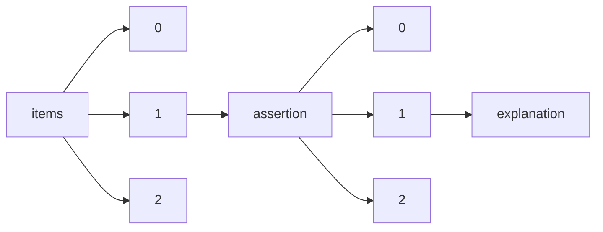

!!! warning "This document is not official Crossref documentation"
# Explanation
PATH = items/array/assertion/array/explanation(1)  
Occurs 805 034 times  
{ .annotate }

1. A route to an element, for example:  
   The route "items/array/assertion/array/explanation" corresponds to navigating through the JSON indices as  
   ["items"][0]["assertion"][0]["explanation"]  

## URL
See more information: [items/array/assertion/array/explanation/URL](URL/index.md)  
Occurs 805 034 timess  
Unique values: > 999  

!!! note "Due to current limitations, only the first 1,000 unique values are counted."

| **Row** | **Value** `String`                                          | **Count** `Int64` |
|--------:|---------------------------------------------------------------:|---------------------:|
| **1**   | https://www.crossref.org/services/similarity-check/            | 240 611              |
| **2**   | http://journals.iucr.org/services/copyrightpolicy.html         | 108 982              |
| **3**   | http://journals.iucr.org/e                                     | 43 814               |
| **4**   | http://www.crossref.org/crosscheck/index.html                  | 37 616               |
| **5**   | http://journals.iucr.org/e/issues/2011/01/00/me0439/index.html | 36 873               |
| **6**   | http://creativecommons.org/licenses/by/2.0/uk/legalcode        | 28 794               |
| **7**   | http://journals.iucr.org/a                                     | 24 366               |
| **8**   | http://creativecommons.org/licenses/by-nc/3.0/                 | 21 836               |
| **9**   | http://creativecommons.org/licenses/by-nc/4.0                  | 15 126               |
| **10**  | http://journals.iucr.org/a/issues/2011/01/00/me0432/index.html | 13 593               |
| ... | ... | ... |

