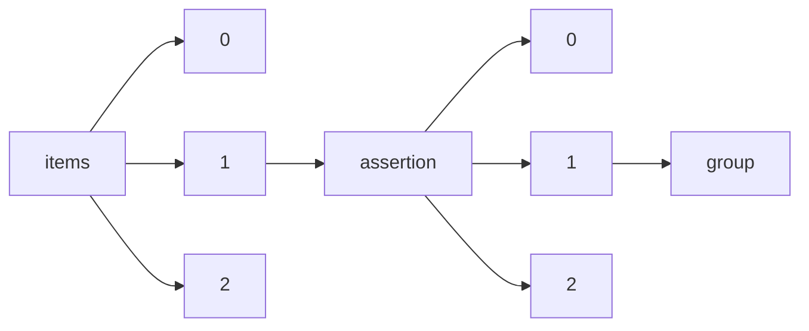

!!! warning "This document is not official Crossref documentation"
# Group
PATH = items/array/assertion/array/group(1)  
Occurs 30 296 330 times  
{ .annotate }

1. A route to an element, for example:  
   The route "items/array/assertion/array/group" corresponds to navigating through the JSON indices as  
   ["items"][0]["assertion"][0]["group"]  

## Label
See more information: [items/array/assertion/array/group/label](label/index.md)  
Occurs 30 280 260 timess  
Unique values: > 999  

!!! note "Due to current limitations, only the first 1,000 unique values are counted."

| **Row** | **Value** `String`                                           | **Count** `Int64` |
|--------:|----------------------------------------------------------------:|---------------------:|
| **1**   | Publication History                                             | 7 622 085            |
| **2**   | Article History                                                 | 7 382 375            |
| **3**   | Chapter History                                                 | 2 938 308            |
| **4**   | Conference Information                                          | 2 643 140            |
| **5**   | Publication dates                                               | 1 813 963            |
| **6**   | Peer Review Information (provided by the conference organizers) | 813 625              |
| **7**   | Competing interests                                             | 613 662              |
| **8**   | IDENTIFIERS                                                     | 513 989              |
| **9**   | Conflict of interest                                            | 495 149              |
| **10**  | Declarations                                                    | 451 436              |
| ... | ... | ... |

## Name
See more information: [items/array/assertion/array/group/name](name/index.md)  
Occurs 30 296 330 timess  
Unique values: 108  

| **Row** | **Value** `String`          | **Count** `Int64` |
|--------:|-------------------------------:|---------------------:|
| **1**   | publication\_history           | 8 185 799            |
| **2**   | ArticleHistory                 | 7 381 031            |
| **3**   | EthicsHeading                  | 3 488 113            |
| **4**   | ChapterHistory                 | 2 938 308            |
| **5**   | ConferenceInfo                 | 2 585 102            |
| **6**   | publication\_dates             | 1 813 963            |
| **7**   | ConfEventPeerReviewInformation | 885 963              |
| **8**   | author\_identifiers            | 513 989              |
| **9**   | peer\_review                   | 313 775              |
| **10**  | copyright\_and\_licensing      | 305 691              |
| ... | ... | ... |

