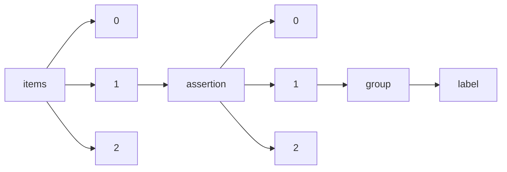

!!! warning "This document is not official Crossref documentation"
# Label
PATH = items/array/assertion/array/group/label(1)  
Occurs 30 280 260 times  
Unique values: > 999  
{ .annotate }

1. A route to an element, for example:  
   The route "items/array/assertion/array/group/label" corresponds to navigating through the JSON indices as  
   ["items"][0]["assertion"][0]["group"]["label"]  

!!! note "Due to current limitations, only the first 1,000 unique values are counted."

| **Row** | **Value** `String`                                                                                 | **Count** `Int64` |
|--------:|------------------------------------------------------------------------------------------------------:|---------------------:|
| **1**   | Publication History                                                                                   | 7 622 085            |
| **2**   | Article History                                                                                       | 7 382 375            |
| **3**   | Chapter History                                                                                       | 2 938 308            |
| **4**   | Conference Information                                                                                | 2 643 140            |
| **5**   | Publication dates                                                                                     | 1 813 963            |
| **6**   | Peer Review Information (provided by the conference organizers)                                       | 813 625              |
| **7**   | Competing interests                                                                                   | 613 662              |
| **8**   | IDENTIFIERS                                                                                           | 513 989              |
| **9**   | Conflict of interest                                                                                  | 495 149              |
| **10**  | Declarations                                                                                          | 451 436              |
| **11**  | Copyright and Licensing                                                                               | 417 033              |
| **12**  | Peer review                                                                                           | 292 351              |
| **13**  | Publication history                                                                                   | 285 369              |
| **14**  | Consent for publication                                                                               | 283 456              |
| **15**  | PUBLICATION HISTORY                                                                                   | 278 250              |
| **16**  | Compliance with ethical standards                                                                     | 249 249              |
| **17**  | Ethics approval and consent to participate                                                            | 246 918              |
| **18**  | SIMILARITY CHECK                                                                                      | 240 611              |
| **19**  | PEER REVIEW METHOD                                                                                    | 235 772              |
| **20**  | COPYRIGHT AND LICENSING                                                                               | 215 587              |
| **21**  | RELATED DATA                                                                                          | 204 307              |
| **22**  | Full text available at:                                                                               | 161 020              |
| **23**  | Copyright and licencing                                                                               | 144 755              |
| **24**  | Ethical approval                                                                                      | 111 309              |
| **25**  | General                                                                                               | 109 676              |
| **26**  | Compliance with Ethical Standards                                                                     | 101 818              |
| **27**  | Peer Review Information                                                                               | 99 358               |
| **28**  | Conflict of Interest                                                                                  | 94 147               |
| **29**  | Peer Review Details                                                                                   | 92 720               |
| **30**  | Informed consent                                                                                      | 65 248               |
| **31**  | Competing Interests                                                                                   | 63 106               |
| **32**  | Ethics approval                                                                                       | 54 580               |
| **33**  | Consent to participate                                                                                | 50 059               |
| **34**  | Interessenkonflikt                                                                                    | 48 480               |
| **35**  | Publisher’s Note                                                                                      | 48 405               |
| **36**  | Article Reports                                                                                       | 48 237               |
| **37**  | Plagiarism Screening                                                                                  | 46 359               |
| **38**  | CROSSCHECK                                                                                            | 37 617               |
| **39**  | Ethical Approval                                                                                      | 36 438               |
| **40**  | Conflicts of interest                                                                                 | 34 338               |
| **41**  | Informed Consent                                                                                      | 27 813               |
| **42**  | Peer Review                                                                                           | 24 431               |
| **43**  | Identifiers                                                                                           | 23 061               |
| **44**  | Rights                                                                                                | 22 540               |
| **45**  | CONFLICT OF INTEREST                                                                                  | 22 479               |
| **46**  | Einhaltung ethischer Richtlinien                                                                      | 21 621               |
| **47**  | Consent for Publication                                                                               | 17 429               |
| **48**  | Current Referee Status                                                                                | 17 023               |
| **49**  | Consent to Participate                                                                                | 16 429               |
| **50**  | ASSOCIATED ARTICLES                                                                                   | 15 992               |
| **51**  | Ethics Approval                                                                                       | 15 984               |
| **52**  | Funding                                                                                               | 15 711               |
| **53**  | COMPLIANCE WITH ETHICAL STANDARDS                                                                     | 15 259               |
| **54**  | Human and Animal Rights and Informed Consent                                                          | 14 196               |
| **55**  | Others                                                                                                | 13 282               |
| **56**  | ORCID                                                                                                 | 12 059               |
| **57**  | Import History                                                                                        | 10 968               |
| **58**  | Disclosures                                                                                           | 9 472                |
| **59**  | Code availability                                                                                     | 9 246                |
| **60**  | Consent to publish                                                                                    | 8 579                |
| **61**  | Conflict of interests                                                                                 | 8 013                |
| **62**  | Declaration                                                                                           | 7 161                |
| **63**  | Ethics                                                                                                | 6 979                |
| **64**  | Disclosure                                                                                            | 6 096                |
| **65**  | Conflicts of Interest                                                                                 | 6 012                |
| **66**  | Ethical standards                                                                                     | 5 822                |
| **67**  | Competing interest                                                                                    | 5 231                |
| **68**  | Ethical approval and consent to participate                                                           | 5 218                |
| **69**  | Human and animal rights                                                                               | 5 141                |
| **70**  | Disclaimer                                                                                            | 4 936                |
| **71**  | Ethical statement                                                                                     | 4 805                |
| **72**  | Research involving human participants and/or animals                                                  | 4 799                |
| **73**  | Availability of data and material                                                                     | 4 669                |
| **74**  | Guarantor                                                                                             | 4 299                |
| **75**  | Methodology                                                                                           | 4 224                |
| **76**  | Ethics Approval and Consent to Participate                                                            | 4 200                |
| **77**  | Statistics and biometry                                                                               | 4 113                |
| **78**  | Data availability                                                                                     | 3 739                |
| **79**  | Copyright and licensing                                                                               | 2 824                |
| **80**  | Human and Animal Rights                                                                               | 2 665                |
| **81**  | Der Verlag                                                                                            | 2 567                |
| **82**  | Authors’ information                                                                                  | 2 536                |
| **83**  | Code Availability                                                                                     | 2 476                |
| **84**  | Ethics statement                                                                                      | 2 377                |
| **85**  | Author contributions                                                                                  | 2 376                |
| **86**  | Consent to Publish                                                                                    | 2 241                |
| **87**  | <!--Emphasis Type='Bold' removed-->Conflict of Interests                                              | 2 195                |
| **88**  | <!--Emphasis Type='Bold' removed-->Conflict of interest                                               | 2 090                |
| **89**  | Consent to publication                                                                                | 1 971                |
| **90**  | Conflict of Interests                                                                                 | 1 945                |
| **91**  | Compliance with ethical guidelines                                                                    | 1 869                |
| **92**  | Article                                                                                               | 1 860                |
| **93**  | Conflicts of interest/Competing interests                                                             | 1 782                |
| **94**  | CONFLICT OF INTERESTS                                                                                 | 1 736                |
| **95**  | Statement of human and animal rights                                                                  | 1 601                |
| **96**  | Conflicts of Interest/Competing Interests                                                             | 1 586                |
| **97**  | Copyright & Licensing                                                                                 | 1 502                |
| **98**  | Research Involving Human Participants and/or Animals                                                  | 1 466                |
| **99**  | Availability of data and materials                                                                    | 1 422                |
| **100** | Ethical Statement                                                                                     | 1 415                |
| **101** | Wissenschaftliche Leitung                                                                             | 1 298                |
| **102** | <!--Emphasis Type='Bold' removed-->Conflict of interests                                              | 1 292                |
| **103** | Autoren                                                                                               | 1 289                |
| **104** | Compliance with ethical standard                                                                      | 1 212                |
| **105** | Copyright                                                                                             | 1 065                |
| **106** | Ethical standard                                                                                      | 1 062                |
| **107** | Conflicts of interest/competing interests                                                             | 1 057                |
| **108** | Disclosure of Potential Conflicts of Interest                                                         | 1 048                |
| **109** | Consent                                                                                               | 987                  |
| **110** | Peer-review                                                                                           | 983                  |
| **111** | Availability of Data and Material                                                                     | 965                  |
| **112** | Research involving human participants                                                                 | 964                  |
| **113** | ADDITIONAL INFORMATION                                                                                | 931                  |
| **114** | <!--Emphasis Type='Bold' removed-->Competing interests                                                | 915                  |
| **115** | Competing Interest                                                                                    | 883                  |
| **116** | Study subjects or cohorts overlap                                                                     | 870                  |
| **117** | Data Availability                                                                                     | 863                  |
| **118** | Funding information                                                                                   | 827                  |
| **119** | Conflict of Interest Statement                                                                        | 819                  |
| **120** | Compliance with ethics requirements                                                                   | 818                  |
| **121** | Patient consent                                                                                       | 812                  |
| **122** | Replication of results                                                                                | 775                  |
| **123** | Conflicts of interests                                                                                | 735                  |
| **124** | Human and animal rights statement                                                                     | 734                  |
| **125** | Human and animal rights and informed consent                                                          | 716                  |
| **126** | Additional Information                                                                                | 715                  |
| **127** | Ethics declarations                                                                                   | 715                  |
| **128** | Article Comments                                                                                      | 711                  |
| **129** | Authors’ contributions                                                                                | 705                  |
| **130** | Ethical Standards                                                                                     | 660                  |
| **131** | Conflict of interest statement                                                                        | 651                  |
| **132** | <!--Emphasis Type='Bold' removed-->Conflict of Interest                                               | 649                  |
| **133** | Conflitto di interesse                                                                                | 648                  |
| **134** | Ethics Statement                                                                                      | 642                  |
| **135** | Content Type                                                                                          | 633                  |
| **136** | Research involving human and animal participants                                                      | 626                  |
| **137** | CrossRef                                                                                              | 613                  |
| **138** | Duality of interest                                                                                   | 609                  |
| **139** | Consenso informato                                                                                    | 604                  |
| **140** | Ethics declaration                                                                                    | 589                  |
| **141** | Compliance with ethics guidelines                                                                     | 579                  |
| **142** | Author Contributions                                                                                  | 570                  |
| **143** | Research involving human and animal rights                                                            | 558                  |
| **144** | Ethical Approval and Consent to Participate                                                           | 557                  |
| **145** | Data availability statement                                                                           | 555                  |
| **146** | Studi sugli animali                                                                                   | 550                  |
| **147** | Ethical statements                                                                                    | 541                  |
| **148** | Compliance With Ethical Standards                                                                     | 530                  |
| **149** | Competing interests {28}                                                                              | 511                  |
| **150** | Ethical standard statement                                                                            | 501                  |
| **151** | Consent for publication {32}                                                                          | 500                  |
| **152** | Ethics approval and consent to participate {24}                                                       | 498                  |
| **153** | Compliance with Ethics Guidelines                                                                     | 491                  |
| **154** | Human rights                                                                                          | 488                  |
| **155** | Research Involving Human Participants                                                                 | 485                  |
| **156** | Sampling and field studies                                                                            | 467                  |
| **157** | Informed Consent Statement                                                                            | 464                  |
| **158** | Statement of human rights                                                                             | 452                  |
| **159** | Consent of publication                                                                                | 439                  |
| **160** | Consent for publications                                                                              | 435                  |
| **161** | Ethical approval and informed consent                                                                 | 426                  |
| **162** | Similar articles                                                                                      | 417                  |
| **163** | Research Involving Human and Animal Participants                                                      | 415                  |
| **164** | Ethical Statements                                                                                    | 414                  |
| **165** | Copyright, Fair Use, and Licensing                                                                    | 390                  |
| **166** | Animal and Human Rights Statement                                                                     | 387                  |
| **167** | Statement on the welfare of animals                                                                   | 383                  |
| **168** | Disclosure of potential conflicts of interest                                                         | 381                  |
| **169** | Disclosure statement                                                                                  | 367                  |
| **170** | <!--Emphasis Type='Bold' removed-->Consent for publication                                            | 358                  |
| **171** | Conflict of interest:                                                                                 | 358                  |
| **172** | Consent to Publication                                                                                | 335                  |
| **173** | Research involving Human Participants and/or Animals                                                  | 335                  |
| **174** | Compliance with Ethical Standard                                                                      | 333                  |
| **175** | Ethical Approval Statement                                                                            | 329                  |
| **176** | Statement of Informed Consent                                                                         | 328                  |
| **177** | Research Involving Human and Animal Rights                                                            | 325                  |
| **178** | <!--Emphasis Type='Bold' removed-->Consent for Publication                                            | 323                  |
| **179** | License                                                                                               | 323                  |
| **180** | <!--Emphasis Type='Bold' removed-->Ethics approval and consent to participate                         | 321                  |
| **181** | Competing of interests                                                                                | 317                  |
| **182** | Human and animal rights and Informed consent                                                          | 315                  |
| **183** | <!--Emphasis Type='Italic' removed-->Conflict of Interests                                            | 310                  |
| **184** | Human and animals rights                                                                              | 307                  |
| **185** | Animal Rights                                                                                         | 307                  |
| **186** | Conflict interest                                                                                     | 304                  |
| **187** | Statement of informed consent                                                                         | 299                  |
| **188** | Statements and Declarations                                                                           | 295                  |
| **189** | Note                                                                                                  | 294                  |
| **190** | Human or animal rights                                                                                | 289                  |
| **191** | Human/animal rights                                                                                   | 281                  |
| **192** | Consent to participate and publish                                                                    | 272                  |
| **193** | Ethical considerations                                                                                | 270                  |
| **194** | Data Availability Statement                                                                           | 267                  |
| **195** | Authors’ Contributions                                                                                | 266                  |
| **196** | Ethische Standards                                                                                    | 263                  |
| **197** | Statement of animal rights                                                                            | 262                  |
| **198** | Consent to participate and for publication                                                            | 257                  |
| **199** | Declaration of competing interest                                                                     | 257                  |
| **200** | Consent statement                                                                                     | 257                  |
| **201** | Ethical Standard                                                                                      | 255                  |
| **202** | Copyright Information                                                                                 | 253                  |
| **203** | Statements and declarations                                                                           | 252                  |
| **204** | Statement of Human and Animal Rights                                                                  | 248                  |
| **205** | Author’s information                                                                                  | 248                  |
| **206** | Informed consent statement                                                                            | 247                  |
| **207** | CONFLICTS OF INTEREST                                                                                 | 245                  |
| **208** | Statement of ethics                                                                                   | 244                  |
| **209** | FUNDING                                                                                               | 241                  |
| **210** | Publication Notes                                                                                     | 237                  |
| **211** | DECLARATIONS                                                                                          | 237                  |
| **212** | Author contribution                                                                                   | 235                  |
| **213** | Code availability (software application or custom code)                                               | 233                  |
| **214** | Ethical approval/informed consent                                                                     | 230                  |
| **215** | Human or Animal Rights                                                                                | 230                  |
| **216** | Research Involving Humans and Animals Statement                                                       | 228                  |
| **217** | Source of Funding                                                                                     | 226                  |
| **218** | Ethics approval, Consent to participate, Consent to publish, Availability of data and material, Code  | 225                  |
| **219** | Disclosure Statement                                                                                  | 224                  |
| **220** | Ethical Considerations                                                                                | 223                  |
| **221** | Consent for publication.                                                                              | 222                  |
| **222** | Human and animal ethics                                                                               | 222                  |
| **223** | Human and animal participants                                                                         | 222                  |
| **224** | Conflict of interest/Competing interests                                                              | 222                  |
| **225** | Compliance with Ethical Guidelines                                                                    | 216                  |
| **226** | Research involving human and/or animal participants                                                   | 215                  |
| **227** | Institutional review board statement                                                                  | 214                  |
| **228** | Patient consent for publication                                                                       | 214                  |
| **229** | Publisher’s note                                                                                      | 212                  |
| **230** | Ethical Approval and Informed Consent                                                                 | 211                  |
| **231** | Required Author Forms                                                                                 | 211                  |
| **232** | Financial disclosure                                                                                  | 210                  |
| **233** | Compliance with ethical statements                                                                    | 209                  |
| **234** | Ethical Approval/Informed Consent                                                                     | 203                  |
| **235** | Financial support                                                                                     | 199                  |
| **236** | Availability of Data and Materials                                                                    | 198                  |
| **237** | Consent to participate and consent for publication                                                    | 197                  |
| **238** | Human/Animal Rights                                                                                   | 197                  |
| **239** | Multiple Resolution                                                                                   | 194                  |
| **240** | Complaince with ethical standards                                                                     | 191                  |
| **241** | Human rights statement                                                                                | 189                  |
| **242** | Consent for publication (include appropriate statements)                                              | 186                  |
| **243** | Experiment Participants                                                                               | 185                  |
| **244** | Ethics approval and informed consent                                                                  | 184                  |
| **245** | Human participants and/or animals                                                                     | 182                  |
| **246** | Consent to participate (include appropriate statements)                                               | 180                  |
| **247** | Authors' contributions                                                                                | 178                  |
| **248** | Ethic approval and consent to participate                                                             | 178                  |
| **249** | Authorship and Conflict of interest                                                                   | 173                  |
| **250** | Ethical approval and ethical standards                                                                | 173                  |
| **251** | <!--Emphasis Type='Bold' removed-->Ethical approval                                                   | 169                  |
| **252** | Compliance with Ethical standards                                                                     | 169                  |
| **253** | Ethics approval (include appropriate approvals or waivers)                                            | 168                  |
| **254** | Additional declarations for articles in life science journals that report the results of studies inv  | 167                  |
| **255** | Availability of data                                                                                  | 167                  |
| **256** | Data sharing                                                                                          | 165                  |
| **257** | IRB approval                                                                                          | 163                  |
| **258** | Ethics approval and consent to participate.                                                           | 161                  |
| **259** | Animal and human rights statement                                                                     | 160                  |
| **260** | Disclaimers                                                                                           | 160                  |
| **261** | Conflicts of Interests                                                                                | 160                  |
| **262** | Animal research                                                                                       | 158                  |
| **263** | Consent Statement                                                                                     | 157                  |
| **264** | Research involving animals                                                                            | 157                  |
| **265** | Declaration of Competing Interest                                                                     | 155                  |
| **266** | Competing of interest                                                                                 | 154                  |
| **267** | Ethic approval                                                                                        | 152                  |
| **268** | Ethics committee approval                                                                             | 152                  |
| **269** | Financial interests                                                                                   | 150                  |
| **270** | DISCLOSURE                                                                                            | 150                  |
| **271** | Conflict of Interest/Competing Interests                                                              | 149                  |
| **272** | Ethics and consent to participate                                                                     | 147                  |
| **273** | Article Info                                                                                          | 145                  |
| **274** | Volume Supplementary Material                                                                         | 144                  |
| **275** | <!--Emphasis Type='Bold' removed-->Compliance with ethical standards                                  | 143                  |
| **276** | Authors Contributions                                                                                 | 142                  |
| **277** | Ethics approval and consent to participate:                                                           | 142                  |
| **278** | Declaration of Interest                                                                               | 142                  |
| **279** | <!--Emphasis Type='Italic' removed-->Conflict of Interest                                             | 141                  |
| **280** | Statements on human and animal rights                                                                 | 140                  |
| **281** | Ethical approval and Informed consent                                                                 | 138                  |
| **282** | COMPETING INTERESTS                                                                                   | 137                  |
| **283** | Ethical Standard Statement                                                                            | 136                  |
| **284** | Authorship and conflict of interest                                                                   | 136                  |
| **285** | Declaration of Conflicting Interests                                                                  | 136                  |
| **286** | Compliance of ethical standards                                                                       | 135                  |
| **287** | Availability of data and material (data transparency)                                                 | 134                  |
| **288** | Peer Reviewed                                                                                         | 134                  |
| **289** | Consent for participate                                                                               | 134                  |
| **290** | Dichiarazioni etiche                                                                                  | 129                  |
| **291** | Animal studies                                                                                        | 128                  |
| **292** | Cell line authentication                                                                              | 126                  |
| **293** | Statistics and Biometry                                                                               | 124                  |
| **294** | Authorship                                                                                            | 123                  |
| **295** | Conflict of interest/competing interests                                                              | 122                  |
| **296** | Human and animal studies                                                                              | 121                  |
| **297** | Confict of interest                                                                                   | 121                  |
| **298** | Authors Name                                                                                          | 121                  |
| **299** | Conflict of Interest:                                                                                 | 120                  |
| **300** | Ethics approval and Consent to participate                                                            | 120                  |
| **301** | Data archiving statement                                                                              | 120                  |
| **302** | Consent for publish                                                                                   | 117                  |
| **303** | Human participants                                                                                    | 117                  |
| **304** | Human and Animals Rights                                                                              | 117                  |
| **305** | Ethics approval and consent                                                                           | 116                  |
| **306** | Consent to participate and publication                                                                | 116                  |
| **307** | Ethics approval and consent to participants                                                           | 114                  |
| **308** | Research involving human participants or animals                                                      | 113                  |
| **309** | Consent for participation                                                                             | 113                  |
| **310** | Financial Disclosure                                                                                  | 113                  |
| **311** | Data sharing statement                                                                                | 111                  |
| **312** | Acknowledgements                                                                                      | 111                  |
| **313** | Statement of Human Rights                                                                             | 110                  |
| **314** | Ethics approval and consent to participant                                                            | 105                  |
| **315** | Ethical approval and consent to participate.                                                          | 105                  |
| **316** | Authors’ Information                                                                                  | 104                  |
| **317** | Ethics approval consent to participate                                                                | 104                  |
| **318** | Funding statement                                                                                     | 103                  |
| **319** | Ethics approval and consent to participate                                                            | 103                  |
| **320** | Declarations of interest                                                                              | 103                  |
| **321** | Patient Consent                                                                                       | 103                  |
| **322** | Consenso informato e conformità agli standard etici                                                   | 102                  |
| **323** | Ethical consideration                                                                                 | 102                  |
| **324** | Human and Animal Rights Statement                                                                     | 100                  |
| **325** | Ethics approval and consent participate                                                               | 99                   |
| **326** | Ethics approval and consent to participate {24}                                                       | 98                   |
| **327** | Compliance with Ethics Standards                                                                      | 98                   |
| **328** | Conflict of ınterest                                                                                  | 98                   |
| **329** | Human rights statement and informed consent                                                           | 96                   |
| **330** | Animal rights                                                                                         | 95                   |
| **331** | Ethical clearance                                                                                     | 95                   |
| **332** | Open Access                                                                                           | 95                   |
| **333** | Animal source                                                                                         | 94                   |
| **334** | Consent for publication {32}                                                                          | 94                   |
| **335** | Declaration of interest                                                                               | 93                   |
| **336** | Competing interests {28}                                                                              | 93                   |
| **337** | Compliance with ethical Standards                                                                     | 92                   |
| **338** | Human and Animal Participants                                                                         | 92                   |
| **339** | <!--Emphasis Type='Bold' removed-->Consent to participate                                             | 91                   |
| **340** | INFORMED CONSENT                                                                                      | 91                   |
| **341** | Consent for publication:                                                                              | 91                   |
| **342** | Data accessibility                                                                                    | 90                   |
| **343** | Consent to participate and consent to publish                                                         | 90                   |
| **344** | Clinical trial registration                                                                           | 89                   |
| **345** | Institutional Review Board Statement                                                                  | 88                   |
| **346** | Financial Support                                                                                     | 88                   |
| **347** | Plant reproducibility                                                                                 | 88                   |
| **348** | <!--Emphasis Type='Bold' removed-->Ethics approval                                                    | 87                   |
| **349** | Competing interests:                                                                                  | 86                   |
| **350** | Ethics approval, Consent to participate, Consent for publication, Availability of data and material,  | 86                   |
| **351** | Consent to participate/publish                                                                        | 86                   |
| **352** | Ethical Approval and Consent to participate                                                           | 86                   |
| **353** | Animal Studies                                                                                        | 85                   |
| **354** | Ethical approval:                                                                                     | 85                   |
| **355** | Funding Information                                                                                   | 84                   |
| **356** | Contribution statement                                                                                | 83                   |
| **357** | Statement of Ethics                                                                                   | 82                   |
| **358** | Interessenkonflikte                                                                                   | 81                   |
| **359** | Competing financial interests                                                                         | 81                   |
| **360** | Compilance with ethical standards                                                                     | 81                   |
| **361** | Compliances with ethical standards                                                                    | 80                   |
| **362** | <!--Emphasis Type='Bold' removed-->Ethical Approval                                                   | 80                   |
| **363** | Keywords                                                                                              | 80                   |
| **364** | Correction details                                                                                    | 80                   |
| **365** | <!--Emphasis Type='Bold' removed-->Competing Interests                                                | 79                   |
| **366** | Human Rights                                                                                          | 79                   |
| **367** | Open access                                                                                           | 79                   |
| **368** | Ethics approval and consent to participation                                                          | 78                   |
| **369** | Review Policy                                                                                         | 77                   |
| **370** | Consent to participate:                                                                               | 77                   |
| **371** | Financial disclosures                                                                                 | 77                   |
| **372** | Funding Statement                                                                                     | 76                   |
| **373** | Ethics approval and consent for participate                                                           | 76                   |
| **374** | Compliance of Ethical Standards                                                                       | 76                   |
| **375** | conflict of interest                                                                                  | 76                   |
| **376** | Ethics Declarations                                                                                   | 74                   |
| **377** | Declaration of interests                                                                              | 74                   |
| **378** | Compliance and ethical standards                                                                      | 73                   |
| **379** | Ethical Treatment of Experimental Subjects (Animal and Human)                                         | 73                   |
| **380** | Informed consent to participate                                                                       | 73                   |
| **381** | Clinical trials registration                                                                          | 73                   |
| **382** | Human participants or animals                                                                         | 72                   |
| **383** | Research involving human participants and animals                                                     | 72                   |
| **384** | Ethical Standards and Informed Consent                                                                | 72                   |
| **385** | Conflicts of interests/Competing interests                                                            | 72                   |
| **386** | Source of biological material                                                                         | 72                   |
| **387** | Consent of Publication                                                                                | 72                   |
| **388** | Conflict interests                                                                                    | 72                   |
| **389** | Human Participants and/or Animals                                                                     | 71                   |
| **390** | DISCLOSURES                                                                                           | 71                   |
| **391** | Patient consent statement                                                                             | 71                   |
| **392** | Ethical committee approval                                                                            | 71                   |
| **393** | Statement on the Welfare of Animals                                                                   | 71                   |
| **394** | Ethics and Consent                                                                                    | 71                   |
| **395** | Disclosure of Interest                                                                                | 70                   |
| **396** | Ethical Clearance                                                                                     | 70                   |
| **397** | Offenlegung von Interessenkonflikt                                                                    | 70                   |
| **398** | Consent to participate/consent for publication                                                        | 69                   |
| **399** | publication history                                                                                   | 69                   |
| **400** | DECLARATION OF CONFLICTING INTERESTS                                                                  | 69                   |
| **401** | Conflit d’intérêts                                                                                    | 68                   |
| **402** | ACKNOWLEDGMENTS                                                                                       | 67                   |
| **403** | Conflitti di interesse                                                                                | 66                   |
| **404** | Financial Interests                                                                                   | 66                   |
| **405** | Consent to participate.                                                                               | 66                   |
| **406** | Declartions                                                                                           | 65                   |
| **407** | Consent to Participate and Publish                                                                    | 65                   |
| **408** | <!--Emphasis Type='Bold' removed-->Informed Consent                                                   | 65                   |
| **409** | Open practices statement                                                                              | 65                   |
| **410** | Data Sharing                                                                                          | 64                   |
| **411** | Human rights statements and informed consent                                                          | 64                   |
| **412** | Funding sources                                                                                       | 64                   |
| **413** | Human and Animal Ethics                                                                               | 64                   |
| **414** | Human rights statements                                                                               | 63                   |
| **415** | Research Involving Animals                                                                            | 62                   |
| **416** | Author information                                                                                    | 61                   |
| **417** | Notes                                                                                                 | 61                   |
| **418** | Code Availability (Software Application or Custom Code)                                               | 61                   |
| **419** | Conflicting Interests                                                                                 | 60                   |
| **420** | Archiving and Preservation                                                                            | 60                   |
| **421** | Research Involving Human Participants or Animals                                                      | 59                   |
| **422** | Data transparency                                                                                     | 59                   |
| **423** | Ethical review committee statement                                                                    | 58                   |
| **424** | Ethics Committee Approval                                                                             | 58                   |
| **425** | Conflicts of interest/Competing interest                                                              | 58                   |
| **426** | Author Contribution                                                                                   | 58                   |
| **427** | Consent for Publication (Include Appropriate Statements)                                              | 58                   |
| **428** | Ethics approval and consent for publication                                                           | 58                   |
| **429** | Declaration of conflicting interests                                                                  | 57                   |
| **430** | Editorial responsibility                                                                              | 57                   |
| **431** | Ethics approval:                                                                                      | 57                   |
| **432** | Ethics approval statement                                                                             | 57                   |
| **433** | Volume ISBN                                                                                           | 57                   |
| **434** | Disclosure of potential conflict of interest                                                          | 56                   |
| **435** | Expedition Reports Supplementary Material                                                             | 56                   |
| **436** | Consent to Participate (Include Appropriate Statements)                                               | 55                   |
| **437** | Compliance and Ethical Standards                                                                      | 55                   |
| **438** | Authors’ relationships and activities                                                                 | 54                   |
| **439** | Consent to participation                                                                              | 54                   |
| **440** | competing interests                                                                                   | 53                   |
| **441** | Availability of supporting data                                                                       | 53                   |
| **442** | Compliance with ethical standards:                                                                    | 53                   |
| **443** | Human Subjects/Informed Consent Statement                                                             | 52                   |
| **444** | Ethics Approval (Include Appropriate Approvals or Waivers)                                            | 52                   |
| **445** | Consent for Participate                                                                               | 51                   |
| **446** | Permission to reproduce material from other sources                                                   | 51                   |
| **447** | Research involving animal rights                                                                      | 51                   |
| **448** | Consent to participate/publication                                                                    | 51                   |
| **449** | Informed consent and ethical approval                                                                 | 51                   |
| **450** | Conflicting interests                                                                                 | 51                   |
| **451** | Data and code availability                                                                            | 50                   |
| **452** | Ethics approval and consent for participation                                                         | 50                   |
| **453** | Open Practices Statement                                                                              | 50                   |
| **454** | Ethical Approval:                                                                                     | 50                   |
| **455** | Completing interests                                                                                  | 50                   |
| **456** | Consent of participate                                                                                | 50                   |
| **457** | Ethical approval.                                                                                     | 50                   |
| **458** | Consent to Participate and for Publication                                                            | 50                   |
| **459** | Conflict of Interest.                                                                                 | 50                   |
| **460** | Research involving Human Participants                                                                 | 49                   |
| **461** | Author’s contributions                                                                                | 49                   |
| **462** | Provenance and peer review                                                                            | 49                   |
| **463** | Funding source                                                                                        | 49                   |
| **464** | <!--Emphasis Type='Bold' removed-->Informed consent                                                   | 48                   |
| **465** | Sources of Funding                                                                                    | 48                   |
| **466** | Conflict of interest.                                                                                 | 48                   |
| **467** | Consent to participate/for publication                                                                | 48                   |
| **468** | Conflict of interest disclosure                                                                       | 47                   |
| **469** | Ethical Consideration                                                                                 | 47                   |
| **470** | Animal ethics                                                                                         | 47                   |
| **471** | Human and Animal Studies                                                                              | 47                   |
| **472** | Human/animal rights statement                                                                         | 47                   |
| **473** | Research Involving Animal Rights                                                                      | 47                   |
| **474** | <!--Emphasis Type='Bold' removed-->Declarations                                                       | 47                   |
| **475** | Compliance with ethical statement                                                                     | 47                   |
| **476** | IRB statement                                                                                         | 47                   |
| **477** | peer review                                                                                           | 46                   |
| **478** | Consent to participants                                                                               | 46                   |
| **479** | Disclosure of Interests                                                                               | 46                   |
| **480** | Ethical approval and consent                                                                          | 46                   |
| **481** | Declaration of Interests                                                                              | 46                   |
| **482** | Ethical approval and Consent to participate                                                           | 46                   |
| **483** | Ethics approvals and consent to participate                                                           | 46                   |
| **484** | Ethical approval/Informed consent                                                                     | 46                   |
| **485** | Patient and public involvement                                                                        | 46                   |
| **486** | Data                                                                                                  | 45                   |
| **487** | Prior Presentations                                                                                   | 45                   |
| **488** | Human and animal rights and Informed Consent                                                          | 45                   |
| **489** | Conflicts of interests/competing interests                                                            | 45                   |
| **490** | Statement of consent                                                                                  | 45                   |
| **491** | Ethical approvals                                                                                     | 45                   |
| **492** | Ethics clearance                                                                                      | 45                   |
| **493** | Ethics Approval and Informed Consent                                                                  | 45                   |
| **494** | Conflict Interest                                                                                     | 44                   |
| **495** | Disclosure of Potential Conflict of Interest                                                          | 44                   |
| **496** | Conflitto di interessi                                                                                | 44                   |
| **497** | Compliance with ethical requirements                                                                  | 44                   |
| **498** | Research Involving Human and/or Animal Participants                                                   | 44                   |
| **499** | Conflict of Interest Declaration                                                                      | 44                   |
| **500** | Conflicts of interest/Competing interests:                                                            | 44                   |
| **501** | Ethical standards statement                                                                           | 43                   |
| **502** | Research involving human and/or animal rights                                                         | 43                   |
| **503** | Complaince with Ethical Standards                                                                     | 42                   |
| **504** | Source of support                                                                                     | 42                   |
| **505** | Ethics statements                                                                                     | 42                   |
| **506** | Compliance with the ethical standards                                                                 | 42                   |
| **507** | Funding Sources                                                                                       | 42                   |
| **508** | Informed consents                                                                                     | 41                   |
| **509** | Institutional review board                                                                            | 41                   |
| **510** | Grant support                                                                                         | 41                   |
| **511** | Consent to participant                                                                                | 41                   |
| **512** | Conflicts of Interest/Competing interests                                                             | 41                   |
| **513** | Authors contributions                                                                                 | 40                   |
| **514** | Human Participants                                                                                    | 40                   |
| **515** | Statement                                                                                             | 40                   |
| **516** | Authors’ contribution                                                                                 | 40                   |
| **517** | Transparency                                                                                          | 40                   |
| **518** | Declarations of Interest                                                                              | 40                   |
| **519** | IRB                                                                                                   | 40                   |
| **520** | Permissions                                                                                           | 40                   |
| **521** | Grant Support                                                                                         | 39                   |
| **522** | Conflicts of interest/competing interest                                                              | 39                   |
| **523** | <!--Emphasis Type='Bold' removed-->Conflicts of interest/Competing interests                          | 39                   |
| **524** | Declarartions                                                                                         | 39                   |
| **525** | IRB Approval                                                                                          | 39                   |
| **526** | Informed consent for publication                                                                      | 39                   |
| **527** | Human and Animal Rights Informed Consent                                                              | 39                   |
| **528** | Ethical issues                                                                                        | 39                   |
| **529** | Conflicts of Interests/Competing Interests                                                            | 39                   |
| **530** | Financial Disclosures                                                                                 | 39                   |
| **531** | Ethics standards                                                                                      | 38                   |
| **532** | Research involved in human and animal rights                                                          | 38                   |
| **533** | Compliance with Ethical Statement                                                                     | 38                   |
| **534** | Compliance with Ethics requirements                                                                   | 38                   |
| **535** | Replication of Results                                                                                | 37                   |
| **536** | Decalarations                                                                                         | 37                   |
| **537** | Inform consent                                                                                        | 37                   |
| **538** | Human and animals participants                                                                        | 37                   |
| **539** | Ethical approval statement                                                                            | 37                   |
| **540** | Compliance with Ethical Standards:                                                                    | 37                   |
| **541** | Statement on animal welfare                                                                           | 37                   |
| **542** | Ethics Declaration                                                                                    | 36                   |
| **543** | Compliance with ethical norms                                                                         | 36                   |
| **544** | Author contribution statement                                                                         | 36                   |
| **545** | Compliance with Ethical Statements                                                                    | 36                   |
| **546** | Conflicts of interest/Competing Interests                                                             | 36                   |
| **547** | Compliance and ethics                                                                                 | 36                   |
| **548** | Declarations:                                                                                         | 35                   |
| **549** | Ethical publication statement                                                                         | 35                   |
| **550** | Endnotes                                                                                              | 35                   |
| **551** | Conflict Of Interest                                                                                  | 35                   |
| **552** | <!--Emphasis Type='Bold' removed-->Compliance with Ethical Standards                                  | 35                   |
| **553** | Employment                                                                                            | 35                   |
| **554** | AUTHOR CONTRIBUTIONS                                                                                  | 35                   |
| **555** | Ethics and consent                                                                                    | 34                   |
| **556** | Trial registration                                                                                    | 34                   |
| **557** | Ethics and approval and consent to participate                                                        | 34                   |
| **558** | Human or animal participants                                                                          | 34                   |
| **559** | Consent for Publications                                                                              | 34                   |
| **560** | Competing interests.                                                                                  | 33                   |
| **561** | Consent to Participate and Consent for Publication                                                    | 33                   |
| **562** | Compliance ethical standards                                                                          | 33                   |
| **563** | Research involving human participants and/or animal                                                   | 33                   |
| **564** | Ethics approval and consent of participate                                                            | 33                   |
| **565** | Contributions                                                                                         | 32                   |
| **566** | Additional information                                                                                | 32                   |
| **567** | Ethics approval.                                                                                      | 32                   |
| **568** | Interessenkonflikt:                                                                                   | 32                   |
| **569** | Compliance with ethics standards                                                                      | 32                   |
| **570** | Conflicts of interest:                                                                                | 31                   |
| **571** | IRB approval status                                                                                   | 31                   |
| **572** | Ethics Approval and Consent                                                                           | 31                   |
| **573** | Consent to publish (ethics)                                                                           | 30                   |
| **574** | Funding:                                                                                              | 30                   |
| **575** | Financial interest                                                                                    | 30                   |
| **576** | Disclosure of interest                                                                                | 30                   |
| **577** | Transparency declaration                                                                              | 30                   |
| **578** | Ethics approvals                                                                                      | 30                   |
| **579** | Data statement                                                                                        | 30                   |
| **580** | Consent to participate/Consent for publication                                                        | 30                   |
| **581** | Human Subjects                                                                                        | 29                   |
| **582** | Inform Consent                                                                                        | 29                   |
| **583** | Consent to participate (ethics)                                                                       | 29                   |
| **584** | Ethical Treatment of Experimental Subjects (Animals and Humans)                                       | 29                   |
| **585** | Acknowledgments                                                                                       | 29                   |
| **586** | Competing interests                                                                                   | 29                   |
| **587** | CONFLICTS OF INTERESTS                                                                                | 29                   |
| **588** | Authors information                                                                                   | 29                   |
| **589** | Human and animal rights disclosure                                                                    | 29                   |
| **590** | Definition                                                                                            | 29                   |
| **591** | Data Transparency                                                                                     | 28                   |
| **592** | Compliance with Ethics Requirements                                                                   | 28                   |
| **593** | Statement of Human and Animal Rights, or Ethical Approval                                             | 28                   |
| **594** | Consent to Participate and Publication                                                                | 28                   |
| **595** | Animal rights statement                                                                               | 28                   |
| **596** | Statement on human and animal rights                                                                  | 27                   |
| **597** | Research involving human or animal participants                                                       | 27                   |
| **598** | Ethical responsibilities of authors                                                                   | 27                   |
| **599** | F1000Prime article recommendations                                                                    | 27                   |
| **600** | Consent for publication (from patients/participants)                                                  | 27                   |
| **601** | <!--Emphasis Type='Bold' removed-->Note:                                                              | 26                   |
| **602** | Clinical Trial Registration                                                                           | 26                   |
| **603** | Statements & Declarations                                                                             | 26                   |
| **604** | Research involving human rights                                                                       | 26                   |
| **605** | Financial disclaimer                                                                                  | 26                   |
| **606** | Availability of Data                                                                                  | 26                   |
| **607** | Authors' information                                                                                  | 26                   |
| **608** | Conflicts of interest/Competing interests (include appropriate disclosures)                           | 26                   |
| **609** | Compliance with Ethical Requirements                                                                  | 25                   |
| **610** | Ethical Approval and Consent                                                                          | 25                   |
| **611** | Compliance with ethical standrads                                                                     | 25                   |
| **612** | Animal research (ethics)                                                                              | 25                   |
| **613** | Conflict of interest/Competing interest                                                               | 25                   |
| **614** | Ethical compliance                                                                                    | 25                   |
| **615** | Compliance with ethics requirement                                                                    | 25                   |
| **616** | Conflict of interst                                                                                   | 25                   |
| **617** | Ethical approval and consent to participate                                                           | 25                   |
| **618** | Competing of Interest                                                                                 | 25                   |
| **619** | Non-financial interests                                                                               | 25                   |
| **620** | Publisher's Note                                                                                      | 25                   |
| **621** | Declaration of interest statement                                                                     | 25                   |
| **622** | Financial or non-financial interests                                                                  | 24                   |
| **623** | Statements of human rights                                                                            | 24                   |
| **624** | Conflicts of interest statement                                                                       | 24                   |
| **625** | Studi condotti su esseri umani e animali                                                              | 24                   |
| **626** | Informed Consent:                                                                                     | 24                   |
| **627** | Research involving human participants and/or animals and informed consent                             | 24                   |
| **628** | Additional Declarations for Articles in Life Science Journals that Report the Results of Studies Inv  | 24                   |
| **629** | Data availability statements                                                                          | 24                   |
| **630** | Informed consent:                                                                                     | 24                   |
| **631** | Authorship contributions                                                                              | 24                   |
| **632** | Disclaimer:                                                                                           | 24                   |
| **633** | Ethics approval and informed consent to participate                                                   | 24                   |
| **634** | Human and Animal rights                                                                               | 24                   |
| **635** | Registration                                                                                          | 24                   |
| **636** | <!--Emphasis Type='Bold' removed-->Funding                                                            | 23                   |
| **637** | Competing of Interests                                                                                | 23                   |
| **638** | Author statement                                                                                      | 23                   |
| **639** | Consent for Publish                                                                                   | 23                   |
| **640** | Conflicts of Interest Statement                                                                       | 23                   |
| **641** | Code availability:                                                                                    | 23                   |
| **642** | Human Studies                                                                                         | 23                   |
| **643** | Availability of data and material:                                                                    | 23                   |
| **644** | Source of Support                                                                                     | 23                   |
| **645** | Conflict to interest                                                                                  | 22                   |
| **646** | Conflict of Interest Disclosure                                                                       | 22                   |
| **647** | Studi su animali                                                                                      | 22                   |
| **648** | Research involving animal participants                                                                | 22                   |
| **649** | Research involving human and/or animals participants                                                  | 22                   |
| **650** | Adherence to national and international regulations                                                   | 22                   |
| **651** | Research involving human and animals participants                                                     | 22                   |
| **652** | Research involving human participants and informed consent                                            | 22                   |
| **653** | Belangenverstrengeling                                                                                | 22                   |
| **654** | STATEMENT ON THE WELFARE OF ANIMALS                                                                   | 22                   |
| **655** | Animal and Human Rights                                                                               | 22                   |
| **656** | <!--Emphasis Type='Italic' removed-->Supplement: Fragment of the Job File\nfor the Mesophyll Conducti | 22                   |
| **657** | Animal welfare                                                                                        | 21                   |
| **658** | Financial disclaimer/conflict of interest                                                             | 21                   |
| **659** | Source of Funding                                                                                     | 21                   |
| **660** | Study approval                                                                                        | 21                   |
| **661** | Source of funding                                                                                     | 21                   |
| **662** | Prior presentation                                                                                    | 21                   |
| **663** | Confidentiality of Data                                                                               | 21                   |
| **664** | Human and Animal Rights and Informed Consent.                                                         | 21                   |
| **665** | Ethic statement                                                                                       | 21                   |
| **666** | Ethical approval and consent to participants                                                          | 21                   |
| **667** | Compliances with ethical standard                                                                     | 21                   |
| **668** | Consent to Participation                                                                              | 20                   |
| **669** | Grants                                                                                                | 20                   |
| **670** | Conflicts of Interest/Competing Interests (Include Appropriate Disclosures)                           | 20                   |
| **671** | Funding Source                                                                                        | 20                   |
| **672** | <!--Emphasis Type='Bold' removed-->Consent to Participate                                             | 20                   |
| **673** | Consent to Participate and Consent to Publish                                                         | 20                   |
| **674** | Presentation                                                                                          | 20                   |
| **675** | Ethical standards and informed consent                                                                | 20                   |
| **676** | Consent to Publish (Ethics)                                                                           | 20                   |
| **677** | Ethic Approval                                                                                        | 20                   |
| **678** | Delarations                                                                                           | 20                   |
| **679** | Conflict of intrest                                                                                   | 20                   |
| **680** | Human and animal rights statement and Informed consent                                                | 20                   |
| **681** | Animal and human rights                                                                               | 20                   |
| **682** | Ethics approval, consent to participate, and consent for publication                                  | 20                   |
| **683** | Patient Consent for Publication                                                                       | 20                   |
| **684** | Funding and Conflicts of Interest                                                                     | 19                   |
| **685** | Research Involving Human Participants and Informed Consent                                            | 19                   |
| **686** | Plant Reproducibility                                                                                 | 19                   |
| **687** | Accession numbers                                                                                     | 19                   |
| **688** | Research Involving Human Subjects                                                                     | 19                   |
| **689** | Details of ethics approval                                                                            | 19                   |
| **690** | Human and animal rights statements                                                                    | 19                   |
| **691** | Funding/support                                                                                       | 19                   |
| **692** | Research involving human and animals rights                                                           | 19                   |
| **693** | Conflict of the interest                                                                              | 19                   |
| **694** | Conflict of Interest/Competing Interest                                                               | 19                   |
| **695** | Sources of funding                                                                                    | 19                   |
| **696** | Conflict on interest                                                                                  | 18                   |
| **697** | Consent to for publication                                                                            | 18                   |
| **698** | Research Involving Human Participants and Animals                                                     | 18                   |
| **699** | Ethical Approval.                                                                                     | 18                   |
| **700** | Conflict of interest/competing interest                                                               | 18                   |
| **701** | Human Rights and Informed Consent                                                                     | 18                   |
| **702** | Data Sharing Statement                                                                                | 18                   |
| **703** | Competing Interests:                                                                                  | 18                   |
| **704** | Ethics approval and content to participate                                                            | 18                   |
| **705** | Ethical Approvals                                                                                     | 18                   |
| **706** | Authorship Contributions                                                                              | 18                   |
| **707** | Copyright and License                                                                                 | 18                   |
| **708** | Prior Presentation                                                                                    | 18                   |
| **709** | Human ethics                                                                                          | 18                   |
| **710** | Consent for participation and publication                                                             | 18                   |
| **711** | Research Involving Human Rights                                                                       | 18                   |
| **712** | Submission declaration                                                                                | 18                   |
| **713** | Interessenskonflikte                                                                                  | 18                   |
| **714** | Consent for Participation                                                                             | 18                   |
| **715** | Research Involved in Human and Animal Rights                                                          | 17                   |
| **716** | Approval                                                                                              | 17                   |
| **717** | Fundings                                                                                              | 17                   |
| **718** | Availability of Data and Material (Data Transparency)                                                 | 17                   |
| **719** | Prior presentations                                                                                   | 17                   |
| **720** | Authors' Contributions                                                                                | 17                   |
| **721** | Conflicting interest                                                                                  | 17                   |
| **722** | Ethics approval and consent to participates                                                           | 17                   |
| **723** | Compliance to ethical standards                                                                       | 17                   |
| **724** | Research involving human participants, their data or biological material                              | 17                   |
| **725** | COMPLIANCE WITH ETHICS GUIDELINES                                                                     | 17                   |
| **726** | Human or animals rights                                                                               | 17                   |
| **727** | Preregistration                                                                                       | 17                   |
| **728** | Conflicts of Interest/Competing Interest                                                              | 17                   |
| **729** | Ethics approval/consent to participate                                                                | 17                   |
| **730** | Declerations                                                                                          | 17                   |
| **731** | Conflict of interest                                                                                  | 17                   |
| **732** | Data accessibility statement                                                                          | 17                   |
| **733** | Conflict of interest disclosures                                                                      | 17                   |
| **734** | Consent to participate and to publish                                                                 | 17                   |
| **735** | Compliance with ethical standards                                                                     | 17                   |
| **736** | Declaration of conflict of interest                                                                   | 16                   |
| **737** | Financial disclaimers                                                                                 | 16                   |
| **738** | AUTHOR CONTRIBUTION                                                                                   | 16                   |
| **739** | Competing Financial Interests                                                                         | 16                   |
| **740** | Ethical approval retrospective studies                                                                | 16                   |
| **741** | Ethics Approval Statement                                                                             | 16                   |
| **742** | Research ethics                                                                                       | 16                   |
| **743** | Informed Consents                                                                                     | 16                   |
| **744** | DATA AVAILABILITY STATEMENT                                                                           | 16                   |
| **745** | Ethical Issues                                                                                        | 16                   |
| **746** | Supplementary information                                                                             | 16                   |
| **747** | Author’s contribution                                                                                 | 16                   |
| **748** | Protection of Human and Animal Subjects                                                               | 16                   |
| **749** | Previous presentation                                                                                 | 16                   |
| **750** | Declaration of Conflict of Interest                                                                   | 16                   |
| **751** | Ethical standards.                                                                                    | 16                   |
| **752** | Compliances with Ethical Standards                                                                    | 15                   |
| **753** | Ethical Responsibilities of Authors                                                                   | 15                   |
| **754** | Consent to Participate:                                                                               | 15                   |
| **755** | Conflict of interest                                                                                  | 15                   |
| **756** | Ethical aspects                                                                                       | 15                   |
| **757** | Human Participants or Animals                                                                         | 15                   |
| **758** | Role of funding source                                                                                | 15                   |
| **759** | Sources of support                                                                                    | 15                   |
| **760** | CONFLICT OF INEREST                                                                                   | 15                   |
| **761** | LIST OF NOTATION                                                                                      | 15                   |
| **762** | IRB information                                                                                       | 15                   |
| **763** | Consent publication                                                                                   | 15                   |
| **764** | article                                                                                               | 15                   |
| **765** | Financial disclaimer/conflicts of interest                                                            | 15                   |
| **766** | Formal consent                                                                                        | 15                   |
| **767** | Declrations                                                                                           | 15                   |
| **768** | rights                                                                                                | 15                   |
| **769** | Financial disclaimers/conflict of interest                                                            | 14                   |
| **770** | Human and Animal Right and Informed Consent                                                           | 14                   |
| **771** | <!--Emphasis Type='Bold' removed-->Data availability:                                                 | 14                   |
| **772** | Consents                                                                                              | 14                   |
| **773** | Statement of Ethical Approval                                                                         | 14                   |
| **774** | Research involving humans and animals statement                                                       | 14                   |
| **775** | Standards of reporting                                                                                | 14                   |
| **776** | Ethics approval and consents to participate                                                           | 14                   |
| **777** | Consent to Participate/Publish                                                                        | 14                   |
| **778** | Sponsor’s role                                                                                        | 14                   |
| **779** | Ethics of approval and consent to participate                                                         | 14                   |
| **780** | Ethics Approval:                                                                                      | 14                   |
| **781** | Ethics Approval and Consent to participate                                                            | 14                   |
| **782** | Standards of Reporting                                                                                | 14                   |
| **783** | Clinical Trials Registration                                                                          | 14                   |
| **784** | Role of the funder/sponsor                                                                            | 14                   |
| **785** | CRediT authorship contribution statement                                                              | 14                   |
| **786** | IRB approval/research ethics committee                                                                | 13                   |
| **787** | Informed consent                                                                                      | 13                   |
| **788** | Consent to Participants                                                                               | 13                   |
| **789** | Competing  interests                                                                                  | 13                   |
| **790** | Ethical Conduct                                                                                       | 13                   |
| **791** | Consent to participate/consent to publish                                                             | 13                   |
| **792** | Ethical approval information                                                                          | 13                   |
| **793** | Author Disclosure Statement                                                                           | 13                   |
| **794** | Informed consent.                                                                                     | 13                   |
| **795** | <!--Emphasis Type='Bold' removed-->Ethics Approval                                                    | 13                   |
| **796** | Human and Animal Rights and Informed consent                                                          | 13                   |
| **797** | Animal Rights Statements                                                                              | 13                   |
| **798** | Research involving animal and human rights                                                            | 13                   |
| **799** | Conflict Interests                                                                                    | 13                   |
| **800** | Informal consent                                                                                      | 13                   |
| **801** | Data availability and material                                                                        | 13                   |
| **802** | Animal Research                                                                                       | 13                   |
| **803** | Availability of Supporting Data                                                                       | 12                   |
| **804** | Research Involving Human and Animals Participants                                                     | 12                   |
| **805** | Ethical statement and informed consent                                                                | 12                   |
| **806** | Compliance of ethical standard                                                                        | 12                   |
| **807** | Human studies                                                                                         | 12                   |
| **808** | Conflicts of interest/competing interests (include appropriate disclosures)                           | 12                   |
| **809** | Conflicts of Interest/Competing Interests                                                             | 12                   |
| **810** | Statement of Animal Rights                                                                            | 12                   |
| **811** | Human or Animal Participants                                                                          | 12                   |
| **812** | <!--Emphasis Type='Bold' removed-->Replication of results                                             | 12                   |
| **813** | Data Archiving Statement                                                                              | 12                   |
| **814** | Competing interests statement                                                                         | 12                   |
| **815** | Studies with human participants or animals                                                            | 12                   |
| **816** | Fund Projects                                                                                         | 12                   |
| **817** | Research involving human participants and/ or animals                                                 | 12                   |
| **818** | Right to Privacy and Informed Consent                                                                 | 12                   |
| **819** | Supplementary Information                                                                             | 12                   |
| **820** | Statements of human and animal rights                                                                 | 12                   |
| **821** | Content for publication                                                                               | 12                   |
| **822** | Ethical declaration                                                                                   | 12                   |
| **823** | Human and Animals Participants                                                                        | 12                   |
| **824** | Human or Animals Rights                                                                               | 11                   |
| **825** | Funding and/or Conflicts of interests/Competing interests                                             | 11                   |
| **826** | Permits                                                                                               | 11                   |
| **827** | Conflict of interest                                                                                  | 11                   |
| **828** | Conflict of Interest Disclosures                                                                      | 11                   |
| **829** | Catatan Penerbit                                                                                      | 11                   |
| **830** | Consent to participate (include appropriate statements)                                               | 11                   |
| **831** | Intellectual property                                                                                 | 11                   |
| **832** | Fund Project                                                                                          | 11                   |
| **833** | Contributors                                                                                          | 11                   |
| **834** | Research Involving Human and/or Animal Rights                                                         | 11                   |
| **835** | Institutional review board approval                                                                   | 11                   |
| **836** | Competing Interest Statement                                                                          | 11                   |
| **837** | Conflict of interest (include appropriate disclosures)                                                | 11                   |
| **838** | <!--Emphasis Type='Bold' removed-->Conflicts of interest                                              | 11                   |
| **839** | ETHICAL STANDARDS                                                                                     | 11                   |
| **840** | Ethical committee permission                                                                          | 11                   |
| **841** | Declaration of patient consent                                                                        | 11                   |
| **842** | Consent to Participate.                                                                               | 11                   |
| **843** | Research involving animal and human participants                                                      | 11                   |
| **844** | Animal experiments                                                                                    | 11                   |
| **845** | Conflicting Interest                                                                                  | 11                   |
| **846** | DATA AVAILABILITY                                                                                     | 11                   |
| **847** | Financial Disclosure Statement                                                                        | 11                   |
| **848** | Disclosure of Conflict of Interest                                                                    | 10                   |
| **849** | Consent of Participate                                                                                | 10                   |
| **850** | Consent to Participate and to Publish                                                                 | 10                   |
| **851** | Consent for Publication (include appropriate statements)                                              | 10                   |
| **852** | SUPPLEMENTARY MATERIALS                                                                               | 10                   |
| **853** | Ethical conduct                                                                                       | 10                   |
| **854** | Zitierweise                                                                                           | 10                   |
| **855** | Human and/or animal rights                                                                            | 10                   |
| **856** | Statement of Human and Animal Rights/Ethical Approval                                                 | 10                   |
| **857** | Informed consent in studies with human subjects                                                       | 10                   |
| **858** | FINDINGS                                                                                              | 10                   |
| **859** | Declaration of Competing Interests                                                                    | 10                   |
| **860** | Ethical Publication Statement                                                                         | 10                   |
| **861** | Ethics committee                                                                                      | 10                   |
| **862** | Dedication                                                                                            | 10                   |
| **863** | Declaration of competing interests                                                                    | 10                   |
| **864** | Ethical review                                                                                        | 10                   |
| **865** | Human rights and animal participants                                                                  | 10                   |
| **866** | Ethics Approval and consent to participate                                                            | 10                   |
| **867** | Study registration                                                                                    | 10                   |
| **868** | Research Involving Humans and Animals                                                                 | 10                   |
| **869** | Human or animals participants                                                                         | 10                   |
| **870** | Research involving in human and animal rights                                                         | 10                   |
| **871** | Interessenkonflikte:                                                                                  | 9                    |
| **872** | Research Involving Animal Participants                                                                | 9                    |
| **873** | Ethical approval and consent for participate                                                          | 9                    |
| **874** | Einhaltung ethischer Richtlinien Interessenkonflikt                                                   | 9                    |
| **875** | Statement of the Welfare of Animals                                                                   | 9                    |
| **876** | Institutional Review Board Approval                                                                   | 9                    |
| **877** | COMPLIANCE WITH THE ETHICAL STANDARDS                                                                 | 9                    |
| **878** | Transparency declarations                                                                             | 9                    |
| **879** | <!--Emphasis Type='Underline' removed-->Compliance with Ethical Standards                             | 9                    |
| **880** | Human participants and animals                                                                        | 9                    |
| **881** | Contribution Statement                                                                                | 9                    |
| **882** | Financial Disclosures and Conflicts of Interest                                                       | 9                    |
| **883** | Ethical Consents                                                                                      | 9                    |
| **884** | Ethical approval and consent to participation                                                         | 9                    |
| **885** | Role of the Funder/Sponsor                                                                            | 9                    |
| **886** | Code availability.                                                                                    | 9                    |
| **887** | Conflict of Interest/ Competing Interests                                                             | 8                    |
| **888** | COMPLIANCE WITH ETHICAL STANDARD                                                                      | 8                    |
| **889** | Institutional Review Board statement                                                                  | 8                    |
| **890** | Conflict Statement                                                                                    | 8                    |
| **891** | Acknowledgement                                                                                       | 8                    |
| **892** | COMPLIENCE WITH ETHICAL STANDARDS                                                                     | 8                    |
| **893** | Human and animals rights statement                                                                    | 8                    |
| **894** | Research Involving Human Participants and/or Animal                                                   | 8                    |
| **895** | Conflict of interset                                                                                  | 8                    |
| **896** | Copyright Notice                                                                                      | 8                    |
| **897** | Standard protocol approvals, registrations, and patient consents                                      | 8                    |
| **898** | Ethics approval/informed consent                                                                      | 8                    |
| **899** | Welfare of animals                                                                                    | 8                    |
| **900** | Permission                                                                                            | 8                    |
| **901** | Declarations (Ethics)                                                                                 | 8                    |
| **902** | Ethical Statement and Informed Consent                                                                | 8                    |
| **903** | Consent for Publication:                                                                              | 8                    |
| **904** | Statement of Compliance with Standards of Research Involving Humans as Subjects                       | 8                    |
| **905** | Previous Presentations                                                                                | 8                    |
| **906** | Ethical consent                                                                                       | 8                    |
| **907** | Animal Research (Ethics)                                                                              | 8                    |
| **908** | Interessen-konflikt                                                                                   | 8                    |
| **909** | Guarantor of the article                                                                              | 8                    |
| **910** | <!--Emphasis Type='Bold' removed-->Disclaimer                                                         | 8                    |
| **911** | Consent to Participant                                                                                | 8                    |
| **912** | Glossary                                                                                              | 8                    |
| **913** | Consent for publishing                                                                                | 8                    |
| **914** | THE AUTHORS ORCID ID                                                                                  | 8                    |
| **915** | Data Statement                                                                                        | 8                    |
| **916** | Ethical Approval and consent to participate                                                           | 8                    |
| **917** | Statement on Compliance with Ethical Standards                                                        | 8                    |
| **918** | Data Availability Statements                                                                          | 7                    |
| **919** | Research involving human and/or animals                                                               | 7                    |
| **920** | FINANCIAL SUPPORT                                                                                     | 7                    |
| **921** | Statement of Animal Ethics                                                                            | 7                    |
| **922** | Ethical Review                                                                                        | 7                    |
| **923** | Consent to Participate (Ethics)                                                                       | 7                    |
| **924** | COMPLIANCE WITH EHICAL STANDARDS                                                                      | 7                    |
| **925** | Human/animal Rights                                                                                   | 7                    |
| **926** | Role of the sponsors                                                                                  | 7                    |
| **927** | Research involving Human and Animal Participants                                                      | 7                    |
| **928** | Author details                                                                                        | 7                    |
| **929** | Data Accessibility                                                                                    | 7                    |
| **930** | Research involving human participants and/or animals.                                                 | 7                    |
| **931** | Human and animal right                                                                                | 7                    |
| **932** | Potential conflicts of interest                                                                       | 7                    |
| **933** | Consent to Participate/Publication                                                                    | 7                    |
| **934** | Statement on Human and Animal Rights                                                                  | 7                    |
| **935** | Interessenskonflikt                                                                                   | 7                    |
| **936** | Statement of Human and animal rights                                                                  | 7                    |
| **937** | Consent to Participate (include appropriate statements)                                               | 7                    |
| **938** | Data availability and materials                                                                       | 7                    |
| **939** | Interessenkonflikt.                                                                                   | 7                    |
| **940** | Statement on ethical approval                                                                         | 7                    |
| **941** | COMPLIANCE WITH ETHICAL STANDARTS                                                                     | 7                    |
| **942** | ETHICAL APPROVAL                                                                                      | 7                    |
| **943** | Research involving human and/or animals rights                                                        | 7                    |
| **944** | Statements                                                                                            | 7                    |
| **945** | SOURCES                                                                                               | 7                    |
| **946** | <!--Emphasis Type='Bold' removed-->Funding:                                                           | 7                    |
| **947** | Consent for Publication.                                                                              | 7                    |
| **948** | Consent for participate and publication                                                               | 6                    |
| **949** | Human and Animal Rights/Ethical Approval                                                              | 6                    |
| **950** | Conflict of Interest Statements                                                                       | 6                    |
| **951** | Patient’s consent                                                                                     | 6                    |
| **952** | Ethical and Informed Consent                                                                          | 6                    |
| **953** | Consents to participate                                                                               | 6                    |
| **954** | Disclosure of Potential Conflicts of Interests                                                        | 6                    |
| **955** | AUTHOR INFORMATION                                                                                    | 6                    |
| **956** | Author disclosures                                                                                    | 6                    |
| **957** | Funding/Support                                                                                       | 6                    |
| **958** | Preprint                                                                                              | 6                    |
| **959** | Written Consent for Publication                                                                       | 6                    |
| **960** | Research Involving in Human and Animal Rights                                                         | 6                    |
| **961** | Consent for publication                                                                               | 6                    |
| **962** | Research Involving Human Participants and/ or Animals                                                 | 6                    |
| **963** | Authors' contribution                                                                                 | 6                    |
| **964** | Statement of the welfare of animals                                                                   | 6                    |
| **965** | Statement of Conflict of Interest                                                                     | 6                    |
| **966** | Ethics approval (include appropriate approvals or waivers)                                            | 6                    |
| **967** | Conflicts of interest.                                                                                | 6                    |
| **968** | Ethical standards disclosure                                                                          | 6                    |
| **969** | Confict of interests                                                                                  | 5                    |
| **970** | Informed consent [optional]                                                                           | 5                    |
| **971** | Ethical approval and consent to participant                                                           | 5                    |
| **972** | Conflict of interes                                                                                   | 5                    |
| **973** | Research ethics and patient consent                                                                   | 5                    |
| **974** | Ethics approval and concent to participate                                                            | 5                    |
| **975** | Availability of Supporting Source Code                                                                | 5                    |
| **976** | <!--Emphasis Type='Bold' removed-->Human and Animal Rights                                            | 5                    |
| **977** | Ethical Approval — Informed Consent                                                                   | 5                    |
| **978** | Informed Consent to Participate                                                                       | 5                    |
| **979** | Consent to participle                                                                                 | 5                    |
| **980** | Authors’ Contribution                                                                                 | 5                    |
| **981** | Copyright&Licensing                                                                                   | 5                    |
| **982** | Participant consent                                                                                   | 5                    |
| **983** | Statement of animal right                                                                             | 5                    |
| **984** | Human participants and animal studies                                                                 | 5                    |
| **985** | Previous presentations                                                                                | 5                    |
| **986** | Research involved in human or animal rights                                                           | 5                    |
| **987** | Disclosure of Conflicts of Interest                                                                   | 5                    |
| **988** | Nucleotide sequence accession number                                                                  | 5                    |
| **989** | Decalrations                                                                                          | 5                    |
| **990** | Medical Writing, Editorial, and Other Assistance                                                      | 4                    |
| **991** | Code availability statement                                                                           | 4                    |
| **992** | Authors’ contributions:                                                                               | 4                    |
| **993** | Ethics approval/Consent to participate/Consent for publication                                        | 4                    |
| **994** | Research involved with human or animal participants                                                   | 4                    |
| **995** | Data and materials availability                                                                       | 4                    |
| **996** | Medical Writing Assistance                                                                            | 4                    |
| **997** | Ethical approval, Human and animal rights and Informed consent                                        | 4                    |
| **998** | Delcarations                                                                                          | 4                    |
| **999** | Ethics Approval Consent to Participate                                                                | 4                    |
| ... | ... | ... |

