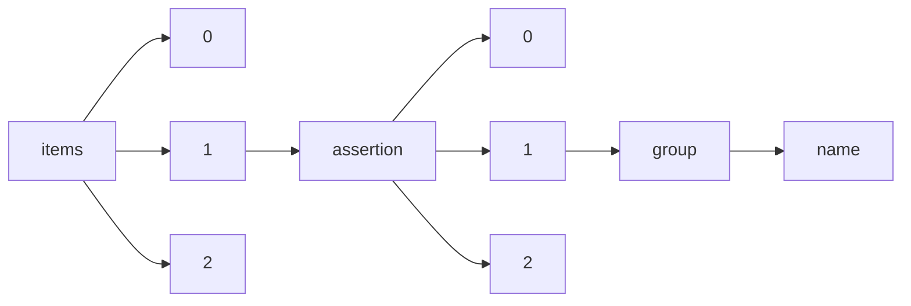

!!! warning "This document is not official Crossref documentation"
# Name
PATH = items/array/assertion/array/group/name(1)  
Occurs 30 296 330 times  
Unique values: 108  
{ .annotate }

1. A route to an element, for example:  
   The route "items/array/assertion/array/group/name" corresponds to navigating through the JSON indices as  
   ["items"][0]["assertion"][0]["group"]["name"]  

| **Row** | **Value** `String`                       | **Count** `Int64` |
|--------:|--------------------------------------------:|---------------------:|
| **1**   | publication\_history                        | 8 185 799            |
| **2**   | ArticleHistory                              | 7 381 031            |
| **3**   | EthicsHeading                               | 3 488 113            |
| **4**   | ChapterHistory                              | 2 938 308            |
| **5**   | ConferenceInfo                              | 2 585 102            |
| **6**   | publication\_dates                          | 1 813 963            |
| **7**   | ConfEventPeerReviewInformation              | 885 963              |
| **8**   | author\_identifiers                         | 513 989              |
| **9**   | peer\_review                                | 313 775              |
| **10**  | copyright\_and\_licensing                   | 305 691              |
| **11**  | similarity\_check                           | 240 611              |
| **12**  | peer\_review\_method                        | 235 772              |
| **13**  | copyright\_licensing                        | 217 492              |
| **14**  | related\_data                               | 204 307              |
| **15**  | Copyright\_and\_licensing                   | 192 646              |
| **16**  | multiple\_resolution                        | 161 218              |
| **17**  | general                                     | 109 676              |
| **18**  | peer\_review\_details                       | 92 720               |
| **19**  | copyright\_and\_licencing                   | 66 270               |
| **20**  | conference\_information                     | 58 038               |
| **21**  | article-reports                             | 48 237               |
| **22**  | plagiarism\_screening                       | 46 359               |
| **23**  | crosscheck                                  | 37 617               |
| **24**  | peer\_review\_information                   | 27 020               |
| **25**  | identifiers                                 | 23 121               |
| **26**  | rights                                      | 22 757               |
| **27**  | current-referee-status                      | 17 023               |
| **28**  | associated\_articles                        | 15 992               |
| **29**  | other\_information                          | 13 282               |
| **30**  | orcid                                       | 12 058               |
| **31**  | peer\_review\_taxonomy                      | 11 385               |
| **32**  | import\_history                             | 10 968               |
| **33**  | post\_publication\_commenting               | 3 795                |
| **34**  | Peer\_Review                                | 3 728                |
| **35**  | Article                                     | 1 860                |
| **36**  | content\_type                               | 1 355                |
| **37**  | article\_history                            | 1 344                |
| **38**  | disclosure                                  | 1 318                |
| **39**  | copyright                                   | 778                  |
| **40**  | article-comments                            | 711                  |
| **41**  | crossref                                    | 613                  |
| **42**  | additional\_information                     | 560                  |
| **43**  | name                                        | 418                  |
| **44**  | funding                                     | 375                  |
| **45**  | copyright\_license                          | 268                  |
| **46**  | copyright\_info                             | 251                  |
| **47**  | publication\_notes                          | 238                  |
| **48**  | volume\_supplementary\_material             | 200                  |
| **49**  | review                                      | 154                  |
| **50**  | peer                                        | 145                  |
| **51**  | content                                     | 145                  |
| **52**  | licensing                                   | 145                  |
| **53**  | Funding                                     | 142                  |
| **54**  | Availability-of-Data-and-Material           | 139                  |
| **55**  | Conflicts-of-Interest                       | 138                  |
| **56**  | Authors-Contributions                       | 137                  |
| **57**  | peer\_reviewed                              | 134                  |
| **58**  | Ethical-Approval-and-Consent-to-Participate | 124                  |
| **59**  | authors\_name                               | 121                  |
| **60**  | Publication                                 | 104                  |
| **61**  | Correction                                  | 80                   |
| **62**  | keywords                                    | 79                   |
| **63**  | Review\_policy                              | 77                   |
| **64**  | Archiving                                   | 61                   |
| **65**  | notes                                       | 49                   |
| **66**  | declarations                                | 36                   |
| **67**  | prime-recommendations                       | 30                   |
| **68**  | article                                     | 23                   |
| **69**  | Consent-for-Publication                     | 14                   |
| **70**  | Code-Availability                           | 14                   |
| **71**  | Ethics-Approval                             | 14                   |
| **72**  | Consent-to-Participate                      | 14                   |
| **73**  | catatan\_penerbit                           | 13                   |
| **74**  | funding\_information                        | 9                    |
| **75**  | license\_information                        | 5                    |
| **76**  | data\_access                                | 5                    |
| **77**  | authors                                     | 5                    |
| **78**  | kontribusi\_penulis                         | 3                    |
| **79**  | journal\_article\_versions                  | 3                    |
| **80**  | Withdrawal                                  | 3                    |
| **81**  | ac5101def-c3e9-41ee-9348-e85636b443e3       | 2                    |
| **82**  | a1a64b20e-ede9-405b-95ae-50cf9b3fdfa6       | 2                    |
| **83**  | a6fe8f38f-bfcb-4439-bccb-0fda68e8a97c       | 2                    |
| **84**  | ac4c4c759-c945-479d-8bc3-c58344ecf9ca       | 2                    |
| **85**  | a3fa46bb1-be68-4e95-8c1a-073c87218071       | 2                    |
| **86**  | Authors-Contribution                        | 2                    |
| **87**  | Availability-of-Data-Material               | 2                    |
| **88**  | a5b6f8353-9adb-4446-a80d-5109ecd18e67       | 2                    |
| **89**  | adba35afa-8a76-4b6b-90cb-5d36961ac72d       | 2                    |
| **90**  | a6c206614-906c-4baa-aeae-38f4da54cfa5       | 2                    |
| **91**  | a55bf9be6-a233-4527-9f7e-a21ca292555a       | 2                    |
| **92**  | Conflict-of-Interest                        | 2                    |
| **93**  | ae602892a-d079-4208-91a7-9a7b475fd8b5       | 2                    |
| **94**  | ab1124e59-9b8b-43bf-a0a8-03f31343b569       | 2                    |
| **95**  | Ethics-Approval-and-Consent-to-Participate  | 2                    |
| **96**  | a507bae1e-58eb-424e-ac2d-5fd16f67e9fd       | 2                    |
| **97**  | ae29d5551-06ee-45ce-aad6-7699eeaf9d20       | 2                    |
| **98**  | ae86118a8-87d8-496e-b515-2bdb3c054af4       | 2                    |
| **99**  | a5f5ff766-d8aa-47ec-a448-d876de19acca       | 2                    |
| **100** | a51eaacb2-8b9f-4aa8-9ba2-62dd1c69d84a       | 2                    |
| **101** | Related\_Docs                               | 2                    |
| **102** | aa74ec4b3-bfd4-4219-91a0-d64aa229d742       | 2                    |
| **103** | cor7                                        | 1                    |
| **104** | maintained                                  | 1                    |
| **105** | Conflict-of-Interests                       | 1                    |
| **106** | bnmbnm                                      | 1                    |
| **107** | Ethical-Approval-and-Consent-of-Participate | 1                    |
| **108** | Author-Contribution                         | 1                    |

