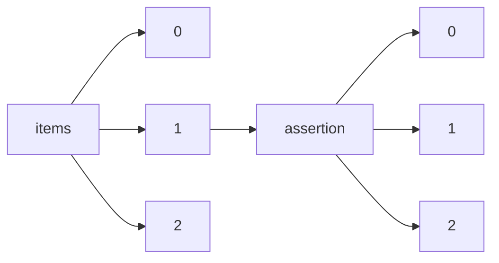

!!! warning "This document is not official Crossref documentation"
# Elements
PATH = items/array/assertion/array(1)  
Occurs 72 763 337 times  
{ .annotate }

1. A route to an element, for example:  
   The route "items/array/assertion/array" corresponds to navigating through the JSON indices as  
   ["items"][0]["assertion"][0]  

## URL
See more information: [items/array/assertion/array/URL](URL/index.md)  
Occurs 2 504 965 timess  
Unique values: > 999  

!!! note "Due to current limitations, only the first 1,000 unique values are counted."

| **Row** | **Value** `String`                                                                  | **Count** `Int64` |
|--------:|---------------------------------------------------------------------------------------:|---------------------:|
| **1**   | http://creativecommons.org/licenses/by/3.0/                                            | 14 270               |
| **2**   | http://www.tandfonline.com/action/journalInformation?show=aimsScope&journalCode=tmdn20 | 7 076                |
| **3**   | http://creativecommons.org/licenses/by-nc/3.0/                                         | 6 435                |
| **4**   | http://www.tandfonline.com/action/journalInformation?show=aimsScope&journalCode=ijmf20 | 6 305                |
| **5**   | http://www.tandfonline.com/action/journalInformation?show=aimsScope&journalCode=gnpl20 | 6 151                |
| **6**   | http://www.tandfonline.com/action/journalInformation?show=aimsScope&journalCode=tdwt20 | 5 134                |
| **7**   | http://www.tandfonline.com/action/journalInformation?show=aimsScope&journalCode=lsta20 | 4 852                |
| **8**   | http://www.tandfonline.com/action/journalInformation?show=aimsScope&journalCode=ueso20 | 4 780                |
| **9**   | http://www.tandfonline.com/action/journalInformation?show=aimsScope&journalCode=tbsd20 | 4 557                |
| **10**  | http://www.tandfonline.com/action/journalInformation?show=aimsScope&journalCode=khvi20 | 4 419                |
| ... | ... | ... |

## Explanation
See more information: [items/array/assertion/array/explanation](explanation/index.md)  
Occurs 805 034 timess  

## Group
See more information: [items/array/assertion/array/group](group/index.md)  
Occurs 30 296 330 timess  

## Label
See more information: [items/array/assertion/array/label](label/index.md)  
Occurs 67 588 753 timess  
Unique values: > 999  

!!! note "Due to current limitations, only the first 1,000 unique values are counted."

| **Row** | **Value** `String`                             | **Count** `Int64` |
|--------:|--------------------------------------------------:|---------------------:|
| **1**   | Journal Title                                     | 6 503 644            |
| **2**   | Article Title                                     | 6 499 647            |
| **3**   | Copyright                                         | 6 388 717            |
| **4**   | This article is maintained by                     | 6 078 844            |
| **5**   | Content Type                                      | 6 046 741            |
| **6**   | CrossRef DOI link to publisher maintained version | 6 004 467            |
| **7**   | First Online                                      | 5 235 180            |
| **8**   | Received                                          | 4 259 799            |
| **9**   | Accepted                                          | 4 152 614            |
| **10**  | Published                                         | 3 226 332            |
| ... | ... | ... |

## Name
See more information: [items/array/assertion/array/name](name/index.md)  
Occurs 72 763 337 timess  
Unique values: > 999  

!!! note "Due to current limitations, only the first 1,000 unique values are counted."

| **Row** | **Value** `String` | **Count** `Int64` |
|--------:|----------------------:|---------------------:|
| **1**   | copyright             | 6 371 432            |
| **2**   | content\_type         | 6 218 930            |
| **3**   | publisher             | 6 071 329            |
| **4**   | articlelink           | 6 062 055            |
| **5**   | journaltitle          | 6 008 180            |
| **6**   | articletitle          | 6 006 773            |
| **7**   | first\_online         | 5 235 180            |
| **8**   | received              | 4 265 896            |
| **9**   | accepted              | 4 158 618            |
| **10**  | Ethics                | 3 488 113            |
| ... | ... | ... |

## Order
See more information: [items/array/assertion/array/order](order/index.md)  
Occurs 29 167 980 timess  
Unique values: 39  

| **Row** | **Value** `Int64` | **Count** `Int64` |
|--------:|---------------------:|---------------------:|
| **1**   | 1                    | 10 488 562           |
| **2**   | 2                    | 8 278 364            |
| **3**   | 3                    | 4 278 855            |
| **4**   | 0                    | 2 537 910            |
| **5**   | 4                    | 1 187 736            |
| **6**   | 5                    | 532 130              |
| **7**   | 7                    | 422 910              |
| **8**   | 8                    | 388 377              |
| **9**   | 10                   | 318 168              |
| **10**  | 9                    | 289 309              |
| ... | ... | ... |

## Value
See more information: [items/array/assertion/array/value](value/index.md)  
Occurs 70 729 061 timess  
Unique values: > 999  

!!! note "Due to current limitations, only the first 1,000 unique values are counted."

| **Row** | **Value** `String`                                                             | **Count** `Int64` |
|--------:|----------------------------------------------------------------------------------:|---------------------:|
| **1**   | Elsevier                                                                          | 6 002 842            |
| **2**   | article                                                                           | 5 129 282            |
| **3**   | The publishing and review policy for this title is described in its Aims & Scope. | 1 387 435            |
| **4**   | simple-article                                                                    | 819 865              |
| **5**   | paper                                                                             | 587 532              |
| **6**   | Not applicable.                                                                   | 327 496              |
| **7**   | The authors declare no competing interests.                                       | 277 377              |
| **8**   | Single-blind                                                                      | 268 549              |
| **9**   | This content has been made available to all.                                      | 263 641              |
| **10**  | Yes                                                                               | 248 253              |
| ... | ... | ... |

