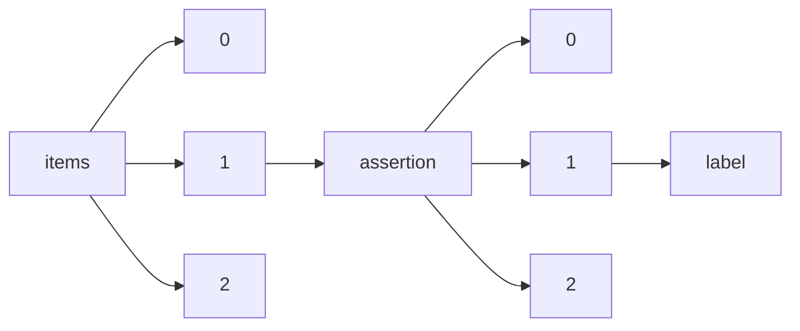

!!! warning "This document is not official Crossref documentation"
# Label
PATH = items/array/assertion/array/label(1)  
Occurs 67 588 753 times  
Unique values: > 999  
{ .annotate }

1. A route to an element, for example:  
   The route "items/array/assertion/array/label" corresponds to navigating through the JSON indices as  
   ["items"][0]["assertion"][0]["label"]  

!!! note "Due to current limitations, only the first 1,000 unique values are counted."

| **Row** | **Value** `String`                                                 | **Count** `Int64` |
|--------:|----------------------------------------------------------------------:|---------------------:|
| **1**   | Journal Title                                                         | 6 503 644            |
| **2**   | Article Title                                                         | 6 499 647            |
| **3**   | Copyright                                                             | 6 388 717            |
| **4**   | This article is maintained by                                         | 6 078 844            |
| **5**   | Content Type                                                          | 6 046 741            |
| **6**   | CrossRef DOI link to publisher maintained version                     | 6 004 467            |
| **7**   | First Online                                                          | 5 235 180            |
| **8**   | Received                                                              | 4 259 799            |
| **9**   | Accepted                                                              | 4 152 614            |
| **10**  | Published                                                             | 3 226 332            |
| **11**  | Peer Review Statement                                                 | 1 388 631            |
| **12**  | Aim & Scope                                                           | 1 388 317            |
| **13**  | Revised                                                               | 789 848              |
| **14**  | Online publication date                                               | 605 316              |
| **15**  | Article Type                                                          | 487 903              |
| **16**  | Copyright Information                                                 | 487 903              |
| **17**  | Date Received                                                         | 487 903              |
| **18**  | Date Accepted                                                         | 487 903              |
| **19**  | Conference Name                                                       | 286 240              |
| **20**  | Conference Acronym                                                    | 286 185              |
| **21**  | Conference Start Date                                                 | 286 185              |
| **22**  | Conference ID                                                         | 286 185              |
| **23**  | Conference Year                                                       | 286 185              |
| **24**  | Conference End Date                                                   | 286 040              |
| **25**  | Free to read                                                          | 267 998              |
| **26**  | License                                                               | 253 041              |
| **27**  | Conference City                                                       | 250 014              |
| **28**  | Conference Country                                                    | 249 370              |
| **29**  | Published online                                                      | 239 368              |
| **30**  | Conference URL                                                        | 239 023              |
| **31**  | CrossRef DOI link to the associated document                          | 226 380              |
| **32**  | Conference Number                                                     | 187 768              |
| **33**  | Article type                                                          | 175 945              |
| **34**  | Peer reviewed                                                         | 146 713              |
| **35**  | Review process                                                        | 143 529              |
| **36**  | Journal title                                                         | 117 844              |
| **37**  | Article title                                                         | 117 774              |
| **38**  | Copyright information                                                 | 117 414              |
| **39**  | Date received                                                         | 116 794              |
| **40**  | Date accepted                                                         | 116 047              |
| **41**  | Content type                                                          | 112 672              |
| **42**  | Type                                                                  | 99 362               |
| **43**  | Number of Submissions Sent for Review                                 | 98 873               |
| **44**  | Conference Management System                                          | 98 873               |
| **45**  | Acceptance Rate of Full Papers                                        | 98 873               |
| **46**  | Number of Full Papers Accepted                                        | 98 873               |
| **47**  | Change Details                                                        | 96 542               |
| **48**  | External Reviewers Involved                                           | 95 013               |
| **49**  | Number of Short Papers Accepted                                       | 95 013               |
| **50**  | Average Number of Reviews per Paper                                   | 94 906               |
| **51**  | Average Number of Papers per Reviewer                                 | 91 608               |
| **52**  | Journal                                                               | 72 707               |
| **53**  | OPEN ACCESS                                                           | 72 123               |
| **54**  | Change Type                                                           | 67 519               |
| **55**  | Change Date                                                           | 67 519               |
| **56**  | Synapse                                                               | 66 695               |
| **57**  | the Journal                                                           | 66 638               |
| **58**  | Supplementary materials                                               | 62 665               |
| **59**  | Similarity check                                                      | 58 525               |
| **60**  | Crossref DOI link to publisher maintained version                     | 58 525               |
| **61**  | Review Process                                                        | 58 432               |
| **62**  | Peer Reviewed                                                         | 54 639               |
| **63**  | Review Status                                                         | 46 360               |
| **64**  | Screening Status                                                      | 46 359               |
| **65**  | Publication                                                           | 38 825               |
| **66**  | Print publication                                                     | 37 334               |
| **67**  | Article metrics                                                       | 35 919               |
| **68**  | Referee Report                                                        | 35 812               |
| **69**  | Additional Info on Review Process                                     | 34 358               |
| **70**  | Licence                                                               | 33 502               |
| **71**  | Published Online                                                      | 27 209               |
| **72**  | ORCID                                                                 | 21 478               |
| **73**  | Grant Information                                                     | 17 524               |
| **74**  | Referee status                                                        | 17 023               |
| **75**  | Journal Owner                                                         | 15 806               |
| **76**  | Journal Publisher                                                     | 15 806               |
| **77**  | CrossChecked                                                          | 14 118               |
| **78**  | Referee Comment                                                       | 12 425               |
| **79**  | Import                                                                | 10 968               |
| **80**  | License information                                                   | 10 309               |
| **81**  | CrossRef DOI Link to Discussion:                                      | 6 485                |
| **82**  | received                                                              | 6 158                |
| **83**  | accepted                                                              | 6 094                |
| **84**  | published                                                             | 5 871                |
| **85**  | CrossRef DOI Link to Originating Article:                             | 5 340                |
| **86**  | Published Print                                                       | 4 950                |
| **87**  | Contact person for queries                                            | 3 860                |
| **88**  | Average number of reviews per paper                                   | 3 860                |
| **89**  | Peer review transparency                                              | 3 795                |
| **90**  | Post publication commenting                                           | 3 795                |
| **91**  | Peer review interaction                                               | 3 795                |
| **92**  | Peer review published                                                 | 3 795                |
| **93**  | CrossRef DOI Link to Correction:                                      | 3 529                |
| **94**  | Online First                                                          | 3 307                |
| **95**  | Publisher                                                             | 2 987                |
| **96**  | revised                                                               | 1 494                |
| **97**  | This paper is maintained by                                           | 1 441                |
| **98**  | Paper Title                                                           | 1 283                |
| **99**  | Ann Lab Med                                                           | 1 203                |
| **100** | Licensing Information                                                 | 1 152                |
| **101** | Korean J Thorac Cardiovasc Surg                                       | 1 058                |
| **102** | J Vet Clin                                                            | 795                  |
| **103** | Gut and Liver                                                         | 780                  |
| **104** | This article is published by                                          | 764                  |
| **105** | Copyright Statement                                                   | 753                  |
| **106** | Article Comment                                                       | 711                  |
| **107** | Submitted                                                             | 701                  |
| **108** | Korean J Pain                                                         | 662                  |
| **109** | J. Microbiol. Biotechnol.                                             | 618                  |
| **110** | Recevied                                                              | 608                  |
| **111** | BMB Reports                                                           | 598                  |
| **112** | Crosschecked                                                          | 591                  |
| **113** | Ethics                                                                | 515                  |
| **114** | J Neurogastroenterol Motil                                            | 506                  |
| **115** | Conflict of interest                                                  | 500                  |
| **116** | J Appl Biol Chem                                                      | 492                  |
| **117** | Statement                                                             | 489                  |
| **118** | Korean J Lab Med                                                      | 488                  |
| **119** | Clin Psychopharmacol Neurosci                                         | 457                  |
| **120** | Korean J Clin Lab Sci                                                 | 452                  |
| **121** | Accepted for publication                                              | 448                  |
| **122** | Editorial review begun                                                | 448                  |
| **123** | Online                                                                | 431                  |
| **124** | J Korean Soc Phys Med                                                 | 420                  |
| **125** | Contractual start date                                                | 415                  |
| **126** | J Kor Phys Ther                                                       | 382                  |
| **127** | Communications for Statistical Applications and Methods               | 382                  |
| **128** | J Plant Biotechnol                                                    | 366                  |
| **129** | Funding Source                                                        | 363                  |
| **130** | CrossRef DOI link                                                     | 357                  |
| **131** | Journal of the Korean Society of Food Science and Nutrition           | 357                  |
| **132** | Rights                                                                | 357                  |
| **133** | Terms and Conditions                                                  | 356                  |
| **134** | Korean J Hosp Palliat Care                                            | 350                  |
| **135** | Paper Type                                                            | 346                  |
| **136** | Korean J Gastroenterol                                                | 332                  |
| **137** | Biomolecules & Therapeutics                                           | 324                  |
| **138** | Knee Surg Relat Res                                                   | 321                  |
| **139** | Korean J Fam Pract.                                                   | 317                  |
| **140** | Anesth Pain Med                                                       | 313                  |
| **141** | Korean J Fam Pract                                                    | 306                  |
| **142** | Blood Res                                                             | 296                  |
| **143** | Competing interests                                                   | 293                  |
| **144** | J Dent Rehabil Appl Sci                                               | 290                  |
| **145** | J Korean Soc Transplant                                               | 288                  |
| **146** | Biomol Ther (Seoul)                                                   | 266                  |
| **147** | J Korean Med Rehabi                                                   | 254                  |
| **148** | J Dent Hyg Sci                                                        | 253                  |
| **149** | Clinical Psychopharmacology and Neuroscience                          | 253                  |
| **150** | Mol. Cells                                                            | 252                  |
| **151** | J Obes Metab Syndr                                                    | 251                  |
| **152** | Peer Review Policy                                                    | 249                  |
| **153** | Anat Cell Biol                                                        | 245                  |
| **154** | Edited                                                                | 244                  |
| **155** | Publisher Title                                                       | 240                  |
| **156** | Ann Hepatobiliary Pancreat Surg                                       | 238                  |
| **157** | Korean J. Breed. Sci.                                                 | 236                  |
| **158** | Journal of Embryo Transfer                                            | 234                  |
| **159** | Supplementary Material                                                | 228                  |
| **160** | Korean J Clin Pharm                                                   | 223                  |
| **161** | J Korean Acad Child Adolesc Psychiatry                                | 221                  |
| **162** | Biomed Sci Letters                                                    | 220                  |
| **163** | CrossRef DOI Link to Retraction:                                      | 220                  |
| **164** | International Journal of Stem Cells                                   | 217                  |
| **165** | Oral Biol Res                                                         | 216                  |
| **166** | CrossMarked                                                           | 209                  |
| **167** | J Chest Surg                                                          | 205                  |
| **168** | presented                                                             | 205                  |
| **169** | J Korean Assoc Oral Maxillofac Surg                                   | 200                  |
| **170** | Phys Ther Rehabil Sci                                                 | 197                  |
| **171** | Korean J Acupunct                                                     | 196                  |
| **172** | Vasc Specialist Int                                                   | 193                  |
| **173** | Phys. Ther. Korea                                                     | 188                  |
| **174** | Scale of Mistake                                                      | 184                  |
| **175** | Clin Pediatr Hematol Oncol                                            | 184                  |
| **176** | J Pharmacopuncture                                                    | 181                  |
| **177** | Journal of Animal Reproduction and Biotechnology                      | 180                  |
| **178** | Physical Therapy Rehabilitation Science                               | 172                  |
| **179** | CrossRef DOI Link to Comment:                                         | 169                  |
| **180** | Korean J Physiol Pharmacol                                            | 169                  |
| **181** | Int J Clin Prev Dent                                                  | 169                  |
| **182** | Journal of Minimally Invasive Surgery                                 | 168                  |
| **183** | Int J Gastrointest Interv                                             | 166                  |
| **184** | Medical Lasers; Engineering, Basic Research, and Clinical Application | 163                  |
| **185** | Korean J Blood Transfus                                               | 161                  |
| **186** | J Genet Med                                                           | 160                  |
| **187** | Final Revised                                                         | 152                  |
| **188** | Korean J Transplant                                                   | 150                  |
| **189** | Korean J Orthod                                                       | 149                  |
| **190** | Journal of Neurogastroenterology and Motility                         | 147                  |
| **191** | Article Info                                                          | 145                  |
| **192** | Plant Breed. Biotech.                                                 | 145                  |
| **193** | Korean J Stress Res                                                   | 142                  |
| **194** | Journal of Technologic Dentistry                                      | 138                  |
| **195** | J Cancer Prev                                                         | 138                  |
| **196** | Applied Science and Convergence Technology                            | 138                  |
| **197** | Corrected                                                             | 136                  |
| **198** | Kidney Res Clin Pract                                                 | 136                  |
| **199** | Lab Med Online                                                        | 135                  |
| **200** | J Korean Med Obes Res                                                 | 130                  |
| **201** | Econ. Environ. Geol.                                                  | 129                  |
| **202** | Applied Microscopy                                                    | 125                  |
| **203** | Cent Asian J Med Sci                                                  | 124                  |
| **204** | Biomol Ther                                                           | 124                  |
| **205** | CrossRef DOI Link to Reply to comment:                                | 123                  |
| **206** | J Cosmet Med                                                          | 123                  |
| **207** | Journal of Cancer Prevention                                          | 121                  |
| **208** | Toxicol. Res.                                                         | 121                  |
| **209** | J Korean Acad Oral Health                                             | 121                  |
| **210** | J Trauma Inj                                                          | 116                  |
| **211** | Exp Neurobiol                                                         | 115                  |
| **212** | Gastrointestinal Intervention                                         | 114                  |
| **213** | Book Title                                                            | 112                  |
| **214** | Last Published Online                                                 | 112                  |
| **215** | ISBN online                                                           | 112                  |
| **216** | This document is maintained by                                        | 112                  |
| **217** | Prev Nutr Food Sci                                                    | 112                  |
| **218** | J Rheum Dis                                                           | 111                  |
| **219** | Microbiol. Biotechnol. Lett.                                          | 110                  |
| **220** | Publisher Detail                                                      | 106                  |
| **221** | Kidney Research and Clinical Practice                                 | 105                  |
| **222** | Biomed. Sci. Lett.                                                    | 104                  |
| **223** | JERM                                                                  | 104                  |
| **224** | J Lab Med Qual Assur                                                  | 103                  |
| **225** | Enhanced Version of Record                                            | 103                  |
| **226** | Public Health Weekly Report                                           | 102                  |
| **227** | J Korean Foot Ankle Soc                                               | 100                  |
| **228** | Korean J Breed Sci                                                    | 100                  |
| **229** | J Retin                                                               | 94                   |
| **230** | Journal of Genetic Medicine                                           | 93                   |
| **231** | Disetujui                                                             | 92                   |
| **232** | Diterima                                                              | 91                   |
| **233** | Resubmitted                                                           | 89                   |
| **234** | Korean J Sports Med                                                   | 87                   |
| **235** | Med Laser                                                             | 86                   |
| **236** | Reviewed                                                              | 86                   |
| **237** | Terbit                                                                | 86                   |
| **238** | J Minim Invasive Surg                                                 | 84                   |
| **239** | J Oral Med Pain                                                       | 82                   |
| **240** | Korean J Vasc Endovasc Surg                                           | 82                   |
| **241** | Med Biol Sci Eng                                                      | 81                   |
| **242** | Keywords                                                              | 79                   |
| **243** | Int J Stem Cells                                                      | 79                   |
| **244** | Journal of the Korean Society for Research on Nicotine and Tobacco    | 75                   |
| **245** | J Acupunct Meridian Stud                                              | 74                   |
| **246** | J Korean Soc Res Nicotine Tob                                         | 74                   |
| **247** | Catatan Penerbit                                                      | 72                   |
| **248** | Int J Thyroidol                                                       | 72                   |
| **249** | Korean J Aerosp Environ Med                                           | 70                   |
| **250** | J Korean Soc Sch Health                                               | 68                   |
| **251** | Vascular Specialist International                                     | 68                   |
| **252** | Korean J. Vet. Serv.                                                  | 67                   |
| **253** | Progress in Medical Physics                                           | 67                   |
| **254** | Korean J healthc assoc Infect Control Prev                            | 66                   |
| **255** | J Acute Care Surg                                                     | 65                   |
| **256** | Arch Reconstr Microsurg                                               | 64                   |
| **257** | Journal of Korean Medical Society of Soft Tissue                      | 63                   |
| **258** | Lab Med Qual Assur                                                    | 63                   |
| **259** | J Environ Health Sci.                                                 | 62                   |
| **260** | Vasc Spec Int                                                         | 62                   |
| **261** | Stress                                                                | 62                   |
| **262** | Ann Liver Transplant                                                  | 61                   |
| **263** | ISBN                                                                  | 60                   |
| **264** | Psychoanal                                                            | 57                   |
| **265** | Revisi Akhir                                                          | 57                   |
| **266** | J Korean Med Rehabil                                                  | 57                   |
| **267** | Approved by NIST Editorial Review Board on YYYY-MM-DD                 | 56                   |
| **268** | Conference Date                                                       | 55                   |
| **269** | Korean J Obes                                                         | 55                   |
| **270** | CrossRef DOI Link to Expression of Concern:                           | 53                   |
| **271** | J Korean Dysphagia Soc                                                | 52                   |
| **272** | Internet Archive                                                      | 51                   |
| **273** | Journal of Trauma and Injury                                          | 51                   |
| **274** | Type of article                                                       | 50                   |
| **275** | Osong Public Health Res Perspect                                      | 50                   |
| **276** | Supersedes                                                            | 49                   |
| **277** | HIRA Research                                                         | 49                   |
| **278** | Ann Geriatr Med Res                                                   | 49                   |
| **279** | Surg Metab Nutr                                                       | 49                   |
| **280** | ORCID Hakan Arslan                                                    | 49                   |
| **281** | Int. J. Fuzzy Log. Intell. Syst.                                      | 45                   |
| **282** | Journal of Dental Implant Research                                    | 44                   |
| **283** | Toxicological Research                                                | 43                   |
| **284** | J Surg Ultrasound                                                     | 43                   |
| **285** | Journal of Korean Burn Society                                        | 42                   |
| **286** | J. Korean Phy. Soc.                                                   | 41                   |
| **287** | Submission                                                            | 41                   |
| **288** | corrected                                                             | 41                   |
| **289** | The Journal of Korean Physical Therapy                                | 41                   |
| **290** | Urogenit Tract Infect                                                 | 40                   |
| **291** | Mood Emot                                                             | 40                   |
| **292** | J Korean Soc Traumatol                                                | 40                   |
| **293** | Biomedical Science Letters                                            | 40                   |
| **294** | The Korean Journal of Blood Transfusion                               | 40                   |
| **295** | Ewha Med J                                                            | 40                   |
| **296** | International Journal of Fuzzy Logic and Intelligent Systems          | 39                   |
| **297** | J Kor Soc Phys Ther                                                   | 38                   |
| **298** | BioDesign                                                             | 37                   |
| **299** | Funding source                                                        | 37                   |
| **300** | Psychoanalysis                                                        | 36                   |
| **301** | International Journal of Pain                                         | 35                   |
| **302** | Direvisi Akhir                                                        | 35                   |
| **303** | Knee Surgery & Related Research                                       | 35                   |
| **304** | Journal of Pharmacoepidemiology and Risk Management                   | 34                   |
| **305** | Available Online                                                      | 34                   |
| **306** | J. Kor. Soc. Health-syst. Pharm.                                      | 34                   |
| **307** | Gut and liver                                                         | 33                   |
| **308** | Korean Society for Biotechnology and Bioengineering Journal           | 33                   |
| **309** | Date of ERG submission                                                | 32                   |
| **310** | J Ecol Environ                                                        | 32                   |
| **311** | The Korean Journal of Obesity                                         | 31                   |
| **312** | Korean J Clin Geri                                                    | 31                   |
| **313** | Minor Correction                                                      | 30                   |
| **314** | Ann Phlebology                                                        | 30                   |
| **315** | Journal of Obesity & Metabolic Syndrome                               | 29                   |
| **316** | Plant Breeding and Biotechnology                                      | 28                   |
| **317** | Korean Journal of Thoracic and Cardiovascular Surgery                 | 28                   |
| **318** | CrossRef DOI Link to Letter:                                          | 28                   |
| **319** | Korean J Appl Stat                                                    | 28                   |
| **320** | Recommendation                                                        | 27                   |
| **321** | Seung-Kee Min                                                         | 24                   |
| **322** | Journal of information and communication convergence engineering      | 24                   |
| **323** | Young-Je Cho                                                          | 24                   |
| **324** | this article is maintained by                                         | 23                   |
| **325** | Journal of Lifestyle Medicine                                         | 23                   |
| **326** | article title                                                         | 23                   |
| **327** | peer reviewed                                                         | 23                   |
| **328** | Korean Journal of Acupuncture                                         | 23                   |
| **329** | review process                                                        | 23                   |
| **330** | Korean J Ret                                                          | 23                   |
| **331** | copyright                                                             | 23                   |
| **332** | Translation of                                                        | 21                   |
| **333** | Won-Myong Bahk                                                        | 20                   |
| **334** | Journal of Oral Medicine and Pain                                     | 20                   |
| **335** | Nayoung Kim                                                           | 20                   |
| **336** | Hae-Sim Park                                                          | 20                   |
| **337** | Erratum                                                               | 19                   |
| **338** | J Hosp Palliat Care                                                   | 18                   |
| **339** | erratum                                                               | 18                   |
| **340** | J korean soc phys med                                                 | 18                   |
| **341** | Full Article                                                          | 17                   |
| **342** | Chan-Jin Park                                                         | 17                   |
| **343** | Eun-Young Kwon                                                        | 17                   |
| **344** | Appl Microsc                                                          | 17                   |
| **345** | pubcorrected                                                          | 17                   |
| **346** | Med Lasers                                                            | 17                   |
| **347** | Korean J Clin Lab Sci.                                                | 17                   |
| **348** | Ann Clin Nutr Metab                                                   | 17                   |
| **349** | J Korean Soc Phys Med.                                                | 16                   |
| **350** | Won-Seob Shin                                                         | 15                   |
| **351** | Published By                                                          | 15                   |
| **352** | Berbagi Data                                                          | 15                   |
| **353** | Exp Neurobiol.                                                        | 15                   |
| **354** | DTT                                                                   | 15                   |
| **355** | Khae Hawn Kim                                                         | 15                   |
| **356** | Journal of Digestive Cancer Research                                  | 15                   |
| **357** | Copyright by                                                          | 14                   |
| **358** | Jin-Woo Kim                                                           | 14                   |
| **359** | Journal of Digestive Cancer Reports                                   | 14                   |
| **360** | Chan Park                                                             | 14                   |
| **361** | Yijung Chung                                                          | 14                   |
| **362** | Jae-Min Seo                                                           | 14                   |
| **363** | Pendanaan                                                             | 14                   |
| **364** | Chi-Un Pae                                                            | 14                   |
| **365** | Sanghyun Lee                                                          | 14                   |
| **366** | Journal of Applied Biological Chemistry                               | 14                   |
| **367** | Last updated                                                          | 14                   |
| **368** | CrossRef DOI Link to Reply to letter:                                 | 13                   |
| **369** | Kyung-Mo Cho                                                          | 13                   |
| **370** | Young-Kyun Kim                                                        | 13                   |
| **371** | Se-Hee Park                                                           | 13                   |
| **372** | Choon-Sik Park                                                        | 13                   |
| **373** | Hoi-Seon Lee                                                          | 13                   |
| **374** | Journal of Retina                                                     | 13                   |
| **375** | The Korean Journal of Pain                                            | 12                   |
| **376** | Kontribusi Penulis                                                    | 12                   |
| **377** | Funding Percentage                                                    | 12                   |
| **378** | Lee-Ra Cho                                                            | 12                   |
| **379** | Oral Biology Research                                                 | 12                   |
| **380** | Sanghyun Ahn                                                          | 11                   |
| **381** | Seung-June Oh                                                         | 11                   |
| **382** | Eun Ju Cho                                                            | 11                   |
| **383** | Kyung Won Shim                                                        | 11                   |
| **384** | Hee-Jung Kim                                                          | 11                   |
| **385** | Institutional Repository                                              | 11                   |
| **386** | Soo-Yeon Shin                                                         | 11                   |
| **387** | Sang-Won Park                                                         | 11                   |
| **388** | Journal of Acute Care Surgery                                         | 11                   |
| **389** | submitted                                                             | 11                   |
| **390** | In Hong Choi                                                          | 11                   |
| **391** | PKP Preservation Network                                              | 11                   |
| **392** | National Library of Australia                                         | 11                   |
| **393** | stress                                                                | 10                   |
| **394** | Journal of Dental Hygiene Science                                     | 10                   |
| **395** | Dong Chung Kim                                                        | 10                   |
| **396** | Jae-won Kang                                                          | 10                   |
| **397** | Kyung-Ho Ko                                                           | 10                   |
| **398** | Changsu Han                                                           | 10                   |
| **399** | Yoon-Hyuk Huh                                                         | 10                   |
| **400** | Hyun-Pil Lim                                                          | 10                   |
| **401** | Sang Wha Lee                                                          | 10                   |
| **402** | Commun. Stat. Appl. Methods                                           | 10                   |
| **403** | Duck Cho                                                              | 10                   |
| **404** | Man-Jin In                                                            | 9                    |
| **405** | In-Woo Cho                                                            | 9                    |
| **406** | Choon Sik Park                                                        | 9                    |
| **407** | Content Digitized                                                     | 9                    |
| **408** | Geon Ho Bahn                                                          | 9                    |
| **409** | Myoung-Ho Hyun                                                        | 9                    |
| **410** | Funding statement                                                     | 9                    |
| **411** | Jin Hwa Lee                                                           | 9                    |
| **412** | Hyun Ok Kim                                                           | 9                    |
| **413** | You Sun Kim                                                           | 9                    |
| **414** | Nam-In Baek                                                           | 9                    |
| **415** | Approved by NIST Editorial Review Board on 2023-03-15                 | 9                    |
| **416** | Hye-Mi Jeon                                                           | 9                    |
| **417** | Online Published                                                      | 9                    |
| **418** | Kyoung-Hwa Jung                                                       | 9                    |
| **419** | Tack Lee                                                              | 9                    |
| **420** | Sujin Hwang                                                           | 9                    |
| **421** | first online                                                          | 9                    |
| **422** | Approved by NIST Editorial Review Board on 3/4/2022                   | 9                    |
| **423** | Yeong-Bae Yun                                                         | 8                    |
| **424** | Dae-Sung Park                                                         | 8                    |
| **425** | So-Yeun Kim                                                           | 8                    |
| **426** | Kyeong-Hee Kim                                                        | 8                    |
| **427** | Young Ae Lim                                                          | 8                    |
| **428** | Myung Ho Lim                                                          | 8                    |
| **429** | Journal Name                                                          | 8                    |
| **430** | Journal of Dental Rehabilitation and Applied Science                  | 8                    |
| **431** | Hyun-Seung Shin                                                       | 8                    |
| **432** | Sangseok Lee                                                          | 8                    |
| **433** | Hyung-Hoi Kim                                                         | 8                    |
| **434** | Se-Hong Kim                                                           | 8                    |
| **435** | JKDA                                                                  | 8                    |
| **436** | The Korean Society of Blood Transfusion                               | 8                    |
| **437** | Yoon-Seok Chang                                                       | 8                    |
| **438** | Young-Jun Lim                                                         | 8                    |
| **439** | Kwi-Dug Yun                                                           | 8                    |
| **440** | Vasc Specialist Int.                                                  | 8                    |
| **441** | Hong Soo Lee                                                          | 8                    |
| **442** | Cheol Min Shin                                                        | 7                    |
| **443** | Ahram Han                                                             | 7                    |
| **444** | Moonjae Cho                                                           | 7                    |
| **445** | Sheng-Min Wang                                                        | 7                    |
| **446** | Joo Sung Kim                                                          | 7                    |
| **447** | Jun Eun Park                                                          | 7                    |
| **448** | Youn-Kyung Choi                                                       | 7                    |
| **449** | In-Hong Choi                                                          | 7                    |
| **450** | Retraction                                                            | 7                    |
| **451** | Jae-Seek You                                                          | 7                    |
| **452** | Disclosure                                                            | 7                    |
| **453** | Commun. Stat. Appl. Methods, CSAM                                     | 7                    |
| **454** | Commun. Stat. Appl.                                                   | 7                    |
| **455** | Young-Kee Kim                                                         | 7                    |
| **456** | Author Contribution                                                   | 7                    |
| **457** | Journal of Acupuncture Research                                       | 7                    |
| **458** | Osong Public Health and Research Perspectives                         | 7                    |
| **459** | Kyung-Hwa Shin                                                        | 7                    |
| **460** | Bung-Nyun Kim                                                         | 6                    |
| **461** | ORCID Mohammad Suhail                                                 | 6                    |
| **462** | Jongeun Yim                                                           | 6                    |
| **463** | Dong Ho Lee                                                           | 6                    |
| **464** | ORCID Mohamed Gaye                                                    | 6                    |
| **465** | Yoon Tae Jeen                                                         | 6                    |
| **466** | Hyun-Joo Kim                                                          | 6                    |
| **467** | In-Sung Yeo                                                           | 6                    |
| **468** | Hong-So Yang                                                          | 6                    |
| **469** | Jae-Ho Park                                                           | 6                    |
| **470** | Hoon Jai Chun                                                         | 6                    |
| **471** | CrossBred                                                             | 6                    |
| **472** | Sangil Min                                                            | 6                    |
| **473** | Jae Myung Cha                                                         | 6                    |
| **474** | ORCID Goutam Kumar Patra                                              | 6                    |
| **475** | Hye-Jin Park                                                          | 6                    |
| **476** | Jungwon Kang                                                          | 6                    |
| **477** | Annals of Geriatric Medicine and Research                             | 6                    |
| **478** | Gut Liver                                                             | 6                    |
| **479** | Mi-Kyung Sung                                                         | 6                    |
| **480** | Episodes                                                              | 6                    |
| **481** | Xue-song JIN                                                          | 6                    |
| **482** | Hyun Kwon Lee                                                         | 6                    |
| **483** | Ji-Young Joo                                                          | 6                    |
| **484** | Young Suk Park                                                        | 6                    |
| **485** | Soo-Jung Lee                                                          | 6                    |
| **486** | CrossRef DOI Link to Correction and Removal of Expression of Concern: | 6                    |
| **487** | Publication History                                                   | 6                    |
| **488** | Sung-Tae Hong                                                         | 6                    |
| **489** | Surgical Metabolism and Nutrition                                     | 6                    |
| **490** | Konflik Kepentingan                                                   | 6                    |
| **491** | Jae Weon Kim                                                          | 5                    |
| **492** | Sang Yeoup Lee                                                        | 5                    |
| **493** | Youn Huh                                                              | 5                    |
| **494** | Seong Woo Jeon                                                        | 5                    |
| **495** | Hyun-Soo Kim                                                          | 5                    |
| **496** | Soo-Yeon Kim                                                          | 5                    |
| **497** | Chul-Hwan Kim                                                         | 5                    |
| **498** | Sang-Chun Oh                                                          | 5                    |
| **499** | Jae Hwa Cho                                                           | 5                    |
| **500** | Jung-Suk Han                                                          | 5                    |
| **501** | Author's Update                                                       | 5                    |
| **502** | Seung Hwan Yang                                                       | 5                    |
| **503** | Beom Hee Lee                                                          | 5                    |
| **504** | Yumi Lee                                                              | 5                    |
| **505** | Author                                                                | 5                    |
| **506** | Jeong-Seung Kwon                                                      | 5                    |
| **507** | Hyuk Soon Choi                                                        | 5                    |
| **508** | Jong-Ki Huh                                                           | 5                    |
| **509** | Chi-Min Park                                                          | 5                    |
| **510** | Byung-Wook Kim                                                        | 5                    |
| **511** | Edit volume number                                                    | 5                    |
| **512** | Hyun Kook Lim                                                         | 5                    |
| **513** | Seydi Yıkmıs                                                          | 5                    |
| **514** | Sung Eun Kim                                                          | 5                    |
| **515** | A Ri Byun                                                             | 5                    |
| **516** | Do Young Kim                                                          | 5                    |
| **517** | Ji Yong Ahn                                                           | 5                    |
| **518** | Hye-Ryun Kang                                                         | 5                    |
| **519** | Approved by NIST Editorial Review Board on 2023-03-30                 | 5                    |
| **520** | Archives of Reconstructive Microsurgery                               | 5                    |
| **521** | Chuhl Joo Lyu                                                         | 5                    |
| **522** | Dong Il Park                                                          | 5                    |
| **523** | Prakash S. Masand                                                     | 5                    |
| **524** | Peer Review                                                           | 5                    |
| **525** | Young-Gyun Song                                                       | 5                    |
| **526** | Kyung Won Seo                                                         | 5                    |
| **527** | Revisions Requested                                                   | 5                    |
| **528** | Ju-Youn Lee                                                           | 5                    |
| **529** | Phys Ther Korea                                                       | 5                    |
| **530** | Jung-Chul Park                                                        | 5                    |
| **531** | Kyung-Hee Kim                                                         | 5                    |
| **532** | Jee Hyun Ha                                                           | 5                    |
| **533** | Yang-Hyun Kim                                                         | 5                    |
| **534** | Editor                                                                | 5                    |
| **535** | Kyu-Bok Lee                                                           | 5                    |
| **536** | Experimental Neurobiology                                             | 5                    |
| **537** | Hyun-Ji Lee                                                           | 5                    |
| **538** | Soung Min Kim                                                         | 5                    |
| **539** | online\_first                                                         | 5                    |
| **540** | Jin-Young Jang                                                        | 5                    |
| **541** | Jae-In Lee                                                            | 4                    |
| **542** | Jeong-Hoon Lee                                                        | 4                    |
| **543** | Hyung Hoi Kim                                                         | 4                    |
| **544** | Mi Kyung Lee                                                          | 4                    |
| **545** | Donghee Choi                                                          | 4                    |
| **546** | Ji-Hwan Kim                                                           | 4                    |
| **547** | Jeomil Choi                                                           | 4                    |
| **548** | Seong-Kyu Lee                                                         | 4                    |
| **549** | Sang Kyun Park                                                        | 4                    |
| **550** | Jung Hee Lee                                                          | 4                    |
| **551** | Woo-Joo Park                                                          | 4                    |
| **552** | ORCID Gun Binzet                                                      | 4                    |
| **553** | Jae Hee Cheon                                                         | 4                    |
| **554** | Pernyataan Konflik Kepentingan                                        | 4                    |
| **555** | Jae Hyun Kim                                                          | 4                    |
| **556** | Sang Kil Lee                                                          | 4                    |
| **557** | Yong-Jin Cho                                                          | 4                    |
| **558** | Hyun Ji Lee                                                           | 4                    |
| **559** | Eunjung Kim                                                           | 4                    |
| **560** | J Clin Nutr                                                           | 4                    |
| **561** | Sungkun Cho                                                           | 4                    |
| **562** | OA Publication Grant                                                  | 4                    |
| **563** | Kwan-Woo Park                                                         | 4                    |
| **564** | Seong Ran Jeon                                                        | 4                    |
| **565** | Kwang-Yeob Song                                                       | 4                    |
| **566** | Yousuke Nakai                                                         | 4                    |
| **567** | Jeong Hoon Lee                                                        | 4                    |
| **568** | Description of Quality Control System                                 | 4                    |
| **569** | Eun Sun Kim                                                           | 4                    |
| **570** | Byong Duk Ye                                                          | 4                    |
| **571** | Joon-Seok Lee                                                         | 4                    |
| **572** | Related Data                                                          | 4                    |
| **573** | Jae Myung Park                                                        | 4                    |
| **574** | Sook-Hyang Jeong                                                      | 4                    |
| **575** | Hee Jo Baek                                                           | 4                    |
| **576** | Ju Young Kim                                                          | 4                    |
| **577** | Open Access: CC-BY                                                    | 4                    |
| **578** | Mi-Kyeong Oh                                                          | 4                    |
| **579** | Seung Huh                                                             | 4                    |
| **580** | Won-Young Lee                                                         | 4                    |
| **581** | Dong-Hoon Yang                                                        | 4                    |
| **582** | Sang-Hoon Ahn                                                         | 4                    |
| **583** | Yuri Kim                                                              | 4                    |
| **584** | Ju-Mi Park                                                            | 4                    |
| **585** | Yoon Suk Jung                                                         | 4                    |
| **586** | Soo-Min Ok                                                            | 4                    |
| **587** | Bong-Gyu Kim                                                          | 4                    |
| **588** | Chan Hyuk Park                                                        | 4                    |
| **589** | Publication year correction on online print                           | 4                    |
| **590** | Won Byong Yoon                                                        | 4                    |
| **591** | Jin-Ho Shin                                                           | 4                    |
| **592** | Tatsuya Unno                                                          | 4                    |
| **593** | ORCID Ilkay Gumus                                                     | 4                    |
| **594** | Jin-Hyo Kim                                                           | 4                    |
| **595** | CrossRef DOI Link to Removal of Expression of Concern:                | 4                    |
| **596** | In Young Cho                                                          | 4                    |
| **597** | Editorial                                                             | 4                    |
| **598** | Junghyun Noh                                                          | 4                    |
| **599** | Song-Yi Kim                                                           | 4                    |
| **600** | Cross Checked                                                         | 4                    |
| **601** | Change to page numbers                                                | 4                    |
| **602** | Level of Remorse                                                      | 4                    |
| **603** | orcid Record                                                          | 4                    |
| **604** | Ji Hye Hwang                                                          | 4                    |
| **605** | CrossDressed                                                          | 4                    |
| **606** | Kyoung-A Kim                                                          | 4                    |
| **607** | Yong Chan Lee                                                         | 4                    |
| **608** | Yeon Jung Lee                                                         | 4                    |
| **609** | Sung-Hee Jeong                                                        | 4                    |
| **610** | Ashwin A. Patkar                                                      | 4                    |
| **611** | Hyo-Joon Yang                                                         | 4                    |
| **612** | Younsuk Lee                                                           | 4                    |
| **613** | Seung-Hwan Lee                                                        | 4                    |
| **614** | Reviewing Process                                                     | 4                    |
| **615** | Hyun Young Kim                                                        | 4                    |
| **616** | Seungwon Lee                                                          | 4                    |
| **617** | Pouya Tayebi                                                          | 3                    |
| **618** | Funding Statement                                                     | 3                    |
| **619** | Du-Hyeong Lee                                                         | 3                    |
| **620** | Shin-Yoon Kim                                                         | 3                    |
| **621** | Ho Gak Kim                                                            | 3                    |
| **622** | Hiroyuki Kamei                                                        | 3                    |
| **623** | Won Lee                                                               | 3                    |
| **624** | Soon-Chan Hong                                                        | 3                    |
| **625** | Won Ho Han                                                            | 3                    |
| **626** | Man Jin Kim                                                           | 3                    |
| **627** | Kiheon Lee                                                            | 3                    |
| **628** | Soo In Choi                                                           | 3                    |
| **629** | Chang Moo Kang                                                        | 3                    |
| **630** | Geon Ho Lee                                                           | 3                    |
| **631** | Tae Hyung Kim                                                         | 3                    |
| **632** | Moon-Woo Seong                                                        | 3                    |
| **633** | Award ID                                                              | 3                    |
| **634** | Kee-Hwan Kim                                                          | 3                    |
| **635** | Sungsin Cho                                                           | 3                    |
| **636** | Seung-Pyo Lee                                                         | 3                    |
| **637** | Hee-Pyoung Park                                                       | 3                    |
| **638** | Seock-Hwan Lee                                                        | 3                    |
| **639** | Jung-ho Ko                                                            | 3                    |
| **640** | Joo-Hun Song                                                          | 3                    |
| **641** | Sang-Hyuk Lee                                                         | 3                    |
| **642** | Wook Song                                                             | 3                    |
| **643** | Won Jung                                                              | 3                    |
| **644** | ORCID Eshraq Ahmed Abdullah                                           | 3                    |
| **645** | Gwang Ha Kim                                                          | 3                    |
| **646** | Chieh-Hsin Lin                                                        | 3                    |
| **647** | Ali Khaleghi                                                          | 3                    |
| **648** | Approved by NIST Editorial Review Board on 2022-05-17                 | 3                    |
| **649** | Tae Yeul Kim                                                          | 3                    |
| **650** | Hee-Taik Kang                                                         | 3                    |
| **651** | Dong Hyun Kim                                                         | 3                    |
| **652** | Kyung Yun Kim                                                         | 3                    |
| **653** | Ye Jee Shim                                                           | 3                    |
| **654** | Beom-Seok Chang                                                       | 3                    |
| **655** | Jae Hee Cho                                                           | 3                    |
| **656** | Jong Jin Seo                                                          | 3                    |
| **657** | Hee Sup Shin                                                          | 3                    |
| **658** | Jun Yong Park                                                         | 3                    |
| **659** | Dong-Young Rhyu                                                       | 3                    |
| **660** | Sungtae Koo                                                           | 3                    |
| **661** | ORCID Jahangir Mondal                                                 | 3                    |
| **662** | Young Joo Park                                                        | 3                    |
| **663** | Jeong Hyeon Kim                                                       | 3                    |
| **664** | Tae Il Kim                                                            | 3                    |
| **665** | Seung Ki Min                                                          | 3                    |
| **666** | Seok-Mann Yoon                                                        | 3                    |
| **667** | Bong-Jik Suh                                                          | 3                    |
| **668** | Guo-qing HE                                                           | 3                    |
| **669** | Additional information                                                | 3                    |
| **670** | Min Young Kim                                                         | 3                    |
| **671** | Muhammad Faisal Manzoor                                               | 3                    |
| **672** | Jongwon Ha                                                            | 3                    |
| **673** | Approved by NIST Editorial Review Board on 2022-11-18                 | 3                    |
| **674** | Eun-Ki Kim                                                            | 3                    |
| **675** | Moo-Hyeog Im                                                          | 3                    |
| **676** | Jae-Min Jeong                                                         | 3                    |
| **677** | ORCID Shahobiddin Adizov                                              | 3                    |
| **678** | Young Shil Park                                                       | 3                    |
| **679** | Min-Kyung Ji                                                          | 3                    |
| **680** | Eon Sook Lee                                                          | 3                    |
| **681** | Jin Jeon                                                              | 3                    |
| **682** | Ju Yup Lee                                                            | 3                    |
| **683** | ORCID Rajni Kant                                                      | 3                    |
| **684** | ORCID Muhammad Jamaluddin Ahmed                                       | 3                    |
| **685** | Young Ho Lee                                                          | 3                    |
| **686** | Jung Won Lee                                                          | 3                    |
| **687** | Ning ZHANG                                                            | 3                    |
| **688** | Yong-Woo Ahn                                                          | 3                    |
| **689** | Hyangsook Lee                                                         | 3                    |
| **690** | Cha Gon Lee                                                           | 3                    |
| **691** | Daesub Song                                                           | 3                    |
| **692** | YounJung Park                                                         | 3                    |
| **693** | Sunmin Park                                                           | 3                    |
| **694** | Cheolmin Shin                                                         | 3                    |
| **695** | In-sang Jeon                                                          | 3                    |
| **696** | Su-Young Lee                                                          | 3                    |
| **697** | Jin WANG                                                              | 3                    |
| **698** | Hyung Won Ryu                                                         | 3                    |
| **699** | Jong-Ho Lee                                                           | 3                    |
| **700** | Soo Yeon Kim                                                          | 3                    |
| **701** | Kyoungjin Kang                                                        | 3                    |
| **702** | Yu Kyung Cho                                                          | 3                    |
| **703** | Sung-Jo Lee                                                           | 3                    |
| **704** | Jung-Jin Lee                                                          | 3                    |
| **705** | Jai-Hyun So                                                           | 3                    |
| **706** | Available in DOAB                                                     | 3                    |
| **707** | Hyung-Joon Ahn                                                        | 3                    |
| **708** | Seung Up Kim                                                          | 3                    |
| **709** | Gyeong-Je Lee                                                         | 3                    |
| **710** | In press                                                              | 3                    |
| **711** | Draft                                                                 | 3                    |
| **712** | Jeong-Sik Byeon                                                       | 3                    |
| **713** | Byoungjin Park                                                        | 3                    |
| **714** | Beom Kyung Kim                                                        | 3                    |
| **715** | Kwang-Hyub Han                                                        | 3                    |
| **716** | Sang Hoon Ahn                                                         | 3                    |
| **717** | Taeg Kyu Kwon                                                         | 2                    |
| **718** | Jae-Ho Shin                                                           | 2                    |
| **719** | Seung Hwan Oh                                                         | 2                    |
| **720** | Sujung Yeo                                                            | 2                    |
| **721** | Tze Tec Chong                                                         | 2                    |
| **722** | Sang Chul Lee                                                         | 2                    |
| **723** | Da-Hye Choi                                                           | 2                    |
| **724** | Approved by NIST Editorial Review Board on 2022-09-16                 | 2                    |
| **725** | Hyun-Min Koh                                                          | 2                    |
| **726** | Dong Hun Kim                                                          | 2                    |
| **727** | Chang Duck Kim                                                        | 2                    |
| **728** | Dong-ming YAN                                                         | 2                    |
| **729** | Hyun Joo Shin                                                         | 2                    |
| **730** | Yong-Lark Choi                                                        | 2                    |
| **731** | Yoo-Mi Kim                                                            | 2                    |
| **732** | Moon-Key Kim                                                          | 2                    |
| **733** | Yangho Myung                                                          | 2                    |
| **734** | Ye An Kim                                                             | 2                    |
| **735** | Production                                                            | 2                    |
| **736** | Yun-Woong CHOI                                                        | 2                    |
| **737** | Marco Calabrò                                                         | 2                    |
| **738** | Chae Seung Lim                                                        | 2                    |
| **739** | Ji Hee Wee                                                            | 2                    |
| **740** | Jooyoung Lee                                                          | 2                    |
| **741** | Effect of softening of cement...                                      | 2                    |
| **742** | Soo Young Park                                                        | 2                    |
| **743** | Jong Woong Park                                                       | 2                    |
| **744** | Kwang Jae Lee                                                         | 2                    |
| **745** | Approved by NIST Editorial Review Board on 2023-01-25                 | 2                    |
| **746** | Jin-Kyu Kang                                                          | 2                    |
| **747** | Myung Sik Kim                                                         | 2                    |
| **748** | Wonjung Noh                                                           | 2                    |
| **749** | A new design method...                                                | 2                    |
| **750** | Byungkwee Min                                                         | 2                    |
| **751** | Ke HAO                                                                | 2                    |
| **752** | Kyoung Won Youn                                                       | 2                    |
| **753** | ORCID Laura Marqués-Pascual                                           | 2                    |
| **754** | Approved by NIST Editorial Review Board on 2022-09-19                 | 2                    |
| **755** | Chanhee Kim                                                           | 2                    |
| **756** | Hyobeom Lee                                                           | 2                    |
| **757** | Belong Cho                                                            | 2                    |
| **758** | Sun Hyung Kim                                                         | 2                    |
| **759** | Seung-Geun Ahn                                                        | 2                    |
| **760** | Hyun Ho Sung                                                          | 2                    |
| **761** | ORCID Hiba Hashim Mahgoub Mohamed                                     | 2                    |
| **762** | Soo-Jong Hong                                                         | 2                    |
| **763** | Young-Mi Seo                                                          | 2                    |
| **764** | Jisoon Park                                                           | 2                    |
| **765** | Joa Sub Oh                                                            | 2                    |
| **766** | Yoonhyeong Byun                                                       | 2                    |
| **767** | Seungyong Lim                                                         | 2                    |
| **768** | Mehmet Karadag                                                        | 2                    |
| **769** | Yeon Seok Seo                                                         | 2                    |
| **770** | Jiyoon Won                                                            | 2                    |
| **771** | Kyungok Sim                                                           | 2                    |
| **772** | Joon-Kwan Moon                                                        | 2                    |
| **773** | Dong-Won Yoo                                                          | 2                    |
| **774** | ORCID Amna Bint Wahab Elrashid Mohammed Hussien                       | 2                    |
| **775** | Mi Young Jeong                                                        | 2                    |
| **776** | Gunasekaran Gladwin                                                   | 2                    |
| **777** | Kyoung Young Choi                                                     | 2                    |
| **778** | Yejin Kim                                                             | 2                    |
| **779** | Hong Seop Lee                                                         | 2                    |
| **780** | Dae Hwan Youn                                                         | 2                    |
| **781** | Journal of Intercultural Communication                                | 2                    |
| **782** | Jin-Soo Park                                                          | 2                    |
| **783** | Mohammad Rabbani                                                      | 2                    |
| **784** | Hyuk Ki Min                                                           | 2                    |
| **785** | Sung Hee Hong                                                         | 2                    |
| **786** | Jeongki Paek                                                          | 2                    |
| **787** | Study on the safety of operating...                                   | 2                    |
| **788** | Soohyung Lee                                                          | 2                    |
| **789** | Hyeong-Ju Jeon                                                        | 2                    |
| **790** | ORCID Samreen Zahra                                                   | 2                    |
| **791** | Su Wan Kim                                                            | 2                    |
| **792** | ORCID Wafaa Abdou Zaghary                                             | 2                    |
| **793** | Myoung Rae Cho                                                        | 2                    |
| **794** | Yu Jin Jung                                                           | 2                    |
| **795** | Joo Hyun Lee                                                          | 2                    |
| **796** | Geun-Hyoung Choi                                                      | 2                    |
| **797** | Anna Cho                                                              | 2                    |
| **798** | ORCID Susma Das                                                       | 2                    |
| **799** | Bongju Kim                                                            | 2                    |
| **800** | Jang-Eok Kim                                                          | 2                    |
| **801** | Young Ae Kim                                                          | 2                    |
| **802** | Ji Sook Kang                                                          | 2                    |
| **803** | Jee Hyun Kim                                                          | 2                    |
| **804** | Sang-Gu Kang                                                          | 2                    |
| **805** | Hye Kyung Chang                                                       | 2                    |
| **806** | Ali Hosseini-Sharifabad                                               | 2                    |
| **807** | Seungil Ro                                                            | 2                    |
| **808** | Jong Ghee Kim                                                         | 2                    |
| **809** | Repository                                                            | 2                    |
| **810** | ORCID Sadique Akhtar Javed                                            | 2                    |
| **811** | Jin-Won Kwon                                                          | 2                    |
| **812** | Jung Yeon Shim                                                        | 2                    |
| **813** | Woo-Jin Cho                                                           | 2                    |
| **814** | Moon-Doo Kim                                                          | 2                    |
| **815** | Keun Young Park                                                       | 2                    |
| **816** | Young-Mi Eun                                                          | 2                    |
| **817** | Suguru Mizuno                                                         | 2                    |
| **818** | Issue                                                                 | 2                    |
| **819** | Min Jung Kim                                                          | 2                    |
| **820** | Bo Kyung Koo                                                          | 2                    |
| **821** | ORCID Bhaskar Biswas                                                  | 2                    |
| **822** | Susan Park                                                            | 2                    |
| **823** | Chang In Choi                                                         | 2                    |
| **824** | Sang Jun Suh                                                          | 2                    |
| **825** | Hye Soon Park                                                         | 2                    |
| **826** | Jae Soo Kim                                                           | 2                    |
| **827** | Jung Jin Kim                                                          | 2                    |
| **828** | Young-Mi Jeon                                                         | 2                    |
| **829** | Kayoung Lee                                                           | 2                    |
| **830** | Hyejin Mo                                                             | 2                    |
| **831** | Sung-Hoon Moon                                                        | 2                    |
| **832** | Gab-Lae Kim                                                           | 2                    |
| **833** | Jung-Yun Choi                                                         | 2                    |
| **834** | Young Koo Jee                                                         | 2                    |
| **835** | Jian HAN                                                              | 2                    |
| **836** | Mustafa Ari                                                           | 2                    |
| **837** | Jun-Hyuk Lee                                                          | 2                    |
| **838** | Buyanbileg Sodnom-Ish                                                 | 2                    |
| **839** | Ryunosuke Hakuta                                                      | 2                    |
| **840** | Sung-Ae Jung                                                          | 2                    |
| **841** | Research Grant                                                        | 2                    |
| **842** | Dajing XIA                                                            | 2                    |
| **843** | Rae Ho Chung                                                          | 2                    |
| **844** | Approved by NIST Editorial Review Board on 2022-12-12                 | 2                    |
| **845** | Approved by NIST Editorial Review Board on 2022-09-21                 | 2                    |
| **846** | Hatice Altun                                                          | 2                    |
| **847** | Hee Sung Kim                                                          | 2                    |
| **848** | Geun-Sang LEE                                                         | 2                    |
| **849** | Tae Hoon Lee                                                          | 2                    |
| **850** | Jie-Hyun Kim                                                          | 2                    |
| **851** | Chang Min Cho                                                         | 2                    |
| **852** | Kyunam Kim                                                            | 2                    |
| **853** | Jang-Hoon Shin                                                        | 2                    |
| **854** | Jeong Heo                                                             | 2                    |
| **855** | Cheol-Woong Yang                                                      | 2                    |
| **856** | Hongbeom Kim                                                          | 2                    |
| **857** | Hae-Young Kim                                                         | 2                    |
| **858** | Bora Keum                                                             | 2                    |
| **859** | Dong-Hak Jung                                                         | 2                    |
| **860** | Wooil Kwon                                                            | 2                    |
| **861** | Volume                                                                | 2                    |
| **862** | Sung-Jung Cho                                                         | 2                    |
| **863** | Bong Eun Lee                                                          | 2                    |
| **864** | Young Seok Kim                                                        | 2                    |
| **865** | Myung-Mo Lee                                                          | 2                    |
| **866** | Chang Kyun Lee                                                        | 2                    |
| **867** | Woo Kyung Bae                                                         | 2                    |
| **868** | ORCID Asma Sheikh                                                     | 2                    |
| **869** | Wei Hung Chang                                                        | 2                    |
| **870** | Sung-Wan Kim                                                          | 2                    |
| **871** | ORCID Linda Castañeda                                                 | 2                    |
| **872** | Hyun Ju Hong                                                          | 2                    |
| **873** | Jeong Won Shin                                                        | 2                    |
| **874** | Il Ju Choi                                                            | 2                    |
| **875** | Choon-Young Kim                                                       | 2                    |
| **876** | ORCID Hamim Bukhari                                                   | 2                    |
| **877** | Jung-Sub Lee                                                          | 2                    |
| **878** | Kyung Hee Park                                                        | 2                    |
| **879** | Jung Ho Kim                                                           | 2                    |
| **880** | Issn                                                                  | 2                    |
| **881** | Firstpage                                                             | 2                    |
| **882** | Tae Jun Song                                                          | 2                    |
| **883** | Domenico De Berardis                                                  | 2                    |
| **884** | Hyun Ju Kim                                                           | 2                    |
| **885** | Korean Society for Stem Cell Research                                 | 2                    |
| **886** | Jin Ah Han                                                            | 2                    |
| **887** | Seung-Hun Cho                                                         | 2                    |
| **888** | Kyung Min Son                                                         | 2                    |
| **889** | Language                                                              | 2                    |
| **890** | Adaptation                                                            | 2                    |
| **891** | Kyung-Ah Kang                                                         | 2                    |
| **892** | Woo-Yeol Chung                                                        | 2                    |
| **893** | ORCID Varun Sharma                                                    | 2                    |
| **894** | Jae Kyung Kim                                                         | 2                    |
| **895** | Se Woo Park                                                           | 2                    |
| **896** | Approved by NIST Editorial Review Board on 2022-07-05                 | 2                    |
| **897** | Mi Young Jeon                                                         | 2                    |
| **898** | Hyeyoung Kim                                                          | 2                    |
| **899** | Changsu Na                                                            | 2                    |
| **900** | Doi                                                                   | 2                    |
| **901** | Jung-Hwan Yoon                                                        | 2                    |
| **902** | Bon Jeong Ku                                                          | 2                    |
| **903** | ORCID Mohammad Nasir Uddin                                            | 2                    |
| **904** | Maryam Safavi                                                         | 2                    |
| **905** | Sang-Ho Lee                                                           | 2                    |
| **906** | Hee Jin Kim                                                           | 2                    |
| **907** | Jong-Won Jang                                                         | 2                    |
| **908** | Dongsup Lee                                                           | 2                    |
| **909** | Seon-Ki Park                                                          | 2                    |
| **910** | Ji Yoon Kim                                                           | 2                    |
| **911** | Namhyun Chung                                                         | 2                    |
| **912** | Sue Shin                                                              | 2                    |
| **913** | Title                                                                 | 2                    |
| **914** | Jin Wook Kim                                                          | 2                    |
| **915** | Hye Yun Kim                                                           | 2                    |
| **916** | Joong Shin Park                                                       | 2                    |
| **917** | ORCID Vivek Kumar Gupta                                               | 2                    |
| **918** | Jun-Ho Son                                                            | 2                    |
| **919** | Effect of softening of...                                             | 2                    |
| **920** | Hyun Jeong Kim                                                        | 2                    |
| **921** | Jae Hong Kim                                                          | 2                    |
| **922** | Approved by NIST Editorial Review Board on 2023-02-13                 | 2                    |
| **923** | In-Woong Um                                                           | 2                    |
| **924** | Chang-Eun Park                                                        | 2                    |
| **925** | Won Moon                                                              | 2                    |
| **926** | Young Hoon Youn                                                       | 2                    |
| **927** | Su Jong Yu                                                            | 2                    |
| **928** | Su-Gwan Kim                                                           | 2                    |
| **929** | Khae-Hawn Kim                                                         | 2                    |
| **930** | Junyong Lee                                                           | 2                    |
| **931** | Oh Young Lee                                                          | 2                    |
| **932** | ORCID Dinesh De                                                       | 2                    |
| **933** | Chang Kok Hahm                                                        | 2                    |
| **934** | Ji-Eun Lee                                                            | 2                    |
| **935** | Mee-Eun Kim                                                           | 2                    |
| **936** | Sang Su Lee                                                           | 2                    |
| **937** | Dae Won Jun                                                           | 2                    |
| **938** | Dong-Il Kim                                                           | 2                    |
| **939** | Hye Hyun Cho                                                          | 2                    |
| **940** | Jong Eun Yeon                                                         | 2                    |
| **941** | Yun WU                                                                | 2                    |
| **942** | Hyeon-Goo Kang                                                        | 2                    |
| **943** | Sae Young Jae                                                         | 2                    |
| **944** | Young-Il Koh                                                          | 2                    |
| **945** | Joonbeom Kim                                                          | 2                    |
| **946** | Min Kyu Jung                                                          | 2                    |
| **947** | Dong Hyun Cha                                                         | 2                    |
| **948** | Kyung-Eun Lee                                                         | 2                    |
| **949** | Approved by NIST Editorial Review Board on 2022-03-04                 | 2                    |
| **950** | Byung-Wook Yoo                                                        | 2                    |
| **951** | Stanley N. Caroff                                                     | 2                    |
| **952** | Soon Ho Um                                                            | 2                    |
| **953** | Cheong-Hee Lee                                                        | 2                    |
| **954** | Daehwan Youn                                                          | 2                    |
| **955** | Joo-Won Suh                                                           | 2                    |
| **956** | Hye Young Kim                                                         | 2                    |
| **957** | Xin WANG                                                              | 2                    |
| **958** | ORCID Ahmed Hemdan                                                    | 2                    |
| **959** | Approved by NIST Editorial Review Board on 2022-06-07                 | 2                    |
| **960** | Hyeran Kim                                                            | 2                    |
| **961** | Soo Lim                                                               | 2                    |
| **962** | Jun-Hyun Yoo                                                          | 2                    |
| **963** | ORCID Adel Magdy Michael                                              | 2                    |
| **964** | Date                                                                  | 2                    |
| **965** | Nam-Seok Joo                                                          | 2                    |
| **966** | Ji Sun Kim                                                            | 2                    |
| **967** | Jeong-Ju Yoo                                                          | 2                    |
| **968** | ORCID Nayak Devappa Satyanarayan                                      | 2                    |
| **969** | Jong-Chul Yang                                                        | 2                    |
| **970** | In Rae Cho                                                            | 2                    |
| **971** | Sooin Choi                                                            | 2                    |
| **972** | Sang Gyune Kim                                                        | 2                    |
| **973** | Byung-Hee Lee                                                         | 2                    |
| **974** | Dae Dong Lee                                                          | 2                    |
| **975** | Tin Hau Sky Wong                                                      | 2                    |
| **976** | Jeong-Jin Lee                                                         | 2                    |
| **977** | Ji Won Park                                                           | 2                    |
| **978** | Jae-Nam Bae                                                           | 2                    |
| **979** | Hoyong Sung                                                           | 2                    |
| **980** | Minji Bang                                                            | 2                    |
| **981** | Yoon Jun Kim                                                          | 2                    |
| **982** | Hye-Min Ju                                                            | 2                    |
| **983** | Kang-Moon Lee                                                         | 2                    |
| **984** | Ho Kim                                                                | 2                    |
| **985** | Jong Kwan Jun                                                         | 2                    |
| **986** | ORCID Josep M. Duart                                                  | 2                    |
| **987** | Min Sun Kim                                                           | 2                    |
| **988** | Chang-Seon Song                                                       | 2                    |
| **989** | Hong Sik Lee                                                          | 2                    |
| **990** | Young-Joon Surh                                                       | 2                    |
| **991** | Jeong-Ho Seok                                                         | 2                    |
| **992** | Approved by NIST Editorial Review Board on 2022-09-12                 | 2                    |
| **993** | Sang Kyu Park                                                         | 2                    |
| **994** | Nikolaos Kontopodis                                                   | 2                    |
| **995** | Hyo Kee Kim                                                           | 2                    |
| **996** | Yeonsoo Kim                                                           | 2                    |
| **997** | Dong-Kun Yang                                                         | 2                    |
| **998** | Seon Yeong Lee                                                        | 2                    |
| **999** | Hyukki Min                                                            | 2                    |
| ... | ... | ... |

