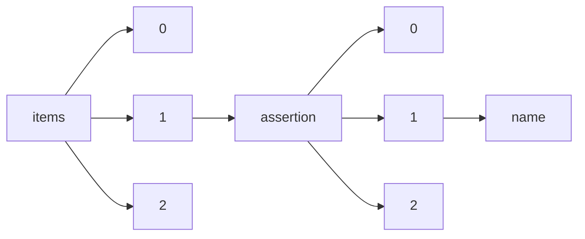

!!! warning "This document is not official Crossref documentation"
# Name
PATH = items/array/assertion/array/name(1)  
Occurs 72 763 337 times  
Unique values: > 999  
{ .annotate }

1. A route to an element, for example:  
   The route "items/array/assertion/array/name" corresponds to navigating through the JSON indices as  
   ["items"][0]["assertion"][0]["name"]  

!!! note "Due to current limitations, only the first 1,000 unique values are counted."

| **Row** | **Value** `String`                            | **Count** `Int64` |
|--------:|-------------------------------------------------:|---------------------:|
| **1**   | copyright                                        | 6 371 432            |
| **2**   | content\_type                                    | 6 218 930            |
| **3**   | publisher                                        | 6 071 329            |
| **4**   | articlelink                                      | 6 062 055            |
| **5**   | journaltitle                                     | 6 008 180            |
| **6**   | articletitle                                     | 6 006 773            |
| **7**   | first\_online                                    | 5 235 180            |
| **8**   | received                                         | 4 265 896            |
| **9**   | accepted                                         | 4 158 618            |
| **10**  | Ethics                                           | 3 488 113            |
| **11**  | published                                        | 3 322 217            |
| **12**  | peerreview\_statement                            | 1 388 321            |
| **13**  | aims\_and\_scope\_url                            | 1 388 320            |
| **14**  | revised                                          | 791 409              |
| **15**  | journal\_title                                   | 611 753              |
| **16**  | article\_title                                   | 610 671              |
| **17**  | article\_type                                    | 605 323              |
| **18**  | copyright\_information                           | 605 317              |
| **19**  | date\_epub                                       | 605 316              |
| **20**  | date\_received                                   | 604 697              |
| **21**  | date\_accepted                                   | 603 950              |
| **22**  | identifier                                       | 513 989              |
| **23**  | license                                          | 286 329              |
| **24**  | conference\_name                                 | 286 240              |
| **25**  | conference\_acronym                              | 286 185              |
| **26**  | conference\_start\_date                          | 286 185              |
| **27**  | conference\_year                                 | 286 185              |
| **28**  | conference\_id                                   | 286 185              |
| **29**  | conference\_end\_date                            | 286 040              |
| **30**  | history                                          | 278 250              |
| **31**  | free                                             | 267 999              |
| **32**  | conference\_city                                 | 250 014              |
| **33**  | conference\_country                              | 249 370              |
| **34**  | similarity\_check                                | 240 611              |
| **35**  | conference\_url                                  | 239 023              |
| **36**  | peer\_review\_method                             | 235 772              |
| **37**  | related\_data                                    | 234 490              |
| **38**  | associatedlink                                   | 226 380              |
| **39**  | published\_online                                | 217 307              |
| **40**  | copyright\_licence                               | 215 588              |
| **41**  | review\_process                                  | 200 120              |
| **42**  | peer\_reviewed                                   | 199 232              |
| **43**  | conference\_number                               | 187 768              |
| **44**  | journal                                          | 111 888              |
| **45**  | acceptance\_rate\_of\_full\_papers               | 98 873               |
| **46**  | type                                             | 98 873               |
| **47**  | number\_of\_submissions\_sent\_for\_review       | 98 873               |
| **48**  | conference\_management\_system                   | 98 873               |
| **49**  | number\_of\_full\_papers\_accepted               | 98 873               |
| **50**  | average\_number\_of\_reviews\_per\_paper         | 98 766               |
| **51**  | change\_details                                  | 96 516               |
| **52**  | number\_of\_short\_papers\_accepted              | 95 013               |
| **53**  | external\_reviewers\_involved                    | 95 013               |
| **54**  | the\_journal                                     | 94 523               |
| **55**  | average\_number\_of\_papers\_per\_reviewer       | 91 608               |
| **56**  | change\_type                                     | 67 492               |
| **57**  | change\_date                                     | 67 492               |
| **58**  | synapse                                          | 66 695               |
| **59**  | supplementary\_materials                         | 62 665               |
| **60**  | cross\_check                                     | 58 525               |
| **61**  | review\_status                                   | 46 360               |
| **62**  | screening\_status                                | 46 359               |
| **63**  | crosscheck                                       | 37 617               |
| **64**  | article\_metrics                                 | 35 919               |
| **65**  | additional\_info\_on\_review\_process            | 34 358               |
| **66**  | orcid                                            | 23 065               |
| **67**  | grant-information                                | 17 524               |
| **68**  | referee-status                                   | 17 023               |
| **69**  | copyright-info                                   | 17 018               |
| **70**  | related\_article                                 | 15 992               |
| **71**  | journal\_publisher                               | 15 798               |
| **72**  | journal\_owner                                   | 15 798               |
| **73**  | crosschecked                                     | 14 715               |
| **74**  | this\_article\_is\_maintained\_by                | 11 413               |
| **75**  | import                                           | 10 968               |
| **76**  | author                                           | 10 418               |
| **77**  | license\_information                             | 10 314               |
| **78**  | published\_print                                 | 4 950                |
| **79**  | contact\_person\_for\_queries                    | 3 860                |
| **80**  | post\_publication\_commenting                    | 3 795                |
| **81**  | peer\_review\_published                          | 3 795                |
| **82**  | peer\_review\_transparency                       | 3 795                |
| **83**  | peer\_review\_interaction                        | 3 795                |
| **84**  | Peer\_Reviewed                                   | 1 864                |
| **85**  | Review\_Process                                  | 1 864                |
| **86**  | licensing                                        | 1 297                |
| **87**  | name                                             | 1 168                |
| **88**  | Maintenance                                      | 1 130                |
| **89**  | DOI                                              | 938                  |
| **90**  | Copyright                                        | 938                  |
| **91**  | Title                                            | 938                  |
| **92**  | Source                                           | 937                  |
| **93**  | Type                                             | 937                  |
| **94**  | peer\_review\_statement                          | 798                  |
| **95**  | copyright\_statement                             | 753                  |
| **96**  | Declaration                                      | 749                  |
| **97**  | recevied                                         | 623                  |
| **98**  | submitted                                        | 568                  |
| **99**  | ethics                                           | 515                  |
| **100** | conflict\_interest                               | 500                  |
| **101** | peer\_review\_type                               | 488                  |
| **102** | accepted\_for\_publication                       | 448                  |
| **103** | editorial\_review\_begun                         | 446                  |
| **104** | online                                           | 442                  |
| **105** | contractual\_start\_date                         | 414                  |
| **106** | funding                                          | 399                  |
| **107** | publication\_history                             | 369                  |
| **108** | CrossRef\_DOI\_link                              | 357                  |
| **109** | terms\_and\_conditions                           | 356                  |
| **110** | rights                                           | 354                  |
| **111** | competing\_interests                             | 293                  |
| **112** | peer\_review\_policy                             | 249                  |
| **113** | final\_revised                                   | 239                  |
| **114** | Submitted                                        | 238                  |
| **115** | crossmarked                                      | 209                  |
| **116** | funding\_and\_licenses                           | 208                  |
| **117** | presented                                        | 203                  |
| **118** | supplementary\_material                          | 200                  |
| **119** | scale\_of\_mistake                               | 188                  |
| **120** | Information                                      | 183                  |
| **121** | corrected                                        | 178                  |
| **122** | edited                                           | 158                  |
| **123** | Accepted                                         | 146                  |
| **124** | articleinfo                                      | 144                  |
| **125** | peer                                             | 140                  |
| **126** | peerreviewed                                     | 134                  |
| **127** | Maitenance                                       | 133                  |
| **128** | Published                                        | 129                  |
| **129** | isbn\_online                                     | 112                  |
| **130** | book\_title                                      | 112                  |
| **131** | enhanced\_version\_of\_record                    | 103                  |
| **132** | resubmitted                                      | 85                   |
| **133** | citation\_keywords                               | 79                   |
| **134** | Revised                                          | 76                   |
| **135** | catatan\_penerbit                                | 71                   |
| **136** | author1                                          | 68                   |
| **137** | licence                                          | 67                   |
| **138** | isbn                                             | 60                   |
| **139** | conference\_date                                 | 55                   |
| **140** | internet\_archive                                | 50                   |
| **141** | reviewed                                         | 47                   |
| **142** | type\_of\_article                                | 39                   |
| **143** | Reviewed                                         | 37                   |
| **144** | submission                                       | 37                   |
| **145** | available\_online                                | 34                   |
| **146** | date\_of\_ERG\_submission                        | 32                   |
| **147** | correction                                       | 31                   |
| **148** | Received                                         | 29                   |
| **149** | Change\_date                                     | 27                   |
| **150** | supplementary\_Material                          | 23                   |
| **151** | erratum                                          | 20                   |
| **152** | funder\_name                                     | 17                   |
| **153** | funder\_identifier                               | 17                   |
| **154** | full\_article                                    | 15                   |
| **155** | pubcorrected                                     | 14                   |
| **156** | Change\_type                                     | 14                   |
| **157** | pendanaan                                        | 14                   |
| **158** | kontribusi\_penulis                              | 12                   |
| **159** | Change\_details                                  | 12                   |
| **160** | nla\_archive                                     | 11                   |
| **161** | funding\_percentage                              | 11                   |
| **162** | referee-comment-3186                             | 10                   |
| **163** | referee-comment-3336                             | 10                   |
| **164** | referee-comment-3150                             | 10                   |
| **165** | author2                                          | 10                   |
| **166** | ir\_archive                                      | 9                    |
| **167** | pkp\_pn\_archive                                 | 9                    |
| **168** | content\_digitized                               | 9                    |
| **169** | referee-comment-3207                             | 8                    |
| **170** | referee-comment-3192                             | 8                    |
| **171** | referee-comment-3317                             | 8                    |
| **172** | referee-comment-3183                             | 8                    |
| **173** | referee-comment-3189                             | 8                    |
| **174** | referee-comment-3214                             | 8                    |
| **175** | journal\_name                                    | 8                    |
| **176** | referee-comment-3156                             | 8                    |
| **177** | referee-comment-3212                             | 8                    |
| **178** | journal\_Publisher                               | 8                    |
| **179** | journal\_Owner                                   | 8                    |
| **180** | referee-comment-3102                             | 8                    |
| **181** | referee-comment-4446                             | 8                    |
| **182** | konflik\_kepentingan                             | 7                    |
| **183** | referee-comment-3233                             | 7                    |
| **184** | author\_contribution                             | 7                    |
| **185** | referee-comment-3072                             | 7                    |
| **186** | referee-comment-3164                             | 7                    |
| **187** | referee-comment-3220                             | 7                    |
| **188** | additional\_information.                         | 7                    |
| **189** | referee-comment-3221                             | 7                    |
| **190** | referee-comment-3086                             | 7                    |
| **191** | berbagi\_data                                    | 7                    |
| **192** | referee-comment-3208                             | 7                    |
| **193** | referee-comment-3124                             | 7                    |
| **194** | funding\_statement                               | 7                    |
| **195** | referee-comment-3539                             | 6                    |
| **196** | referee-comment-3188                             | 6                    |
| **197** | referee-response-27576                           | 6                    |
| **198** | referee-response-29359                           | 6                    |
| **199** | referee-comment-3429                             | 6                    |
| **200** | referee-response-27461                           | 6                    |
| **201** | referee-comment-3101                             | 6                    |
| **202** | referee-response-26908                           | 6                    |
| **203** | referee-comment-3375                             | 6                    |
| **204** | referee-comment-3155                             | 6                    |
| **205** | referee-comment-3100                             | 6                    |
| **206** | referee-comment-3424                             | 6                    |
| **207** | referee-comment-3488                             | 6                    |
| **208** | Aaccepted                                        | 6                    |
| **209** | referee-response-26337                           | 6                    |
| **210** | Erratum                                          | 6                    |
| **211** | referee-comment-3149                             | 6                    |
| **212** | referee-comment-3190                             | 6                    |
| **213** | referee-comment-3342                             | 6                    |
| **214** | referee-comment-3400                             | 5                    |
| **215** | referee-response-29592                           | 5                    |
| **216** | citation\_author                                 | 5                    |
| **217** | referee-response-29737                           | 5                    |
| **218** | referee-comment-3380                             | 5                    |
| **219** | referee-response-27383                           | 5                    |
| **220** | edit\_volume\_number                             | 5                    |
| **221** | referee-comment-3325                             | 5                    |
| **222** | referee-response-26938                           | 5                    |
| **223** | referee-response-29467                           | 5                    |
| **224** | referee-response-27048                           | 5                    |
| **225** | referee-comment-3419                             | 5                    |
| **226** | referee-response-19560                           | 5                    |
| **227** | referee-response-26555                           | 5                    |
| **228** | referee-response-26761                           | 5                    |
| **229** | referee-comment-3284                             | 5                    |
| **230** | referee-response-27201                           | 5                    |
| **231** | referee-comment-3362                             | 5                    |
| **232** | referee-response-26599                           | 5                    |
| **233** | referee-response-29463                           | 5                    |
| **234** | referee-response-29740                           | 5                    |
| **235** | referee-response-27389                           | 5                    |
| **236** | referee-comment-4206                             | 5                    |
| **237** | referee-response-27043                           | 5                    |
| **238** | doab                                             | 5                    |
| **239** | referee-comment-3202                             | 5                    |
| **240** | referee-comment-3166                             | 5                    |
| **241** | referee-comment-3099                             | 5                    |
| **242** | editor                                           | 5                    |
| **243** | referee-comment-4562                             | 4                    |
| **244** | referee-comment-4948                             | 4                    |
| **245** | referee-response-53455                           | 4                    |
| **246** | referee-response-26621                           | 4                    |
| **247** | referee-response-29598                           | 4                    |
| **248** | referee-response-28765                           | 4                    |
| **249** | referee-response-28666                           | 4                    |
| **250** | referee-response-27343                           | 4                    |
| **251** | referee-response-29101                           | 4                    |
| **252** | referee-response-27766                           | 4                    |
| **253** | referee-comment-4845                             | 4                    |
| **254** | referee-response-27888                           | 4                    |
| **255** | referee-response-28819                           | 4                    |
| **256** | referee-comment-4904                             | 4                    |
| **257** | referee-comment-3074                             | 4                    |
| **258** | referee-response-35502                           | 4                    |
| **259** | referee-response-27013                           | 4                    |
| **260** | referee-response-27572                           | 4                    |
| **261** | referee-response-30804                           | 4                    |
| **262** | referee-response-55259                           | 4                    |
| **263** | referee-response-27903                           | 4                    |
| **264** | referee-comment-5046                             | 4                    |
| **265** | referee-comment-3154                             | 4                    |
| **266** | referee-comment-3087                             | 4                    |
| **267** | referee-response-27360                           | 4                    |
| **268** | referee-comment-3298                             | 4                    |
| **269** | referee-comment-3092                             | 4                    |
| **270** | referee-comment-3341                             | 4                    |
| **271** | referee-comment-3075                             | 4                    |
| **272** | publication\_year\_correction\_on\_online\_print | 4                    |
| **273** | editorial                                        | 4                    |
| **274** | referee-comment-3366                             | 4                    |
| **275** | referee-comment-3593                             | 4                    |
| **276** | referee-comment-4363                             | 4                    |
| **277** | referee-comment-3327                             | 4                    |
| **278** | referee-comment-1363                             | 4                    |
| **279** | referee-response-47253                           | 4                    |
| **280** | referee-response-32116                           | 4                    |
| **281** | referee-comment-3954                             | 4                    |
| **282** | referee-response-27601                           | 4                    |
| **283** | referee-response-26990                           | 4                    |
| **284** | referee-comment-5068                             | 4                    |
| **285** | referee-response-27364                           | 4                    |
| **286** | referee-comment-3056                             | 4                    |
| **287** | referee-response-27575                           | 4                    |
| **288** | referee-comment-3152                             | 4                    |
| **289** | referee-response-27478                           | 4                    |
| **290** | referee-comment-3297                             | 4                    |
| **291** | referee-comment-3135                             | 4                    |
| **292** | referee-comment-3195                             | 4                    |
| **293** | description\_of\_quality\_control\_system        | 4                    |
| **294** | change\_to\_page\_numbers                        | 4                    |
| **295** | referee-response-24993                           | 4                    |
| **296** | referee-comment-3904                             | 4                    |
| **297** | referee-comment-3219                             | 4                    |
| **298** | referee-comment-3148                             | 4                    |
| **299** | referee-comment-3352                             | 4                    |
| **300** | referee-comment-3331                             | 4                    |
| **301** | referee-comment-3259                             | 4                    |
| **302** | referee-response-30732                           | 4                    |
| **303** | referee-comment-3093                             | 4                    |
| **304** | referee-comment-3410                             | 4                    |
| **305** | referee-response-26850                           | 4                    |
| **306** | referee-response-28626                           | 4                    |
| **307** | referee-comment-3082                             | 4                    |
| **308** | referee-comment-3109                             | 4                    |
| **309** | referee-comment-4304                             | 4                    |
| **310** | referee-comment-3227                             | 4                    |
| **311** | referee-response-8583                            | 4                    |
| **312** | referee-comment-5324                             | 4                    |
| **313** | reviewing\_process                               | 4                    |
| **314** | referee-response-26586                           | 4                    |
| **315** | referee-comment-3090                             | 4                    |
| **316** | referee-comment-3250                             | 4                    |
| **317** | referee-comment-4090                             | 4                    |
| **318** | referee-comment-5701                             | 3                    |
| **319** | referee-response-26918                           | 3                    |
| **320** | referee-response-28491                           | 3                    |
| **321** | referee-comment-3607                             | 3                    |
| **322** | referee-comment-8305                             | 3                    |
| **323** | referee-response-28752                           | 3                    |
| **324** | referee-comment-6025                             | 3                    |
| **325** | referee-response-28851                           | 3                    |
| **326** | referee-comment-3902                             | 3                    |
| **327** | referee-response-9419                            | 3                    |
| **328** | referee-response-24031                           | 3                    |
| **329** | referee-response-28559                           | 3                    |
| **330** | referee-response-26512                           | 3                    |
| **331** | referee-response-29689                           | 3                    |
| **332** | referee-response-50161                           | 3                    |
| **333** | referee-response-27822                           | 3                    |
| **334** | referee-comment-3867                             | 3                    |
| **335** | referee-response-29028                           | 3                    |
| **336** | referee-response-8933                            | 3                    |
| **337** | referee-comment-3952                             | 3                    |
| **338** | referee-response-130205                          | 3                    |
| **339** | referee-response-29271                           | 3                    |
| **340** | referee-response-27408                           | 3                    |
| **341** | referee-comment-4047                             | 3                    |
| **342** | referee-response-29800                           | 3                    |
| **343** | referee-response-28427                           | 3                    |
| **344** | referee-response-27616                           | 3                    |
| **345** | referee-response-26158                           | 3                    |
| **346** | referee-response-79798                           | 3                    |
| **347** | referee-response-35662                           | 3                    |
| **348** | referee-response-29441                           | 3                    |
| **349** | referee-response-91751                           | 3                    |
| **350** | referee-comment-8373                             | 3                    |
| **351** | referee-response-26456                           | 3                    |
| **352** | referee-response-97319                           | 3                    |
| **353** | referee-response-28570                           | 3                    |
| **354** | referee-response-28256                           | 3                    |
| **355** | referee-comment-4430                             | 3                    |
| **356** | referee-response-28372                           | 3                    |
| **357** | referee-response-2228                            | 3                    |
| **358** | referee-response-28470                           | 3                    |
| **359** | referee-comment-4899                             | 3                    |
| **360** | referee-response-75572                           | 3                    |
| **361** | referee-response-28097                           | 3                    |
| **362** | referee-response-27803                           | 3                    |
| **363** | referee-comment-3329                             | 3                    |
| **364** | referee-response-54867                           | 3                    |
| **365** | referee-response-35515                           | 3                    |
| **366** | referee-response-23949                           | 3                    |
| **367** | referee-response-31709                           | 3                    |
| **368** | referee-response-29473                           | 3                    |
| **369** | referee-response-28503                           | 3                    |
| **370** | referee-comment-3070                             | 3                    |
| **371** | referee-response-26182                           | 3                    |
| **372** | referee-response-29875                           | 3                    |
| **373** | referee-comment-4368                             | 3                    |
| **374** | referee-comment-6242                             | 3                    |
| **375** | referee-comment-3425                             | 3                    |
| **376** | referee-response-40062                           | 3                    |
| **377** | referee-comment-3314                             | 3                    |
| **378** | referee-response-28376                           | 3                    |
| **379** | referee-response-30561                           | 3                    |
| **380** | referee-response-41873                           | 3                    |
| **381** | referee-response-31371                           | 3                    |
| **382** | referee-response-148319                          | 3                    |
| **383** | referee-response-8216                            | 3                    |
| **384** | referee-comment-4502                             | 3                    |
| **385** | referee-response-26160                           | 3                    |
| **386** | referee-response-27987                           | 3                    |
| **387** | referee-response-27448                           | 3                    |
| **388** | referee-comment-3345                             | 3                    |
| **389** | referee-response-27393                           | 3                    |
| **390** | referee-comment-3556                             | 3                    |
| **391** | referee-comment-3228                             | 3                    |
| **392** | referee-response-28476                           | 3                    |
| **393** | referee-response-41885                           | 3                    |
| **394** | referee-comment-1750                             | 3                    |
| **395** | referee-response-30820                           | 3                    |
| **396** | referee-response-28143                           | 3                    |
| **397** | referee-response-48437                           | 3                    |
| **398** | referee-response-137614                          | 3                    |
| **399** | referee-response-51679                           | 3                    |
| **400** | referee-response-31369                           | 3                    |
| **401** | referee-response-30074                           | 3                    |
| **402** | referee-response-31004                           | 3                    |
| **403** | referee-response-27225                           | 3                    |
| **404** | referee-response-29125                           | 3                    |
| **405** | referee-response-27206                           | 3                    |
| **406** | referee-comment-3465                             | 3                    |
| **407** | referee-response-35657                           | 3                    |
| **408** | referee-response-29817                           | 3                    |
| **409** | referee-response-29570                           | 3                    |
| **410** | referee-comment-3089                             | 3                    |
| **411** | referee-comment-3594                             | 3                    |
| **412** | referee-comment-4820                             | 3                    |
| **413** | referee-response-26803                           | 3                    |
| **414** | referee-comment-1084                             | 3                    |
| **415** | referee-response-43569                           | 3                    |
| **416** | referee-response-30007                           | 3                    |
| **417** | referee-comment-4320                             | 3                    |
| **418** | referee-response-27304                           | 3                    |
| **419** | referee-comment-3531                             | 3                    |
| **420** | referee-response-47861                           | 3                    |
| **421** | referee-comment-3699                             | 3                    |
| **422** | referee-comment-3564                             | 3                    |
| **423** | referee-response-139343                          | 3                    |
| **424** | referee-response-27472                           | 3                    |
| **425** | referee-comment-3584                             | 3                    |
| **426** | referee-response-29639                           | 3                    |
| **427** | referee-response-30324                           | 3                    |
| **428** | referee-comment-3194                             | 3                    |
| **429** | referee-response-40445                           | 3                    |
| **430** | referee-comment-3185                             | 3                    |
| **431** | oa\_publication\_grant                           | 3                    |
| **432** | referee-comment-3417                             | 3                    |
| **433** | referee-comment-3168                             | 3                    |
| **434** | referee-comment-4093                             | 3                    |
| **435** | referee-comment-3130                             | 3                    |
| **436** | referee-response-30940                           | 3                    |
| **437** | referee-response-27977                           | 3                    |
| **438** | referee-comment-3389                             | 3                    |
| **439** | referee-comment-3108                             | 3                    |
| **440** | referee-comment-5191                             | 3                    |
| **441** | referee-response-32202                           | 3                    |
| **442** | referee-comment-3062                             | 3                    |
| **443** | referee-comment-3247                             | 3                    |
| **444** | referee-comment-3864                             | 3                    |
| **445** | referee-comment-3178                             | 3                    |
| **446** | referee-comment-4267                             | 3                    |
| **447** | referee-response-28357                           | 3                    |
| **448** | referee-comment-4362                             | 3                    |
| **449** | referee-response-34743                           | 3                    |
| **450** | referee-response-35299                           | 3                    |
| **451** | referee-response-39379                           | 3                    |
| **452** | referee-comment-3061                             | 3                    |
| **453** | referee-response-27064                           | 3                    |
| **454** | referee-response-35298                           | 3                    |
| **455** | referee-response-41872                           | 3                    |
| **456** | referee-response-39255                           | 3                    |
| **457** | referee-comment-4284                             | 3                    |
| **458** | referee-comment-3209                             | 3                    |
| **459** | referee-comment-3095                             | 3                    |
| **460** | referee-response-38354                           | 3                    |
| **461** | peer\_review                                     | 3                    |
| **462** | referee-response-26698                           | 3                    |
| **463** | referee-response-27462                           | 3                    |
| **464** | online\_first                                    | 3                    |
| **465** | referee-response-29196                           | 2                    |
| **466** | referee-response-29465                           | 2                    |
| **467** | referee-comment-4031                             | 2                    |
| **468** | referee-comment-9078                             | 2                    |
| **469** | referee-comment-5350                             | 2                    |
| **470** | referee-response-29202                           | 2                    |
| **471** | referee-response-93428                           | 2                    |
| **472** | referee-response-115452                          | 2                    |
| **473** | referee-response-159904                          | 2                    |
| **474** | referee-response-27247                           | 2                    |
| **475** | referee-comment-5164                             | 2                    |
| **476** | referee-comment-7843                             | 2                    |
| **477** | referee-response-70069                           | 2                    |
| **478** | referee-response-3973                            | 2                    |
| **479** | referee-response-69216                           | 2                    |
| **480** | referee-comment-2878                             | 2                    |
| **481** | referee-response-11764                           | 2                    |
| **482** | referee-comment-8508                             | 2                    |
| **483** | referee-response-76096                           | 2                    |
| **484** | referee-response-47087                           | 2                    |
| **485** | referee-response-29218                           | 2                    |
| **486** | referee-response-127168                          | 2                    |
| **487** | referee-response-42902                           | 2                    |
| **488** | referee-response-8187                            | 2                    |
| **489** | referee-comment-2488                             | 2                    |
| **490** | referee-response-43563                           | 2                    |
| **491** | referee-response-7863                            | 2                    |
| **492** | referee-response-31396                           | 2                    |
| **493** | referee-response-27397                           | 2                    |
| **494** | referee-comment-3951                             | 2                    |
| **495** | referee-response-28128                           | 2                    |
| **496** | referee-comment-7675                             | 2                    |
| **497** | referee-response-35170                           | 2                    |
| **498** | referee-comment-6477                             | 2                    |
| **499** | referee-response-27425                           | 2                    |
| **500** | referee-comment-8424                             | 2                    |
| **501** | referee-response-30061                           | 2                    |
| **502** | referee-comment-4009                             | 2                    |
| **503** | referee-response-123133                          | 2                    |
| **504** | referee-response-30851                           | 2                    |
| **505** | referee-response-43487                           | 2                    |
| **506** | referee-response-70151                           | 2                    |
| **507** | referee-response-26832                           | 2                    |
| **508** | referee-response-46702                           | 2                    |
| **509** | referee-comment-5872                             | 2                    |
| **510** | referee-response-35816                           | 2                    |
| **511** | referee-comment-3483                             | 2                    |
| **512** | referee-response-82799                           | 2                    |
| **513** | referee-response-31188                           | 2                    |
| **514** | referee-response-26137                           | 2                    |
| **515** | referee-comment-3745                             | 2                    |
| **516** | referee-response-5650                            | 2                    |
| **517** | referee-response-54948                           | 2                    |
| **518** | citation\_title                                  | 2                    |
| **519** | referee-response-46160                           | 2                    |
| **520** | referee-response-26671                           | 2                    |
| **521** | referee-comment-6287                             | 2                    |
| **522** | referee-response-1846                            | 2                    |
| **523** | referee-response-27621                           | 2                    |
| **524** | referee-response-28545                           | 2                    |
| **525** | referee-comment-7309                             | 2                    |
| **526** | referee-response-25931                           | 2                    |
| **527** | referee-comment-4752                             | 2                    |
| **528** | referee-response-16025                           | 2                    |
| **529** | referee-response-96195                           | 2                    |
| **530** | referee-comment-3984                             | 2                    |
| **531** | referee-comment-8517                             | 2                    |
| **532** | referee-comment-9050                             | 2                    |
| **533** | referee-response-27345                           | 2                    |
| **534** | referee-response-96164                           | 2                    |
| **535** | referee-response-38261                           | 2                    |
| **536** | referee-response-120732                          | 2                    |
| **537** | referee-response-83247                           | 2                    |
| **538** | referee-response-157009                          | 2                    |
| **539** | referee-response-28888                           | 2                    |
| **540** | referee-response-100017                          | 2                    |
| **541** | referee-comment-4522                             | 2                    |
| **542** | referee-response-81318                           | 2                    |
| **543** | referee-response-30676                           | 2                    |
| **544** | referee-comment-3065                             | 2                    |
| **545** | referee-response-29201                           | 2                    |
| **546** | referee-response-14439                           | 2                    |
| **547** | referee-response-11563                           | 2                    |
| **548** | referee-comment-4438                             | 2                    |
| **549** | referee-response-27908                           | 2                    |
| **550** | referee-comment-7011                             | 2                    |
| **551** | referee-response-4185                            | 2                    |
| **552** | referee-comment-4231                             | 2                    |
| **553** | referee-response-14571                           | 2                    |
| **554** | referee-comment-4605                             | 2                    |
| **555** | article-response-3074                            | 2                    |
| **556** | referee-response-35724                           | 2                    |
| **557** | referee-response-119613                          | 2                    |
| **558** | referee-response-36844                           | 2                    |
| **559** | referee-comment-7368                             | 2                    |
| **560** | referee-response-19237                           | 2                    |
| **561** | referee-comment-7886                             | 2                    |
| **562** | referee-response-49370                           | 2                    |
| **563** | referee-comment-2270                             | 2                    |
| **564** | referee-response-31123                           | 2                    |
| **565** | referee-response-32245                           | 2                    |
| **566** | referee-comment-3915                             | 2                    |
| **567** | referee-comment-6056                             | 2                    |
| **568** | referee-comment-7272                             | 2                    |
| **569** | referee-comment-8030                             | 2                    |
| **570** | referee-response-36129                           | 2                    |
| **571** | referee-comment-3858                             | 2                    |
| **572** | referee-comment-3036                             | 2                    |
| **573** | referee-comment-6260                             | 2                    |
| **574** | referee-comment-5337                             | 2                    |
| **575** | referee-response-62518                           | 2                    |
| **576** | referee-response-17222                           | 2                    |
| **577** | referee-response-72011                           | 2                    |
| **578** | referee-response-38540                           | 2                    |
| **579** | referee-comment-4959                             | 2                    |
| **580** | referee-response-30120                           | 2                    |
| **581** | referee-comment-6573                             | 2                    |
| **582** | referee-response-29216                           | 2                    |
| **583** | referee-comment-3943                             | 2                    |
| **584** | referee-comment-4399                             | 2                    |
| **585** | referee-comment-4488                             | 2                    |
| **586** | referee-comment-7012                             | 2                    |
| **587** | referee-response-42096                           | 2                    |
| **588** | referee-comment-3169                             | 2                    |
| **589** | referee-response-28934                           | 2                    |
| **590** | referee-response-27185                           | 2                    |
| **591** | referee-comment-4573                             | 2                    |
| **592** | referee-comment-4464                             | 2                    |
| **593** | referee-response-120976                          | 2                    |
| **594** | referee-comment-4323                             | 2                    |
| **595** | referee-comment-481                              | 2                    |
| **596** | referee-comment-4462                             | 2                    |
| **597** | referee-response-39209                           | 2                    |
| **598** | referee-comment-5475                             | 2                    |
| **599** | referee-comment-1237                             | 2                    |
| **600** | referee-response-63522                           | 2                    |
| **601** | referee-comment-3132                             | 2                    |
| **602** | referee-response-29862                           | 2                    |
| **603** | referee-response-30257                           | 2                    |
| **604** | adaptation                                       | 2                    |
| **605** | referee-response-27657                           | 2                    |
| **606** | referee-comment-3114                             | 2                    |
| **607** | referee-comment-4189                             | 2                    |
| **608** | referee-response-83592                           | 2                    |
| **609** | referee-response-17135                           | 2                    |
| **610** | referee-response-154016                          | 2                    |
| **611** | referee-comment-1738                             | 2                    |
| **612** | referee-comment-3273                             | 2                    |
| **613** | referee-response-27258                           | 2                    |
| **614** | referee-comment-4772                             | 2                    |
| **615** | referee-response-28591                           | 2                    |
| **616** | referee-response-67002                           | 2                    |
| **617** | referee-comment-4016                             | 2                    |
| **618** | referee-comment-4352                             | 2                    |
| **619** | referee-comment-7190                             | 2                    |
| **620** | referee-comment-3081                             | 2                    |
| **621** | referee-comment-4819                             | 2                    |
| **622** | referee-comment-3232                             | 2                    |
| **623** | referee-response-28106                           | 2                    |
| **624** | referee-comment-3979                             | 2                    |
| **625** | referee-response-89420                           | 2                    |
| **626** | referee-comment-4636                             | 2                    |
| **627** | referee-comment-2335                             | 2                    |
| **628** | citation\_firstpage                              | 2                    |
| **629** | referee-response-55187                           | 2                    |
| **630** | referee-comment-6732                             | 2                    |
| **631** | referee-comment-3376                             | 2                    |
| **632** | referee-comment-3125                             | 2                    |
| **633** | referee-response-19434                           | 2                    |
| **634** | citation\_issue                                  | 2                    |
| **635** | referee-response-6694                            | 2                    |
| **636** | referee-response-27370                           | 2                    |
| **637** | referee-comment-8937                             | 2                    |
| **638** | referee-response-20080                           | 2                    |
| **639** | referee-response-15991                           | 2                    |
| **640** | referee-comment-1124                             | 2                    |
| **641** | referee-response-54922                           | 2                    |
| **642** | referee-response-7236                            | 2                    |
| **643** | referee-response-28455                           | 2                    |
| **644** | referee-comment-4508                             | 2                    |
| **645** | referee-comment-3306                             | 2                    |
| **646** | referee-response-151597                          | 2                    |
| **647** | referee-response-26673                           | 2                    |
| **648** | referee-response-26325                           | 2                    |
| **649** | referee-comment-4487                             | 2                    |
| **650** | referee-response-28134                           | 2                    |
| **651** | referee-response-28813                           | 2                    |
| **652** | referee-comment-5699                             | 2                    |
| **653** | referee-response-38539                           | 2                    |
| **654** | referee-response-26602                           | 2                    |
| **655** | referee-response-64153                           | 2                    |
| **656** | referee-comment-3862                             | 2                    |
| **657** | referee-comment-7202                             | 2                    |
| **658** | referee-response-38676                           | 2                    |
| **659** | referee-comment-1905                             | 2                    |
| **660** | referee-response-27256                           | 2                    |
| **661** | referee-comment-3641                             | 2                    |
| **662** | referee-response-30543                           | 2                    |
| **663** | referee-comment-3105                             | 2                    |
| **664** | referee-response-49168                           | 2                    |
| **665** | referee-response-28577                           | 2                    |
| **666** | referee-response-27706                           | 2                    |
| **667** | referee-comment-4375                             | 2                    |
| **668** | referee-comment-4534                             | 2                    |
| **669** | referee-response-9015                            | 2                    |
| **670** | referee-comment-6463                             | 2                    |
| **671** | referee-comment-5043                             | 2                    |
| **672** | referee-response-28046                           | 2                    |
| **673** | referee-response-30526                           | 2                    |
| **674** | referee-response-6948                            | 2                    |
| **675** | referee-response-28558                           | 2                    |
| **676** | Seydi                                            | 2                    |
| **677** | research\_grant                                  | 2                    |
| **678** | referee-response-36292                           | 2                    |
| **679** | referee-response-42019                           | 2                    |
| **680** | referee-response-38881                           | 2                    |
| **681** | referee-response-35333                           | 2                    |
| **682** | referee-comment-3501                             | 2                    |
| **683** | referee-response-69215                           | 2                    |
| **684** | referee-comment-3787                             | 2                    |
| **685** | referee-comment-3527                             | 2                    |
| **686** | referee-response-50237                           | 2                    |
| **687** | referee-response-40887                           | 2                    |
| **688** | referee-comment-4037                             | 2                    |
| **689** | referee-response-87441                           | 2                    |
| **690** | referee-response-30840                           | 2                    |
| **691** | referee-comment-2959                             | 2                    |
| **692** | referee-response-26502                           | 2                    |
| **693** | referee-comment-3448                             | 2                    |
| **694** | referee-response-82935                           | 2                    |
| **695** | referee-comment-1902                             | 2                    |
| **696** | referee-response-26300                           | 2                    |
| **697** | referee-comment-3804                             | 2                    |
| **698** | referee-comment-3726                             | 2                    |
| **699** | referee-response-10563                           | 2                    |
| **700** | referee-response-18600                           | 2                    |
| **701** | referee-response-73671                           | 2                    |
| **702** | referee-response-28605                           | 2                    |
| **703** | referee-response-93857                           | 2                    |
| **704** | referee-response-28822                           | 2                    |
| **705** | referee-response-42069                           | 2                    |
| **706** | referee-comment-4012                             | 2                    |
| **707** | referee-comment-8009                             | 2                    |
| **708** | referee-comment-3282                             | 2                    |
| **709** | referee-comment-3551                             | 2                    |
| **710** | referee-response-14437                           | 2                    |
| **711** | referee-comment-6164                             | 2                    |
| **712** | referee-comment-1698                             | 2                    |
| **713** | referee-response-26099                           | 2                    |
| **714** | referee-response-71675                           | 2                    |
| **715** | referee-comment-3136                             | 2                    |
| **716** | referee-response-27840                           | 2                    |
| **717** | citation\_language                               | 2                    |
| **718** | referee-comment-1794                             | 2                    |
| **719** | referee-comment-3050                             | 2                    |
| **720** | referee-response-33919                           | 2                    |
| **721** | referee-comment-3308                             | 2                    |
| **722** | referee-comment-3088                             | 2                    |
| **723** | referee-response-38016                           | 2                    |
| **724** | referee-response-27000                           | 2                    |
| **725** | referee-comment-4300                             | 2                    |
| **726** | referee-response-50152                           | 2                    |
| **727** | referee-comment-3051                             | 2                    |
| **728** | referee-comment-3474                             | 2                    |
| **729** | referee-comment-5665                             | 2                    |
| **730** | referee-response-58610                           | 2                    |
| **731** | citation\_publisher                              | 2                    |
| **732** | referee-comment-2417                             | 2                    |
| **733** | referee-response-38311                           | 2                    |
| **734** | referee-response-38348                           | 2                    |
| **735** | referee-comment-2245                             | 2                    |
| **736** | referee-response-27647                           | 2                    |
| **737** | referee-comment-2058                             | 2                    |
| **738** | referee-comment-4597                             | 2                    |
| **739** | referee-comment-3200                             | 2                    |
| **740** | referee-comment-3193                             | 2                    |
| **741** | referee-response-28017                           | 2                    |
| **742** | referee-response-26753                           | 2                    |
| **743** | crossbred                                        | 2                    |
| **744** | referee-response-19182                           | 2                    |
| **745** | referee-response-42945                           | 2                    |
| **746** | referee-response-26951                           | 2                    |
| **747** | referee-comment-3882                             | 2                    |
| **748** | referee-comment-3251                             | 2                    |
| **749** | referee-response-29001                           | 2                    |
| **750** | referee-response-69198                           | 2                    |
| **751** | referee-response-98032                           | 2                    |
| **752** | referee-response-30796                           | 2                    |
| **753** | referee-comment-4079                             | 2                    |
| **754** | referee-response-34348                           | 2                    |
| **755** | referee-comment-9485                             | 2                    |
| **756** | referee-comment-6074                             | 2                    |
| **757** | referee-comment-5244                             | 2                    |
| **758** | referee-response-30422                           | 2                    |
| **759** | referee-response-146326                          | 2                    |
| **760** | referee-response-87698                           | 2                    |
| **761** | referee-response-26179                           | 2                    |
| **762** | referee-response-4253                            | 2                    |
| **763** | referee-response-152650                          | 2                    |
| **764** | referee-response-30242                           | 2                    |
| **765** | referee-response-46523                           | 2                    |
| **766** | referee-response-43488                           | 2                    |
| **767** | referee-comment-5455                             | 2                    |
| **768** | referee-response-41033                           | 2                    |
| **769** | referee-response-29149                           | 2                    |
| **770** | referee-response-29309                           | 2                    |
| **771** | referee-comment-6729                             | 2                    |
| **772** | referee-comment-6193                             | 2                    |
| **773** | referee-response-30913                           | 2                    |
| **774** | referee-response-7546                            | 2                    |
| **775** | referee-response-55480                           | 2                    |
| **776** | referee-comment-5664                             | 2                    |
| **777** | referee-comment-4644                             | 2                    |
| **778** | referee-response-30701                           | 2                    |
| **779** | referee-response-44137                           | 2                    |
| **780** | referee-response-121895                          | 2                    |
| **781** | referee-response-29971                           | 2                    |
| **782** | referee-response-31373                           | 2                    |
| **783** | referee-response-38445                           | 2                    |
| **784** | referee-comment-4285                             | 2                    |
| **785** | referee-response-37546                           | 2                    |
| **786** | referee-response-41922                           | 2                    |
| **787** | referee-response-89419                           | 2                    |
| **788** | referee-response-42826                           | 2                    |
| **789** | referee-comment-5108                             | 2                    |
| **790** | referee-response-30870                           | 2                    |
| **791** | referee-response-18490                           | 2                    |
| **792** | referee-response-21433                           | 2                    |
| **793** | referee-response-28008                           | 2                    |
| **794** | referee-response-20033                           | 2                    |
| **795** | referee-response-46454                           | 2                    |
| **796** | referee-response-45869                           | 2                    |
| **797** | referee-response-29474                           | 2                    |
| **798** | referee-response-33322                           | 2                    |
| **799** | referee-response-27699                           | 2                    |
| **800** | referee-response-26569                           | 2                    |
| **801** | referee-response-28696                           | 2                    |
| **802** | referee-response-28689                           | 2                    |
| **803** | referee-comment-4509                             | 2                    |
| **804** | referee-response-31390                           | 2                    |
| **805** | referee-comment-7453                             | 2                    |
| **806** | referee-comment-2334                             | 2                    |
| **807** | referee-response-18843                           | 2                    |
| **808** | referee-response-28035                           | 2                    |
| **809** | referee-comment-8688                             | 2                    |
| **810** | referee-response-34299                           | 2                    |
| **811** | referee-comment-2032                             | 2                    |
| **812** | referee-comment-4105                             | 2                    |
| **813** | referee-response-29995                           | 2                    |
| **814** | referee-response-27836                           | 2                    |
| **815** | referee-response-28889                           | 2                    |
| **816** | referee-response-31701                           | 2                    |
| **817** | referee-response-27700                           | 2                    |
| **818** | referee-response-40487                           | 2                    |
| **819** | referee-response-26856                           | 2                    |
| **820** | referee-comment-7844                             | 2                    |
| **821** | referee-comment-6728                             | 2                    |
| **822** | referee-comment-3953                             | 2                    |
| **823** | referee-response-31075                           | 2                    |
| **824** | referee-response-86503                           | 2                    |
| **825** | referee-response-64005                           | 2                    |
| **826** | referee-response-2977                            | 2                    |
| **827** | referee-comment-1959                             | 2                    |
| **828** | referee-response-28029                           | 2                    |
| **829** | referee-response-27698                           | 2                    |
| **830** | referee-comment-3241                             | 2                    |
| **831** | referee-response-10995                           | 2                    |
| **832** | citation\_issn                                   | 2                    |
| **833** | referee-comment-7885                             | 2                    |
| **834** | referee-response-33000                           | 2                    |
| **835** | citation\_volume                                 | 2                    |
| **836** | referee-response-27659                           | 2                    |
| **837** | referee-comment-3256                             | 2                    |
| **838** | referee-response-32408                           | 2                    |
| **839** | referee-response-73226                           | 2                    |
| **840** | referee-comment-3323                             | 2                    |
| **841** | referee-response-29832                           | 2                    |
| **842** | referee-response-28016                           | 2                    |
| **843** | referee-response-27656                           | 2                    |
| **844** | referee-response-26613                           | 2                    |
| **845** | referee-response-125503                          | 2                    |
| **846** | referee-response-38418                           | 2                    |
| **847** | referee-response-17429                           | 2                    |
| **848** | referee-response-41730                           | 2                    |
| **849** | referee-comment-3360                             | 2                    |
| **850** | referee-response-29320                           | 2                    |
| **851** | referee-response-9697                            | 2                    |
| **852** | referee-comment-3191                             | 2                    |
| **853** | referee-response-27686                           | 2                    |
| **854** | referee-comment-6024                             | 2                    |
| **855** | referee-response-28526                           | 2                    |
| **856** | referee-response-39878                           | 2                    |
| **857** | referee-response-27148                           | 2                    |
| **858** | referee-comment-3378                             | 2                    |
| **859** | referee-response-28274                           | 2                    |
| **860** | referee-response-134659                          | 2                    |
| **861** | citation\_pdf\_url                               | 2                    |
| **862** | referee-response-40686                           | 2                    |
| **863** | referee-response-43518                           | 2                    |
| **864** | referee-response-32055                           | 2                    |
| **865** | referee-response-49137                           | 2                    |
| **866** | referee-comment-3334                             | 2                    |
| **867** | referee-response-73171                           | 2                    |
| **868** | referee-comment-4391                             | 2                    |
| **869** | referee-response-35172                           | 2                    |
| **870** | referee-response-1823                            | 2                    |
| **871** | referee-response-74583                           | 2                    |
| **872** | referee-response-26080                           | 2                    |
| **873** | referee-comment-3575                             | 2                    |
| **874** | referee-comment-5501                             | 2                    |
| **875** | referee-response-26950                           | 2                    |
| **876** | referee-comment-2578                             | 2                    |
| **877** | referee-response-27486                           | 2                    |
| **878** | referee-comment-4275                             | 2                    |
| **879** | referee-comment-2413                             | 2                    |
| **880** | referee-response-27210                           | 2                    |
| **881** | referee-response-27089                           | 2                    |
| **882** | referee-response-32416                           | 2                    |
| **883** | referee-response-28356                           | 2                    |
| **884** | referee-response-29414                           | 2                    |
| **885** | referee-response-45817                           | 2                    |
| **886** | referee-comment-3662                             | 2                    |
| **887** | referee-comment-3926                             | 2                    |
| **888** | referee-response-27395                           | 2                    |
| **889** | referee-response-7235                            | 2                    |
| **890** | referee-response-29946                           | 2                    |
| **891** | referee-comment-2828                             | 2                    |
| **892** | referee-comment-3795                             | 2                    |
| **893** | referee-comment-7681                             | 2                    |
| **894** | referee-response-41111                           | 2                    |
| **895** | referee-comment-6734                             | 2                    |
| **896** | referee-comment-3122                             | 2                    |
| **897** | referee-response-40348                           | 2                    |
| **898** | referee-comment-4265                             | 2                    |
| **899** | referee-comment-3399                             | 2                    |
| **900** | referee-response-55910                           | 2                    |
| **901** | referee-comment-3591                             | 2                    |
| **902** | referee-response-33727                           | 2                    |
| **903** | referee-response-29009                           | 2                    |
| **904** | referee-response-36335                           | 2                    |
| **905** | referee-response-26360                           | 2                    |
| **906** | referee-comment-4567                             | 2                    |
| **907** | referee-response-29255                           | 2                    |
| **908** | referee-response-47230                           | 2                    |
| **909** | referee-response-46099                           | 2                    |
| **910** | referee-comment-3162                             | 2                    |
| **911** | referee-response-26156                           | 2                    |
| **912** | referee-comment-3225                             | 2                    |
| **913** | referee-comment-4952                             | 2                    |
| **914** | referee-response-29460                           | 2                    |
| **915** | referee-response-26125                           | 2                    |
| **916** | referee-response-28841                           | 2                    |
| **917** | referee-response-7633                            | 2                    |
| **918** | referee-comment-4414                             | 2                    |
| **919** | referee-response-29264                           | 2                    |
| **920** | referee-response-27143                           | 2                    |
| **921** | production                                       | 2                    |
| **922** | referee-response-29230                           | 2                    |
| **923** | referee-response-10191                           | 2                    |
| **924** | referee-response-19829                           | 2                    |
| **925** | referee-comment-4162                             | 2                    |
| **926** | referee-response-34261                           | 2                    |
| **927** | referee-comment-6179                             | 2                    |
| **928** | referee-comment-4087                             | 2                    |
| **929** | referee-comment-3373                             | 2                    |
| **930** | referee-response-28457                           | 2                    |
| **931** | referee-comment-4695                             | 2                    |
| **932** | referee-comment-4203                             | 2                    |
| **933** | referee-response-26418                           | 2                    |
| **934** | referee-response-30195                           | 2                    |
| **935** | referee-comment-3471                             | 2                    |
| **936** | referee-comment-3146                             | 2                    |
| **937** | referee-response-22599                           | 2                    |
| **938** | referee-response-29273                           | 2                    |
| **939** | referee-comment-3475                             | 2                    |
| **940** | referee-response-9120                            | 2                    |
| **941** | referee-response-39685                           | 2                    |
| **942** | referee-response-20753                           | 2                    |
| **943** | referee-comment-2336                             | 2                    |
| **944** | referee-response-30927                           | 2                    |
| **945** | referee-comment-4944                             | 2                    |
| **946** | referee-comment-6742                             | 2                    |
| **947** | referee-response-26852                           | 2                    |
| **948** | referee-response-28595                           | 2                    |
| **949** | referee-response-26592                           | 2                    |
| **950** | referee-comment-6478                             | 2                    |
| **951** | referee-comment-3145                             | 2                    |
| **952** | referee-response-38239                           | 2                    |
| **953** | referee-response-30004                           | 2                    |
| **954** | referee-comment-5021                             | 2                    |
| **955** | referee-response-14570                           | 2                    |
| **956** | referee-response-27569                           | 2                    |
| **957** | referee-response-29620                           | 2                    |
| **958** | referee-response-6813                            | 2                    |
| **959** | referee-response-48576                           | 2                    |
| **960** | referee-response-38962                           | 2                    |
| **961** | referee-comment-3388                             | 2                    |
| **962** | referee-comment-1737                             | 2                    |
| **963** | referee-comment-883                              | 2                    |
| **964** | referee-response-29700                           | 2                    |
| **965** | referee-comment-3328                             | 2                    |
| **966** | referee-comment-3663                             | 2                    |
| **967** | referee-response-83589                           | 2                    |
| **968** | referee-response-29131                           | 2                    |
| **969** | referee-response-35849                           | 2                    |
| **970** | referee-response-44319                           | 2                    |
| **971** | referee-comment-3184                             | 2                    |
| **972** | referee-comment-2818                             | 2                    |
| **973** | referee-comment-3285                             | 2                    |
| **974** | referee-comment-3589                             | 2                    |
| **975** | referee-comment-3229                             | 2                    |
| **976** | referee-response-26796                           | 2                    |
| **977** | referee-comment-1746                             | 2                    |
| **978** | referee-comment-4196                             | 2                    |
| **979** | referee-response-65403                           | 2                    |
| **980** | referee-comment-7797                             | 2                    |
| **981** | referee-response-32741                           | 2                    |
| **982** | referee-response-20287                           | 2                    |
| **983** | referee-comment-4324                             | 2                    |
| **984** | referee-comment-4576                             | 2                    |
| **985** | referee-comment-3806                             | 2                    |
| **986** | referee-response-42696                           | 2                    |
| **987** | referee-comment-3196                             | 2                    |
| **988** | referee-comment-1234                             | 2                    |
| **989** | referee-comment-2352                             | 2                    |
| **990** | referee-response-32277                           | 2                    |
| **991** | referee-comment-4326                             | 2                    |
| **992** | referee-response-30374                           | 2                    |
| **993** | referee-comment-3503                             | 2                    |
| **994** | referee-response-36496                           | 2                    |
| **995** | referee-comment-2514                             | 2                    |
| **996** | referee-response-79238                           | 2                    |
| **997** | citation\_date                                   | 2                    |
| **998** | referee-response-28388                           | 2                    |
| **999** | referee-response-49712                           | 2                    |
| ... | ... | ... |

