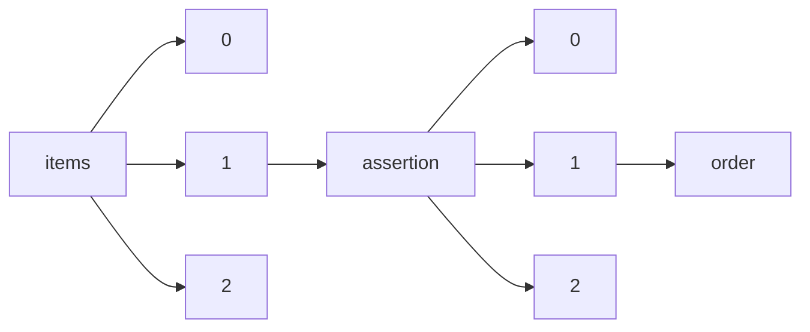

!!! warning "This document is not official Crossref documentation"
# Order
PATH = items/array/assertion/array/order(1)  
Occurs 29 167 980 times  
Unique values: 39  
{ .annotate }

1. A route to an element, for example:  
   The route "items/array/assertion/array/order" corresponds to navigating through the JSON indices as  
   ["items"][0]["assertion"][0]["order"]  

| **Row** | **Value** `Int64` | **Count** `Int64` |
|--------:|---------------------:|---------------------:|
| **1**   | 1                    | 10 488 562           |
| **2**   | 2                    | 8 278 364            |
| **3**   | 3                    | 4 278 855            |
| **4**   | 0                    | 2 537 910            |
| **5**   | 4                    | 1 187 736            |
| **6**   | 5                    | 532 130              |
| **7**   | 7                    | 422 910              |
| **8**   | 8                    | 388 377              |
| **9**   | 10                   | 318 168              |
| **10**  | 9                    | 289 309              |
| **11**  | 11                   | 239 536              |
| **12**  | 6                    | 189 449              |
| **13**  | 12                   | 4 127                |
| **14**  | 13                   | 3 986                |
| **15**  | 14                   | 3 945                |
| **16**  | 15                   | 3 294                |
| **17**  | 16                   | 1 180                |
| **18**  | 17                   | 25                   |
| **19**  | 18                   | 17                   |
| **20**  | 20                   | 13                   |
| **21**  | 19                   | 13                   |
| **22**  | 21                   | 12                   |
| **23**  | 22                   | 11                   |
| **24**  | 23                   | 7                    |
| **25**  | 30                   | 4                    |
| **26**  | 32                   | 4                    |
| **27**  | 31                   | 4                    |
| **28**  | 29                   | 4                    |
| **29**  | 24                   | 4                    |
| **30**  | 28                   | 4                    |
| **31**  | 25                   | 4                    |
| **32**  | 26                   | 4                    |
| **33**  | 27                   | 4                    |
| **34**  | 33                   | 2                    |
| **35**  | 34                   | 2                    |
| **36**  | 35                   | 1                    |
| **37**  | 38                   | 1                    |
| **38**  | 37                   | 1                    |
| **39**  | 36                   | 1                    |

