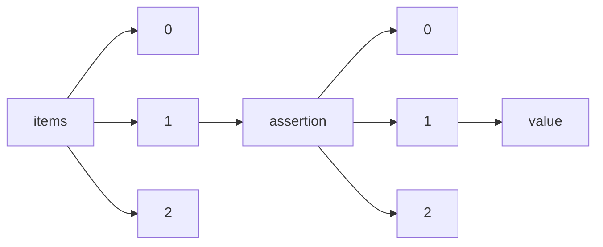

!!! warning "This document is not official Crossref documentation"
# Value
PATH = items/array/assertion/array/value(1)  
Occurs 70 729 061 times  
Unique values: > 999  
{ .annotate }

1. A route to an element, for example:  
   The route "items/array/assertion/array/value" corresponds to navigating through the JSON indices as  
   ["items"][0]["assertion"][0]["value"]  

!!! note "Due to current limitations, only the first 1,000 unique values are counted."

| **Row** | **Value** `String`                                                                                | **Count** `Int64` |
|--------:|-----------------------------------------------------------------------------------------------------:|---------------------:|
| **1**   | Elsevier                                                                                             | 6 002 842            |
| **2**   | article                                                                                              | 5 129 282            |
| **3**   | The publishing and review policy for this title is described in its Aims & Scope.                    | 1 387 435            |
| **4**   | simple-article                                                                                       | 819 865              |
| **5**   | paper                                                                                                | 587 532              |
| **6**   | Not applicable.                                                                                      | 327 496              |
| **7**   | The authors declare no competing interests.                                                          | 277 377              |
| **8**   | Single-blind                                                                                         | 268 549              |
| **9**   | This content has been made available to all.                                                         | 263 641              |
| **10**  | Yes                                                                                                  | 248 253              |
| **11**  | This document is Similarity Check deposited                                                          | 238 535              |
| **12**  | Published under licence by IOP Publishing Ltd                                                        | 224 226              |
| **13**  | Supplementary Information                                                                            | 202 223              |
| **14**  | The authors declare that they have no competing interests.                                           | 194 980              |
| **15**  | Single blind                                                                                         | 187 031              |
| **16**  | The authors declare that they have no conflict of interest.                                          | 185 498              |
| **17**  | © 2020 Elsevier B.V. All rights reserved.                                                            | 148 404              |
| **18**  | © 2020 Elsevier Ltd. All rights reserved.                                                            | 147 454              |
| **19**  | © 2021 Elsevier Ltd. All rights reserved.                                                            | 145 337              |
| **20**  | © 2022 Elsevier Ltd. All rights reserved.                                                            | 145 067              |
| **21**  | © 2021 Elsevier B.V. All rights reserved.                                                            | 140 850              |
| **22**  | © 2022 Elsevier B.V. All rights reserved.                                                            | 135 643              |
| **23**  | © 2019 Elsevier B.V. All rights reserved.                                                            | 135 368              |
| **24**  | © 2019 Elsevier Ltd. All rights reserved.                                                            | 133 190              |
| **25**  | © 2018 Elsevier B.V. All rights reserved.                                                            | 130 291              |
| **26**  | © 2018 Elsevier Ltd. All rights reserved.                                                            | 130 108              |
| **27**  | © 2017 Elsevier B.V. All rights reserved.                                                            | 125 594              |
| **28**  | The Royal Society of Chemistry has an exclusive publication licence for this journal                 | 123 701              |
| **29**  | © 2017 Elsevier Ltd. All rights reserved.                                                            | 121 206              |
| **30**  | 20 June 2017                                                                                         | 108 319              |
| **31**  | Copyright © 2015 Elsevier B.V. All rights reserved.                                                  | 105 736              |
| **32**  | Copyright © 2015 Elsevier Ltd. All rights reserved.                                                  | 105 607              |
| **33**  | Copyright © 2014 Elsevier B.V. All rights reserved.                                                  | 105 461              |
| **34**  | Copyright © 2014 Elsevier Ltd. All rights reserved.                                                  | 99 773               |
| **35**  | © 2016 Elsevier Ltd. All rights reserved.                                                            | 96 652               |
| **36**  | © 2016 Elsevier B.V. All rights reserved.                                                            | 94 877               |
| **37**  | 12 May 2017                                                                                          | 92 312               |
| **38**  | Journal of Physics: Conference Series                                                                | 92 147               |
| **39**  | ECS Meeting Abstracts                                                                                | 84 334               |
| **40**  | Copyright © 2013 Elsevier B.V. All rights reserved.                                                  | 80 610               |
| **41**  | The authors declare no competing financial interests.                                                | 77 922               |
| **42**  | Copyright © 2013 Elsevier Ltd. All rights reserved.                                                  | 76 879               |
| **43**  | 3                                                                                                    | 75 221               |
| **44**  | 23 December 2016                                                                                     | 72 502               |
| **45**  | 20 November 2015                                                                                     | 72 431               |
| **46**  | IOP Conference Series: Earth and Environmental Science                                               | 68 455               |
| **47**  | 24 December 2016                                                                                     | 65 584               |
| **48**  | 6 March 2018                                                                                         | 64 162               |
| **49**  | © 2020 Elsevier Inc. All rights reserved.                                                            | 60 682               |
| **50**  | 2019                                                                                                 | 58 476               |
| **51**  | 5 August 2017                                                                                        | 57 991               |
| **52**  | 29 November 2016                                                                                     | 57 561               |
| **53**  | © 2019 Elsevier Inc. All rights reserved.                                                            | 56 970               |
| **54**  | © 2021 Elsevier Inc. All rights reserved.                                                            | 56 633               |
| **55**  | Screened by Similarity Check                                                                         | 55 073               |
| **56**  | © 2018 Elsevier Inc. All rights reserved.                                                            | 54 426               |
| **57**  | Copyright © 2015 Elsevier Inc. All rights reserved.                                                  | 53 913               |
| **58**  | IOP Conference Series: Materials Science and Engineering                                             | 53 021               |
| **59**  | 2021                                                                                                 | 52 717               |
| **60**  | 0                                                                                                    | 52 588               |
| **61**  | Fertility and Sterility                                                                              | 51 828               |
| **62**  | Japanese Journal of Applied Physics                                                                  | 51 481               |
| **63**  | © 2017 Elsevier Inc. All rights reserved.                                                            | 51 341               |
| **64**  | The authors declare no conflict of interest.                                                         | 51 138               |
| **65**  | © 2022 Elsevier Inc. All rights reserved.                                                            | 49 811               |
| **66**  | The accepted version of this article will be made freely available after a 12 month embargo period   | 49 758               |
| **67**  | 2020                                                                                                 | 49 403               |
| **68**  | 2022                                                                                                 | 49 217               |
| **69**  | Springer Nature remains neutral with regard to jurisdictional claims in published maps and instituti | 47 699               |
| **70**  | converted-article                                                                                    | 46 686               |
| **71**  | Correction                                                                                           | 46 647               |
| **72**  | © 2016 Elsevier Inc. All rights reserved.                                                            | 45 357               |
| **73**  | Copyright © 2014 Elsevier Inc. All rights reserved.                                                  | 44 405               |
| **74**  | Double-blind                                                                                         | 43 727               |
| **75**  | Checked with iThenticate                                                                             | 43 148               |
| **76**  | Peer Reviewed                                                                                        | 42 917               |
| **77**  | research-article                                                                                     | 42 635               |
| **78**  | This article has supporting information                                                              | 42 151               |
| **79**  | 27 March 2016                                                                                        | 41 968               |
| **80**  | China                                                                                                | 41 709               |
| **81**  | 4 February 2016                                                                                      | 41 534               |
| **82**  | Science of The Total Environment                                                                     | 40 920               |
| **83**  | EasyChair                                                                                            | 39 651               |
| **84**  | Acta Crystallographica Section E: Structure Reports Online                                           | 39 221               |
| **85**  | 2018                                                                                                 | 37 963               |
| **86**  | This document is CrossCheck deposited                                                                | 36 740               |
| **87**  | Journal of Alloys and Compounds                                                                      | 34 504               |
| **88**  | © 2023 Elsevier Ltd. All rights reserved.                                                            | 31 931               |
| **89**  | © 2023 Elsevier B.V. All rights reserved.                                                            | 30 826               |
| **90**  | Available                                                                                            | 29 763               |
| **91**  | 7 April 2016                                                                                         | 29 188               |
| **92**  | 20 February 2019                                                                                     | 28 313               |
| **93**  | Optica Publishing Group                                                                              | 27 698               |
| **94**  | organic compounds                                                                                    | 27 609               |
| **95**  | No                                                                                                   | 27 030               |
| **96**  | Crystal Structure Data                                                                               | 26 540               |
| **97**  | © 2022 The Authors. Published by Elsevier Ltd.                                                       | 25 974               |
| **98**  | OSA - The Optical Society                                                                            | 25 950               |
| **99**  | Informed consent was obtained from all individual participants included in the study.                | 25 785               |
| **100** | The authors declare that they have no conflicts of interest.                                         | 25 644               |
| **101** | 22 April 2016                                                                                        | 25 046               |
| **102** | Journal of Cleaner Production                                                                        | 24 854               |
| **103** | Applied Surface Science                                                                              | 24 812               |
| **104** | Copyright © 2013 Elsevier Inc. All rights reserved.                                                  | 24 564               |
| **105** | 4                                                                                                    | 24 212               |
| **106** | Chemical Engineering Journal                                                                         | 24 184               |
| **107** | 2                                                                                                    | 24 039               |
| **108** | Ceramics International                                                                               | 23 698               |
| **109** | Copyright © 2022 Published by Elsevier Inc.                                                          | 23 697               |
| **110** | Not applicable                                                                                       | 23 519               |
| **111** | 2021-02-02                                                                                           | 23 123               |
| **112** | 4 January 2015                                                                                       | 22 063               |
| **113** | Creative Commons Attribution (CC-BY)                                                                 | 21 487               |
| **114** | International Journal of Hydrogen Energy                                                             | 20 969               |
| **115** | The Journal of Nutrition                                                                             | 20 830               |
| **116** | The Astrophysical Journal                                                                            | 20 608               |
| **117** | The American Journal of Clinical Nutrition                                                           | 20 348               |
| **118** | Copyright © 2019 Published by Elsevier Inc.                                                          | 20 300               |
| **119** | This article does not contain any studies with human participants or animals performed by any of the | 19 869               |
| **120** | 2012-05-23                                                                                           | 19 726               |
| **121** | Journal of the American College of Cardiology                                                        | 19 531               |
| **122** | © 2022 The Authors. Published by Elsevier B.V.                                                       | 19 266               |
| **123** | Procedia Computer Science                                                                            | 19 258               |
| **124** | 5 February 2016                                                                                      | 19 167               |
| **125** | Construction and Building Materials                                                                  | 18 967               |
| **126** | ECS Transactions                                                                                     | 18 927               |
| **127** | © 2021 The Authors. Published by Elsevier Ltd.                                                       | 18 591               |
| **128** | abstracts                                                                                            | 18 375               |
| **129** | Chemosphere                                                                                          | 18 141               |
| **130** | © 2022 The Author(s). Published by Elsevier B.V.                                                     | 18 007               |
| **131** | 2012-05-17                                                                                           | 17 534               |
| **132** | © 2022 The Author(s). Published by Elsevier Ltd.                                                     | 17 450               |
| **133** | Copyright © 2016 Elsevier Ltd. All rights reserved.                                                  | 17 389               |
| **134** | Copyright © 2017 Published by Elsevier Inc.                                                          | 17 340               |
| **135** | Copyright © 2016 Elsevier B.V. All rights reserved.                                                  | 17 096               |
| **136** | Procedia Engineering                                                                                 | 16 903               |
| **137** | A Correction to this paper has been published:                                                       | 16 884               |
| **138** | 25 October 2016                                                                                      | 16 613               |
| **139** | Copyright © 2018 Published by Elsevier Inc.                                                          | 16 216               |
| **140** | 2021-02-01                                                                                           | 16 178               |
| **141** | Copyright © 2020 Published by Elsevier Inc.                                                          | 15 800               |
| **142** | Creative Commons Attribution                                                                         | 15 580               |
| **143** | YES                                                                                                  | 15 363               |
| **144** | © 2021 The Authors. Published by Elsevier B.V.                                                       | 15 292               |
| **145** | Energy                                                                                               | 15 081               |
| **146** | Copyright © 2015 The Authors. Published by Elsevier Ltd.                                             | 14 946               |
| **147** | © 2021 The Author(s). Published by Elsevier B.V.                                                     | 14 942               |
| **148** | research papers                                                                                      | 14 833               |
| **149** | 1 May 2021                                                                                           | 14 791               |
| **150** | Value in Health                                                                                      | 14 762               |
| **151** | © 2019 Published by Elsevier B.V.                                                                    | 14 591               |
| **152** | 31 August 2016                                                                                       | 14 471               |
| **153** | Food Chemistry                                                                                       | 14 461               |
| **154** | metal-organic compounds                                                                              | 14 225               |
| **155** | This is an Open Access article distributed under the terms of the Creative Commons Attribution Non-C | 14 180               |
| **156** | International Journal of Biological Macromolecules                                                   | 14 166               |
| **157** | Fuel                                                                                                 | 14 100               |
| **158** | This article is freely available. This article is licensed under a Creative Commons Attribution 3.0  | 13 835               |
| **159** | USA                                                                                                  | 13 695               |
| **160** | 8 September 2020, 00:00:00                                                                           | 13 503               |
| **161** | Copyright © 2021 Published by Elsevier Inc.                                                          | 13 458               |
| **162** | © 2021 The Author(s). Published by Elsevier Ltd.                                                     | 13 442               |
| **163** | Energy Procedia                                                                                      | 13 434               |
| **164** | © 2019 IOP Publishing Ltd                                                                            | 13 336               |
| **165** | 5                                                                                                    | 12 994               |
| **166** | © 2021 Published by Elsevier B.V.                                                                    | 12 697               |
| **167** | This article has supplementary materials                                                             | 12 639               |
| **168** | Biophysical Journal                                                                                  | 12 617               |
| **169** | 11 January 2015                                                                                      | 12 366               |
| **170** | Copyright © 2012 Elsevier Ltd. All rights reserved.                                                  | 12 324               |
| **171** | Italy                                                                                                | 12 293               |
| **172** | Procedia - Social and Behavioral Sciences                                                            | 12 276               |
| **173** | © 2018 Published by Elsevier B.V.                                                                    | 12 258               |
| **174** | © 2019 Published by Elsevier Ltd.                                                                    | 12 187               |
| **175** | Acta Crystallographica Section A: Foundations of Crystallography                                     | 12 109               |
| **176** | © 2020 The Authors. Published by Elsevier Ltd.                                                       | 12 099               |
| **177** | © 2018 IOP Publishing Ltd                                                                            | 12 047               |
| **178** | © 2020 Published by Elsevier B.V.                                                                    | 11 930               |
| **179** | None.                                                                                                | 11 779               |
| **180** | 2013-12-12                                                                                           | 11 758               |
| **181** | Copyright © 2012 Elsevier B.V. All rights reserved.                                                  | 11 750               |
| **182** | © 2022 Published by Elsevier B.V.                                                                    | 11 740               |
| **183** | © 2016 IOP Publishing Ltd                                                                            | 11 502               |
| **184** | Copyright © 2016 Elsevier Inc. All rights reserved.                                                  | 11 425               |
| **185** | Copyright © 2015 The Authors. Published by Elsevier B.V.                                             | 11 359               |
| **186** | 12 October 2020, 00:00:00                                                                            | 11 338               |
| **187** | Copyright © 2014 Published by Elsevier Masson SAS                                                    | 11 248               |
| **188** | On behalf of all authors, the corresponding author states that there is no conflict of interest.     | 10 996               |
| **189** | © 2021 Published by Elsevier Ltd.                                                                    | 10 968               |
| **190** | The PCCP Owner Societies have an exclusive publication licence for this journal                      | 10 954               |
| **191** | International Journal of Radiation Oncology\*Biology\*Physics                                        | 10 880               |
| **192** | Electrochimica Acta                                                                                  | 10 851               |
| **193** | Copyright © 2015 Elsevier Ireland Ltd. All rights reserved.                                          | 10 845               |
| **194** | Copyright © 2015 Published by Elsevier B.V.                                                          | 10 826               |
| **195** | International Journal of Cardiology                                                                  | 10 821               |
| **196** | Journal of Molecular Liquids                                                                         | 10 804               |
| **197** | Journal of Thoracic Oncology                                                                         | 10 804               |
| **198** | © 2022 Published by Elsevier Ltd.                                                                    | 10 792               |
| **199** | © 2017 IOP Publishing Ltd                                                                            | 10 768               |
| **200** | World Neurosurgery                                                                                   | 10 707               |
| **201** | © 2020 The Authors. Published by Elsevier B.V.                                                       | 10 544               |
| **202** | 2020-12-20                                                                                           | 10 515               |
| **203** | Sensors and Actuators B: Chemical                                                                    | 10 495               |
| **204** | India                                                                                                | 10 448               |
| **205** | Copyright © 2015 Published by Elsevier Ltd.                                                          | 10 384               |
| **206** | Copyright © 2017 Published by Elsevier Masson SAS                                                    | 10 237               |
| **207** | 22 April 2021                                                                                        | 10 218               |
| **208** | Copyright © 2014 Elsevier Ireland Ltd. All rights reserved.                                          | 10 195               |
| **209** | 6                                                                                                    | 10 125               |
| **210** | Biochemical and Biophysical Research Communications                                                  | 9 943                |
| **211** | Copyright © 2014 The Authors. Published by Elsevier Ltd.                                             | 9 938                |
| **212** | Russia                                                                                               | 9 763                |
| **213** | © 2016 Elsevier Ireland Ltd. All rights reserved.                                                    | 9 742                |
| **214** | 7                                                                                                    | 9 728                |
| **215** | Editorial Board                                                                                      | 9 704                |
| **216** | IFAC Proceedings Volumes                                                                             | 9 700                |
| **217** | © 2020 IOP Publishing Ltd                                                                            | 9 686                |
| **218** | © 2020 The Author(s). Published by Elsevier B.V.                                                     | 9 619                |
| **219** | © 2017 The Author(s). Published by Elsevier Ltd.                                                     | 9 584                |
| **220** | Copyright © 2016 Published by Elsevier Inc.                                                          | 9 542                |
| **221** | Materials Letters                                                                                    | 9 535                |
| **222** | 2017                                                                                                 | 9 483                |
| **223** | Copyright © 2016 Published by Elsevier Masson SAS                                                    | 9 454                |
| **224** | 7 March 2019                                                                                         | 9 432                |
| **225** | Journal of Food Protection                                                                           | 9 384                |
| **226** | American Journal of Obstetrics and Gynecology                                                        | 9 354                |
| **227** | © 2018 Published by Elsevier Ltd.                                                                    | 9 292                |
| **228** | © 2023 Elsevier Inc. All rights reserved.                                                            | 9 277                |
| **229** | 23 April 2016                                                                                        | 9 265                |
| **230** | © 2022 The Authors. Published by Elsevier Inc.                                                       | 9 212                |
| **231** | © 2020 Published by Elsevier Ltd.                                                                    | 9 197                |
| **232** | Gastrointestinal Endoscopy                                                                           | 9 162                |
| **233** | © 2017 Published by Elsevier Ltd.                                                                    | 9 051                |
| **234** | Materials Today: Proceedings                                                                         | 9 021                |
| **235** | Copyright © 2014 Published by Elsevier Ltd.                                                          | 8 942                |
| **236** | This is an open access article distributed under the terms of the Creative Commons Attribution Licen | 8 808                |
| **237** | © 2015 IOP Publishing Ltd                                                                            | 8 787                |
| **238** | © 2017 Published by Elsevier B.V.                                                                    | 8 772                |
| **239** | © 2021 IOP Publishing Ltd                                                                            | 8 721                |
| **240** | 1 January 2022                                                                                       | 8 570                |
| **241** | © 2019 The Authors. Published by Elsevier Ltd.                                                       | 8 551                |
| **242** | Alzheimer's & Dementia                                                                               | 8 460                |
| **243** | Current Biology                                                                                      | 8 354                |
| **244** | © 2017 Elsevier Masson SAS. All rights reserved.                                                     | 8 330                |
| **245** | © 2019 The Authors. Published by Elsevier B.V.                                                       | 8 288                |
| **246** | Published by Elsevier Inc.                                                                           | 8 248                |
| **247** | 11 October 2015                                                                                      | 8 212                |
| **248** | Copyright © 2013 Published by Elsevier Masson SAS                                                    | 8 206                |
| **249** | Materials Research Express                                                                           | 8 160                |
| **250** | Authors can choose between single-blind and double-blind peer review                                 | 8 128                |
| **251** | © 2018 Elsevier Masson SAS. All rights reserved.                                                     | 8 093                |
| **252** | 8                                                                                                    | 8 065                |
| **253** | 28 February 2018                                                                                     | 8 057                |
| **254** | 5 January 2021                                                                                       | 8 045                |
| **255** | 2012-05-22                                                                                           | 8 023                |
| **256** | 20 October 2020                                                                                      | 8 019                |
| **257** | © 2021 The Authors. Published by Elsevier Inc.                                                       | 8 012                |
| **258** | 16                                                                                                   | 7 994                |
| **259** | © 2017 Elsevier Inc.                                                                                 | 7 894                |
| **260** | Heliyon                                                                                              | 7 817                |
| **261** | 14                                                                                                   | 7 680                |
| **262** | © 2016 ECS - The Electrochemical Society                                                             | 7 680                |
| **263** | 31 October 2017                                                                                      | 7 677                |
| **264** | 22 April 2020                                                                                        | 7 643                |
| **265** | 1 January 2023                                                                                       | 7 585                |
| **266** | 15                                                                                                   | 7 563                |
| **267** | Journal of Power Sources                                                                             | 7 529                |
| **268** | Bioresource Technology                                                                               | 7 522                |
| **269** | © 2018 Elsevier Inc.                                                                                 | 7 435                |
| **270** | Published by Elsevier Ltd.                                                                           | 7 426                |
| **271** | Copyright © 2014 Elsevier Masson SAS. All rights reserved.                                           | 7 379                |
| **272** | This is an Open Access article distributed under the terms of the Creative Commons Attribution Non-C | 7 304                |
| **273** | Copyright © 2014 Published by Elsevier B.V.                                                          | 7 271                |
| **274** | Copyright © 2018 Published by Elsevier Masson SAS                                                    | 7 271                |
| **275** | Copyright © 2015 Elsevier Masson SAS. All rights reserved.                                           | 7 249                |
| **276** | 10                                                                                                   | 7 130                |
| **277** | Copyright © 2015 Published by Elsevier Masson SAS                                                    | 7 122                |
| **278** | 2021-05-28                                                                                           | 7 082                |
| **279** | Copyright © 2013 Elsevier Ireland Ltd. All rights reserved.                                          | 7 030                |
| **280** | Applied Thermal Engineering                                                                          | 6 984                |
| **281** | 6 October 2020, 00:00:00                                                                             | 6 979                |
| **282** | 2016                                                                                                 | 6 913                |
| **283** | 18                                                                                                   | 6 882                |
| **284** | Journal of Vascular Surgery                                                                          | 6 871                |
| **285** | Published by Elsevier B.V.                                                                           | 6 844                |
| **286** | 10 March 2017                                                                                        | 6 840                |
| **287** | © 2021 Elsevier Masson SAS. All rights reserved.                                                     | 6 794                |
| **288** | 21 June 2017                                                                                         | 6 784                |
| **289** | © 2016 Elsevier Masson SAS. All rights reserved.                                                     | 6 765                |
| **290** | 29 July 2021                                                                                         | 6 741                |
| **291** | Journal of Investigative Dermatology                                                                 | 6 596                |
| **292** | Copyright © 2011 Elsevier Ltd. All rights reserved.                                                  | 6 587                |
| **293** | 1                                                                                                    | 6 510                |
| **294** | © 2019 Elsevier Masson SAS. All rights reserved.                                                     | 6 482                |
| **295** | Optik                                                                                                | 6 456                |
| **296** | 28 August 2020                                                                                       | 6 406                |
| **297** | © 2016 Elsevier Inc.                                                                                 | 6 389                |
| **298** | © 2016 Published by Elsevier B.V.                                                                    | 6 263                |
| **299** | International Journal of Heat and Mass Transfer                                                      | 6 233                |
| **300** | 17 April 2019                                                                                        | 6 223                |
| **301** | © 2020 The Author(s). Published by Elsevier Ltd.                                                     | 6 207                |
| **302** | Copyright © 2011 Elsevier B.V. All rights reserved.                                                  | 6 186                |
| **303** | Applied Energy                                                                                       | 6 177                |
| **304** | 1 June 2018                                                                                          | 6 164                |
| **305** | © 2009 ECS - The Electrochemical Society                                                             | 6 136                |
| **306** | This article does not contain any studies with human or animal subjects performed by any of the auth | 6 120                |
| **307** | 6 January 2021                                                                                       | 6 070                |
| **308** | © 2016 The Author(s). Published by Elsevier Ltd.                                                     | 6 054                |
| **309** | © 2012 ECS - The Electrochemical Society                                                             | 6 049                |
| **310** | © 2016 Published by Elsevier Ltd.                                                                    | 6 019                |
| **311** | Copyright © 2019 Published by Elsevier Masson SAS                                                    | 5 950                |
| **312** | © 2022 IOP Publishing Ltd                                                                            | 5 922                |
| **313** | 2022-06-02                                                                                           | 5 880                |
| **314** | © 2020 ECS - The Electrochemical Society                                                             | 5 879                |
| **315** | © 2020 Elsevier Masson SAS. All rights reserved.                                                     | 5 863                |
| **316** | Spain                                                                                                | 5 827                |
| **317** | Copyright © 2012 Elsevier Inc. All rights reserved.                                                  | 5 813                |
| **318** | © 2019 Published by Elsevier Inc.                                                                    | 5 812                |
| **319** | Materials Science and Engineering: A                                                                 | 5 792                |
| **320** | 2020-06-30                                                                                           | 5 784                |
| **321** | 31 July 2019                                                                                         | 5 770                |
| **322** | 11 November 2019                                                                                     | 5 751                |
| **323** | 12 November 2020                                                                                     | 5 733                |
| **324** | © 2007 International Union of Crystallography                                                        | 5 729                |
| **325** | 10 July 2020                                                                                         | 5 725                |
| **326** | This article is freely available. This article is licensed under a Creative Commons Attribution Non  | 5 723                |
| **327** | Acta Crystallographica Section B: Structural Crystallography and Crystal Chemistry                   | 5 685                |
| **328** | Tetrahedron Letters                                                                                  | 5 643                |
| **329** | 30 October 2020                                                                                      | 5 641                |
| **330** | Neurocomputing                                                                                       | 5 603                |
| **331** | © 2010 ECS - The Electrochemical Society                                                             | 5 591                |
| **332** | 22                                                                                                   | 5 549                |
| **333** | © 2021 Published by Elsevier Inc.                                                                    | 5 490                |
| **334** | 24 May 2022                                                                                          | 5 479                |
| **335** | © 2014 ECS - The Electrochemical Society                                                             | 5 418                |
| **336** | © 2011 ECS - The Electrochemical Society                                                             | 5 378                |
| **337** | 18 November 2020                                                                                     | 5 362                |
| **338** | Journal of Physics D: Applied Physics                                                                | 5 350                |
| **339** | 2021-06-30                                                                                           | 5 347                |
| **340** | Journal of Biological Chemistry                                                                      | 5 338                |
| **341** | Copyright © 2015 Published by Elsevier Inc.                                                          | 5 326                |
| **342** | 24 July 2020                                                                                         | 5 279                |
| **343** | 2019-09-30                                                                                           | 5 261                |
| **344** | 20 May 2022                                                                                          | 5 245                |
| **345** | 18 September 2020                                                                                    | 5 232                |
| **346** | 1 July 2020                                                                                          | 5 213                |
| **347** | Journal of Molecular Structure                                                                       | 5 193                |
| **348** | 7 January 2021                                                                                       | 5 173                |
| **349** | 21 November 2015                                                                                     | 5 167                |
| **350** | 3 February 2021                                                                                      | 5 117                |
| **351** | Toxicology Letters                                                                                   | 5 095                |
| **352** | Journal of the American College of Surgeons                                                          | 5 071                |
| **353** | Copyright © 2017 Published by Mosby, Inc.                                                            | 5 057                |
| **354** | 22 November 2020                                                                                     | 5 038                |
| **355** | Copyright © 2016 Published by Elsevier Ltd.                                                          | 5 013                |
| **356** | 21                                                                                                   | 4 997                |
| **357** | 4 January 2022                                                                                       | 4 984                |
| **358** | 3 January 2020                                                                                       | 4 945                |
| **359** | 12                                                                                                   | 4 935                |
| **360** | 20 July 2020                                                                                         | 4 926                |
| **361** | Copyright © 2010 Elsevier B.V. All rights reserved.                                                  | 4 925                |
| **362** | 28 January 2022                                                                                      | 4 852                |
| **363** | © 2015 ECS - The Electrochemical Society                                                             | 4 847                |
| **364** | © 2008 ECS - The Electrochemical Society                                                             | 4 796                |
| **365** | 24 April 2019                                                                                        | 4 776                |
| **366** | 1 April 2021                                                                                         | 4 775                |
| **367** | Journal of Colloid and Interface Science                                                             | 4 769                |
| **368** | Journal of the American Academy of Dermatology                                                       | 4 767                |
| **369** | © 2017 The Authors. Published by Elsevier Ltd.                                                       | 4 756                |
| **370** | Copyright © 2010 Elsevier Inc. All rights reserved.                                                  | 4 738                |
| **371** | Carbohydrate Polymers                                                                                | 4 731                |
| **372** | Nuclear Instruments and Methods in Physics Research Section A: Accelerators, Spectrometers, Detector | 4 718                |
| **373** | 28 October 2020                                                                                      | 4 709                |
| **374** | 11                                                                                                   | 4 706                |
| **375** | 29 September 2020                                                                                    | 4 699                |
| **376** | 30 January 2018                                                                                      | 4 698                |
| **377** | Copyright © 2006 Elsevier Inc. All rights reserved.                                                  | 4 689                |
| **378** | Copyright © 2010 Elsevier Ltd. All rights reserved.                                                  | 4 687                |
| **379** | © 2020 The Authors. Published by Elsevier Inc.                                                       | 4 683                |
| **380** | 27 October 2022                                                                                      | 4 682                |
| **381** | 6 November 2020                                                                                      | 4 661                |
| **382** | 2 March 2021                                                                                         | 4 647                |
| **383** | 24 July 2019                                                                                         | 4 644                |
| **384** | © 2019 ECS - The Electrochemical Society                                                             | 4 617                |
| **385** | Copyright © 2020 Published by Elsevier Masson SAS                                                    | 4 587                |
| **386** | 1 October 2021                                                                                       | 4 579                |
| **387** | Tetrahedron                                                                                          | 4 579                |
| **388** | 9 September 2021                                                                                     | 4 575                |
| **389** | cc-by Original content from this work may be used under the terms of the Creative Commons Attributio | 4 568                |
| **390** | 26 July 2019                                                                                         | 4 534                |
| **391** | Environmental Pollution                                                                              | 4 532                |
| **392** | 28 November 2019                                                                                     | 4 523                |
| **393** | © 2023 The Authors. Published by Elsevier Ltd.                                                       | 4 507                |
| **394** | 22 September 2020                                                                                    | 4 496                |
| **395** | 17 November 2020                                                                                     | 4 481                |
| **396** | 14 October 2020                                                                                      | 4 479                |
| **397** | Heart, Lung and Circulation                                                                          | 4 476                |
| **398** | Copyright © 2009 Elsevier Inc. All rights reserved.                                                  | 4 468                |
| **399** | 2 December 2020                                                                                      | 4 446                |
| **400** | © 2006 International Union of Crystallography                                                        | 4 428                |
| **401** | © 2017 The Author(s). Published by Elsevier B.V.                                                     | 4 427                |
| **402** | 25 September 2020                                                                                    | 4 425                |
| **403** | 3 January 2022                                                                                       | 4 405                |
| **404** | 4 January 2021                                                                                       | 4 398                |
| **405** | 22 December 2020                                                                                     | 4 389                |
| **406** | Cell Reports                                                                                         | 4 369                |
| **407** | 20 November 2020                                                                                     | 4 353                |
| **408** | Carbon                                                                                               | 4 351                |
| **409** | 30 August 2019                                                                                       | 4 346                |
| **410** | 17                                                                                                   | 4 332                |
| **411** | 25 May 2021                                                                                          | 4 285                |
| **412** | 2020-11-30                                                                                           | 4 276                |
| **413** | Journal of Magnetism and Magnetic Materials                                                          | 4 246                |
| **414** | 31 March 2021                                                                                        | 4 207                |
| **415** | Copyright © 2011 Elsevier Inc. All rights reserved.                                                  | 4 192                |
| **416** | 30 September 2020                                                                                    | 4 182                |
| **417** | 16 July 2020                                                                                         | 4 164                |
| **418** | 10 October 2019                                                                                      | 4 160                |
| **419** | 25 September 2019                                                                                    | 4 144                |
| **420** | 13 October 2021                                                                                      | 4 140                |
| **421** | 1 September 2020                                                                                     | 4 093                |
| **422** | Copyright © 2009 Elsevier Ltd. All rights reserved.                                                  | 4 076                |
| **423** | 16 October 2020                                                                                      | 4 059                |
| **424** | 2021-08-04                                                                                           | 4 035                |
| **425** | 9 October 2019                                                                                       | 4 035                |
| **426** | 2 September 2020                                                                                     | 4 029                |
| **427** | Copyright © 2023 American College of Cardiology Foundation. Published by Elsevier Inc. All rights re | 4 024                |
| **428** | 30 September 2021                                                                                    | 4 020                |
| **429** | 16 November 2020                                                                                     | 4 016                |
| **430** | 26 October 2020                                                                                      | 4 008                |
| **431** | 12 January 2021                                                                                      | 4 003                |
| **432** | 2021-03-31                                                                                           | 3 996                |
| **433** | 11 January 2021                                                                                      | 3 993                |
| **434** | European Psychiatry                                                                                  | 3 977                |
| **435** | 12 May 2021                                                                                          | 3 945                |
| **436** | 27 June 2019                                                                                         | 3 945                |
| **437** | 26 April 2021                                                                                        | 3 942                |
| **438** | 27 September 2021                                                                                    | 3 941                |
| **439** | 23 September 2020                                                                                    | 3 938                |
| **440** | 18 June 2021                                                                                         | 3 932                |
| **441** | 2019-11-13                                                                                           | 3 921                |
| **442** | 30 March 2021                                                                                        | 3 917                |
| **443** | The Journal of Thoracic and Cardiovascular Surgery                                                   | 3 902                |
| **444** | 6 October 2020                                                                                       | 3 895                |
| **445** | 30 June 2020                                                                                         | 3 873                |
| **446** | 13                                                                                                   | 3 867                |
| **447** | 26 June 2019                                                                                         | 3 863                |
| **448** | 13 April 2021                                                                                        | 3 856                |
| **449** | 31 January 2022                                                                                      | 3 855                |
| **450** | 10 November 2020                                                                                     | 3 851                |
| **451** | 8 June 2021                                                                                          | 3 835                |
| **452** | 15 September 2020                                                                                    | 3 830                |
| **453** | 14 March 2021                                                                                        | 3 829                |
| **454** | 16 June 2021                                                                                         | 3 801                |
| **455** | 28 September 2021                                                                                    | 3 789                |
| **456** | Copyright © 2007 Elsevier Inc. All rights reserved.                                                  | 3 782                |
| **457** | 14 September 2020                                                                                    | 3 769                |
| **458** | 25 November 2020                                                                                     | 3 767                |
| **459** | 1 June 2021                                                                                          | 3 761                |
| **460** | 19 August 2020                                                                                       | 3 757                |
| **461** | All procedures performed in studies involving human participants were in accordance with the ethical | 3 731                |
| **462** | 28 July 2020                                                                                         | 3 728                |
| **463** | 18 August 2020                                                                                       | 3 727                |
| **464** | 11 January 2022                                                                                      | 3 715                |
| **465** | 13 January 2021                                                                                      | 3 714                |
| **466** | 7 February 2022                                                                                      | 3 699                |
| **467** | 19 November 2020                                                                                     | 3 699                |
| **468** | 5 November 2020                                                                                      | 3 658                |
| **469** | 2 June 2021                                                                                          | 3 655                |
| **470** | Copyright © 2017 Published by Elsevier B.V.                                                          | 3 650                |
| **471** | 11 March 2021                                                                                        | 3 620                |
| **472** | 27 November 2019                                                                                     | 3 618                |
| **473** | 5 May 2021                                                                                           | 3 617                |
| **474** | 2022-04-07                                                                                           | 3 605                |
| **475** | 15 June 2021                                                                                         | 3 603                |
| **476** | 2 December 2021                                                                                      | 3 594                |
| **477** | 28 February 2022                                                                                     | 3 593                |
| **478** | 24 September 2021                                                                                    | 3 582                |
| **479** | 2020-09-30                                                                                           | 3 558                |
| **480** | Annals of Oncology                                                                                   | 3 552                |
| **481** | 20 April 2021                                                                                        | 3 551                |
| **482** | 9 February 2021                                                                                      | 3 537                |
| **483** | 2021-03-01                                                                                           | 3 528                |
| **484** | 27 May 2021                                                                                          | 3 526                |
| **485** | © 2019 The Author(s). Published by Elsevier B.V.                                                     | 3 525                |
| **486** | Acta Crystallographica Section A: Foundations and Advances                                           | 3 523                |
| **487** | 18 May 2021                                                                                          | 3 514                |
| **488** | 25 February 2021                                                                                     | 3 513                |
| **489** | 6 July 2020                                                                                          | 3 506                |
| **490** | 29 April 2021                                                                                        | 3 505                |
| **491** | © 2018 ECS - The Electrochemical Society                                                             | 3 485                |
| **492** | 17 June 2020                                                                                         | 3 484                |
| **493** | 2 April 2019                                                                                         | 3 473                |
| **494** | 10 January 2022                                                                                      | 3 472                |
| **495** | 12 June 2020                                                                                         | 3 468                |
| **496** | 2019-04-04                                                                                           | 3 450                |
| **497** | Copyright © 2018 Published by Elsevier B.V.                                                          | 3 429                |
| **498** | 12 May 2020                                                                                          | 3 428                |
| **499** | 29 March 2021                                                                                        | 3 427                |
| **500** | 22 February 2022                                                                                     | 3 407                |
| **501** | 1 December 2020                                                                                      | 3 381                |
| **502** | 21 April 2021                                                                                        | 3 378                |
| **503** | 4 August 2021                                                                                        | 3 358                |
| **504** | 7 November 2019                                                                                      | 3 354                |
| **505** | Journal of the American Academy of Child & Adolescent Psychiatry                                     | 3 347                |
| **506** | 1 October 2020                                                                                       | 3 342                |
| **507** | 1 March 2021                                                                                         | 3 339                |
| **508** | 2023-03-23                                                                                           | 3 330                |
| **509** | 19 June 2020                                                                                         | 3 319                |
| **510** | 8 July 2020                                                                                          | 3 300                |
| **511** | 8 February 2021                                                                                      | 3 299                |
| **512** | 13 November 2020                                                                                     | 3 292                |
| **513** | 15 June 2020                                                                                         | 3 284                |
| **514** | 13 September 2019                                                                                    | 3 282                |
| **515** | 22 May 2019                                                                                          | 3 275                |
| **516** | 30 April 2021                                                                                        | 3 275                |
| **517** | 13 January 2022                                                                                      | 3 272                |
| **518** | © 2013 ECS - The Electrochemical Society                                                             | 3 270                |
| **519** | 2 January 2020                                                                                       | 3 256                |
| **520** | HCII                                                                                                 | 3 237                |
| **521** | International Conference on Human-Computer Interaction                                               | 3 237                |
| **522** | Copyright © 2022 American College of Cardiology Foundation. Published by Elsevier Inc. All rights re | 3 232                |
| **523** | 22 October 2021                                                                                      | 3 231                |
| **524** | 23 April 2021                                                                                        | 3 225                |
| **525** | 2013-11-29                                                                                           | 3 225                |
| **526** | 9 June 2021                                                                                          | 3 217                |
| **527** | 10 September 2020                                                                                    | 3 210                |
| **528** | 17 November 2021                                                                                     | 3 208                |
| **529** | © 2006 ECS - The Electrochemical Society                                                             | 3 197                |
| **530** | 27 October 2020                                                                                      | 3 192                |
| **531** | 28 January 2021                                                                                      | 3 189                |
| **532** | Journal of the Franklin Institute                                                                    | 3 181                |
| **533** | 1 September 2021                                                                                     | 3 180                |
| **534** | 19 October 2021                                                                                      | 3 176                |
| **535** | 1 July 2021                                                                                          | 3 167                |
| **536** | 29 July 2020                                                                                         | 3 159                |
| **537** | 30 November 2021                                                                                     | 3 158                |
| **538** | 10 March 2021                                                                                        | 3 157                |
| **539** | 9 September 2020                                                                                     | 3 113                |
| **540** | 8 June 2020                                                                                          | 3 101                |
| **541** | 29 June 2021                                                                                         | 3 098                |
| **542** | 15 December 2020                                                                                     | 3 096                |
| **543** | 8 January 2021                                                                                       | 3 096                |
| **544** | 7 October 2020                                                                                       | 3 095                |
| **545** | 18 December 2020                                                                                     | 3 093                |
| **546** | Spectrochimica Acta Part A: Molecular and Biomolecular Spectroscopy                                  | 3 088                |
| **547** | 4 December 2020                                                                                      | 3 076                |
| **548** | 28 June 2019                                                                                         | 3 074                |
| **549** | Copyright © 2020 Published by Mosby, Inc.                                                            | 3 065                |
| **550** | 2 February 2021                                                                                      | 3 064                |
| **551** | 2020-12-31                                                                                           | 3 060                |
| **552** | © 2005 International Union of Crystallography                                                        | 3 058                |
| **553** | 7 September 2021                                                                                     | 3 039                |
| **554** | 13 July 2020                                                                                         | 3 033                |
| **555** | 3 June 2020                                                                                          | 3 033                |
| **556** | 3 September 2021                                                                                     | 3 019                |
| **557** | 23 March 2021                                                                                        | 3 016                |
| **558** | 16 March 2021                                                                                        | 2 997                |
| **559** | 29 May 2019                                                                                          | 2 991                |
| **560** | 28 November 2020                                                                                     | 2 986                |
| **561** | 15 March 2021                                                                                        | 2 976                |
| **562** | 23 May 2019                                                                                          | 2 972                |
| **563** | 3 June 2021                                                                                          | 2 965                |
| **564** | 2021-09-01                                                                                           | 2 957                |
| **565** | 21 October 2020                                                                                      | 2 957                |
| **566** | 18 June 2015                                                                                         | 2 955                |
| **567** | 7 February 2019                                                                                      | 2 949                |
| **568** | 9 March 2021                                                                                         | 2 945                |
| **569** | 2 July 2020                                                                                          | 2 933                |
| **570** | 25 June 2021                                                                                         | 2 915                |
| **571** | 21 July 2020                                                                                         | 2 914                |
| **572** | 18 January 2021                                                                                      | 2 914                |
| **573** | © 2017. The American Astronomical Society. All rights reserved.                                      | 2 887                |
| **574** | 16 December 2020                                                                                     | 2 880                |
| **575** | 19 April 2021                                                                                        | 2 879                |
| **576** | 8 March 2018                                                                                         | 2 879                |
| **577** | 8 May 2019                                                                                           | 2 878                |
| **578** | Annals of Physical and Rehabilitation Medicine                                                       | 2 877                |
| **579** | 10 February 2022                                                                                     | 2 877                |
| **580** | 9 November 2020                                                                                      | 2 873                |
| **581** | 2022-02-28                                                                                           | 2 870                |
| **582** | 24 September 2020                                                                                    | 2 854                |
| **583** | 26 November 2020                                                                                     | 2 847                |
| **584** | 2 February 2022                                                                                      | 2 846                |
| **585** | 24 June 2020                                                                                         | 2 846                |
| **586** | 20 May 2021                                                                                          | 2 840                |
| **587** | 26 October 2021                                                                                      | 2 839                |
| **588** | 15 July 2022                                                                                         | 2 839                |
| **589** | 6 July 2021                                                                                          | 2 837                |
| **590** | 2021-09-30                                                                                           | 2 832                |
| **591** | © 2016 The Author(s). Published by Elsevier B.V.                                                     | 2 830                |
| **592** | 14 November 2019                                                                                     | 2 821                |
| **593** | 11 July 2019                                                                                         | 2 819                |
| **594** | 17 July 2019                                                                                         | 2 817                |
| **595** | 1 December 2021                                                                                      | 2 806                |
| **596** | © 2022 ECS - The Electrochemical Society                                                             | 2 804                |
| **597** | 11 September 2020                                                                                    | 2 798                |
| **598** | Journal of Allergy and Clinical Immunology                                                           | 2 791                |
| **599** | 27 August 2019                                                                                       | 2 779                |
| **600** | 14 July 2020                                                                                         | 2 777                |
| **601** | 14 June 2019                                                                                         | 2 773                |
| **602** | Current Developments in Nutrition                                                                    | 2 772                |
| **603** | 10 June 2020                                                                                         | 2 772                |
| **604** | 4 February 2021                                                                                      | 2 758                |
| **605** | Journal of Hazardous Materials                                                                       | 2 757                |
| **606** | 4 September 2019                                                                                     | 2 756                |
| **607** | 21 September 2021                                                                                    | 2 751                |
| **608** | 2020-10-05                                                                                           | 2 744                |
| **609** | 29 August 2019                                                                                       | 2 713                |
| **610** | 10 December 2019                                                                                     | 2 707                |
| **611** | 20 May 2020                                                                                          | 2 704                |
| **612** | 9 June 2020                                                                                          | 2 697                |
| **613** | 2020-10-12                                                                                           | 2 694                |
| **614** | Copyright © 2022 Biophysical Society. Published by Elsevier Inc. All rights reserved.                | 2 690                |
| **615** | 3 March 2021                                                                                         | 2 680                |
| **616** | 2 October 2019                                                                                       | 2 671                |
| **617** | 8 February 2022                                                                                      | 2 662                |
| **618** | 2020-07-20                                                                                           | 2 655                |
| **619** | 24 November 2020                                                                                     | 2 652                |
| **620** | 27 November 2020                                                                                     | 2 651                |
| **621** | Copyright © 2021 Published by Elsevier Masson SAS                                                    | 2 643                |
| **622** | 24 May 2019                                                                                          | 2 635                |
| **623** | 13 September 2021                                                                                    | 2 625                |
| **624** | 12 October 2021                                                                                      | 2 621                |
| **625** | 6 May 2020                                                                                           | 2 618                |
| **626** | 7 April 2021                                                                                         | 2 615                |
| **627** | Copyright © 2013 Published by Elsevier B.V.                                                          | 2 612                |
| **628** | 4 September 2020                                                                                     | 2 611                |
| **629** | 21 February 2022                                                                                     | 2 606                |
| **630** | 27 January 2022                                                                                      | 2 604                |
| **631** | 21 September 2020                                                                                    | 2 601                |
| **632** | 19                                                                                                   | 2 600                |
| **633** | 1 February 2021                                                                                      | 2 600                |
| **634** | 2022-03-14                                                                                           | 2 595                |
| **635** | © 2017 ECS - The Electrochemical Society                                                             | 2 593                |
| **636** | 3 March 2022                                                                                         | 2 593                |
| **637** | 16 September 2019                                                                                    | 2 577                |
| **638** | 4 December 2019                                                                                      | 2 569                |
| **639** | 19 July 2021                                                                                         | 2 568                |
| **640** | 17 August 2021                                                                                       | 2 545                |
| **641** | 31 March 2022                                                                                        | 2 545                |
| **642** | 26 June 2020                                                                                         | 2 539                |
| **643** | 11 May 2021                                                                                          | 2 526                |
| **644** | 3 February 2022                                                                                      | 2 520                |
| **645** | 9 October 2020                                                                                       | 2 514                |
| **646** | 3 January 2021                                                                                       | 2 511                |
| **647** | Annales d'Endocrinologie                                                                             | 2 510                |
| **648** | 2 January 2021                                                                                       | 2 505                |
| **649** | 2 September 2021                                                                                     | 2 505                |
| **650** | 31 October 2019                                                                                      | 2 503                |
| **651** | Kidney International Reports                                                                         | 2 501                |
| **652** | 3 December 2019                                                                                      | 2 500                |
| **653** | 5 September 2019                                                                                     | 2 489                |
| **654** | 22 January 2021                                                                                      | 2 487                |
| **655** | 2020-08-31                                                                                           | 2 481                |
| **656** | Copyright © Cambridge University Press 2017                                                          | 2 470                |
| **657** | 14 June 2021                                                                                         | 2 468                |
| **658** | 21 June 2021                                                                                         | 2 463                |
| **659** | 9                                                                                                    | 2 458                |
| **660** | 24 March 2021                                                                                        | 2 455                |
| **661** | 1 November 2022                                                                                      | 2 455                |
| **662** | 3 September 2020                                                                                     | 2 454                |
| **663** | 20 August 2020                                                                                       | 2 450                |
| **664** | 27 January 2021                                                                                      | 2 450                |
| **665** | 21 November 2019                                                                                     | 2 445                |
| **666** | 14 September 2021                                                                                    | 2 433                |
| **667** | 12 February 2019                                                                                     | 2 425                |
| **668** | 11 June 2019                                                                                         | 2 423                |
| **669** | 18 March 2022                                                                                        | 2 421                |
| **670** | 14 December 2020                                                                                     | 2 419                |
| **671** | 2 October 2020                                                                                       | 2 416                |
| **672** | 2022-10-31                                                                                           | 2 415                |
| **673** | Copyright © 2018 Published by Elsevier Ltd.                                                          | 2 410                |
| **674** | 28 August 2019                                                                                       | 2 408                |
| **675** | 2020-07-13                                                                                           | 2 404                |
| **676** | 26 November 2019                                                                                     | 2 404                |
| **677** | 19 February 2019                                                                                     | 2 402                |
| **678** | 15 July 2020                                                                                         | 2 398                |
| **679** | 30 August 2021                                                                                       | 2 398                |
| **680** | 30 August 2022                                                                                       | 2 390                |
| **681** | 21 April 2022                                                                                        | 2 390                |
| **682** | 4 June 2020                                                                                          | 2 386                |
| **683** | 18 October 2019                                                                                      | 2 384                |
| **684** | 16 April 2019                                                                                        | 2 366                |
| **685** | 31 January 2019                                                                                      | 2 360                |
| **686** | Copyright © 2019 Published by Mosby, Inc.                                                            | 2 355                |
| **687** | 21 June 2019                                                                                         | 2 355                |
| **688** | 9 September 2022                                                                                     | 2 354                |
| **689** | Copyright © 2019 Published by Elsevier B.V.                                                          | 2 353                |
| **690** | 22 March 2022                                                                                        | 2 352                |
| **691** | 2021-12-30                                                                                           | 2 348                |
| **692** | 4 March 2020                                                                                         | 2 345                |
| **693** | 26 September 2019                                                                                    | 2 334                |
| **694** | 2 November 2020                                                                                      | 2 333                |
| **695** | Portugal                                                                                             | 2 333                |
| **696** | 18 July 2019                                                                                         | 2 325                |
| **697** | 12 November 2019                                                                                     | 2 324                |
| **698** | 26 May 2020                                                                                          | 2 321                |
| **699** | 2019-04-30                                                                                           | 2 319                |
| **700** | 9 July 2020                                                                                          | 2 314                |
| **701** | 23 September 2019                                                                                    | 2 314                |
| **702** | Copyright © 2022 Published by Elsevier B.V.                                                          | 2 313                |
| **703** | 28 April 2020                                                                                        | 2 312                |
| **704** | 8 March 2021                                                                                         | 2 310                |
| **705** | 15 February 2021                                                                                     | 2 310                |
| **706** | 12 August 2021                                                                                       | 2 304                |
| **707** | Journal of Environmental Management                                                                  | 2 296                |
| **708** | 31 August 2020                                                                                       | 2 295                |
| **709** | 28 May 2020                                                                                          | 2 293                |
| **710** | 2021-11-18                                                                                           | 2 291                |
| **711** | 29 January 2021                                                                                      | 2 284                |
| **712** | 8 September 2021                                                                                     | 2 282                |
| **713** | © 1996 International Union of Crystallography                                                        | 2 279                |
| **714** | 8 August 1996                                                                                        | 2 278                |
| **715** | 17 June 2021                                                                                         | 2 273                |
| **716** | 30 July 2021                                                                                         | 2 272                |
| **717** | 2020-10-26                                                                                           | 2 261                |
| **718** | 14 May 2019                                                                                          | 2 248                |
| **719** | 19 January 2022                                                                                      | 2 245                |
| **720** | 2021-06-14                                                                                           | 2 245                |
| **721** | 2020-08-03                                                                                           | 2 240                |
| **722** | 13 August 2020                                                                                       | 2 233                |
| **723** | 2021-06-17                                                                                           | 2 232                |
| **724** | 12 May 2022                                                                                          | 2 227                |
| **725** | 24 June 2019                                                                                         | 2 223                |
| **726** | 16 August 2021                                                                                       | 2 206                |
| **727** | 30 October 2019                                                                                      | 2 205                |
| **728** | 15 October 2019                                                                                      | 2 193                |
| **729** | 22 July 2020                                                                                         | 2 193                |
| **730** | Hematology, Transfusion and Cell Therapy                                                             | 2 190                |
| **731** | 11 February 2021                                                                                     | 2 184                |
| **732** | 2019-10-31                                                                                           | 2 184                |
| **733** | 12 October 2022                                                                                      | 2 184                |
| **734** | 2020-09-01                                                                                           | 2 180                |
| **735** | 23 July 2021                                                                                         | 2 168                |
| **736** | 22 April 2022                                                                                        | 2 161                |
| **737** | 15 May 2020                                                                                          | 2 159                |
| **738** | 25 April 2019                                                                                        | 2 158                |
| **739** | 2021-05-24                                                                                           | 2 158                |
| **740** | 1 February 2019                                                                                      | 2 144                |
| **741** | 2021-11-30                                                                                           | 2 144                |
| **742** | 18 November 2019                                                                                     | 2 142                |
| **743** | 2 March 2020                                                                                         | 2 142                |
| **744** | Germany                                                                                              | 2 141                |
| **745** | 20                                                                                                   | 2 140                |
| **746** | 4 March 2019                                                                                         | 2 124                |
| **747** | 20 January 2021                                                                                      | 2 122                |
| **748** | 20 October 2022                                                                                      | 2 116                |
| **749** | 20 July 2021                                                                                         | 2 114                |
| **750** | 15 September 2021                                                                                    | 2 113                |
| **751** | 2021-03-09                                                                                           | 2 104                |
| **752** | Copyright © 2022 Published by Mosby, Inc.                                                            | 2 101                |
| **753** | © 2011 International Union of Crystallography                                                        | 2 100                |
| **754** | 26 November 2018                                                                                     | 2 096                |
| **755** | 2019-11-18                                                                                           | 2 091                |
| **756** | 1 December 2022                                                                                      | 2 090                |
| **757** | 12 October 2020                                                                                      | 2 088                |
| **758** | 3 July 2020                                                                                          | 2 088                |
| **759** | 17 August 2020                                                                                       | 2 083                |
| **760** | 2020-08-20                                                                                           | 2 076                |
| **761** | 2 September 2022                                                                                     | 2 061                |
| **762** | © 2008 International Union of Crystallography                                                        | 2 059                |
| **763** | 23 August 2008                                                                                       | 2 059                |
| **764** | 6 May 2021                                                                                           | 2 049                |
| **765** | Copyright © 2015 Elsevier GmbH. All rights reserved.                                                 | 2 039                |
| **766** | 3 August 2020                                                                                        | 2 034                |
| **767** | 18 October 2021                                                                                      | 2 006                |
| **768** | 19 May 2021                                                                                          | 2 002                |
| **769** | 14 March 2022                                                                                        | 1 991                |
| **770** | 2020-06-18                                                                                           | 1 989                |
| **771** | 28 May 2021                                                                                          | 1 983                |
| **772** | 10 May 2022                                                                                          | 1 982                |
| **773** | 4 February 2020                                                                                      | 1 980                |
| **774** | 15 February 2018                                                                                     | 1 978                |
| **775** | 15 March 2022                                                                                        | 1 978                |
| **776** | 2021-05-07                                                                                           | 1 976                |
| **777** | 14 January 2020                                                                                      | 1 974                |
| **778** | 17 October 2019                                                                                      | 1 972                |
| **779** | 13 April 2022                                                                                        | 1 968                |
| **780** | 2021-03-15                                                                                           | 1 961                |
| **781** | 3 August 2021                                                                                        | 1 958                |
| **782** | 2021-04-30                                                                                           | 1 955                |
| **783** | 6 September 2022                                                                                     | 1 954                |
| **784** | 22 November 2021                                                                                     | 1 943                |
| **785** | 2020-07-01                                                                                           | 1 928                |
| **786** | 7 June 2022                                                                                          | 1 920                |
| **787** | 29 January 2019                                                                                      | 1 914                |
| **788** | 5 September 2022                                                                                     | 1 914                |
| **789** | 13 February 2019                                                                                     | 1 911                |
| **790** | 31 January 2020                                                                                      | 1 902                |
| **791** | 1 September 2022                                                                                     | 1 901                |
| **792** | Annales de Dermatologie et de Vénéréologie                                                           | 1 900                |
| **793** | 15 April 2019                                                                                        | 1 897                |
| **794** | 2020-02-03                                                                                           | 1 895                |
| **795** | 10 February 2021                                                                                     | 1 893                |
| **796** | 29 April 2020                                                                                        | 1 887                |
| **797** | British Journal of Anaesthesia                                                                       | 1 875                |
| **798** | 6 August 2019                                                                                        | 1 863                |
| **799** | 22 August 2018                                                                                       | 1 857                |
| **800** | 8 November 2019                                                                                      | 1 856                |
| **801** | 21 August 2019                                                                                       | 1 849                |
| **802** | 24 October 2020                                                                                      | 1 844                |
| **803** | 22 August 2011                                                                                       | 1 839                |
| **804** | 10 September 2019                                                                                    | 1 838                |
| **805** | 28 November 2018                                                                                     | 1 827                |
| **806** | 2019-04-23                                                                                           | 1 820                |
| **807** | 12 February 2020                                                                                     | 1 820                |
| **808** | 29 November 2021                                                                                     | 1 815                |
| **809** | 11 December 2020                                                                                     | 1 811                |
| **810** | 2 January 2019                                                                                       | 1 810                |
| **811** | 11 June 2021                                                                                         | 1 804                |
| **812** | 2021-02-15                                                                                           | 1 803                |
| **813** | 2021-11-19                                                                                           | 1 801                |
| **814** | 20 July 2018                                                                                         | 1 795                |
| **815** | 9 November 2018                                                                                      | 1 794                |
| **816** | © 2014 International Union of Crystallography                                                        | 1 792                |
| **817** | 29 July 2019                                                                                         | 1 790                |
| **818** | 1 April 2022                                                                                         | 1 782                |
| **819** | 9 July 2021                                                                                          | 1 781                |
| **820** | 17 September 2020                                                                                    | 1 781                |
| **821** | 12 March 2019                                                                                        | 1 780                |
| **822** | 22 September 2022                                                                                    | 1 775                |
| **823** | 8 December 2021                                                                                      | 1 770                |
| **824** | 30 April 2020                                                                                        | 1 763                |
| **825** | 8 July 2021                                                                                          | 1 759                |
| **826** | 4 July 2022                                                                                          | 1 757                |
| **827** | 2022-01-31                                                                                           | 1 757                |
| **828** | International Journal of Infectious Diseases                                                         | 1 754                |
| **829** | 2021-08-17                                                                                           | 1 749                |
| **830** | 19 November 2018                                                                                     | 1 746                |
| **831** | 5 November 2019                                                                                      | 1 743                |
| **832** | 2020-09-21                                                                                           | 1 736                |
| **833** | 18 August 2021                                                                                       | 1 735                |
| **834** | 18 June 2020                                                                                         | 1 731                |
| **835** | 9 November 2022                                                                                      | 1 729                |
| **836** | 19 October 2022                                                                                      | 1 729                |
| **837** | 2020-08-12                                                                                           | 1 726                |
| **838** | 25 August 2020                                                                                       | 1 723                |
| **839** | 29 July 2022                                                                                         | 1 721                |
| **840** | 2020-12-14                                                                                           | 1 720                |
| **841** | 17 January 2019                                                                                      | 1 718                |
| **842** | 2019-10-15                                                                                           | 1 695                |
| **843** | 29 October 2021                                                                                      | 1 691                |
| **844** | 6 January 2022                                                                                       | 1 690                |
| **845** | 2021-07-19                                                                                           | 1 688                |
| **846** | 24 September 2018                                                                                    | 1 687                |
| **847** | 2020-07-06                                                                                           | 1 680                |
| **848** | 19 March 2021                                                                                        | 1 676                |
| **849** | 2020-06-17                                                                                           | 1 667                |
| **850** | 2020-12-30                                                                                           | 1 659                |
| **851** | 7 August 2019                                                                                        | 1 656                |
| **852** | 14 July 2021                                                                                         | 1 644                |
| **853** | 1 March 2022                                                                                         | 1 630                |
| **854** | Copyright © 2016 Published by Elsevier Ireland Ltd.                                                  | 1 624                |
| **855** | 28 January 2019                                                                                      | 1 614                |
| **856** | 20 June 2022                                                                                         | 1 599                |
| **857** | 25 April 2022                                                                                        | 1 598                |
| **858** | 26 April 2022                                                                                        | 1 584                |
| **859** | 10 April 2019                                                                                        | 1 563                |
| **860** | 17 June 2019                                                                                         | 1 557                |
| **861** | 2020-02-19                                                                                           | 1 554                |
| **862** | 28 August 2022                                                                                       | 1 550                |
| **863** | 27 July 2021                                                                                         | 1 548                |
| **864** | Copyright (c) 1993 The Japan Society of Applied Physics                                              | 1 543                |
| **865** | 14 November 2020                                                                                     | 1 534                |
| **866** | 17 February 2022                                                                                     | 1 532                |
| **867** | 21 August 2021                                                                                       | 1 530                |
| **868** | 1 October 2022                                                                                       | 1 524                |
| **869** | 24 August 2022                                                                                       | 1 511                |
| **870** | 28 October 2019                                                                                      | 1 505                |
| **871** | 12 August 2020                                                                                       | 1 489                |
| **872** | 30 April 2019                                                                                        | 1 481                |
| **873** | 7 March 2022                                                                                         | 1 481                |
| **874** | 12 December 2019                                                                                     | 1 481                |
| **875** | 25 May 2022                                                                                          | 1 475                |
| **876** | 8 April 2019                                                                                         | 1 468                |
| **877** | 28 April 2022                                                                                        | 1 465                |
| **878** | 8 July 2014                                                                                          | 1 455                |
| **879** | 28 June 2022                                                                                         | 1 453                |
| **880** | 15 January 2022                                                                                      | 1 447                |
| **881** | 16 November 2022                                                                                     | 1 442                |
| **882** | 16 August 2018                                                                                       | 1 441                |
| **883** | Copyright © The Korean Radiological Society                                                          | 1 421                |
| **884** | 20 October 2021                                                                                      | 1 419                |
| **885** | 1 August 2022                                                                                        | 1 414                |
| **886** | 1 August 2019                                                                                        | 1 410                |
| **887** | ECS Proceedings\n                                                  Volumes                           | 1 407                |
| **888** | Copyright © 2014 Published by Elsevier Ireland Ltd.                                                  | 1 400                |
| **889** | 5 August 2020                                                                                        | 1 394                |
| **890** | 13 January 2020                                                                                      | 1 387                |
| **891** | 20 March 2021                                                                                        | 1 386                |
| **892** | Copyright © 2021 Published by Mosby, Inc.                                                            | 1 384                |
| **893** | 1 February 2023                                                                                      | 1 383                |
| **894** | 4 September 2020, 00:00:00                                                                           | 1 383                |
| **895** | 2020-06-08                                                                                           | 1 381                |
| **896** | 14 May 2021                                                                                          | 1 374                |
| **897** | 5 March 2019                                                                                         | 1 371                |
| **898** | 14 February 2023                                                                                     | 1 370                |
| **899** | 18 June 2019                                                                                         | 1 370                |
| **900** | 27 May 2022                                                                                          | 1 369                |
| **901** | 5 July 2019                                                                                          | 1 367                |
| **902** | 27 July 2022                                                                                         | 1 359                |
| **903** | 9 January 2021                                                                                       | 1 357                |
| **904** | 2020-01-13                                                                                           | 1 355                |
| **905** | 26 August 2020                                                                                       | 1 352                |
| **906** | 2019-04-08                                                                                           | 1 350                |
| **907** | 2019-04-29                                                                                           | 1 350                |
| **908** | 11 February 2019                                                                                     | 1 345                |
| **909** | 23                                                                                                   | 1 342                |
| **910** | 2020-06-26                                                                                           | 1 338                |
| **911** | 12 March 2018                                                                                        | 1 335                |
| **912** | 17 March 2020                                                                                        | 1 331                |
| **913** | Acta Crystallographica Section C: Crystal Structure Communications                                   | 1 327                |
| **914** | 24 June 2022                                                                                         | 1 322                |
| **915** | 23 April 2019                                                                                        | 1 309                |
| **916** | 13 October 2022                                                                                      | 1 309                |
| **917** | 2021-01-22                                                                                           | 1 307                |
| **918** | 5 August 2014                                                                                        | 1 299                |
| **919** | 5 October 2014                                                                                       | 1 296                |
| **920** | Copyright © 2007 American Society for Reproductive Medicine. Published by Elsevier Inc. All rights r | 1 292                |
| **921** | 2021-03-29                                                                                           | 1 281                |
| **922** | 24                                                                                                   | 1 279                |
| **923** | 27 November 2021                                                                                     | 1 278                |
| **924** | 18 February 2022                                                                                     | 1 275                |
| **925** | 29 June 2019                                                                                         | 1 275                |
| **926** | 28 October 2022                                                                                      | 1 267                |
| **927** | 18 December 2018                                                                                     | 1 265                |
| **928** | 14 August 2021                                                                                       | 1 258                |
| **929** | 2021-04-19                                                                                           | 1 249                |
| **930** | 8 July 2022                                                                                          | 1 244                |
| **931** | 2021-12-07                                                                                           | 1 237                |
| **932** | 24 July 2021                                                                                         | 1 237                |
| **933** | 27 August 2022                                                                                       | 1 235                |
| **934** | Copyright © 2021 Biophysical Society. Published by Elsevier Inc. All rights reserved.                | 1 230                |
| **935** | Copyright © 2008 American Society for Reproductive Medicine. Published by Elsevier Inc. All rights r | 1 228                |
| **936** | Urology                                                                                              | 1 221                |
| **937** | 15 January 2020                                                                                      | 1 212                |
| **938** | 12 February 2022                                                                                     | 1 201                |
| **939** | 2021-03-10                                                                                           | 1 200                |
| **940** | Copyright © 2014 Published by Elsevier Inc.                                                          | 1 190                |
| **941** | 10 October 2020                                                                                      | 1 188                |
| **942** | 20 August 2022                                                                                       | 1 182                |
| **943** | 2022-01-19                                                                                           | 1 171                |
| **944** | 25 October 2005                                                                                      | 1 166                |
| **945** | 23 August 2022                                                                                       | 1 165                |
| **946** | 2021-12-31                                                                                           | 1 155                |
| **947** | 14 June 2020                                                                                         | 1 154                |
| **948** | Copyright © 2020 Published by Elsevier Ltd.                                                          | 1 153                |
| **949** | The Journal of Heart and Lung Transplantation                                                        | 1 148                |
| **950** | 23 May 2022                                                                                          | 1 114                |
| **951** | 2022-10-17                                                                                           | 1 110                |
| **952** | 26 June 2021                                                                                         | 1 107                |
| **953** | Copyright © 2022 Published by Elsevier Ltd.                                                          | 1 074                |
| **954** | 22 May 2021                                                                                          | 1 073                |
| **955** | 6 February 2019                                                                                      | 1 068                |
| **956** | 3 June 2019                                                                                          | 1 068                |
| **957** | 2019-10-22                                                                                           | 1 065                |
| **958** | 12 September 2020                                                                                    | 1 051                |
| **959** | 30 October 2021                                                                                      | 1 046                |
| **960** | 2 April 2022                                                                                         | 1 037                |
| **961** | 27 May 2019                                                                                          | 1 031                |
| **962** | 17 September 2022                                                                                    | 1 026                |
| **963** | 19 November 2019                                                                                     | 1 024                |
| **964** | 19 February 2020                                                                                     | 1 014                |
| **965** | 31 October 2021                                                                                      | 1 009                |
| **966** | 12 November 2022                                                                                     | 1 008                |
| **967** | 27 March 2021                                                                                        | 1 004                |
| **968** | 22 July 2022                                                                                         | 998                  |
| **969** | 14 July 2022                                                                                         | 996                  |
| **970** | 18 June 2022                                                                                         | 994                  |
| **971** | 18 March 2019                                                                                        | 985                  |
| **972** | 5 March 2020                                                                                         | 975                  |
| **973** | 2020-07-08                                                                                           | 966                  |
| **974** | 5 June 2021                                                                                          | 954                  |
| **975** | 12 June 2022                                                                                         | 949                  |
| **976** | 10 July 2021                                                                                         | 944                  |
| **977** | 8 September 2018                                                                                     | 941                  |
| **978** | 2019-06-18                                                                                           | 941                  |
| **979** | 13 December 2019                                                                                     | 933                  |
| **980** | 13 March 2018                                                                                        | 930                  |
| **981** | 1 February 2022                                                                                      | 930                  |
| **982** | 7 August 2021                                                                                        | 926                  |
| **983** | 15 September 2022                                                                                    | 923                  |
| **984** | 6 July 2019                                                                                          | 921                  |
| **985** | 21 January 2019                                                                                      | 917                  |
| **986** | 17 October 2020                                                                                      | 903                  |
| **987** | 19 August 2022                                                                                       | 898                  |
| **988** | 18 October 2020                                                                                      | 896                  |
| **989** | 9 November 2019                                                                                      | 896                  |
| **990** | 3 February 2020                                                                                      | 890                  |
| **991** | 25 January 2020                                                                                      | 884                  |
| **992** | 2019-12-31                                                                                           | 875                  |
| **993** | 2019-09-23                                                                                           | 871                  |
| **994** | 24 January 2020                                                                                      | 862                  |
| **995** | 2022-06-20                                                                                           | 857                  |
| **996** | Chest                                                                                                | 848                  |
| **997** | 12 January 2022                                                                                      | 844                  |
| **998** | Drug and Alcohol Dependence                                                                          | 832                  |
| **999** | Copyright © 2022 Published by Elsevier Editora Ltda.                                                 | 829                  |
| ... | ... | ... |

