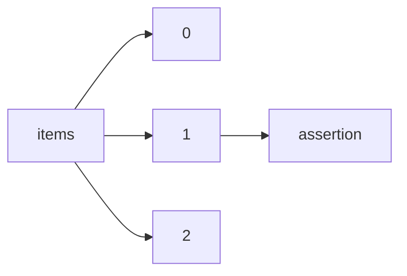

!!! warning "This document is not official Crossref documentation"
# Assertion
PATH = items/array/assertion(1)  
Occurs 15 598 114 times  
{ .annotate }

1. A route to an element, for example:  
   The route "items/array/assertion" corresponds to navigating through the JSON indices as  
   ["items"][0]["assertion"]  

## Properties of Array
See information about elements: [items/array/assertion/array](array/index.md)  
Distribution of lengths:  

| **Row** | **Length** `Any` | **Count** `Int64` |
|--------:|--------------------:|---------------------:|
| **1**   | 1                   | 2 781 938            |
| **2**   | 2                   | 996 839              |
| **3**   | 3                   | 2 006 168            |
| **4**   | 4                   | 764 842              |
| **5**   | 5                   | 801 446              |
| **6**   | 6                   | 6 379 843            |
| **7**   | 7                   | 1 170 197            |
| **8**   | 8                   | 173 023              |
| **9**   | 9                   | 119 992              |
| **10**  | 10                  | 183 353              |
| ... | ... | ... |

