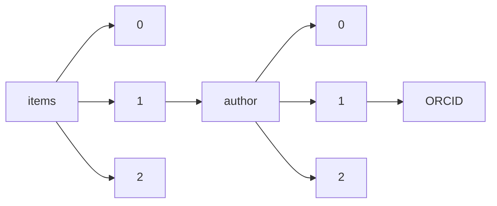

!!! warning "This document is not official Crossref documentation"
# ORCID
PATH = items/array/author/array/ORCID(1)  
Occurs 22 060 154 times  
Unique values: > 999  
{ .annotate }

1. A route to an element, for example:  
   The route "items/array/author/array/ORCID" corresponds to navigating through the JSON indices as  
   ["items"][0]["author"][0]["ORCID"]  

!!! note "Due to current limitations, only the first 1,000 unique values are counted."

| **Row** | **Value** `String`                | **Count** `Int64` |
|--------:|-------------------------------------:|---------------------:|
| **1**   | http://orcid.org/0000-0002-7436-3176 | 91 155               |
| **2**   | http://orcid.org/0000-0002-4465-7034 | 91 155               |
| **3**   | http://orcid.org/0000-0002-0893-8170 | 18 934               |
| **4**   | http://orcid.org/0000-0001-6386-9107 | 6 821                |
| **5**   | http://orcid.org/0000-0001-5628-8371 | 2 438                |
| **6**   | http://orcid.org/0000-0003-4150-0936 | 1 791                |
| **7**   | http://orcid.org/0000-0002-1825-0097 | 999                  |
| **8**   | http://orcid.org/0000-0001-5433-707X | 843                  |
| **9**   | http://orcid.org/0000-0001-6691-0144 | 841                  |
| **10**  | http://orcid.org/0000-0002-4786-6333 | 794                  |
| **11**  | http://orcid.org/0000-0001-7840-5401 | 414                  |
| **12**  | http://orcid.org/0000-0003-1419-2405 | 374                  |
| **13**  | http://orcid.org/0000-0001-7849-1282 | 318                  |
| **14**  | http://orcid.org/0000-0002-6031-2626 | 310                  |
| **15**  | http://orcid.org/0000-0001-6480-2270 | 294                  |
| **16**  | http://orcid.org/0000-0003-3669-158X | 219                  |
| **17**  | http://orcid.org/0000-0002-6189-3020 | 215                  |
| **18**  | http://orcid.org/0000-0002-4037-5857 | 211                  |
| **19**  | http://orcid.org/0000-0003-2024-6844 | 205                  |
| **20**  | http://orcid.org/0000-0001-7960-7531 | 201                  |
| **21**  | http://orcid.org/0000-0003-3439-9921 | 187                  |
| **22**  | http://orcid.org/0000-0001-7173-769X | 181                  |
| **23**  | http://orcid.org/0000-0001-7395-9552 | 180                  |
| **24**  | http://orcid.org/0000-0002-7437-9880 | 174                  |
| **25**  | http://orcid.org/0000-0001-7773-1061 | 171                  |
| **26**  | http://orcid.org/0000-0002-5824-6973 | 164                  |
| **27**  | http://orcid.org/0000-0002-5184-5439 | 160                  |
| **28**  | http://orcid.org/0000-0001-6113-9741 | 157                  |
| **29**  | http://orcid.org/0000-0001-8976-4610 | 153                  |
| **30**  | http://orcid.org/0000-0003-3849-1100 | 152                  |
| **31**  | http://orcid.org/0000-0002-8053-3215 | 150                  |
| **32**  | http://orcid.org/0000-0002-5136-8978 | 149                  |
| **33**  | http://orcid.org/0000-0002-3486-1963 | 147                  |
| **34**  | http://orcid.org/0000-0001-6950-8388 | 147                  |
| **35**  | http://orcid.org/0000-0001-7666-2754 | 143                  |
| **36**  | http://orcid.org/0000-0002-6317-2710 | 139                  |
| **37**  | http://orcid.org/0000-0002-2147-8033 | 139                  |
| **38**  | http://orcid.org/0000-0001-5401-2048 | 138                  |
| **39**  | http://orcid.org/0000-0002-6547-0172 | 138                  |
| **40**  | http://orcid.org/0000-0002-7045-4310 | 136                  |
| **41**  | http://orcid.org/0000-0002-5829-1803 | 134                  |
| **42**  | http://orcid.org/0000-0003-3109-1841 | 133                  |
| **43**  | http://orcid.org/0000-0001-9212-5764 | 132                  |
| **44**  | http://orcid.org/0000-0001-7126-9814 | 132                  |
| **45**  | http://orcid.org/0000-0002-5513-5434 | 128                  |
| **46**  | http://orcid.org/0000-0002-4791-2694 | 127                  |
| **47**  | http://orcid.org/0000-0003-0832-6243 | 123                  |
| **48**  | http://orcid.org/0000-0001-9317-7937 | 122                  |
| **49**  | http://orcid.org/0000-0002-0456-0078 | 120                  |
| **50**  | http://orcid.org/0000-0002-9547-3251 | 120                  |
| **51**  | http://orcid.org/0000-0001-7799-4144 | 118                  |
| **52**  | http://orcid.org/0000-0003-3782-0750 | 116                  |
| **53**  | http://orcid.org/0000-0002-7360-1259 | 116                  |
| **54**  | http://orcid.org/0000-0002-4260-2291 | 114                  |
| **55**  | http://orcid.org/0000-0001-8654-3919 | 114                  |
| **56**  | http://orcid.org/0000-0001-9759-9002 | 111                  |
| **57**  | http://orcid.org/0000-0001-7147-6119 | 111                  |
| **58**  | http://orcid.org/0000-0003-0168-1445 | 110                  |
| **59**  | http://orcid.org/0000-0001-7034-8772 | 109                  |
| **60**  | http://orcid.org/0000-0001-6113-3921 | 109                  |
| **61**  | http://orcid.org/0000-0001-5968-0555 | 109                  |
| **62**  | http://orcid.org/0000-0002-3185-1567 | 106                  |
| **63**  | http://orcid.org/0000-0001-6291-5386 | 104                  |
| **64**  | http://orcid.org/0000-0002-9207-6752 | 103                  |
| **65**  | http://orcid.org/0000-0001-6813-8100 | 103                  |
| **66**  | http://orcid.org/0000-0003-1699-3687 | 102                  |
| **67**  | http://orcid.org/0000-0001-5297-3240 | 102                  |
| **68**  | http://orcid.org/0000-0001-5527-6248 | 102                  |
| **69**  | http://orcid.org/0000-0002-9048-8614 | 102                  |
| **70**  | http://orcid.org/0000-0002-8280-1260 | 99                   |
| **71**  | http://orcid.org/0000-0003-1923-3237 | 99                   |
| **72**  | http://orcid.org/0000-0002-7064-1191 | 98                   |
| **73**  | http://orcid.org/0000-0002-0300-1944 | 98                   |
| **74**  | http://orcid.org/0000-0002-4453-8430 | 97                   |
| **75**  | http://orcid.org/0000-0003-2502-4845 | 96                   |
| **76**  | http://orcid.org/0000-0002-7336-381X | 95                   |
| **77**  | http://orcid.org/0000-0002-9813-0342 | 95                   |
| **78**  | http://orcid.org/0000-0001-9261-594X | 95                   |
| **79**  | http://orcid.org/0000-0002-0644-9066 | 95                   |
| **80**  | http://orcid.org/0000-0001-9779-1168 | 95                   |
| **81**  | http://orcid.org/0000-0003-4052-1452 | 94                   |
| **82**  | http://orcid.org/0000-0003-2813-4804 | 94                   |
| **83**  | http://orcid.org/0000-0003-2270-7392 | 93                   |
| **84**  | http://orcid.org/0000-0003-2170-5213 | 92                   |
| **85**  | http://orcid.org/0000-0003-2852-9419 | 92                   |
| **86**  | http://orcid.org/0000-0001-9291-8123 | 91                   |
| **87**  | http://orcid.org/0000-0002-4102-3474 | 90                   |
| **88**  | http://orcid.org/0000-0003-3701-8119 | 90                   |
| **89**  | http://orcid.org/0000-0001-7199-1436 | 90                   |
| **90**  | http://orcid.org/0000-0002-8782-6950 | 88                   |
| **91**  | http://orcid.org/0000-0003-4311-6890 | 88                   |
| **92**  | http://orcid.org/0000-0002-5398-0597 | 88                   |
| **93**  | http://orcid.org/0000-0001-5764-7268 | 88                   |
| **94**  | http://orcid.org/0000-0001-7828-8188 | 88                   |
| **95**  | http://orcid.org/0000-0003-3336-7960 | 87                   |
| **96**  | http://orcid.org/0000-0002-9402-2029 | 87                   |
| **97**  | http://orcid.org/0000-0001-6631-9426 | 87                   |
| **98**  | http://orcid.org/0000-0001-7331-8130 | 87                   |
| **99**  | http://orcid.org/0000-0003-2127-3932 | 87                   |
| **100** | http://orcid.org/0000-0002-2183-6013 | 87                   |
| **101** | http://orcid.org/0000-0002-9950-2072 | 87                   |
| **102** | http://orcid.org/0000-0002-3869-1949 | 87                   |
| **103** | http://orcid.org/0000-0002-0248-7305 | 87                   |
| **104** | http://orcid.org/0000-0002-0158-2511 | 87                   |
| **105** | http://orcid.org/0000-0002-7992-7719 | 87                   |
| **106** | http://orcid.org/0000-0002-5704-2741 | 87                   |
| **107** | http://orcid.org/0000-0003-0924-3247 | 87                   |
| **108** | http://orcid.org/0000-0001-8060-547X | 87                   |
| **109** | http://orcid.org/0000-0003-3382-5546 | 87                   |
| **110** | http://orcid.org/0000-0003-1472-490X | 87                   |
| **111** | http://orcid.org/0000-0002-4518-5219 | 87                   |
| **112** | http://orcid.org/0000-0002-1733-693X | 86                   |
| **113** | http://orcid.org/0000-0001-7191-9768 | 85                   |
| **114** | http://orcid.org/0000-0001-8305-5346 | 85                   |
| **115** | http://orcid.org/0000-0003-0465-8603 | 85                   |
| **116** | http://orcid.org/0000-0002-5709-6088 | 85                   |
| **117** | http://orcid.org/0000-0001-9139-5893 | 85                   |
| **118** | http://orcid.org/0000-0001-7253-8529 | 85                   |
| **119** | http://orcid.org/0000-0001-9584-8861 | 84                   |
| **120** | http://orcid.org/0000-0002-9265-070X | 84                   |
| **121** | http://orcid.org/0000-0001-6646-8755 | 84                   |
| **122** | http://orcid.org/0000-0003-0590-5848 | 84                   |
| **123** | http://orcid.org/0000-0002-0956-2777 | 84                   |
| **124** | http://orcid.org/0000-0002-2816-749X | 84                   |
| **125** | http://orcid.org/0000-0003-3107-9922 | 84                   |
| **126** | http://orcid.org/0000-0002-1864-1610 | 84                   |
| **127** | http://orcid.org/0000-0002-9245-7774 | 84                   |
| **128** | http://orcid.org/0000-0002-9567-4328 | 84                   |
| **129** | http://orcid.org/0000-0002-2243-6409 | 84                   |
| **130** | http://orcid.org/0000-0002-5392-312X | 84                   |
| **131** | http://orcid.org/0000-0001-8247-3108 | 84                   |
| **132** | http://orcid.org/0000-0001-9034-0575 | 84                   |
| **133** | http://orcid.org/0000-0002-7902-3744 | 83                   |
| **134** | http://orcid.org/0000-0001-8176-0594 | 83                   |
| **135** | http://orcid.org/0000-0001-6630-8786 | 83                   |
| **136** | http://orcid.org/0000-0002-4568-6021 | 83                   |
| **137** | http://orcid.org/0000-0002-5248-5498 | 83                   |
| **138** | http://orcid.org/0000-0001-9435-0201 | 83                   |
| **139** | http://orcid.org/0000-0002-4217-0708 | 83                   |
| **140** | http://orcid.org/0000-0003-0844-4776 | 83                   |
| **141** | http://orcid.org/0000-0003-4057-7165 | 83                   |
| **142** | http://orcid.org/0000-0002-4227-6393 | 83                   |
| **143** | http://orcid.org/0000-0001-9989-1437 | 83                   |
| **144** | http://orcid.org/0000-0002-6879-9256 | 83                   |
| **145** | http://orcid.org/0000-0002-2307-0576 | 83                   |
| **146** | http://orcid.org/0000-0002-2465-6819 | 83                   |
| **147** | http://orcid.org/0000-0002-8490-292X | 83                   |
| **148** | http://orcid.org/0000-0001-5389-8633 | 83                   |
| **149** | http://orcid.org/0000-0003-4450-1352 | 83                   |
| **150** | http://orcid.org/0000-0002-7935-2134 | 83                   |
| **151** | http://orcid.org/0000-0002-7736-7113 | 83                   |
| **152** | http://orcid.org/0000-0001-6829-1500 | 83                   |
| **153** | http://orcid.org/0000-0001-6808-5950 | 83                   |
| **154** | http://orcid.org/0000-0002-3782-6995 | 83                   |
| **155** | http://orcid.org/0000-0001-8255-3853 | 83                   |
| **156** | http://orcid.org/0000-0001-5267-1672 | 83                   |
| **157** | http://orcid.org/0000-0002-3060-9189 | 83                   |
| **158** | http://orcid.org/0000-0002-3993-9520 | 83                   |
| **159** | http://orcid.org/0000-0001-7817-1318 | 83                   |
| **160** | http://orcid.org/0000-0001-7791-8854 | 83                   |
| **161** | http://orcid.org/0000-0003-2292-643X | 83                   |
| **162** | http://orcid.org/0000-0001-8781-2535 | 83                   |
| **163** | http://orcid.org/0000-0002-7466-7794 | 83                   |
| **164** | http://orcid.org/0000-0002-4635-8126 | 83                   |
| **165** | http://orcid.org/0000-0003-3342-4080 | 83                   |
| **166** | http://orcid.org/0000-0001-8473-2898 | 83                   |
| **167** | http://orcid.org/0000-0002-3857-0004 | 83                   |
| **168** | http://orcid.org/0000-0001-6851-6634 | 83                   |
| **169** | http://orcid.org/0000-0003-3255-5791 | 83                   |
| **170** | http://orcid.org/0000-0002-8900-9460 | 83                   |
| **171** | http://orcid.org/0000-0002-9801-9273 | 83                   |
| **172** | http://orcid.org/0000-0002-6277-9852 | 83                   |
| **173** | http://orcid.org/0000-0002-2613-6016 | 83                   |
| **174** | http://orcid.org/0000-0003-4482-2754 | 83                   |
| **175** | http://orcid.org/0000-0002-4803-7836 | 82                   |
| **176** | http://orcid.org/0000-0002-7075-0195 | 82                   |
| **177** | http://orcid.org/0000-0002-7688-2260 | 82                   |
| **178** | http://orcid.org/0000-0002-9698-1776 | 82                   |
| **179** | http://orcid.org/0000-0002-7264-2681 | 81                   |
| **180** | http://orcid.org/0000-0003-0455-9699 | 81                   |
| **181** | http://orcid.org/0000-0001-9649-8963 | 80                   |
| **182** | http://orcid.org/0000-0002-8385-7274 | 80                   |
| **183** | http://orcid.org/0000-0003-1977-8843 | 79                   |
| **184** | http://orcid.org/0000-0002-0996-4928 | 78                   |
| **185** | http://orcid.org/0000-0002-8850-6297 | 78                   |
| **186** | http://orcid.org/0000-0003-2505-4542 | 77                   |
| **187** | http://orcid.org/0000-0002-9490-0370 | 77                   |
| **188** | http://orcid.org/0000-0003-4481-2345 | 77                   |
| **189** | http://orcid.org/0000-0001-8783-390X | 76                   |
| **190** | http://orcid.org/0000-0003-3070-5274 | 76                   |
| **191** | http://orcid.org/0000-0003-4868-0116 | 74                   |
| **192** | http://orcid.org/0000-0003-4836-6223 | 74                   |
| **193** | http://orcid.org/0000-0002-0716-4185 | 73                   |
| **194** | http://orcid.org/0000-0002-6881-8314 | 73                   |
| **195** | http://orcid.org/0000-0002-9363-1623 | 73                   |
| **196** | http://orcid.org/0000-0001-5034-1135 | 72                   |
| **197** | http://orcid.org/0000-0001-7392-2119 | 71                   |
| **198** | http://orcid.org/0000-0001-5658-1578 | 71                   |
| **199** | http://orcid.org/0000-0002-3440-2150 | 71                   |
| **200** | http://orcid.org/0000-0002-3013-0178 | 71                   |
| **201** | http://orcid.org/0000-0002-3814-1015 | 70                   |
| **202** | http://orcid.org/0000-0002-3180-6811 | 70                   |
| **203** | http://orcid.org/0000-0002-2702-8164 | 70                   |
| **204** | http://orcid.org/0000-0001-9106-9385 | 70                   |
| **205** | http://orcid.org/0000-0003-4022-5506 | 69                   |
| **206** | http://orcid.org/0000-0002-2491-1517 | 69                   |
| **207** | http://orcid.org/0000-0001-7059-0630 | 68                   |
| **208** | http://orcid.org/0000-0002-4940-3981 | 68                   |
| **209** | http://orcid.org/0000-0002-2109-3432 | 68                   |
| **210** | http://orcid.org/0000-0002-1374-5007 | 68                   |
| **211** | http://orcid.org/0000-0001-6425-7583 | 67                   |
| **212** | http://orcid.org/0000-0002-6276-7560 | 67                   |
| **213** | http://orcid.org/0000-0001-7628-9259 | 67                   |
| **214** | http://orcid.org/0000-0001-5543-2503 | 67                   |
| **215** | http://orcid.org/0000-0003-1761-6437 | 66                   |
| **216** | http://orcid.org/0000-0001-9367-1791 | 66                   |
| **217** | http://orcid.org/0000-0003-2545-9160 | 66                   |
| **218** | http://orcid.org/0000-0001-9389-7918 | 66                   |
| **219** | http://orcid.org/0000-0002-7140-7671 | 66                   |
| **220** | http://orcid.org/0000-0002-9565-3260 | 65                   |
| **221** | http://orcid.org/0000-0002-3083-5987 | 65                   |
| **222** | http://orcid.org/0000-0001-5091-0537 | 65                   |
| **223** | http://orcid.org/0000-0002-1881-9044 | 65                   |
| **224** | http://orcid.org/0000-0001-9239-9343 | 65                   |
| **225** | http://orcid.org/0000-0002-7706-1915 | 65                   |
| **226** | http://orcid.org/0000-0002-2566-8758 | 64                   |
| **227** | http://orcid.org/0000-0003-1264-5933 | 64                   |
| **228** | http://orcid.org/0000-0001-6797-5476 | 63                   |
| **229** | http://orcid.org/0000-0003-1254-5940 | 63                   |
| **230** | http://orcid.org/0000-0003-1512-6805 | 62                   |
| **231** | http://orcid.org/0000-0002-7749-1624 | 62                   |
| **232** | http://orcid.org/0000-0002-7579-8120 | 62                   |
| **233** | http://orcid.org/0000-0002-1214-8913 | 62                   |
| **234** | http://orcid.org/0000-0002-8829-0334 | 62                   |
| **235** | http://orcid.org/0000-0002-7494-5248 | 62                   |
| **236** | http://orcid.org/0000-0003-1801-899X | 62                   |
| **237** | http://orcid.org/0000-0002-8980-9062 | 62                   |
| **238** | http://orcid.org/0000-0003-1793-2552 | 62                   |
| **239** | http://orcid.org/0000-0003-0764-2615 | 62                   |
| **240** | http://orcid.org/0000-0002-4681-7791 | 62                   |
| **241** | http://orcid.org/0000-0001-9185-3022 | 62                   |
| **242** | http://orcid.org/0000-0001-8044-1356 | 62                   |
| **243** | http://orcid.org/0000-0001-6419-4957 | 62                   |
| **244** | http://orcid.org/0000-0002-1045-9830 | 62                   |
| **245** | http://orcid.org/0000-0001-7537-5470 | 62                   |
| **246** | http://orcid.org/0000-0001-9061-8485 | 62                   |
| **247** | http://orcid.org/0000-0001-6283-8288 | 61                   |
| **248** | http://orcid.org/0000-0002-8277-1700 | 61                   |
| **249** | http://orcid.org/0000-0003-0327-1343 | 61                   |
| **250** | http://orcid.org/0000-0002-7818-348X | 61                   |
| **251** | http://orcid.org/0000-0002-9820-417X | 61                   |
| **252** | http://orcid.org/0000-0001-9987-5584 | 60                   |
| **253** | http://orcid.org/0000-0002-5190-4654 | 60                   |
| **254** | http://orcid.org/0000-0001-7826-7416 | 60                   |
| **255** | http://orcid.org/0000-0001-6255-8139 | 60                   |
| **256** | http://orcid.org/0000-0002-8214-5734 | 59                   |
| **257** | http://orcid.org/0000-0001-7550-8587 | 59                   |
| **258** | http://orcid.org/0000-0002-0722-9348 | 59                   |
| **259** | http://orcid.org/0000-0002-4767-4286 | 59                   |
| **260** | http://orcid.org/0000-0002-2465-7993 | 59                   |
| **261** | http://orcid.org/0000-0002-2815-2909 | 58                   |
| **262** | http://orcid.org/0000-0003-2110-9067 | 58                   |
| **263** | http://orcid.org/0000-0001-5124-5495 | 58                   |
| **264** | http://orcid.org/0000-0002-6505-0143 | 58                   |
| **265** | http://orcid.org/0000-0002-7025-1185 | 58                   |
| **266** | http://orcid.org/0000-0003-3888-0931 | 58                   |
| **267** | http://orcid.org/0000-0001-8944-1432 | 57                   |
| **268** | http://orcid.org/0000-0003-2483-5873 | 57                   |
| **269** | http://orcid.org/0000-0002-6551-2678 | 57                   |
| **270** | http://orcid.org/0000-0002-6929-3548 | 57                   |
| **271** | http://orcid.org/0000-0002-5598-3038 | 57                   |
| **272** | http://orcid.org/0000-0002-1434-6518 | 57                   |
| **273** | http://orcid.org/0000-0001-6492-4876 | 56                   |
| **274** | http://orcid.org/0000-0003-4036-1532 | 56                   |
| **275** | http://orcid.org/0000-0002-6238-8181 | 56                   |
| **276** | http://orcid.org/0000-0001-6239-6301 | 56                   |
| **277** | http://orcid.org/0000-0002-4395-1362 | 55                   |
| **278** | http://orcid.org/0000-0002-5669-1176 | 55                   |
| **279** | http://orcid.org/0000-0002-3039-0973 | 55                   |
| **280** | http://orcid.org/0000-0003-2361-4307 | 55                   |
| **281** | http://orcid.org/0000-0003-4901-4051 | 55                   |
| **282** | http://orcid.org/0000-0001-5532-8247 | 55                   |
| **283** | http://orcid.org/0000-0003-0524-1172 | 55                   |
| **284** | http://orcid.org/0000-0002-7520-3844 | 54                   |
| **285** | http://orcid.org/0000-0002-9013-4461 | 54                   |
| **286** | http://orcid.org/0000-0002-8696-5078 | 54                   |
| **287** | http://orcid.org/0000-0002-4354-1750 | 54                   |
| **288** | http://orcid.org/0000-0003-3146-5612 | 54                   |
| **289** | http://orcid.org/0000-0003-2518-5614 | 54                   |
| **290** | http://orcid.org/0000-0003-3464-7825 | 54                   |
| **291** | http://orcid.org/0000-0002-7022-6086 | 53                   |
| **292** | http://orcid.org/0000-0002-9576-2272 | 53                   |
| **293** | http://orcid.org/0000-0002-7003-3305 | 53                   |
| **294** | http://orcid.org/0000-0001-6688-0539 | 53                   |
| **295** | http://orcid.org/0000-0002-2271-3699 | 52                   |
| **296** | http://orcid.org/0000-0003-3259-5734 | 52                   |
| **297** | http://orcid.org/0000-0002-3075-292X | 52                   |
| **298** | http://orcid.org/0000-0003-3997-8092 | 52                   |
| **299** | http://orcid.org/0000-0002-4471-1969 | 52                   |
| **300** | http://orcid.org/0000-0002-6749-9251 | 52                   |
| **301** | http://orcid.org/0000-0001-6133-0247 | 51                   |
| **302** | http://orcid.org/0000-0001-6172-0368 | 51                   |
| **303** | http://orcid.org/0000-0003-0276-7101 | 51                   |
| **304** | http://orcid.org/0000-0001-6242-4974 | 51                   |
| **305** | http://orcid.org/0000-0003-4948-6171 | 50                   |
| **306** | http://orcid.org/0000-0002-8896-0609 | 50                   |
| **307** | http://orcid.org/0000-0001-8962-4925 | 50                   |
| **308** | http://orcid.org/0000-0002-7166-6016 | 50                   |
| **309** | http://orcid.org/0000-0002-9603-4429 | 50                   |
| **310** | http://orcid.org/0000-0003-4311-9717 | 50                   |
| **311** | http://orcid.org/0000-0002-8304-2796 | 50                   |
| **312** | http://orcid.org/0000-0001-7007-0926 | 50                   |
| **313** | http://orcid.org/0000-0001-9259-2995 | 49                   |
| **314** | http://orcid.org/0000-0002-6896-2367 | 49                   |
| **315** | http://orcid.org/0000-0001-6049-8320 | 49                   |
| **316** | http://orcid.org/0000-0002-8442-0859 | 49                   |
| **317** | http://orcid.org/0000-0001-8399-3391 | 49                   |
| **318** | http://orcid.org/0000-0003-2933-8593 | 49                   |
| **319** | http://orcid.org/0000-0003-4229-8784 | 49                   |
| **320** | http://orcid.org/0000-0003-1222-3191 | 49                   |
| **321** | http://orcid.org/0000-0003-4547-873X | 49                   |
| **322** | http://orcid.org/0000-0001-6157-7629 | 49                   |
| **323** | http://orcid.org/0000-0003-2686-9241 | 48                   |
| **324** | http://orcid.org/0000-0002-8082-4311 | 48                   |
| **325** | http://orcid.org/0000-0001-7478-6462 | 48                   |
| **326** | http://orcid.org/0000-0002-0565-8325 | 48                   |
| **327** | http://orcid.org/0000-0001-5975-9984 | 48                   |
| **328** | http://orcid.org/0000-0001-6855-3398 | 48                   |
| **329** | http://orcid.org/0000-0001-8311-7412 | 48                   |
| **330** | http://orcid.org/0000-0003-0760-1258 | 47                   |
| **331** | http://orcid.org/0000-0003-1344-4068 | 47                   |
| **332** | http://orcid.org/0000-0003-0186-7557 | 47                   |
| **333** | http://orcid.org/0000-0002-9763-4047 | 46                   |
| **334** | http://orcid.org/0000-0002-4533-9644 | 46                   |
| **335** | http://orcid.org/0000-0001-6560-4647 | 46                   |
| **336** | http://orcid.org/0000-0003-0465-5138 | 46                   |
| **337** | http://orcid.org/0000-0002-6757-2279 | 45                   |
| **338** | http://orcid.org/0000-0001-5208-9906 | 45                   |
| **339** | http://orcid.org/0000-0002-7241-0864 | 45                   |
| **340** | http://orcid.org/0000-0002-4096-6120 | 45                   |
| **341** | http://orcid.org/0000-0003-2509-3365 | 45                   |
| **342** | http://orcid.org/0000-0002-7887-7991 | 45                   |
| **343** | http://orcid.org/0000-0002-6368-461X | 45                   |
| **344** | http://orcid.org/0000-0002-9992-8946 | 45                   |
| **345** | http://orcid.org/0000-0002-1989-3596 | 45                   |
| **346** | http://orcid.org/0000-0002-9906-1334 | 45                   |
| **347** | http://orcid.org/0000-0002-5598-2203 | 45                   |
| **348** | http://orcid.org/0000-0003-2175-5800 | 45                   |
| **349** | http://orcid.org/0000-0002-1640-3088 | 45                   |
| **350** | http://orcid.org/0000-0003-3086-8954 | 45                   |
| **351** | http://orcid.org/0000-0001-5198-516X | 45                   |
| **352** | http://orcid.org/0000-0002-4903-9868 | 45                   |
| **353** | http://orcid.org/0000-0002-6704-998X | 45                   |
| **354** | http://orcid.org/0000-0001-5929-1576 | 45                   |
| **355** | http://orcid.org/0000-0001-9873-9759 | 45                   |
| **356** | http://orcid.org/0000-0002-0471-9675 | 45                   |
| **357** | http://orcid.org/0000-0001-8738-9335 | 45                   |
| **358** | http://orcid.org/0000-0002-1740-8139 | 45                   |
| **359** | http://orcid.org/0000-0002-8081-1641 | 44                   |
| **360** | http://orcid.org/0000-0001-7405-0455 | 44                   |
| **361** | http://orcid.org/0000-0003-1801-9386 | 44                   |
| **362** | http://orcid.org/0000-0002-2119-2377 | 44                   |
| **363** | http://orcid.org/0000-0003-2709-9840 | 44                   |
| **364** | http://orcid.org/0000-0001-8618-2666 | 44                   |
| **365** | http://orcid.org/0000-0003-1147-2196 | 44                   |
| **366** | http://orcid.org/0000-0001-9176-8901 | 44                   |
| **367** | http://orcid.org/0000-0001-9819-2079 | 44                   |
| **368** | http://orcid.org/0000-0002-8650-6891 | 44                   |
| **369** | http://orcid.org/0000-0002-2521-5871 | 44                   |
| **370** | http://orcid.org/0000-0002-1038-8956 | 43                   |
| **371** | http://orcid.org/0000-0001-5451-7230 | 43                   |
| **372** | http://orcid.org/0000-0003-2736-3541 | 43                   |
| **373** | http://orcid.org/0000-0002-0494-2404 | 43                   |
| **374** | http://orcid.org/0000-0002-8951-9081 | 43                   |
| **375** | http://orcid.org/0000-0003-2389-2606 | 42                   |
| **376** | http://orcid.org/0000-0002-1062-6010 | 42                   |
| **377** | http://orcid.org/0000-0002-0606-9493 | 42                   |
| **378** | http://orcid.org/0000-0002-7655-6182 | 42                   |
| **379** | http://orcid.org/0000-0002-8919-8783 | 42                   |
| **380** | http://orcid.org/0000-0002-2547-8292 | 42                   |
| **381** | http://orcid.org/0000-0001-8969-6347 | 42                   |
| **382** | http://orcid.org/0000-0002-9219-0387 | 42                   |
| **383** | http://orcid.org/0000-0001-6544-5738 | 42                   |
| **384** | http://orcid.org/0000-0002-3319-5516 | 42                   |
| **385** | http://orcid.org/0000-0002-1464-2587 | 42                   |
| **386** | http://orcid.org/0000-0002-8019-9149 | 41                   |
| **387** | http://orcid.org/0000-0001-9197-326X | 41                   |
| **388** | http://orcid.org/0000-0001-7937-8222 | 41                   |
| **389** | http://orcid.org/0000-0002-5465-9068 | 41                   |
| **390** | http://orcid.org/0000-0002-9615-3022 | 41                   |
| **391** | http://orcid.org/0000-0001-8147-8759 | 41                   |
| **392** | http://orcid.org/0000-0003-2226-7411 | 41                   |
| **393** | http://orcid.org/0000-0001-5698-7316 | 40                   |
| **394** | http://orcid.org/0000-0001-6212-9502 | 40                   |
| **395** | http://orcid.org/0000-0002-4062-3144 | 40                   |
| **396** | http://orcid.org/0000-0002-0370-1270 | 40                   |
| **397** | http://orcid.org/0000-0002-0090-0629 | 40                   |
| **398** | http://orcid.org/0000-0002-8378-3498 | 40                   |
| **399** | http://orcid.org/0000-0001-9898-739X | 40                   |
| **400** | http://orcid.org/0000-0003-0741-9579 | 40                   |
| **401** | http://orcid.org/0000-0002-4805-6973 | 40                   |
| **402** | http://orcid.org/0000-0003-2577-139X | 40                   |
| **403** | http://orcid.org/0000-0002-8618-4036 | 40                   |
| **404** | http://orcid.org/0000-0001-7629-3266 | 40                   |
| **405** | http://orcid.org/0000-0002-9887-5555 | 39                   |
| **406** | http://orcid.org/0000-0002-2440-2149 | 39                   |
| **407** | http://orcid.org/0000-0002-1140-6175 | 39                   |
| **408** | http://orcid.org/0000-0001-9408-3131 | 39                   |
| **409** | http://orcid.org/0000-0001-8902-2473 | 39                   |
| **410** | http://orcid.org/0000-0001-7066-5575 | 39                   |
| **411** | http://orcid.org/0000-0001-5058-8664 | 38                   |
| **412** | http://orcid.org/0000-0003-3400-6286 | 38                   |
| **413** | http://orcid.org/0000-0003-4174-1713 | 38                   |
| **414** | http://orcid.org/0000-0002-7996-4034 | 38                   |
| **415** | http://orcid.org/0000-0001-9751-016X | 38                   |
| **416** | http://orcid.org/0000-0001-7720-6558 | 38                   |
| **417** | http://orcid.org/0000-0001-5788-6998 | 38                   |
| **418** | http://orcid.org/0000-0001-7449-761X | 38                   |
| **419** | http://orcid.org/0000-0002-1496-4922 | 38                   |
| **420** | http://orcid.org/0000-0003-2041-5273 | 38                   |
| **421** | http://orcid.org/0000-0002-1609-4051 | 37                   |
| **422** | http://orcid.org/0000-0002-8863-0175 | 37                   |
| **423** | http://orcid.org/0000-0002-7274-8902 | 37                   |
| **424** | http://orcid.org/0000-0003-2400-0550 | 37                   |
| **425** | http://orcid.org/0000-0001-9805-4549 | 37                   |
| **426** | http://orcid.org/0000-0001-9664-1109 | 37                   |
| **427** | http://orcid.org/0000-0001-8024-9954 | 37                   |
| **428** | http://orcid.org/0000-0003-4116-9913 | 37                   |
| **429** | http://orcid.org/0000-0002-5200-2054 | 37                   |
| **430** | http://orcid.org/0000-0002-9104-8987 | 37                   |
| **431** | http://orcid.org/0000-0001-5943-3220 | 37                   |
| **432** | http://orcid.org/0000-0002-0825-4617 | 37                   |
| **433** | http://orcid.org/0000-0001-5287-8112 | 37                   |
| **434** | http://orcid.org/0000-0001-5168-1182 | 36                   |
| **435** | http://orcid.org/0000-0003-2752-0009 | 36                   |
| **436** | http://orcid.org/0000-0003-2132-8534 | 36                   |
| **437** | http://orcid.org/0000-0002-3624-5208 | 36                   |
| **438** | http://orcid.org/0000-0003-1490-3115 | 36                   |
| **439** | http://orcid.org/0000-0002-3172-9166 | 36                   |
| **440** | http://orcid.org/0000-0003-0408-0565 | 36                   |
| **441** | http://orcid.org/0000-0003-2093-5252 | 35                   |
| **442** | http://orcid.org/0000-0001-9948-2553 | 35                   |
| **443** | http://orcid.org/0000-0002-3046-8240 | 35                   |
| **444** | http://orcid.org/0000-0002-2980-7735 | 35                   |
| **445** | http://orcid.org/0000-0003-1574-2659 | 35                   |
| **446** | http://orcid.org/0000-0001-8584-6176 | 35                   |
| **447** | http://orcid.org/0000-0003-4920-7881 | 35                   |
| **448** | http://orcid.org/0000-0002-4174-2073 | 35                   |
| **449** | http://orcid.org/0000-0002-7804-3276 | 34                   |
| **450** | http://orcid.org/0000-0002-4229-6183 | 34                   |
| **451** | http://orcid.org/0000-0001-5209-0245 | 34                   |
| **452** | http://orcid.org/0000-0002-5024-6186 | 34                   |
| **453** | http://orcid.org/0000-0002-6219-1610 | 34                   |
| **454** | http://orcid.org/0000-0002-5289-9332 | 34                   |
| **455** | http://orcid.org/0000-0003-4363-4591 | 34                   |
| **456** | http://orcid.org/0000-0002-2735-8470 | 34                   |
| **457** | http://orcid.org/0000-0003-3906-6392 | 34                   |
| **458** | http://orcid.org/0000-0002-0963-7687 | 33                   |
| **459** | http://orcid.org/0000-0002-3946-4844 | 33                   |
| **460** | http://orcid.org/0000-0002-8516-3356 | 33                   |
| **461** | http://orcid.org/0000-0003-3112-4201 | 33                   |
| **462** | http://orcid.org/0000-0002-0293-964X | 33                   |
| **463** | http://orcid.org/0000-0002-7598-5604 | 33                   |
| **464** | http://orcid.org/0000-0002-6607-880X | 33                   |
| **465** | http://orcid.org/0000-0002-4900-7145 | 33                   |
| **466** | http://orcid.org/0000-0002-9737-2614 | 33                   |
| **467** | http://orcid.org/0000-0002-8923-297X | 33                   |
| **468** | http://orcid.org/0000-0002-6157-1494 | 33                   |
| **469** | http://orcid.org/0000-0001-5490-3350 | 32                   |
| **470** | http://orcid.org/0000-0002-2279-6906 | 32                   |
| **471** | http://orcid.org/0000-0002-4512-1514 | 32                   |
| **472** | http://orcid.org/0000-0002-3520-4041 | 32                   |
| **473** | http://orcid.org/0000-0002-1682-2848 | 32                   |
| **474** | http://orcid.org/0000-0001-8086-1473 | 32                   |
| **475** | http://orcid.org/0000-0003-4875-674X | 32                   |
| **476** | http://orcid.org/0000-0001-7973-7280 | 32                   |
| **477** | http://orcid.org/0000-0003-2782-1266 | 32                   |
| **478** | http://orcid.org/0000-0002-2016-8041 | 32                   |
| **479** | http://orcid.org/0000-0002-7419-1503 | 32                   |
| **480** | http://orcid.org/0000-0002-6130-9349 | 32                   |
| **481** | http://orcid.org/0000-0002-1573-7457 | 32                   |
| **482** | http://orcid.org/0000-0003-4978-9703 | 32                   |
| **483** | http://orcid.org/0000-0001-7648-6578 | 32                   |
| **484** | http://orcid.org/0000-0002-4244-5767 | 32                   |
| **485** | http://orcid.org/0000-0002-3286-2700 | 32                   |
| **486** | http://orcid.org/0000-0003-4299-8561 | 32                   |
| **487** | http://orcid.org/0000-0001-9106-7304 | 32                   |
| **488** | http://orcid.org/0000-0002-2255-1220 | 31                   |
| **489** | http://orcid.org/0000-0002-1643-2997 | 31                   |
| **490** | http://orcid.org/0000-0002-5329-0625 | 31                   |
| **491** | http://orcid.org/0000-0002-0756-3629 | 31                   |
| **492** | http://orcid.org/0000-0003-4294-6470 | 30                   |
| **493** | http://orcid.org/0000-0002-9221-4756 | 30                   |
| **494** | http://orcid.org/0000-0001-9936-5154 | 30                   |
| **495** | http://orcid.org/0000-0001-9742-4325 | 30                   |
| **496** | http://orcid.org/0000-0002-0809-7666 | 30                   |
| **497** | http://orcid.org/0000-0002-4082-4675 | 30                   |
| **498** | http://orcid.org/0000-0003-3526-0091 | 30                   |
| **499** | http://orcid.org/0000-0003-1464-3376 | 30                   |
| **500** | http://orcid.org/0000-0002-4208-288X | 30                   |
| **501** | http://orcid.org/0000-0002-8857-9939 | 30                   |
| **502** | http://orcid.org/0000-0001-5246-7786 | 30                   |
| **503** | http://orcid.org/0000-0003-3430-5243 | 30                   |
| **504** | http://orcid.org/0000-0002-1964-0740 | 30                   |
| **505** | http://orcid.org/0000-0001-9948-6837 | 29                   |
| **506** | http://orcid.org/0000-0001-5709-0965 | 29                   |
| **507** | http://orcid.org/0000-0002-1139-8486 | 29                   |
| **508** | http://orcid.org/0000-0001-5025-172X | 29                   |
| **509** | http://orcid.org/0000-0001-7203-2691 | 29                   |
| **510** | http://orcid.org/0000-0001-7192-9149 | 29                   |
| **511** | http://orcid.org/0000-0003-3188-1149 | 29                   |
| **512** | http://orcid.org/0000-0001-5579-482X | 29                   |
| **513** | http://orcid.org/0000-0001-6138-4990 | 29                   |
| **514** | http://orcid.org/0000-0001-5549-6793 | 29                   |
| **515** | http://orcid.org/0000-0003-2242-5459 | 29                   |
| **516** | http://orcid.org/0000-0001-5588-4825 | 29                   |
| **517** | http://orcid.org/0000-0001-5535-3135 | 29                   |
| **518** | http://orcid.org/0000-0001-6599-2280 | 29                   |
| **519** | http://orcid.org/0000-0002-6177-7433 | 29                   |
| **520** | http://orcid.org/0000-0003-3654-5267 | 28                   |
| **521** | http://orcid.org/0000-0002-4882-8398 | 28                   |
| **522** | http://orcid.org/0000-0002-4180-8749 | 28                   |
| **523** | http://orcid.org/0000-0002-7962-3862 | 28                   |
| **524** | http://orcid.org/0000-0003-2769-4172 | 28                   |
| **525** | http://orcid.org/0000-0002-2263-611X | 28                   |
| **526** | http://orcid.org/0000-0002-8627-0997 | 28                   |
| **527** | http://orcid.org/0000-0003-1446-7878 | 28                   |
| **528** | http://orcid.org/0000-0001-9533-0499 | 28                   |
| **529** | http://orcid.org/0000-0003-1258-0391 | 28                   |
| **530** | http://orcid.org/0000-0001-7496-4951 | 28                   |
| **531** | http://orcid.org/0000-0002-9115-0789 | 28                   |
| **532** | http://orcid.org/0000-0003-0569-9431 | 28                   |
| **533** | http://orcid.org/0000-0003-1627-8405 | 28                   |
| **534** | http://orcid.org/0000-0002-2227-813X | 28                   |
| **535** | http://orcid.org/0000-0003-0653-6749 | 28                   |
| **536** | http://orcid.org/0000-0002-1011-0006 | 28                   |
| **537** | http://orcid.org/0000-0003-0485-4073 | 28                   |
| **538** | http://orcid.org/0000-0002-0308-5623 | 27                   |
| **539** | http://orcid.org/0000-0002-4924-0289 | 27                   |
| **540** | http://orcid.org/0000-0003-1148-2829 | 27                   |
| **541** | http://orcid.org/0000-0002-7085-4525 | 27                   |
| **542** | http://orcid.org/0000-0002-8193-5697 | 27                   |
| **543** | http://orcid.org/0000-0003-4842-0613 | 27                   |
| **544** | http://orcid.org/0000-0003-1935-2535 | 27                   |
| **545** | http://orcid.org/0000-0002-8656-1444 | 27                   |
| **546** | http://orcid.org/0000-0003-3555-9608 | 27                   |
| **547** | http://orcid.org/0000-0002-2387-6203 | 27                   |
| **548** | http://orcid.org/0000-0002-9671-6489 | 27                   |
| **549** | http://orcid.org/0000-0002-7258-459X | 27                   |
| **550** | http://orcid.org/0000-0002-9213-7199 | 27                   |
| **551** | http://orcid.org/0000-0003-1191-1558 | 27                   |
| **552** | http://orcid.org/0000-0001-7603-8396 | 27                   |
| **553** | http://orcid.org/0000-0003-2713-3770 | 27                   |
| **554** | http://orcid.org/0000-0002-1526-0863 | 27                   |
| **555** | http://orcid.org/0000-0002-0471-3118 | 27                   |
| **556** | http://orcid.org/0000-0002-0427-0484 | 27                   |
| **557** | http://orcid.org/0000-0002-7077-930X | 27                   |
| **558** | http://orcid.org/0000-0002-6018-9170 | 27                   |
| **559** | http://orcid.org/0000-0003-0140-4018 | 27                   |
| **560** | http://orcid.org/0000-0002-0942-2387 | 27                   |
| **561** | http://orcid.org/0000-0001-7629-2140 | 27                   |
| **562** | http://orcid.org/0000-0002-2209-7531 | 27                   |
| **563** | http://orcid.org/0000-0003-3831-3152 | 26                   |
| **564** | http://orcid.org/0000-0002-9832-1851 | 26                   |
| **565** | http://orcid.org/0000-0001-5801-3574 | 26                   |
| **566** | http://orcid.org/0000-0002-4761-8225 | 26                   |
| **567** | http://orcid.org/0000-0003-3070-6437 | 26                   |
| **568** | http://orcid.org/0000-0003-1766-2898 | 26                   |
| **569** | http://orcid.org/0000-0001-5176-3161 | 26                   |
| **570** | http://orcid.org/0000-0002-8890-0278 | 26                   |
| **571** | http://orcid.org/0000-0002-5225-8711 | 26                   |
| **572** | http://orcid.org/0000-0001-9517-9987 | 26                   |
| **573** | http://orcid.org/0000-0001-6119-867X | 26                   |
| **574** | http://orcid.org/0000-0001-6095-2490 | 26                   |
| **575** | http://orcid.org/0000-0003-3818-6624 | 26                   |
| **576** | http://orcid.org/0000-0002-3410-0267 | 26                   |
| **577** | http://orcid.org/0000-0003-2244-0501 | 26                   |
| **578** | http://orcid.org/0000-0001-5637-9601 | 26                   |
| **579** | http://orcid.org/0000-0003-4889-1669 | 26                   |
| **580** | http://orcid.org/0000-0003-4678-4974 | 26                   |
| **581** | http://orcid.org/0000-0002-0480-0983 | 26                   |
| **582** | http://orcid.org/0000-0002-5836-2624 | 25                   |
| **583** | http://orcid.org/0000-0003-2940-006X | 25                   |
| **584** | http://orcid.org/0000-0002-0787-8794 | 25                   |
| **585** | http://orcid.org/0000-0003-2017-5708 | 25                   |
| **586** | http://orcid.org/0000-0001-9963-430X | 25                   |
| **587** | http://orcid.org/0000-0002-8672-6317 | 25                   |
| **588** | http://orcid.org/0000-0002-0328-0322 | 25                   |
| **589** | http://orcid.org/0000-0002-4058-7366 | 25                   |
| **590** | http://orcid.org/0000-0001-5762-2423 | 25                   |
| **591** | http://orcid.org/0000-0003-1195-1998 | 25                   |
| **592** | http://orcid.org/0000-0001-5016-8694 | 25                   |
| **593** | http://orcid.org/0000-0003-1249-1081 | 25                   |
| **594** | http://orcid.org/0000-0003-2553-1337 | 25                   |
| **595** | http://orcid.org/0000-0002-3051-1624 | 25                   |
| **596** | http://orcid.org/0000-0003-2060-3725 | 25                   |
| **597** | http://orcid.org/0000-0002-6282-1408 | 25                   |
| **598** | http://orcid.org/0000-0002-2385-8590 | 25                   |
| **599** | http://orcid.org/0000-0003-2499-6618 | 25                   |
| **600** | http://orcid.org/0000-0001-6261-1286 | 25                   |
| **601** | http://orcid.org/0000-0001-5807-4465 | 25                   |
| **602** | http://orcid.org/0000-0001-5325-8097 | 25                   |
| **603** | http://orcid.org/0000-0001-6314-160X | 25                   |
| **604** | http://orcid.org/0000-0003-4036-8232 | 25                   |
| **605** | http://orcid.org/0000-0002-9205-9530 | 25                   |
| **606** | http://orcid.org/0000-0002-9811-4406 | 25                   |
| **607** | http://orcid.org/0000-0003-1062-7918 | 25                   |
| **608** | http://orcid.org/0000-0003-2292-6122 | 25                   |
| **609** | http://orcid.org/0000-0002-8509-1241 | 25                   |
| **610** | http://orcid.org/0000-0003-3191-6268 | 25                   |
| **611** | http://orcid.org/0000-0003-1913-428X | 25                   |
| **612** | http://orcid.org/0000-0002-3163-3180 | 25                   |
| **613** | http://orcid.org/0000-0001-7003-7982 | 25                   |
| **614** | http://orcid.org/0000-0002-8694-1199 | 25                   |
| **615** | http://orcid.org/0000-0002-7290-4004 | 25                   |
| **616** | http://orcid.org/0000-0002-1369-3390 | 25                   |
| **617** | http://orcid.org/0000-0002-8628-1880 | 25                   |
| **618** | http://orcid.org/0000-0002-9749-8591 | 25                   |
| **619** | http://orcid.org/0000-0001-8353-1306 | 24                   |
| **620** | http://orcid.org/0000-0003-0634-2370 | 24                   |
| **621** | http://orcid.org/0000-0003-0372-3960 | 24                   |
| **622** | http://orcid.org/0000-0003-3695-8264 | 24                   |
| **623** | http://orcid.org/0000-0002-6885-4489 | 24                   |
| **624** | http://orcid.org/0000-0002-9745-3502 | 24                   |
| **625** | http://orcid.org/0000-0003-4538-4637 | 24                   |
| **626** | http://orcid.org/0000-0001-5904-0750 | 24                   |
| **627** | http://orcid.org/0000-0003-4151-7180 | 24                   |
| **628** | http://orcid.org/0000-0002-2306-9217 | 24                   |
| **629** | http://orcid.org/0000-0002-6866-6314 | 24                   |
| **630** | http://orcid.org/0000-0001-9088-4177 | 24                   |
| **631** | http://orcid.org/0000-0003-0427-0131 | 24                   |
| **632** | http://orcid.org/0000-0002-6658-6636 | 24                   |
| **633** | http://orcid.org/0000-0001-8309-8143 | 24                   |
| **634** | http://orcid.org/0000-0003-3158-9340 | 23                   |
| **635** | http://orcid.org/0000-0003-2977-0255 | 23                   |
| **636** | http://orcid.org/0000-0002-5819-4042 | 23                   |
| **637** | http://orcid.org/0000-0002-4665-5446 | 23                   |
| **638** | http://orcid.org/0000-0003-1977-1545 | 23                   |
| **639** | http://orcid.org/0000-0003-4785-7354 | 23                   |
| **640** | http://orcid.org/0000-0001-8859-4525 | 23                   |
| **641** | http://orcid.org/0000-0001-9101-1570 | 23                   |
| **642** | http://orcid.org/0000-0002-9905-2454 | 23                   |
| **643** | http://orcid.org/0000-0002-4136-3313 | 23                   |
| **644** | http://orcid.org/0000-0002-8709-0664 | 23                   |
| **645** | http://orcid.org/0000-0002-4932-4829 | 23                   |
| **646** | http://orcid.org/0000-0002-9917-5227 | 23                   |
| **647** | http://orcid.org/0000-0001-9961-0957 | 23                   |
| **648** | http://orcid.org/0000-0003-0668-9606 | 23                   |
| **649** | http://orcid.org/0000-0003-4901-4908 | 23                   |
| **650** | http://orcid.org/0000-0003-2102-3140 | 23                   |
| **651** | http://orcid.org/0000-0001-5196-8001 | 23                   |
| **652** | http://orcid.org/0000-0001-9779-7754 | 23                   |
| **653** | http://orcid.org/0000-0001-9149-2247 | 23                   |
| **654** | http://orcid.org/0000-0003-3740-5776 | 23                   |
| **655** | http://orcid.org/0000-0002-4543-9434 | 23                   |
| **656** | http://orcid.org/0000-0003-0180-6463 | 23                   |
| **657** | http://orcid.org/0000-0001-6961-675X | 22                   |
| **658** | http://orcid.org/0000-0001-9673-6319 | 22                   |
| **659** | http://orcid.org/0000-0003-2224-8835 | 22                   |
| **660** | http://orcid.org/0000-0003-2718-3153 | 22                   |
| **661** | http://orcid.org/0000-0002-8674-0223 | 22                   |
| **662** | http://orcid.org/0000-0001-8172-6097 | 22                   |
| **663** | http://orcid.org/0000-0001-6791-3312 | 22                   |
| **664** | http://orcid.org/0000-0003-3277-1240 | 22                   |
| **665** | http://orcid.org/0000-0001-7054-8475 | 22                   |
| **666** | http://orcid.org/0000-0001-5379-7779 | 22                   |
| **667** | http://orcid.org/0000-0003-4516-217X | 22                   |
| **668** | http://orcid.org/0000-0002-9431-6422 | 22                   |
| **669** | http://orcid.org/0000-0001-9095-2360 | 22                   |
| **670** | http://orcid.org/0000-0001-8517-0241 | 22                   |
| **671** | http://orcid.org/0000-0003-4844-5212 | 22                   |
| **672** | http://orcid.org/0000-0002-0301-0242 | 22                   |
| **673** | http://orcid.org/0000-0002-3402-3900 | 22                   |
| **674** | http://orcid.org/0000-0001-9214-2636 | 22                   |
| **675** | http://orcid.org/0000-0001-8799-9010 | 22                   |
| **676** | http://orcid.org/0000-0002-7296-6125 | 22                   |
| **677** | http://orcid.org/0000-0003-3970-6505 | 21                   |
| **678** | http://orcid.org/0000-0001-9366-230X | 21                   |
| **679** | http://orcid.org/0000-0003-3698-9140 | 21                   |
| **680** | http://orcid.org/0000-0002-9394-8292 | 21                   |
| **681** | http://orcid.org/0000-0002-0564-0635 | 21                   |
| **682** | http://orcid.org/0000-0001-5215-6777 | 21                   |
| **683** | http://orcid.org/0000-0001-9166-589X | 21                   |
| **684** | http://orcid.org/0000-0002-5430-3379 | 21                   |
| **685** | http://orcid.org/0000-0001-5197-7135 | 21                   |
| **686** | http://orcid.org/0000-0003-1627-7891 | 21                   |
| **687** | http://orcid.org/0000-0003-0730-7075 | 21                   |
| **688** | http://orcid.org/0000-0002-9770-4113 | 21                   |
| **689** | http://orcid.org/0000-0002-0645-4025 | 21                   |
| **690** | http://orcid.org/0000-0002-9362-0342 | 21                   |
| **691** | http://orcid.org/0000-0002-6864-692X | 21                   |
| **692** | http://orcid.org/0000-0003-1437-7178 | 21                   |
| **693** | http://orcid.org/0000-0001-5048-067X | 21                   |
| **694** | http://orcid.org/0000-0003-4850-2360 | 21                   |
| **695** | http://orcid.org/0000-0001-8692-4156 | 21                   |
| **696** | http://orcid.org/0000-0003-1790-9264 | 21                   |
| **697** | http://orcid.org/0000-0002-1857-3937 | 21                   |
| **698** | http://orcid.org/0000-0001-9497-1649 | 21                   |
| **699** | http://orcid.org/0000-0003-0754-445X | 21                   |
| **700** | http://orcid.org/0000-0002-7432-8610 | 21                   |
| **701** | http://orcid.org/0000-0002-3628-5613 | 21                   |
| **702** | http://orcid.org/0000-0002-8341-9880 | 21                   |
| **703** | http://orcid.org/0000-0002-3101-8356 | 21                   |
| **704** | http://orcid.org/0000-0003-3706-2937 | 21                   |
| **705** | http://orcid.org/0000-0002-2857-4685 | 21                   |
| **706** | http://orcid.org/0000-0003-0578-7765 | 20                   |
| **707** | http://orcid.org/0000-0001-5151-6304 | 20                   |
| **708** | http://orcid.org/0000-0001-8423-2316 | 20                   |
| **709** | http://orcid.org/0000-0002-3297-6062 | 20                   |
| **710** | http://orcid.org/0000-0002-7728-0085 | 20                   |
| **711** | http://orcid.org/0000-0002-0934-0568 | 20                   |
| **712** | http://orcid.org/0000-0003-3120-0075 | 20                   |
| **713** | http://orcid.org/0000-0003-2971-0199 | 20                   |
| **714** | http://orcid.org/0000-0001-8777-9261 | 20                   |
| **715** | http://orcid.org/0000-0001-7570-4238 | 20                   |
| **716** | http://orcid.org/0000-0002-4309-6669 | 19                   |
| **717** | http://orcid.org/0000-0001-9523-9054 | 19                   |
| **718** | http://orcid.org/0000-0002-8550-6259 | 19                   |
| **719** | http://orcid.org/0000-0003-0704-6442 | 19                   |
| **720** | http://orcid.org/0000-0003-4599-3619 | 19                   |
| **721** | http://orcid.org/0000-0003-0632-0921 | 19                   |
| **722** | http://orcid.org/0000-0003-3252-9518 | 19                   |
| **723** | http://orcid.org/0000-0002-9576-7401 | 19                   |
| **724** | http://orcid.org/0000-0001-5580-4303 | 19                   |
| **725** | http://orcid.org/0000-0002-3688-8545 | 19                   |
| **726** | http://orcid.org/0000-0002-1355-4796 | 19                   |
| **727** | http://orcid.org/0000-0003-2061-4731 | 19                   |
| **728** | http://orcid.org/0000-0002-2742-2508 | 19                   |
| **729** | http://orcid.org/0000-0003-3031-0635 | 19                   |
| **730** | http://orcid.org/0000-0002-6029-1896 | 19                   |
| **731** | http://orcid.org/0000-0001-9252-1265 | 19                   |
| **732** | http://orcid.org/0000-0002-9445-7591 | 19                   |
| **733** | http://orcid.org/0000-0002-2089-4078 | 19                   |
| **734** | http://orcid.org/0000-0001-7031-3801 | 19                   |
| **735** | http://orcid.org/0000-0001-5406-8391 | 19                   |
| **736** | http://orcid.org/0000-0002-1955-0278 | 19                   |
| **737** | http://orcid.org/0000-0002-3484-7379 | 19                   |
| **738** | http://orcid.org/0000-0003-2354-0221 | 18                   |
| **739** | http://orcid.org/0000-0002-3343-0248 | 18                   |
| **740** | http://orcid.org/0000-0002-0990-5581 | 18                   |
| **741** | http://orcid.org/0000-0001-5633-8068 | 18                   |
| **742** | http://orcid.org/0000-0001-6979-955X | 18                   |
| **743** | http://orcid.org/0000-0002-3409-3319 | 18                   |
| **744** | http://orcid.org/0000-0002-6379-0199 | 18                   |
| **745** | http://orcid.org/0000-0002-5862-5404 | 18                   |
| **746** | http://orcid.org/0000-0002-5216-984X | 18                   |
| **747** | http://orcid.org/0000-0002-8359-2085 | 18                   |
| **748** | http://orcid.org/0000-0003-2396-2061 | 18                   |
| **749** | http://orcid.org/0000-0002-4295-7383 | 18                   |
| **750** | http://orcid.org/0000-0001-5275-0733 | 18                   |
| **751** | http://orcid.org/0000-0002-9055-5696 | 18                   |
| **752** | http://orcid.org/0000-0001-6309-1737 | 18                   |
| **753** | http://orcid.org/0000-0001-5025-1279 | 18                   |
| **754** | http://orcid.org/0000-0002-6414-7939 | 18                   |
| **755** | http://orcid.org/0000-0001-7708-1150 | 18                   |
| **756** | http://orcid.org/0000-0003-1359-4728 | 18                   |
| **757** | http://orcid.org/0000-0003-2309-7565 | 18                   |
| **758** | http://orcid.org/0000-0002-7911-0610 | 18                   |
| **759** | http://orcid.org/0000-0003-3374-8659 | 18                   |
| **760** | http://orcid.org/0000-0001-8395-8537 | 18                   |
| **761** | http://orcid.org/0000-0001-9813-5672 | 18                   |
| **762** | http://orcid.org/0000-0002-4006-117X | 18                   |
| **763** | http://orcid.org/0000-0003-3178-4007 | 17                   |
| **764** | http://orcid.org/0000-0002-4668-0123 | 17                   |
| **765** | http://orcid.org/0000-0002-9181-3968 | 17                   |
| **766** | http://orcid.org/0000-0003-3493-8585 | 17                   |
| **767** | http://orcid.org/0000-0003-2217-0070 | 17                   |
| **768** | http://orcid.org/0000-0001-5846-2951 | 17                   |
| **769** | http://orcid.org/0000-0002-2870-8575 | 17                   |
| **770** | http://orcid.org/0000-0002-1203-9709 | 17                   |
| **771** | http://orcid.org/0000-0001-8511-2041 | 17                   |
| **772** | http://orcid.org/0000-0001-6027-4490 | 17                   |
| **773** | http://orcid.org/0000-0001-5373-2326 | 17                   |
| **774** | http://orcid.org/0000-0002-5598-7848 | 17                   |
| **775** | http://orcid.org/0000-0001-5403-3332 | 17                   |
| **776** | http://orcid.org/0000-0003-4165-7538 | 17                   |
| **777** | http://orcid.org/0000-0002-1467-3105 | 17                   |
| **778** | http://orcid.org/0000-0002-4936-4708 | 17                   |
| **779** | http://orcid.org/0000-0002-0413-7798 | 17                   |
| **780** | http://orcid.org/0000-0001-8438-8863 | 17                   |
| **781** | http://orcid.org/0000-0001-9805-9219 | 17                   |
| **782** | http://orcid.org/0000-0002-0948-3307 | 17                   |
| **783** | http://orcid.org/0000-0003-1007-6888 | 17                   |
| **784** | http://orcid.org/0000-0003-4061-996X | 17                   |
| **785** | http://orcid.org/0000-0003-3653-5958 | 17                   |
| **786** | http://orcid.org/0000-0003-3478-829X | 17                   |
| **787** | http://orcid.org/0000-0002-0768-9125 | 17                   |
| **788** | http://orcid.org/0000-0003-2215-5778 | 17                   |
| **789** | http://orcid.org/0000-0003-1140-6244 | 16                   |
| **790** | http://orcid.org/0000-0003-4262-0323 | 16                   |
| **791** | http://orcid.org/0000-0002-9650-9690 | 16                   |
| **792** | http://orcid.org/0000-0002-6426-2048 | 16                   |
| **793** | http://orcid.org/0000-0002-6068-3080 | 16                   |
| **794** | http://orcid.org/0000-0002-2761-1050 | 16                   |
| **795** | http://orcid.org/0000-0002-2986-1272 | 16                   |
| **796** | http://orcid.org/0000-0001-6657-5008 | 16                   |
| **797** | http://orcid.org/0000-0001-6452-6763 | 16                   |
| **798** | http://orcid.org/0000-0003-4919-0047 | 16                   |
| **799** | http://orcid.org/0000-0002-5074-0686 | 16                   |
| **800** | http://orcid.org/0000-0002-4950-4651 | 16                   |
| **801** | http://orcid.org/0000-0002-2545-8304 | 16                   |
| **802** | http://orcid.org/0000-0002-4583-3810 | 16                   |
| **803** | http://orcid.org/0000-0003-0826-0758 | 16                   |
| **804** | http://orcid.org/0000-0002-7692-8580 | 16                   |
| **805** | http://orcid.org/0000-0002-5515-4803 | 16                   |
| **806** | http://orcid.org/0000-0001-6975-612X | 16                   |
| **807** | http://orcid.org/0000-0001-5687-1903 | 16                   |
| **808** | http://orcid.org/0000-0002-0429-1904 | 16                   |
| **809** | http://orcid.org/0000-0001-6491-2621 | 16                   |
| **810** | http://orcid.org/0000-0002-6319-6536 | 16                   |
| **811** | http://orcid.org/0000-0002-3939-0013 | 15                   |
| **812** | http://orcid.org/0000-0001-9978-8405 | 15                   |
| **813** | http://orcid.org/0000-0002-1519-8828 | 15                   |
| **814** | http://orcid.org/0000-0001-7412-3327 | 15                   |
| **815** | http://orcid.org/0000-0002-5419-7158 | 15                   |
| **816** | http://orcid.org/0000-0001-9885-0094 | 15                   |
| **817** | http://orcid.org/0000-0002-4569-5796 | 15                   |
| **818** | http://orcid.org/0000-0002-4642-3610 | 15                   |
| **819** | http://orcid.org/0000-0002-7211-5400 | 15                   |
| **820** | http://orcid.org/0000-0001-5240-1023 | 15                   |
| **821** | http://orcid.org/0000-0002-7203-4299 | 15                   |
| **822** | http://orcid.org/0000-0003-3176-7776 | 15                   |
| **823** | http://orcid.org/0000-0002-1807-8514 | 15                   |
| **824** | http://orcid.org/0000-0002-0144-9614 | 15                   |
| **825** | http://orcid.org/0000-0002-2605-933X | 15                   |
| **826** | http://orcid.org/0000-0002-0102-3330 | 15                   |
| **827** | http://orcid.org/0000-0003-3635-1825 | 15                   |
| **828** | http://orcid.org/0000-0003-3496-4919 | 15                   |
| **829** | http://orcid.org/0000-0002-6184-1765 | 15                   |
| **830** | http://orcid.org/0000-0002-4319-0970 | 15                   |
| **831** | http://orcid.org/0000-0002-1671-2892 | 15                   |
| **832** | http://orcid.org/0000-0003-0682-7714 | 15                   |
| **833** | http://orcid.org/0000-0003-0195-7536 | 15                   |
| **834** | http://orcid.org/0000-0002-1848-2234 | 15                   |
| **835** | http://orcid.org/0000-0002-6427-2385 | 14                   |
| **836** | http://orcid.org/0000-0003-0786-4701 | 14                   |
| **837** | http://orcid.org/0000-0002-1760-0227 | 14                   |
| **838** | http://orcid.org/0000-0002-4297-6744 | 14                   |
| **839** | http://orcid.org/0000-0003-4148-8543 | 14                   |
| **840** | http://orcid.org/0000-0003-2622-8110 | 14                   |
| **841** | http://orcid.org/0000-0002-6400-2764 | 14                   |
| **842** | http://orcid.org/0000-0002-5605-9939 | 14                   |
| **843** | http://orcid.org/0000-0001-8503-6181 | 14                   |
| **844** | http://orcid.org/0000-0002-4796-2616 | 14                   |
| **845** | http://orcid.org/0000-0002-4561-372X | 14                   |
| **846** | http://orcid.org/0000-0001-8625-3663 | 14                   |
| **847** | http://orcid.org/0000-0003-4852-3401 | 14                   |
| **848** | http://orcid.org/0000-0001-6771-564X | 14                   |
| **849** | http://orcid.org/0000-0002-3118-1655 | 14                   |
| **850** | http://orcid.org/0000-0002-3606-1361 | 14                   |
| **851** | http://orcid.org/0000-0001-7296-0551 | 14                   |
| **852** | http://orcid.org/0000-0001-5960-0236 | 14                   |
| **853** | http://orcid.org/0000-0003-3617-4996 | 14                   |
| **854** | http://orcid.org/0000-0002-7121-3607 | 14                   |
| **855** | http://orcid.org/0000-0003-1526-7587 | 14                   |
| **856** | http://orcid.org/0000-0003-4980-6403 | 14                   |
| **857** | http://orcid.org/0000-0003-2866-3706 | 13                   |
| **858** | http://orcid.org/0000-0002-7539-2331 | 13                   |
| **859** | http://orcid.org/0000-0003-4178-5206 | 13                   |
| **860** | http://orcid.org/0000-0002-4710-1605 | 13                   |
| **861** | http://orcid.org/0000-0002-5751-5916 | 13                   |
| **862** | http://orcid.org/0000-0002-2587-1668 | 13                   |
| **863** | http://orcid.org/0000-0002-7668-677X | 13                   |
| **864** | http://orcid.org/0000-0001-9737-7194 | 13                   |
| **865** | http://orcid.org/0000-0002-9660-9587 | 13                   |
| **866** | http://orcid.org/0000-0001-5766-1107 | 13                   |
| **867** | http://orcid.org/0000-0003-3058-1435 | 13                   |
| **868** | http://orcid.org/0000-0002-0854-5043 | 13                   |
| **869** | http://orcid.org/0000-0002-1442-5662 | 13                   |
| **870** | http://orcid.org/0000-0002-5918-118X | 13                   |
| **871** | http://orcid.org/0000-0002-0741-3356 | 13                   |
| **872** | http://orcid.org/0000-0003-3222-4044 | 13                   |
| **873** | http://orcid.org/0000-0002-9689-4189 | 13                   |
| **874** | http://orcid.org/0000-0003-3801-3061 | 13                   |
| **875** | http://orcid.org/0000-0003-1858-8538 | 13                   |
| **876** | http://orcid.org/0000-0003-1547-8130 | 13                   |
| **877** | http://orcid.org/0000-0002-4227-411X | 13                   |
| **878** | http://orcid.org/0000-0003-4627-6961 | 13                   |
| **879** | http://orcid.org/0000-0002-3635-6119 | 13                   |
| **880** | http://orcid.org/0000-0001-5541-0240 | 13                   |
| **881** | http://orcid.org/0000-0003-4155-5662 | 13                   |
| **882** | http://orcid.org/0000-0002-5903-3355 | 13                   |
| **883** | http://orcid.org/0000-0002-8160-3051 | 13                   |
| **884** | http://orcid.org/0000-0002-4209-1225 | 13                   |
| **885** | http://orcid.org/0000-0002-8466-8563 | 13                   |
| **886** | http://orcid.org/0000-0002-6456-8768 | 13                   |
| **887** | http://orcid.org/0000-0002-5519-7993 | 12                   |
| **888** | http://orcid.org/0000-0003-0016-4016 | 12                   |
| **889** | http://orcid.org/0000-0002-4938-9673 | 12                   |
| **890** | http://orcid.org/0000-0003-4259-7725 | 12                   |
| **891** | http://orcid.org/0000-0001-6958-5375 | 12                   |
| **892** | http://orcid.org/0000-0002-1818-291X | 12                   |
| **893** | http://orcid.org/0000-0001-9838-8389 | 12                   |
| **894** | http://orcid.org/0000-0001-7164-3394 | 12                   |
| **895** | http://orcid.org/0000-0003-4156-2109 | 12                   |
| **896** | http://orcid.org/0000-0003-1925-2825 | 12                   |
| **897** | http://orcid.org/0000-0002-7357-4414 | 12                   |
| **898** | http://orcid.org/0000-0001-9271-0322 | 12                   |
| **899** | http://orcid.org/0000-0002-9888-7003 | 12                   |
| **900** | http://orcid.org/0000-0002-9711-5466 | 12                   |
| **901** | http://orcid.org/0000-0003-1412-3557 | 12                   |
| **902** | http://orcid.org/0000-0002-5778-7938 | 12                   |
| **903** | http://orcid.org/0000-0002-4169-9589 | 12                   |
| **904** | http://orcid.org/0000-0001-9738-2532 | 12                   |
| **905** | http://orcid.org/0000-0003-1843-5099 | 12                   |
| **906** | http://orcid.org/0000-0001-9449-3982 | 12                   |
| **907** | http://orcid.org/0000-0003-0376-9045 | 12                   |
| **908** | http://orcid.org/0000-0003-3339-212X | 12                   |
| **909** | http://orcid.org/0000-0001-6846-9014 | 12                   |
| **910** | http://orcid.org/0000-0003-1754-4365 | 12                   |
| **911** | http://orcid.org/0000-0003-2938-9286 | 12                   |
| **912** | http://orcid.org/0000-0002-3945-4187 | 12                   |
| **913** | http://orcid.org/0000-0002-3577-1951 | 12                   |
| **914** | http://orcid.org/0000-0001-8424-0877 | 12                   |
| **915** | http://orcid.org/0000-0002-3932-5086 | 12                   |
| **916** | http://orcid.org/0000-0002-0413-9347 | 12                   |
| **917** | http://orcid.org/0000-0002-1555-8555 | 12                   |
| **918** | http://orcid.org/0000-0001-5237-8580 | 12                   |
| **919** | http://orcid.org/0000-0002-2646-9582 | 12                   |
| **920** | http://orcid.org/0000-0002-1764-9784 | 12                   |
| **921** | http://orcid.org/0000-0001-7259-8791 | 12                   |
| **922** | http://orcid.org/0000-0003-4894-8987 | 12                   |
| **923** | http://orcid.org/0000-0003-4505-0370 | 12                   |
| **924** | http://orcid.org/0000-0002-3031-7610 | 12                   |
| **925** | http://orcid.org/0000-0001-6203-1847 | 12                   |
| **926** | http://orcid.org/0000-0002-1432-4175 | 12                   |
| **927** | http://orcid.org/0000-0001-7451-1266 | 12                   |
| **928** | http://orcid.org/0000-0001-6248-5611 | 12                   |
| **929** | http://orcid.org/0000-0002-2460-6061 | 12                   |
| **930** | http://orcid.org/0000-0002-6667-5284 | 12                   |
| **931** | http://orcid.org/0000-0002-5604-3320 | 12                   |
| **932** | http://orcid.org/0000-0001-6070-2109 | 12                   |
| **933** | http://orcid.org/0000-0002-4732-071X | 12                   |
| **934** | http://orcid.org/0000-0002-5613-218X | 12                   |
| **935** | http://orcid.org/0000-0001-5097-6050 | 12                   |
| **936** | http://orcid.org/0000-0002-5486-3587 | 12                   |
| **937** | http://orcid.org/0000-0002-8098-8279 | 12                   |
| **938** | http://orcid.org/0000-0001-7378-0544 | 11                   |
| **939** | http://orcid.org/0000-0001-8040-810X | 11                   |
| **940** | http://orcid.org/0000-0001-9325-877X | 11                   |
| **941** | http://orcid.org/0000-0002-5971-8776 | 11                   |
| **942** | http://orcid.org/0000-0002-2016-9650 | 11                   |
| **943** | http://orcid.org/0000-0003-4912-9879 | 11                   |
| **944** | http://orcid.org/0000-0003-0583-2132 | 11                   |
| **945** | http://orcid.org/0000-0002-0124-8409 | 11                   |
| **946** | http://orcid.org/0000-0003-4675-9242 | 11                   |
| **947** | http://orcid.org/0000-0002-7053-8856 | 11                   |
| **948** | http://orcid.org/0000-0001-9878-3629 | 11                   |
| **949** | http://orcid.org/0000-0003-2252-8511 | 11                   |
| **950** | http://orcid.org/0000-0002-8333-1926 | 11                   |
| **951** | http://orcid.org/0000-0002-0588-5739 | 11                   |
| **952** | http://orcid.org/0000-0003-2681-6086 | 11                   |
| **953** | http://orcid.org/0000-0003-1110-5388 | 11                   |
| **954** | http://orcid.org/0000-0002-3703-121X | 11                   |
| **955** | http://orcid.org/0000-0002-6893-0509 | 11                   |
| **956** | http://orcid.org/0000-0002-3319-1312 | 11                   |
| **957** | http://orcid.org/0000-0002-8613-3730 | 11                   |
| **958** | http://orcid.org/0000-0001-5942-0817 | 11                   |
| **959** | http://orcid.org/0000-0002-6840-682X | 11                   |
| **960** | http://orcid.org/0000-0003-1957-5253 | 11                   |
| **961** | http://orcid.org/0000-0002-7550-0232 | 11                   |
| **962** | http://orcid.org/0000-0002-8804-0212 | 11                   |
| **963** | http://orcid.org/0000-0003-3537-7441 | 11                   |
| **964** | http://orcid.org/0000-0002-2014-463X | 11                   |
| **965** | http://orcid.org/0000-0002-3869-0436 | 11                   |
| **966** | http://orcid.org/0000-0001-7814-7633 | 11                   |
| **967** | http://orcid.org/0000-0002-4808-1845 | 11                   |
| **968** | http://orcid.org/0000-0001-5902-9420 | 11                   |
| **969** | http://orcid.org/0000-0002-5055-6299 | 11                   |
| **970** | http://orcid.org/0000-0002-9501-3028 | 11                   |
| **971** | http://orcid.org/0000-0003-3542-034X | 11                   |
| **972** | http://orcid.org/0000-0003-1120-5610 | 11                   |
| **973** | http://orcid.org/0000-0002-0092-5594 | 11                   |
| **974** | http://orcid.org/0000-0002-8621-4039 | 11                   |
| **975** | http://orcid.org/0000-0003-2383-4895 | 11                   |
| **976** | http://orcid.org/0000-0003-4484-016X | 11                   |
| **977** | http://orcid.org/0000-0003-1271-1021 | 11                   |
| **978** | http://orcid.org/0000-0003-1922-7558 | 11                   |
| **979** | http://orcid.org/0000-0003-0571-307X | 11                   |
| **980** | http://orcid.org/0000-0002-4575-9059 | 11                   |
| **981** | http://orcid.org/0000-0001-6536-0224 | 11                   |
| **982** | http://orcid.org/0000-0003-3386-6583 | 11                   |
| **983** | http://orcid.org/0000-0002-5020-3418 | 11                   |
| **984** | http://orcid.org/0000-0003-4126-0725 | 11                   |
| **985** | http://orcid.org/0000-0003-4198-6964 | 11                   |
| **986** | http://orcid.org/0000-0003-0360-8321 | 11                   |
| **987** | http://orcid.org/0000-0001-8482-6181 | 11                   |
| **988** | http://orcid.org/0000-0003-2122-3839 | 11                   |
| **989** | http://orcid.org/0000-0003-4376-3377 | 11                   |
| **990** | http://orcid.org/0000-0003-3726-3827 | 11                   |
| **991** | http://orcid.org/0000-0002-4218-1087 | 11                   |
| **992** | http://orcid.org/0000-0002-1367-0842 | 11                   |
| **993** | http://orcid.org/0000-0002-6744-5536 | 11                   |
| **994** | http://orcid.org/0000-0003-4146-9959 | 11                   |
| **995** | http://orcid.org/0000-0002-6100-9178 | 11                   |
| **996** | http://orcid.org/0000-0001-9371-2717 | 11                   |
| **997** | http://orcid.org/0000-0001-8574-5690 | 11                   |
| **998** | http://orcid.org/0000-0002-2294-8084 | 11                   |
| **999** | http://orcid.org/0000-0002-7004-061X | 11                   |
| ... | ... | ... |

