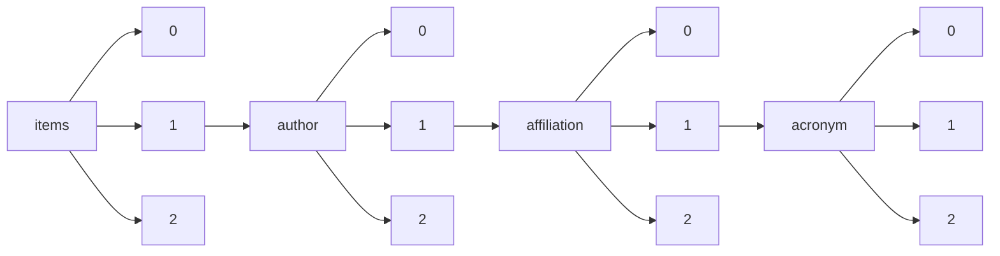

!!! warning "This document is not official Crossref documentation"
# Elements
PATH = items/array/author/array/affiliation/array/acronym/array(1)  
Occurs 1 451 times  
Unique values: 215  
{ .annotate }

1. A route to an element, for example:  
   The route "items/array/author/array/affiliation/array/acronym/array" corresponds to navigating through the JSON indices as  
   ["items"][0]["author"][0]["affiliation"][0]["acronym"][0]  

| **Row** | **Value** `String` | **Count** `Int64` |
|--------:|----------------------:|---------------------:|
| **1**   | BSU                   | 324                  |
| **2**   | RTI                   | 208                  |
| **3**   | CAU                   | 183                  |
| **4**   | ECNU                  | 87                   |
| **5**   | UdeC                  | 42                   |
| **6**   | IZMIRAN               | 36                   |
| **7**   | ISU                   | 20                   |
| **8**   | UCh                   | 14                   |
| **9**   | ZZU                   | 13                   |
| **10**  | ELTE                  | 12                   |
| **11**  | UFBA                  | 11                   |
| **12**  | NC State University   | 11                   |
| **13**  | PUC                   | 11                   |
| **14**  | INIA                  | 10                   |
| **15**  | PTE                   | 9                    |
| **16**  | WMU                   | 9                    |
| **17**  | UBA                   | 8                    |
| **18**  | MTU                   | 8                    |
| **19**  | RSS                   | 8                    |
| **20**  | UST                   | 7                    |
| **21**  | TEES                  | 7                    |
| **22**  | UACh                  | 7                    |
| **23**  | HRBEU                 | 6                    |
| **24**  | WSU                   | 6                    |
| **25**  | IPN                   | 6                    |
| **26**  | SZTE                  | 6                    |
| **27**  | LSU                   | 5                    |
| **28**  | PKU                   | 5                    |
| **29**  | UBB                   | 5                    |
| **30**  | NCSU                  | 5                    |
| **31**  | UDLA                  | 5                    |
| **32**  | UAI                   | 5                    |
| **33**  | UACJ                  | 5                    |
| **34**  | YerPhI                | 5                    |
| **35**  | CCNU                  | 5                    |
| **36**  | UTM                   | 5                    |
| **37**  | UNTAD                 | 5                    |
| **38**  | USAT                  | 5                    |
| **39**  | UM                    | 5                    |
| **40**  | SZU                   | 5                    |
| **41**  | ZBW                   | 5                    |
| **42**  | SWUST                 | 4                    |
| **43**  | UAA                   | 4                    |
| **44**  | UFMG                  | 4                    |
| **45**  | UNAM                  | 4                    |
| **46**  | SB RAS                | 4                    |
| **47**  | Ufro                  | 4                    |
| **48**  | UDP                   | 4                    |
| **49**  | UNLP                  | 4                    |
| **50**  | UNR                   | 4                    |
| **51**  | WIPE                  | 4                    |
| **52**  | UMN                   | 4                    |
| **53**  | IKFIA                 | 4                    |
| **54**  | HUST                  | 4                    |
| **55**  | UCM                   | 4                    |
| **56**  | HZG                   | 4                    |
| **57**  | UKY                   | 4                    |
| **58**  | UASLP                 | 4                    |
| **59**  | PUCV                  | 4                    |
| **60**  | UCN                   | 4                    |
| **61**  | UZH                   | 3                    |
| **62**  | UNAH                  | 3                    |
| **63**  | EUF                   | 3                    |
| **64**  | UCSC                  | 3                    |
| **65**  | UNCo                  | 3                    |
| **66**  | UFSJ                  | 3                    |
| **67**  | UAT                   | 3                    |
| **68**  | USS                   | 3                    |
| **69**  | UDEC                  | 3                    |
| **70**  | INAF                  | 3                    |
| **71**  | ICiAgro Litoral       | 3                    |
| **72**  | UCU                   | 3                    |
| **73**  | NPU                   | 3                    |
| **74**  | UHH                   | 3                    |
| **75**  | UNIPI                 | 3                    |
| **76**  | JIFRESSE              | 2                    |
| **77**  | DIPF                  | 2                    |
| **78**  | KU                    | 2                    |
| **79**  | SCUT                  | 2                    |
| **80**  | UESB                  | 2                    |
| **81**  | XFEL                  | 2                    |
| **82**  | NAU                   | 2                    |
| **83**  | BIRA-IASB             | 2                    |
| **84**  | UPENN                 | 2                    |
| **85**  | HEU                   | 2                    |
| **86**  | MATE                  | 2                    |
| **87**  | USACH                 | 2                    |
| **88**  | JPL                   | 2                    |
| **89**  | XAUFE                 | 2                    |
| **90**  | WWU                   | 2                    |
| **91**  | UERJ                  | 2                    |
| **92**  | Unicor                | 2                    |
| **93**  | ELKH                  | 2                    |
| **94**  | UTN                   | 2                    |
| **95**  | UA                    | 2                    |
| **96**  | ESPAMMFL              | 2                    |
| **97**  | SCNU                  | 2                    |
| **98**  | UNAB                  | 2                    |
| **99**  | UPV                   | 2                    |
| **100** | FAU                   | 2                    |
| **101** | UB                    | 2                    |
| **102** | SCSU                  | 2                    |
| **103** | UGR                   | 2                    |
| **104** | FSU                   | 2                    |
| **105** | UAEM                  | 2                    |
| **106** | UdelaR                | 2                    |
| **107** | UNISON                | 2                    |
| **108** | UEES                  | 2                    |
| **109** | HTOU                  | 2                    |
| **110** | UNILAB                | 2                    |
| **111** | UDD                   | 2                    |
| **112** | EMU                   | 2                    |
| **113** | MSU                   | 2                    |
| **114** | HNU                   | 2                    |
| **115** | IfW                   | 2                    |
| **116** | EPHE                  | 2                    |
| **117** | FUAS                  | 2                    |
| **118** | UG                    | 2                    |
| **119** | HNFNU                 | 2                    |
| **120** | UFVJM                 | 2                    |
| **121** | UBO                   | 2                    |
| **122** | UFRO                  | 1                    |
| **123** | UI                    | 1                    |
| **124** | UNTREF                | 1                    |
| **125** | CSU                   | 1                    |
| **126** | FCA-UNL               | 1                    |
| **127** | USDOE(EM)             | 1                    |
| **128** | EHESS                 | 1                    |
| **129** | THL                   | 1                    |
| **130** | UO                    | 1                    |
| **131** | UCD                   | 1                    |
| **132** | IIAGRI                | 1                    |
| **133** | LMU                   | 1                    |
| **134** | KRE                   | 1                    |
| **135** | UMCP                  | 1                    |
| **136** | UE                    | 1                    |
| **137** | UNJFSC                | 1                    |
| **138** | CUG                   | 1                    |
| **139** | UMAG                  | 1                    |
| **140** | HU Berlin             | 1                    |
| **141** | UFV                   | 1                    |
| **142** | UVa                   | 1                    |
| **143** | KMI                   | 1                    |
| **144** | UCV                   | 1                    |
| **145** | UESC                  | 1                    |
| **146** | UNRN                  | 1                    |
| **147** | HCU                   | 1                    |
| **148** | FU                    | 1                    |
| **149** | HKUST                 | 1                    |
| **150** | GWU                   | 1                    |
| **151** | UPLA                  | 1                    |
| **152** | UEM                   | 1                    |
| **153** | UNSL                  | 1                    |
| **154** | GSRL                  | 1                    |
| **155** | NIU                   | 1                    |
| **156** | UCSB                  | 1                    |
| **157** | UACM                  | 1                    |
| **158** | DE                    | 1                    |
| **159** | UCT                   | 1                    |
| **160** | TecNM                 | 1                    |
| **161** | CENIBANANO            | 1                    |
| **162** | TU                    | 1                    |
| **163** | UTALCA                | 1                    |
| **164** | UMAINE                | 1                    |
| **165** | UH                    | 1                    |
| **166** | PSL                   | 1                    |
| **167** | UBFC                  | 1                    |
| **168** | CLEM                  | 1                    |
| **169** | PUCP                  | 1                    |
| **170** | ILC                   | 1                    |
| **171** | USP                   | 1                    |
| **172** | USF                   | 1                    |
| **173** | UANL                  | 1                    |
| **174** | UANDES                | 1                    |
| **175** | UNT                   | 1                    |
| **176** | MHH                   | 1                    |
| **177** | Usach                 | 1                    |
| **178** | UNMSM                 | 1                    |
| **179** | UAL                   | 1                    |
| **180** | DNR                   | 1                    |
| **181** | CISS                  | 1                    |
| **182** | UDG                   | 1                    |
| **183** | HTU                   | 1                    |
| **184** | BUW                   | 1                    |
| **185** | POLITECNICOJIC        | 1                    |
| **186** | SXU                   | 1                    |
| **187** | IAASARS               | 1                    |
| **188** | WHSU                  | 1                    |
| **189** | ITSON                 | 1                    |
| **190** | NEU                   | 1                    |
| **191** | UNALM                 | 1                    |
| **192** | SELU                  | 1                    |
| **193** | WUT                   | 1                    |
| **194** | ULAGOS                | 1                    |
| **195** | IIF-SADAF             | 1                    |
| **196** | UVM                   | 1                    |
| **197** | RUB                   | 1                    |
| **198** | UNAL                  | 1                    |
| **199** | KUL                   | 1                    |
| **200** | UTA                   | 1                    |
| **201** | UCSH                  | 1                    |
| **202** | UU                    | 1                    |
| **203** | BCM                   | 1                    |
| **204** | CR                    | 1                    |
| **205** | UNE                   | 1                    |
| **206** | ZAS                   | 1                    |
| **207** | UDALBA                | 1                    |
| **208** | USDA-ARS              | 1                    |
| **209** | UCR                   | 1                    |
| **210** | SSocNoRegS            | 1                    |
| **211** | MIT                   | 1                    |
| **212** | USYD                  | 1                    |
| **213** | UEFS                  | 1                    |
| **214** | ECCI                  | 1                    |
| **215** | USGS                  | 1                    |

