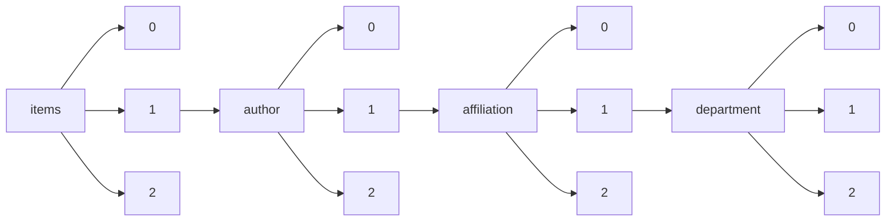

!!! warning "This document is not official Crossref documentation"
# Elements
PATH = items/array/author/array/affiliation/array/department/array(1)  
Occurs 14 894 times  
Unique values: > 999  
{ .annotate }

1. A route to an element, for example:  
   The route "items/array/author/array/affiliation/array/department/array" corresponds to navigating through the JSON indices as  
   ["items"][0]["author"][0]["affiliation"][0]["department"][0]  

!!! note "Due to current limitations, only the first 1,000 unique values are counted."

| **Row** | **Value** `String`                                                                                | **Count** `Int64` |
|--------:|-----------------------------------------------------------------------------------------------------:|---------------------:|
| **1**   | Department of Botany                                                                                 | 284                  |
| **2**   | Dept. of Botany                                                                                      | 268                  |
| **3**   | Department of Anesthesiology                                                                         | 189                  |
| **4**   | Research Department                                                                                  | 164                  |
| **5**   | School of Medicine                                                                                   | 131                  |
| **6**   | College of Forestry                                                                                  | 121                  |
| **7**   | Department of Chemistry                                                                              | 106                  |
| **8**   | Biodiversity Conservation Division, Department of Botany                                             | 103                  |
| **9**   | Department of Mechanical Engineering                                                                 | 97                   |
| **10**  | Emergency Medicine                                                                                   | 91                   |
| **11**  | Department of Civil Engineering                                                                      | 79                   |
| **12**  | Department of Computer Science and Engineering                                                       | 77                   |
| **13**  | Department of Electrical and Electronics Engineering                                                 | 76                   |
| **14**  | Department of Physics                                                                                | 76                   |
| **15**  | Department of Orthopaedic Surgery                                                                    | 74                   |
| **16**  | Department of Forestry                                                                               | 73                   |
| **17**  | Physical Therapy                                                                                     | 68                   |
| **18**  | Forest Entomology Division                                                                           | 60                   |
| **19**  | Department of Medicine                                                                               | 57                   |
| **20**  | Orthopaedic Surgery                                                                                  | 57                   |
| **21**  | Department of Computer Science                                                                       | 55                   |
| **22**  | Department of Internal Medicine                                                                      | 54                   |
| **23**  | Department of Electronics and Communication Engineering                                              | 54                   |
| **24**  | Department of Electrical Engineering                                                                 | 53                   |
| **25**  | Department of Economics                                                                              | 50                   |
| **26**  | Obstetrics and Gynecology                                                                            | 49                   |
| **27**  | Doctoral School of Clinical Medicine                                                                 | 47                   |
| **28**  | School of Health and Rehabilitation Sciences                                                         | 45                   |
| **29**  | Chemical Biology                                                                                     | 45                   |
| **30**  | Psychology                                                                                           | 44                   |
| **31**  | Department of Physical Therapy                                                                       | 41                   |
| **32**  | Internal Medicine                                                                                    | 41                   |
| **33**  | Department of Biochemistry                                                                           | 40                   |
| **34**  | Theology                                                                                             | 40                   |
| **35**  | Orthopedic Surgery                                                                                   | 40                   |
| **36**  | Department of Silviculture and Agroforestry                                                          | 39                   |
| **37**  | Genetics and Plant Breeding Division, Department of Botany                                           | 36                   |
| **38**  | Faculty of Law                                                                                       | 36                   |
| **39**  | Department of Information Technology                                                                 | 35                   |
| **40**  | MAX IV Laboratory                                                                                    | 35                   |
| **41**  | Department of Mathematics                                                                            | 35                   |
| **42**  | Doctoral School of Biology                                                                           | 34                   |
| **43**  | Beijing Synchrotron Radiation Facility, Institute of High Energy Physics                             | 33                   |
| **44**  | Department of Psychiatry and Behavioral Medicine                                                     | 33                   |
| **45**  | Eye Clinic                                                                                           | 33                   |
| **46**  | School of Molecular Sciences                                                                         | 32                   |
| **47**  | Farmakognóziai Intézet                                                                               | 31                   |
| **48**  | Department of Chemistry and Molecular Biology                                                        | 30                   |
| **49**  | Department of Psychology                                                                             | 30                   |
| **50**  | Department of Biological Sciences                                                                    | 30                   |
| **51**  | Center for Applied Structural Discovery, Biodesign Institute                                         | 30                   |
| **52**  | Biology                                                                                              | 29                   |
| **53**  | Center for Free-Electron Laser Science CFEL                                                          | 29                   |
| **54**  | Department of Geosciences                                                                            | 29                   |
| **55**  | Department of Chemical Engineering                                                                   | 29                   |
| **56**  | Department of Orthopedic Surgery                                                                     | 29                   |
| **57**  | Department of Emergency Medicine                                                                     | 28                   |
| **58**  | School of Life Sciences                                                                              | 28                   |
| **59**  | Department of Biology                                                                                | 28                   |
| **60**  | Department of Botany, D.S.B. Campus                                                                  | 28                   |
| **61**  | Department of Kinesiology                                                                            | 28                   |
| **62**  | Medicine                                                                                             | 27                   |
| **63**  | Centre for Botanical Research, P.G. and Research Department of Botany                                | 26                   |
| **64**  | School of Physical Therapy                                                                           | 26                   |
| **65**  | Department of Forestry and Natural Resources                                                         | 26                   |
| **66**  | Centre for Botanical Research, P.G. and Research Dept. of Botany,                                    | 26                   |
| **67**  | Department of Climatology and Landscape Ecology                                                      | 24                   |
| **68**  | Institute of High Energy Physics                                                                     | 24                   |
| **69**  | Department of Psychiatry                                                                             | 23                   |
| **70**  | Department of Electrical & Electronics Engineering                                                   | 23                   |
| **71**  | Advanced Photon Source                                                                               | 23                   |
| **72**  | Department of Obstetrics and Gynecology                                                              | 23                   |
| **73**  | Faculty of Medicine                                                                                  | 23                   |
| **74**  | School of Economics                                                                                  | 22                   |
| **75**  | National Synchrotron Light Source II                                                                 | 22                   |
| **76**  | Department of Forest Biology and Tree Improvement                                                    | 21                   |
| **77**  | Botany Department                                                                                    | 21                   |
| **78**  | Anesthesiology                                                                                       | 21                   |
| **79**  | Department of Orthopaedics                                                                           | 20                   |
| **80**  | Restorative Dentistry                                                                                | 20                   |
| **81**  | Taxonomy and Conservation Division                                                                   | 20                   |
| **82**  | High Altitude Plant Physiology Research Centre (HAPPRC)                                              | 20                   |
| **83**  | Family Medicine                                                                                      | 20                   |
| **84**  | Shanghai Advanced Research Institute                                                                 | 20                   |
| **85**  | Department of Tree Improvement and Genetic Resources                                                 | 20                   |
| **86**  | NSLS-II                                                                                              | 20                   |
| **87**  | Department of Pharmacy Practice                                                                      | 19                   |
| **88**  | Doctoral School of Multidisciplinary Medicine                                                        | 19                   |
| **89**  | Department of Computer Engineering                                                                   | 19                   |
| **90**  | Regional Station Bhowali                                                                             | 19                   |
| **91**  | Ecology, Climate Change and Forest Influence Division                                                | 19                   |
| **92**  | Biodiversity                                                                                         | 19                   |
| **93**  | P.G. and Research Department of Botany                                                               | 18                   |
| **94**  | Doctoral School of Education                                                                         | 18                   |
| **95**  | X-ray Science Division, Advanced Photon Source                                                       | 18                   |
| **96**  | College of Health Sciences                                                                           | 18                   |
| **97**  | Doctoral School of Theoretical Medicine                                                              | 18                   |
| **98**  | Law School                                                                                           | 18                   |
| **99**  | Himachal Unit                                                                                        | 18                   |
| **100** | School of Law                                                                                        | 17                   |
| **101** | Civil and Environmental Engineering                                                                  | 17                   |
| **102** | Institute of Applied Physics                                                                         | 17                   |
| **103** | Department of Biotechnology                                                                          | 17                   |
| **104** | School of Economics and Management                                                                   | 17                   |
| **105** | Veneer & Composite Wood Products Division                                                            | 17                   |
| **106** | Division of Genetics and Tree Propagation                                                            | 17                   |
| **107** | Department of Physics and Astronomy                                                                  | 17                   |
| **108** | Department of Computer Science & Engineering                                                         | 17                   |
| **109** | Institute of Bioorganic Chemistry                                                                    | 16                   |
| **110** | Doctoral School of Pharmaceutical Sciences                                                           | 16                   |
| **111** | Systematic Botany Discipline, Forest Botany Division                                                 | 16                   |
| **112** | Department of Physics and Materials Science                                                          | 16                   |
| **113** | Heinz Maier-Leibnitz Zentrum (MLZ)                                                                   | 16                   |
| **114** | Neutron Scattering Division                                                                          | 16                   |
| **115** | Department of Biomedical Engineering                                                                 | 16                   |
| **116** | Forest Protection Division                                                                           | 16                   |
| **117** | Institute of Crystallography                                                                         | 16                   |
| **118** | Department of Zoology                                                                                | 16                   |
| **119** | Department of Chemistry and Biochemistry                                                             | 16                   |
| **120** | Centre for Botanical Research, P.G. & Research Dept. of  Botany                                      | 16                   |
| **121** | School of Business                                                                                   | 16                   |
| **122** | Faculty of Health Sciences                                                                           | 16                   |
| **123** | Department of Family Medicine                                                                        | 15                   |
| **124** | Department of Applied Physics and Applied Mathematics                                                | 15                   |
| **125** | State Key Laboratory of Electronic Thin Films and Integrated Devices                                 | 15                   |
| **126** | College of Forestry and Hill Agriculture                                                             | 15                   |
| **127** | X-ray Science Division                                                                               | 15                   |
| **128** | Simons Electron Microscopy Center                                                                    | 15                   |
| **129** | Ethnopharmacology Unit, Research Department of Botany                                                | 15                   |
| **130** | Department of Materials Science and Engineering                                                      | 15                   |
| **131** | Department of Tree Improvement and Genetic Resources, College of Forestry                            | 15                   |
| **132** | Department of Educational Sciences                                                                   | 15                   |
| **133** | Landscape Ecology Division                                                                           | 15                   |
| **134** | Plant Physiology Discipline, Botany Division                                                         | 14                   |
| **135** | Georgikon Faculty                                                                                    | 14                   |
| **136** | Doctoral School of Environmental Sciences                                                            | 14                   |
| **137** | Department of Life Science                                                                           | 14                   |
| **138** | Agricultural Engineering College & Research Institute                                                | 14                   |
| **139** | Gregor Mendel Foundation                                                                             | 14                   |
| **140** | Structural Biology Center, X-ray Science Division                                                    | 14                   |
| **141** | Plant Physiology Laboratory; Forest Botany Division                                                  | 14                   |
| **142** | Gerência de Geoprocessamento e Meio Ambiente                                                         | 14                   |
| **143** | Forest Soil & Land Reclamation Division                                                              | 14                   |
| **144** | School of Civil Engineering                                                                          | 14                   |
| **145** | Department of Anesthesia, Critical Care and Pain Medicine                                            | 14                   |
| **146** | Department of Urology                                                                                | 14                   |
| **147** | Centre for Botanical Research, P.G. & Research Dept. of Botany                                       | 14                   |
| **148** | Department of Education                                                                              | 14                   |
| **149** | Department of Business Administration                                                                | 14                   |
| **150** | School of Public Health                                                                              | 14                   |
| **151** | School of Nursing                                                                                    | 14                   |
| **152** | Department of Biochemistry and Molecular Biology                                                     | 14                   |
| **153** | Oral and Maxillofacial Surgery                                                                       | 14                   |
| **154** | College of Pharmacy                                                                                  | 14                   |
| **155** | Department of Agronomy                                                                               | 13                   |
| **156** | Department of Tree Physiology                                                                        | 13                   |
| **157** | Department of Management Studies                                                                     | 13                   |
| **158** | Department of medical oncology                                                                       | 13                   |
| **159** | College of Medicine                                                                                  | 13                   |
| **160** | Department of Civil and Environmental Engineering                                                    | 13                   |
| **161** | Forest Ecology and Environment Division                                                              | 13                   |
| **162** | Forest Pathology Division                                                                            | 13                   |
| **163** | Biodiversity Division                                                                                | 13                   |
| **164** | Department of City and Regional Planning                                                             | 13                   |
| **165** | Biochemistry                                                                                         | 13                   |
| **166** | Department of Forest Products and Utilization                                                        | 13                   |
| **167** | Patanjali Herbal Research Department                                                                 | 13                   |
| **168** | Institute of Solid State Physics                                                                     | 13                   |
| **169** | Swiss Light Source                                                                                   | 13                   |
| **170** | School of Geographical Sciences and Urban Planning                                                   | 13                   |
| **171** | Department of Anesthesiology, Critical Care, and Pain Medicine                                       | 13                   |
| **172** | Economics                                                                                            | 13                   |
| **173** | Biological and Chemical Research Centre, Department of Chemistry                                     | 13                   |
| **174** | Department of Health Sciences                                                                        | 12                   |
| **175** | Radiology                                                                                            | 12                   |
| **176** | Department of Industrial Engineering                                                                 | 12                   |
| **177** | Department of Public Health, Orthopedic Unit                                                         | 12                   |
| **178** | Department of Anesthesia, Critical Care, and Pain Medicine                                           | 12                   |
| **179** | Ecology Research Laboratory Dept. of Botany                                                          | 12                   |
| **180** | Santa Cruz Institute for Particle Physics                                                            | 12                   |
| **181** | Department of Electronics Engineering                                                                | 12                   |
| **182** | Department of Surgery                                                                                | 12                   |
| **183** | Clinical Orthopaedics, School of Medicine                                                            | 12                   |
| **184** | Medical School                                                                                       | 12                   |
| **185** | Department of Computer Science Engineering                                                           | 12                   |
| **186** | Division of Plant Pathology                                                                          | 12                   |
| **187** | Forest Ecology and Climate Change Division                                                           | 12                   |
| **188** | Linac Coherent Light Source                                                                          | 12                   |
| **189** | Albertsons Library                                                                                   | 11                   |
| **190** | Orthopaedics                                                                                         | 11                   |
| **191** | Department of Forest Biology                                                                         | 11                   |
| **192** | Civil Engineering                                                                                    | 11                   |
| **193** | Center for Structural Biology, Department of Molecular Biology and Genetics                          | 11                   |
| **194** | Photon Science Division                                                                              | 11                   |
| **195** | CAS Key Laboratory for Biomedical Effects of Nanomaterials & Nanosafety                              | 11                   |
| **196** | Department of Programming Languages and Compilers                                                    | 11                   |
| **197** | Department of Genetics and Plant Breeding                                                            | 11                   |
| **198** | Center for Integrated Materials Research, Department of Chemistry and iNANO                          | 11                   |
| **199** | Doctoral School of Interdisciplinary Sciences                                                        | 11                   |
| **200** | Department of Pulmonary and Critical Care Medicine                                                   | 11                   |
| **201** | Biosciences Division                                                                                 | 11                   |
| **202** | School of Mathematical Sciences                                                                      | 11                   |
| **203** | Faculty of Physics                                                                                   | 11                   |
| **204** | Department of Materials and Environmental Chemistry                                                  | 11                   |
| **205** | 2nd Academic Department of Orthopedic Surgery                                                        | 11                   |
| **206** | Physical Therapy Department                                                                          | 11                   |
| **207** | School of Science                                                                                    | 11                   |
| **208** | Center for Free-Electron Laser Science                                                               | 11                   |
| **209** | Department of English Language Teaching                                                              | 11                   |
| **210** | NIST Center for Neutron Research                                                                     | 11                   |
| **211** | School of Nursing and Midwifery                                                                      | 11                   |
| **212** | Department of Medical and Surgical Specialties and Dentistry                                         | 10                   |
| **213** | School of Chemistry                                                                                  | 10                   |
| **214** | Institute for Health Equity and Social Justice Research                                              | 10                   |
| **215** | Department of Habitat Ecology                                                                        | 10                   |
| **216** | Institute of Materials Structure Science                                                             | 10                   |
| **217** | Molecular Invertebrate Systematics and Ecology Laboratory, Graduate School of Engineering and Scienc | 10                   |
| **218** | Laboratory of Genomics, Bioinformatics and Digital Health                                            | 10                   |
| **219** | Department of Clinical Science and Translational Medicine, Section of Orthopaedics and Traumatology  | 10                   |
| **220** | Center for Orthopaedic Biomechanics                                                                  | 10                   |
| **221** | Doctor of Physical Therapy Program                                                                   | 10                   |
| **222** | Department of Pharmacy                                                                               | 10                   |
| **223** | Laboratory for Neutron Scattering and Imaging                                                        | 10                   |
| **224** | Oklahoma Cooperative Fish and Wildlife Research Unit                                                 | 10                   |
| **225** | Department of Anesthesia                                                                             | 10                   |
| **226** | Institute for Methods and Instrumentation for Synchrotron Radiation Research (PS-ISRR)               | 10                   |
| **227** | Department of Health Professions                                                                     | 10                   |
| **228** | Doctoral School of Chemistry                                                                         | 10                   |
| **229** | Department of Movement Sciences                                                                      | 10                   |
| **230** | Department of Civil, Materials, and Environmental Engineering                                        | 10                   |
| **231** | Structural Biology Division                                                                          | 10                   |
| **232** | Engineering Research Center of the Modern Technology for Eel Industry, Ministry of Education, P. R.  | 10                   |
| **233** | La Trobe Institute for Molecular Science, Department of Mathematical and Physical Sciences, School o | 10                   |
| **234** | Multidisciplinary Initiative Center, Institute of High Energy Physics                                | 10                   |
| **235** | Department of Haematology, Cambridge Institute for Medical Research                                  | 10                   |
| **236** | Faculty of Wildlife Sciences                                                                         | 10                   |
| **237** | Negaunee Integrative Research Center                                                                 | 10                   |
| **238** | Department for Optics and Beamlines (WI-AOS)                                                         | 9                    |
| **239** | Department of Public Health                                                                          | 9                    |
| **240** | Organogenesis and Cancer Program                                                                     | 9                    |
| **241** | Növénytani Tanszék                                                                                   | 9                    |
| **242** | Department of Management                                                                             | 9                    |
| **243** | Medical Oncology                                                                                     | 9                    |
| **244** | Regional Office Kokořínsko – Máchův kraj Protected Landscape Area Administration                     | 9                    |
| **245** | Forestry and Wood Technology Discipline                                                              | 9                    |
| **246** | Beijing Synchrotron Radiation Facility, X-ray Optics and Technology Laboratory, Institute of High En | 9                    |
| **247** | Orthopedics                                                                                          | 9                    |
| **248** | Department of Early and Special Education                                                            | 9                    |
| **249** | Biotechnology                                                                                        | 9                    |
| **250** | University/BHF Centre for Cardiovascular Science                                                     | 9                    |
| **251** | Doctoral School of Literary and Cultural Studies                                                     | 9                    |
| **252** | Swiss–Norwegian Beamlines                                                                            | 9                    |
| **253** | Management                                                                                           | 9                    |
| **254** | Mérnöki Menedzsment és Ökonómiai Intézet                                                             | 9                    |
| **255** | Institute for Wildlife Management and Nature\n\t\t\t\t\t\t\t\t\tConservation                         | 9                    |
| **256** | Biological Sciences                                                                                  | 9                    |
| **257** | Division of Pomology                                                                                 | 9                    |
| **258** | School of Chemical Engineering and Technology                                                        | 9                    |
| **259** | School of Physical Science and Technology                                                            | 9                    |
| **260** | Shifting Cultivation Division                                                                        | 9                    |
| **261** | Cell Biology and Biophysics                                                                          | 9                    |
| **262** | Department of Epidemiology and Biostatistics                                                         | 9                    |
| **263** | School of Life Sciences, Division of Life Sciences and Medicine                                      | 9                    |
| **264** | National Orchidarium & Experimental Garden                                                           | 9                    |
| **265** | JGYPK Alkalmazott Pedagógiai Intézet                                                                 | 9                    |
| **266** | School of Finance                                                                                    | 8                    |
| **267** | Doctoral School of History                                                                           | 8                    |
| **268** | Editorial Office                                                                                     | 8                    |
| **269** | Department of Orthopedics and Traumatology                                                           | 8                    |
| **270** | Department of Earth and Environmental Sciences                                                       | 8                    |
| **271** | General Surgery                                                                                      | 8                    |
| **272** | Faculty of Chemistry                                                                                 | 8                    |
| **273** | School of Health and Kinesiology                                                                     | 8                    |
| **274** | Faculty of Agriculture                                                                               | 8                    |
| **275** | Chemistry Department                                                                                 | 8                    |
| **276** | Plant Physiology, Botany Division                                                                    | 8                    |
| **277** | Clinical Psychology and Psychotherapy Research                                                       | 8                    |
| **278** | Genetics and Tree Breeding Department                                                                | 8                    |
| **279** | MAX IV Laboratory                                                                                    | 8                    |
| **280** | School of Nursing/Department of Theology                                                             | 8                    |
| **281** | Doctoral School of Physics                                                                           | 8                    |
| **282** | Scientific Computing Department                                                                      | 8                    |
| **283** | China Academy of Financial Research                                                                  | 8                    |
| **284** | Center for Neutron Research                                                                          | 8                    |
| **285** | Department of Athletics                                                                              | 8                    |
| **286** | Institute of Systems, Molecular and Integrative Biology                                              | 8                    |
| **287** | Faculty of Health                                                                                    | 8                    |
| **288** | School of Management Studies                                                                         | 8                    |
| **289** | Neveléstudományi Doktori Iskola                                                                      | 8                    |
| **290** | Department of Environmental Science                                                                  | 8                    |
| **291** | Bio-prospecting & Indigenous Knowledge Division                                                      | 8                    |
| **292** | Lead Botanical Garden, National Orchidarium & Experimental Garden                                    | 8                    |
| **293** | Computer Science                                                                                     | 8                    |
| **294** | Department of Engineering Physics                                                                    | 8                    |
| **295** | Neveléstudományi Intézet                                                                             | 8                    |
| **296** | Structural Biology Group                                                                             | 8                    |
| **297** | Educational Psychology                                                                               | 8                    |
| **298** | DCMI                                                                                                 | 8                    |
| **299** | Department of Extension Education                                                                    | 8                    |
| **300** | Department of Forest Products                                                                        | 8                    |
| **301** | Institute for Transport Studies                                                                      | 8                    |
| **302** | Department of Orthopaedic and Trauma Surgery                                                         | 8                    |
| **303** | Biomedical Engineering                                                                               | 8                    |
| **304** | Department of Orthopaedics and Traumatology                                                          | 8                    |
| **305** | Computational Engineering Division                                                                   | 8                    |
| **306** | Forest Botany Division                                                                               | 8                    |
| **307** | Australian Synchrotron                                                                               | 8                    |
| **308** | Chemistry                                                                                            | 8                    |
| **309** | Center for X-ray and Nano Science CXNS                                                               | 8                    |
| **310** | Division of Hematology and Hematologic Malignancies                                                  | 8                    |
| **311** | Neiswanger Institute for Bioethics                                                                   | 8                    |
| **312** | Department of Genetics and Plant Breeding, College of Agriculture                                    | 8                    |
| **313** | Transfer of Technology Division                                                                      | 8                    |
| **314** | Lichenology Laboratory                                                                               | 8                    |
| **315** | Hunan Provincial Key Laboratory for Molecular Immunity Technology of Aquatic Animal Diseases         | 8                    |
| **316** | Faculty of Engineering                                                                               | 8                    |
| **317** | Department of Crystal Chemistry and Crystal Physics, Faculty of Chemistry                            | 7                    |
| **318** | Second Academic Department of Orthopedic Surgery                                                     | 7                    |
| **319** | Research Center for Molecular Mechanisms of Aging and Age-Related Diseases                           | 7                    |
| **320** | Material Physics and Technology at Extreme Conditions, Laboratory of Crystallography                 | 7                    |
| **321** | School of Economics and Finance                                                                      | 7                    |
| **322** | Life Science Group, Scientific Research Division                                                     | 7                    |
| **323** | Changchun Institute of Optics, Fine Mechanics and Physics                                            | 7                    |
| **324** | Centre for Floristic Research, Dept. of Botany                                                       | 7                    |
| **325** | Surgery                                                                                              | 7                    |
| **326** | Imaging                                                                                              | 7                    |
| **327** | Faculty of Physics and Center for Nanointegration Duisburg-Essen (CENIDE)                            | 7                    |
| **328** | Department of Ecology and Environmental Science                                                      | 7                    |
| **329** | Non Wood Forest Products Division                                                                    | 7                    |
| **330** | School of Environmental Sciences                                                                     | 7                    |
| **331** | Centre for Infectious Diseases                                                                       | 7                    |
| **332** | Deptt. of Tree Improvement and Genetic Resources, College of Forestry                                | 7                    |
| **333** | English                                                                                              | 7                    |
| **334** | Law                                                                                                  | 7                    |
| **335** | National Synchrotron Radiation Laboratory                                                            | 7                    |
| **336** | School of Physical and Chemical Sciences, Biomolecular Interaction Centre                            | 7                    |
| **337** | Data Science and Learning Division                                                                   | 7                    |
| **338** | Australian Centre for Neutron Scattering                                                             | 7                    |
| **339** | Department of Forestry and Environmental Science                                                     | 7                    |
| **340** | Restorative Dentistry and Periodontology                                                             | 7                    |
| **341** | Department of Agroforestry, College of Horticulture & Forestry                                       | 7                    |
| **342** | Department of Public Health and Informatics                                                          | 7                    |
| **343** | Institute of Transportation Studies                                                                  | 7                    |
| **344** | School of Physics                                                                                    | 7                    |
| **345** | Alabama Cooperative Fish and Wildlife Research Unit                                                  | 7                    |
| **346** | Növényszervezettani Tanszék                                                                          | 7                    |
| **347** | Department of Mathematics and Statistics                                                             | 7                    |
| **348** | Department of Family and Community Medicine                                                          | 7                    |
| **349** | School of Pharmacy                                                                                   | 7                    |
| **350** | SwissFEL                                                                                             | 7                    |
| **351** | Department of Petroleum Engineering and Earth Science                                                | 7                    |
| **352** | Tropical Aquaculture Research and Development Center, South China Sea Fisheries Research Institute,  | 7                    |
| **353** | Department of Pharmaceutics                                                                          | 7                    |
| **354** | Environment Management Division (EM)                                                                 | 7                    |
| **355** | Photon Factory, Institute of Materials Structure Science                                             | 7                    |
| **356** | Department of Neurology                                                                              | 7                    |
| **357** | School of Mathematics and Statistics                                                                 | 7                    |
| **358** | Department of Agroforestry                                                                           | 7                    |
| **359** | Forests and Climate Change Division                                                                  | 7                    |
| **360** | Department of Liberal Arts                                                                           | 7                    |
| **361** | School of Business Administration                                                                    | 7                    |
| **362** | The Institute for Global Health and Development, The Heller School for Social Policy and Management  | 7                    |
| **363** | National Engineering Research Center of Industrial Crystallization Technology, School of Chemical En | 7                    |
| **364** | Anesthesiology, Critical Care, and Pain Medicine                                                     | 7                    |
| **365** | emergency medicine                                                                                   | 7                    |
| **366** | Department of Geography                                                                              | 7                    |
| **367** | Plant Physiology Discipline Botany Division                                                          | 7                    |
| **368** | Division of Social Economics, Marketing and Mensuration                                              | 7                    |
| **369** | Biological and Chemical Research Center, Department of Chemistry                                     | 7                    |
| **370** | College of Nursing                                                                                   | 7                    |
| **371** | Department of Electronics                                                                            | 7                    |
| **372** | School of Physical Science and Technology and Center for Transformative Science                      | 7                    |
| **373** | Nuclear Medicine                                                                                     | 7                    |
| **374** | Jülich Centre for Neutron Science-2                                                                  | 6                    |
| **375** | Oral Surgery                                                                                         | 6                    |
| **376** | Department of Nursing                                                                                | 6                    |
| **377** | Ecology Research Laboratory, Department of Botany                                                    | 6                    |
| **378** | Dept. of Botany, DSB Campus                                                                          | 6                    |
| **379** | Research and Development Centre                                                                      | 6                    |
| **380** | Otolaryngology                                                                                       | 6                    |
| **381** | Department of Chemistry and iNANO                                                                    | 6                    |
| **382** | Management and Marketing                                                                             | 6                    |
| **383** | Religion                                                                                             | 6                    |
| **384** | Resource Survey and Management Division                                                              | 6                    |
| **385** | Orthopedic Unit and "Kirk Kilgour" Sports Injury Centre                                              | 6                    |
| **386** | School of Engineering                                                                                | 6                    |
| **387** | Biocomputing Unit                                                                                    | 6                    |
| **388** | Department of Orthopedic and Traumatology                                                            | 6                    |
| **389** | Department of Rehabilitation Medicine                                                                | 6                    |
| **390** | Ophthalmology                                                                                        | 6                    |
| **391** | School of Biological Sciences                                                                        | 6                    |
| **392** | Institute for Physics                                                                                | 6                    |
| **393** | Institute for Health Equity Research                                                                 | 6                    |
| **394** | Forest Soil and Land Reclamation Division                                                            | 6                    |
| **395** | Sport and Movement Science Department                                                                | 6                    |
| **396** | P.G. and Research Department of Plant Biology and Biotechnology                                      | 6                    |
| **397** | Hematology and Hematologic Malignancies                                                              | 6                    |
| **398** | Center for Materials Crystallography (CMC), Department of Chemistry and iNANO                        | 6                    |
| **399** | Center for Integrated Materials Research, Department of Chemistry                                    | 6                    |
| **400** | Nursing                                                                                              | 6                    |
| **401** | Center for Membrane and Cell Physiology                                                              | 6                    |
| **402** | Department of Computer Application                                                                   | 6                    |
| **403** | Academic Centre for Materials and Nanotechnology                                                     | 6                    |
| **404** | Theology and Religious Studies                                                                       | 6                    |
| **405** | Krannert School of Physical Therapy                                                                  | 6                    |
| **406** | Department of Wildlife Biology and Management                                                        | 6                    |
| **407** | Shenzhen Base of South China Sea Fisheries Research Institute, Chinese Academy of Fishery Sciences,  | 6                    |
| **408** | Center for Health Sciences                                                                           | 6                    |
| **409** | High Altitude Biology Division                                                                       | 6                    |
| **410** | Faculty of Agricultural and Food Sciences and Environmental Management, Institute of Crop Sciences   | 6                    |
| **411** | Beamline Development and Application Section                                                         | 6                    |
| **412** | Physik Department                                                                                    | 6                    |
| **413** | 2nd Orthopaedic Department                                                                           | 6                    |
| **414** | Ecology Research Laboratory, Dept. of Botany                                                         | 6                    |
| **415** | Orthopaedics and Trauma                                                                              | 6                    |
| **416** | Advanced Light Source                                                                                | 6                    |
| **417** | School of Forestry and Environment                                                                   | 6                    |
| **418** | Shanghai Synchrotron Radiation Facility, Shanghai Advanced Research Institute                        | 6                    |
| **419** | Facultad de Economía y Negocios                                                                      | 6                    |
| **420** | Large Research Facility                                                                              | 6                    |
| **421** | Division of Biological Chemistry and Drug Discovery, School of Life Sciences                         | 6                    |
| **422** | Department of Ecology and Environmental Sciences                                                     | 6                    |
| **423** | Botanical Survey of India                                                                            | 6                    |
| **424** | Department of Forestry & Natural Resources                                                           | 6                    |
| **425** | Taxonomy Research Centre, Department of Botany                                                       | 6                    |
| **426** | Physics Department                                                                                   | 6                    |
| **427** | HiLIFE Institute of Biotechnology                                                                    | 6                    |
| **428** | Institut für Angewandte Physik                                                                       | 6                    |
| **429** | State Key Laboratory of Microbial Metabolism, School of Life Sciences and Biotechnology              | 6                    |
| **430** | Wood Properties and Uses Division                                                                    | 6                    |
| **431** | School of Life Sciences, BK21 FOUR KNU Creative BioResearch Group                                    | 6                    |
| **432** | ℜeALIS Elméleti, Számítógépes és Kognitív\n\t\t\t\t\t\t\t\t\tNyelvészeti Kutatócsoport               | 6                    |
| **433** | Amrita Centre for Nanosciences and Molecular Medicine                                                | 6                    |
| **434** | Institute for Transport Planning and Systems (IVT)                                                   | 6                    |
| **435** | Department of Chemistry and Nanoscience                                                              | 6                    |
| **436** | Cell Biology and Biophysics Unit                                                                     | 6                    |
| **437** | Apáczai Csere János Kar                                                                              | 6                    |
| **438** | UGSF                                                                                                 | 6                    |
| **439** | Department of Forestry & NR                                                                          | 6                    |
| **440** | Michael W. Krzyzewski Human Performance Laboratory, Department of Orthopaedic Surgery                | 6                    |
| **441** | Department of Pharmaceutical Sciences                                                                | 6                    |
| **442** | Materials Science and Engineering                                                                    | 6                    |
| **443** | Dept. of Forestry and Natural Resources                                                              | 6                    |
| **444** | Cellulose and Paper Division                                                                         | 6                    |
| **445** | Shenzhen Base of South China Sea Fisheries Research Institute, Chinese Academy of Fishery Sciences,  | 6                    |
| **446** | Doctoral School of Economics                                                                         | 6                    |
| **447** | Department of Earth Sciences                                                                         | 6                    |
| **448** | School of Urban and Regional Planning                                                                | 6                    |
| **449** | Geochemical Research Center, Graduate School of Science                                              | 6                    |
| **450** | Department of Microbiology                                                                           | 6                    |
| **451** | Central European Institute of Technology                                                             | 6                    |
| **452** | Silviculture Division                                                                                | 6                    |
| **453** | Faculty of Education, Department of Educational Sciences                                             | 5                    |
| **454** | Laboratory for Research of the Musculoskeletal System, KAT Hospital                                  | 5                    |
| **455** | Mathematical Institute                                                                               | 5                    |
| **456** | Transport Studies Unit, School of Geography and the Environment                                      | 5                    |
| **457** | Neutron Science and Technology Center                                                                | 5                    |
| **458** | Doctoral School of Mathematics                                                                       | 5                    |
| **459** | Laboratory of Biomolecular Research                                                                  | 5                    |
| **460** | Department of Radiology                                                                              | 5                    |
| **461** | Institute of Inorganic Chemistry                                                                     | 5                    |
| **462** | Center of Transformative Science                                                                     | 5                    |
| **463** | Environmental Technology Division                                                                    | 5                    |
| **464** | Institute of Medicine                                                                                | 5                    |
| **465** | Department of Orthopedics                                                                            | 5                    |
| **466** | Faculty of Electrical Engineering                                                                    | 5                    |
| **467** | Institute of Low-Dimensional Materials Genome Initiative, College of Chemistry and Environmental Eng | 5                    |
| **468** | Dept. of Forestry and Environmental Science, D.S.B. Campus                                           | 5                    |
| **469** | Pharmacological and Biomolecular Sciences                                                            | 5                    |
| **470** | Physical Medicine & Rehabilitation                                                                   | 5                    |
| **471** | Providence, Rhode Island                                                                             | 5                    |
| **472** | Institute of Psychiatry, Psychology & Neuroscience                                                   | 5                    |
| **473** | Équipe Labellisée Ligue 2015, Département de Biologie Structurale Intégrative                        | 5                    |
| **474** | Guangdong Provincial Engineer Technology Research Center of Marine Biological Seed Industry, Guangzh | 5                    |
| **475** | Doctor of Medicine Program                                                                           | 5                    |
| **476** | Institute for Applied Materials                                                                      | 5                    |
| **477** | Nanolithography and Application Research Group, School of Information Science and Technology         | 5                    |
| **478** | Department of Agricultural Economics                                                                 | 5                    |
| **479** | Department of Biochemistry and Microbiology                                                          | 5                    |
| **480** | Microbiology Research Laboratory, Department of Botany                                               | 5                    |
| **481** | Civil, Geological and Mining Engineering Department                                                  | 5                    |
| **482** | Laboratory for Marine Fisheries and Aquaculture, Qingdao National Laboratory for Marine Science and  | 5                    |
| **483** | Geography and Planning                                                                               | 5                    |
| **484** | Institute of Forestry                                                                                | 5                    |
| **485** | York Structural Biology Laboratory, Department of Chemistry                                          | 5                    |
| **486** | Department of Chemical and Biological Engineering                                                    | 5                    |
| **487** | Department of Silviculture and Agroforestry, College of Forestry                                     | 5                    |
| **488** | Centre for Econometric & Allied Research                                                             | 5                    |
| **489** | Department of Bone and Joint Surgery                                                                 | 5                    |
| **490** | Institute for Chemical Research                                                                      | 5                    |
| **491** | Institut für Physik Kondensierter Materie                                                            | 5                    |
| **492** | Cape Fear Valley Medical Center Department of Obsetrics and Gynecology                               | 5                    |
| **493** | Processing and Products Development Division                                                         | 5                    |
| **494** | State Key Laboratory of Digital Manufacturing Equipment and Technology                               | 5                    |
| **495** | Urban Planning                                                                                       | 5                    |
| **496** | Post-graduate Department                                                                             | 5                    |
| **497** | Trauma and Orthopaedics                                                                              | 5                    |
| **498** | Department of Business Management                                                                    | 5                    |
| **499** | Doctoral School of Interdisciplinary Medicine                                                        | 5                    |
| **500** | Biological Control Laboratory                                                                        | 5                    |
| **501** | State Key Laboratory of Respiratory Disease                                                          | 5                    |
| **502** | Dipartimento di Scienze della Terra                                                                  | 5                    |
| **503** | Health Promotion Division                                                                            | 5                    |
| **504** | Hainan Provincial Key Laboratory of Tropical Maricultural Technology                                 | 5                    |
| **505** | Faculty of Veterinary Medicine, Department of Animal Science                                         | 5                    |
| **506** | Periodontology                                                                                       | 5                    |
| **507** | Mechanical Engineering Department                                                                    | 5                    |
| **508** | Department of Civil and Mineral Engineering                                                          | 5                    |
| **509** | Department of Medicinal Chemistry, School of Pharmacy                                                | 5                    |
| **510** | Central Coast Clinical School & Division of Medicine                                                 | 5                    |
| **511** | Center for Soft Nanoscience                                                                          | 5                    |
| **512** | Department of PG Studies and Research in Applied Botany, Bioscience Complex, Biodiversity Research L | 5                    |
| **513** | Department of Biology and Biotechnology                                                              | 5                    |
| **514** | Department of Pediatric Hematology Oncology                                                          | 5                    |
| **515** | Department of Radiation and Chemical Physics                                                         | 5                    |
| **516** | Strathclyde Institute of Pharmacy and Biomedical Sciences                                            | 5                    |
| **517** | School of Health Sciences, College of Health Sciences                                                | 5                    |
| **518** | Psychiatry                                                                                           | 5                    |
| **519** | Law and Criminology                                                                                  | 5                    |
| **520** | Graduate School of Advanced Science and Technology                                                   | 5                    |
| **521** | Orthopaedic Surgery - Sports Medicine                                                                | 5                    |
| **522** | Department of Chemistry and Biomolecular Sciences                                                    | 5                    |
| **523** | Chemical Kinomics Research Center                                                                    | 5                    |
| **524** | Faculty of Biology                                                                                   | 5                    |
| **525** | Department of Accounting                                                                             | 5                    |
| **526** | Regional Centre National Afforestaion & Eco-Development Board                                        | 5                    |
| **527** | Division of Forest Ecology and Environment                                                           | 5                    |
| **528** | Departamento do Mar e Recursos Marinhos (DMRM)                                                       | 5                    |
| **529** | Department of Physical Science and Engineering                                                       | 5                    |
| **530** | Department of Petroleum Engineering                                                                  | 5                    |
| **531** | Orthopaedic Department                                                                               | 5                    |
| **532** | CIRB                                                                                                 | 5                    |
| **533** | Obstetrics & Gynecology                                                                              | 5                    |
| **534** | Division of Biomedical Engineering, College of Engineering                                           | 5                    |
| **535** | Photon Sciences, NSLS-II                                                                             | 5                    |
| **536** | Department of Basic Sciences                                                                         | 5                    |
| **537** | Dipartimento di Fisica e Chimica                                                                     | 5                    |
| **538** | ISIS Neutron and Muon Source                                                                         | 5                    |
| **539** | Department of Cardiovascular Medicine                                                                | 5                    |
| **540** | Medical Biochemistry                                                                                 | 5                    |
| **541** | Institute for Ophthalmic Research                                                                    | 5                    |
| **542** | College of Engineering                                                                               | 5                    |
| **543** | PPK Neveléstudományi Intézet                                                                         | 5                    |
| **544** | Victoria Institute of Strategic Economic Studies                                                     | 5                    |
| **545** | Institut Pprime                                                                                      | 5                    |
| **546** | Department of Pharmacology                                                                           | 5                    |
| **547** | Felix-Bloch-Institut für Festkörperphysik                                                            | 5                    |
| **548** | Medical Research Council/Wits University Rural Public Health and Health Transitions Research Unit Ag | 5                    |
| **549** | College of Osteopathic Medicine                                                                      | 5                    |
| **550** | Department of Structural Biology of Prokaryotic Organisms                                            | 5                    |
| **551** | II Department of Orthopedic and Trauma Surgery, University of Pisa, Italy                            | 5                    |
| **552** | Department of Sports Medicine                                                                        | 5                    |
| **553** | Department of Chemistry and Centre for Integrated Materials Research (iMAT)                          | 5                    |
| **554** | Key Laboratory of Artificial Structures and Quantum Control (Ministry of Education), School of Physi | 5                    |
| **555** | Shubnikov Institute of Crystallography                                                               | 5                    |
| **556** | Department of Anesthesia and Pain Management                                                         | 5                    |
| **557** | Religious Studies                                                                                    | 5                    |
| **558** | Department of Oncology                                                                               | 5                    |
| **559** | Department of Anesthesiology and Perioperative Medicine                                              | 5                    |
| **560** | School of Sustainable Engineering and the Built Environment                                          | 5                    |
| **561** | Department of Environmental Sciences                                                                 | 5                    |
| **562** | Institute of Plant and Microbial Biology                                                             | 5                    |
| **563** | Brazilian Biorenewables National Laboratory                                                          | 5                    |
| **564** | Law & Justice                                                                                        | 5                    |
| **565** | National Synchrotron Light Source II (NSLS-II)                                                       | 5                    |
| **566** | School of Theology and Ministry                                                                      | 4                    |
| **567** | Institute of Biological Chemistry                                                                    | 4                    |
| **568** | Otolaryngology and Head & Neck Surgery                                                               | 4                    |
| **569** | School of Metallurgy and Materials                                                                   | 4                    |
| **570** | Department of Forest Products & Utilization                                                          | 4                    |
| **571** | Dermatology                                                                                          | 4                    |
| **572** | Department of Applied Mathematics and Statistics                                                     | 4                    |
| **573** | School of Materials Science and Engineering                                                          | 4                    |
| **574** | Botany Deptartment                                                                                   | 4                    |
| **575** | Michigan State University, College of Osteopathic Medicine                                           | 4                    |
| **576** | Graduate School of Integrated Sciences for Life                                                      | 4                    |
| **577** | Pohang Accelerator Laboratory                                                                        | 4                    |
| **578** | Institute of Scientific and Industrial Research (SANKEN)                                             | 4                    |
| **579** | Department of Pharmacognosy                                                                          | 4                    |
| **580** | College of Osteopathic Medicine Statewide Campus System                                              | 4                    |
| **581** | Developmental Biology Unit                                                                           | 4                    |
| **582** | Department of Chemistry, Faculty of Science                                                          | 4                    |
| **583** | Department of Haematology                                                                            | 4                    |
| **584** | Institute of Mathematics                                                                             | 4                    |
| **585** | Chromosome Dynamics Laboratory                                                                       | 4                    |
| **586** | Department of Chemical Technology of Drugs                                                           | 4                    |
| **587** | School of Medicine and Dentistry                                                                     | 4                    |
| **588** | Bayerisches Geoinstitut                                                                              | 4                    |
| **589** | Business                                                                                             | 4                    |
| **590** | Division of Shoulder Surgery, Department of Orthopaedic Surgery                                      | 4                    |
| **591** | Tianjin Key Laboratory of Aqua-ecology and Aquaculture, 22 Jinjing Road, 300392 Tianjin, China       | 4                    |
| **592** | Energy Cluster                                                                                       | 4                    |
| **593** | La Trobe Institute for Molecular Science                                                             | 4                    |
| **594** | Department of Molecular and Cellular Biology                                                         | 4                    |
| **595** | Division of Hospital Medicine                                                                        | 4                    |
| **596** | Department of Philosophy, Sociology, Education and Applied Psychology (FISPPA)                       | 4                    |
| **597** | College of Nursing and Public Health                                                                 | 4                    |
| **598** | Neurology                                                                                            | 4                    |
| **599** | Department of Biophysics                                                                             | 4                    |
| **600** | Business School                                                                                      | 4                    |
| **601** | The Wellcome Trust Research Laboratory, Division of Gastrointestinal Sciences                        | 4                    |
| **602** | Xinjiang Laboratory of Phase Transitions and Microstructures in Condensed Matter Physics, College of | 4                    |
| **603** | Department of Biotechnology and Biomedicine                                                          | 4                    |
| **604** | Foundation for Revitalization of Local Health Traditions (FRLHT)                                     | 4                    |
| **605** | School of Health Sciences and Social Work                                                            | 4                    |
| **606** | Department of Dermatology                                                                            | 4                    |
| **607** | Centro de Estudios en Salud                                                                          | 4                    |
| **608** | EaStCHEM School of Chemistry and Centre for Science at Extreme Conditions                            | 4                    |
| **609** | Department of Public Health,                                                                         | 4                    |
| **610** | School of Kinesiology                                                                                | 4                    |
| **611** | Hôpital Tenon, Service de Dermatologie-Allergologie                                                  | 4                    |
| **612** | Aquaculture Department, College of Fisheries, Mindanao State University - Tawi-Tawi College of Techn | 4                    |
| **613** | School of Food Science and Technology                                                                | 4                    |
| **614** | Molecular Biosciences and Integrated Bioimaging Division                                             | 4                    |
| **615** | UNC Health Sciences                                                                                  | 4                    |
| **616** | Department of Geoinformatics, Physical and\n\t\t\t\t\t\t\t\t\tEnvironmental Geography                | 4                    |
| **617** | Beijing Advanced Innovation Center for Food Nutrition and Human Health and College of Food Science a | 4                    |
| **618** | Obstetrics and Gynecology Department                                                                 | 4                    |
| **619** | Sports Medicine and Rehabilitation                                                                   | 4                    |
| **620** | Materials Science Division                                                                           | 4                    |
| **621** | School of Management                                                                                 | 4                    |
| **622** | Institute for Sports Medicine                                                                        | 4                    |
| **623** | Biotechnology & Food Engineering                                                                     | 4                    |
| **624** | Department of Neurosurgery and Neurology                                                             | 4                    |
| **625** | Chemical Engineering                                                                                 | 4                    |
| **626** | Department of Life Sciences and Medicine                                                             | 4                    |
| **627** | Faculty of Biotechnical Sciences                                                                     | 4                    |
| **628** | Department of Seed Science and Technology                                                            | 4                    |
| **629** | Doctoral School of Law and Political Sciences                                                        | 4                    |
| **630** | Institute of Psychology                                                                              | 4                    |
| **631** | Molecular Biophysics and Integrated Bioimaging Division                                              | 4                    |
| **632** | P.G. Department of Botany/Biotechnology, T.M.                                                        | 4                    |
| **633** | Department of Disease Control                                                                        | 4                    |
| **634** | Electronic Materials Research Laboratory, Key Laboratory of the Ministry of Education and Internatio | 4                    |
| **635** | Faculty of Dentistry                                                                                 | 4                    |
| **636** | Laboratory for Structural Biology of Infection and Inflammation                                      | 4                    |
| **637** | Department of Dermatology, Farmington Hills, Michigan                                                | 4                    |
| **638** | Department of Global Health and Social Medicine                                                      | 4                    |
| **639** | Soil Microbiology Laboratory, Silviculture & Forest Management Division                              | 4                    |
| **640** | Multidisciplinary Department of Medicine for Surgery and Orthodontics                                | 4                    |
| **641** | Department of Statistics                                                                             | 4                    |
| **642** | Institute of Forestry and Environmental Sciences                                                     | 4                    |
| **643** | Center for Integrated Materials Research (iMAT), Department of Chemistry and iNANO                   | 4                    |
| **644** | Brain and Cognitive Sciences                                                                         | 4                    |
| **645** | School of Fisheries and Aquatic Sciences                                                             | 4                    |
| **646** | Photon Science                                                                                       | 4                    |
| **647** | Department of Environment & Forests                                                                  | 4                    |
| **648** | Forestry Land Use and Climate Change Division                                                        | 4                    |
| **649** | Jameson Crane Sports Medicine Research Institute                                                     | 4                    |
| **650** | Department of Tree Improvement and Genetic Resources, Regional Centre NAEB (MoEF), College of Forest | 4                    |
| **651** | Northwest Watershed Research Center                                                                  | 4                    |
| **652** | Department of Health Management                                                                      | 4                    |
| **653** | Department of Medicine, Division of Hematology/Oncology                                              | 4                    |
| **654** | Department of Electronics and Communications Engineering                                             | 4                    |
| **655** | The Heller School for Social Policy and Management                                                   | 4                    |
| **656** | Department of Physiology                                                                             | 4                    |
| **657** | Department of Cardiovascular and Thoracic Surgery                                                    | 4                    |
| **658** | Department of Anesthesia and Pain Medicine                                                           | 4                    |
| **659** | Institute of Molecular Pathogenesis                                                                  | 4                    |
| **660** | Centre for Medical Radiation Physics                                                                 | 4                    |
| **661** | Faculty of Pharmaceutical Sciences                                                                   | 4                    |
| **662** | Laboratory of Immunology and Pathology of Aquatic Organisms                                          | 4                    |
| **663** | Chemistry and Chemical Biology                                                                       | 4                    |
| **664** | Doctor of Physical Therapy Division, Department of Orthopaedic Surgery                               | 4                    |
| **665** | BTK Történelemtudományi Doktori Iskola                                                               | 4                    |
| **666** | Forest Systematic & Ethnobiology Laboratory, Department of Forestry                                  | 4                    |
| **667** | Taxonomy and Biodiversity Division                                                                   | 4                    |
| **668** | Department of Physics, Chemistry and Pharmacy                                                        | 4                    |
| **669** | Stritch School of Medicine                                                                           | 4                    |
| **670** | Division of Forestry                                                                                 | 4                    |
| **671** | Jerry M. Wallace School of Osteopathic Medicine                                                      | 4                    |
| **672** | Science and Technology Faculties STFC                                                                | 4                    |
| **673** | Moody College of Business Administration                                                             | 4                    |
| **674** | Sports Medicine Center                                                                               | 4                    |
| **675** | Institute for Drug Research                                                                          | 4                    |
| **676** | Chair of Energy Economics, Institute for Industrial Production                                       | 4                    |
| **677** | Department of Clinical and Diagnostic Sciences, Health Physics Program                               | 4                    |
| **678** | Ethnobotany and Conservation of Medicinal Plants Laboratory, Department of Ecology & Environmental S | 4                    |
| **679** | Biotechnology Discipline                                                                             | 4                    |
| **680** | Laboratory of Structural Biochemistry                                                                | 4                    |
| **681** | Institute of Biochemistry and Molecular Biology, Laboratory for Structural Biology of Infection and  | 4                    |
| **682** | Institute of Biochemistry and Technical Biochemistry                                                 | 4                    |
| **683** | Department of Mechanical and Industrial Engineering                                                  | 4                    |
| **684** | Department of Applied Botany                                                                         | 4                    |
| **685** | Multidisciplinary Department of Medico-Surgical and Dentistry Specialties, University “Campana Luigi | 4                    |
| **686** | Biological and Chemical Research Centre, Faculty of Chemistry                                        | 4                    |
| **687** | Division of Forest Ecology and Biodiversity Conservation                                             | 4                    |
| **688** | Otolaryngology-Head and Neck Surgery                                                                 | 4                    |
| **689** | Department of Forest Utilization                                                                     | 4                    |
| **690** | Academic Center for Epileptology                                                                     | 4                    |
| **691** | Unit of Physiotherapy, Department of Health and Rehabilitation                                       | 4                    |
| **692** | Civil, geological and mining engineering                                                             | 4                    |
| **693** | Chemistry and Physics of Materials                                                                   | 4                    |
| **694** | Department of Chemistry and Computational Science Program                                            | 4                    |
| **695** | Heidelberg Institute of Global Health                                                                | 4                    |
| **696** | Institute of Global Health and Development, Schneider Institutes for Health Policy and Research, The | 4                    |
| **697** | Biomechanics and Sports Research unit, Faculty of Physical Therapy                                   | 4                    |
| **698** | Rehabilitation Sciences                                                                              | 4                    |
| **699** | Regional Agriculture Research Station                                                                | 4                    |
| **700** | Departamento de Química Inorgánica, Analítica y Química Física, CONICET-Instituto de Química Física  | 4                    |
| **701** | Bloustein School of Planning and Public Policy                                                       | 4                    |
| **702** | Division of Biotechnology, Department of Chemistry                                                   | 4                    |
| **703** | Department of Physics, Faculty of Pure and Applied Sciences and TREMS                                | 4                    |
| **704** | Singapore Synchrotron Light Source                                                                   | 4                    |
| **705** | Bryology Laboratory, Department of Botany                                                            | 4                    |
| **706** | Central Silk Board                                                                                   | 4                    |
| **707** | BioCARS, Center for Advanced Radiation Sources                                                       | 4                    |
| **708** | State Key Laboratory for Cellular Stress Biology, School of Life Sciences and Faculty of Medical Sci | 4                    |
| **709** | Department of Biosciences                                                                            | 4                    |
| **710** | Experiments Division                                                                                 | 4                    |
| **711** | Department of Biomedical, Dental and Morphological and Functional Images, Section of Orthopaedic and | 4                    |
| **712** | Regional Centre, National Afforestation and Eco-Development Board                                    | 4                    |
| **713** | Stanford Synchrotron Radiation Lightsource                                                           | 4                    |
| **714** | Shenzhen Base of South China Sea Fisheries Research Institute, Chinese Academy of Fishery Sciences,  | 4                    |
| **715** | Unit of Obstetrics and Gynaecology                                                                   | 4                    |
| **716** | Department of Rural Unit for Health and Social Affairs (RUHSA)                                       | 4                    |
| **717** | Mérnöki Kar, Mérnöki Menedzsment és Ökonómiai Intézet                                                | 4                    |
| **718** | Fachbereich Biologie Chemie Pharmazie                                                                | 4                    |
| **719** | Orthopedics & Sports Medicine                                                                        | 4                    |
| **720** | PSICHE Beamline                                                                                      | 4                    |
| **721** | Department of Psychiatry for Infant, Child, Adolescent and Youth                                     | 4                    |
| **722** | Department of Biochemistry, College of Basic Science and Humanities                                  | 4                    |
| **723** | Microbial and Plant Biotechnology Department                                                         | 4                    |
| **724** | Forest Ecology & Climate Change Division                                                             | 4                    |
| **725** | Department of Public Health Sciences                                                                 | 4                    |
| **726** | Engineering Research Center of Ecology and Agricultural Use of Wetland, Ministry of Education, Yangt | 4                    |
| **727** | Department of Metallurgy                                                                             | 4                    |
| **728** | Department of Fisheries                                                                              | 4                    |
| **729** | Chemistry and Bioprospecting Division                                                                | 4                    |
| **730** | College of Healthcare Sciences                                                                       | 4                    |
| **731** | Psychology Applied Research Center                                                                   | 4                    |
| **732** | Livestock and Food Research and Application Center                                                   | 4                    |
| **733** | Department of Orthopaedics - Hand Surgery Unit                                                       | 4                    |
| **734** | School of Pharmaceutical Sciences                                                                    | 4                    |
| **735** | Rehabilitation Psychology and Special Education                                                      | 4                    |
| **736** | Department of Electronics and Communication                                                          | 4                    |
| **737** | Key Laboratory of Freshwater Fisheries and Germplasm Resources Utilization, Ministry of Agriculture, | 4                    |
| **738** | The Hamburg Center for Ultrafast Imaging                                                             | 4                    |
| **739** | Department of Structure Analysis                                                                     | 4                    |
| **740** | Oral Medicine                                                                                        | 4                    |
| **741** | Soft X-ray Applications Laboratory                                                                   | 4                    |
| **742** | Otolaryngology- Head and Neck Surgery                                                                | 4                    |
| **743** | Department of Curriculum and Instruction                                                             | 4                    |
| **744** | Institute for Health Systems Research                                                                | 4                    |
| **745** | Research                                                                                             | 4                    |
| **746** | Division of Hospital Medicine, Department of Medicine                                                | 4                    |
| **747** | Human Geography and Spatial Planning                                                                 | 4                    |
| **748** | Foundation for Revitalization of Local Health Traditions FRLHT                                       | 4                    |
| **749** | Dept. of Forest Products                                                                             | 4                    |
| **750** | Department of Pediatrics                                                                             | 4                    |
| **751** | Física y Micromecánica de Materiales Heterogéneos                                                    | 4                    |
| **752** | Department of Anatomy, Division of Human Anatomy                                                     | 4                    |
| **753** | College of Human Medicine                                                                            | 4                    |
| **754** | Materials and Life Science Division, J-PARC Center                                                   | 4                    |
| **755** | Orthopaedic & Trauma Unit, Department of Basic Medical Sciences, Neuroscience and Sense Organs, Scho | 4                    |
| **756** | Department of Orthopaedic and Traumatology, Spine Surgery Unit, Spine Surgery Unit, Orthopaedic and  | 4                    |
| **757** | Department of Materials Science and Chemical Engineering                                             | 4                    |
| **758** | Montefiore Medical Center                                                                            | 4                    |
| **759** | Restorative Dentistry and Periodontolgy                                                              | 4                    |
| **760** | Department Physik                                                                                    | 4                    |
| **761** | Institute of Experimental Morphology, Pathology and Anthropology with Museum,                        | 4                    |
| **762** | Information Technology Laboratory                                                                    | 4                    |
| **763** | Forest Information Division                                                                          | 4                    |
| **764** | Department of Food Science and Biotechnology                                                         | 4                    |
| **765** | National Health Systems Resource Centre                                                              | 4                    |
| **766** | Dept. of Botany, Centre of Biodiversity                                                              | 4                    |
| **767** | Institute of Physics                                                                                 | 4                    |
| **768** | Department of Metallurgical Engineering                                                              | 4                    |
| **769** | Department of Geriatrics, Neurosciences and Orthopaedics                                             | 4                    |
| **770** | Inorganic Materials Chemistry and Center of Micro- and Nanochemistry and Engineering (Cμ), Departmen | 4                    |
| **771** | Graduate School of Nanobioscience                                                                    | 4                    |
| **772** | Fraunhofer Institute for High-Speed Dynamics                                                         | 4                    |
| **773** | BRAC James P Grant School of Public Health                                                           | 4                    |
| **774** | Department of Orthopaedic Surgery & Sports Medicine                                                  | 4                    |
| **775** | Physiotherapy Department                                                                             | 4                    |
| **776** | Division of Environmental Sciences                                                                   | 4                    |
| **777** | Division of Foodborne, Waterborne, and Environmental Diseases                                        | 4                    |
| **778** | Institute of Ophthalmology                                                                           | 4                    |
| **779** | Department of Chemical and Environmental Engineering                                                 | 4                    |
| **780** | ARC Centre of Excellence for Advanced Molecular Imaging                                              | 4                    |
| **781** | Atominstitut                                                                                         | 4                    |
| **782** | Faculty of Fisheries                                                                                 | 4                    |
| **783** | National Earth and Marine Observations Branch                                                        | 4                    |
| **784** | School of Chemical Engineering and Technology, State Key Laboratory of Chemical Engineering, The Co- | 4                    |
| **785** | Center for Emergent Matter Science (CEMS)                                                            | 4                    |
| **786** | Department of Rehabilitation Sciences                                                                | 4                    |
| **787** | Faculty of Mechanics and Mathematics                                                                 | 4                    |
| **788** | Institute of Health Economics                                                                        | 4                    |
| **789** | Institute for Social Research                                                                        | 4                    |
| **790** | Markkula Center for Applied Ethics                                                                   | 4                    |
| **791** | Shanghai Key Laboratory of Regulatory Biology, Institute of Biomedical Sciences and School of Life S | 4                    |
| **792** | Agricultural Engineering College and Research Institute                                              | 4                    |
| **793** | School of Mathematics                                                                                | 4                    |
| **794** | College of Physics                                                                                   | 3                    |
| **795** | European Molecular Biology Laboratory                                                                | 3                    |
| **796** | Educational Psychology and Counseling                                                                | 3                    |
| **797** | Department of Forestry, Wildlife and Environmental Sciences                                          | 3                    |
| **798** | College of Forest Resources and Environmental Science                                                | 3                    |
| **799** | Business Administration                                                                              | 3                    |
| **800** | Center for Ecological Sciences                                                                       | 3                    |
| **801** | Management, Marketing and Entrepreneurship Department                                                | 3                    |
| **802** | Faculty of Business and Management                                                                   | 3                    |
| **803** | Structural Biology Initiative                                                                        | 3                    |
| **804** | Sol Price School of Public Policy                                                                    | 3                    |
| **805** | Department of Computer Applications                                                                  | 3                    |
| **806** | Fakultät für Chemie und Biochemie                                                                    | 3                    |
| **807** | Guangdong Provincial Engineer Technology Research Center of Marine Biological Seed Industry, Guangzh | 3                    |
| **808** | Research Institute of Pharmaceutical Sciences, College of Pharmacy                                   | 3                    |
| **809** | Blood Service                                                                                        | 3                    |
| **810** | Department of Measurement and Evaluation in Education                                                | 3                    |
| **811** | Institut für Anorganische und Analytische Chemie                                                     | 3                    |
| **812** | Exercise and Sport Science                                                                           | 3                    |
| **813** | Division of Hematology/Oncology                                                                      | 3                    |
| **814** | Structural and Functional Biology Laboratory                                                         | 3                    |
| **815** | Industrial Engineering Department                                                                    | 3                    |
| **816** | Bone Marrow Transplant Department                                                                    | 3                    |
| **817** | Key Laboratory of South China Sea Fishery Resources Exploitation & Utilization, Ministry of Agricult | 3                    |
| **818** | Unit of Orthopaedics and Trauma Surgery                                                              | 3                    |
| **819** | 3 Hubei Engineering Research Center for Aquatic Animal Nutrition and Feed, Wuhan, Hubei, PR China    | 3                    |
| **820** | James C. Wyant College of Optical Sciences                                                           | 3                    |
| **821** | Department of Inorganic Chemistry, Faculty of Chemistry                                              | 3                    |
| **822** | Nutrition and Dietetics                                                                              | 3                    |
| **823** | Management & Marketing                                                                               | 3                    |
| **824** | New Testament                                                                                        | 3                    |
| **825** | School of Earth and Environmental Sciences                                                           | 3                    |
| **826** | Infection, Immunity and Inflammation                                                                 | 3                    |
| **827** | Humanities and Social Sciences Department                                                            | 3                    |
| **828** | Restorative                                                                                          | 3                    |
| **829** | Department of Orthopedic and Trauma Surgery                                                          | 3                    |
| **830** | Department of Orthopedics and Sports Surgery                                                         | 3                    |
| **831** | Academia Sinica Grid Computing Centre                                                                | 3                    |
| **832** | School of Allied Health Sciences                                                                     | 3                    |
| **833** | School of Public Health & Community Medicine, Institute of Medicine, Sahlgrenska Academy             | 3                    |
| **834** | Protein and Crystallography Facility                                                                 | 3                    |
| **835** | Laboratory of Genomics and Bioinformatics                                                            | 3                    |
| **836** | Institute for Infrastructure and Resources Management (IIRM), Faculty of Business and Economics      | 3                    |
| **837** | Unit of Orthopaedics and Traumatology                                                                | 3                    |
| **838** | Clinical Orthopaedics                                                                                | 3                    |
| **839** | Dept. of Emergency Medicine                                                                          | 3                    |
| **840** | Southern Queensland Rural Health                                                                     | 3                    |
| **841** | State Key Laboratory of Clean and Efficient Coal Utilization                                         | 3                    |
| **842** | University of Cape Coast                                                                             | 3                    |
| **843** | Agroforestry Research Centre                                                                         | 3                    |
| **844** | Sports Medicine and Performance Center                                                               | 3                    |
| **845** | Center for Biomolecular Structure and Dynamics                                                       | 3                    |
| **846** | Laboratory of Structural Biochemistry, Institute of Chemistry and Biochemistry                       | 3                    |
| **847** | Faculty of Information                                                                               | 3                    |
| **848** | Taxonomy & Biosystematics Laboratory, Department of Botany                                           | 3                    |
| **849** | Monetary Affairs Department                                                                          | 3                    |
| **850** | Department of Molecular Cell Biology, Institute for Cancer Research                                  | 3                    |
| **851** | Department of Obstetrics and Gynecology, Division of Maternal Fetal Medicine                         | 3                    |
| **852** | Tree Improvement and Propagation Division                                                            | 3                    |
| **853** | Georgia Cooperative Fish and Wildlife Research Unit                                                  | 3                    |
| **854** | STFC                                                                                                 | 3                    |
| **855** | Infectious Disease Institute                                                                         | 3                    |
| **856** | Physiotherapy, HES-SO Valais                                                                         | 3                    |
| **857** | Princeton Neuroscience Institute                                                                     | 3                    |
| **858** | Centre for Health Sciences, School of Health and Society                                             | 3                    |
| **859** | Botany, Silviculture and NWFP Division                                                               | 3                    |
| **860** | Department of Mineralogy and Crystallography                                                         | 3                    |
| **861** | School of Chemistry, College of Science                                                              | 3                    |
| **862** | School of Materials Science and Engineering, Ministry of Education                                   | 3                    |
| **863** | Department of Rheumatology                                                                           | 3                    |
| **864** | Paediatric and Preventative Dentistry                                                                | 3                    |
| **865** | ISIS Neutron and Muon Facility                                                                       | 3                    |
| **866** | Institute of Management Studies and Research                                                         | 3                    |
| **867** | Centre for Global Burn Injury Policy and Research                                                    | 3                    |
| **868** | Department of Orthopaedic Surgery and Trauma                                                         | 3                    |
| **869** | Department of Tree Improvement & Genetic Resources                                                   | 3                    |
| **870** | Paris Brain Institute                                                                                | 3                    |
| **871** | School of Economics & Management                                                                     | 3                    |
| **872** | Institute for Medical Microbiology, Virology and Hygiene                                             | 3                    |
| **873** | Center for X-ray and Nano Science – CXNS                                                             | 3                    |
| **874** | School of Education                                                                                  | 3                    |
| **875** | Computer Science & Engineering                                                                       | 3                    |
| **876** | Department of Pharmaceutical and Health Economics, School of Pharmacy                                | 3                    |
| **877** | Key Laboratory of Freshwater Fish Reproduction and Development (Ministry of Education)               | 3                    |
| **878** | School of Rehabilitation, Faculty of Medicine and Health Sciences                                    | 3                    |
| **879** | Central Department of Botany                                                                         | 3                    |
| **880** | Office of Service-Learning                                                                           | 3                    |
| **881** | Nanomedicine Research and Development Centre, Science and Technology Department                      | 3                    |
| **882** | William S. Spears School of Business                                                                 | 3                    |
| **883** | Wood Science and Technology Division                                                                 | 3                    |
| **884** | School of Computing, Engineering and Mathematical Sciences                                           | 3                    |
| **885** | Department of Pure and Applied Chemistry, Faculty of Science and Technology                          | 3                    |
| **886** | Department of Materials and Environmental Chemistry (MMK)                                            | 3                    |
| **887** | Center for Solid State Physics and New Materials, Institute of Physics                               | 3                    |
| **888** | Biochemistry and Biophysics                                                                          | 3                    |
| **889** | Faculty of Advanced Science and Technology                                                           | 3                    |
| **890** | Szentágothai János Kutatóközpont                                                                     | 3                    |
| **891** | Institute for the U.S. and Canadian Economies                                                        | 3                    |
| **892** | Doktori Iskola                                                                                       | 3                    |
| **893** | Biomedical and X-ray Physics, Department of Applied Physics, AlbaNova University Center              | 3                    |
| **894** | Computer Science & Computer Engineering                                                              | 3                    |
| **895** | Faculty of Electronics                                                                               | 3                    |
| **896** | Faculty of Physics and Applied Computer Science                                                      | 3                    |
| **897** | Department of Plant Sciences                                                                         | 3                    |
| **898** | Department of Molecular Physiology and Biological Physics                                            | 3                    |
| **899** | Masters in Development Practice Program                                                              | 3                    |
| **900** | Translational Bio-Nanosciences Laboratory                                                            | 3                    |
| **901** | Genetics & Plant Propagation Division                                                                | 3                    |
| **902** | Division of Structural Biology, Wellcome Trust Centre for Human Genetics                             | 3                    |
| **903** | Doctoral School of Geosciences                                                                       | 3                    |
| **904** | Global Health Institute                                                                              | 3                    |
| **905** | J-PARC Center                                                                                        | 3                    |
| **906** | Key Laboratory of Freshwater Fishery Germplasm Resources, Ministry of Agriculture of P. R. China, Sh | 3                    |
| **907** | Centre des Matériaux (MAT), UMR7633 CNRS                                                             | 3                    |
| **908** | Department of Entomology and Apiculture                                                              | 3                    |
| **909** | Department of Medical Life Science                                                                   | 3                    |
| **910** | Hainan Yazhou Bay Seed Laboratory, Sanya 572025, China                                               | 3                    |
| **911** | Materials Measurement Science Division                                                               | 3                    |
| **912** | Department of Urban Design and Planning                                                              | 3                    |
| **913** | School of Biochemistry                                                                               | 3                    |
| **914** | Department of Applied Plant Biology                                                                  | 3                    |
| **915** | Department of Biotechnology, Chemistry and Pharmacy                                                  | 3                    |
| **916** | Management and Marketing Dept.                                                                       | 3                    |
| **917** | Department of Biomolecular Health Sciences                                                           | 3                    |
| **918** | Department of Population Health                                                                      | 3                    |
| **919** | Hospital Città Della Salute e Della Scienza                                                          | 3                    |
| **920** | Glass Physics and Sensors Laboratory, Department of Physics                                          | 3                    |
| **921** | Office of Medical Student Research                                                                   | 3                    |
| **922** | Department of Chemistry and Chemical Biology                                                         | 3                    |
| **923** | Departamento de Psicología                                                                           | 3                    |
| **924** | Guangdong Provincial Engineer Technology Research Center of Marine Biological Seed Industry, Guangzh | 3                    |
| **925** | Division of Molecular Microbiology, School of Life Sciences                                          | 3                    |
| **926** | Laboratory for Solid State Physics                                                                   | 3                    |
| **927** | Social Sciences and Management Department                                                            | 3                    |
| **928** | Orthodontics                                                                                         | 3                    |
| **929** | Neuromuscular Biomechanics Laboratory, Department of Health & Human Development                      | 3                    |
| **930** | Department of Medical Radiation Physics, Clinical Sciences Lund                                      | 3                    |
| **931** | Cellular Organization and Signalling                                                                 | 3                    |
| **932** | Dipartimento di Fisica                                                                               | 3                    |
| **933** | Clinic for Nephrology                                                                                | 3                    |
| **934** | B.Tech                                                                                               | 3                    |
| **935** | Genetics                                                                                             | 3                    |
| **936** | Health Social Work                                                                                   | 3                    |
| **937** | TC Beirne School of Law                                                                              | 3                    |
| **938** | Department of Crystallography and Structural Biology                                                 | 3                    |
| **939** | Mines Saint-Étienne                                                                                  | 3                    |
| **940** | Department of Botany and Research Centre                                                             | 3                    |
| **941** | Patrick G. Johnston Centre for Cancer Research                                                       | 3                    |
| **942** | CGA - Accounting Research Centre, School of Management                                               | 3                    |
| **943** | Departamento de Bioquímica y Biología Molecular III e Inmunología                                    | 3                    |
| **944** | Faculty of Kinesiology and Physical Education                                                        | 3                    |
| **945** | Department of Wildlife, Fish and Conservation Biology                                                | 3                    |
| **946** | Health Promotion Research                                                                            | 3                    |
| **947** | Department of Economics and Applied Statistics                                                       | 3                    |
| **948** | Mycology Research Section, Department of Plant Pathology                                             | 3                    |
| **949** | Department of Earth Science and Engineering                                                          | 3                    |
| **950** | Exercise & Sports Science Programme, School of Health Sciences                                       | 3                    |
| **951** | Proteolysis Laboratory, Department of Structural Biology                                             | 3                    |
| **952** | Departamento de Fisiologia                                                                           | 3                    |
| **953** | Transform Transport                                                                                  | 3                    |
| **954** | School of Chemical Engineering and Technology, State Key Laboratory of Chemical Engineering          | 3                    |
| **955** | Department of Education Science                                                                      | 3                    |
| **956** | National Synchrotron Radiation Laboratory, CAS Center for Excellence in Nanoscience                  | 3                    |
| **957** | SMCB                                                                                                 | 3                    |
| **958** | SPring-8 Center                                                                                      | 3                    |
| **959** | Insititute of Biomedicine and Medicity Research Laboratories                                         | 3                    |
| **960** | Grassland and Forage Agronomy                                                                        | 3                    |
| **961** | Institute of Engineering                                                                             | 3                    |
| **962** | Department of Biostatistics                                                                          | 3                    |
| **963** | Department of Global Health                                                                          | 3                    |
| **964** | Plant Tissue Culture Laboratory, Centre of Research for Development                                  | 3                    |
| **965** | Knowledge Management Division                                                                        | 3                    |
| **966** | Department of Microbiology–Immunology                                                                | 3                    |
| **967** | Loyola Institute for Ministry                                                                        | 3                    |
| **968** | Clinical Orthopaedics, Department of Orthopaedics and Traumatology                                   | 3                    |
| **969** | Nebraska Center for Materials and Nanoscience                                                        | 3                    |
| **970** | Department of Computer Science & Informatics                                                         | 3                    |
| **971** | Department of Mechanical and Industrial Engineering, Faculty of Engineering                          | 3                    |
| **972** | Department of Biochemistry and Molecular Biology, College of Medicine                                | 3                    |
| **973** | Section of Orthopaedics. Department of Public Health                                                 | 3                    |
| **974** | BioCAT, Department of Biological Sciences                                                            | 3                    |
| **975** | Division of Lac Production                                                                           | 3                    |
| **976** | Jones College of Business                                                                            | 3                    |
| **977** | College of Applied Medical Sciences                                                                  | 3                    |
| **978** | HRD and SS Division                                                                                  | 3                    |
| **979** | Consejo Nacional del Investigaciones Científicas y Técnicas                                          | 3                    |
| **980** | Materials Innovation Factory                                                                         | 3                    |
| **981** | Department of Civil, Architectural and Environmental Engineering                                     | 3                    |
| **982** | Center for Nanomedicine, Department of Opthamology                                                   | 3                    |
| **983** | Hebei Provincial Key Laboratory of Green Chemical Technology and High Efficient Energy Saving, Schoo | 3                    |
| **984** | Department of Rehabilitation and Movement Sciences                                                   | 3                    |
| **985** | Department of Family Studies and Community Development                                               | 3                    |
| **986** | Laboratory of Improvement and Integrated Development of Animal Productivity and Food Resource        | 3                    |
| **987** | Engaging Martinsville                                                                                | 3                    |
| **988** | Northern Prairie Wildlife Research Center                                                            | 3                    |
| **989** | Department of Computer and Instructional Technologies Education                                      | 3                    |
| **990** | Orthopaedic Surgery and Sports Medicine                                                              | 3                    |
| **991** | Farmakológiai és Farmakoterápiai Intézet                                                             | 3                    |
| **992** | Institute of Land Utilisation, Engineering and\n\t\t\t\t\t\t\t\t\tPrecision Technology               | 3                    |
| **993** | Physikalische und Theoretische Chemie                                                                | 3                    |
| **994** | Research and Training                                                                                | 3                    |
| **995** | Parasite and Insect Vector                                                                           | 3                    |
| **996** | Division of Hematology and Oncology                                                                  | 3                    |
| **997** | Microbiology                                                                                         | 3                    |
| **998** | Cytogenetics and Plant Tissue Culture Laboratory, Department of Life Science                         | 3                    |
| **999** | Biodiversity and Climate Change Division                                                             | 3                    |
| ... | ... | ... |

