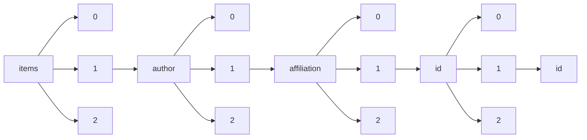

!!! warning "This document is not official Crossref documentation"
# Id
PATH = items/array/author/array/affiliation/array/id/array/id(1)  
Occurs 99 389 times  
Unique values: > 999  
{ .annotate }

1. A route to an element, for example:  
   The route "items/array/author/array/affiliation/array/id/array/id" corresponds to navigating through the JSON indices as  
   ["items"][0]["author"][0]["affiliation"][0]["id"][0]["id"]  

!!! note "Due to current limitations, only the first 1,000 unique values are counted."

| **Row** | **Value** `String`                    | **Count** `Int64` |
|--------:|-----------------------------------------:|---------------------:|
| **1**   | https://ror.org/05hepy730                | 3 559                |
| **2**   | https://ror.org/04qw24q55                | 820                  |
| **3**   | https://ror.org/043mz5j54                | 813                  |
| **4**   | https://ror.org/03vek6s52                | 791                  |
| **5**   | https://www.isni.org/0000000120190559    | 771                  |
| **6**   | https://ror.org/043ddq142                | 771                  |
| **7**   | https://www.wikidata.org/entity/Q3262326 | 771                  |
| **8**   | https://ror.org/052gg0110                | 760                  |
| **9**   | https://ror.org/00f54p054                | 757                  |
| **10**  | https://ror.org/034t30j35                | 738                  |
| **11**  | https://ror.org/01pnej532                | 695                  |
| **12**  | https://ror.org/01an7q238                | 610                  |
| **13**  | https://ror.org/01rxvg760                | 605                  |
| **14**  | https://ror.org/00jmfr291                | 585                  |
| **15**  | https://ror.org/00hx57361                | 583                  |
| **16**  | https://ror.org/00a2xv884                | 537                  |
| **17**  | https://ror.org/02jx3x895                | 526                  |
| **18**  | https://ror.org/0220qvk04                | 522                  |
| **19**  | https://ror.org/00p991c53                | 521                  |
| **20**  | https://ror.org/013meh722                | 513                  |
| **21**  | https://ror.org/042nb2s44                | 511                  |
| **22**  | https://ror.org/00b30xv10                | 509                  |
| **23**  | https://ror.org/00py81415                | 501                  |
| **24**  | https://ror.org/00cvxb145                | 469                  |
| **25**  | https://ror.org/03v76x132                | 451                  |
| **26**  | https://ror.org/00za53h95                | 450                  |
| **27**  | https://ror.org/046rm7j60                | 448                  |
| **28**  | https://ror.org/03cve4549                | 428                  |
| **29**  | https://ror.org/0190ak572                | 415                  |
| **30**  | https://ror.org/02pttbw34                | 414                  |
| **31**  | https://ror.org/01dv3hq14                | 397                  |
| **32**  | https://ror.org/0153tk833                | 391                  |
| **33**  | https://ror.org/0168r3w48                | 389                  |
| **34**  | https://ror.org/01yc7t268                | 376                  |
| **35**  | https://ror.org/01skt4w74                | 375                  |
| **36**  | https://ror.org/00hj8s172                | 372                  |
| **37**  | https://ror.org/02v51f717                | 356                  |
| **38**  | https://ror.org/01y2jtd41                | 354                  |
| **39**  | https://ror.org/012tb2g32                | 353                  |
| **40**  | https://ror.org/01nrxwf90                | 351                  |
| **41**  | https://ror.org/01vy4gh70                | 341                  |
| **42**  | https://ror.org/02e3zdp86                | 338                  |
| **43**  | https://ror.org/04a9tmd77                | 330                  |
| **44**  | https://ror.org/0130frc33                | 326                  |
| **45**  | https://ror.org/013q1eq08                | 323                  |
| **46**  | https://ror.org/011ashp19                | 309                  |
| **47**  | https://ror.org/00cv9y106                | 306                  |
| **48**  | https://ror.org/035b05819                | 305                  |
| **49**  | https://ror.org/01cwqze88                | 302                  |
| **50**  | https://ror.org/006w34k90                | 301                  |
| **51**  | https://ror.org/03taz7m60                | 300                  |
| **52**  | https://ror.org/04c4dkn09                | 300                  |
| **53**  | https://ror.org/017zhmm22                | 297                  |
| **54**  | https://ror.org/05d2yfz11                | 290                  |
| **55**  | https://ror.org/01ej9dk98                | 285                  |
| **56**  | https://ror.org/0464eyp60                | 283                  |
| **57**  | https://ror.org/01y1kjr75                | 282                  |
| **58**  | https://ror.org/05bnh6r87                | 282                  |
| **59**  | https://ror.org/03rmrcq20                | 280                  |
| **60**  | https://ror.org/024mw5h28                | 280                  |
| **61**  | https://ror.org/0220mzb33                | 270                  |
| **62**  | https://ror.org/05rrcem69                | 269                  |
| **63**  | https://ror.org/041kmwe10                | 265                  |
| **64**  | https://ror.org/03dbr7087                | 265                  |
| **65**  | https://ror.org/04v76ef78                | 249                  |
| **66**  | https://ror.org/04qr3zq92                | 246                  |
| **67**  | https://ror.org/02n96ep67                | 240                  |
| **68**  | https://ror.org/00js3aw79                | 236                  |
| **69**  | https://ror.org/05f950310                | 229                  |
| **70**  | https://ror.org/0207yh398                | 228                  |
| **71**  | https://ror.org/02xe5ns62                | 226                  |
| **72**  | https://ror.org/057zh3y96                | 225                  |
| **73**  | https://ror.org/04p491231                | 225                  |
| **74**  | https://ror.org/03efmqc40                | 225                  |
| **75**  | https://ror.org/05a28rw58                | 224                  |
| **76**  | https://ror.org/01js2sh04                | 222                  |
| **77**  | https://ror.org/002pd6e78                | 219                  |
| **78**  | https://ror.org/01an3r305                | 218                  |
| **79**  | https://ror.org/05d5mza29                | 217                  |
| **80**  | https://ror.org/056d84691                | 216                  |
| **81**  | https://ror.org/01wp2jz98                | 216                  |
| **82**  | https://ror.org/052tfza37                | 214                  |
| **83**  | https://ror.org/03m2x1q45                | 213                  |
| **84**  | https://ror.org/0524sp257                | 213                  |
| **85**  | https://ror.org/00mcjh785                | 209                  |
| **86**  | https://ror.org/022mv6k27                | 208                  |
| **87**  | https://ror.org/05x2bcf33                | 207                  |
| **88**  | https://ror.org/03r0ha626                | 207                  |
| **89**  | https://ror.org/001w7jn25                | 202                  |
| **90**  | https://ror.org/013sk6x84                | 200                  |
| **91**  | https://ror.org/02feahw73                | 200                  |
| **92**  | https://ror.org/04gyf1771                | 194                  |
| **93**  | https://ror.org/01pxwe438                | 193                  |
| **94**  | https://ror.org/02vjkv261                | 192                  |
| **95**  | https://ror.org/02grkyz14                | 191                  |
| **96**  | https://ror.org/000e0be47                | 191                  |
| **97**  | https://ror.org/047s2c258                | 190                  |
| **98**  | https://ror.org/04w9fbh59                | 190                  |
| **99**  | https://ror.org/05s92vm98                | 188                  |
| **100** | https://ror.org/007ps6h72                | 187                  |
| **101** | https://ror.org/048dd0611                | 186                  |
| **102** | https://ror.org/0420db125                | 186                  |
| **103** | https://ror.org/02kpeqv85                | 185                  |
| **104** | https://ror.org/02cp04407                | 185                  |
| **105** | https://ror.org/04dkp9463                | 182                  |
| **106** | https://ror.org/03g897070                | 181                  |
| **107** | https://ror.org/04azbjn80                | 181                  |
| **108** | https://ror.org/00wk2mp56                | 180                  |
| **109** | https://ror.org/05byvp690                | 179                  |
| **110** | https://ror.org/01swzsf04                | 178                  |
| **111** | https://ror.org/017zqws13                | 178                  |
| **112** | https://ror.org/01ryk1543                | 178                  |
| **113** | https://ror.org/00vtgdb53                | 177                  |
| **114** | https://ror.org/03x80pn82                | 177                  |
| **115** | https://ror.org/01yqg2h08                | 177                  |
| **116** | https://ror.org/035xkbk20                | 177                  |
| **117** | https://ror.org/022kthw22                | 176                  |
| **118** | https://ror.org/05dxps055                | 175                  |
| **119** | https://ror.org/033vjfk17                | 173                  |
| **120** | https://ror.org/02crff812                | 173                  |
| **121** | https://ror.org/01wxdvj03                | 171                  |
| **122** | https://ror.org/02en5vm52                | 171                  |
| **123** | https://ror.org/02kkvpp62                | 168                  |
| **124** | https://ror.org/036rp1748                | 168                  |
| **125** | https://ror.org/04ct4d772                | 167                  |
| **126** | https://ror.org/02qsmb048                | 164                  |
| **127** | https://ror.org/0384j8v12                | 163                  |
| **128** | https://ror.org/05qbk4x57                | 162                  |
| **129** | https://ror.org/00hj54h04                | 162                  |
| **130** | https://ror.org/03wmf1y16                | 161                  |
| **131** | https://ror.org/05t8y2r12                | 161                  |
| **132** | https://ror.org/02vm5rt34                | 161                  |
| **133** | https://ror.org/006teas31                | 160                  |
| **134** | https://ror.org/0064kty71                | 159                  |
| **135** | https://ror.org/02czkny70                | 158                  |
| **136** | https://ror.org/02s376052                | 158                  |
| **137** | https://ror.org/012a77v79                | 157                  |
| **138** | https://ror.org/01aj84f44                | 154                  |
| **139** | https://ror.org/023rhb549                | 153                  |
| **140** | https://ror.org/0316ej306                | 152                  |
| **141** | https://ror.org/03qxff017                | 152                  |
| **142** | https://ror.org/01kq0pv72                | 151                  |
| **143** | https://ror.org/022fs9h90                | 150                  |
| **144** | https://ror.org/03prydq77                | 149                  |
| **145** | https://ror.org/02bfwt286                | 149                  |
| **146** | https://ror.org/05wg1m734                | 149                  |
| **147** | https://ror.org/03yghzc09                | 148                  |
| **148** | https://ror.org/0245cg223                | 147                  |
| **149** | https://ror.org/05xpvk416                | 146                  |
| **150** | https://ror.org/02jzgtq86                | 145                  |
| **151** | https://ror.org/036jqmy94                | 144                  |
| **152** | https://ror.org/04tnbqb63                | 143                  |
| **153** | https://ror.org/02ttsq026                | 142                  |
| **154** | https://ror.org/049v75w11                | 142                  |
| **155** | https://ror.org/03y3e3s17                | 141                  |
| **156** | https://ror.org/038t36y30                | 141                  |
| **157** | https://ror.org/00ay9v204                | 138                  |
| **158** | https://ror.org/027m9bs27                | 137                  |
| **159** | https://ror.org/03c4mmv16                | 137                  |
| **160** | https://ror.org/010pmpe69                | 135                  |
| **161** | https://ror.org/03eh3y714                | 132                  |
| **162** | https://ror.org/01yj56c84                | 130                  |
| **163** | https://ror.org/02jbv0t02                | 129                  |
| **164** | https://ror.org/030bhh786                | 129                  |
| **165** | https://ror.org/048a87296                | 128                  |
| **166** | https://ror.org/01hcyya48                | 128                  |
| **167** | https://ror.org/035t8zc32                | 127                  |
| **168** | https://ror.org/04twxam07                | 125                  |
| **169** | https://ror.org/04pp8hn57                | 124                  |
| **170** | https://ror.org/00mkhxb43                | 123                  |
| **171** | https://ror.org/00se2k293                | 123                  |
| **172** | https://ror.org/00rd5t069                | 122                  |
| **173** | https://ror.org/05abbep66                | 121                  |
| **174** | https://ror.org/02tyrky19                | 121                  |
| **175** | https://ror.org/04mhzgx49                | 121                  |
| **176** | https://ror.org/05gq02987                | 120                  |
| **177** | https://ror.org/05v1y0t93                | 120                  |
| **178** | https://ror.org/05591te55                | 119                  |
| **179** | https://ror.org/02y3ad647                | 119                  |
| **180** | https://ror.org/02xf66n48                | 119                  |
| **181** | https://ror.org/03xjwb503                | 119                  |
| **182** | https://ror.org/01esghr10                | 119                  |
| **183** | https://ror.org/05gvnxz63                | 118                  |
| **184** | https://ror.org/00rcxh774                | 118                  |
| **185** | https://ror.org/03mstc592                | 118                  |
| **186** | https://ror.org/047bp1713                | 117                  |
| **187** | https://ror.org/040af2s02                | 116                  |
| **188** | https://ror.org/05qwgg493                | 116                  |
| **189** | https://ror.org/03angcq70                | 115                  |
| **190** | https://ror.org/01wy3h363                | 114                  |
| **191** | https://ror.org/01jsq2704                | 114                  |
| **192** | https://ror.org/02dgjyy92                | 111                  |
| **193** | https://ror.org/05g3dte14                | 110                  |
| **194** | https://ror.org/01p884a79                | 110                  |
| **195** | https://www.isni.org/0000000121654861    | 110                  |
| **196** | https://ror.org/04mz5ra38                | 109                  |
| **197** | https://ror.org/05cf8a891                | 109                  |
| **198** | https://ror.org/01y0j0j86                | 109                  |
| **199** | https://ror.org/04ypx8c21                | 109                  |
| **200** | https://ror.org/03xjacd83                | 108                  |
| **201** | https://ror.org/01xtthb56                | 108                  |
| **202** | https://ror.org/00pd74e08                | 108                  |
| **203** | https://ror.org/03czfpz43                | 105                  |
| **204** | https://ror.org/008xxew50                | 105                  |
| **205** | https://ror.org/03a1kwz48                | 104                  |
| **206** | https://ror.org/012rct222                | 104                  |
| **207** | https://ror.org/00f7hpc57                | 104                  |
| **208** | https://ror.org/03et85d35                | 103                  |
| **209** | https://www.isni.org/000000012158463X    | 103                  |
| **210** | https://ror.org/00xkeyj56                | 102                  |
| **211** | https://ror.org/05htk5m33                | 102                  |
| **212** | https://ror.org/029t2gr02                | 102                  |
| **213** | https://ror.org/05qpz1x62                | 101                  |
| **214** | https://ror.org/03rc6as71                | 100                  |
| **215** | https://ror.org/05a0ya142                | 100                  |
| **216** | https://ror.org/05vt9qd57                | 100                  |
| **217** | https://ror.org/01394d192                | 99                   |
| **218** | https://ror.org/04xfq0f34                | 99                   |
| **219** | https://ror.org/00f1zfq44                | 99                   |
| **220** | https://ror.org/02s6k3f65                | 98                   |
| **221** | https://ror.org/05bqach95                | 98                   |
| **222** | https://ror.org/013cjyk83                | 97                   |
| **223** | https://ror.org/05apxxy63                | 97                   |
| **224** | https://ror.org/042aqky30                | 97                   |
| **225** | https://ror.org/0293rh119                | 97                   |
| **226** | https://ror.org/02dqehb95                | 96                   |
| **227** | https://ror.org/04r1cxt79                | 96                   |
| **228** | https://ror.org/049tv2d57                | 96                   |
| **229** | https://ror.org/04h9pn542                | 95                   |
| **230** | https://ror.org/02dxx6824                | 95                   |
| **231** | https://ror.org/04n0g0b29                | 95                   |
| **232** | https://ror.org/041nas322                | 95                   |
| **233** | https://ror.org/04b6nzv94                | 95                   |
| **234** | https://ror.org/0161xgx34                | 94                   |
| **235** | https://ror.org/05f82e368                | 94                   |
| **236** | https://ror.org/009avj582                | 94                   |
| **237** | https://ror.org/01zgy1s35                | 94                   |
| **238** | https://ror.org/051fd9666                | 93                   |
| **239** | https://ror.org/02an57k10                | 93                   |
| **240** | https://ror.org/01znkr924                | 93                   |
| **241** | https://ror.org/0530pts50                | 93                   |
| **242** | https://ror.org/05qrfxd25                | 93                   |
| **243** | https://ror.org/05etxs293                | 93                   |
| **244** | https://ror.org/04v3ywz14                | 93                   |
| **245** | https://ror.org/05xvt9f17                | 93                   |
| **246** | https://ror.org/00t9vx427                | 92                   |
| **247** | https://ror.org/033eqas34                | 91                   |
| **248** | https://ror.org/01f5ytq51                | 91                   |
| **249** | https://ror.org/05krs5044                | 91                   |
| **250** | https://ror.org/0011qv509                | 90                   |
| **251** | https://ror.org/04qtj9h94                | 90                   |
| **252** | https://ror.org/01e3m7079                | 90                   |
| **253** | https://ror.org/05arjae42                | 90                   |
| **254** | https://ror.org/02fa3aq29                | 89                   |
| **255** | https://ror.org/00rqy9422                | 89                   |
| **256** | https://ror.org/02yrq0923                | 88                   |
| **257** | https://ror.org/05gzmn429                | 88                   |
| **258** | https://ror.org/02qp3tb03                | 88                   |
| **259** | https://ror.org/02t274463                | 87                   |
| **260** | https://ror.org/019whta54                | 87                   |
| **261** | https://ror.org/00xp9wg62                | 86                   |
| **262** | https://ror.org/05hs6h993                | 86                   |
| **263** | https://ror.org/04t0gwh46                | 85                   |
| **264** | https://ror.org/02nkdxk79                | 85                   |
| **265** | https://ror.org/043j0f473                | 85                   |
| **266** | https://ror.org/03h2bxq36                | 84                   |
| **267** | https://ror.org/00kx1jb78                | 84                   |
| **268** | https://ror.org/01tgyzw49                | 83                   |
| **269** | https://ror.org/01tm6cn81                | 82                   |
| **270** | https://ror.org/03av75f26                | 82                   |
| **271** | https://ror.org/04mkzax54                | 82                   |
| **272** | https://ror.org/0495fxg12                | 81                   |
| **273** | https://ror.org/00rs6vg23                | 80                   |
| **274** | https://ror.org/02ex6cf31                | 79                   |
| **275** | https://ror.org/05n3x4p02                | 78                   |
| **276** | https://ror.org/016xsfp80                | 78                   |
| **277** | https://ror.org/03kgsv495                | 78                   |
| **278** | https://ror.org/04cvxnb49                | 77                   |
| **279** | https://ror.org/02der9h97                | 77                   |
| **280** | https://ror.org/00seraz22                | 77                   |
| **281** | https://ror.org/05xg72x27                | 77                   |
| **282** | https://ror.org/01kg8sb98                | 77                   |
| **283** | https://ror.org/04t3en479                | 76                   |
| **284** | https://ror.org/023b72294                | 76                   |
| **285** | https://ror.org/012p63287                | 76                   |
| **286** | https://ror.org/05qghxh33                | 76                   |
| **287** | https://ror.org/00j9c2840                | 76                   |
| **288** | https://ror.org/023hj5876                | 76                   |
| **289** | https://ror.org/019wvm592                | 75                   |
| **290** | https://ror.org/0202bj006                | 75                   |
| **291** | https://ror.org/05th6yx34                | 75                   |
| **292** | https://ror.org/02550n020                | 74                   |
| **293** | https://ror.org/01zkghx44                | 74                   |
| **294** | https://ror.org/03yh0n709                | 74                   |
| **295** | https://ror.org/057q4rt57                | 74                   |
| **296** | https://ror.org/02zhqgq86                | 74                   |
| **297** | https://ror.org/00dcv1019                | 73                   |
| **298** | https://ror.org/04eymdx19                | 72                   |
| **299** | https://ror.org/037b1pp87                | 72                   |
| **300** | https://ror.org/021ft0n22                | 71                   |
| **301** | https://ror.org/03yjb2x39                | 70                   |
| **302** | https://ror.org/04dese585                | 70                   |
| **303** | https://ror.org/057qpr032                | 70                   |
| **304** | https://ror.org/05cz92x43                | 70                   |
| **305** | https://ror.org/05f0yaq80                | 69                   |
| **306** | https://ror.org/02txfnf15                | 69                   |
| **307** | https://ror.org/00tw3jy02                | 68                   |
| **308** | https://ror.org/032000t02                | 68                   |
| **309** | https://ror.org/01xjv7358                | 68                   |
| **310** | https://ror.org/05kb8h459                | 68                   |
| **311** | https://ror.org/00thqtb16                | 67                   |
| **312** | https://ror.org/01kj2bm70                | 67                   |
| **313** | https://ror.org/02qs1a797                | 67                   |
| **314** | https://ror.org/037b5pv06                | 67                   |
| **315** | https://ror.org/03tgsfw79                | 66                   |
| **316** | https://ror.org/04a7f6w43                | 66                   |
| **317** | https://ror.org/00xa57a59                | 66                   |
| **318** | https://ror.org/02rx3b187                | 66                   |
| **319** | https://ror.org/046ak2485                | 66                   |
| **320** | https://ror.org/0160cpw27                | 66                   |
| **321** | https://ror.org/02k7v4d05                | 66                   |
| **322** | https://ror.org/00hn7w693                | 66                   |
| **323** | https://ror.org/0444j5556                | 66                   |
| **324** | https://ror.org/03qryx823                | 65                   |
| **325** | https://ror.org/03r8z3t63                | 65                   |
| **326** | https://ror.org/01a77tt86                | 65                   |
| **327** | https://ror.org/02nv7yv05                | 65                   |
| **328** | https://ror.org/02qg15b79                | 64                   |
| **329** | https://ror.org/04vnq7t77                | 64                   |
| **330** | https://ror.org/04py35477                | 64                   |
| **331** | https://ror.org/01sf06y89                | 63                   |
| **332** | https://ror.org/02txedb84                | 63                   |
| **333** | https://ror.org/051hvcm98                | 63                   |
| **334** | https://ror.org/04teye511                | 63                   |
| **335** | https://www.isni.org/0000000119440258    | 63                   |
| **336** | https://ror.org/00n3w3b69                | 63                   |
| **337** | https://ror.org/01kj4z117                | 62                   |
| **338** | https://ror.org/05vapw332                | 62                   |
| **339** | https://ror.org/019tgvf94                | 62                   |
| **340** | https://ror.org/01r9htc13                | 62                   |
| **341** | https://ror.org/023rffy11                | 62                   |
| **342** | https://ror.org/011xvna82                | 61                   |
| **343** | https://ror.org/03xez1567                | 61                   |
| **344** | https://ror.org/02y0rxk19                | 61                   |
| **345** | https://ror.org/03pt86f80                | 60                   |
| **346** | https://ror.org/00qqv6244                | 60                   |
| **347** | https://ror.org/01y9bpm73                | 60                   |
| **348** | https://ror.org/03fe7t173                | 59                   |
| **349** | https://ror.org/02mpq6x41                | 59                   |
| **350** | https://ror.org/04xysgw12                | 59                   |
| **351** | https://ror.org/01tmp8f25                | 59                   |
| **352** | https://ror.org/01qz5mb56                | 59                   |
| **353** | https://ror.org/01hcx6992                | 59                   |
| **354** | https://ror.org/01j7c0b24                | 59                   |
| **355** | https://ror.org/02pjx9m11                | 58                   |
| **356** | https://ror.org/05fs6jp91                | 58                   |
| **357** | https://ror.org/02catss52                | 58                   |
| **358** | https://ror.org/03kv08d37                | 57                   |
| **359** | https://ror.org/0282m7c06                | 57                   |
| **360** | https://ror.org/008s83205                | 57                   |
| **361** | https://ror.org/01adr0w49                | 57                   |
| **362** | https://ror.org/039bjqg32                | 57                   |
| **363** | https://ror.org/00a0jsq62                | 56                   |
| **364** | https://ror.org/047426m28                | 56                   |
| **365** | https://ror.org/01mkqqe32                | 56                   |
| **366** | https://ror.org/022k4wk35                | 56                   |
| **367** | https://ror.org/01q3tbs38                | 56                   |
| **368** | https://ror.org/00dvg7y05                | 55                   |
| **369** | https://ror.org/0081fs513                | 55                   |
| **370** | https://ror.org/05wvpxv85                | 55                   |
| **371** | https://ror.org/01g9ty582                | 55                   |
| **372** | https://ror.org/020azk594                | 54                   |
| **373** | https://ror.org/008zs3103                | 54                   |
| **374** | https://ror.org/041nk4h53                | 54                   |
| **375** | https://ror.org/04bgfm609                | 54                   |
| **376** | https://ror.org/026vcq606                | 54                   |
| **377** | https://ror.org/036nfer12                | 54                   |
| **378** | https://ror.org/02gfc7t72                | 54                   |
| **379** | https://ror.org/01c27hj86                | 54                   |
| **380** | https://ror.org/00afp2z80                | 54                   |
| **381** | https://ror.org/01sjwvz98                | 54                   |
| **382** | https://ror.org/04p5ggc03                | 54                   |
| **383** | https://ror.org/034m6ke32                | 53                   |
| **384** | https://ror.org/04sjchr03                | 53                   |
| **385** | https://ror.org/059gcgy73                | 53                   |
| **386** | https://ror.org/00s13br28                | 53                   |
| **387** | https://ror.org/03gds6c39                | 52                   |
| **388** | https://ror.org/01b6kha49                | 52                   |
| **389** | https://ror.org/043z4tv69                | 52                   |
| **390** | https://ror.org/043mer456                | 52                   |
| **391** | https://ror.org/03v4j0e89                | 52                   |
| **392** | https://ror.org/016zvc994                | 51                   |
| **393** | https://ror.org/02egmk993                | 51                   |
| **394** | https://ror.org/04mghma93                | 51                   |
| **395** | https://ror.org/02smfhw86                | 51                   |
| **396** | https://ror.org/02bn68w95                | 50                   |
| **397** | https://ror.org/037zgn354                | 50                   |
| **398** | https://ror.org/00zat6v61                | 50                   |
| **399** | https://ror.org/01cby8j38                | 50                   |
| **400** | https://ror.org/03egfjv78                | 50                   |
| **401** | https://ror.org/0387jng26                | 49                   |
| **402** | https://ror.org/0176yjw32                | 49                   |
| **403** | https://ror.org/01s5ya894                | 49                   |
| **404** | https://ror.org/026zzn846                | 48                   |
| **405** | https://ror.org/00t33hh48                | 48                   |
| **406** | https://ror.org/018hded08                | 48                   |
| **407** | https://ror.org/00f2yqf98                | 48                   |
| **408** | https://ror.org/04m01e293                | 48                   |
| **409** | https://ror.org/02xvvvp28                | 48                   |
| **410** | https://ror.org/012jban78                | 47                   |
| **411** | https://ror.org/047dqcg40                | 47                   |
| **412** | https://ror.org/04qmmjx98                | 47                   |
| **413** | https://ror.org/03ht1xw27                | 47                   |
| **414** | https://ror.org/00fbnyb24                | 47                   |
| **415** | https://ror.org/05gbn2817                | 47                   |
| **416** | https://ror.org/02e2c7k09                | 46                   |
| **417** | https://ror.org/02c2kyt77                | 46                   |
| **418** | https://ror.org/04khwmr87                | 46                   |
| **419** | https://ror.org/02122at02                | 46                   |
| **420** | https://ror.org/05c1yfj14                | 46                   |
| **421** | https://ror.org/007mntk44                | 46                   |
| **422** | https://ror.org/02d4c4y02                | 46                   |
| **423** | https://www.isni.org/0000000097097726    | 45                   |
| **424** | https://ror.org/04tfzc498                | 45                   |
| **425** | https://ror.org/01vevwk45                | 45                   |
| **426** | https://ror.org/0155zta11                | 45                   |
| **427** | https://www.wikidata.org/entity/Q1341845 | 45                   |
| **428** | https://ror.org/03q648j11                | 44                   |
| **429** | https://ror.org/04txgxn49                | 44                   |
| **430** | https://ror.org/01070mq45                | 44                   |
| **431** | https://ror.org/03mzbmf11                | 44                   |
| **432** | https://ror.org/05b8d3w18                | 44                   |
| **433** | https://ror.org/045c7t348                | 44                   |
| **434** | https://ror.org/04ww21r56                | 44                   |
| **435** | https://ror.org/00965bg92                | 44                   |
| **436** | https://ror.org/057w15z03                | 44                   |
| **437** | https://ror.org/0534re684                | 43                   |
| **438** | https://ror.org/03cqe8w59                | 43                   |
| **439** | https://ror.org/049s0rh22                | 43                   |
| **440** | https://ror.org/02mr3ar13                | 43                   |
| **441** | https://ror.org/02cgss904                | 43                   |
| **442** | https://ror.org/0015ws592                | 43                   |
| **443** | https://ror.org/037s24f05                | 42                   |
| **444** | https://ror.org/00y4zzh67                | 42                   |
| **445** | https://ror.org/05nkgk822                | 42                   |
| **446** | https://ror.org/05j0ve876                | 42                   |
| **447** | https://ror.org/01dq60k83                | 42                   |
| **448** | https://ror.org/013xs5b60                | 42                   |
| **449** | https://ror.org/01rxfrp27                | 42                   |
| **450** | https://ror.org/04nytyj38                | 42                   |
| **451** | https://ror.org/03f9nc143                | 41                   |
| **452** | https://ror.org/00trqv719                | 41                   |
| **453** | https://ror.org/04rdtx186                | 41                   |
| **454** | https://ror.org/03frdh605                | 41                   |
| **455** | https://ror.org/0576gt767                | 41                   |
| **456** | https://ror.org/04tsk2644                | 41                   |
| **457** | https://ror.org/03bea9k73                | 41                   |
| **458** | https://ror.org/040gcmg81                | 41                   |
| **459** | https://ror.org/0112mx960                | 41                   |
| **460** | https://ror.org/01703db54                | 41                   |
| **461** | https://ror.org/01rk35k63                | 40                   |
| **462** | https://ror.org/05j6ybs54                | 40                   |
| **463** | https://ror.org/04mb6s476                | 40                   |
| **464** | https://ror.org/02djqfd08                | 40                   |
| **465** | https://ror.org/01hjzeq58                | 40                   |
| **466** | https://ror.org/0170z8493                | 40                   |
| **467** | https://ror.org/04vmvtb21                | 40                   |
| **468** | https://ror.org/02kcbn207                | 40                   |
| **469** | https://ror.org/018906e22                | 40                   |
| **470** | https://ror.org/005edt527                | 40                   |
| **471** | https://ror.org/01faaaf77                | 39                   |
| **472** | https://ror.org/01e6qks80                | 39                   |
| **473** | https://ror.org/02r109517                | 39                   |
| **474** | https://ror.org/05tkyf982                | 39                   |
| **475** | https://ror.org/01a099706                | 39                   |
| **476** | https://ror.org/02rxc7m23                | 39                   |
| **477** | https://ror.org/020f3ap87                | 39                   |
| **478** | https://ror.org/01keh0577                | 39                   |
| **479** | https://ror.org/02pc6pc55                | 39                   |
| **480** | https://ror.org/02czsnj07                | 39                   |
| **481** | https://ror.org/02be6w209                | 39                   |
| **482** | https://ror.org/02e7b5302                | 39                   |
| **483** | https://ror.org/03net5943                | 39                   |
| **484** | https://ror.org/04xs57h96                | 38                   |
| **485** | https://ror.org/04t5xt781                | 38                   |
| **486** | https://ror.org/024mrxd33                | 38                   |
| **487** | https://ror.org/03c9ncn37                | 38                   |
| **488** | https://ror.org/00cb3km46                | 38                   |
| **489** | https://ror.org/01g9vbr38                | 38                   |
| **490** | https://ror.org/02956yf07                | 38                   |
| **491** | https://ror.org/03b94tp07                | 38                   |
| **492** | https://ror.org/01d5qpn59                | 38                   |
| **493** | https://ror.org/05hfa4n20                | 38                   |
| **494** | https://ror.org/00e4hrk88                | 38                   |
| **495** | https://ror.org/03kpps236                | 38                   |
| **496** | https://ror.org/01p5m7v59                | 38                   |
| **497** | https://ror.org/003vg9w96                | 37                   |
| **498** | https://ror.org/03rke0285                | 37                   |
| **499** | https://ror.org/021wm7p51                | 37                   |
| **500** | https://ror.org/03gnh5541                | 37                   |
| **501** | https://ror.org/03njmea73                | 37                   |
| **502** | https://ror.org/029brtt94                | 37                   |
| **503** | https://ror.org/01wspgy28                | 37                   |
| **504** | https://ror.org/04rswrd78                | 37                   |
| **505** | https://ror.org/013czdx64                | 37                   |
| **506** | https://ror.org/012zs8222                | 36                   |
| **507** | https://ror.org/00y0xnp53                | 36                   |
| **508** | https://ror.org/036x5ad56                | 36                   |
| **509** | https://ror.org/02mh8wx89                | 36                   |
| **510** | https://ror.org/0234wmv40                | 36                   |
| **511** | https://ror.org/03br1wy20                | 36                   |
| **512** | https://ror.org/039vqpp67                | 36                   |
| **513** | https://ror.org/03vpj4s62                | 36                   |
| **514** | https://ror.org/03kk7td41                | 36                   |
| **515** | https://ror.org/03ysstz10                | 36                   |
| **516** | https://ror.org/048fyec77                | 35                   |
| **517** | https://ror.org/02y72wh86                | 35                   |
| **518** | https://ror.org/02f99v835                | 35                   |
| **519** | https://ror.org/00t3r8h32                | 35                   |
| **520** | https://ror.org/00g30e956                | 35                   |
| **521** | https://ror.org/00v0z9322                | 35                   |
| **522** | https://ror.org/02e16g702                | 35                   |
| **523** | https://ror.org/04s5mat29                | 35                   |
| **524** | https://ror.org/005dvqh91                | 35                   |
| **525** | https://ror.org/03893we55                | 35                   |
| **526** | https://ror.org/0135d1r83                | 35                   |
| **527** | https://ror.org/00wm07d60                | 35                   |
| **528** | https://ror.org/05x2f1m38                | 35                   |
| **529** | https://ror.org/03s65by71                | 35                   |
| **530** | https://ror.org/055yf1005                | 35                   |
| **531** | https://ror.org/039bp8j42                | 34                   |
| **532** | https://ror.org/01jdpyv68                | 34                   |
| **533** | https://ror.org/03t78wx29                | 34                   |
| **534** | https://ror.org/01wjejq96                | 34                   |
| **535** | https://ror.org/05r3f7h03                | 34                   |
| **536** | https://ror.org/044ntvm43                | 34                   |
| **537** | https://ror.org/05rehad94                | 34                   |
| **538** | https://ror.org/002n09z45                | 34                   |
| **539** | https://ror.org/04vqm6w82                | 34                   |
| **540** | https://ror.org/01tx6pn92                | 34                   |
| **541** | https://ror.org/002h8g185                | 34                   |
| **542** | https://ror.org/03p3aeb86                | 34                   |
| **543** | https://ror.org/0546hnb39                | 34                   |
| **544** | https://ror.org/04kj1hn59                | 34                   |
| **545** | https://ror.org/05j7fep28                | 34                   |
| **546** | https://ror.org/02aj13c28                | 34                   |
| **547** | https://ror.org/01dr6c206                | 33                   |
| **548** | https://ror.org/01yp9g959                | 33                   |
| **549** | https://ror.org/01z7r7q48                | 33                   |
| **550** | https://ror.org/005y2ap84                | 33                   |
| **551** | https://ror.org/01vjw4z39                | 33                   |
| **552** | https://ror.org/02zxrsc32                | 33                   |
| **553** | https://ror.org/00z3td547                | 33                   |
| **554** | https://ror.org/04zyhq975                | 33                   |
| **555** | https://ror.org/05m7pjf47                | 33                   |
| **556** | https://ror.org/05grdyy37                | 32                   |
| **557** | https://ror.org/01ydb3330                | 32                   |
| **558** | https://ror.org/00qm4t918                | 32                   |
| **559** | https://ror.org/00k9x6n46                | 32                   |
| **560** | https://ror.org/04gh4er46                | 32                   |
| **561** | https://ror.org/01vyrm377                | 32                   |
| **562** | https://ror.org/049tgcd06                | 32                   |
| **563** | https://ror.org/04edeq073                | 32                   |
| **564** | https://ror.org/02kn6nx58                | 32                   |
| **565** | https://ror.org/02dqdxm48                | 32                   |
| **566** | https://ror.org/02pammg90                | 32                   |
| **567** | https://ror.org/051escj72                | 32                   |
| **568** | https://ror.org/04d836q62                | 32                   |
| **569** | https://ror.org/03tqb8s11                | 31                   |
| **570** | https://ror.org/00240q980                | 31                   |
| **571** | https://ror.org/04c8eg608                | 31                   |
| **572** | https://ror.org/036trcv74                | 31                   |
| **573** | https://ror.org/04xx1tc24                | 31                   |
| **574** | https://ror.org/05fwr8z16                | 31                   |
| **575** | https://ror.org/00pwgnh47                | 31                   |
| **576** | https://ror.org/03gq8fr08                | 31                   |
| **577** | https://ror.org/01c3rrh15                | 31                   |
| **578** | https://ror.org/02j89k719                | 31                   |
| **579** | https://ror.org/040djv263                | 30                   |
| **580** | https://ror.org/0072zz521                | 30                   |
| **581** | https://ror.org/03ypbx660                | 30                   |
| **582** | https://ror.org/018159086                | 30                   |
| **583** | https://ror.org/00znqwq11                | 30                   |
| **584** | https://www.isni.org/0000000405977726    | 30                   |
| **585** | https://ror.org/01vj9qy35                | 30                   |
| **586** | https://ror.org/02qyf5152                | 30                   |
| **587** | https://ror.org/000xsnr85                | 30                   |
| **588** | https://ror.org/04gndp242                | 30                   |
| **589** | https://ror.org/04g3dn724                | 30                   |
| **590** | https://ror.org/03xqtf034                | 30                   |
| **591** | https://ror.org/0313jb750                | 30                   |
| **592** | https://ror.org/00f7srh09                | 30                   |
| **593** | https://ror.org/01y64my43                | 29                   |
| **594** | https://ror.org/02vj4rn06                | 29                   |
| **595** | https://ror.org/05csn2x06                | 29                   |
| **596** | https://ror.org/010x8gc63                | 29                   |
| **597** | https://ror.org/0165r2y73                | 29                   |
| **598** | https://ror.org/01scyh794                | 29                   |
| **599** | https://ror.org/01nffqt88                | 29                   |
| **600** | https://ror.org/03v0r5n49                | 29                   |
| **601** | https://ror.org/03bzbv419                | 29                   |
| **602** | https://ror.org/02afjh072                | 28                   |
| **603** | https://ror.org/05dq2gs74                | 28                   |
| **604** | https://ror.org/00zdnkx70                | 28                   |
| **605** | https://ror.org/04k51q396                | 28                   |
| **606** | https://ror.org/00190t495                | 28                   |
| **607** | https://ror.org/03yxnpp24                | 28                   |
| **608** | https://ror.org/023znxa73                | 28                   |
| **609** | https://ror.org/02778hg05                | 28                   |
| **610** | https://ror.org/0304hq317                | 28                   |
| **611** | https://ror.org/05r7n9c40                | 28                   |
| **612** | https://ror.org/02a8bt934                | 28                   |
| **613** | https://ror.org/04q78tk20                | 27                   |
| **614** | https://ror.org/01bmjkv45                | 27                   |
| **615** | https://ror.org/05cy4wa09                | 27                   |
| **616** | https://ror.org/043jzw605                | 27                   |
| **617** | https://ror.org/047rhhm47                | 27                   |
| **618** | https://ror.org/053w1zy07                | 27                   |
| **619** | https://ror.org/0087djs12                | 27                   |
| **620** | https://ror.org/00r8w8f84                | 27                   |
| **621** | https://ror.org/050a13t43                | 27                   |
| **622** | https://ror.org/047272k79                | 27                   |
| **623** | https://ror.org/04byxyr05                | 27                   |
| **624** | https://ror.org/002b7nr53                | 27                   |
| **625** | https://ror.org/023b0x485                | 26                   |
| **626** | https://ror.org/01v29qb04                | 26                   |
| **627** | https://ror.org/046fm7598                | 26                   |
| **628** | https://ror.org/039a53269                | 26                   |
| **629** | https://ror.org/03zwxja46                | 26                   |
| **630** | https://ror.org/01x2d9f70                | 26                   |
| **631** | https://ror.org/01v5xwf23                | 26                   |
| **632** | https://ror.org/00vpwhm04                | 26                   |
| **633** | https://ror.org/02f6dcw23                | 26                   |
| **634** | https://ror.org/02afm7029                | 26                   |
| **635** | https://ror.org/04b08hq31                | 26                   |
| **636** | https://ror.org/029ycp228                | 26                   |
| **637** | https://ror.org/043dxc061                | 26                   |
| **638** | https://ror.org/006e5kg04                | 26                   |
| **639** | https://ror.org/00y0zf565                | 26                   |
| **640** | https://ror.org/056jjra10                | 26                   |
| **641** | https://ror.org/024d6js02                | 26                   |
| **642** | https://ror.org/00v408z34                | 26                   |
| **643** | https://ror.org/0371hy230                | 26                   |
| **644** | https://ror.org/038avdt50                | 26                   |
| **645** | https://ror.org/00te3t702                | 25                   |
| **646** | https://ror.org/02jz4aj89                | 25                   |
| **647** | https://ror.org/04vfs2w97                | 25                   |
| **648** | https://ror.org/03yj89h83                | 25                   |
| **649** | https://ror.org/04qzfn040                | 25                   |
| **650** | https://ror.org/0030f2a11                | 25                   |
| **651** | https://ror.org/04gcegc37                | 25                   |
| **652** | https://ror.org/04vgbd477                | 25                   |
| **653** | https://ror.org/03dzc0485                | 25                   |
| **654** | https://ror.org/01zy2cs03                | 25                   |
| **655** | https://ror.org/01vx35703                | 25                   |
| **656** | https://ror.org/02k40bc56                | 25                   |
| **657** | https://ror.org/043bpky34                | 25                   |
| **658** | https://ror.org/01rdrb571                | 25                   |
| **659** | https://ror.org/05518k367                | 25                   |
| **660** | https://ror.org/03zga2b32                | 25                   |
| **661** | https://ror.org/001tmjg57                | 25                   |
| **662** | https://ror.org/03pnv4752                | 25                   |
| **663** | https://ror.org/03x1jna21                | 24                   |
| **664** | https://ror.org/02ymw8z06                | 24                   |
| **665** | https://ror.org/04bwf3e34                | 24                   |
| **666** | https://ror.org/01pbhra64                | 24                   |
| **667** | https://ror.org/055546q82                | 24                   |
| **668** | https://ror.org/04avkmd49                | 24                   |
| **669** | https://ror.org/049zrh188                | 24                   |
| **670** | https://ror.org/01b3dvp57                | 24                   |
| **671** | https://ror.org/01eezs655                | 24                   |
| **672** | https://ror.org/03ate3e03                | 24                   |
| **673** | https://ror.org/05gs8cd61                | 24                   |
| **674** | https://ror.org/01k9v9b21                | 24                   |
| **675** | https://ror.org/059cjpv64                | 24                   |
| **676** | https://ror.org/03bqmcz70                | 24                   |
| **677** | https://ror.org/01yb10j39                | 24                   |
| **678** | https://ror.org/0417sdw47                | 24                   |
| **679** | https://ror.org/020hwjq30                | 24                   |
| **680** | https://ror.org/00m8d6786                | 24                   |
| **681** | https://ror.org/01cesdt21                | 24                   |
| **682** | https://ror.org/04jhswv08                | 24                   |
| **683** | https://ror.org/04d23a975                | 24                   |
| **684** | https://ror.org/00e372137                | 24                   |
| **685** | https://ror.org/04xf4yw96                | 24                   |
| **686** | https://ror.org/01jsgmp44                | 24                   |
| **687** | https://ror.org/02qskvh78                | 24                   |
| **688** | https://ror.org/03awzbc87                | 24                   |
| **689** | https://ror.org/04gnjpq42                | 24                   |
| **690** | https://ror.org/03frjya69                | 23                   |
| **691** | https://ror.org/00453a208                | 23                   |
| **692** | https://ror.org/00p4k0j84                | 23                   |
| **693** | https://ror.org/00f58mx93                | 23                   |
| **694** | https://ror.org/05a3y1m41                | 23                   |
| **695** | https://ror.org/05ewdps05                | 23                   |
| **696** | https://ror.org/03v8t4025                | 23                   |
| **697** | https://ror.org/02wn5qz54                | 23                   |
| **698** | https://ror.org/00gx3j908                | 23                   |
| **699** | https://ror.org/03kqpb082                | 23                   |
| **700** | https://ror.org/033003e23                | 23                   |
| **701** | https://ror.org/012afjb06                | 23                   |
| **702** | https://ror.org/05dkdaa55                | 23                   |
| **703** | https://ror.org/00new7409                | 23                   |
| **704** | https://ror.org/00q8h6763                | 22                   |
| **705** | https://ror.org/02v6kpv12                | 22                   |
| **706** | https://ror.org/01gbymr57                | 22                   |
| **707** | https://ror.org/016476m91                | 22                   |
| **708** | https://ror.org/01kd65564                | 22                   |
| **709** | https://ror.org/042nkmz09                | 22                   |
| **710** | https://ror.org/035rzkx15                | 22                   |
| **711** | https://ror.org/0030zas98                | 22                   |
| **712** | https://ror.org/004fmxv66                | 22                   |
| **713** | https://ror.org/03s7gtk40                | 22                   |
| **714** | https://ror.org/02c9qn167                | 22                   |
| **715** | https://ror.org/04xeg9z08                | 22                   |
| **716** | https://ror.org/0091vmj44                | 22                   |
| **717** | https://ror.org/01111rn36                | 22                   |
| **718** | https://ror.org/0575yy874                | 22                   |
| **719** | https://ror.org/01djcs087                | 22                   |
| **720** | https://ror.org/027bh9e22                | 22                   |
| **721** | https://ror.org/03jz67a83                | 22                   |
| **722** | https://ror.org/043c0p156                | 22                   |
| **723** | https://ror.org/05w21nn13                | 22                   |
| **724** | https://ror.org/01y3dkx74                | 22                   |
| **725** | https://ror.org/0162z8b04                | 22                   |
| **726** | https://ror.org/046dg4z72                | 21                   |
| **727** | https://ror.org/00ggpsq73                | 21                   |
| **728** | https://ror.org/01d5vx451                | 21                   |
| **729** | https://ror.org/05sj3n476                | 21                   |
| **730** | https://ror.org/00tdyb139                | 21                   |
| **731** | https://ror.org/032d4f246                | 21                   |
| **732** | https://ror.org/03yrrjy16                | 21                   |
| **733** | https://ror.org/021sy4w91                | 21                   |
| **734** | https://www.isni.org/0000000122896897    | 21                   |
| **735** | https://ror.org/00jfeg660                | 21                   |
| **736** | https://ror.org/010hz0g26                | 21                   |
| **737** | https://ror.org/04ev03g22                | 21                   |
| **738** | https://ror.org/05trd4x28                | 21                   |
| **739** | https://ror.org/046hjmc37                | 21                   |
| **740** | https://ror.org/01xf75524                | 21                   |
| **741** | https://ror.org/053fp5c05                | 20                   |
| **742** | https://ror.org/032ghem84                | 20                   |
| **743** | https://ror.org/00xcryt71                | 20                   |
| **744** | https://ror.org/044g3zk14                | 20                   |
| **745** | https://ror.org/01ggsp920                | 20                   |
| **746** | https://ror.org/01jkd3546                | 20                   |
| **747** | https://ror.org/017cjz748                | 20                   |
| **748** | https://ror.org/03qt6ba18                | 20                   |
| **749** | https://ror.org/008cfmj78                | 20                   |
| **750** | https://ror.org/00944ve71                | 20                   |
| **751** | https://ror.org/021018s57                | 20                   |
| **752** | https://ror.org/012k1v959                | 20                   |
| **753** | https://ror.org/05dwj7825                | 20                   |
| **754** | https://ror.org/00he80998                | 20                   |
| **755** | https://ror.org/03490as77                | 20                   |
| **756** | https://ror.org/02azyry73                | 20                   |
| **757** | https://ror.org/020as7681                | 20                   |
| **758** | https://ror.org/043wmc583                | 20                   |
| **759** | https://ror.org/03y5egs41                | 20                   |
| **760** | https://ror.org/05fcfqq67                | 20                   |
| **761** | https://ror.org/028pnqf58                | 20                   |
| **762** | https://ror.org/01fftxe08                | 20                   |
| **763** | https://ror.org/027vj4x92                | 20                   |
| **764** | https://ror.org/0046gcs23                | 20                   |
| **765** | https://ror.org/03g5ew477                | 20                   |
| **766** | https://ror.org/042v6xz23                | 20                   |
| **767** | https://ror.org/02n399288                | 20                   |
| **768** | https://ror.org/04jn0td46                | 19                   |
| **769** | https://ror.org/01pbdzh19                | 19                   |
| **770** | https://ror.org/028h95t32                | 19                   |
| **771** | https://ror.org/00k575643                | 19                   |
| **772** | https://ror.org/05bpbnx46                | 19                   |
| **773** | https://ror.org/04chrp450                | 19                   |
| **774** | https://ror.org/03zzw1w08                | 19                   |
| **775** | https://ror.org/015m7wh34                | 19                   |
| **776** | https://ror.org/031t5w623                | 19                   |
| **777** | https://www.isni.org/0000000406460470    | 19                   |
| **778** | https://ror.org/03jbf6q27                | 19                   |
| **779** | https://ror.org/00ysfqy60                | 19                   |
| **780** | https://ror.org/025602r80                | 19                   |
| **781** | https://ror.org/03rp50x72                | 19                   |
| **782** | https://ror.org/05shq4n12                | 19                   |
| **783** | https://ror.org/037d0vf92                | 19                   |
| **784** | https://ror.org/04qh86j58                | 19                   |
| **785** | https://ror.org/01ee9ar58                | 19                   |
| **786** | https://ror.org/0107c5v14                | 19                   |
| **787** | https://ror.org/042pgcv68                | 19                   |
| **788** | https://ror.org/02hpadn98                | 19                   |
| **789** | https://ror.org/02dknqs67                | 18                   |
| **790** | https://ror.org/05kzjxq56                | 18                   |
| **791** | https://ror.org/02mh9a093                | 18                   |
| **792** | https://ror.org/02g87qh62                | 18                   |
| **793** | https://ror.org/010j2gw05                | 18                   |
| **794** | https://ror.org/00ayhx656                | 18                   |
| **795** | https://ror.org/055f7t516                | 18                   |
| **796** | https://ror.org/03ykbk197                | 18                   |
| **797** | https://ror.org/02f9r3321                | 18                   |
| **798** | https://ror.org/01w0d5g70                | 18                   |
| **799** | https://ror.org/02z43xh36                | 18                   |
| **800** | https://ror.org/00m6w7z96                | 18                   |
| **801** | https://ror.org/00jzwgz36                | 18                   |
| **802** | https://ror.org/05cb4rb43                | 18                   |
| **803** | https://ror.org/00j161312                | 18                   |
| **804** | https://ror.org/03k3p7647                | 18                   |
| **805** | https://ror.org/02frt9q65                | 18                   |
| **806** | https://ror.org/028kg9j04                | 18                   |
| **807** | https://ror.org/05tf9r976                | 18                   |
| **808** | https://ror.org/02785qs39                | 18                   |
| **809** | https://ror.org/055j5q029                | 18                   |
| **810** | https://ror.org/00yae6e25                | 18                   |
| **811** | https://ror.org/01529vy56                | 18                   |
| **812** | https://ror.org/04rj1td02                | 18                   |
| **813** | https://ror.org/02rmd1t30                | 17                   |
| **814** | https://ror.org/01bf9rw71                | 17                   |
| **815** | https://ror.org/040kfrw16                | 17                   |
| **816** | https://ror.org/03d0p2685                | 17                   |
| **817** | https://ror.org/02x91aj62                | 17                   |
| **818** | https://ror.org/054pv6659                | 17                   |
| **819** | https://ror.org/05h992307                | 17                   |
| **820** | https://ror.org/01gkym270                | 17                   |
| **821** | https://ror.org/033n9gh91                | 17                   |
| **822** | https://ror.org/03anc3s24                | 17                   |
| **823** | https://ror.org/01jmd7f74                | 17                   |
| **824** | https://ror.org/04nbhqj75                | 17                   |
| **825** | https://ror.org/008x57b05                | 17                   |
| **826** | https://ror.org/02qnnz951                | 17                   |
| **827** | https://ror.org/04jcykh16                | 17                   |
| **828** | https://ror.org/03pv69j64                | 17                   |
| **829** | https://ror.org/053fq8t95                | 17                   |
| **830** | https://ror.org/030qtrs05                | 16                   |
| **831** | https://ror.org/04ers2y35                | 16                   |
| **832** | https://ror.org/037jwzz50                | 16                   |
| **833** | https://ror.org/03yeq9x20                | 16                   |
| **834** | https://ror.org/01k97gp34                | 16                   |
| **835** | https://ror.org/02ks53214                | 16                   |
| **836** | https://ror.org/02gfys938                | 16                   |
| **837** | https://ror.org/03zta4r50                | 16                   |
| **838** | https://ror.org/038fcbc74                | 16                   |
| **839** | https://ror.org/00t8xfq63                | 16                   |
| **840** | https://ror.org/02khfyc93                | 16                   |
| **841** | https://ror.org/04ttjf776                | 16                   |
| **842** | https://ror.org/036xhtv26                | 16                   |
| **843** | https://ror.org/056y3dw16                | 16                   |
| **844** | https://ror.org/01dg04253                | 16                   |
| **845** | https://ror.org/03zax1057                | 16                   |
| **846** | https://ror.org/01s5axj25                | 16                   |
| **847** | https://ror.org/000nhpy59                | 16                   |
| **848** | https://ror.org/051qwcj72                | 16                   |
| **849** | https://ror.org/02rkvz144                | 16                   |
| **850** | https://ror.org/01rtyzb94                | 16                   |
| **851** | https://ror.org/01wcbdc92                | 16                   |
| **852** | https://ror.org/04akaak77                | 16                   |
| **853** | https://ror.org/046nvst19                | 15                   |
| **854** | https://www.isni.org/0000000406380112    | 15                   |
| **855** | https://ror.org/01vxfm326                | 15                   |
| **856** | https://ror.org/05q92br09                | 15                   |
| **857** | https://ror.org/01bb1zm18                | 15                   |
| **858** | https://ror.org/02jgsf398                | 15                   |
| **859** | https://ror.org/04h699437                | 15                   |
| **860** | https://ror.org/034xvzb47                | 15                   |
| **861** | https://ror.org/02jxrhq31                | 15                   |
| **862** | https://www.isni.org/0000000100755874    | 15                   |
| **863** | https://ror.org/00cfam450                | 15                   |
| **864** | https://ror.org/011hc8f90                | 15                   |
| **865** | https://ror.org/024yc3q36                | 15                   |
| **866** | https://ror.org/03d1wq758                | 15                   |
| **867** | https://ror.org/02dp3a879                | 15                   |
| **868** | https://ror.org/05fsfvw79                | 15                   |
| **869** | https://ror.org/02a33b393                | 15                   |
| **870** | https://ror.org/043pwc612                | 15                   |
| **871** | https://ror.org/04bct7p84                | 14                   |
| **872** | https://ror.org/02hh7en24                | 14                   |
| **873** | https://ror.org/00qjgza05                | 14                   |
| **874** | https://ror.org/01y3hvq34                | 14                   |
| **875** | https://ror.org/00wjc7c48                | 14                   |
| **876** | https://ror.org/00s29fn93                | 14                   |
| **877** | https://ror.org/02z1vqm45                | 14                   |
| **878** | https://ror.org/02kzs4y22                | 14                   |
| **879** | https://ror.org/0051rme32                | 14                   |
| **880** | https://ror.org/046n57345                | 14                   |
| **881** | https://ror.org/01a8ajp46                | 14                   |
| **882** | https://ror.org/0036rpn28                | 14                   |
| **883** | https://ror.org/045pn2j94                | 14                   |
| **884** | https://ror.org/042fqyp44                | 14                   |
| **885** | https://ror.org/03r493e52                | 14                   |
| **886** | https://ror.org/049mpkx27                | 14                   |
| **887** | https://ror.org/02y0gk295                | 14                   |
| **888** | https://ror.org/00bas1c41                | 14                   |
| **889** | https://ror.org/0040axw97                | 14                   |
| **890** | https://ror.org/01xesb955                | 14                   |
| **891** | https://ror.org/00kpjpr15                | 14                   |
| **892** | https://ror.org/04dv3aq25                | 13                   |
| **893** | https://ror.org/02704qw51                | 13                   |
| **894** | https://www.isni.org/0000000405782005    | 13                   |
| **895** | https://ror.org/02917wp91                | 13                   |
| **896** | https://ror.org/039zvsn29                | 13                   |
| **897** | https://ror.org/01vgda714                | 13                   |
| **898** | https://ror.org/03k1gpj17                | 13                   |
| **899** | https://ror.org/03a26mh11                | 13                   |
| **900** | https://ror.org/0418a3v02                | 13                   |
| **901** | https://ror.org/025vmq686                | 13                   |
| **902** | https://ror.org/04wwrrg31                | 13                   |
| **903** | https://ror.org/05mx0wr29                | 13                   |
| **904** | https://ror.org/00655qp86                | 13                   |
| **905** | https://www.isni.org/0000000121929124    | 13                   |
| **906** | https://ror.org/02w0trx84                | 13                   |
| **907** | https://ror.org/01r4q9n85                | 13                   |
| **908** | https://ror.org/05hy3tk52                | 13                   |
| **909** | https://ror.org/03mtd9a03                | 13                   |
| **910** | https://ror.org/00xsfaz62                | 13                   |
| **911** | https://ror.org/01dv2a529                | 13                   |
| **912** | https://ror.org/04dbzz632                | 13                   |
| **913** | https://www.isni.org/0000000104547765    | 13                   |
| **914** | https://ror.org/00h6set76                | 12                   |
| **915** | https://ror.org/03v7tx966                | 12                   |
| **916** | https://ror.org/040f08y74                | 12                   |
| **917** | https://ror.org/01jmxt844                | 12                   |
| **918** | https://ror.org/03y7q9t39                | 12                   |
| **919** | https://ror.org/04cdgtt98                | 12                   |
| **920** | https://ror.org/04f7h3b65                | 12                   |
| **921** | https://ror.org/03dgaqz26                | 12                   |
| **922** | https://ror.org/03adhka07                | 12                   |
| **923** | https://ror.org/03g03ge92                | 12                   |
| **924** | https://ror.org/00zbe0w13                | 12                   |
| **925** | https://ror.org/02b6qw903                | 12                   |
| **926** | https://ror.org/05w6wfp17                | 12                   |
| **927** | https://ror.org/0326knt82                | 12                   |
| **928** | https://ror.org/038x9td67                | 12                   |
| **929** | https://ror.org/05j6fvn87                | 12                   |
| **930** | https://ror.org/04y8d6y55                | 12                   |
| **931** | https://www.isni.org/0000000121875445    | 12                   |
| **932** | https://www.isni.org/0000000121901447    | 12                   |
| **933** | https://ror.org/036mae937                | 12                   |
| **934** | https://ror.org/050kf9c55                | 12                   |
| **935** | https://ror.org/04fhee747                | 12                   |
| **936** | https://ror.org/00baskk38                | 12                   |
| **937** | https://ror.org/050sv4x28                | 12                   |
| **938** | https://ror.org/03m96p165                | 12                   |
| **939** | https://ror.org/045syc608                | 12                   |
| **940** | https://ror.org/01m8p7q42                | 11                   |
| **941** | https://ror.org/00wge5k78                | 11                   |
| **942** | https://ror.org/006hf6230                | 11                   |
| **943** | https://www.isni.org/0000000086454345    | 11                   |
| **944** | https://ror.org/00s6t1f81                | 11                   |
| **945** | https://ror.org/03hknyb50                | 11                   |
| **946** | https://www.isni.org/0000000121125783    | 11                   |
| **947** | https://ror.org/031dhcv14                | 11                   |
| **948** | https://www.isni.org/0000000086837370    | 11                   |
| **949** | https://ror.org/021cj6z65                | 11                   |
| **950** | https://ror.org/026ma2c10                | 11                   |
| **951** | https://ror.org/03dnytd23                | 11                   |
| **952** | https://ror.org/03z6z3n38                | 11                   |
| **953** | https://ror.org/05vzafd60                | 11                   |
| **954** | https://ror.org/02952pd71                | 11                   |
| **955** | https://ror.org/04tj63d06                | 11                   |
| **956** | https://ror.org/00prkya54                | 11                   |
| **957** | https://ror.org/01ggnn306                | 10                   |
| **958** | https://ror.org/01k9xac83                | 10                   |
| **959** | https://ror.org/03nzegx43                | 10                   |
| **960** | https://ror.org/0431hh004                | 10                   |
| **961** | https://ror.org/017h5q109                | 10                   |
| **962** | https://ror.org/01gmqr298                | 10                   |
| **963** | https://ror.org/047yqrk88                | 10                   |
| **964** | https://ror.org/02r3e0967                | 10                   |
| **965** | https://ror.org/05twjp994                | 10                   |
| **966** | https://ror.org/007e69832                | 10                   |
| **967** | https://www.isni.org/0000000419370327    | 10                   |
| **968** | https://ror.org/00mzrph17                | 10                   |
| **969** | https://ror.org/02yjyfs84                | 10                   |
| **970** | https://ror.org/01papkj44                | 10                   |
| **971** | https://ror.org/059djzq42                | 10                   |
| **972** | https://ror.org/00vya8493                | 10                   |
| **973** | https://ror.org/0390vdb22                | 10                   |
| **974** | https://ror.org/04mfzb702                | 10                   |
| **975** | https://ror.org/00xc1d948                | 10                   |
| **976** | https://www.isni.org/0000000109449128    | 10                   |
| **977** | https://ror.org/005gkfa10                | 10                   |
| **978** | https://ror.org/01senny43                | 10                   |
| **979** | https://ror.org/02p77k626                | 10                   |
| **980** | https://ror.org/0192yj155                | 10                   |
| **981** | https://ror.org/01qv8fp92                | 10                   |
| **982** | https://ror.org/05k27ay38                | 10                   |
| **983** | https://www.isni.org/000000010344908X    | 9                    |
| **984** | https://ror.org/029bjdf19                | 9                    |
| **985** | https://ror.org/02nkf1q06                | 9                    |
| **986** | https://ror.org/01qhqcj41                | 9                    |
| **987** | https://ror.org/02e2egq70                | 9                    |
| **988** | https://ror.org/02sc3r913                | 9                    |
| **989** | https://ror.org/00892tw58                | 9                    |
| **990** | https://www.isni.org/0000000121788421    | 9                    |
| **991** | https://ror.org/02ggaqt78                | 9                    |
| **992** | https://ror.org/041zkgm14                | 9                    |
| **993** | https://www.isni.org/0000000121669385    | 9                    |
| **994** | https://ror.org/05f8d4e86                | 9                    |
| **995** | https://ror.org/0497crr92                | 9                    |
| **996** | https://ror.org/036eftk49                | 9                    |
| **997** | https://ror.org/012t91r40                | 9                    |
| **998** | https://ror.org/04t2ss102                | 9                    |
| **999** | https://ror.org/0399mhs52                | 9                    |
| ... | ... | ... |

