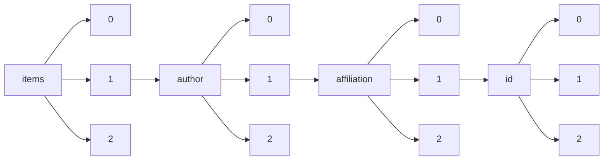

!!! warning "This document is not official Crossref documentation"
# Elements
PATH = items/array/author/array/affiliation/array/id/array(1)  
Occurs 99 389 times  
{ .annotate }

1. A route to an element, for example:  
   The route "items/array/author/array/affiliation/array/id/array" corresponds to navigating through the JSON indices as  
   ["items"][0]["author"][0]["affiliation"][0]["id"][0]  

## Asserted-by
See more information: [items/array/author/array/affiliation/array/id/array/asserted-by](asserted-by/index.md)  
Occurs 99 389 timess  
Unique values: 1  

| **Row** | **Value** `String` | **Count** `Int64` |
|--------:|----------------------:|---------------------:|
| **1**   | publisher             | 99 389               |

## Id
See more information: [items/array/author/array/affiliation/array/id/array/id](id/index.md)  
Occurs 99 389 timess  
Unique values: > 999  

!!! note "Due to current limitations, only the first 1,000 unique values are counted."

| **Row** | **Value** `String`                    | **Count** `Int64` |
|--------:|-----------------------------------------:|---------------------:|
| **1**   | https://ror.org/05hepy730                | 3 559                |
| **2**   | https://ror.org/04qw24q55                | 820                  |
| **3**   | https://ror.org/043mz5j54                | 813                  |
| **4**   | https://ror.org/03vek6s52                | 791                  |
| **5**   | https://www.isni.org/0000000120190559    | 771                  |
| **6**   | https://ror.org/043ddq142                | 771                  |
| **7**   | https://www.wikidata.org/entity/Q3262326 | 771                  |
| **8**   | https://ror.org/052gg0110                | 760                  |
| **9**   | https://ror.org/00f54p054                | 757                  |
| **10**  | https://ror.org/034t30j35                | 738                  |
| ... | ... | ... |

## Id-type
See more information: [items/array/author/array/affiliation/array/id/array/id-type](id-type/index.md)  
Occurs 99 389 timess  
Unique values: 3  

| **Row** | **Value** `String` | **Count** `Int64` |
|--------:|----------------------:|---------------------:|
| **1**   | ROR                   | 95 788               |
| **2**   | ISNI                  | 2 730                |
| **3**   | wikidata              | 871                  |

