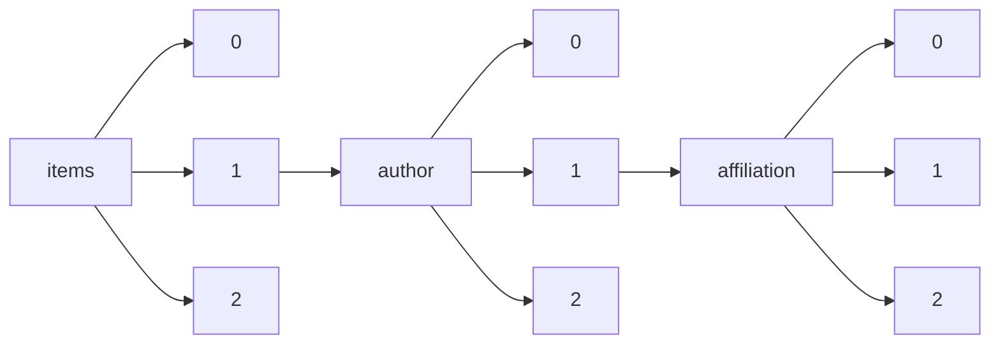

!!! warning "This document is not official Crossref documentation"
# Elements
PATH = items/array/author/array/affiliation/array(1)  
Occurs 89 584 703 times  
{ .annotate }

1. A route to an element, for example:  
   The route "items/array/author/array/affiliation/array" corresponds to navigating through the JSON indices as  
   ["items"][0]["author"][0]["affiliation"][0]  

## Acronym
See more information: [items/array/author/array/affiliation/array/acronym](acronym/index.md)  
Occurs 1 451 timess  

| **Row** | **Length** `Any` | **Count** `Int64` |
|--------:|--------------------:|---------------------:|
| **1**   | 1                   | 1 451                |

## Department
See more information: [items/array/author/array/affiliation/array/department](department/index.md)  
Occurs 14 874 timess  

| **Row** | **Length** `Any` | **Count** `Int64` |
|--------:|--------------------:|---------------------:|
| **1**   | 1                   | 14 854               |
| **2**   | 2                   | 20                   |

## Id
See more information: [items/array/author/array/affiliation/array/id](id/index.md)  
Occurs 95 800 timess  

| **Row** | **Length** `Any` | **Count** `Int64` |
|--------:|--------------------:|---------------------:|
| **1**   | 1                   | 93 071               |
| **2**   | 2                   | 1 869                |
| **3**   | 3                   | 860                  |

## Name
See more information: [items/array/author/array/affiliation/array/name](name/index.md)  
Occurs 89 546 748 timess  
Unique values: > 999  

!!! note "Due to current limitations, strings longer than 1,000 characters are truncated, which may lead to inaccurate calculations."

!!! note "Due to current limitations, only the first 1,000 unique values are counted."

| **Row** | **Value** `String`       | **Count** `Int64` |
|--------:|----------------------------:|---------------------:|
| **1**   | University of Michigan      | 380 441              |
| **2**   | China                       | 284 384              |
| **3**   | NamesforLife, LLC           | 208 066              |
| **4**   | Department of Chemistry     | 145 665              |
| **5**   | P. R. China                 | 129 395              |
| **6**   | USA                         | 105 783              |
| **7**   | Chinese Academy of Sciences | 60 501               |
| **8**   | India                       | 55 291               |
| **9**   | University of Washington    | 48 518               |
| **10**  | Germany                     | 41 585               |
| ... | ... | ... |

## Place
See more information: [items/array/author/array/affiliation/array/place](place/index.md)  
Occurs 102 964 timess  

| **Row** | **Length** `Any` | **Count** `Int64` |
|--------:|--------------------:|---------------------:|
| **1**   | 1                   | 102 962              |
| **2**   | 2                   | 2                    |

