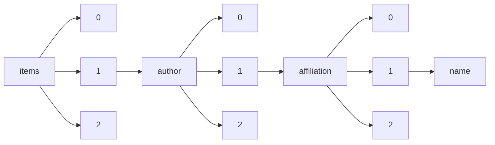

!!! warning "This document is not official Crossref documentation"
# Name
PATH = items/array/author/array/affiliation/array/name(1)  
Occurs 89 546 748 times  
Unique values: > 999  
{ .annotate }

1. A route to an element, for example:  
   The route "items/array/author/array/affiliation/array/name" corresponds to navigating through the JSON indices as  
   ["items"][0]["author"][0]["affiliation"][0]["name"]  

!!! note "Due to current limitations, strings longer than 1,000 characters are truncated, which may lead to inaccurate calculations."

!!! note "Due to current limitations, only the first 1,000 unique values are counted."

| **Row** | **Value** `String`                                                                                    | **Count** `Int64` |
|--------:|---------------------------------------------------------------------------------------------------------:|---------------------:|
| **1**   | University of Michigan                                                                                   | 380 441              |
| **2**   | China                                                                                                    | 284 384              |
| **3**   | NamesforLife, LLC                                                                                        | 208 066              |
| **4**   | Department of Chemistry                                                                                  | 145 665              |
| **5**   | P. R. China                                                                                              | 129 395              |
| **6**   | USA                                                                                                      | 105 783              |
| **7**   | Chinese Academy of Sciences                                                                              | 60 501               |
| **8**   | India                                                                                                    | 55 291               |
| **9**   | University of Washington                                                                                 | 48 518               |
| **10**  | Germany                                                                                                  | 41 585               |
| **11**  | UK                                                                                                       | 38 430               |
| **12**  | Japan                                                                                                    | 35 469               |
| **13**  | Iowa State University                                                                                    | 33 613               |
| **14**  | School of Chemistry and Chemical Engineering                                                             | 26 553               |
| **15**  | School of Materials Science and Engineering                                                              | 22 690               |
| **16**  | Schlumberger                                                                                             | 22 036               |
| **17**  | Natural Resources Canada                                                                                 | 20 498               |
| **18**  | Ministry of Education                                                                                    | 20 023               |
| **19**  | Broad Institute                                                                                          | 19 583               |
| **20**  | College of Chemistry                                                                                     | 18 996               |
| **21**  | College of Chemistry and Chemical Engineering                                                            | 17 836               |
| **22**  | People's Republic of China                                                                               | 17 580               |
| **23**  | PR China                                                                                                 | 17 453               |
| **24**  | Universidade de São Paulo                                                                                | 16 958               |
| **25**  | Spain                                                                                                    | 16 920               |
| **26**  | Jilin University                                                                                         | 16 642               |
| **27**  | Tohoku University                                                                                        | 16 323               |
| **28**  | Universidade de São Paulo,  Brasil                                                                       | 16 008               |
| **29**  | Italy                                                                                                    | 15 998               |
| **30**  | Harbin Institute of Technology                                                                           | 15 804               |
| **31**  | Republic of Korea                                                                                        | 15 522               |
| **32**  | Tokyo Institute of Technology                                                                            | 15 474               |
| **33**  | France                                                                                                   | 15 177               |
| **34**  | Osaka University                                                                                         | 15 133               |
| **35**  | Stanford University                                                                                      | 14 471               |
| **36**  | Tsinghua University                                                                                      | 14 353               |
| **37**  | Zhejiang University                                                                                      | 13 940               |
| **38**  | The University of Tokyo                                                                                  | 13 648               |
| **39**  | Australia                                                                                                | 13 447               |
| **40**  | Department of Physics                                                                                    | 13 340               |
| **41**  | Universidade de São Paulo,  Brazil                                                                       | 12 756               |
| **42**  | Nagoya University                                                                                        | 12 182               |
| **43**  | School of Chemistry                                                                                      | 12 048               |
| **44**  | Kyushu University                                                                                        | 11 601               |
| **45**  | Shandong University                                                                                      | 11 327               |
| **46**  | USP                                                                                                      | 10 968               |
| **47**  | Louisiana State University and Agricultural and Mechanical College                                       | 10 843               |
| **48**  | Sichuan University                                                                                       | 10 713               |
| **49**  | Northeastern University                                                                                  | 10 352               |
| **50**  | Los Alamos National Lab. (LANL), Los Alamos, NM (United States)                                          | 10 274               |
| **51**  | South China University of Technology                                                                     | 10 221               |
| **52**  | Tianjin University                                                                                       | 10 087               |
| **53**  | Kyoto University                                                                                         | 9 897                |
| **54**  | Department of Materials Science and Engineering                                                          | 9 302                |
| **55**  | Texas A&M University                                                                                     | 9 005                |
| **56**  | New York, NY                                                                                             | 8 949                |
| **57**  | Purdue University                                                                                        | 8 873                |
| **58**  | Sandia National Lab. (SNL-NM), Albuquerque, NM (United States)                                           | 8 869                |
| **59**  | Kunming University of Science and Technology                                                             | 8 752                |
| **60**  | Georgia Institute of Technology                                                                          | 8 585                |
| **61**  | Beijing                                                                                                  | 8 576                |
| **62**  | Department of Chemical Engineering                                                                       | 8 541                |
| **63**  | Canada                                                                                                   | 8 337                |
| **64**  | The University of Texas MD Anderson Cancer Center, Houston, TX;                                          | 8 333                |
| **65**  | Memorial Sloan Kettering Cancer Center, New York, NY;                                                    | 8 240                |
| **66**  | Wuhan University of Technology                                                                           | 8 214                |
| **67**  | UNESP                                                                                                    | 8 109                |
| **68**  | Saudi Aramco                                                                                             | 8 104                |
| **69**  | Huazhong University of Science and Technology                                                            | 8 078                |
| **70**  | NASA Langley Research Center                                                                             | 7 889                |
| **71**  | The University of Texas MD Anderson Cancer Center, Houston, TX                                           | 7 787                |
| **72**  | THE JAPAN SOCIETY OF CIVIL ENGINEERS                                                                     | 7 735                |
| **73**  | Dalian University of Technology                                                                          | 7 489                |
| **74**  | Shanghai Jiao Tong University                                                                            | 7 394                |
| **75**  | Louisiana State University and Agricultural & Mechanical College                                         | 7 394                |
| **76**  | Northwestern Polytechnical University                                                                    | 7 271                |
| **77**  | Universidade Estadual de Campinas                                                                        | 7 131                |
| **78**  | University of Science and Technology Beijing                                                             | 7 058                |
| **79**  | CNRS                                                                                                     | 6 949                |
| **80**  | Halliburton                                                                                              | 6 807                |
| **81**  | Soochow University                                                                                       | 6 720                |
| **82**  | San Jose State University                                                                                | 6 613                |
| **83**  | Beijing Institute of Technology                                                                          | 6 572                |
| **84**  | Waseda University                                                                                        | 6 473                |
| **85**  | University of Chinese Academy of Sciences, Beijing 100049, China                                         | 6 463                |
| **86**  | North China Electric Power University                                                                    | 6 452                |
| **87**  | Universidade Federal de Viçosa                                                                           | 6 274                |
| **88**  | Jiangsu University                                                                                       | 6 204                |
| **89**  | Nagoya Institute of Technology                                                                           | 6 163                |
| **90**  | Brazil                                                                                                   | 6 101                |
| **91**  | Massachusetts Institute of Technology                                                                    | 5 891                |
| **92**  | University of Virginia                                                                                   | 5 822                |
| **93**  | Korea                                                                                                    | 5 820                |
| **94**  | Hokkaido University                                                                                      | 5 789                |
| **95**  | University of Minnesota                                                                                  | 5 695                |
| **96**  | Tsinghua University, Beijing, China                                                                      | 5 681                |
| **97**  | Taiwan                                                                                                   | 5 654                |
| **98**  | Central South University                                                                                 | 5 595                |
| **99**  | UFV                                                                                                      | 5 523                |
| **100** | JAPAN SOCIETY OF CIVIL ENGINEERS                                                                         | 5 462                |
| **101** | Institute of Chemistry                                                                                   | 5 385                |
| **102** | Mayo Clinic, Rochester, MN                                                                               | 5 281                |
| **103** | Universidade de São Paulo, Brasil                                                                        | 5 240                |
| **104** | University of Toronto                                                                                    | 5 206                |
| **105** | Tongji University                                                                                        | 5 158                |
| **106** | Beihang University                                                                                       | 5 034                |
| **107** | Los Angeles, CA                                                                                          | 4 975                |
| **108** | Kyushu Institute of Technology                                                                           | 4 974                |
| **109** | Peking University                                                                                        | 4 955                |
| **110** | Shanghai                                                                                                 | 4 955                |
| **111** | Wuhan University                                                                                         | 4 932                |
| **112** | Beijing 100190                                                                                           | 4 882                |
| **113** | Poland                                                                                                   | 4 877                |
| **114** | University of Tsukuba                                                                                    | 4 873                |
| **115** | University of California                                                                                 | 4 852                |
| **116** | P.R. China                                                                                               | 4 828                |
| **117** | Oak Ridge National Lab. (ORNL), Oak Ridge, TN (United States)                                            | 4 812                |
| **118** | Southeast University                                                                                     | 4 748                |
| **119** | NASA, Langley Research Center, Hampton, VA                                                               | 4 734                |
| **120** | Keio University                                                                                          | 4 730                |
| **121** | Department of Leukemia, The University of Texas MD Anderson Cancer Center, Houston, TX                   | 4 637                |
| **122** | Okayama University                                                                                       | 4 607                |
| **123** | Nanjing University                                                                                       | 4 551                |
| **124** | Arizona State University                                                                                 | 4 510                |
| **125** | Zhengzhou University                                                                                     | 4 509                |
| **126** | Ibaraki University                                                                                       | 4 493                |
| **127** | Russian Academy of Sciences                                                                              | 4 492                |
| **128** | Chongqing University                                                                                     | 4 466                |
| **129** | Lawrence Livermore National Lab. (LLNL), Livermore, CA (United States)                                   | 4 461                |
| **130** | NASA Ames Research Center                                                                                | 4 414                |
| **131** | Xiamen University                                                                                        | 4 413                |
| **132** | Harbin Engineering University                                                                            | 4 396                |
| **133** | Russia                                                                                                   | 4 394                |
| **134** | Tokyo, Japan                                                                                             | 4 375                |
| **135** | Switzerland                                                                                              | 4 284                |
| **136** | Pacific Northwest National Lab. (PNNL), Richland, WA (United States)                                     | 4 280                |
| **137** | University of Massachusets Medical School                                                                | 4 270                |
| **138** | University of Science and Technology of China                                                            | 4 258                |
| **139** | Nanjing                                                                                                  | 4 241                |
| **140** | Shanghai University                                                                                      | 4 226                |
| **141** | Iran                                                                                                     | 4 142                |
| **142** | University of Florida                                                                                    | 4 141                |
| **143** | Doshisha University                                                                                      | 4 131                |
| **144** | University of Cambridge                                                                                  | 4 068                |
| **145** | Nihon University                                                                                         | 4 060                |
| **146** | Hiroshima University                                                                                     | 4 043                |
| **147** | Dana-Farber Cancer Institute, Boston, MA                                                                 | 4 032                |
| **148** | Changchun                                                                                                | 4 026                |
| **149** | Air Force Research Laboratory                                                                            | 4 007                |
| **150** | Fudan University                                                                                         | 3 999                |
| **151** | Milan, Italy                                                                                             | 3 999                |
| **152** | Memorial Sloan-Kettering Cancer Center, New York, NY                                                     | 3 985                |
| **153** | Division of Hematology, Mayo Clinic, Rochester, MN                                                       | 3 963                |
| **154** | University of Tokyo                                                                                      | 3 953                |
| **155** | Boston, MA                                                                                               | 3 911                |
| **156** | Физико-технический институт им. А.Ф. Иоффе РАН, Санкт-Петербург, Россия                                  | 3 904                |
| **157** | Memorial Sloan Kettering Cancer Center, New York, NY                                                     | 3 876                |
| **158** | Faculty of Science                                                                                       | 3 782                |
| **159** | Beijing University of Technology                                                                         | 3 770                |
| **160** | Universiti Teknologi Malaysia                                                                            | 3 755                |
| **161** | Osaka Prefecture University                                                                              | 3 702                |
| **162** | None                                                                                                     | 3 664                |
| **163** | Changchun 130012                                                                                         | 3 663                |
| **164** | Instituto Agronômico                                                                                     | 3 655                |
| **165** | Dana-Farber Cancer Institute, Boston, MA;                                                                | 3 647                |
| **166** | Lomonosov Moscow State University                                                                        | 3 619                |
| **167** | Ohio State University                                                                                    | 3 618                |
| **168** | Tokyo University of Science                                                                              | 3 612                |
| **169** | London                                                                                                   | 3 595                |
| **170** | Board of Governors of the Federal Reserve System (U.S.)                                                  | 3 587                |
| **171** | Kansai University                                                                                        | 3 582                |
| **172** | Delft University of Technology                                                                           | 3 573                |
| **173** | Universidade Estadual Paulista                                                                           | 3 567                |
| **174** | Mayo Clinic, Rochester, MN;                                                                              | 3 539                |
| **175** | College of Materials Science and Engineering                                                             | 3 532                |
| **176** | Nagaoka University of Technology                                                                         | 3 530                |
| **177** | Wuhan                                                                                                    | 3 512                |
| **178** | China University of Petroleum                                                                            | 3 506                |
| **179** | School of Chemical Engineering                                                                           | 3 495                |
| **180** | Universidade Federal de Minas Gerais                                                                     | 3 482                |
| **181** | University of Pennsylvania                                                                               | 3 445                |
| **182** | Shibaura Institute of Technology                                                                         | 3 444                |
| **183** | University of Oxford                                                                                     | 3 439                |
| **184** | Yokohama National University                                                                             | 3 421                |
| **185** | University of Jinan                                                                                      | 3 364                |
| **186** | Donghua University                                                                                       | 3 362                |
| **187** | null                                                                                                     | 3 331                |
| **188** | Universidade Federal de Lavras                                                                           | 3 314                |
| **189** | School of Pharmacy                                                                                       | 3 307                |
| **190** | German Aerospace Center (DLR)                                                                            | 3 291                |
| **191** | Kobe University                                                                                          | 3 289                |
| **192** | National University of Singapore                                                                         | 3 267                |
| **193** | Georgia Institute of Technology, Atlanta, GA                                                             | 3 261                |
| **194** | Guangzhou                                                                                                | 3 245                |
| **195** | Singapore                                                                                                | 3 235                |
| **196** | National University of Defense Technology                                                                | 3 223                |
| **197** | Universidade Federal do Rio Grande do Sul                                                                | 3 205                |
| **198** | Cleveland, OH                                                                                            | 3 203                |
| **199** | Faculty of Chemistry                                                                                     | 3 173                |
| **200** | NASA Glenn Research Center                                                                               | 3 160                |
| **201** | Zhejiang University of Technology                                                                        | 3 155                |
| **202** | Hefei                                                                                                    | 3 136                |
| **203** | Virginia Polytechnic Institute and State University                                                      | 3 129                |
| **204** | Beijing University of Chemical Technology                                                                | 3 128                |
| **205** | Pennsylvania State University                                                                            | 3 128                |
| **206** | Southwest Jiaotong University                                                                            | 3 109                |
| **207** | Xi'an Jiaotong University                                                                                | 3 088                |
| **208** | Harbin University of Science and Technology                                                              | 3 087                |
| **209** | Seoul, Korea, Republic of                                                                                | 3 080                |
| **210** | University of Michigan, Ann Arbor, MI                                                                    | 3 028                |
| **211** | UFMG                                                                                                     | 2 990                |
| **212** | NASA, Lewis Research Center, Cleveland, OH                                                               | 2 980                |
| **213** | Hohai University                                                                                         | 2 975                |
| **214** | Tokyo Metropolitan University                                                                            | 2 961                |
| **215** | East China University of Science and Technology                                                          | 2 946                |
| **216** | Hunan University                                                                                         | 2 943                |
| **217** | Kanazawa University                                                                                      | 2 934                |
| **218** | Toyohashi University of Technology                                                                       | 2 932                |
| **219** | Lanzhou University                                                                                       | 2 910                |
| **220** | Belgium                                                                                                  | 2 901                |
| **221** | Chicago, IL                                                                                              | 2 900                |
| **222** | Beijing Jiaotong University                                                                              | 2 893                |
| **223** | University of Connecticut                                                                                | 2 883                |
| **224** | Michigan State University                                                                                | 2 874                |
| **225** | Nanjing University of Aeronautics and Astronautics                                                       | 2 870                |
| **226** | University of Southern California                                                                        | 2 864                |
| **227** | Tokai University                                                                                         | 2 817                |
| **228** | University of Chicago                                                                                    | 2 812                |
| **229** | Hebei United University                                                                                  | 2 810                |
| **230** | Baker Hughes                                                                                             | 2 765                |
| **231** | Department of Chemistry and Biochemistry                                                                 | 2 765                |
| **232** | Imperial College London                                                                                  | 2 751                |
| **233** | National Research Institute for Metals                                                                   | 2 745                |
| **234** | Universidad Autónoma Metropolitana Unidad Iztapalapa                                                     | 2 745                |
| **235** | Universidade Federal de Santa Maria                                                                      | 2 713                |
| **236** | Kumamoto University                                                                                      | 2 704                |
| **237** | Carnegie Mellon University, Pittsburgh, PA, USA                                                          | 2 694                |
| **238** | North Carolina State University                                                                          | 2 690                |
| **239** | Seoul National University                                                                                | 2 674                |
| **240** | Cornell University                                                                                       | 2 672                |
| **241** | NASA, Ames Research Center, Moffett Field, CA                                                            | 2 672                |
| **242** | Universidade Federal de Minas Gerais,  Brazil                                                            | 2 671                |
| **243** | Member, ASCE                                                                                             | 2 660                |
| **244** | Shinshu University                                                                                       | 2 660                |
| **245** | Columbia University                                                                                      | 2 618                |
| **246** | Ritsumeikan University                                                                                   | 2 586                |
| **247** | Chengdu                                                                                                  | 2 575                |
| **248** | Chiba University                                                                                         | 2 564                |
| **249** | University of Illinois at Urbana-Champaign                                                               | 2 541                |
| **250** | Purdue University, West Lafayette, IN                                                                    | 2 532                |
| **251** | Hebei University of Technology                                                                           | 2 529                |
| **252** | Berlin                                                                                                   | 2 522                |
| **253** | Changchun Institute of Applied Chemistry                                                                 | 2 507                |
| **254** | Department of Applied Chemistry                                                                          | 2 505                |
| **255** | University of California, Los Angeles                                                                    | 2 503                |
| **256** | Nanyang Technological University                                                                         | 2 492                |
| **257** | Houston, TX                                                                                              | 2 487                |
| **258** | Department of Internal Medicine, Yonsei University College of Medicine, Seoul, Korea.                    | 2 484                |
| **259** | University of Calgary                                                                                    | 2 480                |
| **260** | University of Maryland                                                                                   | 2 477                |
| **261** | Massachusetts General Hospital, Boston, MA;                                                              | 2 473                |
| **262** | Carnegie Mellon University, Pittsburgh, PA                                                               | 2 451                |
| **263** | London, United Kingdom                                                                                   | 2 451                |
| **264** | Baltimore, MD                                                                                            | 2 446                |
| **265** | Ann Arbor, MI                                                                                            | 2 436                |
| **266** | Northeast Petroleum University                                                                           | 2 410                |
| **267** | Tottori University                                                                                       | 2 400                |
| **268** | Institute for Materials Research, Tohoku University                                                      | 2 399                |
| **269** | Institute of Molecular Biology and Genetics, National Academy of Sciences of Ukraine                     | 2 393                |
| **270** | Sweden                                                                                                   | 2 388                |
| **271** | Tokyo Denki University                                                                                   | 2 386                |
| **272** | Sydney                                                                                                   | 2 379                |
| **273** | The University of Texas at Austin                                                                        | 2 367                |
| **274** | Gunma University                                                                                         | 2 358                |
| **275** | Iowa State College                                                                                       | 2 354                |
| **276** | National Renewable Energy Lab. (NREL), Golden, CO (United States)                                        | 2 352                |
| **277** | Toronto, Canada                                                                                          | 2 343                |
| **278** | Universidade Federal de Campina Grande                                                                   | 2 343                |
| **279** | Tianjin Polytechnic University                                                                           | 2 338                |
| **280** | Nankai University                                                                                        | 2 325                |
| **281** | Harvard University                                                                                       | 2 297                |
| **282** | The Netherlands                                                                                          | 2 297                |
| **283** | National Institute of Advanced Industrial Science and Technology                                         | 2 291                |
| **284** | Duke University                                                                                          | 2 284                |
| **285** | China University of Geosciences                                                                          | 2 272                |
| **286** | Universidade Federal de Minas Gerais,  Brasil                                                            | 2 268                |
| **287** | Universidade Federal de Santa Maria,  Brasil                                                             | 2 259                |
| **288** | Kuwait Oil Company                                                                                       | 2 246                |
| **289** | C&EN Washington                                                                                          | 2 238                |
| **290** | China University of Mining and Technology                                                                | 2 235                |
| **291** | Shandong University of Science and Technology                                                            | 2 222                |
| **292** | Guangxi University                                                                                       | 2 219                |
| **293** | Guangdong University of Technology                                                                       | 2 218                |
| **294** | Northeast Forestry University                                                                            | 2 208                |
| **295** | Philadelphia, PA                                                                                         | 2 205                |
| **296** | Rochester, MN                                                                                            | 2 198                |
| **297** | Jet Propulsion Laboratory, California Institute of Technology                                            | 2 183                |
| **298** | University of Iowa                                                                                       | 2 164                |
| **299** | Princeton University                                                                                     | 2 161                |
| **300** | Chuo University                                                                                          | 2 144                |
| **301** | Brno University of Technology                                                                            | 2 121                |
| **302** | University of Texas M. D. Anderson Cancer Center, Houston, TX                                            | 2 117                |
| **303** | California Polytechnic State University - San Luis Obispo                                                | 2 113                |
| **304** | University of Alberta                                                                                    | 2 107                |
| **305** | Shenyang University of Technology                                                                        | 2 103                |
| **306** | CABI Bioscience\rBakeham Lane\rEgham\rSurrey\rTW20 9TY\rUK                                               | 2 102                |
| **307** | National Institute of Advanced Industrial Science and Technology (AIST)                                  | 2 095                |
| **308** | University of Central Florida                                                                            | 2 091                |
| **309** | University of São Paulo,  Brazil                                                                         | 2 071                |
| **310** | California Institute of Technology                                                                       | 2 060                |
| **311** | Shenyang Jianzhu University                                                                              | 2 048                |
| **312** | Mie University                                                                                           | 2 046                |
| **313** | Japan Atomic Energy Agency                                                                               | 2 039                |
| **314** | Lanzhou University of Technology                                                                         | 2 034                |
| **315** | New York, N. Y.                                                                                          | 2 021                |
| **316** | From the                                                                                                 | 2 013                |
| **317** | Nanjing University of Science and Technology                                                             | 2 008                |
| **318** | nema                                                                                                     | 2 007                |
| **319** | Tokyo University of Agriculture and Technology                                                           | 1 994                |
| **320** | Hamburg, Germany                                                                                         | 1 988                |
| **321** | University of Georgia                                                                                    | 1 983                |
| **322** | Universidade Federal do Rio Grande do Sul,  Brasil                                                       | 1 982                |
| **323** | Yamaguchi University                                                                                     | 1 980                |
| **324** | Petrobras                                                                                                | 1 972                |
| **325** | Shizuoka University                                                                                      | 1 964                |
| **326** | Shenzhen University                                                                                      | 1 959                |
| **327** | University of Washington, Seattle, WA, USA                                                               | 1 949                |
| **328** | CAB International\r            Nosworthy Way\r            Wallingford\r            Oxfordshire\r         | 1 946                |
| **329** | Taiyuan University of Technology                                                                         | 1 944                |
| **330** | The Research Institute for Iron, Steel and Other Metals, Tohoku University                               | 1 926                |
| **331** | Japan Aerospace Exploration Agency                                                                       | 1 922                |
| **332** | Idaho National Lab. (INL), Idaho Falls, ID (United States)                                               | 1 920                |
| **333** | Henan University of Science and Technology                                                               | 1 917                |
| **334** | Saga University                                                                                          | 1 899                |
| **335** | University of Pittsburgh                                                                                 | 1 895                |
| **336** | Universidade de São Paulo, Brazil                                                                        | 1 889                |
| **337** | Northwestern University                                                                                  | 1 882                |
| **338** | Dallas, TX                                                                                               | 1 882                |
| **339** | Universidade Federal de São Paulo                                                                        | 1 878                |
| **340** | Japan Aerospace Exploration Agency (JAXA)                                                                | 1 876                |
| **341** | Hangzhou 310027                                                                                          | 1 870                |
| **342** | Cambridge                                                                                                | 1 870                |
| **343** | Universidade Federal do Rio de Janeiro                                                                   | 1 869                |
| **344** | University of Cincinnati                                                                                 | 1 865                |
| **345** | Massachusetts General Hosp, Boston, MA                                                                   | 1 865                |
| **346** | University of California at San Diego                                                                    | 1 848                |
| **347** | Natural Resources\nCanada                                                                                | 1 841                |
| **348** | Instituto Oswaldo Cruz,  Brasil                                                                          | 1 835                |
| **349** | Meijo University                                                                                         | 1 834                |
| **350** | DECHEMA e. V.; Germany                                                                                   | 1 825                |
| **351** | Yale University                                                                                          | 1 820                |
| **352** | Niigata University                                                                                       | 1 798                |
| **353** | Universiti Malaysia Perlis (UniMAP)                                                                      | 1 796                |
| **354** | The Boeing Company                                                                                       | 1 784                |
| **355** | Kyoto Institute of Technology                                                                            | 1 770                |
| **356** | South Korea                                                                                              | 1 762                |
| **357** | Kogakuin University                                                                                      | 1 760                |
| **358** | Oxford                                                                                                   | 1 759                |
| **359** | Saitama University                                                                                       | 1 749                |
| **360** | Railway Technical Research Institute                                                                     | 1 747                |
| **361** | Mayo ClinicRochesterMNUSA                                                                                | 1 745                |
| **362** | Departments of Neurosurgery and                                                                          | 1 744                |
| **363** | Gifu University                                                                                          | 1 738                |
| **364** | Universidade Federal do Rio Grande do Sul,  Brazil                                                       | 1 736                |
| **365** | China Three Gorges University                                                                            | 1 730                |
| **366** | Rostov Research Institute of Oncology, Rostov-on-Don, Russian Federation;                                | 1 729                |
| **367** | Universidade Estadual Paulista,  Brazil                                                                  | 1 718                |
| **368** | C&EN WASHINGTON                                                                                          | 1 709                |
| **369** | University of Arizona                                                                                    | 1 709                |
| **370** | Toshiba Corporation                                                                                      | 1 702                |
| **371** | Jiangxi Science and Technology Normal University                                                         | 1 693                |
| **372** | AIST                                                                                                     | 1 684                |
| **373** | Southwest University                                                                                     | 1 681                |
| **374** | Melbourne                                                                                                | 1 676                |
| **375** | Henan Polytechnic University                                                                             | 1 669                |
| **376** | Beijing 100084                                                                                           | 1 668                |
| **377** | National Institute for Materials Science                                                                 | 1 658                |
| **378** | Seattle, WA                                                                                              | 1 658                |
| **379** | Beijing National Laboratory for Molecular Sciences                                                       | 1 634                |
| **380** | Purdue University, West Lafayette                                                                        | 1 630                |
| **381** | National Medical Research Centre for Oncology, Rostov-on-Don, Russian Federation;                        | 1 619                |
| **382** | Georgia Inst. of Technology, Atlanta                                                                     | 1 614                |
| **383** | UTFPR                                                                                                    | 1 611                |
| **384** | UFLA                                                                                                     | 1 602                |
| **385** | Carnegie Mellon University                                                                               | 1 591                |
| **386** | Brookhaven National Lab. (BNL), Upton, NY (United States)                                                | 1 586                |
| **387** | Gomel State Medical University                                                                           | 1 584                |
| **388** | San Francisco, CA                                                                                        | 1 580                |
| **389** | University of California, Berkeley                                                                       | 1 580                |
| **390** | Xi’an University of Architecture and Technology                                                          | 1 572                |
| **391** | Osaka Institute of Technology                                                                            | 1 565                |
| **392** | HudsonAlpha Institute for Biotechnology                                                                  | 1 565                |
| **393** | Durham, NC                                                                                               | 1 563                |
| **394** | JPL, Pasadena, CA                                                                                        | 1 561                |
| **395** | University of Illinois                                                                                   | 1 559                |
| **396** | Iwate University                                                                                         | 1 554                |
| **397** | Wuhan University of Science and Technology                                                               | 1 538                |
| **398** | University of Bristol                                                                                    | 1 534                |
| **399** | University of Michigan, Ann Arbor, MI, USA                                                               | 1 534                |
| **400** | University College London                                                                                | 1 521                |
| **401** | University of São Paulo                                                                                  | 1 519                |
| **402** | Yanshan University                                                                                       | 1 510                |
| **403** | Chemical Engineering and Materials Science                                                               | 1 505                |
| **404** | Hefei University of Technology                                                                           | 1 495                |
| **405** | Institute of High Energy Physics, Beijing 100049, People’s Republic of China                             | 1 495                |
| **406** | University of Electronic Science and Technology of China                                                 | 1 492                |
| **407** | Montreal, Canada                                                                                         | 1 492                |
| **408** | Shanghai Jiao Tong University, Shanghai, China                                                           | 1 481                |
| **409** | Naval University of Engineering                                                                          | 1 474                |
| **410** | Los Alamos National Laboratory                                                                           | 1 472                |
| **411** | Sandia National Laboratories                                                                             | 1 468                |
| **412** | Meiji University                                                                                         | 1 467                |
| **413** | University of Chinese Academy of Sciences                                                                | 1 464                |
| **414** | Lanzhou 730000                                                                                           | 1 461                |
| **415** | Czech Republic                                                                                           | 1 461                |
| **416** | Texas A&M University, College Station, TX                                                                | 1 456                |
| **417** | Fakultas Psikologi, Universitas Diponegoro, Indonesia                                                    | 1 449                |
| **418** | University of California (United States)                                                                 | 1 448                |
| **419** | Southwest University of Science and Technology                                                           | 1 446                |
| **420** | e-mail:                                                                                                  | 1 441                |
| **421** | College of Chemistry and Molecular Engineering                                                           | 1 427                |
| **422** | The Ohio State University                                                                                | 1 426                |
| **423** | Chang’an University                                                                                      | 1 425                |
| **424** | Universidade Estadual Paulista,  Brasil                                                                  | 1 424                |
| **425** | Sichuan Agricultural University                                                                          | 1 419                |
| **426** | University of Southampton                                                                                | 1 418                |
| **427** | Kansas State University                                                                                  | 1 414                |
| **428** | Samara State University of Economics                                                                     | 1 413                |
| **429** | Virginia Tech                                                                                            | 1 413                |
| **430** | MIT, Cambridge, MA                                                                                       | 1 413                |
| **431** | Bethesda, MD                                                                                             | 1 410                |
| **432** | Linköping University                                                                                     | 1 409                |
| **433** | NASA, Marshall Space Flight Center, Huntsville, AL                                                       | 1 395                |
| **434** | Muroran Institute of Technology                                                                          | 1 394                |
| **435** | University of Manchester                                                                                 | 1 385                |
| **436** | Wuhan 430074                                                                                             | 1 381                |
| **437** | Pharmaceutical Institute, Medical Faculty, University of Kyoto                                           | 1 380                |
| **438** | Universiti Tun Hussein Onn Malaysia                                                                      | 1 379                |
| **439** | Fuzhou                                                                                                   | 1 375                |
| **440** | Kanagawa Institute of Technology                                                                         | 1 368                |
| **441** | Department of Mechanical Engineering                                                                     | 1 363                |
| **442** | Universiti Sains Malaysia                                                                                | 1 358                |
| **443** | Sungkyunkwan University                                                                                  | 1 355                |
| **444** | IMAIOS                                                                                                   | 1 354                |
| **445** | Univ of Michigan, Ann Arbor, MI                                                                          | 1 351                |
| **446** | JSCE                                                                                                     | 1 350                |
| **447** | 1DOE Joint Genome Institute, Walnut Creek, California, USA                                               | 1 345                |
| **448** | Kagoshima University                                                                                     | 1 340                |
| **449** | Inha University                                                                                          | 1 336                |
| **450** | BGP, CNPC                                                                                                | 1 335                |
| **451** | Volgograd State Technical University                                                                     | 1 334                |
| **452** | Johns Hopkins Univ, Baltimore, MD                                                                        | 1 331                |
| **453** | Universidade Federal do Paraná                                                                           | 1 330                |
| **454** | Tianjin University of Technology                                                                         | 1 324                |
| **455** | Universiti Teknologi MARA                                                                                | 1 318                |
| **456** | Nagoya, Japan                                                                                            | 1 317                |
| **457** | Nanjing 210023                                                                                           | 1 316                |
| **458** | Department of Anesthesiology, Yonsei University College of Medicine, Seoul, Korea.                       | 1 316                |
| **459** | University of Texas MD Anderson Cancer Center, Houston, TX;                                              | 1 316                |
| **460** | Detroit, MI                                                                                              | 1 312                |
| **461** | Universidade Federal de Santa Maria,  Brazil                                                             | 1 310                |
| **462** | Oita University                                                                                          | 1 310                |
| **463** | Changsha                                                                                                 | 1 308                |
| **464** | Northwestern Univ, Chicago, IL                                                                           | 1 303                |
| **465** | Nanchang University                                                                                      | 1 293                |
| **466** | Ural State Pedagogical University                                                                        | 1 268                |
| **467** | UT MD Anderson Cancer Center, Houston, TX.                                                               | 1 268                |
| **468** | Nagasaki University                                                                                      | 1 262                |
| **469** | Taras Shevchenko National University of Kyiv                                                             | 1 261                |
| **470** | University of Hyogo                                                                                      | 1 252                |
| **471** | College of Chemical Engineering                                                                          | 1 251                |
| **472** | Kochi University of Technology                                                                           | 1 250                |
| **473** | University of Yamanashi                                                                                  | 1 249                |
| **474** | Qingdao University of Science and Technology                                                             | 1 249                |
| **475** | Tianjin 300072                                                                                           | 1 247                |
| **476** | Chiba Institute of Technology                                                                            | 1 245                |
| **477** | Changchun 130022                                                                                         | 1 244                |
| **478** | UFSM                                                                                                     | 1 238                |
| **479** | Kitami Institute of Technology                                                                           | 1 237                |
| **480** | Hanyang University                                                                                       | 1 234                |
| **481** | ista                                                                                                     | 1 232                |
| **482** | Massachusetts General Hospital, Boston, MA                                                               | 1 227                |
| **483** | China Electric Power Research Institute                                                                  | 1 223                |
| **484** | ONERA                                                                                                    | 1 222                |
| **485** | Shaanxi University of Science and Technology                                                             | 1 221                |
| **486** | Petroleum Development Oman                                                                               | 1 218                |
| **487** | Toyama Prefectural University                                                                            | 1 214                |
| **488** | University of Houston                                                                                    | 1 211                |
| **489** | Tianjin University of Science and Technology                                                             | 1 210                |
| **490** | 71, Brecknock Road                                                                                       | 1 207                |
| **491** | Pittsburgh, PA                                                                                           | 1 205                |
| **492** | for the VICTORIA Study Group                                                                             | 1 203                |
| **493** | Paris, France                                                                                            | 1 200                |
| **494** | University of Texas at Austin                                                                            | 1 198                |
| **495** | Government Industrial Research Institute                                                                 | 1 192                |
| **496** | Central Research Institute of Electric Power Industry                                                    | 1 190                |
| **497** | Peking Union Medical College Hospital                                                                    | 1 182                |
| **498** | Univ of Alabama at Birmingham, Birmingham, AL                                                            | 1 180                |
| **499** | Beijing Institute of Graphic Communication                                                               | 1 178                |
| **500** | Universiti Teknologi MARA (UiTM)                                                                         | 1 177                |
| **501** | Dalian Institute of Chemical Physics                                                                     | 1 176                |
| **502** | Universidade Estadual de Maringá                                                                         | 1 175                |
| **503** | Jiangnan University                                                                                      | 1 169                |
| **504** | The University of Tokushima                                                                              | 1 168                |
| **505** | VU University Medical CenterAmsterdamNetherlands                                                         | 1 164                |
| **506** | Portugal                                                                                                 | 1 161                |
| **507** | Univ. of Tokyo                                                                                           | 1 159                |
| **508** | East China Normal University                                                                             | 1 157                |
| **509** | Institute of Fluid Science, Tohoku University                                                            | 1 156                |
| **510** | No affiliation information available.                                                                    | 1 155                |
| **511** | Auburn University                                                                                        | 1 152                |
| **512** | Agricultural Research Organization, Israel                                                               | 1 148                |
| **513** | Japan Atomic Energy Research Institute                                                                   | 1 141                |
| **514** | Lanzhou                                                                                                  | 1 140                |
| **515** | Educational Testing Service                                                                              | 1 140                |
| **516** | North University of China                                                                                | 1 140                |
| **517** | Nanyang Technological University, Singapore                                                              | 1 136                |
| **518** | Universidade Federal do Rio de Janeiro,  Brasil                                                          | 1 134                |
| **519** | Changsha University of Science and Technology                                                            | 1 134                |
| **520** | Second Department of Internal Medicine, Faculty of Medicine, University of Tokyo                         | 1 133                |
| **521** | Shandong Jianzhu University                                                                              | 1 132                |
| **522** | UCLA, Los Angeles, CA                                                                                    | 1 131                |
| **523** | Argonne National Lab. (ANL), Argonne, IL (United States)                                                 | 1 124                |
| **524** | From the Laboratories of The Rockefeller Institute for Medical Research.                                 | 1 122                |
| **525** | Cleveland Clinic, Cleveland, OH                                                                          | 1 117                |
| **526** | New York University                                                                                      | 1 109                |
| **527** | University of Michigan, Ann Arbor                                                                        | 1 108                |
| **528** | Meteorological Research Institute                                                                        | 1 107                |
| **529** | Kinki University                                                                                         | 1 104                |
| **530** | Yamagata University                                                                                      | 1 103                |
| **531** | Memorial Sloan-Kettering Cancer Center, New York, NY;                                                    | 1 101                |
| **532** | New York                                                                                                 | 1 100                |
| **533** | University of Utah                                                                                       | 1 097                |
| **534** | Graduate School of Engineering                                                                           | 1 093                |
| **535** | Nashville, TN                                                                                            | 1 091                |
| **536** | University of Illinois, Urbana-Champaign                                                                 | 1 082                |
| **537** | Duke University Medical Center, Durham, NC                                                               | 1 080                |
| **538** | University of British Columbia                                                                           | 1 078                |
| **539** | University of Washington, Seattle, WA                                                                    | 1 076                |
| **540** | Hangzhou                                                                                                 | 1 074                |
| **541** | Jinan University                                                                                         | 1 070                |
| **542** | The Second Department of Internal Medicine, Tohoku University School of Medicine                         | 1 067                |
| **543** | Silesian University of Technology                                                                        | 1 066                |
| **544** | Institute for Solid State Physics, University of Tokyo                                                   | 1 063                |
| **545** | Embrapa                                                                                                  | 1 056                |
| **546** | Universidade Federal de São Paulo,  Brasil                                                               | 1 056                |
| **547** | Dalian Polytechnic University                                                                            | 1 056                |
| **548** | ADNOC Onshore                                                                                            | 1 055                |
| **549** | Xi'an                                                                                                    | 1 051                |
| **550** | DECHEMA e.V.; Society of Chemical Engineering and Biotechnology; Theodor-Heuss-Allee 25 Frankfurt (M     | 1 048                |
| **551** | Belarusian-Russian University                                                                            | 1 044                |
| **552** | The University of Electro-Communications                                                                 | 1 040                |
| **553** | Lawrence Livermore National Laboratory, Livermore, California 94550, USA                                 | 1 039                |
| **554** | NASA Johnson Space Center                                                                                | 1 037                |
| **555** | Newbourne Rectory, Woodbridge                                                                            | 1 035                |
| **556** | Changchun University of Science and Technology                                                           | 1 031                |
| **557** | Czech Technical University in Prague                                                                     | 1 025                |
| **558** | Universiti Kebangsaan Malaysia                                                                           | 1 022                |
| **559** | Stanford University, Stanford, CA                                                                        | 1 018                |
| **560** | Universitas Sumatera Utara, Indonesia                                                                    | 1 016                |
| **561** | Aichi Institute of Technology                                                                            | 1 015                |
| **562** | Ningbo University                                                                                        | 1 004                |
| **563** | Research Centre for Educ and Labour Mark                                                                 | 1 002                |
| **564** | Fundação Oswaldo Cruz,  Brasil                                                                           | 1 001                |
| **565** | BP                                                                                                       | 1 001                |
| **566** | RIKEN                                                                                                    | 998                  |
| **567** | Ehime University                                                                                         | 998                  |
| **568** | Universidade de Brasília                                                                                 | 991                  |
| **569** | Sichuan University West China Hospital                                                                   | 985                  |
| **570** | 1Memorial Sloan Kettering Cancer Center, New York, NY;                                                   | 982                  |
| **571** | Department of Physics, Faculty of Science, University of Tokyo                                           | 973                  |
| **572** | Guangzhou 510640                                                                                         | 972                  |
| **573** | Jet Propulsion Laboratory                                                                                | 972                  |
| **574** | Univ of Minnesota, Minneapolis, MN                                                                       | 971                  |
| **575** | Universiti Teknologi PETRONAS                                                                            | 967                  |
| **576** | Institute of Physics, Polish Academy of Sciences, al. Lotników 32/46, 02-668 Warsaw, Poland              | 967                  |
| **577** | Mayo Clinic  Rochester MN USA                                                                            | 964                  |
| **578** | University of Kentucky                                                                                   | 961                  |
| **579** | From the Laboratories of The Rockefeller Institute for Medical Research                                  | 961                  |
| **580** | for the RESTART Collaboration                                                                            | 959                  |
| **581** | Virginia Polytechnic Inst. and State Univ., Blacksburg                                                   | 950                  |
| **582** | Mitsubishi Electric Corporation                                                                          | 946                  |
| **583** | College of Science                                                                                       | 942                  |
| **584** | Xi’an Jiaotong University                                                                                | 940                  |
| **585** | MLL Munich Leukemia Laboratory, Munich, Germany                                                          | 934                  |
| **586** | Mayo Clinic, Rochester, MN, USA                                                                          | 933                  |
| **587** | National Institute for Fusion Science                                                                    | 933                  |
| **588** | Sharif University of Technology, Tehran, Iran                                                            | 922                  |
| **589** | Beijing University of Posts and Telecommunications                                                       | 918                  |
| **590** | Philadelphia                                                                                             | 912                  |
| **591** | University of Notre Dame                                                                                 | 909                  |
| **592** | Pusan National University                                                                                | 909                  |
| **593** | Tehran University of Medical Sciences                                                                    | 908                  |
| **594** | Akita University                                                                                         | 903                  |
| **595** | Department of Internal Medicine, Seoul National University College of Medicine, Seoul, Korea.            | 902                  |
| **596** | McGill University                                                                                        | 898                  |
| **597** | Colorado School of Mines                                                                                 | 893                  |
| **598** | Jinan                                                                                                    | 891                  |
| **599** | Universidade Federal do Paraná,  Brasil                                                                  | 885                  |
| **600** | 1. kitlvpress@kitlv.nl                                                                                   | 880                  |
| **601** | Institute of Physics, Polish Academy of Sciences, Al. Lotników 32/46, 02-668 Warszawa, Poland            | 877                  |
| **602** | UFRGS                                                                                                    | 875                  |
| **603** | Federal Reserve Bank of Minneapolis                                                                      | 874                  |
| **604** | Fuzhou University                                                                                        | 871                  |
| **605** | Shenyang Aerospace University                                                                            | 866                  |
| **606** | Osaka City University                                                                                    | 865                  |
| **607** | for the THALES Steering Committee and Investigators                                                      | 865                  |
| **608** | Universiti Malaysia Perlis                                                                               | 864                  |
| **609** | San Diego, CA                                                                                            | 857                  |
| **610** | Stanford University, Stanford, CA, USA                                                                   | 855                  |
| **611** | School of Chemical Engineering and Technology                                                            | 851                  |
| **612** | Suzhou                                                                                                   | 850                  |
| **613** | Shanghai 200237                                                                                          | 845                  |
| **614** | Universidade Federal da Paraíba                                                                          | 838                  |
| **615** | Beijing 100083                                                                                           | 834                  |
| **616** | Department of Internal Medicine, Tohoku University School of Medicine                                    | 833                  |
| **617** | Harbin                                                                                                   | 827                  |
| **618** | Siberian State University of Geosystems and Technologies                                                 | 826                  |
| **619** | Colorado State University                                                                                | 819                  |
| **620** | University of Michigan, Ann Arbor, MI.                                                                   | 818                  |
| **621** | Emory Univ, Atlanta, GA                                                                                  | 816                  |
| **622** | Electrotechnical Laboratory                                                                              | 811                  |
| **623** | Centers for Disease Control and Prevention, Atlanta, Georgia, USA                                        | 809                  |
| **624** | Korea Institute of Industrial Technology                                                                 | 809                  |
| **625** | Sandia National Laboratories (SNL), Albuquerque, NM, and Livermore, CA (United States)                   | 807                  |
| **626** | Monash University                                                                                        | 797                  |
| **627** | Universitat Politècnica de València                                                                      | 796                  |
| **628** | Universidade Estadual de Campinas,  Brasil                                                               | 794                  |
| **629** | Vancouver, Canada                                                                                        | 790                  |
| **630** | Sun Yat-sen University                                                                                   | 789                  |
| **631** | University of Sydney                                                                                     | 788                  |
| **632** | Universiti Putra Malaysia                                                                                | 788                  |
| **633** | for the Eunice Kennedy Shriver National Institute of Child Health and Human Development Neonatal Res     | 786                  |
| **634** | Akita Prefectural University                                                                             | 785                  |
| **635** | The Univ. of Tokyo                                                                                       | 784                  |
| **636** | National Research Tomsk Polytechnic University                                                           | 784                  |
| **637** | National Taiwan University                                                                               | 783                  |
| **638** | School of Science                                                                                        | 783                  |
| **639** | Mayo ClinicRochesterMinnesotaUnited States                                                               | 782                  |
| **640** | Qingdao University                                                                                       | 780                  |
| **641** | Aachen                                                                                                   | 779                  |
| **642** | Beijing University of Aeronautics and Astronautics                                                       | 779                  |
| **643** | U. of Tulsa                                                                                              | 772                  |
| **644** | Osaka Univ.                                                                                              | 772                  |
| **645** | Atlanta, GA                                                                                              | 770                  |
| **646** | Fox Chase Cancer Center, Philadelphia, PA;                                                               | 770                  |
| **647** | Indiana University                                                                                       | 768                  |
| **648** | Shandong University of Technology                                                                        | 766                  |
| **649** | Stanford Univ., CA                                                                                       | 766                  |
| **650** | ESA                                                                                                      | 765                  |
| **651** | Hastings                                                                                                 | 762                  |
| **652** | München                                                                                                  | 759                  |
| **653** | Institut für Anorganische Chemie der Universität München                                                 | 759                  |
| **654** | Halliburton Energy Services                                                                              | 758                  |
| **655** | Institute of High Energy Physics, Beijing 100039, People’s Republic of China                             | 757                  |
| **656** | Universidade Federal de Santa Catarina                                                                   | 752                  |
| **657** | Nippon Institute of Technology                                                                           | 748                  |
| **658** | Florida State University                                                                                 | 748                  |
| **659** | ADNOC Offshore                                                                                           | 740                  |
| **660** | Nanjing Tech University                                                                                  | 738                  |
| **661** | for the Society of Critical Care Medicine Discovery Viral Infection and Respiratory Illness Universa     | 734                  |
| **662** | University of Pennsylvania, Philadelphia, PA                                                             | 732                  |
| **663** | Research Laboratory, Takeda Pharmaceutical Industries, Ltd.                                              | 732                  |
| **664** | University of California at Irvine                                                                       | 731                  |
| **665** | for the COVID-19 Phase 3 Prevention Trial Team                                                           | 729                  |
| **666** | Tohoku Univ.                                                                                             | 726                  |
| **667** | University of Wisconsin-Madison                                                                          | 725                  |
| **668** | U.S. Air Force Research Laboratory                                                                       | 723                  |
| **669** | Yonsei University                                                                                        | 722                  |
| **670** | USP,  Brasil                                                                                             | 722                  |
| **671** | Inner Mongolia University of Science and Technology                                                      | 720                  |
| **672** | Institute of Laser Engineering, Osaka University                                                         | 719                  |
| **673** | Boston, Massachusetts                                                                                    | 719                  |
| **674** | Department of Polymer Science and Engineering                                                            | 718                  |
| **675** | University of Arizona (United States)                                                                    | 712                  |
| **676** | Hitachi, Ltd.                                                                                            | 712                  |
| **677** | Virginia Polytechnic Institute and State University, Blacksburg, VA                                      | 712                  |
| **678** | University for Business and Technology                                                                   | 711                  |
| **679** | National Defense Academy                                                                                 | 701                  |
| **680** | Dalian Maritime University                                                                               | 696                  |
| **681** | Massachusetts Institute of Technology, Cambridge, MA                                                     | 693                  |
| **682** | Univ of Cincinnati, Cincinnati, OH                                                                       | 689                  |
| **683** | Universidade Federal de Pernambuco                                                                       | 688                  |
| **684** | University of Kansas                                                                                     | 687                  |
| **685** | University of South Florida                                                                              | 685                  |
| **686** | Sun Yat-Sen University                                                                                   | 681                  |
| **687** | Universidade Federal do Ceará                                                                            | 680                  |
| **688** | Department of Chemical Engineering, Nagoya University                                                    | 678                  |
| **689** | Department of Physics, Faculty of Science, Kyoto University                                              | 677                  |
| **690** | University of Toyama                                                                                     | 677                  |
| **691** | Lawrence Berkeley National Lab. (LBNL), Berkeley, CA (United States)                                     | 672                  |
| **692** | Univ of Washington, Seattle, WA                                                                          | 671                  |
| **693** | Universidade Federal de São Paulo,  Brazil                                                               | 671                  |
| **694** | The Institute for Solid State Physics, The University of Tokyo                                           | 669                  |
| **695** | New York, N.Y.                                                                                           | 669                  |
| **696** | Guilin University of Electronic Technology                                                               | 665                  |
| **697** | University of California, San Francisco, San Francisco, CA, USA                                          | 657                  |
| **698** | Central South University of Forestry and Technology                                                      | 657                  |
| **699** | University of Michigan, Ann Arbor, MI;                                                                   | 655                  |
| **700** | Bell Laboratories, Murray Hill, New Jersey 07974                                                         | 653                  |
| **701** | Pennsylvania State Univ., University Park                                                                | 652                  |
| **702** | University of Maryland, College Park, MD                                                                 | 651                  |
| **703** | Dalian Jiaotong University                                                                               | 650                  |
| **704** | Shenzhen                                                                                                 | 650                  |
| **705** | Universidade Federal de Pelotas                                                                          | 649                  |
| **706** | Department of Physics, Tohoku University                                                                 | 645                  |
| **707** | Washington State University                                                                              | 642                  |
| **708** | Nagoya Univ.                                                                                             | 635                  |
| **709** | University of Toronto, Toronto, ON, Canada                                                               | 633                  |
| **710** | University of Szeged                                                                                     | 632                  |
| **711** | JPT Technology Editor                                                                                    | 631                  |
| **712** | Tokyo Metropolitan College of Industrial Technology                                                      | 630                  |
| **713** | National Institute for Fusion Science, Toki 509-5292, Japan                                              | 630                  |
| **714** | Dept. of Chem. Eng., Nagoya Univ.                                                                        | 628                  |
| **715** | Liverpool                                                                                                | 628                  |
| **716** | Cleveland Clinic, Cleveland, OH;                                                                         | 621                  |
| **717** | Utsunomiya University                                                                                    | 620                  |
| **718** | Celera Genomics, 45 West Gude Drive, Rockville, MD 20850, USA.                                           | 619                  |
| **719** | Kanazawa Institute of Technology                                                                         | 617                  |
| **720** | Toronto, Ontario                                                                                         | 615                  |
| **721** | Shenyang University                                                                                      | 614                  |
| **722** | UNICAMP                                                                                                  | 614                  |
| **723** | Nanchang Hangkong University                                                                             | 611                  |
| **724** | Department of Medical Oncology, Dana-Farber Cancer Institute, Boston, MA                                 | 610                  |
| **725** | Air Force Institute of Technology                                                                        | 610                  |
| **726** | NASA Langley Research Center, Hampton, Va.                                                               | 608                  |
| **727** | Fundação Oswaldo Cruz                                                                                    | 606                  |
| **728** | Hannover                                                                                                 | 606                  |
| **729** | UFRJ                                                                                                     | 603                  |
| **730** | Munich, Germany                                                                                          | 601                  |
| **731** | for the Prevention of Severe Pneumonia and Endotracheal Colonization Trial (PROSPECT) Investigators      | 599                  |
| **732** | Department of Physics, Faculty of Science, Tohoku University                                             | 598                  |
| **733** | AT&T Bell Laboratories, Murray Hill, New Jersey 07974                                                    | 597                  |
| **734** | Shanghai 200240                                                                                          | 592                  |
| **735** | California Institute of Technology (United States)                                                       | 589                  |
| **736** | Department of Anesthesiology, Seoul University Hospital, Seoul, Korea.                                   | 588                  |
| **737** | for the CORIMUNO-19 Collaborative Group                                                                  | 587                  |
| **738** | Brigham Young University                                                                                 | 581                  |
| **739** | Shanghai University of Electric Power                                                                    | 581                  |
| **740** | for the Return-to-Screening Quality Improvement Collaborative                                            | 581                  |
| **741** | Suzhou 215123                                                                                            | 581                  |
| **742** | Nottingham Tent University                                                                               | 579                  |
| **743** | University of Fukui                                                                                      | 577                  |
| **744** | Department of Physics, Faculty of Science, Osaka University                                              | 576                  |
| **745** | PETRONAS                                                                                                 | 572                  |
| **746** | Rome, Italy                                                                                              | 569                  |
| **747** | Department of Biomedical Engineering                                                                     | 567                  |
| **748** | University College LondonLondonUnited Kingdom                                                            | 567                  |
| **749** | Assistant Professor.                                                                                     | 566                  |
| **750** | Barcelona, Spain                                                                                         | 565                  |
| **751** | Dublin                                                                                                   | 565                  |
| **752** | Dalian 116023                                                                                            | 563                  |
| **753** | Hosei University                                                                                         | 563                  |
| **754** | Program Studi Ilmu Gizi Fakultas Kedokteran Universitas Diponegoro                                       | 560                  |
| **755** | The Pennsylvania State University                                                                        | 557                  |
| **756** | Pharmaceutical Institute, Medical Faculty, University of Tokyo                                           | 556                  |
| **757** | Statoil                                                                                                  | 551                  |
| **758** | Indianapolis, IN                                                                                         | 549                  |
| **759** | Universidade Federal do Rio de Janeiro,  Brazil                                                          | 548                  |
| **760** | Pittsburgh, Pennsylvania                                                                                 | 546                  |
| **761** | Department of Internal Medicine, College of Medicine, The Catholic University of Korea, Seoul, Korea     | 545                  |
| **762** | Halliburton Energy Services, Inc.                                                                        | 543                  |
| **763** | CABI Head Office\r            Wallingford\r            UK                                                | 542                  |
| **764** | The Heart Center, Chonnam National University Hospital, Kwangju, Korea.                                  | 538                  |
| **765** | Woodstock College                                                                                        | 532                  |
| **766** | V.A. Nasonova Research Institute of Rheumatology                                                         | 531                  |
| **767** | NASA Marshall Space Flight Center                                                                        | 530                  |
| **768** | RWTH Aachen University                                                                                   | 527                  |
| **769** | Department of Stem Cell Transplantation and Cellular Therapy, The University of Texas MD Anderson Ca     | 526                  |
| **770** | Cold Spring Harbor Laboratory                                                                            | 525                  |
| **771** | University of Oklahoma                                                                                   | 525                  |
| **772** | University of Malaya                                                                                     | 525                  |
| **773** | Univ of Pennsylvania, Philadelphia, PA                                                                   | 524                  |
| **774** | University of North Carolina at Chapel Hill                                                              | 523                  |
| **775** | Vilnius Gediminas Technical University                                                                   | 522                  |
| **776** | Amoco Production Co.                                                                                     | 522                  |
| **777** | Roswell Park Cancer Institute, Buffalo, NY                                                               | 521                  |
| **778** | CERN, Geneva, Switzerland                                                                                | 521                  |
| **779** | University of Minnesota, Minneapolis, MN                                                                 | 519                  |
| **780** | Karolinska InstitutetStockholmSweden                                                                     | 518                  |
| **781** | Zhengzhou University of Technology, Henan                                                                | 518                  |
| **782** | Johns Hopkins University                                                                                 | 517                  |
| **783** | Technical University of Košice                                                                           | 516                  |
| **784** | Tianjin                                                                                                  | 514                  |
| **785** | Tomsk Polytechnic University                                                                             | 513                  |
| **786** | Institute of Plasma Physics, Nagoya University                                                           | 513                  |
| **787** | The Third Department of Internal Medicine, Tohoku University School of Medicine                          | 513                  |
| **788** | Sao Paulo, Brazil                                                                                        | 512                  |
| **789** | Department of Physics, Faculty of Science, Hokkaido University                                           | 509                  |
| **790** | Clinical Research Division, Fred Hutchinson Cancer Research Center, Seattle, WA                          | 509                  |
| **791** | for the Pediatric Eye Disease Investigator Group                                                         | 507                  |
| **792** | PROFIS                                                                                                   | 505                  |
| **793** | Shenyang Ligong University                                                                               | 502                  |
| **794** | UT MD Anderson Cancer Ctr., Houston, TX.                                                                 | 501                  |
| **795** | Oklahoma State University                                                                                | 500                  |
| **796** | CGG                                                                                                      | 496                  |
| **797** | Siberian State Medical University, Tomsk                                                                 | 493                  |
| **798** | H. Lee Moffitt Cancer Center & Research Institute, Tampa, FL                                             | 493                  |
| **799** | Department of Physics, University of Tokyo                                                               | 491                  |
| **800** | Austria                                                                                                  | 490                  |
| **801** | Ghent University                                                                                         | 490                  |
| **802** | Los Angeles, California                                                                                  | 487                  |
| **803** | Educational Testing Service; Princeton New Jersey                                                        | 486                  |
| **804** | Fred Hutchinson Cancer Research Center, Seattle, WA                                                      | 484                  |
| **805** | University of Warwick                                                                                    | 479                  |
| **806** | Illinois, Univ., Urbana                                                                                  | 475                  |
| **807** | Kyushu Sangyo University                                                                                 | 474                  |
| **808** | Washington, D. C.                                                                                        | 473                  |
| **809** | Washington University School of MedicineSt. LouisMOUSA                                                   | 473                  |
| **810** | ADCO                                                                                                     | 468                  |
| **811** | Ocean University of China                                                                                | 467                  |
| **812** | Kansas State University, Manhattan, KS                                                                   | 466                  |
| **813** | JPT Assistant Technology Editor                                                                          | 466                  |
| **814** | University of Wisconsin                                                                                  | 465                  |
| **815** | Zhongshan Hospital Fudan University                                                                      | 465                  |
| **816** | for the DRCR Retina Network                                                                              | 464                  |
| **817** | Univ of Florida, Gainesville, FL                                                                         | 464                  |
| **818** | Northwest University                                                                                     | 464                  |
| **819** | Default                                                                                                  | 462                  |
| **820** | NASA, Glenn Research Center, Cleveland, OH                                                               | 460                  |
| **821** | New York, New York                                                                                       | 458                  |
| **822** | Indiana University School of MedicineIndianapolisINUSA                                                   | 457                  |
| **823** | Malaysia                                                                                                 | 454                  |
| **824** | Chemisches Institut der Universität Bonn                                                                 | 453                  |
| **825** | Hospital de Santa Marta, Lisbon, Portugal                                                                | 452                  |
| **826** | Department of Material Physics, Faculty of Engineering Science, Osaka University                         | 451                  |
| **827** | ETS; Princeton NJ                                                                                        | 443                  |
| **828** | West Virginia University                                                                                 | 439                  |
| **829** | Mississippi State University                                                                             | 437                  |
| **830** | Institute for Chemical Research, Kyoto University                                                        | 436                  |
| **831** | Lawrence Berkeley National Laboratory                                                                    | 436                  |
| **832** | Ioffe Institute, St. Petersburg, Russia                                                                  | 436                  |
| **833** | National Institute of Animal Industry                                                                    | 434                  |
| **834** | Kanagawa University                                                                                      | 428                  |
| **835** | for the PARALLAX Investigators and Committee members                                                     | 427                  |
| **836** | 2DOE Joint Genome Institute, Walnut Creek, California, USA                                               | 425                  |
| **837** | RIKEN Nishina Center, Wako, Saitama 351-0198, Japan                                                      | 425                  |
| **838** | University of California, San Francisco, San Francisco, CA                                               | 424                  |
| **839** | Clemson University                                                                                       | 422                  |
| **840** | Toyama University                                                                                        | 421                  |
| **841** | Embry-Riddle Aeronautical University                                                                     | 421                  |
| **842** | Princeton Theological Seminary Princeton, New Jersey                                                     | 420                  |
| **843** | Department of Leukemia, The University of Texas MD Anderson Cancer Center, Houston, TX, USA,             | 419                  |
| **844** | Emerging Risk Factors Collaboration Coordinating Centre, Department of Public Health and Primary Car     | 418                  |
| **845** | 1UT MD Anderson Cancer Center, Houston, TX;                                                              | 418                  |
| **846** | Universidade Federal do Pará                                                                             | 417                  |
| **847** | Düsseldorf                                                                                               | 416                  |
| **848** | Northeast Normal University                                                                              | 414                  |
| **849** | 1Dana-Farber Cancer Institute, Boston, MA;                                                               | 413                  |
| **850** | University of the Ryukyus                                                                                | 412                  |
| **851** | Fox Chase Cancer Center, Philadelphia, PA                                                                | 409                  |
| **852** | for the COVID-19 and Cancer Consortium                                                                   | 408                  |
| **853** | Divisions of                                                                                             | 408                  |
| **854** | University of Shanghai for Science and Technology                                                        | 407                  |
| **855** | Fiocruz,  Brasil                                                                                         | 407                  |
| **856** | BME                                                                                                      | 406                  |
| **857** | Harbin Engineering University, Harbin, China                                                             | 403                  |
| **858** | Honeybee Robotics, Altadena, CA                                                                          | 402                  |
| **859** | Universidade Estadual de Montes Claros                                                                   | 402                  |
| **860** | Department of Materials Science, Faculty of Engineering, Tohoku University                               | 401                  |
| **861** | Institute of Industrial Science, The University of Tokyo                                                 | 398                  |
| **862** | Riga Technical University                                                                                | 398                  |
| **863** | National Chemical Laboratory for Industry                                                                | 393                  |
| **864** | Universidade Federal de Santa Maria, Brasil                                                              | 393                  |
| **865** | ADNOC                                                                                                    | 392                  |
| **866** | Denmark                                                                                                  | 392                  |
| **867** | Princeton Univ., NJ                                                                                      | 392                  |
| **868** | Russian Research Anti-Plague Institute Microbe                                                           | 390                  |
| **869** | Laurentian University                                                                                    | 388                  |
| **870** | Hiroshima Institute of Technology                                                                        | 387                  |
| **871** | Macro, International & Labour Economics                                                                  | 387                  |
| **872** | Chemistry Department, Faculty of Sciences and Mathematics, Diponegoro University\r\nJl. Prof. Soedarto   | 385                  |
| **873** | Faculty of Science, Hiroshima University                                                                 | 375                  |
| **874** | Šumarski fakultet, Beograd                                                                               | 374                  |
| **875** | University of Pittsburgh, Pittsburgh, PA                                                                 | 373                  |
| **876** | Annamalai University                                                                                     | 370                  |
| **877** | Southern Regional Research Laboratory, New Orleans, Louisiana                                            | 367                  |
| **878** | Rutgers University                                                                                       | 367                  |
| **879** | Inner Mongolia University                                                                                | 366                  |
| **880** | Aoyama Gakuin University                                                                                 | 365                  |
| **881** | Islamic Azad University                                                                                  | 363                  |
| **882** | University of California, Davis                                                                          | 361                  |
| **883** | Department of Obstetrics and Gynecology, Tohoku University School of Medicine                            | 357                  |
| **884** | Department of Physics, Nagoya University                                                                 | 356                  |
| **885** | Birmingham                                                                                               | 354                  |
| **886** | Faculty of Engineering Science, Osaka University                                                         | 352                  |
| **887** | Baker Oil Tools                                                                                          | 350                  |
| **888** | Northeast Dianli University                                                                              | 350                  |
| **889** | Industrial University of Tyumen                                                                          | 348                  |
| **890** | Departments of Pediatrics                                                                                | 347                  |
| **891** | Department of Lymphoma and Myeloma, The University of Texas MD Anderson Cancer Center, Houston, TX       | 344                  |
| **892** | Princess Margaret Cancer Centre, Toronto, ON, Canada;                                                    | 344                  |
| **893** | for the TESTING Study Group                                                                              | 337                  |
| **894** | Rockwell International Corp., Rocketdyne Div., Canoga Park, CA                                           | 332                  |
| **895** | Fundação Oswaldo Cruz,  Brazil                                                                           | 329                  |
| **896** | School of Chemistry and Molecular Engineering                                                            | 329                  |
| **897** | Graduate School of Engineering, Tohoku University                                                        | 328                  |
| **898** | Beijing 100029                                                                                           | 325                  |
| **899** | The Biochemical Laboratory, Cambridge                                                                    | 325                  |
| **900** | Dana-Farber Cancer Institute, Boston, MA, USA                                                            | 323                  |
| **901** | From the Hospital of The Rockefeller Institute for Medical Research                                      | 320                  |
| **902** | Universitas Diponegoro, Indonesia                                                                        | 320                  |
| **903** | Zhejiang Normal University                                                                               | 318                  |
| **904** | UCL Institute of NeurologyLondonUnited Kingdom                                                           | 317                  |
| **905** | Nanjing 210009                                                                                           | 315                  |
| **906** | Mayo Clinic; Rochester MN USA                                                                            | 313                  |
| **907** |                                                                                                          | 313                  |
| **908** | Texas A&M U.                                                                                             | 312                  |
| **909** | HSEE Ukrainian Medical Stomatology Academy                                                               | 310                  |
| **910** | Purdue Univ., West Lafayette, IN                                                                         | 307                  |
| **911** | The Program of Randomized Trials to Evaluate Pre-operative Antiseptic Skin Solutions in Orthopaedic      | 306                  |
| **912** | The Richard Stockton College of New Jersey                                                               | 303                  |
| **913** | Univ of Pittsburgh, Pittsburgh, PA                                                                       | 300                  |
| **914** | Institute of Physics, Polish Academy of Sciences, Al. Lotników 32/46, 02-668 Warsaw, Poland              | 299                  |
| **915** | for the Million Veteran Program Suicide Exemplar Workgroup, the International Suicide Genetics Conso     | 299                  |
| **916** | 1NIAID, NIH                                                                                              | 297                  |
| **917** | for the AMYPAD consortium                                                                                | 296                  |
| **918** | for the CleanUP-IPF Investigators of the Pulmonary Trials Cooperative                                    | 296                  |
| **919** | Pennsylvania State University, University Park, PA                                                       | 295                  |
| **920** | National Cancer Institute, Bethesda, MD.                                                                 | 295                  |
| **921** | Université de Montréal                                                                                   | 294                  |
| **922** | Richard Stockton State College                                                                           | 294                  |
| **923** | Univ of Iowa, Iowa City, IA                                                                              | 293                  |
| **924** | and the  Genetics Workstream of the Schizophrenia Treatment Resistance and Therapeutic Advances (STR     | 291                  |
| **925** | Medico-chemical Institute, Tohoku University                                                             | 291                  |
| **926** | Quantitative Economics                                                                                   | 288                  |
| **927** | Indiana University School of MedicineIndianapolisIN USA                                                  | 287                  |
| **928** | for the iSTAGING consortium, ADNI, BIOCARD, and BLSA                                                     | 286                  |
| **929** | Zhejiang University, Hangzhou, China                                                                     | 286                  |
| **930** | 1UT M.D. Anderson Cancer Ctr., Houston, TX.                                                              | 284                  |
| **931** | Department of Internal Medicine, College of Medicine, University of Ulsan, Cardiovascular Center, As     | 283                  |
| **932** | Department of Molecular, Cell and Developmental Biology, University of California, Los Angeles, Los      | 283                  |
| **933** | Univ. of California, Berkeley, CA (United States)                                                        | 281                  |
| **934** | Dortmund                                                                                                 | 280                  |
| **935** | Stuttgart                                                                                                | 279                  |
| **936** | Lawrence Livermore National Laboratory,\n          Livermore, California 94551, USA                      | 277                  |
| **937** | Department of Physics, Tokyo Institute of Technology                                                     | 276                  |
| **938** | for the Alzheimer’s Disease Neuroimaging Initiative, the Harvard Aging Brain Study, the Presymptomat     | 274                  |
| **939** | Department of Molecular , Cell, and Developmental Biology, University of California, Los Angeles, Ca     | 270                  |
| **940** | Voronezh State University                                                                                | 270                  |
| **941** | Universidade Federal de Minas Gerais, Brasil                                                             | 266                  |
| **942** | CRIEPI                                                                                                   | 264                  |
| **943** | Department of Pathology, Yonsei University College of Medicine, Seoul, Korea.                            | 263                  |
| **944** | Universidade Federal de São Paulo, Brasil                                                                | 263                  |
| **945** | Guangzhou 510006                                                                                         | 261                  |
| **946** | Xi’an Jiaotong University, Xi’an, China                                                                  | 259                  |
| **947** | Center for C. elegans Anatomy                                                                            | 258                  |
| **948** | for the REST Investigators                                                                               | 255                  |
| **949** | The University of Texas MD Anderson Cancer Center, Houston, TX.                                          | 254                  |
| **950** | University of PittsburghPittsburghPennsylvaniaUnited States                                              | 251                  |
| **951** | Beijing 100871                                                                                           | 250                  |
| **952** | for the Collaborative European NeuroTrauma Effectiveness Research in TBI (CENTER-TBI) Participants a     | 248                  |
| **953** | ETS; Princeton New Jersey                                                                                | 248                  |
| **954** | PLA University of Science and Technology                                                                 | 247                  |
| **955** | Mayo Clinic  Rochester Minnesota United States                                                           | 241                  |
| **956** | Weill Cornell Medical College in Qatar, Doha, QATAR                                                      | 241                  |
| **957** | and the  TRACK-TBI Investigators for the CENTER-TBI Investigators                                        | 240                  |
| **958** | Universidade Estadual de Londrina                                                                        | 240                  |
| **959** | The First Department of Internal Medicine, Tohoku University School of Medicine                          | 239                  |
| **960** | 1MD Anderson Cancer Center, Houston, TX;                                                                 | 238                  |
| **961** | Universitas Pendidikan Indonesia, Indonesia                                                              | 237                  |
| **962** | NASA, Langley Research Center, Hampton, Va.                                                              | 234                  |
| **963** | for the Accelerating COVID-19 Therapeutic Interventions and Vaccines (ACTIV-6) Study Group and Inves     | 230                  |
| **964** | Department of Molecular and Human Genetics, Baylor College of Medicine, One Baylor Plaza, Houston, T     | 228                  |
| **965** | Division of Biology, California Institute of Technology, Pasadena, CA 91125, USA.                        | 228                  |
| **966** | National Institute of Dental and Craniofacial Research, National Institutes of Health (NIH), Bethesd     | 228                  |
| **967** | Human Genome Sequencing Center, Baylor College of Medicine, One Baylor Plaza, Houston, TX 77030, USA     | 228                  |
| **968** | Fermilab                                                                                                 | 228                  |
| **969** | Stazione Zoologica Anton Dohrn, Villa Comunale, 80121 Napoli, Italy.                                     | 228                  |
| **970** | Yerevan Physics Institute, 2 Alikhanian Brothers Street, 375036 Yerevan, Armenia.                        | 226                  |
| **971** | Okayama University of Science                                                                            | 225                  |
| **972** | Ireland                                                                                                  | 224                  |
| **973** | NASA, Lewis Research Center, Cleveland, Ohio                                                             | 224                  |
| **974** | Institute for Nuclear Study, University of Tokyo                                                         | 221                  |
| **975** | UKRAINIAN MEDICAL STOMATOLOGICAL ACADEMY, POLTAVA, UKRAINE                                               | 219                  |
| **976** | for the Accelerating Covid-19 Therapeutic Interventions and Vaccines (ACTIV)-6 Study Group and Inves     | 219                  |
| **977** | Michigan, Univ., Ann Arbor                                                                               | 217                  |
| **978** | Walter and Eliza Hall Institute; Melbourne                                                               | 217                  |
| **979** | Osh State University                                                                                     | 216                  |
| **980** | From The Rockefeller University, New York 10021                                                          | 215                  |
| **981** | V.E. Zuev Institute of Atmospheric Optics (Russian Federation)                                           | 214                  |
| **982** | Fukuoka University                                                                                       | 211                  |
| **983** | Universidad Autónoma Metropolitana                                                                       | 210                  |
| **984** | Institute for Astronomy, University of Hawaii at Manoa, 2680 Woodlawn Drive, Honolulu, HI 96822, USA     | 209                  |
| **985** | University of Maryland, College Park, MD 20742, USA.                                                     | 209                  |
| **986** | Université de Liège, B-4000 Liège, Belgium.                                                              | 209                  |
| **987** | European Southern Observatory, Casilla 19001, Santiago 19, Chile.                                        | 209                  |
| **988** | Pomona College, Claremont, CA 91711, USA.                                                                | 209                  |
| **989** | Authors' Affiliations: Departments of 1Laboratory Medicine and Pathology, 2Medical Genetics, and 3He     | 207                  |
| **990** | Jet Propulsion Laboratory, California Institute of Technology, Pasadena, CA 91109, USA.                  | 204                  |
| **991** | 1The University of Texas MD Anderson Cancer Center, Houston, TX;                                         | 203                  |
| **992** | for the I-TECH Study Group                                                                               | 201                  |
| **993** | Harbin 150001                                                                                            | 200                  |
| **994** | Budker Institute of Nuclear Physics, Novosibirsk, 630090, Russia                                         | 200                  |
| **995** | Academy of Scientific and Innovative Research (AcSIR), Ghaziabad, India                                  | 200                  |
| **996** | Universitas Indonesia, Indonesia                                                                         | 198                  |
| **997** | Writing Committee for the Pediatric Eye Disease Investigator Group (PEDIG)                               | 196                  |
| **998** | From Genomics England (D.S., K.R.S., A.M., E.A.T., E.M.M., A.T., G.C., K.I., L.M., M. Wielscher, A.N     | 195                  |
| **999** | Affiliations can be found on Science Online (available at ).                                             | 194                  |
| ... | ... | ... |

