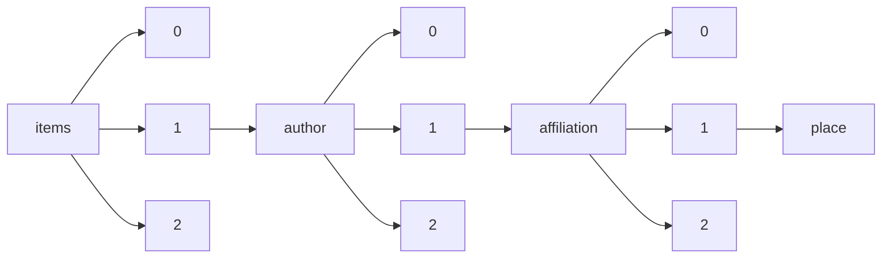

!!! warning "This document is not official Crossref documentation"
# Place
PATH = items/array/author/array/affiliation/array/place(1)  
Occurs 102 964 times  
{ .annotate }

1. A route to an element, for example:  
   The route "items/array/author/array/affiliation/array/place" corresponds to navigating through the JSON indices as  
   ["items"][0]["author"][0]["affiliation"][0]["place"]  

## Properties of Array
See information about elements: [items/array/author/array/affiliation/array/place/array](array/index.md)  
Distribution of lengths:  

| **Row** | **Length** `Any` | **Count** `Int64` |
|--------:|--------------------:|---------------------:|
| **1**   | 1                   | 102 962              |
| **2**   | 2                   | 2                    |

