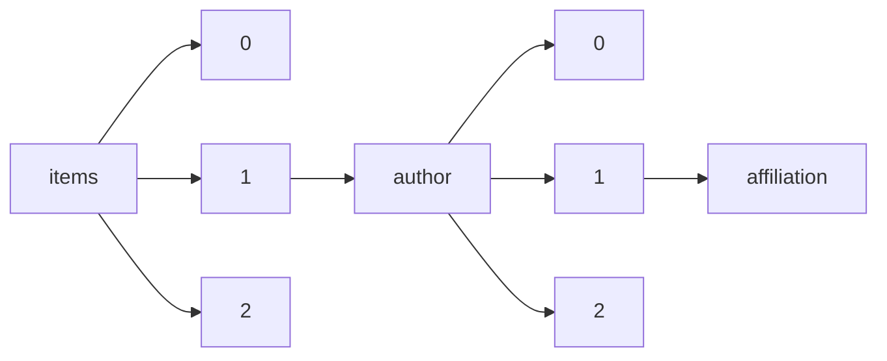

!!! warning "This document is not official Crossref documentation"
# Affiliation
PATH = items/array/author/array/affiliation(1)  
Occurs 390 050 406 times  
{ .annotate }

1. A route to an element, for example:  
   The route "items/array/author/array/affiliation" corresponds to navigating through the JSON indices as  
   ["items"][0]["author"][0]["affiliation"]  

## Properties of Array
See information about elements: [items/array/author/array/affiliation/array](array/index.md)  
Distribution of lengths:  

| **Row** | **Length** `Any` | **Count** `Int64` |
|--------:|--------------------:|---------------------:|
| **1**   | 0                   | 313 704 845          |
| **2**   | 1                   | 68 309 638           |
| **3**   | 2                   | 5 328 781            |
| **4**   | 3                   | 1 053 303            |
| **5**   | 4                   | 814 579              |
| **6**   | 5                   | 837 639              |
| **7**   | 6                   | 1 040                |
| **8**   | 7                   | 266                  |
| **9**   | 8                   | 136                  |
| **10**  | 9                   | 92                   |
| ... | ... | ... |

