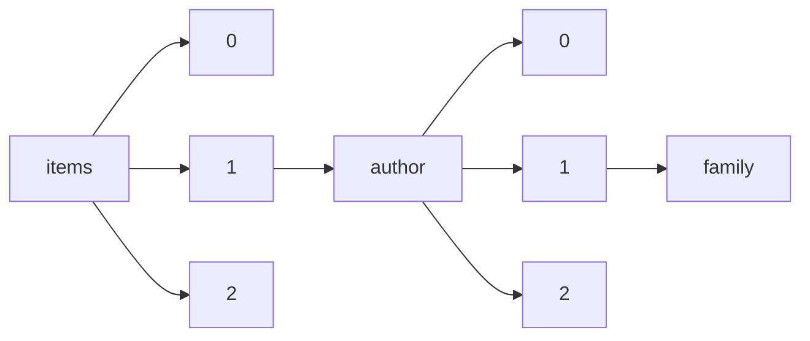

!!! warning "This document is not official Crossref documentation"
# Family
PATH = items/array/author/array/family(1)  
Occurs 385 165 352 times  
Unique values: > 999  
{ .annotate }

1. A route to an element, for example:  
   The route "items/array/author/array/family" corresponds to navigating through the JSON indices as  
   ["items"][0]["author"][0]["family"]  

!!! note "Due to current limitations, only the first 1,000 unique values are counted."

| **Row** | **Value** `String`               | **Count** `Int64` |
|--------:|------------------------------------:|---------------------:|
| **1**   | Wang                                | 3 925 935            |
| **2**   | Li                                  | 3 251 655            |
| **3**   | Zhang                               | 3 245 008            |
| **4**   | Liu                                 | 2 554 460            |
| **5**   | Chen                                | 2 389 443            |
| **6**   | Kim                                 | 1 843 743            |
| **7**   | Lee                                 | 1 798 549            |
| **8**   | Yang                                | 1 508 763            |
| **9**   | Wu                                  | 1 164 582            |
| **10**  | Xu                                  | 997 105              |
| **11**  | Huang                               | 951 718              |
| **12**  | Zhao                                | 886 135              |
| **13**  | Zhou                                | 795 625              |
| **14**  | Sun                                 | 700 236              |
| **15**  | Yu                                  | 669 082              |
| **16**  | Lin                                 | 638 407              |
| **17**  | Park                                | 632 383              |
| **18**  | Zhu                                 | 607 146              |
| **19**  | Smith                               | 565 947              |
| **20**  | Hu                                  | 507 249              |
| **21**  | Ma                                  | 485 564              |
| **22**  | Lu                                  | 475 012              |
| **23**  | Jiang                               | 464 871              |
| **24**  | Guo                                 | 454 057              |
| **25**  | He                                  | 406 041              |
| **26**  | Gao                                 | 400 291              |
| **27**  | Singh                               | 398 616              |
| **28**  | Song                                | 389 497              |
| **29**  | Kumar                               | 382 476              |
| **30**  | Han                                 | 370 764              |
| **31**  | Boyle                               | 355 772              |
| **32**  | Chang                               | 327 259              |
| **33**  | Cheng                               | 314 126              |
| **34**  | Zheng                               | 313 231              |
| **35**  | Tang                                | 307 996              |
| **36**  | Choi                                | 299 110              |
| **37**  | Shi                                 | 285 576              |
| **38**  | Silva                               | 274 297              |
| **39**  | Jones                               | 270 048              |
| **40**  | Johnson                             | 268 221              |
| **41**  | Brown                               | 255 892              |
| **42**  | &NA;                                | 248 156              |
| **43**  | Yan                                 | 246 353              |
| **44**  | Wei                                 | 242 258              |
| **45**  | Williams                            | 238 180              |
| **46**  | Luo                                 | 235 681              |
| **47**  | Miller                              | 226 315              |
| **48**  | Shen                                | 225 173              |
| **49**  | Xie                                 | 221 784              |
| **50**  | Sharma                              | 209 752              |
| **51**  | Kang                                | 209 650              |
| **52**  | Cao                                 | 207 213              |
| **53**  | Feng                                | 205 461              |
| **54**  | Liang                               | 192 946              |
| **55**  | Gupta                               | 180 870              |
| **56**  | Jin                                 | 179 314              |
| **57**  | Dong                                | 177 992              |
| **58**  | Martin                              | 175 905              |
| **59**  | Tan                                 | 171 771              |
| **60**  | Yuan                                | 171 731              |
| **61**  | Taylor                              | 169 826              |
| **62**  | Fan                                 | 168 696              |
| **63**  | Khan                                | 167 369              |
| **64**  | Thomas                              | 162 364              |
| **65**  | Peng                                | 159 837              |
| **66**  | Wilson                              | 158 015              |
| **67**  | Xiao                                | 156 344              |
| **68**  | Anderson                            | 152 398              |
| **69**  | Cho                                 | 150 711              |
| **70**  | Fu                                  | 145 011              |
| **71**  | Santos                              | 142 678              |
| **72**  | Ding                                | 139 489              |
| **73**  | Su                                  | 138 486              |
| **74**  | Du                                  | 137 961              |
| **75**  | Pan                                 | 137 934              |
| **76**  | Hong                                | 132 307              |
| **77**  | Tian                                | 130 420              |
| **78**  | Yao                                 | 128 401              |
| **79**  | Suzuki                              | 127 579              |
| **80**  | Tanaka                              | 125 033              |
| **81**  | Deng                                | 123 031              |
| **82**  | Cai                                 | 122 203              |
| **83**  | Wong                                | 121 679              |
| **84**  | Nguyen                              | 119 749              |
| **85**  | Ren                                 | 118 343              |
| **86**  | Fang                                | 117 816              |
| **87**  | Yin                                 | 115 964              |
| **88**  | Davis                               | 115 271              |
| **89**  | Patel                               | 114 372              |
| **90**  | Zeng                                | 114 217              |
| **91**  | Oliveira                            | 113 081              |
| **92**  | Lim                                 | 112 540              |
| **93**  | Thompson                            | 108 450              |
| **94**  | Ye                                  | 107 950              |
| **95**  | Chan                                | 107 748              |
| **96**  | White                               | 107 592              |
| **97**  | Schmidt                             | 106 986              |
| **98**  | Jung                                | 106 261              |
| **99**  | Cui                                 | 105 599              |
| **100** | Parker                              | 100 861              |
| **101** | Sato                                | 96 559               |
| **102** | Gu                                  | 92 617               |
| **103** | Moore                               | 92 494               |
| **104** | Chung                               | 92 458               |
| **105** | Takahashi                           | 92 332               |
| **106** | Nakamura                            | 91 088               |
| **107** | Shin                                | 90 201               |
| **108** | Ali                                 | 89 944               |
| **109** | Xia                                 | 87 475               |
| **110** | Watanabe                            | 87 065               |
| **111** | Young                               | 86 694               |
| **112** | Cohen                               | 86 174               |
| **113** | Jia                                 | 85 641               |
| **114** | Yamamoto                            | 84 972               |
| **115** | Müller                              | 84 691               |
| **116** | Qin                                 | 82 663               |
| **117** | Clark                               | 81 565               |
| **118** | Dai                                 | 81 448               |
| **119** | Evans                               | 78 588               |
| **120** | Ahmed                               | 78 311               |
| **121** | Shah                                | 78 206               |
| **122** | Rao                                 | 77 732               |
| **123** | Harris                              | 77 241               |
| **124** | Das                                 | 75 856               |
| **125** | Costa                               | 75 594               |
| **126** | Hou                                 | 75 425               |
| **127** | Meng                                | 75 334               |
| **128** | Ji                                  | 74 513               |
| **129** | Kobayashi                           | 74 470               |
| **130** | Lewis                               | 72 940               |
| **131** | Roberts                             | 72 217               |
| **132** | Walker                              | 71 266               |
| **133** | Meyer                               | 71 053               |
| **134** | Liao                                | 70 508               |
| **135** | Hall                                | 70 000               |
| **136** | Schneider                           | 69 803               |
| **137** | Wright                              | 69 383               |
| **138** | Robinson                            | 69 373               |
| **139** | Bai                                 | 68 686               |
| **140** | Pereira                             | 67 662               |
| **141** | Zhong                               | 66 936               |
| **142** | Oh                                  | 66 903               |
| **143** | Hwang                               | 66 503               |
| **144** | Qiu                                 | 65 373               |
| **145** | Gong                                | 64 701               |
| **146** | Wen                                 | 64 690               |
| **147** | Scott                               | 64 594               |
| **148** | Campbell                            | 63 745               |
| **149** | Wagner                              | 63 219               |
| **150** | Ferreira                            | 62 834               |
| **151** | Fischer                             | 62 362               |
| **152** | Xue                                 | 61 708               |
| **153** | King                                | 60 680               |
| **154** | Qi                                  | 59 508               |
| **155** | Jackson                             | 58 749               |
| **156** | Baker                               | 58 670               |
| **157** | Green                               | 58 296               |
| **158** | Lai                                 | 58 225               |
| **159** | Hill                                | 57 808               |
| **160** | Yoon                                | 57 787               |
| **161** | Ito                                 | 57 472               |
| **162** | Allen                               | 57 429               |
| **163** | Ahmad                               | 56 886               |
| **164** | Zou                                 | 56 598               |
| **165** | Weber                               | 56 434               |
| **166** | Nelson                              | 56 329               |
| **167** | Chu                                 | 55 198               |
| **168** | Davies                              | 53 991               |
| **169** | Jain                                | 53 515               |
| **170** | Murphy                              | 52 593               |
| **171** | Ho                                  | 52 540               |
| **172** | Garrity                             | 52 373               |
| **173** | Yamada                              | 52 324               |
| **174** | Jeong                               | 51 461               |
| **175** | Kwon                                | 50 696               |
| **176** | Kato                                | 50 314               |
| **177** | Yoshida                             | 50 171               |
| **178** | Klein                               | 49 580               |
| **179** | Lv                                  | 49 532               |
| **180** | Wood                                | 49 285               |
| **181** | Adams                               | 49 191               |
| **182** | Xiong                               | 49 173               |
| **183** | Qian                                | 49 014               |
| **184** | Saito                               | 48 839               |
| **185** | Edwards                             | 48 465               |
| **186** | Souza                               | 48 065               |
| **187** | Phillips                            | 47 801               |
| **188** | .                                   | 47 459               |
| **189** | Turner                              | 47 367               |
| **190** | Hsu                                 | 47 282               |
| **191** | Cooper                              | 47 173               |
| **192** | Long                                | 46 770               |
| **193** | Morris                              | 46 671               |
| **194** | Roy                                 | 46 399               |
| **195** | Mitchell                            | 45 904               |
| **196** | Kong                                | 45 159               |
| **197** | Duan                                | 44 514               |
| **198** | Hao                                 | 44 318               |
| **199** | Mao                                 | 44 093               |
| **200** | Tsai                                | 43 996               |
| **201** | Shao                                | 43 103               |
| **202** | Lima                                | 42 876               |
| **203** | Morgan                              | 42 124               |
| **204** | Becker                              | 41 974               |
| **205** | Jang                                | 41 932               |
| **206** | Yi                                  | 41 429               |
| **207** | Hansen                              | 41 411               |
| **208** | Stewart                             | 41 118               |
| **209** | Tao                                 | 40 986               |
| **210** | Inoue                               | 40 777               |
| **211** | Bell                                | 39 567               |
| **212** | Rodrigues                           | 39 546               |
| **213** | Lei                                 | 39 506               |
| **214** | Leung                               | 39 235               |
| **215** | Wan                                 | 38 370               |
| **216** | Kelly                               | 38 163               |
| **217** | Hughes                              | 38 081               |
| **218** | Garcia                              | 38 023               |
| **219** | Ghosh                               | 37 826               |
| **220** | Noble                               | 36 797               |
| **221** | Carvalho                            | 36 787               |
| **222** | Ward                                | 36 729               |
| **223** | Mishra                              | 36 656               |
| **224** | Collins                             | 36 609               |
| **225** | Rahman                              | 36 399               |
| **226** | Ahn                                 | 36 377               |
| **227** | Murray                              | 36 325               |
| **228** | Matsumoto                           | 36 107               |
| **229** | Ross                                | 35 197               |
| **230** | Weiss                               | 34 813               |
| **231** | Ng                                  | 34 780               |
| **232** | Fisher                              | 34 759               |
| **233** | WANG                                | 34 387               |
| **234** | Watson                              | 33 968               |
| **235** | Heppner                             | 33 268               |
| **236** | Hayashi                             | 33 202               |
| **237** | Jensen                              | 33 108               |
| **238** | Qu                                  | 32 997               |
| **239** | An                                  | 32 834               |
| **240** | Seo                                 | 32 720               |
| **241** | Mori                                | 32 568               |
| **242** | Peters                              | 32 416               |
| **243** | Shaw                                | 31 961               |
| **244** | Schwartz                            | 31 809               |
| **245** | Reddy                               | 31 699               |
| **246** | Harrison                            | 31 249               |
| **247** | Guan                                | 31 172               |
| **248** | Simon                               | 31 159               |
| **249** | -                                   | 31 045               |
| **250** | Martins                             | 30 744               |
| **251** | Wolf                                | 30 627               |
| **252** | Russell                             | 30 395               |
| **253** | Marshall                            | 30 382               |
| **254** | Pardasani                           | 30 241               |
| **255** | Ge                                  | 30 165               |
| **256** | Kimura                              | 30 123               |
| **257** | Cook                                | 29 919               |
| **258** | Yamaguchi                           | 29 379               |
| **259** | James                               | 29 323               |
| **260** | Rogers                              | 28 975               |
| **261** | Tong                                | 28 911               |
| **262** | Sasaki                              | 28 673               |
| **263** | Moon                                | 28 641               |
| **264** | Gordon                              | 28 555               |
| **265** | Newman                              | 28 510               |
| **266** | Gray                                | 28 477               |
| **267** | Bennett                             | 28 223               |
| **268** | Paul                                | 28 103               |
| **269** | Ribeiro                             | 27 976               |
| **270** | Peterson                            | 27 321               |
| **271** | Bauer                               | 27 196               |
| **272** | Price                               | 27 156               |
| **273** | Shimizu                             | 26 909               |
| **274** | Clarke                              | 26 766               |
| **275** | Xiang                               | 26 555               |
| **276** | SUZUKI                              | 26 469               |
| **277** | LI                                  | 26 379               |
| **278** | Xing                                | 26 238               |
| **279** | Lang                                | 26 082               |
| **280** | Yoo                                 | 26 047               |
| **281** | Hassan                              | 26 028               |
| **282** | ZHANG                               | 26 003               |
| **283** | Niu                                 | 25 980               |
| **284** | Almeida                             | 25 930               |
| **285** | Ko                                  | 25 884               |
| **286** | Carter                              | 25 165               |
| **287** | Robertson                           | 25 152               |
| **288** | Cox                                 | 24 705               |
| **289** | Hoffmann                            | 24 579               |
| **290** | TANAKA                              | 24 435               |
| **291** | Kennedy                             | 24 286               |
| **292** | Koch                                | 24 167               |
| **293** | Walsh                               | 24 136               |
| **294** | Richardson                          | 23 930               |
| **295** | Graham                              | 23 882               |
| **296** | Berger                              | 23 855               |
| **297** | Fernandes                           | 23 793               |
| **298** | Fox                                 | 23 570               |
| **299** | Ellis                               | 23 255               |
| **300** | Anonymous                           | 22 953               |
| **301** | Gomes                               | 22 522               |
| **302** | Ibrahim                             | 22 451               |
| **303** | Rossi                               | 22 216               |
| **304** | Bao                                 | 22 028               |
| **305** | Nielsen                             | 21 959               |
| **306** | Johnston                            | 21 917               |
| **307** | Srivastava                          | 21 747               |
| **308** | Rodriguez                           | 21 671               |
| **309** | You                                 | 21 627               |
| **310** | Verma                               | 21 394               |
| **311** | Capinera                            | 21 182               |
| **312** | Bailey                              | 21 114               |
| **313** | Alexander                           | 20 987               |
| **314** | Ryan                                | 20 986               |
| **315** | Hashimoto                           | 20 793               |
| **316** | Alves                               | 20 630               |
| **317** | Yadav                               | 20 614               |
| **318** | Rose                                | 20 468               |
| **319** | Islam                               | 20 379               |
| **320** | SATO                                | 20 333               |
| **321** | Palmer                              | 20 283               |
| **322** | Simpson                             | 20 249               |
| **323** | Abe                                 | 19 800               |
| **324** | George                              | 19 764               |
| **325** | Martinez                            | 19 735               |
| **326** | Ikeda                               | 19 511               |
| **327** | Lam                                 | 19 469               |
| **328** | Joshi                               | 19 365               |
| **329** | Hamilton                            | 19 236               |
| **330** | Castro                              | 19 173               |
| **331** | Agarwal                             | 18 864               |
| **332** | Tran                                | 18 501               |
| **333** | Levy                                | 18 481               |
| **334** | Kaur                                | 18 299               |
| **335** | Jeon                                | 18 230               |
| **336** | Butler                              | 18 165               |
| **337** | WATANABE                            | 18 089               |
| **338** | Hussain                             | 18 086               |
| **339** | Ni                                  | 18 055               |
| **340** | Sullivan                            | 18 053               |
| **341** | LIU                                 | 17 919               |
| **342** | TAKAHASHI                           | 17 708               |
| **343** | Lopes                               | 17 611               |
| **344** | Keller                              | 17 587               |
| **345** | Foster                              | 17 425               |
| **346** | Pandey                              | 17 395               |
| **347** | Okada                               | 17 288               |
| **348** | Kuo                                 | 17 259               |
| **349** | Stone                               | 17 205               |
| **350** | Stevens                             | 17 158               |
| **351** | Frank                               | 17 150               |
| **352** | Fujita                              | 17 131               |
| **353** | KOBAYASHI                           | 17 101               |
| **354** | Qiao                                | 17 054               |
| **355** | Stein                               | 17 025               |
| **356** | Sousa                               | 16 936               |
| **357** | Pang                                | 16 741               |
| **358** | Jacobs                              | 16 688               |
| **359** | Barnes                              | 16 588               |
| **360** | Mason                               | 16 572               |
| **361** | Ogawa                               | 16 557               |
| **362** | Friedman                            | 16 488               |
| **363** | Banerjee                            | 16 483               |
| **364** | Reid                                | 16 354               |
| **365** | Beck                                | 16 354               |
| **366** | Howard                              | 16 321               |
| **367** | Wallace                             | 16 284               |
| **368** | YAMAMOTO                            | 16 184               |
| **369** | Davidson                            | 16 074               |
| **370** | Yue                                 | 16 035               |
| **371** | Gibson                              | 16 024               |
| **372** | Torres                              | 16 001               |
| **373** | Prasad                              | 15 984               |
| **374** | Roth                                | 15 896               |
| **375** | Cole                                | 15 837               |
| **376** | Powell                              | 15 576               |
| **377** | CHEN                                | 15 553               |
| **378** | NAKAMURA                            | 15 515               |
| **379** | Mayer                               | 15 449               |
| **380** | Min                                 | 15 232               |
| **381** | Ray                                 | 15 227               |
| **382** | Chou                                | 15 186               |
| **383** | Bae                                 | 15 186               |
| **384** | Reynolds                            | 15 180               |
| **385** | Henderson                           | 15 040               |
| **386** | West                                | 15 030               |
| **387** | Schwarz                             | 14 696               |
| **388** | Ishikawa                            | 14 662               |
| **389** | Sakai                               | 14 636               |
| **390** | Ramos                               | 14 584               |
| **391** | Murakami                            | 14 489               |
| **392** | Richter                             | 14 486               |
| **393** | Tu                                  | 14 409               |
| **394** | Gooch                               | 14 399               |
| **395** | Gross                               | 14 308               |
| **396** | Richards                            | 14 254               |
| **397** | Mehta                               | 14 239               |
| **398** | Andersen                            | 14 156               |
| **399** | Freeman                             | 14 099               |
| **400** | Lau                                 | 13 953               |
| **401** | Mohamed                             | 13 901               |
| **402** | Hoffman                             | 13 793               |
| **403** | Soares                              | 13 698               |
| **404** | Yamashita                           | 13 657               |
| **405** | Gilbert                             | 13 579               |
| **406** | Gonzalez                            | 13 570               |
| **407** | Myers                               | 13 553               |
| **408** | Kondo                               | 13 519               |
| **409** | Kellis                              | 13 482               |
| **410** | Hunt                                | 13 460               |
| **411** | Pinto                               | 13 414               |
| **412** | SMITH                               | 13 365               |
| **413** | Black                               | 13 354               |
| **414** | Hahn                                | 13 317               |
| **415** | Arnold                              | 13 284               |
| **416** | Chapman                             | 13 203               |
| **417** | Yun                                 | 13 176               |
| **418** | Kaplan                              | 13 126               |
| **419** | Fujii                               | 13 118               |
| **420** | Hasegawa                            | 13 094               |
| **421** | Soroko                              | 12 980               |
| **422** | Sukhoruchkin                        | 12 979               |
| **423** | Miao                                | 12 939               |
| **424** | Le                                  | 12 828               |
| **425** | Hunter                              | 12 791               |
| **426** | Fontaine                            | 12 788               |
| **427** | Holmes                              | 12 784               |
| **428** | Armstrong                           | 12 745               |
| **429** | Andrade                             | 12 729               |
| **430** | Grant                               | 12 592               |
| **431** | Mueller                             | 12 591               |
| **432** | Brooks                              | 12 440               |
| **433** | Reed                                | 12 435               |
| **434** | Nam                                 | 12 411               |
| **435** | Mills                               | 12 365               |
| **436** | Kehiaian                            | 12 341               |
| **437** | Sosnkowska-Kehiaian                 | 12 341               |
| **438** | Takeuchi                            | 12 318               |
| **439** | Jenkins                             | 12 316               |
| **440** | YAMADA                              | 12 300               |
| **441** | McDonald                            | 12 221               |
| **442** | Rocha                               | 12 188               |
| **443** | Ivanov                              | 12 112               |
| **444** | Maeda                               | 11 984               |
| **445** | YOSHIDA                             | 11 980               |
| **446** | ITO                                 | 11 869               |
| **447** | Hart                                | 11 868               |
| **448** | Ueda                                | 11 838               |
| **449** | Dickens                             | 11 761               |
| **450** | Jiao                                | 11 754               |
| **451** | Itoh                                | 11 700               |
| **452** | Fieser                              | 11 569               |
| **453** | Patil                               | 11 560               |
| **454** | Weik                                | 11 514               |
| **455** | Ryu                                 | 11 475               |
| **456** | Goldstein                           | 11 440               |
| **457** | Andrews                             | 11 429               |
| **458** | Ha                                  | 11 295               |
| **459** | Okamoto                             | 11 164               |
| **460** | Levine                              | 11 117               |
| **461** | David                               | 11 101               |
| **462** | Katz                                | 11 072               |
| **463** | KATO                                | 11 059               |
| **464** | Christensen                         | 11 002               |
| **465** | Dias                                | 10 936               |
| **466** | Matthews                            | 10 858               |
| **467** | Braun                               | 10 813               |
| **468** | Mann                                | 10 770               |
| **469** | SAITO                               | 10 732               |
| **470** | Webb                                | 10 658               |
| **471** | Nie                                 | 10 640               |
| **472** | Ismail                              | 10 544               |
| **473** | Gonçalves                           | 10 521               |
| **474** | Mukherjee                           | 10 500               |
| **475** | Sarkar                              | 10 495               |
| **476** | Perry                               | 10 439               |
| **477** | Schulz                              | 10 427               |
| **478** | Elliott                             | 10 334               |
| **479** | Petersen                            | 10 331               |
| **480** | LEE                                 | 10 324               |
| **481** | Goto                                | 10 322               |
| **482** | Vieira                              | 10 294               |
| **483** | Harvey                              | 10 231               |
| **484** | Nakajima                            | 10 208               |
| **485** | Porter                              | 10 172               |
| **486** | Bährle-Rapp                         | 10 059               |
| **487** | Hsieh                               | 10 037               |
| **488** | García                              | 10 036               |
| **489** | Morrison                            | 9 909                |
| **490** | Jing                                | 9 901                |
| **491** | Werner                              | 9 876                |
| **492** | Hofmann                             | 9 830                |
| **493** | Zhan                                | 9 829                |
| **494** | Ling                                | 9 767                |
| **495** | Cheung                              | 9 734                |
| **496** | Lo                                  | 9 734                |
| **497** | Sinha                               | 9 605                |
| **498** | Lan                                 | 9 593                |
| **499** | Schmitt                             | 9 559                |
| **500** | González                            | 9 465                |
| **501** | Ferguson                            | 9 365                |
| **502** | Shang                               | 9 302                |
| **503** | Machado                             | 9 269                |
| **504** | Schmid                              | 9 233                |
| **505** | Ishii                               | 9 218                |
| **506** | da Silva                            | 9 191                |
| **507** | Coleman                             | 9 118                |
| **508** | HAYASHI                             | 9 094                |
| **509** | Chiu                                | 9 072                |
| **510** | Zhai                                | 9 071                |
| **511** | Nakagawa                            | 9 040                |
| **512** | Takeda                              | 9 014                |
| **513** | Jordan                              | 8 973                |
| **514** | Barbosa                             | 8 958                |
| **515** | Moreira                             | 8 930                |
| **516** | Araújo                              | 8 875                |
| **517** | Nishimura                           | 8 828                |
| **518** | Son                                 | 8 805                |
| **519** |                                     | 8 804                |
| **520** | Shapiro                             | 8 695                |
| **521** | Ono                                 | 8 671                |
| **522** | Malik                               | 8 608                |
| **523** | Gardner                             | 8 586                |
| **524** | Wohlfarth                           | 8 564                |
| **525** | Burns                               | 8 552                |
| **526** | Huber                               | 8 522                |
| **527** | Goldberg                            | 8 511                |
| **528** | INOUE                               | 8 507                |
| **529** | Kramer                              | 8 369                |
| **530** | Teixeira                            | 8 270                |
| **531** | Matsuda                             | 8 254                |
| **532** | MATSUMOTO                           | 8 251                |
| **533** | Wells                               | 8 239                |
| **534** | Agrawal                             | 8 195                |
| **535** | Henry                               | 8 185                |
| **536** | Hayes                               | 8 098                |
| **537** | Patterson                           | 8 067                |
| **538** | Cruz                                | 8 061                |
| **539** | Thomson                             | 8 039                |
| **540** | Snyder                              | 8 012                |
| **541** | Carroll                             | 8 002                |
| **542** | Geng                                | 7 970                |
| **543** | Hartmann                            | 7 934                |
| **544** | Lawrence                            | 7 907                |
| **545** | Saha                                | 7 856                |
| **546** | KIM                                 | 7 819                |
| **547** | Levin                               | 7 817                |
| **548** | Lange                               | 7 811                |
| **549** | Wilkinson                           | 7 800                |
| **550** | Moreno                              | 7 762                |
| **551** | Neumann                             | 7 712                |
| **552** | Martínez                            | 7 690                |
| **553** | Nakano                              | 7 622                |
| **554** | Muller                              | 7 610                |
| **555** | MORI                                | 7 591                |
| **556** | Garg                                | 7 547                |
| **557** | Rodríguez                           | 7 532                |
| **558** | Yeh                                 | 7 499                |
| **559** | SASAKI                              | 7 486                |
| **560** | Spencer                             | 7 455                |
| **561** | Fukuda                              | 7 452                |
| **562** | Vogt                                | 7 441                |
| **563** | Lopez                               | 7 407                |
| **564** | Campos                              | 7 378                |
| **565** | Chatterjee                          | 7 356                |
| **566** | Warren                              | 7 331                |
| **567** | Sung                                | 7 329                |
| **568** | Crawford                            | 7 319                |
| **569** | Marques                             | 7 313                |
| **570** | Hasan                               | 7 308                |
| **571** | Lambert                             | 7 281                |
| **572** | Lynch                               | 7 270                |
| **573** | Zimmermann                          | 7 257                |
| **574** | KIMURA                              | 7 246                |
| **575** | Sheng                               | 7 225                |
| **576** | Sakamoto                            | 7 215                |
| **577** | Olson                               | 7 202                |
| **578** | Wada                                | 7 173                |
| **579** | Hua                                 | 7 169                |
| **580** | Abdullah                            | 7 044                |
| **581** | Nair                                | 7 029                |
| **582** | Larsen                              | 7 029                |
| **583** | Ford                                | 7 012                |
| **584** | YAMAGUCHI                           | 7 005                |
| **585** | Gill                                | 6 952                |
| **586** | Bradley                             | 6 935                |
| **587** | Reis                                | 6 899                |
| **588** | SHIMIZU                             | 6 789                |
| **589** | Cate                                | 6 769                |
| **590** | Weng                                | 6 765                |
| **591** | Sanders                             | 6 723                |
| **592** | Dunn                                | 6 719                |
| **593** | Hung                                | 6 702                |
| **594** | McCarthy                            | 6 671                |
| **595** | Cardoso                             | 6 611                |
| **596** | Zuo                                 | 6 547                |
| **597** | Joseph                              | 6 429                |
| **598** | Aoki                                | 6 413                |
| **599** | Zhuang                              | 6 376                |
| **600** | Burke                               | 6 351                |
| **601** | Xin                                 | 6 337                |
| **602** | 王                                  | 6 328                |
| **603** | S                                   | 6 307                |
| **604** | Bernstein                           | 6 255                |
| **605** | Cunningham                          | 6 216                |
| **606** | Chao                                | 6 171                |
| **607** | Shu                                 | 6 159                |
| **608** | Gaillard                            | 6 153                |
| **609** | Nascimento                          | 6 149                |
| **610** | Sanchez                             | 6 139                |
| **611** | Chi                                 | 6 118                |
| **612** | Pal                                 | 6 114                |
| **613** | Arai                                | 6 112                |
| **614** | Berg                                | 6 104                |
| **615** | Freitas                             | 5 988                |
| **616** | Harada                              | 5 985                |
| **617** | Day                                 | 5 953                |
| **618** | Shan                                | 5 934                |
| **619** | Rosenberg                           | 5 860                |
| **620** | Vogel                               | 5 842                |
| **621** | HASHIMOTO                           | 5 812                |
| **622** | Mohammed                            | 5 808                |
| **623** | Bi                                  | 5 805                |
| **624** | Tamura                              | 5 769                |
| **625** | Kaneko                              | 5 762                |
| **626** | Alam                                | 5 745                |
| **627** | Yokoyama                            | 5 742                |
| **628** | 张                                  | 5 740                |
| **629** | Pei                                 | 5 726                |
| **630** | Mu                                  | 5 722                |
| **631** | Pedersen                            | 5 713                |
| **632** | Hoy                                 | 5 698                |
| **633** | Perez                               | 5 692                |
| **634** | Hara                                | 5 679                |
| **635** | Chakraborty                         | 5 664                |
| **636** | Pearson                             | 5 648                |
| **637** | Goodman                             | 5 647                |
| **638** | Seitz                               | 5 638                |
| **639** | Wigley                              | 5 630                |
| **640** | Lisch                               | 5 605                |
| **641** | Janecke                             | 5 605                |
| **642** | Miyamoto                            | 5 599                |
| **643** | Carlson                             | 5 583                |
| **644** | Wordsworth                          | 5 582                |
| **645** | Jansen                              | 5 568                |
| **646** | Pham                                | 5 519                |
| **647** | Hossain                             | 5 499                |
| **648** | FUJITA                              | 5 492                |
| **649** | Walter                              | 5 486                |
| **650** | C.                                  | 5 466                |
| **651** | Knipe                               | 5 459                |
| **652** | Sen                                 | 5 450                |
| **653** | 李                                  | 5 447                |
| **654** | S.                                  | 5 414                |
| **655** | Gan                                 | 5 400                |
| **656** | Shibata                             | 5 396                |
| **657** | Dixon                               | 5 385                |
| **658** | Sánchez                             | 5 364                |
| **659** | B.                                  | 5 316                |
| **660** | Carlyle                             | 5 309                |
| **661** | ABE                                 | 5 304                |
| **662** | Stern                               | 5 261                |
| **663** | Jo                                  | 5 222                |
| **664** | Dutta                               | 5 208                |
| **665** | Cenzual                             | 5 196                |
| **666** | Gladyshevskii                       | 5 157                |
| **667** | MURAKAMI                            | 5 144                |
| **668** | Fujiwara                            | 5 141                |
| **669** | IKEDA                               | 5 104                |
| **670** | Sari                                | 5 092                |
| **671** | Dawson                              | 5 061                |
| **672** | Iqbal                               | 5 033                |
| **673** | Biswas                              | 5 019                |
| **674** | M.                                  | 5 007                |
| **675** | Villars                             | 5 003                |
| **676** | Dubenskyy                           | 5 003                |
| **677** | Shcherban                           | 5 003                |
| **678** | M                                   | 4 972                |
| **679** | JONES                               | 4 968                |
| **680** | Rubin                               | 4 957                |
| **681** | Fraser                              | 4 956                |
| **682** | International Monetary Fund         | 4 935                |
| **683** | Nunes                               | 4 931                |
| **684** | OKADA                               | 4 928                |
| **685** | Barrett                             | 4 878                |
| **686** | Chai                                | 4 832                |
| **687** | Hangay                              | 4 815                |
| **688** | Barker                              | 4 767                |
| **689** | O'Brien                             | 4 731                |
| **690** | Duffus                              | 4 657                |
| **691** | Daams                               | 4 648                |
| **692** | Melo                                | 4 644                |
| **693** | Wolff                               | 4 602                |
| **694** | Fernández                           | 4 588                |
| **695** | Griffiths                           | 4 576                |
| **696** | Winkelmann                          | 4 544                |
| **697** | SAKAI                               | 4 524                |
| **698** | ISHIKAWA                            | 4 499                |
| **699** | Mei                                 | 4 498                |
| **700** | Cameron                             | 4 445                |
| **701** | Tiwari                              | 4 433                |
| **702** | YANG                                | 4 394                |
| **703** | OGAWA                               | 4 362                |
| **704** | El-Feky                             | 4 347                |
| **705** | Baldwin                             | 4 337                |
| **706** | Cibulka                             | 4 319                |
| **707** | López                               | 4 315                |
| **708** | Fernandez                           | 4 310                |
| **709** | Griffin                             | 4 286                |
| **710** | Suh                                 | 4 280                |
| **711** | Bhattacharya                        | 4 262                |
| **712** | UEDA                                | 4 254                |
| **713** | Ju                                  | 4 243                |
| **714** | Chow                                | 4 214                |
| **715** | BROWN                               | 4 211                |
| **716** | HASEGAWA                            | 4 202                |
| **717** | Lane                                | 4 180                |
| **718** | Chowdhury                           | 4 168                |
| **719** | H.                                  | 4 158                |
| **720** | WILLIAMS                            | 4 154                |
| **721** | Woods                               | 4 151                |
| **722** | Russo                               | 4 125                |
| **723** | Singer                              | 4 104                |
| **724** | Romero                              | 4 101                |
| **725** | Lucas                               | 4 099                |
| **726** | Ishida                              | 4 078                |
| **727** | KONDO                               | 4 072                |
| **728** | FUJII                               | 4 059                |
| **729** | TAKEUCHI                            | 4 034                |
| **730** | Uchida                              | 4 026                |
| **731** | Woo                                 | 3 982                |
| **732** | Berry                               | 3 959                |
| **733** | Templeton                           | 3 916                |
| **734** | Fuchs                               | 3 916                |
| **735** | Rosen                               | 3 899                |
| **736** | Williamson                          | 3 896                |
| **737** | Robson                              | 3 864                |
| **738** | Rice                                | 3 831                |
| **739** | Morita                              | 3 802                |
| **740** | Wichterle                           | 3 797                |
| **741** | Adler                               | 3 788                |
| **742** | Larson                              | 3 788                |
| **743** | NAKAGAWA                            | 3 788                |
| **744** | Not Available                       | 3 773                |
| **745** | GOTO                                | 3 771                |
| **746** | May                                 | 3 768                |
| **747** | Knight                              | 3 716                |
| **748** | Stevenson                           | 3 706                |
| **749** | Greene                              | 3 702                |
| **750** | Mendes                              | 3 669                |
| **751** | YAMASHITA                           | 3 633                |
| **752** | Bishop                              | 3 629                |
| **753** | Osier                               | 3 616                |
| **754** | Nilsson                             | 3 584                |
| **755** | Kalinowski                          | 3 567                |
| **756** | Boyd                                | 3 546                |
| **757** | Johansson                           | 3 541                |
| **758** | Miura                               | 3 537                |
| **759** | Linek                               | 3 537                |
| **760** | TAKEDA                              | 3 430                |
| **761** | Hoyer                               | 3 428                |
| **762** | OKAMOTO                             | 3 416                |
| **763** | Wormald                             | 3 414                |
| **764** | Grolier                             | 3 413                |
| **765** | Ning                                | 3 399                |
| **766** | Sunderkötter                        | 3 381                |
| **767** | Kikuchi                             | 3 376                |
| **768** | Webster                             | 3 376                |
| **769** | A                                   | 3 370                |
| **770** | Feldman                             | 3 364                |
| **771** | Ferrari                             | 3 357                |
| **772** | Schultz                             | 3 308                |
| **773** | Desai                               | 3 284                |
| **774** | Ohta                                | 3 279                |
| **775** | Duncan                              | 3 275                |
| **776** | Fleming                             | 3 267                |
| **777** | John                                | 3 245                |
| **778** | MAEDA                               | 3 240                |
| **779** | Leonard                             | 3 232                |
| **780** | Gerdes                              | 3 173                |
| **781** | Volkmar                             | 3 154                |
| **782** | Hanson                              | 3 135                |
| **783** | Owen                                | 3 119                |
| **784** | Archiv für katholisches Kirchenrech | 3 119                |
| **785** | Epstein                             | 3 096                |
| **786** | Lloyd                               | 3 091                |
| **787** | Ouyang                              | 3 059                |
| **788** | Xi                                  | 3 035                |
| **789** | M�ller                              | 3 028                |
| **790** | 刘                                  | 3 027                |
| **791** | Herrmann                            | 3 007                |
| **792** | G.                                  | 3 001                |
| **793** | Hirota                              | 2 980                |
| **794** | Livius]                             | 2 940                |
| **795** | Arora                               | 2 896                |
| **796** | Kaiser                              | 2 894                |
| **797** | Andersson                           | 2 879                |
| **798** | Olsen                               | 2 879                |
| **799** | Abivardi                            | 2 869                |
| **800** | Ramsay                              | 2 867                |
| **801** | Lyu                                 | 2 867                |
| **802** | Pavlyuk                             | 2 861                |
| **803** | Endo                                | 2 861                |
| **804** | Sysa                                | 2 860                |
| **805** | ISHII                               | 2 841                |
| **806** | Scahill                             | 2 810                |
| **807** | Iijima                              | 2 810                |
| **808** | Kuchitsu                            | 2 807                |
| **809** | Ando                                | 2 782                |
| **810** | Koh                                 | 2 765                |
| **811** | Amin                                | 2 758                |
| **812** | Duddeck                             | 2 756                |
| **813** | Cabot                               | 2 733                |
| **814** | Riley                               | 2 731                |
| **815** | Robbins                             | 2 723                |
| **816** | Monteiro                            | 2 714                |
| **817** | Melnichenko-Koblyuk                 | 2 701                |
| **818** | Nakayama                            | 2 689                |
| **819** | Holland                             | 2 683                |
| **820** | SAKAMOTO                            | 2 681                |
| **821** | Balster                             | 2 663                |
| **822** | Popov                               | 2 660                |
| **823** | JOHNSON                             | 2 658                |
| **824** | McDougle                            | 2 630                |
| **825** | ONO                                 | 2 555                |
| **826** | Millichap                           | 2 554                |
| **827** | MISSING-VALUE                       | 2 553                |
| **828** | Wheeler                             | 2 533                |
| **829** | 陈                                  | 2 529                |
| **830** | Schnog                              | 2 523                |
| **831** | Hernandez                           | 2 519                |
| **832** | Lader                               | 2 510                |
| **833** | Nation                              | 2 482                |
| **834** | Miranda                             | 2 474                |
| **835** | Fowler                              | 2 473                |
| **836** | Hnědkovský                          | 2 464                |
| **837** | L.                                  | 2 457                |
| **838** | Miczek                              | 2 435                |
| **839** | Erickson                            | 2 428                |
| **840** | ARAI                                | 2 423                |
| **841** | Chiang                              | 2 406                |
| **842** | Christie                            | 2 390                |
| **843** | Savysyuk                            | 2 387                |
| **844** | MATSUDA                             | 2 386                |
| **845** | Holze                               | 2 382                |
| **846** | KANEKO                              | 2 357                |
| **847** | A.                                  | 2 339                |
| **848** | Nordberg                            | 2 337                |
| **849** | YAMAZAKI                            | 2 321                |
| **850** | Winter                              | 2 320                |
| **851** | de Wit                              | 2 318                |
| **852** | Saunders                            | 2 312                |
| **853** | Weerakkody                          | 2 308                |
| **854** | AOKI                                | 2 297                |
| **855** | Teng                                | 2 289                |
| **856** | FUKUDA                              | 2 279                |
| **857** | Chihara                             | 2 254                |
| **858** | Sheikh                              | 2 251                |
| **859** | Franco                              | 2 247                |
| **860** | Böhm                                | 2 237                |
| **861** | ITOH                                | 2 227                |
| **862** | Steckler                            | 2 213                |
| **863** | Luger                               | 2 208                |
| **864** | Fletcher                            | 2 187                |
| **865** | MORITA                              | 2 160                |
| **866** | Bentham                             | 2 149                |
| **867** | Ball                                | 2 129                |
| **868** | Page                                | 2 075                |
| **869** | Cranshaw                            | 2 070                |
| **870** | Herz                                | 2 055                |
| **871** | Lou                                 | 2 002                |
| **872** | Gidron                              | 1 997                |
| **873** | Panizzi                             | 1 994                |
| **874** | Chambers                            | 1 960                |
| **875** | NISHIMURA                           | 1 954                |
| **876** | Hess                                | 1 952                |
| **877** | Stoiko                              | 1 941                |
| **878** | Dean                                | 1 941                |
| **879** | Cador                               | 1 933                |
| **880** | Hardy                               | 1 928                |
| **881** | Sourakov                            | 1 924                |
| **882** | Paschke                             | 1 907                |
| **883** | Boggs                               | 1 878                |
| **884** | Hilderbrandt                        | 1 876                |
| **885** | Niktin                              | 1 876                |
| **886** | Prickaerts                          | 1 859                |
| **887** | Marsh                               | 1 858                |
| **888** | Blankenship                         | 1 842                |
| **889** | Stigler                             | 1 841                |
| **890** | Posey                               | 1 841                |
| **891** | Kirwan                              | 1 833                |
| **892** | Fleischhacker                       | 1 823                |
| **893** | Oliver                              | 1 819                |
| **894** | Mo                                  | 1 799                |
| **895** | Symson                              | 1 785                |
| **896** | Jacob                               | 1 768                |
| **897** | Nichols                             | 1 761                |
| **898** | Mannor                              | 1 754                |
| **899** | Mizell                              | 1 745                |
| **900** | Predel                              | 1 723                |
| **901** | Wilkins                             | 1 719                |
| **902** | Mehlhorn                            | 1 708                |
| **903** | Jolivet                             | 1 682                |
| **904** | Unger                               | 1 666                |
| **905** | Newhouse                            | 1 660                |
| **906** | Martialis]                          | 1 646                |
| **907** | Uspensky                            | 1 644                |
| **908** | Häussinger                          | 1 625                |
| **909** | Gayubo                              | 1 620                |
| **910** | Wadenberg                           | 1 607                |
| **911** | Clercq                              | 1 604                |
| **912** | Denson                              | 1 578                |
| **913** | Pantelis                            | 1 575                |
| **914** | Schwenk                             | 1 572                |
| **915** | Shukla                              | 1 570                |
| **916** | Hopkins                             | 1 567                |
| **917** | Hiemke                              | 1 556                |
| **918** | López-Ibor                          | 1 556                |
| **919** | Burton                              | 1 553                |
| **920** | Shaham                              | 1 541                |
| **921** | McCravy                             | 1 535                |
| **922** | Pfister                             | 1 525                |
| **923** | UK, CAB International               | 1 507                |
| **924** | Sanborn                             | 1 504                |
| **925** | Flor                                | 1 496                |
| **926** | Svenningsson                        | 1 494                |
| **927** | Duka                                | 1 490                |
| **928** | Maier                               | 1 485                |
| **929** | Spear                               | 1 484                |
| **930** | Meck                                | 1 478                |
| **931** | Bickel                              | 1 473                |
| **932** | Bubar                               | 1 453                |
| **933** | Alici                               | 1 444                |
| **934** | Breitbart                           | 1 444                |
| **935** | Curran                              | 1 430                |
| **936** | März                                | 1 407                |
| **937** | Goula                               | 1 407                |
| **938** | Ziegler                             | 1 407                |
| **939** | Hurd                                | 1 397                |
| **940** | Bond                                | 1 396                |
| **941** | Alvarez                             | 1 386                |
| **942** | Mikhova                             | 1 381                |
| **943** | Coons                               | 1 374                |
| **944** | Simola                              | 1 368                |
| **945** | Morelli                             | 1 367                |
| **946** | Hofer                               | 1 366                |
| **947** | Graner                              | 1 363                |
| **948** | null                                | 1 331                |
| **949** | Bhushan                             | 1 330                |
| **950** | Dobhal                              | 1 311                |
| **951** | Klassen                             | 1 291                |
| **952** | Ivanova                             | 1 277                |
| **953** | Kawai                               | 1 242                |
| **954** | Kulkarni                            | 1 218                |
| **955** | Kubitz                              | 1 217                |
| **956** | Showler                             | 1 186                |
| **957** | Kuprysyuk                           | 1 186                |
| **958** | Gerberg                             | 1 169                |
| **959** | Rothschild                          | 1 164                |
| **960** | Uhlig                               | 1 151                |
| **961** | Marsmann                            | 1 151                |
| **962** | Bhat                                | 1 102                |
| **963** | Bornstein                           | 1 097                |
| **964** | Ludolph                             | 1 091                |
| **965** | Willenberg                          | 1 090                |
| **966** | Brehler                             | 1 089                |
| **967** | Mogensen                            | 1 071                |
| **968** | Scharnagl                           | 1 069                |
| **969** | No authorship indicated             | 1 064                |
| **970** | Guevara                             | 1 031                |
| **971** | Batlle                              | 1 015                |
| **972** | Klockgether                         | 1 014                |
| **973** | Chong                               | 1 010                |
| **974** | Sandhoff                            | 1 006                |
| **975** | Schepers                            | 1 006                |
| **976** | Kolter                              | 1 006                |
| **977** | Suneja                              | 994                  |
| **978** | Nahler                              | 991                  |
| **979** | Troicki                             | 980                  |
| **980** | Garlet                              | 978                  |
| **981** | Meredith                            | 977                  |
| **982** | Duplij                              | 951                  |
| **983** | Brashears                           | 915                  |
| **984** | Berneburg                           | 892                  |
| **985** | Hudson                              | 881                  |
| **986** | Sharp                               | 860                  |
| **987** | Zeldin                              | 838                  |
| **988** | Poli                                | 830                  |
| **989** | Nitze                               | 806                  |
| **990** | Leeming                             | 790                  |
| **991** | Payne                               | 764                  |
| **992** | Mackay                              | 740                  |
| **993** | Baumann                             | 740                  |
| **994** | Knowlton                            | 739                  |
| **995** | Brandt                              | 735                  |
| **996** | O’Callaghan                         | 720                  |
| **997** | Shekhar                             | 709                  |
| **998** | Schinzel                            | 696                  |
| **999** | Bartholdi                           | 696                  |
| ... | ... | ... |

