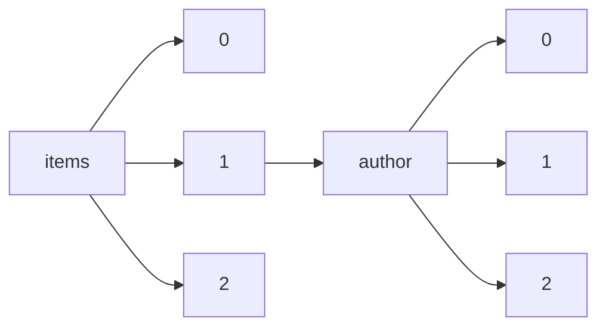

!!! warning "This document is not official Crossref documentation"
# Elements
PATH = items/array/author/array(1)  
Occurs 390 050 406 times  
{ .annotate }

1. A route to an element, for example:  
   The route "items/array/author/array" corresponds to navigating through the JSON indices as  
   ["items"][0]["author"][0]  

## ORCID
See more information: [items/array/author/array/ORCID](ORCID/index.md)  
Occurs 22 060 154 timess  
Unique values: > 999  

!!! note "Due to current limitations, only the first 1,000 unique values are counted."

| **Row** | **Value** `String`                | **Count** `Int64` |
|--------:|-------------------------------------:|---------------------:|
| **1**   | http://orcid.org/0000-0002-7436-3176 | 91 155               |
| **2**   | http://orcid.org/0000-0002-4465-7034 | 91 155               |
| **3**   | http://orcid.org/0000-0002-0893-8170 | 18 934               |
| **4**   | http://orcid.org/0000-0001-6386-9107 | 6 821                |
| **5**   | http://orcid.org/0000-0001-5628-8371 | 2 438                |
| **6**   | http://orcid.org/0000-0003-4150-0936 | 1 791                |
| **7**   | http://orcid.org/0000-0002-1825-0097 | 999                  |
| **8**   | http://orcid.org/0000-0001-5433-707X | 843                  |
| **9**   | http://orcid.org/0000-0001-6691-0144 | 841                  |
| **10**  | http://orcid.org/0000-0002-4786-6333 | 794                  |
| ... | ... | ... |

## Affiliation
See more information: [items/array/author/array/affiliation](affiliation/index.md)  
Occurs 390 050 406 timess  

| **Row** | **Length** `Any` | **Count** `Int64` |
|--------:|--------------------:|---------------------:|
| **1**   | 0                   | 313 704 845          |
| **2**   | 1                   | 68 309 638           |
| **3**   | 2                   | 5 328 781            |
| **4**   | 3                   | 1 053 303            |
| **5**   | 4                   | 814 579              |
| **6**   | 5                   | 837 639              |
| **7**   | 6                   | 1 040                |
| **8**   | 7                   | 266                  |
| **9**   | 8                   | 136                  |
| **10**  | 9                   | 92                   |
| ... | ... | ... |

## Authenticated-orcid
See more information: [items/array/author/array/authenticated-orcid](authenticated-orcid/index.md)  
Occurs 22 060 154 timess  
Unique values: 2  

| **Row** | **Value** `Bool` | **Count** `Int64` |
|--------:|--------------------:|---------------------:|
| **1**   | false               | 18 983 339           |
| **2**   | true                | 3 076 815            |

## Family
See more information: [items/array/author/array/family](family/index.md)  
Occurs 385 165 352 timess  
Unique values: > 999  

!!! note "Due to current limitations, only the first 1,000 unique values are counted."

| **Row** | **Value** `String` | **Count** `Int64` |
|--------:|----------------------:|---------------------:|
| **1**   | Wang                  | 3 925 935            |
| **2**   | Li                    | 3 251 655            |
| **3**   | Zhang                 | 3 245 008            |
| **4**   | Liu                   | 2 554 460            |
| **5**   | Chen                  | 2 389 443            |
| **6**   | Kim                   | 1 843 743            |
| **7**   | Lee                   | 1 798 549            |
| **8**   | Yang                  | 1 508 763            |
| **9**   | Wu                    | 1 164 582            |
| **10**  | Xu                    | 997 105              |
| ... | ... | ... |

## Given
See more information: [items/array/author/array/given](given/index.md)  
Occurs 381 180 243 timess  
Unique values: > 999  

!!! note "Due to current limitations, only the first 1,000 unique values are counted."

| **Row** | **Value** `String` | **Count** `Int64` |
|--------:|----------------------:|---------------------:|
| **1**   | M.                    | 5 054 740            |
| **2**   | A.                    | 4 614 801            |
| **3**   | S.                    | 3 547 370            |
| **4**   | J.                    | 3 376 174            |
| **5**   | R.                    | 2 518 038            |
| **6**   | P.                    | 2 205 546            |
| **7**   | G.                    | 2 160 514            |
| **8**   | C.                    | 2 136 801            |
| **9**   | H.                    | 1 997 016            |
| **10**  | D.                    | 1 991 374            |
| ... | ... | ... |

## Name
See more information: [items/array/author/array/name](name/index.md)  
Occurs 4 778 537 timess  
Unique values: > 999  

!!! note "Due to current limitations, only the first 1,000 unique values are counted."

| **Row** | **Value** `String`                                       | **Count** `Int64` |
|--------:|------------------------------------------------------------:|---------------------:|
| **1**   | OECD                                                        | 230 749              |
| **2**   | IUCN                                                        | 201 815              |
| **3**   | OCDE                                                        | 116 725              |
| **4**   | National Cancer Institute                                   | 96 198               |
| **5**   | CABI                                                        | 77 305               |
| **6**   | Henry G. Gilbert Nursery and Seed Trade Catalog Collection. | 42 510               |
| **7**   | European Space Agency                                       | 28 229               |
| **8**   | United Nations                                              | 27 574               |
| **9**   | Philosophy Documentation Center                             | 26 213               |
| **10**  | Kernel Networks Inc.                                        | 22 528               |
| ... | ... | ... |

## Sequence
See more information: [items/array/author/array/sequence](sequence/index.md)  
Occurs 390 050 406 timess  
Unique values: 2  

| **Row** | **Value** `String` | **Count** `Int64` |
|--------:|----------------------:|---------------------:|
| **1**   | additional            | 269 955 692          |
| **2**   | first                 | 120 094 714          |

## Suffix
See more information: [items/array/author/array/suffix](suffix/index.md)  
Occurs 1 047 757 timess  
Unique values: > 999  

!!! note "Due to current limitations, only the first 1,000 unique values are counted."

| **Row** | **Value** `String` | **Count** `Int64` |
|--------:|----------------------:|---------------------:|
| **1**   | Jr.                   | 382 151              |
| **2**   | Jr                    | 207 865              |
| **3**   | III                   | 102 376              |
| **4**   | join(' '              | 40 568               |
| **5**   | II                    | 31 730               |
| **6**   | JR.                   | 25 066               |
| **7**   | Dr.                   | 19 757               |
| **8**   | MD                    | 12 216               |
| **9**   | PhD                   | 11 464               |
| **10**  | M.                    | 9 394                |
| ... | ... | ... |

