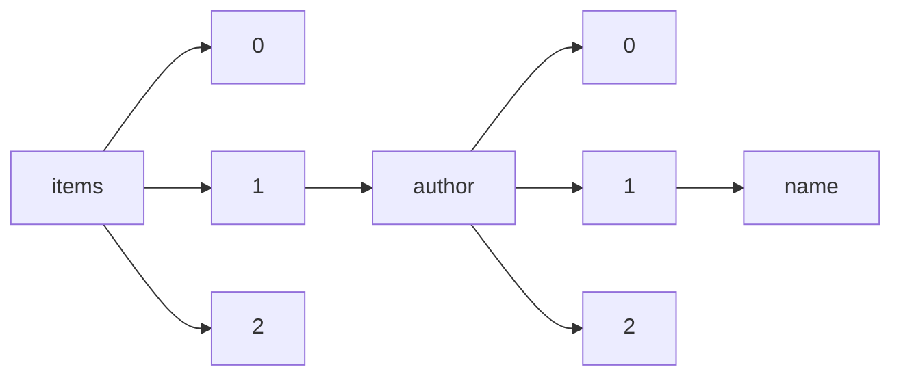

!!! warning "This document is not official Crossref documentation"
# Name
PATH = items/array/author/array/name(1)  
Occurs 4 778 537 times  
Unique values: > 999  
{ .annotate }

1. A route to an element, for example:  
   The route "items/array/author/array/name" corresponds to navigating through the JSON indices as  
   ["items"][0]["author"][0]["name"]  

!!! note "Due to current limitations, only the first 1,000 unique values are counted."

| **Row** | **Value** `String`                                                                                | **Count** `Int64` |
|--------:|-----------------------------------------------------------------------------------------------------:|---------------------:|
| **1**   | OECD                                                                                                 | 230 749              |
| **2**   | IUCN                                                                                                 | 201 815              |
| **3**   | OCDE                                                                                                 | 116 725              |
| **4**   | National Cancer Institute                                                                            | 96 198               |
| **5**   | CABI                                                                                                 | 77 305               |
| **6**   | Henry G. Gilbert Nursery and Seed Trade Catalog Collection.                                          | 42 510               |
| **7**   | European Space Agency                                                                                | 28 229               |
| **8**   | United Nations                                                                                       | 27 574               |
| **9**   | Philosophy Documentation Center                                                                      | 26 213               |
| **10**  | Kernel Networks Inc.                                                                                 | 22 528               |
| **11**  | Case Medical Research                                                                                | 16 343               |
| **12**  | none                                                                                                 | 15 446               |
| **13**  | Geological Survey of Canada                                                                          | 12 910               |
| **14**  | Nordic Council of Ministers                                                                          | 11 025               |
| **15**  | Bohn Stafleu van Loghum                                                                              | 10 274               |
| **16**  | Commonwealth Secretariat                                                                             | 8 211                |
| **17**  | Global Volcanism Program                                                                             | 7 938                |
| **18**  | United States.                                                                                       | 7 768                |
| **19**  | Saratov State University                                                                             | 7 668                |
| **20**  | United Nations Office of Legal Affairs                                                               | 7 337                |
| **21**  | Springer Medizin                                                                                     | 7 294                |
| **22**  | D02 Committee                                                                                        | 7 159                |
| **23**  | МГТУ им. Н.Э. Баумана                                                                                | 6 313                |
| **24**  | Makrolog                                                                                             | 6 156                |
| **25**  | World Bank                                                                                           | 6 156                |
| **26**  | World Trade Organization                                                                             | 6 068                |
| **27**  | United Nations Conference on Trade and Development                                                   | 5 928                |
| **28**  | Fordham University Press                                                                             | 5 883                |
| **29**  | Universidade Estadual de Campinas                                                                    | 5 835                |
| **30**  | Lviv Polytechnic National University                                                                 | 5 789                |
| **31**  | INSERM                                                                                               | 5 782                |
| **32**  | American Psychological Association; Public Information and Media Relations; Public Communications    | 5 696                |
| **33**  | St. Louis University                                                                                 | 5 686                |
| **34**  | A01 Committee                                                                                        | 5 432                |
| **35**  | Center for Catholic Studies, Seton Hall University                                                   | 5 340                |
| **36**  | Lomonosov Moscow State University                                                                    | 5 277                |
| **37**  | E.O. Paton Electric Welding Institute, NASU                                                          | 5 159                |
| **38**  | GISAID                                                                                               | 5 103                |
| **39**  | TJPRC                                                                                                | 4 593                |
| **40**  | St. Petersburg State University                                                                      | 4 388                |
| **41**  | AMS F Corrosion Heat Resistant Alloys Committee                                                      | 4 171                |
| **42**  | UNKNOWN                                                                                              | 4 118                |
| **43**  | The Hegeler Institute                                                                                | 3 882                |
| **44**  | Springer Fachmedien Wiesbaden                                                                        | 3 871                |
| **45**  | Penza State University                                                                               | 3 857                |
| **46**  | D01 Committee                                                                                        | 3 849                |
| **47**  | U.S. Geological Survey                                                                               | 3 814                |
| **48**  | American Catholic Philosophical Association, rights now managed by Philosophy Documenation Center    | 3 798                |
| **49**  | AMS D Nonferrous Alloys Committee                                                                    | 3 700                |
| **50**  | National Academies of Sciences, Engineering, and Medicine                                            | 3 644                |
| **51**  | G-3, Aerospace Couplings, Fittings, Hose, Tubing Assemblies                                          | 3 596                |
| **52**  | National University of Life and Environmental Sciences of Ukraine                                    | 3 530                |
| **53**  | Order of Augustinian Recollects                                                                      | 3 332                |
| **54**  | Siberian Federal University                                                                          | 3 322                |
| **55**  | Taras Shevchenko National University of Kyiv                                                         | 3 308                |
| **56**  | Binghamton University State University of New York                                                   | 3 170                |
| **57**  | Instituto Patristico Augustinianum                                                                   | 3 076                |
| **58**  | TPM: The Philosophers' Magazine                                                                      | 3 072                |
| **59**  | Transportation Research Board                                                                        | 3 029                |
| **60**  | D20 Committee                                                                                        | 3 010                |
| **61**  | National Bureau of Standards                                                                         | 3 009                |
| **62**  | Urban & Vogel                                                                                        | 2 945                |
| **63**  | The National Catholic Bioethics Center                                                               | 2 861                |
| **64**  | United Nations Department of Economic and Social Affairs                                             | 2 854                |
| **65**  | E-25 General Standards for Aerospace and Propulsion Systems                                          | 2 815                |
| **66**  | Institute for Scientific Co-operation                                                                | 2 769                |
| **67**  | Ivan Franko National University of Lviv                                                              | 2 765                |
| **68**  | Russian State University for the Humanities                                                          | 2 745                |
| **69**  | European Food Safety Authority (EFSA)                                                                | 2 742                |
| **70**  | Journal of Philosophy, Inc.                                                                          | 2 713                |
| **71**  | "                                                                                                    | 2 658                |
| **72**  | DePaul University                                                                                    | 2 633                |
| **73**  | AMS E Carbon and Low Alloy Steels Committee                                                          | 2 615                |
| **74**  | Omsk State Technical University                                                                      | 2 574                |
| **75**  | The PLOS ONE Staff                                                                                   | 2 458                |
| **76**  | National Toxicology Program (NTP)                                                                    | 2 372                |
| **77**  | Al-Farabi Kazakh National University                                                                 | 2 372                |
| **78**  | International Trade Centre                                                                           | 2 336                |
| **79**  | Editions Rodopi                                                                                      | 2 298                |
| **80**  | D13 Committee                                                                                        | 2 287                |
| **81**  | Institute of Philosophy, Russian Academy of Sciences                                                 | 2 276                |
| **82**  | RIKEN Structural Genomics/Proteomics Initiative (RSGI)                                               | 2 237                |
| **83**  | Marquette University Press                                                                           | 2 212                |
| **84**  | United Nations Development Programme                                                                 | 2 205                |
| **85**  | Volgograd State University                                                                           | 2 179                |
| **86**  | Philosophical Studies, with support from the National University of Ireland                          | 2 179                |
| **87**  | Tomsk State University (Tomsk, Russian Federation)                                                   | 2 162                |
| **88**  | Russian Presidential Academy of National Economy and Public Administration                           | 2 144                |
| **89**  | World Bank Group                                                                                     | 2 137                |
| **90**  | United Nations Economic Commission for Europe                                                        | 2 129                |
| **91**  | American Psychological Association                                                                   | 2 116                |
| **92**  | Polish Academy of Sciences                                                                           | 2 049                |
| **93**  | Perm State University                                                                                | 2 019                |
| **94**  | D18 Committee                                                                                        | 1 962                |
| **95**  | Southwestern Philosophical Society                                                                   | 1 950                |
| **96**  | I.M.Sechenov First Moscow State Medical University (Sechenov University), Moscow, Russian Federation | 1 909                |
| **97**  | United States Department of Commerce. Bureau of the Census                                           | 1 901                |
| **98**  | Redazione                                                                                            | 1 899                |
| **99**  | Food and Agriculture Organization of the United Nations                                              | 1 891                |
| **100** | AMS P Polymeric Materials Committee                                                                  | 1 836                |
| **101** | Irkutsk National Research Technical University                                                       | 1 817                |
| **102** | Center for Environmental Philosophy, The University of North Texas                                   | 1 791                |
| **103** | Bauman Moscow State Technical University                                                             | 1 779                |
| **104** | D19 Committee                                                                                        | 1 770                |
| **105** | Russian State Social University                                                                      | 1 735                |
| **106** | Federal state unitary enterprise «All-Russian scientific research institute of aviation materials»   | 1 721                |
| **107** | L.N. Gumilyov Eurasian National University                                                           | 1 702                |
| **108** | University of Sulaimani                                                                              | 1 691                |
| **109** | Federal State Unitary Enterprise «All-Russian Scientific Research Institute of Aviation Materials»   | 1 657                |
| **110** | National Research University Higher School of Economics                                              | 1 629                |
| **111** | F17 Committee                                                                                        | 1 544                |
| **112** | Comitato di Redazione                                                                                | 1 537                |
| **113** | Dagestan State University                                                                            | 1 525                |
| **114** | Universidad de Antioquia                                                                             | 1 517                |
| **115** | Mathesis Publications, Inc.                                                                          | 1 516                |
| **116** | The Society of Christian Philosophers                                                                | 1 511                |
| **117** | F04 Committee                                                                                        | 1 505                |
| **118** | The Center for Process Studies                                                                       | 1 496                |
| **119** | US Department of Health and Human Services; National Institute on Drug Abuse                         | 1 490                |
| **120** | US Department of Education                                                                           | 1 486                |
| **121** | Perm National Research Polytechnic University                                                        | 1 473                |
| **122** | Belgorod State National Research University                                                          | 1 457                |
| **123** | Uniwersytet w Białymstoku                                                                            | 1 452                |
| **124** | Institut für Sozialforschung                                                                         | 1 451                |
| **125** | Ural Federal University                                                                              | 1 450                |
| **126** | AMS B Finishes Processes and Fluids Committee                                                        | 1 445                |
| **127** | Joint Center for Structural Genomics (JCSG)                                                          | 1 434                |
| **128** | American Academy of Pediatrics                                                                       | 1 414                |
| **129** | Saint Petersburg State University of Architecture and Civil Engineering                              | 1 396                |
| **130** | Collaboration: Authors and editors of the volumes III/17H-17I-41E                                    | 1 395                |
| **131** | C09 Committee                                                                                        | 1 389                |
| **132** | International Association for Business and Society                                                   | 1 389                |
| **133** | E06 Committee                                                                                        | 1 385                |
| **134** | Southern Federal University                                                                          | 1 378                |
| **135** | International Monetary Fund                                                                          | 1 377                |
| **136** | D11 Committee                                                                                        | 1 377                |
| **137** | AE-8C1 Connectors Committee                                                                          | 1 359                |
| **138** | “Carol Davila” University of Medicine and Pharmacy, Bucharest, Romania                               | 1 355                |
| **139** | Federal State Budget Scientific Institution «North Caucasian Federal Scientific Center of Horticultu | 1 345                |
| **140** | Nosov Magnitogorsk State Technical University                                                        | 1 332                |
| **141** | Universitas Brawijaya                                                                                | 1 329                |
| **142** | Altai State University                                                                               | 1 327                |
| **143** | Irkutsk State University                                                                             | 1 324                |
| **144** | B02 Committee                                                                                        | 1 322                |
| **145** | Collaboration: Authors and editors of the volumes III/17E-17F-41C                                    | 1 320                |
| **146** | National Renewable Energy Laboratory (NREL), Golden, CO.                                             | 1 304                |
| **147** | Journal of Philosophy Inc.                                                                           | 1 302                |
| **148** | National University of Oil and Gas “Gubkin University”                                               | 1 300                |
| **149** | Novosibirsk State Technical University, Russian Federation                                           | 1 300                |
| **150** | AGU                                                                                                  | 1 289                |
| **151** | New Mountain Media, LLC                                                                              | 1 289                |
| **152** | CBS News                                                                                             | 1 273                |
| **153** | Tambov State Technical University, Tambov, Russia                                                    | 1 271                |
| **154** | Masters Program in Public Health, Universitas Sebelas Maret                                          | 1 266                |
| **155** | Kazan Federal University                                                                             | 1 250                |
| **156** | Vinnytsia National Technical University                                                              | 1 245                |
| **157** | A Correspondent                                                                                      | 1 241                |
| **158** | Hegel Society of America, in cooperation with the Philosophy Documentation Center                    | 1 237                |
| **159** | Department of Philosophy, Florida State University                                                   | 1 228                |
| **160** | D04 Committee                                                                                        | 1 219                |
| **161** | Odessa National Polytechnic University                                                               | 1 216                |
| **162** | Nations Unies                                                                                        | 1 202                |
| **163** | American Water Works Association                                                                     | 1 194                |
| **164** | Tambov State Technical University                                                                    | 1 193                |
| **165** | Kryvyi Rih National University                                                                       | 1 193                |
| **166** | Chiasmi International                                                                                | 1 192                |
| **167** | Shipboard Scientific Party                                                                           | 1 176                |
| **168** | Financial University under the Government of the Russian Federation                                  | 1 170                |
| **169** | E07 Committee                                                                                        | 1 167                |
| **170** | Instituto Forestal (Chile)                                                                           | 1 157                |
| **171** | All-Russian scientific research institute of aviation materials                                      | 1 147                |
| **172** | United Nations Office on Drugs and Crime                                                             | 1 146                |
| **173** | Samara National Research University                                                                  | 1 142                |
| **174** | American Psychological Association; Division 35 (Society for the Psychology of Women)                | 1 131                |
| **175** | Alfred Nobel University                                                                              | 1 120                |
| **176** | Tomsk State University, Tomsk                                                                        | 1 117                |
| **177** | Midwest Center for Structural Genomics                                                               | 1 102                |
| **178** | Pontificia Universidad Católica de Chile                                                             | 1 097                |
| **179** | Korean Association For Learner-Centered Curriculum And Instruction                                   | 1 083                |
| **180** | European Food Safety Authority                                                                       | 1 071                |
| **181** | South Ural State University                                                                          | 1 069                |
| **182** | Not Provided                                                                                         | 1 061                |
| **183** | United Nations Economic and Social Commission for Asia and the Pacific                               | 1 058                |
| **184** | American Psychological Association; Division 22 (Rehabilitation Psychology)                          | 1 052                |
| **185** | Astrakhan State University                                                                           | 1 051                |
| **186** | ABC News                                                                                             | 1 047                |
| **187** | New York SGX Research Center for Structural Genomics (NYSGXRC)                                       | 1 039                |
| **188** | American Psychological Association; Division 39 (Psychoanalysis)                                     | 1 038                |
| **189** | Istituto Patristico Augustinianum                                                                    | 1 035                |
| **190** | Edition Diskord (Germany)                                                                            | 1 031                |
| **191** | C16 Committee                                                                                        | 1 027                |
| **192** | American Psychological Association Public Information and Media Relations; Public Communications     | 1 021                |
| **193** | Evangelical Philosophical Society                                                                    | 1 021                |
| **194** | Federal State Budgetary Educational Institution of Higher Education “I.T. Trubilin Kuban State Agrar | 1 020                |
| **195** | American Psychological Association; Division 43 (Family Psychology)                                  | 1 020                |
| **196** | AMS G Titanium and Refractory Metals Committee                                                       | 1 016                |
| **197** | ijrbat                                                                                               | 1 016                |
| **198** | Bashkir State Agrarian University                                                                    | 1 013                |
| **199** | Structural Genomics Consortium                                                                       | 1 008                |
| **200** | Public Interest Enterprises, Inc.                                                                    | 1 007                |
| **201** | B05 Committee                                                                                        | 1 000                |
| **202** | Samarqand davlat universiteti                                                                        | 1 000                |
| **203** | Tambov State University named after G.R. Derzhavin                                                   | 997                  |
| **204** | Tomsk State University                                                                               | 996                  |
| **205** | D08 Committee                                                                                        | 989                  |
| **206** | Saint Petersburg State University                                                                    | 982                  |
| **207** | Don State Technical University, Rostov-on-Don, Russian Federation                                    | 979                  |
| **208** | Timirâzevskaâ selʹskohozâjstvennaâ akademiâ                                                          | 971                  |
| **209** | Admiral Makarov State University of Maritime and Inland Shipping                                     | 959                  |
| **210** | AMS CE Elastomers Committee                                                                          | 957                  |
| **211** | Universidad Santiago de Cali                                                                         | 949                  |
| **212** | United Nations Population Fund                                                                       | 946                  |
| **213** | Ryazan State Radio Engineering University                                                            | 945                  |
| **214** | Centre du commerce international                                                                     | 944                  |
| **215** | Voronezh State Agrarian University named after Emperor Peter the Great                               | 940                  |
| **216** | United States Department of Justice. Bureau of Justice Statistics                                    | 937                  |
| **217** | Central Ukrainian National Technical University                                                      | 935                  |
| **218** | Institute of Archaeology and Ethnography SB RAS                                                      | 926                  |
| **219** | Lviv National Agrarian University                                                                    | 924                  |
| **220** | Novosibirsk State University                                                                         | 913                  |
| **221** | North-West University                                                                                | 908                  |
| **222** | F25 Committee                                                                                        | 906                  |
| **223** | Universidad Nacional de Colombia                                                                     | 903                  |
| **224** | Chuiko Institute of Surface Chemistry of National Academy of Sciences of Ukraine                     | 902                  |
| **225** | Montclair State University                                                                           | 895                  |
| **226** | Zabolotny Institute of Microbiology and Virology, NAS of Ukraine                                     | 891                  |
| **227** | A. Tsyb Medical Radiological Research Centre – branch of the National Medical Research Radiological  | 882                  |
| **228** | Society of Catholic Social Scientists                                                                | 863                  |
| **229** | South Ural State University, Chelyabinsk, Russian Federation                                         | 847                  |
| **230** | Alberta.                                                                                             | 833                  |
| **231** | NRU MPEI                                                                                             | 832                  |
| **232** | Universidad de Guadalajara                                                                           | 832                  |
| **233** | Peoples’ Friendship University of Russia                                                             | 828                  |
| **234** | NA                                                                                                   | 828                  |
| **235** | Transbaikal State University                                                                         | 826                  |
| **236** | Mukachevo State University                                                                           | 825                  |
| **237** | Komsomolsk-on-Amur State Technical University (Komsomolsk-on-Amur)                                   | 822                  |
| **238** | Atlas of Canada                                                                                      | 820                  |
| **239** | Springer-Verlag                                                                                      | 819                  |
| **240** | Ukrainian Academy of Printing                                                                        | 818                  |
| **241** | Orenburg State University                                                                            | 811                  |
| **242** | International Sakharov Environmental Institute, Belarusian State University                          | 808                  |
| **243** | Ryazan State Medical University                                                                      | 808                  |
| **244** | D09 Committee                                                                                        | 808                  |
| **245** | Society for the Advancement of American Philosophy                                                   | 802                  |
| **246** | Economic Commission for Latin America and the Caribbean                                              | 800                  |
| **247** | F01 Committee                                                                                        | 800                  |
| **248** | Society for Range\n                        Management                                                | 794                  |
| **249** | Institute for Interdisciplinary Research                                                             | 788                  |
| **250** | Graduate Faculty Philosophy Department, New School for Social Research                               | 784                  |
| **251** | IJAR                                                                                                 | 782                  |
| **252** | University of Arkansas Press                                                                         | 781                  |
| **253** | D22 Committee                                                                                        | 776                  |
| **254** | ITMO University                                                                                      | 775                  |
| **255** | F08 Committee                                                                                        | 773                  |
| **256** | Instytut Nafty i Gazu – Państwowy Instytut Badawczy                                                  | 769                  |
| **257** | The New York Times                                                                                   | 768                  |
| **258** | C26 Committee                                                                                        | 764                  |
| **259** | Kuban State University                                                                               | 763                  |
| **260** | Politeknik Negeri Bali                                                                               | 761                  |
| **261** | State Fire Academy of EMERCOM of Russia                                                              | 758                  |
| **262** | E01 Committee                                                                                        | 757                  |
| **263** | Asian Development Bank                                                                               | 756                  |
| **264** | Collaboration: Authors and editors of the volumes III/17B-22A-41B                                    | 753                  |
| **265** | United Nations Children's Fund                                                                       | 751                  |
| **266** | Universitas Lampung                                                                                  | 746                  |
| **267** | ASSOCIAÇÃO BRASILEIRA DE EDUCAÇÃO A DISTÂNCIA                                                        | 745                  |
| **268** | Space Research Institute RAS                                                                         | 742                  |
| **269** | The Washington Post                                                                                  | 741                  |
| **270** | Gorbatov Research Center for Food Systems                                                            | 739                  |
| **271** | ProtoSociology Project                                                                               | 735                  |
| **272** | Universiti Tun Hussein Onn Malaysia                                                                  | 735                  |
| **273** | Far Eastern Federal University                                                                       | 734                  |
| **274** | Springer Fachmedien Wiesbaden GmbH                                                                   | 729                  |
| **275** | Samara State Technical University                                                                    | 725                  |
| **276** | University of Duhok                                                                                  | 714                  |
| **277** | Semiotic Society of American, in cooperation with the Philosophy Documentation Center                | 713                  |
| **278** | Springer-Verlag Berlin Heidelberg                                                                    | 713                  |
| **279** | Commissie voor het Adatrecht                                                                         | 713                  |
| **280** | John Wiley & Sons, Ltd.                                                                              | 704                  |
| **281** | Center for Structural Genomics of Infectious Diseases                                                | 704                  |
| **282** | D10 Committee                                                                                        | 704                  |
| **283** | Collaboration: Authors and editors of the volumes III/17G-41D                                        | 702                  |
| **284** | D35 Committee                                                                                        | 700                  |
| **285** | Kursk State Medical University                                                                       | 700                  |
| **286** | Montana.                                                                                             | 697                  |
| **287** | National Research Tomsk Polytechnic University                                                       | 697                  |
| **288** | National Aviation University                                                                         | 696                  |
| **289** | al-Farabi Kazakh national university                                                                 | 696                  |
| **290** | Don State Technical University                                                                       | 696                  |
| **291** | Seattle Structural Genomics Center for Infectious Disease                                            | 695                  |
| **292** | Uman National University of Horticulture                                                             | 695                  |
| **293** | US Department of Defense; Defense Technical Information Center                                       | 693                  |
| **294** | B08 Committee                                                                                        | 691                  |
| **295** | Professor V.F. Voino-Yasenetsky Krasnoyarsk State Medical University                                 | 691                  |
| **296** | D16 Committee                                                                                        | 684                  |
| **297** | Lonergan Institute at Boston College                                                                 | 682                  |
| **298** | Philosophical Inquiry                                                                                | 682                  |
| **299** | The Polanyi Society                                                                                  | 681                  |
| **300** | Carfax Publishing                                                                                    | 680                  |
| **301** | ATLAS Collaboration                                                                                  | 678                  |
| **302** | Odessa State Academy of Civil Engineering and Architecture                                           | 677                  |
| **303** | State Institution The Filatov Institute of Eye Diseases and Tissue Therapy of the NAMS of Ukraine    | 674                  |
| **304** | Midwest Center for Structural Genomics (MCSG)                                                        | 668                  |
| **305** | Society for Range Management                                                                         | 668                  |
| **306** | Belarusian State Medical University                                                                  | 667                  |
| **307** | State University of Telecommunications                                                               | 666                  |
| **308** | American Library Association                                                                         | 665                  |
| **309** | National Transport University, Kyiv, Ukraine                                                         | 664                  |
| **310** | Akademia Ignatianum                                                                                  | 663                  |
| **311** | E05 Committee                                                                                        | 662                  |
| **312** | Croatian Academy of America                                                                          | 658                  |
| **313** | Northeast Structural Genomics Consortium (NESG)                                                      | 650                  |
| **314** | Zaporizhzhia National University                                                                     | 650                  |
| **315** | D31 Committee                                                                                        | 636                  |
| **316** | Yaroslav Mudryi National Law University                                                              | 636                  |
| **317** | CMS Collaboration                                                                                    | 631                  |
| **318** | Heidegger Circle                                                                                     | 631                  |
| **319** | Universiti Kebangsaan Malaysia                                                                       | 628                  |
| **320** | EFSA Panel on Dietetic Products, Nutrition and Allergies (NDA)                                       | 628                  |
| **321** | Universidad Nacional Autónoma de México                                                              | 627                  |
| **322** | NIHR Dissemination Centre                                                                            | 624                  |
| **323** | Federal Reserve Bank of San Francisco                                                                | 623                  |
| **324** | Walhalla Fachredaktion                                                                               | 623                  |
| **325** | The Korean Society of Culture and Convergence                                                        | 622                  |
| **326** | United Nations Office for Disarmament Affairs                                                        | 621                  |
| **327** | Kharkiv State Academy of Physical Culture                                                            | 619                  |
| **328** | The Polanyi Society Periodical                                                                       | 616                  |
| **329** | European Union                                                                                       | 616                  |
| **330** | D14 Committee                                                                                        | 615                  |
| **331** | National Research Tomsk State University                                                             | 611                  |
| **332** | C13 Committee                                                                                        | 611                  |
| **333** | Collaboration: Authors and Editors of the LB Volumes III/17A-22A-41A1b                               | 610                  |
| **334** | US Department of Health and Human Services; Substance Abuse and Mental Health Services Administratio | 609                  |
| **335** | C15 Committee                                                                                        | 609                  |
| **336** | US Department of Health and Human Services                                                           | 609                  |
| **337** | Canada Surveys and Mapping Branch                                                                    | 609                  |
| **338** | National Cooperative Highway Research Program                                                        | 604                  |
| **339** | American Psychological Association; Division 38 (Health Psychology)                                  | 595                  |
| **340** | National Institute of Standards and Technology                                                       | 592                  |
| **341** | National Scientific and Practical Center for Pediatric Hematology, Oncology and Immunology named aft | 588                  |
| **342** | United Nations Environment Programme                                                                 | 582                  |
| **343** | F16 Committee                                                                                        | 582                  |
| **344** | Донецький національний університет імені Василя Стуса                                                | 581                  |
| **345** | LUKOIL–Engineering Limited KogalymNIPIneft Branch Office in Tyumen                                   | 578                  |
| **346** | Danylo Halytsky Lviv National Medical University                                                     | 575                  |
| **347** | V.S. Pustovoit All-Russian Research Institute of Oil Crops (VNIIMK)                                  | 574                  |
| **348** | Canada.                                                                                              | 573                  |
| **349** | Faculty of Medicine, Universitas Sebelas Maret                                                       | 570                  |
| **350** | Kremenchuk Mykhailo Ostrohradskyi National University                                                | 568                  |
| **351** | Tomsk State University, Tomsk, Russian Federation                                                    | 567                  |
| **352** | Structural Genomics Consortium (SGC)                                                                 | 566                  |
| **353** | D07 Committee                                                                                        | 562                  |
| **354** | Belgorod University of Cooperation, Economics and Law                                                | 561                  |
| **355** | NRC «Kurchatov Institute»                                                                            | 559                  |
| **356** | VDI                                                                                                  | 559                  |
| **357** | Joint Stock Company “Russian Space Systems”                                                          | 557                  |
| **358** | Novosibirsk State Medical University                                                                 | 556                  |
| **359** | Faculdade de Filosofia e Ciências - FFC - Campus de Marília                                          | 555                  |
| **360** | United States Department of Health and Human Services. National Center for Health Statistics         | 554                  |
| **361** | Eurosurveillance editorial team                                                                      | 554                  |
| **362** | University of Latvia                                                                                 | 552                  |
| **363** | Gubkin Russian State University of Oil and Gas (National Research University)                        | 549                  |
| **364** | Bogomolets National Medical University, Kyiv, Ukraine                                                | 547                  |
| **365** | European Commission                                                                                  | 545                  |
| **366** | F15 Committee                                                                                        | 544                  |
| **367** | International Energy Agency                                                                          | 541                  |
| **368** | Nicolae Testemitanu State University of Medicine and Pharmacy, Republic of Moldova                   | 540                  |
| **369** | G.V. Kurdyumov Institute for Metal Physics, NAS of Ukraine, 36 Academician Vernadsky Blvd., UA-03680 | 539                  |
| **370** | Organisation mondiale du commerce                                                                    | 539                  |
| **371** | United States Department of Education. National Center for Education Statistics                      | 538                  |
| **372** | Universidad de La Laguna (España)                                                                    | 537                  |
| **373** | C24 Committee                                                                                        | 536                  |
| **374** | D34 Committee                                                                                        | 534                  |
| **375** | D05 Committee                                                                                        | 533                  |
| **376** | Zhytomyr National Agroecological University                                                          | 533                  |
| **377** | Kazan State Medical University                                                                       | 532                  |
| **378** | Marine Hydrophysical Institute, Russian Academy of Sciences                                          | 528                  |
| **379** | Institute of Strength Physics and Materials Science SB RAS                                           | 522                  |
| **380** | Vladimir Industrial College                                                                          | 521                  |
| **381** | Nuclear Energy Agency                                                                                | 521                  |
| **382** | Wolfram Research, Inc.                                                                               | 518                  |
| **383** | Kazan Federal University, Kazan, 420008 Russia                                                       | 516                  |
| **384** | Ural State University of Railway Transport (USURT)                                                   | 515                  |
| **385** | Auricle Technologies Pvt. Ltd.                                                                       | 513                  |
| **386** | Ural state university of railway transport (USURT)                                                   | 513                  |
| **387** | Taras Shevchenko national University of Kyiv                                                         | 505                  |
| **388** | Ufa State Petroleum Technological University                                                         | 502                  |
| **389** | UN                                                                                                   | 501                  |
| **390** | State Institution Luhansk Taras Shevchenko National University                                       | 495                  |
| **391** | Universitas Hamzanwadi                                                                               | 495                  |
| **392** | Samara State Aerospace University                                                                    | 493                  |
| **393** | V. N. Karazin Kharkiv National University                                                            | 491                  |
| **394** | Kazan National Research Technological University                                                     | 490                  |
| **395** | Белорусский государственный технологический университет                                              | 488                  |
| **396** | B07 Committee                                                                                        | 488                  |
| **397** | Universidad del Azuay                                                                                | 486                  |
| **398** | Voronezh State University                                                                            | 486                  |
| **399** | North American Vexillological Association / Association nord-américaine de vexillologie              | 485                  |
| **400** | Collaborators:                                                                                       | 484                  |
| **401** | United Nations Economic Commission for Latin America and the Caribbean                               | 484                  |
| **402** | C11 Committee                                                                                        | 482                  |
| **403** | Northeast Structural Genomics Consortium                                                             | 481                  |
| **404** | Pirogov Russian National Research Medical University, Moscow, Russia                                 | 481                  |
| **405** | A05 Committee                                                                                        | 481                  |
| **406** | The Journal of Philosophy, Inc.                                                                      | 479                  |
| **407** | Yuriy Fedkovych Chernivtsi National University                                                       | 478                  |
| **408** | ESRI                                                                                                 | 477                  |
| **409** | Universitatea de Medicină şi Farmacie „Carol Davila“, Bucureşti                                      | 477                  |
| **410** | Sumy State University                                                                                | 475                  |
| **411** | St. Petersburg State University of Aerospace Instrumentation                                         | 474                  |
| **412** | Institute for Problems of Cryobiology and Cryomedicine of the National Academy of Sciences of Ukrain | 472                  |
| **413** | Canadian Society for Continental Philosophy                                                          | 469                  |
| **414** | RIKEN Structural Genomics/Proteomics Initiative                                                      | 468                  |
| **415** | Ural State Mining University                                                                         | 467                  |
| **416** | Romanian Academy - Iasi Branch                                                                       | 466                  |
| **417** | Scientific Group Thermodata Europe (SGTE)                                                            | 466                  |
| **418** | CAF Development Bank of Latin America                                                                | 465                  |
| **419** | Universidad Femenina del Sagrado Corazón                                                             | 464                  |
| **420** | Palgrave Macmillan Ltd                                                                               | 464                  |
| **421** | G. V. Kurdyumov Institute for Metal Physics, NAS of Ukraine, 36 Academician Vernadsky Blvd., UA-0314 | 459                  |
| **422** | FBSI “Federal Scientific Center for Medical and Preventive Health Risk Management Technologies”      | 458                  |
| **423** | B01 Committee                                                                                        | 457                  |
| **424** | Бурятский государственный университет имени Доржи Банзарова                                          | 456                  |
| **425** | Ternopil National Economic University                                                                | 455                  |
| **426** | Odessa National Economic University                                                                  | 453                  |
| **427** | Baku State University                                                                                | 449                  |
| **428** | Tomsk State Pedagogical University                                                                   | 449                  |
| **429** | Oles Honchar Dnipro National University                                                              | 448                  |
| **430** | US Department of Health & Human Services                                                             | 448                  |
| **431** | AE-8D Wire and Cable Committee                                                                       | 447                  |
| **432** | E35 Committee                                                                                        | 447                  |
| **433** | Sekolah Tinggi Teknologi Garut                                                                       | 442                  |
| **434** | Kazan State  Medical University                                                                      | 442                  |
| **435** | Filantropia Clinical Hospital, Bucharest, Romania                                                    | 441                  |
| **436** | National Museum of Natural History (U.S.)                                                            | 440                  |
| **437** | US Department of Education; Office of Innovation and Improvement                                     | 439                  |
| **438** | 中国科学院物理研究所                                                                                 | 439                  |
| **439** | Makrolog Content Management AG                                                                       | 437                  |
| **440** | Behaviour Change Intervention Ontology (BCIO)                                                        | 436                  |
| **441** | EFSA Panel on Additives and Products or Substances used in Animal Feed (FEEDAP)                      | 436                  |
| **442** | Vitebsk State Order of Peoples’ Friendship Medical University                                        | 434                  |
| **443** | Khmelnytskyi National University                                                                     | 434                  |
| **444** | LAPOP Lab                                                                                            | 433                  |
| **445** | Our Washington Correspondent                                                                         | 433                  |
| **446** | Grodno State Medical University, Grodno, Belarus                                                     | 431                  |
| **447** | Vladivostok State University of Economics and Service                                                | 430                  |
| **448** | Krylov State Research Centre, St. Petersburg, Russia                                                 | 425                  |
| **449** | US Department of Justice                                                                             | 424                  |
| **450** | Plekhanov Russian University of Economics                                                            | 421                  |
| **451** | FSBSI «All-Russian Veterinary Research Institute of Pathology, Pharmacology and Therapy», Voronezh,  | 420                  |
| **452** | INION RAN                                                                                            | 420                  |
| **453** | F05 Committee                                                                                        | 420                  |
| **454** | Togliatti State University                                                                           | 413                  |
| **455** | Tyumen State Medical University, Tyumen                                                              | 412                  |
| **456** | The Society for Philosophy in the Contemporary World                                                 | 412                  |
| **457** | Gnomon Center for the Humanities                                                                     | 411                  |
| **458** | Institute of Slavic Studies, Russian Academy of Sciences                                             | 410                  |
| **459** | al-Farabi KazNU                                                                                      | 409                  |
| **460** | Limnological Institute, Siberian Branch of the Russian Academy of Sciences, Ulan-Batorskaya Str., 3, | 407                  |
| **461** | Санкт-Петербургский государственный университет                                                      | 405                  |
| **462** | ITC                                                                                                  | 404                  |
| **463** | Stevens Exploration Management Corp.                                                                 | 404                  |
| **464** | National Child Traumatic Stress Network                                                              | 401                  |
| **465** | Institute of Zoology, Republic of Moldova                                                            | 400                  |
| **466** | V. I. Vernadsky National Library of Ukraine, Ukraine, Kyiv                                           | 400                  |
| **467** | American Psychological Association; Division 41 (American Psychology-Law Society)                    | 399                  |
| **468** | Interservice Radio Propagation Laboratory                                                            | 396                  |
| **469** | MAK Commission                                                                                       | 396                  |
| **470** | Samara State University of Economics                                                                 | 395                  |
| **471** | Georgian Technical University                                                                        | 393                  |
| **472** | ICIMOD                                                                                               | 393                  |
| **473** | Central Radio Propagation Laboratory                                                                 | 392                  |
| **474** | AE-8C2 Terminating Devices and Tooling Committee                                                     | 392                  |
| **475** | Society of Christian Ethics                                                                          | 391                  |
| **476** | Ivanovo State Power Engineering University                                                           | 391                  |
| **477** | D30 Committee                                                                                        | 390                  |
| **478** | Bureau of Economic Geology                                                                           | 390                  |
| **479** | G01 Committee                                                                                        | 388                  |
| **480** | Belgorod National Research University                                                                | 387                  |
| **481** | Royal College of Physicians of Edinburgh.                                                            | 387                  |
| **482** | Bashkir State University                                                                             | 386                  |
| **483** | Bunin Yelets State University                                                                        | 385                  |
| **484** | Russian Ilizarov Scientific Centre                                                                   | 385                  |
| **485** | The Editors                                                                                          | 385                  |
| **486** | C08 Committee                                                                                        | 383                  |
| **487** | Médico de Família                                                                                    | 381                  |
| **488** | N.I.Pirogov Russian National Research Medical University, Moscow, Russian Federation                 | 380                  |
| **489** | The Center for Peace and Justice Education, Villanova University                                     | 380                  |
| **490** | United States Department of Justice. Federal Bureau of Investigation                                 | 379                  |
| **491** | IVE Press                                                                                            | 377                  |
| **492** | American Psychological Association; Division 19 (Society for Military Psychology)                    | 376                  |
| **493** | Saratov State Agrarian University                                                                    | 375                  |
| **494** | Department of Inorganic Chemistry, Ivan Franko National University of Lviv                           | 375                  |
| **495** | Banque africaine de développement                                                                    | 375                  |
| **496** | Institute of Biomedical Problems of the Russian Academy of Sciences                                  | 374                  |
| **497** | Mykolayiv National Agrarian University                                                               | 374                  |
| **498** | F26 Committee                                                                                        | 372                  |
| **499** | National Transport University                                                                        | 370                  |
| **500** | Universitas Islam Negeri Alauddin Makassar                                                           | 370                  |
| **501** | Universidade Estadual de Londrina                                                                    | 369                  |
| **502** | National Research University of Electronic Technology, Moscow, Russia                                | 368                  |
| **503** | Corporación Universitaria Remington                                                                  | 367                  |
| **504** | Northern (Arctic) Federal University named after M.V. Lomonosov                                      | 367                  |
| **505** | Mari State University                                                                                | 365                  |
| **506** | Institute of Radio Astronomy, National Academy of Sciences of Ukraine                                | 363                  |
| **507** | Schlumberger                                                                                         | 362                  |
| **508** | Palgrave Macmillan                                                                                   | 361                  |
| **509** | Reshetnev Siberian State University of Science and Technology                                        | 361                  |
| **510** | St. Cyril and Methodius"                                                                             | 360                  |
| **511** | International Narcotics Control Board                                                                | 359                  |
| **512** | The S. Fyodorov Eye Microsurgery Federal State Institution, the Khabarovsk Branch, Khabarovsk, Russi | 359                  |
| **513** | Uniwersytet Rolniczy w Krakowie                                                                      | 359                  |
| **514** | UNICEF Innocenti Research Centre                                                                     | 359                  |
| **515** | Gazpromneft NTC LLC, RF, Saint-Petersburg                                                            | 358                  |
| **516** | International Association of Universities                                                            | 358                  |
| **517** | Institute of Technical Mechanics of the National Academy of Sciences of Ukraine and the State Space  | 358                  |
| **518** | Platov South-Russian State Polytechnic University (NPI)                                              | 356                  |
| **519** | Ukrainian State University of Chemical Technology                                                    | 355                  |
| **520** | E12 Committee                                                                                        | 355                  |
| **521** | C17 Committee                                                                                        | 354                  |
| **522** | E41 Committee                                                                                        | 353                  |
| **523** | Oak Ridge National Lab., TN (United States)                                                          | 353                  |
| **524** | School of Business and Economics Universitas Prasetiya Mulya, BSD City Kavling Edutown I.1, Jl. BSD  | 351                  |
| **525** | Institute of Biomedical Problems of the Russian of the Russian Academy of Sciences                   | 351                  |
| **526** | United States Department of Justice. Office of Justice Programs. Bureau of Justice Statistics        | 350                  |
| **527** | General Electric Co., Richland, WA (United States). Hanford Atomic Products Operation                | 349                  |
| **528** | National Diabetes Information Clearinghouse (NDIC)                                                   | 348                  |
| **529** | Remedium                                                                                             | 348                  |
| **530** | Editorial Board                                                                                      | 348                  |
| **531** | Bucharest University of Economic Studies, Romania                                                    | 348                  |
| **532** | National University of Food Technologies                                                             | 347                  |
| **533** | Betriebswirtschafts-Magazin                                                                          | 347                  |
| **534** | International Society of Political Psychology                                                        | 346                  |
| **535** | The Leibniz Society of North America                                                                 | 346                  |
| **536** | Universidad Autónoma Chapingo                                                                        | 345                  |
| **537** | Pipeline Transport Institute, LLC                                                                    | 344                  |
| **538** | Kemerovo State University                                                                            | 344                  |
| **539** | The S. Fyodorov Eye Microsurgery Federal State Institution, Moscow                                   | 343                  |
| **540** | E10 Committee                                                                                        | 342                  |
| **541** | University of Veliko Tarnovo                                                                         | 341                  |
| **542** | Henry A. Dreer (Firm)                                                                                | 340                  |
| **543** | Eastern Illinois University                                                                          | 340                  |
| **544** | Tomsk State University of Control Systems and Radioelectronics                                       | 340                  |
| **545** | ijar                                                                                                 | 337                  |
| **546** | National Sports Academy “Vassil Levski”, Sofia, Bulgaria                                             | 337                  |
| **547** | Universidad Peruana de Ciencias Aplicadas (UPC)                                                      | 337                  |
| **548** | National Medical Research Center for Children’s Health, Moscow, Russia                               | 334                  |
| **549** | -                                                                                                    | 333                  |
| **550** | Institute of Europe, Russian Academy of Sciences                                                     | 333                  |
| **551** | The National Institute for Newman Studies®                                                           | 332                  |
| **552** | C01 Committee                                                                                        | 332                  |
| **553** | Dunarea de Jos University of Galati, Romania                                                         | 332                  |
| **554** | Omsk State Technical University, Omsk, Russia                                                        | 332                  |
| **555** | Robert Bosch GmbH                                                                                    | 332                  |
| **556** | International Science Group                                                                          | 331                  |
| **557** | Lockwood, Kessler & Bartlett, Inc.                                                                   | 330                  |
| **558** | Texas Education Agency                                                                               | 329                  |
| **559** | Universiti Malaysia Terengganu                                                                       | 329                  |
| **560** | Buryat State University                                                                              | 329                  |
| **561** | Department of Obstetrics and Gynecology, “Carol Davila” University of Medicine and Pharmacy, Buchare | 329                  |
| **562** | Volodymyr Vynnychenko Central Ukrainian State Pedagogical University                                 | 325                  |
| **563** | Universidad de Ciencias Aplicadas y Ambientales                                                      | 324                  |
| **564** | Ufa State Petroleum Technological University, Ufa, Russia                                            | 323                  |
| **565** | The Society of Digital Information and Wireless Communication                                        | 323                  |
| **566** | Siberian State University of Geosystems and Technologies                                             | 323                  |
| **567** | Kharkiv Medical Academy of Postgraduate Education                                                    | 322                  |
| **568** | Society for Women in Philosophy UK                                                                   | 321                  |
| **569** | Montana Natural Heritage Program.                                                                    | 319                  |
| **570** | Pusan National University                                                                            | 319                  |
| **571** | Duncker & Humblot                                                                                    | 316                  |
| **572** | Economic Behavior Program. Survey Research Center. University of Michigan                            | 315                  |
| **573** | IUGS                                                                                                 | 315                  |
| **574** | Saint-Petersburg State University                                                                    | 314                  |
| **575** | European Conference of Ministers of Transport                                                        | 314                  |
| **576** | Tyumen Industrial University                                                                         | 313                  |
| **577** | AMS P17 Polymer Matrix Composites Committee                                                          | 313                  |
| **578** | Russian State Social University, Moscow                                                              | 313                  |
| **579** | Institute of Engineering Thermophysics of NAS of Ukraine                                             | 309                  |
| **580** | E47 Committee                                                                                        | 309                  |
| **581** | Altai State Medical University                                                                       | 308                  |
| **582** | Latvia University of Life Sciences and Technologies                                                  | 308                  |
| **583** | National Mining University                                                                           | 307                  |
| **584** | UK Subject Centre for Philosophical and Religious Studies                                            | 307                  |
| **585** | Maryland State Department of Education                                                               | 307                  |
| **586** | Indiana University - Purdue University Indianapolis                                                  | 306                  |
| **587** | National Technical University of Ukraine “Igor Sikorsky Kyiv Polytechnic Institute”                  | 305                  |
| **588** | Shirshov Institute of Oceanology, Russian Academy of Sciences                                        | 304                  |
| **589** | Canadian Permanent Committee on Geographical Names                                                   | 303                  |
| **590** | Volgograd State Medical University                                                                   | 301                  |
| **591** | Lviv University of Trade and Economics                                                               | 300                  |
| **592** | Kuban State Technological University                                                                 | 299                  |
| **593** | Southern Scientific Centre of the Russian Academy of Sciences                                        | 298                  |
| **594** | Federal Research Centre of Biological Systems and Agrotechnologies of the Russian Academy of Science | 298                  |
| **595** | United Nations Educational, Scientific and Cultural Organization                                     | 298                  |
| **596** | Image Processing Systems Institute, Russian Academy of Sciences                                      | 295                  |
| **597** | Herzen State Pedagogical University of Russia                                                        | 295                  |
| **598** | Khanty-Mansiysk State Medical Academy                                                                | 295                  |
| **599** | Airport Cooperative Research Program                                                                 | 294                  |
| **600** | Child Trends                                                                                         | 294                  |
| **601** | Jacobs Engineering Group, Inc., Albuquerque, NM (United States)                                      | 291                  |
| **602** | Udmurt State University                                                                              | 291                  |
| **603** | Libri Publishing                                                                                     | 290                  |
| **604** | State Institution «National Research Center for Radiation Medicine of the National Academy of Medica | 289                  |
| **605** | Organisation des Nations Unies pour l'alimentation et l'agriculture                                  | 288                  |
| **606** | B10 Committee                                                                                        | 288                  |
| **607** | University of Kragujevac, Faculty of Law                                                             | 288                  |
| **608** | E28 Committee                                                                                        | 287                  |
| **609** | Caribbean Philosophical Association                                                                  | 285                  |
| **610** | Kyiv National University of Trade and Economics                                                      | 285                  |
| **611** | Scientific Center of Children's Health, Moscow, Russian Federation                                   | 285                  |
| **612** | Technical University of Moldova                                                                      | 285                  |
| **613** | Materials Science International Team MSIT®                                                           | 285                  |
| **614** | D24 Committee                                                                                        | 284                  |
| **615** | Catholic University of America Press                                                                 | 284                  |
| **616** | SUNY Press                                                                                           | 283                  |
| **617** | Folger Shakespeare Library                                                                           | 282                  |
| **618** | Bogor Agricultural University                                                                        | 282                  |
| **619** | F02 Committee                                                                                        | 282                  |
| **620** | Institute of Macromolecular Chemistry NAS of Ukraine 48, Kharkivske shose, Kyiv, 02160, Ukraine      | 281                  |
| **621** | United States Department of Health and Human Services. Centers for Disease Control and Prevention. N | 279                  |
| **622** | D06 Committee                                                                                        | 279                  |
| **623** | Uniwersytet Warszawski                                                                               | 278                  |
| **624** | Ewha Womans University                                                                               | 277                  |
| **625** | Belgorod University of Cooperation, Economics & Law                                                  | 277                  |
| **626** | University of Halabja                                                                                | 277                  |
| **627** | Generalsekretariat des VDE                                                                           | 277                  |
| **628** | US Department of Health & Human Services; NIH; National Cancer Institute                             | 277                  |
| **629** | Our Molecular Biology Correspondent                                                                  | 276                  |
| **630** | Peter Lang                                                                                           | 276                  |
| **631** | Odesa State Academy of Technical Regulation and Quality                                              | 276                  |
| **632** | Korea National University of Education                                                               | 275                  |
| **633** | Academy of State Fire Service of EMERCOM of Russia                                                   | 274                  |
| **634** | SESE “The Academy of Financial Management”                                                           | 273                  |
| **635** | Center for Structural Genomics of Infectious Diseases (CSGID)                                        | 272                  |
| **636** | IPSI RAS – Branch of the FSRC “Crystallography and Photonics” RAS                                    | 272                  |
| **637** | Collaboration: Authors and editors of the volumes III/17A-22A-41A1a                                  | 270                  |
| **638** | Lebanese American University                                                                         | 269                  |
| **639** | Universidad del Valle                                                                                | 269                  |
| **640** | Universidade Federal de Goiás                                                                        | 268                  |
| **641** | Universidad de San Martín de Porres, Perú                                                            | 268                  |
| **642** | American Psychological Association; Public Information and Media Relations; Public Affairs Office    | 266                  |
| **643** | Institute of Agriculture of Carpathian Region of NAAS                                                | 264                  |
| **644** | Rocky Mountain Forest and Range Experiment Station (Fort Collins, Colo.)                             | 264                  |
| **645** | Russian Scientific Research Institute of Land Improvement Problems                                   | 264                  |
| **646** | Donetsk National Technical University                                                                | 262                  |
| **647** | Filatov Institute of Eye Diseases and Tissue Therapy                                                 | 262                  |
| **648** | KSPU named after V.P. Astafiev                                                                       | 262                  |
| **649** | Tambov State University named after G. R. Derzhavin                                                  | 262                  |
| **650** | Institute of Information Technology of Azerbaijan National Academy of Sciences                       | 262                  |
| **651** | Volgograd State Technical University                                                                 | 262                  |
| **652** | F20 Committee                                                                                        | 261                  |
| **653** | Population Council                                                                                   | 261                  |
| **654** | The Economist                                                                                        | 261                  |
| **655** | Minin Nizhny Novgorod State Pedagogical University                                                   | 260                  |
| **656** | Universidad Industrial de Santander                                                                  | 259                  |
| **657** | Marine Hydrophysical Institute, Russian Academy of Sciences, Sevastopol, Russia                      | 259                  |
| **658** | Professor V. F. Voino-Yasenetsky Krasnoyarsk State Medical University                                | 258                  |
| **659** | T.F. Gorbachev Kuzbass State Technical University                                                    | 257                  |
| **660** | Institute of Biomedical Problems of the Russian Academy of Sciences, Moscow                          | 257                  |
| **661** | B09 Committee                                                                                        | 257                  |
| **662** | D26 Committee                                                                                        | 257                  |
| **663** | Institute of Geotechnical Mechanics named by N. Poljakov of National Academy of Sciences of Ukraine  | 257                  |
| **664** | University of Pretoria                                                                               | 255                  |
| **665** | Yuri Gagarin State Technical University of Saratov                                                   | 255                  |
| **666** | University of Tehran                                                                                 | 255                  |
| **667** | Universidad Autónoma de Zacatecas                                                                    | 254                  |
| **668** | LITERACIA CIENTÍFICA EDITORA & CURSOS                                                                | 253                  |
| **669** | D12 Committee                                                                                        | 253                  |
| **670** | E21 Committee                                                                                        | 253                  |
| **671** | E17 Committee                                                                                        | 253                  |
| **672** | Coastal Engineering Research Center (U.S.)                                                           | 253                  |
| **673** | Dept. of Philosophy, Tulane University                                                               | 252                  |
| **674** | D27 Committee                                                                                        | 251                  |
| **675** | Novosibirsk State Technical University                                                               | 250                  |
| **676** | Taras Shevchenko National University of Kyiv, Kyiv                                                   | 250                  |
| **677** | Ural Federal University named after the first President of Russia B.N. Yeltsin                       | 250                  |
| **678** | E37 Committee                                                                                        | 250                  |
| **679** | Chernihiv National University of Technology                                                          | 249                  |
| **680** | American Psychological Association; Division 30 (Society of Psychological Hypnosis)                  | 249                  |
| **681** | Emperor Alexander I Petersburg State Transport University                                            | 249                  |
| **682** | Federal Scientific Center for Medical and Preventive Health Risk Management Technologies, 82 Monasty | 247                  |
| **683** | Society for the Philosophic Study of the Contemporary Visual Arts                                    | 245                  |
| **684** | Our Cell Biology Correspondent                                                                       | 243                  |
| **685** | Komsomolsk-on-Amur State University                                                                  | 243                  |
| **686** | E50 Committee                                                                                        | 241                  |
| **687** | American Diabetes Association                                                                        | 240                  |
| **688** | F23 Committee                                                                                        | 240                  |
| **689** | Universitatea de Medicină şi Farmacie „Carol Davila“, Bucureşti, România                             | 240                  |
| **690** | National Institute of Neurological Disorders and Stroke (NINDS)                                      | 239                  |
| **691** | Universiti Teknologi MARA                                                                            | 238                  |
| **692** | Ryazan State Radioengineering University                                                             | 238                  |
| **693** | Institute for the History of Material Culture Russian Academy of Sciences                            | 238                  |
| **694** | Федеральное государственное бюджетное учреждение науки Федеральный исследовательский центр химическо | 238                  |
| **695** | United States Department of Labor. Bureau of Labor Statistics                                        | 237                  |
| **696** | Faculdade de Ciências da Universidade do Porto                                                       | 237                  |
| **697** | Bratsk State University                                                                              | 237                  |
| **698** | Faculdade de Ciências da Universidade de Lisboa                                                      | 236                  |
| **699** | University of Chinese Academy of Sciences, Beijing 100049, China                                     | 235                  |
| **700** | Dosen Jurusan Teknik Sipil, Politeknik Negeri Malang                                                 | 235                  |
| **701** | Economic Research Institute FEB RAS                                                                  | 234                  |
| **702** | Patents Court                                                                                        | 234                  |
| **703** | .                                                                                                    | 232                  |
| **704** | Research Institute of Mechanics University of Nizhni Novgorod,Nizhni Novgorod, Russian Federation    | 232                  |
| **705** | Conférence Européenne des Ministres des Transports                                                   | 231                  |
| **706** | Salahaddin University                                                                                | 231                  |
| **707** | Council for Secular Humanism                                                                         | 230                  |
| **708** | E13 Committee                                                                                        | 230                  |
| **709** | C14 Committee                                                                                        | 230                  |
| **710** | Peter the Great St. Petersburg Polytechnic University                                                | 229                  |
| **711** | Institute of Archaeology and Ethnography, Siberian Branch, Russian Academy of Sciences               | 228                  |
| **712** | Baikov Institute of Metallurgy and Materials Science of RAS                                          | 228                  |
| **713** | Villanova University                                                                                 | 228                  |
| **714** | Westinghouse Savannah River Co., Aiken, SC (United States)                                           | 227                  |
| **715** | Peoples’ Friendship University of Russia (RUDN University)                                           | 226                  |
| **716** | N. A. Semashko National Research Institute of Public Health, 105064, Moscow, Russia                  | 225                  |
| **717** | EFSA Panel on Food Contact Materials, Enzymes, Flavourings and Processing Aids (CEF)                 | 224                  |
| **718** | Бурятский государственный университет                                                                | 224                  |
| **719** | C21 Committee                                                                                        | 224                  |
| **720** | DGGS Staff                                                                                           | 223                  |
| **721** | I.M. Sechenov First Moscow State Medical University                                                  | 223                  |
| **722** | Facultad de Artes y Humanidades, Universidad de los Andes                                            | 223                  |
| **723** | Institut Teknologi Sepuluh Nopember                                                                  | 222                  |
| **724** | Zeta Books                                                                                           | 222                  |
| **725** | International Boundary Commission                                                                    | 221                  |
| **726** | USDOE Energy Information Administration, Washington, DC (United States). Office of Oil and Gas       | 221                  |
| **727** | L.N. Gumilyov Eurasian National University, Astana, Kazakhstan                                       | 221                  |
| **728** | Indisch Genootschap                                                                                  | 220                  |
| **729** | Moscow State University of Civil Engineering                                                         | 220                  |
| **730** | E33 Committee                                                                                        | 220                  |
| **731** | Federal State Budgetary Institution of Science «Research Institute of Eye Diseases», Moscow          | 219                  |
| **732** | Federal Research Centre of Nutrition, Biotechnology and Food Safety, Moscow, Russian Federation      | 219                  |
| **733** | Cleveland State University                                                                           | 218                  |
| **734** | Argentina                                                                                            | 217                  |
| **735** | Academic Publishing                                                                                  | 217                  |
| **736** | New York Structural Genomics Research Consortium                                                     | 217                  |
| **737** | Seattle Structural Genomics Center for Infectious Disease (SSGCID)                                   | 217                  |
| **738** | Laboratório de Sinalização Celular e Nanobiotecnologia                                               | 215                  |
| **739** | National Council for Critical Analysis                                                               | 215                  |
| **740** | Morozov Children’s City Clinical Hospital, Moscow, Russia                                            | 215                  |
| **741** | Institute of Geography Russian Academy of Sciences                                                   | 215                  |
| **742** | US Department of Justice; Office of Justice Programs; Office of Juvenile Justice and Delinquency Pre | 214                  |
| **743** | Central Russian Institute of Management, Branch of RANEPA                                            | 214                  |
| **744** | Research Institute of Agriculture of Crimea                                                          | 214                  |
| **745** | AMS G9 Aerospace Sealing Committee                                                                   | 214                  |
| **746** | Éditions Ousia                                                                                       | 212                  |
| **747** | Federal State Unitary Enterprise «All-Russian Scientific-Research Institute of Aviation Materials» o | 212                  |
| **748** | Fugro Airborne Surveys Corp.                                                                         | 212                  |
| **749** | “Carol Davila“ University of Medicine and Pharmacy, Bucharest, Romania                               | 211                  |
| **750** | “Carol Davila” University of Medicine and Pharmacy, Bucharest                                        | 211                  |
| **751** | Institute of Strength Physics and Materials Science of SB RAS                                        | 211                  |
| **752** | BVerwG                                                                                               | 210                  |
| **753** | Institute of Genetics, Physiology and Plant Protection, Republic of Moldova                          | 210                  |
| **754** |                                                                                                      | 207                  |
| **755** | Universidad Simón Bolívar                                                                            | 207                  |
| **756** | Collaboration: Authors and Editors of the LB Volumes III/22B-41A2b                                   | 206                  |
| **757** | F07 Committee                                                                                        | 206                  |
| **758** | SI Institute of Pediatrics, Obstetrics and Gynecology of NAMS of Ukraine, Kyiv                       | 205                  |
| **759** | Taras Shevchenko National University of Kyiv, Kyiv, Ukraine                                          | 205                  |
| **760** | Simon Kuznets Kharkiv National University of Economics                                               | 205                  |
| **761** | Motu Economic and Public Policy Research                                                             | 201                  |
| **762** | Society for Phenomenology and Media                                                                  | 201                  |
| **763** | Ulyanovsk State Technical University                                                                 | 200                  |
| **764** | FSBSI «All-Russian Veterinary Research Institute of Pathology, Pharmacology and Therapy»             | 199                  |
| **765** | National Technical University of Ukraine «Igor Sikorsky Kyiv Polytechnic Institute»                  | 198                  |
| **766** | Vandenhoeck & Ruprecht                                                                               | 197                  |
| **767** | RN-BashNIPIneft LLC, RF, Ufa                                                                         | 197                  |
| **768** | Ufa Eye Research Institute, Ufa                                                                      | 197                  |
| **769** | C28 Committee                                                                                        | 196                  |
| **770** | Department of Energy, Mines and Resources Canada                                                     | 196                  |
| **771** | A04 Committee                                                                                        | 196                  |
| **772** | Faculdade de Filosofia e Ciências - Campus de Marília                                                | 196                  |
| **773** | National Human Genome Research Institute (NHGRI)                                                     | 195                  |
| **774** | University of Glasgow.                                                                               | 194                  |
| **775** | Romanian Society for Phenomenology                                                                   | 194                  |
| **776** | Ivano-Frankivsk National Technical University of Oil and Gas                                         | 193                  |
| **777** | WGM, Inc.                                                                                            | 191                  |
| **778** | Psychologists for Social Responsibility                                                              | 191                  |
| **779** | Intermountain Forest and Range Experiment Station (Ogden, Utah)                                      | 190                  |
| **780** | Dighem                                                                                               | 190                  |
| **781** | Tomsk State University of Control Systems and Radioeleсtronics                                       | 189                  |
| **782** | APA Division 35 (Society for the Psychology of Women)                                                | 189                  |
| **783** | Naturwissenschaft und Medizin des Bibliographisthen Instituts                                        | 188                  |
| **784** | Institute of Electrodynamics of the National Academy of Sciences of Ukraine, Peremohy, 56, Kyiv-57,  | 188                  |
| **785** | Peter Henderson & Co.                                                                                | 188                  |
| **786** | Universidad Pedagógica y Tecnológica de Colombia                                                     | 187                  |
| **787** | Villanova University, in cooperation with the Philosophy Documentation Center                        | 187                  |
| **788** | A06 Committee                                                                                        | 185                  |
| **789** | Institute of oriental studies, Russian academy of sciences (MOSCOW)                                  | 184                  |
| **790** | Danylo Halytskyi Lviv National Medical University                                                    | 184                  |
| **791** | Ufa Institute of Biology of the Ufa Federal Research Centre of the Russian Academy of Sciences       | 184                  |
| **792** | Academy of the State Penitentiary Service, Chernihiv, Ukraine                                        | 184                  |
| **793** | E15 Committee                                                                                        | 184                  |
| **794** | Sevastopol State University                                                                          | 183                  |
| **795** | D15 Committee                                                                                        | 183                  |
| **796** | United Nations Economic Commission for Africa                                                        | 183                  |
| **797** | Institute of Electrodynamics National Academy of Sciences of Ukraine, pr. Peremohy, 56, Kyiv, 03057, | 182                  |
| **798** | Vaughan's Seed Company.                                                                              | 182                  |
| **799** | Tashkent State University of Law                                                                     | 182                  |
| **800** | Alaska Division of Geological & Geophysical Surveys                                                  | 181                  |
| **801** | Moscow State University of Civil Engineering (MGSU)                                                  | 181                  |
| **802** | STATE INSTITUTION "O.M. MARZIEIEV INSTITUTE FOR PUBLIC HEALTH" NAMSU                                 | 180                  |
| **803** | F30 Committee                                                                                        | 180                  |
| **804** | Vinnytsia Mykhailo Kotsiubynskyi State Pedagogical University                                        | 180                  |
| **805** | University of South Bohemia                                                                          | 180                  |
| **806** | Institute of Microbiology and Biotechnology, Republic of Moldova                                     | 179                  |
| **807** | Moscow State University of Geodesy and Cartography, Moscow, Russia                                   | 179                  |
| **808** | Transit Cooperative Research Program                                                                 | 179                  |
| **809** | F18 Committee                                                                                        | 178                  |
| **810** | Unknown                                                                                              | 178                  |
| **811** | Redaktsiia                                                                                           | 177                  |
| **812** | Technical Activities Division                                                                        | 176                  |
| **813** | United Nations Scientific Committee on the Effects of Atomic Radiation                               | 176                  |
| **814** | Canada Department of the Interior                                                                    | 176                  |
| **815** | Stellenbosch University                                                                              | 174                  |
| **816** | Kharkiv National University of Civil Engineering and Architecture                                    | 174                  |
| **817** | Ufa State Aviation Technical University                                                              | 173                  |
| **818** | Les Éditions Chromatika                                                                              | 173                  |
| **819** | E20 Committee                                                                                        | 172                  |
| **820** | USDOE, Washington, DC (United States)                                                                | 172                  |
| **821** | ENCODE Consortium                                                                                    | 171                  |
| **822** | Novosibirsk State Pedagogical University                                                             | 171                  |
| **823** | Binghamton University                                                                                | 170                  |
| **824** | Universidad Católica Luis Amigó                                                                      | 169                  |
| **825** | Tomsk State University of Control Systems and Radioelectronics (TUSUR)                               | 169                  |
| **826** | USDA Forest Service                                                                                  | 168                  |
| **827** | University of San Jose-Recoletos                                                                     | 168                  |
| **828** | Baikal State University                                                                              | 167                  |
| **829** | E30 Committee                                                                                        | 167                  |
| **830** | Seoul National University                                                                            | 167                  |
| **831** | Shenandoah Nurseries.                                                                                | 167                  |
| **832** | Institute of Europe of Russian Academy Sciences                                                      | 166                  |
| **833** | F06 Committee                                                                                        | 165                  |
| **834** | Schriftleitung des Wirtschafts-Magazins                                                              | 163                  |
| **835** | Samara National Research University, Samara, Russia                                                  | 163                  |
| **836** | Collaboration: Authors and Editors of the volumes III/22b-41A2a                                      | 163                  |
| **837** | The Nietzsche Society                                                                                | 162                  |
| **838** | Universidad Autónoma Metropolitana. Unidad Azcapotzalco                                              | 161                  |
| **839** | Геологический институт КНЦ РАН                                                                       | 161                  |
| **840** | Ulyanovsk State Agrarian University                                                                  | 160                  |
| **841** | Kangwon National University                                                                          | 160                  |
| **842** | Primakov National Research Institute of World Economy and International Relations, Russian Academy o | 160                  |
| **843** | International Transport Forum                                                                        | 159                  |
| **844** | NRC “Kurchatov Institute”                                                                            | 159                  |
| **845** | Brawijaya University                                                                                 | 159                  |
| **846** | Vyatka State University                                                                              | 159                  |
| **847** | Azerbaijan State University of Oil and Industry                                                      | 157                  |
| **848** | University of Zilina                                                                                 | 157                  |
| **849** | Russian State Agrarian University - Moscow Timiryazev Agricultural Academy                           | 157                  |
| **850** | Lviv State University of Internal Affairs                                                            | 155                  |
| **851** | Spitzenorganisation der Filmwirtschaft e.V.                                                          | 155                  |
| **852** | Ural State Medical University                                                                        | 155                  |
| **853** | The PLOS ONE Editors                                                                                 | 155                  |
| **854** | I.M.Sechenov First Moscow State Medical University, Moscow, Russian Federation                       | 154                  |
| **855** | Termez State University                                                                              | 153                  |
| **856** | Kalmyk Institute for Humanities of the RAS (Elista, Russian Federation)                              | 153                  |
| **857** | The National academy of the National Guard of Ukraine                                                | 153                  |
| **858** | M.G. Kholodny Institute of Botany, National Academy of Sciences of Ukraine                           | 153                  |
| **859** | Samara State Medical University                                                                      | 153                  |
| **860** | Society for Ethics Across the Curriculum                                                             | 152                  |
| **861** | Duquesne University Press                                                                            | 152                  |
| **862** | Bella C. Landauer Collection of Aeronautical Sheet Music (Smithsonian Institution. Libraries)        | 151                  |
| **863** | West Ukrainian National University                                                                   | 149                  |
| **864** | Harbin University of Science and Technology                                                          | 148                  |
| **865** | Moscow State University of Civil Engineering (National Research University) (MGSU)                   | 147                  |
| **866** | Radical Philosophy Association                                                                       | 147                  |
| **867** | Pacific Northwest Forest and Range Experiment Station (Portland, Or.)                                | 146                  |
| **868** | Institute of Fisheries NAAS, Kyiv                                                                    | 144                  |
| **869** | Assistant Professor                                                                                  | 143                  |
| **870** | Kazan (Volga Region) Federal University                                                              | 143                  |
| **871** | New York State Office of Mental Health                                                               | 143                  |
| **872** | Institute of High Current Electronics SB RAS                                                         | 142                  |
| **873** | AMS J Aircraft Maintenance Chemicals and Materials Committee                                         | 141                  |
| **874** | James Vick's Sons (Rochester, N.Y.)                                                                  | 140                  |
| **875** | Dnipro University of Technology                                                                      | 140                  |
| **876** | United Nations Women                                                                                 | 138                  |
| **877** | Ogarev Mordovia State University                                                                     | 137                  |
| **878** | American Psychological Association; Division 2 (Society for the Teaching of Psychology)              | 136                  |
| **879** | People’s Friendship University of Russia, Moscow, Russia                                             | 136                  |
| **880** | SAE IC Powertrain Steering Committee                                                                 | 135                  |
| **881** | Institute of Mechanics, Nizhny Novgorod State University. N.I. Lobachevsky, Russian Federation.      | 133                  |
| **882** | International Association of Universities / Association Internationale Des Universités               | 132                  |
| **883** | Oles Honchar Dnipro National University, Dnipro, Ukraine                                             | 131                  |
| **884** | Dongguk University                                                                                   | 131                  |
| **885** | A.M. Gorky Institute of World Literature of the Russian Academy of Sciences                          | 130                  |
| **886** | U.S. Fish and Wildlife Service                                                                       | 129                  |
| **887** | Institute of Russian Literature (Pushkin House)                                                      | 127                  |
| **888** | Universidad Católica de Chile                                                                        | 127                  |
| **889** | E04 Committee                                                                                        | 127                  |
| **890** | Institute of Sociology of FCTAS RAS, Moscow, Russian Federation                                      | 126                  |
| **891** | John Lewis Childs (Firm)                                                                             | 126                  |
| **892** | National Pirogov Memorial Medical University, Vinnytsia, Ukraine                                     | 125                  |
| **893** | American Society of Civil Engineers                                                                  | 125                  |
| **894** | N.I. Vavilov All-Russian Institute of Plant Genetic Resources                                        | 125                  |
| **895** | Intermountain Research Station (Ogden, Utah)                                                         | 125                  |
| **896** | et al.                                                                                               | 124                  |
| **897** | Burndy Library                                                                                       | 124                  |
| **898** | Universidade Federal de Santa Maria                                                                  | 124                  |
| **899** | Chungbuk National University                                                                         | 122                  |
| **900** | Committee D-19                                                                                       | 122                  |
| **901** | Educational Institution “Grodno State Medical University”                                            | 122                  |
| **902** | National Academy of the National Guard of Ukraine                                                    | 122                  |
| **903** | Chungnam National University                                                                         | 121                  |
| **904** | Fruitland Nurseries (Augusta, Ga.)                                                                   | 121                  |
| **905** | Botanic Gardens (Singapore)                                                                          | 121                  |
| **906** | ”Carol Davila” University of Medicine and Pharmacy, Bucharest, Romania                               | 121                  |
| **907** | Carol Davila Central Emergency Military Hospital, Bucharest                                          | 120                  |
| **908** | Institutul de Ecologie si Geografie, Republica Moldova                                               | 120                  |
| **909** | National Research and Development Institute for Industrial Ecology                                   | 120                  |
| **910** | AE-7A Generators and Controls Motors and Magnetic Devices                                            | 120                  |
| **911** | Collaboration: Scientific Group Thermodata Europe (SGTE)                                             | 120                  |
| **912** | National  Academy of Internal Affairs                                                                | 120                  |
| **913** | Irkutsk State Transport University                                                                   | 119                  |
| **914** | Filosofia                                                                                            | 119                  |
| **915** | F14 Committee                                                                                        | 118                  |
| **916** | Vasyl Stefanyk Precarpathian National University                                                     | 118                  |
| **917** | Corporación Universitaria Remington, Medellín, Colombia                                              | 117                  |
| **918** | Palladin Institute of Biochemistry, National Academy of Sciences of Ukraine, Kyiv                    | 117                  |
| **919** | The Bradley Society                                                                                  | 116                  |
| **920** | Canada Department of Mines And Resources                                                             | 115                  |
| **921** | APA Division 51 (Society for the Psychological Study of Men and Masculinity)                         | 115                  |
| **922** | All-Russian Research Institute for Agricultural Microbiology, Federal Agency of Scientific Organizat | 114                  |
| **923** | Rosinformagrotekh                                                                                    | 114                  |
| **924** | Kalmyk Scientific Center of the RAS                                                                  | 114                  |
| **925** | Таврійський державний агротехнологічний університет імені Дмитра Моторного                           | 114                  |
| **926** | Topographical Survey of Canada                                                                       | 113                  |
| **927** | Ontario.                                                                                             | 113                  |
| **928** | Sociometrics Corporation                                                                             | 112                  |
| **929** | Harrison's Nurseries (Berlin, Md.)                                                                   | 112                  |
| **930** | American Psychological Association; Public Interest Directorate; Ethnic Minority Affairs             | 112                  |
| **931** | University of Illinois at Urbana-Champaign                                                           | 112                  |
| **932** | FSBEI HE Ulyanovsk SAU                                                                               | 111                  |
| **933** | N.I.Pirogov Russian National Research Medical University of the Ministry of Health of the Russian Fe | 110                  |
| **934** | Market Economy Institute of RAS                                                                      | 110                  |
| **935** | Unknown Publisher                                                                                    | 109                  |
| **936** | BMSTU (Mytishchi branch)                                                                             | 109                  |
| **937** | State Institution «National Research Center for Radiation Medicine of the National Academy of Medica | 109                  |
| **938** | federal state budget educational institution of higher education «Saint Petersburg State University  | 109                  |
| **939** | I.T. Trubilin Kuban State Agrarian University                                                        | 107                  |
| **940** | Crisis and Emergency Management: Theory and Praxis                                                   | 104                  |
| **941** | University of Customs and Finance                                                                    | 104                  |
| **942** | ФГБУН Институт структурной макрокинетики и проблем материаловедения им. А. Г. Мержанова Российской а | 103                  |
| **943** | Institute of Plant Physiology and Genetics, National Academy of Sciences of Ukraine 31/17 Vasylkivsk | 103                  |
| **944** | Soongsil University                                                                                  | 102                  |
| **945** | Komsomolsk-on-Amur state technical university                                                        | 102                  |
| **946** | Canadian Jacques Maritain Association                                                                | 101                  |
| **947** | Research Institute of Nutrition, Russian Academy of Medical Sciences, Moscow                         | 101                  |
| **948** | Universidad Pedagógica Nacional                                                                      | 101                  |
| **949** | UNINGÁ - Centro Universitário Ingá                                                                   | 100                  |
| **950** | Listening, Incorporated                                                                              | 99                   |
| **951** | Novosibirsk State Medical University, Novosibirsk, Russia                                            | 98                   |
| **952** | Universidad Pontificia Bolivariana                                                                   | 98                   |
| **953** | University of Agriculture in Krakow                                                                  | 97                   |
| **954** | Federal Agricultural Research Center of the North-East named N.V.Rudnitsky                           | 97                   |
| **955** | Ukhta State Technical University                                                                     | 96                   |
| **956** | F11 Committee                                                                                        | 96                   |
| **957** | Institute of Humanitarian Researches –   branch of the FSBSE «Federal Scientific Center   «Kabardin- | 96                   |
| **958** | G03 Committee                                                                                        | 95                   |
| **959** | Institute of Service and Entrepreneurship (branch) DSTU                                              | 95                   |
| **960** | Carol Davila University of Medicine and Pharmacy, Bucharest                                          | 94                   |
| **961** | Novosibirsk Research Institute of Traumatology and Orthopaedics n.a. Ya.L. Tsivyan Novosibirsk, Russ | 93                   |
| **962** | The Shipboard Scientific Party                                                                       | 91                   |
| **963** | International Organization for Migration                                                             | 90                   |
| **964** | E31 Committee                                                                                        | 90                   |
| **965** | APA Division 41 (American Psychology-Law Society)                                                    | 89                   |
| **966** | Bohdan Khmelnytsky Melitopol State Pedagogical University (Melitopol)                                | 87                   |
| **967** | Aerojet-General Corp., Sacramento, Calif. (USA)                                                      | 87                   |
| **968** | Federal Energy Technology Center, Morgantown, WV (US); Federal Energy Technology Center, Pittsburgh, | 86                   |
| **969** | Kharkiv National Automobile and Highway University                                                   | 86                   |
| **970** | State University of Infrastructure and Technology, Kyiv                                              | 86                   |
| **971** | Compressed Gas Association                                                                           | 86                   |
| **972** | The Odum Institute                                                                                   | 86                   |
| **973** | Fugro Airborne Surveys                                                                               | 84                   |
| **974** | St. Petersburg State Institute of Technology (Technical University)                                  | 84                   |
| **975** | AUTOR(A)                                                                                             | 81                   |
| **976** | The Editorial Board                                                                                  | 79                   |
| **977** | Федеральный исследовательский центр химической физики им. Н. Н. Семёнова Российской академии наук    | 79                   |
| **978** | Club du Sahel et de l'Afrique de l'Ouest                                                             | 76                   |
| **979** | Semiotic Society of America                                                                          | 75                   |
| **980** | Institute of Chemistry and Chemical Technology SB RAS                                                | 74                   |
| **981** | The Institute for the Study of Science of the Russian Academy of Sciences                            | 74                   |
| **982** | Massachusetts.                                                                                       | 74                   |
| **983** | Novosibirsk Research Institute of Traumatology and Orthopaedics n.a. Ya.L. Tsivyan, Russia           | 74                   |
| **984** | France.                                                                                              | 74                   |
| **985** | Warsaw University                                                                                    | 71                   |
| **986** | Курский государственный медицинский университет                                                      | 71                   |
| **987** | Main Astronomical Observatory of the National Academy of Sciences of Ukraine, Kyiv                   | 71                   |
| **988** | Institute of Europe Russian Academy of Sciences                                                      | 67                   |
| **989** | Canada Department of Mines and Technical Surveys                                                     | 66                   |
| **990** | BG Chemie                                                                                            | 65                   |
| **991** | Universidad ESAN, Perú                                                                               | 64                   |
| **992** | Moscow Aviation Institute (National Research University)                                             | 64                   |
| **993** | All-Russia Petroleum Research Exploration Institute (VNIGRI)                                         | 64                   |
| **994** | Ball State University                                                                                | 63                   |
| **995** | The Harvard Review of Philosophy                                                                     | 63                   |
| **996** | Public Health Scotland                                                                               | 61                   |
| **997** | The Kosygin State University of Russia                                                               | 60                   |
| **998** | Federal Research Center of Pediatric Hematology, Oncology, and Immunology named after Dmitry Rogache | 59                   |
| **999** | Institute of Natural and Technical Systems                                                           | 59                   |
| ... | ... | ... |

