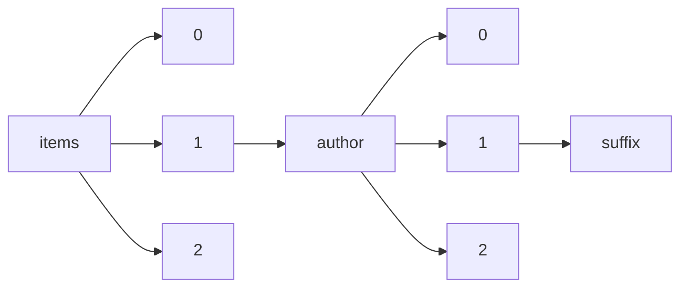

!!! warning "This document is not official Crossref documentation"
# Suffix
PATH = items/array/author/array/suffix(1)  
Occurs 1 047 757 times  
Unique values: > 999  
{ .annotate }

1. A route to an element, for example:  
   The route "items/array/author/array/suffix" corresponds to navigating through the JSON indices as  
   ["items"][0]["author"][0]["suffix"]  

!!! note "Due to current limitations, only the first 1,000 unique values are counted."

| **Row** | **Value** `String` | **Count** `Int64` |
|--------:|----------------------:|---------------------:|
| **1**   | Jr.                   | 382 151              |
| **2**   | Jr                    | 207 865              |
| **3**   | III                   | 102 376              |
| **4**   | join(' '              | 40 568               |
| **5**   | II                    | 31 730               |
| **6**   | JR.                   | 25 066               |
| **7**   | Dr.                   | 19 757               |
| **8**   | MD                    | 12 216               |
| **9**   | PhD                   | 11 464               |
| **10**  | M.                    | 9 394                |
| **11**  | IV                    | 9 061                |
| **12**  | M.D.                  | 8 413                |
| **13**  | Ph.D.                 | 8 368                |
| **14**  | Dr                    | 7 970                |
| **15**  | JR                    | 7 341                |
| **16**  | Sr.                   | 7 101                |
| **17**  | S.                    | 5 042                |
| **18**  | D.                    | 4 717                |
| **19**  | 3rd                   | 3 888                |
| **20**  | Editor                | 3 786                |
| **21**  | B.                    | 3 437                |
| **22**  | V.                    | 3 210                |
| **23**  | R.                    | 3 203                |
| **24**  | PHD                   | 2 864                |
| **25**  | Sr                    | 2 771                |
| **26**  | A.                    | 2 443                |
| **27**  | Junior                | 2 322                |
| **28**  | P.                    | 1 968                |
| **29**  | Z.                    | 1 917                |
| **30**  | N.                    | 1 916                |
| **31**  | J.                    | 1 819                |
| **32**  | Esq.                  | 1 658                |
| **33**  | Júnior                | 1 420                |
| **34**  | MD, PhD               | 1 394                |
| **35**  | S.J.                  | 1 291                |
| **36**  | I.                    | 1 282                |
| **37**  | 2nd                   | 1 165                |
| **38**  | Jun.                  | 1 149                |
| **39**  | M.D., Ph.D            | 1 147                |
| **40**  | T.                    | 1 087                |
| **41**  | G.                    | 1 069                |
| **42**  | Mr.                   | 1 017                |
| **43**  | R.D.                  | 1 012                |
| **44**  | Professor             | 978                  |
| **45**  | Prof.                 | 872                  |
| **46**  | jr.                   | 845                  |
| **47**  | L.                    | 820                  |
| **48**  | Mr                    | 814                  |
| **49**  | Lj.                   | 805                  |
| **50**  | Guest Edit            | 784                  |
| **51**  | K.                    | 783                  |
| **52**  | Filho                 | 764                  |
| **53**  | Ms.                   | 755                  |
| **54**  | PhD, RD               | 744                  |
| **55**  | JUN.                  | 736                  |
| **56**  | V                     | 733                  |
| **57**  | M.A.                  | 707                  |
| **58**  | Ph.D                  | 654                  |
| **59**  | \*                    | 654                  |
| **60**  | Neto                  | 611                  |
| **61**  | Column Edi            | 568                  |
| **62**  | SJ                    | 568                  |
| **63**  | Associate             | 568                  |
| **64**  | Jr.,                  | 560                  |
| **65**  | SR.                   | 545                  |
| **66**  | C.                    | 543                  |
| **67**  | Dj.                   | 535                  |
| **68**  | M.S.                  | 516                  |
| **69**  | Editor-in-            | 513                  |
| **70**  | Ph. D.                | 508                  |
| **71**  | E.                    | 501                  |
| **72**  | MS                    | 499                  |
| **73**  | jun.                  | 498                  |
| **74**  | jr                    | 485                  |
| **75**  | Jnr                   | 483                  |
| **76**  | Chairman              | 479                  |
| **77**  | ptre                  | 476                  |
| **78**  | Correspond            | 470                  |
| **79**  | O.                    | 464                  |
| **80**  | presenter             | 453                  |
| **81**  | Sra.                  | 443                  |
| **82**  | Snr                   | 431                  |
| **83**  | PH.D.                 | 425                  |
| **84**  | Prof                  | 424                  |
| **85**  | F.                    | 421                  |
| **86**  | H.                    | 415                  |
| **87**  | Reviewer              | 407                  |
| **88**  | M.D., M.P.            | 390                  |
| **89**  | phd                   | 390                  |
| **90**  | Author                | 386                  |
| **91**  | sr                    | 386                  |
| **92**  | MSc                   | 372                  |
| **93**  | (Commentar            | 355                  |
| **94**  | M.S., R.D.            | 353                  |
| **95**  | O.F.M.                | 349                  |
| **96**  | MS, RD                | 344                  |
| **97**  | Prof. Dr.             | 344                  |
| **98**  | President             | 315                  |
| **99**  | Assistant             | 315                  |
| **100** | Ms                    | 313                  |
| **101** | B.A.                  | 309                  |
| **102** | I                     | 309                  |
| **103** | Jr,                   | 290                  |
| **104** | (she/her/h            | 288                  |
| **105** | , PhD                 | 287                  |
| **106** | M.Sc.                 | 287                  |
| **107** | (1)                   | 285                  |
| **108** | BS                    | 283                  |
| **109** | III.                  | 277                  |
| **110** | B.S.                  | 269                  |
| **111** | RN                    | 267                  |
| **112** | DO                    | 258                  |
| **113** | AWEJ                  | 257                  |
| **114** | Workshop L            | 257                  |
| **115** | Kumar                 | 255                  |
| **116** | MA                    | 248                  |
| **117** | SR                    | 243                  |
| **118** | QC                    | 243                  |
| **119** | Dra.                  | 241                  |
| **120** | 4th                   | 238                  |
| **121** | Ž.                    | 234                  |
| **122** | DR.                   | 231                  |
| **123** | (2)                   | 231                  |
| **124** | S. J.                 | 224                  |
| **125** | Recorder              | 216                  |
| **126** | Mrs.                  | 216                  |
| **127** | Secretary             | 213                  |
| **128** | Section Ed            | 208                  |
| **129** | Miss                  | 208                  |
| **130** | -                     | 202                  |
| **131** | Book Revie            | 202                  |
| **132** | BA                    | 201                  |
| **133** | s.j.                  | 197                  |
| **134** | Executive             | 196                  |
| **135** | Director              | 196                  |
| **136** | III,                  | 193                  |
| **137** | Editor‐in‐            | 193                  |
| **138** | MD, MPH               | 191                  |
| **139** | Mrs                   | 191                  |
| **140** | Issue Edit            | 189                  |
| **141** | In the Cha            | 186                  |
| **142** | VI                    | 186                  |
| **143** | II.                   | 182                  |
| **144** | Chair                 | 179                  |
| **145** | OP                    | 177                  |
| **146** | NA                    | 175                  |
| **147** | (Retd)                | 167                  |
| **148** | Editor in             | 166                  |
| **149** | †                     | 165                  |
| **150** | M. D.                 | 161                  |
| **151** | Ph. D.                | 161                  |
| **152** | O.P.                  | 161                  |
| **153** | Đ.                    | 158                  |
| **154** | BSc                   | 157                  |
| **155** | RD                    | 157                  |
| **156** | Dr., M.Si.            | 155                  |
| **157** | , Jr.                 | 153                  |
| **158** | N/A                   | 150                  |
| **159** | M.P.H.                | 150                  |
| **160** | Esq                   | 149                  |
| **161** | Co-Editor             | 144                  |
| **162** | JÚNIOR                | 144                  |
| **163** | MP                    | 143                  |
| **164** | Ali                   | 138                  |
| **165** | M.D., F.R.            | 136                  |
| **166** | moderators            | 134                  |
| **167** | U.                    | 133                  |
| **168** | Guest Edi             | 132                  |
| **169** | na                    | 132                  |
| **170** | USN                   | 130                  |
| **171** | Dt.P.                 | 129                  |
| **172** | C.S.C.                | 129                  |
| **173** | de                    | 129                  |
| **174** | MPH                   | 127                  |
| **175** | M.S.W.                | 126                  |
| **176** | 1                     | 124                  |
| **177** | JUNIOR                | 123                  |
| **178** | MSc, RD               | 120                  |
| **179** | (Principal            | 120                  |
| **180** | DVM                   | 119                  |
| **181** | JR.,                  | 118                  |
| **182** | Convenor              | 117                  |
| **183** | et al                 | 113                  |
| **184** | Editors               | 113                  |
| **185** | PT, PhD               | 112                  |
| **186** | M.S.R.C.              | 111                  |
| **187** | W.                    | 111                  |
| **188** | R.N.                  | 110                  |
| **189** | Sir                   | 106                  |
| **190** | Ph.D., M.P            | 106                  |
| **191** | Consultant            | 103                  |
| **192** | M.D.,                 | 101                  |
| **193** | Sc.D.                 | 99                   |
| **194** | MAJOR                 | 98                   |
| **195** | Managing E            | 97                   |
| **196** | PhD.                  | 97                   |
| **197** | Dr. med.              | 97                   |
| **198** | et al.                | 96                   |
| **199** | OBE                   | 96                   |
| **200** | Senior Lec            | 96                   |
| **201** | MDS                   | 95                   |
| **202** | Attorney a            | 94                   |
| **203** | van                   | 93                   |
| **204** | Ed.D.                 | 93                   |
| **205** | M.D., M.S.            | 92                   |
| **206** | Mohammad              | 90                   |
| **207** | M.D                   | 90                   |
| **208** | B.Sc.                 | 89                   |
| **209** | Presenters            | 88                   |
| **210** | Reza                  | 88                   |
| **211** | Reviewed b            | 85                   |
| **212** | Jr, MD                | 84                   |
| **213** | Y.                    | 82                   |
| **214** | Rev.                  | 80                   |
| **215** | D.Sc.                 | 76                   |
| **216** | MBBS                  | 76                   |
| **217** | rd                    | 76                   |
| **218** | Major                 | 75                   |
| **219** | Psy.D.                | 74                   |
| **220** | Muhammad              | 74                   |
| **221** | JD                    | 73                   |
| **222** | Senior                | 72                   |
| **223** | Pr                    | 72                   |
| **224** | M.R.C.Psyc            | 72                   |
| **225** | MD,                   | 71                   |
| **226** | CDFMR                 | 70                   |
| **227** | M. Sc.                | 70                   |
| **228** | FRCS                  | 69                   |
| **229** | MD, MS                | 68                   |
| **230** | FILHO                 | 66                   |
| **231** | O.S.B.                | 66                   |
| **232** | Jr., M.D.             | 65                   |
| **233** | M.D., M.Sc            | 65                   |
| **234** | Jun                   | 65                   |
| **235** | M.B.B.S.,             | 65                   |
| **236** | Presenter             | 65                   |
| **237** | Rev                   | 64                   |
| **238** | Lecturer              | 64                   |
| **239** | Director o            | 64                   |
| **240** | J.D.                  | 63                   |
| **241** | Jnr.                  | 63                   |
| **242** | M. A.                 | 62                   |
| **243** | Č.                    | 61                   |
| **244** | Mohamed               | 61                   |
| **245** | O. F. M.              | 61                   |
| **246** | MSc, VMD              | 59                   |
| **247** | Senior Edi            | 58                   |
| **248** | FACSM                 | 58                   |
| **249** | II,                   | 56                   |
| **250** | Dr., MDS              | 56                   |
| **251** | DDS                   | 56                   |
| **252** | Maria                 | 55                   |
| **253** | PharmD                | 55                   |
| **254** | B/C                   | 55                   |
| **255** | o.p.                  | 55                   |
| **256** | MSW                   | 54                   |
| **257** | LL.M.                 | 54                   |
| **258** | MD, FACS              | 54                   |
| **259** | MPH, RD               | 54                   |
| **260** | Ahmad                 | 53                   |
| **261** | CAPTAIN               | 53                   |
| **262** | Co-Editors            | 52                   |
| **263** | Reader                | 51                   |
| **264** | Senior Mem            | 51                   |
| **265** | ∗                     | 51                   |
| **266** | (presenter            | 50                   |
| **267** | Contributi            | 50                   |
| **268** | PhD, PT               | 50                   |
| **269** | Pharm.D.              | 49                   |
| **270** | MD PhD                | 49                   |
| **271** | miss                  | 49                   |
| **272** | D.O.                  | 48                   |
| **273** | AM                    | 48                   |
| **274** | jun                   | 48                   |
| **275** | Late                  | 48                   |
| **276** | MD, MSc               | 47                   |
| **277** | BSc, RD               | 47                   |
| **278** | EdD                   | 47                   |
| **279** | (retired)             | 46                   |
| **280** | Capt.                 | 46                   |
| **281** | Iii                   | 46                   |
| **282** | junior                | 45                   |
| **283** | S                     | 45                   |
| **284** | PhD, MPH              | 44                   |
| **285** | , M. A.               | 44                   |
| **286** | MB                    | 43                   |
| **287** | Captain               | 43                   |
| **288** | M.P.                  | 43                   |
| **289** | D.D.                  | 42                   |
| **290** | Resident              | 42                   |
| **291** | Yu.                   | 42                   |
| **292** | CAPT.                 | 42                   |
| **293** | III, MD               | 41                   |
| **294** | Co-editor             | 41                   |
| **295** | Member                | 41                   |
| **296** | Research A            | 41                   |
| **297** | PhD, CCC-S            | 41                   |
| **298** | DM                    | 41                   |
| **299** | F.R.S.                | 41                   |
| **300** | Curator               | 41                   |
| **301** | Pharm.D.,             | 41                   |
| **302** | RD, PhD               | 41                   |
| **303** | Ahmed                 | 41                   |
| **304** | moderator             | 40                   |
| **305** | Sen.                  | 40                   |
| **306** | Feature Ed            | 39                   |
| **307** | Pas                   | 39                   |
| **308** | Dr.P.H.               | 39                   |
| **309** | Junr.                 | 39                   |
| **310** | M.A., R.D.            | 39                   |
| **311** | M.B.B.S.              | 39                   |
| **312** | SC                    | 39                   |
| **313** | 2ND                   | 39                   |
| **314** | P.E.                  | 39                   |
| **315** | Md.                   | 39                   |
| **316** | PT                    | 39                   |
| **317** | Graduate S            | 38                   |
| **318** | Academic E            | 38                   |
| **319** | Special Is            | 38                   |
| **320** | PhD, RN               | 38                   |
| **321** | Emeritus              | 38                   |
| **322** | DR                    | 38                   |
| **323** | (Retired)             | 38                   |
| **324** | Sra                   | 38                   |
| **325** | U.S.N.                | 37                   |
| **326** | BDS                   | 37                   |
| **327** | /                     | 37                   |
| **328** | CBE                   | 37                   |
| **329** | VSM                   | 37                   |
| **330** | Superinten            | 37                   |
| **331** | Researcher            | 37                   |
| **332** | A.M.                  | 37                   |
| **333** | (Retd.)               | 36                   |
| **334** | MA, CCC-SL            | 36                   |
| **335** | Mohammed              | 36                   |
| **336** | (he/him/hi            | 35                   |
| **337** | S.R.C.                | 35                   |
| **338** | RN, PhD               | 35                   |
| **339** | S.D.B.                | 35                   |
| **340** | Singh                 | 34                   |
| **341** | Guest edit            | 34                   |
| **342** | (verst.)              | 34                   |
| **343** | o.m.i.                | 33                   |
| **344** | S.J                   | 33                   |
| **345** | (3)                   | 33                   |
| **346** | Ph.D., M.S            | 33                   |
| **347** | St.                   | 33                   |
| **348** | MBA                   | 33                   |
| **349** | Lecturer i            | 33                   |
| **350** | Eng.                  | 33                   |
| **351** | Q.C.                  | 32                   |
| **352** | MEd, RD               | 32                   |
| **353** | L.C.S.W.              | 32                   |
| **354** | DSc                   | 32                   |
| **355** | PhD, PDt              | 32                   |
| **356** | S.M.                  | 32                   |
| **357** | (moderator            | 31                   |
| **358** | Retired               | 31                   |
| **359** | MA, RD                | 31                   |
| **360** | M.D., M.B.            | 31                   |
| **361** | Vice Presi            | 31                   |
| **362** | jur.                  | 31                   |
| **363** | MD.                   | 31                   |
| **364** | C.Ss.R.               | 31                   |
| **365** | Principal             | 31                   |
| **366** | Senior Res            | 30                   |
| **367** | MD, FIPP              | 30                   |
| **368** | F.R.C.Psyc            | 30                   |
| **369** | OMS-III               | 30                   |
| **370** | Jr., MD               | 30                   |
| **371** | A                     | 30                   |
| **372** | O.B.E.                | 30                   |
| **373** | (Mrs)                 | 30                   |
| **374** | PG Student            | 30                   |
| **375** | Antonio               | 29                   |
| **376** | M.M.                  | 29                   |
| **377** | Editorial             | 29                   |
| **378** | Editor of             | 29                   |
| **379** | M.B.Ch.B.,            | 29                   |
| **380** | , Jr                  | 29                   |
| **381** | MC, USN               | 29                   |
| **382** | PhD, RD, F            | 28                   |
| **383** | MRCP                  | 28                   |
| **384** | Ph.D.,                | 28                   |
| **385** | LL.D., M.S            | 28                   |
| **386** | inf.                  | 28                   |
| **387** | COLONEL               | 28                   |
| **388** | (deceased)            | 28                   |
| **389** | FRS                   | 28                   |
| **390** | Review Edi            | 28                   |
| **391** | Rev. Dr.              | 28                   |
| **392** | J                     | 27                   |
| **393** | Carlos                | 27                   |
| **394** | J.R.                  | 27                   |
| **395** | LL.D.                 | 27                   |
| **396** | C.M.                  | 27                   |
| **397** | Area edito            | 27                   |
| **398** | Bart.                 | 27                   |
| **399** | RD, MSc               | 27                   |
| **400** | (Chair)               | 27                   |
| **401** | (Ret.)                | 27                   |
| **402** | DDS, PhD              | 27                   |
| **403** | Conference            | 27                   |
| **404** | MS, CCC-SL            | 26                   |
| **405** | von                   | 26                   |
| **406** | MAJ                   | 26                   |
| **407** | PA                    | 26                   |
| **408** | NETO                  | 26                   |
| **409** | Mehdi                 | 26                   |
| **410** | Nguyen                | 26                   |
| **411** | MEd                   | 26                   |
| **412** | Moderator             | 26                   |
| **413** | OFM                   | 25                   |
| **414** | on behalf             | 25                   |
| **415** | M.D., Dr.P            | 25                   |
| **416** | Dr., M.D.S            | 25                   |
| **417** | Esquire               | 25                   |
| **418** | Seyed                 | 25                   |
| **419** | Vladimir              | 25                   |
| **420** | Joint Edit            | 25                   |
| **421** | Internatio            | 24                   |
| **422** | PT, MSc               | 24                   |
| **423** | Thanh                 | 24                   |
| **424** | C.S.B.                | 24                   |
| **425** | OSB                   | 24                   |
| **426** | dr                    | 24                   |
| **427** | mr                    | 24                   |
| **428** | DVM, PhD              | 24                   |
| **429** | MC, USA               | 24                   |
| **430** | José                  | 23                   |
| **431** | S. R. C.              | 23                   |
| **432** | Hassan                | 23                   |
| **433** | Colonel               | 23                   |
| **434** | Amir                  | 23                   |
| **435** | The New Yo            | 23                   |
| **436** | M.D., M.R.            | 23                   |
| **437** | (USA)                 | 23                   |
| **438** | M.D., D.P.            | 23                   |
| **439** | PT, DPT               | 23                   |
| **440** | M.D., M.H.            | 23                   |
| **441** | prof                  | 23                   |
| **442** | Chairperso            | 23                   |
| **443** | Van                   | 23                   |
| **444** | Mustafa               | 22                   |
| **445** | Retd.                 | 22                   |
| **446** | MD, FRCPC             | 22                   |
| **447** | OMS-IV                | 22                   |
| **448** | Supervisor            | 22                   |
| **449** | p.d.                  | 22                   |
| **450** | Headteache            | 22                   |
| **451** | Il                    | 22                   |
| **452** | sr.                   | 22                   |
| **453** | M.EERI                | 22                   |
| **454** | ★                     | 22                   |
| **455** | DrPH, RD              | 22                   |
| **456** | Original a            | 22                   |
| **457** | Eun                   | 22                   |
| **458** | M.L.S.                | 21                   |
| **459** | D. ès L.,             | 21                   |
| **460** | Revision              | 21                   |
| **461** | Ph.D., F.R            | 21                   |
| **462** | M                     | 21                   |
| **463** | (Guest Edi            | 21                   |
| **464** | MSc, RD, E            | 21                   |
| **465** | ,S.Kom, M.            | 21                   |
| **466** | Dr., MDS,             | 21                   |
| **467** | IV.                   | 21                   |
| **468** | SIR                   | 21                   |
| **469** | USN (Ret.)            | 21                   |
| **470** | (ed)                  | 21                   |
| **471** | Mehmet                | 21                   |
| **472** | David                 | 20                   |
| **473** | USAF                  | 20                   |
| **474** | Ph.D., R.N            | 20                   |
| **475** | PhD, Senio            | 20                   |
| **476** | 2                     | 20                   |
| **477** | Panelists             | 20                   |
| **478** | Italy                 | 20                   |
| **479** | ScD                   | 20                   |
| **480** | MHSc, RD              | 20                   |
| **481** | Ed.                   | 20                   |
| **482** | Chair, ACG            | 20                   |
| **483** | OMS                   | 20                   |
| **484** | 3RD                   | 20                   |
| **485** | Chairman o            | 20                   |
| **486** | M.Ed.                 | 20                   |
| **487** | Dr .                  | 20                   |
| **488** | Jr. Author            | 19                   |
| **489** | o.f.m.                | 19                   |
| **490** | 3                     | 19                   |
| **491** | Barrister             | 19                   |
| **492** | EdD, RD               | 19                   |
| **493** | 3d                    | 19                   |
| **494** | CAPT                  | 19                   |
| **495** | (Translato            | 19                   |
| **496** | LTC                   | 19                   |
| **497** | Efendi                | 19                   |
| **498** | Thi                   | 19                   |
| **499** | Head                  | 19                   |
| **500** | M.A., F.R.            | 19                   |
| **501** | Ph.D., M.D            | 19                   |
| **502** | PsyD                  | 19                   |
| **503** | Md                    | 19                   |
| **504** | , III                 | 19                   |
| **505** | MBE                   | 19                   |
| **506** | Student Me            | 19                   |
| **507** | K                     | 18                   |
| **508** | M.D., F.A.            | 18                   |
| **509** | MC                    | 18                   |
| **510** | Specialist            | 18                   |
| **511** | M.D., M.A.            | 18                   |
| **512** | , MD                  | 18                   |
| **513** | USN (RET.)            | 18                   |
| **514** | iii                   | 18                   |
| **515** | Président             | 18                   |
| **516** | FRACS                 | 18                   |
| **517** | , Contribu            | 18                   |
| **518** | s.r.c.                | 18                   |
| **519** | P. Geo.               | 18                   |
| **520** | and                   | 17                   |
| **521** | Assoc. Pro            | 17                   |
| **522** | MSC                   | 17                   |
| **523** | PG Stud               | 17                   |
| **524** | Civil Eng.            | 17                   |
| **525** | VII                   | 17                   |
| **526** | MT                    | 17                   |
| **527** | O.S.F.                | 17                   |
| **528** | MM                    | 17                   |
| **529** | Ph.D., M.B            | 17                   |
| **530** | P.D., P.S.            | 17                   |
| **531** | O. P.                 | 17                   |
| **532** | PhD Studen            | 17                   |
| **533** | Aslam                 | 17                   |
| **534** | (co-chair)            | 17                   |
| **535** | RAF                   | 16                   |
| **536** | PhD, OTR/L            | 16                   |
| **537** | pape                  | 16                   |
| **538** | , LL.M.               | 16                   |
| **539** | Paul                  | 16                   |
| **540** | Chair of T            | 16                   |
| **541** | R.S.M.                | 16                   |
| **542** | A.A.                  | 16                   |
| **543** | Luis                  | 16                   |
| **544** | COL.                  | 16                   |
| **545** | K.M.D.                | 16                   |
| **546** | LT                    | 16                   |
| **547** | DPhil                 | 16                   |
| **548** | Co‐Editor             | 16                   |
| **549** | editor                | 16                   |
| **550** | , Ph.D.               | 16                   |
| **551** | DMD                   | 16                   |
| **552** | CLSO                  | 16                   |
| **553** | Postgradua            | 16                   |
| **554** | , PhD, CIH            | 16                   |
| **555** | Switzerlan            | 16                   |
| **556** | M.D. Ph.D.            | 16                   |
| **557** | Pres.                 | 16                   |
| **558** | CHR.                  | 16                   |
| **559** | R.D                   | 16                   |
| **560** | MR.                   | 16                   |
| **561** | (Editor)              | 16                   |
| **562** | DO.                   | 15                   |
| **563** | Inspector             | 15                   |
| **564** | Abd                   | 15                   |
| **565** | DVM, DACLA            | 15                   |
| **566** | c.s.v.                | 15                   |
| **567** | Faculty of            | 15                   |
| **568** | Lj                    | 15                   |
| **569** | Lieutenant            | 15                   |
| **570** | et                    | 15                   |
| **571** | Vice-Presi            | 15                   |
| **572** | C.B.E.                | 15                   |
| **573** | Hamid                 | 15                   |
| **574** | General Ed            | 15                   |
| **575** | Miss.                 | 15                   |
| **576** | Ed                    | 15                   |
| **577** | Phd                   | 15                   |
| **578** | DO, FACOFP            | 15                   |
| **579** | Founding E            | 15                   |
| **580** | C.R.                  | 15                   |
| **581** | III, moder            | 15                   |
| **582** | PG                    | 15                   |
| **583** | NRC PRESID            | 15                   |
| **584** | Maj.                  | 15                   |
| **585** | D.E.A.A.              | 15                   |
| **586** | British Ar            | 15                   |
| **587** | PH.D                  | 15                   |
| **588** | UK                    | 15                   |
| **589** | CB                    | 14                   |
| **590** | A.B.                  | 14                   |
| **591** | Juan                  | 14                   |
| **592** | MS, RD, LD            | 14                   |
| **593** | KCB                   | 14                   |
| **594** | Lt Col                | 14                   |
| **595** | Faucheur              | 14                   |
| **596** | Translated            | 14                   |
| **597** | MPIA                  | 14                   |
| **598** | D.S.O.                | 14                   |
| **599** | Ir.                   | 14                   |
| **600** | Jr., Edito            | 14                   |
| **601** | S.S.                  | 14                   |
| **602** | Ch.                   | 14                   |
| **603** | PhD, Profe            | 14                   |
| **604** | (Ph.D)                | 14                   |
| **605** | ESQ                   | 14                   |
| **606** | BASc, RD              | 14                   |
| **607** | D.B.A.                | 13                   |
| **608** | III, M.D.             | 13                   |
| **609** | LCSW                  | 13                   |
| **610** | (10)                  | 13                   |
| **611** | Edited by             | 13                   |
| **612** | Ii                    | 13                   |
| **613** | João                  | 13                   |
| **614** | TAMPUBOLON            | 13                   |
| **615** | JR., M.D.             | 13                   |
| **616** | Pr.                   | 13                   |
| **617** | Chand                 | 13                   |
| **618** | LT. COL.              | 13                   |
| **619** | (2012–13)             | 13                   |
| **620** | M.B.A.                | 13                   |
| **621** | (Project L            | 13                   |
| **622** | BASc                  | 13                   |
| **623** | dr.                   | 13                   |
| **624** | F.R.S.G.S.            | 13                   |
| **625** | M.Sc                  | 13                   |
| **626** | p.s.s.                | 13                   |
| **627** | Abdul                 | 13                   |
| **628** | a                     | 12                   |
| **629** | Yuri                  | 12                   |
| **630** | Secretary-            | 12                   |
| **631** | c.s.c.                | 12                   |
| **632** | MSc, RD, C            | 12                   |
| **633** | Anh                   | 12                   |
| **634** | Manuel                | 12                   |
| **635** | Ph. D                 | 12                   |
| **636** | Marija                | 12                   |
| **637** | Uzair                 | 12                   |
| **638** | E                     | 12                   |
| **639** | R                     | 12                   |
| **640** | Irina                 | 12                   |
| **641** | Alexey                | 12                   |
| **642** | M.Kes                 | 12                   |
| **643** | USCG                  | 12                   |
| **644** | Chairman,             | 12                   |
| **645** | (IAHR Memb            | 12                   |
| **646** | Anna                  | 12                   |
| **647** | MBChB                 | 12                   |
| **648** | Minh                  | 12                   |
| **649** | sj                    | 12                   |
| **650** | Professor,            | 12                   |
| **651** | (Italia)              | 12                   |
| **652** | Š.                    | 12                   |
| **653** | Pal                   | 12                   |
| **654** | F.R.S.E.              | 12                   |
| **655** | CSsR                  | 11                   |
| **656** | P.A.                  | 11                   |
| **657** | Pharm. D.             | 11                   |
| **658** | Hans                  | 11                   |
| **659** | Esra                  | 11                   |
| **660** | Andrey                | 11                   |
| **661** | MAS, Msc              | 11                   |
| **662** | Chmn.                 | 11                   |
| **663** | M.D.S.                | 11                   |
| **664** | Contributo            | 11                   |
| **665** | MS, OTR/L             | 11                   |
| **666** | COL                   | 11                   |
| **667** | M.Sc., Ph.            | 11                   |
| **668** | Coordinato            | 11                   |
| **669** | Hon.                  | 11                   |
| **670** | Prof.Dr.              | 11                   |
| **671** | Chandra               | 11                   |
| **672** | MD, MBA               | 11                   |
| **673** | Editor, JC            | 11                   |
| **674** | PRESIDENT,            | 11                   |
| **675** | (2010–11)             | 11                   |
| **676** | reviews               | 11                   |
| **677** | M.Pd                  | 11                   |
| **678** | MD,PhD                | 11                   |
| **679** | DrPH                  | 11                   |
| **680** | F.R.G.S.              | 11                   |
| **681** | , MD, PhD             | 11                   |
| **682** | 3rd.                  | 11                   |
| **683** | PT, MA                | 11                   |
| **684** | Mahmoud               | 11                   |
| **685** | Freelance             | 11                   |
| **686** | Senior Eng            | 11                   |
| **687** | (Alemania)            | 11                   |
| **688** | State Supe            | 10                   |
| **689** | Vesna                 | 10                   |
| **690** | Dr., BDS,             | 10                   |
| **691** | Commander             | 10                   |
| **692** | Sobrinho              | 10                   |
| **693** | Yu                    | 10                   |
| **694** | MCh                   | 10                   |
| **695** | L                     | 10                   |
| **696** | F.L.S.                | 10                   |
| **697** | DPT                   | 10                   |
| **698** | MSN, DrPH             | 10                   |
| **699** | C.P.                  | 10                   |
| **700** | Major Gene            | 10                   |
| **701** | (Member, S            | 10                   |
| **702** | MScFN, RD             | 10                   |
| **703** | Pedro                 | 10                   |
| **704** | MD, FIPP,             | 10                   |
| **705** | PD                    | 10                   |
| **706** | Saeed                 | 10                   |
| **707** | O                     | 10                   |
| **708** | ifdil                 | 10                   |
| **709** | Ho                    | 10                   |
| **710** | Independen            | 10                   |
| **711** | M.D., Depu            | 10                   |
| **712** | Sr Eng.               | 10                   |
| **713** | Jr., Ph.D.            | 10                   |
| **714** | Research S            | 10                   |
| **715** | (translate            | 10                   |
| **716** | ESQ.                  | 10                   |
| **717** | ડૉ.                    | 10                   |
| **718** | (junior)              | 10                   |
| **719** | Research F            | 10                   |
| **720** | Design                | 10                   |
| **721** | M. ATDR               | 10                   |
| **722** | MSc, PT               | 10                   |
| **723** | MS, RN                | 10                   |
| **724** | Ph.D, R.D.            | 9                    |
| **725** | Editor-In-            | 9                    |
| **726** | Lawrence P            | 9                    |
| **727** | Huu                   | 9                    |
| **728** | MD, JD                | 9                    |
| **729** | USNR                  | 9                    |
| **730** | K.C.B., F.            | 9                    |
| **731** | PhD, PDt,             | 9                    |
| **732** | AM QC                 | 9                    |
| **733** | D                     | 9                    |
| **734** | MS.                   | 9                    |
| **735** | Hr.                   | 9                    |
| **736** | Chairmen              | 9                    |
| **737** | Fellow                | 9                    |
| **738** | Solicitor             | 9                    |
| **739** | PROF.                 | 9                    |
| **740** | lll                   | 9                    |
| **741** | Doç. Dr.              | 9                    |
| **742** | Sergey                | 9                    |
| **743** | Raj                   | 9                    |
| **744** | Ma                    | 9                    |
| **745** | RDN                   | 9                    |
| **746** | DSc, RD               | 9                    |
| **747** | Ben                   | 9                    |
| **748** | R.N., Ph.D            | 9                    |
| **749** | Chief                 | 9                    |
| **750** | (chair)               | 9                    |
| **751** | Prof & HOD            | 9                    |
| **752** | DVM, PhD,             | 9                    |
| **753** | DDS MS                | 9                    |
| **754** | Panelist              | 9                    |
| **755** | (2011–12)             | 9                    |
| **756** | Chief Edit            | 9                    |
| **757** | CB FRAeS              | 9                    |
| **758** | Dz.                   | 9                    |
| **759** | PhD, RD(SA            | 9                    |
| **760** | , Editor i            | 9                    |
| **761** | Senior Fel            | 9                    |
| **762** | D.Sc., F.R            | 9                    |
| **763** | PE                    | 9                    |
| **764** | Silva                 | 9                    |
| **765** | (Coordinat            | 9                    |
| **766** | Ð.                    | 9                    |
| **767** | nd                    | 9                    |
| **768** | O.S.A.                | 9                    |
| **769** | MH.                   | 9                    |
| **770** | CEO                   | 8                    |
| **771** | Project Di            | 8                    |
| **772** | Drs                   | 8                    |
| **773** | PhD, PHEc,            | 8                    |
| **774** | Dr.[Prof.]            | 8                    |
| **775** | O.M.I.                | 8                    |
| **776** | Netto                 | 8                    |
| **777** | , B. A., M            | 8                    |
| **778** | ASIS&T Pr             | 8                    |
| **779** | Senior Ass            | 8                    |
| **780** | DNB                   | 8                    |
| **781** | (Jr.)                 | 8                    |
| **782** | Capt                  | 8                    |
| **783** | Clinical P            | 8                    |
| **784** | 5th                   | 8                    |
| **785** | CDR                   | 8                    |
| **786** | FCPaed (SA            | 8                    |
| **787** | Graduate R            | 8                    |
| **788** | Educationa            | 8                    |
| **789** | Royal Navy            | 8                    |
| **790** | Ana                   | 8                    |
| **791** | LJ.                   | 8                    |
| **792** | PhD studen            | 8                    |
| **793** | (Née Gözen            | 8                    |
| **794** | P.A., P.S.            | 8                    |
| **795** | MD, FRCP              | 8                    |
| **796** | Mtr.                  | 8                    |
| **797** | IIA Direct            | 8                    |
| **798** | Co-worker             | 8                    |
| **799** | van der               | 8                    |
| **800** | (Francia)             | 8                    |
| **801** | M.S.W., Ph            | 8                    |
| **802** | Consulting            | 8                    |
| **803** | Dt.P., Ph.            | 8                    |
| **804** | BSc Dietet            | 8                    |
| **805** | M.C.                  | 8                    |
| **806** | IHA Chairm            | 8                    |
| **807** | DVM, MS               | 8                    |
| **808** | PhD candid            | 8                    |
| **809** | Emeritus P            | 8                    |
| **810** | , Associat            | 8                    |
| **811** | Jr. Editor            | 8                    |
| **812** | M.S.N.                | 8                    |
| **813** | JUN                   | 8                    |
| **814** | Lt. Col.              | 8                    |
| **815** | IHA Projec            | 8                    |
| **816** | San                   | 8                    |
| **817** | (Rapporteu            | 8                    |
| **818** | GCMG                  | 7                    |
| **819** | Kamel                 | 7                    |
| **820** | §                     | 7                    |
| **821** | L.I.C.S.W.            | 7                    |
| **822** | é.c.                  | 7                    |
| **823** | Khan                  | 7                    |
| **824** | А.                    | 7                    |
| **825** | 2D                    | 7                    |
| **826** | CSc.                  | 7                    |
| **827** | Member, II            | 7                    |
| **828** | Th.                   | 7                    |
| **829** | S.A.                  | 7                    |
| **830** | Dr. MDS               | 7                    |
| **831** | PT, MS                | 7                    |
| **832** | ph.d.                 | 7                    |
| **833** | MC USN                | 7                    |
| **834** | ii                    | 7                    |
| **835** | Mtra.                 | 7                    |
| **836** | Late R.A.             | 7                    |
| **837** | OStR                  | 7                    |
| **838** | GCB                   | 7                    |
| **839** | (Oxford)              | 7                    |
| **840** | Priv.-Doz.            | 7                    |
| **841** | Master’s d            | 7                    |
| **842** | Young                 | 7                    |
| **843** | MD Editor             | 7                    |
| **844** | C                     | 7                    |
| **845** | Bart                  | 7                    |
| **846** | EdD, CCC-S            | 7                    |
| **847** | Engineer              | 7                    |
| **848** | Industrial            | 7                    |
| **849** | Ya.                   | 7                    |
| **850** | Professora            | 7                    |
| **851** | PhD, MSc,             | 7                    |
| **852** | associate             | 7                    |
| **853** | BSc Diet              | 7                    |
| **854** | Kemal                 | 7                    |
| **855** | M.Psych.              | 7                    |
| **856** | John                  | 7                    |
| **857** | FRCOphth              | 7                    |
| **858** | Dr.-Ing.              | 7                    |
| **859** | MD MPH                | 7                    |
| **860** | Dean                  | 7                    |
| **861** | D.D.S.                | 7                    |
| **862** | MD, MA, Ph            | 7                    |
| **863** | Emmanuel              | 6                    |
| **864** | Lt Col, US            | 6                    |
| **865** | MB, ChB               | 6                    |
| **866** | Informatio            | 6                    |
| **867** | PhD, Direc            | 6                    |
| **868** | Sooppy                | 6                    |
| **869** | Secretary,            | 6                    |
| **870** | CDMR                  | 6                    |
| **871** | MD, DrPH              | 6                    |
| **872** | Kanta                 | 6                    |
| **873** | Reviews Ed            | 6                    |
| **874** | Pham                  | 6                    |
| **875** | Ram                   | 6                    |
| **876** | Docteure e            | 6                    |
| **877** | MBChB, MMe            | 6                    |
| **878** | P.S.S., P.            | 6                    |
| **879** | deceased              | 6                    |
| **880** | DO, MPH               | 6                    |
| **881** | M.A., Ph.D            | 6                    |
| **882** | MV, MsC               | 6                    |
| **883** | Coeditors             | 6                    |
| **884** | IDF                   | 6                    |
| **885** | AMSC                  | 6                    |
| **886** | BSc, RD, C            | 6                    |
| **887** | MAJ.                  | 6                    |
| **888** | Alberto               | 6                    |
| **889** | (Late)                | 6                    |
| **890** | BN                    | 6                    |
| **891** | PhD, PostD            | 6                    |
| **892** | , B. A.               | 6                    |
| **893** | OAM                   | 6                    |
| **894** | (11)                  | 6                    |
| **895** | (Co-Chair)            | 6                    |
| **896** | (España)              | 6                    |
| **897** | Maj                   | 6                    |
| **898** | Rosa                  | 6                    |
| **899** | A/Prof                | 6                    |
| **900** | Muhammed              | 6                    |
| **901** | M.D., Edit            | 6                    |
| **902** | M.S.N. R.N            | 6                    |
| **903** | Rapporteur            | 6                    |
| **904** | Ahmet                 | 6                    |
| **905** | KCMG                  | 6                    |
| **906** | MSc, Lectu            | 6                    |
| **907** | MOTS                  | 6                    |
| **908** | Ekaterina             | 6                    |
| **909** | Ill                   | 6                    |
| **910** | USAF, NC              | 5                    |
| **911** | Co‐Editor‐            | 5                    |
| **912** | BScDieteti            | 5                    |
| **913** | Ph.D., R.D            | 5                    |
| **914** | Mission Sp            | 5                    |
| **915** | MD M. Sc.             | 5                    |
| **916** | (panelist)            | 5                    |
| **917** | ED.D.                 | 5                    |
| **918** | (GBR)                 | 5                    |
| **919** | MEd, CCC-S            | 5                    |
| **920** | Military H            | 5                    |
| **921** | MScPT                 | 5                    |
| **922** | Daniel                | 5                    |
| **923** | (Espana)              | 5                    |
| **924** | (6)                   | 5                    |
| **925** | M.D., Sc.D            | 5                    |
| **926** | M.F.                  | 5                    |
| **927** | MOT, OTR              | 5                    |
| **928** | K.C.I.E.,             | 5                    |
| **929** | Ps.                   | 5                    |
| **930** | , M.D.                | 5                    |
| **931** | PRESIDENT             | 5                    |
| **932** | Bruno                 | 5                    |
| **933** | Practicing            | 5                    |
| **934** | KCB CBE               | 5                    |
| **935** | (Editor-in            | 5                    |
| **936** | C.M                   | 5                    |
| **937** | Coordinati            | 5                    |
| **938** | FIRST LT              | 5                    |
| **939** | D.Clin.Psy            | 5                    |
| **940** | (Mission S            | 5                    |
| **941** | Soo                   | 5                    |
| **942** | (Grecia)              | 5                    |
| **943** | None                  | 5                    |
| **944** | ACEI Presi            | 5                    |
| **945** | MDPhD                 | 5                    |
| **946** | I,                    | 5                    |
| **947** | DDS PhD               | 5                    |
| **948** | Mohammadi             | 5                    |
| **949** | Treasurer             | 5                    |
| **950** | PhD, Lectu            | 5                    |
| **951** | Amin                  | 5                    |
| **952** | (435)                 | 5                    |
| **953** | Discussion            | 5                    |
| **954** | Compiler              | 5                    |
| **955** | Honorary S            | 5                    |
| **956** | Cdr.                  | 5                    |
| **957** | Ph.D., J.D            | 5                    |
| **958** | BS,                   | 5                    |
| **959** | 2d                    | 5                    |
| **960** | Hossein               | 5                    |
| **961** | Henry                 | 5                    |
| **962** | (5)                   | 5                    |
| **963** | Ji                    | 5                    |
| **964** | Prof Dr               | 5                    |
| **965** | FRCP                  | 5                    |
| **966** | FFPHMI                | 5                    |
| **967** | LGGE                  | 5                    |
| **968** | (7)                   | 5                    |
| **969** | B.Sc                  | 5                    |
| **970** | MD, PhD, F            | 5                    |
| **971** | translated            | 5                    |
| **972** | (355)                 | 4                    |
| **973** | F.R.C.R.              | 4                    |
| **974** | (MEMBER, S            | 4                    |
| **975** | OTS                   | 4                    |
| **976** | MDCM MSc              | 4                    |
| **977** | FRACP                 | 4                    |
| **978** | Psychol.,             | 4                    |
| **979** | Mahendra              | 4                    |
| **980** | Editor,               | 4                    |
| **981** | M.A., M.R.            | 4                    |
| **982** | MD, FRCPC,            | 4                    |
| **983** | BScDiet               | 4                    |
| **984** | Jr., USN              | 4                    |
| **985** | RSM                   | 4                    |
| **986** | O. S. A.              | 4                    |
| **987** | DDS, MScDs            | 4                    |
| **988** | FRUSI                 | 4                    |
| **989** | NC, USN               | 4                    |
| **990** | RPT, PhD              | 4                    |
| **991** | Intern                | 4                    |
| **992** | OD                    | 4                    |
| **993** | M.D, Ph.D             | 4                    |
| **994** | Little                | 4                    |
| **995** | MS, CCC-A             | 4                    |
| **996** | Director-G            | 4                    |
| **997** | (9)                   | 4                    |
| **998** | BScN, RD              | 4                    |
| **999** | MSc, RD, F            | 4                    |
| ... | ... | ... |

