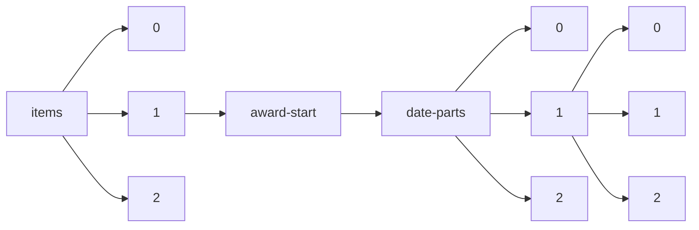

!!! warning "This document is not official Crossref documentation"
# Elements
PATH = items/array/award-start/date-parts/array/array(1)  
Occurs 138 663 times  
Unique values: 68  
{ .annotate }

1. A route to an element, for example:  
   The route "items/array/award-start/date-parts/array/array" corresponds to navigating through the JSON indices as  
   ["items"][0]["award-start"]["date-parts"][0][0]  

| **Row** | **Value** `Int64` | **Count** `Int64` |
|--------:|---------------------:|---------------------:|
| **1**   | 1                    | 43 753               |
| **2**   | 9                    | 7 201                |
| **3**   | 10                   | 6 394                |
| **4**   | 2 019                | 6 026                |
| **5**   | 2 015                | 5 725                |
| **6**   | 2 018                | 5 592                |
| **7**   | 2 016                | 5 385                |
| **8**   | 2 017                | 5 345                |
| **9**   | 2 022                | 4 623                |
| **10**  | 6                    | 4 086                |
| **11**  | 5                    | 3 976                |
| **12**  | 4                    | 3 614                |
| **13**  | 11                   | 3 458                |
| **14**  | 3                    | 3 295                |
| **15**  | 2                    | 3 185                |
| **16**  | 7                    | 2 861                |
| **17**  | 12                   | 2 774                |
| **18**  | 2 021                | 2 694                |
| **19**  | 8                    | 2 635                |
| **20**  | 2 023                | 2 379                |
| **21**  | 2 020                | 2 111                |
| **22**  | 15                   | 865                  |
| **23**  | 2 014                | 847                  |
| **24**  | 2 012                | 469                  |
| **25**  | 2 003                | 428                  |
| **26**  | 2 006                | 406                  |
| **27**  | 2 007                | 401                  |
| **28**  | 2 013                | 386                  |
| **29**  | 2 004                | 380                  |
| **30**  | 16                   | 372                  |
| **31**  | 2 009                | 372                  |
| **32**  | 2 011                | 366                  |
| **33**  | 2 010                | 349                  |
| **34**  | 2 005                | 322                  |
| **35**  | 2 002                | 306                  |
| **36**  | 17                   | 305                  |
| **37**  | 20                   | 290                  |
| **38**  | 18                   | 286                  |
| **39**  | 22                   | 273                  |
| **40**  | 2 001                | 271                  |
| **41**  | 13                   | 271                  |
| **42**  | 1 999                | 260                  |
| **43**  | 14                   | 259                  |
| **44**  | 2 000                | 249                  |
| **45**  | 2 008                | 248                  |
| **46**  | 25                   | 244                  |
| **47**  | 26                   | 238                  |
| **48**  | 21                   | 232                  |
| **49**  | 30                   | 204                  |
| **50**  | 31                   | 203                  |
| **51**  | 19                   | 202                  |
| **52**  | 23                   | 199                  |
| **53**  | 24                   | 198                  |
| **54**  | 29                   | 194                  |
| **55**  | 28                   | 190                  |
| **56**  | 27                   | 185                  |
| **57**  | 1 998                | 172                  |
| **58**  | 1 997                | 44                   |
| **59**  | 1 996                | 15                   |
| **60**  | 2 024                | 9                    |
| **61**  | 1 993                | 7                    |
| **62**  | 1 988                | 6                    |
| **63**  | 1 994                | 6                    |
| **64**  | 1 995                | 6                    |
| **65**  | 1 989                | 5                    |
| **66**  | 1 992                | 5                    |
| **67**  | 1 991                | 3                    |
| **68**  | 1 990                | 3                    |

