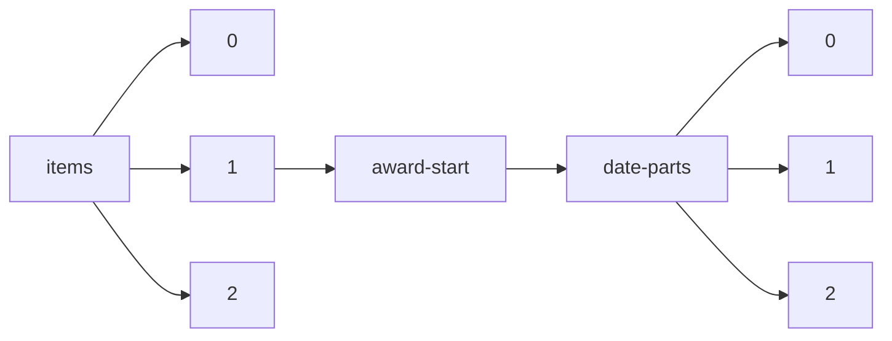

!!! warning "This document is not official Crossref documentation"
# Elements
PATH = items/array/award-start/date-parts/array(1)  
Occurs 46 221 times  
{ .annotate }

1. A route to an element, for example:  
   The route "items/array/award-start/date-parts/array" corresponds to navigating through the JSON indices as  
   ["items"][0]["award-start"]["date-parts"][0]  

## Properties of Array
See information about elements: [items/array/award-start/date-parts/array/array](array/index.md)  
Distribution of lengths:  

| **Row** | **Length** `Any` | **Count** `Int64` |
|--------:|--------------------:|---------------------:|
| **1**   | 3                   | 46 221               |

