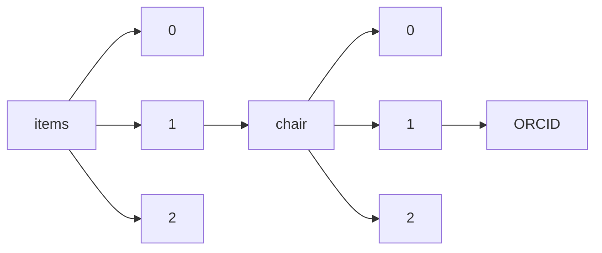

!!! warning "This document is not official Crossref documentation"
# ORCID
PATH = items/array/chair/array/ORCID(1)  
Occurs 2 258 times  
Unique values: > 999  
{ .annotate }

1. A route to an element, for example:  
   The route "items/array/chair/array/ORCID" corresponds to navigating through the JSON indices as  
   ["items"][0]["chair"][0]["ORCID"]  

!!! note "Due to current limitations, only the first 1,000 unique values are counted."

| **Row** | **Value** `String`                | **Count** `Int64` |
|--------:|-------------------------------------:|---------------------:|
| **1**   | http://orcid.org/0000-0001-7012-9078 | 39                   |
| **2**   | http://orcid.org/0000-0002-0949-9528 | 34                   |
| **3**   | http://orcid.org/0000-0002-2530-3687 | 34                   |
| **4**   | http://orcid.org/0000-0002-3267-5745 | 27                   |
| **5**   | http://orcid.org/0000-0003-2952-4337 | 26                   |
| **6**   | http://orcid.org/0000-0002-7238-0562 | 24                   |
| **7**   | http://orcid.org/0000-0002-5248-273X | 15                   |
| **8**   | http://orcid.org/0000-0002-5238-8567 | 15                   |
| **9**   | http://orcid.org/0000-0001-5364-0173 | 14                   |
| **10**  | http://orcid.org/0000-0001-8890-0852 | 14                   |
| **11**  | http://orcid.org/0000-0002-7463-5733 | 13                   |
| **12**  | http://orcid.org/0000-0001-9667-8446 | 10                   |
| **13**  | http://orcid.org/0000-0002-2477-6861 | 9                    |
| **14**  | http://orcid.org/0000-0002-3619-2927 | 9                    |
| **15**  | http://orcid.org/0000-0002-1971-5802 | 8                    |
| **16**  | http://orcid.org/0000-0002-8178-0453 | 7                    |
| **17**  | http://orcid.org/0000-0002-6771-6412 | 7                    |
| **18**  | http://orcid.org/0000-0001-9626-0322 | 7                    |
| **19**  | http://orcid.org/0000-0002-4666-6137 | 7                    |
| **20**  | http://orcid.org/0000-0002-6625-9221 | 6                    |
| **21**  | http://orcid.org/0000-0002-2944-3599 | 6                    |
| **22**  | http://orcid.org/0000-0003-0531-6760 | 6                    |
| **23**  | http://orcid.org/0000-0002-6543-0701 | 6                    |
| **24**  | http://orcid.org/0000-0002-1341-7863 | 6                    |
| **25**  | http://orcid.org/0000-0003-4542-3544 | 5                    |
| **26**  | http://orcid.org/0000-0002-2197-6438 | 5                    |
| **27**  | http://orcid.org/0000-0002-4021-6872 | 5                    |
| **28**  | http://orcid.org/0000-0002-9703-3997 | 5                    |
| **29**  | http://orcid.org/0000-0002-8419-3932 | 5                    |
| **30**  | http://orcid.org/0000-0002-3317-1506 | 5                    |
| **31**  | http://orcid.org/0000-0002-9435-5229 | 5                    |
| **32**  | http://orcid.org/0000-0001-7834-862X | 5                    |
| **33**  | http://orcid.org/0000-0002-1637-1688 | 5                    |
| **34**  | http://orcid.org/0000-0002-7140-0314 | 5                    |
| **35**  | http://orcid.org/0000-0002-9071-7165 | 5                    |
| **36**  | http://orcid.org/0000-0002-4483-4942 | 5                    |
| **37**  | http://orcid.org/0000-0003-2394-041X | 5                    |
| **38**  | http://orcid.org/0000-0002-3506-2266 | 5                    |
| **39**  | http://orcid.org/0000-0003-2094-1919 | 5                    |
| **40**  | http://orcid.org/0000-0001-7863-4343 | 5                    |
| **41**  | http://orcid.org/0000-0003-1780-6185 | 4                    |
| **42**  | http://orcid.org/0000-0002-7925-274X | 4                    |
| **43**  | http://orcid.org/0000-0003-2599-8834 | 4                    |
| **44**  | http://orcid.org/0000-0003-3812-6672 | 4                    |
| **45**  | http://orcid.org/0000-0002-1506-4272 | 4                    |
| **46**  | http://orcid.org/0000-0003-2111-4982 | 4                    |
| **47**  | http://orcid.org/0000-0002-7424-0627 | 4                    |
| **48**  | http://orcid.org/0000-0003-3419-3704 | 4                    |
| **49**  | http://orcid.org/0000-0002-0022-3090 | 4                    |
| **50**  | http://orcid.org/0000-0003-3895-2675 | 4                    |
| **51**  | http://orcid.org/0000-0001-6108-8358 | 4                    |
| **52**  | http://orcid.org/0000-0002-5233-0576 | 4                    |
| **53**  | http://orcid.org/0000-0002-9608-3677 | 4                    |
| **54**  | http://orcid.org/0000-0002-3768-2696 | 4                    |
| **55**  | http://orcid.org/0000-0002-9594-0593 | 4                    |
| **56**  | http://orcid.org/0000-0002-4676-0668 | 4                    |
| **57**  | http://orcid.org/0000-0001-8826-1616 | 4                    |
| **58**  | http://orcid.org/0000-0002-4436-5074 | 4                    |
| **59**  | http://orcid.org/0000-0003-4225-0967 | 4                    |
| **60**  | http://orcid.org/0000-0003-4568-8104 | 3                    |
| **61**  | http://orcid.org/0000-0003-2275-5511 | 3                    |
| **62**  | http://orcid.org/0000-0001-8297-6581 | 3                    |
| **63**  | http://orcid.org/0000-0002-2107-539X | 3                    |
| **64**  | http://orcid.org/0000-0002-0988-4821 | 3                    |
| **65**  | http://orcid.org/0000-0002-6268-9443 | 3                    |
| **66**  | http://orcid.org/0000-0001-7021-8804 | 3                    |
| **67**  | http://orcid.org/0000-0002-2932-280X | 3                    |
| **68**  | http://orcid.org/0000-0002-1718-9060 | 3                    |
| **69**  | http://orcid.org/0000-0003-1943-6915 | 3                    |
| **70**  | http://orcid.org/0000-0003-1209-9784 | 3                    |
| **71**  | http://orcid.org/0000-0002-6987-0640 | 3                    |
| **72**  | http://orcid.org/0000-0002-2229-6178 | 3                    |
| **73**  | http://orcid.org/0000-0001-9562-3195 | 3                    |
| **74**  | http://orcid.org/0000-0002-5518-4260 | 3                    |
| **75**  | http://orcid.org/0000-0003-0065-9625 | 3                    |
| **76**  | http://orcid.org/0000-0002-0435-8451 | 3                    |
| **77**  | http://orcid.org/0000-0002-5886-4552 | 3                    |
| **78**  | http://orcid.org/0000-0001-7570-1483 | 3                    |
| **79**  | http://orcid.org/0000-0002-7507-5934 | 3                    |
| **80**  | http://orcid.org/0000-0002-6261-3991 | 3                    |
| **81**  | http://orcid.org/0000-0002-9432-1280 | 3                    |
| **82**  | http://orcid.org/0000-0002-2425-6815 | 3                    |
| **83**  | http://orcid.org/0000-0003-1310-9702 | 3                    |
| **84**  | http://orcid.org/0000-0001-6449-8432 | 3                    |
| **85**  | http://orcid.org/0000-0002-6223-7105 | 3                    |
| **86**  | http://orcid.org/0000-0003-1450-2004 | 3                    |
| **87**  | http://orcid.org/0000-0001-6163-2173 | 3                    |
| **88**  | http://orcid.org/0000-0002-9068-6581 | 3                    |
| **89**  | http://orcid.org/0000-0002-0600-8420 | 3                    |
| **90**  | http://orcid.org/0000-0003-1286-081X | 3                    |
| **91**  | http://orcid.org/0000-0002-0654-4872 | 3                    |
| **92**  | http://orcid.org/0000-0002-0516-0148 | 3                    |
| **93**  | http://orcid.org/0000-0002-3491-018X | 3                    |
| **94**  | http://orcid.org/0000-0002-0898-7992 | 3                    |
| **95**  | http://orcid.org/0000-0003-0182-9753 | 3                    |
| **96**  | http://orcid.org/0000-0002-2356-9860 | 3                    |
| **97**  | http://orcid.org/0000-0001-9323-5981 | 3                    |
| **98**  | http://orcid.org/0000-0003-1813-6435 | 3                    |
| **99**  | http://orcid.org/0000-0002-3428-182X | 3                    |
| **100** | http://orcid.org/0000-0001-6394-5990 | 3                    |
| **101** | http://orcid.org/0000-0001-8279-7225 | 3                    |
| **102** | http://orcid.org/0000-0001-5355-8532 | 3                    |
| **103** | http://orcid.org/0000-0001-5831-8175 | 3                    |
| **104** | http://orcid.org/0000-0003-3470-8640 | 3                    |
| **105** | http://orcid.org/0000-0002-1774-7122 | 3                    |
| **106** | http://orcid.org/0000-0003-3459-3636 | 3                    |
| **107** | http://orcid.org/0000-0001-7415-3059 | 3                    |
| **108** | http://orcid.org/0000-0003-3916-972X | 3                    |
| **109** | http://orcid.org/0000-0003-1165-7182 | 3                    |
| **110** | http://orcid.org/0000-0002-4179-5781 | 3                    |
| **111** | http://orcid.org/0000-0002-9252-5407 | 3                    |
| **112** | http://orcid.org/0000-0002-9381-9722 | 3                    |
| **113** | http://orcid.org/0000-0002-6645-0878 | 3                    |
| **114** | http://orcid.org/0000-0002-1064-9730 | 3                    |
| **115** | http://orcid.org/0000-0002-8471-3037 | 3                    |
| **116** | http://orcid.org/0000-0002-6138-9879 | 3                    |
| **117** | http://orcid.org/0000-0002-3198-5135 | 3                    |
| **118** | http://orcid.org/0000-0002-0443-7803 | 2                    |
| **119** | http://orcid.org/0000-0003-2212-1172 | 2                    |
| **120** | http://orcid.org/0000-0002-0455-8445 | 2                    |
| **121** | http://orcid.org/0000-0001-8645-0456 | 2                    |
| **122** | http://orcid.org/0000-0003-4598-0631 | 2                    |
| **123** | http://orcid.org/0000-0002-7694-5292 | 2                    |
| **124** | http://orcid.org/0000-0003-0223-1411 | 2                    |
| **125** | http://orcid.org/0000-0002-2801-1276 | 2                    |
| **126** | http://orcid.org/0000-0002-8588-2350 | 2                    |
| **127** | http://orcid.org/0000-0003-2865-6549 | 2                    |
| **128** | http://orcid.org/0000-0003-0405-5837 | 2                    |
| **129** | http://orcid.org/0000-0001-5462-5362 | 2                    |
| **130** | http://orcid.org/0000-0002-3954-4609 | 2                    |
| **131** | http://orcid.org/0000-0003-2893-8044 | 2                    |
| **132** | http://orcid.org/0000-0003-0943-0587 | 2                    |
| **133** | http://orcid.org/0000-0003-0821-2166 | 2                    |
| **134** | http://orcid.org/0000-0002-1106-5091 | 2                    |
| **135** | http://orcid.org/0000-0001-6447-4190 | 2                    |
| **136** | http://orcid.org/0000-0003-4700-8571 | 2                    |
| **137** | http://orcid.org/0000-0003-3993-5826 | 2                    |
| **138** | http://orcid.org/0000-0002-8918-5288 | 2                    |
| **139** | http://orcid.org/0000-0002-2122-0892 | 2                    |
| **140** | http://orcid.org/0000-0002-1783-2343 | 2                    |
| **141** | http://orcid.org/0000-0002-2632-2986 | 2                    |
| **142** | http://orcid.org/0000-0001-5802-9111 | 2                    |
| **143** | http://orcid.org/0000-0001-9297-6286 | 2                    |
| **144** | http://orcid.org/0000-0002-6207-1766 | 2                    |
| **145** | http://orcid.org/0000-0001-8228-8404 | 2                    |
| **146** | http://orcid.org/0000-0001-5244-5587 | 2                    |
| **147** | http://orcid.org/0000-0002-1633-4799 | 2                    |
| **148** | http://orcid.org/0000-0001-9275-8158 | 2                    |
| **149** | http://orcid.org/0000-0002-1456-999X | 2                    |
| **150** | http://orcid.org/0000-0003-1813-9601 | 2                    |
| **151** | http://orcid.org/0000-0003-4193-4400 | 2                    |
| **152** | http://orcid.org/0000-0003-3066-6228 | 2                    |
| **153** | http://orcid.org/0000-0001-8382-8070 | 2                    |
| **154** | http://orcid.org/0000-0002-7615-7595 | 2                    |
| **155** | http://orcid.org/0000-0001-7089-7579 | 2                    |
| **156** | http://orcid.org/0000-0003-3374-2003 | 2                    |
| **157** | http://orcid.org/0000-0002-1056-7137 | 2                    |
| **158** | http://orcid.org/0000-0003-0804-3040 | 2                    |
| **159** | http://orcid.org/0000-0003-0756-9534 | 2                    |
| **160** | http://orcid.org/0000-0003-0995-206X | 2                    |
| **161** | http://orcid.org/0000-0002-5844-1699 | 2                    |
| **162** | http://orcid.org/0000-0002-5320-8732 | 2                    |
| **163** | http://orcid.org/0000-0001-5221-9424 | 2                    |
| **164** | http://orcid.org/0000-0001-8893-661X | 2                    |
| **165** | http://orcid.org/0000-0001-8368-9787 | 2                    |
| **166** | http://orcid.org/0000-0002-6083-8759 | 2                    |
| **167** | http://orcid.org/0000-0002-7687-763X | 2                    |
| **168** | http://orcid.org/0000-0002-7745-7653 | 2                    |
| **169** | http://orcid.org/0000-0002-1400-282X | 2                    |
| **170** | http://orcid.org/0000-0001-7027-5382 | 2                    |
| **171** | http://orcid.org/0000-0002-2237-5116 | 2                    |
| **172** | http://orcid.org/0000-0003-1407-3190 | 2                    |
| **173** | http://orcid.org/0000-0003-3918-0523 | 2                    |
| **174** | http://orcid.org/0000-0002-0800-7085 | 2                    |
| **175** | http://orcid.org/0000-0002-8594-8014 | 2                    |
| **176** | http://orcid.org/0000-0003-2118-9386 | 2                    |
| **177** | http://orcid.org/0000-0001-7642-0894 | 2                    |
| **178** | http://orcid.org/0000-0003-2188-5592 | 2                    |
| **179** | http://orcid.org/0000-0002-1763-7679 | 2                    |
| **180** | http://orcid.org/0000-0002-1649-3079 | 2                    |
| **181** | http://orcid.org/0000-0003-0743-7849 | 2                    |
| **182** | http://orcid.org/0000-0002-9787-3099 | 2                    |
| **183** | http://orcid.org/0000-0003-0207-4137 | 2                    |
| **184** | http://orcid.org/0000-0003-3812-8010 | 2                    |
| **185** | http://orcid.org/0000-0001-7640-4579 | 2                    |
| **186** | http://orcid.org/0000-0001-7207-2036 | 2                    |
| **187** | http://orcid.org/0000-0002-8672-0855 | 2                    |
| **188** | http://orcid.org/0000-0003-0450-4647 | 2                    |
| **189** | http://orcid.org/0000-0003-3289-6393 | 2                    |
| **190** | http://orcid.org/0000-0002-9525-709X | 2                    |
| **191** | http://orcid.org/0000-0002-4731-6702 | 2                    |
| **192** | http://orcid.org/0000-0002-4647-8507 | 2                    |
| **193** | http://orcid.org/0000-0001-5072-4099 | 2                    |
| **194** | http://orcid.org/0000-0002-4699-1087 | 2                    |
| **195** | http://orcid.org/0000-0002-9143-2452 | 2                    |
| **196** | http://orcid.org/0000-0003-1595-4280 | 2                    |
| **197** | http://orcid.org/0000-0002-0497-1627 | 2                    |
| **198** | http://orcid.org/0000-0002-1379-9398 | 2                    |
| **199** | http://orcid.org/0000-0001-7889-0531 | 2                    |
| **200** | http://orcid.org/0000-0002-5916-462X | 2                    |
| **201** | http://orcid.org/0000-0003-2040-6334 | 2                    |
| **202** | http://orcid.org/0000-0002-8739-8204 | 2                    |
| **203** | http://orcid.org/0000-0002-0086-252X | 2                    |
| **204** | http://orcid.org/0000-0001-9560-2802 | 2                    |
| **205** | http://orcid.org/0000-0002-5451-0175 | 2                    |
| **206** | http://orcid.org/0000-0001-5894-0642 | 2                    |
| **207** | http://orcid.org/0000-0002-2195-4458 | 2                    |
| **208** | http://orcid.org/0000-0002-4508-1495 | 2                    |
| **209** | http://orcid.org/0000-0002-5317-3410 | 2                    |
| **210** | http://orcid.org/0000-0002-2112-7049 | 2                    |
| **211** | http://orcid.org/0000-0003-1594-0700 | 2                    |
| **212** | http://orcid.org/0000-0002-0435-3765 | 2                    |
| **213** | http://orcid.org/0000-0002-4297-3041 | 2                    |
| **214** | http://orcid.org/0000-0002-3157-2664 | 2                    |
| **215** | http://orcid.org/0000-0001-8330-3856 | 2                    |
| **216** | http://orcid.org/0000-0002-0710-1758 | 2                    |
| **217** | http://orcid.org/0000-0003-0599-1483 | 2                    |
| **218** | http://orcid.org/0000-0001-7579-3701 | 2                    |
| **219** | http://orcid.org/0000-0003-1811-2118 | 2                    |
| **220** | http://orcid.org/0000-0003-0501-6119 | 2                    |
| **221** | http://orcid.org/0000-0002-1274-706X | 2                    |
| **222** | http://orcid.org/0000-0002-4239-017X | 2                    |
| **223** | http://orcid.org/0000-0003-1871-1161 | 2                    |
| **224** | http://orcid.org/0000-0001-5993-1078 | 2                    |
| **225** | http://orcid.org/0000-0002-9990-2658 | 2                    |
| **226** | http://orcid.org/0000-0002-3523-9850 | 2                    |
| **227** | http://orcid.org/0000-0002-5404-0994 | 2                    |
| **228** | http://orcid.org/0000-0001-8653-1520 | 2                    |
| **229** | http://orcid.org/0000-0001-6440-0175 | 2                    |
| **230** | http://orcid.org/0000-0002-1237-833X | 2                    |
| **231** | http://orcid.org/0000-0002-1999-4696 | 2                    |
| **232** | http://orcid.org/0000-0002-2539-1955 | 2                    |
| **233** | http://orcid.org/0000-0002-1201-4827 | 2                    |
| **234** | http://orcid.org/0000-0003-2159-6045 | 2                    |
| **235** | http://orcid.org/0000-0003-4952-1811 | 2                    |
| **236** | http://orcid.org/0000-0002-9306-4702 | 2                    |
| **237** | http://orcid.org/0000-0003-3728-2606 | 2                    |
| **238** | http://orcid.org/0000-0001-7077-2442 | 2                    |
| **239** | http://orcid.org/0000-0001-9086-4934 | 2                    |
| **240** | http://orcid.org/0000-0002-8321-5730 | 2                    |
| **241** | http://orcid.org/0000-0002-8063-0402 | 2                    |
| **242** | http://orcid.org/0000-0002-4531-0024 | 2                    |
| **243** | http://orcid.org/0000-0002-6681-6139 | 2                    |
| **244** | http://orcid.org/0000-0002-5390-6784 | 2                    |
| **245** | http://orcid.org/0000-0002-0739-2874 | 2                    |
| **246** | http://orcid.org/0000-0002-6479-5936 | 2                    |
| **247** | http://orcid.org/0000-0003-1986-0708 | 2                    |
| **248** | http://orcid.org/0000-0002-1179-4884 | 2                    |
| **249** | http://orcid.org/0000-0002-2453-132X | 2                    |
| **250** | http://orcid.org/0000-0002-8347-7554 | 2                    |
| **251** | http://orcid.org/0000-0003-4503-4047 | 2                    |
| **252** | http://orcid.org/0000-0003-4490-0484 | 2                    |
| **253** | http://orcid.org/0000-0001-9616-404X | 2                    |
| **254** | http://orcid.org/0000-0001-6879-0086 | 2                    |
| **255** | http://orcid.org/0000-0002-2204-7219 | 2                    |
| **256** | http://orcid.org/0000-0002-8891-7432 | 2                    |
| **257** | http://orcid.org/0000-0002-9029-0886 | 2                    |
| **258** | http://orcid.org/0000-0001-6240-8659 | 2                    |
| **259** | http://orcid.org/0000-0002-9073-0562 | 2                    |
| **260** | http://orcid.org/0000-0002-4011-3590 | 2                    |
| **261** | http://orcid.org/0000-0002-8231-5043 | 2                    |
| **262** | http://orcid.org/0000-0001-5981-4760 | 2                    |
| **263** | http://orcid.org/0000-0001-7719-3558 | 2                    |
| **264** | http://orcid.org/0000-0002-7288-2028 | 2                    |
| **265** | http://orcid.org/0000-0003-0071-038X | 2                    |
| **266** | http://orcid.org/0000-0002-7736-5265 | 2                    |
| **267** | http://orcid.org/0000-0003-2689-1932 | 2                    |
| **268** | http://orcid.org/0000-0002-0082-2595 | 2                    |
| **269** | http://orcid.org/0000-0003-1312-0768 | 2                    |
| **270** | http://orcid.org/0000-0002-0018-1150 | 2                    |
| **271** | http://orcid.org/0000-0002-7950-2446 | 2                    |
| **272** | http://orcid.org/0000-0001-6015-2266 | 2                    |
| **273** | http://orcid.org/0000-0002-2288-1393 | 2                    |
| **274** | http://orcid.org/0000-0002-5423-0106 | 2                    |
| **275** | http://orcid.org/0000-0001-7790-1104 | 2                    |
| **276** | http://orcid.org/0000-0003-3163-0972 | 2                    |
| **277** | http://orcid.org/0000-0001-8149-4919 | 2                    |
| **278** | http://orcid.org/0000-0003-4621-6993 | 2                    |
| **279** | http://orcid.org/0000-0002-8130-4035 | 2                    |
| **280** | http://orcid.org/0000-0001-6924-6744 | 2                    |
| **281** | http://orcid.org/0000-0001-5565-8959 | 2                    |
| **282** | http://orcid.org/0000-0002-9693-657X | 2                    |
| **283** | http://orcid.org/0000-0002-0993-4809 | 2                    |
| **284** | http://orcid.org/0000-0002-4735-467X | 2                    |
| **285** | http://orcid.org/0000-0003-1335-461X | 2                    |
| **286** | http://orcid.org/0000-0002-1254-7391 | 2                    |
| **287** | http://orcid.org/0000-0002-9515-7734 | 2                    |
| **288** | http://orcid.org/0000-0003-2147-9957 | 2                    |
| **289** | http://orcid.org/0000-0002-7154-8757 | 2                    |
| **290** | http://orcid.org/0000-0002-1951-5384 | 2                    |
| **291** | http://orcid.org/0000-0003-4492-761X | 2                    |
| **292** | http://orcid.org/0000-0002-6919-4750 | 2                    |
| **293** | http://orcid.org/0000-0002-7454-8349 | 2                    |
| **294** | http://orcid.org/0000-0001-6085-4145 | 2                    |
| **295** | http://orcid.org/0000-0002-9454-5428 | 2                    |
| **296** | http://orcid.org/0000-0002-0378-0415 | 2                    |
| **297** | http://orcid.org/0000-0001-8024-0810 | 2                    |
| **298** | http://orcid.org/0000-0001-5965-8809 | 2                    |
| **299** | http://orcid.org/0000-0002-8648-7942 | 2                    |
| **300** | http://orcid.org/0000-0001-8830-5703 | 1                    |
| **301** | http://orcid.org/0000-0002-8839-7297 | 1                    |
| **302** | http://orcid.org/0000-0001-5377-9626 | 1                    |
| **303** | http://orcid.org/0000-0001-6352-9612 | 1                    |
| **304** | http://orcid.org/0000-0002-2560-8982 | 1                    |
| **305** | http://orcid.org/0000-0002-5684-9439 | 1                    |
| **306** | http://orcid.org/0000-0001-8182-8667 | 1                    |
| **307** | http://orcid.org/0000-0001-6175-5157 | 1                    |
| **308** | http://orcid.org/0000-0001-8953-9106 | 1                    |
| **309** | http://orcid.org/0000-0003-3179-9508 | 1                    |
| **310** | http://orcid.org/0000-0002-4976-7320 | 1                    |
| **311** | http://orcid.org/0000-0003-1441-0804 | 1                    |
| **312** | http://orcid.org/0000-0002-2001-2987 | 1                    |
| **313** | http://orcid.org/0000-0001-8430-237X | 1                    |
| **314** | http://orcid.org/0000-0001-5308-1762 | 1                    |
| **315** | http://orcid.org/0000-0001-9851-7785 | 1                    |
| **316** | http://orcid.org/0000-0001-7306-9138 | 1                    |
| **317** | http://orcid.org/0000-0002-9096-6460 | 1                    |
| **318** | http://orcid.org/0000-0002-2457-0118 | 1                    |
| **319** | http://orcid.org/0000-0001-8102-8678 | 1                    |
| **320** | http://orcid.org/0000-0001-9939-0309 | 1                    |
| **321** | http://orcid.org/0000-0003-4379-4130 | 1                    |
| **322** | http://orcid.org/0000-0002-5544-7438 | 1                    |
| **323** | http://orcid.org/0000-0003-2701-5643 | 1                    |
| **324** | http://orcid.org/0000-0002-6672-4269 | 1                    |
| **325** | http://orcid.org/0000-0002-4590-2863 | 1                    |
| **326** | http://orcid.org/0000-0002-4735-3749 | 1                    |
| **327** | http://orcid.org/0000-0003-4670-935X | 1                    |
| **328** | http://orcid.org/0000-0002-8658-8700 | 1                    |
| **329** | http://orcid.org/0000-0002-8330-1495 | 1                    |
| **330** | http://orcid.org/0000-0003-2245-2246 | 1                    |
| **331** | http://orcid.org/0000-0002-8568-2279 | 1                    |
| **332** | http://orcid.org/0000-0001-7298-4094 | 1                    |
| **333** | http://orcid.org/0000-0002-5788-0219 | 1                    |
| **334** | http://orcid.org/0000-0003-0306-8425 | 1                    |
| **335** | http://orcid.org/0000-0002-7153-8532 | 1                    |
| **336** | http://orcid.org/0000-0001-6574-4068 | 1                    |
| **337** | http://orcid.org/0000-0002-3089-4012 | 1                    |
| **338** | http://orcid.org/0000-0002-5098-2722 | 1                    |
| **339** | http://orcid.org/0000-0002-3145-377X | 1                    |
| **340** | http://orcid.org/0000-0002-0254-2466 | 1                    |
| **341** | http://orcid.org/0000-0003-3554-4115 | 1                    |
| **342** | http://orcid.org/0000-0002-2825-856X | 1                    |
| **343** | http://orcid.org/0000-0002-9232-8737 | 1                    |
| **344** | http://orcid.org/0000-0003-1543-6504 | 1                    |
| **345** | http://orcid.org/0000-0002-6934-0607 | 1                    |
| **346** | http://orcid.org/0000-0002-3611-2368 | 1                    |
| **347** | http://orcid.org/0000-0002-0911-1626 | 1                    |
| **348** | http://orcid.org/0000-0001-8370-0034 | 1                    |
| **349** | http://orcid.org/0000-0002-4257-0699 | 1                    |
| **350** | http://orcid.org/0000-0003-1010-1238 | 1                    |
| **351** | http://orcid.org/0000-0003-3115-0207 | 1                    |
| **352** | http://orcid.org/0000-0003-4583-8838 | 1                    |
| **353** | http://orcid.org/0000-0003-1459-9029 | 1                    |
| **354** | http://orcid.org/0000-0002-4951-4040 | 1                    |
| **355** | http://orcid.org/0000-0001-5271-6172 | 1                    |
| **356** | http://orcid.org/0000-0001-6697-9096 | 1                    |
| **357** | http://orcid.org/0000-0003-2721-9646 | 1                    |
| **358** | http://orcid.org/0000-0003-2836-217X | 1                    |
| **359** | http://orcid.org/0000-0002-2074-7772 | 1                    |
| **360** | http://orcid.org/0000-0002-9832-1448 | 1                    |
| **361** | http://orcid.org/0000-0001-7153-3101 | 1                    |
| **362** | http://orcid.org/0000-0002-0322-4785 | 1                    |
| **363** | http://orcid.org/0000-0002-4191-5173 | 1                    |
| **364** | http://orcid.org/0000-0001-7693-7068 | 1                    |
| **365** | http://orcid.org/0000-0002-8401-1975 | 1                    |
| **366** | http://orcid.org/0000-0002-6189-3848 | 1                    |
| **367** | http://orcid.org/0000-0002-1776-5398 | 1                    |
| **368** | http://orcid.org/0000-0001-6769-4914 | 1                    |
| **369** | http://orcid.org/0000-0003-4695-3301 | 1                    |
| **370** | http://orcid.org/0000-0001-7162-3211 | 1                    |
| **371** | http://orcid.org/0000-0003-2828-4458 | 1                    |
| **372** | http://orcid.org/0000-0001-5695-4389 | 1                    |
| **373** | http://orcid.org/0000-0002-3533-8103 | 1                    |
| **374** | http://orcid.org/0000-0002-3292-6639 | 1                    |
| **375** | http://orcid.org/0000-0003-0108-2565 | 1                    |
| **376** | http://orcid.org/0000-0002-1627-030X | 1                    |
| **377** | http://orcid.org/0000-0003-4098-6380 | 1                    |
| **378** | http://orcid.org/0000-0002-5658-4792 | 1                    |
| **379** | http://orcid.org/0000-0002-1492-6299 | 1                    |
| **380** | http://orcid.org/0000-0002-7073-1381 | 1                    |
| **381** | http://orcid.org/0000-0003-3790-8808 | 1                    |
| **382** | http://orcid.org/0000-0002-9790-7260 | 1                    |
| **383** | http://orcid.org/0000-0001-8651-5205 | 1                    |
| **384** | http://orcid.org/0000-0001-8602-035X | 1                    |
| **385** | http://orcid.org/0000-0002-2450-9843 | 1                    |
| **386** | http://orcid.org/0000-0002-9717-3033 | 1                    |
| **387** | http://orcid.org/0000-0002-3828-9466 | 1                    |
| **388** | http://orcid.org/0000-0001-5298-5348 | 1                    |
| **389** | http://orcid.org/0000-0002-3008-5207 | 1                    |
| **390** | http://orcid.org/0000-0001-5702-9769 | 1                    |
| **391** | http://orcid.org/0000-0001-6893-7826 | 1                    |
| **392** | http://orcid.org/0000-0002-2031-0044 | 1                    |
| **393** | http://orcid.org/0000-0002-5971-8776 | 1                    |
| **394** | http://orcid.org/0000-0001-8902-5447 | 1                    |
| **395** | http://orcid.org/0000-0003-3927-5063 | 1                    |
| **396** | http://orcid.org/0000-0001-6465-7210 | 1                    |
| **397** | http://orcid.org/0000-0001-9905-6589 | 1                    |
| **398** | http://orcid.org/0000-0002-1845-2588 | 1                    |
| **399** | http://orcid.org/0000-0001-6731-6390 | 1                    |
| **400** | http://orcid.org/0000-0002-3311-0834 | 1                    |
| **401** | http://orcid.org/0000-0001-8066-9369 | 1                    |
| **402** | http://orcid.org/0000-0001-6771-9501 | 1                    |
| **403** | http://orcid.org/0000-0003-3680-1347 | 1                    |
| **404** | http://orcid.org/0000-0001-9944-4194 | 1                    |
| **405** | http://orcid.org/0000-0002-9997-9620 | 1                    |
| **406** | http://orcid.org/0000-0002-7614-1382 | 1                    |
| **407** | http://orcid.org/0000-0001-7796-1924 | 1                    |
| **408** | http://orcid.org/0000-0001-6885-7439 | 1                    |
| **409** | http://orcid.org/0000-0002-1202-235X | 1                    |
| **410** | http://orcid.org/0000-0002-7836-4993 | 1                    |
| **411** | http://orcid.org/0000-0002-0723-1878 | 1                    |
| **412** | http://orcid.org/0000-0001-8339-3660 | 1                    |
| **413** | http://orcid.org/0000-0002-5097-4730 | 1                    |
| **414** | http://orcid.org/0000-0002-4757-7224 | 1                    |
| **415** | http://orcid.org/0000-0002-9099-5229 | 1                    |
| **416** | http://orcid.org/0000-0001-9929-2282 | 1                    |
| **417** | http://orcid.org/0000-0002-6912-4859 | 1                    |
| **418** | http://orcid.org/0000-0001-7835-0834 | 1                    |
| **419** | http://orcid.org/0000-0002-9622-2681 | 1                    |
| **420** | http://orcid.org/0000-0002-1186-7334 | 1                    |
| **421** | http://orcid.org/0000-0002-4650-8630 | 1                    |
| **422** | http://orcid.org/0000-0002-0683-2620 | 1                    |
| **423** | http://orcid.org/0000-0002-8760-6835 | 1                    |
| **424** | http://orcid.org/0000-0002-1328-532X | 1                    |
| **425** | http://orcid.org/0000-0002-0862-5043 | 1                    |
| **426** | http://orcid.org/0000-0002-9547-8968 | 1                    |
| **427** | http://orcid.org/0000-0001-7879-9877 | 1                    |
| **428** | http://orcid.org/0000-0003-4691-9445 | 1                    |
| **429** | http://orcid.org/0000-0003-0904-3624 | 1                    |
| **430** | http://orcid.org/0000-0001-7517-0010 | 1                    |
| **431** | http://orcid.org/0000-0003-3674-7985 | 1                    |
| **432** | http://orcid.org/0000-0001-6002-7983 | 1                    |
| **433** | http://orcid.org/0000-0002-0664-0549 | 1                    |
| **434** | http://orcid.org/0000-0002-8105-0784 | 1                    |
| **435** | http://orcid.org/0000-0002-1370-044X | 1                    |
| **436** | http://orcid.org/0000-0001-8129-8328 | 1                    |
| **437** | http://orcid.org/0000-0001-9812-5730 | 1                    |
| **438** | http://orcid.org/0000-0001-9802-8412 | 1                    |
| **439** | http://orcid.org/0000-0001-9936-1997 | 1                    |
| **440** | http://orcid.org/0000-0003-0088-9578 | 1                    |
| **441** | http://orcid.org/0000-0002-9175-2480 | 1                    |
| **442** | http://orcid.org/0000-0001-7992-6110 | 1                    |
| **443** | http://orcid.org/0000-0002-8022-1350 | 1                    |
| **444** | http://orcid.org/0000-0002-4486-2468 | 1                    |
| **445** | http://orcid.org/0000-0001-8307-183X | 1                    |
| **446** | http://orcid.org/0000-0003-4001-4231 | 1                    |
| **447** | http://orcid.org/0000-0002-1877-9425 | 1                    |
| **448** | http://orcid.org/0000-0001-5696-1941 | 1                    |
| **449** | http://orcid.org/0000-0002-4384-6394 | 1                    |
| **450** | http://orcid.org/0000-0001-7302-807X | 1                    |
| **451** | http://orcid.org/0000-0002-7562-2918 | 1                    |
| **452** | http://orcid.org/0000-0002-0949-3353 | 1                    |
| **453** | http://orcid.org/0000-0001-8500-0402 | 1                    |
| **454** | http://orcid.org/0000-0002-3485-8641 | 1                    |
| **455** | http://orcid.org/0000-0003-2697-3153 | 1                    |
| **456** | http://orcid.org/0000-0001-8636-8532 | 1                    |
| **457** | http://orcid.org/0000-0003-3149-8393 | 1                    |
| **458** | http://orcid.org/0000-0003-2858-5728 | 1                    |
| **459** | http://orcid.org/0000-0002-5685-4449 | 1                    |
| **460** | http://orcid.org/0000-0002-1327-1358 | 1                    |
| **461** | http://orcid.org/0000-0002-3459-0753 | 1                    |
| **462** | http://orcid.org/0000-0002-1661-8601 | 1                    |
| **463** | http://orcid.org/0000-0001-9209-8612 | 1                    |
| **464** | http://orcid.org/0000-0002-6275-185X | 1                    |
| **465** | http://orcid.org/0000-0002-9731-430X | 1                    |
| **466** | http://orcid.org/0000-0002-5691-9329 | 1                    |
| **467** | http://orcid.org/0000-0002-3361-2930 | 1                    |
| **468** | http://orcid.org/0000-0001-7431-7375 | 1                    |
| **469** | http://orcid.org/0000-0002-1064-7444 | 1                    |
| **470** | http://orcid.org/0000-0002-0666-4161 | 1                    |
| **471** | http://orcid.org/0000-0002-8796-8457 | 1                    |
| **472** | http://orcid.org/0000-0002-9522-0537 | 1                    |
| **473** | http://orcid.org/0000-0002-3908-3881 | 1                    |
| **474** | http://orcid.org/0000-0003-4519-0381 | 1                    |
| **475** | http://orcid.org/0000-0002-2657-2862 | 1                    |
| **476** | http://orcid.org/0000-0002-8549-1413 | 1                    |
| **477** | http://orcid.org/0000-0003-4004-1432 | 1                    |
| **478** | http://orcid.org/0000-0003-0474-400X | 1                    |
| **479** | http://orcid.org/0000-0003-1388-0660 | 1                    |
| **480** | http://orcid.org/0000-0002-1250-9918 | 1                    |
| **481** | http://orcid.org/0000-0003-2558-6725 | 1                    |
| **482** | http://orcid.org/0000-0001-9321-6684 | 1                    |
| **483** | http://orcid.org/0000-0002-9086-1669 | 1                    |
| **484** | http://orcid.org/0000-0001-5105-0129 | 1                    |
| **485** | http://orcid.org/0000-0003-0358-0656 | 1                    |
| **486** | http://orcid.org/0000-0001-5750-3416 | 1                    |
| **487** | http://orcid.org/0000-0002-6668-2425 | 1                    |
| **488** | http://orcid.org/0000-0001-9152-179X | 1                    |
| **489** | http://orcid.org/0000-0002-6851-8776 | 1                    |
| **490** | http://orcid.org/0000-0002-1688-2808 | 1                    |
| **491** | http://orcid.org/0000-0003-1584-7274 | 1                    |
| **492** | http://orcid.org/0000-0003-3323-8771 | 1                    |
| **493** | http://orcid.org/0000-0003-1366-0764 | 1                    |
| **494** | http://orcid.org/0000-0001-6740-4171 | 1                    |
| **495** | http://orcid.org/0000-0001-5245-3173 | 1                    |
| **496** | http://orcid.org/0000-0003-4194-2574 | 1                    |
| **497** | http://orcid.org/0000-0003-1183-613X | 1                    |
| **498** | http://orcid.org/0000-0003-0095-6048 | 1                    |
| **499** | http://orcid.org/0000-0003-3466-7148 | 1                    |
| **500** | http://orcid.org/0000-0002-0577-4422 | 1                    |
| **501** | http://orcid.org/0000-0002-0533-9260 | 1                    |
| **502** | http://orcid.org/0000-0001-5233-9776 | 1                    |
| **503** | http://orcid.org/0000-0002-8284-7277 | 1                    |
| **504** | http://orcid.org/0000-0002-0583-1650 | 1                    |
| **505** | http://orcid.org/0000-0003-1883-8891 | 1                    |
| **506** | http://orcid.org/0000-0002-1088-4706 | 1                    |
| **507** | http://orcid.org/0000-0002-8974-2283 | 1                    |
| **508** | http://orcid.org/0000-0001-7495-6935 | 1                    |
| **509** | http://orcid.org/0000-0002-1153-779X | 1                    |
| **510** | http://orcid.org/0000-0002-4216-165X | 1                    |
| **511** | http://orcid.org/0000-0002-5550-8026 | 1                    |
| **512** | http://orcid.org/0000-0002-3094-9407 | 1                    |
| **513** | http://orcid.org/0000-0003-4948-1557 | 1                    |
| **514** | http://orcid.org/0000-0003-0144-3607 | 1                    |
| **515** | http://orcid.org/0000-0001-8176-5985 | 1                    |
| **516** | http://orcid.org/0000-0002-8892-5440 | 1                    |
| **517** | http://orcid.org/0000-0001-6591-1460 | 1                    |
| **518** | http://orcid.org/0000-0002-3198-6058 | 1                    |
| **519** | http://orcid.org/0000-0002-3481-7970 | 1                    |
| **520** | http://orcid.org/0000-0003-3472-0412 | 1                    |
| **521** | http://orcid.org/0000-0002-8633-7426 | 1                    |
| **522** | http://orcid.org/0000-0003-4789-1675 | 1                    |
| **523** | http://orcid.org/0000-0002-1777-9546 | 1                    |
| **524** | http://orcid.org/0000-0002-7110-8364 | 1                    |
| **525** | http://orcid.org/0000-0002-9882-9954 | 1                    |
| **526** | http://orcid.org/0000-0003-0183-2418 | 1                    |
| **527** | http://orcid.org/0000-0001-7842-694X | 1                    |
| **528** | http://orcid.org/0000-0002-6601-6254 | 1                    |
| **529** | http://orcid.org/0000-0003-4262-6370 | 1                    |
| **530** | http://orcid.org/0000-0001-9658-4001 | 1                    |
| **531** | http://orcid.org/0000-0003-2435-5482 | 1                    |
| **532** | http://orcid.org/0000-0002-9147-4310 | 1                    |
| **533** | http://orcid.org/0000-0003-1241-5943 | 1                    |
| **534** | http://orcid.org/0000-0002-0510-0196 | 1                    |
| **535** | http://orcid.org/0000-0002-7535-4108 | 1                    |
| **536** | http://orcid.org/0000-0003-2685-0604 | 1                    |
| **537** | http://orcid.org/0000-0001-6981-8933 | 1                    |
| **538** | http://orcid.org/0000-0002-2427-8985 | 1                    |
| **539** | http://orcid.org/0000-0002-1075-2113 | 1                    |
| **540** | http://orcid.org/0000-0003-3749-4908 | 1                    |
| **541** | http://orcid.org/0000-0001-9319-1341 | 1                    |
| **542** | http://orcid.org/0000-0003-4887-181X | 1                    |
| **543** | http://orcid.org/0000-0002-5645-7603 | 1                    |
| **544** | http://orcid.org/0000-0002-8857-8821 | 1                    |
| **545** | http://orcid.org/0000-0001-9944-3052 | 1                    |
| **546** | http://orcid.org/0000-0002-1383-5555 | 1                    |
| **547** | http://orcid.org/0000-0001-5297-0584 | 1                    |
| **548** | http://orcid.org/0000-0001-9689-603X | 1                    |
| **549** | http://orcid.org/0000-0003-0124-8270 | 1                    |
| **550** | http://orcid.org/0000-0002-0463-8584 | 1                    |
| **551** | http://orcid.org/0000-0002-4645-3553 | 1                    |
| **552** | http://orcid.org/0000-0001-8948-5806 | 1                    |
| **553** | http://orcid.org/0000-0002-7097-7963 | 1                    |
| **554** | http://orcid.org/0000-0002-0130-4394 | 1                    |
| **555** | http://orcid.org/0000-0003-4498-5529 | 1                    |
| **556** | http://orcid.org/0000-0002-5904-0758 | 1                    |
| **557** | http://orcid.org/0000-0002-2529-1989 | 1                    |
| **558** | http://orcid.org/0000-0002-0614-7383 | 1                    |
| **559** | http://orcid.org/0000-0003-1176-3292 | 1                    |
| **560** | http://orcid.org/0000-0002-4224-6493 | 1                    |
| **561** | http://orcid.org/0000-0002-1979-0183 | 1                    |
| **562** | http://orcid.org/0000-0003-3062-9734 | 1                    |
| **563** | http://orcid.org/0000-0001-9953-8641 | 1                    |
| **564** | http://orcid.org/0000-0001-6112-6772 | 1                    |
| **565** | http://orcid.org/0000-0002-0706-0589 | 1                    |
| **566** | http://orcid.org/0000-0002-2807-7785 | 1                    |
| **567** | http://orcid.org/0000-0002-7920-5556 | 1                    |
| **568** | http://orcid.org/0000-0002-6815-7325 | 1                    |
| **569** | http://orcid.org/0000-0001-5543-9131 | 1                    |
| **570** | http://orcid.org/0000-0001-6186-5700 | 1                    |
| **571** | http://orcid.org/0000-0001-6978-7428 | 1                    |
| **572** | http://orcid.org/0000-0002-4021-2601 | 1                    |
| **573** | http://orcid.org/0000-0002-0340-6191 | 1                    |
| **574** | http://orcid.org/0000-0002-8555-3653 | 1                    |
| **575** | http://orcid.org/0000-0002-9129-7086 | 1                    |
| **576** | http://orcid.org/0000-0002-5606-1713 | 1                    |
| **577** | http://orcid.org/0000-0002-1417-4269 | 1                    |
| **578** | http://orcid.org/0000-0003-4269-180X | 1                    |
| **579** | http://orcid.org/0000-0002-4701-0623 | 1                    |
| **580** | http://orcid.org/0000-0002-6727-6437 | 1                    |
| **581** | http://orcid.org/0000-0002-4718-7787 | 1                    |
| **582** | http://orcid.org/0000-0002-3648-0427 | 1                    |
| **583** | http://orcid.org/0000-0001-5279-1535 | 1                    |
| **584** | http://orcid.org/0000-0002-5165-8668 | 1                    |
| **585** | http://orcid.org/0000-0002-9852-7921 | 1                    |
| **586** | http://orcid.org/0000-0003-0500-6754 | 1                    |
| **587** | http://orcid.org/0000-0002-3516-4852 | 1                    |
| **588** | http://orcid.org/0000-0002-7917-2678 | 1                    |
| **589** | http://orcid.org/0000-0003-0449-4768 | 1                    |
| **590** | http://orcid.org/0000-0002-5314-7706 | 1                    |
| **591** | http://orcid.org/0000-0003-0360-1541 | 1                    |
| **592** | http://orcid.org/0000-0002-7688-0361 | 1                    |
| **593** | http://orcid.org/0000-0003-2209-2244 | 1                    |
| **594** | http://orcid.org/0000-0002-8482-1513 | 1                    |
| **595** | http://orcid.org/0000-0003-0326-2535 | 1                    |
| **596** | http://orcid.org/0000-0003-0925-5731 | 1                    |
| **597** | http://orcid.org/0000-0003-2006-1444 | 1                    |
| **598** | http://orcid.org/0000-0002-4431-7806 | 1                    |
| **599** | http://orcid.org/0000-0002-5727-6089 | 1                    |
| **600** | http://orcid.org/0000-0002-5381-9429 | 1                    |
| **601** | http://orcid.org/0000-0001-8139-8468 | 1                    |
| **602** | http://orcid.org/0000-0002-9394-7070 | 1                    |
| **603** | http://orcid.org/0000-0002-0073-3496 | 1                    |
| **604** | http://orcid.org/0000-0003-3836-4785 | 1                    |
| **605** | http://orcid.org/0000-0001-5889-0307 | 1                    |
| **606** | http://orcid.org/0000-0001-6954-6317 | 1                    |
| **607** | http://orcid.org/0000-0002-8008-9548 | 1                    |
| **608** | http://orcid.org/0000-0001-9389-3263 | 1                    |
| **609** | http://orcid.org/0000-0003-4363-8410 | 1                    |
| **610** | http://orcid.org/0000-0002-6324-2264 | 1                    |
| **611** | http://orcid.org/0000-0003-0318-8080 | 1                    |
| **612** | http://orcid.org/0000-0003-1314-7733 | 1                    |
| **613** | http://orcid.org/0000-0001-8720-9787 | 1                    |
| **614** | http://orcid.org/0000-0002-9059-8119 | 1                    |
| **615** | http://orcid.org/0000-0002-0949-4129 | 1                    |
| **616** | http://orcid.org/0000-0003-1834-4322 | 1                    |
| **617** | http://orcid.org/0000-0002-5524-2942 | 1                    |
| **618** | http://orcid.org/0000-0002-1635-8520 | 1                    |
| **619** | http://orcid.org/0000-0001-8426-0691 | 1                    |
| **620** | http://orcid.org/0000-0002-6498-4147 | 1                    |
| **621** | http://orcid.org/0000-0002-0365-3205 | 1                    |
| **622** | http://orcid.org/0000-0002-9229-7686 | 1                    |
| **623** | http://orcid.org/0000-0003-3139-819X | 1                    |
| **624** | http://orcid.org/0000-0002-0254-2693 | 1                    |
| **625** | http://orcid.org/0000-0002-1000-5441 | 1                    |
| **626** | http://orcid.org/0000-0003-2266-6383 | 1                    |
| **627** | http://orcid.org/0000-0001-6464-5754 | 1                    |
| **628** | http://orcid.org/0000-0001-8809-5304 | 1                    |
| **629** | http://orcid.org/0000-0002-6958-0926 | 1                    |
| **630** | http://orcid.org/0000-0003-2329-3179 | 1                    |
| **631** | http://orcid.org/0000-0002-3364-3825 | 1                    |
| **632** | http://orcid.org/0000-0002-7164-1855 | 1                    |
| **633** | http://orcid.org/0000-0002-1723-3498 | 1                    |
| **634** | http://orcid.org/0000-0001-9093-6862 | 1                    |
| **635** | http://orcid.org/0000-0002-1741-6569 | 1                    |
| **636** | http://orcid.org/0000-0003-2112-227X | 1                    |
| **637** | http://orcid.org/0000-0001-5253-9591 | 1                    |
| **638** | http://orcid.org/0000-0001-6079-8841 | 1                    |
| **639** | http://orcid.org/0000-0001-6474-6803 | 1                    |
| **640** | http://orcid.org/0000-0002-9125-2654 | 1                    |
| **641** | http://orcid.org/0000-0001-5513-2658 | 1                    |
| **642** | http://orcid.org/0000-0003-2991-9515 | 1                    |
| **643** | http://orcid.org/0000-0003-1298-5700 | 1                    |
| **644** | http://orcid.org/0000-0002-6804-6991 | 1                    |
| **645** | http://orcid.org/0000-0002-9591-4002 | 1                    |
| **646** | http://orcid.org/0000-0002-1782-1089 | 1                    |
| **647** | http://orcid.org/0000-0003-2263-156X | 1                    |
| **648** | http://orcid.org/0000-0002-6098-4393 | 1                    |
| **649** | http://orcid.org/0000-0002-7734-3963 | 1                    |
| **650** | http://orcid.org/0000-0003-0049-6045 | 1                    |
| **651** | http://orcid.org/0000-0002-3803-2636 | 1                    |
| **652** | http://orcid.org/0000-0003-1382-268X | 1                    |
| **653** | http://orcid.org/0000-0001-7803-978X | 1                    |
| **654** | http://orcid.org/0000-0001-6456-0259 | 1                    |
| **655** | http://orcid.org/0000-0001-9440-0109 | 1                    |
| **656** | http://orcid.org/0000-0002-1615-9660 | 1                    |
| **657** | http://orcid.org/0000-0003-4852-6303 | 1                    |
| **658** | http://orcid.org/0000-0001-9745-003X | 1                    |
| **659** | http://orcid.org/0000-0003-2128-7859 | 1                    |
| **660** | http://orcid.org/0000-0002-6662-6394 | 1                    |
| **661** | http://orcid.org/0000-0001-6694-570X | 1                    |
| **662** | http://orcid.org/0000-0003-0290-1518 | 1                    |
| **663** | http://orcid.org/0000-0001-9848-4936 | 1                    |
| **664** | http://orcid.org/0000-0002-0588-0540 | 1                    |
| **665** | http://orcid.org/0000-0002-9537-4317 | 1                    |
| **666** | http://orcid.org/0000-0003-3115-2907 | 1                    |
| **667** | http://orcid.org/0000-0001-6651-0255 | 1                    |
| **668** | http://orcid.org/0000-0003-1002-5319 | 1                    |
| **669** | http://orcid.org/0000-0001-5912-8533 | 1                    |
| **670** | http://orcid.org/0000-0002-6327-6405 | 1                    |
| **671** | http://orcid.org/0000-0002-2186-2203 | 1                    |
| **672** | http://orcid.org/0000-0003-2771-409X | 1                    |
| **673** | http://orcid.org/0000-0003-3453-218X | 1                    |
| **674** | http://orcid.org/0000-0003-0450-2174 | 1                    |
| **675** | http://orcid.org/0000-0003-3973-352X | 1                    |
| **676** | http://orcid.org/0000-0002-0036-6120 | 1                    |
| **677** | http://orcid.org/0000-0001-8095-3984 | 1                    |
| **678** | http://orcid.org/0000-0002-0598-0875 | 1                    |
| **679** | http://orcid.org/0000-0002-5933-895X | 1                    |
| **680** | http://orcid.org/0000-0003-1603-0354 | 1                    |
| **681** | http://orcid.org/0000-0001-8910-1841 | 1                    |
| **682** | http://orcid.org/0000-0001-6927-9888 | 1                    |
| **683** | http://orcid.org/0000-0001-8268-7210 | 1                    |
| **684** | http://orcid.org/0000-0002-0417-3318 | 1                    |
| **685** | http://orcid.org/0000-0002-2753-7356 | 1                    |
| **686** | http://orcid.org/0000-0002-7244-6269 | 1                    |
| **687** | http://orcid.org/0000-0003-0587-6039 | 1                    |
| **688** | http://orcid.org/0000-0002-5544-5889 | 1                    |
| **689** | http://orcid.org/0000-0002-8417-1995 | 1                    |
| **690** | http://orcid.org/0000-0001-6070-5318 | 1                    |
| **691** | http://orcid.org/0000-0001-8810-6851 | 1                    |
| **692** | http://orcid.org/0000-0003-3121-328X | 1                    |
| **693** | http://orcid.org/0000-0001-8264-3680 | 1                    |
| **694** | http://orcid.org/0000-0002-9900-5930 | 1                    |
| **695** | http://orcid.org/0000-0002-4930-3091 | 1                    |
| **696** | http://orcid.org/0000-0002-4147-796X | 1                    |
| **697** | http://orcid.org/0000-0002-4101-3081 | 1                    |
| **698** | http://orcid.org/0000-0003-3774-9982 | 1                    |
| **699** | http://orcid.org/0000-0002-9777-8673 | 1                    |
| **700** | http://orcid.org/0000-0003-3348-6564 | 1                    |
| **701** | http://orcid.org/0000-0001-6441-1034 | 1                    |
| **702** | http://orcid.org/0000-0002-8547-367X | 1                    |
| **703** | http://orcid.org/0000-0002-0004-7218 | 1                    |
| **704** | http://orcid.org/0000-0002-8036-4677 | 1                    |
| **705** | http://orcid.org/0000-0001-8238-1289 | 1                    |
| **706** | http://orcid.org/0000-0002-8248-1682 | 1                    |
| **707** | http://orcid.org/0000-0001-6286-5964 | 1                    |
| **708** | http://orcid.org/0000-0002-1100-4520 | 1                    |
| **709** | http://orcid.org/0000-0003-4921-9727 | 1                    |
| **710** | http://orcid.org/0000-0002-5813-8702 | 1                    |
| **711** | http://orcid.org/0000-0003-4939-9836 | 1                    |
| **712** | http://orcid.org/0000-0002-8619-9174 | 1                    |
| **713** | http://orcid.org/0000-0003-0193-7308 | 1                    |
| **714** | http://orcid.org/0000-0002-3398-2982 | 1                    |
| **715** | http://orcid.org/0000-0002-3801-3742 | 1                    |
| **716** | http://orcid.org/0000-0003-0716-2419 | 1                    |
| **717** | http://orcid.org/0000-0001-8375-5983 | 1                    |
| **718** | http://orcid.org/0000-0002-9874-8716 | 1                    |
| **719** | http://orcid.org/0000-0002-4586-5177 | 1                    |
| **720** | http://orcid.org/0000-0002-0951-795X | 1                    |
| **721** | http://orcid.org/0000-0003-4444-0705 | 1                    |
| **722** | http://orcid.org/0000-0002-7886-5261 | 1                    |
| **723** | http://orcid.org/0000-0002-0175-3632 | 1                    |
| **724** | http://orcid.org/0000-0002-3518-7106 | 1                    |
| **725** | http://orcid.org/0000-0002-1223-3544 | 1                    |
| **726** | http://orcid.org/0000-0002-1555-217X | 1                    |
| **727** | http://orcid.org/0000-0003-2163-8946 | 1                    |
| **728** | http://orcid.org/0000-0002-0308-1374 | 1                    |
| **729** | http://orcid.org/0000-0002-9341-0417 | 1                    |
| **730** | http://orcid.org/0000-0002-8577-0260 | 1                    |
| **731** | http://orcid.org/0000-0003-2077-1518 | 1                    |
| **732** | http://orcid.org/0000-0001-7269-0440 | 1                    |
| **733** | http://orcid.org/0000-0001-6601-1392 | 1                    |
| **734** | http://orcid.org/0000-0001-7783-4431 | 1                    |
| **735** | http://orcid.org/0000-0001-8812-8276 | 1                    |
| **736** | http://orcid.org/0000-0003-3715-3476 | 1                    |
| **737** | http://orcid.org/0000-0001-6329-6089 | 1                    |
| **738** | http://orcid.org/0000-0001-5875-2705 | 1                    |
| **739** | http://orcid.org/0000-0002-0335-9663 | 1                    |
| **740** | http://orcid.org/0000-0002-5006-573X | 1                    |
| **741** | http://orcid.org/0000-0002-2545-9833 | 1                    |
| **742** | http://orcid.org/0000-0002-9391-3209 | 1                    |
| **743** | http://orcid.org/0000-0002-3818-6774 | 1                    |
| **744** | http://orcid.org/0000-0001-6418-4898 | 1                    |
| **745** | http://orcid.org/0000-0002-7836-4854 | 1                    |
| **746** | http://orcid.org/0000-0003-4878-3115 | 1                    |
| **747** | http://orcid.org/0000-0002-8822-2948 | 1                    |
| **748** | http://orcid.org/0000-0003-0171-5780 | 1                    |
| **749** | http://orcid.org/0000-0002-0255-8628 | 1                    |
| **750** | http://orcid.org/0000-0002-9244-2230 | 1                    |
| **751** | http://orcid.org/0000-0001-6861-105X | 1                    |
| **752** | http://orcid.org/0000-0002-8237-2945 | 1                    |
| **753** | http://orcid.org/0000-0002-3411-7990 | 1                    |
| **754** | http://orcid.org/0000-0003-3055-5560 | 1                    |
| **755** | http://orcid.org/0000-0002-3269-7223 | 1                    |
| **756** | http://orcid.org/0000-0002-0369-9676 | 1                    |
| **757** | http://orcid.org/0000-0001-5277-142X | 1                    |
| **758** | http://orcid.org/0000-0002-9857-6969 | 1                    |
| **759** | http://orcid.org/0000-0002-7426-2391 | 1                    |
| **760** | http://orcid.org/0000-0002-0053-5756 | 1                    |
| **761** | http://orcid.org/0000-0002-0721-295X | 1                    |
| **762** | http://orcid.org/0000-0001-9501-236X | 1                    |
| **763** | http://orcid.org/0000-0002-8421-7201 | 1                    |
| **764** | http://orcid.org/0000-0001-5909-1099 | 1                    |
| **765** | http://orcid.org/0000-0003-4991-3540 | 1                    |
| **766** | http://orcid.org/0000-0002-8562-7843 | 1                    |
| **767** | http://orcid.org/0000-0002-7794-9658 | 1                    |
| **768** | http://orcid.org/0000-0001-8455-6839 | 1                    |
| **769** | http://orcid.org/0000-0003-1622-5207 | 1                    |
| **770** | http://orcid.org/0000-0002-1427-4622 | 1                    |
| **771** | http://orcid.org/0000-0002-2909-7163 | 1                    |
| **772** | http://orcid.org/0000-0003-2241-707X | 1                    |
| **773** | http://orcid.org/0000-0002-3951-2076 | 1                    |
| **774** | http://orcid.org/0000-0002-3418-7622 | 1                    |
| **775** | http://orcid.org/0000-0002-4504-4301 | 1                    |
| **776** | http://orcid.org/0000-0003-0186-716X | 1                    |
| **777** | http://orcid.org/0000-0001-5901-4480 | 1                    |
| **778** | http://orcid.org/0000-0002-0829-1629 | 1                    |
| **779** | http://orcid.org/0000-0003-0190-2711 | 1                    |
| **780** | http://orcid.org/0000-0002-9097-7493 | 1                    |
| **781** | http://orcid.org/0000-0003-2234-9046 | 1                    |
| **782** | http://orcid.org/0000-0001-9368-9086 | 1                    |
| **783** | http://orcid.org/0000-0002-6873-7004 | 1                    |
| **784** | http://orcid.org/0000-0002-5642-7949 | 1                    |
| **785** | http://orcid.org/0000-0001-5677-1785 | 1                    |
| **786** | http://orcid.org/0000-0002-9087-868X | 1                    |
| **787** | http://orcid.org/0000-0001-5384-6657 | 1                    |
| **788** | http://orcid.org/0000-0002-2548-4908 | 1                    |
| **789** | http://orcid.org/0000-0003-0140-6689 | 1                    |
| **790** | http://orcid.org/0000-0003-3103-1064 | 1                    |
| **791** | http://orcid.org/0000-0002-5717-9502 | 1                    |
| **792** | http://orcid.org/0000-0002-8649-451X | 1                    |
| **793** | http://orcid.org/0000-0003-0449-9833 | 1                    |
| **794** | http://orcid.org/0000-0003-4320-118X | 1                    |
| **795** | http://orcid.org/0000-0002-2926-5382 | 1                    |
| **796** | http://orcid.org/0000-0003-4701-1260 | 1                    |
| **797** | http://orcid.org/0000-0001-8441-3563 | 1                    |
| **798** | http://orcid.org/0000-0002-1741-6868 | 1                    |
| **799** | http://orcid.org/0000-0003-3172-9198 | 1                    |
| **800** | http://orcid.org/0000-0002-1129-2470 | 1                    |
| **801** | http://orcid.org/0000-0003-2237-9835 | 1                    |
| **802** | http://orcid.org/0000-0001-7979-1535 | 1                    |
| **803** | http://orcid.org/0000-0002-0124-7377 | 1                    |
| **804** | http://orcid.org/0000-0003-1265-9139 | 1                    |
| **805** | http://orcid.org/0000-0003-4211-9694 | 1                    |
| **806** | http://orcid.org/0000-0002-3406-4745 | 1                    |
| **807** | http://orcid.org/0000-0002-4503-4437 | 1                    |
| **808** | http://orcid.org/0000-0003-2632-1868 | 1                    |
| **809** | http://orcid.org/0000-0002-2014-3215 | 1                    |
| **810** | http://orcid.org/0000-0003-3046-7632 | 1                    |
| **811** | http://orcid.org/0000-0001-7984-4369 | 1                    |
| **812** | http://orcid.org/0000-0003-1124-7060 | 1                    |
| **813** | http://orcid.org/0000-0001-9165-4939 | 1                    |
| **814** | http://orcid.org/0000-0002-6449-8624 | 1                    |
| **815** | http://orcid.org/0000-0001-8919-4822 | 1                    |
| **816** | http://orcid.org/0000-0002-4056-8886 | 1                    |
| **817** | http://orcid.org/0000-0002-0588-9318 | 1                    |
| **818** | http://orcid.org/0000-0002-0076-1032 | 1                    |
| **819** | http://orcid.org/0000-0002-2717-0603 | 1                    |
| **820** | http://orcid.org/0000-0003-2789-0472 | 1                    |
| **821** | http://orcid.org/0000-0002-4465-6189 | 1                    |
| **822** | http://orcid.org/0000-0002-8253-6604 | 1                    |
| **823** | http://orcid.org/0000-0001-6376-6570 | 1                    |
| **824** | http://orcid.org/0000-0002-6405-3369 | 1                    |
| **825** | http://orcid.org/0000-0001-9865-6822 | 1                    |
| **826** | http://orcid.org/0000-0001-6862-6809 | 1                    |
| **827** | http://orcid.org/0000-0002-4111-5045 | 1                    |
| **828** | http://orcid.org/0000-0002-7133-4038 | 1                    |
| **829** | http://orcid.org/0000-0003-4199-5131 | 1                    |
| **830** | http://orcid.org/0000-0002-2529-5445 | 1                    |
| **831** | http://orcid.org/0000-0002-0548-0029 | 1                    |
| **832** | http://orcid.org/0000-0002-1878-4304 | 1                    |
| **833** | http://orcid.org/0000-0002-9533-9247 | 1                    |
| **834** | http://orcid.org/0000-0002-1533-2847 | 1                    |
| **835** | http://orcid.org/0000-0002-9680-9765 | 1                    |
| **836** | http://orcid.org/0000-0002-4630-9519 | 1                    |
| **837** | http://orcid.org/0000-0002-4491-1071 | 1                    |
| **838** | http://orcid.org/0000-0002-1562-6669 | 1                    |
| **839** | http://orcid.org/0000-0002-1035-916X | 1                    |
| **840** | http://orcid.org/0000-0002-4946-8582 | 1                    |
| **841** | http://orcid.org/0000-0001-9310-0489 | 1                    |
| **842** | http://orcid.org/0000-0003-2506-4716 | 1                    |
| **843** | http://orcid.org/0000-0003-3370-8016 | 1                    |
| **844** | http://orcid.org/0000-0002-4570-6563 | 1                    |
| **845** | http://orcid.org/0000-0001-5891-1446 | 1                    |
| **846** | http://orcid.org/0000-0003-0815-0305 | 1                    |
| **847** | http://orcid.org/0000-0002-4920-5539 | 1                    |
| **848** | http://orcid.org/0000-0003-3190-3520 | 1                    |
| **849** | http://orcid.org/0000-0001-8879-5247 | 1                    |
| **850** | http://orcid.org/0000-0002-6802-0070 | 1                    |
| **851** | http://orcid.org/0000-0002-0534-9661 | 1                    |
| **852** | http://orcid.org/0000-0002-9205-5951 | 1                    |
| **853** | http://orcid.org/0000-0002-8790-519X | 1                    |
| **854** | http://orcid.org/0000-0002-2396-9653 | 1                    |
| **855** | http://orcid.org/0000-0003-1137-561X | 1                    |
| **856** | http://orcid.org/0000-0003-3074-4927 | 1                    |
| **857** | http://orcid.org/0000-0002-1992-8066 | 1                    |
| **858** | http://orcid.org/0000-0002-5888-5732 | 1                    |
| **859** | http://orcid.org/0000-0002-7961-8350 | 1                    |
| **860** | http://orcid.org/0000-0003-1001-4273 | 1                    |
| **861** | http://orcid.org/0000-0002-6662-9528 | 1                    |
| **862** | http://orcid.org/0000-0003-2678-5224 | 1                    |
| **863** | http://orcid.org/0000-0002-7025-8117 | 1                    |
| **864** | http://orcid.org/0000-0002-7437-0309 | 1                    |
| **865** | http://orcid.org/0000-0002-8902-0002 | 1                    |
| **866** | http://orcid.org/0000-0002-6289-1860 | 1                    |
| **867** | http://orcid.org/0000-0001-9590-6478 | 1                    |
| **868** | http://orcid.org/0000-0001-9271-8367 | 1                    |
| **869** | http://orcid.org/0000-0002-5823-9415 | 1                    |
| **870** | http://orcid.org/0000-0003-2164-0771 | 1                    |
| **871** | http://orcid.org/0000-0001-8756-6426 | 1                    |
| **872** | http://orcid.org/0000-0002-2613-6155 | 1                    |
| **873** | http://orcid.org/0000-0003-0582-559X | 1                    |
| **874** | http://orcid.org/0000-0003-0439-0969 | 1                    |
| **875** | http://orcid.org/0000-0002-9507-4058 | 1                    |
| **876** | http://orcid.org/0000-0003-4558-513X | 1                    |
| **877** | http://orcid.org/0000-0001-9878-7419 | 1                    |
| **878** | http://orcid.org/0000-0001-9847-7699 | 1                    |
| **879** | http://orcid.org/0000-0002-2686-6131 | 1                    |
| **880** | http://orcid.org/0000-0002-1782-7616 | 1                    |
| **881** | http://orcid.org/0000-0001-8007-8163 | 1                    |
| **882** | http://orcid.org/0000-0003-2174-5928 | 1                    |
| **883** | http://orcid.org/0000-0002-8976-6605 | 1                    |
| **884** | http://orcid.org/0000-0001-7695-874X | 1                    |
| **885** | http://orcid.org/0000-0002-7604-7273 | 1                    |
| **886** | http://orcid.org/0000-0002-5459-3492 | 1                    |
| **887** | http://orcid.org/0000-0003-3923-9927 | 1                    |
| **888** | http://orcid.org/0000-0003-0810-7681 | 1                    |
| **889** | http://orcid.org/0000-0003-1251-4044 | 1                    |
| **890** | http://orcid.org/0000-0001-6235-7564 | 1                    |
| **891** | http://orcid.org/0000-0002-4930-3403 | 1                    |
| **892** | http://orcid.org/0000-0002-6966-4257 | 1                    |
| **893** | http://orcid.org/0000-0002-5630-7074 | 1                    |
| **894** | http://orcid.org/0000-0001-9353-4017 | 1                    |
| **895** | http://orcid.org/0000-0003-3054-6816 | 1                    |
| **896** | http://orcid.org/0000-0002-8163-8027 | 1                    |
| **897** | http://orcid.org/0000-0002-6405-7992 | 1                    |
| **898** | http://orcid.org/0000-0002-2784-5498 | 1                    |
| **899** | http://orcid.org/0000-0002-4384-1198 | 1                    |
| **900** | http://orcid.org/0000-0003-1988-1023 | 1                    |
| **901** | http://orcid.org/0000-0002-4334-3287 | 1                    |
| **902** | http://orcid.org/0000-0002-4224-6389 | 1                    |
| **903** | http://orcid.org/0000-0001-9272-9672 | 1                    |
| **904** | http://orcid.org/0000-0003-4146-5886 | 1                    |
| **905** | http://orcid.org/0000-0002-3517-8939 | 1                    |
| **906** | http://orcid.org/0000-0003-2827-265X | 1                    |
| **907** | http://orcid.org/0000-0001-6711-5687 | 1                    |
| **908** | http://orcid.org/0000-0001-5720-2998 | 1                    |
| **909** | http://orcid.org/0000-0003-2427-7218 | 1                    |
| **910** | http://orcid.org/0000-0002-1283-0816 | 1                    |
| **911** | http://orcid.org/0000-0001-8229-3350 | 1                    |
| **912** | http://orcid.org/0000-0003-1708-1532 | 1                    |
| **913** | http://orcid.org/0000-0001-5500-4517 | 1                    |
| **914** | http://orcid.org/0000-0002-6844-5351 | 1                    |
| **915** | http://orcid.org/0000-0001-6585-2421 | 1                    |
| **916** | http://orcid.org/0000-0002-2564-6241 | 1                    |
| **917** | http://orcid.org/0000-0002-8277-7256 | 1                    |
| **918** | http://orcid.org/0000-0001-6084-5222 | 1                    |
| **919** | http://orcid.org/0000-0003-0736-0167 | 1                    |
| **920** | http://orcid.org/0000-0003-3238-7628 | 1                    |
| **921** | http://orcid.org/0000-0003-2893-4553 | 1                    |
| **922** | http://orcid.org/0000-0002-7627-9955 | 1                    |
| **923** | http://orcid.org/0000-0002-4133-2365 | 1                    |
| **924** | http://orcid.org/0000-0002-0611-4370 | 1                    |
| **925** | http://orcid.org/0000-0001-9921-6765 | 1                    |
| **926** | http://orcid.org/0000-0002-5126-7691 | 1                    |
| **927** | http://orcid.org/0000-0001-6987-5794 | 1                    |
| **928** | http://orcid.org/0000-0003-1253-1776 | 1                    |
| **929** | http://orcid.org/0000-0003-1392-9153 | 1                    |
| **930** | http://orcid.org/0000-0002-0117-1325 | 1                    |
| **931** | http://orcid.org/0000-0003-2593-4101 | 1                    |
| **932** | http://orcid.org/0000-0002-3680-7020 | 1                    |
| **933** | http://orcid.org/0000-0003-0928-5121 | 1                    |
| **934** | http://orcid.org/0000-0001-5399-609X | 1                    |
| **935** | http://orcid.org/0000-0003-1173-6833 | 1                    |
| **936** | http://orcid.org/0000-0001-8484-438X | 1                    |
| **937** | http://orcid.org/0000-0002-6143-350X | 1                    |
| **938** | http://orcid.org/0000-0003-2849-6688 | 1                    |
| **939** | http://orcid.org/0000-0002-9311-9953 | 1                    |
| **940** | http://orcid.org/0000-0002-4587-8875 | 1                    |
| **941** | http://orcid.org/0000-0002-0229-1118 | 1                    |
| **942** | http://orcid.org/0000-0001-7897-1673 | 1                    |
| **943** | http://orcid.org/0000-0002-7662-1773 | 1                    |
| **944** | http://orcid.org/0000-0003-3499-3111 | 1                    |
| **945** | http://orcid.org/0000-0002-1711-021X | 1                    |
| **946** | http://orcid.org/0000-0001-8948-3165 | 1                    |
| **947** | http://orcid.org/0000-0002-8770-5198 | 1                    |
| **948** | http://orcid.org/0000-0002-5059-4340 | 1                    |
| **949** | http://orcid.org/0000-0001-9958-0858 | 1                    |
| **950** | http://orcid.org/0000-0001-6523-6848 | 1                    |
| **951** | http://orcid.org/0000-0001-8066-7566 | 1                    |
| **952** | http://orcid.org/0000-0002-2468-7957 | 1                    |
| **953** | http://orcid.org/0000-0001-8245-0838 | 1                    |
| **954** | http://orcid.org/0000-0002-4210-1243 | 1                    |
| **955** | http://orcid.org/0000-0001-5319-6113 | 1                    |
| **956** | http://orcid.org/0000-0001-8799-990X | 1                    |
| **957** | http://orcid.org/0000-0003-2354-5065 | 1                    |
| **958** | http://orcid.org/0000-0002-3355-4910 | 1                    |
| **959** | http://orcid.org/0000-0003-3439-1081 | 1                    |
| **960** | http://orcid.org/0000-0003-1043-2133 | 1                    |
| **961** | http://orcid.org/0000-0003-2739-126X | 1                    |
| **962** | http://orcid.org/0000-0002-7751-585X | 1                    |
| **963** | http://orcid.org/0000-0003-4782-0658 | 1                    |
| **964** | http://orcid.org/0000-0002-7961-0148 | 1                    |
| **965** | http://orcid.org/0000-0002-3529-6433 | 1                    |
| **966** | http://orcid.org/0000-0003-2549-9998 | 1                    |
| **967** | http://orcid.org/0000-0001-5024-8889 | 1                    |
| **968** | http://orcid.org/0000-0002-8795-3490 | 1                    |
| **969** | http://orcid.org/0000-0003-4893-5545 | 1                    |
| **970** | http://orcid.org/0000-0002-6090-9916 | 1                    |
| **971** | http://orcid.org/0000-0002-5884-8106 | 1                    |
| **972** | http://orcid.org/0000-0003-3297-0776 | 1                    |
| **973** | http://orcid.org/0000-0002-9938-1071 | 1                    |
| **974** | http://orcid.org/0000-0002-3476-2666 | 1                    |
| **975** | http://orcid.org/0000-0002-8433-8847 | 1                    |
| **976** | http://orcid.org/0000-0002-2859-482X | 1                    |
| **977** | http://orcid.org/0000-0002-0093-2129 | 1                    |
| **978** | http://orcid.org/0000-0002-8118-9663 | 1                    |
| **979** | http://orcid.org/0000-0001-6069-6212 | 1                    |
| **980** | http://orcid.org/0000-0001-5468-0767 | 1                    |
| **981** | http://orcid.org/0000-0002-8476-8062 | 1                    |
| **982** | http://orcid.org/0000-0003-1227-9873 | 1                    |
| **983** | http://orcid.org/0000-0001-6558-0710 | 1                    |
| **984** | http://orcid.org/0000-0002-8116-2022 | 1                    |
| **985** | http://orcid.org/0000-0001-5789-3573 | 1                    |
| **986** | http://orcid.org/0000-0002-3989-916X | 1                    |
| **987** | http://orcid.org/0000-0001-8882-9013 | 1                    |
| **988** | http://orcid.org/0000-0002-0658-4989 | 1                    |
| **989** | http://orcid.org/0000-0001-5685-7597 | 1                    |
| **990** | http://orcid.org/0000-0003-0639-0292 | 1                    |
| **991** | http://orcid.org/0000-0001-7902-9460 | 1                    |
| **992** | http://orcid.org/0000-0003-2035-3113 | 1                    |
| **993** | http://orcid.org/0000-0003-0939-5902 | 1                    |
| **994** | http://orcid.org/0000-0001-6154-7825 | 1                    |
| **995** | http://orcid.org/0000-0001-9325-3186 | 1                    |
| **996** | http://orcid.org/0000-0003-0523-6904 | 1                    |
| **997** | http://orcid.org/0000-0001-7723-1526 | 1                    |
| **998** | http://orcid.org/0000-0002-4541-7008 | 1                    |
| **999** | http://orcid.org/0000-0002-0979-0016 | 1                    |
| ... | ... | ... |

