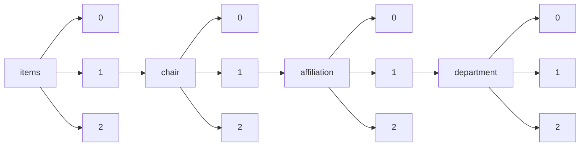

!!! warning "This document is not official Crossref documentation"
# Elements
PATH = items/array/chair/array/affiliation/array/department/array(1)  
Occurs 40 times  
Unique values: 16  
{ .annotate }

1. A route to an element, for example:  
   The route "items/array/chair/array/affiliation/array/department/array" corresponds to navigating through the JSON indices as  
   ["items"][0]["chair"][0]["affiliation"][0]["department"][0]  

| **Row** | **Value** `String`                     | **Count** `Int64` |
|--------:|------------------------------------------:|---------------------:|
| **1**   | Pediatrics and Obstetrics & Gynecology    | 18                   |
| **2**   | Radiology                                 | 5                    |
| **3**   | Thoracic Imaging                          | 2                    |
| **4**   | Imaging                                   | 2                    |
| **5**   | Musculoskeletal                           | 2                    |
| **6**   | Pediatrics and Obstetrics & Gynecologyt   | 1                    |
| **7**   | Abdominal Imaging                         | 1                    |
| **8**   | Radiology and Imaging Sciences            | 1                    |
| **9**   | Radiation Oncology                        | 1                    |
| **10**  | Cancer Imaging                            | 1                    |
| **11**  | Pediatric Radiology                       | 1                    |
| **12**  | Medical Imaging                           | 1                    |
| **13**  | Breast Imaging                            | 1                    |
| **14**  | Abdominal Imaging & Intervention          | 1                    |
| **15**  | Neuroradiology                            | 1                    |
| **16**  | Pediatrics and Obstetrics, and Gynecology | 1                    |

