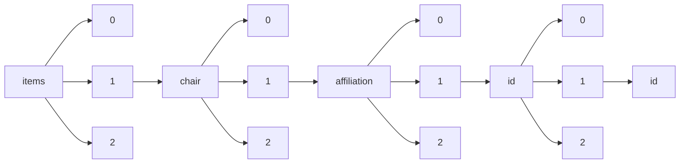

!!! warning "This document is not official Crossref documentation"
# Id
PATH = items/array/chair/array/affiliation/array/id/array/id(1)  
Occurs 9 times  
Unique values: 8  
{ .annotate }

1. A route to an element, for example:  
   The route "items/array/chair/array/affiliation/array/id/array/id" corresponds to navigating through the JSON indices as  
   ["items"][0]["chair"][0]["affiliation"][0]["id"][0]["id"]  

| **Row** | **Value** `String`     | **Count** `Int64` |
|--------:|--------------------------:|---------------------:|
| **1**   | https://ror.org/03cjece29 | 2                    |
| **2**   | https://ror.org/02dn9h927 | 1                    |
| **3**   | https://ror.org/01anxqg21 | 1                    |
| **4**   | https://ror.org/00x5je630 | 1                    |
| **5**   | https://ror.org/001w4ps18 | 1                    |
| **6**   | https://ror.org/00j0x9b96 | 1                    |
| **7**   | https://ror.org/05bp8ka05 | 1                    |
| **8**   | https://ror.org/01d1z8s73 | 1                    |

