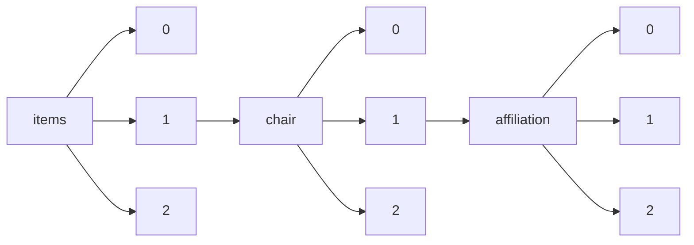

!!! warning "This document is not official Crossref documentation"
# Elements
PATH = items/array/chair/array/affiliation/array(1)  
Occurs 4 961 times  
{ .annotate }

1. A route to an element, for example:  
   The route "items/array/chair/array/affiliation/array" corresponds to navigating through the JSON indices as  
   ["items"][0]["chair"][0]["affiliation"][0]  

## Department
See more information: [items/array/chair/array/affiliation/array/department](department/index.md)  
Occurs 40 timess  

| **Row** | **Length** `Any` | **Count** `Int64` |
|--------:|--------------------:|---------------------:|
| **1**   | 1                   | 40                   |

## Id
See more information: [items/array/chair/array/affiliation/array/id](id/index.md)  
Occurs 9 timess  

| **Row** | **Length** `Any` | **Count** `Int64` |
|--------:|--------------------:|---------------------:|
| **1**   | 1                   | 9                    |

## Name
See more information: [items/array/chair/array/affiliation/array/name](name/index.md)  
Occurs 4 960 timess  
Unique values: > 999  

!!! note "Due to current limitations, only the first 1,000 unique values are counted."

| **Row** | **Value** `String`      | **Count** `Int64` |
|--------:|---------------------------:|---------------------:|
| **1**   | Pennsylvania State U.      | 47                   |
| **2**   | U. of Michigan             | 42                   |
| **3**   | Cornell U.                 | 41                   |
| **4**   | Washington U. in St. Louis | 38                   |
| **5**   | Boston College             | 36                   |
| **6**   | INSEAD                     | 34                   |
| **7**   | University of Washington   | 32                   |
| **8**   | Harvard U.                 | 32                   |
| **9**   | Case Western Reserve U.    | 30                   |
| **10**  | U. of Southern California  | 28                   |
| ... | ... | ... |

