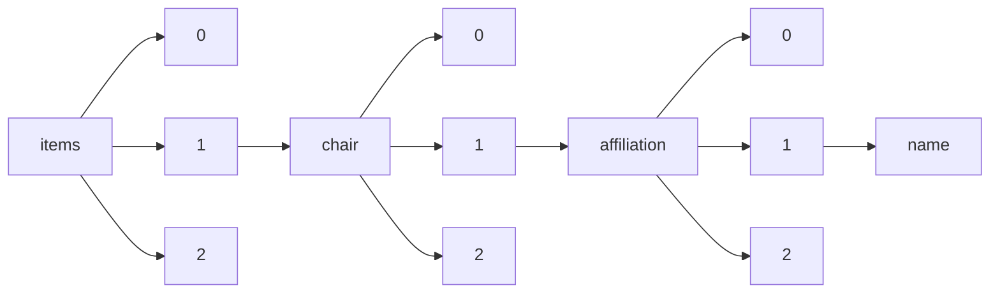

!!! warning "This document is not official Crossref documentation"
# Name
PATH = items/array/chair/array/affiliation/array/name(1)  
Occurs 4 960 times  
Unique values: > 999  
{ .annotate }

1. A route to an element, for example:  
   The route "items/array/chair/array/affiliation/array/name" corresponds to navigating through the JSON indices as  
   ["items"][0]["chair"][0]["affiliation"][0]["name"]  

!!! note "Due to current limitations, only the first 1,000 unique values are counted."

| **Row** | **Value** `String`                                                                                | **Count** `Int64` |
|--------:|-----------------------------------------------------------------------------------------------------:|---------------------:|
| **1**   | Pennsylvania State U.                                                                                | 47                   |
| **2**   | U. of Michigan                                                                                       | 42                   |
| **3**   | Cornell U.                                                                                           | 41                   |
| **4**   | Washington U. in St. Louis                                                                           | 38                   |
| **5**   | Boston College                                                                                       | 36                   |
| **6**   | INSEAD                                                                                               | 34                   |
| **7**   | University of Washington                                                                             | 32                   |
| **8**   | Harvard U.                                                                                           | 32                   |
| **9**   | Case Western Reserve U.                                                                              | 30                   |
| **10**  | U. of Southern California                                                                            | 28                   |
| **11**  | U. of Toronto                                                                                        | 28                   |
| **12**  | American U. of Beirut                                                                                | 27                   |
| **13**  | Le Bonheur Children’s Hospital                                                                       | 27                   |
| **14**  | University of Tennessee Health Science Center                                                        | 26                   |
| **15**  | Copenhagen Business School                                                                           | 26                   |
| **16**  | Michigan State U.                                                                                    | 26                   |
| **17**  | New York U.                                                                                          | 26                   |
| **18**  | U. of Georgia                                                                                        | 25                   |
| **19**  | U. of Central Florida                                                                                | 25                   |
| **20**  | Northeastern U.                                                                                      | 24                   |
| **21**  | U. of Michigan, Ann Arbor                                                                            | 24                   |
| **22**  | U. of Minnesota                                                                                      | 24                   |
| **23**  | London Business School                                                                               | 23                   |
| **24**  | Rutgers U.                                                                                           | 23                   |
| **25**  | Duke U.                                                                                              | 23                   |
| **26**  | Stanford U.                                                                                          | 22                   |
| **27**  | Columbia Business School                                                                             | 20                   |
| **28**  | U. of Pennsylvania                                                                                   | 20                   |
| **29**  | Harvard Business School                                                                              | 20                   |
| **30**  | U. of California, Berkeley                                                                           | 20                   |
| **31**  | National U. of Singapore                                                                             | 20                   |
| **32**  | Institute of Slavic Studies of the Russian Academy of Sciences                                       | 19                   |
| **33**  | Arizona State U.                                                                                     | 19                   |
| **34**  | U. of Alberta                                                                                        | 19                   |
| **35**  | Hasso-Plattner Institute, Germany                                                                    | 18                   |
| **36**  | Columbia U.                                                                                          | 17                   |
| **37**  | Massachusetts Institute of Technology                                                                | 17                   |
| **38**  | Carnegie Mellon University                                                                           | 17                   |
| **39**  | The Wharton School, U. of Pennsylvania                                                               | 16                   |
| **40**  | McGill U.                                                                                            | 16                   |
| **41**  | U. of Western Australia                                                                              | 16                   |
| **42**  | U. of Cincinnati                                                                                     | 16                   |
| **43**  | ETH Zurich                                                                                           | 16                   |
| **44**  | Erasmus U. Rotterdam                                                                                 | 15                   |
| **45**  | U. of Arizona                                                                                        | 15                   |
| **46**  | U. of Maryland                                                                                       | 15                   |
| **47**  | Sterlitamak Branch of FSBEI of HE "Bashkir State University"                                         | 15                   |
| **48**  | Stanford GSB                                                                                         | 15                   |
| **49**  | Hebrew U. of Jerusalem                                                                               | 14                   |
| **50**  | U. of Victoria                                                                                       | 14                   |
| **51**  | U. of Amsterdam                                                                                      | 14                   |
| **52**  | FSFEI of HE "Financial University under the Government of the Russian Federation"                    | 14                   |
| **53**  | Institute of Biomedical Chemistry                                                                    | 14                   |
| **54**  | York U.                                                                                              | 14                   |
| **55**  | Technion Israel Institute of Technology                                                              | 14                   |
| **56**  | U. of Zurich                                                                                         | 13                   |
| **57**  | George Washington U.                                                                                 | 13                   |
| **58**  | Brigham Young U.                                                                                     | 13                   |
| **59**  | KU Leuven                                                                                            | 13                   |
| **60**  | U. of Cambridge                                                                                      | 13                   |
| **61**  | FGBOU VO &quot;Samarskii gosudarstvennyi ekonomicheskii universitet&quot;                            | 13                   |
| **62**  | Kharkiv Medical Academy of Postgraduate Education, Ukraine                                           | 13                   |
| **63**  | Drexel U.                                                                                            | 12                   |
| **64**  | A.N. Bach Institute of Biochemistry, Research Center of Biotechnology of the Russian Academy of Scie | 12                   |
| **65**  | Simon Fraser U.                                                                                      | 12                   |
| **66**  | Northwestern U.                                                                                      | 12                   |
| **67**  | IESE Business School                                                                                 | 12                   |
| **68**  | North Carolina State University                                                                      | 12                   |
| **69**  | Wilfrid Laurier U.                                                                                   | 12                   |
| **70**  | The Wharton School, U. of Pennsylvania"                                                              | 11                   |
| **71**  | Tilburg U.                                                                                           | 11                   |
| **72**  | U. of Queensland                                                                                     | 11                   |
| **73**  | The Ohio State U.                                                                                    | 11                   |
| **74**  | Georgia State U.                                                                                     | 11                   |
| **75**  | Cranfield U.                                                                                         | 11                   |
| **76**  | U. of St. Gallen                                                                                     | 11                   |
| **77**  | Lomonosov Moscow State University                                                                    | 10                   |
| **78**  | Boston U.                                                                                            | 10                   |
| **79**  | FSBEI of HE "Tula State Lev Tolstoy Pedagogical University"                                          | 10                   |
| **80**  | Virginia Tech                                                                                        | 10                   |
| **81**  | Texas A&amp;M U.                                                                                     | 10                   |
| **82**  | U. of Wisconsin, Madison                                                                             | 10                   |
| **83**  | Brandeis U.                                                                                          | 10                   |
| **84**  | George Mason U.                                                                                      | 10                   |
| **85**  | U. of Oregon                                                                                         | 9                    |
| **86**  | Oregon State U.                                                                                      | 9                    |
| **87**  | FSBEI of HE &quot;Kuban State Agrarian University named after I.T. Trubilin&quot;                    | 9                    |
| **88**  | U. of Illinois at Urbana-Champaign                                                                   | 9                    |
| **89**  | Bocconi U.                                                                                           | 9                    |
| **90**  | U. of Arkansas                                                                                       | 9                    |
| **91**  | U. of Connecticut                                                                                    | 9                    |
| **92**  | U. of British Columbia                                                                               | 9                    |
| **93**  | Florida International U.                                                                             | 9                    |
| **94**  | Carnegie Mellon U.                                                                                   | 9                    |
| **95**  | Nanyang Technological U.                                                                             | 9                    |
| **96**  | University of California, San Diego                                                                  | 9                    |
| **97**  | VU U. Amsterdam                                                                                      | 9                    |
| **98**  | Dartmouth College                                                                                    | 8                    |
| **99**  | IBM                                                                                                  | 8                    |
| **100** | U. of North Carolina, Chapel Hill                                                                    | 8                    |
| **101** | Stanford University                                                                                  | 8                    |
| **102** | Bệnh viện Việt Đức                                                                                   | 8                    |
| **103** | WU Vienna U. of Economics and Business                                                               | 8                    |
| **104** | Federal State Budgetary Scientific Institution Federal Research Centre of Nutrition, Biotechnology a | 8                    |
| **105** | Griffith U.                                                                                          | 8                    |
| **106** | FSFEI of HE "Katanov Khakass State University"                                                       | 8                    |
| **107** | U. of Florida                                                                                        | 8                    |
| **108** | Aalto U.                                                                                             | 8                    |
| **109** | U. of South Carolina                                                                                 | 8                    |
| **110** | University of North Carolina at Charlotte                                                            | 8                    |
| **111** | U. of California, Irvine                                                                             | 8                    |
| **112** | Benedictine U.                                                                                       | 8                    |
| **113** | The U. of Texas at Austin                                                                            | 8                    |
| **114** | FGOBU VO "Finansovyi universitet pri Pravitel'stve Rossiiskoi Federatsii"                            | 8                    |
| **115** | Rice U.                                                                                              | 7                    |
| **116** | Oklahoma State U.                                                                                    | 7                    |
| **117** | U. of Colorado, Boulder                                                                              | 7                    |
| **118** | U. of Twente                                                                                         | 7                    |
| **119** | Resource Center "The Sechenov Pre-University" of SBEI of HE "I.M. Sechenov First Moscow State Medica | 7                    |
| **120** | Purdue U.                                                                                            | 7                    |
| **121** | U. of Warwick                                                                                        | 7                    |
| **122** | Southern Methodist U.                                                                                | 7                    |
| **123** | Arizona State University                                                                             | 7                    |
| **124** | MEI "P.A. Stolypin School №21"                                                                       | 7                    |
| **125** | Florida State U.                                                                                     | 7                    |
| **126** | Northern Illinois U.                                                                                 | 7                    |
| **127** | Woodbury U.                                                                                          | 7                    |
| **128** | U. of Kansas                                                                                         | 7                    |
| **129** | Taras Shevchenko National University of Kyiv                                                         | 7                    |
| **130** | U. of Mississippi                                                                                    | 7                    |
| **131** | Old Dominion U.                                                                                      | 7                    |
| **132** | U. of Bath                                                                                           | 7                    |
| **133** | FSBEI of HE “Samara State University of Economics”                                                   | 7                    |
| **134** | Pacific National University                                                                          | 7                    |
| **135** | Cass Business School, City U. London                                                                 | 7                    |
| **136** | ESSEC Business School                                                                                | 7                    |
| **137** | U. of the Pacific                                                                                    | 7                    |
| **138** | Babson College                                                                                       | 7                    |
| **139** | The U. of Melbourne                                                                                  | 7                    |
| **140** | Microsoft                                                                                            | 7                    |
| **141** | Rollins College                                                                                      | 7                    |
| **142** | U. of Washington, Tacoma                                                                             | 6                    |
| **143** | Seattle U.                                                                                           | 6                    |
| **144** | State Research Institute for Genetics and Selection of Industrial Microorganisms of National Researc | 6                    |
| **145** | Wayne State U.                                                                                       | 6                    |
| **146** | U. of Houston                                                                                        | 6                    |
| **147** | Harvard Medical School                                                                               | 6                    |
| **148** | Chapman U.                                                                                           | 6                    |
| **149** | CISPA Helmholtz Center i.G.                                                                          | 6                    |
| **150** | Hong Kong U. of Science and Technology                                                               | 6                    |
| **151** | U. of Utah                                                                                           | 6                    |
| **152** | German Graduate School of Management &amp; Law (GGS)                                                 | 6                    |
| **153** | Thunderbird School of Global Management at ASU                                                       | 6                    |
| **154** | U. of Calgary                                                                                        | 6                    |
| **155** | U. of Waterloo                                                                                       | 6                    |
| **156** | U. of South Florida                                                                                  | 6                    |
| **157** | Fordham U.                                                                                           | 6                    |
| **158** | Yonsei University                                                                                    | 6                    |
| **159** | Altai State University                                                                               | 6                    |
| **160** | FGBOU VO "Samarskii gosudarstvennyi ekonomicheskii universitet"                                      | 6                    |
| **161** | Aarhus U.                                                                                            | 6                    |
| **162** | Colorado State U.                                                                                    | 6                    |
| **163** | Kent State U.                                                                                        | 6                    |
| **164** | Durham U.                                                                                            | 6                    |
| **165** | Portland State U.                                                                                    | 6                    |
| **166** | Ivey Business School                                                                                 | 6                    |
| **167** | London School of Economics                                                                           | 6                    |
| **168** | U. of Wisconsin, Milwaukee                                                                           | 6                    |
| **169** | Google                                                                                               | 6                    |
| **170** | Deakin U.                                                                                            | 6                    |
| **171** | Yale U.                                                                                              | 6                    |
| **172** | Georgia Institute of Technology                                                                      | 6                    |
| **173** | Western U.                                                                                           | 6                    |
| **174** | Primakov National Research Institute of World Economy and International Relations, Russian Academy o | 6                    |
| **175** | IMD                                                                                                  | 6                    |
| **176** | Monash U.                                                                                            | 6                    |
| **177** | Concordia U.                                                                                         | 6                    |
| **178** | Union County College                                                                                 | 5                    |
| **179** | U. of Notre Dame                                                                                     | 5                    |
| **180** | U. of Louisville                                                                                     | 5                    |
| **181** | Illinois State U.                                                                                    | 5                    |
| **182** | College of Charleston                                                                                | 5                    |
| **183** | Singapore Management U.                                                                              | 5                    |
| **184** | U. of Illinois at Chicago                                                                            | 5                    |
| **185** | Santa Clara U.                                                                                       | 5                    |
| **186** | NEOMA Business School                                                                                | 5                    |
| **187** | Rochester Institute of Technology                                                                    | 5                    |
| **188** | HEC Paris                                                                                            | 5                    |
| **189** | U. of North Carolina, Charlotte                                                                      | 5                    |
| **190** | U. of Massachusetts, Boston                                                                          | 5                    |
| **191** | Auckland U. of Technology                                                                            | 5                    |
| **192** | Kharkiv National Medical University                                                                  | 5                    |
| **193** | City U. of New York, Baruch College                                                                  | 5                    |
| **194** | The College of New Jersey                                                                            | 5                    |
| **195** | SBEI of HPE "I.M. Sechenov First Moscow State Medical University" of Ministry of Healthcare of the R | 5                    |
| **196** | FGBOU VO &quot;Moskovskii gosudarstvennyi psikhologo-pedagogicheskii universitet&quot;               | 5                    |
| **197** | Baker College                                                                                        | 5                    |
| **198** | McMaster U.                                                                                          | 5                    |
| **199** | National Technical University of Ukraine “Igor Sikorsky Kyiv Polytechnic Institute”                  | 5                    |
| **200** | U. of Miami                                                                                          | 5                    |
| **201** | Kharkiv National Medical University, Ukraine                                                         | 5                    |
| **202** | U. of Memphis                                                                                        | 5                    |
| **203** | U. of Maryland, College Park                                                                         | 5                    |
| **204** | Melbourne U.                                                                                         | 5                    |
| **205** | Vanderbilt U.                                                                                        | 5                    |
| **206** | Uppsala U.                                                                                           | 5                    |
| **207** | U. of Tennessee, Knoxville                                                                           | 5                    |
| **208** | California Polytechnic State U.                                                                      | 5                    |
| **209** | Suffolk U.                                                                                           | 4                    |
| **210** | U. of Illinois, Urbana-Champaign                                                                     | 4                    |
| **211** | Microsoft Research                                                                                   | 4                    |
| **212** | Baruch College-The City U. of New York                                                               | 4                    |
| **213** | Chinese Academy of Sciences                                                                          | 4                    |
| **214** | CWI                                                                                                  | 4                    |
| **215** | U. of New Hampshire                                                                                  | 4                    |
| **216** | Catalyst                                                                                             | 4                    |
| **217** | U. of Virginia                                                                                       | 4                    |
| **218** | FSAEI of HE “Immanuel Kant Baltic Federal University”                                                | 4                    |
| **219** | Entrepreneurship Northwest                                                                           | 4                    |
| **220** | U. of Washington                                                                                     | 4                    |
| **221** | NC State University                                                                                  | 4                    |
| **222** | Purdue U., West Lafayette                                                                            | 4                    |
| **223** | FSBEI of HE “The Russian Presidential Academy of National Economy and Public Administration”         | 4                    |
| **224** | Carnegie Mellon U. - Tepper School of Business                                                       | 4                    |
| **225** | Australian National U.                                                                               | 4                    |
| **226** | Texas A&M University                                                                                 | 4                    |
| **227** | Quinnipiac U.                                                                                        | 4                    |
| **228** | Schulich School of Business                                                                          | 4                    |
| **229** | Chemical Faculty of Lomonosov Moscow State University, Department of Chemical Enzymology             | 4                    |
| **230** | Brunel U.                                                                                            | 4                    |
| **231** | U. of Oxford                                                                                         | 4                    |
| **232** | University of Calgary                                                                                | 4                    |
| **233** | FSEI of HE “Pacific State University”                                                                | 4                    |
| **234** | Claremont Graduate U.                                                                                | 4                    |
| **235** | FSBEI of HE “I.N. Ulianov Chuvash State University”                                                  | 4                    |
| **236** | Auburn U.                                                                                            | 4                    |
| **237** | U. College London                                                                                    | 4                    |
| **238** | U. of New South Wales                                                                                | 4                    |
| **239** | William Paterson U.                                                                                  | 4                    |
| **240** | FSBEI of HE &quot;Tula State Lev Tolstoy Pedagogical University&quot;                                | 4                    |
| **241** | The U. of Chicago                                                                                    | 4                    |
| **242** | U. of Melbourne                                                                                      | 4                    |
| **243** | Maastricht U.                                                                                        | 4                    |
| **244** | U. of San Diego                                                                                      | 4                    |
| **245** | U. of Iowa                                                                                           | 4                    |
| **246** | Grenoble Alps University                                                                             | 4                    |
| **247** | Grinnell College                                                                                     | 4                    |
| **248** | U. of Washington, Seattle                                                                            | 4                    |
| **249** | UC Berkeley                                                                                          | 4                    |
| **250** | U. of Geneva                                                                                         | 4                    |
| **251** | U. of Greenwich                                                                                      | 4                    |
| **252** | Indian School of Business                                                                            | 4                    |
| **253** | Baylor U.                                                                                            | 4                    |
| **254** | Temple U.                                                                                            | 4                    |
| **255** | U. of Delaware                                                                                       | 4                    |
| **256** | State Research Institute for Genetics and Selection of Industrial Microorganisms of National Researc | 4                    |
| **257** | Toulouse Business School                                                                             | 4                    |
| **258** | Plekhanov Russian University of Economics                                                            | 4                    |
| **259** | IE Business School                                                                                   | 4                    |
| **260** | WU Vienna                                                                                            | 4                    |
| **261** | Skidmore College                                                                                     | 4                    |
| **262** | Virginia Polytechnic Institute and State University                                                  | 4                    |
| **263** | FGBOU VO &quot;Krasnoiarskii gosudarstvennyi pedagogicheskii universitet im. V.P. Astaf'eva&quot;    | 4                    |
| **264** | Cardiff U.                                                                                           | 4                    |
| **265** | Ghent U.                                                                                             | 4                    |
| **266** | U. Adolfo Ibanez                                                                                     | 4                    |
| **267** | West Virginia U.                                                                                     | 4                    |
| **268** | State Research Institute for Genetics and Selection of Industrial Microorganisms of National Researc | 3                    |
| **269** | Emory University School of Medicine                                                                  | 3                    |
| **270** | FSBEI of HE "Krasnoyarsk State Pedagogical University named after V.P. Astafyev"                     | 3                    |
| **271** | U. of Passau                                                                                         | 3                    |
| **272** | Emory U.                                                                                             | 3                    |
| **273** | Xilinx, Inc.                                                                                         | 3                    |
| **274** | Georgia Southern U.                                                                                  | 3                    |
| **275** | U. at Buffalo, the State U. of New York                                                              | 3                    |
| **276** | FSAEI of HE "Far Eastern Federal University"                                                         | 3                    |
| **277** | Research and Production Center for Microbiology and Virology                                         | 3                    |
| **278** | V.N. Orekhovich Institute of Biomedical Chemistry                                                    | 3                    |
| **279** | -                                                                                                    | 3                    |
| **280** | U. of Massachusetts, Lowell                                                                          | 3                    |
| **281** | Winston-Salem State University                                                                       | 3                    |
| **282** | FSBEI of HE “Moscow Pedagogical State University”                                                    | 3                    |
| **283** | ESADE                                                                                                | 3                    |
| **284** | U. of North Carolina, Greensboro                                                                     | 3                    |
| **285** | Yale School of Management                                                                            | 3                    |
| **286** | University of South Carolina                                                                         | 3                    |
| **287** | Leninogorskii filial FGBOU VO &quot;Kazanskii natsional'nyi issledovatel'skii tekhnicheskii universi | 3                    |
| **288** | Indiana U.                                                                                           | 3                    |
| **289** | UCL                                                                                                  | 3                    |
| **290** | Concordia College                                                                                    | 3                    |
| **291** | Villanova U.                                                                                         | 3                    |
| **292** | Oakland U.                                                                                           | 3                    |
| **293** | PEI of HE "Kazan Innovative University named after V.G. Timiryasov"                                  | 3                    |
| **294** | Johns Hopkins University                                                                             | 3                    |
| **295** | HEC Montreal                                                                                         | 3                    |
| **296** | Virginia Commonwealth U.                                                                             | 3                    |
| **297** | Tsinghua University                                                                                  | 3                    |
| **298** | Kurchatov Institute National Research Center, Moscow, 123182, Russia                                 | 3                    |
| **299** | LLC «Research and Production Center for Microbiology and Virology»                                   | 3                    |
| **300** | Gamaleya Research Center for Epidemiology and Microbiology                                           | 3                    |
| **301** | University of California, Santa Barbara                                                              | 3                    |
| **302** | American U.                                                                                          | 3                    |
| **303** | New Mexico State U.                                                                                  | 3                    |
| **304** | Leeds U. Business School                                                                             | 3                    |
| **305** | University of Virginia                                                                               | 3                    |
| **306** | Queen's U.                                                                                           | 3                    |
| **307** | Bar-Ilan U.                                                                                          | 3                    |
| **308** | U. of Illinois Springfield                                                                           | 3                    |
| **309** | Institute for Analytical Instrumentation of the Russian Academy of Sciences                          | 3                    |
| **310** | Technion                                                                                             | 3                    |
| **311** | Southern Cross U.                                                                                    | 3                    |
| **312** | Oregon State University                                                                              | 3                    |
| **313** | The U. of Texas at San Antonio                                                                       | 3                    |
| **314** | U. of California, San Diego                                                                          | 3                    |
| **315** | State Research Institute for Genetics and Selection of Industrial Microorganisms of National Researc | 3                    |
| **316** | San Jose State U.                                                                                    | 3                    |
| **317** | Pirogov Russian National Research Medical University                                                 | 3                    |
| **318** | Lomonosov Moscow State University, Faculty of Chemistry                                              | 3                    |
| **319** | Tulane U.                                                                                            | 3                    |
| **320** | Indiana U., Bloomington                                                                              | 3                    |
| **321** | Oak Ridge National Laboratory                                                                        | 3                    |
| **322** | La Trobe U.                                                                                          | 3                    |
| **323** | FGAOU VO "Natsional'nyi issledovatel'skii iadernyi universitet "MIFI"                                | 3                    |
| **324** | U. of New Haven                                                                                      | 3                    |
| **325** | U. of Edinburgh                                                                                      | 3                    |
| **326** | Zayed U.                                                                                             | 3                    |
| **327** | Air Force Institute of Technology                                                                    | 3                    |
| **328** | Curtin U.                                                                                            | 3                    |
| **329** | UNSW Australia Business School                                                                       | 3                    |
| **330** | King's College London                                                                                | 3                    |
| **331** | Georgetown U.                                                                                        | 3                    |
| **332** | U. of Massachusetts Lowell                                                                           | 3                    |
| **333** | U. of Mannheim                                                                                       | 3                    |
| **334** | ESMT European School of Management and Technology                                                    | 3                    |
| **335** | U. of Richmond                                                                                       | 3                    |
| **336** | FSBEI of HE "Kuban State Agrarian University named after I.T. Trubilin"                              | 3                    |
| **337** | Erasmus Research Institute of Management                                                             | 3                    |
| **338** | Georgia Tech                                                                                         | 3                    |
| **339** | University of franche-Comte                                                                          | 3                    |
| **340** | UCL School of Management                                                                             | 3                    |
| **341** | Said Business School                                                                                 | 3                    |
| **342** | Texas A&amp;M U., College Station                                                                    | 3                    |
| **343** | Skolkovo Institute of Science and Technology                                                         | 3                    |
| **344** | Hofstra U.                                                                                           | 3                    |
| **345** | Government Institution "L. T. Malaya Therapy National Institute of the National Academy of Medical S | 3                    |
| **346** | Shemyakin-Ovchinnikov Institute of Bioorganic Chemistry, Russian Academy of Sciences                 | 3                    |
| **347** | Kharkiv Medical Academy of Postgraduate Education                                                    | 3                    |
| **348** | Salem State U.                                                                                       | 3                    |
| **349** | Saint Mary's College of California                                                                   | 3                    |
| **350** | U. of Tennessee                                                                                      | 3                    |
| **351** | University of Toronto                                                                                | 3                    |
| **352** | Alliant International U.                                                                             | 3                    |
| **353** | U. of Technology, Sydney                                                                             | 3                    |
| **354** | Don State Technical University                                                                       | 3                    |
| **355** | U. Bundeswehr, Munich                                                                                | 3                    |
| **356** | Warwick Business School                                                                              | 3                    |
| **357** | U. of Colorado Denver                                                                                | 3                    |
| **358** | U. of Liverpool                                                                                      | 3                    |
| **359** | University of Pennsylvania                                                                           | 3                    |
| **360** | United States Military Academy                                                                       | 3                    |
| **361** | DePaul U.                                                                                            | 3                    |
| **362** | University of California, Berkeley                                                                   | 3                    |
| **363** | Ohio State U.                                                                                        | 3                    |
| **364** | FSBEI of HE "Aramvir State Pedagogical University"                                                   | 3                    |
| **365** | U. of Roehampton                                                                                     | 3                    |
| **366** | Imperial College Business School                                                                     | 3                    |
| **367** | European U. Viadrina                                                                                 | 3                    |
| **368** | SUNY, Albany                                                                                         | 3                    |
| **369** | Ben-Gurion University of the Negev                                                                   | 3                    |
| **370** | Duquesne U.                                                                                          | 3                    |
| **371** | University of Augsburg                                                                               | 3                    |
| **372** | U. of Auckland                                                                                       | 3                    |
| **373** | Bar Ilan U.                                                                                          | 3                    |
| **374** | Rouen Business School                                                                                | 3                    |
| **375** | Conservation International                                                                           | 2                    |
| **376** | U. of Rhode Island                                                                                   | 2                    |
| **377** | Médica assistente e preceptora de ensino do Serviço de Reumatologia do Hospital do Servidor Público  | 2                    |
| **378** | University at Buffalo, The State University of New York                                              | 2                    |
| **379** | California State U., Fullerton                                                                       | 2                    |
| **380** | University at Buffalo                                                                                | 2                    |
| **381** | M.M. Shemyakin and Yu.A. Ovchinnikov Institute of Bioorganic Chemistry of the Russian Academy of Sci | 2                    |
| **382** | U. College Dublin                                                                                    | 2                    |
| **383** | The U. of Queensland, Australia                                                                      | 2                    |
| **384** | U. of Catania                                                                                        | 2                    |
| **385** | Royal Holloway/ U. of London                                                                         | 2                    |
| **386** | Onсostar Limited Liability Company, Institute of Chemical Biology and Fundamental Medicine SB RAS    | 2                    |
| **387** | RMIT U.                                                                                              | 2                    |
| **388** | Miami U. Ohio                                                                                        | 2                    |
| **389** | Victoria University of Wellington                                                                    | 2                    |
| **390** | Utah State U.                                                                                        | 2                    |
| **391** | U. of Missouri                                                                                       | 2                    |
| **392** | Texas Christian U.                                                                                   | 2                    |
| **393** | Institute of Bioengineering, Federal Research Centre “Fundamentals of Biotechnology” of the Russian  | 2                    |
| **394** | Queen Mary U. of London                                                                              | 2                    |
| **395** | Nyenrode Business U.                                                                                 | 2                    |
| **396** | FSBEI of HE &quot;Ulyanovsk State University of Education&quot;                                      | 2                    |
| **397** | Embry Riddle Aeronautical U.                                                                         | 2                    |
| **398** | U. of Chicago Booth School of business                                                               | 2                    |
| **399** | U. of Kentucky                                                                                       | 2                    |
| **400** | University of Amsterdam                                                                              | 2                    |
| **401** | University of North Carolina, Charlotte                                                              | 2                    |
| **402** | PwC                                                                                                  | 2                    |
| **403** | Vrije U. Brussel                                                                                     | 2                    |
| **404** | CSforALL                                                                                             | 2                    |
| **405** | Volga Region State University of Service                                                             | 2                    |
| **406** | Moscow State University, Faculty of Physics                                                          | 2                    |
| **407** | U. of New Mexico                                                                                     | 2                    |
| **408** | Newcastle U.                                                                                         | 2                    |
| **409** | Schwyz U. of Teacher Education                                                                       | 2                    |
| **410** | U. of Denver                                                                                         | 2                    |
| **411** | Howard University                                                                                    | 2                    |
| **412** | Karaganda State University named Y.A. Buketov                                                        | 2                    |
| **413** | Salem State University                                                                               | 2                    |
| **414** | U. of California, Los Angeles                                                                        | 2                    |
| **415** | Cornell                                                                                              | 2                    |
| **416** | Keck Graduate Institute                                                                              | 2                    |
| **417** | Thunderbird                                                                                          | 2                    |
| **418** | U. of Huddersfield                                                                                   | 2                    |
| **419** | University of Oldenburg                                                                              | 2                    |
| **420** | U. of Western Ontario                                                                                | 2                    |
| **421** | Delaware State U.                                                                                    | 2                    |
| **422** | Federal State Budgetary Educational Establishment of Higher Education "Orel State Agrarian Universit | 2                    |
| **423** | Morgan State U.                                                                                      | 2                    |
| **424** | NYU Stern                                                                                            | 2                    |
| **425** | Pace U.                                                                                              | 2                    |
| **426** | U. of Sheffield                                                                                      | 2                    |
| **427** | U. of Manchester                                                                                     | 2                    |
| **428** | Research Centre of Medical Genetics                                                                  | 2                    |
| **429** | Universidad de Buenos Aires                                                                          | 2                    |
| **430** | SEI of HE of MR "State University of Humanities and Technology"                                      | 2                    |
| **431** | The U. of Sheffield                                                                                  | 2                    |
| **432** | ConAgra Foods                                                                                        | 2                    |
| **433** | FSAEI of HE “Belgorod State National Research University”                                            | 2                    |
| **434** | U. of Nebraska                                                                                       | 2                    |
| **435** | Menlo College                                                                                        | 2                    |
| **436** | Oberlin College                                                                                      | 2                    |
| **437** | Siena College                                                                                        | 2                    |
| **438** | U. of Jyväskylä                                                                                      | 2                    |
| **439** | Dana-Farber Cancer Institute                                                                         | 2                    |
| **440** | The University of Texas MD Anderson Cancer Center Houston, TX                                        | 2                    |
| **441** | Dana-Farber Cancer Institute and Brigham Health                                                      | 2                    |
| **442** | Princeton U.                                                                                         | 2                    |
| **443** | Università degli Studi di Udine                                                                      | 2                    |
| **444** | Department of Chemistry, Lomonosov Moscow State University, Moscow, 119991, Russia                   | 2                    |
| **445** | Department of Biotechnology, Faculty of Technical Science                                            | 2                    |
| **446** | FGBOU VO "Severo-Osetinskii gosudarstvennyi universitet im. K.L. Khetagurova"                        | 2                    |
| **447** | U. of Pretoria                                                                                       | 2                    |
| **448** | Cornell University                                                                                   | 2                    |
| **449** | University of British Columbia                                                                       | 2                    |
| **450** | U. of Akron                                                                                          | 2                    |
| **451** | Pennsylvania State U., Erie                                                                          | 2                    |
| **452** | Educational Testing Service                                                                          | 2                    |
| **453** | Northwestern University                                                                              | 2                    |
| **454** | Alibaba Group                                                                                        | 2                    |
| **455** | Royal Holloway, University of London                                                                 | 2                    |
| **456** | Chumakov Federal Scientific Center for Research and Development of Immune-and-Biological Products, R | 2                    |
| **457** | University of Oxford                                                                                 | 2                    |
| **458** | Kuzbass Institute of the FPS of Russia                                                               | 2                    |
| **459** | Teachers College, Columbia U.                                                                        | 2                    |
| **460** | FBUN "Gosudarstvennyi nauchnyi tsentr prikladnoi mikrobiologii i biotekhnologii"                     | 2                    |
| **461** | ANOO VO Tsentrosoiuza RF &quot;Rossiiskii universitet kooperatsii&quot;                              | 2                    |
| **462** | University of Surrey                                                                                 | 2                    |
| **463** | Seoul National U.                                                                                    | 2                    |
| **464** | Vrije U. Amsterdam                                                                                   | 2                    |
| **465** | FSBEI of HE &quot;Don State Technical University&quot;                                               | 2                    |
| **466** | University of California, Irvine                                                                     | 2                    |
| **467** | U. of Colorado, Boulder"                                                                             | 2                    |
| **468** | Fox School of Business, Temple U.                                                                    | 2                    |
| **469** | BI Norwegian Business School                                                                         | 2                    |
| **470** | N. M. Emanuel Institute of Biochemical Physics of Russian Academy of Sciences                        | 2                    |
| **471** | U. of Michigan, Ross School of Business                                                              | 2                    |
| **472** | Luiss Guido Carli U.                                                                                 | 2                    |
| **473** | Lipetsk State Technical University                                                                   | 2                    |
| **474** | U. of St. Thomas                                                                                     | 2                    |
| **475** | U. of South Australia                                                                                | 2                    |
| **476** | Technische Universitat Dresden                                                                       | 2                    |
| **477** | EMLYON Business School                                                                               | 2                    |
| **478** | Darla Moore School of Business, U. of South Carolina                                                 | 2                    |
| **479** | U. of Southern Denmark                                                                               | 2                    |
| **480** | D. Mendeleev University of Chemical Technology of Russia                                             | 2                    |
| **481** | Univerisity of Chicago                                                                               | 2                    |
| **482** | U. of Massachusetts Amherst                                                                          | 2                    |
| **483** | FSBEI of HE &quot;Tolyatti State University&quot;                                                    | 2                    |
| **484** | Institute of Cytology and Genetics SB RAS                                                            | 2                    |
| **485** | CUNY                                                                                                 | 2                    |
| **486** | MIT/Aalto School of Business                                                                         | 2                    |
| **487** | Pepperdine Graziadio Business School                                                                 | 2                    |
| **488** | University of Illinois                                                                               | 2                    |
| **489** | University of Cagliari, Italy                                                                        | 2                    |
| **490** | The U. of Texas at Arlington                                                                         | 2                    |
| **491** | MIT Sloan                                                                                            | 2                    |
| **492** | Trinity International U.                                                                             | 2                    |
| **493** | FSBEI of HE “Novosibirsk State Pedagogical University”                                               | 2                    |
| **494** | Federal State Budgetary Educational Institution of Higher Education “Moscow State University of Food | 2                    |
| **495** | Federal Research Center - All-Russian Research Institute of Experimental Veterinary Medicine named a | 2                    |
| **496** | Municipal Non−Profit Enterprise of Kharkiv Regional Council "Regional Clinical Perinatal Center"     | 2                    |
| **497** | Australian National University                                                                       | 2                    |
| **498** | FSAEI of HE "Volgograd State University"                                                             | 2                    |
| **499** | Middle Tennessee State U.                                                                            | 2                    |
| **500** | Department of Business Administration, King Abdulaziz U. Jeddah, KSA"                                | 2                    |
| **501** | MBS College for Business and Entrepreneurship                                                        | 2                    |
| **502** | FSBEI of HE "Irkutsk State University"                                                               | 2                    |
| **503** | HITEC University, Texila, Pakistan.                                                                  | 2                    |
| **504** | FSFEI of HE "Kuban State University"                                                                 | 2                    |
| **505** | Hong Kong Polytechnic U.                                                                             | 2                    |
| **506** | Xavier U.                                                                                            | 2                    |
| **507** | University of Iowa                                                                                   | 2                    |
| **508** | Vienna U. of Technology                                                                              | 2                    |
| **509** | Johns Hopkins U.                                                                                     | 2                    |
| **510** | Institute of Mathematics and Information Science FSAEI of HE "M.K. Ammosov North-Eastern Federal Uni | 2                    |
| **511** | U. of Vienna                                                                                         | 2                    |
| **512** | Charles Sturt U.                                                                                     | 2                    |
| **513** | World-Class Research Centers “Digital biodesign and personalized healthcare”, Sechenov University    | 2                    |
| **514** | Volgograd State Medical University                                                                   | 2                    |
| **515** | Chinese U. of Hong Kong                                                                              | 2                    |
| **516** | FSAEI of HE "National Research Tomsk Polytechnic University"                                         | 2                    |
| **517** | Texas Tech U.                                                                                        | 2                    |
| **518** | U. of Nevada, Las Vegas                                                                              | 2                    |
| **519** | Keio University, Japan                                                                               | 2                    |
| **520** | Purdue University                                                                                    | 2                    |
| **521** | Leeds Beckett U.                                                                                     | 2                    |
| **522** | U. of Saskatchewan                                                                                   | 2                    |
| **523** | Cranfield School of Management                                                                       | 2                    |
| **524** | V. Serbsky National Medical Research Center for Psychiatry and Narcology                             | 2                    |
| **525** | FSBEI of HE "Southern Federal University"                                                            | 2                    |
| **526** | Technion - Israel Institute of Technology                                                            | 2                    |
| **527** | National Chiao Tung University                                                                       | 2                    |
| **528** | U. of Applied Sciences, Zurich                                                                       | 2                    |
| **529** | Open U. of Israel                                                                                    | 2                    |
| **530** | U. of St Andrews                                                                                     | 2                    |
| **531** | Indian Institute of Management, Bangalore                                                            | 2                    |
| **532** | IT-University of Copenhagen                                                                          | 2                    |
| **533** | Institute of Bioorganic Chemistry of National Academy of Sciences of Belarus                         | 2                    |
| **534** | Lehigh U.                                                                                            | 2                    |
| **535** | University of Chicago                                                                                | 2                    |
| **536** | Syracuse U.                                                                                          | 2                    |
| **537** | George Mason University                                                                              | 2                    |
| **538** | Moscow State University of Food Production                                                           | 2                    |
| **539** | State Research Center of Virology and Biotechnology “Vector” of Rospotrebnadzor                      | 2                    |
| **540** | The Hebrew U. of Jerusalem                                                                           | 2                    |
| **541** | Purdue U., Calumet                                                                                   | 2                    |
| **542** | The U. of Texas at Dallas                                                                            | 2                    |
| **543** | Telfer School of Management, U. of Ottawa                                                            | 2                    |
| **544** | U. of Modena and Reggio Emilia                                                                       | 2                    |
| **545** | University of Southern California                                                                    | 2                    |
| **546** | Radboud U. Nijmegen                                                                                  | 2                    |
| **547** | Wentworth Institute of Technology                                                                    | 2                    |
| **548** | M.V. Lomonosov Moscow State University                                                               | 2                    |
| **549** | UMD                                                                                                  | 2                    |
| **550** | U. of Utah, David Eccles School of Business                                                          | 2                    |
| **551** | Loughborough U.                                                                                      | 2                    |
| **552** | U. of Sussex                                                                                         | 2                    |
| **553** | Kyiv International University, Ukraine                                                               | 2                    |
| **554** | PARC                                                                                                 | 2                    |
| **555** | The U. of Hong Kong                                                                                  | 2                    |
| **556** | Chicago Booth School of Business                                                                     | 2                    |
| **557** | Lomonosov Moscow state University, Department of chemical Enzymology                                 | 2                    |
| **558** | Maharishi U.                                                                                         | 2                    |
| **559** | The George Washington U.                                                                             | 2                    |
| **560** | U. of Massachusetts Boston                                                                           | 2                    |
| **561** | State Research Institute of Highly Pure Biopreparations                                              | 2                    |
| **562** | Saint Mary's U.                                                                                      | 2                    |
| **563** | V. N. Karazin Kharkiv National University                                                            | 2                    |
| **564** | Oxford Journal Distinguished Research Professor                                                      | 2                    |
| **565** | Indiana University                                                                                   | 2                    |
| **566** | FSSFEI of HE "South Ural State University" (NRU)                                                     | 2                    |
| **567** | WU Vienna and INSEAD                                                                                 | 2                    |
| **568** | California State U. Sacramento                                                                       | 2                    |
| **569** | Kharkiv National Medical University; V. T. Zaitsev Institute of General and Emergency Surgery, Natio | 2                    |
| **570** | U. of Lugano                                                                                         | 2                    |
| **571** | Research Centre of Biotechnology of the Russian Academy of Sciences                                  | 2                    |
| **572** | U. of Illinois, Chicago                                                                              | 2                    |
| **573** | Wake Forest U.                                                                                       | 2                    |
| **574** | SI "V. T. Zaytsev Institute of General and Emergency Surgery of the National Academy of Medical Scie | 1                    |
| **575** | Joint-Stock Company “Ajinomoto Genetika Research Institute                                           | 1                    |
| **576** | University of Colorado Boulder                                                                       | 1                    |
| **577** | Apple                                                                                                | 1                    |
| **578** | Servicio Madrileño de Salud, España                                                                  | 1                    |
| **579** | IPAC Canada                                                                                          | 1                    |
| **580** | National University of Science and Technology MISiS,                                                 | 1                    |
| **581** | U. de los Andes                                                                                      | 1                    |
| **582** | Peking University                                                                                    | 1                    |
| **583** | Yunusov Institute of the Chemistry of Plant Substances, Academy of Sciences of Republic Uzbekistan,  | 1                    |
| **584** | Research Centre for Medical Genetics Moscow, 115552 Russia                                           | 1                    |
| **585** | State Research Center of Virology and Biotechnology "Vector", (SRC VB Vector), Federal Service for S | 1                    |
| **586** | Savannah College of Art & Design                                                                     | 1                    |
| **587** | Hitotsubashi U.                                                                                      | 1                    |
| **588** | FSBEI of HE &quot;Orenburg State University&quot;                                                    | 1                    |
| **589** | University of Montpellier LIRMM                                                                      | 1                    |
| **590** | Peoples Friendship University of Russia (RUDN University)                                            | 1                    |
| **591** | National Research Tomsk State University, Biological Institute                                       | 1                    |
| **592** | Sirab Technologies                                                                                   | 1                    |
| **593** | NTT Communication Science Laboratories, Japan                                                        | 1                    |
| **594** | U. of Texas At Arlington                                                                             | 1                    |
| **595** | Clemson U.                                                                                           | 1                    |
| **596** | Henley Business School                                                                               | 1                    |
| **597** | FSBEI HE "Herzen State Pedagogical University of Russia"                                             | 1                    |
| **598** | Rivne State University for the Humanities                                                            | 1                    |
| **599** | FSEI of HE "Saint-Petersburg State Chemical-Pharmaceutical University" Russian Federation Ministry o | 1                    |
| **600** | Northeastern State U.                                                                                | 1                    |
| **601** | Reserch Centre for Medical Genetics (RCMG), Moscow, 115478, Russia                                   | 1                    |
| **602** | Norwich Business School                                                                              | 1                    |
| **603** | Minnesota State Community and Technical College                                                      | 1                    |
| **604** | Athens U. of Economics and Business                                                                  | 1                    |
| **605** | Saarland U.                                                                                          | 1                    |
| **606** | UT Austin                                                                                            | 1                    |
| **607** | Ryerson U.                                                                                           | 1                    |
| **608** | University of Michigan, Ann Arbor                                                                    | 1                    |
| **609** | Kenya Agricultural & Livestock Research Organization.                                                | 1                    |
| **610** | FSBEI of HE "I.M. Gubkin Russian State University of Oil and Gas"                                    | 1                    |
| **611** | FSAEI of HE &quot;M.K. Ammosov North-Eastern Federal University&quot;                                | 1                    |
| **612** | Research Institute for Genetics and Selection of Industrial Microorganisms of National Research Cent | 1                    |
| **613** | St Ambrose U.                                                                                        | 1                    |
| **614** | MishMashMakers                                                                                       | 1                    |
| **615** | Centre of Planning and Economic Research (KEPE)                                                      | 1                    |
| **616** | Soil fertility Agriculture Department                                                                | 1                    |
| **617** | Symposium Chairperson, Cann-Care Company, Portland, OR, US                                           | 1                    |
| **618** | College of William and Mary, USA                                                                     | 1                    |
| **619** | FSBEI of HE &quot;G.I. Nosov Magnitogorsk State technical University&quot;                           | 1                    |
| **620** | Central University of Tamil Nadu                                                                     | 1                    |
| **621** | National University of Science and Technology MISIS                                                  | 1                    |
| **622** | Tashkent State Transport University                                                                  | 1                    |
| **623** | Augusta U.                                                                                           | 1                    |
| **624** | The Chinese University of Hong Kong                                                                  | 1                    |
| **625** | U. of Tuebingen                                                                                      | 1                    |
| **626** | Federal State Budget Scientific Institution “Federal Scientific Centre VIEV” (FSC VIEV)              | 1                    |
| **627** | Christian Brothers University                                                                        | 1                    |
| **628** | State Institution "V. T. Zaitsev Institute of General and Emergency Surgery of the National Academy  | 1                    |
| **629** | Faculty of Chemistry, Lomonosov Moscow State University, Moscow, 119991, Russia                      | 1                    |
| **630** | Timiryazev Institute of Plant Physiology, Russian Academy of Sciences (IPP RAS), Моscow, 127276 Russ | 1                    |
| **631** | Syracuse University                                                                                  | 1                    |
| **632** | FGBOU VO &quot;Rostovskii gosudarstvennyi ekonomicheskii universitet (RINKh)&quot;                   | 1                    |
| **633** | Karlshochschule International U.                                                                     | 1                    |
| **634** | FGBOU VO "MIREA - Rossiiskii tekhnologicheskii universitet"                                          | 1                    |
| **635** | N. M. Emanuel Institute of Biochemical Physics, Russian Academy of Sciences                          | 1                    |
| **636** | Institute for Simulation &amp; Training, UCF                                                         | 1                    |
| **637** | Technische Universitt Dresden                                                                        | 1                    |
| **638** | SI National Scientific Center "M. D. Strazhesko Institute of Cardiology of the National Academy of M | 1                    |
| **639** | Vyatka State University, Kirov, 610000 Russia                                                        | 1                    |
| **640** | United States Air Force Academy                                                                      | 1                    |
| **641** | FSAEI of HE "V.I. Vernadsky Crimean Federal University"                                              | 1                    |
| **642** | Pedagogicheskii kolledzh "Cheremushki" GBOU VO "Moskovskii gorodskoi pedagogicheskii universitet"    | 1                    |
| **643** | Queen's U. of Charlotte                                                                              | 1                    |
| **644** | University of Ljubljana                                                                              | 1                    |
| **645** | Pennsylvania State U./Tilburg U.                                                                     | 1                    |
| **646** | Wayne State University                                                                               | 1                    |
| **647** | Max Stern Jezreel Valley College                                                                     | 1                    |
| **648** | Laboratoire d’Alimentation, Transformation, Contrôle etValorisation des Agroressources, Ecole Supéri | 1                    |
| **649** | Shemyakin-Ovchinnikov Institute ofBioorganic Chemistry, Russian Academy of Sciences, Moscow, 117997  | 1                    |
| **650** | Serbsky Federal Medical Research Center for Psychiatry and Narcology,Mental-health Clinic No. 1 Name | 1                    |
| **651** | National University of Singapore                                                                     | 1                    |
| **652** | GKOU VO "Rossiiskaia tamozhennaia akademiia"                                                         | 1                    |
| **653** | Faculty of Biology and Biotechnology, National Research University Higher School of Economics, Mosco | 1                    |
| **654** | Sukachev Institute of Forest SB RAS Federal Research Center «Krasnoyarsk Science Center SB RAS», Res | 1                    |
| **655** | Federal Government Health Institution «Stavropol Plague Control Research Institute» of Federal Servi | 1                    |
| **656** | University of Arizona College of Medicine                                                            | 1                    |
| **657** | Booz &amp; Company                                                                                   | 1                    |
| **658** | University of Minnesota                                                                              | 1                    |
| **659** | National Medical Research Center of Surgery named after A. V. Vishnevsky, Ministry of Health of the  | 1                    |
| **660** | IT University of Copenhagen, Denmark                                                                 | 1                    |
| **661** | Texas A&M U., College Station"                                                                       | 1                    |
| **662** | University of Bath                                                                                   | 1                    |
| **663** | N. F. Gamaleya National Research Center of Epidemiology and Microbiology, Ministry of Health of the  | 1                    |
| **664** | FGBOU VO "Sibirskii gosudarstvennyi industrial'nyi universitet"                                      | 1                    |
| **665** | Tsybenova                                                                                            | 1                    |
| **666** | The Federal Research Centre “Fundamentals of Biotechnology” of the Russian Academy of Sciences       | 1                    |
| **667** | Bauman Moscow State Technical University, Moscow, 105005, Russia; Institute for theoretical and appl | 1                    |
| **668** | San Diego State U.                                                                                   | 1                    |
| **669** | Valent Biosciences Corporation, Long Grove, IL, US                                                   | 1                    |
| **670** | FGBOU VO "Sankt-Peterburgskii gosudarstvennyi institut kul'tury"                                     | 1                    |
| **671** | FGBOU VO "Tambovskii gosudarstvennyi universitet im. G.R. Derzhavina"                                | 1                    |
| **672** | Trident University                                                                                   | 1                    |
| **673** | KidZ Health Castle, University Hospital Brussels, (UZ Brussel), Belgium; Free University of Brussels | 1                    |
| **674** | Federal University of Minas Gerais                                                                   | 1                    |
| **675** | Grenoble Ecole de Management                                                                         | 1                    |
| **676** | Idaho State U.                                                                                       | 1                    |
| **677** | University of the Punjab, Lahore                                                                     | 1                    |
| **678** | TU Delft                                                                                             | 1                    |
| **679** | Queen's School of Business, Canada                                                                   | 1                    |
| **680** | King's College                                                                                       | 1                    |
| **681** | Justus-Liebig U. Giessen                                                                             | 1                    |
| **682** | City University of London                                                                            | 1                    |
| **683** | Symantec Research Labs                                                                               | 1                    |
| **684** | Rutgers U., School of Management and Labor Relations"                                                | 1                    |
| **685** | LMU Munich                                                                                           | 1                    |
| **686** | S.N. Vinogradsky Institute of Microbiology, FRC Biotechnology RAS                                    | 1                    |
| **687** | Federal State Budgetary Scientific Institution "Research Institute of Biomedical Chemistry named aft | 1                    |
| **688** | FGBNU "Institut eksperimental'noi meditsiny"                                                         | 1                    |
| **689** | University of Tennessee                                                                              | 1                    |
| **690** | Peking U.                                                                                            | 1                    |
| **691** | City University, UK                                                                                  | 1                    |
| **692** | Federal Williams Research Center of Forage Production & Agroecology, Moscow region, Lobnya, 141055 R | 1                    |
| **693** | (1) KAIST & (2) Yonsei University                                                                    | 1                    |
| **694** | Indian Institute of Engineering Science and Technology, Shibpur                                      | 1                    |
| **695** | Ohio State University                                                                                | 1                    |
| **696** | Manchester Business School                                                                           | 1                    |
| **697** | Federal State Budgetary Educational Institution of Higher Education «St. Petersburg State University | 1                    |
| **698** | Military Medical Academy named after S.M. Kirov                                                      | 1                    |
| **699** | Texas State University                                                                               | 1                    |
| **700** | U. of Nottingham, UK                                                                                 | 1                    |
| **701** | Lomonosov Moscow State University, Emanuel Institute of Biochemical Physics RAS                      | 1                    |
| **702** | Closed Joint-Stock Company Ajinomoto-Genetika Research Institute (AGRI), 117545 Moscow Russia        | 1                    |
| **703** | The Pennsylvania State University                                                                    | 1                    |
| **704** | Surrey Business School                                                                               | 1                    |
| **705** | Russian Scientific Research Institute of Food Biotechnology, Branch of the Federal Research Center f | 1                    |
| **706** | IAE Business School Argentina                                                                        | 1                    |
| **707** | Тula State University, Tula, 300012, Russia                                                          | 1                    |
| **708** | Nottingham U. Business School China                                                                  | 1                    |
| **709** | Institute of State Public Service and Governance FSBEI of HE «The Russian Presidential Academy of Na | 1                    |
| **710** | OFFIS Institute for Information Technology                                                           | 1                    |
| **711** | City U. London                                                                                       | 1                    |
| **712** | G.K. Skryabin Institute of Biochemistry and Physiology of Microorganisms, Russian Academy of Science | 1                    |
| **713** | U. of California, Irvine"                                                                            | 1                    |
| **714** | U. of Texas, Austin                                                                                  | 1                    |
| **715** | N.M. Emanuel Institute of Biochemical Physics of Russian Academy of Sciences                         | 1                    |
| **716** | Portsmouth Business School                                                                           | 1                    |
| **717** | SRC Armbiotechnology, National Academy of Sciences of Republic of Armenia, Yerevan, 0056 Armenia     | 1                    |
| **718** | FGBOU VO "Nizhegorodskii gosudarstvennyi lingvisticheskii universitet im. N.A. Dobroliubova"         | 1                    |
| **719** | Severo-Zapadnyi institut upravleniia FGBOU VO "Rossiiskaia akademiia narodnogo khoziaistva i gosudar | 1                    |
| **720** | Swinburne University of Technology                                                                   | 1                    |
| **721** | Federal Research Centre of Nutrition, Biotechnology and Food Safety                                  | 1                    |
| **722** | Universidad de Cuenca, Ecuador                                                                       | 1                    |
| **723** | Institut estestvennykh nauk FGAOU VO "Severo-Vostochnyi federal'nyi universitet im. M.K. Ammosova"   | 1                    |
| **724** | Chalmers University of Technology                                                                    | 1                    |
| **725** | Saarland University                                                                                  | 1                    |
| **726** | The University of Ottawa                                                                             | 1                    |
| **727** | LSE                                                                                                  | 1                    |
| **728** | U. of Phoenix                                                                                        | 1                    |
| **729** | Weatherhead School of Management, Case Western Reserve U.                                            | 1                    |
| **730** | FGBOU VO "Rossiiskii gosudarstvennyi universitet im. A.N. Kosygina (Tekhnologii. Dizain. Iskusstvo)" | 1                    |
| **731** | USAF                                                                                                 | 1                    |
| **732** | IMDEA Networks Institute, Madrid, Spain                                                              | 1                    |
| **733** | Bioclinicum Scientific Research Center, Moscow, 115088, Russia                                       | 1                    |
| **734** | Russian Scientific Research Institute of Food Biotechnology - a branch of the Federal State Budget I | 1                    |
| **735** | Troyes University of Technology                                                                      | 1                    |
| **736** | Volly.it                                                                                             | 1                    |
| **737** | University of Pittsburgh, USA                                                                        | 1                    |
| **738** | Hospice and Palliative Care, Ohio Health Kobacker House, Columbus, Ohio.                             | 1                    |
| **739** | NYU Stern School of Business                                                                         | 1                    |
| **740** | SDA Bocconi                                                                                          | 1                    |
| **741** | Acadia U.                                                                                            | 1                    |
| **742** | CBS / RU                                                                                             | 1                    |
| **743** | U. of Illinois                                                                                       | 1                    |
| **744** | Royal Military Academy of Belgium                                                                    | 1                    |
| **745** | UESTC                                                                                                | 1                    |
| **746** | Federal State Budgetary Scientific Institution "Federal Research Centre of Nutrition, Biotechnology  | 1                    |
| **747** | Catedras Conacyt                                                                                     | 1                    |
| **748** | Academy of the State Fire Service EMERCOM of Russia                                                  | 1                    |
| **749** | Federal State Budgetary Educational Institution of Higher Education “Moscow State Academy of Veterin | 1                    |
| **750** | U. Autónoma de Madrid                                                                                | 1                    |
| **751** | Donetsk National Technical University                                                                | 1                    |
| **752** | Lahore U. of Management Sciences                                                                     | 1                    |
| **753** | ACTNext & Associate Editor, ACM TOCE                                                                 | 1                    |
| **754** | Università IUAV di Venezia                                                                           | 1                    |
| **755** | Kirov Scientific Research Institute of Hematology and Blood Transfusion, Federal Medical and Biologi | 1                    |
| **756** | Macquarie U.                                                                                         | 1                    |
| **757** | University of Toronto Scarborough                                                                    | 1                    |
| **758** | The University of British Columbia                                                                   | 1                    |
| **759** | Federal Research Centre of Nutrition, Biotechnology and Food Safety», Moscow, 109240, Russia         | 1                    |
| **760** | Federal state budgetary institution "national medical research center of psychiatry and narcology na | 1                    |
| **761** | U. of York                                                                                           | 1                    |
| **762** | EBS Business School                                                                                  | 1                    |
| **763** | Wichita State U.                                                                                     | 1                    |
| **764** | Rider U.                                                                                             | 1                    |
| **765** | University of Missouri, Kansas City School of Medicine                                               | 1                    |
| **766** | Department of Chemistry, Institute of Pharmacy, SechenovFirstMoscow State Medical University, Moscow | 1                    |
| **767** | Laboratoire d'Informatique de Grenoble, CNRS                                                         | 1                    |
| **768** | Oregon State University, USA                                                                         | 1                    |
| **769** | Massey U.                                                                                            | 1                    |
| **770** | University of British Columbia, Canada                                                               | 1                    |
| **771** | U. of Gothenburg                                                                                     | 1                    |
| **772** | 1Higher School of Economics National Research University, Moscow, 109028, Russia 2Bioclinicum Scient | 1                    |
| **773** | Pushchino Research Center of Biological Researches, Russian Academy of Sciences, Pushchino, Moscow O | 1                    |
| **774** | Remote sensing and GIS group, Department of Space Science, University of the Punjab Lahore, Pakistan | 1                    |
| **775** | The U. of Toronto                                                                                    | 1                    |
| **776** | University of Haifa, Israel                                                                          | 1                    |
| **777** | Southwestern University                                                                              | 1                    |
| **778** | Indiana U.-Purdue U. Indianapolis                                                                    | 1                    |
| **779** | FGBOU VO "Omskii gosudarstvennyi pedagogicheskii universitet"                                        | 1                    |
| **780** | Darwin LLC                                                                                           | 1                    |
| **781** | Ewing Marion Kauffman Foundation                                                                     | 1                    |
| **782** | U. of Houston, Downtown                                                                              | 1                    |
| **783** | Budapest University of Technology and Economics                                                      | 1                    |
| **784** | Infosys Limited                                                                                      | 1                    |
| **785** | G.K. Skryabin Institute of Biochemistry and Physiology of Microorganisms, «Pushchino Scientific Cent | 1                    |
| **786** | PUCRS, School of Technology                                                                          | 1                    |
| **787** | Federal Research Center “Pushchino Scientific Center for Biological Research of the Russian Academy  | 1                    |
| **788** | Russian University of Transport                                                                      | 1                    |
| **789** | TNO                                                                                                  | 1                    |
| **790** | FGBOUN Institute of Bioorganic Chemistry named after Academicians M.M. Shemyakina and Yu.A. Ovchinni | 1                    |
| **791** | Universite Paris-Sud                                                                                 | 1                    |
| **792** | University of Wisconsin                                                                              | 1                    |
| **793** | Geisel School of Medicine at Dartmouth                                                               | 1                    |
| **794** | State Institution "V. T. Zaitsev Institute of General and Emergency Surgery of the National Academy  | 1                    |
| **795** | Federal State Institution «Federal Research Centre «Fundamentals of Biotechnology» of the Russian Ac | 1                    |
| **796** | Boston U. Questrom School of Business                                                                | 1                    |
| **797** | International Institute for Management Development                                                   | 1                    |
| **798** | Faculty of Chemistry, Lomonosov Moscow State University, N.M. Emanuel Institute of Biochemical Physi | 1                    |
| **799** | Institute of Fine Arts FSBEI of HE "Moscow State Pedagogical University"                             | 1                    |
| **800** | Kedge Business School                                                                                | 1                    |
| **801** | Altai State University, Barnaul, 656049, Russia                                                      | 1                    |
| **802** | UCF & Roy E. Crummer School of Business, Rollins College"                                            | 1                    |
| **803** | 1Shemyakin-Ovchinnikov Institute ofBioorganic Chemistry, Russian Academy of Sciences, Moscow, 117997 | 1                    |
| **804** | GOE/UNIAVAN                                                                                          | 1                    |
| **805** | L.K. Ernst Federal Science Center for Animal Husbandry, Podolsk, 142132, Russia                      | 1                    |
| **806** | The University of New South Wales                                                                    | 1                    |
| **807** | Public Non−Profit Organization of Kharkiv City Council "Regional Clinical Perinatal Center", Ukraine | 1                    |
| **808** | A.N. Bach Institute of Biochemistry, Federal Research Center "Fundamental Foundations of Biotechnolo | 1                    |
| **809** | Federal Research Center for Animal Husbandry named after Academy Member L.K. Ernst                   | 1                    |
| **810** | FGBOU VO "Brianskii gosudarstvennyi tekhnicheskii universitet"                                       | 1                    |
| **811** | Kingston U.                                                                                          | 1                    |
| **812** | Swinburne University                                                                                 | 1                    |
| **813** | Instituto de Empresa Business School                                                                 | 1                    |
| **814** | Lomonosov Moscow state university, faculty of chemistry, department of chemical enzymology           | 1                    |
| **815** | Georgia Institute of Technology, Atlanta, Georgia                                                    | 1                    |
| **816** | Federal State Autonomous Educational Institution of Higher Education "Far Eastern Federal University | 1                    |
| **817** | University of San Francisco                                                                          | 1                    |
| **818** | Cardinal Stefan Wyszyński University in Warsaw                                                       | 1                    |
| **819** | 1Fundamentals of Biotechnology, Federal Research Centre, Russian Academy of Sciences, Moscow, 119071 | 1                    |
| **820** | Melbourne Business School                                                                            | 1                    |
| **821** | St. Jude Children’s Research Hospital                                                                | 1                    |
| **822** | ANO of HE “Moscow Information Technology University – Moscow Architecture and Construction Institute | 1                    |
| **823** | 1Institute of Chemical Biology and Fundamental Medicine, Russian Academy of Sciences, Siberian Branc | 1                    |
| **824** | Curtin Uni                                                                                           | 1                    |
| **825** | Bioclinicum Scientific and Technical Center, Moscow, 115088 Russia; Shemyakin-Ovchinnikov Institute  | 1                    |
| **826** | U. of Witten/Herdecke                                                                                | 1                    |
| **827** | University of Port Harcourt                                                                          | 1                    |
| **828** | Université Paris-Sud, France                                                                         | 1                    |
| **829** | Osaka University, Japan                                                                              | 1                    |
| **830** | V. T. Zaitsev Institute of General and Emergency Surgery, National Academy of Medical Sciences of Uk | 1                    |
| **831** | Dominican U.                                                                                         | 1                    |
| **832** | .                                                                                                    | 1                    |
| **833** | Microsoft Research Cambridge                                                                         | 1                    |
| **834** | Genitourinary Medical Oncologist/Medical Director, Survivorship Program, Dana-Farber Cancer Institut | 1                    |
| **835** | Federal state budgetary organization of science “Federal research center of nutrition, biotechnology | 1                    |
| **836** | LLC «Pharmapark», Moscow, 117246 Russia                                                              | 1                    |
| **837** | Zonguldak Bulent Ecevit University, 67100 Zonguldak, Turkey                                          | 1                    |
| **838** | Royal Holloway                                                                                       | 1                    |
| **839** | FGHI «Russian Research Anti-Plague Institute «Microbe» of the Federal Service for Surveillance in th | 1                    |
| **840** | Lomonosov Moscow State University, Faculty of Chemistry, Department of Chemical Enzymology^ National | 1                    |
| **841** | Akademiia stroitel'stva i arkhitektury FGBOU VO "Donskoi gosudarstvennyi tekhnicheskii universitet"  | 1                    |
| **842** | U. Blaise Pascal                                                                                     | 1                    |
| **843** | Johannes Kepler U.                                                                                   | 1                    |
| **844** | Sochi Institute (branch) FSAEI HE Russian Peoples’ Friendship University                             | 1                    |
| **845** | JSC «Generium»                                                                                       | 1                    |
| **846** | Kaliningrad State Technical University                                                               | 1                    |
| **847** | The Far Eastern Higher Combined Arms Command Order of the Zhukov School named after Marshal of the S | 1                    |
| **848** | Volgo-Viatskii filial FGBOU VO "Moskovskii tekhnicheskii universitet sviazi i informatiki"           | 1                    |
| **849** | EURECOM                                                                                              | 1                    |
| **850** | Indian Institute of Management, Calcutta                                                             | 1                    |
| **851** | Federal Research Center of Biological Systems and Agrotechnologies of the Russian Academy of Science | 1                    |
| **852** | (University of Guelph, Canada)                                                                       | 1                    |
| **853** | Dukhov Automatics Research Institute, (VNIIA)                                                        | 1                    |
| **854** | U. of Rome Lumsa                                                                                     | 1                    |
| **855** | Scientific Research Institute of Baby Food - affiliate of Federal State Budgetary Scientific Institu | 1                    |
| **856** | U. of Nevada, Reno                                                                                   | 1                    |
| **857** | Ulsan National Institute of Science and Technology                                                   | 1                    |
| **858** | Meiji U.                                                                                             | 1                    |
| **859** | FGBOU VO "Severo-Vostochnyi gosudarstvennyi universitet"                                             | 1                    |
| **860** | University of Pikeville                                                                              | 1                    |
| **861** | State Research Institute for Genetics and Selection of Industrial Microorganisms of National Researc | 1                    |
| **862** | Russian scientific research Institute of food biotechnology - branch of the Federal state budgetary  | 1                    |
| **863** | Ochanomizu University, Japan                                                                         | 1                    |
| **864** | U. of Alabama, Birmingham                                                                            | 1                    |
| **865** | University of Wollongong                                                                             | 1                    |
| **866** | Southern Utah University                                                                             | 1                    |
| **867** | National Research Center for Epidemiology and Microbiology named after Honorary Academician N. F. Ga | 1                    |
| **868** | Rotman School of Management                                                                          | 1                    |
| **869** | CEIBS                                                                                                | 1                    |
| **870** | Binghamton University                                                                                | 1                    |
| **871** | Agricultural & Bio-Resources Engineering Department, Ahmadu Bello University, Zaria, Nigeria         | 1                    |
| **872** | Wharton School                                                                                       | 1                    |
| **873** | Kp                                                                                                   | 1                    |
| **874** | Chumakov Federal Scientific Center for Research and Development of Immune-and Biological Products, R | 1                    |
| **875** | University of Rochester                                                                              | 1                    |
| **876** | Zeppelin U.                                                                                          | 1                    |
| **877** | Faculty of Biology, Lomonosov Moscow State University, Moscow, 119991 Russia                         | 1                    |
| **878** | Colorado State University                                                                            | 1                    |
| **879** | Leuphana U. Lüneburg                                                                                 | 1                    |
| **880** | Golden Gate U.                                                                                       | 1                    |
| **881** | U. of Minnesota, Twin Cities                                                                         | 1                    |
| **882** | Indian Institute of Science                                                                          | 1                    |
| **883** | Adobe Research                                                                                       | 1                    |
| **884** | Lomonosov Moscow State University, Moscow 119991 Russia, 2The Federal Research Centre «Fundamentals  | 1                    |
| **885** | U. of Hamburg                                                                                        | 1                    |
| **886** | U. of Virginia Darden School of Business                                                             | 1                    |
| **887** | U. of Colorado, Denver                                                                               | 1                    |
| **888** | Financial University under the Government of the Russian Federation                                  | 1                    |
| **889** | ISI Foundation                                                                                       | 1                    |
| **890** | Stony Brook University                                                                               | 1                    |
| **891** | Texas A&amp;M U., Corpus Christi                                                                     | 1                    |
| **892** | Western Washington U.                                                                                | 1                    |
| **893** | Clinical and Research Institute of Emergency Pediatric Surgery and Trauma, N.N.Semenov Federal resea | 1                    |
| **894** | University of Innsbruck                                                                              | 1                    |
| **895** | FSAEI of HE “North-Caucasian Federal University”                                                     | 1                    |
| **896** | Intel                                                                                                | 1                    |
| **897** | University of Warsaw, Poland                                                                         | 1                    |
| **898** | ETH-Zurich, Work &amp; Organizational Psy                                                            | 1                    |
| **899** | FSBEI of HPE "Kaluga State University named after K. E. Tsiolkovsky"                                 | 1                    |
| **900** | G. N. Gabrichevsky Research Institute for Epidemiology and Microbiology                              | 1                    |
| **901** | A.N. Bach Institute of Biochemistry, Research Centre of Biotechnology of the Russian Academy of Scie | 1                    |
| **902** | Russian Federation State Research Center Institute ofBiomedical Problems, Russian Academy of Science | 1                    |
| **903** | U. of Antwerp/ Antwerp Management School                                                             | 1                    |
| **904** | Cambridge University, UK                                                                             | 1                    |
| **905** | Henley Business School, U. of Reading                                                                | 1                    |
| **906** | Shemyakin-Ovchinnikov Institute of Bioorganic Chemistry, Pushchino Branch, Russian Academy of Scienc | 1                    |
| **907** | Free University of Amsterdam and CWI                                                                 | 1                    |
| **908** | Chemical Faculty, Lomonosov Moscow State University                                                  | 1                    |
| **909** | KGA POU "Gubernatorskii aviastroitel'nyi kolledzh g. Komsomol'ska-na-Amure (Mezhregional'nyi tsentr  | 1                    |
| **910** | Ecole Polytechnique Federale de Lausanne                                                             | 1                    |
| **911** | Tel Aviv U.                                                                                          | 1                    |
| **912** | Sapienza U. of Rome                                                                                  | 1                    |
| **913** | Al-Farabi Kazakh National University                                                                 | 1                    |
| **914** | MIREA-Russian technological University (ITHT M.V. Lomonosov), Pirogov Russian National Research Medi | 1                    |
| **915** | Gulistan State University                                                                            | 1                    |
| **916** | U. of North Carolina                                                                                 | 1                    |
| **917** | Lomonosov Institute of Fine Chemical Technologies, MIREA - Russian Technological University          | 1                    |
| **918** | Sandra Hartog &amp; Associates/Fenestra, Inc.                                                        | 1                    |
| **919** | Johns Hopkins U. School of Medicine                                                                  | 1                    |
| **920** | (1) National Chiao Tung University & (2) Peking University                                           | 1                    |
| **921** | Faculty of Biology, Lomonosov Moscow State University, Moscow, 119234, Russia                        | 1                    |
| **922** | Department of Biochemistry, Lagos State University                                                   | 1                    |
| **923** | MIT Sloan School of Management                                                                       | 1                    |
| **924** | Bach Institute of Biochemistry, Fundamentals of Biotechnology Federal Research Centre, Russian Acade | 1                    |
| **925** | JD.com                                                                                               | 1                    |
| **926** | University of Oregon                                                                                 | 1                    |
| **927** | Tula state university                                                                                | 1                    |
| **928** | U. de Toulouse 1 Capitole                                                                            | 1                    |
| **929** | NEC Laboratories America                                                                             | 1                    |
| **930** | Eurecom                                                                                              | 1                    |
| **931** | professor                                                                                            | 1                    |
| **932** | National Research Technological University "MISIS"                                                   | 1                    |
| **933** | University of Wisconsin-Madison                                                                      | 1                    |
| **934** | ISEOR, Magellan, IAE Lyon, U. Jean Moulin                                                            | 1                    |
| **935** | Lomonosov Institute of Fine Chemical Technologies, MIREA Russian Technological University            | 1                    |
| **936** | (1) Chinese Academy of Sciences & (2) Hangzhou Dianzi University                                     | 1                    |
| **937** | U. Utrecht School of Economics                                                                       | 1                    |
| **938** | Saint-Petersburg State Chemical-Pharmaceutical University                                            | 1                    |
| **939** | Seoul National University                                                                            | 1                    |
| **940** | U. of Surrey                                                                                         | 1                    |
| **941** | University College London, UK                                                                        | 1                    |
| **942** | U. of Alabama                                                                                        | 1                    |
| **943** | Mannheim U.                                                                                          | 1                    |
| **944** | IIT Bombay                                                                                           | 1                    |
| **945** | University of Michigan                                                                               | 1                    |
| **946** | Microsoft Research & Univ of Washington                                                              | 1                    |
| **947** | Lawrence Berkeley National Laboratory                                                                | 1                    |
| **948** | Thapar University                                                                                    | 1                    |
| **949** | ULB - Solvay Brussels School of Economics and Management                                             | 1                    |
| **950** | FGBOU VO &quot;Khakasskii gosudarstvennyi  universitet im. N.F. Katanova&quot;,                      | 1                    |
| **951** | Department of Chemistry, M.V. Lomonosov Moscow State University                                      | 1                    |
| **952** | (Osaka University, Japan)                                                                            | 1                    |
| **953** | Serbsky Federal Medical Research Center for Psychiatry and Narcology                                 | 1                    |
| **954** | Virginia Tech, USA                                                                                   | 1                    |
| **955** | The National Technical University «Igor Sikorsky Kyiv Polytechnic Institute»                         | 1                    |
| **956** | Pirogov Russian National Research Medical University (RNRMU), NIITSPN V.P. Serbsky of the Ministry o | 1                    |
| **957** | University of Massachusetts, Amherst                                                                 | 1                    |
| **958** | Columbia University                                                                                  | 1                    |
| **959** | University of California, Berkeley, USA                                                              | 1                    |
| **960** | FGBOU VO "Natsional'nyi issledovatel'skii Mordovskii gosudarstvennyi universitet im. N.P. Ogareva"   | 1                    |
| **961** | Youngstown State University                                                                          | 1                    |
| **962** | Thunderbird School of Global Management                                                              | 1                    |
| **963** | Baikal Institute of Nature Management SB RAS                                                         | 1                    |
| **964** | The Australian National U.                                                                           | 1                    |
| **965** | All-Russian Research Institute of Food Biotechnology, Branch of the Federal Research Center for Nutr | 1                    |
| **966** | Sangmyung University                                                                                 | 1                    |
| **967** | The University of Tokyo                                                                              | 1                    |
| **968** | Institute of Slavic Studies of the Russian Academy                                                   | 1                    |
| **969** | Vasyl Stefanyk Precarpathian National University                                                     | 1                    |
| **970** | Aston U.                                                                                             | 1                    |
| **971** | MIREA-Russian Technological University (ITHT named after M.V. Lomonosov                              | 1                    |
| **972** | ISCTE - U. Institute of Lisbon                                                                       | 1                    |
| **973** | Belgorod state avgricultural university named after V. Gorin, Belgorod oblast, Maiskii settl., 30850 | 1                    |
| **974** | National University of Science and Technology MISiS                                                  | 1                    |
| **975** | Research Center "Digital Biodesign and Personalized Healthcare", I. M. Sechenov First Moscow State M | 1                    |
| **976** | V. Serbsky National Medical Research Centre for Psychiatry and Narcology                             | 1                    |
| **977** | University of Dundee, UK                                                                             | 1                    |
| **978** | Australian Catholic U.                                                                               | 1                    |
| **979** | Topchiev Institute of Petrochemical Synthesis, Russian Academy of Sciences                           | 1                    |
| **980** | Valparaiso University                                                                                | 1                    |
| **981** | State Agricultural Academy of Velikie Luki FGBOU VO                                                  | 1                    |
| **982** | University of Washington Tacoma                                                                      | 1                    |
| **983** | Bệnh viện trung ương quân đội 108                                                                    | 1                    |
| **984** | Fundamentals of Biotechnology, Federal Research Centre, Russian Academy of Sciences., Moscow, 119071 | 1                    |
| **985** | IESEG School of Management                                                                           | 1                    |
| **986** | V.P. Kukhar Institute of Bioorganic Chemistry & Petrochemistry NAS of Ukraine, Kyiv                  | 1                    |
| **987** | National Tsing Hua U.                                                                                | 1                    |
| **988** | Institute of Cytology and Genetics of the Siberian Branch of the Russian Academy of Sciences (ICG SB | 1                    |
| **989** | School of Physics, Institute of Photonics and Optical Science (IPOS), University of Sydney, Sydney,  | 1                    |
| **990** | MIREA-Russian Technological University (ITHT named after M.V. Lomonosov)                             | 1                    |
| **991** | U. of Texas at El Paso                                                                               | 1                    |
| **992** | U. of California, Santa Barbara                                                                      | 1                    |
| **993** | Department of Dermatology and Allergy, Charite Universitätsmedizin, Berlin, Germany                  | 1                    |
| **994** | Leicester U.                                                                                         | 1                    |
| **995** | Frostburg State U.                                                                                   | 1                    |
| **996** | Federal Research Center for Animal Husbandry named after Academy Member L.K. Ernst,                  | 1                    |
| **997** | Universit? degli Studi di Milano                                                                     | 1                    |
| **998** | U. of Nebraska, Lincoln                                                                              | 1                    |
| **999** | U. of San Francisco                                                                                  | 1                    |
| ... | ... | ... |

