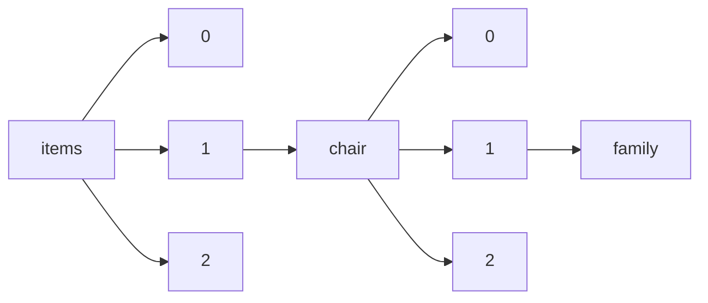

!!! warning "This document is not official Crossref documentation"
# Family
PATH = items/array/chair/array/family(1)  
Occurs 28 790 times  
Unique values: > 999  
{ .annotate }

1. A route to an element, for example:  
   The route "items/array/chair/array/family" corresponds to navigating through the JSON indices as  
   ["items"][0]["chair"][0]["family"]  

!!! note "Due to current limitations, only the first 1,000 unique values are counted."

| **Row** | **Value** `String`    | **Count** `Int64` |
|--------:|-------------------------:|---------------------:|
| **1**   | Martins                  | 400                  |
| **2**   | Mendes                   | 382                  |
| **3**   | Alexandre                | 368                  |
| **4**   | Natalia                  | 368                  |
| **5**   | Silva                    | 346                  |
| **6**   | Lakusic                  | 335                  |
| **7**   | García Jiménez           | 321                  |
| **8**   | Barbosa                  | 302                  |
| **9**   | Oliveira                 | 251                  |
| **10**  | 曹健林                   | 241                  |
| **11**  | Lima                     | 237                  |
| **12**  | 范滇元                   | 227                  |
| **13**  | Machado                  | 201                  |
| **14**  | Araújo                   | 197                  |
| **15**  | Lacerda                  | 194                  |
| **16**  | Rocha                    | 194                  |
| **17**  | Menezes                  | 193                  |
| **18**  | Silveira                 | 192                  |
| **19**  | 徐至展                   | 191                  |
| **20**  | Pinto                    | 191                  |
| **21**  | González                 | 191                  |
| **22**  | Aquino                   | 190                  |
| **23**  | Freitas                  | 190                  |
| **24**  | Chingore                 | 189                  |
| **25**  | Gonzaga                  | 189                  |
| **26**  | Guilherme                | 189                  |
| **27**  | Bestard                  | 189                  |
| **28**  | Tomo                     | 188                  |
| **29**  | Cunico                   | 188                  |
| **30**  | García                   | 188                  |
| **31**  | Basquerote               | 188                  |
| **32**  | Almeraya                 | 187                  |
| **33**  | Warnavin                 | 187                  |
| **34**  | Makino                   | 186                  |
| **35**  | Peixoto                  | 184                  |
| **36**  | Tedesco                  | 184                  |
| **37**  | Zaionz                   | 183                  |
| **38**  | Guedes                   | 182                  |
| **39**  | Peretti                  | 181                  |
| **40**  | Camilo                   | 181                  |
| **41**  | Seabra                   | 181                  |
| **42**  | Lohmann                  | 181                  |
| **43**  | Maganhotto               | 181                  |
| **44**  | Steen                    | 150                  |
| **45**  | 周炳琨                   | 132                  |
| **46**  | Santos                   | 115                  |
| **47**  | 申德振                   | 111                  |
| **48**  | Petros                   | 99                   |
| **49**  | Schutter,                | 98                   |
| **50**  | 龚旗煌                   | 88                   |
| **51**  | 侯洵                     | 85                   |
| **52**  | 郭海成                   | 80                   |
| **53**  | 李儒新                   | 79                   |
| **54**  | Antonio                  | 70                   |
| **55**  | Decio                    | 69                   |
| **56**  | 杜祥琬                   | 68                   |
| **57**  | Lee                      | 54                   |
| **58**  | 张锋                     | 52                   |
| **59**  | Chen                     | 51                   |
| **60**  | Souza                    | 45                   |
| **61**  | Pedrosa                  | 44                   |
| **62**  | Amaral                   | 43                   |
| **63**  | Braga                    | 43                   |
| **64**  | Pillinger                | 42                   |
| **65**  | Ferreira                 | 40                   |
| **66**  | 候洵                     | 40                   |
| **67**  | Zara                     | 39                   |
| **68**  | Costa                    | 39                   |
| **69**  | 彭堃墀                   | 38                   |
| **70**  | Ribeiro-Rotta            | 37                   |
| **71**  | Pereira                  | 37                   |
| **72**  | Johnson                  | 37                   |
| **73**  | Kudo                     | 36                   |
| **74**  | Liu                      | 34                   |
| **75**  | Teodoro                  | 34                   |
| **76**  | Martin                   | 34                   |
| **77**  | Kim                      | 34                   |
| **78**  | Lucena                   | 34                   |
| **79**  | Almeida                  | 33                   |
| **80**  | Cohen                    | 33                   |
| **81**  | Li                       | 32                   |
| **82**  | Sousa                    | 31                   |
| **83**  | 王家骐 院士              | 31                   |
| **84**  | CAVICHINI                | 30                   |
| **85**  | 郝跃                     | 30                   |
| **86**  | SILVA                    | 29                   |
| **87**  | Harreither               | 28                   |
| **88**  | 吕跃广                   | 28                   |
| **89**  | Zhang                    | 28                   |
| **90**  | Sun                      | 27                   |
| **91**  | MacGregor                | 27                   |
| **92**  | Hutchinson               | 26                   |
| **93**  | Brunton                  | 26                   |
| **94**  | Dendasck                 | 25                   |
| **95**  | Watkins                  | 25                   |
| **96**  | 王之江                   | 24                   |
| **97**  | Wang                     | 24                   |
| **98**  | Feng Zongwei             | 24                   |
| **99**  | Lin                      | 23                   |
| **100** | Maurice                  | 23                   |
| **101** | Melo                     | 23                   |
| **102** | Wall                     | 23                   |
| **103** | Yu                       | 22                   |
| **104** | Wang Rusong              | 22                   |
| **105** | He                       | 21                   |
| **106** | Буряк                    | 21                   |
| **107** | OLIVEIRA                 | 21                   |
| **108** | Alessandro               | 21                   |
| **109** | Edmonds                  | 20                   |
| **110** | Phillips                 | 20                   |
| **111** | التحرير                  | 20                   |
| **112** | Castro                   | 19                   |
| **113** | Ramsay                   | 19                   |
| **114** | 王家琪                   | 18                   |
| **115** | Huang                    | 18                   |
| **116** | Baudisch                 | 18                   |
| **117** | Santillán Campos         | 18                   |
| **118** | Cheng                    | 17                   |
| **119** | Wu                       | 17                   |
| **120** | Carvalho                 | 17                   |
| **121** | Sharma                   | 17                   |
| **122** | LEAL                     | 17                   |
| **123** | Davis                    | 17                   |
| **124** | Anderson                 | 17                   |
| **125** | Fernandes                | 16                   |
| **126** | Ribeiro                  | 16                   |
| **127** | Gates                    | 15                   |
| **128** | Curs                     | 15                   |
| **129** | Medeiros                 | 15                   |
| **130** | Lewis                    | 15                   |
| **131** | Vieira                   | 15                   |
| **132** | Brown                    | 15                   |
| **133** | Lopes                    | 15                   |
| **134** | Sims                     | 15                   |
| **135** | MAIA                     | 15                   |
| **136** | Uspenskij                | 14                   |
| **137** | 揭德尔 名誉主编：周立伟  | 14                   |
| **138** | Williams                 | 14                   |
| **139** | Moore                    | 14                   |
| **140** | Miller                   | 14                   |
| **141** | Smith                    | 14                   |
| **142** | Rodrigues                | 14                   |
| **143** | Calyam                   | 13                   |
| **144** | Baker                    | 13                   |
| **145** | Eckles                   | 13                   |
| **146** | Hart                     | 13                   |
| **147** | King                     | 13                   |
| **148** | Царенко                  | 13                   |
| **149** | Loyalka                  | 13                   |
| **150** | Afiouni                  | 13                   |
| **151** | Sakaeva                  | 13                   |
| **152** | Karam                    | 12                   |
| **153** | Cameron                  | 12                   |
| **154** | Schwarz                  | 12                   |
| **155** | Zhao                     | 12                   |
| **156** | Fox                      | 12                   |
| **157** | BARBOSA                  | 12                   |
| **158** | Dias                     | 12                   |
| **159** | Andrade                  | 11                   |
| **160** | Gomes                    | 11                   |
| **161** | Fomicheva                | 11                   |
| **162** | Pires                    | 11                   |
| **163** | Bell                     | 11                   |
| **164** | Jiang                    | 11                   |
| **165** | Cruz                     | 11                   |
| **166** | SANTOS                   | 11                   |
| **167** | Ha-Brookshire            | 11                   |
| **168** | Xu                       | 11                   |
| **169** | Gonçalves                | 11                   |
| **170** | Cardoso                  | 10                   |
| **171** | Wigger                   | 10                   |
| **172** | Mitchell                 | 10                   |
| **173** | Reinke                   | 10                   |
| **174** | Rivero Serrano           | 10                   |
| **175** | MARTINO                  | 10                   |
| **176** | Morilla                  | 10                   |
| **177** | Chang                    | 10                   |
| **178** | 陈星旦                   | 10                   |
| **179** | Petrenko                 | 10                   |
| **180** | Kiushkina                | 10                   |
| **181** | Nesterova                | 10                   |
| **182** | Hill                     | 10                   |
| **183** | Brekhus                  | 10                   |
| **184** | Herman                   | 10                   |
| **185** | Keller                   | 10                   |
| **186** | Thomas                   | 10                   |
| **187** | Dormido                  | 10                   |
| **188** | Shyu                     | 10                   |
| **189** | Nascimento               | 10                   |
| **190** | Vasconcelos              | 9                    |
| **191** | Gabriel                  | 9                    |
| **192** | Roberts                  | 9                    |
| **193** | Silvey                   | 9                    |
| **194** | Campos                   | 9                    |
| **195** | Valerdi Madrigal         | 9                    |
| **196** | Kostyshyn                | 9                    |
| **197** | Scott                    | 9                    |
| **198** | BARROS                   | 9                    |
| **199** | Zakharchuk               | 9                    |
| **200** | Siegel                   | 9                    |
| **201** | Yao                      | 9                    |
| **202** | Cordeiro                 | 9                    |
| **203** | Armer                    | 9                    |
| **204** | 应用激光                 | 9                    |
| **205** | Cynthia                  | 9                    |
| **206** | JORGE                    | 9                    |
| **207** | VIEL                     | 9                    |
| **208** | Ford                     | 9                    |
| **209** | Palaniappan              | 9                    |
| **210** | Mendoza                  | 9                    |
| **211** | Cho                      | 9                    |
| **212** | Hu                       | 9                    |
| **213** | McCarthy                 | 9                    |
| **214** | Flores                   | 9                    |
| **215** | Древаль                  | 9                    |
| **216** | Yang                     | 9                    |
| **217** | Sales                    | 9                    |
| **218** | Rabelo                   | 9                    |
| **219** | Garcia                   | 9                    |
| **220** | Vos                      | 9                    |
| **221** | Azevedo                  | 8                    |
| **222** | Nunes                    | 8                    |
| **223** | Vallentyne               | 8                    |
| **224** | Sultanbaeva              | 8                    |
| **225** | Полунін                  | 8                    |
| **226** | BARROSO                  | 8                    |
| **227** | Hoffman                  | 8                    |
| **228** | Gilles                   | 8                    |
| **229** | Barnes                   | 8                    |
| **230** | Ma                       | 8                    |
| **231** | Козубай                  | 8                    |
| **232** | Black                    | 8                    |
| **233** | Alves                    | 8                    |
| **234** | Ramos                    | 8                    |
| **235** | Urquijo Torres           | 8                    |
| **236** | Duan                     | 8                    |
| **237** | Carneiro                 | 8                    |
| **238** | Dal Molin                | 8                    |
| **239** | Zhou                     | 8                    |
| **240** | Teixeira                 | 8                    |
| **241** | FONSECA                  | 8                    |
| **242** | Shang                    | 8                    |
| **243** | Moreira                  | 7                    |
| **244** | Kreiner                  | 7                    |
| **245** | Dennerlein               | 7                    |
| **246** | Sakhatska                | 7                    |
| **247** | Dynkin                   | 7                    |
| **248** | Otrok                    | 7                    |
| **249** | Robinson                 | 7                    |
| **250** | Duffy                    | 7                    |
| **251** | Zhu                      | 7                    |
| **252** | Jurisson                 | 7                    |
| **253** | Correa                   | 7                    |
| **254** | Paula                    | 7                    |
| **255** | Taylor                   | 7                    |
| **256** | Walensky                 | 7                    |
| **257** | Ladwig                   | 7                    |
| **258** | Dedoné                   | 7                    |
| **259** | Sarafianos               | 7                    |
| **260** | Jesus                    | 7                    |
| **261** | Dougherty                | 7                    |
| **262** | Wilson                   | 7                    |
| **263** | Ezhned                   | 7                    |
| **264** | Drossman                 | 7                    |
| **265** | Ho                       | 7                    |
| **266** | LIMA                     | 7                    |
| **267** | Barclay                  | 7                    |
| **268** | Branco                   | 7                    |
| **269** | Quinn                    | 7                    |
| **270** | Leal                     | 7                    |
| **271** | Fidrovska                | 7                    |
| **272** | Dorner                   | 7                    |
| **273** | Enriquez                 | 7                    |
| **274** | Islam                    | 7                    |
| **275** | Шевченко                 | 7                    |
| **276** | Warner                   | 7                    |
| **277** | Barnard Amosurrutia      | 7                    |
| **278** | Thompson                 | 7                    |
| **279** | Juárez Luna              | 7                    |
| **280** | Kumar                    | 7                    |
| **281** | Salim                    | 7                    |
| **282** | Laffey                   | 7                    |
| **283** | Cormier                  | 7                    |
| **284** | Frisby                   | 6                    |
| **285** | Assis                    | 6                    |
| **286** | Fritschi                 | 6                    |
| **287** | Cabral                   | 6                    |
| **288** | Lever                    | 6                    |
| **289** | Mitrea                   | 6                    |
| **290** | Nikolaev                 | 6                    |
| **291** | Whittington              | 6                    |
| **292** | Amanda                   | 6                    |
| **293** | Knapp                    | 6                    |
| **294** | Cunha                    | 6                    |
| **295** | PAIVA                    | 6                    |
| **296** | Meyer                    | 6                    |
| **297** | Steckler                 | 6                    |
| **298** | Johnston                 | 6                    |
| **299** | Wagner                   | 6                    |
| **300** | Horoshko                 | 6                    |
| **301** | Walsh                    | 6                    |
| **302** | Casazza                  | 6                    |
| **303** | MARTINS                  | 6                    |
| **304** | Parry                    | 6                    |
| **305** | Behm-Morawitz            | 6                    |
| **306** | Collins                  | 6                    |
| **307** | Ni                       | 6                    |
| **308** | Amorim                   | 6                    |
| **309** | Briscoe                  | 6                    |
| **310** | Mueser                   | 6                    |
| **311** | James                    | 6                    |
| **312** | Rose                     | 6                    |
| **313** | El-Gizawy                | 6                    |
| **314** | Singh                    | 6                    |
| **315** | Drury                    | 6                    |
| **316** | Orton                    | 6                    |
| **317** | Stahl                    | 6                    |
| **318** | Yan                      | 6                    |
| **319** | Zou                      | 6                    |
| **320** | Meisenbach               | 6                    |
| **321** | Joshi                    | 6                    |
| **322** | Shaffer                  | 6                    |
| **323** | SMITH                    | 6                    |
| **324** | Prahlad                  | 6                    |
| **325** | Gittell                  | 6                    |
| **326** | Barros                   | 6                    |
| **327** | Ward                     | 6                    |
| **328** | Campbell                 | 6                    |
| **329** | PIRES                    | 6                    |
| **330** | Скиба                    | 6                    |
| **331** | Glass                    | 6                    |
| **332** | Копиця                   | 6                    |
| **333** | Marks                    | 5                    |
| **334** | Colaner                  | 5                    |
| **335** | Yip                      | 5                    |
| **336** | Palomar Pardavé          | 5                    |
| **337** | David                    | 5                    |
| **338** | Kerns                    | 5                    |
| **339** | Ongaga                   | 5                    |
| **340** | Moser                    | 5                    |
| **341** | Marañón Pimentel         | 5                    |
| **342** | García González          | 5                    |
| **343** | Dhiman                   | 5                    |
| **344** | Pavlovich                | 5                    |
| **345** | Beversdorf               | 5                    |
| **346** | Jain                     | 5                    |
| **347** | VanPool                  | 5                    |
| **348** | Kish-Gephart             | 5                    |
| **349** | Jones                    | 5                    |
| **350** | Rochev                   | 5                    |
| **351** | Martínez Carrizales      | 5                    |
| **352** | Човпан                   | 5                    |
| **353** | Ashford                  | 5                    |
| **354** | Markman                  | 5                    |
| **355** | Hawthorne                | 5                    |
| **356** | Reed                     | 5                    |
| **357** | Sebastian                | 5                    |
| **358** | Orlova                   | 5                    |
| **359** | Yaeger                   | 5                    |
| **360** | Adams                    | 5                    |
| **361** | Ramos Morales            | 5                    |
| **362** | Хаджи                    | 5                    |
| **363** | Agarwal                  | 5                    |
| **364** | Matos                    | 5                    |
| **365** | Trindade                 | 5                    |
| **366** | Lockwood                 | 5                    |
| **367** | Mason                    | 5                    |
| **368** | Решетник                 | 5                    |
| **369** | Santana                  | 5                    |
| **370** | Baranovsky               | 5                    |
| **371** | Lannin                   | 5                    |
| **372** | Rhee                     | 5                    |
| **373** | Kang                     | 5                    |
| **374** | SOUZA                    | 5                    |
| **375** | Porter                   | 5                    |
| **376** | Appold                   | 5                    |
| **377** | Pavlova                  | 5                    |
| **378** | Schroeder                | 5                    |
| **379** | Sterling                 | 5                    |
| **380** | Thomason                 | 5                    |
| **381** | Wolfe                    | 5                    |
| **382** | Solbrekken               | 5                    |
| **383** | Joseph                   | 5                    |
| **384** | Siqueira                 | 5                    |
| **385** | Rosário                  | 5                    |
| **386** | Dussel Peters            | 5                    |
| **387** | Levina                   | 5                    |
| **388** | Marcus                   | 5                    |
| **389** | Pontes                   | 5                    |
| **390** | Marques                  | 5                    |
| **391** | Kennedy                  | 5                    |
| **392** | Xin                      | 5                    |
| **393** | Park                     | 5                    |
| **394** | Carver                   | 5                    |
| **395** | Sá                       | 5                    |
| **396** | Gibson                   | 5                    |
| **397** | Lo                       | 5                    |
| **398** | Khanna                   | 5                    |
| **399** | Cole                     | 5                    |
| **400** | Strekalova               | 5                    |
| **401** | Guimarães                | 5                    |
| **402** | Oliver                   | 5                    |
| **403** | Tena Colunga             | 5                    |
| **404** | Prasad                   | 5                    |
| **405** | Ulery                    | 5                    |
| **406** | Bloom                    | 5                    |
| **407** | Wan                      | 5                    |
| **408** | Tanner                   | 5                    |
| **409** | Safonova                 | 5                    |
| **410** | Soares                   | 5                    |
| **411** | Thorson                  | 5                    |
| **412** | Skubic                   | 5                    |
| **413** | Harmata                  | 5                    |
| **414** | Rogers                   | 5                    |
| **415** | Arikan                   | 5                    |
| **416** | Schulz                   | 5                    |
| **417** | Serba                    | 5                    |
| **418** | Torres Medina            | 5                    |
| **419** | Sukys                    | 5                    |
| **420** | Manring                  | 5                    |
| **421** | Erez                     | 5                    |
| **422** | Cairns                   | 5                    |
| **423** | Bowders                  | 5                    |
| **424** | Robertson                | 5                    |
| **425** | Greenwood                | 5                    |
| **426** | Machover                 | 4                    |
| **427** | Arnett                   | 4                    |
| **428** | Cornish                  | 4                    |
| **429** | Shani                    | 4                    |
| **430** | Crawford-Rossi           | 4                    |
| **431** | Cowan                    | 4                    |
| **432** | Afroz                    | 4                    |
| **433** | Jiménez Guzmán           | 4                    |
| **434** | Katahanova               | 4                    |
| **435** | Anthony                  | 4                    |
| **436** | Lau                      | 4                    |
| **437** | West                     | 4                    |
| **438** | Engel                    | 4                    |
| **439** | Board                    | 4                    |
| **440** | Barnstone                | 4                    |
| **441** | Lucas                    | 4                    |
| **442** | Fales                    | 4                    |
| **443** | Martinez                 | 4                    |
| **444** | Mello                    | 4                    |
| **445** | Albuquerque              | 4                    |
| **446** | Passarelli               | 4                    |
| **447** | Fiss                     | 4                    |
| **448** | Menz                     | 4                    |
| **449** | Patterson                | 4                    |
| **450** | Lyons                    | 4                    |
| **451** | Perry                    | 4                    |
| **452** | Jurelionis               | 4                    |
| **453** | Schwain                  | 4                    |
| **454** | Crespy                   | 4                    |
| **455** | Kovaleva                 | 4                    |
| **456** | Coelho                   | 4                    |
| **457** | Robbins                  | 4                    |
| **458** | Hartnell                 | 4                    |
| **459** | Yoon                     | 4                    |
| **460** | Pierce                   | 4                    |
| **461** | Warren                   | 4                    |
| **462** | Hunt                     | 4                    |
| **463** | Sampson                  | 4                    |
| **464** | Almasri                  | 4                    |
| **465** | Сітко                    | 4                    |
| **466** | Peter                    | 4                    |
| **467** | Semlitsch                | 4                    |
| **468** | Соколенко                | 4                    |
| **469** | Rivera                   | 4                    |
| **470** | Lounsbury                | 4                    |
| **471** | Waigandt                 | 4                    |
| **472** | Verbeke                  | 4                    |
| **473** | MOREIRA                  | 4                    |
| **474** | Hansen                   | 4                    |
| **475** | Bartholow                | 4                    |
| **476** | FERNANDES                | 4                    |
| **477** | Aguilera                 | 4                    |
| **478** | Toubiana                 | 4                    |
| **479** | Abramova                 | 4                    |
| **480** | Harper Morris            | 4                    |
| **481** | Jennings                 | 4                    |
| **482** | Anosov                   | 4                    |
| **483** | Worley                   | 4                    |
| **484** | Nikiforov                | 4                    |
| **485** | Vieyra Medrano           | 4                    |
| **486** | Restubog                 | 4                    |
| **487** | Xing                     | 4                    |
| **488** | Bastos                   | 4                    |
| **489** | Cao                      | 4                    |
| **490** | Newton                   | 4                    |
| **491** | Popejoy                  | 4                    |
| **492** | Kovtun                   | 4                    |
| **493** | Monteiro                 | 4                    |
| **494** | Zuzul                    | 4                    |
| **495** | Ding                     | 4                    |
| **496** | Elliff                   | 4                    |
| **497** | Donaldson                | 4                    |
| **498** | Guasque                  | 4                    |
| **499** | Rauch                    | 4                    |
| **500** | Liang                    | 4                    |
| **501** | Múgica Álvarez           | 4                    |
| **502** | Bilyeu                   | 4                    |
| **503** | Neves                    | 4                    |
| **504** | Valentine                | 4                    |
| **505** | Boiko                    | 4                    |
| **506** | Scaboo                   | 4                    |
| **507** | Allen                    | 4                    |
| **508** | Corrêa                   | 4                    |
| **509** | Miles                    | 4                    |
| **510** | Westgren                 | 4                    |
| **511** | Egorova                  | 4                    |
| **512** | Sadykova                 | 4                    |
| **513** | Bennett                  | 4                    |
| **514** | Creary                   | 4                    |
| **515** | Jang                     | 4                    |
| **516** | CARVALHO                 | 4                    |
| **517** | Lasa Uzcudun             | 4                    |
| **518** | Mas                      | 4                    |
| **519** | Cook                     | 4                    |
| **520** | Ariew                    | 4                    |
| **521** | Savani                   | 4                    |
| **522** | Hallman                  | 4                    |
| **523** | Vaca Mier                | 4                    |
| **524** | Gubler                   | 4                    |
| **525** | Nilon                    | 4                    |
| **526** | Gu                       | 4                    |
| **527** | Cornelison               | 4                    |
| **528** | Diem                     | 4                    |
| **529** | Martens                  | 4                    |
| **530** | Pulimood                 | 4                    |
| **531** | Reyna Lara               | 4                    |
| **532** | Bradley                  | 4                    |
| **533** | Larson                   | 4                    |
| **534** | Miranda                  | 4                    |
| **535** | Стеценко                 | 4                    |
| **536** | Song                     | 4                    |
| **537** | Gerhardt                 | 4                    |
| **538** | COELHO                   | 4                    |
| **539** | Empson                   | 4                    |
| **540** | Nogueira de Lucena       | 4                    |
| **541** | Meuser                   | 4                    |
| **542** | Reis                     | 4                    |
| **543** | L.                       | 4                    |
| **544** | Squire                   | 4                    |
| **545** | Alvarez Díaz de León     | 4                    |
| **546** | Frey                     | 4                    |
| **547** | Gutjahr                  | 4                    |
| **548** | Ferris                   | 4                    |
| **549** | Harrison                 | 4                    |
| **550** | Marques Zanata           | 3                    |
| **551** | Turner                   | 3                    |
| **552** | Di Lorenzo               | 3                    |
| **553** | Nezhdanova               | 3                    |
| **554** | Чорна                    | 3                    |
| **555** | Baquim                   | 3                    |
| **556** | Nogueira                 | 3                    |
| **557** | Paranhos                 | 3                    |
| **558** | De Luca Zuria            | 3                    |
| **559** | Langley                  | 3                    |
| **560** | Killoren                 | 3                    |
| **561** | Gulevich                 | 3                    |
| **562** | Market                   | 3                    |
| **563** | Горбач                   | 3                    |
| **564** | Chu                      | 3                    |
| **565** | Muniz                    | 3                    |
| **566** | PEIXOTO                  | 3                    |
| **567** | Tomasi                   | 3                    |
| **568** | Harper                   | 3                    |
| **569** | Uhl-Bien                 | 3                    |
| **570** | Kalitin                  | 3                    |
| **571** | Marquet Montiel          | 3                    |
| **572** | Guha                     | 3                    |
| **573** | Krieckhaus               | 3                    |
| **574** | BACELLAR                 | 3                    |
| **575** | Kay                      | 3                    |
| **576** | Beetz                    | 3                    |
| **577** | Battestilli              | 3                    |
| **578** | Tee                      | 3                    |
| **579** | Fuentes Arriaga          | 3                    |
| **580** | Gross                    | 3                    |
| **581** | Shapiro                  | 3                    |
| **582** | Brodsky                  | 3                    |
| **583** | Kaussen                  | 3                    |
| **584** | Dragoni                  | 3                    |
| **585** | Токарева                 | 3                    |
| **586** | Schilpzand               | 3                    |
| **587** | Montgomery-Smith         | 3                    |
| **588** | Приступа                 | 3                    |
| **589** | Bocco Verdinelli         | 3                    |
| **590** | Ren                      | 3                    |
| **591** | Pavlov                   | 3                    |
| **592** | Zanoni                   | 3                    |
| **593** | Satpathy                 | 3                    |
| **594** | Bono                     | 3                    |
| **595** | Pozner                   | 3                    |
| **596** | Verhaal                  | 3                    |
| **597** | COSTA                    | 3                    |
| **598** | Dutra Braga              | 3                    |
| **599** | Antoshina                | 3                    |
| **600** | Hammer                   | 3                    |
| **601** | Couto                    | 3                    |
| **602** | Nakashima                | 3                    |
| **603** | Van Hoye                 | 3                    |
| **604** | Parfonova                | 3                    |
| **605** | Prelas                   | 3                    |
| **606** | Maschmann                | 3                    |
| **607** | Dorfman                  | 3                    |
| **608** | Paukert                  | 3                    |
| **609** | GARCÍA JIMÉNEZ           | 3                    |
| **610** | Russi Junior             | 3                    |
| **611** | Gomez                    | 3                    |
| **612** | Jachimowicz              | 3                    |
| **613** | Bentes                   | 3                    |
| **614** | Bednar                   | 3                    |
| **615** | Rasche                   | 3                    |
| **616** | Montes de Oca Yemha      | 3                    |
| **617** | Gold                     | 3                    |
| **618** | Sadler                   | 3                    |
| **619** | Arevalo                  | 3                    |
| **620** | Ivanov                   | 3                    |
| **621** | Shenk                    | 3                    |
| **622** | Фідровська               | 3                    |
| **623** | Rosendahl                | 3                    |
| **624** | Messias Fialho Capellini | 3                    |
| **625** | Pokhorukova              | 3                    |
| **626** | Famiglietti              | 3                    |
| **627** | Tuckfield                | 3                    |
| **628** | Fonseca                  | 3                    |
| **629** | Ryan J.                  | 3                    |
| **630** | Hollensbe                | 3                    |
| **631** | Кавин                    | 3                    |
| **632** | Edmondson                | 3                    |
| **633** | Allueva Torres           | 3                    |
| **634** | Chao                     | 3                    |
| **635** | Houston                  | 3                    |
| **636** | Tedeschi                 | 3                    |
| **637** | Berson                   | 3                    |
| **638** | Washer                   | 3                    |
| **639** | Perlmutter               | 3                    |
| **640** | Giannantonio             | 3                    |
| **641** | Lakušić                  | 3                    |
| **642** | Shulga                   | 3                    |
| **643** | Macedo                   | 3                    |
| **644** | França                   | 3                    |
| **645** | Pelais                   | 3                    |
| **646** | Feng                     | 3                    |
| **647** | Heidelbaugh              | 3                    |
| **648** | Hamilton                 | 3                    |
| **649** | Zhizhan Xu               | 3                    |
| **650** | Javidan                  | 3                    |
| **651** | Simmons                  | 3                    |
| **652** | Stanley                  | 3                    |
| **653** | Sattenspiel              | 3                    |
| **654** | Koehler                  | 3                    |
| **655** | Gontijo                  | 3                    |
| **656** | Tenorio Tagle            | 3                    |
| **657** | Cristina                 | 3                    |
| **658** | Vieira de Lacerda        | 3                    |
| **659** | Lefevre                  | 3                    |
| **660** | Burns                    | 3                    |
| **661** | Booth                    | 3                    |
| **662** | Goldman Schuyler         | 3                    |
| **663** | Iakovleva                | 3                    |
| **664** | Madsen                   | 3                    |
| **665** | Zander                   | 3                    |
| **666** | Lumineau                 | 3                    |
| **667** | Zilber                   | 3                    |
| **668** | Prazeres                 | 3                    |
| **669** | Печеніна                 | 3                    |
| **670** | Birchler                 | 3                    |
| **671** | Sperber                  | 3                    |
| **672** | Mustapha                 | 3                    |
| **673** | Yi                       | 3                    |
| **674** | Kannan-Narasimhan        | 3                    |
| **675** | Hanuscin                 | 3                    |
| **676** | Solano Goñi              | 3                    |
| **677** | Faria                    | 3                    |
| **678** | Gassmann                 | 3                    |
| **679** | Borges Júnior            | 3                    |
| **680** | Young                    | 3                    |
| **681** | McDonald                 | 3                    |
| **682** | Charlier                 | 3                    |
| **683** | Nguyen                   | 3                    |
| **684** | Klensin                  | 3                    |
| **685** | Oelke                    | 3                    |
| **686** | Колеснікова              | 3                    |
| **687** | Schweitzer               | 3                    |
| **688** | Keidar                   | 3                    |
| **689** | Lu                       | 3                    |
| **690** | Naveh-Benjamin           | 3                    |
| **691** | Kopnova                  | 3                    |
| **692** | Декусар                  | 3                    |
| **693** | Osera                    | 3                    |
| **694** | Demeneva                 | 3                    |
| **695** | Pinheiro                 | 3                    |
| **696** | Franz                    | 3                    |
| **697** | Kaplan                   | 3                    |
| **698** | Korkin                   | 3                    |
| **699** | Zocche                   | 3                    |
| **700** | FREITAS                  | 3                    |
| **701** | Малахов                  | 3                    |
| **702** | Hillebrandt              | 3                    |
| **703** | Jeanetta                 | 3                    |
| **704** | Крамаренко               | 3                    |
| **705** | Sine                     | 3                    |
| **706** | Venskutonis              | 3                    |
| **707** | Danilova                 | 3                    |
| **708** | ALMEIDA                  | 3                    |
| **709** | Adriasola                | 3                    |
| **710** | Becerra                  | 3                    |
| **711** | Matías Maestro           | 3                    |
| **712** | Huneycutt                | 3                    |
| **713** | Izquierdo Redín          | 3                    |
| **714** | Пархоменко               | 3                    |
| **715** | Rodgers                  | 3                    |
| **716** | Kwon                     | 3                    |
| **717** | Medcof                   | 3                    |
| **718** | Blume                    | 3                    |
| **719** | Sinclair                 | 3                    |
| **720** | Beaver                   | 3                    |
| **721** | Chi-Ren                  | 3                    |
| **722** | Gray                     | 3                    |
| **723** | Ostaševičius             | 3                    |
| **724** | PEREIRA                  | 3                    |
| **725** | Kapadia                  | 3                    |
| **726** | Coutinho                 | 3                    |
| **727** | Borges                   | 3                    |
| **728** | Mislan                   | 3                    |
| **729** | Gupta                    | 3                    |
| **730** | Científica Digital       | 3                    |
| **731** | Baptista                 | 3                    |
| **732** | Rebecca                  | 3                    |
| **733** | Atwood                   | 3                    |
| **734** | Henry                    | 3                    |
| **735** | Gahl                     | 3                    |
| **736** | Miceli                   | 3                    |
| **737** | Bryan                    | 3                    |
| **738** | Segal                    | 3                    |
| **739** | Brewer                   | 3                    |
| **740** | Ciarlini                 | 3                    |
| **741** | Weirich                  | 3                    |
| **742** | Schmidt                  | 3                    |
| **743** | Hua                      | 3                    |
| **744** | Kelly                    | 3                    |
| **745** | Hussein                  | 3                    |
| **746** | Larsen                   | 3                    |
| **747** | Suppes                   | 3                    |
| **748** | Spencer                  | 3                    |
| **749** | Masterson                | 3                    |
| **750** | Dudina                   | 3                    |
| **751** | Podsakoff                | 3                    |
| **752** | Teahen                   | 3                    |
| **753** | Petrov                   | 3                    |
| **754** | McCluney                 | 3                    |
| **755** | Lawless                  | 3                    |
| **756** | Faria Ribeiro-Rotta      | 3                    |
| **757** | Ashkanasy                | 3                    |
| **758** | Duarte                   | 3                    |
| **759** | Deng                     | 3                    |
| **760** | Walker                   | 3                    |
| **761** | Araujo                   | 3                    |
| **762** | Strauss                  | 3                    |
| **763** | Locke                    | 3                    |
| **764** | Tang                     | 3                    |
| **765** | Ramírez Ramírez          | 3                    |
| **766** | McKinney                 | 3                    |
| **767** | Burke                    | 3                    |
| **768** | Uzunca                   | 3                    |
| **769** | Trần                     | 2                    |
| **770** | Rerup                    | 2                    |
| **771** | Solod                    | 2                    |
| **772** | Meijerink                | 2                    |
| **773** | Cutkosky                 | 2                    |
| **774** | Scholes                  | 2                    |
| **775** | Rodell                   | 2                    |
| **776** | Doden                    | 2                    |
| **777** | Маслова                  | 2                    |
| **778** | Zoogah                   | 2                    |
| **779** | Padilla                  | 2                    |
| **780** | Delbridge                | 2                    |
| **781** | Knowlton                 | 2                    |
| **782** | Verona                   | 2                    |
| **783** | Kuzmichev                | 2                    |
| **784** | Tolkachev                | 2                    |
| **785** | Rector                   | 2                    |
| **786** | Trebukh                  | 2                    |
| **787** | Koroliuk                 | 2                    |
| **788** | Rikoon                   | 2                    |
| **789** | Dunn                     | 2                    |
| **790** | Vora                     | 2                    |
| **791** | Hays                     | 2                    |
| **792** | Prybyla                  | 2                    |
| **793** | Cherkashina              | 2                    |
| **794** | Galasso                  | 2                    |
| **795** | Edara                    | 2                    |
| **796** | Hewett                   | 2                    |
| **797** | Berns                    | 2                    |
| **798** | Дегтярьова               | 2                    |
| **799** | Gaeva                    | 2                    |
| **800** | Schlundt                 | 2                    |
| **801** | González García          | 2                    |
| **802** | Bichara                  | 2                    |
| **803** | Volpone                  | 2                    |
| **804** | Волошин                  | 2                    |
| **805** | Charters                 | 2                    |
| **806** | Soenen                   | 2                    |
| **807** | Dittrich                 | 2                    |
| **808** | De Vos                   | 2                    |
| **809** | Carsten                  | 2                    |
| **810** | Skorokhodova             | 2                    |
| **811** | Jamro                    | 2                    |
| **812** | Sugiyama                 | 2                    |
| **813** | Motshweni                | 2                    |
| **814** | Almeida Calderón         | 2                    |
| **815** | Hobmeir                  | 2                    |
| **816** | LEITE                    | 2                    |
| **817** | Біланюк                  | 2                    |
| **818** | Dastmalchian             | 2                    |
| **819** | Lozitskaia               | 2                    |
| **820** | Yonan                    | 2                    |
| **821** | Ronald                   | 2                    |
| **822** | Bohns                    | 2                    |
| **823** | Lei                      | 2                    |
| **824** | Flynn                    | 2                    |
| **825** | Eric                     | 2                    |
| **826** | Louw                     | 2                    |
| **827** | Федорова                 | 2                    |
| **828** | Kawasumi                 | 2                    |
| **829** | Emter                    | 2                    |
| **830** | Méndez Lemus             | 2                    |
| **831** | Novo Kudo                | 2                    |
| **832** | Mezalira                 | 2                    |
| **833** | Gerasimenko              | 2                    |
| **834** | Kukenberger              | 2                    |
| **835** | Menta                    | 2                    |
| **836** | Raveendhran              | 2                    |
| **837** | Cai                      | 2                    |
| **838** | Weyman                   | 2                    |
| **839** | Gruen                    | 2                    |
| **840** | Hyams                    | 2                    |
| **841** | Lanaj                    | 2                    |
| **842** | Anand                    | 2                    |
| **843** | Zikic                    | 2                    |
| **844** | Dittmann                 | 2                    |
| **845** | Kunii                    | 2                    |
| **846** | Barbulescu               | 2                    |
| **847** | Matthews                 | 2                    |
| **848** | James M.                 | 2                    |
| **849** | Ковальчук                | 2                    |
| **850** | Nikulin                  | 2                    |
| **851** | Baxromjonova             | 2                    |
| **852** | Горак                    | 2                    |
| **853** | Khurana                  | 2                    |
| **854** | Pinho                    | 2                    |
| **855** | Campo-Bescós             | 2                    |
| **856** | Nikolaichuk              | 2                    |
| **857** | Muzio                    | 2                    |
| **858** | Fosdick                  | 2                    |
| **859** | Lifshitz-Assaf           | 2                    |
| **860** | Panferova                | 2                    |
| **861** | Kevin                    | 2                    |
| **862** | O'Connor                 | 2                    |
| **863** | Will                     | 2                    |
| **864** | Dumas                    | 2                    |
| **865** | Качмар                   | 2                    |
| **866** | Lebedin                  | 2                    |
| **867** | Hassan                   | 2                    |
| **868** | Mikhnev                  | 2                    |
| **869** | Perea Olvera             | 2                    |
| **870** | Severo                   | 2                    |
| **871** | Woelfel                  | 2                    |
| **872** | Faraj                    | 2                    |
| **873** | Brady                    | 2                    |
| **874** | Georganta                | 2                    |
| **875** | Elías López              | 2                    |
| **876** | Rouse                    | 2                    |
| **877** | Beer                     | 2                    |
| **878** | Chmyr                    | 2                    |
| **879** | Resick                   | 2                    |
| **880** | Kostova                  | 2                    |
| **881** | Newman                   | 2                    |
| **882** | Domínguez Martín         | 2                    |
| **883** | Sohn                     | 2                    |
| **884** | Marlow                   | 2                    |
| **885** | Komova                   | 2                    |
| **886** | Sovenko                  | 2                    |
| **887** | Оліфіренко               | 2                    |
| **888** | Weiss                    | 2                    |
| **889** | Greene                   | 2                    |
| **890** | Rico                     | 2                    |
| **891** | Menter                   | 2                    |
| **892** | Farias Júnior            | 2                    |
| **893** | Alexander                | 2                    |
| **894** | Lemos                    | 2                    |
| **895** | Білошицька               | 2                    |
| **896** | Howe                     | 2                    |
| **897** | Loureiro                 | 2                    |
| **898** | Karacan                  | 2                    |
| **899** | Hanson                   | 2                    |
| **900** | Arnold                   | 2                    |
| **901** | Haugh                    | 2                    |
| **902** | Chatman                  | 2                    |
| **903** | Mannen                   | 2                    |
| **904** | Huntley                  | 2                    |
| **905** | Cortina                  | 2                    |
| **906** | Griesmer                 | 2                    |
| **907** | Frolova                  | 2                    |
| **908** | Puffer                   | 2                    |
| **909** | Ursúa Rubio              | 2                    |
| **910** | Giorgi                   | 2                    |
| **911** | ROCHA                    | 2                    |
| **912** | Lazurenko                | 2                    |
| **913** | Pastorio                 | 2                    |
| **914** | Bret                     | 2                    |
| **915** | Dam                      | 2                    |
| **916** | Goulart                  | 2                    |
| **917** | Palmer                   | 2                    |
| **918** | Taft                     | 2                    |
| **919** | Marchiondo               | 2                    |
| **920** | Vasileva                 | 2                    |
| **921** | Gargiulo                 | 2                    |
| **922** | Mol                      | 2                    |
| **923** | Дранишников              | 2                    |
| **924** | Cramton                  | 2                    |
| **925** | Hofmann                  | 2                    |
| **926** | Maltsev                  | 2                    |
| **927** | Messner                  | 2                    |
| **928** | Kluemper                 | 2                    |
| **929** | Messias                  | 2                    |
| **930** | Delage                   | 2                    |
| **931** | Salgado                  | 2                    |
| **932** | Haberland                | 2                    |
| **933** | Silvestre                | 2                    |
| **934** | Ghosh                    | 2                    |
| **935** | Handy                    | 2                    |
| **936** | Maria                    | 2                    |
| **937** | Stacey                   | 2                    |
| **938** | Galvão                   | 2                    |
| **939** | Petriglieri              | 2                    |
| **940** | Turban                   | 2                    |
| **941** | Vallino                  | 2                    |
| **942** | Gustafsson               | 2                    |
| **943** | Ermakov                  | 2                    |
| **944** | Van Garderen             | 2                    |
| **945** | Price                    | 2                    |
| **946** | Aguilar                  | 2                    |
| **947** | Camargo                  | 2                    |
| **948** | Okimoto                  | 2                    |
| **949** | Стецик                   | 2                    |
| **950** | Feldman                  | 2                    |
| **951** | Nikitina                 | 2                    |
| **952** | Clough                   | 2                    |
| **953** | Chernysheva              | 2                    |
| **954** | Gómez Bernal             | 2                    |
| **955** | Rosenberger              | 2                    |
| **956** | Korpachev                | 2                    |
| **957** | Leitão Júnior            | 2                    |
| **958** | Sezer                    | 2                    |
| **959** | Bond                     | 2                    |
| **960** | Desai                    | 2                    |
| **961** | Volz                     | 2                    |
| **962** | Victoria                 | 2                    |
| **963** | Jun                      | 2                    |
| **964** | Bharucha                 | 2                    |
| **965** | Noev                     | 2                    |
| **966** | Overby                   | 2                    |
| **967** | Trull                    | 2                    |
| **968** | Jia                      | 2                    |
| **969** | Saldanha                 | 2                    |
| **970** | Zayceva                  | 2                    |
| **971** | Sergienko                | 2                    |
| **972** | Myers                    | 2                    |
| **973** | Кучанський               | 2                    |
| **974** | Liao                     | 2                    |
| **975** | Gandini                  | 2                    |
| **976** | Krueger                  | 2                    |
| **977** | Crossley                 | 2                    |
| **978** | Jensen                   | 2                    |
| **979** | Jehn                     | 2                    |
| **980** | Díaz Vega                | 2                    |
| **981** | Ansari                   | 2                    |
| **982** | O'Brien                  | 2                    |
| **983** | Hungin                   | 2                    |
| **984** | Хейлик                   | 2                    |
| **985** | Мельнійчук               | 2                    |
| **986** | Crane                    | 2                    |
| **987** | McGrath                  | 2                    |
| **988** | Sedakova                 | 2                    |
| **989** | Middleton                | 2                    |
| **990** | Trauth                   | 2                    |
| **991** | Büttner                  | 2                    |
| **992** | Campinho                 | 2                    |
| **993** | Fedotenko                | 2                    |
| **994** | Daniels                  | 2                    |
| **995** | Sangoi                   | 2                    |
| **996** | Queiroz                  | 2                    |
| **997** | Chernukha                | 2                    |
| **998** | Tarutina                 | 2                    |
| **999** | Shu                      | 2                    |
| ... | ... | ... |

