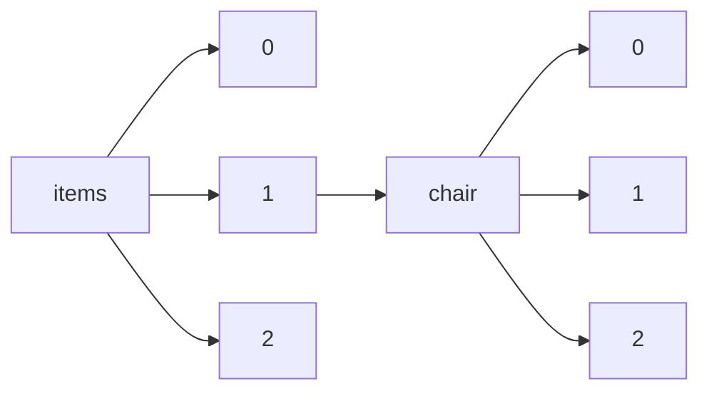

!!! warning "This document is not official Crossref documentation"
# Elements
PATH = items/array/chair/array(1)  
Occurs 32 030 times  
{ .annotate }

1. A route to an element, for example:  
   The route "items/array/chair/array" corresponds to navigating through the JSON indices as  
   ["items"][0]["chair"][0]  

## ORCID
See more information: [items/array/chair/array/ORCID](ORCID/index.md)  
Occurs 2 258 timess  
Unique values: > 999  

!!! note "Due to current limitations, only the first 1,000 unique values are counted."

| **Row** | **Value** `String`                | **Count** `Int64` |
|--------:|-------------------------------------:|---------------------:|
| **1**   | http://orcid.org/0000-0001-7012-9078 | 39                   |
| **2**   | http://orcid.org/0000-0002-0949-9528 | 34                   |
| **3**   | http://orcid.org/0000-0002-2530-3687 | 34                   |
| **4**   | http://orcid.org/0000-0002-3267-5745 | 27                   |
| **5**   | http://orcid.org/0000-0003-2952-4337 | 26                   |
| **6**   | http://orcid.org/0000-0002-7238-0562 | 24                   |
| **7**   | http://orcid.org/0000-0002-5248-273X | 15                   |
| **8**   | http://orcid.org/0000-0002-5238-8567 | 15                   |
| **9**   | http://orcid.org/0000-0001-5364-0173 | 14                   |
| **10**  | http://orcid.org/0000-0001-8890-0852 | 14                   |
| ... | ... | ... |

## Affiliation
See more information: [items/array/chair/array/affiliation](affiliation/index.md)  
Occurs 32 030 timess  

| **Row** | **Length** `Any` | **Count** `Int64` |
|--------:|--------------------:|---------------------:|
| **1**   | 0                   | 27 114               |
| **2**   | 1                   | 4 876                |
| **3**   | 2                   | 35                   |
| **4**   | 3                   | 5                    |

## Authenticated-orcid
See more information: [items/array/chair/array/authenticated-orcid](authenticated-orcid/index.md)  
Occurs 2 258 timess  
Unique values: 2  

| **Row** | **Value** `Bool` | **Count** `Int64` |
|--------:|--------------------:|---------------------:|
| **1**   | false               | 2 256                |
| **2**   | true                | 2                    |

## Family
See more information: [items/array/chair/array/family](family/index.md)  
Occurs 28 790 timess  
Unique values: > 999  

!!! note "Due to current limitations, only the first 1,000 unique values are counted."

| **Row** | **Value** `String` | **Count** `Int64` |
|--------:|----------------------:|---------------------:|
| **1**   | Martins               | 400                  |
| **2**   | Mendes                | 382                  |
| **3**   | Alexandre             | 368                  |
| **4**   | Natalia               | 368                  |
| **5**   | Silva                 | 346                  |
| **6**   | Lakusic               | 335                  |
| **7**   | García Jiménez        | 321                  |
| **8**   | Barbosa               | 302                  |
| **9**   | Oliveira              | 251                  |
| **10**  | 曹健林                | 241                  |
| ... | ... | ... |

## Given
See more information: [items/array/chair/array/given](given/index.md)  
Occurs 28 783 timess  
Unique values: > 999  

!!! note "Due to current limitations, only the first 1,000 unique values are counted."

| **Row** | **Value** `String` | **Count** `Int64` |
|--------:|----------------------:|---------------------:|
| **1**   | Dolgui,               | 368                  |
| **2**   | Bakhtadze,            | 368                  |
| **3**   | Fernando              | 355                  |
| **4**   | Stjepan               | 338                  |
| **5**   | Frederico Celestino   | 303                  |
| **6**   | 曹健林                | 241                  |
| **7**   | 范滇元                | 227                  |
| **8**   | Ernane Rosa           | 196                  |
| **9**   | 徐至展                | 191                  |
| **10**  | Larissa               | 191                  |
| ... | ... | ... |

## Name
See more information: [items/array/chair/array/name](name/index.md)  
Occurs 3 240 timess  
Unique values: > 999  

!!! note "Due to current limitations, only the first 1,000 unique values are counted."

| **Row** | **Value** `String`                                         | **Count** `Int64` |
|--------:|--------------------------------------------------------------:|---------------------:|
| **1**   | prof. Stjepan Lakušić                                         | 357                  |
| **2**   | Unfallforschung der Versicherer                               | 211                  |
| **3**   | Ural State University of Economicis                           | 78                   |
| **4**   | Sociedad Geológica Mexicana                                   | 56                   |
| **5**   | Instituto de Investigaciones Económicas                       | 36                   |
| **6**   | prof. Stjepan Lakusic                                         | 32                   |
| **7**   | Centro de Investigaciones en Geografía Ambiental (CIGA, UNAM) | 29                   |
| **8**   | Yuri Gagarin state technical university of Saratov            | 27                   |
| **9**   | Russian State University of Tourism and Service               | 26                   |
| **10**  | Global Science and Technology Forum Pte Ltd                   | 26                   |
| ... | ... | ... |

## Sequence
See more information: [items/array/chair/array/sequence](sequence/index.md)  
Occurs 32 030 timess  
Unique values: 2  

| **Row** | **Value** `String` | **Count** `Int64` |
|--------:|----------------------:|---------------------:|
| **1**   | additional            | 21 500               |
| **2**   | first                 | 10 530               |

## Suffix
See more information: [items/array/chair/array/suffix](suffix/index.md)  
Occurs 98 timess  
Unique values: 18  

| **Row** | **Value** `String` | **Count** `Int64` |
|--------:|----------------------:|---------------------:|
| **1**   | MD                    | 40                   |
| **2**   | MD, PhD               | 14                   |
| **3**   | Prof.                 | 9                    |
| **4**   | Jr.                   | 7                    |
| **5**   | MD, FRCGP             | 4                    |
| **6**   | PhD                   | 4                    |
| **7**   | MD, FRCP              | 3                    |
| **8**   | MBBS, MD              | 3                    |
| **9**   | MD, MSPH              | 3                    |
| **10**  | Esquire               | 2                    |
| ... | ... | ... |

