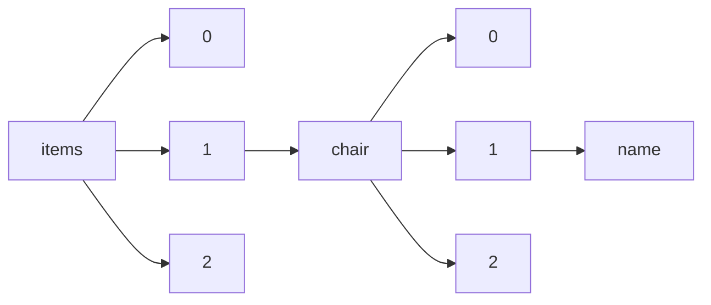

!!! warning "This document is not official Crossref documentation"
# Name
PATH = items/array/chair/array/name(1)  
Occurs 3 240 times  
Unique values: > 999  
{ .annotate }

1. A route to an element, for example:  
   The route "items/array/chair/array/name" corresponds to navigating through the JSON indices as  
   ["items"][0]["chair"][0]["name"]  

!!! note "Due to current limitations, only the first 1,000 unique values are counted."

| **Row** | **Value** `String`                                                                                | **Count** `Int64` |
|--------:|-----------------------------------------------------------------------------------------------------:|---------------------:|
| **1**   | prof. Stjepan Lakušić                                                                                | 357                  |
| **2**   | Unfallforschung der Versicherer                                                                      | 211                  |
| **3**   | Ural State University of Economicis                                                                  | 78                   |
| **4**   | Sociedad Geológica Mexicana                                                                          | 56                   |
| **5**   | Instituto de Investigaciones Económicas                                                              | 36                   |
| **6**   | prof. Stjepan Lakusic                                                                                | 32                   |
| **7**   | Centro de Investigaciones en Geografía Ambiental (CIGA, UNAM)                                        | 29                   |
| **8**   | Yuri Gagarin state technical university of Saratov                                                   | 27                   |
| **9**   | Russian State University of Tourism and Service                                                      | 26                   |
| **10**  | Global Science and Technology Forum Pte Ltd                                                          | 26                   |
| **11**  | Dirección General de Orientación y Atención Educativa                                                | 20                   |
| **12**  | Institute of Slavic Studies, Russian Academy of Sciences                                             | 20                   |
| **13**  | هيئة التحرير                                                                                         | 20                   |
| **14**  | Universidad de Granada                                                                               | 19                   |
| **15**  | Universidad de Málaga                                                                                | 19                   |
| **16**  | Moscow State University of Economics, Statistics and Informatics                                     | 17                   |
| **17**  | Psicologia, Escola de Ciências Sociais e da Saúde Pontifícia Universidade Católica de Goiás          | 17                   |
| **18**  | FSEBI of HE "Financial University under the Government of the Russian Federation"                    | 16                   |
| **19**  | Pró-Reitoria de Pós-Graduação, Pesquisa e Inovação - PROPGPI/UNIRIO                                  | 16                   |
| **20**  | Financial University under the Government of the Russian Federation                                  | 16                   |
| **21**  | Universidad Nacional Autónoma de México                                                              | 15                   |
| **22**  | Petrozavodsk State University                                                                        | 15                   |
| **23**  | Penza State University of Architecture and Construction                                              | 14                   |
| **24**  | Academy of Pedagogy and Psychology of FSAEI of HE "Southern Federal University"                      | 14                   |
| **25**  | Moscow State University of technologies and management by K. G. Razumovsky                           | 13                   |
| **26**  | Global Science and Technology Forum                                                                  | 12                   |
| **27**  | Perm National Research Polytechnic University                                                        | 12                   |
| **28**  | Worldwide Dragonfly Association                                                                      | 12                   |
| **29**  | Дніпровський національний університет імені Олеся Гончара                                            | 12                   |
| **30**  | Penza state university of architecture and construction                                              | 11                   |
| **31**  | State University of Management                                                                       | 11                   |
| **32**  | MEI "P.A. Stolypin School №21"                                                                       | 11                   |
| **33**  | Primakov National Research Institute of World Economy and International Relations, Russian Academy o | 11                   |
| **34**  | Pedagogical Institute of FSBEI of HE "Irkutsk State University"                                      | 11                   |
| **35**  | Southern Federal University                                                                          | 11                   |
| **36**  | Universidad Rey Juan Carlos                                                                          | 10                   |
| **37**  | Universidad Nacional Autónoma de México, Instituto de Investigaciones Económicas                     | 10                   |
| **38**  | Universitat de València                                                                              | 10                   |
| **39**  | Moscow state university of civil engineering                                                         | 9                    |
| **40**  | Tver state technical university                                                                      | 9                    |
| **41**  | Professional Education Samara State University of Economics                                          | 9                    |
| **42**  | Universidad de Las Palmas de Gran Canaria                                                            | 9                    |
| **43**  | Fisioterapia, Escola de Ciências Sociais e da Saúde Pontifícia Universidade Católica de Goiás        | 9                    |
| **44**  | Departamento de Educação - FC, Unesp - Bauru                                                         | 9                    |
| **45**  | Perm national research polytechnic university                                                        | 8                    |
| **46**  | Stjepan Lakušić                                                                                      | 8                    |
| **47**  | Moscow state university of economics, statistics & informatics                                       | 7                    |
| **48**  | Odesa National Economic University                                                                   | 7                    |
| **49**  | Wolaita Sodo University                                                                              | 7                    |
| **50**  | Almenara Hospital ESSALUD                                                                            | 7                    |
| **51**  | Volgograd state technical university                                                                 | 7                    |
| **52**  | Institute of Government, Right and Innovative Technologies                                           | 7                    |
| **53**  | The Yuri Gagarin State Technical University of Saratov                                               | 7                    |
| **54**  | Universidad de Sevilla                                                                               | 7                    |
| **55**  | FSBEI of HE "Don State Technical University"                                                         | 7                    |
| **56**  | Universidad de Barcelona                                                                             | 7                    |
| **57**  | Samara State Technical University                                                                    | 7                    |
| **58**  | CIMSUR-UNAM                                                                                          | 7                    |
| **59**  | Universitat de Barcelona                                                                             | 7                    |
| **60**  | Kazan state university of architecture and engineering                                               | 7                    |
| **61**  | National Research Tomsk Polytechnic University                                                       | 6                    |
| **62**  | Universidad de Cádiz                                                                                 | 6                    |
| **63**  | Universidad de Zaragoza                                                                              | 6                    |
| **64**  | National research Ogarev Mordovia state university                                                   | 6                    |
| **65**  | FSBEI of HPE "Kuban State University"                                                                | 6                    |
| **66**  | Bryansk state engineering-technological university                                                   | 6                    |
| **67**  | Financial Academy at the Government of the Russian Federation                                        | 6                    |
| **68**  | World Tourism Organization (UNWTO)                                                                   | 6                    |
| **69**  | Samara State University of Economics                                                                 | 6                    |
| **70**  | Perm national research polytechnical university                                                      | 6                    |
| **71**  | Universidad de Burgos                                                                                | 6                    |
| **72**  | Industrial university of Tyumen                                                                      | 6                    |
| **73**  | Peoples' Friendship University of Russia                                                             | 6                    |
| **74**  | UNAM                                                                                                 | 6                    |
| **75**  | FSAEI of HE "Belgorod State National Research University"                                            | 6                    |
| **76**  | Tyumen State University                                                                              | 6                    |
| **77**  | Universidad Nacional Autónoma de México (UNAM)/Seminario sobre Medicina y Salud                      | 6                    |
| **78**  | I.I. Schmalhausen Institute of Zoology NAS of Ukraine                                                | 5                    |
| **79**  | Ufa state petroleum technological university                                                         | 5                    |
| **80**  | FSBEI of HE "Kozma Minin Nizhny Novgorod State Pedagogical University"                               | 5                    |
| **81**  | FSBEI of HPE "Chelyabinsk State Pedagogical University"                                              | 5                    |
| **82**  | Orenburg State University                                                                            | 5                    |
| **83**  | Universidad Pablo de Olavide                                                                         | 5                    |
| **84**  | FSBEI of HE "Kuban State Agrarian University named after I.T. Trubilin"                              | 5                    |
| **85**  | FSAEI of HE "M.K. Ammosov North-Eastern Federal University"                                          | 5                    |
| **86**  | Moscow State University of economics, statistics and informatics                                     | 5                    |
| **87**  | PROIMMSE-UNAM                                                                                        | 5                    |
| **88**  | Financial university under the government of the Russian Federation                                  | 5                    |
| **89**  | FSBEI of HPE "Amur State University"                                                                 | 5                    |
| **90**  | FSAEI of HPE "Far Eastern Federal University"                                                        | 5                    |
| **91**  | Tver State Technical University                                                                      | 5                    |
| **92**  | Bauman Moscow State Technical University                                                             | 5                    |
| **93**  | Universidade de Santiago de Compostela                                                               | 5                    |
| **94**  | Kostroma State Agricultural Academy                                                                  | 5                    |
| **95**  | Far Eastern Federal University                                                                       | 5                    |
| **96**  | JSC "Northern Industrial Association" Arctic"                                                        | 5                    |
| **97**  | FSBEI of HE "Vladimir State University named after A.G. and N.G. Stoletovy"                          | 5                    |
| **98**  | Voronezh state technical university                                                                  | 5                    |
| **99**  | FSBEI of HE "Moscow State University of Education"                                                   | 5                    |
| **100** | Adyghe State University                                                                              | 4                    |
| **101** | MBEI "MES №26"                                                                                       | 4                    |
| **102** | Universidad Nacional Autónoma de México/Seminario sobre Medicina y Salud                             | 4                    |
| **103** | Facultad de Medicina Veterinaria y Zootecnia                                                         | 4                    |
| **104** | Institute of Slavic Studies of the Russian Academy of Sciences                                       | 4                    |
| **105** | The Financial University under the Government of the Russian Federation                              | 4                    |
| **106** | Universidad Autónoma de Baja California                                                              | 4                    |
| **107** | Moscow region state university                                                                       | 4                    |
| **108** | FSBEI of HE "Novosibirsk State Technical University"                                                 | 4                    |
| **109** | All-Russian Scientific Research Institute Of Aviation Materials                                      | 4                    |
| **110** | Institute of Shipbuilding and Arctic Marine Engineering A Branch of FSAEI of HE "Northern (Arctic) F | 4                    |
| **111** | Moscow aviation Institute (national research University)                                             | 4                    |
| **112** | FSBEI of HE "Kalmyk State University named after V. V. Gorodovikov"                                  | 4                    |
| **113** | PEI of HE "Kazan Innovative University named after V.G. Timiryasov"                                  | 4                    |
| **114** | Programa de Pós-Graduação Sociedade e Cultura na Amazônia - Universidade Federal do Amazonas         | 4                    |
| **115** | Moscow automobile and road construction state technical university                                   | 4                    |
| **116** | Pedro Miranda de Oliveira                                                                            | 4                    |
| **117** | Інститут проблем моделювання в енергетиці ім. Г.Є. Пухова НАН України                                | 4                    |
| **118** | The Russian Presidential Academy of National Economy and Public Administration                       | 4                    |
| **119** | The Academy of the Federal Guard Service of the Russian Federation                                   | 4                    |
| **120** | FSAEI of HE "Southern Federal University"                                                            | 4                    |
| **121** | FSBEI of HE "Ural State University of Railway Transport"                                             | 4                    |
| **122** | Universidad Nacional Autónoma de México (UNAM)/Coordinación Universitaria para la Sustentabilidad (C | 4                    |
| **123** | Ciências Biológicas, Escola de Ciências Agrárias e Biológicas Pontifícia Universidade Católica de Go | 4                    |
| **124** | Universidad Técnica de Machala                                                                       | 4                    |
| **125** | Інститут електродинаміки НАН України                                                                 | 4                    |
| **126** | St. Petersburg State university of Telecommunication                                                 | 4                    |
| **127** | Universidad Complutense de Madrid                                                                    | 4                    |
| **128** | Dirección General del Colegio de Ciencias y Humanidades                                              | 4                    |
| **129** | FSBEI of HE "G.V. Plekhanov Russian University of Economics"                                         | 4                    |
| **130** | TECNOLOGICO DE MONTEREY                                                                              | 4                    |
| **131** | Clement Adebamowo                                                                                    | 4                    |
| **132** | FSBEI of HE "Saint Petersburg State University"                                                      | 4                    |
| **133** | National research nuclear university Moscow engineering physics institute                            | 4                    |
| **134** | Institute of Economics of the Karelian Research Centre of the Russian Academy of Sciences            | 4                    |
| **135** | FSAEI of HE "Peoples’ Friendship University of Russia"                                               | 4                    |
| **136** | FSBEI of HE "State University of Management"                                                         | 4                    |
| **137** | FES Aragón                                                                                           | 4                    |
| **138** | Nizhniy Novgorod State Pedagogical University                                                        | 4                    |
| **139** | Universidad Santiago de Cali                                                                         | 4                    |
| **140** | Universidad de Murcia                                                                                | 4                    |
| **141** | Saint Petersburg State University                                                                    | 4                    |
| **142** | Minin Nizhny Novgorod State Pedagogical University                                                   | 4                    |
| **143** | Chairman, Division of Dermatology, Baylor University Medical Center, Dallas, Texas                   | 4                    |
| **144** | FSSFEI of HE "South Ural State University" (NRU)                                                     | 4                    |
| **145** | FSBEI of HE "Voronezh State Technical University"                                                    | 4                    |
| **146** | Ulyanovsk state pedagogical university named after I.N. Ulyanov                                      | 4                    |
| **147** | FSFEI of HE "Katanov Khakass State University"                                                       | 4                    |
| **148** | Institute of Economics and Management of FSAEI of HPE "North-Caucasus Federal University"            | 3                    |
| **149** | FSBEI of HE "Omsk State Agrar University named after P.A. Stolypin"                                  | 3                    |
| **150** | FSBEI of HE "Krasnoyarsk State Pedagogical University named after V.P. Astafyev"                     | 3                    |
| **151** | Saratov State technical university                                                                   | 3                    |
| **152** | Nizhnevartovsk State University                                                                      | 3                    |
| **153** | Moscow University for Industry and Finance «Synergy»                                                 | 3                    |
| **154** | Facultad de Estudios Superiores Aragón, Universidad Nacional Autónoma de México                      | 3                    |
| **155** | The Nizhny Novgorod University of Architecture and Civil Engineering                                 | 3                    |
| **156** | المركز العربي للأبحاث و دراسة السياسات                                                               | 3                    |
| **157** | Altai State University                                                                               | 3                    |
| **158** | Volgograd Institute of Management FSBEI of HE "Russian Presidential Academy of National Economy and  | 3                    |
| **159** | Engenharia Ambiental, Escola de Engenharia Pontifícia Universidade Católica de Goiás                 | 3                    |
| **160** | All-russian scientific research institute of aviation materials                                      | 3                    |
| **161** | Petersburg State Transport University                                                                | 3                    |
| **162** | FSBEI of HE «Moscow Polytechnic University»                                                          | 3                    |
| **163** | Finance University under the Government of the Russian Federation                                    | 3                    |
| **164** | Saratov State Agr arian University by N.I.Vavilov                                                    | 3                    |
| **165** | Volzhski Humanities Institute (branch) FSAEI of HPE "Volgograd State University"                     | 3                    |
| **166** | Ukrainian academy of Printing                                                                        | 3                    |
| **167** | FSAEI of HPE "North-Caucasus Federal University"                                                     | 3                    |
| **168** | FSFEI of HPE "Katanov Khakass State University"                                                      | 3                    |
| **169** | V.B. Sochava institute of geography SB RAS                                                           | 3                    |
| **170** | JSC «CDB Corall»                                                                                     | 3                    |
| **171** | FSBEI of HE "Volga Region State University of Technology"                                            | 3                    |
| **172** | Shadrinsk State Pedagogical Institute                                                                | 3                    |
| **173** | The Federal service for supervision in education and science                                         | 3                    |
| **174** | Penza State University                                                                               | 3                    |
| **175** | Minin Nizhny Novgorod state pedagogical university                                                   | 3                    |
| **176** | Facultad de Economía                                                                                 | 3                    |
| **177** | Siberian federal university                                                                          | 3                    |
| **178** | Bauman Moscow state technical university                                                             | 3                    |
| **179** | Universidad de Salamanca                                                                             | 3                    |
| **180** | ICE                                                                                                  | 3                    |
| **181** | Branch of Tyumen State University in Ishim                                                           | 3                    |
| **182** | Escuela Nacional de Estudios Superiores Unidad Morelia                                               | 3                    |
| **183** | Universitat Rovira i Virgili                                                                         | 3                    |
| **184** | National mineral resources university (Mining university)                                            | 3                    |
| **185** | Direito, Escola do Direito e Relações Internacionais Pontifícia Universidade Católica de Goiás       | 3                    |
| **186** | Instituto de Biología, UNAM                                                                          | 3                    |
| **187** | Peter the Great St. Petersburg polytechnic university                                                | 3                    |
| **188** | Інститут електродинаміки Національної академії наук України                                          | 3                    |
| **189** | Engenharia Civil, Escola de Engenharia Pontifícia Universidade Católica de Goiás                     | 3                    |
| **190** | Moscow State Technical University by Bauman                                                          | 3                    |
| **191** | FSAEI of HE "North-Caucasus Federal University"                                                      | 3                    |
| **192** | Kabardino-Balkar State Agrarian University. VM Kokova                                                | 3                    |
| **193** | Plekhanov Russian University of Economics                                                            | 3                    |
| **194** | Universidad de Almería                                                                               | 3                    |
| **195** | FSBEI of HPE "Vladivostok State University of Economics and Service"                                 | 3                    |
| **196** | Facultad de Ciencias Políticas y Sociales                                                            | 3                    |
| **197** | Petrozavodsk state university                                                                        | 3                    |
| **198** | Medicina, Escola de Ciências Médicas, Farmacêuticas e Biomédicas Pontifícia Universidade Católica de | 3                    |
| **199** | Институт славяноведения РАН                                                                          | 3                    |
| **200** | Northern Industrial Association"                                                                     | 3                    |
| **201** | Synergy"                                                                                             | 3                    |
| **202** | University of Economics, Statistics and Informatics (MESI)                                           | 3                    |
| **203** | Schmalhausen Institute of Zoology of NAS of Ukraine                                                  | 3                    |
| **204** | FSAEI of HE "Kazan (Privolzhskiy) Federal University"                                                | 3                    |
| **205** | South-Russian Institute of Management (a branch) of FSBEI of HE "The Russian Presidential Academy of | 3                    |
| **206** | Escuela Nacional de Estudios Superiores, Unidad Morelia                                              | 3                    |
| **207** | JSC "                                                                                                | 3                    |
| **208** | Energy Research Institute YURGPU                                                                     | 3                    |
| **209** | Pilar Máynez                                                                                         | 3                    |
| **210** | Institute of Economics and Management FSAEI of HE "V.I. Vernadsky Crimean Federal University”        | 3                    |
| **211** | Ural state university of economics                                                                   | 3                    |
| **212** | Moscow Financial-Industrial University "                                                             | 3                    |
| **213** | Saratov State Agrarian University Vavilov                                                            | 3                    |
| **214** | Universidad de Huelva                                                                                | 3                    |
| **215** | Universidad Autónoma de Querétaro                                                                    | 3                    |
| **216** | FSFEI of HE "Admiral Makarov State University of See and River Fleet”                                | 3                    |
| **217** | Universidad Nacional Autónoma de México (Centro de Investigaciones Interdisciplinarias en Ciencias y | 3                    |
| **218** | Dos de Mayo National Hospital                                                                        | 3                    |
| **219** | Arctic"                                                                                              | 3                    |
| **220** | Universidad de Alicante                                                                              | 3                    |
| **221** | Sochi state university                                                                               | 3                    |
| **222** | Universidad de Córdoba                                                                               | 3                    |
| **223** | Moscow Aviation Institute                                                                            | 3                    |
| **224** | FSBEI of HE "Siberian State Industrial University"                                                   | 3                    |
| **225** | FSBEI of HE "Lipetsk State Tecnical University"                                                      | 2                    |
| **226** | SBEI of HPE "I.M. Sechenov First Moscow State Medical University" of Ministry of Healthcare of the R | 2                    |
| **227** | GEMAV                                                                                                | 2                    |
| **228** | Laboratorio de Ecología Funcional, ENES Unidad Morelia-UNAM                                          | 2                    |
| **229** | FSBEI of HE "Emperor Alexander I St. Petersburg State Transport University"                          | 2                    |
| **230** | Vilnius University                                                                                   | 2                    |
| **231** | FSBEI of HE «Voronezh State University of Engineering Technologies»                                  | 2                    |
| **232** | MBGEI of CAE “DShI”                                                                                  | 2                    |
| **233** | Instituto Politécnico de Braganza                                                                    | 2                    |
| **234** | FSBEI of HE "Mordovia State Pedagogical Institute named after M.E. Evseev"                           | 2                    |
| **235** | Institute of Economics of the Ural Branch of Russian Academy of Science                              | 2                    |
| **236** | National research nuclear university MEPHI                                                           | 2                    |
| **237** | BEI of HE "Chuvash State Intitute of Culture and Arts" of Culture Ministry of Chuvashia              | 2                    |
| **238** | FSAEI of HE "Lobachevsky State University of Nizhni Novgorod"                                        | 2                    |
| **239** | FSBEI of HPE "Ulyanov Chuvash State University"                                                      | 2                    |
| **240** | Universidade Federal de Campina Grande / Centro de Desenvolvimento Sustentável do Semiárido          | 2                    |
| **241** | Russian Presidential Academy of National Economy and Public Administration                           | 2                    |
| **242** | Uiversidad Nacional Autónoma de México                                                               | 2                    |
| **243** | محمود محارب                                                                                          | 2                    |
| **244** | Orenburg state University                                                                            | 2                    |
| **245** | Universidad Nacional Autónoma de México/Facultad de Medicina/Seminario sobre Medicina y Salud        | 2                    |
| **246** | Institute of Pedagogy of the NAES of Ukraine, Kyiv, Ukraine                                          | 2                    |
| **247** | State university of management                                                                       | 2                    |
| **248** | Russian state University of tourism and service                                                      | 2                    |
| **249** | Dagestanskiy state technical university                                                              | 2                    |
| **250** | Chuvash State University named for I. Ulyanov                                                        | 2                    |
| **251** | خالد وليد محمود                                                                                      | 2                    |
| **252** | FSAEI of HE "V.I. Vernadsky Crimean Federal University"                                              | 2                    |
| **253** | Engineering and Building Institute of FSAEI of HPE "Siberian Federal University"                     | 2                    |
| **254** | FSFEI of HE "Kuban State University"                                                                 | 2                    |
| **255** | Togliatti state university                                                                           | 2                    |
| **256** | Samara State Architecturally – Construction University                                               | 2                    |
| **257** | Nutrition Department, High Institute of Public Health, Alexandria University, Egypt.                 | 2                    |
| **258** | Centro de Investigaciones en Geografía Ambiental Universidad Autónoma de México                      | 2                    |
| **259** | Донецький обласний інститут післядипломної педагогічної освіти                                       | 2                    |
| **260** | A.M. Gorky Institute of World literature of the Russian Academy of Sciences                          | 2                    |
| **261** | FSBEI of HE "Moscow State Linguistic University"                                                     | 2                    |
| **262** | Institute of law of FSBEI HPE "Bashkir State University"                                             | 2                    |
| **263** | Saint-Petersburg State Polytechnic University                                                        | 2                    |
| **264** | Institute of Engineering and Natural Sciences of FSAEI of HPE "Belgorod State National Research Univ | 2                    |
| **265** | FSBEI of HE "Rostov State Transport University"                                                      | 2                    |
| **266** | Taras Shevchenko National University of Kyiv                                                         | 2                    |
| **267** | Primakov National Research Institute of World Economy and International Relations, Russian Academy o | 2                    |
| **268** | Engenharia de Produção e Sistemas, Escola de Engenharia Pontifícia Universidade Católica de Goiás    | 2                    |
| **269** | People's Friendship University of Russia                                                             | 2                    |
| **270** | Moscow State Linguistic University                                                                   | 2                    |
| **271** | FSBEI of HPE "Perm National Research Polytechnic University"                                         | 2                    |
| **272** | St. Petersburg state polytechnical university                                                        | 2                    |
| **273** | FSFEI of HE "Rostov State University of Economics"                                                   | 2                    |
| **274** | FSAEI of HE “St. Petersburg National Research University of Informational Technologies, Mechanics an | 2                    |
| **275** | FSBEI of HPE "Plekhanov Russian University of Economics"                                             | 2                    |
| **276** | FSBEI of HE "Southwest State University"                                                             | 2                    |
| **277** | Psicologia Escola de Ciências Sociais e da Saúde Pontifícia Universidade Católica de Goiás           | 2                    |
| **278** | FSFEI of HE "Moscow Aviation Institute (National Research University)”                               | 2                    |
| **279** | Moscow Stateindustrial University                                                                    | 2                    |
| **280** | Kuban state technological university                                                                 | 2                    |
| **281** | Oryol State University                                                                               | 2                    |
| **282** | Rostov State University of Civil Engineering                                                         | 2                    |
| **283** | Centro de Investigaciones en Geografía Ambiental                                                     | 2                    |
| **284** | Pacific State Medical University of the Ministry of Health of the Russian Federation                 | 2                    |
| **285** | FSBEI of HE "Kurgan State Agricultural Academy by T.S. Maltsev"                                      | 2                    |
| **286** | FSAEI of HE "National Nuclear Research University MEPhI"                                             | 2                    |
| **287** | Institute of Management, Economics and Finance of FSAEI of HPE "Kazan (Privolzhskiy) Federal Univers | 2                    |
| **288** | Neither Moscow state university. N.P. Ogareva                                                        | 2                    |
| **289** | Chair of Automobile Engineering, Technische Universität Dresden                                      | 2                    |
| **290** | Baku State University                                                                                | 2                    |
| **291** | Clarice Beatriz da Costa Sohngen                                                                     | 2                    |
| **292** | مركز دراس بن إسماعيل                                                                                 | 2                    |
| **293** | Vladivostok State University of Economics and Service                                                | 2                    |
| **294** | Russian International Academy of Tourism                                                             | 2                    |
| **295** | P.G. Demidov Yaroslavl State University                                                              | 2                    |
| **296** | Instituto de Investigaciones en Ecosistemas y Sustentabilidad, Universidad Nacional Autónoma de Méxi | 2                    |
| **297** | BI of HE “Surgut State University”                                                                   | 2                    |
| **298** | Instituto de Investigaciones Filológicas                                                             | 2                    |
| **299** | Faculty of Chemical Engineering and Technology, Universitiy in Zagreb, Croatia                       | 2                    |
| **300** | Universitat Oberta de Catalunya                                                                      | 2                    |
| **301** | Hospital General  de México "                                                                        | 2                    |
| **302** | SEI of HE of MR "State University of Humanities and Technology"                                      | 2                    |
| **303** | Centro para la Investigación en Recursos Acuáticos de Nicaragua                                      | 2                    |
| **304** | Ricardo Jacobsen Gloeckner                                                                           | 2                    |
| **305** | Center of foreign language studying “Linguastart”                                                    | 2                    |
| **306** | FSFEI of HE "Kemerovo State Institute of Culture"                                                    | 2                    |
| **307** | Orenburg State Agrarian University                                                                   | 2                    |
| **308** | Orenburg state university                                                                            | 2                    |
| **309** | Institute of Arts of FSBEI of HE "Moscow State Pedagogical University"                               | 2                    |
| **310** | Architectural and Constructional Institute FSFEI of HE "Samara State Technical University"           | 2                    |
| **311** | FSBEI of HPE "Tomsk State Pedagogical University"                                                    | 2                    |
| **312** | Auctores Publishing LLC                                                                              | 2                    |
| **313** | Russian State University for the Humanities                                                          | 2                    |
| **314** | Universidad Anáhuac                                                                                  | 2                    |
| **315** | Universidad Nacional de General Sarmiento                                                            | 2                    |
| **316** | Non-commercial partnership «EnergoEffect»                                                            | 2                    |
| **317** | FSBEI of HPE "North Ossetia State University named after K.L. Hetagurov"                             | 2                    |
| **318** | Don State Technical University                                                                       | 2                    |
| **319** | FSBEI of HPE "V.I Ulyanov (Lenin) Saint Petersburg State Electrotechnical University "LETI"          | 2                    |
| **320** | Programa Universitario de Estudios sobre Asia y África                                               | 2                    |
| **321** | JSC "Industrial Association"Sevmash"                                                                 | 2                    |
| **322** | SBEI of HE "Stavropol State Pedagogical Institute"                                                   | 2                    |
| **323** | Seminario Universitario de Estudios Asiáticos                                                        | 2                    |
| **324** | SBEI lyceum №393 of Kirov district of St. Petersburg                                                 | 2                    |
| **325** | Pedagogical institute of ISU                                                                         | 2                    |
| **326** | FSBEI of HE "Plekhanov Russian University of Economics"                                              | 2                    |
| **327** | Institute of Economics of the Ural Branch of Russian Academy of Science Kurgan Branch                | 2                    |
| **328** | Federal State Educational Budget-Financed Institution of Higher Vocational Education The Bonch-Bruev | 2                    |
| **329** | National Mineral Resources University (University of Mines)                                          | 2                    |
| **330** | The Volgograd State Medical University                                                               | 2                    |
| **331** | Samara State University of Architecture, Building and Civil Engineering                              | 2                    |
| **332** | Solomenko Institute of Transport Problems of the Russian Academy of Sciences                         | 2                    |
| **333** | Institute of World History of Russian Academy of Sciences                                            | 2                    |
| **334** | Universidade Federal de Santa Catarina                                                               | 2                    |
| **335** | Kuban State University                                                                               | 2                    |
| **336** | Bashkir State University                                                                             | 2                    |
| **337** | Facultad de Derecho, Universidad de los Andes                                                        | 2                    |
| **338** | University of Miami Hospital Professor of Dermatology and Vice Chairman Florida International Univer | 2                    |
| **339** | Харківський національний університет міського господарства імені О. М. Бекетова                      | 2                    |
| **340** | Human Nutrition and Dietetics, Department of Agriculture, Bacha Khan University Charsadda, KPK       | 2                    |
| **341** | The federal budgetary institution State Regional Center for Standardization, Metrology and Testing i | 2                    |
| **342** | FSBEI of HE "Kursk State University"                                                                 | 2                    |
| **343** | FSFEI of HE “Siberian Transport University”                                                          | 2                    |
| **344** | M.V. Lomonosov Moscow State University                                                               | 2                    |
| **345** | The Ural State University of Economics                                                               | 2                    |
| **346** | Ural state university of railway transport                                                           | 2                    |
| **347** | FSBEI of HE "Saint Petersburg State Academy of Veterinary Medicine"                                  | 2                    |
| **348** | Escuela Nacional de Antropología e Historia                                                          | 2                    |
| **349** | State Museum of Natural History, NAS of Ukraine                                                      | 2                    |
| **350** | Omsk Branch of FSBEI of HE "Financial University under the Government of the Russian Federation"     | 2                    |
| **351** | University of California                                                                             | 2                    |
| **352** | Università La Sapienza                                                                               | 2                    |
| **353** | MBEI gymnasium №7                                                                                    | 2                    |
| **354** | MBEI "Gymnasium №3"                                                                                  | 2                    |
| **355** | Coordinación de Ciencias y Humanidades de la UASLP                                                   | 2                    |
| **356** | Russian academy of transport                                                                         | 2                    |
| **357** | National research nuclear university MEPhI                                                           | 2                    |
| **358** | Institute of continuing pedagogical education of FSFEI of HPE "Katanov State University of Khakassia | 2                    |
| **359** | Russian state social university                                                                      | 2                    |
| **360** | Don state technical university                                                                       | 2                    |
| **361** | FSFEI of HE "Khabarovsk State University of Economics and Law"                                       | 2                    |
| **362** | Institute of Law of FSBEI of HE "Bashkir State University                                            | 2                    |
| **363** | National University of Science and Technology «MISIS»                                                | 2                    |
| **364** | Ufa branch of the Financial University under the Government of the Russian Federation                | 2                    |
| **365** | Moscow regional state university                                                                     | 2                    |
| **366** | Saratov state technical university of Gagarin Yu.A.                                                  | 2                    |
| **367** | Voronezh State Pedagogical University                                                                | 2                    |
| **368** | Southwest State University                                                                           | 2                    |
| **369** | West Kazakhstan engineering and Humanities University                                                | 2                    |
| **370** | Universidad Nacional de La Plata, IdIHCS-CONICET                                                     | 2                    |
| **371** | «Bashkir state pedagogical university n. a. M. Akmulla                                               | 2                    |
| **372** | Scientific - research Institute of Labor and Social Insurance of the Ministry of Labor and Social Pr | 2                    |
| **373** | Instituto de Ciencias del Mar y Limnología                                                           | 2                    |
| **374** | Saint-Petersburg State Economic University                                                           | 2                    |
| **375** | Universidad Francisco de Vitori                                                                      | 2                    |
| **376** | Centro de Investigaciones en Geografía Ambiental (UNAM)                                              | 2                    |
| **377** | Moscow State University named after MV Lomonosov                                                     | 2                    |
| **378** | Shirshov Institute of Oceanology, Russian Academy of Sciences                                        | 2                    |
| **379** | St. Petersburg national research university of information technologies, mechanics & optics          | 2                    |
| **380** | Samara state university of economics                                                                 | 2                    |
| **381** | Institute of Economics, finance and Business FSFEI of HE "Bashkir State University"                  | 2                    |
| **382** | FSBEI of HE "Ufa State Aviation Technical University"                                                | 2                    |
| **383** | Cayetano Heredia Hospital, Peru                                                                      | 2                    |
| **384** | 'I. Yakovlev Chuvash State Pedagogical University                                                    | 2                    |
| **385** | Friends of Josiah Carberry                                                                           | 2                    |
| **386** | FSBEI of HE "Financial University under the Government of the Russian Federation"                    | 2                    |
| **387** | FSBEI of HPE "Adygeya State University"                                                              | 2                    |
| **388** | Ryazan State Agrotechnological University named after P.A. Kostychev                                 | 2                    |
| **389** | FSBEI of HE "Kuban State University"                                                                 | 2                    |
| **390** | Enfermagem, Escola de Ciências Sociais e da Saúde Pontifícia Universidade Católica de Goiás          | 2                    |
| **391** | Culture and Arts Institute of SAEI of HE "Moscow City University"                                    | 2                    |
| **392** | The Chuvash I. Yakovlev State Pedagogical University Russia, Cheboksa                                | 2                    |
| **393** | FSEI of HE "Orenburg State Pedagogical University"                                                   | 2                    |
| **394** | Ciências Contábeis, Escola de Gestão e Negócios Pontifícia Universidade Católica de Goiás            | 2                    |
| **395** | Royal College of Surgeons in Ireland-Bahrain                                                         | 2                    |
| **396** | Volga State Academy of Water Transport                                                               | 2                    |
| **397** | Moscow state university of design and technology                                                     | 2                    |
| **398** | FSBEI HE "Bashkir State University"                                                                  | 2                    |
| **399** | Surgut State University of KHMAO-YUGRA                                                               | 2                    |
| **400** | PNIPU "Perm National Research Polytechnic University"                                                | 2                    |
| **401** | NAN PEI of HE "Academy of Marketing and Social Technologies - AMST"                                  | 2                    |
| **402** | Omsk Academy of the Ministry of the Interior of the Russian Federation                               | 2                    |
| **403** | AUO of HE "Institute of Business and Design"                                                         | 2                    |
| **404** | The Perm national research polytechnical university                                                  | 2                    |
| **405** | Siberian Institute of Management (branch) of FSBEI of HE "Russian Presidential Academy of National E | 2                    |
| **406** | UNED                                                                                                 | 2                    |
| **407** | FSBEI of HE "Povolzhskaya State Academy of Social Sciences and Humanities"                           | 2                    |
| **408** | Institute of Philology and Intercultural Communication FSAEI of HE "Kazan (Volga Region) Federal Uni | 2                    |
| **409** | Dr. Eduardo Liceaga"                                                                                 | 2                    |
| **410** | Moscow state pedagogical university                                                                  | 2                    |
| **411** | Military educational center of science of Navy fleet «the Naval academy of a name of Admiral of Flee | 2                    |
| **412** | Institute for Service, Tourism & Design (branch) of FSAEI of HE "North-Caucasus Federal University"  | 2                    |
| **413** | ICE/IDP                                                                                              | 2                    |
| **414** | Moscow State University of Economics, Statistics, and Informatics                                    | 2                    |
| **415** | FSFEI of HE “Kurgan State University”                                                                | 2                    |
| **416** | Engenharia Elétrica, Escola de Engenharia Pontifícia Universidade Católica de Goiás                  | 2                    |
| **417** | NAN PEI of HE "Academy of marketing, social and information technologies - IMSIT"                    | 1                    |
| **418** | FSBEI of HE "Novosibirsk State Pedagogical University"                                               | 1                    |
| **419** | Universidad Anáhuac México                                                                           | 1                    |
| **420** | Business and Economics Department, Mark Twain International School, Romania.                         | 1                    |
| **421** | Augusto Aguillar Calahorro                                                                           | 1                    |
| **422** | Centro Regional de Investigaciones Multidisciplinarias                                               | 1                    |
| **423** | The Russian presidential academy of national economy and public administration                       | 1                    |
| **424** | Drohobych City Council                                                                               | 1                    |
| **425** | Southern federal university                                                                          | 1                    |
| **426** | Escuela Nacional de Estudios Superiores Unidad Morelia, Universisdad Nacional Autónoma de México     | 1                    |
| **427** | CIEG-UNAM                                                                                            | 1                    |
| **428** | Institute of oil and gas problems of the Siberian branch Russian academy of sciences                 | 1                    |
| **429** | Artifex University of Bucharest, 47, Economu Cezărescu Street, Bucharest, Romania                    | 1                    |
| **430** | National Defence University, Islamabad, Pakistan                                                     | 1                    |
| **431** | Молодіжна наукова ліга                                                                               | 1                    |
| **432** | SBEI of VSE "Medical college №3"                                                                     | 1                    |
| **433** | Kyiv National Economic University named after Vadym Hetman, Kyiv, Ukraine                            | 1                    |
| **434** | Narciso Telles                                                                                       | 1                    |
| **435** | Okan University, Institute of Social Sciences, Istanbul, Turkey.                                     | 1                    |
| **436** | ANCO of HE "International Management Institute LINK"                                                 | 1                    |
| **437** | National Technical University of Ukraine Igor Sikorsky Kyiv Polytechnic Institute                    | 1                    |
| **438** | Ufa federal research Centre of Russian academy of sciences                                           | 1                    |
| **439** | Bryansk state academician I.G. Petrovski university                                                  | 1                    |
| **440** | Russian National Public Library for Science and Technology                                           | 1                    |
| **441** | Université de Lyon (École Urbaine de Lyon)                                                           | 1                    |
| **442** | FSBEI of HE "Ural State Mining University"                                                           | 1                    |
| **443** | Universidad Autónoma del Estado de Morelos                                                           | 1                    |
| **444** | FSBEI of HE "Dostoevsky Omsk State University"                                                       | 1                    |
| **445** | Наманганский инженерно-технологический институт                                                      | 1                    |
| **446** | Уманський державний педагогічний університет імені Павла Тичини                                      | 1                    |
| **447** | The Vologda state university                                                                         | 1                    |
| **448** | FSFEI of HE "Kazan National University of Research and Technology"                                   | 1                    |
| **449** | Дніпровська міська рада                                                                              | 1                    |
| **450** | Instituto de Investigaciones Históricas                                                              | 1                    |
| **451** | MBOU "Litsei im. I.I. Feduntsa"                                                                      | 1                    |
| **452** | Federal Centre for Educational Legislation                                                           | 1                    |
| **453** | Khabarovsk Institute of telecommunications                                                           | 1                    |
| **454** | None                                                                                                 | 1                    |
| **455** | Psicologia, Escola de Ciências Sociais e da Saúde  Pontifícia Universidade Católica de Goiás         | 1                    |
| **456** | Academy of Physical Training and Sports of FSAEI of HE "Southern Federal University"                 | 1                    |
| **457** | Ufa Federal research center Russian academy of sciences                                              | 1                    |
| **458** | Linara Oeiras Assunção                                                                               | 1                    |
| **459** | MOU "SSh 92 Krasnooktiabr'skogo raiona Volgograda"                                                   | 1                    |
| **460** | سمير عبد الرسول العبيدي                                                                              | 1                    |
| **461** | Interscol — Polymer Technologies», Ltd, Moscow District, Khimki, 141400, Russian Federation          | 1                    |
| **462** | Moscow state University of railway engineering (MIIT)                                                | 1                    |
| **463** | State Marine Technical University of Saint-Petersburg                                                | 1                    |
| **464** | FSBEI of HPE "Siberian State Industrial University"                                                  | 1                    |
| **465** | Universidad Autònoma Barcelona                                                                       | 1                    |
| **466** | Carmen Lúcia Costa                                                                                   | 1                    |
| **467** | José Marcos Lunardelli                                                                               | 1                    |
| **468** | Task Group meeting on October 8, 2013                                                                | 1                    |
| **469** | MBEI Gymnasium №2                                                                                    | 1                    |
| **470** | أحمد إبراهيم أبو شوك                                                                                 | 1                    |
| **471** | History, Philology and Foreign Languages Institute “G.I. Nosov Magnitogorsk State Technical Universi | 1                    |
| **472** | Moscow Power Engineering Institute                                                                   | 1                    |
| **473** | Samara Regional Institute of Further Training and Re-Training of Educators                           | 1                    |
| **474** | Rostov Branch of Russian Custom’s Academy                                                            | 1                    |
| **475** | The state enterprise Research Institute of Metrology measuring and control systems                   | 1                    |
| **476** | Department of Economics, Faculty of Economic Sciences and Management, University of Sousse, Tunisia. | 1                    |
| **477** | Saint-Petersburg State University                                                                    | 1                    |
| **478** | Russian state university for the humanities                                                          | 1                    |
| **479** | St. Petersburg state transport University of Emperor Alexander I                                     | 1                    |
| **480** | Environmental Protection Administration Bugulminsky district Tatarstan                               | 1                    |
| **481** | Central Bank of the Russian Federation                                                               | 1                    |
| **482** | Luiza Borges Terra                                                                                   | 1                    |
| **483** | Universidad Autónoma de Madrid                                                                       | 1                    |
| **484** | Università Bocconi                                                                                   | 1                    |
| **485** | FRC Komi SC UB RAS                                                                                   | 1                    |
| **486** | Research Center for Problems of Resource Economy and Waste Contro                                    | 1                    |
| **487** | Antônio César Bochenek                                                                               | 1                    |
| **488** | National Research University "                                                                       | 1                    |
| **489** | Вінницький національний технічний університет                                                        | 1                    |
| **490** | Department Food Science and Nutrition Department, College of Agricultural and Marine Sciences, Sulta | 1                    |
| **491** | Closed Joint stock Company Information consulting firm «Design»                                      | 1                    |
| **492** | Platov South-Russian State Polytechnic University                                                    | 1                    |
| **493** | Kozma Minin Nizhny Novgorod State Pedagogical University                                             | 1                    |
| **494** | FSAEI of HE "Moscow State Institute of International Relations (university) of MFA of Russia"        | 1                    |
| **495** | Unidad de Investigación sobre Representaciones Culturales y Sociales Universidad Nacional Autónoma d | 1                    |
| **496** | Національний університет «Запорізька політехніка»                                                    | 1                    |
| **497** | The Finance and Technology Academy                                                                   | 1                    |
| **498** | Instituto de Geografía (IG, UNAM)                                                                    | 1                    |
| **499** | Universidad Católica de Temuco                                                                       | 1                    |
| **500** | Keller Graduate School of Management, DeVry University, Florida (USA)                                | 1                    |
| **501** | Law Institute of FSBEI of HE "Vladimir State University named after Alexander and Nikolay Stoletovs" | 1                    |
| **502** | CIMSUR UNAM                                                                                          | 1                    |
| **503** | Zaporizhzhya State Medical University                                                                | 1                    |
| **504** | European Space Agency                                                                                | 1                    |
| **505** | Department of Economics, Urmia University,Urmia,Iran.                                                | 1                    |
| **506** | Universidad Internacional de Valencia                                                                | 1                    |
| **507** | Centro Universitario CIFE                                                                            | 1                    |
| **508** | Fabrício Castagna Lunardi                                                                            | 1                    |
| **509** | Nizhnevartovsk State University, NVSU                                                                | 1                    |
| **510** | Sochi State University                                                                               | 1                    |
| **511** | Institute of Information Sciences and Safety Technologies of FSBEI of HPE "Russian State University  | 1                    |
| **512** | Figueiredo, Adma Hamam de                                                                            | 1                    |
| **513** | EL Colegio de la Frontera Sur                                                                        | 1                    |
| **514** | Department of Banking & Finance, College of Development Studies,Covenant University, Nigeria         | 1                    |
| **515** | Disabilities Trust, Wakefield, UK                                                                    | 1                    |
| **516** | FSBEI of HPE "Astrakhan State Technical University"                                                  | 1                    |
| **517** | Rosenstiel School of Marine and Atmospheric Science, University of Miami, FL, USA                    | 1                    |
| **518** | Bocconi University                                                                                   | 1                    |
| **519** | Fondazione Vasculab                                                                                  | 1                    |
| **520** | Self-employed sole trader Hlystova Aleksandra Vladimirovna                                           | 1                    |
| **521** | Nationaler Kulturdialog                                                                              | 1                    |
| **522** | BU "Niaganskaia gorodskaia detskaia poliklinika"                                                     | 1                    |
| **523** | Escuela Nacional de Estudios Superiores, Unidad Morelia, UNAM                                        | 1                    |
| **524** | Lviv Polytechnic National University                                                                 | 1                    |
| **525** | Profesor de Asignatura Definitivo FES IZTACALA-UNAM                                                  | 1                    |
| **526** | Povolzhskaya State Academy of Social Sciences and Humanities                                         | 1                    |
| **527** | The Earth Science Museum at Moscow State University named after MV Lomonosov                         | 1                    |
| **528** | Facultad de Ingeniería y Ciencias Hídricas-Universidad Nacional del Litoral (Argentina)              | 1                    |
| **529** | FSBEI of HE "Astrakhan State Technical University"                                                   | 1                    |
| **530** | Universidad Distrital Francisco José de Caldas (Colombia)                                            | 1                    |
| **531** | Carin Sanches de Moraes                                                                              | 1                    |
| **532** | Asociacion de Universidades Particulares de Panama (AUPPA)                                           | 1                    |
| **533** | Higher School of Economics and Management of FSAEI of HPE "Ural Federal University named after the f | 1                    |
| **534** | FSBEI of HPE "Kuban State Technological University"                                                  | 1                    |
| **535** | El Colegio de la Frontera Norte                                                                      | 1                    |
| **536** | FSBEI of HE "Vladimir State University named after Alexander and Nikolay Stoletovs"                  | 1                    |
| **537** | Herzen State Pedagogical University of Russia                                                        | 1                    |
| **538** | University of Bari “Aldo Moro”, Piazza Umberto I, Bari, Italy.                                       | 1                    |
| **539** | State University of Infrastructure and Technologies                                                  | 1                    |
| **540** | Чернігівський обласний інститут післядипломної педагогічної освіти імені К. Д. Ушинського            | 1                    |
| **541** | Gori State Teaching University                                                                       | 1                    |
| **542** | University of Piteşti, Romania.                                                                      | 1                    |
| **543** | Observatorio de las Telecomunicaciones y de la SI                                                    | 1                    |
| **544** | CIESAS-SURESTE                                                                                       | 1                    |
| **545** | Sociologia. Ciências da Saúde. Medicina. Programa de Pós-Graduação em Ciências Ambientais e Saúde Po | 1                    |
| **546** | National Research Center for Radiation Medicine of the National Academy of Medical Sciences of Ukrai | 1                    |
| **547** | chair                                                                                                | 1                    |
| **548** | Psicologia, Escola de Ciências Sociais e da Saúde Pontifícia Universidade Católica                   | 1                    |
| **549** | Universidad de Zaragoza:                                                                             | 1                    |
| **550** | Lidiane Noberto de Medeiros                                                                          | 1                    |
| **551** | Еnvironmental consulting company Frecom Ltd                                                          | 1                    |
| **552** | Siberian State University of Telecommunications and Informatics                                      | 1                    |
| **553** | FSFEI of HE "Bryansk State University named after Academician Ivan Georgiyevich Petrovsky"           | 1                    |
| **554** | Instituto Federal de Educação, Ciência e Tecnologia da Paraíba - IFPB                                | 1                    |
| **555** | Russian Academy of National Economy and Public Administration under the President of the Russian Fed | 1                    |
| **556** | Національна Академія Керівних Кадрів Культури і Мистецтв                                             | 1                    |
| **557** | Comité Nacional CLIVAR-España                                                                        | 1                    |
| **558** | LLC «BASF Construction systems»                                                                      | 1                    |
| **559** | MBEI "Lyceum №22"                                                                                    | 1                    |
| **560** | Уральский федеральный университет                                                                    | 1                    |
| **561** | FSBEI of HPE "St. Petersburg University Industrial Engineering and Design"                           | 1                    |
| **562** | Mining Institute of the Kola Science Center RAS                                                      | 1                    |
| **563** | MBI of SE "Young naturalists' center" in Pyatigorsk                                                  | 1                    |
| **564** | Escuela Nacional de Estudios Superiores Universidad Nacional Autónoma de México, unidad Morelia      | 1                    |
| **565** | P.P. Ershov Ishim Pedagogical Institute of FSBEI of HE "Tyumen State University"                     | 1                    |
| **566** | Deutsche Gesellschaft für die Erforschung des 18. Jahrhunderts                                       | 1                    |
| **567** | FSBEI of HE "Nizhnevartovsk State University"                                                        | 1                    |
| **568** | Bryansk state technical university                                                                   | 1                    |
| **569** | José Lucas Pedreira Bueno                                                                            | 1                    |
| **570** | Universidad de Guanajuato                                                                            | 1                    |
| **571** | MEI Petropavlovsk School                                                                             | 1                    |
| **572** | Constantin Xypas                                                                                     | 1                    |
| **573** | Rostov State University of Economics                                                                 | 1                    |
| **574** | Law Institute Siberian Federal University                                                            | 1                    |
| **575** | MBEI "Comprehensive school №1"                                                                       | 1                    |
| **576** | Murmansk State Humanities University                                                                 | 1                    |
| **577** | Liziane Angelotti Meira                                                                              | 1                    |
| **578** | Ufa federal research Centre of the Russian academy of sciences                                       | 1                    |
| **579** | Universidad Nacional Autónoma de México/Instituto de Geografía/Seminario Universitario de Riesgos So | 1                    |
| **580** | Universidad Estatal de Sonora (México)                                                               | 1                    |
| **581** | Moscow State University of Economics, Statistics and Informatics (MESI)                              | 1                    |
| **582** | Perm State University                                                                                | 1                    |
| **583** | FSSFEI of HPE "South Ural State University" (NRU)                                                    | 1                    |
| **584** | North-West Management Institute (branch) FSBEI of HE "Russian Academy of National Economy and Public | 1                    |
| **585** | Banca Monte dei Paschi di Siena                                                                      | 1                    |
| **586** | Trịnh Văn Tuấn,Nguyễn Đức Tiến                                                                       | 1                    |
| **587** | FSBEI of HE "Industrial University of Tyumen"                                                        | 1                    |
| **588** | Fundación Ciencia Joven                                                                              | 1                    |
| **589** | Volga Region Institute of Management named after P.A. Stolypin (branch) of FSBEI of HE “The Russian  | 1                    |
| **590** | Institut estestvennykh nauk FGAOU VO "Severo-Vostochnyi federal'nyi universitet im. M.K. Ammosova"   | 1                    |
| **591** | Abraham Consultancy Services Pvt. Ltd., India.                                                       | 1                    |
| **592** | FSBEI of HPE "Degtyarev Kovrov State Technological Academy"                                          | 1                    |
| **593** | Universitat Rovira y Virgili                                                                         | 1                    |
| **594** | Luis Ricardo de Oliveira Dantas                                                                      | 1                    |
| **595** | Instituto Nacional de Tecnología Agropecuaria                                                        | 1                    |
| **596** | The Volgograd State Medical University of Public Health Ministry of the Russian Federation (VolgSMU) | 1                    |
| **597** | هاني عواد                                                                                            | 1                    |
| **598** | State Institution National Antarctic Scientific Center                                               | 1                    |
| **599** | University “Lucian Blaga” of Sibiu, România.                                                         | 1                    |
| **600** | Avi Bareli                                                                                           | 1                    |
| **601** | Chair of Criminal Law, Faculty of Law, Josip Juraj Strossmayer  University of Osijek. Stjepana Radic | 1                    |
| **602** | Management of Organizational Providing of the Office of the Federation Council of Federal Assembly o | 1                    |
| **603** | Landscape Architecture Foundation                                                                    | 1                    |
| **604** | University of Florida                                                                                | 1                    |
| **605** | Instituto Nacional de Tecnología Agropecuaria (Argentina)                                            | 1                    |
| **606** | Instituto de Investigaciones en Ecosistemas y Sustentabilidad Universidad Nacional Autónoma de Méxic | 1                    |
| **607** | Saint Louis University Central Dermatology St Louis, Missouri                                        | 1                    |
| **608** | FSFEI of HE "I.N. Ulyanov Chuvash State University"                                                  | 1                    |
| **609** | National research Moscow state construction university                                               | 1                    |
| **610** | Universidad de Helsinki                                                                              | 1                    |
| **611** | Eastern Virginia Medical School Department of Dermatology Pariser Dermatology Norfolk, Virginia      | 1                    |
| **612** | Universidad de la República, Uruguay                                                                 | 1                    |
| **613** | Institute of Language and Culture of the North-East nations of the Russian Federation FSAEI of HE "N | 1                    |
| **614** | Juracy Machado Pacífico                                                                              | 1                    |
| **615** | Subdivision of the Ufa federal research Centre of Russian academy of sciences                        | 1                    |
| **616** | The Information Expertise Center of Analysis                                                         | 1                    |
| **617** | Departamento Provincial de Aguas de Río Negro (Argentina)                                            | 1                    |
| **618** | MBOU "SSh 25"                                                                                        | 1                    |
| **619** | Moscow Power Engineering Institute"                                                                  | 1                    |
| **620** | KGKP "Vostochno-Kazakhstanskii gumanitarnyi kolledzh"                                                | 1                    |
| **621** | Львівський національний університет імені Івана Франка                                               | 1                    |
| **622** | Sevastopol branch of Russian Economic University named after.G.In. Plekhanov                         | 1                    |
| **623** | Far Eastern State Technical Fisheries University                                                     | 1                    |
| **624** | University of Leeds                                                                                  | 1                    |
| **625** | Азербайджанский государственный аграрный университет                                                 | 1                    |
| **626** | Житомирськарегіональнадержавналабораторія Державної служби з питань безпечності харчових продуктів т | 1                    |
| **627** | Institute of Economics of Ural Division of Russian Academy Sciences                                  | 1                    |
| **628** | Instituto de Investigaciones Filosóficas, Universidad Nacional Autónoma de México                    | 1                    |
| **629** | Instituto de Investigaciones en Ecosistemas y Sustentabilidad                                        | 1                    |
| **630** | ICE-UA                                                                                               | 1                    |
| **631** | FSBEI HPE "Bashkir State University"                                                                 | 1                    |
| **632** | FSBEI of HE "East Siberia State University of Technology and Management"                             | 1                    |
| **633** | Altai State Medical University                                                                       | 1                    |
| **634** | State Scientific Institution «Scientific and Practical Center of Preventive and Clinical Medicine» o | 1                    |
| **635** | Universidade Estadual de Maringá                                                                     | 1                    |
| **636** | Universidad de los Andes, Chile                                                                      | 1                    |
| **637** | Bogomolets National Medical University                                                               | 1                    |
| **638** | Bryansk state academician I.G. Petrovski university»                                                 | 1                    |
| **639** | Lomonosov Moscow State University, Moscow, 119992, Russian Federation                                | 1                    |
| **640** | Maria Helena de Paula                                                                                | 1                    |
| **641** | Seminario de Investigación en Juventud                                                               | 1                    |
| **642** | National mineral resources university “University of Mines”                                          | 1                    |
| **643** | Луганський державний унiверситет внутрiшнiх справ імені Е.О. Дідоренка                               | 1                    |
| **644** | Direito, Escola de Direito e Relações Internacionais - Pontifícia Universidade Católica de Goiás     | 1                    |
| **645** | Seminar für Ur- und Frühgeschichte der Universität Göttingen                                         | 1                    |
| **646** | State Budgetary Institution of Higher Professional Education «Voronezh State Medical University name | 1                    |
| **647** | BI of HE "Surgut State Pedagogical University"                                                       | 1                    |
| **648** | Nutrition Specialty, Department of Nutrition, High Institute of Public Health, Alexandria University | 1                    |
| **649** | Saint Petersburg Brunch FSBEI of HE "National Research Institute "High School of Economics"          | 1                    |
| **650** | Ufa State Aviation Technical University                                                              | 1                    |
| **651** | Faculty of Philosophy, University of Belgrade; Institute for Recent History of Serbia                | 1                    |
| **652** | Financial and Economic Institute of FSAEI of HPE "M.K. Ammosov North-Eastern Federal University"     | 1                    |
| **653** | BEI of HPE "Chuvash State Intitute of Culture and Arts" of Culture Ministry of Chuvashia             | 1                    |
| **654** | Department of Food Science and Nutrition, College of Agricultural and Marine Sciences, Sultan Qaboos | 1                    |
| **655** | Central aerohydrodynamic institute named after prof. N.E. Zhukovsky                                  | 1                    |
| **656** | Universidad de Zaragoza. Vicerrectorado de Política Académica                                        | 1                    |
| **657** | National university of mineral resources “Mining”                                                    | 1                    |
| **658** | FSBEI of HE "N.G. Chernyshevsky Saratov State Research Institute"                                    | 1                    |
| **659** | Universidad de Aston                                                                                 | 1                    |
| **660** | مالك ونوس                                                                                            | 1                    |
| **661** | Surgut State University                                                                              | 1                    |
| **662** | Culture and arts institute of SAEI of HE "Moscow City University"                                    | 1                    |
| **663** | Marcos de Camargo von Zuben                                                                          | 1                    |
| **664** | Schmalhausen Institute of Zoology NAS of Ukraine                                                     | 1                    |
| **665** | LLC MedTestInfo                                                                                      | 1                    |
| **666** | UDIR-UNAM                                                                                            | 1                    |
| **667** | FSBEI of HPE "Kuban State Agrarian University"                                                       | 1                    |
| **668** | Gymnasium 8                                                                                          | 1                    |
| **669** | Russian presidential academy of national economy and public administration                           | 1                    |
| **670** | FSEI of HE "Samara State Technical University"                                                       | 1                    |
| **671** | Sochava institute of geography SB RAS                                                                | 1                    |
| **672** | Russian University of Transport                                                                      | 1                    |
| **673** | Department of Commerce, Pondicherry University, Pondicherry, India.                                  | 1                    |
| **674** | Laboratorio de Ecología, Universidad de Los Lagos, Osorno, Chile                                     | 1                    |
| **675** | Kazan National Research Technological University                                                     | 1                    |
| **676** | Omsk tank-automotive engineering Institute                                                           | 1                    |
| **677** | Tambov state technical university                                                                    | 1                    |
| **678** | Federal center for fish genetics selection and selection (branch of FGBU “Glavrybvod”)               | 1                    |
| **679** | Ministry of Justice. Ul. Grada Vukovara 49, 10000 Zagreb, Republic of Croatia.                       | 1                    |
| **680** | FSBEI of HE "Lipetsk State Pedagogical University named after P.P. Semenov-Tyan-Shanskiy"            | 1                    |
| **681** | Latvijas Universitāte                                                                                | 1                    |
| **682** | Russian University of transport (MIIT)                                                               | 1                    |
| **683** | FSBEI of HE “Samara State University of Economics”                                                   | 1                    |
| **684** | Saint-Petersburg State University of Trade and Economics                                             | 1                    |
| **685** | Universidad Nacional de San Agustín de Arequipa                                                      | 1                    |
| **686** | НТУ України «Київський політехнічний інститут імені Ігоря Сікорського»                               | 1                    |
| **687** | Daniel Santos Costa                                                                                  | 1                    |
| **688** | Eduardo Lamy                                                                                         | 1                    |
| **689** | Institute of Business Administration and Economics FSFEI of HE “Siberia Federal University”          | 1                    |
| **690** | Yaroslavl State Technical University                                                                 | 1                    |
| **691** | Instituto Federal de Educação, Ciência e Tecnologia de Goiás                                         | 1                    |
| **692** | environmental consulting company Frecom Ltd                                                          | 1                    |
| **693** | Policlínico Neuquén                                                                                  | 1                    |
| **694** | Ukrainian Committee on the Prevention and Counteraction of Corruption, Kiev, Ukraine                 | 1                    |
| **695** | FSAEI of HPE "M.K. Ammosov North-Eastern Federal University"                                         | 1                    |
| **696** | Intellect systems ltd.                                                                               | 1                    |
| **697** | PNIPU "                                                                                              | 1                    |
| **698** | Instituto Transdisciplinar de Estudos Criminais                                                      | 1                    |
| **699** | Biologia Celular e Molecular Universidade Federal de Goiás                                           | 1                    |
| **700** | China University of Political Science and Law                                                        | 1                    |
| **701** | Astrakhan state university                                                                           | 1                    |
| **702** | Moscow state automobile & road technical university                                                  | 1                    |
| **703** | UK Research Integrity Office (UKRIO)                                                                 | 1                    |
| **704** | Karagandinskii gosudarstvennyi meditsinskii universitet                                              | 1                    |
| **705** | Thayane Nascimento Saraiva                                                                           | 1                    |
| **706** | Sakhalin Institute of Railways in Yuzhno-Sakhalinsk                                                  | 1                    |
| **707** | Institute of Finance and Economics of FSBEI of HE "Tyumen State University"                          | 1                    |
| **708** | FSBEI of HE "Moscow University of Technology"                                                        | 1                    |
| **709** | Ministry of Health, Kingdom of Bahrain                                                               | 1                    |
| **710** | Department of Engineering and Technological Systems Management at the “Polytechnic” University, Buch | 1                    |
| **711** | Universidad Nacional del Nordeste (Argentina)                                                        | 1                    |
| **712** | Institute of Ionosphere of NAS and MES of Ukraine                                                    | 1                    |
| **713** | Instituto Nacional do Semiárido - INSA                                                               | 1                    |
| **714** | Siberian State University of Telecommunications and Information Sciences                             | 1                    |
| **715** | Facultad de Arquitectura, de la Universidad Autónoma del Estado de Morelos                           | 1                    |
| **716** | Universidade Federal do Estado do Rio de Janeiro - UNIRIO/PROPGI                                     | 1                    |
| **717** | FES Aragón UNAM                                                                                      | 1                    |
| **718** | Arquitetura e Urbanismo, Escola de Artes e Arquitetura Pontifícia Universidade Católica de Goiás     | 1                    |
| **719** | Universidad Nacional Autónoma de México (UNAM)/Seminario Universitario Interdisciplinario sobre Enve | 1                    |
| **720** | Uzbekistan national university named after M. Ulugbek                                                | 1                    |
| **721** | Nizhny Tagil State Institute of Sociology and Pedagogical Studies (branch) of FSAEI of HPE "Russian  | 1                    |
| **722** | FSBEI of HE "I.P. Pavlov Ryazan State Medical University" of the Ministry of the Healthcare of the R | 1                    |
| **723** | FSBEI of HE "Omsk State Pedagogical University"                                                      | 1                    |
| **724** | Universidad Autónoma de Baja California (UABC)                                                       | 1                    |
| **725** | Азербайджанский государственный университет нефти и промышленности                                   | 1                    |
| **726** | Kovrov state technical academy                                                                       | 1                    |
| **727** | St. Petersburg SAEI of HPE "Saint Petersburg State University of Psychology and Social Work"         | 1                    |
| **728** | FSBEI of HE "G.I. Nosov Magnitogorsk State technical University"                                     | 1                    |
| **729** | Yakovlev Chuvash State Pedagogical University                                                        | 1                    |
| **730** | Azerbaijan Scientific-Research Institute of Viticulture and Viniculture                              | 1                    |
| **731** | MBOU "Novo-Iamskaia SOSh im. admirala F.S. Oktiabr'skogo"                                            | 1                    |
| **732** | MBGEI of GES №1 of Beresovka, Khabarovsk                                                             | 1                    |
| **733** | Universidad Nacional Autónoma de México (UNAM)/Centro de Investigaciones Interdisciplinarias en Cien | 1                    |
| **734** | OAO «Rossel'khozbank»                                                                                | 1                    |
| **735** | National Army Academy named after Hetman Petro Sahaidachnyi                                          | 1                    |
| **736** | FSBEI of HE "Amur State University"                                                                  | 1                    |
| **737** | FSBEI of HPE "Perm Military Institute of Internal Military Forces of MIA of Russia"                  | 1                    |
| **738** | State Institution "                                                                                  | 1                    |
| **739** | Croatian Parliament. Trg svetoga  Marka 6, 10000 Zagreb, Republic of Croatia.                        | 1                    |
| **740** | UniEl Distribution, Ltd                                                                              | 1                    |
| **741** | CCUT-UVA                                                                                             | 1                    |
| **742** | Arctic Centre for Strategic Studies, NArFU named after M.V. Lomonosov                                | 1                    |
| **743** | FSBEI of HE "Ryazan State Radio Engineering University"                                              | 1                    |
| **744** | кафедра отечественной истории Петрозаводского государственного университета                          | 1                    |
| **745** | Leonardo Faria de Mattos                                                                             | 1                    |
| **746** | Department of Commercial and Company Law, Faculty of Law, Josip Juraj Strossmayer University of Osij | 1                    |
| **747** | Saint Petersburg University of the Ministry of the Interior of the Russian Federation                | 1                    |
| **748** | Direito, Escola de Direito e Relações Internacionais Pontifícia Universidade Católica de Goiás       | 1                    |
| **749** | FSBEI of HE "Moscow State Academy of Veterinary Medicine and Biotechnologies – MVA named after K.I.  | 1                    |
| **750** | East Kazakhstan University Named by Sarsen Amanzholov                                                | 1                    |
| **751** | Polar Research Institute of Marine Fisheries and Oceanography                                        | 1                    |
| **752** | FSAEI of HE "Samara State Aerospace University"                                                      | 1                    |
| **753** | Financial University the government of the Russian Federation                                        | 1                    |
| **754** | SIJ UNAM                                                                                             | 1                    |
| **755** | Omsk State Pedagogical University                                                                    | 1                    |
| **756** | Peoples Friendship University of Russia                                                              | 1                    |
| **757** | Vinnytsia Institute of Economics and Social Sciences of The University "                             | 1                    |
| **758** | Instituto Geográfico Militar: Quito, Pichincha, EC                                                   | 1                    |
| **759** | Faculdade de Enfermagem Universidade Federal de Goiás                                                | 1                    |
| **760** | FSBEI of HE "Altai State University"                                                                 | 1                    |
| **761** | Medical Institute FSBEI of HE "North-Caucasian State Humanitarian and Technological Academy"         | 1                    |
| **762** | Pathophysiology, Forensic Veterinary Medicine & Administration, Faculty of Veterinary Medicine, Univ | 1                    |
| **763** | Universidad Nacional de Educación a Distancia                                                        | 1                    |
| **764** | Military Academy (Odesa)                                                                             | 1                    |
| **765** | Red.es. Ministerio de Asuntos Económicos y Transformación Digital                                    | 1                    |
| **766** | Institute of Pedagogy, Psychology and Sociology FSAEI of HPE "Siberian Federal University"           | 1                    |
| **767** | Chevron Nigeria Limited, 2 Chevron Drive Lekki Penninsula, Lagos Nigeria                             | 1                    |
| **768** | FGAOU VO "Samarskii natsional'nyi issledovatel'skii universitet im. akademika S.P. Koroleva"         | 1                    |
| **769** | FSBEI of HE "Sakhalin State University"                                                              | 1                    |
| **770** | FGBOU VO "Privolzhskii issledovatel'skii meditsinskii universitet" Minzdrava Rossii                  | 1                    |
| **771** | Department of Veterinary Sciences, University of Chadli Bendjedid, 36000 El Tarf, Algeria            | 1                    |
| **772** | Universidad de Mendoza, Argentina                                                                    | 1                    |
| **773** | Universidade Federal do Oeste do Pará                                                                | 1                    |
| **774** | Chair of Civil Law, Faculty of Law, University of Belgrade. Boulevard of King Aleksandar 67, 11000 B | 1                    |
| **775** | Institute of Literature, Bulgarian Academy of Sciences                                               | 1                    |
| **776** | FSFEI of HE “Saint Petersburg State Pediatric Medical University” of Russian Ministry of Health      | 1                    |
| **777** | Universidad Nacional Autónoma de México/ENTS                                                         | 1                    |
| **778** | Chairman, Division of Dermatology Baylor University Medical Center Dallas, Texas                     | 1                    |
| **779** | SBEI of HPE "Rostov State Medical University" of Ministry of Health of the Russian Federation        | 1                    |
| **780** | Nevinnomyssk State Humanitary and Technical institute                                                | 1                    |
| **781** | Jussara Santos Pimenta                                                                               | 1                    |
| **782** | FSAEI of HE "National Research University of Electronic Technology"                                  | 1                    |
| **783** | Universidad Nacional Autónoma de México / Universidad Autónoma de Querétaro, Mexico                  | 1                    |
| **784** | MEI "Pangoda SOSh №1"                                                                                | 1                    |
| **785** | Universidad de Greifswald                                                                            | 1                    |
| **786** | State National Research Polytechnical University of Perm                                             | 1                    |
| **787** | Centro de Investigaciones en Geografía Ambiental Universidad Nacional Autónoma de México             | 1                    |
| **788** | Eurasian Linguistic Institute (branch) of FSBEI of HPE "Moscow State Linguistic University"          | 1                    |
| **789** | Leila Maria de Juda Bijos                                                                            | 1                    |
| **790** | St. Petersburg state economic university                                                             | 1                    |
| **791** | Moscow Institute of Physics and Technology                                                           | 1                    |
| **792** | Paragraphematic illustrations in the context of linguadidactics                                      | 1                    |
| **793** | FSBEI of HPE "Moscow State University of Education"                                                  | 1                    |
| **794** | FSBEI of HE "Krasnoyarsk State Agrarian University”                                                  | 1                    |
| **795** | Department of Ophthalmology, Faculty of Medicine, Universiti Kebangsaan Malaysia Medical Centre, Jal | 1                    |
| **796** | Sholokhov Moscow State University for the Humanities                                                 | 1                    |
| **797** | FSBEI of HE "Kuban State Technological University"                                                   | 1                    |
| **798** | Academy of Engineering and Technology of FSAEI of HE "Southern Federal University"                   | 1                    |
| **799** | Universidad de La Laguna                                                                             | 1                    |
| **800** | Banca Carige                                                                                         | 1                    |
| **801** | FSBEI of HE "National Research University "High School of Economics"                                 | 1                    |
| **802** | Annie France Alves Veloso                                                                            | 1                    |
| **803** | Pushkin Federal State Budget Educational Institution                                                 | 1                    |
| **804** | Академія праці, соціальних відносин і туризму                                                        | 1                    |
| **805** | Institute of Artificial Intelligence Problems of the Ministry of Education and Science of Ukraine an | 1                    |
| **806** | Universidad Nacional Autónoma de México (UNAM)/ Seminario Universitario de Estudios sobre Desplazami | 1                    |
| **807** | Sumaya Ferreira Guedes                                                                               | 1                    |
| **808** | Wender Feleiro                                                                                       | 1                    |
| **809** | Ir. Joaquim Farias, OSB                                                                              | 1                    |
| **810** | BIHC of UR "First republican clinical hospital of MH of UR"                                          | 1                    |
| **811** | FSEI of HPE "Orenburg State Pedagogical University"                                                  | 1                    |
| **812** | State Shadrinsk Pedagogical Institute                                                                | 1                    |
| **813** | Intesa San Paolo                                                                                     | 1                    |
| **814** | Institut filologii FGBOU VO "Eletskii gosudarstvennyi universitet im. I.A. Bunina"                   | 1                    |
| **815** | BIBCOM                                                                                               | 1                    |
| **816** | Taís Schilling Ferraz                                                                                | 1                    |
| **817** | IFNS No. 24                                                                                          | 1                    |
| **818** | Institute of Art FSBEI of HE "N.G. Chernyshevsky Saratov National Research State University”         | 1                    |
| **819** | National Institute of Engineers of Gabes                                                             | 1                    |
| **820** | FGBOU VO "Velikolukskaia gosudarstvennaia sel'skokhoziaistvennaia akademiia"                         | 1                    |
| **821** | SI "School-lyceum №2 of educational department of Akimat in Kostanai city"                           | 1                    |
| **822** | Director of Studies, Majan College (University College) Muscat, Oman                                 | 1                    |
| **823** | FSBEI of HPE "Kalashnikov Izhevsk State Technical University"                                        | 1                    |
| **824** | FSBEI of HE «Chelyabinsk State University»                                                           | 1                    |
| **825** | Moscow Automobile and Road Construction State Technical University                                   | 1                    |
| **826** | FSBEI HE "Bashkir State Medical University" of the Ministry of Healthcare of the Russian Federation  | 1                    |
| **827** | Kumasi Polytechnic, Ghana                                                                            | 1                    |
| **828** | Munique Therense                                                                                     | 1                    |
| **829** | FSBEI of HE"Syktyvkar State University name after P. Sorokin"                                        | 1                    |
| **830** | National university of mineral resources «Mining»                                                    | 1                    |
| **831** | Comisión Trinacional del río Pilcomayo (Argentina)                                                   | 1                    |
| **832** | Universidad de Cantabria, Facultad de Ciencias Económicas y Empresariales, Santander, Cantabria.     | 1                    |
| **833** | Moscow City Teacher Training University                                                              | 1                    |
| **834** | Elayne da Silva Ramos Cantuária                                                                      | 1                    |
| **835** | Національний університет охорони здоров’я України ім. П.Л. Шупика                                    | 1                    |
| **836** | PEI of HPE of Russian Central Union "Siberian University of Consumer Cooperation"                    | 1                    |
| **837** | Consejo Nacional de Evaluacion y Acreditacion Universitaria de Panama (CONEAUPA)                     | 1                    |
| **838** | OOO «Wybor»                                                                                          | 1                    |
| **839** | CIGA                                                                                                 | 1                    |
| **840** | FSBEI of HE "Chechen State University"                                                               | 1                    |
| **841** | Universidad Nacional Autónoma de México (Instituto de Investigaciones Sociales)                      | 1                    |
| **842** | Universidad de Valladolid                                                                            | 1                    |
| **843** | Faculty of Commerce and Accountancy,Thammasat University, Thailand.                                  | 1                    |
| **844** | FSBEI of HPE "Penza State University"                                                                | 1                    |
| **845** | SBPEI "Kurgan College of Service and technologies"                                                   | 1                    |
| **846** | Siya Health Center, Ministry of Health, Sultanate of Oman                                            | 1                    |
| **847** | Universidad de Valencia                                                                              | 1                    |
| **848** | Humanitarian Institute FSBEI of HE "Vladimir State University named after A.G. and N.G. Stoletovy"   | 1                    |
| **849** | Department of Marketing, Oulu Business School, University of Oulu, Finland                           | 1                    |
| **850** | Luciene de Fátima Dantas Vieira                                                                      | 1                    |
| **851** | SEI of HPE "Kyrgyz-Russian Slavic University named after the First President of Russia B.N. Yeltsin" | 1                    |
| **852** | رشيد يلوح                                                                                            | 1                    |
| **853** | Social support society, Bijenička 97, 10000 Zagreb, Republic of Croatia.                             | 1                    |
| **854** | Nizhnevartovsk state university                                                                      | 1                    |
| **855** | Turar Riskulov New economic university                                                               | 1                    |
| **856** | Ivanovo state power-engineering university                                                           | 1                    |
| **857** | Lê Đình Khánh,Hồ Hữu Thiện                                                                           | 1                    |
| **858** | Deutsche Forschungsgemeinschaft                                                                      | 1                    |
| **859** | Institute of Archaeology, University of Warsaw                                                       | 1                    |
| **860** | Luis Carlos Moura                                                                                    | 1                    |
| **861** | Enfermagem e Medicina Centro Universitário dos Guararapes                                            | 1                    |
| **862** | Belorussian State University                                                                         | 1                    |
| **863** | State Institution "Research Institute of Psychiatry of the Ministry of Health of Ukraine"            | 1                    |
| **864** | FSBEI of HE "Mari State University"                                                                  | 1                    |
| **865** | FSAEI of HE "North (Arctic) Federal University named after M.V. Lomonosov"                           | 1                    |
| **866** | Fernanda Busanello Ferreira                                                                          | 1                    |
| **867** | Bashkir state university                                                                             | 1                    |
| **868** | SAEI of HE "Moscow City Teacher Training University"                                                 | 1                    |
| **869** | José Julio de Cerqueira Pituba                                                                       | 1                    |
| **870** | Instituto de Investigaciones Jurídicas, Universidad Nacional Autónoma de México                      | 1                    |
| **871** | UNIVERSIDAD DE Vic - Universitat Central de Catalunya.                                               | 1                    |
| **872** | SBEI GES №508 with a deeper learning of subjects of "Arts" and "Technology" of Moscow district of St | 1                    |
| **873** | Alexander Nikonov All-Russian Institute of Agrarian Issues and Informatics                           | 1                    |
| **874** | Lithuanian Academy of Sciences                                                                       | 1                    |
| **875** | Adriana Gresielly Fabrini                                                                            | 1                    |
| **876** | FSBEI of HPE "The Herzen State Pedagogical University of Russia"                                     | 1                    |
| **877** | Centro de Estudios Mexicanos de la UNAM en China                                                     | 1                    |
| **878** | Social Economy Centre Leadership, Higher Adult Education Department, University of Toronto, Canada.  | 1                    |
| **879** | Universidad Nacional Autónoma de México (UNAM)/Seminario Universitario Interdisciplinario sobre Enve | 1                    |
| **880** | Sumy National Agrarian University                                                                    | 1                    |
| **881** | Zhytomyr Ivan Franko State University                                                                | 1                    |
| **882** | Engenharia Ambiental e Sanitária, Escola de Engenharia Pontifícia Universidade Católica de Goiás     | 1                    |
| **883** | Autonomous non-commercial organization "national exhibition center"                                  | 1                    |
| **884** | Yuriy Fedkovych Chernivtsi National University                                                       | 1                    |
| **885** | The ministry of transport of the Russian Federation                                                  | 1                    |
| **886** | Laboratory of Treatment and Valorization of Water Rejects, Center of Research and Technologies of Wa | 1                    |
| **887** | SBI of HE "Belgorod State Institute of Arts and Culture"                                             | 1                    |
| **888** | “Non-profit partnership of higher education “Institute of International Social Humanitarian Relation | 1                    |
| **889** | Cr                                                                                                   | 1                    |
| **890** | FSBEI of HE "Samara State University of Social Sciences and Education"                               | 1                    |
| **891** | Харківський національний університет будівництва та архітектури                                      | 1                    |
| **892** | FSBEI of HE "Pacific State Medical University" of the Ministry of Healthcare of the Russian Federati | 1                    |
| **893** | Carleton University                                                                                  | 1                    |
| **894** | Chadli Bendjedid University                                                                          | 1                    |
| **895** | FSEI of HE "Ural Juridical Institute of MIA of Russia"                                               | 1                    |
| **896** | School №19 Orel                                                                                      | 1                    |
| **897** | Nutrition Department, Faculty of Allied Medical Sciences, Pharos University, Alexandria, Egypt       | 1                    |
| **898** | Institute of Economics and Management of Structural subdivision FAEI of HE “V.I. Vernadskiy Crimean  | 1                    |
| **899** | Carlos Bauer                                                                                         | 1                    |
| **900** | حمزة المصطفى                                                                                         | 1                    |
| **901** | Programa de Pós-Graduação em Ciências Ambientais e Saúde Pontifícia Universidade Católica de Goiás   | 1                    |
| **902** | Universidad Miguel Hernández                                                                         | 1                    |
| **903** | Academy of Labour, Social Relations and Tourism                                                      | 1                    |
| **904** | زهير حامدي                                                                                           | 1                    |
| **905** | Universidad Complutense                                                                              | 1                    |
| **906** | National research Mordovia state university                                                          | 1                    |
| **907** | Care4Rare Canada Consortium                                                                          | 1                    |
| **908** | Chair in Technologu Innovation and Risk Management-University of Twente (Netherlands)                | 1                    |
| **909** | Carlos Alberto de Souza Mascarenhas                                                                  | 1                    |
| **910** | Afonso Welliton de Sousa Nascimento                                                                  | 1                    |
| **911** | Universitat Internacional de Catalunya                                                               | 1                    |
| **912** | Institute of Economics and Management of Structural subdivision of FAEI HE “V.I. Vernadskiy Crimean  | 1                    |
| **913** | علي عبد القادر                                                                                       | 1                    |
| **914** | محمد بن عبد العزيز الحيزان                                                                           | 1                    |
| **915** | FSBEI of HE "Ogarev National Research Mordovia State University"                                     | 1                    |
| **916** | FSBEI of HE "Perm National Research Polytechnic University"                                          | 1                    |
| **917** | MAEI School №23                                                                                      | 1                    |
| **918** | FSBEI of HPE "Volga Region State University of Technology"                                           | 1                    |
| **919** | University of Belgrade                                                                               | 1                    |
| **920** | النور حمد                                                                                            | 1                    |
| **921** | Moscow state institute of international relations (university) of the ministry of foreign affairs Ru | 1                    |
| **922** | College of Agriculture and Natural Resources, University of Tehran, Karaj, Iran                      | 1                    |
| **923** | FSBEI of HE "Sobinov Saratov State Conservatory"                                                     | 1                    |
| **924** | Saint-Petersburg State University of Aerospace Instrumentation                                       | 1                    |
| **925** | FSAEI of HE "Northern (Arctic) Federal University named after M.V. Lomonosov"                        | 1                    |
| **926** | Universidad Autónoma Barcelona                                                                       | 1                    |
| **927** | Поліський національний університет                                                                   | 1                    |
| **928** | FSBEI of HE "Razumovskiy Moscow State University of Technology and Management"                       | 1                    |
| **929** | Navoiy State Pedagogical Institute                                                                   | 1                    |
| **930** | Universidad Tecnológica de la Habana (Cuba)                                                          | 1                    |
| **931** | GKNPC im. M.V. HRUNIChEVA                                                                            | 1                    |
| **932** | FSBEI of HE "Buryatia State university"                                                              | 1                    |
| **933** | FSBEI of HPE "Volga State University of Technology"                                                  | 1                    |
| **934** | Ilyushin Grammar School No 18 of Korolev city                                                        | 1                    |
| **935** | هيثم مزاحم                                                                                           | 1                    |
| **936** | The Institute of Polish Language. Polish Academy of Sciences                                         | 1                    |
| **937** | FSBEI of HPE "Tula State Lev Tolstoy Pedagogical University"                                         | 1                    |
| **938** | Road management committee, public works and transport of the city of Saratov                         | 1                    |
| **939** | FSBEI of HE "Russian State Agrarian University – Moscow Timiryazev Agricultural Academy"             | 1                    |
| **940** | Sumy Branch of Kharkiv National University of Internal Affairs                                       | 1                    |
| **941** | Clarion University of Pennsylvania, Clarion, Pennsylvania.                                           | 1                    |
| **942** | FSBEI of HPE "Russian State University of Tourism and Service"                                       | 1                    |
| **943** | R. C. MOREIRA                                                                                        | 1                    |
| **944** | Fisioterapia Universidade Estadual de Goiás                                                          | 1                    |
| **945** | Sakhalin State University                                                                            | 1                    |
| **946** | Russian Academy of National Economy and Public Administration                                        | 1                    |
| **947** | FSBEI of HPE "Transbaikal State University"                                                          | 1                    |
| **948** | FSBEI of HVE "Kemerovo Institute of Food Science and Technology"                                     | 1                    |
| **949** | MEI School №75                                                                                       | 1                    |
| **950** | crossref                                                                                             | 1                    |
| **951** | World Vegetable Center                                                                               | 1                    |
| **952** | FSBEI of HPE "Tambov State University named after G. R. Derjavin"                                    | 1                    |
| **953** | National Institute of Neurological Sciences                                                          | 1                    |
| **954** | Universidad Cooperativa de Colombia                                                                  | 1                    |
| **955** | National research Moscow state civil engineering university                                          | 1                    |
| **956** | Director                                                                                             | 1                    |
| **957** | Boletín de la Sociedad Geológica Mexicana                                                            | 1                    |
| **958** | MBOU Ekonomiko-matematicheskii litsei 29                                                             | 1                    |
| **959** | Grupo de Investigación PROGASP. Universidad Distrital Francisco José de Caldas (Colombia)            | 1                    |
| **960** | Institute of geography SB RAS                                                                        | 1                    |
| **961** | UNINGÁ – Centro Universitário Ingá                                                                   | 1                    |
| **962** | Asociación Brasilera De Odontopediatría ABOPED                                                       | 1                    |
| **963** | FSBEI of HE «Voronezh State Medical University named after N.N. Burdenko» of the Ministry of Public  | 1                    |
| **964** | Department of Statistics, Econometrics and Business, University of Cordova, Spain                    | 1                    |
| **965** | North-Caucasian Institute of construction and design                                                 | 1                    |
| **966** | Moscow State Engineering University                                                                  | 1                    |
| **967** | Institute of Law FSBEI of HE “Samara State University of Economics”                                  | 1                    |
| **968** | Sevastopol SBEI Twice Hero of the Soviet Union V.D. Lavrinenkov English Language Specialized School  | 1                    |
| **969** | FSBEI of HPE "Ufa State Aviation Technical University"                                               | 1                    |
| **970** | Institute of continuing pedagogical education of FSFEI of HPE "Katanov Khakass State University"     | 1                    |
| **971** | Priscilla Pereira Costa Corrêa                                                                       | 1                    |
| **972** | King Abdullah Petroleum Studies and Research Center                                                  | 1                    |
| **973** | Comisión Nacional de Arbitraje Médico                                                                | 1                    |
| **974** | Институт за новију историју Србије                                                                   | 1                    |
| **975** | FSEI of HE “Pacific State University”                                                                | 1                    |
| **976** | Carlos Henrique Borlido Haddad                                                                       | 1                    |
| **977** | FSFEI of HE "St. Petersburg Mining University"                                                       | 1                    |
| **978** | JSC «Engineering center UCSB»                                                                        | 1                    |
| **979** | NanosciTec GmbH                                                                                      | 1                    |
| **980** | Jorge Miranda                                                                                        | 1                    |
| **981** | universidad Nacional Autónoma de México, Instituto de Investigaciones Económicas                     | 1                    |
| **982** | Department of Procurement and Logistics Management, Makerere University Business School, Kampala, Ug | 1                    |
| **983** | Núcleo de Pesquisa - Estudos da Religião - NPER Pontifícia Universidade Católica de Goiás            | 1                    |
| **984** | Simone de Freitas Conceição Souza                                                                    | 1                    |
| **985** | Viviane Freitas                                                                                      | 1                    |
| **986** | Instituto Mexicano de Tecnología del Agua                                                            | 1                    |
| **987** | Sochi branch of FSBEI of HPE "Moscow Automobile and Road Construction State Technical University"    | 1                    |
| **988** | Universidad Rey Juan Carlos, Madrid, Spain                                                           | 1                    |
| **989** | Institute «Proektmostorekonstruktsiya»                                                               | 1                    |
| **990** | Centro Regional de Investigaciones Multidisciplinarias UNAM                                          | 1                    |
| **991** | Universidad Nacional Mayor de San Marcos                                                             | 1                    |
| **992** | Institute of International Relations, History and Oriental Studies of FSAEI of HPE "Kazan (Privolzhs | 1                    |
| **993** | University of Press and Media Industry FSBEI of HE «Moscow Polytechnic University»                   | 1                    |
| **994** | FSBEI of HE "Aramvir State Pedagogical University"                                                   | 1                    |
| **995** | Economia, Escola de Gestão e Negócios Pontifícia Universidade Católica de Goiás                      | 1                    |
| **996** | Faculty of Philology, University of Belgrade                                                         | 1                    |
| **997** | Universidad Nacional Autónoma de México, Instituto de Investigaciones Filológicas, Mexico            | 1                    |
| **998** | All-Russian Scientific Research Institute of Preservation Technology – Branch of the V.M. Gorbatov F | 1                    |
| **999** | FSBEI of HE "Saint-Petersburg State University"                                                      | 1                    |
| ... | ... | ... |

