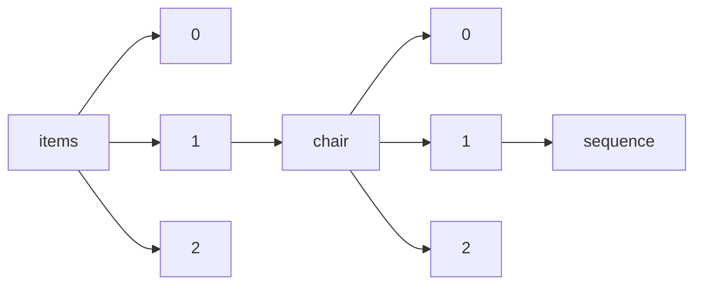

!!! warning "This document is not official Crossref documentation"
# Sequence
PATH = items/array/chair/array/sequence(1)  
Occurs 32 030 times  
Unique values: 2  
{ .annotate }

1. A route to an element, for example:  
   The route "items/array/chair/array/sequence" corresponds to navigating through the JSON indices as  
   ["items"][0]["chair"][0]["sequence"]  

| **Row** | **Value** `String` | **Count** `Int64` |
|--------:|----------------------:|---------------------:|
| **1**   | additional            | 21 500               |
| **2**   | first                 | 10 530               |

