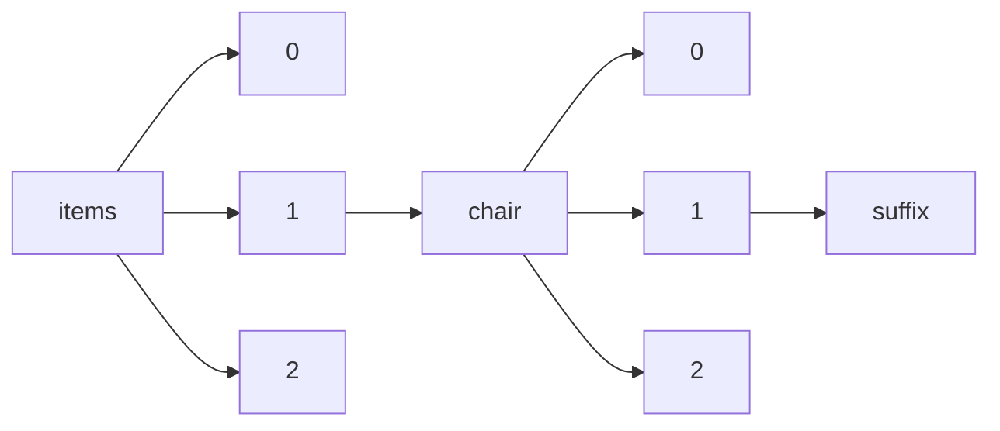

!!! warning "This document is not official Crossref documentation"
# Suffix
PATH = items/array/chair/array/suffix(1)  
Occurs 98 times  
Unique values: 18  
{ .annotate }

1. A route to an element, for example:  
   The route "items/array/chair/array/suffix" corresponds to navigating through the JSON indices as  
   ["items"][0]["chair"][0]["suffix"]  

| **Row** | **Value** `String` | **Count** `Int64` |
|--------:|----------------------:|---------------------:|
| **1**   | MD                    | 40                   |
| **2**   | MD, PhD               | 14                   |
| **3**   | Prof.                 | 9                    |
| **4**   | Jr.                   | 7                    |
| **5**   | MD, FRCGP             | 4                    |
| **6**   | PhD                   | 4                    |
| **7**   | MD, FRCP              | 3                    |
| **8**   | MBBS, MD              | 3                    |
| **9**   | MD, MSPH              | 3                    |
| **10**  | Esquire               | 2                    |
| **11**  | II                    | 2                    |
| **12**  | RN, PhD               | 1                    |
| **13**  | PhD.                  | 1                    |
| **14**  | MSW, PhD              | 1                    |
| **15**  | MBBS                  | 1                    |
| **16**  | JR                    | 1                    |
| **17**  | Chitral               | 1                    |
| **18**  | Dr                    | 1                    |

