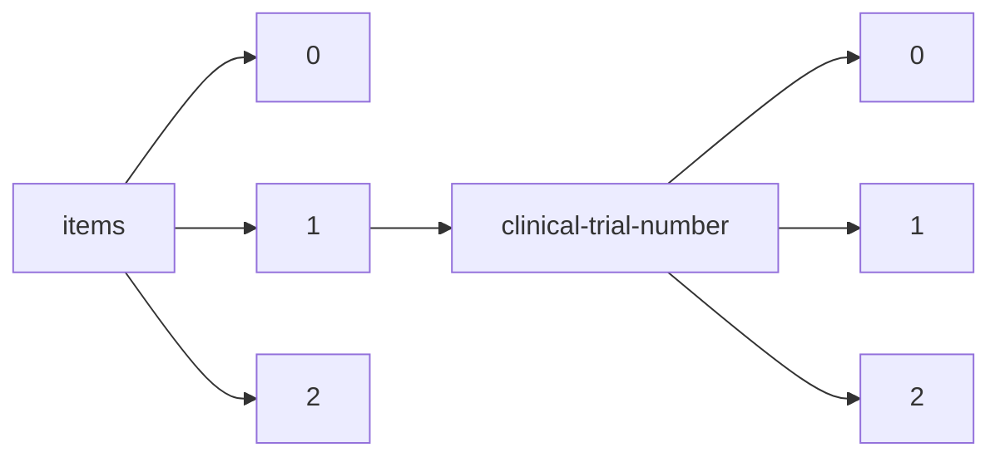

!!! warning "This document is not official Crossref documentation"
# Elements
PATH = items/array/clinical-trial-number/array(1)  
Occurs 40 440 times  
{ .annotate }

1. A route to an element, for example:  
   The route "items/array/clinical-trial-number/array" corresponds to navigating through the JSON indices as  
   ["items"][0]["clinical-trial-number"][0]  

## Clinical-trial-number
See more information: [items/array/clinical-trial-number/array/clinical-trial-number](clinical-trial-number/index.md)  
Occurs 40 440 timess  
Unique values: > 999  

!!! note "Due to current limitations, only the first 1,000 unique values are counted."

| **Row** | **Value** `String` | **Count** `Int64` |
|--------:|----------------------:|---------------------:|
| **1**   | nct01877668           | 51                   |
| **2**   | nct01882439           | 44                   |
| **3**   | nct00410384           | 39                   |
| **4**   | nct00424476           | 31                   |
| **5**   | nct00853385           | 29                   |
| **6**   | nct02349295           | 29                   |
| **7**   | nct02092467           | 28                   |
| **8**   | nct00360815           | 27                   |
| **9**   | nct01179048           | 26                   |
| **10**  | nct00000620           | 26                   |
| ... | ... | ... |

## Registry
See more information: [items/array/clinical-trial-number/array/registry](registry/index.md)  
Occurs 40 440 timess  
Unique values: 20  

| **Row** | **Value** `String`                  | **Count** `Int64` |
|--------:|---------------------------------------:|---------------------:|
| **1**   | 10.18810/clinical-trials-gov           | 35 554               |
| **2**   | 10.18810/isrctn                        | 2 685                |
| **3**   | 10.18810/umin-japan                    | 427                  |
| **4**   | 10.18810/chictr                        | 360                  |
| **5**   | 10.18810/anzctr                        | 307                  |
| **6**   | 10.18810/euctr                         | 255                  |
| **7**   | 10.18810/dutch-trial-register          | 247                  |
| **8**   | 10.18810/drks                          | 207                  |
| **9**   | 10.18810/irct                          | 108                  |
| **10**  | 10.18810/clinical-trial-registry-india | 87                   |
| ... | ... | ... |

## Type
See more information: [items/array/clinical-trial-number/array/type](type/index.md)  
Occurs 2 943 timess  
Unique values: 3  

| **Row** | **Value** `String` | **Count** `Int64` |
|--------:|----------------------:|---------------------:|
| **1**   | results               | 1 696                |
| **2**   | preResults            | 1 097                |
| **3**   | postResults           | 150                  |

