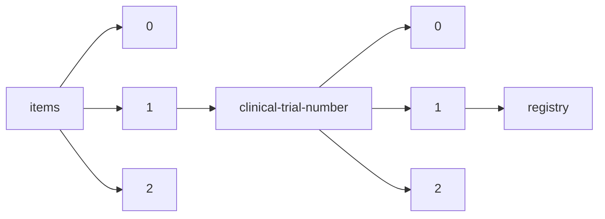

!!! warning "This document is not official Crossref documentation"
# Registry
PATH = items/array/clinical-trial-number/array/registry(1)  
Occurs 40 440 times  
Unique values: 20  
{ .annotate }

1. A route to an element, for example:  
   The route "items/array/clinical-trial-number/array/registry" corresponds to navigating through the JSON indices as  
   ["items"][0]["clinical-trial-number"][0]["registry"]  

| **Row** | **Value** `String`                  | **Count** `Int64` |
|--------:|---------------------------------------:|---------------------:|
| **1**   | 10.18810/clinical-trials-gov           | 35 554               |
| **2**   | 10.18810/isrctn                        | 2 685                |
| **3**   | 10.18810/umin-japan                    | 427                  |
| **4**   | 10.18810/chictr                        | 360                  |
| **5**   | 10.18810/anzctr                        | 307                  |
| **6**   | 10.18810/euctr                         | 255                  |
| **7**   | 10.18810/dutch-trial-register          | 247                  |
| **8**   | 10.18810/drks                          | 207                  |
| **9**   | 10.18810/irct                          | 108                  |
| **10**  | 10.18810/clinical-trial-registry-india | 87                   |
| **11**  | 10.18810/pactr                         | 66                   |
| **12**  | 10.18810/cris                          | 51                   |
| **13**  | 10.18810/tctr                          | 36                   |
| **14**  | 10.18810/utn                           | 19                   |
| **15**  | 10.18810/jprn                          | 12                   |
| **16**  | 10.18810/jma                           | 7                    |
| **17**  | 10.18810/rebec                         | 5                    |
| **18**  | 10.18810/slctr                         | 4                    |
| **19**  | 10.18810/rpec                          | 2                    |
| **20**  | 10.18810/jrct                          | 1                    |

