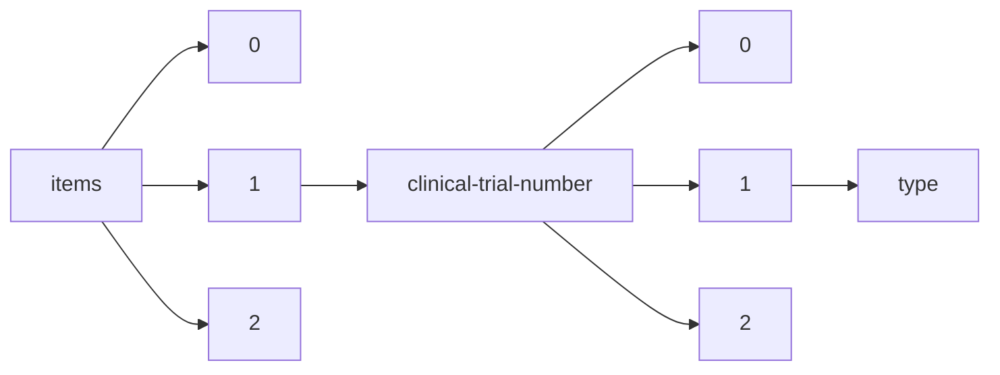

!!! warning "This document is not official Crossref documentation"
# Type
PATH = items/array/clinical-trial-number/array/type(1)  
Occurs 2 943 times  
Unique values: 3  
{ .annotate }

1. A route to an element, for example:  
   The route "items/array/clinical-trial-number/array/type" corresponds to navigating through the JSON indices as  
   ["items"][0]["clinical-trial-number"][0]["type"]  

| **Row** | **Value** `String` | **Count** `Int64` |
|--------:|----------------------:|---------------------:|
| **1**   | results               | 1 696                |
| **2**   | preResults            | 1 097                |
| **3**   | postResults           | 150                  |

