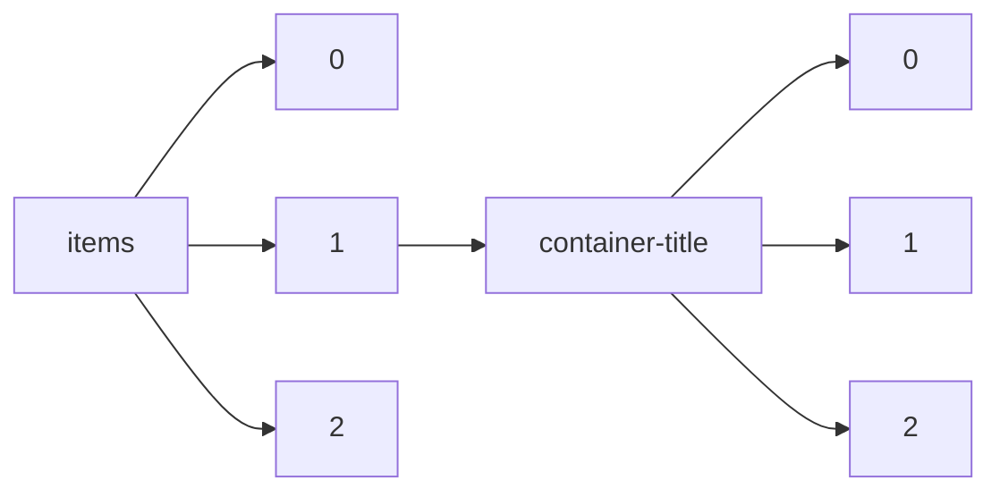

!!! warning "This document is not official Crossref documentation"
# Elements
PATH = items/array/container-title/array(1)  
Occurs 137 096 769 times  
Unique values: > 999  
{ .annotate }

1. A route to an element, for example:  
   The route "items/array/container-title/array" corresponds to navigating through the JSON indices as  
   ["items"][0]["container-title"][0]  

!!! note "Due to current limitations, only the first 1,000 unique values are counted."

| **Row** | **Value** `String`                                                                                | **Count** `Int64` |
|--------:|-----------------------------------------------------------------------------------------------------:|---------------------:|
| **1**   | SSRN Electronic Journal                                                                              | 657 877              |
| **2**   | Lecture Notes in Computer Science                                                                    | 508 694              |
| **3**   | ChemInform                                                                                           | 484 157              |
| **4**   | The Lancet                                                                                           | 458 650              |
| **5**   | ENCODE Datasets                                                                                      | 458 639              |
| **6**   | BMJ                                                                                                  | 432 635              |
| **7**   | SPIE Proceedings                                                                                     | 429 971              |
| **8**   | Nature                                                                                               | 422 336              |
| **9**   | Science                                                                                              | 367 596              |
| **10**  | PsycEXTRA Dataset                                                                                    | 339 754              |
| **11**  | Notes and Queries                                                                                    | 327 188              |
| **12**  | Chemischer Informationsdienst                                                                        | 303 573              |
| **13**  | Faculty Opinions – Post-Publication Peer Review of the Biomedical Literature                         | 232 121              |
| **14**  | Reactions Weekly                                                                                     | 216 360              |
| **15**  | AIP Conference Proceedings                                                                           | 209 261              |
| **16**  | Physical Review B                                                                                    | 203 095              |
| **17**  | IUCN Red List of Threatened Species                                                                  | 197 135              |
| **18**  | Choice Reviews Online                                                                                | 194 679              |
| **19**  | Journal of the American Chemical Society                                                             | 194 451              |
| **20**  | Journal of Biological Chemistry                                                                      | 193 451              |
| **21**  | JAMA: The Journal of the American Medical Association                                                | 191 954              |
| **22**  | Scientific American                                                                                  | 182 935              |
| **23**  | Journal of Physics: Conference Series                                                                | 171 967              |
| **24**  | Benezit Dictionary of Artists                                                                        | 168 717              |
| **25**  | Scientific Reports                                                                                   | 168 126              |
| **26**  | Chemical &amp; Engineering News Archive                                                              | 160 202              |
| **27**  | The Journal of the Acoustical Society of America                                                     | 154 306              |
| **28**  | Blood                                                                                                | 151 953              |
| **29**  | Proceedings of the National Academy of Sciences                                                      | 150 264              |
| **30**  | PLOS ONE                                                                                             | 149 290              |
| **31**  | Medical Journal of Australia                                                                         | 143 646              |
| **32**  | Advanced Materials Research                                                                          | 140 703              |
| **33**  | Journal of Applied Physics                                                                           | 134 836              |
| **34**  | The Journal of Chemical Physics                                                                      | 131 885              |
| **35**  | The American Historical Review                                                                       | 125 147              |
| **36**  | Physical Review Letters                                                                              | 125 102              |
| **37**  | Journal of Clinical Oncology                                                                         | 122 072              |
| **38**  | Applied Physics Letters                                                                              | 122 018              |
| **39**  | The Astrophysical Journal                                                                            | 119 501              |
| **40**  | Gastroenterology                                                                                     | 119 007              |
| **41**  | Journal of Urology                                                                                   | 115 157              |
| **42**  | PLoS ONE                                                                                             | 115 016              |
| **43**  | Analytical Chemistry                                                                                 | 109 934              |
| **44**  | Applied Mechanics and Materials                                                                      | 106 282              |
| **45**  | New England Journal of Medicine                                                                      | 105 413              |
| **46**  | Cancer Research                                                                                      | 104 628              |
| **47**  | SAE Technical Paper Series                                                                           | 104 177              |
| **48**  | The FASEB Journal                                                                                    | 102 917              |
| **49**  | Definitions                                                                                          | 101 010              |
| **50**  | Physical Review D                                                                                    | 96 473               |
| **51**  | Who Was Who                                                                                          | 96 285               |
| **52**  | Journal of the American College of Cardiology                                                        | 95 101               |
| **53**  | Nursing Standard                                                                                     | 94 817               |
| **54**  | Tetrahedron Letters                                                                                  | 91 966               |
| **55**  | Angewandte Chemie                                                                                    | 89 322               |
| **56**  | IOP Conference Series: Earth and Environmental Science                                               | 88 510               |
| **57**  | IOP Conference Series: Materials Science and Engineering                                             | 87 724               |
| **58**  | The Journal of Immunology                                                                            | 86 019               |
| **59**  | Journal of the American Medical Association                                                          | 85 336               |
| **60**  | SpringerReference                                                                                    | 85 196               |
| **61**  | ECS Meeting Abstracts                                                                                | 82 162               |
| **62**  | The NamesforLife Abstracts                                                                           | 81 279               |
| **63**  | American Journal of Obstetrics and Gynecology                                                        | 78 740               |
| **64**  | Biochemical and Biophysical Research Communications                                                  | 78 532               |
| **65**  | CABI Compendium                                                                                      | 78 369               |
| **66**  | Physical Review A                                                                                    | 76 857               |
| **67**  | Electronic Enlightenment Scholarly Edition of Correspondence                                         | 76 387               |
| **68**  | DMW - Deutsche Medizinische Wochenschrift                                                            | 75 478               |
| **69**  | The Journal of Organic Chemistry                                                                     | 74 826               |
| **70**  | Medicine &amp; Science in Sports &amp; Exercise                                                      | 74 440               |
| **71**  | Supplementum Epigraphicum Graecum                                                                    | 74 256               |
| **72**  | Who's Who                                                                                            | 69 093               |
| **73**  | Japanese Journal of Applied Physics                                                                  | 68 534               |
| **74**  | Monthly Notices of the Royal Astronomical Society                                                    | 68 268               |
| **75**  | Dictionary Geotechnical Engineering/Wörterbuch GeoTechnik                                            | 67 577               |
| **76**  | PsycTESTS Dataset                                                                                    | 67 459               |
| **77**  | Journal of the Society of Mechanical Engineers                                                       | 66 918               |
| **78**  | Advances in Intelligent Systems and Computing                                                        | 66 886               |
| **79**  | Art Sales Catalogues Online                                                                          | 65 222               |
| **80**  | Acta Horticulturae                                                                                   | 64 736               |
| **81**  | IFAC Proceedings Volumes                                                                             | 64 731               |
| **82**  | The Boston Medical and Surgical Journal                                                              | 64 329               |
| **83**  | MRS Proceedings                                                                                      | 63 877               |
| **84**  | International Journal of Radiation Oncology\*Biology\*Physics                                        | 62 886               |
| **85**  | Plastic and Reconstructive Surgery                                                                   | 61 640               |
| **86**  | Biophysical Journal                                                                                  | 60 695               |
| **87**  | Radiopaedia.org                                                                                      | 60 498               |
| **88**  | Journal of Alloys and Compounds                                                                      | 60 467               |
| **89**  | Materials Science Forum                                                                              | 60 364               |
| **90**  | All Days                                                                                             | 60 272               |
| **91**  | Annals of the New York Academy of Sciences                                                           | 60 168               |
| **92**  | Human Rights Documents online                                                                        | 58 517               |
| **93**  | Chest                                                                                                | 57 838               |
| **94**  | Wörterbuch GeoTechnik/Dictionary Geotechnical Engineering                                            | 57 120               |
| **95**  | The American Journal of the Medical Sciences                                                         | 56 511               |
| **96**  | Oxford Dictionary of National Biography                                                              | 56 399               |
| **97**  | AJN, American Journal of Nursing                                                                     | 56 037               |
| **98**  | Biochemistry                                                                                         | 55 786               |
| **99**  | Oxford Music Online                                                                                  | 55 603               |
| **100** | Physical Review E                                                                                    | 55 569               |
| **101** | Fresenius' Zeitschrift für analytische Chemie                                                        | 54 899               |
| **102** | Key Engineering Materials                                                                            | 54 468               |
| **103** | Value in Health                                                                                      | 54 296               |
| **104** | International Journal of Molecular Sciences                                                          | 53 975               |
| **105** | Landolt-Börnstein - Group III Condensed Matter                                                       | 53 452               |
| **106** | Communications in Computer and Information Science                                                   | 53 357               |
| **107** | JAMA                                                                                                 | 53 336               |
| **108** | Journal of Geophysical Research                                                                      | 52 611               |
| **109** | Sax's Dangerous Properties of Industrial Materials                                                   | 52 259               |
| **110** | Annals of Internal Medicine                                                                          | 52 229               |
| **111** | Sustainability                                                                                       | 51 836               |
| **112** | Brain Research                                                                                       | 51 545               |
| **113** | Circulation                                                                                          | 51 521               |
| **114** | IEEE Access                                                                                          | 51 486               |
| **115** | RSC Advances                                                                                         | 51 452               |
| **116** | Angewandte Chemie International Edition                                                              | 51 226               |
| **117** | Inpharma Weekly                                                                                      | 50 511               |
| **118** | CrossRef Listing of Deleted DOIs                                                                     | 50 229               |
| **119** | Radiology                                                                                            | 49 917               |
| **120** | Lecture Notes in Electrical Engineering                                                              | 49 915               |
| **121** | International Journal of Rock Mechanics and Mining Sciences &amp; Geomechanics Abstracts             | 49 817               |
| **122** | The Journal of Physical Chemistry                                                                    | 48 849               |
| **123** | Astronomische Nachrichten                                                                            | 48 706               |
| **124** | Chemical Physics Letters                                                                             | 48 273               |
| **125** | Journal of the Franklin Institute                                                                    | 47 918               |
| **126** | Physics Letters B                                                                                    | 47 840               |
| **127** | Academy of Management Proceedings                                                                    | 47 392               |
| **128** | Inorganic Chemistry                                                                                  | 47 118               |
| **129** | Physical Review                                                                                      | 47 006               |
| **130** | Journal of Chromatography A                                                                          | 46 764               |
| **131** | Inactive DOIs                                                                                        | 46 402               |
| **132** | Biochemical Journal                                                                                  | 46 198               |
| **133** | The Oxford Dictionary of National Biography                                                          | 46 007               |
| **134** | FEBS Letters                                                                                         | 45 938               |
| **135** | Journal of Education                                                                                 | 45 659               |
| **136** | Books Abroad                                                                                         | 45 643               |
| **137** | Archiv der Pharmazie                                                                                 | 44 991               |
| **138** | Southern Medical Journal                                                                             | 44 933               |
| **139** | Anesthesiology                                                                                       | 44 865               |
| **140** | Japanese Journal of Radiological Technology                                                          | 44 658               |
| **141** | Journal of Chemical Education                                                                        | 44 570               |
| **142** | The American Mathematical Monthly                                                                    | 44 552               |
| **143** | Applied Surface Science                                                                              | 43 961               |
| **144** | Science of The Total Environment                                                                     | 43 932               |
| **145** | Physics Today                                                                                        | 43 928               |
| **146** | AAPG Bulletin                                                                                        | 43 596               |
| **147** | Experimental Biology and Medicine                                                                    | 43 578               |
| **148** | Chemical Communications                                                                              | 43 286               |
| **149** | Fuel and Energy Abstracts                                                                            | 43 264               |
| **150** | International Journal of Environmental Research and Public Health                                    | 43 129               |
| **151** | American Journal of Gastroenterology                                                                 | 43 092               |
| **152** | Lexikon des gesamten Buchwesens Online                                                               | 42 596               |
| **153** | United Nations Treaty Series                                                                         | 42 292               |
| **154** | Methods in Molecular Biology                                                                         | 42 282               |
| **155** | Fertility and Sterility                                                                              | 42 238               |
| **156** | Journal of Applied Polymer Science                                                                   | 41 934               |
| **157** | Optics Express                                                                                       | 41 693               |
| **158** | Archives of Internal Medicine                                                                        | 41 218               |
| **159** | Chemischer Informationsdienst. Organische Chemie                                                     | 40 371               |
| **160** | The English Historical Review                                                                        | 39 673               |
| **161** | Journal of Bacteriology                                                                              | 39 046               |
| **162** | Alzheimer's &amp; Dementia                                                                           | 38 988               |
| **163** | The Journal of Physical Chemistry C                                                                  | 38 594               |
| **164** | Electronics Letters                                                                                  | 38 378               |
| **165** | Nuclear Instruments and Methods in Physics Research Section A: Accelerators, Spectrometers, Detector | 38 195               |
| **166** | Case Medical Research                                                                                | 38 185               |
| **167** | Journal of Allergy and Clinical Immunology                                                           | 37 990               |
| **168** | Vacuum                                                                                               | 37 931               |
| **169** | Transplantation                                                                                      | 37 899               |
| **170** | European Heart Journal                                                                               | 37 858               |
| **171** | Annals of Oncology                                                                                   | 37 716               |
| **172** | New Scientist                                                                                        | 37 673               |
| **173** | Critical Care Medicine                                                                               | 37 508               |
| **174** | Tetrahedron                                                                                          | 37 444               |
| **175** | Langmuir                                                                                             | 37 215               |
| **176** | Pediatric Research                                                                                   | 37 059               |
| **177** | Journal of Hepatology                                                                                | 36 988               |
| **178** | The American Journal of Cardiology                                                                   | 36 916               |
| **179** | Dutch Pamphlets Online                                                                               | 36 734               |
| **180** | Warfare in North America, c. 1756-1815                                                               | 36 563               |
| **181** | American Journal of Psychiatry                                                                       | 36 411               |
| **182** | Proceedings of the Royal Society of Medicine                                                         | 36 320               |
| **183** | Acta Crystallographica Section E Structure Reports Online                                            | 36 315               |
| **184** | Nature Communications                                                                                | 35 905               |
| **185** | Journal of Virology                                                                                  | 35 285               |
| **186** | Geological Society of America Abstracts with Programs                                                | 35 236               |
| **187** | Gastrointestinal Endoscopy                                                                           | 35 231               |
| **188** | Review of Scientific Instruments                                                                     | 34 890               |
| **189** | Pediatrics                                                                                           | 34 867               |
| **190** | Environmental Science &amp; Technology                                                               | 34 780               |
| **191** | Archives of Dermatology                                                                              | 34 756               |
| **192** | Journal of Agricultural and Food Chemistry                                                           | 34 622               |
| **193** | Applied Optics                                                                                       | 34 413               |
| **194** | Sensors                                                                                              | 34 285               |
| **195** | The Annals of Thoracic Surgery                                                                       | 34 155               |
| **196** | Open-File Report                                                                                     | 34 108               |
| **197** | Science News                                                                                         | 34 060               |
| **198** | Annals of the Rheumatic Diseases                                                                     | 33 590               |
| **199** | Klinische Wochenschrift                                                                              | 33 513               |
| **200** | Journal of the American Academy of Dermatology                                                       | 33 456               |
| **201** | The Journal of Nervous and Mental Disease                                                            | 33 367               |
| **202** | ACS Applied Materials &amp; Interfaces                                                               | 33 231               |
| **203** | Cancer                                                                                               | 33 187               |
| **204** | American Journal of Ophthalmology                                                                    | 32 913               |
| **205** | Bulletin of the Chemical Society of Japan                                                            | 32 758               |
| **206** | The Journal of Physical Chemistry B                                                                  | 32 495               |
| **207** | British Journal of Surgery                                                                           | 32 410               |
| **208** | Radiotherapy and Oncology                                                                            | 32 320               |
| **209** | Anesthesia &amp; Analgesia                                                                           | 32 253               |
| **210** | IEEE Transactions on Magnetics                                                                       | 32 147               |
| **211** | The Journal of Pediatrics                                                                            | 31 851               |
| **212** | Endocrinology                                                                                        | 31 653               |
| **213** | Contemporary Psychology: A Journal of Reviews                                                        | 31 608               |
| **214** | Veterinary Record                                                                                    | 31 598               |
| **215** | Neurology                                                                                            | 31 411               |
| **216** | Emerald Expert Briefings                                                                             | 31 340               |
| **217** | The American Journal of Nursing                                                                      | 31 238               |
| **218** | American Political Science Review                                                                    | 31 064               |
| **219** | Applied Sciences                                                                                     | 31 017               |
| **220** | The Musical Times                                                                                    | 30 899               |
| **221** | American Heart Journal                                                                               | 30 896               |
| **222** | Physics Letters A                                                                                    | 30 602               |
| **223** | InPharma                                                                                             | 30 474               |
| **224** | World Literature Today                                                                               | 30 468               |
| **225** | Thin Solid Films                                                                                     | 30 449               |
| **226** | Berichte der deutschen chemischen Gesellschaft                                                       | 30 423               |
| **227** | Solid State Communications                                                                           | 30 170               |
| **228** | The ANNALS of the American Academy of Political and Social Science                                   | 29 827               |
| **229** | International Affairs                                                                                | 29 826               |
| **230** | Monthly Weather Review                                                                               | 29 720               |
| **231** | Journal of The Electrochemical Society                                                               | 29 699               |
| **232** | Journal of the Physical Society of Japan                                                             | 29 389               |
| **233** | Neurosurgery                                                                                         | 29 350               |
| **234** | Molecules                                                                                            | 29 280               |
| **235** | Journal of Organometallic Chemistry                                                                  | 29 234               |
| **236** | Acta Physica Sinica                                                                                  | 29 213               |
| **237** | The Japanese Journal of Urology                                                                      | 28 884               |
| **238** | Zootaxa                                                                                              | 28 826               |
| **239** | Journal of Magnetism and Magnetic Materials                                                          | 28 824               |
| **240** | Macromolecules                                                                                       | 28 805               |
| **241** | Journal of Economic Entomology                                                                       | 28 563               |
| **242** | Springer-Lehrbuch                                                                                    | 28 463               |
| **243** | Procedia - Social and Behavioral Sciences                                                            | 28 383               |
| **244** | Proceedings of the American Mathematical Society                                                     | 28 363               |
| **245** | The Quarterly Review of Biology                                                                      | 28 237               |
| **246** | Encyclopedic Dictionary of Polymers                                                                  | 28 200               |
| **247** | Journal of Animal Science                                                                            | 28 096               |
| **248** | E3S Web of Conferences                                                                               | 27 909               |
| **249** | Encyclopédie de l’Islam                                                                              | 27 898               |
| **250** | Nucleic Acids Research                                                                               | 27 879               |
| **251** | The Journal of Physiology                                                                            | 27 639               |
| **252** | Medical Physics                                                                                      | 27 570               |
| **253** | Industrial &amp; Engineering Chemistry                                                               | 27 562               |
| **254** | Physical Chemistry Chemical Physics                                                                  | 27 454               |
| **255** | Medicine                                                                                             | 27 389               |
| **256** | Archives of Biochemistry and Biophysics                                                              | 27 288               |
| **257** | Japanese Journal of Pharmacology                                                                     | 27 282               |
| **258** | Procedia Engineering                                                                                 | 27 104               |
| **259** | ACS Symposium Series                                                                                 | 27 090               |
| **260** | The SHAFR Guide Online                                                                               | 26 930               |
| **261** | The Classical Review                                                                                 | 26 802               |
| **262** | European Journal of Cancer                                                                           | 26 704               |
| **263** | The Journal of the American Dental Association                                                       | 26 479               |
| **264** | Lexicon Gregorianum Online                                                                           | 26 459               |
| **265** | Diabetes                                                                                             | 26 437               |
| **266** | Oxford Art Online                                                                                    | 26 277               |
| **267** | Physical Review C                                                                                    | 26 270               |
| **268** | American Anthropologist                                                                              | 26 224               |
| **269** | Energies                                                                                             | 26 162               |
| **270** | The Analyst                                                                                          | 26 128               |
| **271** | Experientia                                                                                          | 26 020               |
| **272** | Advances in Experimental Medicine and Biology                                                        | 25 924               |
| **273** | Chinese Science Bulletin                                                                             | 25 890               |
| **274** | The American Journal of Surgery                                                                      | 25 831               |
| **275** | European Neuropsychopharmacology                                                                     | 25 694               |
| **276** | European Journal of Pharmacology                                                                     | 25 605               |
| **277** | Journal of Dairy Science                                                                             | 25 465               |
| **278** | European Journal of Biochemistry                                                                     | 25 305               |
| **279** | Archives of Ophthalmology                                                                            | 25 277               |
| **280** | Analytica Chimica Acta                                                                               | 25 145               |
| **281** | Die Naturwissenschaften                                                                              | 25 143               |
| **282** | Journal of Hypertension                                                                              | 25 114               |
| **283** | European Psychiatry                                                                                  | 25 104               |
| **284** | Surface Science                                                                                      | 25 092               |
| **285** | The Modern Language Review                                                                           | 24 619               |
| **286** | The Mathematical Gazette                                                                             | 24 589               |
| **287** | Journal of the American Dietetic Association                                                         | 24 545               |
| **288** | Zeitschrift für Angewandte Chemie                                                                    | 24 354               |
| **289** | Nuclear Physics A                                                                                    | 24 198               |
| **290** | Journal of Investigative Dermatology                                                                 | 24 185               |
| **291** | Annals of Surgery                                                                                    | 24 115               |
| **292** | Journal of Molecular Biology                                                                         | 24 044               |
| **293** | French Studies                                                                                       | 24 038               |
| **294** | Zeitschrift für Physikalische Chemie                                                                 | 23 983               |
| **295** | Biochemical Society Transactions                                                                     | 23 957               |
| **296** | Psychological Reports                                                                                | 23 936               |
| **297** | IUPAC Standards Online                                                                               | 23 931               |
| **298** | Geophysical Research Letters                                                                         | 23 877               |
| **299** | Landolt-Börnstein - Group IV Physical Chemistry                                                      | 23 877               |
| **300** | Lecture Notes in Networks and Systems                                                                | 23 872               |
| **301** | RöFo - Fortschritte auf dem Gebiet der Röntgenstrahlen und der bildgebenden Verfahren                | 23 848               |
| **302** | HortScience                                                                                          | 23 773               |
| **303** | American Journal of Roentgenology                                                                    | 23 655               |
| **304** | Journal of Pediatric Surgery                                                                         | 23 587               |
| **305** | Journal of Applied Physiology                                                                        | 23 574               |
| **306** | MATEC Web of Conferences                                                                             | 23 455               |
| **307** | Agricultural and Biological Chemistry                                                                | 23 442               |
| **308** | Dictionary of Gems and Gemology                                                                      | 23 296               |
| **309** | American Journal of Health-System Pharmacy                                                           | 23 272               |
| **310** | Review &amp; Expositor                                                                               | 23 242               |
| **311** | Oncotarget                                                                                           | 23 214               |
| **312** | Journal of Materials Science                                                                         | 23 014               |
| **313** | Journal of AOAC INTERNATIONAL                                                                        | 22 966               |
| **314** | American Journal of Physiology-Legacy Content                                                        | 22 939               |
| **315** | Phytochemistry                                                                                       | 22 839               |
| **316** | Journal of Vision                                                                                    | 22 838               |
| **317** | Stroke                                                                                               | 22 835               |
| **318** | Kindlers Literatur Lexikon (KLL)                                                                     | 22 683               |
| **319** | The Geographical Journal                                                                             | 22 638               |
| **320** | The Journal of Clinical Endocrinology &amp; Metabolism                                               | 22 632               |
| **321** | The London, Edinburgh, and Dublin Philosophical Magazine and Journal of Science                      | 22 618               |
| **322** | European Urology Supplements                                                                         | 22 499               |
| **323** | Journal of the Neurological Sciences                                                                 | 22 436               |
| **324** | Neuroscience Letters                                                                                 | 22 173               |
| **325** | Materials Today: Proceedings                                                                         | 22 141               |
| **326** | The Journal of Neuroscience                                                                          | 22 134               |
| **327** | Journal of Crystal Growth                                                                            | 22 068               |
| **328** | Astronomy &amp; Astrophysics                                                                         | 22 034               |
| **329** | Lecture Notes in Mathematics                                                                         | 21 983               |
| **330** | International Journal of Hydrogen Energy                                                             | 21 865               |
| **331** | Chemical and Pharmaceutical Bulletin                                                                 | 21 856               |
| **332** | Electrochimica Acta                                                                                  | 21 812               |
| **333** | Bulletin of the Academy of Sciences of the USSR Division of Chemical Science                         | 21 793               |
| **334** | The Laryngoscope                                                                                     | 21 770               |
| **335** | Analytical Biochemistry                                                                              | 21 652               |
| **336** | Microscopy and Microanalysis                                                                         | 21 516               |
| **337** | Chemosphere                                                                                          | 21 434               |
| **338** | The Proceedings of JSME annual Conference on Robotics and Mechatronics (Robomec)                     | 21 429               |
| **339** | Journal of Clinical Investigation                                                                    | 21 423               |
| **340** | School Science and Mathematics                                                                       | 21 393               |
| **341** | American Journal of Sociology                                                                        | 21 152               |
| **342** | Archives of Pediatrics &amp; Adolescent Medicine                                                     | 21 125               |
| **343** | The British Journal of Radiology                                                                     | 21 060               |
| **344** | Bulletin of Experimental Biology and Medicine                                                        | 20 966               |
| **345** | Journal of the American Ceramic Society                                                              | 20 954               |
| **346** | British Journal of Dermatology                                                                       | 20 939               |
| **347** | physica status solidi (b)                                                                            | 20 861               |
| **348** | The Astronomical Journal                                                                             | 20 858               |
| **349** | Geological Magazine                                                                                  | 20 720               |
| **350** | Annals and Magazine of Natural History                                                               | 20 595               |
| **351** | Oxford Scholarship Online                                                                            | 20 440               |
| **352** | Nuclear Physics B                                                                                    | 20 420               |
| **353** | Virology                                                                                             | 20 378               |
| **354** | American Journal of Clinical Pathology                                                               | 20 196               |
| **355** | Computer Science and Communications Dictionary                                                       | 20 087               |
| **356** | International Journal of Computer Applications                                                       | 19 960               |
| **357** | Microelectronics Reliability                                                                         | 19 914               |
| **358** | Frontiers in Psychology                                                                              | 19 906               |
| **359** | International Journal of Current Microbiology and Applied Sciences                                   | 19 844               |
| **360** | Journal of Neurochemistry                                                                            | 19 825               |
| **361** | Materials Science and Engineering: A                                                                 | 19 737               |
| **362** | Speculum                                                                                             | 19 704               |
| **363** | Environmental Science and Pollution Research                                                         | 19 663               |
| **364** | Perceptual and Motor Skills                                                                          | 19 648               |
| **365** | The American Journal of Medicine                                                                     | 19 583               |
| **366** | Poultry Science                                                                                      | 19 563               |
| **367** | Electrical Engineering                                                                               | 19 539               |
| **368** | Chemische Berichte                                                                                   | 19 445               |
| **369** | Archives of Disease in Childhood                                                                     | 19 391               |
| **370** | The Journal of American History                                                                      | 19 380               |
| **371** | Acta Crystallographica Section A Foundations of Crystallography                                      | 19 365               |
| **372** | American National Biography Online                                                                   | 19 365               |
| **373** | American Journal of International Law                                                                | 19 332               |
| **374** | Endocrine Abstracts                                                                                  | 19 332               |
| **375** | Journal - American Water Works Association                                                           | 19 304               |
| **376** | Harvard Law Review                                                                                   | 19 282               |
| **377** | Anthropology News                                                                                    | 19 272               |
| **378** | Nuclear Instruments and Methods in Physics Research Section B: Beam Interactions with Materials and  | 19 263               |
| **379** | Acta Medica Scandinavica                                                                             | 19 251               |
| **380** | The Journal of Physical Chemistry A                                                                  | 19 226               |
| **381** | Journal of Cleaner Production                                                                        | 19 121               |
| **382** | The Auk                                                                                              | 19 119               |
| **383** | Clinical Chemistry                                                                                   | 19 107               |
| **384** | The Journal of the Society of Chemical Industry, Japan                                               | 19 094               |
| **385** | Helvetica Chimica Acta                                                                               | 19 059               |
| **386** | African American Studies Center                                                                      | 19 024               |
| **387** | Methods in Enzymology                                                                                | 19 010               |
| **388** | Canadian Journal of Chemistry                                                                        | 18 929               |
| **389** | Military Medicine                                                                                    | 18 914               |
| **390** | Journal of Mental Science                                                                            | 18 857               |
| **391** | Journal of the Society of Chemical Industry                                                          | 18 832               |
| **392** | Urology                                                                                              | 18 823               |
| **393** | Physica B: Condensed Matter                                                                          | 18 753               |
| **394** | Infection and Immunity                                                                               | 18 709               |
| **395** | Archives of Surgery                                                                                  | 18 649               |
| **396** | Atherosclerosis                                                                                      | 18 612               |
| **397** | Nephrology Dialysis Transplantation                                                                  | 18 466               |
| **398** | The Journal of Nutrition                                                                             | 18 440               |
| **399** | Journal of Physics: Condensed Matter                                                                 | 18 431               |
| **400** | Encyclopedia of Genetics, Genomics, Proteomics and Informatics                                       | 18 413               |
| **401** | Innovation in Aging                                                                                  | 18 400               |
| **402** | The Proceedings of the Annual Convention of the Japanese Psychological Association                   | 18 362               |
| **403** | Life Sciences                                                                                        | 18 340               |
| **404** | Plant Physiology                                                                                     | 18 332               |
| **405** | British Dental Journal                                                                               | 18 283               |
| **406** | Der Neue Pauly                                                                                       | 18 263               |
| **407** | British Journal of Psychiatry                                                                        | 18 231               |
| **408** | Public Health                                                                                        | 18 117               |
| **409** | The Science News-Letter                                                                              | 18 086               |
| **410** | Journal of Physics A: Mathematical and General                                                       | 18 068               |
| **411** | YAKUGAKU ZASSHI                                                                                      | 18 055               |
| **412** | Procedia Computer Science                                                                            | 17 979               |
| **413** | IEEE Transactions on Nuclear Science                                                                 | 17 975               |
| **414** | Archives of Otolaryngology - Head and Neck Surgery                                                   | 17 896               |
| **415** | AIAA Journal                                                                                         | 17 880               |
| **416** | Hispanic American Historical Review                                                                  | 17 853               |
| **417** | Anaesthesia                                                                                          | 17 826               |
| **418** | Journal of Colloid and Interface Science                                                             | 17 821               |
| **419** | Journal of Experimental Medicine                                                                     | 17 806               |
| **420** | Postgraduate Medicine                                                                                | 17 796               |
| **421** | Materials                                                                                            | 17 643               |
| **422** | Ceramics International                                                                               | 17 559               |
| **423** | Psychiatric Services                                                                                 | 17 550               |
| **424** | Optics Letters                                                                                       | 17 541               |
| **425** | Polymer                                                                                              | 17 462               |
| **426** | Lecture Notes in Physics                                                                             | 17 449               |
| **427** | Planta Medica                                                                                        | 17 394               |
| **428** | Australian Veterinary Journal                                                                        | 17 325               |
| **429** | Journal of Vascular Surgery                                                                          | 17 283               |
| **430** | The Journal of Asian Studies                                                                         | 17 280               |
| **431** | Journal of Medicinal Chemistry                                                                       | 17 278               |
| **432** | The American Journal of Clinical Nutrition                                                           | 17 261               |
| **433** | The Fairchild Books Dictionary of Textiles                                                           | 17 234               |
| **434** | Contemporary Sociology                                                                               | 17 228               |
| **435** | Angewandte Chemie International Edition in English                                                   | 17 210               |
| **436** | Journal of the American Statistical Association                                                      | 17 181               |
| **437** | Molecular and Cellular Biology                                                                       | 17 035               |
| **438** | Bulletin of the American Meteorological Society                                                      | 17 031               |
| **439** | Theology                                                                                             | 17 012               |
| **440** | Mycologia                                                                                            | 16 992               |
| **441** | Social Forces                                                                                        | 16 906               |
| **442** | Journal of Molecular and Cellular Cardiology                                                         | 16 873               |
| **443** | Acta Paediatrica                                                                                     | 16 861               |
| **444** | Proceedings                                                                                          | 16 833               |
| **445** | Hawley's Condensed Chemical Dictionary                                                               | 16 798               |
| **446** | Annals of Emergency Medicine                                                                         | 16 786               |
| **447** | Physical Therapy                                                                                     | 16 775               |
| **448** | International Journal of Cardiology                                                                  | 16 769               |
| **449** | American Journal of Public Health and the Nations Health                                             | 16 700               |
| **450** | Catalysis from A to Z                                                                                | 16 681               |
| **451** | American Journal of Public Health                                                                    | 16 595               |
| **452** | The English Journal                                                                                  | 16 569               |
| **453** | Journal of Infectious Diseases                                                                       | 16 555               |
| **454** | Agronomy Journal                                                                                     | 16 530               |
| **455** | The Expository Times                                                                                 | 16 514               |
| **456** | The Journal of Thoracic and Cardiovascular Surgery                                                   | 16 507               |
| **457** | ECS Transactions                                                                                     | 16 467               |
| **458** | Experimental Cell Research                                                                           | 16 428               |
| **459** | Postgraduate Medical Journal                                                                         | 16 249               |
| **460** | Nursing                                                                                              | 16 245               |
| **461** | Chemistry Letters                                                                                    | 16 226               |
| **462** | Annalen der Physik                                                                                   | 16 170               |
| **463** | Proceedings of the Water Environment Federation                                                      | 16 132               |
| **464** | Clinical Orthopaedics and Related Research                                                           | 16 072               |
| **465** | The proceedings of the JSME annual meeting                                                           | 16 040               |
| **466** | Tetsu-to-Hagane                                                                                      | 15 984               |
| **467** | Crop Science                                                                                         | 15 973               |
| **468** | Cureus                                                                                               | 15 951               |
| **469** | The American Naturalist                                                                              | 15 918               |
| **470** | Bulletin of the American Mathematical Society                                                        | 15 904               |
| **471** | Organic Letters                                                                                      | 15 872               |
| **472** | Bulletin des Médecins Suisses                                                                        | 15 833               |
| **473** | The Yale Law Journal                                                                                 | 15 818               |
| **474** | Schweizerische Ärztezeitung                                                                          | 15 807               |
| **475** | Encyclopedia of Cancer                                                                               | 15 784               |
| **476** | Michigan Law Review                                                                                  | 15 639               |
| **477** | Journal of Neurology, Neurosurgery &amp; Psychiatry                                                  | 15 634               |
| **478** | Brazilian Journal of Development                                                                     | 15 619               |
| **479** | Clinical Science                                                                                     | 15 588               |
| **480** | Obstetrics &amp; Gynecology                                                                          | 15 553               |
| **481** | Encyclopedic Dictionary of Landscape and Urban Planning                                              | 15 444               |
| **482** | Soil Science Society of America Journal                                                              | 15 403               |
| **483** | Applied and Environmental Microbiology                                                               | 15 380               |
| **484** | American Journal of Physics                                                                          | 15 354               |
| **485** | BJOG: An International Journal of Obstetrics and Gynaecology                                         | 15 348               |
| **486** | The Modern Language Journal                                                                          | 15 243               |
| **487** | JAPANES JOURNAL OF MEDICAL INSTRUMENTATION                                                           | 15 157               |
| **488** | The Journal of Theological Studies                                                                   | 15 104               |
| **489** | The Journal of Higher Education                                                                      | 15 083               |
| **490** | Eos, Transactions American Geophysical Union                                                         | 15 079               |
| **491** | Toxicology Letters                                                                                   | 14 980               |
| **492** | Synfacts                                                                                             | 14 977               |
| **493** | Clinica Chimica Acta                                                                                 | 14 976               |
| **494** | Acta Radiologica                                                                                     | 14 964               |
| **495** | Journal of Geography (Chigaku Zasshi)                                                                | 14 938               |
| **496** | Le Journal de Physique Colloques                                                                     | 14 883               |
| **497** | Collection of Czechoslovak Chemical Communications                                                   | 14 836               |
| **498** | Seibutsu Butsuri                                                                                     | 14 812               |
| **499** | Chemistry - A European Journal                                                                       | 14 757               |
| **500** | Academic Medicine                                                                                    | 14 716               |
| **501** | Optics Communications                                                                                | 14 709               |
| **502** | Journal of Food Science                                                                              | 14 650               |
| **503** | Research, Society and Development                                                                    | 14 636               |
| **504** | The Economic Journal                                                                                 | 14 622               |
| **505** | The American Biology Teacher                                                                         | 14 617               |
| **506** | Obstetrical &amp; Gynecological Survey                                                               | 14 602               |
| **507** | Journal of Molecular Structure                                                                       | 14 587               |
| **508** | Transactions of the Royal Society of Tropical Medicine and Hygiene                                   | 14 551               |
| **509** | Biochemical Pharmacology                                                                             | 14 524               |
| **510** | Water Science and Technology                                                                         | 14 512               |
| **511** | Journal of the Chemical Society (Resumed)                                                            | 14 452               |
| **512** | Annals of Otology, Rhinology &amp; Laryngology                                                       | 14 449               |
| **513** | Energy Procedia                                                                                      | 14 428               |
| **514** | Publications of the Astronomical Society of the Pacific                                              | 14 393               |
| **515** | Dictionary of Minor Planet Names                                                                     | 14 381               |
| **516** | Journal of Pharmaceutical Sciences                                                                   | 14 375               |
| **517** | The Journal of Trauma: Injury, Infection, and Critical Care                                          | 14 366               |
| **518** | Journal of Nuclear Materials                                                                         | 14 362               |
| **519** | Annales. Histoire, Sciences Sociales                                                                 | 14 354               |
| **520** | Journal of Non-Crystalline Solids                                                                    | 14 326               |
| **521** | Physica C: Superconductivity                                                                         | 14 320               |
| **522** | Chemie Ingenieur Technik                                                                             | 14 296               |
| **523** | Journal of Clinical Pathology                                                                        | 14 218               |
| **524** | Nippon Jibiinkoka Gakkai Kaiho                                                                       | 14 205               |
| **525** | Journal of the Chemical Society, Chemical Communications                                             | 14 188               |
| **526** | Open Forum Infectious Diseases                                                                       | 14 170               |
| **527** | Hepatology                                                                                           | 14 165               |
| **528** | Thrombosis and Haemostasis                                                                           | 14 126               |
| **529** | The Journal of Biochemistry                                                                          | 14 102               |
| **530** | Acta Crystallographica Section C Crystal Structure Communications                                    | 14 086               |
| **531** | The Journal of Comparative Neurology                                                                 | 14 077               |
| **532** | British Journal of Ophthalmology                                                                     | 14 057               |
| **533** | Nuclear Instruments and Methods                                                                      | 13 986               |
| **534** | Physica Status Solidi (a)                                                                            | 13 962               |
| **535** | Isis                                                                                                 | 13 913               |
| **536** | Foreign Affairs                                                                                      | 13 908               |
| **537** | Nihon Naika Gakkai Zasshi                                                                            | 13 829               |
| **538** | Ecology                                                                                              | 13 822               |
| **539** | The Canadian Entomologist                                                                            | 13 714               |
| **540** | Chemical Engineering Journal                                                                         | 13 709               |
| **541** | Transplantation Proceedings                                                                          | 13 708               |
| **542** | Journal of the American Oriental Society                                                             | 13 706               |
| **543** | Victorian Reports                                                                                    | 13 654               |
| **544** | Oxford Handbooks Online                                                                              | 13 634               |
| **545** | Journal of Clinical Microbiology                                                                     | 13 594               |
| **546** | Österreichische Musikzeitschrift                                                                     | 13 583               |
| **547** | Biology of Reproduction                                                                              | 13 536               |
| **548** | TRANSACTIONS OF THE JAPAN SOCIETY OF MECHANICAL ENGINEERS Series B                                   | 13 513               |
| **549** | The Dictionary of Genomics, Transcriptomics and Proteomics                                           | 13 500               |
| **550** | Journal of Sound and Vibration                                                                       | 13 484               |
| **551** | SciVee                                                                                               | 13 450               |
| **552** | Environmental Health Perspectives                                                                    | 13 410               |
| **553** | Journal of Physics D: Applied Physics                                                                | 13 407               |
| **554** | Symposium - International Astronomical Union                                                         | 13 391               |
| **555** | Journal of the Optical Society of America                                                            | 13 341               |
| **556** | Measurement Techniques                                                                               | 13 335               |
| **557** | Acta Chemica Scandinavica                                                                            | 13 305               |
| **558** | IEEE Transactions on Microwave Theory and Techniques                                                 | 13 296               |
| **559** | Frontiers in Microbiology                                                                            | 13 268               |
| **560** | Bulletin of the School of Oriental and African Studies                                               | 13 220               |
| **561** | Encyclopedic Dictionary of Genetics, Genomics and Proteomics                                         | 13 194               |
| **562** | HETEROCYCLES                                                                                         | 13 161               |
| **563** | Hoppe-Seyler´s Zeitschrift für physiologische Chemie                                                 | 13 158               |
| **564** | Bulletin de la Société Botanique de France                                                           | 13 151               |
| **565** | Encyclopaedia of Islam, Second Edition                                                               | 13 140               |
| **566** | Proceedings, annual meeting, Electron Microscopy Society of America                                  | 13 136               |
| **567** | Journal of Dental Research                                                                           | 13 101               |
| **568** | IFAC-PapersOnLine                                                                                    | 13 100               |
| **569** | TRANSACTIONS OF THE JAPAN SOCIETY OF MECHANICAL ENGINEERS Series C                                   | 13 098               |
| **570** | Journal of Cell Biology                                                                              | 13 095               |
| **571** | British Journal of Anaesthesia                                                                       | 13 083               |
| **572** | Electroencephalography and Clinical Neurophysiology                                                  | 13 058               |
| **573** | The Journal of Bone &amp; Joint Surgery                                                              | 12 946               |
| **574** | Inorganica Chimica Acta                                                                              | 12 886               |
| **575** | Optometry and Vision Science                                                                         | 12 829               |
| **576** | Current History                                                                                      | 12 781               |
| **577** | Journal of Neurosurgery                                                                              | 12 737               |
| **578** | Frontiers in Immunology                                                                              | 12 661               |
| **579** | Zeitschrift für analytische Chemie                                                                   | 12 619               |
| **580** | Journal of Physics C: Solid State Physics                                                            | 12 592               |
| **581** | European Journal of Public Health                                                                    | 12 578               |
| **582** | Acta Ophthalmologica                                                                                 | 12 577               |
| **583** | Encyclopedic Dictionary of Archaeology                                                               | 12 573               |
| **584** | JNCI: Journal of the National Cancer Institute                                                       | 12 568               |
| **585** | Genetics                                                                                             | 12 552               |
| **586** | Zeitschrift für Gastroenterologie                                                                    | 12 498               |
| **587** | Bioorganic &amp; Medicinal Chemistry Letters                                                         | 12 452               |
| **588** | Physics World                                                                                        | 12 436               |
| **589** | Journal of Mathematical Physics                                                                      | 12 382               |
| **590** | Acta Oto-Laryngologica                                                                               | 12 370               |
| **591** | Landolt-Börnstein - Group II Molecules and Radicals                                                  | 12 369               |
| **592** | FEMS Microbiology Letters                                                                            | 12 363               |
| **593** | Journal of Pharmacy and Pharmacology                                                                 | 12 327               |
| **594** | American Journal of Physiology-Heart and Circulatory Physiology                                      | 12 321               |
| **595** | Zeitschrift für Naturforschung A                                                                     | 12 277               |
| **596** | Columbia Law Review                                                                                  | 12 249               |
| **597** | British Journal of Haematology                                                                       | 12 223               |
| **598** | Survey of Anesthesiology                                                                             | 12 204               |
| **599** | The American Journal of Tropical Medicine and Hygiene                                                | 12 199               |
| **600** | Religion in Geschichte und Gegenwart                                                                 | 12 192               |
| **601** | The Journal of Laryngology &amp; Otology                                                             | 12 111               |
| **602** | Political Science Quarterly                                                                          | 12 090               |
| **603** | Practica Oto-Rhino-Laryngologica                                                                     | 12 045               |
| **604** | Landolt-Börnstein - Group I Elementary Particles, Nuclei and Atoms                                   | 12 031               |
| **605** | Botanical Gazette                                                                                    | 12 025               |
| **606** | Journal of Political Economy                                                                         | 11 973               |
| **607** | AORN Journal                                                                                         | 11 968               |
| **608** | Copeia                                                                                               | 11 936               |
| **609** | Zeitschrift für Naturforschung B                                                                     | 11 904               |
| **610** | Journal of Nanoscience and Nanotechnology                                                            | 11 860               |
| **611** | The Journal of Urology                                                                               | 11 822               |
| **612** | Molecular Therapy                                                                                    | 11 806               |
| **613** | Okayama Igakkai Zasshi (Journal of Okayama Medical Association)                                      | 11 761               |
| **614** | Mind                                                                                                 | 11 760               |
| **615** | Brill’s New Pauly                                                                                    | 11 633               |
| **616** | The Journal of Prosthetic Dentistry                                                                  | 11 589               |
| **617** | Journal of Catalysis                                                                                 | 11 586               |
| **618** | Social Service Review                                                                                | 11 559               |
| **619** | Zeitschrift f�r anorganische und allgemeine Chemie                                                   | 11 514               |
| **620** | International Journal of Gynecology &amp; Obstetrics                                                 | 11 513               |
| **621** | Journal of the American Oil Chemists' Society                                                        | 11 511               |
| **622** | Biochimica et Biophysica Acta (BBA) - Biomembranes                                                   | 11 504               |
| **623** | Heart                                                                                                | 11 502               |
| **624** | Music and Letters                                                                                    | 11 495               |
| **625** | Hydrobiologia                                                                                        | 11 432               |
| **626** | Journal of Marketing                                                                                 | 11 406               |
| **627** | Modern Language Notes                                                                                | 11 318               |
| **628** | AEA Randomized Controlled Trials                                                                     | 11 299               |
| **629** | Dermatology                                                                                          | 11 280               |
| **630** | Progress of Theoretical Physics                                                                      | 11 259               |
| **631** | Neuro-Oncology                                                                                       | 11 221               |
| **632** | Physics of Fluids                                                                                    | 11 210               |
| **633** | Journal of High Energy Physics                                                                       | 11 201               |
| **634** | Reactions                                                                                            | 11 180               |
| **635** | ISEE Conference Abstracts                                                                            | 11 174               |
| **636** | IEEE Transactions on Electron Devices                                                                | 11 144               |
| **637** | Developmental Biology                                                                                | 11 138               |
| **638** | Oral Surgery, Oral Medicine, Oral Pathology                                                          | 11 130               |
| **639** | Journal of Visual Impairment &amp; Blindness                                                         | 11 126               |
| **640** | Acta Psychiatrica Scandinavica                                                                       | 11 118               |
| **641** | Proceedings of the IEEE                                                                              | 11 118               |
| **642** | Journal of Vacuum Science &amp; Technology A: Vacuum, Surfaces, and Films                            | 11 096               |
| **643** | Gynecologic and Obstetric Investigation                                                              | 11 033               |
| **644** | Annals of the Entomological Society of America                                                       | 11 031               |
| **645** | Circulation Research                                                                                 | 11 015               |
| **646** | The Journal of the Kyushu Dental Society                                                             | 11 012               |
| **647** | Journal of Inorganic and Nuclear Chemistry                                                           | 11 004               |
| **648** | Studies in Surface Science and Catalysis                                                             | 10 969               |
| **649** | Foreign Law Guide                                                                                    | 10 956               |
| **650** | Collected Courses of the Hague Academy of International Law                                          | 10 951               |
| **651** | Journal of the agricultural chemical society of Japan                                                | 10 926               |
| **652** | Arthritis &amp; Rheumatism                                                                           | 10 912               |
| **653** | Transactions of the American Mathematical Society                                                    | 10 870               |
| **654** | Annalen der Physik und Chemie                                                                        | 10 854               |
| **655** | British Journal of Pharmacology                                                                      | 10 800               |
| **656** | Gut                                                                                                  | 10 779               |
| **657** | Lecture Notes in Mechanical Engineering                                                              | 10 741               |
| **658** | Gabii Project Reports Database                                                                       | 10 727               |
| **659** | Industrial &amp; Engineering Chemistry Research                                                      | 10 716               |
| **660** | JOURNAL OF THE SOCIETY OF BREWING,JAPAN                                                              | 10 674               |
| **661** | Notes                                                                                                | 10 657               |
| **662** | The Gerontologist                                                                                    | 10 656               |
| **663** | Proceedings of the Human Factors and Ergonomics Society Annual Meeting                               | 10 649               |
| **664** | International Journal of Cancer                                                                      | 10 643               |
| **665** | Fresenius' Zeitschrift f�r Analytische Chemie                                                        | 10 641               |
| **666** | Clinical Infectious Diseases                                                                         | 10 619               |
| **667** | The Journal of Religion                                                                              | 10 618               |
| **668** | Psychiatric News                                                                                     | 10 557               |
| **669** | Evolution                                                                                            | 10 511               |
| **670** | Recueil des Travaux Chimiques des Pays-Bas                                                           | 10 493               |
| **671** | Antimicrobial Agents and Chemotherapy                                                                | 10 480               |
| **672** | Journal of the Institution of Electrical Engineers                                                   | 10 426               |
| **673** | Man                                                                                                  | 10 426               |
| **674** | North China Daily News Online                                                                        | 10 390               |
| **675** | The Proceedings of Mechanical Engineering Congress, Japan                                            | 10 369               |
| **676** | American Journal of Epidemiology                                                                     | 10 348               |
| **677** | Physiologia Plantarum                                                                                | 10 348               |
| **678** | American Journal of Botany                                                                           | 10 348               |
| **679** | Physica Scripta                                                                                      | 10 342               |
| **680** | Antiquity                                                                                            | 10 318               |
| **681** | Geochimica et Cosmochimica Acta                                                                      | 10 315               |
| **682** | Ophthalmologica                                                                                      | 10 307               |
| **683** | Conference on Lasers and Electro-Optics                                                              | 10 219               |
| **684** | Physik Journal                                                                                       | 10 192               |
| **685** | Aircraft Engineering and Aerospace Technology                                                        | 10 132               |
| **686** | Metal Powder Report                                                                                  | 10 131               |
| **687** | Human Rights Documents Online                                                                        | 10 105               |
| **688** | European Journal of Cancer Supplements                                                               | 10 101               |
| **689** | Geological Formation Names of China (1866–2000)                                                      | 10 080               |
| **690** | The Mathematics Teacher                                                                              | 10 042               |
| **691** | Religion Past and Present                                                                            | 9 985                |
| **692** | Birds of the World                                                                                   | 9 983                |
| **693** | Thorax                                                                                               | 9 968                |
| **694** | Journal of Mathematical Analysis and Applications                                                    | 9 865                |
| **695** | Church History                                                                                       | 9 858                |
| **696** | Dictionary of Irish Biography                                                                        | 9 839                |
| **697** | Archives of Neurology                                                                                | 9 819                |
| **698** | The Journal of Parasitology                                                                          | 9 786                |
| **699** | Astrophysics and Space Science                                                                       | 9 772                |
| **700** | American Sociological Review                                                                         | 9 686                |
| **701** | European Journal of Anaesthesiology                                                                  | 9 679                |
| **702** | Acta Endocrinologica                                                                                 | 9 659                |
| **703** | BMJ Open                                                                                             | 9 659                |
| **704** | Polymer Science U.S.S.R.                                                                             | 9 634                |
| **705** | Pacific Affairs                                                                                      | 9 629                |
| **706** | C&amp;EN Global Enterprise                                                                           | 9 523                |
| **707** | NIPPON KAGAKU KAISHI                                                                                 | 9 511                |
| **708** | Chemistry of Heterocyclic Compounds                                                                  | 9 488                |
| **709** | Slavic Review                                                                                        | 9 486                |
| **710** | Cochrane Database of Systematic Reviews                                                              | 9 456                |
| **711** | Journal of the American Geriatrics Society                                                           | 9 427                |
| **712** | Journal of Clinical Medicine                                                                         | 9 415                |
| **713** | The School Review                                                                                    | 9 402                |
| **714** | Transactions of the ASAE                                                                             | 9 381                |
| **715** | Hispania                                                                                             | 9 355                |
| **716** | Orthopedics &amp; Traumatology                                                                       | 9 347                |
| **717** | Music Educators Journal                                                                              | 9 345                |
| **718** | Gynecologic Oncology                                                                                 | 9 336                |
| **719** | Organometallics                                                                                      | 9 317                |
| **720** | Revue Internationale de la Croix-Rouge et Bulletin international des Sociétés de la Croix-Rouge      | 9 246                |
| **721** | Kidney International                                                                                 | 9 222                |
| **722** | Journal of Heredity                                                                                  | 9 203                |
| **723** | Journal of Surgical Research                                                                         | 9 141                |
| **724** | Journal of the Royal Society of Medicine                                                             | 9 133                |
| **725** | AIChE Journal                                                                                        | 9 128                |
| **726** | The Journal of Geology                                                                               | 9 114                |
| **727** | The Hispanic American Historical Review                                                              | 9 051                |
| **728** | The Journal of Bone and Joint Surgery. British volume                                                | 9 044                |
| **729** | The Physics Teacher                                                                                  | 9 028                |
| **730** | JOURNAL OF INDIAN AND BUDDHIST STUDIES (INDOGAKU BUKKYOGAKU KENKYU)                                  | 9 027                |
| **731** | Journal of the Chemical Society, Perkin Transactions 1                                               | 9 003                |
| **732** | The Economic History Review                                                                          | 8 978                |
| **733** | International Journal of Innovative Technology and Exploring Engineering                             | 8 891                |
| **734** | Journal of Molecular Spectroscopy                                                                    | 8 878                |
| **735** | JOURNAL OF THE ILLUMINATING ENGINEERING INSTITUTE OF JAPAN                                           | 8 849                |
| **736** | ICPSR Data Holdings                                                                                  | 8 834                |
| **737** | Encyclopedia of Entomology                                                                           | 8 827                |
| **738** | Carbohydrate Research                                                                                | 8 821                |
| **739** | Il Nuovo Cimento                                                                                     | 8 789                |
| **740** | The Journal of Heart and Lung Transplantation                                                        | 8 781                |
| **741** | Royal United Services Institution. Journal                                                           | 8 743                |
| **742** | Journal of Cell Science                                                                              | 8 728                |
| **743** | IEEE Journal of Quantum Electronics                                                                  | 8 590                |
| **744** | International Astronomical Union Colloquium                                                          | 8 572                |
| **745** | British Journal of Urology                                                                           | 8 558                |
| **746** | Journal of Materials Science Letters                                                                 | 8 558                |
| **747** | Reproduction                                                                                         | 8 480                |
| **748** | Journal of the Chemical Society, Dalton Transactions                                                 | 8 468                |
| **749** | Contemporary Mathematics                                                                             | 8 371                |
| **750** | Physics Bulletin                                                                                     | 8 345                |
| **751** | Electronic Enlightenment Biographical Dictionary                                                     | 8 303                |
| **752** | Otolaryngology–Head and Neck Surgery                                                                 | 8 263                |
| **753** | Journal of Neurophysiology                                                                           | 8 257                |
| **754** | Canadian Journal of Zoology                                                                          | 8 255                |
| **755** | American Psychologist                                                                                | 8 188                |
| **756** | Pharmacology Biochemistry and Behavior                                                               | 8 147                |
| **757** | The Review of English Studies                                                                        | 8 142                |
| **758** | ZAMM - Zeitschrift für Angewandte Mathematik und Mechanik                                            | 8 136                |
| **759** | The Journal of Wildlife Management                                                                   | 8 133                |
| **760** | Plant and Soil                                                                                       | 8 111                |
| **761** | The Journal of Economic History                                                                      | 8 110                |
| **762** | Ferroelectrics                                                                                       | 8 110                |
| **763** | Annals of Applied Biology                                                                            | 8 073                |
| **764** | Acta Physiologica Scandinavica                                                                       | 8 041                |
| **765** | Family Practice News                                                                                 | 8 003                |
| **766** | Mathematische Annalen                                                                                | 7 994                |
| **767** | HPB                                                                                                  | 7 957                |
| **768** | Soil Science                                                                                         | 7 956                |
| **769** | Materials and Corrosion/Werkstoffe und Korrosion                                                     | 7 868                |
| **770** | Theological Studies                                                                                  | 7 831                |
| **771** | The Philosophical Review                                                                             | 7 827                |
| **772** | BUNSEKI KAGAKU                                                                                       | 7 814                |
| **773** | Journal of Fluid Mechanics                                                                           | 7 789                |
| **774** | Biochimica et Biophysica Acta (BBA) - General Subjects                                               | 7 786                |
| **775** | The Elementary School Journal                                                                        | 7 781                |
| **776** | Canadian Journal of Physics                                                                          | 7 761                |
| **777** | Thermochimica Acta                                                                                   | 7 752                |
| **778** | AccessScience                                                                                        | 7 750                |
| **779** | Food / Nahrung                                                                                       | 7 726                |
| **780** | Journal of Histochemistry &amp; Cytochemistry                                                        | 7 706                |
| **781** | Journal of the Royal Asiatic Society                                                                 | 7 703                |
| **782** | Journal of Biblical Literature                                                                       | 7 696                |
| **783** | Minutes of the Proceedings of the Institution of Civil Engineers                                     | 7 692                |
| **784** | Journal of the Royal Asiatic Society of Great Britain &amp; Ireland                                  | 7 684                |
| **785** | Synthesis                                                                                            | 7 656                |
| **786** | Taiikugaku kenkyu (Japan Journal of Physical Education, Health and Sport Sciences)                   | 7 625                |
| **787** | Mayo Clinic Proceedings                                                                              | 7 513                |
| **788** | The German Quarterly                                                                                 | 7 491                |
| **789** | Plant Disease                                                                                        | 7 486                |
| **790** | http://isrctn.org/&gt;                                                                               | 7 470                |
| **791** | Zorg en Financiering                                                                                 | 7 407                |
| **792** | Physik Online                                                                                        | 7 392                |
| **793** | New Blackfriars                                                                                      | 7 369                |
| **794** | Journal of School Health                                                                             | 7 352                |
| **795** | Diseases of the Colon &amp; Rectum                                                                   | 7 318                |
| **796** | Journal of Applied Spectroscopy                                                                      | 7 316                |
| **797** | Proceedings of the IRE                                                                               | 7 280                |
| **798** | Manchuria Daily News Online                                                                          | 7 250                |
| **799** | Theology Today                                                                                       | 7 246                |
| **800** | Journal of Mammalogy                                                                                 | 7 240                |
| **801** | Encyclopaedia of Islam, Second Edition, Glossary and Index of Terms                                  | 7 235                |
| **802** | Journal of Scientific Instruments                                                                    | 7 222                |
| **803** | American Journal of Psychotherapy                                                                    | 7 219                |
| **804** | Nippon kagaku zassi                                                                                  | 7 180                |
| **805** | Journal of the Japan Institute of Metals and Materials                                               | 7 138                |
| **806** | Sen'i Gakkaishi                                                                                      | 7 127                |
| **807** | Zeitschrift für Kristallographie - Crystalline Materials                                             | 7 118                |
| **808** | Journal of the Japan Institute of Metals                                                             | 7 106                |
| **809** | Journal of Experimental Biology                                                                      | 7 100                |
| **810** | Ultrasound in Obstetrics &amp; Gynecology                                                            | 7 068                |
| **811** | American Journal of Archaeology                                                                      | 7 048                |
| **812** | Journal of Pediatric Orthopaedics                                                                    | 7 048                |
| **813** | Surface Science Letters                                                                              | 6 994                |
| **814** | EPJ Web of Conferences                                                                               | 6 977                |
| **815** | IEEE Spectrum                                                                                        | 6 953                |
| **816** | Transactions of the Architectural Institute of Japan                                                 | 6 884                |
| **817** | Vox Sanguinis                                                                                        | 6 871                |
| **818** | ILR Review                                                                                           | 6 798                |
| **819** | AUDIOLOGY JAPAN                                                                                      | 6 786                |
| **820** | Journal of Chromatographic Science                                                                   | 6 785                |
| **821** | Developmental Medicine &amp; Child Neurology                                                         | 6 779                |
| **822** | IFMBE Proceedings                                                                                    | 6 764                |
| **823** | Environmental Entomology                                                                             | 6 705                |
| **824** | The Journal of Hellenic Studies                                                                      | 6 642                |
| **825** | Philologus                                                                                           | 6 625                |
| **826** | IEEE Transactions on Antennas and Propagation                                                        | 6 615                |
| **827** | Journal of Dental Education                                                                          | 6 610                |
| **828** | Journal of the Operational Research Society                                                          | 6 608                |
| **829** | Proceedings of the Institution of Mechanical Engineers                                               | 6 563                |
| **830** | SGEM International Multidisciplinary Scientific GeoConference EXPO Proceedings                       | 6 557                |
| **831** | Water Resources Research                                                                             | 6 544                |
| **832** | Journal of Food Protection                                                                           | 6 527                |
| **833** | Journal of Visualized Experiments                                                                    | 6 495                |
| **834** | College English                                                                                      | 6 462                |
| **835** | Transactions of the American Society of Civil Engineers                                              | 6 438                |
| **836** | Biomedical Safety &amp; Standards                                                                    | 6 435                |
| **837** | BioScience                                                                                           | 6 429                |
| **838** | J. Chem. Soc., Trans.                                                                                | 6 417                |
| **839** | Nachrichten aus Chemie, Technik und Laboratorium                                                     | 6 413                |
| **840** | The Journal of Social Psychology                                                                     | 6 394                |
| **841** | Cancers                                                                                              | 6 382                |
| **842** | The Journal of Ecclesiastical History                                                                | 6 364                |
| **843** | Pacing and Clinical Electrophysiology                                                                | 6 336                |
| **844** | Canadian Journal of Microbiology                                                                     | 6 332                |
| **845** | The Journal of Aesthetics and Art Criticism                                                          | 6 132                |
| **846** | The Bryologist                                                                                       | 6 115                |
| **847** | Comparative Biochemistry and Physiology Part B: Comparative Biochemistry                             | 6 105                |
| **848** | The Annals of Iowa                                                                                   | 6 095                |
| **849** | Economica                                                                                            | 6 082                |
| **850** | Journal of the London Mathematical Society                                                           | 6 064                |
| **851** | Japanese Journal of Oral &amp; Maxillofacial Surgery                                                 | 6 059                |
| **852** | Human Reproduction                                                                                   | 5 996                |
| **853** | Revue Internationale de la Croix-Rouge                                                               | 5 975                |
| **854** | ACM SIGPLAN Notices                                                                                  | 5 886                |
| **855** | Acta Crystallographica Section B Structural Crystallography and Crystal Chemistry                    | 5 825                |
| **856** | Biochimica et Biophysica Acta                                                                        | 5 822                |
| **857** | Southern Economic Journal                                                                            | 5 770                |
| **858** | The Tohoku Journal of Experimental Medicine                                                          | 5 758                |
| **859** | Cell                                                                                                 | 5 711                |
| **860** | Clinical Radiology                                                                                   | 5 698                |
| **861** | Philosophical Transactions of the Royal Society of London                                            | 5 688                |
| **862** | Journal of Solid State Chemistry                                                                     | 5 648                |
| **863** | Acta Neurologica Scandinavica                                                                        | 5 643                |
| **864** | Geophysical Journal International                                                                    | 5 643                |
| **865** | Chemical Shifts and Coupling Constants for Phosphorus-31                                             | 5 620                |
| **866** | Thought                                                                                              | 5 603                |
| **867** | Transactions of the Society of Instrument and Control Engineers                                      | 5 588                |
| **868** | College &amp; Research Libraries                                                                     | 5 588                |
| **869** | Journal of Investigative Medicine                                                                    | 5 585                |
| **870** | Fieser and Fieser's Reagents for Organic Synthesis                                                   | 5 581                |
| **871** | The Cambridge Law Journal                                                                            | 5 570                |
| **872** | Experimental Neurology                                                                               | 5 559                |
| **873** | Clinical Nuclear Medicine                                                                            | 5 547                |
| **874** | Journal de Radiologie                                                                                | 5 537                |
| **875** | Bibliotheksdienst                                                                                    | 5 526                |
| **876** | Maandblad Voor Accountancy en Bedrijfseconomie                                                       | 5 481                |
| **877** | Forefront Group                                                                                      | 5 474                |
| **878** | Bulletin of Hispanic Studies                                                                         | 5 467                |
| **879** | Bulletin of Entomological Research                                                                   | 5 459                |
| **880** | Sleep                                                                                                | 5 415                |
| **881** | Acta Physico-Chimica Sinica                                                                          | 5 407                |
| **882** | PharmacoEconomics &amp; Outcomes News                                                                | 5 348                |
| **883** | Journal of Biomechanics                                                                              | 5 330                |
| **884** | Juntendo Medical Journal                                                                             | 5 322                |
| **885** | Deutsche Zeitschrift für Philosophie                                                                 | 5 316                |
| **886** | Encyclopedia of Neuroscience                                                                         | 5 299                |
| **887** | Textile Research Journal                                                                             | 5 247                |
| **888** | Pure and Applied Chemistry                                                                           | 5 196                |
| **889** | Weather                                                                                              | 5 156                |
| **890** | Journal of Geography                                                                                 | 5 087                |
| **891** | The Journal of Agricultural Science                                                                  | 5 083                |
| **892** | International Journal of Heat and Mass Transfer                                                      | 5 079                |
| **893** | Archives of Neurology And Psychiatry                                                                 | 5 053                |
| **894** | Zeitschrift für wirtschaftlichen Fabrikbetrieb                                                       | 5 016                |
| **895** | Czechoslovak Journal of Physics                                                                      | 5 014                |
| **896** | Zeitschrift für Chemie                                                                               | 4 999                |
| **897** | The American Surgeon                                                                                 | 4 989                |
| **898** | Quarterly Journal of Speech                                                                          | 4 949                |
| **899** | The IUPAC Compendium of Chemical Terminology                                                         | 4 948                |
| **900** | Journal of Algebra                                                                                   | 4 944                |
| **901** | Journal of General Microbiology                                                                      | 4 939                |
| **902** | Management Science                                                                                   | 4 936                |
| **903** | American Journal of Physical Anthropology                                                            | 4 897                |
| **904** | Nutrition Reviews                                                                                    | 4 877                |
| **905** | Journal of the Chemical Society, Faraday Transactions 1: Physical Chemistry in Condensed Phases      | 4 854                |
| **906** | Journal of the Less Common Metals                                                                    | 4 852                |
| **907** | Wear                                                                                                 | 4 851                |
| **908** | Photochemistry and Photobiology                                                                      | 4 798                |
| **909** | Canadian Journal of Botany                                                                           | 4 782                |
| **910** | Marine Pollution Bulletin                                                                            | 4 778                |
| **911** | Nature Biotechnology                                                                                 | 4 718                |
| **912** | The Philosophical Magazine                                                                           | 4 713                |
| **913** | Index on Censorship                                                                                  | 4 694                |
| **914** | Proceedings of the Physical Society                                                                  | 4 689                |
| **915** | Canadian Journal of Plant Science                                                                    | 4 688                |
| **916** | The Library Quarterly                                                                                | 4 662                |
| **917** | Proceedings of the Zoological Society of London                                                      | 4 606                |
| **918** | Journal of the American Academy of Child &amp; Adolescent Psychiatry                                 | 4 564                |
| **919** | Oncogene                                                                                             | 4 562                |
| **920** | Chemistry of Natural Compounds                                                                       | 4 559                |
| **921** | Journal of Materials Research                                                                        | 4 533                |
| **922** | Soviet Physics Journal                                                                               | 4 494                |
| **923** | Deep Sea Research Part B. Oceanographic Literature Review                                            | 4 494                |
| **924** | Western American Literature                                                                          | 4 449                |
| **925** | Journal of Steroid Biochemistry                                                                      | 4 429                |
| **926** | Proceedings of the Geologists' Association                                                           | 4 428                |
| **927** | The Review of Politics                                                                               | 4 418                |
| **928** | Contact Dermatitis                                                                                   | 4 388                |
| **929** | Quarterly Journal of the Geological Society                                                          | 4 387                |
| **930** | Insecticide and Acaricide Tests                                                                      | 4 360                |
| **931** | International Journal of Control                                                                     | 4 356                |
| **932** | Hospital Practice                                                                                    | 4 307                |
| **933** | Archives of the Church of Uganda Online                                                              | 4 294                |
| **934** | Acta Anaesthesiologica Scandinavica                                                                  | 4 269                |
| **935** | Journal of Environment Quality                                                                       | 4 259                |
| **936** | Journal of Phytopathology                                                                            | 4 199                |
| **937** | Encyclopaedia Iranica Online                                                                         | 4 184                |
| **938** | Journal of Ultrasound in Medicine                                                                    | 4 167                |
| **939** | IMF Working Papers                                                                                   | 4 164                |
| **940** | Ceramic Engineering and Science Proceedings                                                          | 4 127                |
| **941** | Japanese Circulation Journal                                                                         | 4 117                |
| **942** | Journal of Clinical Endocrinology &amp; Metabolism                                                   | 4 101                |
| **943** | Atherosclerosis Supplements                                                                          | 4 057                |
| **944** | International Journal of Dermatology                                                                 | 4 053                |
| **945** | Natural Compounds                                                                                    | 4 048                |
| **946** | Ophthalmology                                                                                        | 4 026                |
| **947** | British Journal of Nutrition                                                                         | 4 025                |
| **948** | U.S. Intelligence on the Middle East, 1945-2009                                                      | 3 922                |
| **949** | Operations Research                                                                                  | 3 916                |
| **950** | Biotechnology and Bioengineering                                                                     | 3 888                |
| **951** | Sangyo Igaku                                                                                         | 3 859                |
| **952** | Limnology and Oceanography                                                                           | 3 809                |
| **953** | Abstracta Iranica                                                                                    | 3 802                |
| **954** | Philosophy of Science                                                                                | 3 786                |
| **955** | Mathematical Proceedings of the Cambridge Philosophical Society                                      | 3 771                |
| **956** | The Americas                                                                                         | 3 715                |
| **957** | Journal of Glaciology                                                                                | 3 680                |
| **958** | Encyclopedia of Reagents for Organic Synthesis                                                       | 3 675                |
| **959** | Journal of Nutrition Education                                                                       | 3 670                |
| **960** | Angewandte Makromolekulare Chemie                                                                    | 3 657                |
| **961** | Sociology                                                                                            | 3 650                |
| **962** | American Journal of Science                                                                          | 3 612                |
| **963** | MRS Bulletin                                                                                         | 3 595                |
| **964** | PlantwisePlus Knowledge Bank                                                                         | 3 562                |
| **965** | IETE Journal of Research                                                                             | 3 512                |
| **966** | Bulletin of the Entomological Society of America                                                     | 3 507                |
| **967** | Encyclopedic Reference of Genomics and Proteomics in Molecular Medicine                              | 3 490                |
| **968** | SID Symposium Digest of Technical Papers                                                             | 3 486                |
| **969** | Bell System Technical Journal                                                                        | 3 442                |
| **970** | Clinical Pharmacology and Therapeutics                                                               | 3 400                |
| **971** | Časopis pro pěstování matematiky a fysiky                                                            | 3 367                |
| **972** | Il Nuovo Cimento A                                                                                   | 3 332                |
| **973** | The Progressive Fish-Culturist                                                                       | 3 324                |
| **974** | Crystal Research and Technology                                                                      | 3 271                |
| **975** | Quarterly Journal of the Royal Meteorological Society                                                | 3 253                |
| **976** | Journal of the Endocrine Society                                                                     | 3 241                |
| **977** | Nuclear Fusion                                                                                       | 3 196                |
| **978** | Bulletin of Environmental Contamination and Toxicology                                               | 3 189                |
| **979** | Journal of Microscopy                                                                                | 3 183                |
| **980** | Journal of Structural Chemistry                                                                      | 3 140                |
| **981** | The Personnel and Guidance Journal                                                                   | 3 127                |
| **982** | Surgical Clinics of North America                                                                    | 3 093                |
| **983** | Journal of Polymer Science Part A: Polymer Chemistry                                                 | 3 040                |
| **984** | Encyclopedia of Signaling Molecules                                                                  | 2 989                |
| **985** | Journal of Small Animal Practice                                                                     | 2 980                |
| **986** | Modern Drama                                                                                         | 2 975                |
| **987** | Anaesthesia and Intensive Care                                                                       | 2 971                |
| **988** | Canadian Journal of History                                                                          | 2 900                |
| **989** | Comparative Education Review                                                                         | 2 889                |
| **990** | Clinical Nutrition                                                                                   | 2 874                |
| **991** | Lung Cancer                                                                                          | 2 869                |
| **992** | Soviet Powder Metallurgy and Metal Ceramics                                                          | 2 861                |
| **993** | Journal of the Chemical Society D: Chemical Communications                                           | 2 852                |
| **994** | Chemical Shifts and Coupling Constants for Selenium-77                                               | 2 756                |
| **995** | Journal of Near Eastern Studies                                                                      | 2 725                |
| **996** | Chemical Shifts and Coupling Constants for Carbon-13                                                 | 2 712                |
| **997** | Heart, Lung and Circulation                                                                          | 2 696                |
| **998** | Journal of Forensic Sciences                                                                         | 2 588                |
| **999** | Metabolism                                                                                           | 2 548                |
| ... | ... | ... |

