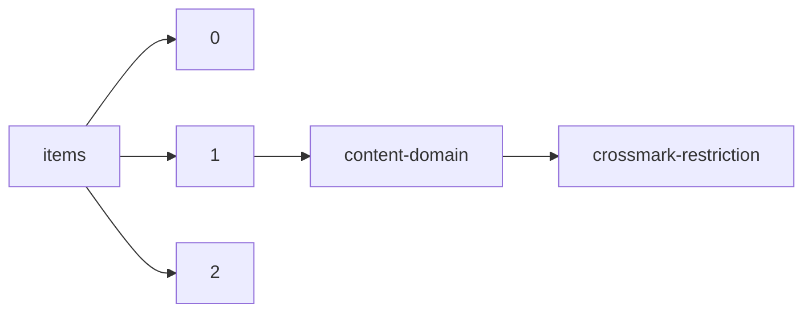

!!! warning "This document is not official Crossref documentation"
# Crossmark-restriction
PATH = items/array/content-domain/crossmark-restriction(1)  
Occurs 143 075 143 times  
Unique values: 2  
{ .annotate }

1. A route to an element, for example:  
   The route "items/array/content-domain/crossmark-restriction" corresponds to navigating through the JSON indices as  
   ["items"][0]["content-domain"]["crossmark-restriction"]  

| **Row** | **Value** `Bool` | **Count** `Int64` |
|--------:|--------------------:|---------------------:|
| **1**   | false               | 129 002 079          |
| **2**   | true                | 14 073 064           |

