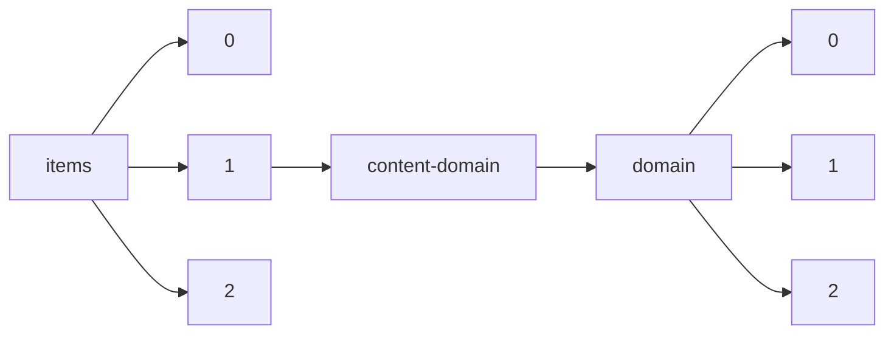

!!! warning "This document is not official Crossref documentation"
# Elements
PATH = items/array/content-domain/domain/array(1)  
Occurs 35 937 761 times  
Unique values: > 999  
{ .annotate }

1. A route to an element, for example:  
   The route "items/array/content-domain/domain/array" corresponds to navigating through the JSON indices as  
   ["items"][0]["content-domain"]["domain"][0]  

!!! note "Due to current limitations, only the first 1,000 unique values are counted."

| **Row** | **Value** `String`                          | **Count** `Int64` |
|--------:|-----------------------------------------------:|---------------------:|
| **1**   | elsevier.com                                   | 6 002 859            |
| **2**   | sciencedirect.com                              | 6 002 854            |
| **3**   | link.springer.com                              | 5 582 543            |
| **4**   | clinicalkey.fr                                 | 1 401 976            |
| **5**   | clinicalkey.es                                 | 1 391 148            |
| **6**   | www.tandfonline.com                            | 1 388 022            |
| **7**   | clinicalkey.com                                | 1 380 185            |
| **8**   | clinicalkey.com.au                             | 1 376 728            |
| **9**   | clinicalkey.jp                                 | 1 344 112            |
| **10**  | journals.sagepub.com                           | 924 065              |
| **11**  | onlinelibrary.wiley.com                        | 849 012              |
| **12**  | iopscience.iop.org                             | 605 323              |
| **13**  | dl.acm.org                                     | 492 658              |
| **14**  | frontiersin.org                                | 391 008              |
| **15**  | rsc.org                                        | 341 840              |
| **16**  | bmj.com                                        | 324 175              |
| **17**  | asmedigitalcollection.asme.org                 | 304 519              |
| **18**  | journals.asm.org                               | 299 579              |
| **19**  | www.plosone.org                                | 281 019              |
| **20**  | arc.aiaa.org                                   | 247 986              |
| **21**  | aacrjournals.org                               | 176 910              |
| **22**  | ashpublications.org                            | 172 358              |
| **23**  | www.pnas.org                                   | 156 786              |
| **24**  | aip.scitation.org                              | 154 107              |
| **25**  | wiley.com                                      | 143 955              |
| **26**  | cell.com                                       | 119 677              |
| **27**  | portlandpress.com                              | 113 128              |
| **28**  | iucr.org                                       | 111 527              |
| **29**  | journals.aps.org                               | 110 818              |
| **30**  | em-consulte.com                                | 103 638              |
| **31**  | iucrj.org                                      | 92 422               |
| **32**  | elsevier.es                                    | 87 351               |
| **33**  | synapse.koreamed.org                           | 76 327               |
| **34**  | journals.cambridge.org                         | 73 309               |
| **35**  | www.cambridge.org                              | 66 511               |
| **36**  | ahajournals.org                                | 64 374               |
| **37**  | ascelibrary.org                                | 63 147               |
| **38**  | rupress.org                                    | 62 186               |
| **39**  | cambridge.org                                  | 59 204               |
| **40**  | engine.scichina.com                            | 58 227               |
| **41**  | fertstert.org                                  | 56 493               |
| **42**  | diabetesjournals.org                           | 53 541               |
| **43**  | scialert.net                                   | 47 244               |
| **44**  | neurology.org                                  | 45 110               |
| **45**  | journals.jps.jp                                | 44 101               |
| **46**  | iwaponline.com                                 | 41 952               |
| **47**  | ersjournals.com                                | 39 958               |
| **48**  | royalsocietypublishing.org                     | 39 815               |
| **49**  | ascopubs.org                                   | 39 746               |
| **50**  | amegroups.com                                  | 37 949               |
| **51**  | thelancet.com                                  | 37 294               |
| **52**  | theclinics.com                                 | 36 621               |
| **53**  | eurekaselect.com                               | 36 034               |
| **54**  | opg.optica.org                                 | 31 081               |
| **55**  | asa.scitation.org                              | 29 901               |
| **56**  | bmn.com                                        | 28 870               |
| **57**  | www.osapublishing.org                          | 27 369               |
| **58**  | pdcnet.org                                     | 26 110               |
| **59**  | academicjournals.org                           | 21 681               |
| **60**  | eje.bioscientifica.com                         | 20 275               |
| **61**  | www.isrctn.com                                 | 20 188               |
| **62**  | jbc.org                                        | 19 081               |
| **63**  | www.scirp.org                                  | 18 590               |
| **64**  | internationaljournalofcardiology.com           | 18 475               |
| **65**  | redjournal.org                                 | 17 994               |
| **66**  | valueinhealthjournal.com                       | 17 879               |
| **67**  | ajog.org                                       | 16 447               |
| **68**  | aip.org                                        | 16 258               |
| **69**  | giejournal.org                                 | 16 238               |
| **70**  | biophysj.org                                   | 16 181               |
| **71**  | www.auajournals.org                            | 15 601               |
| **72**  | jto.org                                        | 14 959               |
| **73**  | joe.bioscientifica.com                         | 14 850               |
| **74**  | cochranelibrary.com                            | 14 690               |
| **75**  | jvascsurg.org                                  | 14 318               |
| **76**  | kazanmedjournal.ru                             | 13 846               |
| **77**  | jtcvsonline.org                                | 12 959               |
| **78**  | ecsdl.org                                      | 12 700               |
| **79**  | jaad.org                                       | 12 675               |
| **80**  | jidonline.org                                  | 12 317               |
| **81**  | jacionline.org                                 | 12 292               |
| **82**  | ipinnovative.com                               | 11 788               |
| **83**  | goldjournal.net                                | 11 616               |
| **84**  | heartlungcirc.org                              | 11 080               |
| **85**  | f1000research.com                              | 10 783               |
| **86**  | www.plosntds.org                               | 10 569               |
| **87**  | benthamopen.com                                | 10 319               |
| **88**  | www.plospathogens.org                          | 10 171               |
| **89**  | www.plosgenetics.org                           | 10 122               |
| **90**  | alzheimersanddementia.org                      | 10 082               |
| **91**  | www.ploscompbiol.org                           | 9 778                |
| **92**  | amjtransplant.org                              | 9 766                |
| **93**  | ijidonline.com                                 | 9 760                |
| **94**  | journals.vgtu.lt                               | 9 710                |
| **95**  | gastrojournal.org                              | 9 691                |
| **96**  | journalacs.org                                 | 9 546                |
| **97**  | journals.eco-vector.com                        | 9 272                |
| **98**  | akjournals.com                                 | 8 748                |
| **99**  | direct.mit.edu                                 | 8 608                |
| **100** | reproduction-online.org                        | 8 554                |
| **101** | journal.chestnet.org                           | 8 402                |
| **102** | jaacap.org                                     | 8 169                |
| **103** | asm.org                                        | 8 040                |
| **104** | www.ijitee.org                                 | 7 939                |
| **105** | journals.elsevierhealth.com                    | 7 883                |
| **106** | www.ijrte.org                                  | 7 822                |
| **107** | annalsthoracicsurgery.org                      | 7 812                |
| **108** | library.seg.org                                | 7 761                |
| **109** | onlinejacc.org                                 | 7 574                |
| **110** | arthroscopyjournal.org                         | 7 254                |
| **111** | kireports.org                                  | 7 101                |
| **112** | archives-pmr.org                               | 7 083                |
| **113** | jpeds.com                                      | 7 025                |
| **114** | cghjournal.org                                 | 6 855                |
| **115** | ajconline.org                                  | 6 775                |
| **116** | www.plosbiology.org                            | 6 769                |
| **117** | elifesciences.org                              | 6 641                |
| **118** | annemergmed.com                                | 6 592                |
| **119** | heartrhythmjournal.com                         | 6 427                |
| **120** | annalsofoncology.org                           | 6 371                |
| **121** | www.ahajournals.org                            | 6 283                |
| **122** | arthroplastyjournal.org                        | 6 264                |
| **123** | jocn-journal.com                               | 6 064                |
| **124** | panafrican-med-journal.com                     | 6 021                |
| **125** | europsy-journal.com                            | 6 001                |
| **126** | resuscitationjournal.com                       | 5 973                |
| **127** | jcardioanesthesia.com                          | 5 955                |
| **128** | jprasurg.com                                   | 5 935                |
| **129** | annalsofvascularsurgery.com                    | 5 923                |
| **130** | ejog.org                                       | 5 916                |
| **131** | aaojournal.org                                 | 5 891                |
| **132** | mdconsult.com                                  | 5 853                |
| **133** | jns-journal.com                                | 5 800                |
| **134** | jsm.jsexmed.org                                | 5 775                |
| **135** | avs.scitation.org                              | 5 771                |
| **136** | journalofsurgicalresearch.com                  | 5 751                |
| **137** | epilepsybehavior.com                           | 5 597                |
| **138** | www.iieta.org                                  | 5 571                |
| **139** | atherosclerosis-journal.com                    | 5 517                |
| **140** | bjanaesthesia.org                              | 5 497                |
| **141** | annallergy.org                                 | 5 435                |
| **142** | revistas.pedagogica.edu.co                     | 5 396                |
| **143** | injuryjournal.com                              | 5 392                |
| **144** | revespcardiol.org                              | 5 350                |
| **145** | mp.uscap.org                                   | 5 342                |
| **146** | ajo.com                                        | 5 233                |
| **147** | soard.org                                      | 5 215                |
| **148** | americanjournalofsurgery.com                   | 5 132                |
| **149** | ejhm.journals.ekb.eg                           | 5 036                |
| **150** | www.plosmedicine.org                           | 5 032                |
| **151** | journals.physiology.org                        | 5 013                |
| **152** | gynecologiconcology-online.net                 | 4 982                |
| **153** | jhltonline.org                                 | 4 925                |
| **154** | amjmed.com                                     | 4 905                |
| **155** | psychoceramics.labs.crossref.org               | 4 904                |
| **156** | www.ijeat.org                                  | 4 891                |
| **157** | www.atsjournals.org                            | 4 885                |
| **158** | researcherslinks.com                           | 4 827                |
| **159** | worldneurosurgery.org                          | 4 810                |
| **160** | ejcancer.com                                   | 4 599                |
| **161** | jmig.org                                       | 4 584                |
| **162** | jem-journal.com                                | 4 575                |
| **163** | www.niscpub.com                                | 4 567                |
| **164** | jpedsurg.org                                   | 4 547                |
| **165** | jpsmjournal.com                                | 4 502                |
| **166** | dldjournalonline.com                           | 4 496                |
| **167** | ajemjournal.com                                | 4 495                |
| **168** | ejradiology.com                                | 4 492                |
| **169** | umbjournal.org                                 | 4 462                |
| **170** | drugandalcoholdependence.com                   | 4 456                |
| **171** | clinmedjournals.org                            | 4 415                |
| **172** | diabetesresearchclinicalpractice.com           | 4 323                |
| **173** | journal-of-hepatology.eu                       | 4 228                |
| **174** | li.uscap.org                                   | 4 167                |
| **175** | jshoulderelbow.org                             | 4 163                |
| **176** | thespinejournalonline.com                      | 4 147                |
| **177** | online.boneandjoint.org.uk                     | 4 143                |
| **178** | jsams.org                                      | 4 076                |
| **179** | prd-journal.com                                | 4 040                |
| **180** | jvir.org                                       | 4 021                |
| **181** | onlinejase.com                                 | 4 012                |
| **182** | thegreenjournal.com                            | 4 010                |
| **183** | oooojournal.net                                | 4 009                |
| **184** | joms.org                                       | 3 973                |
| **185** | jpp.journals.ekb.eg                            | 3 969                |
| **186** | ejso.com                                       | 3 952                |
| **187** | avmj.journals.ekb.eg                           | 3 950                |
| **188** | surgjournal.com                                | 3 940                |
| **189** | jaci-inpractice.org                            | 3 934                |
| **190** | rep.bioscientifica.com                         | 3 850                |
| **191** | msard-journal.com                              | 3 686                |
| **192** | medcraveonline.com                             | 3 685                |
| **193** | mayoclinicproceedings.org                      | 3 677                |
| **194** | jahonline.org                                  | 3 659                |
| **195** | ejchem.journals.ekb.eg                         | 3 643                |
| **196** | thrombosisresearch.com                         | 3 617                |
| **197** | lyellcollection.org                            | 3 616                |
| **198** | www.peertechz.com                              | 3 615                |
| **199** | onlinecjc.ca                                   | 3 547                |
| **200** | jpurol.com                                     | 3 404                |
| **201** | jamda.com                                      | 3 353                |
| **202** | extrica.com                                    | 3 351                |
| **203** | ajicjournal.org                                | 3 319                |
| **204** | ajkd.org                                       | 3 301                |
| **205** | jacr.org                                       | 3 251                |
| **206** | oarsijournal.com                               | 3 191                |
| **207** | radiologic.theclinics.com                      | 3 149                |
| **208** | kidney-international.org                       | 3 129                |
| **209** | clinical-lymphoma-myeloma-leukemia.com         | 3 124                |
| **210** | jpharmsci.org                                  | 3 110                |
| **211** | ejournal.undip.ac.id                           | 3 101                |
| **212** | patient-research.elsevier.com                  | 3 077                |
| **213** | ejinme.com                                     | 3 063                |
| **214** | jmmc-online.com                                | 3 050                |
| **215** | ajp.amjpathol.org                              | 3 048                |
| **216** | brieflands.com                                 | 3 006                |
| **217** | ajpm-online.net                                | 2 942                |
| **218** | prosdent.org                                   | 2 912                |
| **219** | europeanurology.com                            | 2 858                |
| **220** | jad-journal.com                                | 2 856                |
| **221** | lungcancerjournal.info                         | 2 851                |
| **222** | journalofinfection.com                         | 2 842                |
| **223** | physicamedica.com                              | 2 831                |
| **224** | www.isr-publications.com                       | 2 830                |
| **225** | clinicalradiologyonline.net                    | 2 828                |
| **226** | slas-discovery.org                             | 2 814                |
| **227** | brainstimjrnl.com                              | 2 766                |
| **228** | academicradiology.org                          | 2 764                |
| **229** | resmedjournal.com                              | 2 710                |
| **230** | gaitposture.com                                | 2 613                |
| **231** | oaepublish.com                                 | 2 600                |
| **232** | jaadcasereports.org                            | 2 594                |
| **233** | jfas.org                                       | 2 581                |
| **234** | nursingconsult.com                             | 2 566                |
| **235** | radab.mosuljournals.com                        | 2 548                |
| **236** | jclinepi.com                                   | 2 542                |
| **237** | casereports.com                                | 2 538                |
| **238** | journal.mrs-k.or.kr                            | 2 526                |
| **239** | journalofhospitalinfection.com                 | 2 513                |
| **240** | edj.journals.ekb.eg                            | 2 490                |
| **241** | ejournal3.undip.ac.id                          | 2 482                |
| **242** | clinicalnutritionespen.com                     | 2 478                |
| **243** | wellcomeopenresearch.org                       | 2 471                |
| **244** | sjam.journals.ekb.eg                           | 2 464                |
| **245** | www.wjarr.com                                  | 2 461                |
| **246** | clinicalimaging.org                            | 2 460                |
| **247** | seizure-journal.com                            | 2 446                |
| **248** | sites.kowsarpub.com                            | 2 429                |
| **249** | jme.bioscientifica.com                         | 2 399                |
| **250** | amjmedsci.org                                  | 2 388                |
| **251** | npjournal.org                                  | 2 370                |
| **252** | saep.journals.ekb.eg                           | 2 369                |
| **253** | bbmt.org                                       | 2 366                |
| **254** | ajhg.org                                       | 2 333                |
| **255** | cancercell.org                                 | 2 331                |
| **256** | jdsjournal.com                                 | 2 325                |
| **257** | jppp.journals.ekb.eg                           | 2 301                |
| **258** | psy-journal.com                                | 2 295                |
| **259** | rbmojournal.com                                | 2 292                |
| **260** | jaapos.org                                     | 2 291                |
| **261** | jsbsh.journals.ekb.eg                          | 2 288                |
| **262** | cysticfibrosisjournal.com                      | 2 282                |
| **263** | physiotherapyjournal.com                       | 2 279                |
| **264** | arthroscopytechniques.org                      | 2 264                |
| **265** | nmcd-journal.com                               | 2 256                |
| **266** | interventions.onlinejacc.org                   | 2 254                |
| **267** | www.medicaljournals.se                         | 2 250                |
| **268** | journal.waocp.org                              | 2 239                |
| **269** | transplantation-proceedings.org                | 2 237                |
| **270** | www.conscientiabeam.com                        | 2 222                |
| **271** | clinbiomech.com                                | 2 206                |
| **272** | andjrnl.org                                    | 2 196                |
| **273** | jendodon.com                                   | 2 194                |
| **274** | jsrep.journals.ekb.eg                          | 2 180                |
| **275** | thebreastonline.com                            | 2 145                |
| **276** | plantphysiol.org                               | 2 119                |
| **277** | jni-journal.com                                | 2 117                |
| **278** | phsreda.com                                    | 2 113                |
| **279** | erc.bioscientifica.com                         | 2 112                |
| **280** | ejabf.journals.ekb.eg                          | 2 110                |
| **281** | pedneur.com                                    | 2 110                |
| **282** | jssae.journals.ekb.eg                          | 2 099                |
| **283** | maturitas.org                                  | 2 093                |
| **284** | www.gsconlinepress.com                         | 2 092                |
| **285** | mjcu.journals.ekb.eg                           | 2 082                |
| **286** | demajournal.com                                | 2 079                |
| **287** | thekneejournal.com                             | 2 075                |
| **288** | jaess.journals.ekb.eg                          | 2 059                |
| **289** | brachyjournal.com                              | 2 050                |
| **290** | sjes.journals.ekb.eg                           | 2 046                |
| **291** | jiac-j.com                                     | 2 046                |
| **292** | www.aessweb.com                                | 2 045                |
| **293** | aafu.journals.ekb.eg                           | 2 041                |
| **294** | surgicalneurologyint.com                       | 2 015                |
| **295** | bfemu.journals.ekb.eg                          | 2 003                |
| **296** | scientiairanica.sharif.edu                     | 1 997                |
| **297** | jpagonline.org                                 | 1 991                |
| **298** | jada.ada.org                                   | 1 983                |
| **299** | jvsvenous.com                                  | 1 981                |
| **300** | jprr.journals.ekb.eg                           | 1 975                |
| **301** | bfda.journals.ekb.eg                           | 1 971                |
| **302** | trasci.com                                     | 1 965                |
| **303** | nmd-journal.com                                | 1 954                |
| **304** | ejournal2.undip.ac.id                          | 1 953                |
| **305** | ejar.journals.ekb.eg                           | 1 943                |
| **306** | www.npsm-kps.org                               | 1 942                |
| **307** | pediatricnursing.org                           | 1 936                |
| **308** | ejhc.journals.ekb.eg                           | 1 924                |
| **309** | scholars.direct                                | 1 920                |
| **310** | jcrsjournal.org                                | 1 918                |
| **311** | ijporlonline.com                               | 1 898                |
| **312** | biologicalpsychiatryjournal.com                | 1 889                |
| **313** | cancerletters.info                             | 1 888                |
| **314** | www.mdpi.com                                   | 1 884                |
| **315** | journal-of-cardiology.com                      | 1 875                |
| **316** | jces.journals.ekb.eg                           | 1 873                |
| **317** | journalofclinicalvirology.com                  | 1 871                |
| **318** | scipost.org                                    | 1 844                |
| **319** | contraceptionjournal.org                       | 1 820                |
| **320** | mcponline.org                                  | 1 815                |
| **321** | academicpedsjnl.net                            | 1 814                |
| **322** | journalofdairyscience.org                      | 1 808                |
| **323** | vestnik.mgimo.ru                               | 1 791                |
| **324** | clinicalnutritionjournal.com                   | 1 790                |
| **325** | aapt.scitation.org                             | 1 785                |
| **326** | knepublishing.com                              | 1 782                |
| **327** | mucosalimmunology.org                          | 1 780                |
| **328** | journal-cot.com                                | 1 751                |
| **329** | edusohag.journals.ekb.eg                       | 1 725                |
| **330** | jmirs.org                                      | 1 720                |
| **331** | jsre.journals.ekb.eg                           | 1 703                |
| **332** | psyneuen-journal.com                           | 1 697                |
| **333** | mjaf.journals.ekb.eg                           | 1 694                |
| **334** | exphem.org                                     | 1 691                |
| **335** | fsigenetics.com                                | 1 682                |
| **336** | ejap.journals.ekb.eg                           | 1 680                |
| **337** | schres-journal.com                             | 1 680                |
| **338** | japsonline.com                                 | 1 676                |
| **339** | esmoopen.com                                   | 1 655                |
| **340** | annlabmed.org                                  | 1 650                |
| **341** | jhandsurg.org                                  | 1 642                |
| **342** | canadianjournalofophthalmology.ca              | 1 634                |
| **343** | fjhj.journals.ekb.eg                           | 1 623                |
| **344** | clinical-genitourinary-cancer.com              | 1 623                |
| **345** | www.jcohns.org                                 | 1 622                |
| **346** | febsletters.org                                | 1 621                |
| **347** | clinicaloncologyonline.net                     | 1 613                |
| **348** | jbiomech.com                                   | 1 611                |
| **349** | metabolismjournal.com                          | 1 606                |
| **350** | zumj.journals.ekb.eg                           | 1 603                |
| **351** | lipidjournal.com                               | 1 596                |
| **352** | etj.uotechnology.edu.iq                        | 1 595                |
| **353** | revistacomunicar.com                           | 1 594                |
| **354** | clinicaltherapeutics.com                       | 1 590                |
| **355** | valuehealthregionalissues.com                  | 1 590                |
| **356** | gimjournal.org                                 | 1 584                |
| **357** | ebiomedicine.com                               | 1 580                |
| **358** | aml.iaamonline.org                             | 1 573                |
| **359** | oxfordjournals.org                             | 1 571                |
| **360** | bodyworkmovementtherapies.com                  | 1 565                |
| **361** | dia-endojournals.ru                            | 1 557                |
| **362** | dram.journals.ekb.eg                           | 1 557                |
| **363** | jopan.org                                      | 1 551                |
| **364** | bfag.journals.ekb.eg                           | 1 550                |
| **365** | journalofcardiovascularct.com                  | 1 542                |
| **366** | semthorcardiovascsurg.com                      | 1 541                |
| **367** | medical-hypotheses.com                         | 1 504                |
| **368** | geriatriconcology.net                          | 1 498                |
| **369** | journalofsubstanceabusetreatment.com           | 1 497                |
| **370** | int-res.com                                    | 1 495                |
| **371** | heartrhythmcasereports.com                     | 1 487                |
| **372** | maed.journals.ekb.eg                           | 1 481                |
| **373** | nurseeducationtoday.com                        | 1 475                |
| **374** | asejaiqjsae.journals.ekb.eg                    | 1 455                |
| **375** | revistas.udea.edu.co                           | 1 455                |
| **376** | journalofcardiologycases.com                   | 1 444                |
| **377** | asat.journals.ekb.eg                           | 1 444                |
| **378** | jappmu.journals.ekb.eg                         | 1 426                |
| **379** | jfust.journals.ekb.eg                          | 1 418                |
| **380** | clinph-journal.com                             | 1 416                |
| **381** | brainanddevelopment.com                        | 1 411                |
| **382** | hpbonline.org                                  | 1 405                |
| **383** | www.science-gate.com                           | 1 404                |
| **384** | footanklesurgery-journal.com                   | 1 403                |
| **385** | e-trd.org                                      | 1 386                |
| **386** | pathologyjournal.rcpa.edu.au                   | 1 386                |
| **387** | mbse.journals.ekb.eg                           | 1 375                |
| **388** | celltherapyjournal.org                         | 1 373                |
| **389** | magrj.mosuljournals.com                        | 1 365                |
| **390** | jpain.org                                      | 1 365                |
| **391** | ejpn-journal.com                               | 1 363                |
| **392** | jlr.org                                        | 1 354                |
| **393** | nexusacademicpublishers.com                    | 1 350                |
| **394** | jfds.journals.ekb.eg                           | 1 340                |
| **395** | jccjournal.org                                 | 1 337                |
| **396** | www.peertechzpublications.com                  | 1 336                |
| **397** | livestockscience.com                           | 1 332                |
| **398** | bfa.journals.ekb.eg                            | 1 331                |
| **399** | clinical-breast-cancer.com                     | 1 323                |
| **400** | mrk.journals.ekb.eg                            | 1 317                |
| **401** | clinical-lung-cancer.com                       | 1 314                |
| **402** | thebonejournal.com                             | 1 311                |
| **403** | aacejournalendocrinepractice.org               | 1 308                |
| **404** | clineu-journal.com                             | 1 299                |
| **405** | pediatr-neonatol.com                           | 1 295                |
| **406** | cguaa.journals.ekb.eg                          | 1 295                |
| **407** | gacetamedicademexico.com                       | 1 295                |
| **408** | practicalradonc.org                            | 1 283                |
| **409** | heartandlung.org                               | 1 279                |
| **410** | jcmfs.com                                      | 1 278                |
| **411** | jes.journals.ekb.eg                            | 1 271                |
| **412** | burnsjournal.com                               | 1 265                |
| **413** | ec.bioscientifica.com                          | 1 263                |
| **414** | edusj.mosuljournals.com                        | 1 263                |
| **415** | contactlensjournal.com                         | 1 262                |
| **416** | jtcvstechniques.org                            | 1 261                |
| **417** | kjim.org                                       | 1 253                |
| **418** | sleep-journal.com                              | 1 253                |
| **419** | ijhpm.com                                      | 1 252                |
| **420** | jesaun.journals.ekb.eg                         | 1 250                |
| **421** | ijgo.org                                       | 1 250                |
| **422** | www.jchestsurg.org                             | 1 234                |
| **423** | oncology-and-radiotherapy.com                  | 1 210                |
| **424** | cmghjournal.org                                | 1 208                |
| **425** | ajas.info                                      | 1 208                |
| **426** | radiographyonline.com                          | 1 205                |
| **427** | pec-journal.com                                | 1 202                |
| **428** | mededpublish.org                               | 1 201                |
| **429** | publichealthjrnl.com                           | 1 190                |
| **430** | www.heighpubs.org                              | 1 189                |
| **431** | jfeb.journals.ekb.eg                           | 1 188                |
| **432** | canadianjournalofdiabetes.com                  | 1 183                |
| **433** | cegh.net                                       | 1 178                |
| **434** | juah.uoanbar.edu.iq                            | 1 172                |
| **435** | contemporaryclinicaltrials.com                 | 1 169                |
| **436** | jssidoi.org                                    | 1 164                |
| **437** | plantcell.org                                  | 1 161                |
| **438** | ebpj.e-iph.co.uk                               | 1 153                |
| **439** | ijaaonline.com                                 | 1 151                |
| **440** | e-crt.org                                      | 1 150                |
| **441** | midwiferyjournal.com                           | 1 146                |
| **442** | jsc.journals.ekb.eg                            | 1 140                |
| **443** | j-kosham.or.kr                                 | 1 129                |
| **444** | caf.journals.ekb.eg                            | 1 125                |
| **445** | lia.scitation.org                              | 1 121                |
| **446** | imaging.onlinejacc.org                         | 1 115                |
| **447** | onlinejcf.com                                  | 1 114                |
| **448** | informaticsjournals.com                        | 1 113                |
| **449** | mjae.journals.ekb.eg                           | 1 105                |
| **450** | sec.journals.ekb.eg                            | 1 102                |
| **451** | ejoncologynursing.com                          | 1 096                |
| **452** | journal.dcs.or.kr                              | 1 096                |
| **453** | ajs.journals.ekb.eg                            | 1 092                |
| **454** | cancertreatmentreviews.com                     | 1 090                |
| **455** | qarts.journals.ekb.eg                          | 1 087                |
| **456** | bjas.journals.ekb.eg                           | 1 086                |
| **457** | www.ijpbs.net                                  | 1 085                |
| **458** | theriojournal.com                              | 1 080                |
| **459** | jssa.journals.ekb.eg                           | 1 077                |
| **460** | fsijournal.org                                 | 1 074                |
| **461** | bpsa.journals.ekb.eg                           | 1 071                |
| **462** | www.science.org                                | 1 070                |
| **463** | jurology.com                                   | 1 070                |
| **464** | humanpathol.com                                | 1 067                |
| **465** | medengphys.com                                 | 1 062                |
| **466** | www.jnmjournal.org                             | 1 062                |
| **467** | hum-ecol.ru                                    | 1 054                |
| **468** | strokejournal.org                              | 1 038                |
| **469** | videogie.org                                   | 1 037                |
| **470** | jedu.journals.ekb.eg                           | 1 031                |
| **471** | womenandbirth.org                              | 1 031                |
| **472** | australiancriticalcare.com                     | 1 030                |
| **473** | artman.journals.ekb.eg                         | 1 021                |
| **474** | www.asianonlinejournals.com                    | 1 019                |
| **475** | smallruminantresearch.com                      | 1 017                |
| **476** | ajas.journals.ekb.eg                           | 1 008                |
| **477** | ejcj.journals.ekb.eg                           | 1 008                |
| **478** | www.plosglobalpublichealth.org                 | 995                  |
| **479** | rengj.mosuljournals.com                        | 992                  |
| **480** | nursingoutlook.org                             | 987                  |
| **481** | urologiconcology.org                           | 980                  |
| **482** | psychiatricnursing.org                         | 975                  |
| **483** | fsigeneticssup.com                             | 974                  |
| **484** | bfsa.journals.ekb.eg                           | 970                  |
| **485** | oraloncology.com                               | 969                  |
| **486** | ircmj.com                                      | 968                  |
| **487** | translationalres.com                           | 967                  |
| **488** | asianjournalofpsychiatry.com                   | 964                  |
| **489** | alat.journals.ekb.eg                           | 964                  |
| **490** | sor.scitation.org                              | 961                  |
| **491** | bvmj.journals.ekb.eg                           | 954                  |
| **492** | ki-it.com                                      | 952                  |
| **493** | parasitol.kr                                   | 952                  |
| **494** | jcehepatology.com                              | 951                  |
| **495** | english.ksfme.or.kr                            | 951                  |
| **496** | jals.gnu.ac.kr                                 | 950                  |
| **497** | mercj.journals.ekb.eg                          | 950                  |
| **498** | ijssa.journals.ekb.eg                          | 947                  |
| **499** | journalofpsychiatricresearch.com               | 944                  |
| **500** | jfma-online.com                                | 944                  |
| **501** | opendentistryjournal.com                       | 944                  |
| **502** | zjar.journals.ekb.eg                           | 939                  |
| **503** | dmidjournal.com                                | 927                  |
| **504** | jogc.com                                       | 923                  |
| **505** | juaps.uoanbar.edu.iq                           | 921                  |
| **506** | www.mjiri.iums.ac.ir                           | 919                  |
| **507** | j-evs.com                                      | 918                  |
| **508** | vetmedmosul.com                                | 917                  |
| **509** | asnj.journals.ekb.eg                           | 907                  |
| **510** | amme.journals.ekb.eg                           | 904                  |
| **511** | primary-care-diabetes.com                      | 902                  |
| **512** | ijdp.org                                       | 902                  |
| **513** | obstetanesthesia.com                           | 898                  |
| **514** | nutritionjrnl.com                              | 897                  |
| **515** | jsb.journals.ekb.eg                            | 896                  |
| **516** | www.cirugiaycirujanos.com                      | 895                  |
| **517** | www.kosomes.or.kr                              | 895                  |
| **518** | assjm.journals.ekb.eg                          | 893                  |
| **519** | mflaha.journals.ekb.eg                         | 888                  |
| **520** | amj.journals.ekb.eg                            | 883                  |
| **521** | ejves.com                                      | 875                  |
| **522** | jfslt.journals.ekb.eg                          | 875                  |
| **523** | tjog-online.com                                | 870                  |
| **524** | iceeng.journals.ekb.eg                         | 867                  |
| **525** | jfe.journals.ekb.eg                            | 866                  |
| **526** | neuromodulationjournal.org                     | 866                  |
| **527** | www.ksmpe.or.kr                                | 862                  |
| **528** | journal.kits.or.kr                             | 862                  |
| **529** | sja.journals.ekb.eg                            | 859                  |
| **530** | meae.journals.ekb.eg                           | 859                  |
| **531** | neurobiologyofaging.org                        | 855                  |
| **532** | jpscasereports.com                             | 854                  |
| **533** | rusalljournal.ru                               | 853                  |
| **534** | jkms.org                                       | 853                  |
| **535** | jenonline.org                                  | 844                  |
| **536** | nursingsimulation.org                          | 842                  |
| **537** | e-kjpt.org                                     | 840                  |
| **538** | jartf.journals.ekb.eg                          | 840                  |
| **539** | obesityresearchclinicalpractice.com            | 839                  |
| **540** | journalofnursingstudies.com                    | 838                  |
| **541** | life-science-alliance.org                      | 838                  |
| **542** | erjm.journals.ekb.eg                           | 836                  |
| **543** | lrjournal.com                                  | 834                  |
| **544** | heliyon.com                                    | 832                  |
| **545** | journals.tbzmed.ac.ir                          | 829                  |
| **546** | jfss.journals.ekb.eg                           | 829                  |
| **547** | advancesradonc.org                             | 824                  |
| **548** | placentajournal.org                            | 824                  |
| **549** | revistas.udca.edu.co                           | 821                  |
| **550** | balimedicaljournal.org                         | 821                  |
| **551** | wemjournal.org                                 | 819                  |
| **552** | pdpdt-journal.com                              | 814                  |
| **553** | autonomicneuroscience.com                      | 806                  |
| **554** | rsci.mosuljournals.com                         | 802                  |
| **555** | jaauth.journals.ekb.eg                         | 801                  |
| **556** | jdcjournal.com                                 | 799                  |
| **557** | jcia.journals.ekb.eg                           | 797                  |
| **558** | ahjonline.com                                  | 796                  |
| **559** | jpsychores.com                                 | 789                  |
| **560** | europeanneuropsychopharmacology.com            | 788                  |
| **561** | jfma.journals.ekb.eg                           | 785                  |
| **562** | healthpolicyjrnl.com                           | 784                  |
| **563** | journal.pulmonology.ru                         | 784                  |
| **564** | eajbsa.journals.ekb.eg                         | 782                  |
| **565** | animalreproductionscience.com                  | 782                  |
| **566** | journal.kenss.or.kr                            | 782                  |
| **567** | e-jer.org                                      | 780                  |
| **568** | computersinbiologyandmedicine.com              | 779                  |
| **569** | ajas.uoanbar.edu.iq                            | 779                  |
| **570** | sajs.co.za                                     | 773                  |
| **571** | jkspe.kspe.or.kr                               | 771                  |
| **572** | edm.bioscientifica.com                         | 769                  |
| **573** | www.elifesciences.org                          | 769                  |
| **574** | dentalabstracts.com                            | 766                  |
| **575** | painmanagementnursing.org                      | 766                  |
| **576** | mkas.journals.ekb.eg                           | 765                  |
| **577** | cancergeneticsjournal.org                      | 764                  |
| **578** | asianspinejournal.org                          | 760                  |
| **579** | irjt.iorpress.org                              | 758                  |
| **580** | www.jebas.org                                  | 757                  |
| **581** | whijournal.com                                 | 750                  |
| **582** | mjafi.net                                      | 746                  |
| **583** | rden.mosuljournals.com                         | 746                  |
| **584** | airmedicaljournal.com                          | 744                  |
| **585** | nanomedjournal.com                             | 740                  |
| **586** | jftp.journals.ekb.eg                           | 740                  |
| **587** | armin.journals.ekb.eg                          | 739                  |
| **588** | appliedanimalbehaviour.com                     | 739                  |
| **589** | kujss.uokirkuk.edu.iq                          | 737                  |
| **590** | openorthopaedicsjournal.com                    | 737                  |
| **591** | aja.journals.ekb.eg                            | 735                  |
| **592** | jaes.journals.ekb.eg                           | 730                  |
| **593** | jlt.journals.ekb.eg                            | 728                  |
| **594** | probl-endojournals.ru                          | 727                  |
| **595** | gimopen.org                                    | 727                  |
| **596** | jrnjournal.org                                 | 724                  |
| **597** | epires-journal.com                             | 721                  |
| **598** | jkna.org                                       | 718                  |
| **599** | jesp.journals.ekb.eg                           | 716                  |
| **600** | www.archivoscardiologia.com                    | 707                  |
| **601** | molag.journals.ekb.eg                          | 698                  |
| **602** | jhiphalexu.journals.ekb.eg                     | 696                  |
| **603** | hoajonline.com                                 | 694                  |
| **604** | fjard.journals.ekb.eg                          | 693                  |
| **605** | jfafu.journals.ekb.eg                          | 691                  |
| **606** | ejarc.journals.ekb.eg                          | 690                  |
| **607** | mgmjournal.com                                 | 690                  |
| **608** | psychiatryinvestigation.org                    | 688                  |
| **609** | collegianjournal.com                           | 686                  |
| **610** | ijceo.org                                      | 684                  |
| **611** | journal.rniito.org                             | 684                  |
| **612** | jafeb.org                                      | 682                  |
| **613** | egjsw.journals.ekb.eg                          | 681                  |
| **614** | plefa.com                                      | 677                  |
| **615** | clinical-colorectal-cancer.com                 | 676                  |
| **616** | sero.journals.ekb.eg                           | 676                  |
| **617** | jcma-online.com                                | 675                  |
| **618** | surveyophthalmol.com                           | 673                  |
| **619** | spine-deformity.org                            | 671                  |
| **620** | jfhsc.journals.ekb.eg                          | 670                  |
| **621** | cardiosomatics.orscience.ru                    | 670                  |
| **622** | lalexu.journals.ekb.eg                         | 669                  |
| **623** | jmptonline.org                                 | 661                  |
| **624** | animalfeedscience.com                          | 659                  |
| **625** | www.biomolther.org                             | 658                  |
| **626** | vestnik-vgik.com                               | 656                  |
| **627** | amjoto.com                                     | 650                  |
| **628** | journal.umpo.ac.id                             | 650                  |
| **629** | jecgonline.com                                 | 650                  |
| **630** | www.e-jvc.org                                  | 649                  |
| **631** | jtcvsopen.org                                  | 648                  |
| **632** | www.biomedresearch.org                         | 637                  |
| **633** | jkiees.org                                     | 636                  |
| **634** | jpedhc.org                                     | 636                  |
| **635** | jhandtherapy.org                               | 635                  |
| **636** | jgu.garmian.edu.krd                            | 632                  |
| **637** | psyn-journal.com                               | 632                  |
| **638** | clinical-medicine.panafrican-med-journal.com   | 631                  |
| **639** | travelmedicinejournal.com                      | 625                  |
| **640** | annalsofepidemiology.org                       | 620                  |
| **641** | actanaturae.ru                                 | 619                  |
| **642** | jsst.journals.ekb.eg                           | 617                  |
| **643** | www.recintervcardiol.org                       | 615                  |
| **644** | jacb.journals.ekb.eg                           | 614                  |
| **645** | e-ce.org                                       | 613                  |
| **646** | omet-endojournals.ru                           | 611                  |
| **647** | jfda-online.com                                | 611                  |
| **648** | nurseeducationinpractice.com                   | 610                  |
| **649** | journal.ksae.org                               | 608                  |
| **650** | csmj.mosuljournals.com                         | 607                  |
| **651** | ekjm.org                                       | 606                  |
| **652** | e-csd.org                                      | 606                  |
| **653** | sjce.journals.sharif.edu                       | 606                  |
| **654** | e-jmii.com                                     | 603                  |
| **655** | aakj.journals.ekb.eg                           | 602                  |
| **656** | sfnmjournal.com                                | 601                  |
| **657** | iars.journals.ekb.eg                           | 601                  |
| **658** | cardiacep.theclinics.com                       | 596                  |
| **659** | ajogmfm.org                                    | 594                  |
| **660** | jflmjournal.org                                | 591                  |
| **661** | kan.journals.ekb.eg                            | 591                  |
| **662** | bfalex.journals.ekb.eg                         | 591                  |
| **663** | jodjournal.com                                 | 590                  |
| **664** | aimj.journals.ekb.eg                           | 590                  |
| **665** | e-epih.org                                     | 590                  |
| **666** | cmpbjournal.com                                | 590                  |
| **667** | ssj.journals.ekb.eg                            | 589                  |
| **668** | jkns.or.kr                                     | 588                  |
| **669** | bfdm.journals.ekb.eg                           | 583                  |
| **670** | jaaralexu.journals.ekb.eg                      | 581                  |
| **671** | earlyhumandevelopment.com                      | 579                  |
| **672** | www.ijhe.or.kr                                 | 579                  |
| **673** | mkda.journals.ekb.eg                           | 579                  |
| **674** | eeer.org                                       | 579                  |
| **675** | kjorl.org                                      | 579                  |
| **676** | jikm.or.kr                                     | 578                  |
| **677** | jlaw.journals.ekb.eg                           | 574                  |
| **678** | jejh.journals.ekb.eg                           | 570                  |
| **679** | jabonline.in                                   | 570                  |
| **680** | www.kkgpublications.com                        | 567                  |
| **681** | arthroscopysportsmedicineandrehabilitation.org | 565                  |
| **682** | jognn.awhonn.org                               | 565                  |
| **683** | gatesopenresearch.org                          | 564                  |
| **684** | urologycasereports.com                         | 563                  |
| **685** | kjms-online.com                                | 560                  |
| **686** | bjsrg.uobasrah.edu.iq                          | 560                  |
| **687** | aornjournal.org                                | 557                  |
| **688** | plasticsurgery.theclinics.com                  | 557                  |
| **689** | aggjournal.com                                 | 556                  |
| **690** | www.ejce.org                                   | 553                  |
| **691** | ijogr.org                                      | 552                  |
| **692** | absb.journals.ekb.eg                           | 550                  |
| **693** | www.kjfp.or.kr                                 | 549                  |
| **694** | journals.sbmu.ac.ir                            | 549                  |
| **695** | aobjournal.com                                 | 546                  |
| **696** | pmrjournal.org                                 | 546                  |
| **697** | ijca.in                                        | 545                  |
| **698** | www.cpn.or.kr                                  | 545                  |
| **699** | cjcopen.ca                                     | 542                  |
| **700** | cherd.ichemejournals.com                       | 540                  |
| **701** | jrijournal.org                                 | 540                  |
| **702** | www.epain.org                                  | 539                  |
| **703** | jsu.journals.ekb.eg                            | 538                  |
| **704** | mjmr.journals.ekb.eg                           | 535                  |
| **705** | mjle.journals.ekb.eg                           | 534                  |
| **706** | mrijournal.com                                 | 534                  |
| **707** | clinicalimagingscience.org                     | 534                  |
| **708** | www.bmbreports.org                             | 533                  |
| **709** | amesea.journals.ekb.eg                         | 533                  |
| **710** | croh-online.com                                | 529                  |
| **711** | europeangeriaticmedicine.com                   | 529                  |
| **712** | ashjournal.com                                 | 522                  |
| **713** | scandinavianjournalpain.com                    | 521                  |
| **714** | mafs.journals.ekb.eg                           | 519                  |
| **715** | molecularoncology.org                          | 513                  |
| **716** | ctro.science                                   | 511                  |
| **717** | respiratorycasereports.com                     | 509                  |
| **718** | hrbopenresearch.org                            | 508                  |
| **719** | inp.journals.ekb.eg                            | 507                  |
| **720** | bvetr.basrahjournals.com                       | 504                  |
| **721** | kidneymedicinejournal.org                      | 503                  |
| **722** | www.jmb.or.kr                                  | 501                  |
| **723** | jsesarthroplasty.org                           | 501                  |
| **724** | cvcasejournal.com                              | 498                  |
| **725** | ajssa.journals.ekb.eg                          | 498                  |
| **726** | tuberculosisjournal.com                        | 498                  |
| **727** | tanmiyat.mosuljournals.com                     | 495                  |
| **728** | alaw.mosuljournals.com                         | 494                  |
| **729** | osteo-endojournals.ru                          | 493                  |
| **730** | berj.mosuljournals.com                         | 490                  |
| **731** | pancreatology.net                              | 488                  |
| **732** | www.jabc.or.kr                                 | 487                  |
| **733** | cfdj.journals.ekb.eg                           | 487                  |
| **734** | ijpo.co.in                                     | 485                  |
| **735** | mkdaf.journals.ekb.eg                          | 485                  |
| **736** | jjmicrobiol.com                                | 484                  |
| **737** | mkmgt.journals.ekb.eg                          | 484                  |
| **738** | kjme.kr                                        | 484                  |
| **739** | ijdvl.com                                      | 483                  |
| **740** | ejh.journals.ekb.eg                            | 482                  |
| **741** | jsps.journals.ekb.eg                           | 482                  |
| **742** | research-publishing.net                        | 479                  |
| **743** | opencivilengineeringjournal.com                | 475                  |
| **744** | mjd.journals.ekb.eg                            | 471                  |
| **745** | jkos.org                                       | 470                  |
| **746** | www.gutnliver.org                              | 469                  |
| **747** | endojournals.ru                                | 468                  |
| **748** | asianresassoc.org                              | 467                  |
| **749** | mdak.journals.ekb.eg                           | 467                  |
| **750** | bjas.uobasrah.edu.iq                           | 466                  |
| **751** | painjournalonline.com                          | 465                  |
| **752** | jsurged.org                                    | 464                  |
| **753** | www.jksmer.or.kr                               | 464                  |
| **754** | jwadi.journals.ekb.eg                          | 463                  |
| **755** | springerlink.com                               | 462                  |
| **756** | annalsjournal.com                              | 461                  |
| **757** | ejs.journals.ekb.eg                            | 460                  |
| **758** | jesr.journals.ekb.eg                           | 460                  |
| **759** | www.ebr.or.kr                                  | 458                  |
| **760** | ajodo.org                                      | 452                  |
| **761** | kjmm.org                                       | 450                  |
| **762** | jlr.journals.ekb.eg                            | 450                  |
| **763** | smoa.jsexmed.org                               | 449                  |
| **764** | www.jcoseik.or.kr                              | 448                  |
| **765** | kpaj.or.kr                                     | 448                  |
| **766** | tcmonline.org                                  | 447                  |
| **767** | jelectromyographykinesiology.com               | 446                  |
| **768** | quantum-journal.org                            | 445                  |
| **769** | atasu.journals.ekb.eg                          | 445                  |
| **770** | rspsciencehub.com                              | 444                  |
| **771** | bcps.journals.ekb.eg                           | 444                  |
| **772** | jpatholtm.org                                  | 442                  |
| **773** | medicalimageanalysisjournal.com                | 439                  |
| **774** | jmdjournal.org                                 | 438                  |
| **775** | e-neurospine.org                               | 437                  |
| **776** | alexpos.journals.ekb.eg                        | 435                  |
| **777** | legalmedicinejournal.com                       | 435                  |
| **778** | jgaronline.com                                 | 430                  |
| **779** | ackdjournal.org                                | 429                  |
| **780** | e-jmls.org                                     | 429                  |
| **781** | allergologyinternational.com                   | 428                  |
| **782** | apjon.org                                      | 427                  |
| **783** | clinicalmicrobiologyandinfection.com           | 427                  |
| **784** | jfab.journals.ekb.eg                           | 426                  |
| **785** | journalofarrhythmia.com                        | 426                  |
| **786** | manualtherapyjournal.com                       | 424                  |
| **787** | jpd.journals.ekb.eg                            | 424                  |
| **788** | www.ksie.ne.kr                                 | 423                  |
| **789** | microbiol.crie.ru                              | 421                  |
| **790** | jsec.journals.ekb.eg                           | 421                  |
| **791** | jehs.journals.ekb.eg                           | 420                  |
| **792** | ruralneuropractice.com                         | 420                  |
| **793** | jnutbio.com                                    | 417                  |
| **794** | animbiosci.org                                 | 416                  |
| **795** | ijcbr.in                                       | 416                  |
| **796** | mfqa.journals.ekb.eg                           | 415                  |
| **797** | www.ajas.info                                  | 415                  |
| **798** | mnase.journals.ekb.eg                          | 415                  |
| **799** | jealex.journals.ekb.eg                         | 415                  |
| **800** | shak.journals.ekb.eg                           | 414                  |
| **801** | bmfj.journals.ekb.eg                           | 413                  |
| **802** | mvmj.journals.ekb.eg                           | 413                  |
| **803** | jchild.journals.ekb.eg                         | 412                  |
| **804** | zjps.journals.ekb.eg                           | 412                  |
| **805** | open-research-europe.ec.europa.eu              | 411                  |
| **806** | kjpe.org                                       | 410                  |
| **807** | ejcancer.info                                  | 407                  |
| **808** | advancesinpediatrics.com                       | 405                  |
| **809** | apb.tbzmed.ac.ir                               | 405                  |
| **810** | maeq.journals.ekb.eg                           | 404                  |
| **811** | adjalexu.journals.ekb.eg                       | 404                  |
| **812** | psep.ichemejournals.com                        | 401                  |
| **813** | complementarytherapiesinmedicine.com           | 401                  |
| **814** | jarts.journals.ekb.eg                          | 400                  |
| **815** | besps.journals.ekb.eg                          | 393                  |
| **816** | jksronline.org                                 | 393                  |
| **817** | euoncology.europeanurology.com                 | 392                  |
| **818** | jfla.journals.ekb.eg                           | 390                  |
| **819** | ssph-journal.org                               | 390                  |
| **820** | neurorecordings.com                            | 390                  |
| **821** | sportsmed.theclinics.com                       | 386                  |
| **822** | bjoms.com                                      | 382                  |
| **823** | journals.vilniustech.lt                        | 379                  |
| **824** | imr-journal.org                                | 379                  |
| **825** | asjs.journals.ekb.eg                           | 379                  |
| **826** | rsap.org                                       | 378                  |
| **827** | www.ekosfop.or.kr                              | 376                  |
| **828** | ijmijournal.com                                | 375                  |
| **829** | jstc.journals.ekb.eg                           | 374                  |
| **830** | stats.mosuljournals.com                        | 374                  |
| **831** | pharmacyteaching.com                           | 372                  |
| **832** | rsprs.mosuljournals.com                        | 367                  |
| **833** | criticalcare.theclinics.com                    | 367                  |
| **834** | einj.org                                       | 366                  |
| **835** | kjronline.org                                  | 363                  |
| **836** | ejnf.journals.ekb.eg                           | 362                  |
| **837** | journalvetbehavior.com                         | 357                  |
| **838** | japha.org                                      | 356                  |
| **839** | e-aps.org                                      | 355                  |
| **840** | ekja.org                                       | 352                  |
| **841** | jsad.journals.ekb.eg                           | 352                  |
| **842** | surgonc.theclinics.com                         | 350                  |
| **843** | frontierspartnerships.org                      | 350                  |
| **844** | sjph.journals.ekb.eg                           | 348                  |
| **845** | janacnet.org                                   | 348                  |
| **846** | jmj.jums.ac.ir                                 | 347                  |
| **847** | coloproctol.org                                | 347                  |
| **848** | gnjournal.com                                  | 345                  |
| **849** | bfam.journals.ekb.eg                           | 345                  |
| **850** | jfpsu.journals.ekb.eg                          | 344                  |
| **851** | jassalexu.journals.ekb.eg                      | 343                  |
| **852** | ejournal.kpmi.or.kr                            | 341                  |
| **853** | cancerepidemiology.net                         | 338                  |
| **854** | www.ksbec.org                                  | 337                  |
| **855** | sleep.theclinics.com                           | 337                  |
| **856** | semarthritisrheumatism.com                     | 336                  |
| **857** | ecco-jccjournal.org                            | 334                  |
| **858** | jhep-reports.eu                                | 331                  |
| **859** | smj.journals.ekb.eg                            | 328                  |
| **860** | acl.journals.ekb.eg                            | 327                  |
| **861** | jsh.journals.ekb.eg                            | 324                  |
| **862** | jscai.org                                      | 322                  |
| **863** | mathj.journals.ekb.eg                          | 320                  |
| **864** | ekosfop.or.kr                                  | 317                  |
| **865** | zcom.journals.ekb.eg                           | 316                  |
| **866** | bestpracticeobgyn.com                          | 316                  |
| **867** | appliednursingresearch.org                     | 312                  |
| **868** | joa.journals.ekb.eg                            | 311                  |
| **869** | sjsc.journals.ekb.eg                           | 311                  |
| **870** | foodsafety.or.kr                               | 311                  |
| **871** | www.agroengineering.org                        | 311                  |
| **872** | ijcap.org                                      | 309                  |
| **873** | ejsk.journals.ekb.eg                           | 308                  |
| **874** | kieae.kr                                       | 308                  |
| **875** | jsdu.journals.ekb.eg                           | 305                  |
| **876** | www.jksdh.or.kr                                | 305                  |
| **877** | hja.journals.ekb.eg                            | 305                  |
| **878** | muja.journals.ekb.eg                           | 304                  |
| **879** | revistabiomedica.org                           | 303                  |
| **880** | mnj.journals.ekb.eg                            | 303                  |
| **881** | www.envecojournal.org                          | 302                  |
| **882** | vestnik-bees.kemsu.ru                          | 301                  |
| **883** | bpgastro.com                                   | 300                  |
| **884** | zvjz.journals.ekb.eg                           | 299                  |
| **885** | kjhsm.kr                                       | 299                  |
| **886** | ejos.journals.ekb.eg                           | 296                  |
| **887** | geriatric.theclinics.com                       | 294                  |
| **888** | jfes.journals.ekb.eg                           | 293                  |
| **889** | e-cmh.org                                      | 292                  |
| **890** | auber.journals.ekb.eg                          | 288                  |
| **891** | Lexispublisher.com                             | 288                  |
| **892** | journalslibrary.nihr.ac.uk                     | 286                  |
| **893** | jcafulltextonline.com                          | 284                  |
| **894** | thoracic.theclinics.com                        | 284                  |
| **895** | www.jdaos.org                                  | 283                  |
| **896** | disabilityandhealthjnl.com                     | 281                  |
| **897** | fraz.journals.ekb.eg                           | 281                  |
| **898** | worldallergyorganizationjournal.org            | 280                  |
| **899** | e-asr.org                                      | 280                  |
| **900** | mksq.journals.ekb.eg                           | 279                  |
| **901** | ejbo.journals.ekb.eg                           | 277                  |
| **902** | epsj.journals.ekb.eg                           | 273                  |
| **903** | www.kjssf.org                                  | 272                  |
| **904** | jvoice.org                                     | 272                  |
| **905** | jvmr.journals.ekb.eg                           | 270                  |
| **906** | regs.mosuljournals.com                         | 269                  |
| **907** | rheumatic.theclinics.com                       | 269                  |
| **908** | belitungraya.org                               | 268                  |
| **909** | www.woodj.org                                  | 259                  |
| **910** | journal.kspe.org                               | 257                  |
| **911** | jkom.journals.ekb.eg                           | 254                  |
| **912** | ajahs.journals.ekb.eg                          | 252                  |
| **913** | sjsw.journals.ekb.eg                           | 251                  |
| **914** | clinicaldensiotmetry.org                       | 248                  |
| **915** | www.ijsra.net                                  | 248                  |
| **916** | jsep.journals.ekb.eg                           | 247                  |
| **917** | jsms.sch.ac.kr                                 | 247                  |
| **918** | mjppf.journals.ekb.eg                          | 245                  |
| **919** | mjabes.journals.ekb.eg                         | 245                  |
| **920** | ajdsm.journals.ekb.eg                          | 243                  |
| **921** | arcmedres.com                                  | 239                  |
| **922** | buhuth.journals.ekb.eg                         | 237                  |
| **923** | www.kptjournal.org                             | 236                  |
| **924** | cpc.journals.ekb.eg                            | 236                  |
| **925** | mawq.journals.ekb.eg                           | 236                  |
| **926** | emedicalj.com                                  | 236                  |
| **927** | eijest.journals.ekb.eg                         | 234                  |
| **928** | ghpjournal.com                                 | 233                  |
| **929** | surgical.theclinics.com                        | 233                  |
| **930** | mjbu.uobasrah.edu.iq                           | 232                  |
| **931** | ins.journals.ekb.eg                            | 230                  |
| **932** | ajnsa.journals.ekb.eg                          | 229                  |
| **933** | esmoiotech.org                                 | 228                  |
| **934** | mmed.mosuljournals.com                         | 228                  |
| **935** | ajgponline.org                                 | 225                  |
| **936** | journal\_kr.kahperd.or.kr                      | 224                  |
| **937** | ppjonline.org                                  | 224                  |
| **938** | korseaj.org                                    | 223                  |
| **939** | bfla.journals.ekb.eg                           | 223                  |
| **940** | sjsj.journals.ekb.eg                           | 222                  |
| **941** | aesacademy.org                                 | 222                  |
| **942** | maut.journals.ekb.eg                           | 222                  |
| **943** | ejprs.journals.ekb.eg                          | 220                  |
| **944** | amps.journals.ekb.eg                           | 219                  |
| **945** | jsezu.journals.ekb.eg                          | 219                  |
| **946** | ijds.uoanbar.edu.iq                            | 213                  |
| **947** | www.kjcls.org                                  | 212                  |
| **948** | isainsmedis.id                                 | 211                  |
| **949** | aljalexu.journals.ekb.eg                       | 210                  |
| **950** | kjournal.co.kr                                 | 206                  |
| **951** | saudidentaljournal.com                         | 205                  |
| **952** | byn.journals.ekb.eg                            | 205                  |
| **953** | aeji.journals.ekb.eg                           | 203                  |
| **954** | philos.journals.ekb.eg                         | 203                  |
| **955** | heartfailure.onlinejacc.org                    | 202                  |
| **956** | ekfcs.org                                      | 202                  |
| **957** | erj.journals.ekb.eg                            | 201                  |
| **958** | horizonepublishing.com                         | 200                  |
| **959** | fthj.journals.ekb.eg                           | 199                  |
| **960** | pericles-gcp.literatumonline.com               | 186                  |
| **961** | ochsnerjournal.org                             | 185                  |
| **962** | mjmu.journals.ekb.eg                           | 185                  |
| **963** | openpublichealthjournal.com                    | 176                  |
| **964** | pet.theclinics.com                             | 171                  |
| **965** | internationalemergencynursing.com              | 163                  |
| **966** | jouagr.qu.edu.iq                               | 162                  |
| **967** | mjeer.journals.ekb.eg                          | 161                  |
| **968** | pjas.journals.ekb.eg                           | 158                  |
| **969** | www.onlinesciencepublishing.com                | 158                  |
| **970** | jalexu.journals.ekb.eg                         | 158                  |
| **971** | apollomedicaljournal.net                       | 157                  |
| **972** | economic-research.pl                           | 156                  |
| **973** | www.kaja.or.kr                                 | 156                  |
| **974** | ksft.or.kr                                     | 148                  |
| **975** | maml.journals.ekb.eg                           | 147                  |
| **976** | www.okdb.co.kr                                 | 147                  |
| **977** | kmer.or.kr                                     | 146                  |
| **978** | masf.journals.ekb.eg                           | 145                  |
| **979** | mkaf.journals.ekb.eg                           | 140                  |
| **980** | mid.journals.ekb.eg                            | 140                  |
| **981** | csj.journals.ekb.eg                            | 137                  |
| **982** | journal.kswm.or.kr                             | 133                  |
| **983** | smithandfranklin.com                           | 133                  |
| **984** | phiro.science                                  | 129                  |
| **985** | tqmp.org                                       | 129                  |
| **986** | nrjournal.com                                  | 128                  |
| **987** | raes.journals.ekb.eg                           | 128                  |
| **988** | ejp.journals.ekb.eg                            | 127                  |
| **989** | ajes.uoanbar.edu.iq                            | 127                  |
| **990** | j-kagedu.or.kr                                 | 122                  |
| **991** | iphr.mosuljournals.com                         | 107                  |
| **992** | eos.journals.ekb.eg                            | 104                  |
| **993** | chjd.journals.ekb.eg                           | 104                  |
| **994** | jflc.journals.ekb.eg                           | 103                  |
| **995** | www.ijhpm.com                                  | 103                  |
| **996** | sinjas.journals.ekb.eg                         | 103                  |
| **997** | video-endoscopy.com                            | 102                  |
| **998** | diabet-metabolism.com                          | 99                   |
| **999** | ijtransplant.org                               | 99                   |
| ... | ... | ... |

