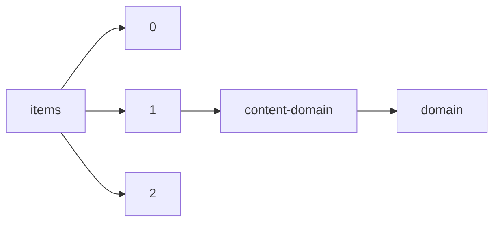

!!! warning "This document is not official Crossref documentation"
# Domain
PATH = items/array/content-domain/domain(1)  
Occurs 143 423 633 times  
{ .annotate }

1. A route to an element, for example:  
   The route "items/array/content-domain/domain" corresponds to navigating through the JSON indices as  
   ["items"][0]["content-domain"]["domain"]  

## Properties of Array
See information about elements: [items/array/content-domain/domain/array](array/index.md)  
Distribution of lengths:  

| **Row** | **Length** `Any` | **Count** `Int64` |
|--------:|--------------------:|---------------------:|
| **1**   | 0                   | 122 211 318          |
| **2**   | 1                   | 15 062 258           |
| **3**   | 2                   | 4 084 230            |
| **4**   | 3                   | 583 105              |
| **5**   | 4                   | 112 355              |
| **6**   | 5                   | 25 874               |
| **7**   | 6                   | 26 762               |
| **8**   | 7                   | 371 993              |
| **9**   | 8                   | 897 227              |
| **10**  | 9                   | 48 511               |

